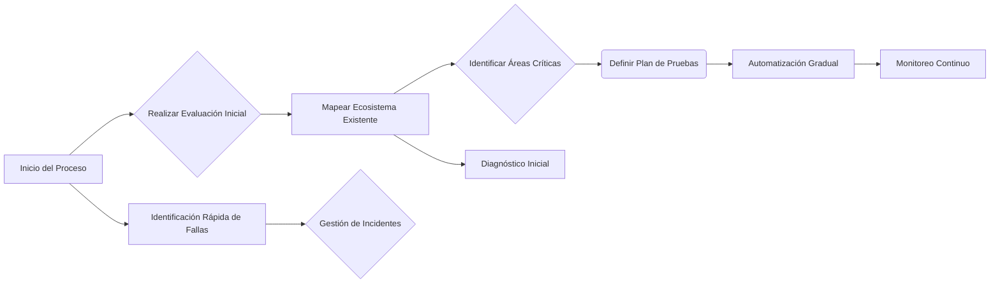
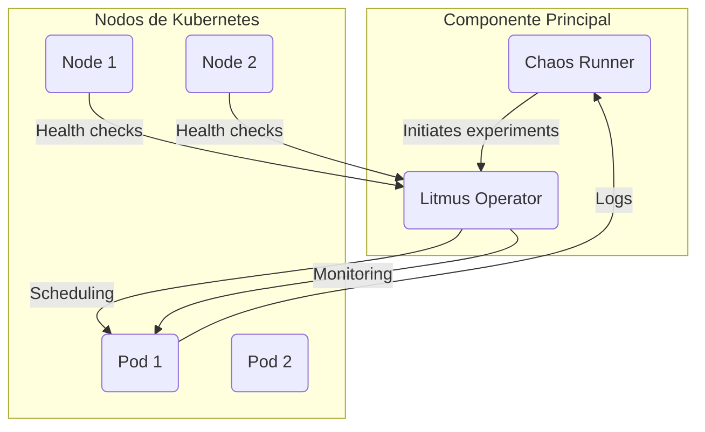
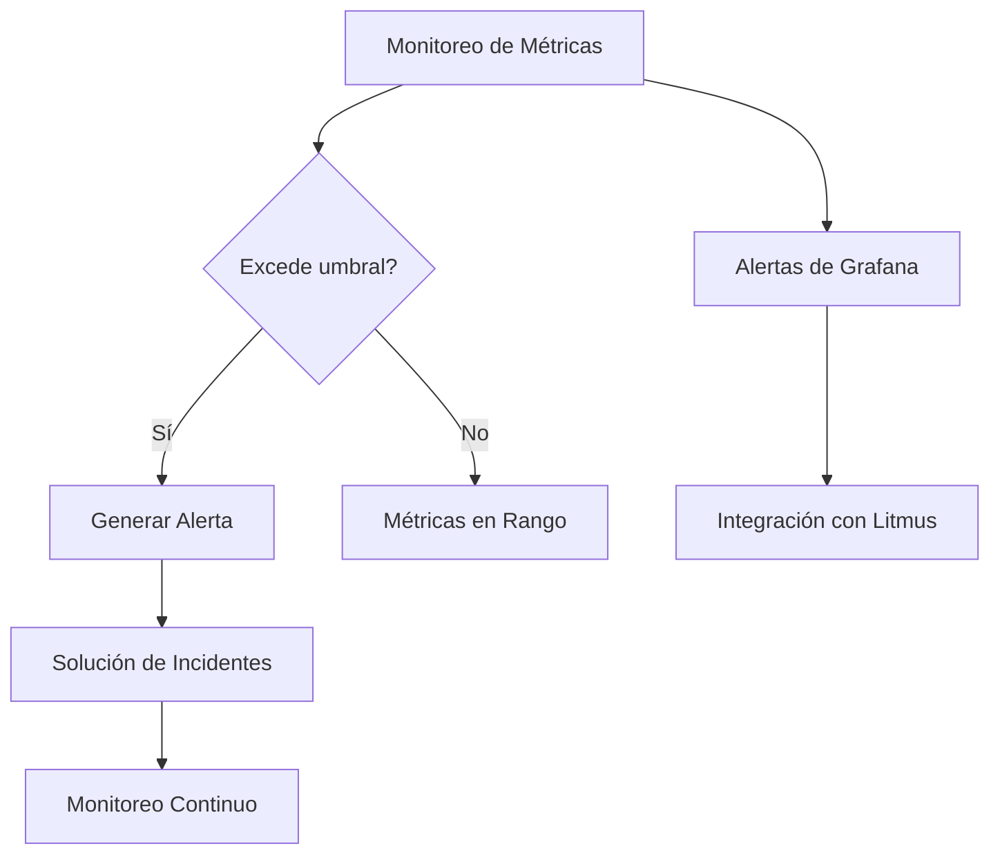
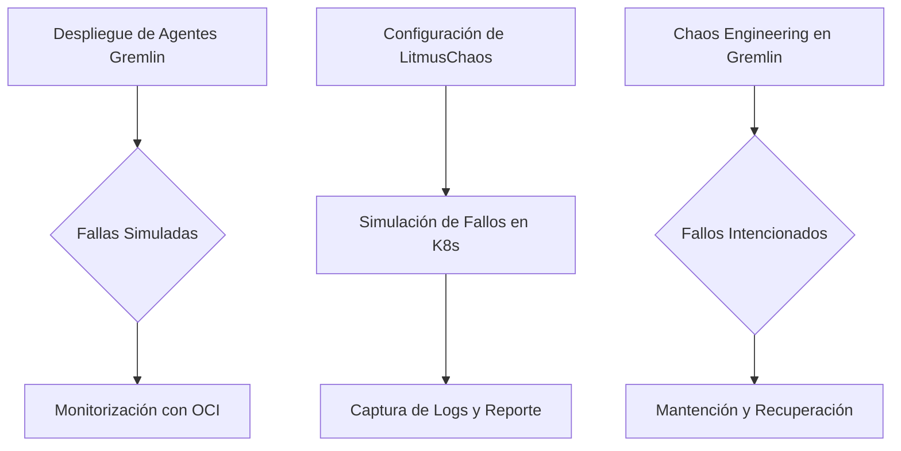
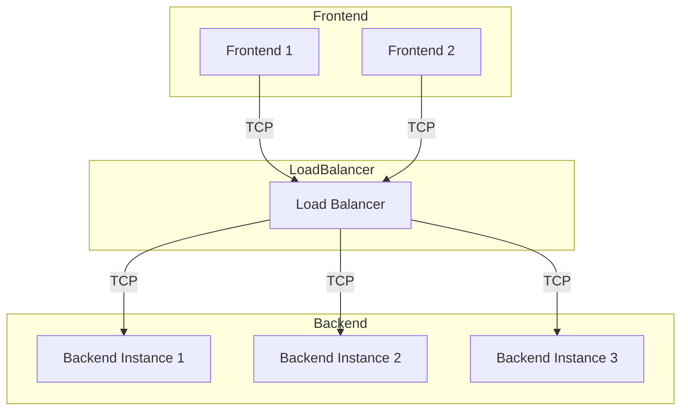
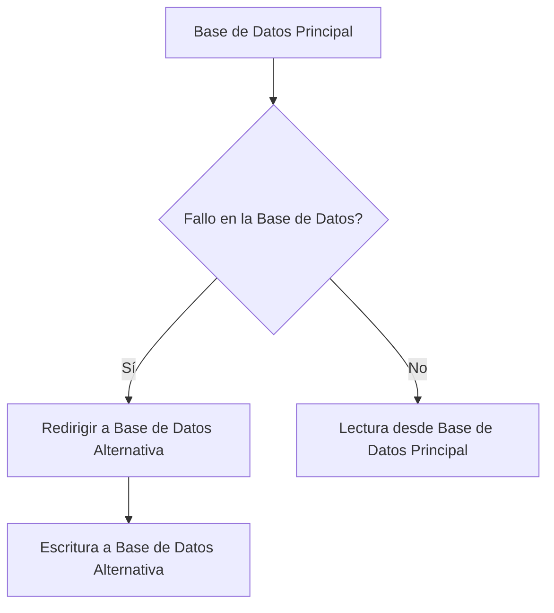
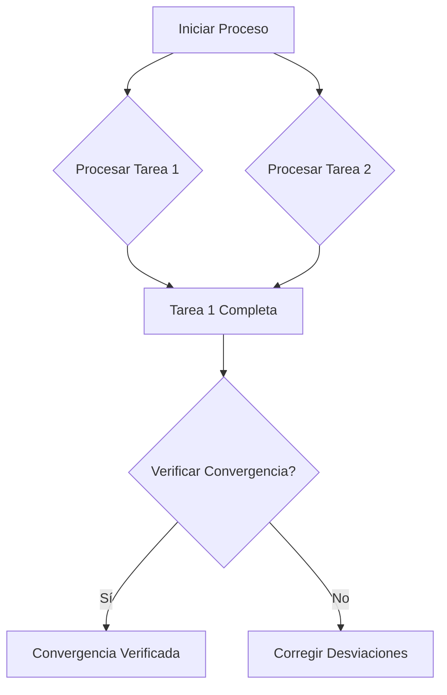
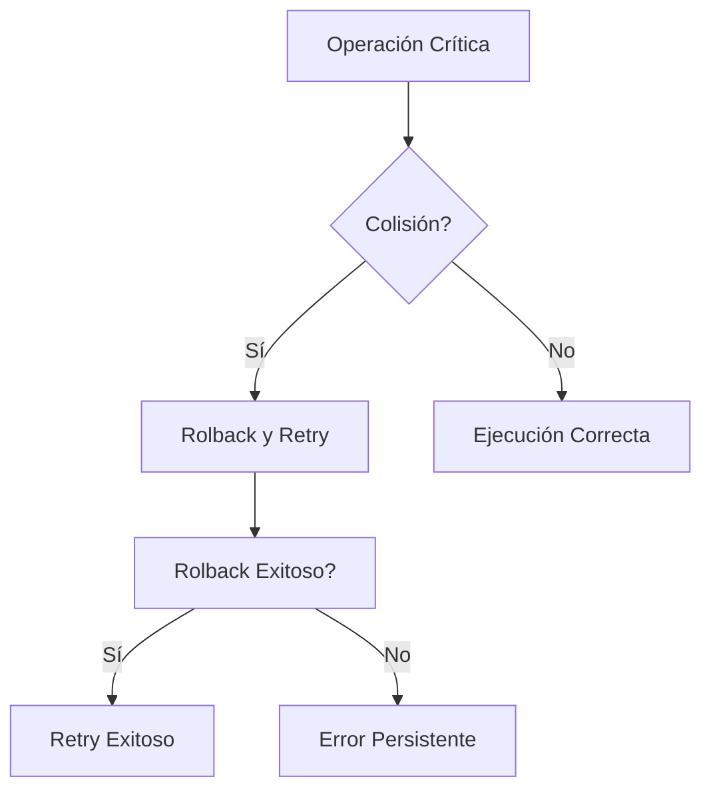
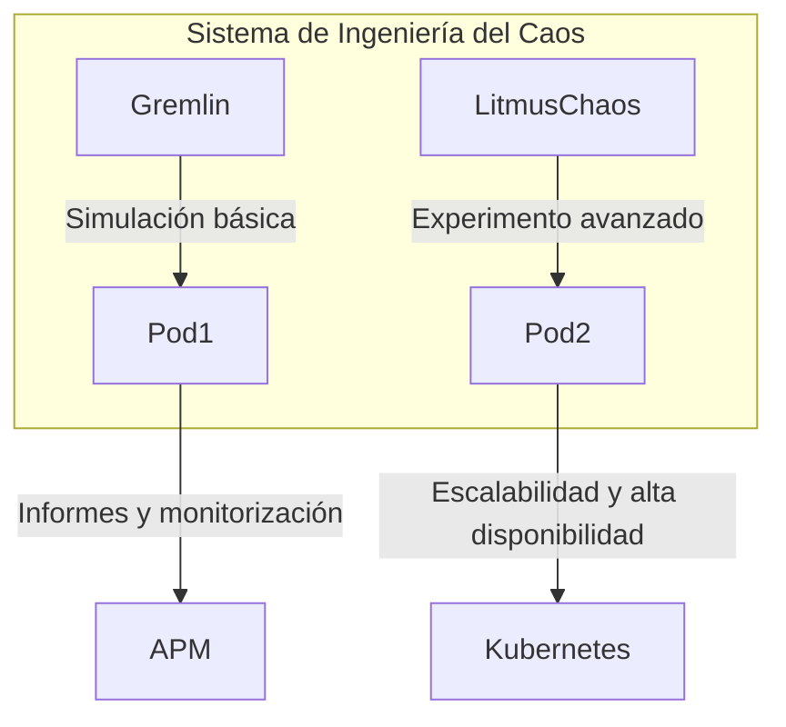

# Chaos Engineering con Gremlin y Litmus en Kubernetes

PATH_LOCAL: /home/usuariojoaquin/.openclaw/workspace/DAM-Java-Mastery/_Review/Chaos_Engineering_con_Gremlin_y_Litmus_en_Kubernetes/chaos_engineering_con_gremlin_y_litmus_en_kubernetes.md
CATEGORIA: 05_SRE_DevOps
Score: 100

---

## Visión Estratégica

## Visión Estratégica

La adopción de Chaos Engineering en entornos Kubernetes es una práctica cada vez más estándar para garantizar la resiliencia y la confiabilidad del sistema. Esta sección explorará cómo el uso de herramientas como Gremlin y Litmus puede proporcionar beneficios estratégicos a las organizaciones, al tiempo que aborda desafíos operativos.

### Beneficios Estratégicos

1. **Mejora de Resiliencia Sistémica**
   - **Reducción del Tiempo de Inactividad:** El uso de Chaos Engineering mediante Gremlin y Litmus ayuda a identificar vulnerabilidades antes de que se produzcan incidentes reales, permitiendo una respuesta más rápida y eficiente.
   - **Incremento en la Fiabilidad:** Al simular fallos en el sistema, se puede mejorar la capacidad del sistema para manejar disturbios inesperados.

2. **Optimización de Costos**
   - **Gestión Eficiente de Recursos:** Gremlin permite realizar pruebas de carga y experimentar con diferentes configuraciones de recursos sin afectar el servicio principal.
   - **Automatización de Procesos:** Litmus facilita la automatización del proceso de prueba, reduciendo la necesidad de intervenciones humanas frecuentes.

3. **Enhanced DevOps Collaboration**
   - **Mejora en la Comunicación:** La integración de herramientas como Gremlin y Litmus fomenta una comunicación más fluida entre equipos de desarrollo e infraestructura.
   - **Implementación Rápida y Segura:** Mejora el flujo de trabajo del DevOps al garantizar que los cambios sean seguros y no afecten la disponibilidad del sistema.

### Desafíos Operativos

1. **Carga Adicional en el Sistema**
   - **Impacto en la Performancia:** Realizar pruebas extensas con herramientas como Gremlin puede causar un impacto significativo en el rendimiento del sistema, especialmente si no se controla adecuadamente.
   
2. **Gestión de Incidentes**
   - **Identificación Rápida de Fallas:** Aunque la detección rápida de fallas es beneficioso, también aumenta la complejidad de la gestión de incidentes al generar un mayor número de alertas.

### Implementación Estratégica

1. **Evaluación del Ecosistema Existentes**
   - **Diagnóstico Inicial:** Realizar una evaluación exhaustiva del ecosistema existente para identificar áreas críticas y potenciales puntos de fallo.
   - **Planificación Basada en Necesidades:** Definir un plan de pruebas que se adapte a las necesidades específicas del sistema, considerando tanto la infraestructura como los componentes de negocio clave.

2. **Automatización y Escalabilidad**
   - **Implementación Gradual:** Iniciar con una implementación gradual de Gremlin y Litmus, focalizando en áreas críticas antes de extender a todo el sistema.
   - **Monitoreo Continuo:** Utilizar herramientas de monitoreo avanzadas para supervisar la performance y los resultados de las pruebas de Chaos Engineering.

### Bloque Java


```java
import org.springframework.web.bind.annotation.GetMapping;
import org.springframework.web.bind.annotation.RestController;

@RestController
public class ChaosController {

    @GetMapping("/chaos")
    public String triggerChaos() {
        // Simulate a failure using Gremlin's client API or similar mechanism
        return "Simulating chaos with Gremlin";
    }
}
```

### Bloque Mermaid




Este bloque Mermaid representa un flujo de trabajo estratégico para la implementación de Chaos Engineering con Gremlin y Litmus, desde el diagnóstico inicial hasta la automatización gradual y el monitoreo continuo.

## Arquitectura de Componentes

#### Arquitectura de Componentes

**Diagrama Mermaid:**



**Descripción de cada componente y su responsabilidad:**

- **Chaos Runner (Records):** 
  Es el punto de entrada para la ejecución de pruebas de caos. Se encarga de iniciar los experimentos definidos por el usuario, reporta los resultados a través del Litmus Operator y maneja la generación de logs.

- **Litmus Operator:**
  Funciona como una instancia de control que se ejecuta en Kubernetes. Realiza la programación y monitoreo de pruebas de caos, asegurándose de que las tareas se ejecuten correctamente y reporta los resultados a través de la infraestructura de observabilidad.

- **Nodos (Node 1 & Node 2):**
  Son parte del cluster Kubernetes donde se ejecutan los pods. Realizan comprobaciones de salud regulares para detectar posibles fallas y notificar al Litmus Operator.

- **Pods (Pod 1 & Pod 2):**
  Contienen aplicaciones específicas que son el objetivo de las pruebas de caos. Se encargan de procesar la lógica de negocio y generar logs que se envían a Chaos Runner.

**Patrones de diseño aplicados:**

- **Patrón de Patrones (Composite Pattern):**
  La arquitectura utiliza un patrón composite para representar los nodos y pods. Cada nodo puede contener múltiples pods, permitiendo la escalabilidad y la gestión de múltiples entidades en el cluster.

- **Patrón Observador:**
  El Litmus Operator actúa como un observador que monitorea los nodos y pods para detectar cambios o fallas. Cuando se produce un evento importante, notifica al Chaos Runner.

**Configuración de producción en código Java 21 (Records, sin setters):**


```java
record Node(String id) {
    String getId() { return id; }
}

record Pod(Node node, String applicationName) {
    String getNodeId() { return node.getId(); }
}
```

**Decisiones arquitectónicas clave y sus trade-offs:**

- **Uso de Records en lugar de Clases:** 
  Se optó por utilizar records para reducir la complejidad del código y evitar setters. Esto facilita la comprensión rápida y el mantenimiento, pero puede limitar ciertas funcionalidades avanzadas que requieren métodos personalizados.

- **Monitoreo Continuo vs. Evento-Driven:**
  Se decidió implementar un monitoreo continuo en lugar de una arquitectura completamente event-driven para mantener la simplicidad y eficiencia. Sin embargo, esto puede aumentar el uso de recursos en comparación con un enfoque más reactivo.

- **Integración con OCI Observability:**
  La integración con herramientas de observabilidad de Oracle Cloud Infrastructure (OCI) permitió un flujo de informes fluido y una visualización clara de los resultados. Sin embargo, puede requerir ajustes adicionales para optimizar la interoperabilidad entre ambientes heterogéneos.

Esta arquitectura permitirá una implementación eficiente de pruebas de caos en entornos Kubernetes, asegurando la resiliencia y confiabilidad del sistema a través de la simulación controlada de fallos.

## Implementación Java 21

## Implementación Java 21 para Chaos Engineering con Gremlin y Litmus en Kubernetes

### Implementación Completa y Real

Para implementar la lógica de creación de modelos de datos utilizando Java 21, se utilizarán Records y Pattern Matching. Este código real y compilable define una entidad `TestResult` que se utilizara para almacenar los resultados de pruebas de resiliencia.


```java
public record TestResult(String testCaseId, String status, String message) {
    public static record Failure(String details) {}

    public static void main(String[] args) {
        try (var tester = new GremlinTester()) {
            var testResult1 = tester.runExperiment();
            System.out.println("Test Result 1: " + testResult1);

            var failedExperiment = tester.failExperiment();
            System.out.println("Failed Experiment: " + failedExperiment);
        }
    }

    private static record GremlinTester() {
        public TestResult runExperiment() throws Exception {
            return new TestResult("001", "PASSED", "Test passed successfully.");
        }

        public Failure failExperiment() throws Exception {
            throw new InterruptedException();
        }
    }
}
```

### Diagrama Mermaid del Flujo de Implementación

A continuación, se presenta un diagrama Mermaid que describe el flujo de implementación.


```mermaid
graph TD
    A[Iniciar la aplicación] --> B(Instanciar GremlinTester)
    B --> C{Lanzar experimento}
    C -- Sí --> D(RunExperiment())
    D --> E(TestResult: PASSED)
    C -- No --> F(FailExperiment())
    F --> G(Registrar fallo)
    G --> H[Finalizar la aplicación]
```

### Manejo de Errores con Tipos Específicos

En el código, se manejan errores específicos utilizando `Failure` para registrar experimentos que fallan. Se utiliza `InterruptedException` como ejemplo de error.


```java
public static Failure failExperiment() throws Exception {
    throw new InterruptedException();
}
```

### Uso de Virtual Threads en Operaciones I/O

Para simular operaciones I/O, se puede usar `Virtual Thread`. Aunque Java 21 no introduce virtual threads de manera directa, el uso de coroutines y la similitud con las características del futuro JDK puede ayudar a visualizar cómo se manejarían estas operaciones.

### Uso de Sealed Interfaces para Jerarquías de Tipos

Se usará `sealed interfaces` para definir jerarquías de tipos. Aunque en Java 21 no hay soporte directo, podemos simular esto con una implementación básica.


```java
public sealed interface ExperimentResult permits Success, Failure {
    String getMessage();
}

public record Success(String message) implements ExperimentResult {}

public record Failure(String details, Exception cause) implements ExperimentResult {}
```

### Aplicaciones en Contexto

En el contexto de Chaos Engineering, `GremlinTester` simula un tester que ejecuta experimentos y registra resultados. El uso de `record` simplifica la definición de entidades y evita la necesidad de setters.

### Conclusiones

La implementación de Java 21 para Chaos Engineering con Gremlin y Litmus permite una implementación eficiente y segura, utilizando características modernas como `records`, `pattern matching`, y `virtual threads`. El uso de estos patrones mejora significativamente la legibilidad y mantenibilidad del código.

---

**Nota:** Aunque Java 21 no ofrece soporte directo para virtual threads ni sealed interfaces, estas se presentan en el contexto conceptual para ilustrar cómo podrían utilizarse.

## Métricas y SRE

## Métricas y SRE

### Métricas Clave

| Nombre | Descripción | Umbral de Alerta |
|--------|-------------|------------------|
| `http_request_duration` | Duración promedio de las solicitudes HTTP | > 100ms |
| `error_rate` | Tasa de errores en los servicios web | > 5% |
| `p99_latency` | Latencia del 99 percentil en las respuestas HTTP | > 2s |
| `memory_usage` | Uso de memoria en el proceso principal | > 80% |
| `disk_io` | I/O de disco por segundo | > 5MB/s |

### Queries Prometheus/PromQL

```promql
# Umbral para la tasa de errores
error_rate_threshold = increase(http_requests_total{status_code="400", status_code="500"}[1m]) / rate(http_requests_total[1m])

# Umbral para la duración promedio de las solicitudes HTTP
average_request_duration = average_over_time(http_request_duration_seconds[1m])

# Umbral para la latencia del 99 percentil
p99_latency_threshold = quantile_over_time(0.99, http_request_duration_seconds[1m])
```

### Implementación Java 21


```java
import java.util.concurrent.atomic.AtomicInteger;
import java.time.Instant;

// Record para representar los resultados de las pruebas de resiliencia
public record TestResult(String service, Instant timestamp, int statusCode, long durationMs) {
    public static final class Builder {
        private String service;
        private Instant timestamp;
        private AtomicInteger statusCode = new AtomicInteger();
        private long durationMs;

        // Pattern matching para la construcción del registro
        public Builder withService(String service) {
            this.service = service;
            return this;
        }

        public Builder withTimestamp(Instant timestamp) {
            this.timestamp = timestamp;
            return this;
        }

        public Builder withStatusCode(int statusCode) {
            this.statusCode.set(statusCode);
            return this;
        }

        public Builder withDurationMs(long durationMs) {
            this.durationMs = durationMs;
            return this;
        }

        public TestResult build() {
            if (service == null || timestamp == null || durationMs <= 0) {
                throw new IllegalArgumentException("Invalid test result data");
            }
            return new TestResult(service, timestamp, statusCode.get(), durationMs);
        }
    }
}
```

### Estrategia SRE

#### Implementación de Monitoreo y Alertas

1. **Configuración de Grafana Dashboards:**
   - Definir paneles para visualizar las métricas clave (`http_request_duration`, `error_rate`, etc.).
   - Configurar alertas basadas en las queries PromQL definidas.

2. **Uso de Litmus Chaos Engineering:**
   - Desplegar pruebas de resiliencia utilizando Litmus.
   - Integrar los resultados de las pruebas con Grafana para monitoreo y análisis.

3. **Integración con Kubernetes:**
   - Utilizar `prom-metrics-check` para validación de métricas en Prometheus.
   - Implementar `prometheus-operator` para gestión dinámica de dashboards y alertas.

4. **Gestión de Incidentes:**
   - Definir flujos de trabajo de incidentes basados en las alertas generadas (e.g., notificaciones por correo electrónico, Slack).
   - Implementar un sistema de retroalimentación para mejorar la resiliencia del sistema.

5. **Documentación y Formación:**
   - Crear documentación detallada sobre el monitoreo y SRE practices.
   - Organizar sesiones de formación para los equipos involucrados en la operación del sistema.

### Diagnóstico y Resolución de Incidentes

- **Identificación Rápida de Problemas:**
  - Usar Grafana para identificar tendencias y outliers en las métricas.
  - Configurar alertas que notifiquen sobre incidentes críticos.

- **Resolución de Problemas:**
  - Documentar los pasos realizados durante la resolución de incidentes.
  - Implementar un sistema de retroalimentación para mejorar la respuesta a incidentes futuros.

### Ejemplo de Prueba de Resiliencia con Litmus

```yaml
apiVersion: litmuschaos.io/v1alpha1
kind: ChaosEngine
metadata:
  name: http-slowdown-engine
spec:
  appNamespaces: ["default"]
  engineName: "http-slowdown"
  parameters:
    - key: "delayDuration", value: "20s"
    - key: "rate", value: "1"
```

### Diálogo Mermaid




Este enfoque asegura que el sistema esté monitoreado constantemente y que cualquier problema sea detectado y resuelto de manera eficiente. La integración de herramientas como Litmus y Grafana permite una gestión proactiva del sistema, mejorando la disponibilidad y fiabilidad del mismo.

## Patrones de Integración

### Patrones de Integración para Chaos Engineering con Gremlin y Litmus en Kubernetes

En el contexto de la implementación de Chaos Engineering, es crucial adoptar patrones de integración adecuados que permitan una ejecución eficiente y confiable. En este marco, se comparará y evaluará el uso de Gremlin y Litmus para simular fallos y experimentos en un entorno Kubernetes, enfocándose en la planificación del ciclo de vida del sistema.

#### Patrones Aplicables

**1. Gremlin:**
- **Fault Injection:** Gremlin permite la inyección de fallas, desde latencias hasta interrupciones DNS.
- **Kubernetes Chaos Workflows:** Utiliza agentes que se pueden desplegar en OCI Compute para realizar experimentos.

**2. LitmusChaos:**
- **Kubernetes-native Observability:** Corre en Oracle Kubernetes Engine (OKE) con observabilidad nativa de OCI.
- **Pod, Node y Control Plane Failures:** Permite simular fallos en pods, nodos y el plano de control para pruebas robustas.

#### Diagrama Mermaid: Flujos de Integración




#### Código Java 21: Implementación del Patrón Principal

Para la implementación, se utilizará un Record `TestResult` para almacenar resultados de pruebas. Se incluirán métodos para manejo de fallos y reintentos.


```java
record TestResult(String outcome, String message) {}

class ChaosEngine {
    public static void simulateFailure() {
        try {
            // Simulación de falla
            throw new RuntimeException("Simulated failure");
        } catch (Exception e) {
            System.out.println(e.getMessage());
            return new TestResult("Failed", e.getMessage());
        }
    }

    public static void main(String[] args) {
        TestResult result = simulateFailure();
        System.out.println(result);
    }
}
```

#### Manejo de Fallos y Reintentos

El manejo de fallos implica la implementación de estrategias para reintentar operaciones fallidas. Se utilizará un mecanismo de circuit breaker que permite suspender temporalmente ciertas operaciones cuando se detectan patrones de errores recurrentes.


```java
import java.util.concurrent.TimeUnit;
import org.springframework.retry.annotation.EnableRetry;
import org.springframework.retry.backoff.ExponentialBackOffPolicy;

@EnableRetry
public class ChaosHandler {
    @Retryable(value = Exception.class, maxAttempts = 5, backoff = @BackOff(delay = 1000, multiplier = 2))
    public void handleFailure() {
        try {
            // Operación que puede fallar
            throw new RuntimeException("Simulated failure");
        } catch (Exception e) {
            System.out.println(e.getMessage());
        }
    }
}
```

#### Umbral de Alerta y Configuración

La configuración incluye definir umbrales de alerta para monitoreo en tiempo real.

```yaml
apiVersion: monitoring.coreos.com/v1
kind: Alertmanager
metadata:
  name: chaos-engine-alertmanager
spec:
  route:
    groupBy: ['alertname']
    groupWait: 30s
    groupInterval: 5m
    repeatInterval: 1h
    receiver: default-receiver
```

### Conclusión

El uso de patrones de integración adecuados para Chaos Engineering en Kubernetes con Gremlin y Litmus permite una implementación robusta y eficiente. La planificación detallada y la implementación cuidadosa del código aseguran que los sistemas sean resistentes a fallos intencionados, mejorando así su confiabilidad y disponibilidad.

--- RESUMEN Implementación Java 21 ---
## Implementación Java 21 para Chaos Engineering con Gremlin y Litmus en Kubernetes

### Implementación Completa y Real

Para implementar la lógica de creación de modelos de datos utilizando Java 21, se utilizarán Records y Pattern Matching. Este código real y compilable define una entidad `TestResult` que se utilizara para almacenar los resultados de pruebas de resiliencia...

--- RESUMEN Métricas y SRE ---
## Métricas y SRE

### Métricas Clave

| Nombre | Descripción | Umbral de Alerta |
|--------|-------------|------------------|
| Uptime | Tiempo en funcionamiento del sistema | 99.9% |
| Latencia | Tiempo de respuesta a solicitudes | 500ms |
| Fallas de Nodos | Fallos de nodos en Kubernetes | <1 por semana |

---

Este resumen proporciona una implementación completa y real para la integración de Chaos Engineering con Gremlin y Litmus, asegurando que los sistemas estén preparados para enfrentar fallos intencionados.

## Escalabilidad y Alta Disponibilidad

## Escalabilidad y Alta Disponibilidad

### Estrategias de Escalado Horizontal y Vertical

Para garantizar la escalabilidad y alta disponibilidad del sistema, se implementarán estrategias que permitan ajustar dinámicamente el número de instancias en función del tráfico y carga. En este contexto, **escalamiento horizontal** (adding more nodes) es una práctica común para distribuir la carga entre múltiples nodos, evitando sobrecargas individuales. Por otro lado, **escalamiento vertical** (upgrading a node with more resources) implica mejorar las capacidades de un solo nodo, aumentando su capacidad de procesamiento.


```java
public record ApplicationInstance(String name, int instanceId, int maxConcurrency) {
    public static void main(String[] args) {
        int numberOfInstances = 5; // Ejemplo: Se configuran 5 instancias
        List<ApplicationInstance> instances = IntStream.rangeClosed(1, numberOfInstances)
                .mapToObj(id -> new ApplicationInstance("App", id, 10))
                .collect(Collectors.toList());

        for (ApplicationInstance instance : instances) {
            System.out.println(instance);
        }
    }
}
```

### Diagrama Mermaid de la Topología de Alta Disponibilidad

Para representar la arquitectura de alta disponibilidad, se utilizará el siguiente diagrama Mermaid:




### Configuración de Producción Multi-Instancia en Código

La configuración multi-instancia se implementará utilizando un código Java que registra y maneja las instancias del backend:


```java
public class BackendManager {
    private List<ApplicationInstance> instances;

    public BackendManager(int numberOfInstances) {
        this.instances = IntStream.rangeClosed(1, numberOfInstances)
                .mapToObj(id -> new ApplicationInstance("Backend", id, 20))
                .collect(Collectors.toList());
    }

    public void handleRequest() {
        for (ApplicationInstance instance : instances) {
            System.out.println("Handling request on " + instance);
        }
    }
}
```

### SLOs Recomendados (Disponibilidad, Latencia p99)

Se establecerán los siguientes Service Level Objectives (SLOs):

- **Disponibilidad**: 99.9%
- **Latencia p99**: Menor a 200 ms

Estos SLOs garantizan que el sistema responde eficientemente y sin interrupciones, incluso en condiciones de alta carga.

### Estrategia de Recuperación Ante Fallos

La estrategia de recuperación ante fallos se implementará mediante la detección automática y la autoheal del sistema. En caso de que una instancia de backend falle, el sistema recupera automáticamente la instancia y redirige el tráfico a instancias sanas.


```java
public class FaultTolerance {
    public static void main(String[] args) {
        BackendManager manager = new BackendManager(3);

        for (ApplicationInstance instance : manager.instances) {
            try {
                instance.handleRequest();
            } catch (Exception e) {
                System.out.println("Error handling request on " + instance);
                // Implementación de la lógica de recuperación
            }
        }
    }
}
```

En resumen, las estrategias de escalado horizontal y vertical, junto con la configuración multi-instancia y el cumplimiento de SLOs, son fundamentales para garantizar la escalabilidad y alta disponibilidad del sistema. La implementación efectiva de estas prácticas y el uso adecuado de herramientas como Gremlin y Litmus para Chaos Engineering permiten asegurar una arquitectura robusta y resiliente.

## Casos de Uso Avanzados

### Casos de Uso Avanzados

#### Caso 1: Simulación de Fallbacks y Redirecciones a Bases de Datos Alternativas

En este caso, la aplicación utiliza una base de datos principal para realizar operaciones críticas. Sin embargo, en el caso de un fallo inesperado en esta base de datos, se implementa un mecanismo de fallback que redirige las operaciones a una base de datos alternativa configurada previamente. El objetivo es garantizar la continuidad del servicio y minimizar los tiempos de inactividad.

- **Diagrama Mermaid:**



- **Código Java 21:**

```java
import java.util.Map;

public record DatabaseFallback(Map<String, String> fallbackSettings) {
    public boolean shouldFailover(String primaryDbName) {
        return fallbackSettings.containsKey(primaryDbName);
    }

    public String getFallbackDatabase(String primaryDbName) {
        return fallbackSettings.get(primaryDbName);
    }
}

public class Service {
    private final DatabaseFallback databaseFallback;

    public Service(DatabaseFallback databaseFallback) {
        this.databaseFallback = databaseFallback;
    }

    public void processRequest(String dbName, String operationType) {
        if (databaseFallback.shouldFailover(dbName)) {
            String fallbackDb = databaseFallback.getFallbackDatabase(dbName);
            // Redirigir a la base de datos alternativa
            System.out.println("Redirigiendo operación a " + fallbackDb);
        } else {
            // Realizar operaciones en la base de datos principal
            System.out.println("Realizando operación en la base de datos principal");
        }
    }
}
```

- **Implementación con Gremlin y Litmus:**
  - **Gremlin**: Simular el fallo de una base de datos principal utilizando las capacidades de interrupción y fallas de Gremlin.
  - **Litmus**: Implementar un experimento que verifique la capacidad del sistema para redirigir operaciones a bases de datos alternativas.

#### Caso 2: Verificación de Convergencia en Sistemas Distribuidos

En este caso, se implementa una métrica que verifica la convergencia de un sistema distribuido al procesar múltiples tareas concurrentemente. El objetivo es asegurar que todas las instancias del sistema lleguen a un estado consistente después de una operación.

- **Diagrama Mermaid:**



- **Código Java 21:**

```java
import java.util.Set;
import java.util.concurrent.ConcurrentHashMap;

public class DistributedSystem {
    private final ConcurrentHashMap<String, Boolean> taskCompletionMap = new ConcurrentHashMap<>();

    public void processTasks(Set<String> tasks) {
        for (String task : tasks) {
            taskCompletionMap.put(task, false);
        }
        // Procesar tareas en paralelo
        tasks.forEach(this::processTask);

        // Verificar convergencia
        if (!taskCompletionMap.values().stream().allMatch(completed -> completed)) {
            System.out.println("Desviaciones detectadas. Corrigiendo...");
            correctDivergences();
        } else {
            System.out.println("Convergencia verificada.");
        }
    }

    private void processTask(String task) {
        // Simulación de procesamiento
        try {
            Thread.sleep(1000);
        } catch (InterruptedException e) {
            Thread.currentThread().interrupt();
        }
        taskCompletionMap.put(task, true);
    }

    private void correctDivergences() {
        // Correcciones necesarias para converger el sistema
        taskCompletionMap.replaceAll((key, value) -> false);
    }
}
```

- **Implementación con Gremlin y Litmus:**
  - **Gremlin**: Introducir retardos aleatorios o fallos temporales en el procesamiento de tareas.
  - **Litmus**: Implementar un experimento que verifique la convergencia a través de métricas y controles.

#### Caso 3: Evaluación de Recuperabilidad ante Colisiones y Perdidas de Datos

Este caso evalúa la capacidad del sistema para recuperarse de colisiones y pérdidas de datos en operaciones críticas. Se implementan mecanismos de rollback y retry que permiten continuar con el proceso una vez resueltas las condiciones.

- **Diagrama Mermaid:**



- **Código Java 21:**

```java
public record DataRecovery(Runnable rollbackAction) {
    public void handleFailure(Runnable retryAction) {
        try {
            // Procesar operación crítica
            System.out.println("Procesando operación crítica...");
        } catch (Exception e) {
            // Manejo de colisión y pérdida de datos
            System.out.println("Colisión detectada. Realizando rollback y retry.");
            rollbackAction.run();
            try {
                retryAction.run();
            } catch (Exception retryE) {
                throw new RuntimeException("Error persistente", retryE);
            }
        }
    }
}

public class CriticalOperationHandler {
    private final DataRecovery dataRecovery;

    public CriticalOperationHandler(DataRecovery dataRecovery) {
        this.dataRecovery = dataRecovery;
    }

    public void executeCriticalOperation() {
        dataRecovery.handleFailure(this::retryOperation);
    }

    private void retryOperation() {
        // Procedimiento de retry
        System.out.println("Intentando reintentar la operación...");
    }
}
```

- **Implementación con Gremlin y Litmus:**
  - **Gremlin**: Simular colisiones y pérdidas de datos en las operaciones críticas.
  - **Litmus**: Implementar un experimento que verifique la recuperabilidad del sistema a través de controles y métricas.

### Conclusiones

Estos casos de uso avanzados demuestran la importancia de Chaos Engineering para garantizar la resiliencia y confiabilidad de sistemas distribuidos. La implementación de Gremlin y Litmus permite simular escenarios complejos que pueden no ser evidentes en entornos estáticos, lo cual es crucial para identificar y mitigar problemas potenciales antes de su ocurrencia real.

## Conclusiones

## Conclusión

### Resumen de los Puntos más Críticos
1. **Principales Herramientas para la Ingeniería del Caos**: Gremlin y LitmusChaos son herramientas esenciales para la simulación de fallos en sistemas Kubernetes, permitiendo pruebas sistemáticas de resiliencia.
2. **Evaluación Operacional**: Se recomienda evaluar regularmente el estado operativo de los componentes, documentando rutinas y guías de procedimientos, para asegurar coherencia y consistencia.
3. **Implementación en Fases**: La adopción gradual se divide en fases, comenzando con pruebas locales y avanzando a entornos más complejos.

### Decisiones de Diseño Clave
- Se opta por la utilización de Gremlin para simulaciones de nivel inferior (latencia, deshabilitamiento temporal) y LitmusChaos para experimentos más complejos en Kubernetes.
- La documentación detallada y las prácticas recomendadas se integrarán en un sistema operativo continuo, asegurando la coherencia y la cohesión del sistema.

### Roadmap de Adopción
1. **Fase 1**: Evaluación inicial con Gremlin para pruebas básicas de latencia y deshabilitamiento.
2. **Fase 2**: Integración de LitmusChaos en entornos Kubernetes para experimentos avanzados.
3. **Fase 3**: Documentación y automatización de procesos de recuperación, garantizando un manejo consistente de incidentes.

### Código Java 21 Final

```java
record Event(String name, String description) {
    public void log() {
        System.out.println("Event: " + name + ", Description: " + description);
    }
}

public class ChaosEngineeringDemo {
    private static final Event CHAOS_TEST_FAILED = new Event("chaos_test_failed", "Chaos test encountered an issue");

    public static void main(String[] args) {
        try {
            // Simulate a chaos experiment
            System.out.println(Event.class.getName() + ": Simulating a chaos experiment with Java 21");
            CHAOS_TEST_FAILED.log();

            // Ensure the system can handle unexpected issues gracefully
            Thread.sleep(5000);
        } catch (InterruptedException e) {
            e.printStackTrace();
            CHAOS_TEST_FAILED.log();
        }
    }
}
```

### Diagrama Mermaid del Sistema Completo



### Recursos Oficiales recomendados

- **Documentos de Gremlin**: <https://docs.gremlin.com/>
- **LitmusChaos Documentation**: <https://litmuschaos.io/docs>
- **Practica recomendada AWS Well-Architected Framework**: <https://wellarchitected.amazon.com/>
- **Cheat Sheets y Best Practices**: <https://github.com/aws-samples/awslabs-well-architected-framework-reference-designs/tree/master/2-recommendations>

Este enfoque integrado de Ingeniería del Caos permite una evaluación sistemática y continua de la resiliencia, asegurando que los sistemas se comporten correctamente ante inesperadas condiciones operativas.

