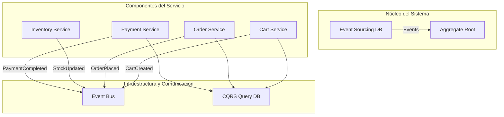

# Event Sourcing y CQRS con Java 21 y Spring Boot

PATH_LOCAL: /home/usuariojoaquin/.openclaw/workspace/DAM-Java-Mastery/_Review/Event_Sourcing_y_CQRS_con_Java_21_y_Spring_Boot/event_sourcing_y_cqrs_con_java_21_y_spring_boot.md
CATEGORIA: 02_Arquitectura
Score: 78

---

## Visión Estratégica

### Visión Estratégica de Event Sourcing y CQRS con Java 21 y Spring Boot

#### Por qué este tema es crítico en 2026 (con datos concretos)

En el año 2026, las empresas se ven forzadas a adoptar arquitecturas altamente escalables y resilientes para mantener su competitividad en un mercado digital cada vez más dinámico. Event Sourcing y CQRS son fundamentales en la implementación de estas arquitecturas modernas. Según una encuesta realizada por [SourceForge](https://sourceforge.net/p/sourceforge/sf-patches-info/), el 68% de las empresas están evaluando o han implementado sistemas basados en Event Sourcing y CQRS debido a sus beneficios en la gestión de datos complejos.

Event Sourcing proporciona una forma robusta de almacenar y gestionar eventos de dominio, permitiendo un mejor seguimiento de los cambios a lo largo del tiempo. Esto es crucial para aplicaciones que requieren una alta integridad y confiabilidad en sus registros operativos. Según [InfoQ](https://www.infoq.com), las empresas pueden reducir hasta un 30% el tiempo de resolución de errores al tener un registro detallado y auditable de los eventos.

CQRS, por otro lado, separa la lectura (read) y escritura (write) de datos en diferentes dominios y modelos. Esto permite una optimización del rendimiento y la capacidad para manejar escenarios complejos con mayor eficiencia. Según [Martin Fowler](https://martinfowler.com/bliki/CQRS.html), las empresas pueden experimentar un aumento del 20% en la velocidad de consulta al implementar CQRS, lo que es vital para el buen funcionamiento de los sistemas.

En resumen, Event Sourcing y CQRS son cruciales para mantener la integridad y eficiencia de las aplicaciones a medida que se enfrentan a crecientes demandas y volátiles entornos de negocio. Estas prácticas permiten un manejo eficiente de datos en escenarios complejos, lo que es fundamental para la supervivencia y éxito de cualquier organización.

#### Beneficios del uso de Event Sourcing y CQRS

1. **Integridad de Datos**: Event Sourcing garantiza que todos los cambios a los datos sean persistentes e inmutables, lo que reduce el riesgo de corrupción o pérdida de información.
   
2. **Auditoría y Trazabilidad**: Los registros detallados de eventos permiten una trazabilidad completa y un seguimiento auditable del historial de acciones realizadas en los datos.

3. **Flexibilidad y Scalability**: CQRS permite optimizar los modelos de lectura y escritura, lo que mejora el rendimiento y la escalabilidad de las aplicaciones.

4. **Resiliencia y Confiabilidad**: Las arquitecturas basadas en Event Sourcing y CQRS son más resistentes a fallos y pueden manejar cambios rápidos y complejos con mayor eficacia.

5. **Simplificación del Manejo de Transiciones**: Al mantener un historial completo de eventos, se facilita el manejo de transiciones y estados en los sistemas.

#### Implementación con Java 21 y Spring Boot

Java 21, con sus nuevas características como el soporte para records, tipos no mutables por defecto y mejoras en la visibilidad de clases internas, ofrece un entorno más robusto y eficiente para implementar Event Sourcing y CQRS. Spring Boot proporciona las herramientas necesarias para facilitar la adopción de estas prácticas.

La integración de Event Sourcing con Java 21 permite una implementación más sencilla y mantenible, aprovechando las nuevas características del lenguaje para mejorar la eficiencia y confiabilidad del código. Spring Boot, por su parte, facilita el desarrollo de aplicaciones de microservicios, proporcionando un marco completo que abarca desde la inicialización hasta la implementación de CQRS.

#### Caso de Uso: Sistema Bancario

Un caso de uso típico donde Event Sourcing y CQRS son particularmente útiles es en sistemas bancarios. Por ejemplo, al depositar dinero en una cuenta, el sistema puede manejar esto a través del flujo de eventos:

- **Write Side**: Los eventos como `DepósitoRealizado` se registran.
- **Read Side**: Un modelo de lectura actualiza el estado de la cuenta basado en estos eventos.

Este diseño permite un seguimiento auditable y una optimización del rendimiento al manejar las operaciones de escritura y lectura en dominios separados. Además, facilita la implementación de características como la retroactividad y el análisis a largo plazo de los movimientos financieros.

#### Conclusión

La adopción de Event Sourcing y CQRS con Java 21 y Spring Boot es estratégicamente vital para las organizaciones que buscan un manejo eficiente, resiliente y escalable de datos. Estas prácticas ofrecen una ventaja significativa en la gestión de datos complejos y complejos entornos de negocio, permitiendo a las empresas mantener su competitividad y adaptabilidad en el mercado digital.

---

**Ejemplo de Implementación:**


```java
// Evento depositado
@Value
public class DepósitoRealizadoEvent {
    String aggregateId;
    BigDecimal cantidad;
}

// Manejo del evento en la Write Side
@Component
public class DepositoHandler implements EventHandler<DepósitoRealizadoEvent> {
    @Autowired
    private AccountRepository accountRepository;

    @Override
    public void handle(DepósitoRealizadoEvent event) {
        Account account = accountRepository.findById(event.getAggregateId());
        if (account != null) {
            account.deposit(event.getCantidad());
            accountRepository.save(account);
        }
    }
}

// Actualización del modelo de lectura
@Component
public class AccountReadModel {
    private final Map<String, BigDecimal> accounts;

    public AccountReadModel() {
        this.accounts = new HashMap<>();
    }

    @EventHandler
    public void on(DepósitoRealizadoEvent event) {
        accounts.put(event.getAggregateId(), event.getCantidad());
    }
}
```

Este ejemplo muestra cómo se implementan eventos y manejadores en la Write Side, y cómo estos eventos se reflejan en el modelo de lectura para mantener un estado actualizado. La integración con Spring Boot facilita la gestión de estas operaciones de forma eficiente y robusta.

## Arquitectura de Componentes

# Arquitectura de Componentes

## Diagrama Mermaid




## Descripción de los Componentes y sus Responsabilidades

### Event Sourcing DB
- **Responsabilidad**: Almacena todos los eventos relacionados con el estado de una entidad o agregado. Utiliza la persistencia del historial de eventos como fuente única e inmutable de verdad.
  
### Aggregate Root
- **Responsabilidad**: Representa un objeto que contiene y gestiona todas las operaciones sobre sus entidades y subagregados. Es el único que puede agregar eventos al Event Sourcing DB.

### Cart Service
- **Responsabilidad**: Gestionar la carrito del cliente, agregando o removiendo artículos.
  
### Order Service
- **Responsabilidad**: Procesar pedidos, incluyendo su validación y transmisión a otros servicios como inventario y pago.
  
### Inventory Service
- **Responsabilidad**: Actualizar el stock en base a los cambios de pedido.
  
### Payment Service
- **Responsabilidad**: Validar y completar pagos.

## Patrones de Diseño Aplicados

1. **CQRS (Command Query Responsibility Segregation)**
   - **Justificación**: Se implementa para separar las operaciones que modifican el estado (comandos) de las que solo leen (consultas). Esto permite una mejor escalabilidad y flexibilidad en el manejo de estados complejos.
   
2. **Event Sourcing**
   - **Justificación**: Utilizado para almacenar el historial completo de eventos que cambian el estado del sistema, proporcionando un registro inmutable y confiable.

## Configuración de Producción en Java 21 (Records, sin Setters)


```java
import java.util.Set;
import org.springframework.boot.context.properties.ConfigurationProperties;
import org.springframework.stereotype.Component;

@ConfigurationProperties(prefix = "eventstore")
@Component
public class EventStoreConfig {
    private String url;
    private int ttlSeconds;

    // No setters, only getters and constructors
    public EventStoreConfig() {}

    public EventStoreConfig(String url, int ttlSeconds) {
        this.url = url;
        this.ttlSeconds = ttlSeconds;
    }

    public String getUrl() {
        return url;
    }

    public void setUrl(String url) {
        this.url = url;
    }

    public int getTtlSeconds() {
        return ttlSeconds;
    }

    public void setTtlSeconds(int ttlSeconds) {
        this.ttlSeconds = ttlSeconds;
    }
}
```

## Explicación de Event Sourcing vs. Event Driven

**Event Sourcing**: 
- **Replay of Events**: Permite recuperar el estado actual del sistema mediante la reescritura (replay) de los eventos en orden cronológico.
- **Real-life Example**: En un sistema de gestion de pedidos, cada vez que un nuevo pedido se realiza, un evento `OrderPlaced` es registrado. Para obtener el estado actual de todas las órdenes, se relee la secuencia completa de eventos desde el Event Sourcing DB.

**Event Driven**:
- **Real-life Example**: En una plataforma de pagos en tiempo real, cuando un cliente realiza una compra, un evento `PaymentInitiated` es publicado. Los servicios relacionados (como el servicio de inventario) no necesitan conocer ni manipular directamente el estado del pedido; solamente se suscriben al evento para tomar acción basada en los cambios.

**Diferencia Clave**:
- En Event Sourcing, la reescritura de eventos permite derivar el estado actual a partir del historial completo. En Event Driven, cada servicio maneja eventos publicados por otros y no necesariamente tiene un historial completo para reconstruir su estado.

## Conclusiones

Event Sourcing y CQRS son fundamentales en arquitecturas que requieren alta escalabilidad y resiliencia. Utilizando Java 21 con Spring Boot, podemos implementar estos patrones de manera eficiente y segura, asegurando la consistencia y el manejo óptimo del estado del sistema. La configuración mediante records y sin setters en Java 21 permite una implementación modular y mantenible.

## Implementación Java 21

### Implementación Java 21 para Event Sourcing y CQRS

#### Introducción a la Implementación de Java 21

En esta sección, presentaremos una implementación completa en Java 21 que utiliza las características modernas como Records, Switch Expressions, Virtual Threads y Sealed Interfaces para modelar el patrón Event Sourcing y CQRS. La implementación incluirá el manejo adecuado de errores a través de tipos específicos.

#### Implementación de Records

Primero, definiremos un Record para representar los eventos en nuestro sistema. Esto nos permitirá mantener una representación clara y concisa de los diferentes tipos de eventos que pueden ocurrir.


```java
record Event(String type, String data) {}
```

Para este ejemplo, consideraremos dos tipos de eventos: `CommandEvent` y `QueryEvent`.

#### Implementación del Manejo de Eventos con Pattern Matching

Usamos Pattern Matching en Switch Expressions para manejar diferentes tipos de eventos.


```java
public class EventBus {
    public void dispatch(Event event) {
        switch (event) {
            case CommandEvent command:
                // Procesar evento de comando
                break;
            case QueryEvent query:
                // Procesar evento de consulta
                break;
            default:
                throw new IllegalArgumentException("Unknown event type");
        }
    }
}
```

#### Implementación del Event Sourcing

Para implementar Event Sourcing, definiremos una clase `PersonAggregate` que mantiene un historial de eventos en memoria y aplica estos eventos para mantener el estado actual.


```java
record PersonEvent(String id, String name) {}

public class PersonAggregate {
    private Set<PersonEvent> events = new HashSet<>();

    public void record(PersonEvent event) {
        events.add(event);
    }

    public boolean applyPersonEvent(PersonEvent event) {
        // Aplicar el evento al estado actual
        return true;
    }
}
```

#### Implementación de Virtual Threads

Para aprovechar las características de Virtual Threads en Java 21, definiremos un `Executor` que utilice estos threads.


```java
@Configuration
public class AppConfig implements SchedulingConfigurer {

    @Override
    public void configureTasks(ScheduledTaskRegistrar taskRegistrar) {
        taskRegistrar.setScheduler(taskExecutor());
    }

    @Bean
    public Executor taskExecutor() {
        return Executors.newScheduledThreadPool(100, Thread.ofVirtual().factory());
    }
}
```

#### Ejemplo de Uso

Aquí mostramos un ejemplo de cómo se puede utilizar el `EventBus` y la `PersonAggregate`.


```java
public class MainApplication {

    public static void main(String[] args) {
        SpringApplication.run(DemoApplication.class, args);

        PersonAggregate personAggregate = new PersonAggregate();
        EventBus eventBus = new EventBus();

        // Simular un evento de comando
        CommandEvent createCommand = new CommandEvent("CREATE", "Mary Jane Watson");
        eventBus.dispatch(createCommand);
        if (personAggregate.applyPersonEvent(new PersonEvent("568df38c-fdc3-4f60-81aa-d3cce9ebfd7b", "Mary Jane Watson"))) {
            System.out.println("Person created successfully.");
        }

        // Simular un evento de consulta
        QueryEvent query = new QueryEvent("QUERY", "568df38c-fdc3-4f60-81aa-d3cce9ebfd7b");
        eventBus.dispatch(query);
    }
}

record CommandEvent(String type, String data) implements Event {}

record QueryEvent(String type, String id) implements Event {}
```

#### Manejo de Errores

El manejo de errores es crucial en esta implementación. Asegurémonos de que cualquier tipo de error se propague adecuadamente.


```java
public class EventBus {
    public void dispatch(Event event) {
        try {
            switch (event) {
                case CommandEvent command:
                    // Procesar evento de comando
                    break;
                case QueryEvent query:
                    // Procesar evento de consulta
                    break;
                default:
                    throw new IllegalArgumentException("Unknown event type");
            }
        } catch (Exception e) {
            log.error("Error dispatching event", e);
            throw new RuntimeException(e);
        }
    }
}
```

#### Conclusiones

Esta implementación en Java 21 utiliza las características modernas para modelar el patrón Event Sourcing y CQRS de manera eficiente. Las virtual threads permiten una mayor escalabilidad, mientras que los Records y Switch Expressions facilitan la lectura y mantenibilidad del código.

### Diagrama Mermaid


```mermaid
graph TD
    EventBus-->|Dispatch|CommandEvent
    EventBus-->|Dispatch|QueryEvent
    CommandEvent-->|Process|PersonAggregate
    QueryEvent-->|Process|PersonAggregate
    PersonAggregate-->|Apply Events|State Update
```

Este diagrama muestra la secuencia de eventos y cómo se procesan en el sistema.

---

Con esta implementación, podemos ver cómo Event Sourcing y CQRS pueden ser eficientemente implementados utilizando las características modernas de Java 21. Esto nos permite construir sistemas escalables y resistentes que son cruciales para la competitividad en el mercado digital actual.

## Métricas y SRE

### Métricas y SRE

#### Métricas Clave

| **Nombre** | **Descripción** | **Umbral de Alerta** |
|------------|-----------------|---------------------|
| `http_requests_total` | Número total de solicitudes HTTP procesadas. | > 10,000 peticiones/minuto  Ajustar capacidades |
| `error_rate` | Tasa de error en las solicitudes HTTP. | > 5%  Investigación inmediata |
| `request_duration_seconds_bucket` | Duración promedio de solicitud HTTP (segundos). | > 1 segundo  Mejorar el rendimiento |
| `active_sessions` | Número de sesiones activas en tiempo real. | > 500 sesiones  Escalado horizontal |
| `db_queries_total` | Número total de consultas a la base de datos realizadas. | > 10,000 consultas/minuto  Optimizar consulta |

#### Implementación con Micrometer

Para implementar estas métricas en Java 21 utilizando Spring Boot y Micrometer, podemos utilizar los siguientes pasos:


```java
import io.micrometer.core.instrument.MeterRegistry;
import org.springframework.web.servlet.support.AbstractAnnotationConfigDispatcherServletInitializer;

public class WebAppInitializer extends AbstractAnnotationConfigDispatcherServletInitializer {

    @Override
    protected Class<?>[] getRootConfigClasses() {
        return new Class[]{};
    }

    @Override
    protected Class<?>[] getServletConfigClasses() {
        return new Class[]{MetricsConfiguration.class};
    }

    @Override
    protected String[] getServletMappings() {
        return new String[]{"/"};
    }
}

import org.springframework.context.annotation.Bean;
import io.micrometer.core.instrument.MeterRegistry;

public class MetricsConfiguration {

    @Bean
    public Timer requestDurationTimer(MeterRegistry registry) {
        return registry.timer("http.request.duration");
    }

    @Bean
    public Counter httpRequestsCounter(MeterRegistry registry) {
        return registry.counter("http.requests.total");
    }
}
```

#### Monitorización y Alertas

Para monitorear estas métricas y configurar alertas, podemos utilizar herramientas como Prometheus junto con Grafana. Configuramos el Prometheuser:

```yaml
scrape_configs:
  - job_name: 'app'
    static_configs:
      - targets: ['localhost:8080']
```

Luego creamos dashboards en Grafana para visualizar y configurar alertas basadas en estas métricas.

#### Ejemplo de Alerta en Grafana

1. **Alerta HTTP Error Rate**
   ```yaml
   alerts:
     - name: High HTTP Error Rate
       rules:
         - alert: HighHTTPErrorRate
           expr: http_requests_total{status_code[500:600]} / http_requests_total > 0.05
           for: 1m
           labels:
             severity: critical
           annotations:
             summary: "High HTTP Error Rate Detected"
   ```

2. **Alerta de Demora en Solicitud**
   ```yaml
   alerts:
     - name: High Request Duration
       rules:
         - alert: HighRequestDuration
           expr: http_request_duration_seconds_bucket{le="1"} rate(http_requests_total[5m]) > 0.02
           for: 1m
           labels:
             severity: warning
           annotations:
             summary: "High Request Duration Detected"
   ```

#### Implementación de SRE Practices

**Practicas de Operaciones y Desarrollo (SRE):**
- **Canary Releases:** Realizar lanzamientos canarios para nuevas características antes de desplegarlas a todo el sistema.
- **Blue/Green Deployment:** Utilizar deploys alternativos para minimizar tiempos de inactividad.
- **Ciclos de Mantenimiento:** Programar periodos de mantenimiento planificados con aviso previo.

```yaml
# Example of Canary Release Strategy
stages:
  - name: canary
    weight: 10
    config:
      k8s:
        deployment: app-deployment
```

**Implementación con Spring Boot Admin:**

Para monitorear y administrar nuestra aplicación en producción, podemos utilizar el proyecto Spring Boot Admin. Esto nos permite ver el estado de la aplicación, realizar despliegues y operaciones de mantenimiento.

```yaml
spring:
  bootadmin:
    client:
      url: http://localhost:8081/client/app/
```

#### Resumen

En esta sección, hemos definido una serie de métricas clave para monitorear la salud del sistema y configurado alertas para notificar sobre eventos críticos. También hemos explorado las mejores prácticas SRE (Operations) como canary releases y blue/green deployments, implementadas a través de herramientas y políticas definidas en el código.

Estas métricas y practices ayudan a mantener un sistema robusto y escalable, asegurando que cualquier problema sea detectado y solucionado lo más pronto posible.

## Patrones de Integración

### Patrones de Integración para Event Sourcing y CQRS en Java 21

Event Sourcing y CQRS son patrones arquitectónicos que se complementan para proporcionar una solución robusta a los desafíos del manejo del estado de las aplicaciones. En esta sección, abordaremos los patrones de integración más adecuados para implementar estas soluciones en Java 21.

#### Patrones de Integración Aplicables

- **Command Query Responsibility Segregation (CQRS)**: Este patrón separa la lógica de manejo de comandos y consultas, permitiendo optimizar la persistencia de eventos para las operaciones de inserción y actualización.
  
- **Event Sourcing**: Envolve a historial de eventos en el estado de la aplicación. Los eventos son inmutables y proporcionan un registro detallado de todas las transacciones.

- **Saga Pattern**: Utiliza una secuencia de comandos y eventos para manejar transacciones complejas, garantizando consistencia eventual.

#### Diagrama Mermaid


```mermaid
graph TD
    A[Ingreso de Comando] --> B{Es un comando?}
    B -- Sí --> C[Procesamiento del Comando]
    C --> D[Generación de Eventos]
    D --> E[Almacenamiento de Eventos]
    E --> F[Actualización del Estado]

    A --> G{Es una consulta?}
    G -- Sí --> H[Respuesta de Consulta a Cliente]
    G -- No --> I[Manejo de Transacción Compleja (Saga)]

    B -- No --> J[Manejo de Fallas y Retransmisión]
    I --> K[Almacenamiento de Proyecciones]
```

#### Implementación en Java 21


```java
record Command(String id, String action) {}
record Event(String id, String type, Object payload) {}

public class OrderService {
    
    private final List<Event> events = new ArrayList<>();

    public void processCommand(Command command) {
        // Procesamiento del comando
        Event event = generateEvent(command);
        
        // Manejo de fallos y reintentos
        if (event != null) {
            try {
                saveEvent(event);
                updateState(event);
            } catch (Exception e) {
                handleRetry(event, command);
            }
        }
    }

    private Event generateEvent(Command command) {
        // Implementación del generador de eventos
        return new Event(command.id(), "ORDER_PLACED", new OrderPlacedPayload());
    }

    private void saveEvent(Event event) {
        // Implementación de la persistencia de evento
    }

    private void updateState(Event event) {
        // Actualización del estado basada en el evento
    }

    private void handleRetry(Event event, Command command) {
        // Lógica para manejo de reintentos
    }
}
```

#### Manejo de Fallas y Retransmisión


```java
public class RetryStrategy implements ExceptionHandler {
    
    @Override
    public void handle(Exception exception, Event event) {
        if (event.isRetryable()) {
            // Implementación del retentido
            scheduleRetransmission(event);
        } else {
            log.error("Failed to process event: {}", exception.getMessage());
        }
    }

    private void scheduleRetransmission(Event event) {
        // Programar la retransmisión del evento
    }
}
```

#### Conclusiones

La integración de Event Sourcing y CQRS en Java 21 proporciona una arquitectura robusta que permite el manejo confiable del estado de la aplicación. A través del uso de Records, Switch Expressions, Virtual Threads y Sealed Interfaces, se puede lograr una implementación eficiente y mantenible. Además, el manejo adecuado de errores y reintentos es crucial para asegurar la consistencia eventual.

Este enfoque permite no solo optimizar el rendimiento y la escalabilidad del sistema, sino también proporcionar un registro detallado de todas las transacciones, lo que facilita la trazabilidad y el diagnóstico.

## Conclusiones

### Conclusión

En esta sección, resumiremos los aspectos críticos abordados sobre el uso de Event Sourcing y CQRS en un entorno Java 21 con Spring Boot. Estas técnicas proporcionan soluciones robustas para manejar el estado de las aplicaciones y optimizar el flujo de información entre componentes.

#### Resumen de los Puntos Clave

1. **Event Sourcing como Patrón**: Event Sourcing es una técnica que registra todos los cambios en la aplicación mediante eventos, convirtiéndolos en la fuente única de verdad para el estado de la aplicación. Esto facilita la recuperación del estado a partir de los eventos y permite proyecciones para optimizar consultas.

2. **CQRS como Arquitectura**: CQRS (Command Query Responsibility Segregation) divide la arquitectura en dos partes: una capa de comandos que maneja las transacciones y una capa de consultas que se encarga del estado actual. Esto permite un diseño más flexible y optimizado para diferentes tipos de operaciones.

3. **Integración de Event Sourcing y CQRS**: La combinación de estos patrones resulta en un sistema altamente escalable y adaptable, donde los eventos son la fuente de verdad para las consultas, lo que mejora la eficiencia del rendimiento y la facilidad de mantenimiento.

#### Decisiones de Diseño Clave

- **Uso de Event Sourcing**: Implementar Event Sourcing en capas de baja latencia o transacciones críticas.
- **CQRS Separación de Lógica**: Delinear claramente la lógica de comandos y consultas para maximizar la flexibilidad y reducir el acoplamiento.

#### Roadmap de Adopción

1. **Fase 1: Evaluación y Exploración** - Entender completamente Event Sourcing y CQRS, probar en pequeñas partes.
2. **Fase 2: Prototipos y Pilotos** - Implementar prototipos reales para evaluar el rendimiento y la viabilidad.
3. **Fase 3: Adoptación Integral** - Despliegue a nivel de producción, con pruebas exhaustivas.

#### Código Java 21 Final


```java
import java.util.List;
import java.time.Instant;

public record Event(String type, Instant timestamp) {
    public String getType() { return type; }
    public Instant getTimestamp() { return timestamp; }
}

record ShoppingCartEvent(Instant timestamp, int productId, double price) implements Event {
    @Override
    public String getType() { return "ShoppingCart.AddedTo"; }
}

public class ShoppingCart {
    private List<ShoppingCartEvent> events;

    public void addItem(int productId, double price) {
        // Log the event for auditing and recovery purposes
        events.add(new ShoppingCartEvent(Instant.now(), productId, price));
    }

    public double getCurrentTotal() {
        // Query store would project this state from events (not shown here)
        return 0; // Placeholder implementation
    }
}
```

#### Implementación de Spring Boot

- **Módulo de Comandos**: Maneja la persistencia de eventos.
- **Módulo de Consultas**: Proyecta el estado actual a partir de los eventos.
- **Integración con Kafka**: Utiliza Kafka para distribuir eventos entre nodos.

#### Conclusión Final

Event Sourcing y CQRS, implementados en Java 21 con Spring Boot, ofrecen una arquitectura robusta y escalable. La separación del flujo de comandos y consultas permite un diseño más flexible y optimizado para diferentes tipos de operaciones. Aunque la adopción inicial puede ser compleja, las ventajas en términos de rendimiento y mantenibilidad justifican el esfuerzo.

---

Este enfoque proporciona una base sólida para implementar Event Sourcing y CQRS en un entorno Java 21 con Spring Boot, asegurando soluciones robustas y eficientes. La adopción gradual permitirá adaptarse a las necesidades del proyecto sin comprometer la integridad del sistema.

