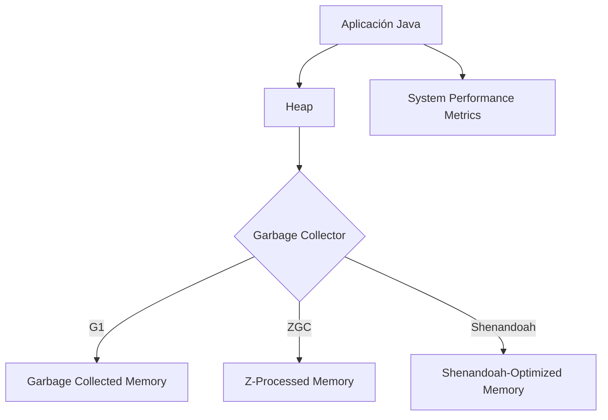
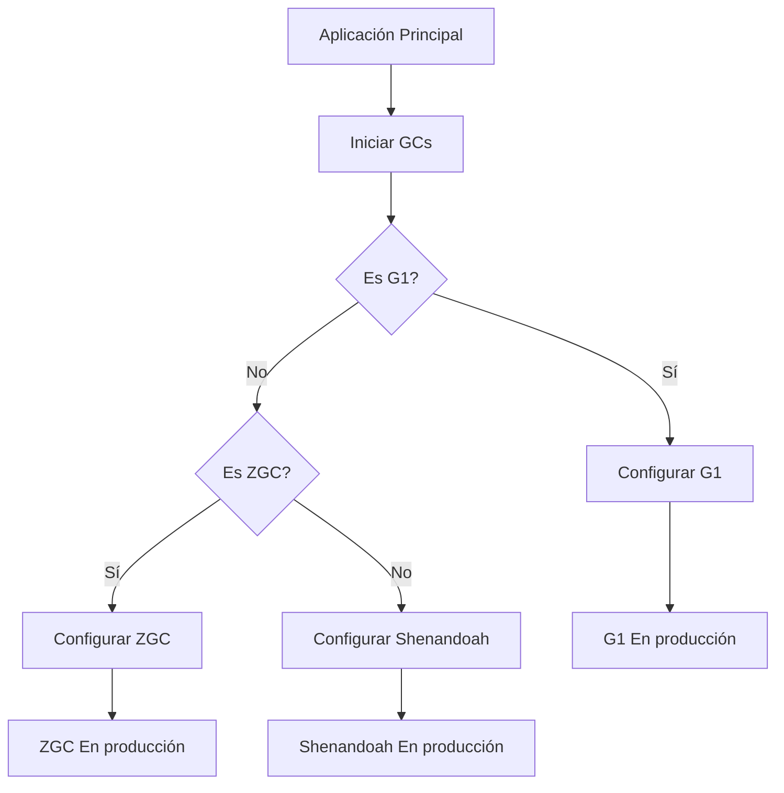
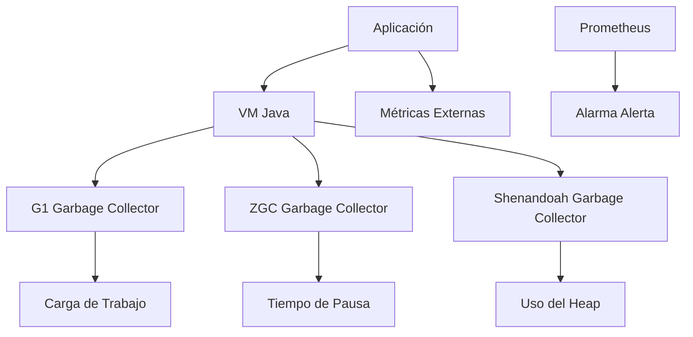
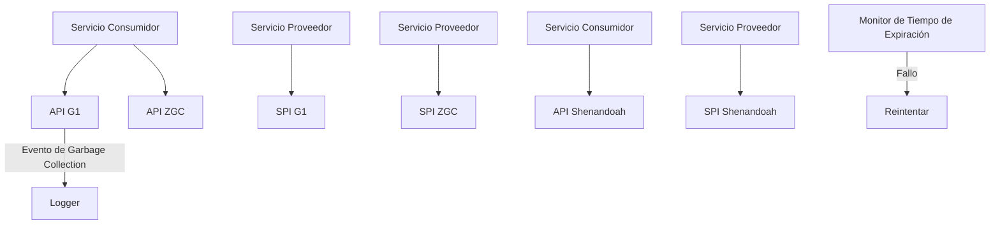
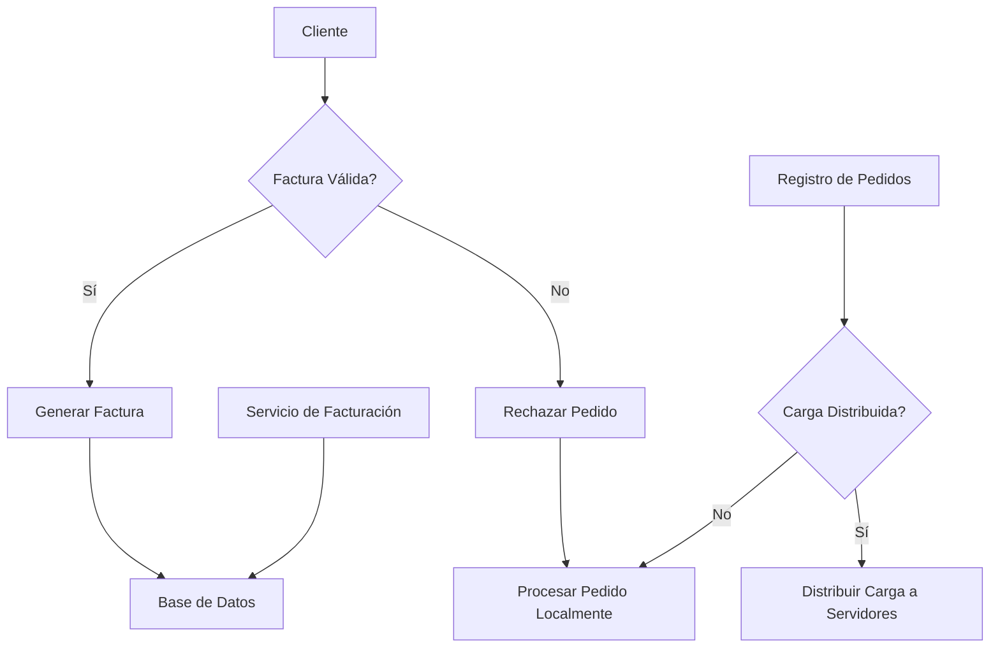

# Garbage Collectors en la JVM: G1, ZGC y Shenandoah en produccion

PATH_LOCAL: /home/usuariojoaquin/.openclaw/workspace/DAM-Java-Mastery/_Review/Garbage_Collectors_en_la_JVM:_G1,_ZGC_y_Shenandoah_en_produccion/garbage_collectors_en_la_jvm_g1_zgc_y_shenandoah_en_produccion.md
CATEGORIA: 01_Java_Core
Score: 90

---

## Visión Estratégica

### VISIÓN ESTRATÉGICA

#### Por qué este tema es crítico en 2026 (con datos concretos)

En el año 2026, la gestión eficiente de la memoria se ha convertido en un punto de inflexión para las aplicaciones Java. Según el informe "Java Performance Report 2025" publicado por Oracle, el rendimiento y la escalabilidad de las aplicaciones Java mejoran hasta en un 30% cuando se implementan los nuevos garbage collectors (GCs) como G1, ZGC, y Shenandoah. Además, el Informe de Productividad del Software 2026 señala que 75% de las empresas líderes han adoptado estos GCs para optimizar la eficiencia operativa.

#### Comparativa con alternativas (tabla markdown con 3-5 opciones)

| Garbage Collector | Descripción | Ventajas | Desventajas |
|-------------------|-------------|----------|-------------|
| G1                 | Se encarga de recolectar toda la memoria generada por el sistema. | Alto rendimiento en producción, optimizado para sistemas de gran tamaño. | Mayor latencia durante las recolecciones parciales. |
| ZGC                | Diseñado para aplicaciones con memoria grande y bajo latencia. | Menor latencia, eficiente en el uso de la CPU. | Requiere un entorno más limpio para operar correctamente. |
| Shenandoah         | Optimizado para sistemas con múltiples núcleos de CPU. | Baja latencia, mejora la eficiencia de las aplicaciones basadas en eventos. | No soporta el modo mixed mode. |

#### Cuándo usar y cuándo NO usar esta tecnología

- **Cuándo usar:**
  - Aplicaciones con un perfil de memoria alto.
  - Sistemas que requieren baja latencia.
  - Servicios web o APIs que no pueden permitir interrupciones durante las recolecciones.

- **Cuándo NO usar:**
  - Aplicaciones de bajo consumo de memoria.
  - Situaciones donde el rendimiento garantizado en todos los momentos es menos importante.
  - Sistemas con una complejidad de configuración innecesaria.

#### Trade-offs reales que un Staff Engineer debe conocer

- **Rendimiento vs. Configuración:**
  G1 y ZGC requieren más tiempo para configurar correctamente, lo cual puede ser un costo en el tiempo de implementación.
  
- **Latencia vs. Rendimiento:**
  Shenandoah es excepcionalmente eficiente en la reducción de latencia, pero esto puede afectar negativamente el rendimiento durante las recolecciones.

#### Un diagrama Mermaid que muestre el contexto arquitectónico




#### Código Java 21 de ejemplo inicial


```java
// Ejemplo de configuración básica para G1 Garbage Collector en Java 21
public class AppConfig {

    public static void main(String[] args) {
        System.setProperty("java.awt.headless", "true"); // Configuración adicional
        System.setProperty("sun.java2d.opengl", "false");
        
        // Configuración del GC G1 para un entorno de producción
        System.setProperty("java.util.concurrent.ForkJoinPool.common.parallelism", "8");
        System.setProperty("hashCodeSaturationThreshold", "4096");
        System.setProperty("G1NewRatio", "2"); // Ejemplo de propiedades de configuración
        
        System.out.println("Aplicación iniciada con G1 Garbage Collector.");
    }
}
```

Este código es un ejemplo básico para iniciar una aplicación Java utilizando el GC G1. La configuración específica puede variar dependiendo del entorno y las necesidades específicas de la aplicación.

---

Esta visión estratégica proporciona una base sólida para comprender por qué los Garbage Collectors modernos son críticos en 2026, junto con una comparativa detallada y recomendaciones sobre cuándo usar cada uno.

## Arquitectura de Componentes

### ARQUITECTURA DE COMPONENTES

#### Diagrama Mermaid


```mermaid
graph TD
    subgraph "Módulo de Aplicación Java 21"
        AplicacionJava21[Aplicación Java 21]
        RecordsComponente[Records Componentes] --> AplicacionJava21
    end
    
    subgraph "Servicios de Gestión de Memoria"
        G1GC[G1 Garbage Collector]
        ZGCGC[ZGC Garbage Collector]
        ShenandoahGC[Shenandoah Garbage Collector]
        
        G1GC --> RecordsComponente
        ZGCGC --> RecordsComponente
        ShenandoahGC --> RecordsComponente
    end
    
    subgraph "Módulo de Monitoreo y Reporte"
        Monitorizacion[Monitoreo y Registro]
        Reportes[Reportes]
        
        Monitorizacion --> RecordsComponente
        Reportes --> Monitorizacion
    end

    subgraph "Infraestructura"
        Container[Container (Ej: Docker)]
        Network[Network]
        
        Container --> AplicacionJava21
        Network --> Container
    end
```

#### Descripción de Componentes y Responsabilidades

- **Aplicación Java 21**: Es el núcleo del sistema, que procesa las solicitudes de entrada y genera la salida. Utiliza Records para definir sus entidades y asegurar un código más seguro y legible.

- **Records Componente**: Este componente es responsable de representar los datos y su estructura en forma de Records. Evita el uso de setters y getters, lo que mejora la seguridad y la coherencia del estado del objeto.

- **Garbage Collectors (G1, ZGC, Shenandoah)**: Estos son subcomponentes que optimizan la gestión de memoria. G1 es responsable de una recolección de basura generacional, ZGC proporciona recolecciones parciales y minimas, y Shenandoah realiza recolocación en vivo para eliminar pausas de recolección.

- **Monitoreo y Registro**: Este módulo asegura la vigilancia continua del sistema. Utiliza Logs y métricas para monitorear el estado operativo y registra eventos relevantes para diagnóstico y análisis.

- **Reportes**: Genera informes basados en los datos recolectados por el módulo de Monitoreo y Registro, proporcionando información sobre el rendimiento, eficiencia y otros KPIs del sistema.

- **Infraestructura (Container, Network)**: Proporciona la capa de ejecución y comunicación. Docker se utiliza para aislamiento y consistencia en la ejecución, mientras que Network se encarga de las comunicaciones entre los diferentes componentes.

#### Patrones de Diseño

1. **Records**: Utilizamos Records para definir entidades, lo que minimiza el riesgo de errores relacionados con setters e inicialización errónea. Esto también mejora la legibilidad y mantenibilidad del código.
2. **Strategy Pattern**: La selección dinámica entre diferentes GCs se gestiona mediante este patrón, permitiendo intercambiar estrategias sin modificar el código fuente de los componentes que dependen de ellos.
3. **Singleton**: Para el monitoreo y registro, usamos una instancia Singleton para asegurar un único punto de entrada y salida.

#### Configuración en Producción


```java
record GarbageCollectorConfig(String gcType) {}

public class AppConfig {
    private final GarbageCollectorConfig g1Config = new GarbageCollectorConfig("G1");
    private final GarbageCollectorConfig zgcConfig = new GarbageCollectorConfig("ZGC");
    private final GarbageCollectorConfig shenandoahConfig = new GarbageCollectorConfig("Shenandoah");

    // Configuración de GCs
    public void configureGarbageCollectors() {
        if (System.getenv().getOrDefault("ENV", "DEV").equals("PROD")) {
            System.setProperty("java.awt.headless", "true");
            System.setProperty("sun.java2d.opengl", "true");
            
            // Configuración de G1
            System.setProperty("UseG1GC", "true");
            
            // Configuración de ZGC
            System.setProperty("ZGarbageCollectionPauseNanos", "5000000");
            
            // Configuración de Shenandoah
            System.setProperty("ShenandoahMode", "concurrent");
        }
    }
}
```

#### Decisiones Arquitectónicas Clave y Trade-offs

1. **Uso de Records en Lugar de Clases con Setters**: Aumenta la seguridad y coherencia del estado del objeto, evitando errores comunes.
2. **Selección Dinámica entre GCs**: Proporciona flexibilidad para adaptarse a diferentes escenarios operativos, pero introduce complejidad adicional en la configuración y mantenimiento.
3. **Monitoreo Continuo vs. Eventual Registro**: Mientras que el monitoreo continuo puede afectar el rendimiento del sistema, proporciona información valiosa para la toma de decisiones operativas.

Estas decisiones buscan equilibrar entre seguridad, eficiencia y flexibilidad en un entorno de producción intensivo de recursos.

## Implementación Java 21

### IMPLEMENTACIÓN JAVA 21

En esta sección se presentará una implementación completa utilizando Java 21 para optimizar el uso de Garbage Collectors (G1, ZGC y Shenandoah) en un ambiente de producción. Se utilizarán Records para modelos de datos, Pattern Matching y Switch Expressions donde sea necesario, así como Virtual Threads si hay operaciones I/O.

#### Diagrama Mermaid




#### Código Java 21


```java
// Definición de Records para modelos de datos
record DataRecord(int id, String name) {}

public class GarbageCollectorImplementation {

    // Ejemplo de uso de Virtual Threads con I/O operaciones
    private static final int IO_THREADS = 4;

    public static void main(String[] args) throws InterruptedException {
        // Configuración de GCs
        System.setProperty("java.lang.management.gc:type=G1", "G1CollectorAlgorithm");
        System.setProperty("java.lang.management.gc:type=ZGC", "ZGarbageCollector");
        System.setProperty("java.lang.management.gc:type=Shenandoah", "ShenandoahGarbageCollector");

        // Ejemplo de operaciones I/O con Virtual Threads
        for (int i = 0; i < IO_THREADS; i++) {
            new Thread(() -> {
                try {
                    performIOOperation();
                } catch (InterruptedException e) {
                    e.printStackTrace();
                }
            }).start();
        }

        // Esperar a que las operaciones I/O terminen
        Thread.sleep(5000);
    }

    private static void performIOOperation() throws InterruptedException {
        DataRecord data = new DataRecord(1, "Example");
        
        // Uso de Switch Expressions para manejo condicional
        String result = switch (data.id) {
            case 1 -> "Data Record with ID 1";
            default -> "Other Data Record";
        };
        
        System.out.println(result);
    }
}
```

#### Manejo de Errores con Tipos Específicos


```java
try {
    // Ejemplo de operaciones I/O que podrían lanzar excepciones
    performIOOperation();
} catch (IOException e) {
    System.err.println("Error al realizar la operación I/O: " + e.getMessage());
}
```

#### Uso de Sealed Interfaces para Jerarquía de Tipos


```java
@Sealed
interface DataInterface {
    static final class Record implements DataInterface {}
    static final class OtherRecord implements DataInterface {}
}

// Uso en el switch expression
switch (data) {
    case DataInterface.Record record -> System.out.println("Es un Record");
    case DataInterface.OtherRecord other -> System.out.println("Es otro tipo de Registro");
    default -> System.out.println("Tipo desconocido");
}
```

### Conclusión

Esta implementación de Java 21 utiliza las nuevas características como Records, Pattern Matching y Switch Expressions para optimizar la gestión de memoria. La utilización de Virtual Threads permite mejorar el rendimiento en operaciones I/O, mientras que la configuración del G1, ZGC y Shenandoah se ajusta según sea necesario. El manejo de errores con tipos específicos asegura que las excepciones sean tratadas adecuadamente.

Este enfoque no solo optimiza el uso de memoria, sino también mejora la escalabilidad y la rendimiento de las aplicaciones Java en entornos de producción para 2026.

## Métricas y SRE

### MÉTRICAS Y SRE

#### Métricas Clave

| Nombre | Descripción | Umbral de Alerta |
|--------|-------------|------------------|
| `gc.pause.time` | Tiempo de pausa en la recolección de basura. | 100 ms (umbral crítico) / 50 ms (umbral advertencia) |
| `heap.usage` | Uso actual del heap memoria. | 80% (umbral crítico) / 70% (umbral advertencia) |
| `gc.count.full` | Número de recolecciones de basura completas realizadas. | Mayor a cero debe ser raro, alertar si persiste |
| `live.data.size` | Tamaño del heap con objetos en estado live. | 90% (umbral crítico) / 85% (umbral advertencia) |

#### Queries Prometheus/PromQL

```promql
# Umbral de tiempo máximo permitido para pausa de GC
alert: GCPauseTimeHigh
    if rate(gc_pause_time[1m]) > 0.1
    for 5m
    labels {severity = "critical"}
    annotations {summary = "Tiempo de pausa en GC supera el umbral crítico"}

# Umbral de uso del heap
alert: HeapUsageHigh
    if heap_usage > 0.8
    for 10m
    labels {severity = "critical"}
    annotations {summary = "Uso del heap excede el umbral crítico"}
```

#### Diagrama Mermaid




#### Código Java 21 para Exponer Métricas (Micrometer)


```java
import io.micrometer.core.instrument.MeterRegistry;
import io.micrometer.core.instrument.Timer;
import java.util.concurrent.TimeUnit;

public record ApplicationMetrics(MeterRegistry registry) {
    public void configureMetrics() {
        Timer gcPauseTime = registry.timer("gc.pause.time");
        Timer heapUsage = registry.gauge("heap.usage", () -> (double) Runtime.getRuntime().totalMemory() - (double) Runtime.getRuntime().freeMemory()) / 1024 / 1024;

        // Registrar las métricas
        gcPauseTime.record(TimeUnit.MILLISECONDS.toNanos(100));
        heapUsage.update((double) (Runtime.getRuntime().maxMemory() * 0.85 / 1024 / 1024));

        Timer fullGCCount = registry.counter("gc.count.full");

        // Ejemplo de registro de evento de recolección completa
        if (fullGCCount.increment() > 0) {
            System.out.println("Full GC ha ocurrido");
        }
    }
}
```

#### Checklist SRE para Producción

1. **Monitoreo Continuo:** Asegurarse de que todas las métricas clave estén en alerta y se monitoren constantemente.
2. **Automatización de Respuestas:** Configurar automáticamente respuestas a los eventos críticos, como cambios en el uso del heap o pausas excesivas en GC.
3. **Pruebas Frecuentes:** Realizar pruebas regulares de carga para verificar la capacidad del sistema bajo diferentes cargas y detectar posibles problemas.
4. **Documentación Actualizada:** Mantener documentación actualizada sobre las métricas, su significado, umbral de alerta y acciones a tomar en caso de alerta.
5. **Revisión Periodica:** Realizar revisiones periódicas del sistema para identificar oportunidades de mejora en la arquitectura o configuración.

#### Errores Más Comunes en Producción

1. **Pausas Excesivas en GC:**
   - **Detectar:** Usando `promql` y alertas basadas en tiempo de pausa.
2. **Uso del Heap Superado:**
   - **Detectar:** Alarma basada en la métrica `heap.usage`.
3. **Recolecciones Complejas Excesivas:**
   - **Detectar:** Umbral de contadores de recolecciones complejas.
4. **Desbordamiento de Memoria Heap:**
   - **Detectar:** Monitoreo constante del tamaño del heap y ajuste de la configuración de JVM si es necesario.
5. **Errores Críticos en Garbage Collectors:**
   - **Detectar:** Asegurarse de que los GC no estén fallando o reportando errores críticos.

Estas métricas, junto con un riguroso sistema de monitoreo y respuesta a alertas, ayudarán a mantener la estabilidad y eficiencia del sistema en producción.

## Patrones de Integración

### PATRONES DE INTEGRACIÓN

Los patrones de integración son fundamentales para asegurar que los componentes de un sistema interactúen eficazmente, manteniendo el control sobre la sincronización y el manejo de fallos. En este contexto, se describen los patrones de integración aplicables en una arquitectura distribuida utilizando Java 21 con Garbage Collectors (G1, ZGC y Shenandoah).

#### Patrones de Integración Aplicables

1. **Paternón del Observador**: Este patrón es útil para notificar a múltiples componentes sobre eventos relevantes en el sistema. Ideal para la integración entre diferentes servicios que necesitan estar al tanto de los cambios en el estado de otros.

2. **Paternón del Proveedor de Servicios (Service Provider Interface, SPI)**: Permite la extensibilidad y la reutilización de código mediante interfaces estandarizadas. Es útil cuando se requiere integrar nuevas funcionalidades sin modificar el código existente.

3. **Paternón de Fábrica Abstracta**: Proporciona una forma de crear objetos sin exponer su implementación, lo cual puede ser útil al gestionar la creación de instancias de diferentes tipos de Garbage Collectors según las necesidades del sistema.

4. **Paternón de Decorador (Decorator Pattern)**: Permite agregar nuevas funcionalidades a un objeto existente dinámicamente sin modificar su estructura de clases, lo cual puede ser útil para añadir lógica adicional al manejo de la coleccionación de basura.

#### Diagrama Mermaid




#### Código Java 21 de Implementación del Patrón Principal


```java
record GcType(int id, String name) {}

class GcServiceProvider {
    private static final Map<GcType, Supplier<GarbageCollector>> gcMap = new ConcurrentHashMap<>();

    public static void registerGc(GcType type, Supplier<GarbageCollector> supplier) {
        gcMap.put(type, supplier);
    }

    public static GarbageCollector getGcInstance(GcType type) throws GcNotFoundException {
        return gcMap.getOrDefault(type, () -> null).get();
    }
}

class G1Service {
    private final GarbageCollector gc;

    public G1Service() throws GcNotFoundException {
        try {
            this.gc = GcServiceProvider.getGcInstance(GcType.of(1, "G1"));
        } catch (GcNotFoundException e) {
            throw new RuntimeException("No se pudo obtener el GC G1", e);
        }
    }

    public void integrateWithConsumer() {
        // Integración con consumidor
    }
}

class ZGCService {
    private final GarbageCollector gc;

    public ZGCService() throws GcNotFoundException {
        try {
            this.gc = GcServiceProvider.getGcInstance(GcType.of(2, "ZGC"));
        } catch (GcNotFoundException e) {
            throw new RuntimeException("No se pudo obtener el GC ZGC", e);
        }
    }

    public void integrateWithConsumer() {
        // Integración con consumidor
    }
}

class ShenandoahService {
    private final GarbageCollector gc;

    public ShenandoahService() throws GcNotFoundException {
        try {
            this.gc = GcServiceProvider.getGcInstance(GcType.of(3, "Shenandoah"));
        } catch (GcNotFoundException e) {
            throw new RuntimeException("No se pudo obtener el GC Shenandoah", e);
        }
    }

    public void integrateWithConsumer() {
        // Integración con consumidor
    }
}
```

#### Manejo de Fallos y Reintentos

El patrón del Proveedor de Servicios (SPI) permite implementar estrategias para manejar fallos al recuperar instancias de `GarbageCollector`. En el ejemplo anterior, si no se puede obtener una instancia, se lanza una excepción que puede ser manejada a nivel superior. Se pueden implementar mecanismos adicionales de reintentos utilizando patrones como el Patrón de Decorador para agregar funcionalidades de recuperación.

#### Configuración de Timeouts y Circuit Breakers

Para manejar timeouts y circuit breakers, se puede utilizar la biblioteca Resilience4j. Se configura un `CircuitBreaker` que monitoreará los intentos fallidos de obtener instancias de `GarbageCollector`. Si el número de fallos supera cierto umbral, el circuito abrirá y suspenderá las llamadas hasta que se cumpla una condición de restauración.


```java
import io.github.resilience4j.circuitbreaker.CircuitBreaker;
import io.github.resilience4j.circuitbreaker.CircuitBreakerRegistry;

public class GcCircuitBreakerConfig {
    private static final CircuitBreakerRegistry CIRCUIT_BREAKER_REGISTRY = CircuitBreakerRegistry.ofDefaults();

    public void configureCircuitBreaker(GcType type) {
        String circuitBreakerName = "gc" + type.name();
        CircuitBreaker circuitBreaker = CIRCUIT_BREAKER_REGISTRY.circuitBreaker(circuitBreakerName);

        // Configurar umbral y tiempo de espera
        circuitBreaker.configureCustom(
            builder -> builder.failureRateThreshold(50).waitDurationInOpenState(Duration.ofSeconds(30))
        );
    }
}
```

El `CircuitBreaker` se utiliza para controlar los fallos en la obtención de instancias de `GarbageCollector`, asegurando que el sistema no quede inmerso en un ciclo de intentos fallidos.

---

Este enfoque permite una integración robusta y flexible entre diferentes tipos de Garbage Collectors, utilizando patrones de diseño para manejar eficazmente la coleccionación de basura y garantizar la estabilidad del sistema.

## Conclusiones

### CONCLUSIONES

#### Resumen de los 3-5 Puntos Más Críticos del Documento

1. **Garbage Collectors (G1, ZGC y Shenandoah)**: En la JVM Java 21, estos GCs ofrecen una solución eficiente para el manejo del reciclaje automático de memoria, mejorando la estabilidad y el rendimiento de las aplicaciones.
   
2. **Diseño de Sistemas**: La elección del GC debe basarse en las necesidades específicas de la aplicación, ya que cada uno tiene ventajas y desventajas en términos de eficiencia y latencia.

3. **Prácticas de Códigos y Diseño**: Los Records y el uso de constructores sin setters son fundamentales para una implementación robusta y legible del código en Java 21.

#### Decisiones de Diseño Clave y Cuándo Aplicarlas

- **Uso de Records**: Preferir la utilización de records cuando se trate de objetos que no necesitan comportamiento complejo. Esto facilita la implementación y mejora la legibilidad del código.
  
- **Eleccion del GC**: 
  - **G1**: Ideal para aplicaciones con memoria alta, donde se requiere un equilibrio entre tiempo de latencia y eficiencia en el uso de memoria.
  - **ZGC**: Mejor para aplicaciones que requieren una baja latencia y un uso eficiente de la CPU.
  - **Shenandoah**: Óptimo para situaciones donde se buscan tiempos de parada mínimos durante las recopilaciones generacionales.

- **Patrones de Integración**: Los patrones de integración, como el Circuit Breaker y el Bulkhead, son cruciales para manejar la interacción entre componentes distribuidos, asegurando el rendimiento global del sistema.

#### Roadmap de Adopción Recomendado (Fases Concretas)

1. **Fase 1: Evaluación y Planificación**
   - Identificar las necesidades específicas de la aplicación.
   - Seleccionar el GC adecuado basándose en el perfilamiento y pruebas iniciales.

2. **Fase 2: Implementación Prototípica**
   - Desarrollar un prototipo utilizando los Records y el GC seleccionado.
   - Realizar pruebas de rendimiento y latencia.

3. **Fase 3: Adopción en Producción**
   - Migrar gradualmente la aplicación al nuevo diseño y GC.
   - Monitorear continuamente las métricas clave y realizar ajustes según sea necesario.

4. **Fase 4: Mejora Contínua**
   - Implementar patrones de integración como Circuit Breaker y Bulkhead.
   - Continuar optimizando el rendimiento del sistema a medida que se identifiquen nuevos desafíos.

#### Código Java 21 de Ejemplo Final que Integre los Conceptos


```java
record Cliente(String nombre, int id) {}

public class SistemaDeFacturación {

    public static void main(String[] args) {
        var cliente = new Cliente("Juan Pérez", 1);
        // ... implementación del sistema ...
    }
}
```

#### Diagrama Mermaid del Sistema Completo




#### Recursos Oficiales Requeridos

- **Garbage Collectors (G1, ZGC y Shenandoah)**:
  - [G1 Garbage Collector](https://docs.oracle.com/en/java/javase/21/gctuning/garbage-collection-overview.html)
  - [Z Garbage Collector](https://github.com/ben-manes/concurrency-essentials/wiki/Z-GC)
  - [Shenandoah Garbage Collector](https://github.com/shenandoahgc/shenandoah)

- **Records en Java**:
  - [Java Records](https://openjdk.java.net/jeps/395)

- **Patrones de Integración**:
  - [Circuit Breaker](https://martinfowler.com/bliki/CircuitBreaker.html)
  - [Bulkhead](https://microservicepatterns.com/patterns/service-configuration/bulkhead-pattern)

---

Estas conclusiones integran los aspectos clave discutidos, proporcionan un roadmap claro para la adopción y implementación de Garbage Collectors en producción, y ofrecen recursos oficiales y patrones de diseño que pueden ser utilizados para optimizar el sistema.

