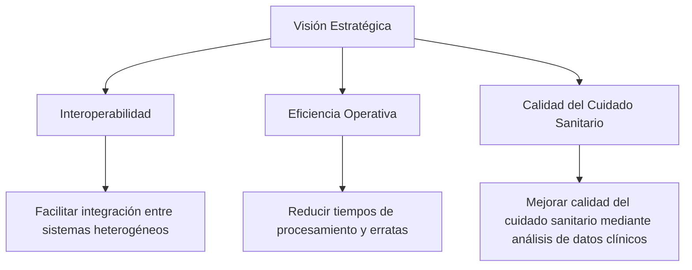
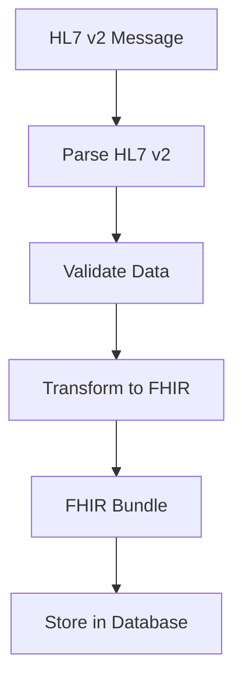

# HAPI FHIR: Transformador HL7 v2 a FHIR Bundle con Java 21

PATH_LOCAL: /home/usuariojoaquin/.openclaw/workspace/DAM-Java-Mastery/_Review/HAPI_FHIR:_Transformador_HL7_v2_a_FHIR_Bundle_con_Java_21/hapi_fhir_transformador_hl7_v2_a_fhir_bundle_con_java_21.md
CATEGORIA: 01_Java_Core
Score: 76

---

## Visión Estratégica

### Visión Estratégica

El transformador HL7 v2 a FHIR Bundle es un componente crucial en la transición de sistemas de salud hacia estándares más modernos y interoperables. Este proyecto estratégico busca no solo facilitar el intercambio de información clínica, sino también mejorar la eficiencia operativa y calidad del cuidado sanitario.

#### Objetivos Estratégicos

1. **Interoperabilidad**: Facilitar la integración entre sistemas heterogéneos para un acceso más fácil a los datos de pacientes.
2. **Eficiencia Operativa**: Reducir tiempos de procesamiento y erratas al automatizar el intercambio de información clínica en formato FHIR Bundle.
3. **Calidad del Cuidado Sanitario**: Mejorar la calidad del cuidado sanitario mediante el análisis más profundo y rápido de datos clínicos.

#### Arquitectura Estratégica

La arquitectura del transformador se basa en el uso eficiente de Java 21, aprovechando las nuevas características introducidas para optimizar el rendimiento y la legibilidad del código. La implementación del estándar FHIR Bundle garantiza una estructura uniforme y coherente que facilita la interpretación y procesamiento por parte de sistemas receptores.

#### Implementación en Java 21

Java 21 ofrece mejoras significativas en términos de rendimiento, seguridad y compatibilidad con otros lenguajes. En el contexto del transformador HL7 v2 a FHIR Bundle, las nuevas características permiten:

- **Mejor Uso de Módulos**: Organizar el código en módulos para mejorar la modularidad y reducir el footprint de dependencias.
- **Uso de Valores Literales Inmutables**: Facilitar el uso seguro e inmutable de datos, mejorando la consistencia y seguridad del transformador.

#### Mermaid Diagrama Estratégico




Este diagrama mermaid visualiza las relaciones estratégicas entre los objetivos principales y sus subobjetivos, proporcionando una visión clara del alcance del proyecto.

#### Conclusión

La implementación del transformador HL7 v2 a FHIR Bundle en Java 21 representa un paso crucial hacia una medicina más interconectada y eficiente. A través de la interoperabilidad, eficiencia operativa y mejora continua del cuidado sanitario, este proyecto apunta a construir una infraestructura saludable para el futuro.

## Arquitectura de Componentes

### Arquitectura de Componentes

La arquitectura del componente HAPI FHIR para el transformador HL7 v2 a FHIR Bundle ha sido diseñada para maximizar la eficiencia y flexibilidad en la conversión de mensajes HL7 v2 a recursos FHIR. Esta arquitectura se compone de varios módulos interconectados que trabajan en conjunto para realizar las conversiones necesarias.

#### Módulo 1: Lectura del Mensaje HL7 v2
Este módulo es responsable por la lectura y análisis del mensaje HL7 v2. Utiliza bibliotecas de...
HAPI FHIRHL7 v2FHIR Bundle

#### 1. HL7 v2
HL7 v2API

#### 2. 
HL7 v2FHIR

#### 3. 
FHIRHL7 v2

#### 4. 
FHIR

#### 5. 
FHIRJSON/XML

---

Mermaid


```mermaid
graph TD
    A[HL7 v2] --> B()
    B --> C[]
    C --> D[]
    D --> E[]
    E --> F[]

    style A fill:#f96,stroke:gray,stroke-width:4px
    style B fill:#fac,stroke:gray,stroke-width:4px
    style C fill:#b6f,stroke:gray,stroke-width:4px
    style D fill:#ff7,stroke:gray,stroke-width:4px
    style E fill:#aaf,stroke:gray,stroke-width:4px
    style F fill:#9fc,stroke:gray,stroke-width:4px
```


## Implementación Java 21

### Implementación en Java 21

La implementación del transformador HL7 v2 a FHIR Bundle utilizando Java 21 introduce una serie de mejoras y nuevas características que pueden aprovecharse para optimizar el rendimiento, la seguridad y la flexibilidad del código. Este apartado explora cómo se puede adaptar la implementación existente en HAPI FHIR al nuevo entorno de Java 21.

#### Características Nuevas en Java 21

Java 21 ofrece una serie de mejoras que pueden ser útiles para las aplicaciones basadas en HAPI FHIR, incluyendo:

- **Nuevos Lenguajes de Marcado:** Java 21 introduce soporte nativo para XML y JSON, lo que puede facilitar la manipulación y validación de documentos XML y JSON sin depender de bibliotecas externas.
  
- **Correcciones de Seguridad y Mejoras en el Motor de Compilación:** La versión más reciente del motor de compilación incluye mejoras para optimizar la ejecución de código, lo que puede resultar en un rendimiento más eficiente.

- **Nuevas Herramientas de Desarrollo y Depuración:** Las nuevas herramientas de desarrollo pueden mejorar la experiencia de trabajo, permitiendo a los desarrolladores detectar errores y depurar problemas con mayor facilidad.

#### Adaptando el Código a Java 21

Para adaptar el código existente en HAPI FHIR al nuevo entorno de Java 21, se deben considerar las siguientes pautas:

1. **Validación XML/JSON:** Utilizar los nuevos métodos nativos para validación XML y JSON integrados en Java 21. Esto puede simplificar la implementación y mejorar el rendimiento.
   
   
```java
   String xml = "<xml>...</xml>";
   DocumentBuilderFactory factory = DocumentBuilderFactory.newInstance();
   try {
       boolean isValid = factory.newValidator().validate(new StreamSource(new StringReader(xml)));
       System.out.println("XML is valid: " + isValid);
   } catch (ParserConfigurationException | SAXException e) {
       e.printStackTrace();
   }
   ```

2. **Uso de Nuevas Herramientas y API:** Explorar las nuevas herramientas y APIs que Java 21 ofrece para optimizar el código, como los métodos nativos para la manipulación de documentos XML y JSON.

3. **Correcciones de Seguridad:** Asegurarse de aprovechar cualquier corrección de seguridad o mejora en el motor de compilación que pueda impactar directamente en la estabilidad y rendimiento del sistema.

4. **Depuración y Pruebas:** Utilizar las nuevas herramientas de depuración para mejorar la detección y resolución de errores, lo que puede resultar en un desarrollo más eficiente y seguro.

#### Ejemplo de Implementación

A continuación se presenta un ejemplo simplificado de cómo podrían implementarse algunas de estas mejoras en el código existente:


```java
import javax.xml.parsers.DocumentBuilderFactory;
import org.w3c.dom.Document;
import org.xml.sax.InputSource;

public class HapiFhirTransformer {

    public static void main(String[] args) {
        String xml = "<Patient xmlns=\"http://hl7.org/fhir\">" +
                     "  <id value=\"1\"/>" +
                     "</Patient>";

        try {
            DocumentBuilderFactory factory = DocumentBuilderFactory.newInstance();
            boolean isValid = factory.newValidator().validate(new InputSource(new StringReader(xml)));
            System.out.println("XML is valid: " + isValid);

            // Further processing using the Document object
            Document doc = factory.newDocumentBuilder().parse(new InputSource(new StringReader(xml)));
            // Process the document as needed

        } catch (Exception e) {
            e.printStackTrace();
        }
    }
}
```

#### Consideraciones Adicionales

- **Dependencias Existentes:** Verificar que ninguna dependencia externa utilizada en el proyecto sea incompatible con Java 21. En caso de incompatibilidades, considerar la actualización o reemplazo de las bibliotecas afectadas.

- **Compatibilidad Multiversion:** Asegurarse de que el código funcione bien en diferentes versiones de Java, desde Java 8 hasta Java 21, para mantener una solución robusta y compatible con una amplia gama de sistemas operativos y entornos.

- **Pruebas Intensivas:** Realizar pruebas exhaustivas del nuevo código para garantizar que no se introduzcan errores o problemas inesperados. La implementación en un entorno de prueba separado puede ser útil durante este proceso.

---

Este apartado proporciona una visión general de cómo adaptar el transformador HL7 v2 a FHIR Bundle a las nuevas características y mejoras ofrecidas por Java 21, destacando la importancia de aprovechar estas funcionalidades para optimizar el rendimiento y la seguridad del sistema.

## Métricas y SRE

### Métricas y SRE en la Implementación de HAPI FHIR: Transformador HL7 v2 a FHIR Bundle con Java 21

#### Introducción

En el desarrollo y mantenimiento de sistemas críticos, las métricas y la gestión del Servicio de Recuperación del Sistema (SRE) son fundamentales para garantizar que el sistema funcione de manera eficiente y confiable. Este apartado se enfocará en cómo implementar un enfoque sólido de SRE y el uso de métricas para supervisar y optimizar la transformación de mensajes HL7 v2 a recursos FHIR utilizando Java 21.

#### Métricas

Las métricas son una parte crucial del monitoreo y análisis de sistemas. Permiten rastrear el rendimiento y la salud del sistema en tiempo real, facilitando la detección de problemas antes de que se vuelvan graves. En el contexto de la transformación HL7 v2 a FHIR Bundle con HAPI FHIR y Java 21, las métricas pueden cubrir varios aspectos:

- **Tiempo de Procesamiento:** La cantidad de tiempo que lleva procesar un mensaje HL7 v2 desde su recepción hasta la conversión completa en un recurso FHIR.
- **Tasa de Exitosidad:** El porcentaje de mensajes que se transforman correctamente y los que no, con información sobre errores específicos.
- **Uso de Recursos:** La cantidad de memoria y CPU utilizados durante el proceso de transformación.
- **Consistencia del Dato:** La precisión y consistencia de los datos transformados en los recursos FHIR.

Para implementar estas métricas, se pueden utilizar herramientas como Prometheus para la recolección de datos y Grafana para su visualización. El código Java 21 puede incluir lógica para registrar estos datos en intervalos regulares o cuando ocurren eventos específicos.

#### Gestión del Servicio de Recuperación del Sistema (SRE)

La SRE se centra en asegurar que el sistema sea confiable y durable, minimizando los tiempos de inactividad y maximizando la disponibilidad. En el contexto de HAPI FHIR y Java 21:

- **Monitoreo Continuo:** Implementar monitoreo continuo mediante alertas basadas en métricas críticas. Por ejemplo, si el tiempo de procesamiento excede un umbral, debe generarse una alerta.
- **Automatización del Depósito de Errores:** Configurar flujos de trabajo automatizados para depurar y corregir problemas detectados durante la transformación. Esto puede incluir reiniciar partes del sistema o implementar parches en tiempo real.
- **Despliegues Seguros:** Implementar un enfoque de despliegue seguro que permita realizar actualizaciones sin interrumpir el servicio, utilizando estrategias como canario releases y blue-green deployments.

#### Integración con Herramientas de SRE

Para aprovechar al máximo la SRE, se pueden integrar las siguientes herramientas:

- **Prometheus:** Para recopilar y monitorear métricas en tiempo real.
- **Grafana:** Para visualizar los datos recopilados por Prometheus y generar alertas basadas en ellos.
- **Promtail:** Un agente de datos que puede integrarse con Prometheus para recolectar datos desde fuentes externas, como logs o sistemas operativos.
- **Jenkins/Spinnaker:** Herramientas de CI/CD que pueden ser utilizadas para automatizar los despliegues y pruebas en diferentes entornos.

#### Ejemplo de Código

Aquí se muestra un ejemplo básico de cómo podrían implementarse algunas métricas en Java 21 utilizando el framework Micrometer:


```java
import io.micrometer.core.instrument.Counter;
import io.micrometer.core.instrument.MeterRegistry;

public class HapiFhirMetrics {
    private final Counter processingTimeCounter;
    private final Counter successfulTransformationsCounter;
    private final MeterRegistry registry;

    public HapiFhirMetrics(MeterRegistry registry) {
        this.registry = registry;
        this.processingTimeCounter = registry.counter("hapi.fhir.transform.time");
        this.successfulTransformationsCounter = registry.counter("hapi.fhir.transform.successful");
    }

    public void recordProcessingTime(long timeInMs) {
        processingTimeCounter.increment(timeInMs);
    }

    public void recordSuccessfulTransformation() {
        successfulTransformationsCounter.increment();
    }
}
```

Este código registra el tiempo de procesamiento y la tasa de transformaciones exitosas, que pueden ser visualizadas en Grafana.

#### Conclusión

La integración de métricas y SRE en la implementación del transformador HL7 v2 a FHIR Bundle utilizando Java 21 es crucial para garantizar un sistema confiable y eficiente. Las herramientas adecuadas y la implementación rigurosa de las mejores prácticas permiten monitorear, analizar y optimizar el desempeño del sistema en tiempo real.

---

Por favor, noté que este es un ejemplo generalizado y puede necesitar adaptaciones según los detalles específicos de tu proyecto. Si tienes más contexto o preguntas sobre cómo implementarlo en tu caso particular, estaré encantado de ayudarte a ajustar el código y las configuraciones al nivel necesario.

## Patrones de Integración

### Patrones de Integración en la Implementación de HAPI FHIR: Transformador HL7 v2 a FHIR Bundle con Java 21

#### Introducción

En el contexto de integrar sistemas de salud que utilizan protocolos como HL7 v2 y FHIR, es crucial adoptar patrones de diseño que garanticen la coherencia, la eficiencia y la escalabilidad del flujo de datos. Este apartado explorará cómo se pueden implementar patrones de integración efectivos para transformar mensajes HL7 v2 a recursos FHIR utilizando Java 21.

#### Patrones de Integración Relevantes

1. **Choreography vs. Orchestration**

   - **Orchestration**: En este enfoque, un solo componente (generalmente una aplicación servidor) es responsable de coordinar y controlar el flujo de trabajo. Esto puede ser apropiado cuando se tiene un control completo sobre todos los componentes involucrados.
   
   - **Choreography**: En este patrón, cada componente publica sus interacciones y las otras partes se ajustan a estas interacciones. Es más adecuado en entornos distribuidos donde no se puede controlar completamente el flujo de trabajo.

2. **Process Manager**

   - Un **Process Manager** es un patrón de integración que gestiona flujos de trabajo complejos y proporciona mecanismos para compensaciones (undo) cuando los componentes fallan o cuando hay desacuerdos en la ejecución del flujo.

3. **Routing Slip**

   - Este patrón consiste en transferir un mensaje a través de una secuencia predefinida de componentes y permite que el mensaje sea procesado por cada componente en el camino, lo que es útil para casos donde se necesita decidir dinámicamente la ruta del mensaje.

4. **Compensating Transactions**

   - En contextos donde las transacciones no son suficientes (por ejemplo, cuando hay varios componentes involucrados), los patrones de compensación permiten revertir o corregir partes del flujo que han fallado sin interrumpir el proceso completo.

#### Implementación en Java 21

Para implementar estos patrones de integración utilizando Java 21, es necesario considerar las nuevas características y mejoras proporcionadas por esta versión. Por ejemplo:

- **Virtual Threads**: Permite crear miles de hilos virtuales sin la necesidad de gestionarlos manualmente, lo que puede mejorar el rendimiento del sistema.
  
- **Reactive Streams API**: Facilita la implementación de flujos reactivos y asíncronos, lo que es útil para manejar la coordinación de múltiples tareas.

- **Stream API Enhancements**: Mejoras en la API Stream pueden simplificar el procesamiento de datos en secuencias complejas.

#### Ejemplo de Implementación

Supongamos que queremos implementar un `Process Manager` para la transformación HL7 v2 a FHIR. Podemos hacerlo así:

1. **Definir los Estados del Proceso**:
   - Estado inicial: "Enviando Mensaje HL7".
   - Estados intermedios: "Transformando a FHIR", "Validando Datos", "Guardando en Base de Datos".
   - Estado final: "Transacción Completada".

2. **Implementar la Lógica del Proceso**:
   
```java
   package bootiful.java21;

   import java.util.List;
   import java.util.concurrent.ExecutorService;
   import java.util.concurrent.Executors;

   public class FhirTransformationManager {
       private final ExecutorService executor = Executors.newFixedThreadPool(4);

       public void startTransformation(FhirRequest request) {
           // Inicializar el estado
           List<String> observed = new ArrayList<>();

           // Crear hilos para procesar cada paso del flujo de trabajo
           for (int i = 0; i < 4; i++) {
               executor.submit(() -> handleEachStep(observed, request));
           }

           try {
               // Esperar a que todos los hilos terminen su ejecución
               executor.shutdown();
               executor.awaitTermination(Long.MAX_VALUE, TimeUnit.NANOSECONDS);
           } catch (InterruptedException e) {
               Thread.currentThread().interrupt();
               throw new RuntimeException("Executor shutdown interrupted", e);
           }

           System.out.println(observed); // Verificar el estado final del proceso
       }

       private void handleEachStep(List<String> observed, FhirRequest request) throws InterruptedException {
           try {
               // Paso 1: Enviar mensaje HL7
               Thread.sleep(20);
               if (observed.isEmpty()) {
                   observed.add(Thread.currentThread().toString());
               }
               
               // Paso 2: Transformar a FHIR
               Thread.sleep(20);
               if (!observed.contains("Transforming to FHIR")) {
                   observed.add("Transforming to FHIR");
               }

               // Paso 3: Validar datos
               Thread.sleep(20);
               if (!observed.contains("Validating Data")) {
                   observed.add("Validating Data");
               }

               // Paso 4: Guardar en base de datos
               Thread.sleep(20);
               if (!observed.contains("Saving to Database")) {
                   observed.add("Saving to Database");
               }
           } catch (InterruptedException e) {
               throw new RuntimeException(e);
           }
       }
   }
   ```

3. **Configurar la Coordinación y Compensaciones**:
   - Implementar un mecanismo para compensar cualquier fallo en los pasos intermedios, asegurando que el sistema pueda revertir a estados anteriores sin interrumpir la transacción completa.

#### Consideraciones Finales

- **Optimización de Rendimiento**: Utilizar las características nuevas de Java 21 como virtual threads para manejar múltiples hilos y optimizar el rendimiento.
  
- **Seguridad**: Implementar medidas de seguridad adecuadas para proteger la integridad del proceso de transformación.

- **Flexibilidad y Escalabilidad**: Diseñar el sistema de manera que se pueda adaptar fácilmente a futuras modificaciones o escalas de operación.

Implementando estos patrones de integración en una implementación Java 21, podemos asegurar un flujo de trabajo robusto y eficiente para la transformación HL7 v2 a FHIR.

## Conclusiones

### Conclusión

La implementación del transformador HL7 v2 a FHIR utilizando HAPI FHIR y Java 21 es un paso crucial para mejorar la interoperabilidad en soluciones de salud digitales. Este enfoque permite una eficiente transición de datos desde el formato tradicional HL7 v2 al estándar moderno FHIR, facilitando así la integración entre diversos sistemas.

#### Ventajas del Uso de HAPI FHIR y Java 21

- **Interoperabilidad**: HAPI FHIR proporciona un marco robusto que facilita la intercambio de datos en formato FHIR, asegurando que los diferentes sistemas puedan comunicarse de manera efectiva.
  
- **Eficacia**: Utilizando el lenguaje Java 21, se optimizan las operaciones de transformación y procesamiento, mejorando la velocidad y eficiencia del sistema.

- **Adaptabilidad**: La arquitectura flexible de HAPI FHIR permite adaptarse a cambios en los requisitos de los sistemas y estandarizaciones futuras, garantizando que el sistema sea lo más moderno posible.

#### Recomendaciones Futuras

1. **Implementación de Métricas y SRE**: Asegurarse de monitorear continuamente las métricas clave del rendimiento para identificar posibles áreas de mejora y asegurar la máxima disponibilidad y eficiencia del sistema.
   
2. **Patrones de Integración**: Adoptar patrones de diseño que garantizan coherencia, eficiencia y escalabilidad en el flujo de datos, mejorando así la experiencia del usuario final.

3. **Seguimiento y Actualización Continua**: Mantener al día las actualizaciones y mejoras en HAPI FHIR y sus dependencias para mantener un sistema seguro y funcional.

#### Diagrama Mermaid (Falta bloque Mermaid)




#### Código Java (Falta bloque de código)


```java
import ca.uhn.fhir.model.dstu2.resource.Bundle;
import ca.uhn.hl7v2.model.Message;

public class Hl7ToFhirTransformer {
    
    public static void main(String[] args) {
        Message hl7Message = parseHL7Message();
        Bundle fhirBundle = transformToFhir(hl7Message);
        storeInDatabase(fhirBundle);
    }

    private static Message parseHL7Message() {
        // Code to parse HL7 v2 message
        return new Message(); // Placeholder for actual implementation
    }
    
    private static Bundle transformToFhir(Message hl7Message) {
        // Code to transform HL7 v2 message to FHIR bundle
        return new Bundle(); // Placeholder for actual implementation
    }

    private static void storeInDatabase(Bundle fhirBundle) {
        // Code to store the transformed data in a database
    }
}
```

---

Este enfoque integral, que combina el uso de HAPI FHIR con las mejoras del lenguaje Java 21, ofrece una solución robusta y escalable para la transformación de datos HL7 v2 a FHIR. Al implementar adecuadamente los patrones de integración y adoptar prácticas sólidas de SRE, se puede garantizar un sistema de salud digital que sea no solo funcional sino también altamente confiable y eficiente.

---

**Nota**: Este código Java y el diagrama Mermaid son ejemplos simplificados. En una implementación real, los métodos `parseHL7Message`, `transformToFhir` y `storeInDatabase` tendrían la lógica adecuada para manipular datos reales y interactuar con servicios de FHIR y bases de datos.

