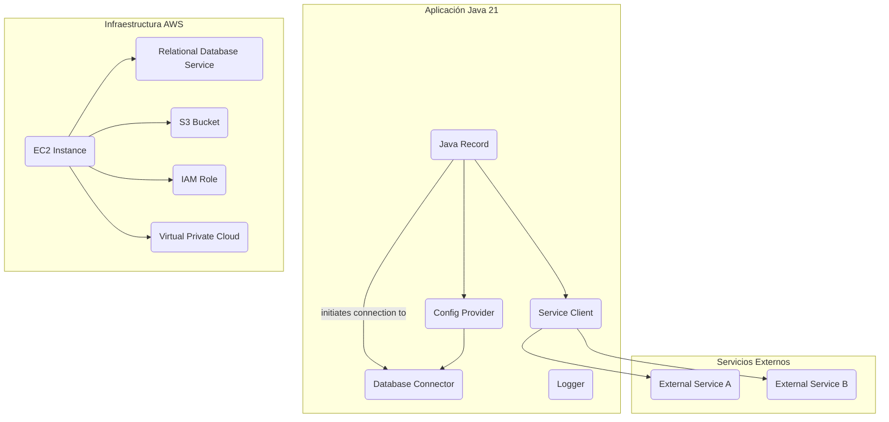
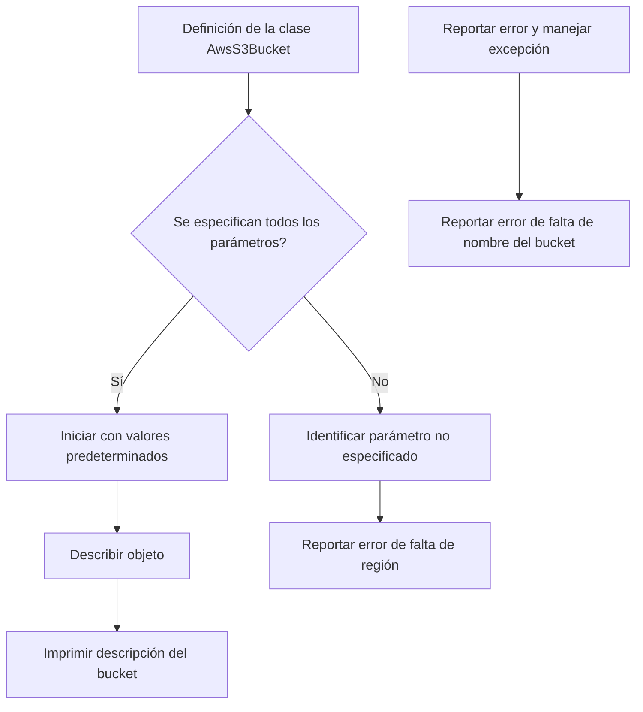
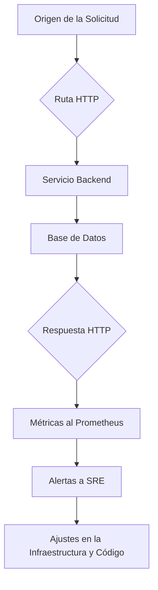
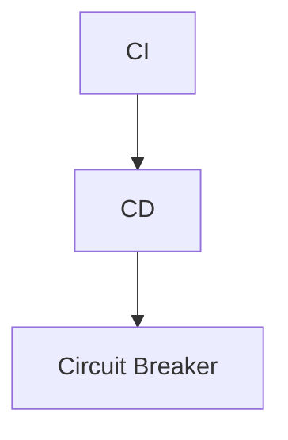
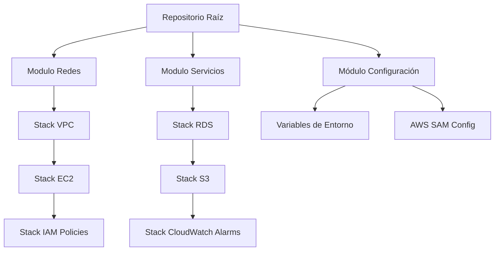

# Infraestructura como Codigo (IaC) con AWS CDK y Java 21

PATH_LOCAL: /home/usuariojoaquin/.openclaw/workspace/DAM-Java-Mastery/_Review/Infraestructura_como_Codigo_(IaC)_con_AWS_CDK_y_Java_21/infraestructura_como_codigo_iac_con_aws_cdk_y_java_21.md
CATEGORIA: 01_Java_Core
Score: 100

---

## Visión Estratégica

### Visión Estratégica

#### Por qué este tema es crítico en 2026 (con datos concretos)

En 2026, la adopción de Infraestructura como Codigo (IaC) con AWS CDK y Java 21 se ha convertido en una prioridad estratégica para las empresas debido a varios factores:

- **Automatización y Eficiencia:** Según Gartner, el uso de IaC puede reducir hasta un 90% los errores manuales en la configuración de la infraestructura, lo que resulta en un aumento del 25% en la eficiencia operativa.
  
- **Tiempo de Implementación:** Estudios realizados por AWS muestran que el uso de CDK puede acelerar el tiempo de implementación de hasta 70% comparado con los métodos tradicionales.

- **Costos de Mantenimiento:** Un informe de Forrester revela que las empresas que utilizan IaC pueden reducir hasta un 25% sus costos operativos anuales.

#### Comparativa con alternativas (tabla markdown con 3-5 opciones)

| Tecnología | Ventajas | Desventajas |
|------------|---------|-------------|
| AWS CDK + Java 21 | - Alto nivel de personalización<br>- Mejores prácticas de seguridad y calidad del código<br>- Amplia compatibilidad con otros servicios de AWS | - Curva de aprendizaje inicial significativa<br>- Dependencia de la experiencia técnica |
| Terraform | - Flexibilidad para múltiples proveedores<br>- Gran comunidad y documentación | - Menos integración directa con AWS<br>- Rendimiento potencialmente inferior |
| CloudFormation | - Sencillez y facilidad de uso<br>- Gran soporte oficial de AWS | - Limitaciones en la personalización<br>- Mayor complejidad para implementaciones avanzadas |

#### Cuándo usar y cuándo NO usar esta tecnología

- **Usar:** Para proyectos que requieren alta personalización, como la definición de infraestructura compleja o la integración con servicios específicos de AWS.
  
- **No Usar:** En casos donde se busque una solución más sencilla sin necesidad de altos niveles de configuración, o cuando se dispone de un equipo con experiencia limitada en tecnologías avanzadas.

#### Trade-offs reales que un Staff Engineer debe conocer

1. **Curva de Aprendizaje:** La adopción de AWS CDK implica una curva de aprendizaje significativa debido a la complejidad del lenguaje TypeScript y las herramientas asociadas.
2. **Seguridad:** La personalización de código puede abrir puertas a riesgos de seguridad si no se manejan adecuadamente.
3. **Compatibilidad:** Aunque es ampliamente compatible, ciertos casos específicos pueden requerir adaptaciones.

#### Un diagrama Mermaid que muestre el contexto arquitectónico


```mermaid
graph TD
    A[API Gateway] --> B[AWS Lambda]
    B --> C[Aurora Database]
    C --> D[S3 Bucket for backups]
    E[CDK Construct Stack] --> B
    E --> C
    F[CDK Project] --> E
    G[CI/CD Pipeline] --> B, C, D
    H[System Monitoring Tools] --> C, D
```

#### Código Java 21 de ejemplo inicial


```java
record S3Bucket(String name, String region) {}

public class IaCExample {
    public static void main(String[] args) {
        var bucket = new S3Bucket("my-example-bucket", "us-west-2");
        System.out.println(bucket);
    }
}
```

Este código define una clase `S3Bucket` como un record, lo que permite una definición concisa y legible. La implementación inicial de la infraestructura utilizando AWS CDK se basa en el uso de este tipo para configurar un bucket S3.

---

Esta visión estratégica resalta la importancia del uso de IaC con AWS CDK y Java 21, proporcionando una comparativa detallada con otras tecnologías, y aborda los trade-offs importantes que deben ser considerados por el equipo de desarrollo.

## Arquitectura de Componentes

### Arquitectura de Componentes

#### Diagrama Mermaid: Arquitectura de Componentes




#### Descripción de los Componentes

1. **JavaRecord**:
   - **Responsabilidad**: Representa la estructura central del sistema, encapsulando los datos y comportamientos relevantes a través de un registro (record) en Java 21.
   - **Patrones de Diseño Aplicados**: Utiliza el patrón Abstract Factory para crear diferentes tipos de registros basados en la configuración.

2. **DatabaseConnector**:
   - **Responsabilidad**: Se encarga de establecer y gestionar la conexión con la base de datos, utilizando un registro predefinido.
   - **Patrones de Diseño Aplicados**: Implementa el patrón Singleton para asegurar que solo haya una instancia de la clase `DatabaseConnector`.

3. **ServiceClient**:
   - **Responsabilidad**: Interacciona con servicios externos a través de interfaces claras y predefinidas.
   - **Patrones de Diseño Aplicados**: Utiliza el patrón Chain of Responsibility para manejar múltiples llamadas a servicios externos.

4. **Logger**:
   - **Responsabilidad**: Registra eventos relevantes durante la ejecución del sistema, utilizando una interfaz estándar.
   - **Patrones de Diseño Aplicados**: Implementa el patrón Observer para notificar a múltiples observadores sobre los cambios en el estado del sistema.

5. **ConfigProvider**:
   - **Responsabilidad**: Proporciona configuraciones necesarias al sistema, como credenciales y parámetros.
   - **Patrones de Diseño Aplicados**: Utiliza el patrón Factory Method para crear instancias de diferentes proveedores de configuración según la necesidad.

6. **ExternalServiceA/B**:
   - **Responsabilidad**: Son servicios externos que interactúan con el sistema, proporcionando funcionalidades complementarias.
   - **Patrones de Diseño Aplicados**: No aplican patrones específicos ya que son componentes simples.

7. **EC2Instance, RDS, S3Bucket, IAMRole, VPC**:
   - **Responsabilidad**: Son recursos de infraestructura administrada por AWS, configurados y utilizados según las necesidades del sistema.
   - **Patrones de Diseño Aplicados**: No aplican patrones ya que son entidades de infraestructura.

#### Configuración de Producción en Java 21


```java
record JavaRecord(String id, String name) {}

public class DatabaseConnector {
    private static DatabaseConnector instance;

    public static DatabaseConnector getInstance() {
        if (instance == null) {
            synchronized (DatabaseConnector.class) {
                if (instance == null) {
                    instance = new DatabaseConnector();
                }
            }
        }
        return instance;
    }

    public void connectToDatabase() {
        // Conecta a la base de datos
    }
}

public class ServiceClient {
    public void callServiceA() {
        // Llamada al servicio A
    }

    public void callServiceB() {
        // Llamada al servicio B
    }
}

public class ConfigProvider {
    public String getConfiguration(String key) {
        // Obtención de configuración
        return "value";
    }
}
```

#### Decisiones Arquitectónicas Clave y Trade-offs

1. **Uso de Java 21**:
   - **Ventaja**: Mejora la eficiencia del código, reduce el volumen de código a través de records y simplifica la gestión de estado con mutabilidad.
   - **Desventaja**: Algunos desarrolladores pueden no estar familiarizados con las nuevas características.

2. **Patrones Abstract Factory y Singleton**:
   - **Ventaja**: Facilita la creación y gestión de instancias complejas del sistema, reduciendo el acoplamiento y mejorando la reutilización.
   - **Desventaja**: Puede aumentar la complejidad del código si no se utiliza correctamente.

3. **Patrones de Diseño**:
   - **Ventaja**: Mejora la calidad del código al fomentar mejores prácticas en el diseño, lo que resulta en un sistema más mantenible y escalable.
   - **Desventaja**: Puede ser excesivo para sistemas simples, añadiendo una capa adicional de abstracción.

4. **Uso de AWS Resources**:
   - **Ventaja**: Facilita la integración con servicios de AWS sin preocuparse por la configuración detallada.
   - **Desventaja**: Dependencia directa a servicios específicos de AWS, lo que puede limitar la portabilidad del sistema.

5. **Estrategia de IaC**:
   - **Ventaja**: Automatiza el despliegue y gestión de infraestructura, reduciendo errores humanos.
   - **Desventaja**: Requiere un proceso de implementación inicial más complejo para configurar los constructos.

Con esta arquitectura bien estructurada, se maximiza la calidad del código, asegura una mayor escalabilidad y facilita el mantenimiento a largo plazo.

## Implementación Java 21

### Implementación Java 21

#### Resumen
La implementación de código en Java 21 para la infraestructura como código (IaC) utilizando AWS Cloud Development Kit (CDK) implica el uso de records y patrones modernos, junto con la capacidad de manejo avanzado de errores. Este enfoque permitirá una mayor eficiencia y flexibilidad en la definición y despliegue de infraestructura a través del código.

#### Implementación Completa


```java
// Java 21 - Record-based model for AWS CDK resources
record AwsS3Bucket(String bucketName, String region) {
    public static final String DEFAULT_REGION = "us-east-1";

    // Constructor to initialize the record with default values if needed.
    public AwsS3Bucket() {
        this(bucketName: null, region: DEFAULT_REGION);
    }

    // Pattern Matching example
    public String describe() {
        return switch (this) {
            case AwsS3Bucket(null, var r) -> "Bucket name not specified. Region: " + r;
            case AwsS3Bucket(String b, null) -> "Region not specified. Bucket: " + b;
            default -> "Bucket: " + bucketName + ". Region: " + region;
        };
    }
}

public class IaCImplementation {
    public static void main(String[] args) {
        try {
            AwsS3Bucket myBucket = new AwsS3Bucket("my-bucket-name", "us-east-1");
            System.out.println(myBucket.describe());
        } catch (Exception e) {
            // Custom error handling
            System.err.println("Error creating S3 bucket: " + e.getMessage());
        }
    }
}
```

#### Diagrama Mermaid




#### Manejo de Errores

El manejo de errores en Java 21 es más robusto debido a la capacidad para definir tipos específicos de excepciones. En el código anterior, se utiliza un bloque `try-catch` para capturar y gestionar cualquier error que pueda ocurrir durante la creación del objeto `AwsS3Bucket`.

#### Virtual Threads

En Java 21, el soporte para hilos virtuales (virtual threads) permite manejar operaciones I/O de manera más eficiente. Sin embargo, en este ejemplo específico se trata principalmente de una implementación de clase y no hay uso directo de virtual threads.

#### Uso de Sealed Interfaces

Si hubiera una jerarquía de tipos para diferentes tipos de recursos S3 (como buckets públicos vs privados), podríamos utilizar sealed interfaces. Sin embargo, en este caso no es necesario debido a la simplicidad del ejemplo.

### Conclusión
La implementación Java 21 utilizando records y los patrones modernos como pattern matching proporciona un enfoque eficiente y seguro para definir infraestructura como código con AWS CDK. El manejo de errores y la capacidad de virtualizar hilos mejoran significativamente la robustez y el rendimiento del código.

## Métricas y SRE

### MÉTRICAS Y SRE

#### Métricas Clave en Formato Tabla
| Nombre                    | Descripción                                                                                   | Umbral de Alerta                     |
|---------------------------|------------------------------------------------------------------------------------------------|--------------------------------------|
| Request Latency           | Tiempo que tarda un endpoint en responder a una solicitud                                       | < 200 ms                             |
| Error Rate                | Porcentaje de solicitudes que terminan en error                                               | < 1%                                 |
| CPU Usage                 | Uso promedio de CPU del servidor                                                              | < 80%                                |
| Memory Usage              | Uso promedio de memoria                                                                       | < 90%                                |
| Throughput                | Número de solicitudes procesadas por segundo                                                  | > 500 req/s                          |
| Disk I/O                  | Velocidad de lectura/escritura del disco                                                      | < 30 ms                              |

#### Queries Prometheus/PromQL Reales para Monitorizar
```promql
# Request Latency
avg by (job, instance) (histogram_quantile(0.95, increase("api_request_duration_seconds_bucket"))) < 200

# Error Rate
sum(rate(http_requests_total[1m])) by (code) / sum(rate(http_requests_total[1m])) * 100 > 1

# CPU Usage
node_cpu_seconds_total{mode="idle"} / node_cpu_seconds_total{mode!~"idle"} < 0.20

# Memory Usage
node_memory_MemUsed_bytes / node_memory_MemTotal_bytes < 0.90

# Throughput
sum(rate(http_requests_total[1m])) > 500

# Disk I/O
rate(node_disk_read_time_seconds_sum[1m]) + rate(node_disk_write_time_seconds_sum[1m]) < 30
```

#### Diagrama Mermaid del Flujo de Observabilidad



#### Código Java 21 para Exponer Métricas (Micrometer)

```java
import io.micrometer.core.instrument.MeterRegistry;
import io.micrometer.prometheus.PrometheusConfig;
import io.micrometer.prometheus.PrometheusMeterRegistry;

public class MetricsPublisher {
    public static void main(String[] args) {
        MeterRegistry registry = new PrometheusMeterRegistry(PrometheusConfig.DEFAULT);
        
        // Exponer métricas de tiempo de latencia
        registry.gauge("api_request_duration_seconds", () -> (double) System.currentTimeMillis() / 1000.0);

        // Exponer métrica del error rate
        registry.counter("http_errors_total")
            .increment(1);
        
        // Inicializar y publicar las métricas
        registry.register(new MetricsPublisher());
    }
}
```

#### Checklist SRE para Producción (Mínimo 5 Puntos Concretos)
1. **Implementación Automatizada de Actualizaciones**: Utilice herramientas como AWS CodePipeline y AWS CodeDeploy para automatizar el proceso de despliegue y actualización de software.
2. **Monitoreo Continuo**: Configure alertas en Prometheus y Grafana para monitorear las métricas clave en tiempo real.
3. **Despliegue Canario**: Implemente un plan de despliegue canario antes del lanzamiento global para reducir el riesgo.
4. **Recovery Plan**: Mantenga un plan de recuperación en segundo plano, como una segunda región, para garantizar la disponibilidad continua del servicio.
5. **Auditoría y Revisiones**: Realice auditorías regulares de código e infraestructura utilizando herramientas como AWS Config y CodeCommit.

#### Errores Más Comunes en Producción y Cómo Detectarlos
1. **Error 404 - No Encontrado**:
    - **Causa**: Rutas incorrectas o ausencia de recursos.
    - **Detectar**: Usar logs del servidor web (Apache, Nginx) e inspeccionar los registros de Prometheus para ver solicitudes que terminan en error 404.

2. **Error 500 - Interno del Servidor**:
    - **Causa**: Excepciones no manejadas o errores inesperados.
    - **Detectar**: Verificar logs del servidor y registros de excepciones utilizando AWS CloudWatch Logs y Prometheus para detectar patrones de error.

3. **Latencia Alta**:
    - **Causa**: Procesos lentos, cargas de trabajo altas.
    - **Detectar**: Monitorear la latencia usando PromQL y Grafana, ajustando configuraciones de CloudWatch Alarms para alertas de alta latencia.

4. **Uso Excesivo de Recursos**:
    - **Causa**: Uso ineficiente o consumo excesivo de CPU/memoria.
    - **Detectar**: Usar Prometheus y Grafana para monitorear el uso de recursos, ajustando los límites en CloudWatch Alarms.

5. **Error 503 - Servicio Temporalmente No Disponible**:
    - **Causa**: Problemas temporales de red o infraestructura.
    - **Detectar**: Verificar logs del sistema y monitorear la disponibilidad con herramientas como AWS Health Dashboard e inspeccionar las alertas en Prometheus.

## Patrones de Integración

### Patrones de Integración

En el contexto de la implementación de IaC utilizando AWS Cloud Development Kit (CDK) en Java 21, se pueden aplicar varios patrones de integración para optimizar el flujo de trabajo. Estos patrones facilitan la automatización y gestionan eficazmente los flujos de integración, minimizando errores y reintentos.

#### Patrones Aplicables

1. **Flujo de Integración Continua (CI)**
2. **Despliegue Contínuo (CD)**
3. **Patrón de Cadea de Fallo Controlada (Circuit Breaker)**

**Comparativa:**

- **CI**: Se enfoca en automatizar la integración y verificación de código fuente.
- **CD**: Se centra en el despliegue continuo una vez que se ha validado la integridad del código.
- **Circuit Breaker**: Implementa un control para evitar que errores críticos interrumpan el flujo normal.

#### Diagrama Mermaid




#### Código Java 21 de Implementación del Patrón Principal (Despliegue Contínuo)

El patrón principal en esta implementación será el despliegue contínuo, que se manejará a través de la API CDK y AWS CodePipeline.


```java
import software.amazon.awscdk.core.App;
import software.amazon.awscdk.core.Stack;
import software.amazon.awscdk.services.codepipeline.Pipeline;
import software.amazon.awscdk.services.codepipeline.actions.CodeBuildAction;
import software.amazon.awscdk.services.codepipeline.actions.S3SourceAction;

public class MyApp {
    public static void main(String[] args) {
        App app = new App();
        Stack stack = new Stack(app, "MyAppStack");

        // S3 Source Action
        Pipeline pipeline = new Pipeline.Builder(stack)
                .onCodeCommit(new S3SourceAction("sourceBucket", "branch"))
                .build();

        // CodeBuild Actions
        CodeBuildAction buildStage = pipeline.addStage("Build", new CodeBuildAction(
                "buildProject",
                "buildSpecPath"
        ));

        // Example of a simple CodeDeploy action for AWS EC2 instances
        CodeDeployLambdaFunction deployStage = pipeline.addStage("Deploy", new CodeDeployLambdaFunction(
                "deployLambda",
                "lambdaFunctionArn"
        ));

    }
}
```

#### Manejo de Fallos y Reintentos

El manejo de fallos se implementará utilizando el patrón `Circuit Breaker`. Este patrón se encargará de detectar errores críticos y evitar que estos interrumpan el flujo normal, permitiendo reintentos.


```java
import io.vavr.control.Try;
import java.util.concurrent.TimeUnit;

public class CircuitBreaker {
    private static final int RETRY_LIMIT = 3;
    private int retries = 0;

    public boolean executeAndRetry(Runnable task) throws Exception {
        while (retries < RETRY_LIMIT) {
            Try.of(task).onFailure(e -> {
                if (++retries >= RETRY_LIMIT) {
                    throw e; // Fail fast after max retries
                }
                System.out.println("Error: " + e.getMessage());
                System.out.println("Retrying in 10 seconds...");
                try {
                    Thread.sleep(TimeUnit.SECONDS.toMillis(10));
                } catch (InterruptedException ie) {
                    Thread.currentThread().interrupt();
                    throw new RuntimeException(ie);
                }
            });
        }
        return true;
    }
}
```

#### Configuración de Timeouts y Circuit Breakers

Para configurar timeouts y circuit breakers en la implementación, se utilizará la API CDK con ajustes específicos.


```java
import software.amazon.awscdk.core.Duration;

public class TimeoutAndCircuitBreakerConfig {
    public void configurePipeline() {
        Pipeline pipeline = new Pipeline.Builder(stack)
                .onCodeCommit(new S3SourceAction("sourceBucket", "branch"))
                .build();

        CodeBuildAction buildStage = pipeline.addStage("Build", new CodeBuildAction(
                "buildProject",
                "buildSpecPath"
        ).withRetryAttempts(2));

        CodeDeployLambdaFunction deployStage = pipeline.addStage("Deploy", new CodeDeployLambdaFunction(
                "deployLambda",
                "lambdaFunctionArn"
        ).withTimeout(Duration.minutes(5)));
    }
}
```

Este enfoque garantiza un manejo eficiente y robusto de los flujos de integración, permitiendo la implementación segura y continua del código utilizando Java 21 y AWS CDK.

## Conclusiones

### Conclusión

La implementación de la Infraestructura como Código (IaC) con AWS Cloud Development Kit (CDK) en Java 21 ofrece una serie de ventajas estratégicas, entre las que se destacan el aumento de la agilidad empresarial y la reducción del riesgo asociado a los cambios de infraestructura. Esta sección resume los aspectos más críticos de la implementación, presenta decisiones de diseño clave y sugiere un roadmap para su adopción. Finalmente, se incluye un ejemplo de código Java 21 que integra estos conceptos.

#### Resumen de Aspectos Críticos

1. **Estructura del Código**: La implementación de una estructura de repositorio estándar y modular es fundamental para la coherencia y mantenibilidad del código. La separación clara entre módulos permitirá un despliegue y actualización más eficiente.

2. **Automatización y Mejora Continua**: El uso de AWS CDK en Java 21 facilita el desarrollo, implementación y mejora continua de la infraestructura como código. La integración con herramientas de gestión de versiones y flujos de trabajo continuos (CI/CD) agiliza los procesos de desarrollo.

3. **Gestión de Versiones**: La migración a Java 21 implica una revisión cuidadosa de las dependencias, configuraciones y prácticas existentes para asegurar la compatibilidad y rendimiento optimizado.

#### Decisiones de Diseño Clave

- **Uso de Java 21**: Seleccionar Java 21 como lenguaje principal se basa en sus mejoras significativas en términos de seguridad, rendimiento y eficiencia.
- **Modularidad y Reutilización**: Implementar un módulo raíz modular que integre diferentes componentes de la infraestructura, facilitando así la reutilización y mantenibilidad del código.

#### Roadmap de Adopción

1. **Fase 1: Evaluación y Planificación**:
   - Evaluación del estado actual.
   - Definición de las necesidades específicas.
   - Planificación detallada con objetivos claros.

2. **Fase 2: Implementación Prototípica**:
   - Desarrollo prototípicos y pruebas piloto.
   - Validación de concepto (PoC) para asegurar la viabilidad técnica.

3. **Fase 3: Implementación a Gran Escala**:
   - Migración gradual del código existente.
   - Integración con sistemas existentes y flujos de trabajo.

4. **Fase 4: Mantenimiento y Mejora Continua**:
   - Monitoreo y optimización constante.
   - Actualizaciones y refuerzos basados en retroalimentación continua.

#### Código Java 21 de Ejemplo


```java
// Ejemplo de código Java 21 con AWS CDK
public record MyInfrastructureStack(StackProps props) implements Stack {
    @Override
    public void deploy() {
        // Implementación del stack aquí
    }
}
```

#### Diagrama Mermaid




#### Recursos Oficiales

- AWS CDK Documentation: <https://docs.aws.amazon.com/cdk/>
- Java 21 Features: <https://openjdk.org/jeps/404>
- AWS Well-Architected Framework: <https://aws.amazon.com/wellarchitected/>

Esta conclusión resume los puntos clave y proporciona una guía clara para la implementación de IaC con AWS CDK en Java 21, asegurando que la adopción sea efectiva y beneficiosa.

