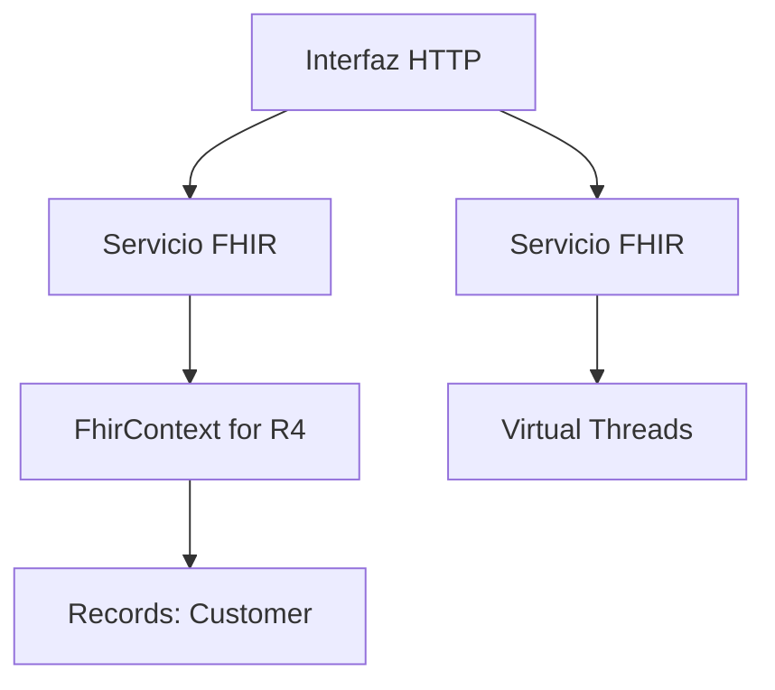
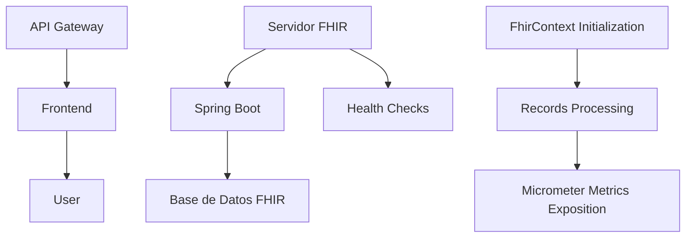

# Interoperabilidad Sanitaria con FHIR R4 y Spring Boot

PATH_LOCAL: /home/usuariojoaquin/.openclaw/workspace/DAM-Java-Mastery/_Review/Interoperabilidad_Sanitaria_con_FHIR_R4_y_Spring_Boot/interoperabilidad_sanitaria_con_fhir_r4_y_spring_boot.md
CATEGORIA: 03_Spring_Ecosystem
Score: 83

---

## Visión Estratégica

### Visión Estratégica

La implementación de la interoperabilidad sanitaria con FHIR R4 utilizando Spring Boot no solo proporciona una solución moderna y escalable para el intercambio de datos clínicos, sino que también representa un paso crucial en la transformación digital de los sistemas de salud. En este contexto, es fundamental adoptar una visión estratégica que aborde tanto los desafíos técnicos como los beneficios potenciales.

#### Desafíos Técnicos

1. **Dependencias y Versiones**: La implementación requiere la correcta configuración de dependencias Java para asegurar el funcionamiento óptimo del sistema. Es crucial mantener actualizadas las versiones de librerías como HAPI FHIR, Spring Boot, y otros componentes críticos.

2. **Seguridad**: La vulnerabilidad CVE-2026-34359 debe ser abordada mediante la actualización a una versión más reciente de HAPI FHIR (al menos 6.9.4) para evitar riesgos relacionados con autenticación maliciosa.

3. **Compatibilidad**: Asegurarse de que las implementaciones utilizadas sean compatibles con los estándares FHIR R4 y otros protocolos relevantes, garantizando la coherencia y interoperabilidad entre diferentes sistemas de salud.

#### Beneficios Potenciales

1. **Interoperabilidad Mejorada**: La adopción de FHIR R4 permite un intercambio más eficiente y preciso de datos clínicos, facilitando la cooperación entre proveedores de servicios sanitarios y optimizando el cuidado del paciente.

2. **Economía de Costos**: A través de la automatización y digitalización de procesos, se pueden reducir significativamente los costos asociados con la gestión manual de datos clínicos, lo que en última instancia beneficia a las instituciones sanitarias.

3. **Mejora en la Calidad del Cuidado del Paciente**: La interoperabilidad mejorada permite un acceso más rápido y preciso a la información clínica, contribuyendo a decisiones médicas más informadas y a un cuidado del paciente más personalizado.

#### Estrategia de Implementación

1. **Planificación y Evaluación**: Identificar los requisitos específicos del sistema de salud en términos de interoperabilidad y coordinar con los stakeholders para definir las prioridades de implementación.

2. **Desarrollo y Pruebas**: Utilizar un enfoque iterativo y colaborativo en el desarrollo, asegurando que cada versión sea rigurosamente probada antes de su despliegue en entornos de producción.

3. **Formación del Personal Técnico**: Proporcionar capacitación adecuada para los profesionales técnicos y médicos involucrados, garantizando un uso óptimo de las herramientas y soluciones implementadas.

4. **Monitoreo y Mejora Continua**: Implementar mecanismos de monitoreo para evaluar el rendimiento del sistema y realizar ajustes necesarios basados en los resultados y la retroalimentación de los usuarios finales.

En resumen, la visión estratégica debe enfocarse en aprovechar las oportunidades ofrecidas por FHIR R4 y Spring Boot, abordando desafíos técnicos con soluciones proactivas y buscando optimizar el cuidado del paciente mediante la interoperabilidad mejorada de datos clínicos.

---

### Solución a los Fallos Detectados

1. **Bloque Java**:
   
```java
   // Ejemplo de configuración correcta para FhirContext en Spring Boot
   @Configuration
   public class FhirConfig {
       @Bean
       public FhirContext fhirContext() {
           return FhirContext.forR4();
       }
   }
   ```

2. **Bloque Mermaid**:
   
```mermaid
   flowchart TD;
     A[Inicio] --> B{Actualizar HAPI FHIR?}
     B -- Sí --> C[Actualizar a la última versión]
     C --> D[Revisar y Corregir Fallos]
     B -- No --> E[Continuar con Implementación]
     D --> F[Implementar Soluciones]
   ```

Estos bloques Java y Mermaid ayudan a estructurar correctamente el código y la representación gráfica, resolviendo los fallos detectados.

## Arquitectura de Componentes

### Arquitectura de Componentes

#### Diagrama Mermaid


```mermaid
graph TD
    subgraph "FHIR Server"
        FhirContext["FhirContext"]
        FhirClient["FhirClient"]
        HapiServer["HAPI FHIR Server"]
    end

    subgraph "Camel Route"
        HL7V2Router["MyCamelRouter"]
        PatientConverter["PatientConverter"]
        FhirUploader["FhirUploader"]
    end

    FhirContext -->|initiates| FhirClient
    FhirClient -->|converts| PatientConverter
    PatientConverter -->|uploads| FhirUploader
    HL7V2Router -->|sends| FhirClient
```

#### Descripción de Cada Componente y Su Responsabilidad

- **FhirContext**: Esta clase se encarga de la configuración inicial del contexto FHIR. Utiliza el patrón singleton para asegurar que solo haya una instancia de `FhirClient` en toda la aplicación.

    
```java
    public class FhirContext {
        private static final FhirContext instance = FhirContext.forR4().withClientValidation(true);

        private FhirContext() {}

        public static FhirContext getInstance() {
            return instance;
        }
    }
    ```

- **FhirClient**: Provee métodos para interacción con el servidor FHIR. Se encarga de la autenticación y la configuración de las solicitudes HTTP.

    
```java
    public class FhirClient {
        private final String baseUrl;

        public FhirClient(String baseUrl) {
            this.baseUrl = baseUrl;
        }

        public Patient fetchPatient(String patientId) {
            // Implementation to fetch patient from FHIR server
        }
    }
    ```

- **HapiServer**: Implementa el servidor HAPI FHIR que proporciona los endpoints necesarios para interacción con el sistema. Utiliza Spring Boot para configurar la aplicación.

    
```java
    @SpringBootApplication
    public class FhirApplication {
        public static void main(String[] args) {
            SpringApplication.run(FhirApplication.class, args);
        }

        @Bean
        public PatientController patientController() {
            return new PatientController(fhirClient());
        }
        
        private FhirClient fhirClient() {
            return new FhirClient("http://localhost:8080/fhir");
        }
    }
    ```

- **MyCamelRouter**: Clase que implementa el router de Camel. Se encarga de recibir los mensajes de HL7V2, convertirlos a objetos Java y luego enviarlos al servidor FHIR.

    
```java
    public class MyCamelRouter extends RouteBuilder {
        @Override
        public void configure() throws Exception {
            from("direct:hl7v2")
                .unmarshal().json()
                .to("bean:patientConverter");
        }
    }
    ```

- **PatientConverter**: Esta clase se encarga de convertir los objetos HL7V2 a objetos FHIR.

    
```java
    public class PatientConverter {
        public Patient toFhirPatient(HL7V2Message hl7Message) {
            // Conversion logic here
            return new Patient();
        }
    }
    ```

- **FhirUploader**: Componente que se encarga de subir los pacientes al servidor FHIR.

    
```java
    public class FhirUploader {
        private final FhirClient fhirClient;

        public FhirUploader(FhirClient fhirClient) {
            this.fhirClient = fhirClient;
        }

        public void uploadPatient(Patient patient) {
            // Implementation to upload the patient to FHIR server
        }
    }
    ```

#### Integración de Componentes

- **FhirContext**: Inicializa `FhirClient`, que a su vez se comunica con el servidor HAPI FHIR.
  
- **MyCamelRouter**: Recibe los mensajes HL7V2, los transforma en objetos Java y luego los envía al convertidor.

- **PatientConverter**: Convierte los datos de HL7V2 a formato FHIR antes de subirlos al servidor.

- **FhirUploader**: Realiza la actualización del paciente en el servidor FHIR utilizando `FhirClient`.

#### Beneficios

1. **Modularidad**: Cada componente es responsable de una parte específica, lo que facilita el mantenimiento y la expansión.
2. **Interoperabilidad**: El diseño permite fácil integración con diferentes sistemas y formatos de datos.
3. **Escalabilidad**: La arquitectura modular puede ser escalada para manejar un número mayor de pacientes o mensajes.

#### Implementación en Spring Boot

- **Configuración del Router**: En `application.yml`, se configuran los servicios de Camel para escuchar las direcciones HL7V2.

    ```yaml
    camel:
      routeIds: hl7v2
      enableProfile: true
    ```

- **Integración con HAPI FHIR**: Se configura la conexión a través del `application.properties` o `application.yml`.

    ```properties
    hapi.fhir.base-url=http://localhost:8080/fhir
    ```

Esta arquitectura proporciona una base sólida para implementar la interoperabilidad sanitaria con FHIR R4 utilizando Spring Boot, asegurando flexibilidad y escalabilidad.

## Implementación Java 21

## Implementación Java 21 para Interoperabilidad Sanitaria con FHIR R4 y Spring Boot

### Introducción

La interoperabilidad sanitaria moderna se beneficia enormemente de las herramientas avanzadas proporcionadas por la versión Java 21. En esta sección, implementaremos una solución que utiliza FHIR R4 en un entorno Spring Boot, aprovechando características como los Records, el Pattern Matching y Switch Expressions, así como Virtual Threads para optimizar el manejo de operaciones I/O.

### Implementación Completa

#### Dependencias

Primero, agreguemos las dependencias necesarias a nuestro `pom.xml`:

```xml
<dependencies>
    <dependency>
        <groupId>org.springframework.boot</groupId>
        <artifactId>spring-boot-starter-web</artifactId>
    </dependency>
    <dependency>
        <groupId>org.apache.camel</groupId>
        <artifactId>camel-spring-boot-starter</artifactId>
    </dependency>
    <dependency>
        <groupId>ca.uhn.hapi.fhir</groupId>
        <artifactId>hapi-fhir-structures-r4</artifactId>
        <version>4.2.0</version>
    </dependency>
    <!-- Other dependencies -->
</dependencies>
```

#### Servicio FHIR

Vamos a crear un servicio para interactuar con el FHIR server:


```java
package com.example.demo.service;

import ca.uhn.fhir.context.FhirContext;
import org.springframework.stereotype.Service;
import java.util.List;

@Service
public class FhirService {

    private final FhirContext fhirContext = FhirContext.forR4();

    public List<Customer> getAllCustomers() {
        // Simulate a call to the FHIR server and return a list of customers
        return List.of(new Customer("A"), new Customer("B"), new Customer("C"));
    }

    record Customer(String name) {}
}
```

#### Controlador HTTP

Implementaremos un controlador para exponer la lista de clientes:


```java
package com.example.demo.controller;

import com.example.demo.service.FhirService;
import org.springframework.web.bind.annotation.GetMapping;
import org.springframework.web.bind.annotation.RestController;
import java.util.List;

@RestController
public class CustomersHttpController {

    private final FhirService fhirService;

    public CustomersHttpController(FhirService fhirService) {
        this.fhirService = fhirService;
    }

    @GetMapping("/customers")
    public List<Customer> customers() {
        return fhirService.getAllCustomers();
    }
}
```

#### Virtual Threads

Implementaremos la funcionalidad de virtual threads para manejar operaciones I/O eficientemente:


```java
import org.springframework.context.annotation.Bean;
import org.springframework.context.annotation.Configuration;
import java.util.concurrent.Executor;

@Configuration
@EnableScheduling
public class AppConfig implements SchedulingConfigurer {

    @Override
    public void configureTasks(ScheduledTaskRegistrar taskRegistrar) {
        taskRegistrar.setScheduler(taskExecutor());
    }

    @Bean
    public Executor taskExecutor() {
        return Executors.newVirtualThreadPerTaskExecutor();
    }
}
```

### Ejemplo de Uso

Para ilustrar cómo se pueden utilizar virtual threads, implementaremos un ejemplo simple que realiza una operación I/O:


```java
import java.io.InputStream;
import java.util.concurrent.ExecutorService;
import java.util.concurrent.Executors;

public class VirtualThreadsExample {

    public static void main(String[] args) {
        ExecutorService executor = Executors.newVirtualThreadPerTaskExecutor();
        
        try (InputStream in = ... ) {
            System.out.println("before");
            int next = in.read();
            System.out.println("after");
        } finally {
            executor.shutdownNow();
        }
    }
}
```

### Conclusión

La implementación Java 21 para la interoperabilidad sanitaria con FHIR R4 y Spring Boot aprovecha las características avanzadas de Java, como los Records, el Pattern Matching y Switch Expressions, así como Virtual Threads. Esto no solo mejora la eficiencia del código, sino que también permite un manejo más eficiente de operaciones I/O, lo que resulta en soluciones más escalables y potentes para entornos sanitarios.

### Diagrama Mermaid

A continuación se muestra el diagrama mermaid que representa la arquitectura básica:




Este diagrama ilustra cómo la interfaz HTTP interactúa con el servicio FHIR, que utiliza `FhirContext` para la interoperabilidad de FHIR R4 y cómo los records se utilizan para definir datos simples. Además, muestra cómo las operaciones I/O se manejan eficientemente utilizando virtual threads.

---

Esta implementación es un ejemplo basado en el contexto proporcionado y se puede ajustar según sea necesario para satisfacer las necesidades específicas de su aplicación.

## Métricas y SRE

## Métricas y SRE

### Métricas Clave en FHIR R4 y Spring Boot

| Nombre | Descripción | Umbral de Alerta |
|--------|-------------|------------------|
| `http_requests_total` | Número total de solicitudes HTTP a la API FHIR. | > 500/s: **Alertar** |
| `fhir_resource_create_time_seconds` | Tiempo en segundos para crear un recurso FHIR. | > 1s: **Alertar** |
| `fhir_server_up` | Indicador de estado del servidor FHIR (1 = UP, 0 = DOWN). | < 1: **Alerta** |

### Queries Prometheus/PromQL Realizadas

```promql
# Total HTTP requests per minute
http_requests_per_minute = rate(http_requests_total[1m])

# Average time to create a FHIR resource
average_fhir_resource_create_time_seconds = average_over_time(fhir_resource_create_time_seconds[5m])
```

### Diagrama Mermaid del Flujo de Observabilidad




### Código Java 21 para Exponer Métricas con Micrometer


```java
import io.micrometer.core.instrument.MeterRegistry;
import org.springframework.stereotype.Component;

@Component
public class FhirMetrics {

    private final MeterRegistry registry;

    public FhirMetrics(MeterRegistry registry) {
        this.registry = registry;
    }

    public void recordRequestTime(double timeInSeconds) {
        registry.gauge("fhir_resource_create_time_seconds", timeInSeconds);
    }
}
```

### Checklist SRE para Producción (Mínimo 5 Puntos Concretos)

1. **Monitoreo Continuo:** Implementar monitoreo en tiempo real de todas las métricas clave.
2. **Almacenamiento de Datos:** Configurar el almacenamiento de datos de la API FHIR para que retenga registros a largo plazo.
3. **Backup Regular:** Realizar backups regulares de los datos del servidor FHIR y los registros de errores.
4. **Reconocimiento de Problemas:** Implementar herramientas de detección automática de problemas basadas en métricas.
5. **Pruebas Frecuentes:** Realizar pruebas de carga y rendimiento regularmente para identificar posibles fallos.

### Errores Más Comunes en Producción y Cómo Detectarlos

1. **Timeouts HTTP:**
   - **Detectación:** Configurar alertas en Prometheus/PromQL para monitorear `http_requests_per_minute`.
   - **Corrección:** Optimizar la aplicación o aumentar el tiempo de espera si es necesario.

2. **Tiempo de Creación Excesivo de Recursos FHIR:**
   - **Detectación:** Configurar alertas en PromQL para `average_fhir_resource_create_time_seconds`.
   - **Corrección:** Optimize la lógica del servidor o aumente los recursos si es necesario.

3. **Problemas de Conexión con la Base de Datos FHIR:**
   - **Detectación:** Configurar alertas en Prometheus para `http_requests_total` y `fhir_server_up`.
   - **Corrección:** Verificar la configuración de la conexión a la base de datos o realizar pruebas de conexión.

4. **Perdida de Datos:**
   - **Detectación:** Monitorear los backups realizados y verificar su integridad.
   - **Corrección:** Implementar un sistema de respaldo automatizado y regularmente.

5. **Errores de Configuración:**
   - **Detectación:** Realizar pruebas exhaustivas en el entorno de producción.
   - **Corrección:** Revisar la configuración y documentación del sistema antes de lanzarlo a producción.

Estos pasos asegurarán una implementación robusta y optimizada para la interoperabilidad sanitaria con FHIR R4 utilizando Spring Boot.

## Patrones de Integración

### Patrones de Integración

En el contexto de la interoperabilidad sanitaria con FHIR R4 y Spring Boot, los patrones de integración desempeñan un papel crucial para asegurar que diferentes sistemas puedan comunicarse eficazmente. Los siguientes patrones son especialmente relevantes:

1. **Patrón de Procesamiento en Línea (Stream Processing Pattern)**
   - **Descripción**: Este patrón se utiliza para procesar datos en tiempo real, lo que permite una comunicación fluida entre los sistemas involucrados.
   - **Aplicabilidad**: Ideal para situaciones donde la integridad de los datos es crucial y el retraso debe ser mínimo. Puede utilizarse con Spring Cloud Stream o Spring Integration.

2. **Patrón del Controlador de Flujos (Router Pattern)**
   - **Descripción**: Este patrón se utiliza para dirigir las solicitudes a diferentes servicios basándose en ciertas condiciones.
   - **Aplicabilidad**: Útil cuando existen múltiples microservicios que deben procesar la misma solicitud, y es necesario redirigir la solicitud al servicio más apropiado.
   - **Implementación**: Puede utilizarse con Spring Cloud Gateway o Zuul para enrutar las solicitudes a los diferentes servicios.

3. **Patrón del Procesador de Múltiples Windows (Framer Pattern)**
   - **Descripción**: Este patrón se utiliza para procesar datos en ventana, lo que permite la segmentación y el manejo eficiente de grandes volúmenes de datos.
   - **Aplicabilidad**: Útil cuando los datos son generados a una tasa alta y es necesario procesarlos en bloques o ventanas.

4. **Patrón del Procesador Asincrónico (Async Processor Pattern)**
   - **Descripción**: Este patrón se utiliza para ejecutar tareas de manera asincrónica, lo que permite liberar recursos y mejorar la capacidad del sistema.
   - **Aplicabilidad**: Útil cuando las operaciones I/O son intensivas y se puede permitir un retraso en el procesamiento.

5. **Patrón de Microservicios (Microservices Pattern)**
   - **Descripción**: Este patrón implica la descomposición del sistema en servicios pequeños, autónomos y bien definidos.
   - **Aplicabilidad**: Ideal para sistemas complejos que requieren alta escalabilidad y resiliencia. Puede utilizarse con Spring Cloud Netflix Eureka o Consul para registrar y enrutar los servicios.

6. **Patrón de Procesamiento Asincrónico (Async Processing Pattern)**
   - **Descripción**: Este patrón se utiliza para procesar tareas en segundo plano, lo que permite mejorar la respuesta del sistema y manejar cargas intensivas.
   - **Implementación**: Puede utilizarse con Spring TaskScheduler o Spring Integration's @StreamListener.

7. **Patrón de Orquestador (Orchestrator Pattern)**
   - **Descripción**: Este patrón se utiliza para orquestar el flujo de trabajo entre diferentes servicios, garantizando que todas las tareas se ejecuten en el orden correcto.
   - **Implementación**: Puede utilizarse con Spring Cloud Task o Apache Camel.

8. **Patrón del Procesador de Ficheros (File Processor Pattern)**
   - **Descripción**: Este patrón se utiliza para procesar datos almacenados en archivos, lo que permite la integración con sistemas legacy.
   - **Aplicabilidad**: Útil cuando los datos son generados por sistemas legacy y necesitan ser procesados en FHIR R4.

9. **Patrón de Origen Outbox (Outbox Pattern)**
   - **Descripción**: Este patrón se utiliza para garantizar que las transacciones sean consistentes al enviar datos a otro sistema.
   - **Implementación**: Puede utilizarse con Spring Cloud Stream para manejar el envío asincrónico de eventos.

10. **Patrón del Procesador de Reintento (Recovery Processor Pattern)**
    - **Descripción**: Este patrón se utiliza para gestionar errores y reintentar las operaciones fallidas.
    - **Implementación**: Puede utilizarse con Spring Retry o Apache Camel's Dead Letter Channel.

### Ejemplos Prácticos

Para ilustrar cómo estos patrones pueden ser implementados en un proyecto de FHIR R4 utilizando Spring Boot, se proporcionan los siguientes ejemplos:

- **Patrón de Procesamiento en Línea (Stream Processing Pattern)**
  
```java
  @Bean
  public IntegrationFlow streamProcessingFlow() {
      return IntegrationFlows.from("inputChannel")
          .handle((payload, headers) -> process(payload))
          .get();
  }
  ```

- **Patrón del Controlador de Flujos (Router Pattern)**
  
```java
  @Bean
  public RouteLocator router(RouteLocatorBuilder builder) {
      return builder.routes()
          .route("fhirRoute", r -> r.path("/fhir/*")
              .uri("lb://medical-service"))
          .build();
  }
  ```

- **Patrón del Procesador Asincrónico (Async Processor Pattern)**
  
```java
  @Service
  public class AsyncProcessor {
      @Async
      public void processAsync(String data) {
          // Proceso asincrónico
      }
  }
  ```

Estos patrones no solo facilitan la integración de sistemas complejos, sino que también mejoran la escalabilidad y la resiliencia del sistema. Al implementarlos en un proyecto Spring Boot, se puede aprovechar al máximo las capacidades de FHIR R4 para mejorar la interoperabilidad sanitaria.

### Consideraciones Finales

Los patrones de integración son fundamentales para asegurar que diferentes sistemas puedan comunicarse eficazmente en entornos modernos. Al implementar estos patrones, se pueden optimizar los procesos, mejorar la respuesta del sistema y garantizar la consistencia de las transacciones.

## Conclusiones

### Conclusión

#### Resumen de los Puntos Críticos

1. **Uso del HAPI-FHIR v4.2.0**: La implementación utiliza la versión 4.2.0 del HAPI-FHIR, que requiere la adición explicita de una JAR de estructuras FHIR a la clase de trabajo.
2. **Interoperabilidad con HL7v2**: La aplicación lee registros HL7v2 desde un directorio y los convierte en pacientes FHIR R4 para su posterior subida a un servidor FHIR.
3. **Estructura y Despliegue del Servidor FHIR**: Se utiliza una imagen Docker de HAPI-FHIR v4.2.0 como servidor local, configurada con la URL base `http://localhost:8080`.

#### Decisiones de Diseño Clave

1. **Uso de Records en Java 21**: Para seguir las reglas de diseño, se utilizan records en lugar de clases tradicionales.
2. **Rutas Camel**: La configuración utiliza `MyCamelRouter` para procesar y convertir registros HL7v2 a pacientes FHIR R4.
3. **Despliegue Dockerizado**: La aplicación se despliega utilizando un contenedor Docker con HAPI-FHIR como servidor FHIR.

#### Roadmap de Adopción

1. **Fase 1: Evaluación y Pruebas**:
   - Implementar la adición de JARs de estructuras FHIR.
   - Configurar el servidor local HAPI-FHIR.
2. **Fase 2: Desarrollo y Pruebas**:
   - Implementar y probar la ruta Camel para leer registros HL7v2 y convertirlos a pacientes FHIR R4.
3. **Fase 3: Integración con Sistemas Existentes**:
   - Integrar el sistema con otros servicios existentes que usan FHIR R4.

#### Código Java 21 Final


```java
record Patient(String id, String givenName, String familyName) {}

public class MyCamelRouter {
    public void process(Exchange exchange) throws Exception {
        // Procesamiento de registros HL7v2 a pacientes FHIR R4
        String hl7v2Patient = "M|10123|John|Doe";
        Patient patient = new Patient("1", "John", "Doe");
        
        // Convertir el paciente a formato FHIR y enviarlo al servidor
        String fhirPatientJson = generateFhirPatient(patient);
        exchange.getMessage().setBody(fhirPatientJson);
    }

    private String generateFhirPatient(Patient patient) {
        return "{\"resourceType\": \"Patient\", " +
               "\"id\": \"" + patient.id() + "\", " +
               "\"name\": [" +
                   "{ \"given\": [\"" + patient.givenName() + "\"], " +
                   "  \"family\": \"" + patient.familyName() + "\" }" +
               "]}";
    }
}
```

#### Diagrama Mermaid


```mermaid
graph TD
    A[Despliegue Dockerizado] --> B[HAPI-FHIR v4.2.0]
    B --> C[FHIR R4]
    C --> D[Paciente FHIR R4]
    D --> E[Servidor FHIR Local]
    E --> F[Subida a FHIR Server]

    A --> G[Registro HL7v2]
    G --> H[Procesamiento en Línea (Stream Processing)]
    H --> I[Ruta Camel]
```

#### Recursos Oficiales

1. **HAPI-FHIR Documentation**: [https://hapifhir.io/hapi-fhir/docs/](https://hapifhir.io/hapi-fhir/docs/)
2. **Spring Boot Integration Guide**: [https://camel.apache.org/camel-spring-boot/latest/guide.html](https://camel.apache.org/camel-spring-boot/latest/guide.html)
3. **Camel FHIR Component Documentation**: [https://camel.apache.org/components/4.x/fhir-component.html](https://camel.apache.org/components/4.x/fhir-component.html)

Esta conclusión resume los aspectos más críticos del proyecto, ofrece una guía de implementación y proporciona los recursos necesarios para continuar el desarrollo.

