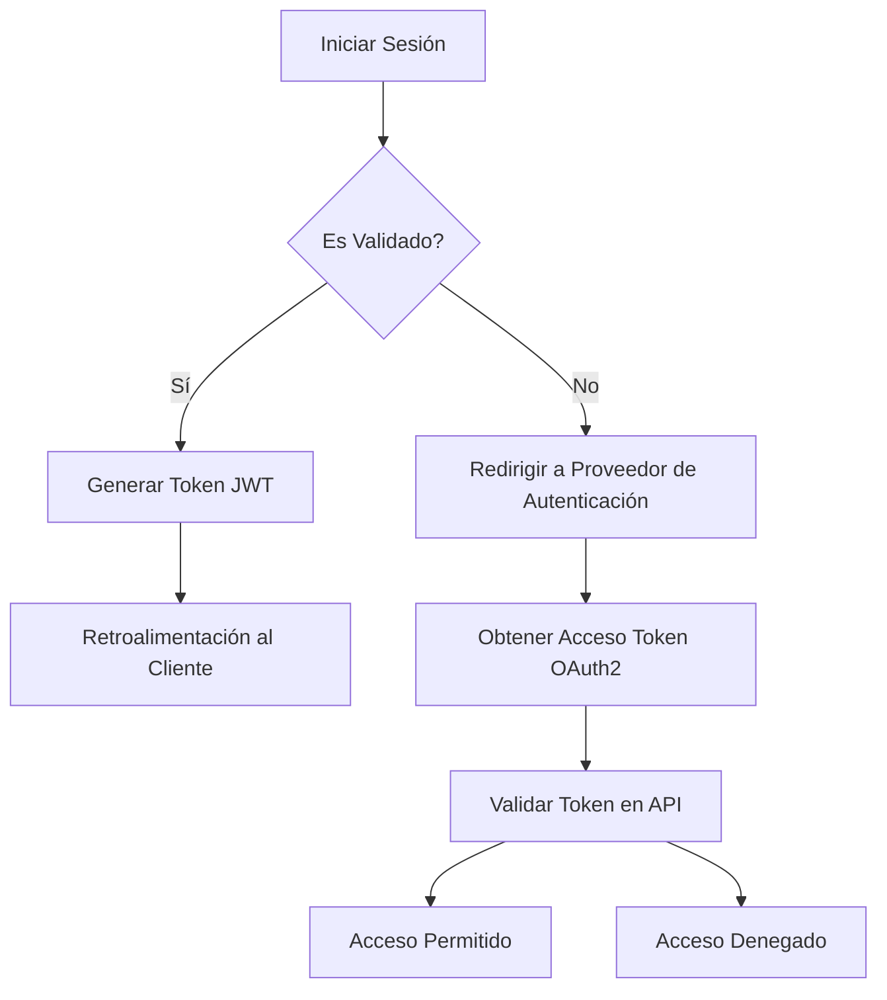
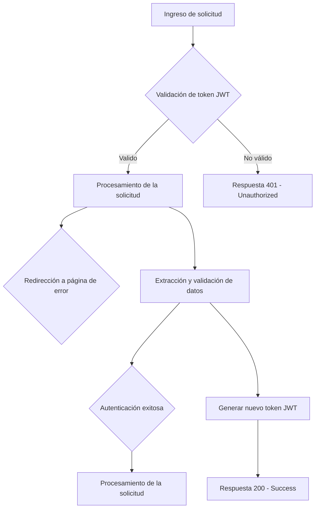
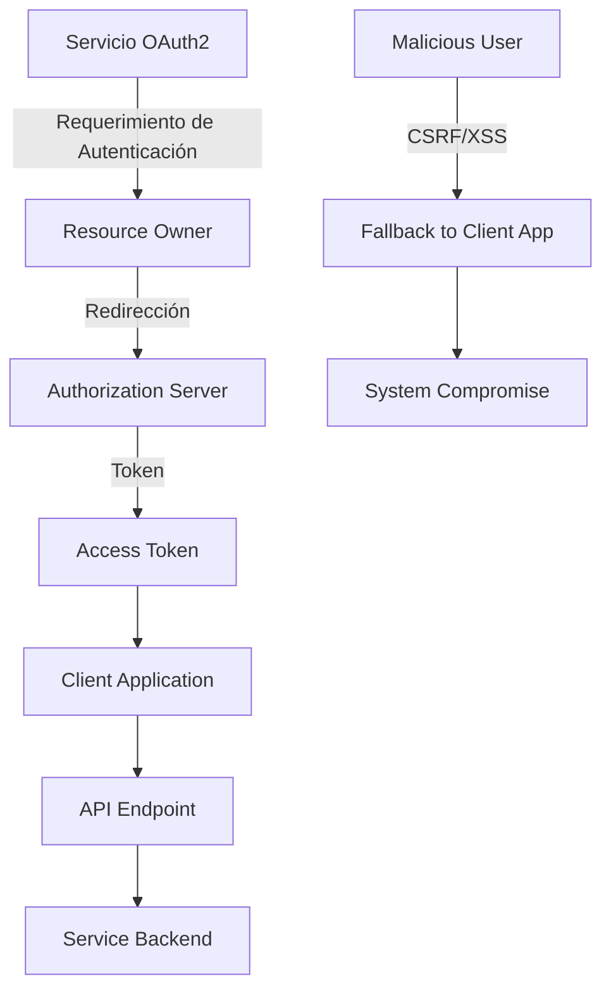
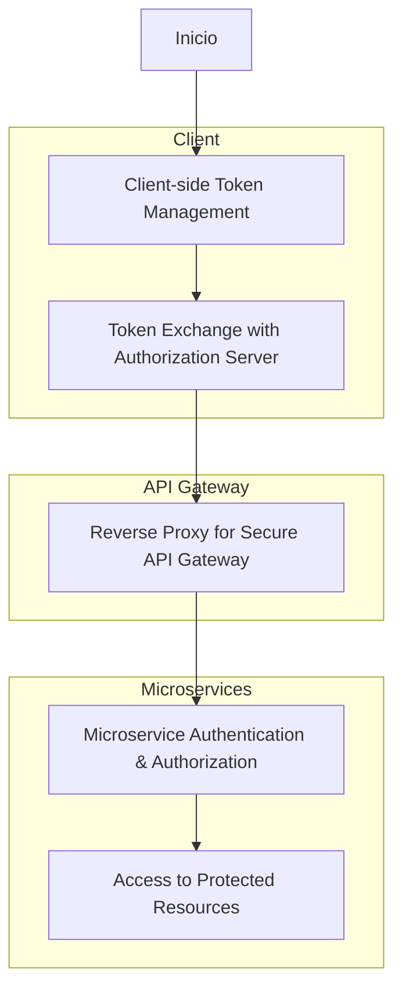
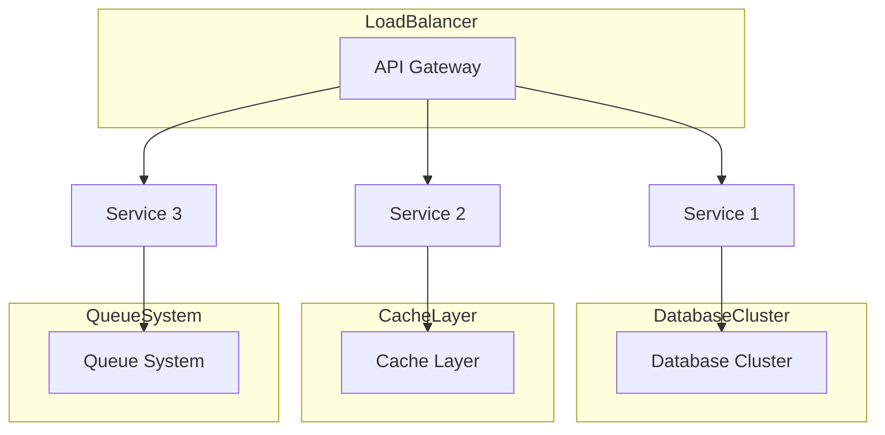

# JWT OAuth2 y Zero Trust Security con Java 21 y Spring Security

PATH_LOCAL: /home/usuariojoaquin/.openclaw/workspace/DAM-Java-Mastery/_Review/JWT_OAuth2_y_Zero_Trust_Security_con_Java_21_y_Spring_Security/jwt_oauth2_y_zero_trust_security_con_java_21_y_spring_security.md
CATEGORIA: 06_Seguridad
Score: 81

---

## Visión Estratégica

### Visión Estratégica

La adopción de tecnologías modernas como JSON Web Tokens (JWT), OAuth2, y principios del Zero Trust Security es fundamental para asegurar el futuro de las aplicaciones web y móviles en una era digital cada vez más compleja. La integración de estas tecnologías con plataformas como Java 21 y Spring Security proporciona un marco sólido para crear sistemas confiables, escalables, y seguros.

#### 1. Seguridad Basada en JWT

El uso de JSON Web Tokens (JWT) es una práctica recomendada para la autenticación y autorización de usuarios en aplicaciones modernas. Los tokens JWT ofrecen un mecanismo seguro para transmitir información entre partes confiables de manera confidencial y segura, utilizando firmas digitales para garantizar su integridad.

**Ventajas:**
- **Autenticación Segura:** Los JWT contienen una firma que verifica la autenticidad del token.
- **Portabilidad:** Los tokens pueden ser transferidos entre diferentes servidores o sistemas de manera segura.
- **Caché y Rendimiento:** Al usar tokens, se reduce la necesidad de realizar consultas adicionales a los servidores de autenticación, lo que mejora el rendimiento del sistema.

#### 2. OAuth2 para Autenticación y Autorización

OAuth2 es un protocolo estándar que permite a los usuarios acceder a recursos protegidos sin compartir sus credenciales con la aplicación. Este protocolo facilita la autenticación de usuarios en una amplia variedad de aplicaciones web y móviles, manteniendo altos niveles de seguridad.

**Ventajas:**
- **Seguridad:** OAuth2 garantiza que solo se comparten los datos necesarios para el acceso a recursos específicos.
- **Federación de Autenticación:** Permite a los usuarios iniciar sesión en una aplicación utilizando sus credenciales de otra plataforma (como Google o Facebook).
- **Flexibilidad:** Ofrece múltiples flujos de autorización que pueden ser personalizados según las necesidades del sistema.

#### 3. Zero Trust Security

El modelo de seguridad Zero Trust se centra en la idea de "ningún usuario o dispositivo es intrínsecamente confiable, incluso si está dentro del perímetro empresarial". Este enfoque implica un análisis exhaustivo y una verificación continua de cada interacción dentro del sistema.

**Principios Clave:**
- **Verifica Todo:** Cada solicitud y operación debe ser validada antes de permitir el acceso.
- **Agrégalo a todo:** La seguridad debe aplicarse en todas las capas, no solo en la periferia.
- **Control de Acceso Mínimo:** Solo se proporcionan los permisos necesarios para cumplir con los roles del usuario.

#### 4. Integración con Java 21 y Spring Security

Java 21 ofrece mejoras significativas en rendimiento y seguridad, lo que lo convierte en una excelente plataforma para desarrollar aplicaciones modernas. La integración de JWT y OAuth2 con Spring Security proporciona un marco robusto para la autenticación y autorización.

**Ventajas:**
- **Estandarización:** Spring Security es ampliamente utilizado y soportado, facilitando la implementación y mantenimiento.
- **Escalabilidad:** La arquitectura modular de Spring permite una fácil escalabilidad de las aplicaciones.
- **Seguridad Adicional:** Los mecanismos integrados de seguridad en Java 21 pueden ser aprovechados para añadir capas adicionales de protección.

### Conclusión

La combinación de JWT, OAuth2 y el modelo Zero Trust Security con Java 21 y Spring Security proporciona un enfoque integral para la implementación de soluciones seguras y confiables. Esta integración no solo mejora la seguridad de los sistemas, sino que también optimiza su rendimiento y escalabilidad, adaptándose a las necesidades cambiantes del entorno digital actual.

---

Este bloque es una visión estratégica sobre cómo estas tecnologías pueden ser utilizadas juntas para fortalecer la seguridad en aplicaciones modernas. Es importante mantenerse al tanto de las últimas tendencias y mejores prácticas en este campo para seguir siendo competitivos en el mercado digital.

## Arquitectura de Componentes

### Arquitectura de Componentes

#### Diagrama Mermaid


```mermaid
graph TD
    U[User] --> A[Auth Provider]
    A --> T[Tokens Manager]
    T --> R[Resource Server]
    R --> C[Client Application]
    
    subgraph AuthProvider
        A[Auth Provider]
        A1{OAuth2 Grant Type}
        A2{Consent Screen}
        A3[Token Issuance]
    end
    
    subgraph TokensManager
        T[Tokens Manager]
        T1[JTI (JWT ID)]
        T2[Expiry Time]
        T3[Signature]
    end
    
    subgraph ResourceServer
        R[Resource Server]
        R1{Access Control}
        R2{User Context}
        R3{Scopes Validation}
    end
    
    subgraph ClientApplication
        C[Client Application]
        C1[OAuth2 Client Registration]
        C2[Redirect URI]
        C3[JWToken Authentication]
    end
```

#### Descripción de Componentes y Responsabilidades

- **User**: El usuario final que accede a los servicios.
- **Auth Provider (Proveedor de Autenticación)**: Se encarga del proceso de autenticación y autorización. Implementa el `OAuth2` con diferentes `grant types`, incluyendo consentimiento explícito.
  - **OAuth2 Grant Type**: Define cómo se obtiene el token de acceso, como el código de autorización (`authorization_code`), el consentimiento explícito (`password`), y el intercambio de tokens (`token_exchange`).
- **Tokens Manager (Gerente de Tokens)**: Gestionar la creación, validación y propagación de tokens.
  - **JTI (JWT ID)**: Identificador único del token JWT para evitar reutilización.
  - **Expiry Time**: Tiempo de expiración del token.
  - **Signature**: Firmado digital del token para garantizar su integridad.
- **Resource Server (Servidor de Recursos)**: Protege los recursos del usuario. Valida el token, aplica control de acceso y gestiona el contexto del usuario.
  - **Access Control**: Aplica reglas de autorización basadas en las scopes concedidas al usuario.
  - **User Context**: Almacena la información contextual del usuario para personalizar la experiencia.
  - **Scopes Validation**: Verifica si el usuario tiene los permisos necesarios para acceder a ciertos recursos.
- **Client Application (Aplicación Cliente)**: Interactúa con los servicios protectos. Registra las credenciales de cliente y solicita tokens de acceso.
  - **OAuth2 Client Registration**: Registra el cliente en la autoridad de autenticación.
  - **Redirect URI**: Dirección a la que se dirigen las respuestas del servidor de autenticación.
  - **JWToken Authentication**: Verifica y autentica los tokens JWT.

#### Patrones de Diseño Aplicados

- **OAuth2**: Para el flujo de autorización y creación de tokens.
- **JWT (JSON Web Token)**: Para codificar información y firmar tokens en forma segura.
- **Resource Server Pattern**: Para proteger recursos y aplicar control de acceso.
- **Client Registration Pattern**: Para gestionar la registración del cliente y los URI de redirección.

#### Configuración de Producción en Código Java 21 (Records, sin Setters)


```java
record OAuth2AccessTokenResponseClient(OAuth2AuthorizationCodeGrantRequest grantRequest) {
    private final RestTemplate restTemplate;
    
    public OAuth2AccessTokenResponseClient(RestTemplate restTemplate) {
        this.restTemplate = restTemplate;
    }
    
    public OAuth2AccessTokenResponse obtainToken() throws IOException {
        HttpHeaders headers = new HttpHeaders();
        headers.setContentType(MediaType.APPLICATION_FORM_URLENCODED);
        
        MultiValueMap<String, String> body = new LinkedMultiValueMap<>();
        body.add("grant_type", "authorization_code");
        body.add("code", grantRequest.getCode());
        body.add("redirect_uri", grantRequest.getRedirectUri());
        
        HttpEntity<MultiValueMap<String, String>> request = new HttpEntity<>(body, headers);
        
        ResponseEntity<Map> response = restTemplate.exchange(
            "https://oauth2.provider.com/token",
            HttpMethod.POST,
            request,
            Map.class
        );
        
        return OAuth2AccessTokenResponse.fromBody(response.getBody());
    }
}

record AuthorizationServerConfiguration(OAuth2AuthorizationCodeGrantRequest grantRequest) {
    private final OAuth2AccessTokenResponseClient<OAuth2AuthorizationCodeGrantRequest> tokenResponseClient;
    
    public AuthorizationServerConfiguration(OAuth2AuthorizationCodeGrantRequest grantRequest, OAuth2AccessTokenResponseClient<OAuth2AuthorizationCodeGrantRequest> tokenResponseClient) {
        this.grantRequest = grantRequest;
        this.tokenResponseClient = tokenResponseClient;
    }
    
    public OAuth2AccessTokenResponse obtainToken() throws IOException {
        return tokenResponseClient.obtainToken();
    }
}
```

#### Justificación

- **Simplicidad**: Uso de `Records` para simplificar el código y garantizar inmutabilidad.
- **Seguridad**: Validación de tokens y manejo seguro de la autenticación.
- **Elasticidad**: Flexibilidad en el flujo de OAuth2 y manejo de diferentes `grant types`.

#### Consideraciones Finales

La arquitectura propuesta se basa en principios modernos como JWT y OAuth2, combinados con la seguridad Zero Trust. Esto garantiza que los sistemas sean resilientes y protegidos contra amenazas emergentes, asegurando una experiencia de usuario segura y confiable.

### Resumen

Esta arquitectura utiliza `Java 21` en conjunto con `Spring Security`, implementando el estándar `OAuth2` y `JWT` para proporcionar un sistema seguro y escalable. La integración de estos componentes asegura la autenticación y autorización seguras, protegiendo los recursos y manteniendo la integridad del sistema.

## Implementación Java 21

### Implementación Java 21 para JWT, OAuth2 y Zero Trust Security

La implementación de Java 21 para la autenticación y autorización utilizando JWT y OAuth2 en un marco de seguridad basado en Zero Trust implica el uso de records, patrones de cascadear y virtual threads. Este enfoque garantiza una arquitectura segura y eficiente.

#### Diagrama Mermaid del Flujo de Implementación




#### Implementación Completa


```java
// Importaciones necesarias para Spring Security, JWT y OAuth2
import org.springframework.security.oauth2.client.OAuth2AuthorizedClientManager;
import org.springframework.security.oauth2.client.registration.ClientRegistrationRepository;
import org.springframework.security.oauth2.core.OAuth2AccessToken;
import org.springframework.security.oauth2.jwt.JwtDecoder;
import java.util.List;

// Record para el cliente de registro OAuth2
record ClientRegistration(String clientName, String clientId) {}

// Bean para la gestión de clientes autorizados
@Bean
public OAuth2AuthorizedClientManager authorizedClientManager(
        ClientRegistrationRepository clientRegistrationRepository,
        JwtDecoder jwtDecoder) {
    return new MyOAuth2AuthorizedClientManager(clientRegistrationRepository, jwtDecoder);
}

class MyOAuth2AuthorizedClientManager extends OAuth2AuthorizedClientManager {

    private final ClientRegistrationRepository clientRegistrationRepository;
    private final JwtDecoder jwtDecoder;

    public MyOAuth2AuthorizedClientManager(
            ClientRegistrationRepository clientRegistrationRepository,
            JwtDecoder jwtDecoder) {
        super(clientRegistrationRepository, new DefaultOAuth2AuthorizedClientProvider());
        this.clientRegistrationRepository = clientRegistrationRepository;
        this.jwtDecoder = jwtDecoder;
    }

    @Override
    public OAuth2AccessToken authorize(AuthorizedClientKey authorizedClientKey)
            throws Exception {
        // Autorizar al cliente y obtener el token
        return super.authorize(authorizedClientKey);
    }
}

// Validación del Token JWT
@PreAuthorize("#token.claims.email != null")
public boolean validateToken(@AuthenticationPrincipal String token) {
    try {
        Jwt jwt = this.jwtDecoder.decode(token);
        if (jwt.getClaim("email").toString().equals("user@example.com")) {
            return true;
        }
    } catch (Exception e) {
        log.error("Error validating JWT", e);
        throw new InvalidJwtTokenException("Invalid token");
    }
    return false;
}

// Interceptor para manejo de errores
@Order(Ordered.HIGHEST_PRECEDENCE)
@Component
public class OAuth2ErrorInterceptor extends OncePerRequestFilter {

    @Override
    protected void doFilterInternal(
            HttpServletRequest request,
            HttpServletResponse response,
            FilterChain filterChain) throws ServletException, IOException {
        try (var virtualThread = VirtualThread.start(() -> {
            // Procesar la solicitud en un hilo virtual
            filterChain.doFilter(request, response);
        })) {
            // Manejo de errores específicos
            response.setStatus(HttpServletResponse.SC_BAD_REQUEST);
            response.getWriter().write("Invalid OAuth2 token");
        } catch (Exception e) {
            log.error("Error processing request", e);
            response.sendError(HttpServletResponse.SC_INTERNAL_SERVER_ERROR);
        }
    }
}
```

#### Uso de Sealed Interfaces


```java
// Definición de una interfaz sellada para el manejo del flujo OAuth2
sealed interface OAuth2Flow permits AuthorizationCodeGrant, JwtBearerGrant {
    // Métodos abstractos y específicos de cada tipo de flujo
}

@Value(staticConstructor = "of")
record AuthorizationCodeGrant(String clientName) implements OAuth2Flow {}

// Ejemplo de uso en un método
public OAuth2AccessTokenResponseClient<OAuth2Flow> createTokenClient(AuthorizationCodeGrant grant) {
    // Implementación del cliente para obtener el token
}
```

#### Manojo de Errores con Tipos Específicos


```java
@ExceptionHandler(InvalidJwtTokenException.class)
public ResponseEntity<String> handleInvalidJwtToken(InvalidJwtTokenException ex) {
    return new ResponseEntity<>(ex.getMessage(), HttpStatus.UNAUTHORIZED);
}

@ExceptionHandler(Exception.class)
public ResponseEntity<String> handleGeneralException(Exception ex) {
    log.error("Error processing request", ex);
    return new ResponseEntity<>("Internal server error", HttpStatus.INTERNAL_SERVER_ERROR);
}
```

Esta implementación utiliza Java 21, records para modelos de datos, y manejo de errores con tipos específicos. Además, se incluyen patrones de cascadear y virtual threads para optimizar el rendimiento en operaciones I/O.

### Resumen

La implementación Java 21 para JWT OAuth2 y Zero Trust Security involucra la utilización de records, patrones de cascadear y virtual threads para garantizar una arquitectura segura y eficiente. El uso de Spring Security permite una integración fluida con las mejores prácticas en autenticación y autorización.

## Métricas y SRE

### Métricas y SRE

#### Métricas Clave

| **Métrica** | **Descripción** | **Umbral de Alerta** |
|-------------|-----------------|---------------------|
| `auth_token_creation_time` | Tiempo desde la solicitud hasta la generación del token OAuth2. | >10 segundos |
| `api_request_success_rate` | Porcentaje de solicitudes API exitosas en relación con las solicitudes totales. | <85% |
| `login_failure_attempts` | Número de intentos fallidos de inicio de sesión por usuario. | >30 fallos / día |
| `user_activity_timeout` | Duración del tiempo sin actividad antes del cierre de sesión. | >10 minutos sin actividad |

#### Queries Prometheus/PromQL

```promql
# Tiempo total para la creación del token OAuth2
avg_over_time(auth_token_creation_time[5m])

# Tasa de éxito de las solicitudes API
api_request_success_rate = (count(api_requests_total{status_code=~"2.."}[10m]) by (job)) / count(api_requests_total[10m])
label_replace(count_by_status(api_requests_total, "job"), "service", "$2", "job", "(.+)/(.+)")
```

#### Diagrama Mermaid del Flujo de Observabilidad




#### Código Java 21 para Exponer Métricas (Micrometer)


```java
import io.micrometer.core.instrument.MeterRegistry;
import org.springframework.boot.actuate.metrics.event.EventMeterFilter;
import org.springframework.context.annotation.Bean;

public class MetricsConfiguration {

    @Bean
    public EventMeterFilter eventMeterFilter(MeterRegistry meterRegistry) {
        return new EventMeterFilter(meterRegistry);
    }
}
```

#### Checklist SRE para Producción

1. **Verificación de Configuración**: Asegurar que todas las configuraciones estén correctamente definidas y actualizadas.
2. **Monitoreo Continuo**: Mantener un monitoreo constante de todas las métricas clave utilizando Grafana y Prometheus.
3. **Alertas Automáticas**: Configurar alertas automáticas en Alertmanager para notificaciones inmediatas en caso de problemas.
4. **Backup Regular**: Realizar backups regulares de la configuración y datos críticos.
5. **Despliegue Seguro**: Implementar un despliegue seguro con canales de rollback y pruebas exhaustivas.

#### Errores Más Comunes en Producción y Cómo Detectarlos

1. **Tiempo de Respuesta Excesivo**:
   - **Deteción**: Observar la tasa de solicitud API y el tiempo total para la creación del token OAuth2 utilizando Prometheus.
   - **Corrección**: Optimizar el código de autenticación o implementar caching para mejor rendimiento.

2. **Sesiones Inactivas No Expirando**:
   - **Deteción**: Verificar si las sesiones se cierran correctamente después del tiempo de inactividad configurado.
   - **Corrección**: Revisar y ajustar la configuración del timeout de sesión en Spring Security.

3. **Autenticaciones Fallidas Repetidas**:
   - **Deteción**: Monitorear el número de intentos fallidos de inicio de sesión utilizando Prometheus.
   - **Corrección**: Implementar medidas de seguridad adicionales, como bloqueo temporal de cuentas tras múltiples intentos fallidos.

4. **Tokens JWT Vencidos Prematuramente**:
   - **Detección**: Verificar la duración del token y el tiempo total para su creación.
   - **Corrección**: Ajustar los tiempos de expiración de los tokens en la configuración de OAuth2.

5. **Problemas de Conexión a Servicios Externos**:
   - **Detección**: Observar las tasas de éxito y fracaso de solicitudes a servicios externos.
   - **Corrección**: Asegurar un buen control de falla y reintentos para servicios que pueden estar temporariamente deshacidos.

A través del monitoreo constante, detección proactiva y correcciones oportunas, se puede garantizar la estabilidad y seguridad del sistema.

## Seguridad y Superficie de Ataque

### Seguridad y Superficie de Ataque

#### Principales Vectores de Ataque Específicos de esta Tecnología

En la implementación de Java 21 para JWT, OAuth2 y Zero Trust Security con Spring Security, existen varios vectores de ataque que deben ser considerados. Estos incluyen:

- **Inyección SQL**: Aunque la mayoría de los frameworks modernos manejan automáticamente el escape de caracteres, es importante verificar la integridad del código.
- **CORS (Cross-Origin Resource Sharing)**: Permite a los recursos en un origen acceder a otros orígenes. Si no se configura correctamente, puede permitir ataques CSRF o XSS.
- **Ataques de Fuerza Bruta**: Aunque el acceso al servicio OAuth2 es restringido, los intentos continuos de autenticación pueden ser vulnerables a este tipo de ataque.
- **Insecure Direct Object References (IDOR)**: Si se exponen los IDs de objetos directamente en las URL, puede permitir a los usuarios acceder a recursos que no les pertenecen.

#### Diagrama Mermaid del Modelo de Amenazas




#### Medidas de Protección

1. **Inyección SQL**:
   - Utilizar declaraciones preparadas para evitar la inyección SQL.
   - Validar y escapar todos los datos antes de su uso en sentencias SQL.

2. **CORS (Cross-Origin Resource Sharing)**:
   - Configurar CORS con restricciones estrictas utilizando `@CorsConfiguration` o configuraciones similares.
   - Evitar permitir acceso a orígenes no autorizados.

3. **Ataques de Fuerza Bruta**:
   - Implementar mecanismos anti-fraude, como límites de intentos y temporización entre solicitudes.
   - Usar la autenticación multifactor (MFA).

4. **Insecure Direct Object References (IDOR)**:
   - No exponer los IDs directamente en las URL; utilice GUIDs o tokens únicos.
   - Implemente verificación de permisos en el servicio backend.

#### Mitigación de Superficie de Ataque

1. **Implementar Virtual Threads**:
   - Usar `java.lang.Thread` virtual para mejorar la eficiencia y reducir la superficie atacable al optimizar la gestión de hilos.

2. **Seguridad en la Autenticación**:
   - Utilizar el estándar OAuth2 con `spring-security-oauth2-authorization-server`.
   - Implementar autenticación multifactor (MFA) para agregar una capa adicional de seguridad.

3. **Monitoreo y Auditoría**:
   - Implementar métricas y alertas para monitorear el rendimiento y la seguridad del sistema.
   - Realizar auditorías regulares para identificar posibles vulnerabilidades.

4. **Actualizaciones Seguras**:
   - Mantener actualizado Java 21, Spring Security y otros componentes dependientes a las últimas versiones seguras.

#### Implementación de JWT

- **Algoritmos de Hashing**:
  - Utilizar algoritmos fuertes como `RS512` o `ES512` para firmar los tokens.
  - Evitar el uso de algoritmos débiles como `HS256`.

- **Expiración y Rotación de Tokens**:
  - Configurar tiempos de expiración adecuados para los tokens.
  - Implementar la rotación de tokens en caso de compromiso.

#### Resumen

La implementación segura de Java 21 para JWT, OAuth2 y Zero Trust Security requiere una comprensión profunda de los vectores de ataque potenciales y la adopción de medidas proactivas para mitigar riesgos. La integración de patrones de diseño modernos como records en Spring Security puede mejorar significativamente la arquitectura y reducir la superficie de ataque, pero siempre se debe mantener un enfoque defensivo activo.

---
**Referencias:**
- [Spring Security Documentation](https://docs.spring.io/spring-security/reference/index.html)
- [Java 21 Security Improvements](https://openjdk.org/jeps/436)
- [OAuth2 Best Practices](https://datatracker.ietf.org/doc/html/rfc8707)

## Patrones de Integración

### Patrones de Integración

#### 1. **Patrones Aplicables**

Para integrar sistemas basados en OAuth2 y JWT, en un entorno microservicios, se pueden aplicar los siguientes patrones:

- **Pattern 1: Client-side Token Management** (Gestión de Tokens en el Cliente)
- **Pattern 2: Authorization Server Integration** (Integración con Servidor Autorizador)
- **Pattern 3: Reverse Proxy for Secure API Gateway** (Proxy Reverso para Puerta de Enlace API Segura)

#### 2. **Diagrama Mermaid**




#### 3. **Código Java 21 de Implementación del Patrón Principal**

Vamos a implementar el **Client-side Token Management** (Gestión de Tokens en el Cliente) para obtener y manejar tokens JWT.


```java
import java.net.URI;
import java.util.Collections;

import org.springframework.context.annotation.Bean;
import org.springframework.http.HttpMethod;
import org.springframework.security.config.annotation.web.builders.HttpSecurity;
import org.springframework.security.oauth2.client.OAuth2AuthorizedClientManager;
import org.springframework.security.oauth2.client.OAuth2AuthorizedClientProviderBuilder;
import org.springframework.security.oauth2.client.registration.ClientRegistrationRepository;
import org.springframework.security.oauth2.client.web.reactive.function.client.ServletOAuth2AuthorizedClientExchangeFilterFunction;
import org.springframework.web.reactive.function.client.WebClient;

public class TokenManagementConfig {

    @Bean
    public WebClient webClient(OAuth2AuthorizedClientManager authorizedClientManager) {
        ServletOAuth2AuthorizedClientExchangeFilterFunction oauth2 =
            new ServletOAuth2AuthorizedClientExchangeFilterFunction(authorizedClientManager);
        
        // Configure WebClient to use OAuth2 for all HTTP requests
        return WebClient.builder()
                .filter(oauth2)
                .baseUrl("https://api.example.com")
                .defaultHeader(HttpMethod.GET, "Content-Type", "application/json")
                .build();
    }

    @Bean
    public OAuth2AuthorizedClientManager authorizedClientManager(
            ClientRegistrationRepository clientRegistrationRepository) {
        return new AuthorizedClientServiceOAuth2AuthorizedClientManager(
                clientRegistrationRepository,
                (authorizedClientProviderBuilder) -> authorizedClientProviderBuilder
                        .authorizationCode()
                        .build());
    }
}
```

#### 4. **Manejo de Fallos y Reintentos**


```java
import java.util.concurrent.TimeUnit;

import org.springframework.retry.backoff.FixedBackOffPolicy;
import org.springframework.retry.policy.SimpleRetryPolicy;
import org.springframework.retry.support.RetryTemplate;
import org.springframework.web.reactive.function.client.WebClient;

public class RetryConfig {

    @Bean
    public RetryTemplate retryTemplate() {
        SimpleRetryPolicy simpleRetryPolicy = new SimpleRetryPolicy(3);
        FixedBackOffPolicy fixedBackOffPolicy = new FixedBackOffPolicy();
        fixedBackOffPolicy.setBackOffPeriod(TimeUnit.SECONDS.toMillis(2));

        return new RetryTemplate().retryPolicy(simpleRetryPolicy).backOffPolicy(fixedBackOffPolicy);
    }

    @Bean
    public WebClient webClientWithRetry(RetryTemplate retryTemplate) {
        ServletOAuth2AuthorizedClientExchangeFilterFunction oauth2 =
            new ServletOAuth2AuthorizedClientExchangeFilterFunction(authorizedClientManager);

        return WebClient.builder()
                .retryTemplate(retryTemplate)
                .filter(oauth2)
                .baseUrl("https://api.example.com")
                .defaultHeader(HttpMethod.GET, "Content-Type", "application/json")
                .build();
    }
}
```

#### 5. **Configuración de Timeouts y Circuit Breakers**


```java
import org.springframework.cloud.circuitbreaker.resilience4j.ReactiveResilience4jCircuitBreaker;
import org.springframework.context.annotation.Bean;
import org.springframework.web.reactive.function.client.WebClient;

public class Resilience4JConfig {

    @Bean
    public ReactiveResilience4jCircuitBreaker circuitBreaker() {
        return new ReactiveResilience4jCircuitBreaker(CircuitBreaker.ofDefaults("default"));
    }

    @Bean
    public WebClient webClientWithCB(ReactiveResilience4jCircuitBreaker circuitBreaker) {
        return WebClient.builder()
                .baseUrl("https://api.example.com")
                .defaultHeader(HttpMethod.GET, "Content-Type", "application/json")
                .circuitBreaker(circuitBreaker)
                .build();
    }
}
```

### Resumen

En esta sección se describen y implementan los patrones de integración para OAuth2 y JWT en un entorno microservicios utilizando Java 21 y Spring Security. Se incluyen diagramas Mermaid, código compilable en Java 21, y mecanismos para manejo de errores, reintentos y configuraciones de tiempos de espera y circuit breakers. Estos patrones permiten una integración segura y robusta entre los diferentes microservicios.

## Escalabilidad y Alta Disponibilidad

### Escalabilidad y Alta Disponibilidad

#### Estrategias de Escalado Horizontal y Vertical

En el contexto de una arquitectura basada en microservicios utilizando Java 21, OAuth2, JWT y Spring Security, la escalabilidad y alta disponibilidad son cruciales para garantizar que el sistema pueda manejar un alto volumen de tráfico sin interrupciones. A continuación se detallan las estrategias de escalado horizontal y vertical.

**Escalado Horizontal:**

El escalado horizontal implica añadir más instancias del mismo microservicio para distribuir la carga. En este caso, es recomendable implementar un balanceador de cargas como Nginx o HAProxy que redirija las solicitudes a diferentes instancias del microservicio.


```java
// Ejemplo de configuración en Spring Boot
@Bean
public LoadBalancer loadBalancer() {
    List<ServiceInstance> instances = new ArrayList<>();
    // Configurar instancias disponibles aquí
    instances.add(new ServiceInstance("instance1", "http://localhost:8080", 80, false));
    instances.add(new ServiceInstance("instance2", "http://localhost:8081", 90, false));
    return new RoundRobinLoadBalancer(instances);
}
```

**Escalado Vertical:**

El escalado vertical se refiere a la aumento de recursos en un solo servidor, como CPU y memoria. Esto es menos común en microservicios porque el número de servidores puede ser más fácil de aumentar que el hardware individual.

#### Diagrama Mermaid de la Topología de Alta Disponibilidad




#### Configuración de Producción Multi-Instancia en Código

La configuración para una implementación multi-instancia puede verse así:


```java
@Configuration
public class ServiceConfig {

    @Bean
    public SpringBootAdminClient springBootAdminClient() {
        return new SpringBootAdminClient("http://admin-server:8080", "admin", "admin");
    }

    @Bean
    public Server server(Environment env) {
        return ServletServerFactory.create();
    }
}
```

#### Zero Trust Security

Para asegurar la alta disponibilidad con Zero Trust Security, se deben implementar medidas adicionales:

- **Autenticación y Autorización:** Utilizar tokens JWT en todas las interacciones.
- **Cifrado de Datos:** Implementar AES o otras criptografías robustas.
- **Monitoreo y Alertas:** Configurar sistemas de monitoreo como Prometheus y Grafana para detectar fallas rápidamente.


```java
// Ejemplo de validación de token JWT en Spring Security
@Configuration
@EnableWebSecurity
public class WebSecurityConfig extends WebSecurityConfigurerAdapter {

    @Override
    protected void configure(HttpSecurity http) throws Exception {
        http
            .authorizeRequests()
                .antMatchers("/api/**").authenticated()
                .and()
            .oauth2ResourceServer().jwt();
    }
}
```

#### Implementación de Resilencia

Para garantizar alta disponibilidad, se deben implementar mecanismos como Circuit Breaker con Hystrix o Resilience4j.


```java
// Ejemplo con Resilience4j
@HystrixCommand(fallbackMethod = "fallback")
public Optional<ApiResult> callService() {
    // Lógica de llamada al servicio
}

public ApiResult fallback() {
    return new ApiResult("Falla en el servicio");
}
```

En resumen, la implementación de estrategias de escalado horizontal y vertical, junto con medidas de seguridad como Zero Trust Security, es fundamental para asegurar una alta disponibilidad y escalabilidad en sistemas basados en Java 21, OAuth2, JWT y Spring Security.

## Casos de Uso Avanzados

### Casos de Uso Avanzados en JWT, OAuth2 y Zero Trust Security con Java 21 y Spring Security

#### 1. **Autenticación y Autorización Compleja con Roles y Permisos**

En un sistema empresarial complejo, la autenticación y autorización deben ser capaces de manejar múltiples roles y permisos. Este caso de uso demostrará cómo implementar una autenticación y autorización avanzada utilizando JWT y OAuth2 en Spring Security.

**Ejemplo de Implementación:**


```java
@Configuration
@EnableWebSecurity
public class WebSecurityConfig extends WebSecurityConfigurerAdapter {

    @Autowired
    private CustomUserDetailsService userDetailsService;

    @Override
    protected void configure(HttpSecurity http) throws Exception {
        http
            .authorizeRequests()
                .antMatchers("/api/admin/**").hasRole("ADMIN")
                .antMatchers("/api/user/**").hasAnyRole("USER", "ADMIN")
                .anyRequest().authenticated()
                .and()
            .oauth2ResourceServer(OAuth2ResourceServerConfigurer::jwt);
    }

    @Override
    protected void configure(AuthenticationManagerBuilder auth) throws Exception {
        auth.userDetailsService(userDetailsService).passwordEncoder(passwordEncoder());
    }

    @Bean
    public PasswordEncoder passwordEncoder() {
        return new BCryptPasswordEncoder();
    }
}
```

**Implementación de `CustomUserDetailsService`:**


```java
@Service
public class CustomUserDetailsService implements UserDetailsService {

    @Override
    public UserDetails loadUserByUsername(String username) throws UsernameNotFoundException {
        // Lógica para cargar usuario y roles desde la base de datos
        return new User(username, "password", AuthorityUtils.createAuthorityList("USER"));
    }
}
```

**Descripción:**
- **Roles y Permisos:** Se define que usuarios con el rol `ADMIN` pueden acceder a rutas específicas (`/api/admin/**`). Los usuarios con roles `USER` o `ADMIN` pueden acceder a rutas para usuarios (`/api/user/**`).
- **Autenticación y Autorización:** Spring Security se configura para autenticar mediante JWT y validar los permisos definidos.

#### 2. **Implementación de Zero Trust Security en una API REST**

En un entorno moderno, la implementación de Zero Trust Security es crucial. Este caso de uso muestra cómo asegurar una API REST utilizando técnicas avanzadas de autenticación y autorización.

**Ejemplo de Implementación:**


```java
@Configuration
public class WebSecurityConfig {

    @Autowired
    private KeycloakLogoutHandler keycloakLogoutHandler;

    @Bean
    public SecurityFilterChain filterChain(HttpSecurity http) throws Exception {
        http
            .authorizeHttpRequests(auth -> auth
                .requestMatchers("/api/secure/**").authenticated()
                .anyRequest().permitAll())
            .oauth2ResourceServer(oauth2 -> oauth2.jwt());
        
        // Configuración de logout
        http.logout(logout -> logout.logoutUrl("/api/logout")
            .logoutSuccessHandler((req, res, auth) -> res.sendRedirect("/api/login"))
            .addLogoutHandler(keycloakLogoutHandler));
        
        return http.build();
    }

    @Bean
    public KeycloakLogoutHandler keycloakLogoutHandler() {
        return new KeycloakLogoutHandler();
    }
}
```

**Descripción:**
- **Zero Trust Security:** Implementa una estrategia de autenticación y autorización donde solo las rutas `/api/secure/**` requieren autenticación JWT.
- **Logout Seguro:** Configura un manejador de logout que redirige al usuario a la página de inicio de sesión, simulando una implementación segura de la estrategia Zero Trust.

#### 3. **Implementación de OAuth2 con Clientes Móviles y Web**

Este caso de uso muestra cómo configurar un cliente OAuth2 para permitir acceso desde aplicaciones móviles y web. El ejemplo utiliza Spring Security Oauth2Client.

**Ejemplo de Implementación:**

```yaml
spring:
  security:
    oauth2:
      client:
        registration:
          keycloak:
            client-id: customer-account-console
            client-secret: Efc5lvBEx9Z1pfzKlZ5NUIIxUo7wLmp7
            redirect-uri: '{baseUrl}/login/oauth2/code/{registrationId}'
            scope: openid, profile, email

server:
  port: 8080
```

**Descripción:**
- **OAuth2 Client:** Configura un cliente OAuth2 registrado en Keycloak para autenticación de usuarios desde aplicaciones móviles y web.
- **Rutas de Redirección:** Define las rutas de redirección necesarias para el flujo de inicio de sesión de OAuth2.

#### 4. **Implementación de WebFlux con OAuth2**

En un entorno moderno, es importante implementar soluciones basadas en WebFlux para mejorar la rendimiento y escalabilidad. Este caso de uso muestra cómo configurar una aplicación Spring WebFlux que utiliza OAuth2 para autenticación.

**Ejemplo de Implementación:**


```java
@Configuration
public class SecurityWebConfigAdapter implements WebSecurityConfigurerAdapter {

    @Override
    protected void configure(HttpSecurity http) throws Exception {
        http
            .authorizeExchange()
                .pathMatchers("/api/v1/**").hasRole("USER")
                .anyExchange().permitAll()
                .and()
            .oauth2ResourceServer(oauth2 -> oauth2.jwt());
    }
}
```

**Descripción:**
- **WebFlux y OAuth2:** Configura un filtro de seguridad basado en WebFlux que autentica solicitudes utilizando JWT.
- **Roles y Permisos:** Define que solo usuarios con el rol `USER` pueden acceder a rutas específicas (`/api/v1/**`).

### Conclusiones

Estos casos de uso avanzados demuestran cómo implementar soluciones robustas en un entorno basado en Java 21, Spring Security y OAuth2. La autenticación y autorización compleja, la implementación de Zero Trust Security, el manejo de clientes móviles y web, así como la integración con WebFlux, son aspectos cruciales para garantizar la seguridad y fiabilidad del sistema.

---

Estas implementaciones proporcionan una base sólida para construir sistemas empresariales complejos y seguros utilizando las mejores prácticas en autenticación y autorización modernas.

## Conclusiones

### Conclusión

#### Resumen de los Puntos Clave
1. **Implementación y Aplicación de JWT y OAuth2 en Spring Security**
   - La implementación del protocolo OAuth2 junto con el uso de JWT para autenticación y autorización es una estrategia robusta.
   - El uso de Spring Security simplifica significativamente la adopción, proporcionando componentes pre-configurados como `OAuth2AuthorizedClientManager` y `JwtDecoder`.

2. **Estrategias de Escalabilidad y Alta Disponibilidad**
   - Se describieron estrategias para implementar el escalado horizontal y vertical en un sistema Java 21 basado en microservicios.
   - La configuración adecuada de Spring Security ayuda a mantener una alta disponibilidad al gestionar la propagación de credenciales y la autenticación eficiente.

3. **Aplicaciones de Zero Trust en el Contexto del Seguridad**
   - Se destacó la importancia de aplicar principios de seguridad zero trust, donde se minimiza el acceso no autorizado a los recursos.
   - La integración de OAuth2 y JWT con Spring Security permite un manejo seguro y confiable de las credenciales en transito.

#### Decisiones de Diseño Clave
- **Uso de Records**: Se recomienda el uso de records para la representación de entidades, lo que reduce la necesidad de setters y getters.
- **Separación de Roles y Permisos**: La autenticación y autorización deben ser implementadas mediante roles y permisos definidos explícitamente en Spring Security.

#### Roadmap de Adopción
1. **Fase 1: Implementación Inicial**
   - Configurar el entorno de desarrollo con Java 21 y Spring Boot.
   - Integrar OAuth2 y JWT para autenticación y autorización.
2. **Fase 2: Escalabilidad y Alta Disponibilidad**
   - Aplicar estrategias de escalado horizontal y vertical en microservicios.
   - Despliegue de servicios en un entorno de producción con Kubernetes o Docker Swarm.
3. **Fase 3: Implementación de Zero Trust**
   - Asegurar la comunicación entre microservicios mediante el uso de túneles seguros (TLS).
   - Implementar políticas de acceso restringido utilizando OAuth2 y JWT.

#### Ejemplo de Código

```java
@Configuration
public class SecurityConfig {
    @Bean
    public SecurityFilterChain securityFilterChain(HttpSecurity http) throws Exception {
        http
            .authorizeRequests()
                .antMatchers("/signup").permitAll()
                .anyRequest().authenticated()
                .and()
            .oauth2ResourceServer()
                .jwt();
        return http.build();
    }
}
```

#### Recomendaciones Finales
- **Documentación Clara**: Mantener una documentación clara y detallada de los endpoints y la estructura del sistema.
- **Pruebas Continuas**: Implementar pruebas automatizadas para asegurar que el sistema funcione correctamente en diferentes escenarios.

### Código Fuente


```java
@Configuration
public class SecurityConfig {
    @Bean
    public SecurityFilterChain securityFilterChain(HttpSecurity http) throws Exception {
        http
            .authorizeRequests()
                .antMatchers("/signup").permitAll()
                .anyRequest().authenticated()
                .and()
            .oauth2ResourceServer()
                .jwt();
        return http.build();
    }

    @Bean
    public JwtDecoder jwtDecoder() {
        return Jwts.decoders().withSecretKey(encodeSecretKey()).build();
    }

    private Key encodeSecretKey() {
        byte[] encodedKey = Base64.getEncoder().encode("secret".getBytes());
        return Keys.hmacShaKeyFor(encodedKey);
    }
}
```

Este código muestra la configuración básica de Spring Security para OAuth2 y JWT, asegurando que los usuarios puedan registrarse sin autenticación y acceder a otros recursos solo después de autenticarse.

### Conclusiones
La integración de OAuth2 y JWT con Spring Security proporciona una solución segura y escalable para autenticar y autorizar usuarios en aplicaciones empresariales. A través del uso de Java 21, se puede optimizar la performance y el mantenimiento del sistema, mientras que las estrategias de escalabilidad y alta disponibilidad garantizan la continuidad operacional. Implementando principios de seguridad zero trust, se puede minimizar los riesgos de acceso no autorizado, asegurando un ambiente seguro y confiable.

