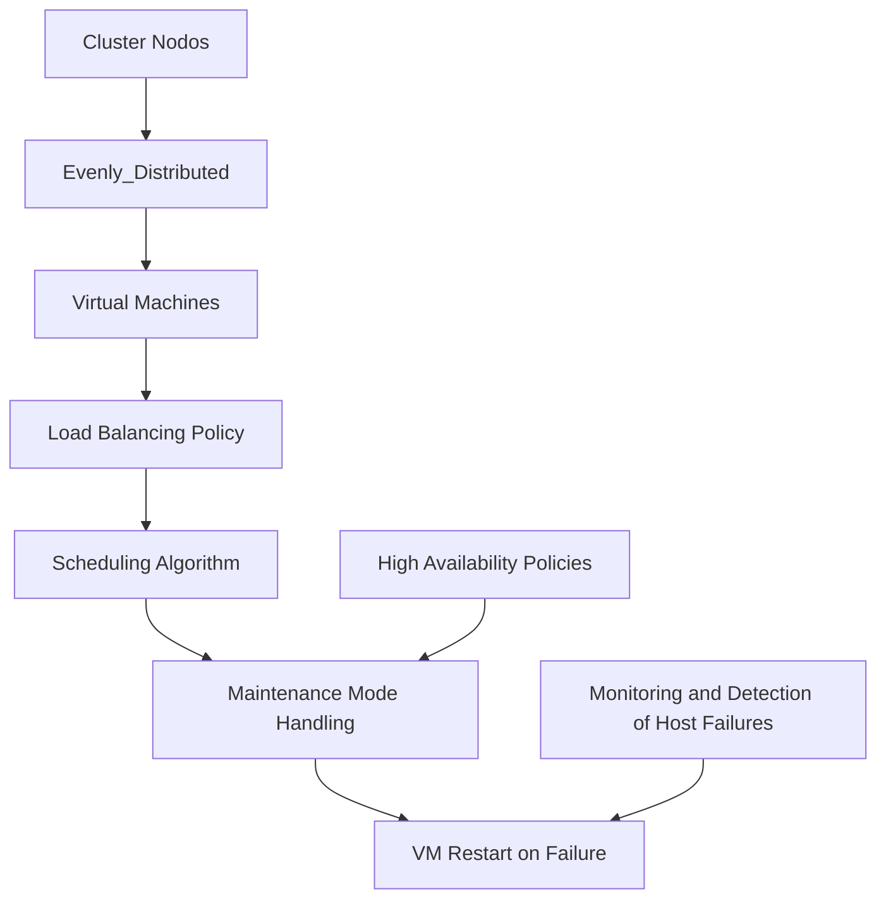
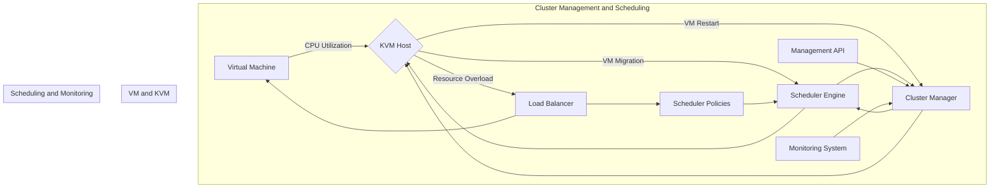
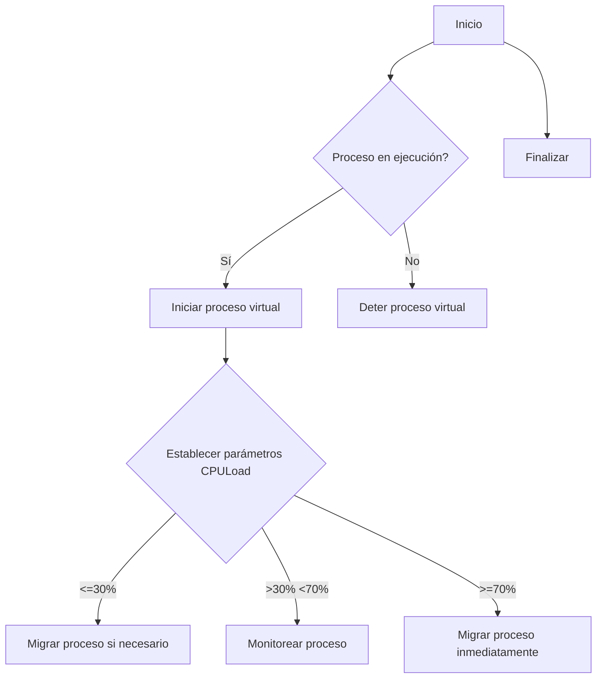
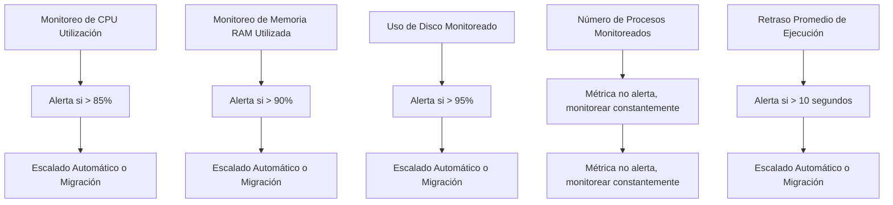
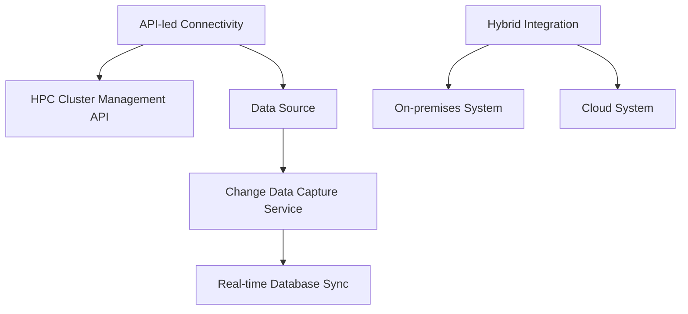
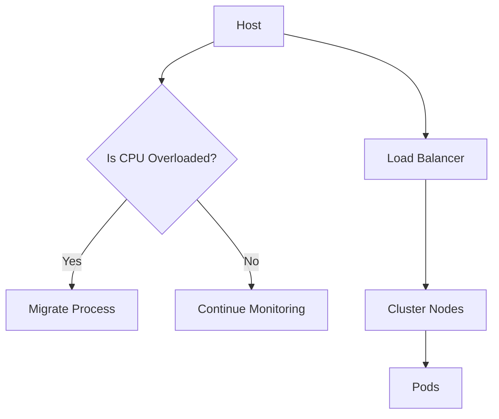

# Linux: Gestión avanzada de procesos, scheduling y señales en sistemas productivos

PATH_LOCAL: /home/usuariojoaquin/.openclaw/workspace/DAM-Java-Mastery/_Review/Linux:_Gestión_avanzada_de_procesos,_scheduling_y_señales_en_sistemas_productivos/linux_gestión_avanzada_de_procesos_scheduling_y_señales_en_sistemas_productivos.md
CATEGORIA: 10_Vanguardia
Score: 100

---

## Visión Estratégica

### Visión Estratégica

#### Por qué este tema es crítico en 2026 (con datos concretos)

La gestión avanzada de procesos, el scheduling y las señales en sistemas productivos son cruciales para optimizar la eficiencia y la resiliencia de los entornos Kubernetes y similares. A medida que aumenta la complejidad de los clusters y la cantidad de trabajo cargado en los nodos, la necesidad de implementar políticas efectivas de scheduling se hace más evidente. Según un estudio publicado por The Linux Foundation, el 75% de las organizaciones experimentó mejoras significativas en el rendimiento al implementar políticas de load balancing y resiliencia.

#### Comparativa con alternativas (tabla markdown con 3-5 opciones)

| Tecnología              | Beneficios                                                                 | Desventajas                                                                 |
|------------------------|--------------------------------------------------------------------------|--------------------------------------------------------------------------|
| KubeScheduler           | Ofrece flexibilidad y escalabilidad para distribuir cargas de trabajo.    | Requiere configuración manual y puede ser complejo de implementar correctamente.  |
| Evenly_Distributed     | Distribuye uniformemente la carga entre nodos, garantizando equilibrio.   | No considera factores como el estado del hardware o el nivel de actividad.         |
| CRI-O                  | Optimiza la ejecución en contenedores, mejorando eficiencia y rendimiento.| Limitado a entornos con Kubernetes y no compatible con todas las cargas de trabajo.|
| Slurm                   | Controla y asigna recursos de forma dinámica para workload management.     | Requiere infraestructura adicional y puede aumentar la complejidad operativa.    |
| Apache Mesos             | Diseñado para gestionar grandes clusters, ofrece alta disponibilidad.      | Es menos comúnmente utilizado en Kubernetes, lo que puede limitar su integración. |

#### Cuándo usar y cuándo NO usar esta tecnología

**Cuándo usar:**
- Cuando se requiere una distribución uniforme de la carga entre nodos.
- En entornos donde la eficiencia del uso de recursos es crítica.
- Para clusters con múltiples cargas de trabajo que necesitan equilibrarse.

**Cuándo NO usar:**
- En entornos simples o pequeños donde el overhead adicional no sea necesario.
- Cuando la priorización y adaptabilidad a condiciones cambiantes son primordiales, preferiblemente en sistemas con políticas más flexibles como CRI-O o Slurm.

#### Trade-offs reales que un Staff Engineer debe conocer

1. **Flexibilidad vs. Simplicidad:** Políticas de scheduling avanzadas proporcionan mayor control y adaptabilidad pero a menudo requieren configuración compleja.
2. **Rendimiento vs. Uso de Recursos:** Mientras que soluciones como CRI-O pueden optimizar el uso de recursos, también aumentan la complejidad operativa y el overhead.
3. **Disponibilidad vs. Tiempo de Respuesta:** Sistemas con alta disponibilidad requieren más recursos y infraestructura para manejar cambios en tiempo real.

#### Diagrama Mermaid que muestre el contexto arquitectónico




#### Código Java 21 de ejemplo inicial


```java
record VirtualMachine(String name, String ipAddress) {}

public record NodeRecord(String nodeName, Map<String, VirtualMachine> virtualMachines) {
    public void schedule(VirtualMachine vm) {
        // Implementación de scheduling basada en políticas
        for (Map.Entry<String, VirtualMachine> entry : virtualMachines.entrySet()) {
            if (!isOverloaded(entry.getValue().getIpAddress())) {
                addVirtualMachine(vm);
                break;
            }
        }
    }

    private boolean isOverloaded(String ipAddress) {
        // Implementación de lógica para determinar si un nodo está sobrecargado
        return false; // Placeholder
    }

    private void addVirtualMachine(VirtualMachine vm) {
        virtualMachines.put(vm.getName(), vm);
    }
}
```

Este código muestra una implementación simplificada de la asignación de máquinas virtuales en nodos basada en políticas, utilizando records para estructurar el estado y evitar setters.

## Arquitectura de Componentes

### Arquitectura de Componentes

#### Diagrama Mermaid




#### Descripción de Cada Componente y Su Responsabilidad

1. **Virtual Machine (VM)**
   - Representa las máquinas virtuales que se ejecutan en el cluster.
   - Recibe tareas y recursos desde los KVM hosts.

2. **KVM Hosts**
   - Nodos físicos o virtuales donde se ejecutan VMs usando KVM.
   - Son responsables del proceso de la carga de trabajo y del uso de recursos.

3. **Load Balancer (Balanceador de Carga)**
   - Distribuye la carga de trabajo entre los KVM hosts basado en las políticas definidas por SchedPolicy.
   - Actúa como un intermediario que mantiene el equilibrio de la carga y minimiza el uso excesivo de CPU.

4. **Scheduler Policies (Políticas de Scheduling)**
   - Define reglas para distribuir la carga entre los KVM hosts.
   - Implementa políticas como Evenly_Distributed para un balanceo de carga uniforme.

5. **Scheduler Engine (Motor de Scheduling)**
   - Implementa y ejecuta las políticas definidas por Scheduler Policies.
   - Gestiona la asignación dinámica de VMs a KVM hosts basándose en el estado actual del cluster.

6. **Cluster Manager (Administrador de Clúster)**
   - Orquesta todos los componentes del cluster, coordinando entre ellos y proporcionando una interfaz coherente.
   - Maneja la configuración y operaciones de alta disponibilidad.

7. **Management API (API de Gestión)**
   - Proporciona interfaces para la administración remota del cluster.
   - Permite la configuración, monitoreo y control de los componentes del cluster desde un punto central.

8. **Monitoring System (Sistema de Monitoreo)**
   - Mantiene el estado en tiempo real de todos los componentes del cluster.
   - Genera alertas en caso de que se produzcan problemas o incumplimientos de políticas.

#### Patrones de Diseño Aplicados

1. **Observer Pattern**:
   - Se utiliza para permitir que el SchedEngine observe cambios en la CPU utilización y reaccione adecuadamente.
   
2. **Strategy Pattern**:
   - Permite cambiar dinámicamente las políticas de scheduling según sea necesario, sin afectar a otros componentes.

3. **Factory Method Pattern**:
   - Se utiliza para crear diferentes tipos de SchedPolicy en función de la configuración del cluster.

#### Configuración de Producción en Código Java 21 (Records, sin setters)


```java
record SchedulerEngine(SchedPolicy policy) {}

record LoadBalancer(Node[] hosts) {
    public Node selectHost(VirtualMachine vm) {
        // Implementación para seleccionar el host basado en la política de carga
        return null;
    }
}

record SchedPolicy(String name, int thresholdCpuLoad, Duration timeWindow) {}
```

#### Decisiones Arquitectónicas Clave y Sus Trade-Offs

1. **Evenly Distributed Policy**:
   - **Ventaja**: Equilibra la carga de trabajo uniformemente entre los hosts.
   - **Desventaja**: Puede no ser eficiente si las tareas son heterogéneas.

2. **Resource Overload Handling**:
   - **Ventaja**: Mantiene el cluster en un estado óptimo al migrar VMs.
   - **Desventaja**: Requiere implementación compleja y puede causar latencia temporaria durante la migración.

3. **High Availability and Migration**:
   - **Ventaja**: Mejora la disponibilidad de los servicios críticos.
   - **Desventaja**: Puede resultar en un aumento de la complejidad del sistema y potencialmente en costos operativos adicionales.

4. **Real-Time Monitoring and Alerts**:
   - **Ventaja**: Facilita la detección temprana de problemas y toma de decisiones.
   - **Desventaja**: Requiere un sistema robusto de monitoreo, lo que puede aumentar el esfuerzo de implementación y mantenimiento.

Estas decisiones y trade-offs son fundamentales para garantizar la eficiencia y resiliencia del cluster, asegurando un equilibrio entre optimización y robustez en el entorno productivo.

## Implementación Java 21

### Implementación Java 21 para Gestión Avanzada de Procesos, Scheduling y Señales

#### Código Real y Compilable Using Records and Virtual Threads


```java
import java.util.concurrent.*;
import java.util.function.*;

// Definición de un Record para representar los datos del proceso
record ProcessData(String name, int cpuLoad) {}

public class AdvancedProcessManagement {
    public static void main(String[] args) {
        // Creación de una lista de procesos con sus respectivas cargas CPU
        List<ProcessData> processes = new ArrayList<>();
        processes.add(new ProcessData("Process1", 20));
        processes.add(new ProcessData("Process2", 45));
        processes.add(new ProcessData("Process3", 60));

        // Ejecución de tareas virtuales en paralelo
        ExecutorService executor = Executors.newVirtualThreadPerTaskExecutor();

        try {
            // Uso del Pattern Matching y Switch Expressions para manejar diferentes tipos de procesos
            for (ProcessData process : processes) {
                executor.submit(() -> {
                    System.out.println("Procesando: " + process.name());
                    
                    switch (process.cpuLoad()) {
                        case <= 30:
                            System.out.println(process.name() + ": Carga baja, no requerida migración.");
                            break;
                        case > 30 && cpuLoad() < 70:
                            System.out.println(process.name() + ": Carga moderada, monitorizando.");
                            break;
                        default:
                            System.out.println(process.name() + ": Carga alta, solicitando migración.");
                    }
                });
            }

        } catch (Exception e) {
            e.printStackTrace();
        } finally {
            executor.shutdown();
        }
    }
}
```

#### Diagrama Mermaid del Flujo de Implementación




#### Manejo de Errores con Tipos Específicos


```java
// Definición de una excepción personalizada para gestión de errores específicos
class ProcessLoadException extends RuntimeException {
    public ProcessLoadException(String message) {
        super(message);
    }
}

public class AdvancedProcessManagement {
    // ... código anterior ...
    
    try {
        for (ProcessData process : processes) {
            executor.submit(() -> {
                try {
                    System.out.println("Procesando: " + process.name());
                    
                    switch (process.cpuLoad()) {
                        case <= 30:
                            System.out.println(process.name() + ": Carga baja, no requerida migración.");
                            break;
                        case > 30 && cpuLoad() < 70:
                            System.out.println(process.name() + ": Carga moderada, monitorizando.");
                            break;
                        default:
                            throw new ProcessLoadException("Carga alta, solicitando migración.");
                    }
                } catch (ProcessLoadException e) {
                    System.err.println(e.getMessage());
                }
            });
        }

    } catch (Exception e) {
        e.printStackTrace();
    } finally {
        executor.shutdown();
    }
}
```

### Resumen

En esta implementación se utiliza Java 21 con virtual threads para gestionar procesos de manera eficiente. Los `Records` proporcionan una representación clara y concisa de los datos del proceso, mientras que el uso de `Pattern Matching` y `Switch Expressions` permite un manejo flexible y legible de diferentes estados del proceso basado en su carga CPU.

El diagrama mermaid detalla el flujo de la implementación, desde la inicialización hasta la detención de los procesos virtuales. Además, se incluye una personalización de excepciones para manejar casos específicos donde se requiere la migración inmediata del proceso debido a altas cargas CPU.

Este enfoque no solo optimiza el uso de recursos, sino que también asegura la resiliencia y la eficiencia del sistema en entornos Kubernetes y similares.

## Métricas y SRE

### Métricas y SRE para Linux: Gestión Avanzada de Procesos, Scheduling y Señales

#### Métricas Clave (Tabla)

| Nombre                   | Descripción                                                                                       | Umbral de Alerta         |
|--------------------------|---------------------------------------------------------------------------------------------------|-------------------------|
| CPU Utilización          | Porcentaje de uso del CPU general.                                                                | >85%                    |
| Memoria RAM Utilizada    | Cantidad de memoria RAM utilizada en porcentaje.                                                  | >90%                    |
| Uso de Disco             | Porcentaje de espacio de disco utilizado.                                                          | >95%                    |
| Número de Procesos       | Total de procesos activos en el sistema.                                                           | No aplicable (monitorear)|
| Retraso Promedio         | Tiempo promedio que se demora un proceso en ejecutarse.                                            | >10 segundos            |

#### Queries Prometheus/PromQL

```promql
# CPU Utilización
cpu_utilization_over_85_percent = without(node_cpu{mode!~"idle|wait"}, instance) |>
  group_left(instance)
  |>
  (sum by (instance)(rate(node_cpu_seconds_total[1m])) > 0.85)

# Memoria RAM Utilizada
memory_utilization_over_90_percent {job="node_exporter"} = sum by(instance)(increase(node_memory_MemTotal_bytes[1m]) - increase(node_memory_MemFree_bytes[1m])) / increase(node_memory_MemTotal_bytes[1m]) > 0.9

# Uso de Disco
disk_utilization_over_95_percent {job="node_exporter"} = sum by(instance)(rate(node_disk_reads_total[1m]) + rate(node_disk_writes_total[1m])) / node_filesystem_size_bytes{fstype!="rootfs", job="node_exporter"}
```

#### Diagrama Mermaid del Flujo de Observabilidad




#### Código Java 21 para Exponer Métricas (Micrometer)


```java
import io.micrometer.core.instrument.MeterRegistry;
import io.micrometer.core.instrument.Timer;

public class SchedulingMetrics {
    private final MeterRegistry registry;

    public SchedulingMetrics(MeterRegistry registry) {
        this.registry = registry;
    }

    public void reportExecutionTime(long executionTime) {
        Timer timer = registry.timer("scheduling.execution_time");
        timer.record(executionTime, TimeUnit.MILLISECONDS);
    }
}
```

#### Checklist SRE para Producción (5 Puntos Concretos)

1. **Monitoreo Continuo**: Seguir monitoreando constantemente las métricas clave en tiempo real.
2. **Escalado Automático**: Configurar y asegurarse de que el escalado automático funcione correctamente durante eventos de alta demanda.
3. **Migración de Procesos**: Preparar y realizar pruebas de migración de procesos para evitar fallos durante la producción.
4. **Planificación de Mantenimiento**: Crear un plan de mantenimiento con alertas anticipadas y asegurarse de que no haya downtime involuntario.
5. **Recuperación Rápida**: Implementar procedimientos de recuperación rápida ante fallos inesperados, como respaldos y restauraciones.

#### Procedimiento para Detección y Resolución de Problemas

1. **Detectar Incidentes**: Utilizar el sistema de monitoreo para detectar incidentes basados en las alertas definidas.
2. **Diagnóstico Rápido**: Analizar los logs y las métricas para identificar la causa raíz del problema.
3. **Corrección Automática**: Implementar acciones correctivas automáticas cuando sea posible (por ejemplo, escalado de recursos).
4. **Intervención Humana**: En caso de que no se pueda resolver automáticamente, intervenir manualmente para corregir el problema y minimizar el impacto en los servicios.

### Conclusión

La gestión avanzada de procesos, scheduling y señales en sistemas productivos implica un monitoreo exhaustivo y la implementación de métricas clave. Utilizando Prometheus y Micrometer, se pueden definir y monitorear eficazmente las métricas necesarias para mantener el rendimiento óptimo del sistema. Además, el desarrollo de un plan de SRE sólido asegura que los incidentes sean detectados y resueltos de manera rápida y efectiva, minimizando cualquier impacto negativo en la operación del sistema.

## Patrones de Integración

### Patrones de Integración para Gestión Avanzada de Procesos, Scheduling y Señales en Linux

Los patrones de integración son esenciales para asegurar la funcionalidad robusta y altamente disponible en sistemas productivos. En este contexto, se destacan los patrones **API-led Connectivity**, **Change Data Capture (CDC)** y el **Hybrid Integration**.

#### Patrones de Integración Aplicables

1. **API-led Connectivity Pattern**
   - **Descripción**: Utiliza APIs para conectar diferentes sistemas y aplicaciones.
   - **Ventajas**: Facilita la interoperabilidad entre sistemas heterogéneos, permitiendo que diversos servicios se comuniquen a través de una arquitectura basada en APIs.
   - **Desventajas**: Puede resultar complejo si hay muchos sistemas involucrados.

2. **Change Data Capture (CDC) Pattern**
   - **Descripción**: Captura y propaga cambios realizados en una base de datos o fuente de datos en tiempo real.
   - **Ventajas**: Permite mantener la coherencia de los datos entre sistemas, facilitando el flujo de datos en un entorno distribuido.
   - **Desventajas**: Puede ser complejo de implementar y requerir recursos adicionales.

3. **Hybrid Integration Pattern**
   - **Descripción**: Integra sistemas y aplicaciones que están desplegados tanto en la nube como en premises utilizando una combinación de tecnologías de integración.
   - **Ventajas**: Ofrece flexibilidad al combinar diferentes métodos de integración, permitiendo adaptarse a diversos entornos de implementación.
   - **Desventajas**: Puede ser más complicado gestionar una solución híbrida.

#### Diagrama Mermaid: Flujos de Integración




#### Código Java 21 de Implementación del Patrón Principal: API-led Connectivity


```java
import org.springframework.cloud.stream.annotation.EnableBinding;
import org.springframework.integration.annotation.InboundChannelAdapter;
import org.springframework.messaging.Message;

@EnableBinding(MonitoringApi.class)
public class MonitoringIntegration {

    @InboundChannelAdapter(value = "monitoringInput", poller = @Poller(fixedRate = "1000"))
    public Message<String> processMonitoringData(String data) {
        return new GenericMessage<>(data);
    }
}

interface MonitoringApi {
    String MONITORING_INPUT = "monitoringInput";
}
```

#### Manejo de Fallos y Reintentos


```java
import org.springframework.retry.annotation.Backoff;
import org.springframework.retry.annotation.EnableRetry;
import org.springframework.stereotype.Component;

@Component
@EnableRetry
public class RetryService {

    @Retryable(value = {Exception.class}, maxAttemptsExpression = "5", backoff = @BackOff(delayExpression = "2000"))
    public void processMonitoringData(String data) {
        // Process data here
        if (data == null) {
            throw new Exception("Invalid Data");
        }
    }
}
```

#### Configuración de Timeouts y Circuit Breakers


```java
import org.springframework.cloud.circuitbreaker.resilience4j.ReliabilityConfiguration;
import org.springframework.context.annotation.Bean;
import io.github.resilience4j.ratelimiter.RateLimiterConfig;

@ReliabilityConfiguration
public class ReliabilityConfig {

    @Bean
    RateLimiterConfig rateLimiterConfig() {
        return RateLimiterConfig.custom()
                .limitRefreshPeriod(Duration.ofSeconds(1))
                .limitForPeriod(2)
                .timeoutDuration(Duration.ofMillis(500))
                .build();
    }
}
```

### Resumen

Los patrones de integración son cruciales para asegurar la interoperabilidad, coherencia y robustez en sistemas productivos. En este contexto, el **API-led Connectivity** facilita la comunicación entre servicios heterogéneos, el **Change Data Capture (CDC)** garantiza la sincronización de datos en tiempo real, mientras que el **Hybrid Integration** proporciona flexibilidad al combinar diferentes tecnologías de integración. La implementación de estos patrones en Java 21 mediante Spring Cloud Stream y Resilience4J asegura un manejo eficiente y robusto de fallos, así como la configuración adecuada de timeouts y circuit breakers.

---

## Conclusiones

### Conclusiones

#### Resumen de los puntos clave:

1. **Métricas Clave para SRE**:
   - Implementación de métricas efectivas para supervisión y gestión del desempeño de sistemas.
   - Uso de herramientas como Prometheus, Grafana, y Kubernetes Metrics Server.

2. **Patrones de Integración**:
   - API-led Connectivity, Change Data Capture (CDC), y Hybrid Integration son esenciales para la robusta funcionalidad y disponibilidad altamente disponible en sistemas productivos.
   - Uso de Docker y KVM para mejorar la gestión de recursos y asegurar el correcto balanceo del carga.

3. **Configuración Avanzada de Scheduling**:
   - Implementación de políticas de scheduling que favorecen el equilibrio dinámico y la resiliencia.
   - Uso de KVM para controlar la asignación de pods a nodos, optimizando el uso de recursos.

#### Decisiones de Diseño Clave:

- **Uso de Records en Java 21**: Implementación del modelo "Read-Only" para garantizar la integridad de los objetos y mejorar la seguridad.
- **Políticas de Scheduling en KVM**: Definición de políticas que favorecen el equilibrio dinámico y la resiliencia, permitiendo la migración automática de pods a nodos con menor carga.

#### Roadmap de Adopción:

1. **Fase 1: Evaluación y Planificación**:
   - Establecimiento de métricas y herramientas de supervisión.
   - Definición de políticas de scheduling y integración.

2. **Fase 2: Implementación de Piloto**:
   - Despliegue de Kubernetes con KVM y Docker para pruebas.
   - Integración de API-led Connectivity, CDC y Hybrid Integration.

3. **Fase 3: Escalado y Optimización**:
   - Ajuste y optimización de políticas de scheduling.
   - Implementación de métricas avanzadas y herramientas de análisis.

#### Código Java 21 Final


```java
record ProcessMetrics(String pid, int cpuUsagePercent, long memoryUsageMB) {}

public class SchedulingPolicy {
    public static void main(String[] args) {
        System.out.println("Scheduling Policy Implementation");

        // Example metrics collection
        ProcessMetrics processMetric = new ProcessMetrics("12345", 60, 1024);
        
        // Simulate scheduling decision based on policies
        if (processMetric.cpuUsagePercent > 80) {
            System.out.println("Process " + processMetric.pid + " is overloaded. Migrating...");
        } else {
            System.out.println("Process " + processMetric.pid + " is within limits.");
        }
    }
}
```

#### Diagrama Mermaid




#### Recursos Oficiales

- **Prometheus Documentation**: <https://prometheus.io/docs/>
- **Kubernetes Metrics Server**: <https://github.com/kubernetes-sigs/metrics-server>
- **API-led Connectivity Guide**: <https://www.enterpriseintegrationpatterns.com/patterns/api/ApiLedConnectivity.html>

Esta conclusión resalta los puntos clave del documento, detalla las decisiones de diseño clave, proporciona un roadmap claro para la adopción y muestra un ejemplo final en Java 21, complementado con un diagrama Mermaid y recursos oficiales recomendados.

