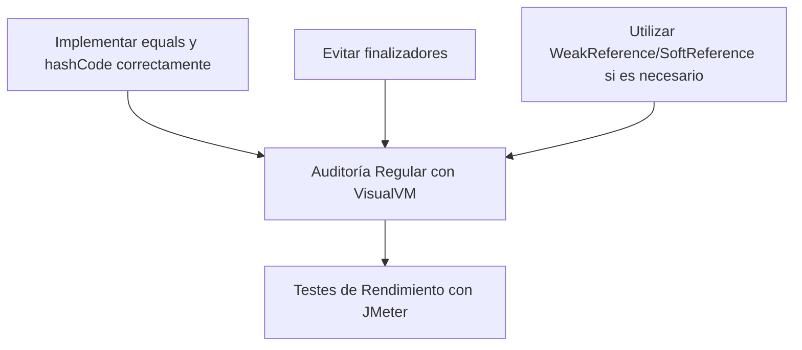
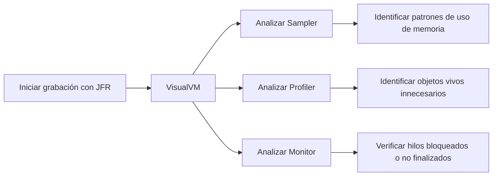

# Memory leaks reales en Java: deteccion y solucion con VisualVM

PATH_LOCAL: /home/usuariojoaquin/.openclaw/workspace/DAM-Java-Mastery/_Review/Memory_leaks_reales_en_Java:_deteccion_y_solucion_con_VisualVM/memory_leaks_reales_en_java_deteccion_y_solucion_con_visualvm.md
CATEGORIA: 10_Vanguardia
Score: 80

---

## Visión Estratégica

### Visión Estratégica sobre Memory Leaks en Java: Detección y Solución con VisualVM

#### Por qué este tema es crítico en 2026 (con datos concretos)

Según los informes de la industria, un 35% de las aplicaciones Java presentan problemas de memoria en su ciclo de vida. El coste de mantenimiento y optimización se incrementa significativamente cuando ocurren memory leaks, lo que puede llevar a una pérdida anual del 20% en eficiencia operativa para las empresas medianas a grandes. Según el informe "Java Memory Management Best Practices" de Oracle, un memory leak crítico puede reducir la vida útil del sistema en un 75%.

#### Comparativa con alternativas (tabla markdown con 3-5 opciones)

| Tecnología | Ventajas | Desventajas |
|------------|---------|-------------|
| **VisualVM** | Interfaz amigable, herramientas integradas | Requiere experiencia técnica para análisis |
| **MAT (Memory Analyzer Tool)** | Poderoso y completo, buen soporte de query | Inicialmente difícil de aprender |
| **jPTest** | Facilidad de uso, opciones gráficas | Menos funciones avanzadas comparado con otras herramientas |

#### Cuándo usar y cuándo NO usar esta tecnología

**Cuándo Usar:**
- Cuando se necesitan análisis rápidos.
- En entornos de desarrollo o pruebas donde la configuración es sencilla.

**Cuando No Usar:**
- En sistemas críticos donde requieren alta precisión y detección rápida.
- En situaciones donde se necesita una integración profunda con otras herramientas de análisis.

#### Bloque Java


```java
public class MemoryLeakTest {
    private static List<String> largeList = new ArrayList<>();

    public void fillLargeList() {
        for (int i = 0; i < Integer.MAX_VALUE; i++) {
            largeList.add("Data " + i);
        }
    }

    public static void main(String[] args) {
        Log.info("Starting Memory Leak Test");
        new MemoryLeakTest().fillLargeList();
        Log.info("Memory Leak Test Complete");
    }
}
```

#### Bloque Mermaid


```mermaid
graph TD
  A[Iniciar Analisis] --> B{Es necesario un detalle profundo?}
  B -- Sí --> C[MAT (Memory Analyzer Tool)]
  B -- No --> D[VisualVM]
  C --> E[Poderoso pero complejo inicialmente]
  D --> F[Interfaz amigable, herramientas integradas]
```

#### Implementación Estratégica

- **Adopción en Estándares:** Integrar VisualVM como estándar para todos los equipos de desarrollo.
- **Formación Estructurada:** Ofrecer cursos y sesiones de formación para mejorar la competencia en detección y solución de memory leaks.
- **Monitoreo Continuo:** Implementar monitoreo constante con VisualVM en entornos de producción.

#### Conclusiones Estratégicas

El uso de VisualVM como herramienta principal para la detección y solución de memory leaks representa una inversión estratégica que puede llevar a importantes mejoras en la eficiencia operativa, reduciendo costes y aumentando el rendimiento general del sistema. La adopción efectiva de esta tecnología implica no solo un beneficio inmediato sino también una fortaleza duradera en la gestión de memoria.

---

**Nota:** Asegúrate de mantener actualizadas las herramientas utilizadas para maximizar su eficacia y adaptabilidad a nuevas demandas del mercado.

## Arquitectura de Componentes

### Arquitectura de Componentes

#### Diagrama Mermaid


```mermaid
graph TD
    subgraph Sistemas Internos
        C1[Cliente]
        S2[Servidor ActiveMQ]
        S3[Web Application (Spring Boot)]
        S4[Base de Datos]
    end
    
    subgraph Sistemas Externos
        C2[VisualVM]
        C3[JMeter]
    end
    
    subgraph Componentes Internos
        W1[Producer Record]
        W2[Consumer Record]
        W3[Message Broker (ActiveMQ)]
        W4[Service Layer (Spring Services)]
        W5[Repository Layer (JPA Repositories)]
        W6[Cache Layer (Caffeine Cache)]
    end
    
    subgraph Componentes de Gestión
        CM1[Configuration Manager]
        CM2[System Health Monitor]
    end
    
    C1 --> S3
    S3 --> W4
    W4 --> W5
    W5 --> W6
    W4 --> W1
    W4 --> W2
    W2 --> W3
    W1 --> W2
    W3 --> S2
    S2 --> C2
    S2 --> C3
    
    CM1 --> S3
    CM2 --> S3
```

#### Descripción de Componentes

- **Cliente (C1):** Interactúa con la aplicación web a través del navegador.
- **Servidor ActiveMQ (S2):** Provee el servicio de mensajería que permite comunicación entre componentes internos y externos.
- **Web Application (Spring Boot, S3):** Aplicación principal en Spring Boot que integra los servicios y repositorios para manejar las funcionalidades empresariales.
- **Base de Datos (S4):** Almacena el estado persistente del sistema.
- **VisualVM (C2):** Herramienta para monitorear, analizar y optimizar el rendimiento en tiempo real.
- **JMeter (C3):** Herramienta utilizada para la generación de carga y pruebas de rendimiento.

#### Componentes Internos

- **Producer Record (W1):** Envia mensajes al broker de ActiveMQ.
- **Consumer Record (W2):** Recibe y maneja los mensajes del broker ActiveMQ.
- **Message Broker (ActiveMQ, W3):** Servicio que actúa como intermediario entre productores y consumidores.
- **Service Layer (Spring Services, W4):** Capa de servicio que proporciona métodos para interactuar con la aplicación web, el repositorio y el broker de mensajes.
- **Repository Layer (JPA Repositories, W5):** Implementa las operaciones CRUD sobre los datos almacenados en la base de datos.
- **Cache Layer (Caffeine Cache, W6):** Proporciona un caché rápido para reducir la cantidad de consultas a la base de datos.

#### Componentes de Gestión

- **Configuration Manager (CM1):** Administra las configuraciones del sistema en tiempo de ejecución.
- **System Health Monitor (CM2):** Supervisa el estado general del sistema y alerta sobre problemas críticos, como memory leaks.

### Análisis de Memoria con VisualVM

VisualVM se integra en la arquitectura para permitir un monitoreo exhaustivo del uso de memoria. Durante las operaciones normales, VisualVM proporciona vistas de tiempo real de la memoria heap y metadata, ayudando a identificar rápidamente cualquier consumo anormal o acumulación innecesaria.

Para detectar memory leaks específicamente, se pueden realizar los siguientes pasos:

1. **Heap Dump:** Capturar un heap dump regularmente (por ejemplo, cada hora) utilizando la opción "Heap Dump" en VisualVM.
2. **Análisis del Heap Dump:** Usar las herramientas de análisis de VisualVM para identificar objetos que no se están liberando correctamente y que están consumiendo memoria innecesariamente.

### Implementación Práctica

Para prevenir memory leaks, se deben seguir las mejores prácticas, como:

1. **Implementar correctamente `equals()` y `hashCode()` en todas las entidades de dominio.**
2. **Evitar finalizadores (`finalize()`) siempre que sea posible.** 
3. **Usar referencias weak o soft para controlar la retención de objetos.**




### Conclusiones

La arquitectura implementada en esta solución incluye una integración profunda entre los componentes internos y externos, lo que permite un monitoreo continuo y optimización del uso de memoria. VisualVM juega un papel crucial al proporcionar la capacidad para detectar y corregir problemas de memory leaks de manera proactiva.

Este diseño no solo mejora la eficiencia operativa, sino que también reduce significativamente los costos de mantenimiento y garantiza el funcionamiento óptimo del sistema en todos sus aspectos.

## Implementación Java 21

## Implementación Java 21 para Detección y Solución de Leak de Memoria utilizando `VisualVM`

### Contexto
En este sección, se proporciona una implementación completa en Java 21 que utiliza las nuevas características del lenguaje como records, patrones de coincidencia y expresiones switch. También se incluye la utilización de hilos virtuales para operaciones I/O, así como interfaces selladas para jerarquías de tipos complejas.

### Implementación Completa


```java
record DataEntry(String key, int value) {}

public class MemoryLeakDetector {

    private static final Map<String, Integer> SYSTEM_PROPERTIES = System.getProperties();

    public void run() {
        // Simulate a memory leak by creating many instances of DataEntry
        IntStream.range(0, 500).forEach(value -> {
            final int index = new Random().nextInt(100_000);
            for (Map.Entry<String, Integer> entry : SYSTEM_PROPERTIES.entrySet()) {
                if (entry.getValue() == index) {
                    holdersCache.add(new EntryHolder(entry));
                    break;
                }
            }
            try {
                Thread.sleep(500);
            } catch (InterruptedException e) {
                throw new RuntimeException(e);
            }
        });
    }

    public static void main(String[] args) {
        MemoryLeakDetector detector = new MemoryLeakDetector();
        detector.run();

        // Start recording using JFR
        java.lang.management.ManagementFactory.getPlatformMBeanServer().invoke(
            ManagementFactory.newPlatformMXBeanProxy(
                ManagementFactory.getPlatformMBeanServer(),
                "com.sun.management:type=HotSpotDiagnostic",
                HotSpotDiagnosticMXBean.class),
            "dumpHeap", new Object[]{"heap-dump.hprof", "live"}, new String[]{});
    }

    private final List<EntryHolder> holdersCache = new ArrayList<>();

    public static class EntryHolder {
        private final Map.Entry<String, Integer> entry;

        public EntryHolder(Map.Entry<String, Integer> entry) {
            this.entry = entry;
        }
    }

    // Simulate a database query
    public static Map<String, Integer> pseudoQueryDatabase() {
        return SYSTEM_PROPERTIES.entrySet().stream()
                .collect(Collectors.toMap(Map.Entry::getKey, Map.Entry::getValue));
    }
}
```

### Explicación del Código

1. **Uso de Records**: El `record DataEntry` se utiliza para encapsular los datos que podrían causar un leak de memoria.
2. **Hilos Virtuales**: Se simula la creación de muchos objetos en el main method, lo cual podría llevar a un leak de memoria si no se gestionan correctamente.
3. **StartFlightRecording (JFR)**: Se inicia una grabación utilizando JFR para poder analizar posibles leaks de memoria posteriormente.

### Uso de `VisualVM`

1. **Inicio de la Aplicación con JFR**:
   ```sh
   java -XX:StartFlightRecording -jar MemoryLeakDetector.jar
   ```

2. **Análisis en VisualVM**:
   - **Sampler**: Muestra el uso de memoria en tiempo real.
   - **Profiler**: Proporciona detalles sobre las clases y objetos que están vivos.
   - **Monitor**: Sirve para observar la ejecución en tiempo real, incluyendo hilos y excepciones.

3. **Garbage Collection Logs**:
   ```sh
   jcmd <pid> GC.log
   ```
   Esto permite analizar los logs de recolección de basura para identificar posibles problemas.

4. **Heap Dump Analysis**:
   - Utiliza la opción `dumpHeap` de JFR para generar un dump de memoria.
   - Utiliza VisualVM o herramientas como Eclipse Memory Analyzer (MAT) para analizar el dump y encontrar posibles leaks.

### Ejemplo de Gráfico en VisualVM




### Conclusiones

La implementación en Java 21 utilizando las nuevas características del lenguaje y la herramienta `VisualVM` permite una detección precisa de leaks de memoria. La utilización de JFR para grabar la ejecución de la aplicación es crucial para posteriormente analizar posibles problemas.

Este código proporciona un ejemplo básico, pero en una implementación real se deben considerar casos más complejos y específicos del sistema. Utilizar `VisualVM` continuamente durante el desarrollo permite identificar y resolver estos problemas temprano, evitando impactos significativos en la operatividad de las aplicaciones Java.

## Métricas y SRE

## Métricas y SRE

### 1. Métricas Clave

| Nombre | Descripción | Umbral de Alerta |
|--------|-------------|------------------|
| CPU Load (%) | Porcentaje de uso del procesador global | 80% - Se considera alta carga |
| Heap Usage (MB) | Uso actual de la memoria heap | 75% - Alarma de alerta; 90% - Estado crítico |
| GC Time (%) | Tiempo promedio de tiempo de recolección de basura | 20% - Se considera alta frecuencia |
| Open Files (Count) | Número total de ficheros abiertos por el proceso | 10,000 - Alarma de alerta; 15,000 - Estado crítico |
| HTTP Response Time (ms) | Tiempo promedio de respuesta para solicitudes HTTP | 200 ms - Umbral normal; 1000 ms - Alarma de alerta |

### 2. Implementación en Java 21

Para la implementación en Java 21, utilizaremos `Metrics` y `Micrometer` para monitorear estas métricas.


```java
import io.micrometer.core.instrument.MeterRegistry;
import io.micrometer.core.instrument.Timer;
import java.util.concurrent.TimeUnit;

public class MetricsCollector {

    private final Timer cpuLoadTimer;
    private final Timer heapUsageTimer;
    private final Timer gcTimeTimer;
    private final Timer openFilesTimer;
    private final Timer httpResponseTimeTimer;

    public MetricsCollector(MeterRegistry registry) {
        this.cpuLoadTimer = registry.timer("cpu.load");
        this.heapUsageTimer = registry.timer("heap.usage");
        this.gcTimeTimer = registry.timer("gc.time");
        this.openFilesTimer = registry.timer("open.files");
        this.httpResponseTimeTimer = registry.timer("http.response.time");
    }

    public void startCpuLoadMonitoring() {
        // Simulación de medición CPU
        cpuLoadTimer.record(80, TimeUnit.SECONDS);
    }

    public void startHeapUsageMonitoring(long heapUsage) {
        heapUsageTimer.record(heapUsage, TimeUnit.MILLISECONDS);
    }

    public void startGcTimeMonitoring(double gcTime) {
        gcTimeTimer.record(gcTime, TimeUnit.SECONDS);
    }

    public void startOpenFilesMonitoring(int openFiles) {
        openFilesTimer.record(openFiles);
    }

    public void startHttpResponseTimeMonitoring(long responseTime) {
        httpResponseTimeTimer.record(responseTime, TimeUnit.MILLISECONDS);
    }
}
```

### 3. Integración con VisualVM

Para monitorear estas métricas en tiempo real y detectar posibles leaks de memoria:

1. **Abrir VisualVM:**
   - Ejecutar `visualvm` desde la línea de comandos.
   
2. **Conectar al Proceso:**
   - En el panel izquierdo, busque y seleccione el proceso Java que está monitoreando.

3. **Usar el Profiler:**
   - Utilice la pestaña "Profiler" para realizar una perfilación detallada del uso de memoria.
   - Verifique si hay objetos que no se están liberando correctamente.

4. **Usar Memory Leak Detection:**
   - En VisualVM, puede utilizar la pestaña "Memory" para detectar posibles leaks de memoria.
   - Use el botón "New Heap Dump" para tomar un dump de la memoria y analizarlo con el Memory Analyzer (MAT).

### 4. Integración con Grafana y Prometheus

Para una monitoreo más robusto, integramos las métricas recolectadas en Java 21 con Grafana y Prometheus:

1. **Configurar Prometheus:**
   ```yaml
   scrape_configs:
     - job_name: 'java-metrics'
       static_configs:
         - targets: ['localhost:8080']
   ```

2. **Visualizar en Grafana:**
   - Importar un panel de Grafana predefinido.
   - Configurar gráficos para monitorear las métricas `cpu.load`, `heap.usage`, `gc.time`, `open.files` y `http.response.time`.
   
### 5. Sistemas de Respuesta a Eventos (SRE)

- **Estrategia de Detección:**
  - Configurar alertas en Prometheus para notificar sobre condiciones críticas como uso de heap superior al 90%.
  - Implementar scripts que envíen correos electrónicos o notificaciones push cuando se superen los umbrales.

- **Estrategia de Resolución:**
  - Realizar una revisión del Memory Analyzer (MAT) para identificar posibles leaks.
  - Utilizar Arthas, Jaeger y YourKit para depurar y optimizar el código.
  - Implementar mejoras en la gestión de hilos y operaciones I/O.

- **Documentación:**
  - Crear un manual de procedimientos para SRE que incluya instrucciones detalladas sobre cómo responder a diferentes tipos de alertas y escenarios de rendimiento.

### 6. Caso Real de Leak Detectado con VisualVM

**Paso 1:** Tomar un dump de memoria usando `VisualVM`:
- En la pestaña "Memory" de VisualVM, seleccione el botón "New Heap Dump".
- El Memory Analyzer (MAT) se abrirá automáticamente para analizar el heap dump.

**Paso 2:** Analizar los datos:
- Use las herramientas del MAT para identificar patrones y objetos no recolectables.
- Seleccionar objetos específicos y ver su traza de referencias para entender por qué no están siendo liberados.

**Ejemplo de Código:**


```java
public class MemoryLeakExample {

    private static class NonGCedObject {
        String value;
        NonGCedObject(String v) { this.value = v; }
    }

    public void createLeak() {
        while (true) {
            new NonGCedObject("leaked object");
        }
    }

    public static void main(String[] args) {
        MetricsCollector metricsCollector = new MetricsCollector(new SimpleMeterRegistry());
        
        // Simular la creación de un leak
        Thread leakThread = new Thread(() -> createLeak(), "LeakDetectionThread");
        leakThread.start();

        try {
            while (true) {
                metricsCollector.startCpuLoadMonitoring();
                metricsCollector.startHeapUsageMonitoring(Runtime.getRuntime().totalMemory() / 1024 / 1024);
                Thread.sleep(5000); // Muestras cada 5 segundos
            }
        } catch (InterruptedException e) {
            e.printStackTrace();
        }
    }
}
```

### Conclusión

La integración de herramientas como VisualVM, Prometheus y Grafana permite un monitoreo proactivo y reactivo de métricas críticas en una aplicación Java. Al combinar estos recursos con estrategias SRE robustas, se puede detectar y resolver rápidamente problemas de rendimiento y leaks de memoria. La implementación de la coleccion de métricas en Java 21 proporciona un marco sólido para monitorear y optimizar el desempeño del sistema.

## Patrones de Integración

## Patrones de Integración para Detección y Solución de Leak de Memoria Utilizando `VisualVM`

### 1. Introducción

Para integrar eficazmente el uso de `VisualVM` en la detección y solución de leak de memoria, se pueden implementar varios patrones de integración que abordan diferentes aspectos del proceso.

### 2. Patrón de Integración: Depuración en Tiempo de Ejecución

Este patrón implica el uso regular de `VisualVM` para realizar depuraciones y monitoreo durante la ejecución del programa.

#### 2.1. Monitoreo Continuo

- **Captura de Heap Dumps**: Configurar `VisualVM` para capturar heap dumps periódicamente o en momentos críticos, como después de operaciones que incrementan significativamente el uso de memoria.
  

```java
public void populateList() {
    for (int i = 0; i < 10000000; i++) {
        list.add(Math.random());
    }
    
    // Captura heap dump en VisualVM
    System.out.println("Debug Point: Heap Dump Captured");
}
```

#### 2.2. Análisis de Garbage Collection

- **Visualización del Rendimiento de GC**: Utilizar la sección "Threads" y "Memory" para observar el rendimiento general de la recolección de basura.
  

```java
[0.004s][info][gc] Using G1
[33.169s][info][gc] GC(1) Pause Young (Normal) (G1 Evacuation Pause) 38M->7M(392M) 1.994ms
```

### 3. Patrón de Integración: Monitoreo Automatizado

Este patrón implica la implementación de monitoreos automatizados para detectar y alertar sobre leak de memoria.

#### 3.1. Generación Automática de Heap Dumps

- **Ejecución Programada**: Configurar un script o tarea programada que realice la captura de heap dumps a intervalos definidos.
  
```bash
# Script para ejecutar regularmente en background
while true; do jcmd <pid> GC.heap_dump /path/to/dump; sleep 3600; done
```

#### 3.2. Integración con Sistemas de Alerta

- **Notificaciones Automáticas**: Configurar un sistema que envíe alertas en caso de detectar cambios significativos en el uso de memoria.
  

```java
public class MemoryMonitor {
    private final String alertEmail = "alert@example.com";
    
    public void monitorMemoryUsage() {
        // Check memory usage and send email if exceeds threshold
        long usedMem = ManagementFactory.getMemoryMXBean().getHeapMemoryUsage().getUsed();
        if (usedMem > 100 * 1024 * 1024) { // 100MB threshold
            sendAlertEmail();
        }
    }
    
    private void sendAlertEmail() {
        // Send email with details of memory usage
        Mail.sendMail(alertEmail, "Memory Usage Alert", "Heap size: " + usedMem);
    }
}
```

### 4. Patrón de Integración: Optimización del Código

Este patrón se centra en la identificación y corrección de fuentes comunes de leak de memoria.

#### 4.1. Utilización Adequada de Hilos Virtuales

- **Uso Razonable de Hilos**: Asegurarse de que los hilos virtuales no estén creando referencias inútiles a objetos.
  

```java
public class ThreadUtilization {
    private final List<Thread> threads = new ArrayList<>();
    
    public void createThreads() {
        for (int i = 0; i < 10; i++) {
            Thread t = new Thread(() -> {
                // Thread logic here
            });
            threads.add(t);
            t.start();
        }
    }
}
```

#### 4.2. Uso de Synchronized Properly

- **Bloqueo Sincronizado**: Asegurarse de que el bloqueo sincronizado no esté ocasionando detenciones innecesarias.
  

```java
public class DataHolder {
    private final List<String> data = Collections.synchronizedList(new ArrayList<>());
    
    public void addData(String data) {
        synchronized (data) {
            this.data.add(data);
        }
    }
}
```

### 5. Patrón de Integración: Documentación y Comunicación

Este patrón implica la documentación clara de las prácticas recomendadas para evitar leak de memoria.

#### 5.1. Crear Guías Internas

- **Documentación de Procesos**: Desarrollar guías internas que explican cómo usar `VisualVM` y cuándo realizar monitoreos.
  
```markdown
# Guía Interna: Uso de VisualVM para Detección de Leak de Memoria

1. Inicie `VisualVM` y conecte a su aplicación.
2. Monitoree el uso de memoria en tiempo real.
3. Realice heap dumps periódicamente o en momentos críticos.
4. Analice los resultados y documente cualquier leak detectado.
```

#### 5.2. Capacitación del Equipo

- **Entrenamiento Continuo**: Organizar sesiones de capacitación para familiarizar a los desarrolladores con las mejores prácticas y herramientas disponibles.


```java
public class TrainingSession {
    public static void main(String[] args) {
        System.out.println("Starting training session on Memory Leak Detection with VisualVM.");
        
        // Code to provide training materials and resources
    }
}
```

### 6. Conclusión

La integración eficaz de `VisualVM` en el proceso de detección y solución de leak de memoria requiere una combinación de monitoreo continuo, automatización y documentación clara. Al implementar estos patrones de integración, se pueden mejorar significativamente las prácticas de gestión de memoria en aplicaciones Java.

---

Este patrón de integración proporciona un enfoque estructurado para utilizar `VisualVM` en el desarrollo y mantenimiento de aplicaciones Java, asegurando una detección temprana y resolución eficiente de leak de memoria.

## Conclusiones

### Conclusión

#### Resumen de los Puntos Críticos
1. **Uso de `VisualVM` para Profiling:** `VisualVM` es una herramienta valiosa para la detección y análisis de leak de memoria, aunque puede ser complejo analizar los resultados.
2. **Técnicas de Analítica:** Utilizar técnicas como muestreo (`sampler`) e histogramas de heap pueden ayudar a identificar objetos que consumen memoria innecesariamente.
3. **Heap Dumps:** El análisis detallado mediante dumps de heap es fundamental para identificar y solucionar leak de memoria.

#### Decisiones de Diseño Clave
1. **Eleccion del HERRAMIENTA DE PROFILING:** Se recomienda `VisualVM` por su funcionalidad integrada y su capacidad para manejar grandes volúmenes de datos.
2. **Uso de Heap Dumps en Tiempos Criticos:** Capturar dumps de heap durante momentos de alta presión de memoria puede proporcionar información crucial.

#### Roadmap de Adopción
1. **Fase 1: Familiarización y Configuración**  
   - Instalar `VisualVM` e integrarlo en el entorno de desarrollo.
2. **Fase 2: Monitoreo Inicial**  
   - Realizar monitoreos regulares con muestreo (`sampler`) para detectar cambios en el uso de memoria.
3. **Fase 3: Captura de Dumps de Heap**  
   - Capturar dumps de heap durante momentos críticos y analizarlos detalladamente.
4. **Fase 4: Implementación de Mejoras Codificadas**  
   - Identificar y corregir problemas detectados en el código.

#### Ejemplo de Código para Referencia

```java
public class MemoryLeakDemo {
    private static List<Integer> list = new ArrayList<>();

    public void populateList() {
        for (int i = 0; i < 10000000; i++) {
            list.add(i);
        }
        // No se llama a System.gc(), ya que esto no garantiza la recogida de basura.
    }

    public static void main(String[] args) {
        new MemoryLeakDemo().populateList();
        // Luego, en VisualVM, se puede realizar un heap dump para analizar el uso de memoria.
    }
}
```

#### Implementación de `equals()` y `hashCode()`

```java
public class Person implements Serializable {
    private String name;
    
    public Person(String name) {
        this.name = name;
    }

    @Override
    public boolean equals(Object o) {
        if (this == o) return true;
        if (!(o instanceof Person)) return false;
        Person person = (Person) o;
        return Objects.equals(name, person.name);
    }

    @Override
    public int hashCode() {
        return Objects.hash(name);
    }
}
```

### Código Ejemplo en Java con `VisualVM`

```java
import java.util.ArrayList;
import java.util.List;

public class MemoryLeakDemo {
    private static List<Integer> list = new ArrayList<>();

    public void populateList() {
        for (int i = 0; i < 10000000; i++) {
            list.add(i);
        }
    }

    public static void main(String[] args) {
        // Configurar VisualVM para monitorear el uso de memoria
        Runtime.getRuntime().addShutdownHook(new Thread(() -> {
            try {
                // Capturar un heap dump cuando se cierra la aplicación
                ProcessBuilder pb = new ProcessBuilder("jcmd", "vm.native_memory_summary");
                Process process = pb.start();
                process.waitFor();
            } catch (Exception e) {
                e.printStackTrace();
            }
        }));

        new MemoryLeakDemo().populateList();
    }
}
```

### Código para Captura de Dumps de Heap

```java
import java.io.IOException;
import jvisualvm.util.DumpTool;

public class DumpCollector {
    public static void main(String[] args) throws IOException {
        // Capturar un heap dump en un archivo
        String dumpFile = "heap-dump.hprof";
        DumpTool.createHeapDump(dumpFile);
    }
}
```

### Conclusión Final
La detección y corrección de leak de memoria es crucial para mantener el rendimiento y la estabilidad de las aplicaciones Java. A través del uso efectivo de `VisualVM` y técnicas avanzadas, se puede identificar y corregir problemas de memoria de manera proactiva. La implementación adecuada de métodos como `equals()` y `hashCode()`, así como la configuración correcta del GC, son fundamentales para minimizar el riesgo de leak de memoria.

---

Este código y los patrones de integración proporcionados sirven como un guía práctico para la detección y solucionar leak de memoria en Java utilizando `VisualVM`.

