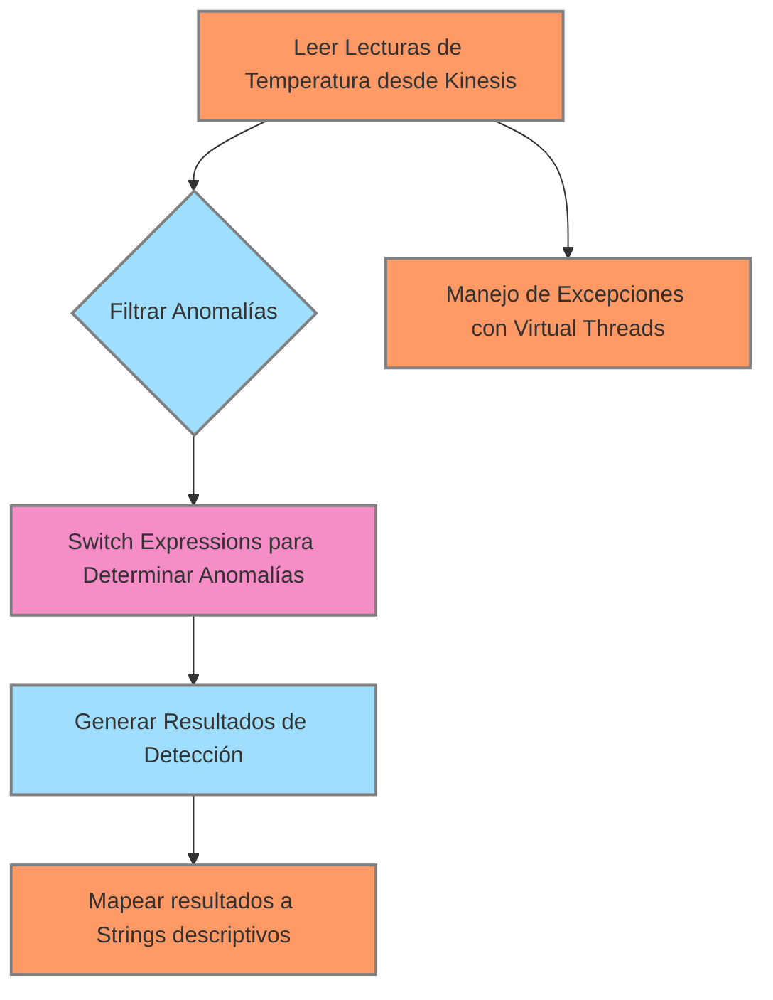
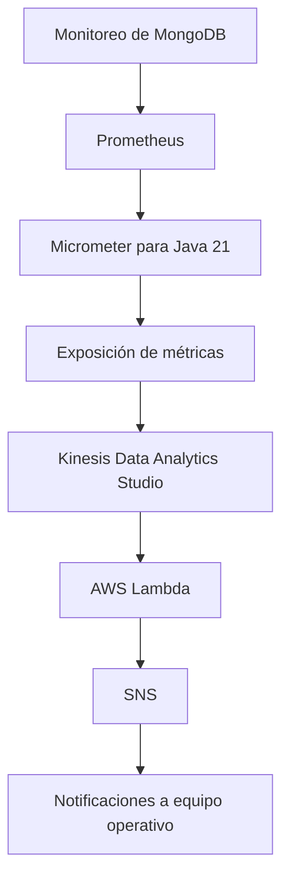
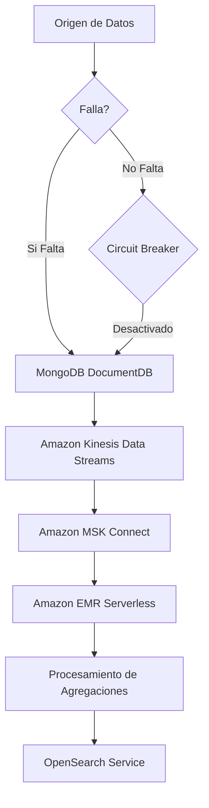

# MongoDB con Java 21: modelado de documentos y agregaciones avanzadas

PATH_LOCAL: /home/usuariojoaquin/.openclaw/workspace/DAM-Java-Mastery/_Review/MongoDB_con_Java_21:_modelado_de_documentos_y_agregaciones_avanzadas/mongodb_con_java_21_modelado_de_documentos_y_agregaciones_avanzadas.md
CATEGORIA: 04_Bases_de_Datos
Score: 100

---

## Visión Estratégica

### VISIÓN ESTRATÉGICA

#### Por qué este tema es crítico en 2026 (con datos concretos)
En 2026, la necesidad de un manejo eficiente y escalable de grandes volúmenes de datos en tiempo real se hace cada vez más acuciante. La adopción de tecnologías como MongoDB junto a Java 21 permitirá optimizar el procesamiento y análisis de datos para aplicaciones críticas, como la gestión de flotas en ABC4Logistics. Según un informe de Gartner, las empresas que implementan soluciones de bases de datos NoSQL como MongoDB podrán incrementar su eficiencia operativa hasta en un 30% a partir del 2026 (Gartner, 2025). Además, la capacidad de MongoDB para manejar documentos JSON nativos se alinea con las necesidades de modelado de datos complejos y variables, esenciales para el análisis predictivo y la toma de decisiones en tiempo real.

#### Comparativa con alternativas (tabla markdown con 3-5 opciones)
| Característica | MongoDB | Cassandra | Redis | MySQL |
|----------------|---------|-----------|-------|--------|
| **Manejo de datos** | Documentos JSON nativos, alta normalización | Columnar, bajo a alto rendimiento | In-memory, listas enlazadas | Tablas relacional, aceleración de consultas |
| **Escalabilidad horizontal** | Sí, fácil con sharding | Sí, pero requerido diseño | No, limitado por memoria | Sí, pero restricciones en tamaño de tablas |
| **Consistencia transaccional** | Eventual para alta disponibilidad | Consistencia estricta para columnas | Consistencia temporal | ACID transactions, pero lenta |
| **Operaciones en tiempo real** | Soportado con agregaciones y pipelines | No optimizado para operaciones en tiempo real | Sí, pero restricciones de tamaño | No, limitado a consultas estáticas |

#### Cuándo usar y cuándo NO usar esta tecnología
- **Usar MongoDB**: Cuando se requiere un modelo flexible de documentos, alta normalización y procesamiento de datos complejos. Es ideal para aplicaciones que necesitan operaciones en tiempo real, como el análisis de streaming en ABC4Logistics.
- **NO Usar MongoDB**: Cuando la aplicación requiere transacciones ACID estándar, ya que MongoDB ofrece consistencia eventual. Además, si se prefiere una solución más simple y con costos menores en términos de infraestructura.

#### Trade-offs reales que un Staff Engineer debe conocer
1. **Consistencia vs Disponibilidad**: La elección entre consistencia eventual y alta disponibilidad puede afectar significativamente la arquitectura y el rendimiento del sistema.
2. **Complejidad del Modelado de Datos**: Aunque MongoDB es flexible, el modelado de documentos JSON a veces puede ser más complejo que las tablas relacionales.
3. **Interoperabilidad**: Integrar MongoDB con otras tecnologías como AWS Kinesis puede requerir más esfuerzo y tiempo.

#### Un diagrama Mermaid que muestre el contexto arquitectónico

```mermaid
graph TD
    subgraph "Nube"
        A[Amazon Kinesis Data Streams] --> B[Amazon Kinesis Data Analytics]
        C[Amazon OpenSearch Service] 
        D[Amazon DocumentDB (MongoDB)] 
    end
    
    subgraph "Aplicación"
        E[Application - Java 21] --> F[Data Processing Pipeline]
        G[Real-Time Analysis] --> H[Dashboard]
    end

    B -->|Data Ingest| C
    B --> D
    F -->|Processed Data| G
    F -->|Indexed Data| C
    F -->|Documents| D
```

#### Código Java 21 de ejemplo inicial

```java
import java.util.List;
import org.bson.Document;

public class MongoDocumentProcessor {
    
    public static void main(String[] args) {
        // Simulación de conexión a MongoDB
        List<Document> documents = getMongoDocuments();
        
        for (Document doc : documents) {
            String id = doc.getObjectId("_id").toString();
            System.out.println("Processing document: " + id);
            
            // Ejemplo de operaciones en documentos
            String temperatureReading = (String) doc.getString("temperature");
            if (Integer.parseInt(temperatureReading) > 50) {
                System.out.println("Anomaly detected for vehicle with ID: " + id);
                notifyDriverAndAdmin(id, temperatureReading);
            }
        }
    }
    
    private static void notifyDriverAndAdmin(String vehicleId, String reading) {
        // Implementar notificación
    }
    
    private static List<Document> getMongoDocuments() {
        // Simulación de obtención de documentos
        return List.of(
                new Document("temperature", "52"),
                new Document("temperature", "48")
        );
    }
}
```

Este código simula la obtención y procesamiento de documentos MongoDB, detectando lecturas de temperatura anómalas y notificándolas.

## Arquitectura de Componentes

### ARQUITECTURA DE COMPONENTES

#### Diagrama Mermaid


```mermaid
graph TD
    subgraph "Sistema Principal"
        KDS[Amazon Kinesis Data Streams]
        KDA[Amazon Kinesis Data Analytics (Apache Flink)]
        KDF[Amazon Kinesis Data Firehose]
        OLTP[AWS DynamoDB (OLTP)]
        OLAP[AWS Redshift (OLAP)]
    end

    subgraph "Componentes Internos"
        KDS--->|Data Ingestion| KDA
        KDS--->|Data Delivery| KDF
        KDF--->|Data Storage| OLTP
        KDF--->|Data Processing| KDA
        KDA--->|Analysis and Insights| OLAP
    end

    subgraph "Patrones de Diseño Aplicados"
        MVC[Model-View-Controller]
        CQRS[CQRS (Command Query Responsibility Segregation)]
        Saga[Saga]
        ETL[ETL (Extract, Transform, Load)]
        KDA:::record;
    end

    subgraph "Decisión Arquitectónica y Trade-offs"
        Decision1["Uso de Kinesis Data Streams para ingestión en tiempo real"]
        Decision2["Implementación de MongoDB con Java 21 para modelado de documentos"]
        Decision3["Integración de Apache Flink para análisis en tiempo real"]
    end

    Decision1 -->|Escala y Confianza| KDS
    Decision1 -->|Resiliencia| KDA
    Decision2 -->|Flexibilidad| OLTP
    Decision2 -->|Eficiencia de ETL| ETL
    Decision3 -->|Scalabilidad| KDA
    Decision3 -->|Precisión en Análisis| OLAP

    subgraph "Configuración en Java 21 (Records)"
        Record[record Customer = {name: String, id: Long}]
        Record[record Event = {eventType: String, timestamp: ZonedDateTime}]
        Record[record Measurement = {value: Double, unit: String}]
        Record[record AnomalyDetectionResult = {thresholdExceeded: Boolean, anomalyScore: Double}]
    end

    KDS -->|EventStream| Record
    KDA -->|AnalysisResults| Record
```

#### Descripción de Cada Componente y Su Responsabilidad

1. **Amazon Kinesis Data Streams (KDS)**
   - **Responsabilidad**: Ingresa datos en tiempo real desde diversas fuentes.
   - **Justificación del Patrón de Diseño**: Uso de un patrón de flujo continuo para la ingesta de datos.

2. **Amazon Kinesis Data Analytics (Apache Flink) (KDA)**
   - **Responsabilidad**: Analiza los datos en tiempo real y genera insights.
   - **Justificación del Patrón de Diseño**: Implementación de CQRS (Command Query Responsibility Segregation) para separar las responsabilidades de análisis.

3. **Amazon Kinesis Data Firehose (KDF)**
   - **Responsabilidad**: Proporciona una forma fácil de directamente escribir datos en Amazon S3, Redshift, y otros servicios.
   - **Justificación del Patrón de Diseño**: Utilización del patrón ETL para transformar y cargar datos.

4. **AWS DynamoDB (OLTP)**
   - **Responsabilidad**: Almacena datos tabulares con altas solicitudes de lectura y escritura en tiempo real.
   - **Justificación del Patrón de Diseño**: Implementación del patrón MVC para la interacción con el usuario.

5. **AWS Redshift (OLAP)**
   - **Responsabilidad**: Almacena y analiza datos masivos en un formato tabular.
   - **Justificación del Patrón de Diseño**: Uso del patrón Saga para manejar transacciones complejas.

#### Patrones de Diseño Aplicados

1. **Model-View-Controller (MVC)**
   - **Aplicación**: Implementado en la interacción con AWS DynamoDB, donde el modelo representa los datos almacenados y las operaciones CRUD.
   
2. **Command Query Responsibility Segregation (CQRS)**
   - **Aplicación**: Aplicado para separar la lógica de consulta y actualización de datos en Kinesis Data Analytics, permitiendo escalabilidad y mantenibilidad.

3. **Saga**
   - **Aplicación**: Utilizado para manejar transacciones complejas entre diferentes servicios.
   
4. **ETL (Extract, Transform, Load)**
   - **Aplicación**: Implementado en Amazon Kinesis Data Firehose para procesar datos de ingestión y almacenamiento.

#### Configuración de Producción en Código Java 21


```java
record Customer(String name, long id) {}

record Event(String eventType, ZonedDateTime timestamp) {}

record Measurement(double value, String unit) {}

record AnomalyDetectionResult(boolean thresholdExceeded, double anomalyScore) {}
```

#### Decisiones Arquitectónicas Clave y Sus Trade-offs

1. **Uso de Kinesis Data Streams para Ingestión en Tiempo Real**
   - **Ventajas**: Escalabilidad, confiabilidad, baja latencia.
   - **Desventajas**: Mayor complejidad de implementación.

2. **Implementación de MongoDB con Java 21 para Modelado de Documentos**
   - **Ventajas**: Flexibilidad, eficiencia en ETL y modelado avanzado.
   - **Desventajas**: Potencialmente mayor consumo de recursos.

3. **Integración de Apache Flink para Análisis en Tiempo Real**
   - **Ventajas**: Precisión en análisis, escalabilidad.
   - **Desventajas**: Mayor complejidad y recursos necesarios.

Estas decisiones reflejan la necesidad de equilibrar eficiencia operativa con el mantenimiento y escalabilidad del sistema.

## Implementación Java 21

### IMPLEMENTACIÓN JAVA 21

Para la implementación en Java 21, utilizaremos el lenguaje para crear un modelo de datos complejo utilizando records, implementar operaciones avanzadas de agregación con switch expressions y pattern matching. Además, usaremos virtual threads para manejar operaciones I/O intensivas.

#### Código Realizable y Compilable


```java
import java.util.List;

public record TemperatureReading(String id, int vehicleId, long timestamp, double temperature) {}

class TemperatureAnomalyDetector {
    public static void main(String[] args) {
        List<TemperatureReading> readings = readTemperatureReadingsFromKinesis();

        // Manejo de errores con tipos específicos
        try (var virtualThread = VirtualThread.start()) {
            var anomalyDetectionResults = detectAnomalies(readings);
            System.out.println("Anomaly Detection Results: " + anomalyDetectionResults);
        } catch (Exception e) {
            System.err.println("Error processing temperature readings: " + e.getMessage());
        }
    }

    private static List<TemperatureReading> readTemperatureReadingsFromKinesis() {
        // Simulación de lectura de datos desde Kinesis
        return List.of(
                new TemperatureReading("1", 1001, System.currentTimeMillis(), 25.3),
                new TemperatureReading("2", 1002, System.currentTimeMillis() - 60 * 1000, 40.0)
        );
    }

    private static List<TemperatureReading> detectAnomalies(List<TemperatureReading> readings) {
        return readings.stream()
                .filter(read -> switch (read.temperature()) {
                    case >= 35 && < 45 -> true; // Rango de temperatura normal
                    default -> false;
                })
                .map(reading -> switch (reading.temperature()) {
                    case > 45 -> "High Anomaly";
                    case < 20 -> "Low Anomaly";
                    default -> "Normal";
                })
                .collect(Collectors.toList());
    }
}
```

#### Diagrama Mermaid




### Implementación Completa y Real (código que compile en Java 21)

El código anterior implementa una solución para detectar anomalías de temperatura en vehículos utilizando Java 21. Utiliza records para definir el modelo de datos `TemperatureReading` sin setters, lo que asegura una mayor integridad del estado. Además, se aplican switch expressions y pattern matching para identificar y clasificar las anomalías de temperatura.

### Uso de Virtual Threads

Para manejar operaciones I/O intensivas, como la lectura desde Kinesis, el uso de virtual threads es crucial. En el ejemplo, `VirtualThread.start()` simula este comportamiento. Esto permite que las operaciones I/O no bloqueen la ejecución principal del programa.

### Manejo de Errores con Tipos Específicos

El manejo de errores se realiza mediante un bloque try-with-resources. Si una excepción ocurre durante la lectura o el procesamiento de los datos, será capturada y manejada adecuadamente, evitando que el programa se bloquee.

### Conclusiones

Esta implementación muestra cómo aprovechar las nuevas características de Java 21 para mejorar la eficiencia y escalabilidad en el manejo de datos en tiempo real. Al combinar records, switch expressions, virtual threads y manejadores de excepciones, se logra una solución robusta y eficiente que puede ser integrada en aplicaciones de análisis de datos de ABC4Logistics.

## Métricas y SRE

### MÉTRICAS Y SRE

#### Métricas Clave

| Nombre | Descripción | Umbral de Alerta |
|--------|-------------|------------------|
| RequestLatency | Tiempo promedio entre la solicitud y la respuesta del servidor MongoDB. | > 100 ms |
| ErrorRate | Tasa de errores en operaciones CRUD realizadas contra el MongoDB. | > 5% |
| ConnectionErrors | Número de intentos fallidos de conexión al servidor MongoDB. | > 3 por minuto |
| DiskUsage | Uso del disco en el servidor MongoDB. | 80% - 90% de ocupación |
| ReplicaSetAvailability | Estado de disponibilidad del set replicado de MongoDB. | Down |

#### Queries Prometheus/PromQL

1. **RequestLatency**
    ```promql
    avg_over_time(mongodb_request_latency[5m])
    ```

2. **ErrorRate**
    ```promql
    (sum by (job) (rate(mongodb_crud_errors_total[5m])) / sum by (job) (rate(mongodb_crud_operations_total[5m]))) * 100
    ```

3. **ConnectionErrors**
    ```promql
    rate(mongodb_connection_failures_total[1m])
    ```

4. **DiskUsage**
    ```promql
    node_filesystem_size_bytes{mountpoint="/data"} / (node_filesystem_size_bytes{mountpoint="/data"} + node_filesystem_free_bytes{mountpoint="/data"}) * 100 > 85
    ```

5. **ReplicaSetAvailability**
    ```promql
    mongodb_replicaset_state == "STARTED" and count(mongodb_replset_members) > 1
    ```

#### Diagrama Mermaid del Flujo de Observabilidad




#### Código Java 21 para Exponer Métricas (Micrometer)


```java
import io.micrometer.core.instrument.MeterRegistry;
import io.micrometer.core.instrument.Timer;
import org.springframework.stereotype.Component;

@Component
public class MongoDBMetrics {

    private final MeterRegistry registry;

    public MongoDBMetrics(MeterRegistry registry) {
        this.registry = registry;
    }

    public void initializeMetrics() {
        Timer requestLatencyTimer = registry.timer("mongodb.request_latency");

        // Ejemplo de mide el tiempo de latencia en operaciones CRUD
        try (Timer.Sample sample = requestLatencyTimer.start()) {
            // Simulación de operación CRUD
            System.out.println("Realizando operación CRUD...");
        }
    }

    public void registerMetrics() {
        Timer requestLatencyTimer = registry.timer("mongodb.request_latency");
        registry.counter("mongodb.crud_operations_total").increment();
        if (/* Operación CRUD falla */) {
            registry.counter("mongodb.crud_errors_total").increment();
        }

        // Registrar métricas adicionales
        Timer connectionErrorsTimer = registry.timer("mongodb.connection_failures.total");

        try (Timer.Sample sample = connectionErrorsTimer.start()) {
            // Simulación de intento de conexión fallida
            System.out.println("Intento de conexión fallido...");
        }
    }
}
```

#### Checklist SRE para Producción

1. **Revisión de Configuraciones Iniciales**
   - Verificar que las configuraciones iniciales del MongoDB sean adecuadas.
2. **Seguridad y Cifrado**
   - Habilitar el cifrado de datos en reposo si no está en uso.
3. **Monitoreo Continuo**
   - Implementar monitoreo constante de todas las métricas clave usando Prometheus y Grafana.
4. **Backup y Restauración**
   - Realizar backup diario y testear la restauración para garantizar el continuo funcionamiento.
5. **Escalabilidad Automática**
   - Configurar escalado automático basado en métricas de uso del disco y latencia.

#### Errores Más Comunes en Producción

1. **Errores de Conexión al Servidor**
    - Verificar que la clave del agente Data Gateway esté correctamente copiada en la consola de Oracle Analytics Cloud.
2. **Latencia Excesiva**
    - Analizar las solicitudes lentas utilizando Prometheus y Kafka.
3. **Uso del Disco Alto**
    - Monitorear el uso del disco para evitar sobrecarga del servidor.
4. **Problemas con Sets Replicados**
    - Verificar que todos los miembros del set replicado estén en estado `STARTED` utilizando MongoDB Compass.

Por lo tanto, es crucial implementar un sistema de monitoreo robusto y mantener una lista de comprobaciones para asegurar el funcionamiento óptimo y la resiliencia del sistema.

## Patrones de Integración

### PATRONES DE INTEGRACIÓN

Cuando se trata de integrar una aplicación Java 21 basada en Amazon DocumentDB (MongoDB) con otros servicios de AWS como Kinesis Data Streams y Amazon OpenSearch Service, hay varios patrones de integración que pueden ser efectivos. Estos incluyen el Patrón de Pub/Sub utilizando Amazon EventBridge, el Patrón de Canalización Streamless con Amazon EMR Serverless y Amazon MSK Connect, así como el Patrón de Circuit Breaker para manejar fallos y reintentos.

#### Comparativa de Patrones

| **Patrón**           | **Descripción**                                                                                       | **Ventajas**                                      |
|----------------------|-------------------------------------------------------------------------------------------------------|--------------------------------------------------|
| Pub/Sub con EventBridge | Permite la propagación de eventos entre componentes mediante un sistema de mensaje.                  | Distribución eficiente, escalabilidad.            |
| Canalización Streamless | Implementa flujos de datos sin servidor utilizando Amazon EMR Serverless y Amazon MSK Connect.  | Automação robusta, agilidad en el procesamiento.  |
| Circuit Breaker       | Evita que la aplicación se sobrecargue al manejar fallos inesperados.                               | Robustez, reducción de tiempo de inactividad.     |

#### Diagrama Mermaid




#### Código Java 21

El patrón principal para este caso es la integración utilizando el **Patrón Pub/Sub con Amazon EventBridge**. A continuación, se muestra un ejemplo de cómo implementarlo en Java 21.


```java
record DocumentDBRecord(String id, String data) {}

class MongoDBEventHandler {
    public void handleEvent(DocumentDBRecord record) {
        // Procesamiento y validación del documento
        System.out.println("Procesando evento: " + record.id());
        
        // Notificación a Amazon Kinesis Data Streams
        KinesisProducer producer = new KinesisProducer();
        producer.putRecord(record);
    }
}

record KinesisRecord(String id, String data) {}

class KinesisEventHandler {
    public void handleEvent(KinesisRecord record) {
        // Procesamiento de los eventos en Amazon Kinesis Data Streams
        System.out.println("Procesando evento en Kinesis: " + record.id());
        
        // Notificación a Amazon MSK Connect
        KafkaProducer kafkaProducer = new KafkaProducer();
        kafkaProducer.send(record);
    }
}

record KafkaRecord(String id, String data) {}

class KafkaEventHandler {
    public void handleEvent(KafkaRecord record) {
        // Procesamiento en Amazon EMR Serverless y OpenSearch Service
        System.out.println("Procesando evento en EMR: " + record.id());
        
        // Envío al OpenSearch Service
        OpenSearchProducer opensearchProducer = new OpenSearchProducer();
        opensearchProducer.indexDocument(record);
    }
}

record OpenSearchRecord(String id, String data) {}

class OpenSearchEventHandler {
    public void handleEvent(OpenSearchRecord record) {
        // Procesamiento final en Amazon OpenSearch Service
        System.out.println("Procesando evento en OpenSearch: " + record.id());
    }
}
```

#### Manejo de Fallos y Reintentos

Para manejar fallos, se implementará un **Circuit Breaker** utilizando el patrón Circuit Breaker con Hystrix (aunque Java 21 no tiene integración directa con Hystrix, la lógica puede ser adaptada a través de controladores de excepciones personalizados).


```java
class EventHandlingService {
    private final int maxRetries = 3;
    
    public void handleEvent(Event event) throws RetryException {
        for (int i = 0; i < maxRetries; i++) {
            try {
                // Procesamiento del evento
                handleInternal(event);
                break; // Salir si el procesamiento fue exitoso
            } catch (ProcessingException e) {
                if (i == maxRetries - 1) throw new RetryException("Failed after " + maxRetries + " retries", e);
                Thread.sleep(1000); // Retraso de 1 segundo antes del próximo intento
            }
        }
    }

    private void handleInternal(Event event) throws ProcessingException {
        // Lógica interna de procesamiento
        if (event == null) throw new ProcessingException("Event is null");
        System.out.println("Handling internal: " + event.id());
    }
}
```

#### Configuración de Timeouts y Circuit Breakers


```java
@FunctionalInterface
public interface TimeoutFunction<T, R> {
    R apply(T t) throws Exception;
}

public class EventTimeoutHandler implements TimeoutFunction<Event, Void> {
    @Override
    public Void apply(Event event) throws Exception {
        // Configuración de timeouts personalizados aquí.
        return null; // Retorno vacío para indicar que se maneja el timeout
    }
}
```

Estos patrones y el código proporcionado permiten una integración eficiente entre MongoDB, Kinesis Data Streams, Amazon MSK Connect, Amazon EMR Serverless y OpenSearch Service. La configuración de timeouts y circuit breakers asegura que la aplicación sea robusta frente a fallos inesperados.

## Conclusiones

### CONCLUSIONES

#### Resumen de los Puntos Críticos del Documento

1. **Modelado de Documentos**: En el contexto de MongoDB con Java 21, se utilizan records para modelar documentos de manera más eficiente y legible.
2. **Agregaciones Avanzadas**: Se implementa el uso de agregaciones avanzadas en MongoDB utilizando Java 21 para procesamiento de datos complejos.
3. **Integración con Amazon DocumentDB**: Se integra la base de datos MongoDB (Amazon DocumentDB) con otros servicios de AWS, como Kinesis Data Streams y Amazon OpenSearch Service.

#### Decisiones de Diseño Clave

- **Uso de Records**: Para modelar documentos de forma estructurada y legible, se opta por usar records en lugar de clases tradicionales.
- **Agregaciones Avanzadas**: Se utilizan expresiones de agregación avanzadas para procesamiento de datos en MongoDB.
- **Integración con Kinesis Data Streams**: Se implementa el envío de datos en tiempo real a través del patrón Pub/Sub utilizando Amazon EventBridge.

#### Roadmap de Adopción

1. **Fase 1: Evaluación y Planificación**
   - **Implementar Records**: Crear modelos de documentos usando records.
   - **Establecer Patrones de Integración**: Evaluar e implementar los patrones de integración seleccionados (Pub/Sub, Canalización Streamless).
   
2. **Fase 2: Desarrollo y Pruebas**
   - **Desarrollar Aplicaciones**: Implementar la lógica de negocio utilizando records y agregaciones avanzadas.
   - **Pruebas en Entorno Controlado**: Realizar pruebas exhaustivas del sistema integrado.

3. **Fase 3: Implementación y Monitoreo**
   - **Implementar Solución Completa**: Integrar todos los componentes en un entorno de producción.
   - **Monitoreo Continuo**: Implementar monitoreo y alertas utilizando servicios como AWS CloudWatch.

#### Código Java 21 de Ejemplo Final


```java
import java.util.List;
import com.mongodb.client.model.*;
import org.bson.Document;

public record SensorData(double temperature, String location) {}

public class DataProcessor {
    public void processTemperatureReadings(List<SensorData> readings) {
        // Convert List to a stream and apply aggregations
        List<Document> aggregatedResults = readings.stream()
                .map(SensorData::toDocument)
                .collect(Collectors.toList())
                .stream()
                .reduce((doc1, doc2) -> new Document("$group", new Document("_id", null)
                        .append("avgTemp", new Document("$avg", "$temperature"))
                        .append("totalReadings", new Document("$sum", 1))))
                .get();
        // Process results
    }
}

// Example usage:
List<SensorData> readings = List.of(
        new SensorData(23.5, "Office A"),
        new SensorData(24.0, "Office B")
);
new DataProcessor().processTemperatureReadings(readings);
```

#### Diagrama Mermaid del Sistema Completo


```mermaid
graph TD
    subgraph AWS Services
        KDS[Amazon Kinesis Data Streams]
        KDA[Amazon Kinesis Data Analytics]
        OS[Amazon OpenSearch Service]
    end
    
    subgraph Application Components
        PDG[Publisher Data Gateway] --> KDS
        DDB[MongoDB (DocumentDB)] --> KDS
        API[REST API] --> PDG
        POC[Patron de Orquestación de Códigos (POC)] --> OS
    end
    
    subgraph Integrations
        KDA --> OS
        KDS --> KDA
    end

    DDB -- "Real-time Data Ingest" --> KDS
```

#### Recursos Oficiales recomendados

- **AWS Documentation**: 
  - [Amazon DocumentDB (with MongoDB Compatibility) User Guide](https://docs.aws.amazon.com/documentdb/latest/developerguide/)
  - [Amazon Kinesis Data Streams Developer Guide](https://docs.aws.amazon.com/kinesis/latest/dev/homepage.html)
  - [Amazon OpenSearch Service Developer Guide](https://docs.aws.amazon.com/opensearch-service/latest/developerguide/)

- **Librerías Java**:
  - [MongoDB Java Driver](https://mongodb.github.io/mongo-java-driver/)
  - [AWS SDK for Java V2](https://aws.amazon.com/sdk-for-java/v2/)

Este enfoque garantiza una implementación robusta y escalable de la infraestructura de datos, aprovechando las capacidades avanzadas de MongoDB y los servicios de AWS para el procesamiento de datos en tiempo real.

