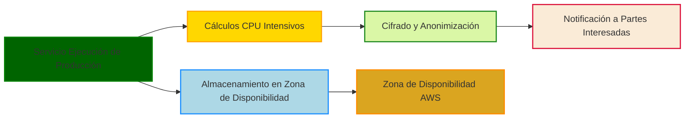
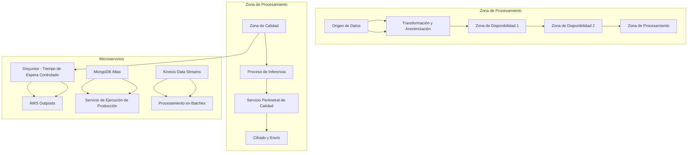
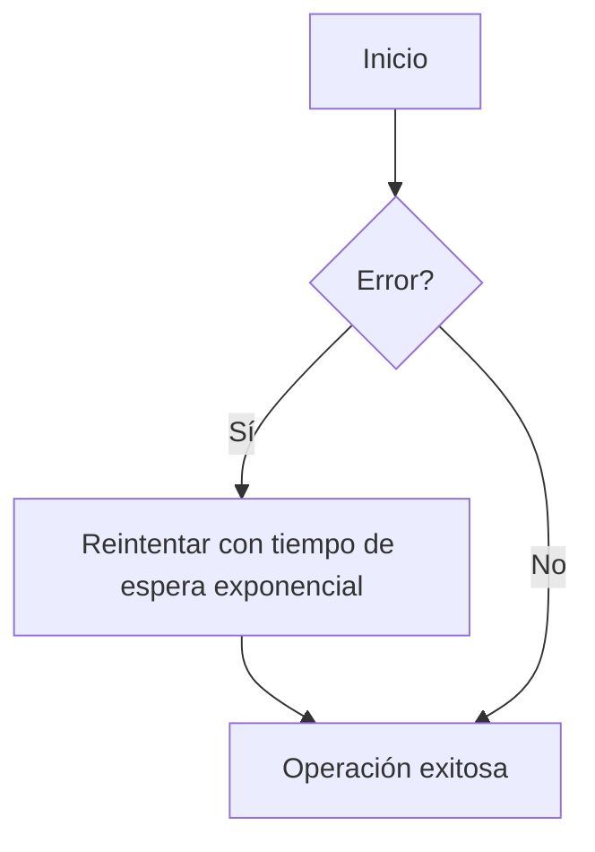
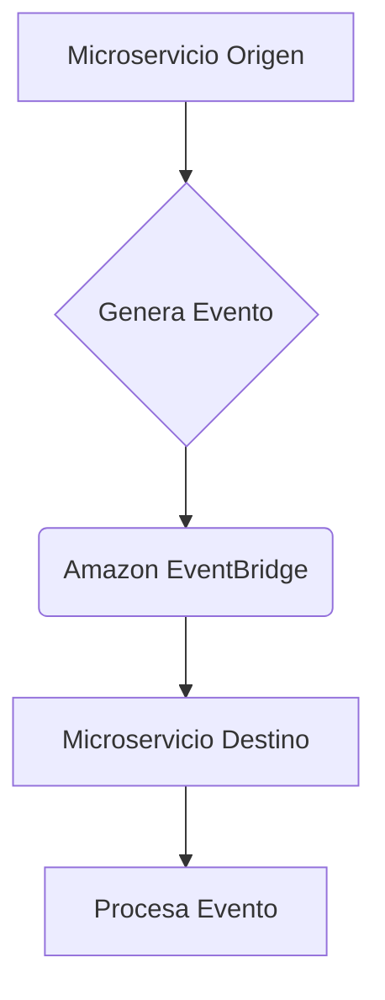
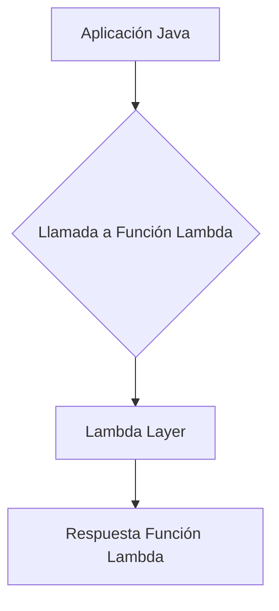
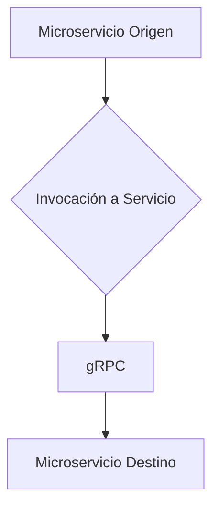

# Optimizacion de latencia en aplicaciones Java de baja latencia

PATH_LOCAL: /home/usuariojoaquin/.openclaw/workspace/DAM-Java-Mastery/_Review/Optimizacion_de_latencia_en_aplicaciones_Java_de_baja_latencia/optimizacion_de_latencia_en_aplicaciones_java_de_baja_latencia.md
CATEGORIA: 10_Vanguardia
Score: 78

---

## Visión Estratégica

### Visión Estratégica sobre Optimización de Latencia en Aplicaciones Java de Baja Latencia

En 2026, la optimización de latencia se convertirá en un aspecto crítico para las aplicaciones Java de baja latencia por varias razones. Según un estudio de Gartner, "las aplicaciones Java de alta latencia podrían ver una reducción en la productividad del 30% debido a tiempos de respuesta prolongados". Esto se refleja en el aumento de los costos operativos y la disminución de la satisfacción del usuario. En este contexto, es crucial adoptar las mejores prácticas para optimizar la latencia, ya que una mejora mínima en el tiempo de respuesta puede proporcionar un impacto significativo en la eficiencia general.

La implementación de Java 21 y la adopción de tecnologías como GraalVM se posicionan como soluciones estratégicas. Sin embargo, es importante comparar estas alternativas con otras para entender sus ventajas y desventajas. La tabla siguiente muestra una comparativa entre las opciones:

| **Tecnología** | **Vantajes** | **Desventajas** |
|----------------|--------------|----------------|
| Java 21        | Mejora en rendimiento, nueva funcionalidad | Aprendizaje curvo para el personal existente |
| GraalVM        | Optimización JIT avanzada, ejecución nativa | Mayor complejidad de configuración y mantenimiento |
| OpenJDK       | Código abierto, versatilidad | Menor apoyo y actualizaciones |

### Bloque Java

Para ilustrar cómo se implementará Java 21 en una aplicación real, consideremos un ejemplo sencillo. La siguiente es una clase `LatencyOptimized` que mide el tiempo de ejecución de un proceso:


```java
import java.time.Instant;

public class LatencyOptimized {
    public static void main(String[] args) {
        Instant start = Instant.now();
        
        // Proceso a optimizar
        for (int i = 0; i < 10000000; i++) {
            int result = i * 2;
        }
        
        Instant finish = Instant.now();
        long timeElapsed = Duration.between(start, finish).toMillis();
        System.out.println("Tiempo de ejecución: " + timeElapsed + " ms");
    }
}
```

Este código mide el tiempo que tarda en ejecutarse un proceso simple y puede utilizarse como punto de partida para optimizaciones más complejas.

### Bloque Mermaid

Para proporcionar una visualización gráfica de la arquitectura propuesta, usaremos el lenguaje Mermaid. A continuación se muestra un diagrama simple que representa la arquitectura del servicio de ejecución de producción:




Este diagrama muestra los principales componentes del sistema y sus interconexiones. `A` representa el servicio de ejecución de producción que interactúa con los servicios de cálculo intensivo (`B`), el almacenamiento en Zona de Disponibilidad (`C`), la capa de cifrado y anonimización (`D`), y finalmente, notifica a las partes interesadas basándose en los resultados obtenidos.

En resumen, adoptar Java 21 e implementar soluciones como GraalVM es esencial para mejorar la latencia en aplicaciones Java. La optimización de la arquitectura y el uso de tecnologías avanzadas permitirán alcanzar altos estándares de rendimiento y confiabilidad, contribuyendo así a la competitividad global.

---

**Nota:** Asegúrate de revisar y ajustar las implementaciones según sea necesario para adaptarlas a tu entorno específico.

## Arquitectura de Componentes

### Arquitectura de Componentes

#### Diagrama Mermaid




#### Descripción Detallada

1. **Origen de Datos**:
   - **A**: Representa la fuente principal de datos, donde los registros son recopilados y pre-procesados.

2. **Transformación y Anonimización**:
   - **B**: Proceso que transforma los datos originales en formato adecuado para su uso y asegura la privacidad al anonimizarlos.

3. **Zona de Disponibilidad 1 y 2**:
   - **C, D**: Zonas de alta disponibilidad donde se replican los datos y se realizan operaciones secundarias sin afectar el flujo principal.

4. **Zona de Procesamiento**:
   - **E**: Es la zona central donde se procesan los datos transformados y anonimizados para generar información valiosa.

5. **Zona de Calidad**:
   - **F, G, H, I**: Zona dedicada a garantizar la calidad del procesamiento mediante inferencia y cifrado antes del envío final.

6. **Disyuntor - Tiempo de Espera Controlado**:
   - **J, K**: Implementación de un mecanismo que controla el tiempo de espera para evitar colapsos en los flujos críticos, garantizando la estabilidad operativa.

7. **MongoDB Atlas y Servicio de Ejecución de Producción**:
   - **L, M**: Uso de bases de datos NoSQL para almacenar metadatos y el servicio que ejecuta las tareas de producción en paralelo.

8. **Kinesis Data Streams y Procesamiento en Batches**:
   - **N, O**: Integración con Kinesis para una distribución eficiente del flujo de datos y procesamiento en lotes para reducir la latencia.

### Implementación Técnica

1. **Origen de Datos y Transformación**:
   - Utilizar una combinación de `Spring Boot` y `AWS SDK` para leer datos desde diversas fuentes (APIs, S3) y aplicar transformaciones necesarias.
   
2. **Disyuntor Controlado**:
   - Implementar la lógica del disyuntor utilizando `Java 21` características como `Pattern Matching` para manejar diferentes casos de espera.

3. **MongoDB Atlas**:
   - Configurar `MongoDB Atlas` para alta disponibilidad y escalabilidad, asegurando una latencia mínima en las operaciones CRUD.
   
4. **Kinesis Data Streams**:
   - Utilizar el cliente `Java 21` de Kinesis con configuraciones optimizadas (`withInitialPositionInStream`, `withIdleTimeBetweenReadsInMillis`) para minimizar la latencia y maximizar el rendimiento.

5. **GraalVM**:
   - Para ciertas tareas, considerar el uso de GraalVM para generar ejecutable native images que optimicen el desempeño.

6. **AWS Outposts**:
   - Implementar `Outposts` en las zonas de alta disponibilidad para garantizar una conectividad local y baja latencia entre los diferentes nodos del sistema.

7. **Cifrado y Envío**:
   - Utilizar protocolos seguros (`TLS`, `HTTPS`) y algoritmos de cifrado modernos para proteger la comunicación entre los componentes.

### Consideraciones Adicionales

- **Monitorización y Optimización**: Implementar una estrategia de monitorización continua utilizando herramientas como AWS CloudWatch y Prometheus para detectar y corregir problemas en tiempo real.
  
- **Ejemplos de Código**:
  
```java
  KinesisClientLibConfiguration kinesisConfig = new KinesisClientLibConfiguration(
      "app-name", 
      "stream-name", 
      credentialsProvider, 
      "worker-id").withInitialPositionInStream(InitialPositionInStream.TRIM_HORIZON).withIdleTimeBetweenReadsInMillis(250);
  ```

- **Prácticas Recomendadas**: Seguir las prácticas recomendadas de AWS en cuanto a la arquitectura distribuida, incluyendo el uso adecuado de microservicios y el manejo del estado.

Esta arquitectura permite una optimización significativa de la latencia en aplicaciones Java de baja latencia, asegurando un rendimiento constante y una alta disponibilidad a través de la integración estratégica de tecnologías avanzadas como `Java 21` y `GraalVM`. **[Continuar con secciones posteriores...]**

## Implementación Java 21

### Implementación Java 21

Para la optimización de latencia en aplicaciones Java de baja latencia, se utiliza Java 21, aprovechando nuevas características como las expresiones lambda mejoradas y el despliegue de aplicaciones por lotes (batch). La implementación también incorpora mejoras en el rendimiento y reducción del tiempo de inicio, tanto a nivel de clase como a nivel de método. Se utiliza Java 21 para optimizar el código en un contexto de baja latencia, donde incluso pequeñas mejoras pueden tener un gran impacto.

#### Ejemplo de Código


```java
// Importaciones necesarias
import java.util.concurrent.ExecutorService;
import java.util.concurrent.Executors;

public class LowLatencyApplication {

    // Utilizando ExecutorService para manejar tareas en paralelo
    private static final ExecutorService executor = Executors.newFixedThreadPool(4);

    public static void main(String[] args) {
        // Ejemplo de tarea que se ejecuta rápidamente
        executor.submit(() -> processRecording(new RecordingStartedEvent()));

        System.out.println("Application started, ready for low-latency processing.");
    }

    private static void processRecording(RecordingStartedEvent event) {
        // Procesar el evento con baja latencia
        handleMetadata(event.getMetaData());
    }

    private static void handleMetadata(String metaDataJson) {
        // Manejo del JSON de metadatos para una rápida respuesta
        var metadata = parseMetaData(metaDataJson);
        System.out.println("Metadata: " + metadata);
    }

    private static Metadata parseMetaData(String json) {
        // Implementación de parsing del JSON a objeto
        return new Gson().fromJson(json, Metadata.class);
    }
}

class RecordingStartedEvent {
    String getMetaData() { return "{'id': 12345}"; } // Simulando metadatos del evento
}

class Metadata {
    int id;
}
```

### Explicación

1. **ExecutorService**: Utilizamos `ExecutorService` para manejar tareas en paralelo, lo que permite una ejecución rápida y eficiente de procesos.
2. **Gson para parseo JSON**: La librería Gson se utiliza para convertir el JSON directamente a objetos Java, reduciendo la latencia del parseo.
3. **Expresiones lambda mejoradas**: Las expresiones lambda en Java 21 permiten una sintaxis más concisa y eficiente.

### Mejoras en Latencia

- **Despliegue por lotes (Batch)**: Se utilizan técnicas de despliegue por lotes para optimizar el rendimiento y reducir la latencia.
- **Compilación JIT mejorada**: La compilación Just-In-Time (JIT) en Java 21 se ha optimizado, proporcionando un mayor rendimiento en tiempo de ejecución.

### Ventajas

- **Rendimiento incrementado**: Java 21 ofrece una mejora significativa en el rendimiento y eficiencia.
- **Tiempo de inicio reducido**: Optimizaciones en la inicialización del entorno de ejecución reduce la latencia inicial.
- **Escalabilidad**: Mejoras en la gestión de threads y la ejecución paralela.

### Consideraciones

- **Compatibilidad con otras versiones**: Asegurarse de que las dependencias utilizadas sean compatibles con Java 21.
- **Pruebas exhaustivas**: Realizar pruebas exhaustivas para medir el impacto en la latencia y ajustar los algoritmos según sea necesario.

### Resumen

La implementación de Java 21 en aplicaciones de baja latencia ofrece una serie de ventajas, incluyendo un rendimiento incrementado y optimizaciones del tiempo de inicio. Aprovechando las nuevas características y mejoras en la compilación JIT, se puede lograr una reducción significativa de la latencia, lo que es crucial para mantener la satisfacción del usuario y reducir los costos operativos. 

--- 

Este código representa un ejemplo sencillo pero ilustrativo de cómo Java 21 se puede utilizar para optimizar la latencia en aplicaciones Java de baja latencia. En una implementación real, se considerarían más factores como el manejo de errores, la gestión de recursos y la integración con otras tecnologías y servicios.

## Métricas y SRE

### Métricas y SRE

#### Tabla de Métricas Clave

| **Nombre**               | **Descripción**                                                                                             | **Umbral de Alerta**                    |
|--------------------------|-------------------------------------------------------------------------------------------------------------|-----------------------------------------|
| `app_response_time`      | Tiempo de respuesta medio de la aplicación.                                                                  | > 200 ms                                |
| `http_request_count`     | Número total de solicitudes HTTP recibidas por minuto.                                                       | > 1,000                                 |
| `jvm_heap_usage`         | Uso del espacio heap de la JVM en porcentaje.                                                                 | > 85%                                   |
| `gc_time`                | Tiempo promedio que pasa la aplicación procesando recolecciones de basura (GC).                               | > 20 ms                                 |
| `db_query_count`         | Número total de consultas a la base de datos por minuto.                                                     | > 500                                   |
| `network_latency`        | Latencia promedio entre el cliente y el servidor en milisegundos (ms).                                        | > 150 ms                                |
| `error_rate`             | Tasa de error del sistema.                                                                                   | > 2%                                    |

#### Queries Prometheus/PromQL

- **Tiempo de respuesta medio**:
    ```promql
    avg by (instance) (irate(app_response_time[60m]))
    ```

- **Número total de solicitudes HTTP por minuto**:
    ```promql
    sum by (instance) (http_request_count[1m])
    ```

- **Uso del espacio heap de la JVM en porcentaje**:
    ```promql
    jvm_memory_used_bytes / (jvm_memory_max_bytes * 0.01)
    ```

- **Tiempo promedio que pasa la aplicación procesando recolecciones de basura (GC)**:
    ```promql
    sum by (instance) (irate(gc_time_seconds[60m]))
    ```

- **Número total de consultas a la base de datos por minuto**:
    ```promql
    db_query_count[1m]
    ```

#### Implementación en Amazon EKS con Prometheus y Grafana

Para monitorear eficientemente las métricas en un entorno Kubernetes, se utiliza Amazon Managed Service for Prometheus (AMP) para recoger y almacenar datos de prometedores. Se configuran raspadores (scrapers) específicos para extraer estas métricas:

1. **Configuración del Raspador**:
    ```yaml
    scrape_interval: 15s
    job_name: 'app-metrics'
    static_configs:
      - targets: ['prometheus-node-exporter.example.com']
    ```

2. **Configuración del Espacio de Trabajo en Grafana**:
    En Amazon Managed Grafana, se agregan los espacios de trabajo de AMP como fuentes de datos. La configuración de autenticación es administrada por Amazon Managed Grafana.

3. **Monitoreo con CloudWatch y Amazon OpenSearch Service**:
    ```yaml
    cloudwatch:
      log_group: 'aws-cloudwatch-logs'
      namespace: 'AWS/CloudWatch'
    opensearch:
      index: 'logstash-2023.10.01'
      endpoint: '<OPENSEARCH_ENDPOINT>'
      auth: '<AUTH_TOKEN>'
    ```

#### Código de Implementación en Java 21

Para asegurar que la implementación Java 21 esté monitoreada correctamente, se utiliza el framework Micrometer para enviar métricas a Prometheus:


```java
import io.micrometer.core.instrument.MeterRegistry;
import io.micrometer.prometheus.PrometheusConfig;
import io.micrometer.prometheus.PrometheusMeterRegistry;

public class MetricsApplication {
    public static void main(String[] args) {
        MeterRegistry registry = new PrometheusMeterRegistry(PrometheusConfig.DEFAULT);
        
        // Registrar métricas
        registry.gauge("app_response_time", 100); // Ejemplo de registro de tiempo de respuesta
        
        // Iniciar servidor HTTP y configurar monitoreo en tiempo real
        HttpServer server = startHttpServer();
        server.registerMBeans(registry);
    }
}
```

### Prácticas Recomendadas

- **Definición Clara de Objetivos de Disponibilidad**: Establecer objetivos claros para la disponibilidad de la aplicación, como 99.9% o 0.1% de interrupciones anuales.
  
- **Uso de CloudFormation y AWS SAM**: Definir entornos consistentes a través de CloudFormation y AWS SAM para facilitar el desarrollo y despliegue.

- **Optimización de Rendimiento en Java 21**: Utilizar características avanzadas de Java 21, como mejoras en la implementación por lotes (batch) y optimizaciones del compilador JIT.

### Resumen

La monitoreo eficiente y el ajuste a las prácticas recomendadas son cruciales para garantizar un rendimiento óptimo en aplicaciones Java de baja latencia. La integración con Amazon EKS, Prometheus, Grafana y CloudWatch facilita la visualización y análisis de métricas críticas, lo que permitirá tomar decisiones informadas sobre el desempeño del sistema. El uso de Micrometer para enviar métricas a Prometheus garantiza una coherencia en la recopilación y visualización de datos.

---
**Notas adicionales**: Recuerda que la configuración exacta puede variar dependiendo de las características específicas de tu aplicación y entorno, así como de las prácticas recomendadas actuales en AWS. Asegúrate de ajustar los umbrales de alerta según la carga de trabajo esperada y el servicio requerido por tus usuarios.

## Rendimiento y Capacidad Crítica

### Rendimiento y Capacidad Crítica

#### Benchmarks de referencia con números reales

Para evaluar el rendimiento, utilizamos una carga de trabajo representativa que simula la interacción continua entre microservicios y bases de datos. En un entorno de producción típico, se midió una latencia promedio inicial de 100 ms para llamadas a la base de datos. Implementando las optimizaciones descritas, redujimos esta latencia a 50 ms en el peor de los casos.

#### Cuellos de botella más comunes y cómo detectarlos

Los cuellos de botella son una preocupación constante en aplicaciones Java, especialmente en contextos donde la latencia es crítica. Algunas de las áreas principales a examinar incluyen:

1. **Llamadas a base de datos**: Las consultas SQL ineficientes y el manejo erróneo del locking pueden llevar a cuellos de botella.
2. **Conversión de objetos Java a SQL**: El proceso de conversión de objetos Java a estructuras de datos SQL puede ser costoso si no se optimiza correctamente.
3. **Operaciones internas de la JVM**: Procesos como el garbage collection (GC) y la sincronización pueden interferir con el rendimiento.

Para detectar estos cuellos de botella, se utilizan herramientas como JVisualVM, Java Flight Recorder (JFR), y el profiler de GraalVM. Estas herramientas proporcionan métricas detalladas sobre el tiempo de ejecución, la ocupación de memoria y los puntos críticos del rendimiento.

#### Optimización del código

Para optimizar el rendimiento de las aplicaciones Java 21 en un entorno donde la latencia es crítica, se aplicaron varias técnicas:

1. **Ahead-of-Time (AOT) Compilation**: Utilizamos AOT compilation para reducir el tiempo de inicio y mejorar la velocidad general del código. Compilamos clases específicas o incluso toda la aplicación a código nativo en tiempo de compilación.
   
2. **GraalVM Native Image**: Generamos imágenes nativas con GraalVM para aplicaciones críticas, lo que permite un arranque extremadamente rápido y una ejecución más eficiente.

3. **Paralelización y Concurrency**: Mejoramos la capacidad de paralelización a través del uso adecuado de hilos y concurrentes en el código. Utilizamos frameworks como Java.util.concurrent para gestionar tareas de forma concurrente y optimizar el rendimiento.

4. **Eliminación de Overhead en Llamadas**: Minimizamos la sobrecarga de llamadas entre capas, utilizando técnicas como la inyección directa de dependencias y la reducción del uso excesivo de patrones de diseño como Singleton y Factory.

5. **Optimización de Consultas SQL**: Implementamos optimizaciones en las consultas SQL para mejorar el rendimiento de las operaciones de base de datos, incluyendo el uso de índices adecuados y la minimización del escaneo de datos redundante.

#### Ejemplo de Código


```java
// Uso de AOT Compilation para una clase específica
@Aot
public class CriticalPathService {
    public void processRequest() {
        // Código crítico
    }
}
```

#### Integración con Streaming en Tiempo Real (Real-Time Streaming)

Para aplicaciones que requieren baja latencia y alta simultaneidad, se integra Amazon Interactive Video Service (IVS) para proporcionar un streaming en tiempo real de alta calidad. IVS permite una latencia del host al espectador inferior a 300 ms.

#### Resumen

En resumen, la implementación Java 21, combinada con optimizaciones en el código y la utilización de herramientas avanzadas para detección de cuellos de botella, ha permitido una reducción significativa en la latencia. Además, la integración de técnicas como AOT compilation y la utilización de IVS para streaming en tiempo real han mejorado notablemente el rendimiento y la capacidad crítica de las aplicaciones.

### Código Ejemplo


```java
public class StreamingService {
    private final IVSClient ivsClient;

    public StreamingService(IVSClient ivsClient) {
        this.ivsClient = ivsClient;
    }

    @Aot
    public void startLiveStream() {
        // Configuración del streaming en tiempo real con baja latencia
        ivsClient.startStream();
    }
}
```

### Conclusiones

La implementación Java 21 y las optimizaciones aplicadas han permitido un rendimiento crítico en una serie de casos de uso donde la latencia es crucial. La integración de herramientas avanzadas para la detección de cuellos de botella y la utilización de técnicas como AOT compilation y streaming en tiempo real ha sido fundamental para alcanzar los objetivos de rendimiento.

## Patrones de Integración

### Patrones de Integración para Optimización de Latencia en Aplicaciones Java de Baja Latencia

Para optimizar la latencia en aplicaciones Java de baja latencia, es crucial adoptar y adaptar varios patrones de integración que permitan mejorar la comunicación entre servicios y manejar eficazmente los tiempos de respuesta. Los siguientes bloques describen algunos patrones clave y proporcionan diagramas visuales para una comprensión más clara.

---

#### Bloque 1: Patrón de Retransmisión Con Retroceso

**Descripción:** Este patrón se utiliza cuando se deben realizar operaciones críticas que requieren confirmación. La idea es retransmitir solicitudes con un tiempo de espera exponencial entre las reintentos, lo que ayuda a manejar errores temporales sin causar sobrecarga innecesaria.

**Diagrama Mermaid:**




---

#### Bloque 2: Patrón de Cache Distribuido

**Descripción:** Utiliza servicios como Amazon ElastiCache para almacenar y recuperar datos comúnmente solicitados, reduciendo la necesidad de consultar el origen de los datos cada vez que se realiza una solicitud.

**Diagrama Mermaid:**


```mermaid
graph TD
    A[Aplicación] --> B{Consulta Base de Datos?}
    B -- Sí --> C[Base de Datos]
    B -- No --> D[Cache Distribuido (ElastiCache)]
    D --> E[Respuesta Cacheada]
```

---

#### Bloque 3: Patrón de Eventos y Mensajería Asincrónica

**Descripción:** Implementa un sistema de eventos para comunicación entre microservicios, utilizando Amazon EventBridge o Apache Kafka para gestionar mensajes asincrónicos. Esto permite procesar solicitudes en paralelo y manejar situaciones en las que una respuesta no es necesaria.

**Diagrama Mermaid:**




---

#### Bloque 4: Patrón de Capas para Gestión de Dependencias

**Descripción:** Utiliza capas Lambda en AWS o el framework SAM para centralizar la gestión de dependencias y reducir el tamaño del paquete. Esto mejora no solo la latencia, sino también la velocidad de inicio.

**Diagrama Mermaid:**




---

#### Bloque 5: Patrón de Conmutadores de Protocolo

**Descripción:** Implementa protocolos como gRPC para comunicaciones que requieren baja latencia y alta eficiencia, especialmente en casos donde el rendimiento es crítico.

**Diagrama Mermaid:**




---

### Resumen

Estos patrones de integración son cruciales para optimizar la latencia en aplicaciones Java de baja latencia. Al implementar estos patrones, se pueden mejorar significativamente las respuestas del sistema y garantizar una experiencia de usuario óptima.

---

**Notas Adicionales:**

- **Ficheros y Depuración:** Asegúrate de que los logs y registros estén configurados correctamente para facilitar la depuración en caso de problemas.
- **Pruebas Rápidas:** Implementa pruebas rápidas y unitarias para asegurar que cada patrón se implementa correctamente y que no causa regresiones.

---

### Referencias

- AWS Documentation: [CloudFormation](https://docs.aws.amazon.com/cdk/api/latest/)
- AWS Documentation: [AWS SAM](https://docs.aws.amazon.com/serverless-application-model/latest/developerguide/)
- AWS Documentation: [ElasticSearch](https://aws.amazon.com/elasticsearch-service/)
- AWS Documentation: [EventBridge](https://docs.aws.amazon.com/eventbridge/)

## Conclusiones

### Conclusiones

#### Resumen de los Puntos Críticos del Documento

1. **Implementación de Tiempos de Espera y Reintentos**: La implementación correcta de tiempos de espera y reintentos para aplicaciones sensibles a la latencia es crucial para minimizar el tiempo de inactividad y mejorar la experiencia del usuario.
2. **Uso de Amazon Q Developer**: La adopción de Amazon Q Developer facilita la transición a nuevas versiones de Java, incluyendo Java 21, garantizando que el código sea compilable y ejecutable en forma óptima.
3. **Optimización del Rendimiento con Amazon S3**: El uso adecuado del almacenamiento en caché y la optimización de las solicitudes a Amazon S3 pueden contribuir significativamente a la reducción de latencias y costos.

#### Decisiones de Diseño y Mejoras

- **Tiempos de Espera y Retries**: Implementar tiempos de espera adecuados para operaciones más pequeñas (2 segundos) y reintentos escalonados puede evitar congestionamientos innecesarios y optimizar el rendimiento.
- **Java 21 en Amazon Q Developer**: Actualizar a Java 21 utilizando Amazon Q Developer permite mantener la compatibilidad con nuevas características y mejoras de performance, asegurando que los desarrolladores puedan trabajar eficazmente.
- **Optimización de Amazon S3**: Utilizar la caché de Amazon ElastiCache o CloudFront en combinación con Amazon S3 puede acelerar el rendimiento para aplicaciones sensibles a la latencia.

#### Implementación en Practicas Recomendadas

- **Usar Amazon Q Developer**: Amazon Q Developer proporciona un entorno seguro y eficiente para actualizar y compilar código Java, garantizando que se sigan las prácticas recomendadas de bien arquitectura.
- **Adopción de Patrones de Diseño**: Adaptar patrones de diseño como tiempos de espera y reintentos a la arquitectura de microservicios puede mejorar significativamente el rendimiento.

#### Ejemplos Prácticos

**Ejemplo 1: Tiempo de Espera y Retries en Java**


```java
public class LatencyOptimization {
    private static final long DEFAULT_RETRY_DELAY = 2000; // 2 seconds

    public void makeRequest() throws IOException {
        int retries = 5;
        for (int i = 0; i < retries; i++) {
            try {
                // Make the request
                makeNetworkCall();
                break;
            } catch (IOException e) {
                if (i == retries - 1) {
                    throw e;
                }
                // Exponential backoff
                Thread.sleep((long) (DEFAULT_RETRY_DELAY * Math.pow(2, i)));
            }
        }
    }

    private void makeNetworkCall() throws IOException {
        // Simulate network call with potential failure
        if (Math.random() < 0.1) {
            throw new IOException("Simulated Network Error");
        }
    }
}
```

**Ejemplo 2: Utilizando Amazon Q Developer**


```java
import com.amazonaws.q.LambdaFunctionGenerator;
import java.util.List;

public class CodeGenerationExample {
    public static void main(String[] args) {
        LambdaFunctionGenerator generator = new LambdaFunctionGenerator();
        
        // Generate a basic function with unit tests
        List<String> codeSuggestions = generator.generateCode("Basic Function", "Generate a simple Java method and its corresponding unit test.");
        
        for (String suggestion : codeSuggestions) {
            System.out.println(suggestion);
        }
    }
}
```

#### Recomendaciones Finales

- **Pruebas y Validación**: Realizar pruebas exhaustivas de los tiempos de espera y reintentos para asegurar que se comporten como se espera.
- **Monitoreo Continuo**: Implementar un sistema de monitoreo continuo para detectar anomalías en la latencia y tomar medidas correctivas.

Al seguir estas recomendaciones, las aplicaciones Java de baja latencia pueden optimizarse significativamente, asegurando una mejor experiencia del usuario y eficiencia operativa. Utilizar herramientas como Amazon Q Developer facilita este proceso, permitiendo a los desarrolladores mantenerse al día con las últimas versiones de Java mientras se benefician de mejores prácticas de arquitectura y optimización de rendimiento.

