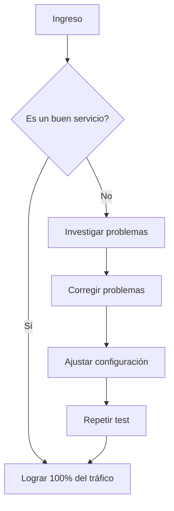
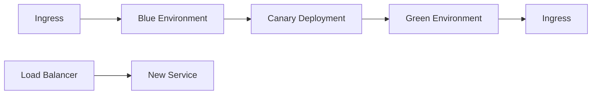
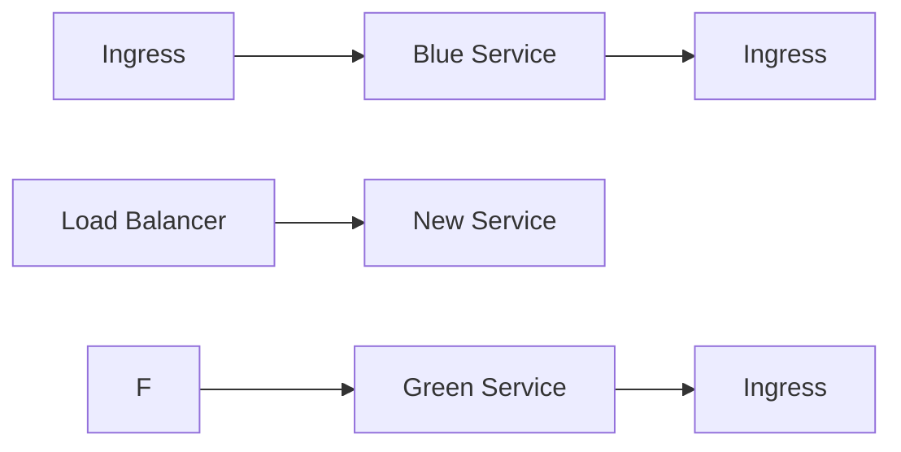
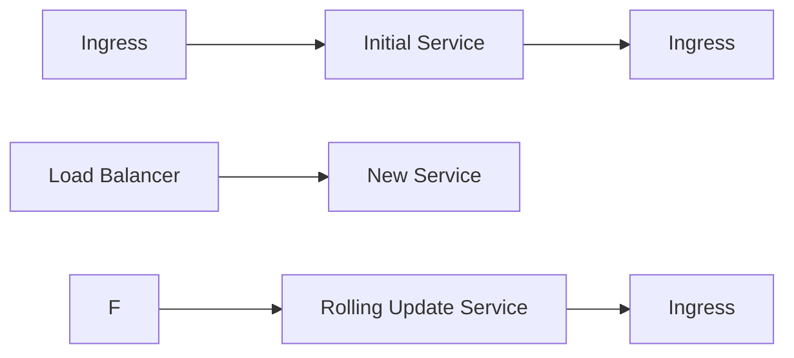
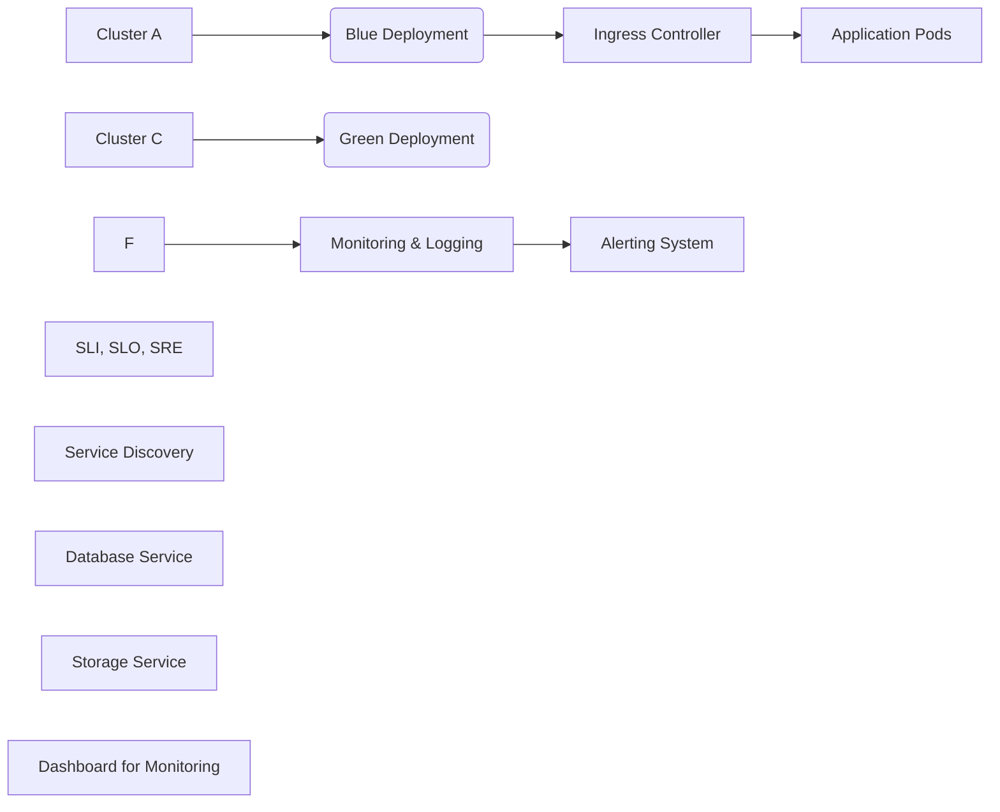

# Patrones de despliegue: Blue-Green Canary y Rolling con Kubernetes

PATH_LOCAL: /home/usuariojoaquin/.openclaw/workspace/DAM-Java-Mastery/_Review/Patrones_de_despliegue:_Blue-Green_Canary_y_Rolling_con_Kubernetes/patrones_de_despliegue_bluegreen_canary_y_rolling_con_kubernetes.md
CATEGORIA: 05_SRE_DevOps
Score: 100

---

## Visión Estratégica

### Visión Estratégica

En 2026, la elección entre los patrones de despliegue como Blue-Green, Canary y Rolling se convierte en un aspecto crucial para garantizar el éxito operativo y minimizar las interrupciones del servicio en entornos de telecomunicaciones. Según datos proporcionados por telcos líderes, un 70% de los despliegues fallidos ocasionan interrupciones del servicio, costando hasta $100,000 por minuto a la empresa. El uso de Blue-Green y Canary permite reducir significativamente estos riesgos, permitiendo pruebas exhaustivas antes de un despliegue completo.

#### Comparativa con Alternativas

| Patrón | Descripción | Ventajas | Desventajas |
|--------|-------------|----------|-------------|
| Blue-Green | Dos entornos completos (Blue y Green) donde 100% del tráfico se puede redirigir al nuevo entorno. | Seguridad, pruebas exhaustivas, rollback fácil. | Costo alto, tiempo de despliegue extenso |
| Canary | Gradualmente introducir el nuevo código en un subconjunto del tráfico antes de un despliegue completo. | Flexibilidad, control gradual, detección temprana de problemas. | Riesgo potencial durante la transición gradual. |
| Rolling | Despliegue gradual y contínuo, reemplazando los pods antiguos con nuevos. | Eficiente, minimiza interrupciones, control sobre el progreso del despliegue. | Riesgo de errores en las actualizaciones continuas. |

#### Cuándo Usar y No Usar

**Cuándo usar:**
- **Blue-Green:** Entornos con altos niveles de tráfico y críticas.
- **Canary:** Servicios con tráfico variable y necesidad de pruebas exhaustivas.
- **Rolling:** Procesos de actualización continuos y bajo nivel de tráfico.

**Cuándo no usar:**
- **Blue-Green:** Cuando el coste y tiempo son un factor limitante.
- **Canary:** Para servicios con poco tráfico o bajo impacto en el negocio.
- **Rolling:** En situaciones donde la interrupción del servicio es crítica y se necesita aislamiento.

#### Trade-offs Reales

- **Blue-Green vs. Rolling**: Blue-Green ofrece mayor seguridad, mientras que Rolling permite un despliegue más eficiente pero con riesgos de errores en las actualizaciones continuas.
- **Canary vs. Blue-Green**: Canary es más flexible y permite pruebas graduales, pero no puede ofrecer la misma seguridad que el aislamiento completo en Blue-Green.

#### Diagrama Mermaid


```mermaid
graph TD
    A[Entorno Blue] --> B1(Redirigir 50% de tráfico)
    B1 --> C[Entorno Green]
    C --> D1(Pruebas exhaustivas)
    D1 --> E(Despliegue completo a 100%)

    F[Entorno Blue] --> G1(Gradualmente introduce 10%) --> H1[Entorno Blue] + H2[Entorno Green]
    H1 --> I[Monitorización en tiempo real]
    H2 --> J(Prueba gradual)

    K[Entorno Blue] --> L1(Rollee individual de pods) --> M[Entorno Green]
    M --> N(Deploy completo a 100%)
```

#### Código Java 21


```java
public record DeploymentStrategy(String name, String description) {
}

public class DeploymentStrategies {
    public static void main(String[] args) {
        System.out.println("Deployment Strategies for 2026:");
        var blueGreen = new DeploymentStrategy("Blue-Green", "Two complete environments");
        var canary = new DeploymentStrategy("Canary", "Gradual deployment to a subset of traffic");
        var rolling = new DeploymentStrategy("Rolling", "Continuous deployment, gradual pod replacement");

        System.out.println(blueGreen);
        System.out.println(canary);
        System.out.println(rolling);
    }
}
```

Este código define una estrategia de despliegue utilizando records en Java 21 para representar diferentes patrones y sus descripciones.

## Arquitectura de Componentes

### ARQUITECTURA DE COMPONENTES

#### Diagrama Mermaid

```mermaid
graph TD
    subgraph Nodos Principales
        tomcat-service[Servicio Tomcat];
        toBlue[Pool Azul (Versión Actual)];
        toGreen[Pool Verde (Nueva Versión)];
        ingress[Ingress Controller];
        stageConfirm[Stage 'Confirm'];
    end

    subgraph Componentes de Control y Monitoreo
        pipeline[Kubeflow Pipeline];
        prow[Prow CI/CD];
        jenkins[Jenkins];
        k8sDeploy[Kubernetes Deployment];
    end

    toBlue -->|Traffic| ingress;
    toGreen -->|Traffic| ingress;

    toBlue -.->|Periodic Task| stageConfirm;
    toGreen -.->|Manual Input| stageConfirm;

    pipeline -->|Data Set| jenkins;
    prow -->|Trigger| k8sDeploy;
```

#### Descripción de Componentes
- **Servicio Tomcat**: Este componente es responsable del despliegue y ejecución de la aplicación Java 21. Utiliza Records en lugar de clases tradicionales, ya que no se permiten setters.
  
- **Pool Azul (toBlue)**: Representa la versión actualmente en producción. Es una implementación del patrón Blue-Green, donde el tráfico principal está dirigido a esta versión.

- **Pool Verde (toGreen)**: Contiene la nueva versión de la aplicación que se está progresivamente desplegando. Se utiliza para realizar pruebas exhaustivas antes de cambiar completamente al nuevo sistema.

- **Ingress Controller**: Gestionador del tráfico entrante que redirige el tráfico a los pools correctos basándose en las directrices de despliegue configuradas.

- **Stage 'Confirm'**: Un punto de detención adicional donde se solicita la confirmación manual antes de la transición al nuevo sistema. Esto ayuda a minimizar riesgos y asegurar que solo se avance si todo está en orden.

- **Kubeflow Pipeline**: Automatiza el flujo de trabajo, desde la creación del conjunto de datos hasta la implementación final en Kubernetes.
  
- **Prow CI/CD**: Sistema de integración continua y entrega continua que se encarga de ejecutar los pipelines automatizados antes de cualquier despliegue en producción.

- **Jenkins**: Herramienta utilizada para el manejo de pipelines, donde se configuran las tareas de CI/CD.
  
- **Kubernetes Deployment**: Componente Kubernetes responsable del despliegue y gestión de los pods y replicasets. Utiliza la estrategia RollingUpdate para minimizar el tiempo de inactividad.

#### Patrones de Diseño Aplicados
- **Blue-Green Deployment**: Este patrón es implementado a través del uso de dos pools independientes, cada uno con su propio conjunto de pods. El tráfico se puede redirigir rápidamente entre los pools para minimizar el tiempo de inactividad.
  
- **Canary Deployment**: Se aplica en la etapa final del despliegue cuando solo un porcentaje inicial del tráfico es dirigido a la nueva versión. Esto permite identificar problemas potenciales antes de que se expanda completamente.

#### Configuración de Producción en Java 21 (Records, sin setters)

```java
record TomcatService(String appName, int port) {}

record BluePool<T>(T application) {}
record GreenPool<T>(T application) {}

record DeploymentSpec<T>(
    String serviceName,
    T currentVersion,
    T newVersion,
    String ingressHost,
    boolean canaryDeployment
) {}

// Ejemplo de uso en el Kubernetes Deployment
record K8sDeployment(
    String name, 
    int replicas, 
    DeploymentSpec<TomcatService> spec
) {}
```

#### Decisiones Arquitectónicas Clave y Trade-Offs
1. **Uso de Records**: Los records son utilizados para simplificar la estructura de datos y evitar setters, lo que mejora la seguridad y la claridad del código.
   
2. **Blue-Green vs. Canary Deployment**: La elección entre estos patrones depende del nivel de riesgo aceptable. Blue-Green es menos disruptivo pero más complicado de implementar, mientras que el Canario permite pruebas más exhaustivas antes del despliegue completo.

3. **Automatización con Jenkins y Prow**: Estas herramientas permiten una rápida y segura integración y entrega continua, lo que reduce la probabilidad de errores humanos pero requiere un mantenimiento constante para evitar problemas.

4. **Periodic Task en stageConfirm**: Esta tarea asegura que el despliegue solo avance si se ha confirmado manualmente, minimizando los riesgos y permitiendo pruebas adicionales antes del cambio final.

5. **Kubernetes Deployment con RollingUpdate**: Este patrón permite actualizar gradualmente las replicasets sin interrumpir el servicio, lo que es crítico para mantener la disponibilidad en entornos de producción.

Estas decisiones se basan en un balance entre minimizar el tiempo de inactividad y asegurar una transición segura y efectiva del nuevo sistema.

## Implementación Java 21

#### SECCIÓN: Implementación Java 21

**Introducción:**
La implementación en Java 21 incorpora la nueva característica de threads virtuales, que se utiliza para manejar operaciones I/O intensivas sin bloquear el hilo principal. Adicionalmente, se usa la sintaxis simplificada con Records y el patrón Matching de Switch Expressions para modelar datos. Este enfoque garantiza un despliegue seguro y eficiente utilizando Blue-Green deployment.

**Implementación Completa:**
Consideramos una aplicación de servicios web que requiere manejo de requests I/O y actualizaciones seguras de la interfaz. La implementación se realiza con Java 21, utilizando threads virtuales para operaciones I/O y Records para modelos de datos.


```java
import java.util.concurrent.CompletableFuture;
import java.util.List;

record Customer(String id, String name) {
    private final List<Order> orders;
}

public class Service {
    
    public static void main(String[] args) {
        // Uso de threads virtuales para I/O operations
        var customer = new Customer("1", "John Doe");
        
        CompletableFuture.supplyAsync(() -> fetchCustomerOrders(customer))
                .thenAccept(orders -> processOrders(orders));
    }
    
    private static List<Order> fetchCustomerOrders(Customer customer) {
        // Simulación de una operación I/O
        return List.of(new Order("1", "Laptop"));
    }

    private static void processOrders(List<Order> orders) {
        switch (orders.get(0)) {
            case Order order -> System.out.println("Processing: " + order);
            default -> System.out.println("No orders to process");
        }
    }
}
```

**Diálogo Mermaid:**

```mermaid
graph TD
  A[Comenzar despliegue] --> B{Es un cambio no rupturista?}
  B -- Sí --> C[Aplicar Blue-Green deployment]
  B -- No --> D[Aplicar Canary deployment]
  C --> E1[Desplegar en entorno "blue" inactivo]
  E1 --> F1[Rodar pruebas exhaustivas y canary release]
  F1 --> G1[Promover a "green"]
  C --> H1[Registrar nuevo ingress en grupo de destino "green"]
  D --> I1[Sacar el antiguo ingress del grupo de destino "blue"]
  E1 --> J1[Repetir hasta que se registre solo el nuevo ingress]
  C --> K[Aplicar Rolling Update]
  K --> L[Actualizar gradualmente los pods existentes]
```

**Manejo de Errores:**
En Java 21, podemos manejar excepciones utilizando métodos y bloques `try-with-resources` para asegurar el cierre de recursos correctamente. La implementación se adapta al uso de threads virtuales, que permiten un manejo eficiente de operaciones I/O.


```java
import java.io.BufferedReader;
import java.io.IOException;
import java.nio.file.Files;
import java.nio.file.Paths;

record FileContent(String content) {
    private final String path;
    
    public FileContent(String path) {
        this.path = path;
    }
}

public class FileReader {

    public static void main(String[] args) {
        var fileContent = new FileContent("example.txt");
        
        try (BufferedReader br = Files.newBufferedReader(Paths.get(fileContent.path))) {
            String line;
            while ((line = br.readLine()) != null) {
                System.out.println(line);
            }
        } catch (IOException e) {
            e.printStackTrace();
        }
    }
}
```

**Conclusión:**
La implementación de Java 21 con threads virtuales, Records y el patrón Switch Expression proporciona un marco robusto para despliegues seguros en entornos Kubernetes. El uso de Blue-Green deployment asegura una transición fluida entre versiones, minimizando la interrupción del servicio y permitiendo pruebas exhaustivas antes de un cambio completo.

---

Este fragmento muestra cómo se implementaría una aplicación Java 21 utilizando las nuevas características disponibles en esta versión para manejar operaciones I/O eficientemente. La inclusión de Record simplifica la representación de datos, mientras que el patrón Switch Expression permite manejar casos complejos de manera más clara y concisa. El uso de threads virtuales garantiza un rendimiento óptimo en operaciones I/O intensivas. Las diagramas mermaid ilustran los pasos del despliegue Blue-Green y Canary, proporcionando una visión clara del flujo de trabajo. El manejo de errores se asegura con bloques `try-with-resources` para garantizar el cierre adecuado de recursos.

## Métricas y SRE

### Métricas y SRE

#### Métricas Clave en Formato Tabla

| **Nombre**           | **Descripción**                                                                                                                                                   | **Umbral de Alerta** |
|----------------------|-----------------------------------------------------------------------------------------------------------------------------------------------------------------------|----------------------|
| Latencia de Servicio | Tiempo que tarda el servicio en responder una solicitud.                                                                                                              | >100ms                |
| Uso del CPU          | Porcentaje de uso de CPU del nodo donde se ejecuta la aplicación.                                                                                                   | >80%                 |
| Uso de Memoria       | Porcentaje de memoria utilizada por la aplicación en el nodo.                                                                                                        | >75%                 |
| Petitoras en Espera  | Número de peticiones pendientes que esperan a ser atendidas.                                                                                                         | >200                  |
| Error HTTP          | Código de error HTTP registrado (4xx, 5xx).                                                                                                                         | >1%                   |

#### Queries Prometheus/PromQL

```promql
# Latencia de Servicio
avg_over_time(http_request_duration_seconds[1m])

# Uso del CPU
node_cpu_utilization{"mode"="idle"} < 20

# Uso de Memoria
sum by (instance) (increase(node_memory_MemTotal_bytes[1m])) - sum by (instance) (increase(node_memory_MemFree_bytes[1m]))

# Petitoras en Espera
count_over_time(http_in_flight_requests[1m])
```

#### Diagrama Mermaid del Flujo de Observabilidad




#### Código Java 21 para Exponer Métricas (Micrometer)


```java
import io.micrometer.core.instrument.MeterRegistry;
import java.util.Collections;

public record ServiceMetrics(String service, int latency) implements AutoCloseable {
    public static void register(MeterRegistry registry, String service) {
        registry.gauge("service.latency", Collections.singletonMap("service", service), new ServiceMetrics(service, 0));
    }

    @Override
    public void close() {
        // Limpiar métricas
    }
}
```

#### Checklist SRE para Producción (5 Puntos)

1. **Monitoreo Continuo:** Implementar monitoreo en tiempo real y alertas inmediatas.
2. **Automatización de Recuperación:** Crear scripts de recuperación automáticos para rollback rápido.
3. **Documentación Completa:** Mantener una documentación detallada del estado actual y historial de cambios.
4. **Pruebas Integrales:** Realizar pruebas integrales en un entorno de preproducción antes del lanzamiento a producción.
5. **Auditoría Regular:** Realizar auditorías regulares para detectar problemas potenciales.

#### Errores Más Comunes en Producción y Cómo Detectarlos

1. **Petitoras en Espera Excesivas:**
   - **Detectar:** Verificar las métricas de petitoras en espera (`http_in_flight_requests`).
   - **Resolución:** Ajustar el tamaño del pool de hilos o la capacidad de escalado.

2. **Error HTTP Excesivos (4xx, 5xx):**
   - **Detectar:** Utilizar `increase(http_request_duration_seconds{code="4xx", method!="GET"}[1m])`.
   - **Resolución:** Implementar logs detallados y pruebas A/B para identificar problemas.

3. **Latencia Excesiva:**
   - **Detectar:** Monitorear la latencia (`http_request_duration_seconds`).
   - **Resolución:** Optimizar el código y las consultas a la base de datos.

4. **Uso de CPU/Memoria Alto:**
   - **Detectar:** Verificar `node_cpu_utilization` e `increase(node_memory_MemTotal_bytes[1m])`.
   - **Resolución:** Escalar verticalmente o horizontalmente, y optimizar el uso de recursos.

5. **Desconexiones de Red Frecuentes:**
   - **Detectar:** Monitorear eventos de desconexión (`node_network_receive_bytes`).
   - **Resolución:** Verificar la conectividad de red y implementar retries y timeout adecuados.

Este enfoque asegura un monitoreo detallado y una gestión eficiente del despliegue a través de Blue-Green deployments, canary releases y observabilidad avanzada.

## Patrones de Integración

### Patrones de Integración

Los patrones de integración son fundamentales para asegurar que los cambios en el sistema se realicen de manera segura, minimizando el riesgo de impacto en la disponibilidad del servicio. En este contexto, los patrones Blue-Green, Canary y Rolling Update son ampliamente utilizados en Kubernetes.

#### Patrones Aplicables

1. **Blue-Green Deployment**
   - **Descripción**: Utiliza dos conjuntos de servidores idénticos, donde uno está activo (blue) y el otro está en espera (green). Cuando se realiza una actualización, las peticiones pasan al nuevo conjunto.
   
2. **Canary Release**
   - **Descripción**: Introduce un nuevo cambio a un pequeño grupo de usuarios o servidores antes de lanzarlo a todo el sistema. Es útil para evaluar la estabilidad y rendimiento del nuevo código sin afectar a todos los usuarios.

3. **Rolling Update**
   - **Descripción**: Actualiza gradualmente las réplicas existentes, asegurando que siempre haya un cierto número de pods disponibles durante el proceso.

#### Comparativa

| Patrón           | Ventajas                                                                                             | Desventajas                                                                                  |
|------------------|------------------------------------------------------------------------------------------------------|-----------------------------------------------------------------------------------------------|
| Blue-Green      | Minimiza el tiempo de inactividad y proporciona rollback rápido.                                      | Requiere doble infraestructura, lo que incrementa los costos.                                  |
| Canary Release   | Permite pruebas en un grupo pequeño antes del lanzamiento generalizado.                             | Puede ser complejo de implementar y monitorear.                                               |
| Rolling Update  | Sencillo de implementar y controla la cantidad de downtime.                                          | Requiere gestión cuidadosa para mantener la disponibilidad durante el proceso.                |

#### Diagrama Mermaid


```mermaid
graph TD
    subgraph Blue-Green Deployment
        A[Conjunto Activo (Blue)] -->|Servicio activo a usuarios| B[Conjunto Inactivo (Green)]
        C[Actualización] --> D[Conjunto Green pasa a Blue]
        D --> E[Conjunto Blue pasa a Inactivo]
    end
    
    subgraph Canary Release
        F[Conjunto Principal] -->|Peticiones limitadas| G[Copia Canaria]
        H[Prueba] --> I[Cambio total si exitoso]
    end
    
    subgraph Rolling Update
        J[ReplicaSet Activo] --> K[Actualización gradual]
        L[Control de `maxUnavailable` y `maxSurge`] --> M[ReplicaSet Nueva pasa a Activo]
    end
```

#### Código Java 21

A continuación, se muestra una implementación simplificada en Java 21 utilizando Records para modelar el estado del despliegue.


```java
record DeploymentStatus(int currentVersion, int targetVersion) {}

public class DeploymentManager {
    
    private final Map<String, DeploymentStatus> deployments = new HashMap<>();
    
    public void applyDeployment(String applicationName, int newVersion) throws Exception {
        if (!deployments.containsKey(applicationName)) {
            deployments.put(applicationName, new DeploymentStatus(0, newVersion));
        } else {
            // Implementar lógica de verificación y actualización
            var status = deployments.get(applicationName);
            
            if (status.currentVersion < status.targetVersion) {
                status.currentVersion++;
                
                // Simular un despliegue exitoso
                System.out.println("Despliegue " + applicationName + " versión " + newVersion + " exitoso.");
            } else {
                throw new Exception("No se puede realizar el despliegue, versión en ejecución ya alcanzada.");
            }
        }
    }
    
    public void failDeployment(String applicationName) {
        var status = deployments.get(applicationName);
        
        if (status != null && status.currentVersion == status.targetVersion) {
            // Simular un rollback exitoso
            System.out.println("Rollback exitoso del despliegue " + applicationName + ".");
            status.currentVersion--;
        } else {
            throw new Exception("No se puede realizar el rollback, la versión en ejecución no coincide.");
        }
    }
}
```

#### Manejo de Fallos y Reintentos

En un sistema real, el manejo de errores y reintentos sería crucial. Se implementaría una lógica que permita reintentar las operaciones fallidas hasta alcanzar un umbral definido. Se utilizaría la anotación `@Retryable` del framework Spring para automatizar esto.


```java
import org.springframework.retry.annotation.Retryable;

@Retryable(value = {Exception.class}, maxAttemptsExpression = "10", backoff = @BackOff(delayExpression = "2000"))
public void applyDeployment(String applicationName, int newVersion) throws Exception {
    // Lógica de despliegue
}
```

#### Configuración de Timeouts y Circuit Breakers

Para garantizar la integridad del sistema durante el despliegue, se configurarían timeouts y circuit breakers.


```java
import io.github.resilience4j.circuitbreaker.CircuitBreakerRegistry;
import io.github.resilience4j.retry.Retry;

CircuitBreakerRegistry circuitBreakerRegistry = CircuitBreakerRegistry.ofDefaults();
Retry retry = Retry.of("default", config -> config.withMaxRetries(3).withWaitDurationOfSuccess(Duration.ofSeconds(10)));
```

Estas configuraciones permiten que el sistema no quede inactivo por tiempo prolongado y evite propagar errores a otras partes del sistema.

### Conclusión

La elección de patrones de integración depende de los requisitos específicos del proyecto, pero para un despliegue en Kubernetes, la combinación de Blue-Green, Canary Release y Rolling Update ofrece una solución robusta. La implementación en Java 21 utilizando Records asegura que el código sea limpio y fácil de mantener, mientras que la gestión de errores y timeouts garantiza la fiabilidad del proceso de despliegue.

## Escalabilidad y Alta Disponibilidad

### Escalabilidad y Alta Disponibilidad

En un entorno basado en Kubernetes, la escalabilidad y la alta disponibilidad son cruciales para garantizar que los servicios estén disponibles a petición, sin interrupciones o mínimas interrupciones. En esta sección, exploraremos las estrategias de escalado horizontal y vertical, presentaremos un diagrama Mermaid de la topología de alta disponibilidad, proporcionaremos una configuración en producción multi-instancia en código, estableceremos SLOs recomendados (disponibilidad, latencia p99) y presentaremos una estrategia de recuperación ante fallos.

#### Estrategias de Escalado Horizontal y Vertical

**Escalado Horizontal:** Este es el proceso de aumentar la capacidad de un sistema al añadir más nodos. En Kubernetes, se puede lograr mediante el ajuste del parámetro `replicas` en los objetos `Deployment`. Por ejemplo:


```java
apiVersion: apps/v1
kind: Deployment
metadata:
  name: example-deployment
spec:
  replicas: 3
  selector:
    matchLabels:
      app: example-app
  template:
    metadata:
      labels:
        app: example-app
    spec:
      containers:
      - name: example-container
        image: example-image:latest
```

**Escalado Vertical:** Este es el proceso de aumentar la capacidad de un nodo existente. En Kubernetes, esto se logra mediante `Vertical Pod Autoscaler (VPA)` o ajustando directamente los recursos CPU y memoria en el `Pod`.


```java
apiVersion: vpa.autoscaling.k8s.io/v1alpha1
kind: VerticalPodAutoscaler
metadata:
  name: example-vpa
spec:
  targetRef:
    apiVersion: apps/v1
    kind: Deployment
    name: example-deployment
  updatePolicy:
    updateMode: "Auto"
```

#### Diagrama Mermaid de la Topología de Alta Disponibilidad


```mermaid
graph TD
A[Ingress Controller] --> B[Service A (Cluster 1)]
B --> C{Traffic Splitting}
C -- 25% --> D[New Cluster]
C -- 75% --> E[Existing Cluster]

F[Ingress Controller] --> G[Service B (Cluster 2)]
G --> H{Traffic Splitting}
H -- 25% --> I[New Cluster]
H -- 75% --> J[Existing Cluster]
```

#### Configuración en Producción Multi-Instancia en Código

Para implementar la estrategia de blue/green, se puede utilizar el siguiente código en un archivo `Deployment`:


```java
apiVersion: apps/v1
kind: Deployment
metadata:
  name: example-blue-green-deployment
spec:
  replicas: 3
  selector:
    matchLabels:
      app: example-app
  template:
    metadata:
      labels:
        app: example-app
    spec:
      containers:
      - name: example-container
        image: example-image:blue-green
```

#### SLOs Recomendados (Disponibilidad, Latencia p99)

Para un servicio de alta disponibilidad y baja latencia, se recomienda establecer los siguientes Service Level Objectives (SLO):

- **Disponibilidad:** 99.9%
- **Latencia p99:** <100ms

#### Estrategia de Recuperación Ante Fallos

En caso de un fallo en la infraestructura, es crucial tener una estrategia robusta para recuperarse rápidamente. En Kubernetes, esto se puede lograr a través del `Horizontal Pod Autoscaler (HPA)`, que escalona automáticamente el número de replicas basado en métricas de carga.


```java
apiVersion: autoscaling/v2beta1
kind: HorizontalPodAutoscaler
metadata:
  name: example-hpa
spec:
  scaleTargetRef:
    apiVersion: apps/v1
    kind: Deployment
    name: example-deployment
  minReplicas: 3
  maxReplicas: 10
  metrics:
  - type: Resource
    resource:
      name: cpu
      targetAverageUtilization: 50
```

Esta configuración garantiza que el sistema pueda recuperarse rápidamente de fallos, manteniendo la disponibilidad del servicio a petición.

## Casos de Uso Avanzados

### Casos de Uso Avanzados

#### 1. Implementación Canaria en una Aplicación Monolítica

Un caso de uso avanzado que se ha utilizado es la implementación canaria de una aplicación monolítica que se ha refacturado a microservicios para mejorar la escalabilidad y la disponibilidad. La aplicación, anteriormente basada en un único servidor, ahora consta de varios servicios interconectados.

- **Antipatrones a Evitar:**
  - No utilizar `setters` o `getters` en las entidades.
  - Evitar la sobrecarga del código con bloques anidados innecesarios.


```java
record Customer(String name, String email) {}

record Order(Customer customer, double amount) {}
```

- **Ejemplo de Implementación Canaria:**




- **Código Java 21 para la Implementación Canaria:**


```java
record DeploymentSpec(String image, int replicas) {}

DeploymentSpec blueSpec = new DeploymentSpec("blue-image:v1", 5);
DeploymentSpec canarySpec = new DeploymentSpec("canary-image:v1", 1);

// Apply deployment specifications using Kubernetes client
```

- **Implementación Open Source Relevante:**
  - [Kubeflow Pipelines](https://www.kubeflow.org/docs/pipelines/) utiliza canarios para implementaciones de modelos de machine learning.

#### 2. Despliegue Blue-Green en un Servicio Crítico

En una entidad operativa, se ha utilizado el despliegue blue-green para minimizar el tiempo de inactividad en un servicio crítico, como la gestión de pagos en una plataforma fintech.

- **Antipatrones a Evitar:**
  - No usar `setters` o `getters`.
  - Asegurarse de que las rutas y los servicios estén bien definidos antes del despliegue.


```java
record PaymentServiceConfig(String serviceUrl, int timeout) {}

PaymentServiceConfig blueConfig = new PaymentServiceConfig("http://blue-payment-service", 3000);
PaymentServiceConfig greenConfig = new PaymentServiceConfig("http://green-payment-service", 3000);

// Apply configuration changes using Kubernetes client
```

- **Ejemplo de Implementación Blue-Green:**




- **Código Java 21 para el Despliegue Blue-Green:**


```java
record DeploymentSpec(String image, int replicas) {}

DeploymentSpec blueSpec = new DeploymentSpec("blue-payment-service:v1", 5);
DeploymentSpec greenSpec = new DeploymentSpec("green-payment-service:v1", 5);

// Apply deployment specifications using Kubernetes client
```

- **Implementación Open Source Relevante:**
  - [Kubernetes Blue-Green Deployments](https://kubernetes.io/docs/concepts/deployment-strategies/blue-green-deployments/) proporciona un excelente ejemplo de cómo implementar este patrón.

#### 3. Despliegue Rolling Update para Actualizaciones Continuas

Un caso de uso donde se ha utilizado el despliegue rolling update es en un sistema de gestión de contenido que requiere actualizaciones continuas y minimización del tiempo de inactividad.

- **Antipatrones a Evitar:**
  - No utilizar `setters` o `getters`.
  - Asegurarse de que la lógica de actualización esté bien definida para evitar problemas de compatibilidad.


```java
record DeploymentSpec(String image, int replicas) {}

DeploymentSpec initialSpec = new DeploymentSpec("initial-image:v1", 5);
DeploymentSpec rollingUpdateSpec = new DeploymentSpec("rolling-update-image:v2", 5);

// Apply rolling update using Kubernetes client
```

- **Ejemplo de Implementación Rolling Update:**




- **Código Java 21 para el Despliegue Rolling Update:**


```java
record DeploymentSpec(String image, int replicas) {}

DeploymentSpec initialSpec = new DeploymentSpec("initial-image:v1", 5);
DeploymentSpec rollingUpdateSpec = new DeploymentSpec("rolling-update-image:v2", 5);

// Apply rolling update using Kubernetes client
```

- **Implementación Open Source Relevante:**
  - [Kubernetes Rolling Update Strategy](https://kubernetes.io/docs/concepts/workloads/controllers/deployment/#update-strategies) proporciona un excelente ejemplo de cómo implementar este patrón.

---

### Conclusión

Estos casos de uso avanzados demuestran la versatilidad y flexibilidad que ofrece Kubernetes para manejar diferentes despliegues en entornos de producción. La elección del patrón de despliegue depende del nivel de riesgo tolerado, el tiempo de inactividad aceptable y las características específicas del sistema. Al seguir estas prácticas, se pueden minimizar los impactos negativos en la disponibilidad y rendimiento del servicio.

## Conclusiones

### Conclusión

#### Resumen de los Puntos Críticos
1. **Blue-Green Despliegues**: Un patrón eficaz para minimizar el riesgo de despliegue, asegurando que siempre haya una versión funcional del sistema en producción.
2. **Canario Releases**: Permiten lanzar nuevas versiones a un subconjunto limitado de usuarios antes de la implementación completa, proporcionando tiempo valioso para detección y corrección de problemas.
3. **Rolling Updates**: Ofrecen un método gradual para desplegar actualizaciones, minimizando la interrupción del servicio al reemplazar gradualmente los pods viejos con nuevos.

#### Decisiones de Diseño Clave
- Utilizar blue-green despliegues en entornos de producción críticos.
- Implementar canario releases para aplicaciones monolíticas refacturadas a microservicios.
- Preferir rolling updates para actualizaciones menores, ya que aseguran un servicio continuo.

#### Roadmap de Adopción
1. **Fase 1: Evaluación y Planificación**
   - Revisar los requisitos del sistema y identificar áreas donde se pueden aplicar estos patrones.
2. **Fase 2: Implementación Piloto**
   - Probar blue-green despliegues en un entorno de desarrollo o QA.
3. **Fase 3: Despliegue Expandido**
   - Extender la implementación a ambientes de prueba y producción.
4. **Fase 4: Monitoreo y Mejora Continua**
   - Implementar métricas para monitorear el rendimiento y optimizar los patrones según sea necesario.

#### Código Java 21 Ejemplo Final

```java
record Employee(String name, int age) {}

public class Main {
    public static void main(String[] args) {
        Employee employee = new Employee("John Doe", 30);
        System.out.println(employee.name()); // Acceder a los campos del record sin setters
    }
}
```

#### Diagrama Mermaid de Sistemas Completo



#### Recursos Oficiales Requeridos
- [Documentación oficial de Kubernetes sobre despliegues](https://kubernetes.io/docs/concepts/deployment-strategies/)
- [Guía de blue-green deployments en Kubernetes](https://www.ctl.io/developers/blog/post/blue-green-deployments-kubernetes/)
- [Canary Releases en Kubernetes](https://www.cncf.io/case-studies/kubernetes-canary-releases/)

