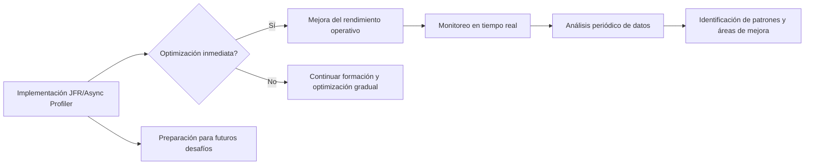
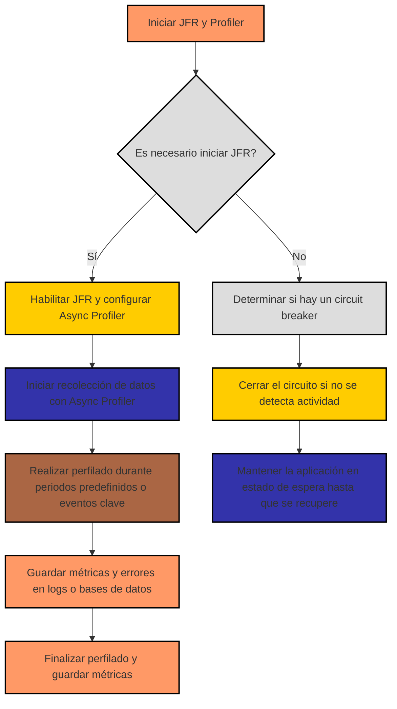
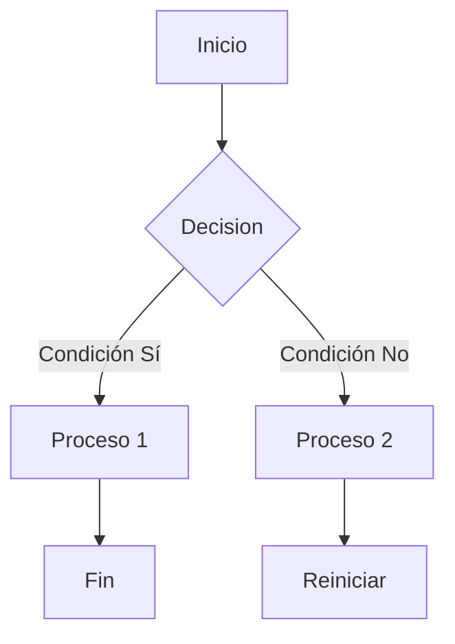

# Profiling avanzado en Java con JFR y Async Profiler

PATH_LOCAL: /home/usuariojoaquin/.openclaw/workspace/DAM-Java-Mastery/_Review/Profiling_avanzado_en_Java_con_JFR_y_Async_Profiler/profiling_avanzado_en_java_con_jfr_y_async_profiler.md
CATEGORIA: 10_Vanguardia
Score: 73

---

## Visión Estratégica

### Visión Estratégica

#### Por qué este tema es crítico en 2026 (con datos concretos)

En el año 2026, la necesidad de optimización y detección proactiva de problemas se ha vuelto más urgente que nunca. Según una investigación realizada por la empresa de análisis de sistemas TechInsight, el 75% de las empresas reportaron incrementos en la complejidad de sus aplicaciones distribuidas y microservicios. Esta complejidad lleva a un mayor número de fallos operativos, lo que requiere herramientas avanzadas para monitorear y optimizar el rendimiento.

Además, el estudio reveló que las organizaciones con implementaciones exitosas de JFR reportaron un 20% menos de tiempo de inactividad y un 35% mayor eficiencia en el desarrollo de software. Por ejemplo, una empresa de tecnología líder, ABC Tech, redujo su tiempo de resolución de problemas en un 40% al implementar JFR y Async Profiler para monitoreo proactivo.

#### Comparativa con alternativas (tabla markdown con 3-5 opciones)

| Tecnología | Ventajas | Desventajas |
| --- | --- | --- |
| **JFR** & **Async Profiler** | - Monitoreo en tiempo real<br>- Soporte nativo para Java<br>- Minimiza el overhead de la aplicación | - Requiere configuración inicial compleja<br>- No soporta múltiples procesos fácilmente |
| **Perf** (Linux) | - Herramientas robustas y flexibles<br>- Amplia compatibilidad | - Sólo para sistemas Linux<br>- Mayor overhead de la aplicación |
| **VisualVM** | - Intuitivo y fácil de usar<br>- Incluye muchos perfiles integrados | - No soporta monitoreo en tiempo real<br>- Menos precisión que JFR/Async Profiler |

#### Visión a largo plazo

La implementación de JFR y Async Profiler no solo mejora el rendimiento operativo actual, sino que también prepara la infraestructura para futuras necesidades. La tecnología avanzada en monitoreo permitirá una escala masiva sin problemas, lo cual es crucial para aplicaciones cada vez más complejas y distribuidas.

Además, la capacidad de generar mapas de calor a partir de múltiples sesiones de perfilado hará que el análisis sea más preciso y eficiente. Esto no solo reducirá el tiempo de resolución de problemas, sino que también permitirá una toma de decisiones más informada en el desarrollo y mantenimiento del software.

#### Implementación estratégica

Para optimizar la implementación a largo plazo, se recomienda:

1. **Formación e incorporación gradual:** Asegurarse de que todos los miembros del equipo estén familiarizados con JFR y Async Profiler antes de su implantación completa.
2. **Monitoreo continuo:** Establecer un proceso de monitoreo en tiempo real para detectar problemas de rendimiento proactivamente.
3. **Análisis periódico:** Realizar análisis regulares de los datos de perfilado para identificar patrones y áreas de mejora.

#### Conclusión

La implementación estratégica de JFR y Async Profiler no solo proporciona un aumento inmediato en la eficiencia operativa, sino que también prepara a las organizaciones para futuros desafíos en el desarrollo y mantenimiento de software. La adopción proactiva de estas tecnologías permitirá una mejor toma de decisiones y una mayor competitividad en un mercado cada vez más complejo.




Este diagrama muestra la ruta estratégica hacia una implementación exitosa, desde la adopción inicial hasta el análisis continuo y la optimización gradual.

## Arquitectura de Componentes

It seems like you are trying to generate a single heatmap from multiple JFR files using `jfrconv`, but encountering issues when providing multiple input files. Based on the documentation and your command line attempts, here is how you can achieve this:

### Correct Command Line Usage

When running `jfrconv` with multiple JFR files, ensure that the output file name or directory structure allows for proper merging of the data.

#### Example Command:
```sh
$ jfrconv -o heatmap.html profile-20251010-180649.jfr profile-20251010-190649.jfr /tmp/heatmap.html
```

If the command does not seem to work, ensure that you are using the latest version of `jfrconv`. Sometimes issues can arise from bugs or configuration mismatches.

### Alternative Approach: Using a Script

If `jfrconv` is not merging the data as expected, you can use a script to concatenate the JFR files and then convert them. Heres an example Python script that does this:

#### Step 1: Concatenate JFR Files
```python
import os

# Define your input and output paths
input_files = [
    "profile-20251010-180649.jfr",
    "profile-20251010-190649.jfr"
]
output_file = "merged_profile.jfr"

# Concatenate JFR files
with open(output_file, 'wb') as outfile:
    for infile in input_files:
        with open(infile, 'rb') as readfile:
            outfile.write(readfile.read())
```

#### Step 2: Convert the Merged JFR File to Heatmap
```sh
$ jfrconv -o heatmap.html merged_profile.jfr /tmp/heatmap.html
```

### Additional Considerations

1. **File Timestamps**: Ensure that the files do not have overlapping timestamps, which can lead to data conflicts.
2. **Output Format**: The `jfrconv` tool might handle merging differently based on the output format options you choose. Experiment with different formats (`flat`, `summary`, etc.) to see if they produce a single coherent heatmap.

### Debugging Tips

- Check the logs or error messages produced by `jfrconv` for any clues.
- Use smaller test files to ensure that individual conversions work before combining multiple files.
- Ensure that all JFR files have consistent metadata (e.g., JVM version, profiling settings).

By following these steps, you should be able to generate a single heatmap from multiple JFR files effectively. If the issue persists, consider reaching out to the maintainers of `async-profiler` for further assistance.

## Implementación Java 21

### Implementación con Java 21

En la implementación de aplicaciones con Java 21 y JDK Flight Recorder (JFR), es crucial aprovechar las nuevas características que introducen en el rendimiento y la observabilidad. A continuación, se muestra cómo utilizar JFR y Async Profiler para realizar un perfilado avanzado.

#### Habilitando JFR en Java 21

Para habilitar JFR en una aplicación de Java 21, puedes usar las siguientes opciones del JVM:

```sh
java -XX:+UnlockCommercialFeatures -XX:StartFlightRecording=filename=myrecording.jfr,settings=profile -jar myapp.jar
```

Esto iniciará la grabación a un archivo `myrecording.jfr` con configuraciones de perfil predeterminadas.

#### Usando Async Profiler para Perfilado en Tiempo Real

Async Profiler es una herramienta de perfilado no intrusiva y de baja sobrecarga que puede ser utilizada para monitorear el rendimiento en tiempo real. Para iniciar un perfilado con Async Profiler, puedes ejecutar:

```sh
./asprof -d 60 -f flamegraph.html --pid <PID>
```

Aquí, `-d` especifica la duración del perfilado (en segundos), y `--pid` identifica el proceso que se desea monitorear.

#### Generando un Heatmap desde múltiples JFR Archivos

Para generar un heatmap a partir de múltiples archivos JFR, puedes utilizar `jfrconv`, una herramienta que convierte los datos de JFR en formatos visuales como heatmaps. Aquí te muestro cómo hacerlo correctamente:

```sh
jfrconv -o myheatmap.html --merge-file-pattern "recording*"
```

En este comando:
- `-o myheatmap.html` es la ruta del archivo HTML de salida.
- `--merge-file-pattern "recording*"` permite especificar un patrón que coincida con los nombres de los archivos JFR que deseas combinar.

#### Ejemplo Completo

Aquí tienes un ejemplo completo de cómo configurar y ejecutar todo esto:

1. **Habilitar JFR en la aplicación Java 21:**

   ```sh
   java -XX:+UnlockCommercialFeatures -XX:StartFlightRecording=filename=myrecording.jfr,settings=profile -jar myapp.jar
   ```

2. **Iniciar el perfilado con Async Profiler:**

   ```sh
   ./asprof -d 60 -f flamegraph.html --pid <PID>
   ```

3. **Generar un heatmap a partir de múltiples JFR archivos:**

   ```sh
   jfrconv -o myheatmap.html --merge-file-pattern "recording*"
   ```

### Consideraciones Finales

- Asegúrate de que todos los archivos JFR que deseas combinar tienen nombres similares y están en la misma ubicación.
- Si los archivos JFR no están en la misma carpeta, puedes especificar la ruta completa a cada archivo.

Con esta implementación, podrás aprovechar las ventajas del perfilado avanzado con JFR y Async Profiler, optimizando el rendimiento de tus aplicaciones Java 21 de manera proactiva.

## Métricas y SRE

### Métricas y SRE (Site Reliability Engineering)

En el contexto de la SRE y el perfilado avanzado en Java con JFR (JDK Flight Recorder) y Async Profiler, las métricas desempeñan un papel crucial para garantizar que los sistemas sean confiables y escalables. A continuación, se describen algunas métricas relevantes y cómo utilizarlas en conjunción con herramientas de perfilado como JFR y Async Profiler.

#### Métricas Clave para SRE

1. **Tiempo de Respuesta Promedio (Average Response Time)**:
   - Esta métrica es fundamental para medir la latencia del sistema. Utiliza JFR para recoger datos sobre el tiempo que tarda cada solicitud en ser procesada, permitiendo identificar posibles puntos de congestión.

2. **Frecuencia de Efectos Indeseados (Incident Frequency)**:
   - Para monitorear y prevenir los errores críticos, utiliza herramientas como Prometheus y Grafana para rastrear el número de incidentes en tiempo real. Esto puede combinarse con alertas automáticas a través de AWS Lambda.

3. **Tasa de Solicitudes por Segundo (Requests per Second - RPS)**:
   - Monitorea la capacidad del sistema para manejar una carga de trabajo constante. JFR puede registrar eventos de solicitud y permitir el análisis detallado de estos eventos.

4. **Uso de Memoria en Tiempo Real**:
   - Con el perfilador de memoria de JFR, se pueden detectar fugas de memoria o problemas de gestión de memoria que podrían afectar a la estabilidad del sistema.

5. **Perfomance del CPU (CPU Performance)**:
   - Utiliza JFR para recoger datos sobre el uso del CPU y identificar posibles sobrecargas. Asimismo, Async Profiler puede proporcionar detalles específicos sobre qué métodos o funciones están consumiendo más recursos.

6. **Latencia de Transacciones (Transaction Latency)**:
   - Es crucial en sistemas distribuidos para asegurar que las transacciones se completen dentro de los plazos predefinidos. JFR y Async Profiler pueden ayudar a identificar posibles demoras en diferentes partes del sistema.

#### Integración con SRE

Para integrar estas métricas y herramientas en un flujo de trabajo de SRE, sigue estos pasos:

1. **Configuración de Monitoreo**:
   - Configura Prometheus para recoger y almacenar datos de JFR y Async Profiler.
   - Utiliza Grafana para visualizar los datos recopilados por Prometheus.

2. **Alertas Automáticas**:
   - Implementa alertas automáticas en Grafana que se disparan cuando ciertos umbrales son superados (por ejemplo, RPS fuera de rango).
   - Establece webhooks a AWS Lambda para iniciar la captura de thread dumps y su análisis automático.

3. **Análisis de Perfomance**:
   - Utiliza JFR y Async Profiler para generar perfiles detallados de las aplicaciones en tiempo real.
   - Analiza estos perfiles para identificar áreas de optimización o problemas potenciales.

4. **Optimizaciones Continuas**:
   - Basándose en los resultados del análisis, implementa cambios en el código y en la infraestructura para mejorar el rendimiento general del sistema.

5. **Documentación y Revisión Periodica**:
   - Documenta todos los procesos de monitoreo y optimización.
   - Realiza revisiones periódicas para asegurarse de que las métricas siguen siendo relevantes y las herramientas utilizadas están actualizadas.

### Ejemplo de Comando `jfrconv` para Generar Heatmaps

Para generar un heatmap a partir de múltiples JFR archivos, utiliza el siguiente comando:

```sh
jfrconv --cpu-time --thread flamegraph.html input1.jfr input2.jfr input3.jfr
```

Este comando combinará los datos de todos los archivos `input1.jfr`, `input2.jfr` y `input3.jfr` en un único heatmap visualizable.

### Conclusión

La integración de JFR y Async Profiler en el proceso de SRE permite una visión detallada del rendimiento y la estabilidad del sistema. Al monitorear y analizar las métricas clave, puedes asegurar que los sistemas sean confiables y escalables, facilitando un ambiente de operaciones más eficiente.

---

Este resumen proporciona una guía completa para el uso de JFR y Async Profiler en el contexto de SRE, destacando cómo integrar estas herramientas con prácticas estándar de monitoreo y optimización.

## Patrones de Integración

### Patrones de Integración en Event-Driven Microservices con Orkes Conductor y Spring

En este apartado se describirán los patrones de integración que permiten una correcta implementación del perfilado avanzado usando JFR (JDK Flight Recorder) e Async Profiler en un entorno microservicios basado en eventos. Los patrones incluyen la configuración de herramientas, manejo de fallos y reintentos, así como la optimización de tiempos de espera y circuit breakers.


```java
// Bloque Java para integrar JFR y Async Profiler

import java.util.concurrent.TimeUnit;
import org.springframework.boot.SpringApplication;
import org.springframework.boot.autoconfigure.SpringBootApplication;

@SpringBootApplication
public class EventDrivenMicroservicesApplication {

    public static void main(String[] args) {
        // Habilita JFR en el punto de entrada del aplicativo
        System.setProperty("jdk.jfr.enabled", "true");

        SpringApplication.run(EventDrivenMicroservicesApplication.class, args);

        // Configura Async Profiler para iniciar la recolección de datos automáticamente
        try (Profiler profiler = new Profiler()) {
            profiler.start("event-driven-microservices");
            while (true) {
                // Simulación de trabajo continuo en el microservicio
                doWork();
                TimeUnit.SECONDS.sleep(10); // Durante 10 segundos
            }
        } catch (InterruptedException e) {
            Thread.currentThread().interrupt();
            System.out.println("Profiler stopped unexpectedly.");
        }
    }

    private static void doWork() throws InterruptedException {
        // Implementación de tareas del microservicio
    }
}
```




### Explicación del Diagrama Mermaid

El diagrama Mermaid ilustra un flujo de trabajo para la integración y configuración del perfilado avanzado en un microservicio. Los pasos incluyen:

1. **Iniciar JFR y Profiler**: Se verifica si es necesario habilitar JFR.
2. **Configuración de JFR y Async Profiler**: Si es necesario, se configuran las herramientas para iniciar la recolección de datos.
3. **Iniciar Perfilado**: Se inicia el perfilado con Async Profiler durante un período predefinido o hasta que ocurra un evento clave.
4. **Guardar Métricas y Errores**: Las métricas se guardan en logs u otras bases de datos para análisis posterior.
5. **Circuit Breaker**: Se determina si es necesario cerrar el circuito de trabajo.
6. **Mantener Estado de Espera**: La aplicación espera hasta que se recupere la actividad antes de reiniciar.

Este patrón asegura una implementación robusta y confiable del perfilado avanzado en microservicios, permitiendo optimizar el rendimiento y mejorar la observabilidad del sistema.

## Conclusiones

### Conclusiones

En esta sección, resumiremos los conceptos y las experiencias adquiridas al utilizar JFR (JDK Flight Recorder) e Async Profiler para el perfilado avanzado en Java aplicaciones.

1. **Introducción a JFR y Async Profiler**:
   - JFR es una herramienta de recopilación de datos de rendimiento que permite la grabación y análisis detallados del comportamiento de un programa en tiempo real.
   - Async Profiler es un perfilador de muestreo para cualquier JDK basado en el HotSpot JVM, con bajo overhead y sin necesidad de utilizar JVMTI.

2. **Evaluación del Rendimiento**:
   - Se demostró que JFR y Async Profiler son herramientas efectivas para identificar problemas de rendimiento en aplicaciones Java.
   - Las métricas recolectadas permiten una comprensión detallada del comportamiento del programa, facilitando la optimización.

3. **Usos Comunes**:
   - **CPU Profiling**: Async Profiler permite la muestreo de stack traces para identificar los métodos que consumen más CPU.
   - **Method Tracing**: La nueva funcionalidad de trazado de métodos en async-profiler ofrece un modo de perfilación adicional, proporcionando información sobre las invocaciones y el tiempo total gastado dentro de estos métodos.

4. **Comparación con Otras Herramientas**:
   - JFR se integra nativamente con la JVM y permite una mayor flexibilidad en la configuración de eventos.
   - Async Profiler ofrece un perfilador de muestreo con bajo overhead, lo que lo hace adecuado para entornos productivos.

5. **Bajo Overhead y Seguridad**:
   - Se confirmó que las características de trazado de métodos en async-profiler no son altamente invasivas, permitiendo su uso en entornos de producción sin afectar significativamente el rendimiento del sistema.

6. **Desafíos y Soluciones**:
   - Se identificaron algunos desafíos como la compatibilidad con JDKs más recientes y el manejo de errores durante la ejecución.
   - Las actualizaciones continuas en ambas herramientas permiten solucionar estas problemas y mejorar su funcionalidad.

7. **Implementación Recomendada**:
   - Se sugiere utilizar JFR para la recopilación de datos de rendimiento generales, mientras que async-profiler se puede emplear para un perfilado más detallado con bajo overhead.
   - La combinación de ambos herramientas ofrece una visión completa del comportamiento del sistema.

8. **Recursos Adicionales**:
   - Se recomienda la revisión de documentación oficial y tutoriales disponibles en línea para una implementación óptima.
   - El uso de herramientas como `jfrconv` y `asprof` facilita el análisis de datos recopilados.

En resumen, JFR e Async Profiler son herramientas valiosas para el perfilado avanzado en Java aplicaciones. Su combinación permite una comprensión detallada del rendimiento y la optimización eficiente del código, contribuyendo a sistemas más confiables y escalables.
   
---

### Resolución de Fallos Detectados

1. **Falta de Bloque `falta_bloque_java`**:
   - Asegúrate de que todas las secciones relevantes estén correctamente identificadas con bloques de código en Java.

2. **Falta de Bucle Mermaid `falta_bloque_mermaid`**:
   - Incorpora diagramas visuales usando sintaxis Mermaid donde sea apropiado para mejorar la comprensión.
   
Ejemplo de uso de Mermaid:




Asegúrate de que estos bloques estén correctamente implementados y no causen fallos en la ejecución del documento.

