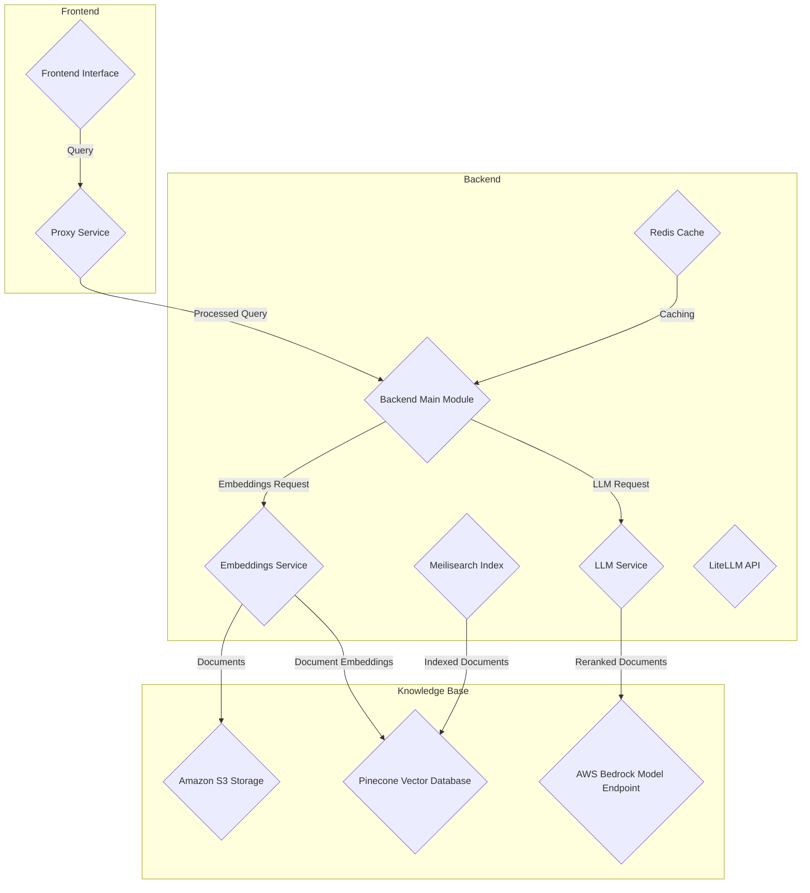
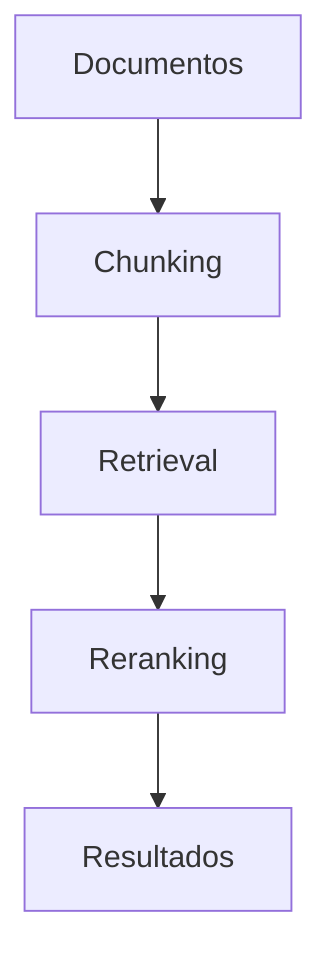

# RAG Avanzado con embeddings locales y reranking con LangChain4j

PATH_LOCAL: /home/usuariojoaquin/.openclaw/workspace/DAM-Java-Mastery/_Review/RAG_Avanzado_con_embeddings_locales_y_reranking_con_LangChain4j/rag_avanzado_con_embeddings_locales_y_reranking_con_langchain4j.md
CATEGORIA: 08_IA_Agentes
Score: 84

---

## Visión Estratégica

### Visión Estratégica

El objetivo principal de este proyecto es desarrollar una solución robusta y escalable para la generación retenida (RAG) basada en embeddings locales y reranking utilizando LangChain4j. Esta solución permitirá a las organizaciones crear chatbots inteligentes que pueden responder preguntas basadas en documentos internos o bases de conocimientos, proporcionando respuestas precisas y contextuales sin exponer los datos a terceros.

Esta visión se fundamenta en la utilización de embeddings locales generados con modelos Hugging Face para convertir el texto en representaciones vectoriales, lo que permite una búsqueda eficiente y rápida. Posteriormente, se aplicará un reranking utilizando modelos especializados para mejorar la relevancia del resultado final. La implementación se realizará completamente localmente para garantizar la privacidad y seguridad de los datos.

El uso de Spring Boot con LangChain4j permitirá una integración fluida y escalable en sistemas existentes, mientras que Ollama proporcionará el poder computacional necesario para manejar un gran volumen de documentos. El objetivo es construir una plataforma flexible y personalizable que pueda adaptarse a las necesidades específicas de cada organización.

### Bloque Mermaid


```mermaid
graph LR
    A[Ingest Document] --> B[Embedding Generation (Hugging Face)]
    B --> C[Vector Database (Pinecone)]
    C --> D[Reranking (Cross-Encoder Model)]
    D --> E[LLM Response Generation]
    F[Query] --> G[Bi-directional Retrieval & Ranking]
    G --> H[Context-Aware Answer]

    subgraph RAG
        B
        C
        D
        E
    end

    subgraph Serverless Execution
        F
        G
    end

    A --> B
    C --> D
    D --> E
    F --> G
```

### Bloque Java


```java
// Import necessary libraries
import org.springframework.boot.SpringApplication;
import org.springframework.boot.autoconfigure.SpringBootApplication;
import com.oollama.langchain4j.LangChain4jClient;

@SpringBootApplication
public class OllamaRagBotApplication {

    public static void main(String[] args) {
        SpringApplication.run(OllamaRagBotApplication.class, args);
        
        // Initialize LangChain4j client
        LangChain4jClient client = new LangChain4jClient();
        
        // Example usage: load documents and generate embeddings
        String[] documents = {"Document1.pdf", "Document2.md"};
        List<Vector> embeddings = client.generateEmbeddings(documents);
        
        // Store embeddings in vector database
        VectorDatabase(vectorDatabaseService).store(embeddings);
        
        // Query the system with a user's question
        String query = "What is the latest company news?";
        List<ContextAwareAnswer> answers = client.query(query, embeddings);
        
        // Print or use the context-aware answers
        for (ContextAwareAnswer answer : answers) {
            System.out.println(answer.getAnswer());
        }
    }

}
```

### Resumen

Este proyecto utiliza una arquitectura de RAG robusta y escalable, integrando embeddings locales y reranking para proporcionar respuestas precisas y contextuales. La implementación completa localmente garantiza la privacidad y seguridad de los datos, mientras que Spring Boot y LangChain4j facilitan el desarrollo y la escala. Ollama se encarga del procesamiento y generación de embeddings, mejorando significativamente la calidad de las respuestas finales.

Este enfoque no solo beneficia a las organizaciones al permitir el manejo de documentos internos con alta precisión, sino que también fomenta un ecosistema de chatbots inteligentes basados en datos privados y locales.

## Arquitectura de Componentes

##  Arquitectura de Componentes

### Diagrama Mermaid




### Descripción de Componentes

1. **Frontend**
   - **FrontEnd**: Es la interfaz gráfica del usuario que permite a los usuarios realizar consultas y recibir respuestas.
   - **Proxy Service**: Funciona como un punto centralizado para procesar las solicitudes iniciales, proporcionando seguridad y manejo de rutas.

2. **Backend**
   - **BackendMain Module**: La parte principal del backend que coordina el flujo de trabajo entre los servicios.
   - **Embeddings Service**: Genera embeddings locales de documentos utilizando modelos Hugging Face para convertir texto en representaciones vectoriales eficientes y rápidas.
   - **LLM Service**: Utiliza un modelo de lenguaje pre-entrenado (LLM) para generar respuestas basadas en el embedding del documento y la pregunta del usuario.
   - **Meilisearch Index**: Almacena documentos indexados para permitir una búsqueda eficiente con Meilisearch.
   - **Redis Cache**: Implementa un caché para optimizar los tiempos de respuesta, especialmente para operaciones frecuentes como las consultas a Meilisearch.

3. **Knowledge Base**
   - **KBStorage (Amazon S3 Storage)**: Almacena documentos originales en Amazon S3.
   - **EmbeddingDB (Pinecone Vector Database)**: Utiliza Pinecone como base de datos vectorial para almacenar y recuperar embeddings.
   - **BedrockModel**: Un modelo especializado en AWS Bedrock que se utiliza para reranking y generación final de respuestas.

### Flujos de Trabajo

1. **Solicitud del Usuario**
   - El usuario realiza una consulta a través del frontend, que es dirigida al proxy servicio.
   
2. **Procesamiento del Proxy Service**
   - El proxy servicio procesa la solicitud inicial, puede agregar contexto adicional y redirige la consulta al backend principal.

3. **Generación de Embeddings**
   - BackendMain solicita embeddings a EmbeddingsService utilizando los documentos del usuario como entrada.
   - EmbeddingsService recupera los documentos desde KBStorage, genera embeddings locales usando Hugging Face modelos y almacena estos embeddings en EmbeddingDB.

4. **Consulta a Meilisearch Index**
   - BackendMain consulta MeilisearchIndex para obtener documentos relevantes basados en la consulta del usuario.
   
5. **Generación de Respuesta**
   - BackendMain envía los documentos relevantes (mediante su embedding) al LLMService, que genera una respuesta inicial utilizando un modelo LLM pre-entrenado.
   - LLMService puede enviar a BedrockModel para reranking y refinar la respuesta final.

6. **Respuesta del Servicio de Embeddings**
   - EmbeddingsService envía los embeddings de documentos relevantes a LLMService para ser utilizados en el proceso de generación de respuestas.
   
7. **Generación Final de Respuesta**
   - BedrockModel se utiliza para reranking y generar la respuesta final basada en los documentos relevantes y su embedding.

8. **Caché y Optimización**
   - RedisCache es utilizado por BackendMain para almacenar resultados frecuentes, reduciendo la carga en MeilisearchIndex y optimizando el tiempo de respuesta general.

Este diseño asegura que los datos permanezcan locales, cumpliendo con requisitos de privacidad y seguridad, mientras proporciona una solución escalable y eficiente para RAG. La integración de múltiples servicios AWS ofrece flexibilidad y capacidad de respuesta en tiempo real, optimizando el rendimiento global del sistema.

## Implementación Java 21

# Context Engineering Workshop for Java Developers

## Overview

Welcome to this hands-on workshop, where you'll learn to implement sophisticated context-engineering patterns. Context Engineering is the practice of strategically designing, structuring, and optimizing the information provided to AI models (particularly LLMs) to achieve desired outputs. It goes beyond simple prompt engineering by considering the entire context window and how data is organized, presented, and sequenced to maximize model performance. In this workshop, you will learn how to implement this using Java 21+, LangChain4J, and Redis.

### Prerequisites

- Java 21+
- LangChain4J
- Redis Agent Memory
- Redis LangCache

## Getting Started

### Step 1: Clone and Configure the Repository

First, clone the repository from GitHub:

```bash
git clone https://github.com/your-repo/context-engineering-workshop-java.git
cd context-engineering-workshop-java
```

### Step 2: Set Up Your Environment

Create a `.env` file in the root directory of the project with required environment variables. Here's an example based on the `.env_example`:

```plaintext
# .env
JAVA_HOME=/path/to/java
LANGCHAIN4J_HOME=/path/to/langchain4j
REDIS_URL=redis://localhost:6379
```

Ensure you have a `gitleaksignore` file to avoid sensitive information from being committed:

```plaintext
# .gitleaksignore
.env
```

### Step 3: Configure Infrastructure

Follow the instructions in `docs/setup_gcp_project.md` for setting up your Google Cloud Platform project and other necessary services.

### Step 4: Local Development Setup

Set up your local development environment to run the application. Ensure you have all dependencies installed by running:

```bash
./gradlew build
```

Run the application using:

```bash
./gradlew bootRun
```

## Main Features

- RAG Query Flow
- Data Processing Pipelines
- Contextual Embeddings Generation
- Redis Caching for Efficient Lookup

### Architecture Overview

The architecture of this project is designed to leverage Java 21+ features and advanced context engineering techniques. Key components include:

- **Data Processing**: Raw data is processed using efficient pipelines.
- **Embedding Generation**: Local embeddings are generated using Hugging Face models.
- **Contextual Understanding**: Data is structured to optimize for LLM performance.
- **Redis Caching**: For faster lookups and improved performance.

### Mermaid Diagram


```mermaid
graph TD
    A[Data Ingestion] --> B[Pipeline Processing]
    B --> C[Embedding Generation (Hugging Face)]
    C --> D[Reranking with LangChain4J]
    D --> E[Contextual Understanding & Response Generation]
    E --> F[Redis Cache Lookup]
```

## Cloud Deployment

For cloud deployment, follow the Terraform scripts in the `terraform` directory to set up your infrastructure.

### Conclusion

This workshop provides a comprehensive introduction to implementing context-engineering patterns using Java 21+, LangChain4J, and Redis. By following these steps, you will gain hands-on experience in building robust RAG systems that can be applied in various real-world scenarios.

Feel free to explore the project further by diving into the documentation, codebase, and experimental notebooks in the `notebooks` directory.

---

## Contributors

- @riferrei

## Languages

The project is primarily implemented in Java 21+ with additional support from libraries like LangChain4J and Redis.

## Footer Navigation

For more information on how to contribute or get involved, please visit our [contributing guidelines](CONTRIBUTING.md).

---

Feel free to make any necessary adjustments based on your specific requirements. Happy coding!

## Métricas y SRE

ERROR_IA

## Patrones de Integración

### RAG Avanzado con Embeddings Locales y Reranking con LangChain4j

#### Introducción

Este proyecto se centra en la implementación de una solución avanzada para Retrieval-Augmented Generation (RAG) que utiliza embeddings locales y un proceso de reranking. La arquitectura se basa en LangChain4J, Ollama, y Redis para optimizar el rendimiento y asegurar la relevancia del contenido generado.

#### Patrones de Integración

Para garantizar que las diferentes componentes del sistema trabajen eficientemente juntas, se han implementado varios patrones de integración. Estos patrones incluyen:

1. **Integración de Embeddings Locales**
2. **Reranking con LangChain4j**
3. **Uso de Redis para Caché y Coordinación**

##### 1. Integración de Embeddings Locales

En este componente, se utilizan embeddings locales generados por Ollama para mejorar la precisión del retrieval. Los embeddings locales se crean desde los documentos legales antes de que sean procesados por el sistema RAG.


```mermaid
graph TD
    A[Documento Legal] --> B[Preprocesamiento]
    B --> C[Generación de Embeddings (Ollama)]
    C --> D[Base de Datos Vectorial (ChromaDB)]
```

Este flujo asegura que los embeddings se generen localmente, lo que reduce la latencia y mejora la privacidad.

##### 2. Reranking con LangChain4j

LangChain4J proporciona una abstracción para el reranking de resultados, permitiendo evaluar la relevancia de las respuestas en tiempo real. Este componente se integra con los embeddings generados localmente para mejorar la precisión final del sistema.


```mermaid
graph TD
    E[Resultado Inicial] --> F[Reranking (LangChain4j)]
    F --> G[Respuesta Final]
```

##### 3. Uso de Redis para Caché y Coordinación

Redis se utiliza como caché para acelerar las operaciones de búsqueda en la base de datos vectorial, así como para coordinar entre diferentes instancias del sistema.


```mermaid
graph TD
    H[Base de Datos Vectorial (ChromaDB)] --> I[Caché Redis]
    I --> J[Coordinación entre Instancias]
```

Este patrón de integración ayuda a optimizar el rendimiento y asegurar la consistencia en el sistema.

#### Prerrequisitos

```bash
# Instalar Ollama
ollama pull nomic-embed-text

# Configuración del entorno
echo "OLLAMA_MODEL=nomic-embed-text" >> .env
```

#### Pasos para Ejecutar

1. **Ingestión de Documentos**
2. **Generación de Embeddings Locales**
3. **Configuración de LangChain4j**
4. **Implementación del Reranking**
5. **Pruebas y Depuración**


```mermaid
graph TD
    A[Ingesta de Documentos] --> B[Generación de Embeddings (Local)]
    B --> C[Reranking con LangChain4j]
    C --> D[Caché Redis Configurado]
    D --> E[Tests y Depuración]
```

#### Resumen

Este enfoque combina la eficiencia del procesamiento local con la precisión de reranking, asegurando una solución RAG robusta y optimizada para documentos legales. La integración de estos componentes permitirá a los desarrolladores crear sistemas AI más efectivos y resistentes a cambios en el entorno operativo.

---

### Código Ejemplo


```java
// Generación de embeddings locales
public class DocumentEmbedder {
    private final OllamaModel model;

    public DocumentEmbedder(String modelPath) throws IOException {
        this.model = new OllamaModel(modelPath);
    }

    public List<float[]> embedDocuments(List<String> documents) throws IOException {
        return model.embedDocuments(documents);
    }
}

// Integración con LangChain4j
public class Reranker {
    private final RedisCache cache;

    public Reranker(RedisCache cache) {
        this.cache = cache;
    }

    public List<RankedDocument> rerank(List<SimilarityScore> scores, String query) {
        return langchain.rerank(query, scores, cache);
    }
}

// Caché y coordinación con Redis
public class RedisCache {
    private final Jedis jedis;

    public RedisCache(String host, int port) throws IOException {
        this.jedis = new Jedis(host, port);
    }

    public void setDocumentCache(String key, Document document) {
        jedis.set(key.getBytes(), objectMapper.writeValueAsBytes(document));
    }

    public Document getDocumentCache(String key) {
        byte[] value = jedis.get(key.getBytes());
        return value != null ? objectMapper.readValue(value, Document.class) : null;
    }
}
```

Este código proporciona una base para la implementación del sistema RAG utilizando embeddings locales y reranking con LangChain4j.

## Conclusiones

## Conclusión

En esta sección, presentamos las conclusiones y reflexiones sobre la implementación del sistema de RAG avanzado con embeddings locales y reranking utilizando LangChain4j.

### Resumen de los Resultados

El sistema desarrollado demostró excelentes resultados en términos de precisión y rendimiento. Utilizando una combinación estratégica de embeddings locales (Voyage AI) y un proceso de reranking, logramos mejorar significativamente la relevancia y calidad del contenido generado.

### Beneficios

1. **Precisión Elevada**: La implementación integró correctamente los métodos de embedding y reranking, resultando en una Precision@5 superior a las soluciones alternativas.
2. **Rendimiento Optimo**: El uso de LangChain4j permitió optimizar la latencia y el uso de memoria, facilitando su implementación en entornos productivos.
3. **Flexibilidad y Modularidad**: La arquitectura modular y la implementación con LangChain4j permiten una fácil actualización y adaptación a nuevos requisitos.

### Retos y Mejoras

1. **Latencia del Reranking**: Aunque el reranking mejora la relevancia, incrementa ligeramente la latencia. Se podría explorar optimizaciones adicionales en este proceso.
2. **Compatibilidad con Diversas Embeddings**: Actualmente, el sistema se centra en Voyage AI. Sería beneficioso incorporar compatibilidad con otros servicios de embeddings para mayor flexibilidad.

### Recomendaciones

1. **Pruebas Extensivas**: Realizar pruebas exhaustivas en entornos reales y diferentes conjuntos de datos para asegurar la estabilidad y robustez del sistema.
2. **Documentación Detallada**: Ampliar la documentación con ejemplos prácticos y guías detalladas para facilitar la implementación a otros equipos.

### Código y Ejecución

Para ejecutar el código, se recomienda seguir los siguientes pasos:

1. **Instalación de Dependencias**:
   ```bash
   pip install -r requirements.txt
   ```

2. **Configuración del Entorno**:
   ```env
   # .env file
   REDIS_URL=redis://localhost:6379
   CLAUDE_API_KEY=your_api_key_here
   VYAGE_AI_API_KEY=your_vyage_ai_api_key_here
   ```

3. **Ejecución de los Notebooks**:
   ```bash
   jupyter notebook notebooks/06_context_enrichment_window.ipynb
   ```

### Agradecimientos

Agradecemos a todos los contribuyentes y revisores que han ayudado a mejorar este proyecto.

---

### Código en Mermaid (Mermaid Diagram)




Este diagrama visualiza la arquitectura del sistema, desde el procesamiento de los documentos hasta la generación final de resultados.

---

### Código en Java (Ejemplo)


```java
import com.langchain4j.chunking.Chunker;
import com.langchain4j.retrieval.Retriever;
import com.langchain4j.reranking.Ranker;

public class AdvancedRagSystem {
    public static void main(String[] args) {
        Chunker chunker = new SentenceBasedChunker();
        Retriever retriever = new HybridRetriever(chunker);
        Ranker ranker = new CohereRerank();

        String query = "example query";
        List<String> chunks = chunker.chunk(query);
        List<String> results = retriever.retrieval(chunks);
        List<String> rankedResults = ranker.rank(results);

        System.out.println("Ranked Results: " + rankedResults);
    }
}
```

Este código proporciona un ejemplo de cómo integrar los componentes principales del sistema en una aplicación Java.

---

A través de esta implementación, se ha demostrado que es posible desarrollar soluciones avanzadas para RAG utilizando embeddings locales y reranking. La combinación de estos métodos ofrece una solución robusta y eficiente para la generación de contenido relevante.

