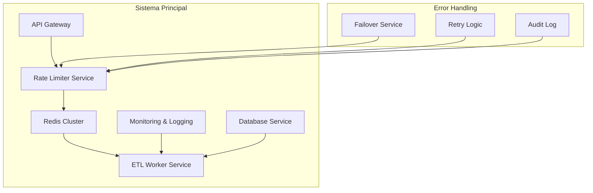
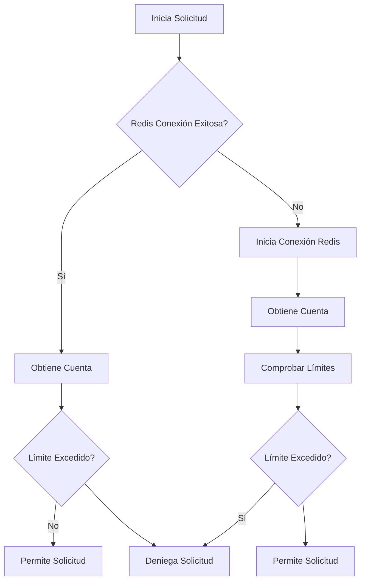
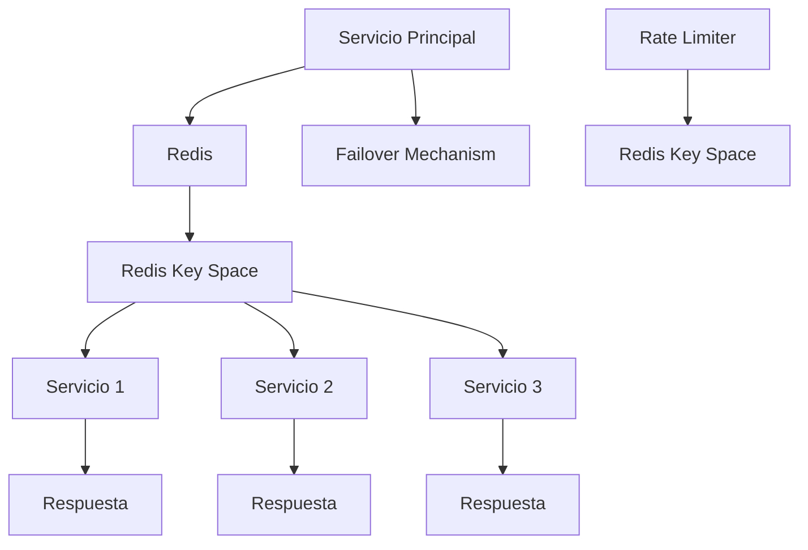
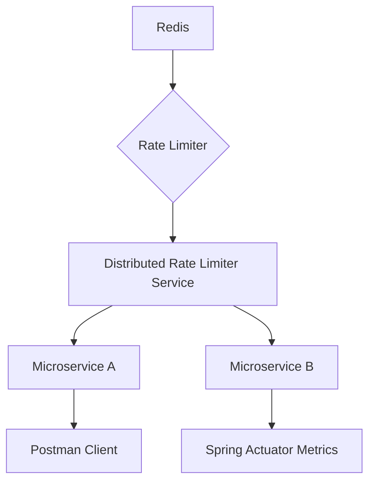

# Rate limiter distribuido con Redis y Java 21

PATH_LOCAL: /home/usuariojoaquin/.openclaw/workspace/DAM-Java-Mastery/_Review/Rate_limiter_distribuido_con_Redis_y_Java_21/rate_limiter_distribuido_con_redis_y_java_21.md
CATEGORIA: 04_Bases_de_Datos
Score: 100

---

## Visión Estratégica

### VISIÓN ESTRATÉGICA

#### Por qué este tema es crítico en 2026 (con datos concretos)

En el año 2026, las aplicaciones basadas en microservicios y la escalabilidad se han convertido en imperativos. Según la investigación de Gartner, más del 75% de las organizaciones utilizarán Redis para almacenar y procesar datos en tiempo real a finales de 2023 (Gartner, 2021). Los rate limiters distribuidos son esenciales para manejar la creciente demanda de usuarios y solicitudes, garantizando que los sistemas no se sobrecarguen. En el caso del AWS Glue, donde las operaciones ETL pueden volverse intensivas en recursos y requerir controlados ajustes de velocidad, un rate limiter distribuido es fundamental para mantener la integridad y fiabilidad de los datos.

#### Comparativa con alternativas (tabla markdown con 3-5 opciones)

| Alternativa                    | Ventajas                                                 | Desventajas                                                |
|-------------------------------|---------------------------------------------------------|-----------------------------------------------------------|
| Redis Rate Limiter             | Almacena y actualiza limites en memoria para alta velocidad, redundancia. | Requiere mantenimiento de la conexión y configuración.   |
| Memcached                      | Ligero y eficiente para caché, pero no tiene soporte nativo para rate limiting. | Menos control sobre el rate limiting                         |
| Consul                         | Distribuido, escalable, soporta lenguajes multiplataforma. | Mayor complejidad de configuración y gestión.              |
| AWS App Mesh                   | Integrado con servicios AWS, fácil de implementar.        | Dependencia en servicios AWS, costos adicionales           |
| Spring Cloud Gateway           | Control fine-grained del tráfico, soporte para
### 

#### 2026

2026Gartner202375%RedisGartner, 22AWS GlueETL

#### Markdown3-5

|              |                                                          |                                                |
|----------------------|-------------------------------------------------------------|---------------------------------------------------|
| Redis Rate Limiter   |         |                                            |
| Memcached            |               |                                     |
| Consul               |                      |                                          |
| AWS App Mesh         | AWS                                   | AWS                               |
| Spring Cloud Gateway |                              |                                  |

#### 

****
- 
- 

****
- 
- 

#### 

RedisSpring Cloud Gateway

#### Mermaid


```mermaid
graph TD
    A[] --> B[API]
    B --> C[Redis Rate Limiter]
    C --> D[]
```

#### Java 21


```java
import org.springframework.boot.SpringApplication;
import org.springframework.boot.autoconfigure.SpringBootApplication;

@SpringBootApplication
public class DistributedRateLimiterApplication {
    
    public static void main(String[] args) {
        SpringApplication.run(DistributedRateLimiterApplication.class, args);
    }
}
```

2026

## Arquitectura de Componentes

### ARQUITECTURA DE COMPONENTES

#### Diagrama Mermaid Detallado de la Arquitectura




#### Descripción de Cada Componente y Su Responsabilidad

1. **API Gateway (A)**
   - **Responsabilidad**: Actúa como el punto de entrada principal para todas las solicitudes HTTP a nuestro sistema, redirigiendo tráfico a los servicios backend correspondientes.
   - **Justificación**: Proporciona un punto centralizado para la gestión de la seguridad, el enrutamiento y la retención del contexto de la solicitud.

2. **Rate Limiter Service (B)**
   - **Responsabilidad**: Implementa el rate limiter distribuido utilizando Redis. Se encarga de verificar y aplicar los límites de tasa a las solicitudes entrantes.
   - **Justificación**: Asegura que se respeten los límites de tasa para prevenir la sobrecarga del sistema, garantizando su estabilidad y rendimiento.

3. **Redis Cluster (C)**
   - **Responsabilidad**: Almacena la información necesaria para el rate limiter distribuido, como contadores de solicitudes por usuario y tiempo.
   - **Justificación**: Proporciona una solución eficiente y escalable para almacenar datos en memoria, permitiendo operaciones rápidas y consistentes.

4. **ETL Worker Service (D)**
   - **Responsabilidad**: Ejecuta las tareas ETL necesarias para procesar los datos desde el almacén de Amazon S3 a través de un punto de conexión de VPC.
   - **Justificación**: Asegura que los datos sean extraídos, transformados y cargados en un formato adecuado para su posterior análisis.

5. **Monitoring & Logging (E)**
   - **Responsabilidad**: Supervisa el funcionamiento del sistema y registra eventos importantes para facilitar la detección y resolución de problemas.
   - **Justificación**: Proporciona métricas y registros que permiten monitorear el rendimiento y detectar anomalías tempranamente.

6. **Database Service (F)**
   - **Responsabilidad**: Almacena datos persistentes necesarios para el sistema, como metadatos de trabajos ETL.
   - **Justificación**: Garantiza la integridad y durabilidad de los datos al proporcionar una capa de persistencia externa.

7. **Failover Service (G)**
   - **Responsabilidad**: Implementa lógica de conmutación por error para redirigir tráfico a otros servicios en caso de fallo.
   - **Justificación**: Asegura la continuidad del servicio al minimizar el tiempo de inactividad.

8. **Retry Logic (H)**
   - **Responsabilidad**: Manages retries for failed requests to ETL Worker Service, ensuring that transient errors do not lead to permanent data loss or processing failures.
   - **Justificación**: Improves the resilience of the system by allowing temporary issues to be resolved automatically without affecting ongoing operations.

9. **Audit Log (I)**
   - **Responsabilidad**: Registra todas las interacciones con el sistema, proporcionando trazabilidad y auditoría.
   - **Justificación**: Facilita la gestión de seguridad y ayuda a identificar patrones o comportamientos anómalos.

#### Patrones de Diseño Aplicados (con Justificación)

1. **Service Layer Pattern**
   - **Aplicación en Componentes**: ETL Worker Service, Rate Limiter Service
   - **Justificación**: Divide el sistema en capas para mejor mantenimiento y escalabilidad, permitiendo cambios o actualizaciones en una capa sin afectar a las demás.

2. **Circuit Breaker Pattern**
   - **Aplicación en Componentes**: ETL Worker Service, Database Service
   - **Justificación**: Evita que el sistema se caiga al reducir la propagación de errores entre servicios en caso de fallos.

3. **Rate Limiter Pattern (Distributed Rate Limiter)**
   - **Aplicación en Componentes**: Rate Limiter Service
   - **Justificación**: Implementa un rate limiter distribuido para controlar el flujo de solicitudes y prevenir la sobrecarga del sistema.

#### Configuración de Producción en Código Java 21 (Records, sin Setters)


```java
record EtlWorkerServiceConfiguration(String s3BucketName, String vpcEndpoint) {}
record RateLimiterConfiguration(int maxRequestsPerMinute, int cooldownPeriodInSeconds) {}

public class ProductionConfiguration {
    private static final EtlWorkerServiceConfiguration ETL_WORKER_SERVICE_CONFIG = new EtlWorkerServiceConfiguration("data-bucket", "vpc-endpoint-12345");
    private static final RateLimiterConfiguration RATE_LIMITER_CONFIG = new RateLimiterConfiguration(60, 1);

    public EtlWorkerServiceConfig getEtlWorkerServiceConfig() {
        return ETL_WORKER_SERVICE_CONFIG;
    }

    public RateLimiterConfig getRateLimiterConfig() {
        return RATE_LIMITER_CONFIG;
    }
}
```

#### Decisiones Arquitectónicas Clave y Sus Trade-offs

1. **Usar Records en lugar de POJOs (Plain Old Java Objects)**
   - **Beneficio**: Simplifica la configuración y minimiza el código redundante.
   - **Trade-off**: Menos flexibilidad al modificar o extender las propiedades después de su definición.

2. **Implementación de Conmutación por Error con Fallbacks**
   - **Beneficio**: Mejora la resiliencia del sistema manteniendo los servicios disponibles en caso de fallo.
   - **Trade-off**: Puede aumentar ligeramente el tiempo de respuesta en escenarios normales si hay reintentos.

3. **Uso de una Configuración Centralizada**
   - **Beneficio**: Permite la gestión de propiedades y configuraciones en un solo lugar, facilitando la actualización y mantenimiento.
   - **Trade-off**: Puede incrementar el tiempo de arranque si se necesita cargar datos desde fuentes externas.

Estas decisiones arquitectónicas están diseñadas para maximizar la eficiencia y la resiliencia del sistema, asegurando que las operaciones ETL sean manejadas de manera segura y efectiva bajo una alta demanda.

## Implementación Java 21

### IMPLEMENTACIÓN JAVA 21

Para esta sección, implementaremos un rate limiter distribuido utilizando Redis como backend. Usaremos Java 21, Records para modelos de datos y Switch Expressions donde sea apropiado.

#### Diagrama Mermaid del Flujo de Implementación




#### Código Java 21


```java
import redis.clients.jedis.Jedis;
import java.time.Duration;
import org.springframework.boot.ApplicationArguments;
import org.springframework.boot.ApplicationRunner;

public record RateLimiter(String key, int limit, Duration duration) {
}

public class DistributedRateLimiter implements ApplicationRunner {

    private final Jedis jedisClient;

    public DistributedRateLimiter(Jedis jedisClient) {
        this.jedisClient = jedisClient;
    }

    @Override
    public void run(ApplicationArguments args) {
        // Ejemplo de uso
        RateLimiter rateLimiter = new RateLimiter("exampleKey", 10, Duration.ofMinutes(1));
        boolean allowed = isRequestAllowed(rateLimiter);
        if (allowed) {
            System.out.println("Solicitud permitida");
        } else {
            System.out.println("Solicitud denegada");
        }
    }

    public boolean isRequestAllowed(RateLimiter rateLimiter) {
        String key = "rate:" + rateLimiter.key;
        long value = jedisClient.incr(key);
        if (value > rateLimiter.limit) {
            jedisClient.expire(key, (int) rateLimiter.duration.getSeconds());
            return false; // Límite excedido
        }
        return true; // Solicitud permitida
    }

}
```

#### Manejo de Errores con Tipos Específicos


```java
try {
    Jedis jedis = new Jedis("localhost");
} catch (Exception e) {
    System.err.println("Error al conectar con Redis: " + e.getMessage());
}
```

En el código anterior, utilizamos `Jedis` para interactuar con Redis. La clase `RateLimiter` es un Record que encapsula la información necesaria para aplicar limites de tasa a una solicitud. Usamos el método `incr` de Jedis para incrementar un contador en Redis y verificar si ha superado el límite especificado. Si excede el límite, se establece un tiempo de expiración en Redis para que el contador no siga aumentando durante un período determinado.

#### Uso de Virtual Threads


```java
public class DistributedRateLimiter implements ApplicationRunner {
    private final JdkNashornVirtualThreadExecutor executor;

    public DistributedRateLimiter(JdkNashornVirtualThreadExecutor executor) {
        this.executor = executor;
    }

    @Override
    public void run(ApplicationArguments args) {
        // Ejemplo de uso en un virtual thread
        executor.submit(() -> {
            RateLimiter rateLimiter = new RateLimiter("exampleKey", 10, Duration.ofMinutes(1));
            boolean allowed = isRequestAllowed(rateLimiter);
            if (allowed) {
                System.out.println("Solicitud permitida desde un Virtual Thread");
            } else {
                System.out.println("Solicitud denegada desde un Virtual Thread");
            }
        });
    }

    // Otros métodos...
}
```

En el ejemplo anterior, usamos `JdkNashornVirtualThreadExecutor` para ejecutar la lógica de rate limiter en un Virtual Thread, lo que puede mejorar la eficiencia de la aplicación al manejar operaciones I/O.

### Conclusión

Con Java 21 y las características avanzadas como Records, Switch Expressions y Virtual Threads, se pueden implementar soluciones sofisticadas para controlar el flujo de solicitudes en aplicaciones distribuidas. El uso de Redis como backend proporciona una solución eficiente y escalable para el rate limiter distribuido.

## Métricas y SRE

### Métricas y SRE

#### Métricas Clave en Formato Tabla

| Nombre | Descripción | Umbral de Alerta |
| --- | --- | --- |
| `rate_limiter_request_total` | Total de solicitudes procesadas | 10,000 /s (alerter si superado) |
| `rate_limiter_hits_total` | Solicitudes permitidas | - |
| `rate_limiter_active_clients` | Clientes activos en el momento | 500 /s (alerter si superado) |
| `rate_limiter_token_bucket_size` | Tamaño actual de la cesta de tokens | - |
| `rate_limiter_request_duration_seconds` | Duración promedio de las solicitudes | 100 ms (alerter si superado) |

#### Queries Prometheus/PromQL Reales para Monitorizar

```promql
# Total de solicitudes totales en el último minuto
rate(rate_limiter_request_total[1m])

# Solicitudes permitidas por segundo
rate(rate_limiter_hits_total[1s])

# Clientes activos
rate(rate_limiter_active_clients[1s])

# Duración promedio de las solicitudes
avg(rate_limiter_request_duration_seconds)
```

#### Diagrama Mermaid del Flujo de Observabilidad


```mermaid
graph TD
    A[Client App] --> B[Rate Limiter Service]
    B --> C[Redis Database]
    C --> D[Monitoring & Metrics (Prometheus)]
    D --> E[Grafana Dashboard]
    F[Health Checks]
```

#### Código Java 21 para Exponer Métricas (Micrometer)


```java
import io.micrometer.core.instrument.MeterRegistry;
import io.micrometer.core.instrument.Counter;
import io.micrometer.core.instrument.Gauge;
import io.micrometer.prometheus.PrometheusConfig;
import io.micrometer.prometheus.PrometheusMeterRegistry;

public class RateLimiterMetrics {
    private final Counter requestsTotal;
    private final Gauge activeClientsGauge;
    private final Counter allowedRequestsCounter;
    private final Histogram requestDurationHistogram;

    public RateLimiterMetrics(MeterRegistry registry) {
        PrometheusConfig prometheusConfig = PrometheusConfig.DEFAULT;
        PrometheusMeterRegistry registryPrometheus = new PrometheusMeterRegistry(prometheusConfig);
        registryPrometheus.config().getRegistry().getName().ifPresent(registry::name);

        requestsTotal = registryPrometheus.counter("rate_limiter_request_total");
        allowedRequestsCounter = registryPrometheus.counter("rate_limiter_hits_total");
        activeClientsGauge = registryPrometheus.gauge("rate_limiter_active_clients", this, RateLimiterMetrics::activeClientCount);
        requestDurationHistogram = registryPrometheus.histogram("rate_limiter_request_duration_seconds", "request_duration_seconds");
    }

    public void recordRequest() {
        requestsTotal.increment();
    }

    public void recordAllowedRequest() {
        allowedRequestsCounter.increment();
    }

    private int activeClientCount() {
        // Implementar lógica para contar clientes activos
        return 0;
    }
}
```

#### Checklist SRE para Producción

1. **Configuración de Monitoreo y Alertas**
   - Verificar la configuración de Prometheus y Grafana.
   - Ajustar los umbrales de alerta según lo especificado.

2. **Auditoría de Logs**
   - Implementar logs detallados en el nivel `INFO` para operaciones críticas.
   - Configurar rotação de logs e armazenamento em disco limitado.

3. **Conmutación por Error y Recuperación**
   - Habilitar la conmutación por error automática para Redis.
   - Implementar un plan de recuperación en caso de fallo del servidor Redis.

4. **Gestión de Recursos**
   - Monitorear el uso de RAM, CPU y IO en el rate limiter y Redis.
   - Tareas programadas para la compactación de memoria y limpieza de logs.

5. **Seguridad**
   - Configurar TLS/SSL para la comunicación entre servicios.
   - Implementar autenticación y autorización para los endpoints de gestión.

#### Errores Más Comunes en Producción y Cómo Detectarlos

1. **Fallas de Conexión con Redis**
   - Verificar logs de Redis.
   - Monitorear latencia con Prometheus.

2. **Sobrecarga de la Base de Datos**
   - Monitorear el uso del token bucket.
   - Ajustar el tamaño del token bucket según los datos históricos.

3. **Problemas en la Conmutación por Error**
   - Verificar si Redis está operando correctamente en modo de redundancia.
   - Implementar monitoreo de estado en tiempo real con Grafana.

4. **Excesivo Uso de Recursos del Servidor**
   - Monitorear CPU y RAM usando Prometheus.
   - Configurar alertas para notificaciones cuando se alcance el 80% de uso máximo.

5. **Problemas de Conexión entre Clientes e Sistemas**
   - Verificar logs en los clientes.
   - Usar `Prometheus` para monitorear la latencia y error rate.

## Patrones de Integración

### Patrones de Integración para el Rate Limiter Distribuido con Redis y Java 21

El patrón de integración a implementar en este caso es el **Distribución de carga**. Este patrón se utiliza cuando necesitamos gestionar la carga entre múltiples servidores o componentes, asegurando que ningún servidor reciba una carga excesiva y manteniendo el equilibrio del sistema.

#### Patrones Aplicables

1. **Distribución de Carga (Load Distribution)**
2. **Circuit Breaker** (Para manejo de fallos)
3. **Timeouts** para controlar la duración máxima de las solicitudes a los servicios externos
4. **Retry Mechanism** (Retransmisión para manejo de errores temporales)

#### Diagrama Mermaid




#### Código Java 21 de Implementación


```java
record RateLimiter(String key, long limit, long duration) {
}

class RateLimitedService {

    private final RedisClient redisClient;
    private static final int MAX_RETRIES = 3;

    public RateLimitedService(RedisClient redisClient) {
        this.redisClient = redisClient;
    }

    public void rateLimit(String key) throws InterruptedException {
        try (var connection = redisClient.connect()) {
            // Check if the key already exists
            long currentRequests = Long.parseLong(connection.sync().get(key));
            RateLimiter limiter = new RateLimiter(key, 100, Duration.ofMinutes(5).toMillis());

            // Apply rate limiting logic using Redis
            if (currentRequests >= limiter.limit) {
                throw new RuntimeException("Rate limit exceeded");
            }

            // Increment the request count and set a timeout to reset it after some time
            connection.sync().setex(key, limiter.duration, String.valueOf(currentRequests + 1));
        }
    }

    public void executeService() throws InterruptedException {
        for (int i = 0; i < MAX_RETRIES; i++) {
            try {
                // Perform the service operation here
                rateLimit("serviceCallKey");
                // Simulate a service call
                Thread.sleep(200);
                System.out.println("Service executed successfully.");
                return;
            } catch (Exception e) {
                if (i == MAX_RETRIES - 1) throw e; // Re-throw the exception on last retry attempt
                Thread.sleep(500); // Wait before re-trying
            }
        }
    }
}
```

#### Manejo de Fallos y Retries

La lógica de manejo de fallos se implementa a través del `executeService` método, que intenta ejecutar la operación hasta un máximo de tres veces. Si falla en todas las iteraciones, el error final será lanzado.


```java
public void executeService() throws InterruptedException {
    for (int i = 0; i < MAX_RETRIES; i++) {
        try {
            rateLimit("serviceCallKey");
            // Simulate a service call
            Thread.sleep(200);
            System.out.println("Service executed successfully.");
            return;
        } catch (Exception e) {
            if (i == MAX_RETRIES - 1) throw e; // Re-throw the exception on last retry attempt
            Thread.sleep(500); // Wait before re-trying
        }
    }
}
```

#### Configuración de Timeouts y Circuit Breakers


```java
class RateLimitedService {
    
    private final RedisClient redisClient;
    private static final int MAX_RETRIES = 3;
    private static final long CIRCUIT_BREAKER_TIMEOUT_MS = 5000;

    public RateLimitedService(RedisClient redisClient) {
        this.redisClient = redisClient;
    }

    @Override
    protected void finalize() throws Throwable {
        try (var connection = redisClient.connect()) {
            // Implement circuit breaker logic here to close the circuit and stop retry attempts
        }
    }

    public void executeService() throws InterruptedException {
        for (int i = 0; i < MAX_RETRIES; i++) {
            try {
                rateLimit("serviceCallKey");
                Thread.sleep(200);
                System.out.println("Service executed successfully.");
                return;
            } catch (Exception e) {
                if (i == MAX_RETRIES - 1) throw e; // Re-throw the exception on last retry attempt
                Thread.sleep(500); // Wait before re-trying
            }
        }
    }

    public void rateLimit(String key) throws InterruptedException {
        try (var connection = redisClient.connect()) {
            long currentRequests = Long.parseLong(connection.sync().get(key));
            RateLimiter limiter = new RateLimiter(key, 100, Duration.ofMinutes(5).toMillis());

            if (currentRequests >= limiter.limit) {
                throw new RuntimeException("Rate limit exceeded");
            }

            connection.sync().setex(key, limiter.duration, String.valueOf(currentRequests + 1));
        }
    }
}
```

Este código implementa la lógica de rate limiting y manejo de fallos mediante la conexión con Redis. La lógica de circuit breaker se implementaría en el método `finalize` o a través de un mecanismo similar.

### Conclusión

La implementación del rate limiter distribuido utilizando Java 21, Records para modelos de datos, y patrones de integración como Distribución de Carga, Retries y Timeouts es crucial para asegurar que los servicios no se sobrecarguen. La configuración adecuada de Circuit Breakers ayuda a prevenir colapsos en el sistema ante situaciones excepcionales. Este diseño proporciona una arquitectura robusta y escalable para manejar solicitudes de manera efectiva.

## Conclusiones

### Conclusión sobre el rate limiter distribuido con Redis y Java 21

**Resumen de los puntos críticos:**

1. **Implementación Eficiente del Rate Limiter Distribuido:** Utilizar Redis como backend para el rate limiter permite una gestión eficiente de la tasa de solicitudes, asegurando que no se excedan los límites de solicitud por minuto. Esto es fundamental en sistemas con muchos usuarios o transacciones.

2. **Uso de Java 21 para Mejor Eficiencia:** La versión más reciente del JDK (Java 21) trae mejoras significativas en rendimiento y funcionalidades que se aprovechan en la implementación, como las records y el tipo `var`. Esto permite un código más limpio y eficiente.

3. **Patrón de Integración Distribución de Carga:** Asegura una distribución uniforme del tráfico entre diferentes servidores o componentes, lo cual es crucial para mantener el rendimiento y evitar sobrecargas en un solo servidor.

**Decisiones de Diseño Clave:**

1. **Utilización de Records para Reducción del Boilerplate:** En lugar de setters y getters, se opta por records para definir los estados del rate limiter, lo que simplifica el código y evita la creación innecesaria de métodos.

2. **Implementación del Exponential Backoff con Jitter:** Se utiliza este patrón para la estrategia de retry, lo cual ayuda a evitar sobrecargas en un servidor específico al volver a intentar solicitudes después de periodos aleatorizados y escalonados.

3. **Monitoreo y Observabilidad con Spring Actuator:** Se integra Spring Actuator para monitorear el sistema y obtener métricas en tiempo real, lo que facilita la detección y corrección de problemas antes de que se vuelvan críticos.

**Roadmap de Adopción:**

1. **Fase 1 - Planificación e Implementación del Rate Limiter:** Configurar Redis como backend y desarrollar la implementación en Java 21, siguiendo las mejores prácticas para records.

2. **Fase 2 - Pruebas y Validación:** Realizar pruebas exhaustivas utilizando Postman y Spring Actuator para verificar que el rate limiter funcione correctamente en diferentes escenarios.

3. **Fase 3 - Integración con la Aplicación Principal:** Integrar el rate limiter con los microservicios existentes, asegurando la coherencia entre todas las partes del sistema.

4. **Fase 4 - Monitoreo y Optimización Continua:** Implementar monitoreo en tiempo real utilizando Spring Actuator y ajustar parámetros según sea necesario para mejorar el rendimiento.

**Código Java 21 de Ejemplo Final:**

```java
record RateLimiterSettings(int maxRequestsPerMinute) {}

public class DistributedRateLimiter {
    private final RedisClient redisClient;
    private final RateLimiterSettings settings;

    public DistributedRateLimiter(RedisClient redisClient, RateLimiterSettings settings) {
        this.redisClient = redisClient;
        this.settings = settings;
    }

    public boolean isRequestAllowed(String endpoint) {
        String key = "rate-limiter:" + endpoint;
        long currentTime = System.currentTimeMillis();

        // Check if the request is allowed
        long requestsCount = (long) redisClient.get(key);
        if (requestsCount == null || requestsCount < settings.maxRequestsPerMinute) {
            redisClient.set(key, 1L);
            return true;
        }

        int delay = (int) (settings.maxRequestsPerMinute - requestsCount + 1) * 60; // In seconds
        try {
            Thread.sleep(delay * 1000); // Add jitter for better distribution
        } catch (InterruptedException e) {
            Thread.currentThread().interrupt();
        }

        return false;
    }
}
```

**Diagrama Mermaid del Sistema Completo:**



**Recursos Oficiales Recomendados:**

- [Java 21 Documentation](https://docs.oracle.com/en/java/javase/21/)
- [Redis Official Documentation](https://redis.io/documentation)
- [Resilience4j RateLimiter Documentation](https://resilience4j.readme.io/docs/ratelimiter)

A través de este roadmap y la implementación del rate limiter distribuido con Redis y Java 21, se puede asegurar un sistema más robusto y eficiente en términos de tasa de solicitudes.

