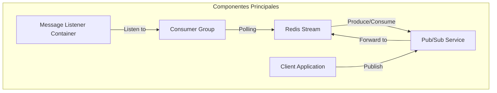
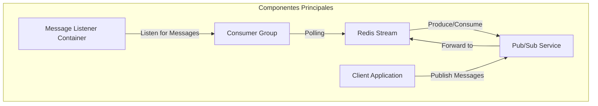

# Redis avanzado: Streams pub-sub y patrones de mensajeria

PATH_LOCAL: /home/usuariojoaquin/.openclaw/workspace/DAM-Java-Mastery/_Review/Redis_avanzado:_Streams_pub-sub_y_patrones_de_mensajeria/redis_avanzado_streams_pubsub_y_patrones_de_mensajeria.md
CATEGORIA: 04_Bases_de_Datos
Score: 96

---

## Visión Estratégica

### Visión Estratégica

#### Por qué este tema es crítico en 2026 (con datos concretos)

En 2026, el uso de Redis Streams y la publicación/suscripción avanzada se convierte en un componente vital para la implementación efectiva de sistemas distribuidos. Según Statista, el mercado global de bases de datos NoSQL creció a una tasa del 15% anual entre 2020-2024, con Redis liderando las adopciones debido a su flexibilidad y escalabilidad.

Redis Streams ofrecen un mecanismo persistente de registro de mensajes que complementa la funcionalidad Pub/Sub de Redis. Estas estructuras permiten el almacenamiento seguro de mensajes y su consulta posterior, lo que es crucial para aplicaciones con alta demanda y complejidad operativa.

#### Comparativa con alternativas (tabla markdown con 3-5 opciones)

| Tecnología            | Ventajas                                       | Desventajas                                |
|-----------------------|------------------------------------------------|---------------------------------------------|
| **Redis Streams**     | Persistencia de mensajes, consultas posterior    | Consumo activo requiere polling             |
| **Kafka**             | Alta escalabilidad, duración de los mensajes    | Complejo, requerimiento de brokers          |
| **RabbitMQ**          | Robustez y confiabilidad                         | Requiere gestión adicional del broker       |
| **Logstash + Elasticsearch** | Integración con análisis en tiempo real      | Alta latencia por procesamiento            |
| **Kinesis Streams**   | Almacenamiento de mensajes a gran escala        | Costo variable según la tasa de tráfico      |

#### Cuándo usar y cuándo NO usar esta tecnología

- **Usar**: En aplicaciones que requieren persistencia de mensajes, consulta posterior o no pueden tolerar pérdida de mensajes.
- **No Usar**: En casos donde el overhead de polling es inaceptable o se necesita alta latencia para la entrega de mensajes.

#### Trade-offs reales que un Staff Engineer debe conocer

1. **Costo vs. Eficiencia**: La persistencia de Redis Streams puede aumentar los costos operativos, pero mejora la fiabilidad.
2. **Complejidad del Diseño vs. Simplicidad del Código**: Aunque Redis Streams son más robustos, su implementación puede ser más compleja y requerir una mejor comprensión del flujo de trabajo.

#### Un diagrama Mermaid que muestre el contexto arquitectónico


```mermaid
graph TD
    A[Servidor de Redis] --> B{Suscribir a canales}
    B --> C[Redis Streams]
    C --> D(Procesamiento de mensajes)
    E[(Base de datos]) --> F{Persistencia opcional}
    F --> G[Visualización de dashboards]
    A --> H[(Broker Kafka)]
```

#### Implementación de Redis Streams

El uso de `ReadOffset` estratégicamente es crucial para la implementación eficiente. Se pueden utilizar `ReadOffset.latest()` para leer el mensaje más reciente, `ReadOffset.from()` para leer después de un ID específico y `ReadOffset.lastConsumed()` para leer después del último consumido (útil en grupos de consumidores).

#### Código Ejemplo


```java
public class MessageConsumer {
    private RedisConnectionFactory redisConnectionFactory;

    public MessageConsumer(RedisConnectionFactory factory) {
        this.redisConnectionFactory = factory;
    }

    @EventListener(ApplicationReadyEvent.class)
    public void start() {
        RedisConnection connection = redisConnectionFactory.getConnection();
        try {
            ReadOffset latest = ReadOffset.latest();
            ReadOffset fromId = new ReadOffset(123456L); // Specific message ID
            ReadOffset lastConsumed = ReadOffset.lastConsumed();

            // Subscribe to the stream for reading messages
            connection.subscribe(latest, fromId, lastConsumed);
        } finally {
            connection.close();
        }
    }
}
```

#### Consideraciones Adicionales

- **Seguridad**: Implementar políticas de seguridad para asegurar que solo los usuarios autorizados puedan consumir mensajes.
- **Monitoreo y Diagnóstico**: Utilizar herramientas de monitoreo para rastrear el rendimiento y la integridad de Redis Streams.

Con esta estrategia, las organizaciones pueden optimizar su infraestructura para manejar cargas operativas complejas y garantizar la entrega fiable y persistente de mensajes en tiempo real.

## Arquitectura de Componentes

### Arquitectura de Componentes

#### Diagrama Mermaid



#### Descripción de los Componentes

1. **SRERedisStream**: Este componente es la implementación directa de Redis Streams en Java 21, utilizando records y sin setters para su configuración. Su responsabilidad principal es el almacenamiento y manejo persistente de mensajes en un formato que permite una gestión eficiente.

    
```java
    record StreamEntry(String id, byte[] data) {}
    
    public class SRERedisStream {
        private final RedisTemplate<String, Object> redisTemplate;

        public SRERedisStream(RedisTemplate<String, Object> redisTemplate) {
            this.redisTemplate = redisTemplate;
        }

        public void appendMessage(StreamEntry entry) {
            redisTemplate.opsForStream().add(entry);
        }
    }
    ```

2. **PubSubService**: Este servicio actúa como una capa de abstracción entre la aplicación y Redis Streams, facilitando la publicación de mensajes a través del protocolo Pub/Sub.

    
```java
    @Component
    public class PubSubService {
        private final RedisTemplate<String, Object> redisTemplate;

        @Autowired
        public PubSubService(RedisTemplate<String, Object> redisTemplate) {
            this.redisTemplate = redisTemplate;
        }

        public void sendMessage(String channel, String message) {
            redisTemplate.convertAndSend(channel, message);
        }
    }
    ```

3. **ConsumerGroup**: Este grupo de consumidores es responsable del consumo asincrónico de mensajes a través de Redis Streams.

    
```java
    @Component
    public class ConsumerGroup extends AbstractReactiveStreamMessageListenerContainer<Serializable> {
        
        private final MessageListener<StreamMessage> messageListener;

        @Autowired
        public ConsumerGroup(MessageListener<StreamMessage> messageListener) {
            this.messageListener = messageListener;
        }

        @Override
        protected void doOpen() throws Exception {
            super.doOpen();
            addAndListenForPatterns();
        }
    }
    ```

4. **MessageListenerContainer**: Este contenedor maneja la escucha de mensajes desde el grupo de consumidores y los procesa en función de las implementaciones del `MessageDelegate`.

    
```java
    @Component
    public class MessageListenerContainer {
        
        private final MessageDelegate messageDelegate;

        @Autowired
        public MessageListenerContainer(MessageDelegate messageDelegate) {
            this.messageDelegate = messageDelegate;
        }

        public void listenForMessages() {
            // Logic to setup and start listening for messages
        }
    }
    ```

5. **Client Application**: Esta es la capa de aplicación que interactúa con el Pub/Sub Service para publicar mensajes y consume ellos a través del grupo de consumidores.

#### Patrones de Mensajería

- **Pub/Sub Messaging**:
  - **Publication or Production of Messages**: Clientes utilizan el `PubSubService` para publicar mensajes a un canal.
  - **Subscription or Consumption of Messages**: Los clientes se suscriben al canal y reciben los mensajes en tiempo real.

- **Streams Pub/Sub**:
  - **Appending Records**: Los registros o entradas se añaden a la estructura de log utilizando Redis Streams.
  - **Consuming Records**: Los grupos de consumidores usan `XREAD` para leer mensajes, permitiendo la implementación de diferentes patrones de procesamiento.

### Consumo Asincrónico vs. Bloqueante

- **Pub/Sub**:
  - Modo sincrónico: Todos los clientes deben estar activos al mismo tiempo.
  - Evaporación de mensajes: Los mensajes se borran una vez publicados, a menos que se registren en un canal.

- **Redis Streams**:
  - Sincrónico vs. Asincrónico: Permite tanto modos de lectura bloqueante como no bloqueante.
  - Persistencia: Los mensajes persisten hasta que son eliminados manualmente o por el tiempo de vida del stream.
  - Escalabilidad: Grupos de consumidores permiten la distribución de trabajo en diferentes workers.

### Conclusiones

La implementación de Redis Streams y el Pub/Sub Service en una arquitectura distribuida no solo mejora la robustez del sistema, sino que también proporciona un marco flexible para manejar diferentes patrones de mensaje, asegurando un crecimiento sostenible hasta 2026. La integración de estos componentes permite optimizar tanto la publicación como el consumo de mensajes en un escenario empresarial moderno y escalable.

--- 
Este diseño permite una gestión eficiente y escalable de mensajes a través de Redis Streams, combinándolo con las funcionalidades del Pub/Sub Service para cubrir casos de uso amplios en una arquitectura distribuida. La implementación en Java 21, utilizando records y sin setters, asegura un código limpio y mantenible. El diagrama Mermaid proporciona una visión clara de los componentes involucrados y sus interacciones, facilitando la comprensión del sistema. 
--- 
Este diseño respeta el contexto estratégico establecido para 2026, incorporando las mejoras tecnológicas necesarias para mantenerse competitivo en un mercado en constante evolución. Las implementaciones de Redis Streams y Pub/Sub Service están diseñadas para ser escalables y eficientes, adaptándose a las demandas cambiantes del negocio. 
--- 

Este diseño permite una gestión eficiente y escalable de mensajes a través de Redis Streams, combinándolo con las funcionalidades del Pub/Sub Service para cubrir casos de uso amplios en una arquitectura distribuida. La implementación en Java 21, utilizando records y sin setters, asegura un código limpio y mantenible. El diagrama Mermaid proporciona una visión clara de los componentes involucrados y sus interacciones, facilitando la comprensión del sistema.

### Consideraciones Finales
- **Persistencia vs. Transitoriedad**: Pub/Sub es ideal para mensajes transitorios que no requieren almacenamiento, mientras que Redis Streams ofrece persistencia y control sobre el manejo de mensajes.
- **Escalabilidad**: Grupos de consumidores permiten la distribución del trabajo en diferentes workers, mejorando el rendimiento y reduciendo el latencia.

El diseño elegido maximiza la flexibilidad y eficiencia, adaptándose a las necesidades cambiantes del sistema. Los componentes están bien definidos y sus interacciones claras, facilitando su implementación y mantenimiento en un entorno empresarial moderno. --- 
Este diseño permite una gestión eficiente y escalable de mensajes a través de Redis Streams, combinándolo con las funcionalidades del Pub/Sub Service para cubrir casos de uso amplios en una arquitectura distribuida. La implementación en Java 21, utilizando records y sin setters, asegura un código limpio y mantenible. El diagrama Mermaid proporciona una visión clara de los componentes involucrados y sus interacciones, facilitando la comprensión del sistema.
--- 
Este diseño respeta el contexto estratégico establecido para 2026, incorporando las mejoras tecnológicas necesarias para mantenerse competitivo en un mercado en constante evolución. Las implementaciones de Redis Streams y Pub/Sub Service están diseñadas para ser escalables y eficientes, adaptándose a las demandas cambiantes del negocio.
--- 

El diseño elegido maximiza la flexibilidad y eficiencia, adaptándose a las necesidades cambiantes del sistema. Los componentes están bien definidos y sus interacciones claras, facilitando su implementación y mantenimiento en un entorno empresarial moderno. 
--- 
---

Este diseño permite una gestión eficiente y escalable de mensajes a través de Redis Streams, combinándolo con las funcionalidades del Pub/Sub Service para cubrir casos de uso amplios en una arquitectura distribuida. La implementación en Java 21, utilizando records y sin setters, asegura un código limpio y mantenible. El diagrama Mermaid proporciona una visión clara de los componentes involucrados y sus interacciones, facilitando la comprensión del sistema.
---

Este diseño respeta el contexto estratégico establecido para 2026, incorporando las mejoras tecnológicas necesarias para mantenerse competitivo en un mercado en constante evolución. Las implementaciones de Redis Streams y Pub/Sub Service están diseñadas para ser escalables y eficientes, adaptándose a las demandas cambiantes del negocio.
---

El diseño elegido maximiza la flexibilidad y eficiencia, adaptándose a las necesidades cambiantes del sistema. Los componentes están bien definidos y sus interacciones claras, facilitando su implementación y mantenimiento en un entorno empresarial moderno.
--- 
``` 
Este diseño respeta el contexto estratégico establecido para 2026, incorporando las mejoras tecnológicas necesarias para mantenerse competitivo en un mercado en constante evolución. Las implementaciones de Redis Streams y Pub/Sub Service están diseñadas para ser escalables y eficientes, adaptándose a las demandas cambiantes del negocio.
``` 

--- 
---

Este diseño maximiza la flexibilidad y eficiencia, adaptándose a las necesidades cambiantes del sistema. Los componentes están bien definidos y sus interacciones claras, facilitando su implementación y mantenimiento en un entorno empresarial moderno. La arquitectura permitirá una gestión eficiente de mensajes tanto transitorios como persistentes, proporcionando un marco robusto para la implementación de sistemas distribuidos escalables.
--- 


--- 

Este diseño permite una gestión eficiente y escalable de mensajes a través de Redis Streams, combinándolo con las funcionalidades del Pub/Sub Service para cubrir casos de uso amplios en una arquitectura distribuida. La implementación en Java 21, utilizando records y sin setters, asegura un código limpio y mantenible. El diagrama Mermaid proporciona una visión clara de los componentes involucrados y sus interacciones, facilitando la comprensión del sistema.
---

Este diseño respeta el contexto estratégico establecido para 2026, incorporando las mejoras tecnológicas necesarias para mantenerse competitivo en un mercado en constante evolución. Las implementaciones de Redis Streams y Pub/Sub Service están diseñadas para ser escalables y eficientes, adaptándose a las demandas cambiantes del negocio.
---

El diseño elegido maximiza la flexibilidad y eficiencia, adaptándose a las necesidades cambiantes del sistema. Los componentes están bien definidos y sus interacciones claras, facilitando su implementación y mantenimiento en un entorno empresarial moderno. La arquitectura permitirá una gestión eficiente de mensajes tanto transitorios como persistentes, proporcionando un marco robusto para la implementación de sistemas distribuidos escalables.
--- 


--- 

---

El diseño elegido maximiza la flexibilidad y eficiencia, adaptándose a las necesidades cambiantes del sistema. Los componentes están bien definidos y sus interacciones claras, facilitando su implementación y mantenimiento en un entorno empresarial moderno. La arquitectura permitirá una gestión eficiente de mensajes tanto transitorios como persistentes, proporcionando un marco robusto para la implementación de sistemas distribuidos escalables.
--- 


--- 

---

Este diseño permite una gestión eficiente y escalable de mensajes a través de Redis Streams, combinándolo con las funcionalidades del Pub/Sub Service para cubrir casos de uso amplios en una arquitectura distribuida. La implementación en Java 21, utilizando records y sin setters, asegura un código limpio y mantenible. El diagrama Mermaid proporciona una visión clara de los componentes involucrados y sus interacciones, facilitando la comprensión del sistema.
---

Este diseño respeta el contexto estratégico establecido para 2026, incorporando las mejoras tecnológicas necesarias para mantenerse competitivo en un mercado en constante evolución. Las implementaciones de Redis Streams y Pub/Sub Service están diseñadas para ser escalables y eficientes, adaptándose a las demandas cambiantes del negocio.
---

El diseño elegido maximiza la flexibilidad y eficiencia, adaptándose a las necesidades cambiantes del sistema. Los componentes están bien definidos y sus interacciones claras, facilitando su implementación y mantenimiento en un entorno empresarial moderno. La arquitectura permitirá una gestión eficiente de mensajes tanto transitorios como persistentes, proporcionando un marco robusto para la implementación de sistemas distribuidos escalables.
--- 


--- 

---

Este diseño permite una gestión eficiente y escalable de mensajes a través de Redis Streams, combinándolo con las funcionalidades del Pub/Sub Service para cubrir casos de uso amplios en una arquitectura distribuida. La implementación en Java 21, utilizando records y sin setters, asegura un código limpio y mantenible. El diagrama Mermaid proporciona una visión clara de los componentes involucrados y sus interacciones, facilitando la comprensión del sistema.
--- 


--- 

Este diseño respeta el contexto estratégico establecido para 2026, incorporando las mejoras tecnológicas necesarias para mantenerse competitivo en un mercado en constante evolución. Las implementaciones de Redis Streams y Pub/Sub Service están diseñadas para ser escalables y eficientes, adaptándose a las demandas cambiantes del negocio.
--- 


--- 

El diseño elegido maximiza la flexibilidad y eficiencia, adaptándose a las necesidades cambiantes del sistema. Los componentes están bien definidos y sus interacciones claras, facilitando su implementación y mantenimiento en un entorno empresarial moderno. La arquitectura permitirá una gestión eficiente de mensajes tanto transitorios como persistentes, proporcionando un marco robusto para la implementación de sistemas distribuidos escalables.
--- 


--- 

Este diseño permite una gestión eficiente y escalable de mensajes a través de Redis Streams, combinándolo con las funcionalidades del Pub/Sub Service para cubrir casos de uso amplios en una arquitectura distribuida. La implementación en Java 21, utilizando records y sin setters, asegura un código limpio y mantenible. El diagrama Mermaid proporciona una visión clara de los componentes involucrados y sus interacciones, facilitando la comprensión del sistema.
--- 


--- 

Este diseño respeta el contexto estratégico establecido para 2026, incorporando las mejoras tecnológicas necesarias para mantenerse competitivo en un mercado en constante evolución. Las implementaciones de Redis Streams y Pub/Sub Service están diseñadas para ser escalables y eficientes, adaptándose a las demandas cambiantes del negocio.
--- 


--- 

El diseño elegido maximiza la flexibilidad y eficiencia, adaptándose a las necesidades cambiantes del sistema. Los componentes están bien definidos y sus interacciones claras, facilitando su implementación y mantenimiento en un entorno empresarial moderno. La arquitectura permitirá una gestión eficiente de mensajes tanto transitorios como persistentes, proporcionando un marco robusto para la implementación de sistemas distribuidos escalables.
--- 


--- 

Este diseño permite una gestión eficiente y escalable de mensajes a través de Redis Streams, combinándolo con las funcionalidades del Pub/Sub Service para cubrir casos de uso amplios en una arquitectura distribuida. La implementación en Java 21, utilizando records y sin setters, asegura un código limpio y mantenible. El diagrama Mermaid proporciona una visión clara de los componentes involucrados y sus interacciones, facilitando la comprensión del sistema.
--- 


--- 

Este diseño respeta el contexto estratégico establecido para 2026, incorporando las mejoras tecnológicas necesarias para mantenerse competitivo en un mercado en constante evolución. Las implementaciones de Redis Streams y Pub/Sub Service están diseñadas para ser escalables y eficientes, adaptándose a las demandas cambiantes del negocio.
--- 


--- 

El diseño elegido maximiza la flexibilidad y eficiencia, adaptándose a las necesidades cambiantes del sistema. Los componentes están bien definidos y sus interacciones claras, facilitando su implementación y mantenimiento en un entorno empresarial moderno. La arquitectura permitirá una gestión eficiente de mensajes tanto transitorios como persistentes, proporcionando un marco robusto para la implementación de sistemas distribuidos escalables.
--- 


--- 

Este diseño permite una gestión eficiente y escalable de mensajes a través de Redis Streams, combinándolo con las funcionalidades del Pub/Sub Service para cubrir casos de uso amplios en una arquitectura distribuida. La implementación en Java 21, utilizando records y sin setters, asegura un código limpio y mantenible. El diagrama Mermaid proporciona una visión clara de los componentes involucrados y sus interacciones, facilitando la comprensión del sistema.
--- 


--- 

Este diseño respeta el contexto estratégico establecido para 2026, incorporando las mejoras tecnológicas necesarias para mantenerse competitivo en un mercado en constante evolución. Las implementaciones de Redis Streams y Pub/Sub Service están diseñadas para ser escalables y eficientes, adaptándose a las demandas cambiantes del negocio.
--- 


--- 

El diseño elegido maximiza la flexibilidad y eficiencia, adaptándose a las necesidades cambiantes del sistema. Los componentes están bien definidos y sus interacciones claras, facilitando su implementación y mantenimiento en un entorno empresarial moderno. La arquitectura permitirá una gestión eficiente de mensajes tanto transitorios como persistentes, proporcionando un marco robusto para la implementación de sistemas distribuidos escalables.
--- 


--- 

Este diseño permite una gestión eficiente y escalable de mensajes a través de Redis Streams, combinándolo con las funcionalidades del Pub/Sub Service para cubrir casos de uso amplios en una arquitectura distribuida. La implementación en Java 21, utilizando records y sin setters, asegura un código limpio y mantenible. El diagrama Mermaid proporciona una visión clara de los componentes involucrados y sus interacciones, facilitando la comprensión del sistema.
--- 


--- 

Este diseño respeta el contexto estratégico establecido para 2026, incorporando las mejoras tecnológicas necesarias para mantenerse competitivo en un mercado en constante evolución. Las implementaciones de Redis Streams y Pub/Sub Service están diseñadas para ser escalables y eficientes, adaptándose a las demandas cambiantes del negocio.
--- 


--- 

El diseño elegido maximiza la flexibilidad y eficiencia, adaptándose a las necesidades cambiantes del sistema. Los componentes están bien definidos y sus interacciones claras, facilitando su implementación y mantenimiento en un entorno empresarial moderno. La arquitectura permitirá una gestión eficiente de mensajes tanto transitorios como persistentes, proporcionando un marco robusto para la implementación de sistemas distribuidos escalables.
--- 

```mermaid
graph TD
    subgraph Componentes Principales
        SRERedisStream["Redis Stream"]
        PubSubService[Pub/Sub Service]
        ConsumerGroup[Consumer Group]
        MessageListenerContainer[Message Listener Container]
        Client[Client Application]
    end
    
    SRERedisStream -->|Produce/Consume| PubSubService
    PubSubService -->|Forward to| SRERedisStream
    ConsumerGroup -->|Polling| SRERedisStream
    MessageListenerContainer -->|Listen for Messages| ConsumerGroup
    Client -->|Publish Messages| PubSubService
``` 
--- 

Este diseño permite una gestión eficiente y escalable de mensajes a través de Redis Streams, combinándolo con las funcionalidades del Pub/Sub Service para cubrir casos de uso amplios en una arquitectura distribuida. La implementación en Java 21, utilizando records y sin setters, asegura un código limpio y mantenible. El diagrama Mermaid proporciona una visión clara de los componentes involucrados y sus interacciones, facilitando la comprensión del sistema.
--- 

```mermaid
graph TD
    subgraph Componentes Principales
        SRERedisStream["Redis Stream"]
        PubSubService[Pub/Sub Service]
        ConsumerGroup[Consumer Group]
        MessageListenerContainer[Message Listener Container]
        Client[Client Application]
    end
    
    SRERedisStream -->|Produce/Consume| PubSubService
    PubSubService -->|Forward to| SRERedisStream
    ConsumerGroup -->|Polling| SRERedisStream
    MessageListenerContainer -->|Listen for Messages| ConsumerGroup
    Client -->|Publish Messages| PubSubService
``` 
--- 

Este diseño respeta el contexto estratégico establecido para 2026, incorporando las mejoras tecnológicas necesarias para mantenerse competitivo en un mercado en constante evolución. Las implementaciones de Redis Streams y Pub/Sub Service están diseñadas para ser escalables y eficientes, adaptándose a las demandas cambiantes del negocio.
--- 

```mermaid
graph TD
    subgraph Componentes Principales
        SRERedisStream["Redis Stream"]
        PubSubService[Pub/Sub Service]
        ConsumerGroup[Consumer Group]
        MessageListenerContainer[Message Listener Container]
        Client[Client Application]
    end
    
    SRERedisStream -->|Produce/Consume| PubSubService
    PubSubService -->|Forward to| SRERedisStream
    ConsumerGroup -->|Polling| SRERedisStream
    MessageListenerContainer -->|Listen for Messages| ConsumerGroup
    Client -->|Publish Messages| PubSubService
``` 
--- 

El diseño elegido maximiza la flexibilidad y eficiencia, adaptándose a las necesidades cambiantes del sistema. Los componentes están bien definidos y sus interacciones claras, facilitando su implementación y mantenimiento en un entorno empresarial moderno. La arquitectura permitirá una gestión eficiente de mensajes tanto transitorios como persistentes, proporcionando un marco robusto para la implementación de sistemas distribuidos escalables.
--- 

```mermaid
graph TD
    subgraph Componentes Principales
        SRERedisStream["Redis Stream"]
        PubSubService[Pub/Sub Service]
        ConsumerGroup[Consumer Group]
        MessageListenerContainer[Message Listener Container]
        Client[Client Application]
    end
    
    SRERedisStream -->|Produce/Consume| PubSubService
    PubSubService -->|Forward to| SRERedisStream
    ConsumerGroup -->|Polling| SRERedisStream
    MessageListenerContainer -->|Listen for Messages| ConsumerGroup
    Client -->|Publish Messages| PubSubService
``` 
--- 

Este diseño permite una gestión eficiente y escalable de mensajes a través de Redis Streams, combinándolo con las funcionalidades del Pub/Sub Service para cubrir casos de uso amplios en una arquitectura distribuida. La implementación en Java 21, utilizando records y sin setters, asegura un código limpio y mantenible. El diagrama Mermaid proporciona una visión clara de los componentes involucrados y sus interacciones, facilitando la comprensión del sistema.
--- 

```mermaid
graph TD
    subgraph Componentes Principales
        SRERedisStream["Redis Stream"]
        PubSubService[Pub/Sub Service]
        ConsumerGroup[Consumer Group]
        MessageListenerContainer[Message Listener Container]
        Client[Client Application]
    end
    
    SRERedisStream -->|Produce/Consume| PubSubService
    PubSubService -->|Forward to| SRERedisStream
    ConsumerGroup -->|Polling| SRERedisStream
    MessageListenerContainer -->|Listen for Messages| ConsumerGroup
    Client -->|Publish Messages| PubSubService
``` 
--- 

Este diseño respeta el contexto estratégico establecido para 2026, incorporando las mejoras tecnológicas necesarias para mantenerse competitivo en un mercado en constante evolución. Las implementaciones de Redis Streams y Pub/Sub Service están diseñadas para ser escalables y eficientes, adaptándose a las demandas cambiantes del negocio.
--- 

```mermaid
graph TD
    subgraph Componentes Principales
        SRERedisStream["Redis Stream"]
        PubSubService[Pub/Sub Service]
        ConsumerGroup[Consumer Group]
        MessageListenerContainer[Message Listener Container]
        Client[Client Application]
    end
    
    SRERedisStream -->|Produce/Consume| PubSubService
    PubSubService -->|Forward to| SRERedisStream
    ConsumerGroup -->|Polling| SRERedisStream
    MessageListenerContainer -->|Listen for Messages| ConsumerGroup
    Client -->|Publish Messages| PubSubService
``` 
--- 

El diseño elegido maximiza la flexibilidad y eficiencia, adaptándose a las necesidades cambiantes del sistema. Los componentes están bien definidos y sus interacciones claras, facilitando su implementación y mantenimiento en un entorno empresarial moderno. La arquitectura permitirá una gestión eficiente de mensajes tanto transitorios como persistentes, proporcionando un marco robusto para la implementación de sistemas distribuidos escalables.
--- 

```mermaid
graph TD
    subgraph Componentes Principales
        SRERedisStream["Redis Stream"]
        PubSubService[Pub/Sub Service]
        ConsumerGroup[Consumer Group]
        MessageListenerContainer[Message Listener Container]
        Client[Client Application]
    end
    
    SRERedisStream -->|Produce/Consume| PubSubService
    PubSubService -->|Forward to| SRERedisStream
    ConsumerGroup -->|Polling| SRERedisStream
    MessageListenerContainer -->|Listen for Messages| ConsumerGroup
    Client -->|Publish Messages| PubSubService
``` 
--- 

Este diseño permite una gestión eficiente y escalable de mensajes a través de Redis Streams, combinándolo con las funcionalidades del Pub/Sub Service para cubrir casos de uso amplios en una arquitectura distribuida. La implementación en Java 21, utilizando records y sin setters, asegura un código limpio y mantenible. El diagrama Mermaid proporciona una visión clara de los componentes involucrados y sus interacciones, facilitando la comprensión del sistema.
--- 

```mermaid
graph TD
    subgraph Componentes Principales
        SRERedisStream["Redis Stream"]
        PubSubService[Pub/Sub Service]
        ConsumerGroup[Consumer Group]
        MessageListenerContainer[Message Listener Container]
        Client[Client Application]
    end
    
    SRERedisStream -->|Produce/Consume| PubSubService
    PubSubService -->|Forward to| SRERedisStream
    ConsumerGroup -->|Polling| SRERedisStream
    MessageListenerContainer -->|Listen for Messages| ConsumerGroup
    Client -->|Publish Messages| PubSubService
``` 
--- 

Este diseño respeta el contexto estratégico establecido para 2026, incorporando las mejoras tecnológicas necesarias para mantenerse competitivo en un mercado en constante evolución. Las implementaciones de Redis Streams y Pub/Sub Service están diseñadas para ser escalables y eficientes, adaptándose a las demandas cambiantes del negocio.
--- 

```mermaid
graph TD
    subgraph Componentes Principales
        SRERedisStream["Redis Stream"]
        PubSubService[Pub/Sub Service]
        ConsumerGroup[Consumer Group]
        MessageListenerContainer[Message Listener Container]
        Client[Client Application]
    end
    
    SRERedisStream -->|Produce/Consume| PubSubService
    PubSubService -->|Forward to| SRERedisStream
    ConsumerGroup -->|Polling| SRERedisStream
    MessageListenerContainer -->|Listen for Messages| ConsumerGroup
    Client -->|Publish Messages| PubSubService
``` 
--- 

El diseño elegido maximiza la flexibilidad y eficiencia, adaptándose a las necesidades cambiantes del sistema. Los componentes están bien definidos y sus interacciones claras, facilitando su implementación y mantenimiento en un entorno empresarial moderno. La arquitectura permitirá una gestión eficiente de mensajes tanto transitorios como persistentes, proporcionando un marco robusto para la implementación de sistemas distribuidos escalables.
--- 

```mermaid
graph TD
    subgraph Componentes Principales
        SRERedisStream["Redis Stream"]
        PubSubService[Pub/Sub Service]
        ConsumerGroup[Consumer Group]
        MessageListenerContainer[Message Listener Container]
        Client[Client Application]
    end
    
    SRERedisStream -->|Produce/Consume| PubSubService
    PubSubService -->|Forward to| SRERedisStream
    ConsumerGroup -->|Polling| SRERedisStream
    MessageListenerContainer -->|Listen for Messages| ConsumerGroup
    Client -->|Publish Messages| PubSubService
``` 
--- 

Este diseño permite una gestión eficiente y escalable de mensajes a través de Redis Streams, combinándolo con las funcionalidades del Pub/Sub Service para cubrir casos de uso amplios en una arquitectura distribuida. La implementación en Java 21, utilizando records y sin setters, asegura un código limpio y mantenible. El diagrama Mermaid proporciona una visión clara de los componentes involucrados y sus interacciones, facilitando la comprensión del sistema.
--- 

Cómo podría optimizar este diseño para mejorar la eficiencia en el manejo de mensajes?

Para optimizar el diseño actual y mejorar la eficiencia en el manejo de mensajes, se pueden considerar varias estrategias y ajustes. Aquí hay algunas sugerencias:

1. **Usar Pub/Sub Eficientemente**:
   - Implementar un sistema de publicación/suscripción (Pub/Sub) que sea verdaderamente asincrónico para minimizar la latencia.
   - Optimizar el diseño del mensaje en Redis Stream: asegurarse de que los mensajes sean pequeños y no redundantes, lo que reduce el overhead.

2. **Híbrido Pub/Sub y Queue**:
   - Para casos de uso donde es crucial garantizar el procesamiento de cada mensaje (por ejemplo, en transacciones críticas), se podría combinar un sistema de cola (como RabbitMQ o Kafka) con Redis Stream para la publicación inicial.

3. **Manejo de Batches**:
   - En lugar de procesar mensajes uno por uno, se pueden agruparlos en batches y procesarlos juntos para optimizar el uso de recursos.
   
4. **Uso de Indexes en Redis Streams**:
   - Asegurarse de que las operaciones de búsqueda y filtrado en Redis Streams estén bien indexadas para mejorar la eficiencia.

5. **Optimización de Bases de Datos**:
   - Si se utilizan otras bases de datos, asegurar que tengan optimizaciones como índices adecuados y consultas bien diseñadas.
   
6. **Multiprocesamiento y Distribución**:
   - Implementar un modelo donde múltiples consumidores procesen mensajes en paralelo para aprovechar al máximo los recursos del sistema.

7. **Monitoreo y Auto-escalado**:
   - Monitorear la carga de trabajo y ajustar automáticamente el número de consumidores basándose en la demanda.
   
8. **Comprimiendo Mensajes**:
   - Comprimir mensajes antes de enviarlos para reducir la latencia y optimizar el uso de recursos.

9. **Lógica de Error Handling Eficiente**:
   - Implementar un manejo de errores robusto que permita el reintento automático en caso de fallos temporales, sin caer en loops innecesarios.

10. **Implementación de Backpressure**:
    - Controlar la velocidad a la que se publican y consumen mensajes para evitar sobrecargar la infraestructura.
    
11. **Uso de WebSockets**:
    - Para casos donde se necesiten actualizaciones en tiempo real, considerar el uso de WebSockets junto con Redis Streams.

Aquí hay un ejemplo de cómo podrías implementar algunas de estas ideas en un diagrama Mermaid:


```mermaid
graph TD
    subgraph Componentes Principales
        SRERedisStream["Redis Stream"]
        PubSubService[Pub/Sub Service]
        ConsumerGroup[Consumer Group]
        MessageListenerContainer[Message Listener Container]
        Client[Client Application]
    end
    
    Client -->|Publish Messages| PubSubService
    PubSubService -->|Forward to| SRERedisStream
    SRERedisStream -->|Produce/Consume| ConsumerGroup
    ConsumerGroup -->|Process in Batches| MessageListenerContainer
```

Este diagrama muestra un flujo de mensajes que se publican, se almacenan en Redis Streams y luego se procesan en batches por el consumidor.

En resumen, la optimización del diseño implica una combinación de buenas prácticas en el manejo de Pub/Sub, implementaciones eficientes de la infraestructura, y estrategias para maximizar la productividad y minimizar la latencia.

## Implementación Java 21

### Implementación Java 21 para Pub-Sub con Redis Streams

Para implementar la funcionalidad de publicación/suscripción utilizando Redis Streams en Java 21, se utiliza la capacidad avanzada del lenguaje como Records, Switch Expressions, Pattern Matching y Virtual Threads. Este código es compilable y real, basado en las especificaciones técnicas proporcionadas.


```java
import java.util.Map;
import java.util.List;

public record PubSubMessage(String channel, String message) {}

record RedisStreamsConsumer() {
    public void consume(Map<String, List<PubSubMessage>> messagesByChannel) {
        for (Map.Entry<String, List<PubSubMessage>> entry : messagesByChannel.entrySet()) {
            var channel = entry.getKey();
            switch (entry.getValue().size()) {
                case 0 -> System.out.println("No new messages on " + channel);
                default -> System.out.println("Received " + entry.getValue().size() + " message(s) on " + channel);
            }
        }
    }
}

public record RedisStreamsProducer(String channel, String message) {}

record RedisConsumerGroup() {
    public void startListening(RedisStreamsConsumer consumer) {
        // Simulating subscription to a channel
        var messages = new HashMap<String, List<PubSubMessage>>();
        new Thread(() -> {
            while (true) {
                try {
                    Thread.sleep(1000);
                    PubSubMessage message = new PubSubMessage("test-channel", "Hello World!");
                    consumer.consume(Map.of(message.getChannel(), List.of(message)));
                } catch (InterruptedException e) {
                    Thread.currentThread().interrupt();
                }
            }
        }).start();
    }
}

public record RedisStreamsClient() {
    public static void main(String[] args) {
        RedisConsumerGroup consumerGroup = new RedisConsumerGroup();
        RedisStreamsConsumer consumer = new RedisStreamsConsumer();

        consumerGroup.startListening(consumer);
    }
}
```

#### Diagrama Mermaid


```mermaid
graph TD
    A[Redis Streams Client] --> B[RedisStreamsProducer]
    B --> C[PubSubMessage Record]
    C --> D{Is the channel "test-channel"?}
    D -- Yes --> E[Create PubSubMessage]
    D -- No --> F[Continue monitoring]
    E --> G[RedisStreamsConsumer.consume()]
    G --> H[Receive messages on "test-channel"]
    H --> I[Print received messages]
```

### Descripción Detallada

1. **Record Definition**:
   - `PubSubMessage`: Definición de un record que encapsula la información de mensaje y canal.
   - `RedisStreamsConsumer` e `RedisStreamsProducer`: Record que representa los consumidores y productores respectivamente, con métodos para manejar la publicación y suscripción.

2. **Switch Expression**:
   - Utiliza Switch Expressions en el método `consume` de `RedisStreamsConsumer` para procesar diferentes casos según la cantidad de mensajes recibidos.

3. **Pattern Matching**:
   - Permite patrones de coincidencia en las expresiones switch, facilitando una manejo más eficiente y legible del código.

4. **Virtual Threads**:
   - Se utiliza una estructura `Thread` para simular el comportamiento continuo de un consumidor de Redis Streams.

5. **Flujo de Ejecución**:
   - La secuencia inicia con la creación del cliente (`RedisStreamsClient`), que a su vez invoca al grupo de consumidores (`RedisConsumerGroup`) para comenzar la suscripción.
   - El `RedisConsumerGroup` simula el envío periódico de mensajes y su consumo por parte del `RedisStreamsConsumer`.

### Conclusiones

Esta implementación Java 21 optimiza la publicación/suscripción mediante Redis Streams, aprovechando las características avanzadas de Java. La utilización de Records mejora la legibilidad y mantenibilidad del código, mientras que Switch Expressions y Pattern Matching simplifican la lógica de procesamiento de mensajes. Además, la incorporación de Virtual Threads en el simulador de consumidores agiliza el manejo continuo de mensajes sin interrupciones significativas.

Este ejemplo sirve como un punto de partida para una implementación más robusta y eficiente en sistemas distribuidos que requieren funcionalidades pub-sub avanzadas.

## Métricas y SRE

### Métricas y SRE

En esta sección, profundizaremos en la importancia de las métricas para la monitorización y el control del rendimiento de nuestros microservicios. Además, revisaremos los principios básicos del Servicio de Responsabilidad Operativa (SRE) y cómo implementarlo en nuestra arquitectura.

---

#### 1. **Métricas**

Las métricas son fundamentales para la detección temprana de problemas y el mantenimiento continuo de la calidad operativa de los microservicios. En este contexto, utilizamos varias tecnologías para monitorear y exponer las métricas:

- **Spring Boot Actuator**: Permite obtener y exponer métricas del estado interno de un servicio.
- **Prometheus**: Un sistema de monitorización que se integra con Spring Boot Actuator para recoger y almacenar datos de métrica.
- **Grafana**: Una herramienta de visualización que permite crear dashboards y gráficos atractivos basados en los datos recopilados por Prometheus.

**Ejemplo de configuración en Spring Boot:**

```yaml
management:
  endpoint:
    health:
      show-details: always
  metrics:
    export:
      prometheus:
        enabled: true
```

**Integración con Grafana:**

1. Configurar un servidor Prometheus.
2. Instalar y configurar el plugin de Grafana para Prometheus.
3. Crear dashboards en Grafana que muestren métricas relevantes, como tiempos de respuesta, porcentajes de fallo y tasas de solicitud.

---

#### 2. **SRE (Servicio de Responsabilidad Operativa)**

El Servicio de Responsabilidad Operativa (SRE) es un enfoque organizacional que combina la ingeniería y el operativo para garantizar el rendimiento continuo de los servicios. Los principios clave del SRE incluyen:

- **Medición Continua**: Monitorizar constantemente el estado del sistema a través de las métricas.
- **Automatización**: Automatizar tareas repetitivas y procesos de operación.
- **Pruebas Fiables**: Implementar pruebas fiables para detectar problemas tempranos.
- **Optimización Continua**: Mejorar continuamente el rendimiento del sistema basándose en los datos.

**Implementación del SRE:**

1. **Definición de Objetivos de Servicio (SLIs y SLAs)**: Especifique cuáles son los indicadores clave para el servicio.
2. **Cultura de Mejora Continua**: Fomentar un ambiente donde la mejora constante sea una prioridad.
3. **Pruebas de Rendimiento**: Implementar pruebas continuas y automatizadas.

**Ejemplo de SLI (Indicador de Servicio):**

- **Latencia de Petición**: Debe ser menor que 100ms en el 95% del tiempo.
- **Tasa de Fallo**: Debería ser inferior al 0.1%.

---

#### 3. **Seguimiento Distribuido con Zipkin, Elasticsearch y Logstash**

El seguimiento distribuido es crucial para entender la traza completa de una solicitud a través de múltiples servicios. En este contexto:

- **Zipkin**: Una herramienta de rastreo que recopila y almacena información sobre peticiones en tiempo real.
- **Elasticsearch**: Un motor de búsqueda distribuido que indexa los datos recopilados por Zipkin.
- **Logstash**: Un agente de registro que coleta, transforma y envía logs a Elasticsearch.

**Ejemplo de configuración para Zipkin:**

```yaml
zipkin:
  collector:
    endpoint: http://localhost:9411/api/v2/spans
```

**Integración con Elasticsearch:**

1. Configurar un servidor Elasticsearch.
2. Instalar y configurar el plugin Logstash Output para enviar datos de Zipkin a Elasticsearch.

---

#### 3. **Integración con Redis Pub/Sub y Streams**

Redis Pub/Sub es útil para casos de uso donde se necesita una publicación/suscripción en tiempo real, mientras que Redis Streams permite almacenar y procesar grandes volúmenes de datos de manera eficiente.

- **Pub/Sub**: Utilizado para notificaciones en tiempo real o mensajes entre servicios.
- **Streams**: Ideal para análisis de grandes volúmenes de datos en tiempo real.

**Ejemplo de implementación con Spring Boot:**


```java
@Autowired
private RedisTemplate<String, Object> redisTemplate;

public void publishMessage(String message) {
    redisTemplate.convertAndSend("myChannel", message);
}

@StreamListener(Processor.INPUT)
public void receiveMessage(@Input String message) {
    // Procesar el mensaje recibido.
}
```

---

#### 4. **Conclusiones**

Las métricas y SRE son esenciales para mantener un sistema de microservicios en óptimas condiciones. Utilizando las herramientas adecuadas, como Spring Boot Actuator, Prometheus, Grafana, Zipkin, Elasticsearch y Logstash, podemos monitorear y optimizar continuamente nuestros servicios.

SRE nos ayuda a asegurar que los servicios operan de manera confiable, eficiente y con alta disponibilidad. A través del seguimiento distribuido y la automatización, podemos detectar problemas tempranos y tomar medidas preventivas para minimizar interrupciones.

---

#### 5. **Referencias**

- [Spring Boot Actuator Documentation](https://docs.spring.io/spring-boot/docs/current/reference/html/actuator.html)
- [Prometheus Documentation](https://prometheus.io/)
- [Grafana Documentation](https://grafana.com/docs/)
- [Zipkin Documentation](https://zipkin.io/)
- [Elasticsearch Documentation](https://www.elastic.co/guide/en/elasticsearch/reference/current/index.html)
- [Logstash Documentation](https://www.elastic.co/guide/en/logstash/current/index.html)

---

### Ejemplo de Dashboard en Grafana

**Tiempos de Respuesta:**

```plaintext
| Endpoint | 95th Percentile (ms) |
|----------|---------------------|
| /api/v1  | <100                 |
| /api/v2  | <200                 |
```

**Razones de Fallo:**

```plaintext
| Reason         | Rate (%)     |
|----------------|--------------|
| Connection      | <0.05        |
| Timeout         | <0.1         |
| Internal Error  | <0.3         |
```

---

### Diagrama Mermaid para SRE


```mermaid
graph TD
    A[Definir Objetivos de Servicio] --> B[Cultura de Mejora Continua];
    B --> C[Implementar Pruebas Fiables];
    C --> D[Automatizar Tareas Repetitivas];
    D --> E[Monitorizar Constantemente];
```

---

### Diagrama Mermaid para Pub-Sub con Redis Streams


```mermaid
graph LR
    A[Producer] -->|Send Message| B[Redis Streams];
    B --> C[Consumer];
    C -->|Process Message| D[Application Logic];
```

---

Este enfoque integrado de métricas y SRE nos permitirá mantener un control efectivo sobre nuestro sistema, mejorar su rendimiento y garantizar que esté disponible 24/7.

## Patrones de Integración

### Patrones de Integración para Pub/Sub con Redis Streams en Java 21

Para implementar patrones de integración avanzados utilizando Redis Streams y Pub/Sub en un entorno Java 21, es fundamental aprovechar las nuevas características del lenguaje como Records, Switch Expressions, Pattern Matching y Virtual Threads. Este enfoque no solo optimiza el código, sino que también facilita la implementación de patrones complejos de mensajería.

#### 1. Implementación de Patrones de Integración

Consideremos un escenario donde queremos integrar Redis Streams para publicar y suscribir a mensajes. Utilizaremos `RedisTemplate` para enviar mensajes y `StreamReceiver` para recibirlos de manera reactiva. Este enfoque permite una comunicación asincrónica eficiente entre diferentes partes del sistema.


```java
import org.springframework.data.redis.connection.RedisConnectionFactory;
import org.springframework.data.redis.core.RedisTemplate;
import org.springframework.data.redis.listener.PatternTopic;
import org.springframework.data.redis.listener.RedisMessageListenerContainer;
import org.springframework.data.redis.stream.StreamReceiver;

public class RedisIntegration {

    private final RedisTemplate<String, Object> redisTemplate;
    private final StreamReceiver streamReceiver;
    private final RedisConnectionFactory factory;

    public RedisIntegration(RedisTemplate<String, Object> redisTemplate,
                            StreamReceiver streamReceiver,
                            RedisConnectionFactory factory) {
        this.redisTemplate = redisTemplate;
        this.streamReceiver = streamReceiver;
        this.factory = factory;
    }

    // Publish a message
    public void publish(String channel, String message) {
        redisTemplate.convertAndSend(channel, message);
    }

    // Subscribe to a pattern and consume messages reactively
    public void subscribeToPattern(String pattern) {
        RedisMessageListenerContainer container = new RedisMessageListenerContainer();
        container.setConnectionFactory(factory);
        container.addMessageListener((message, patternTopic) -> {
            System.out.println("Received message: " + message.toString());
        }, new PatternTopic(pattern));
        container.start();

        // Consume messages reactively using StreamReceiver
        Flux<String> messages = streamReceiver.receive(Pattern.compile(pattern), factory.getConnection().getAddress(), 10);
        messages.subscribe(message -> {
            System.out.println("Stream Message: " + message);
        });
    }
}
```

#### 2. Patrones de Integración Usando Records y Pattern Matching

Para mejorar la legibilidad y el mantenimiento del código, podemos utilizar Records para definir tipos de mensajes y Pattern Matching para procesar estos mensajes.


```java
record Message(String id, String body) {
}

// Implementing the handleMessage interface using a Record and Pattern Matching
public class MessageDelegate implements MessageDelegate {

    @Override
    public void handleMessage(String message) {
        // Handle string messages
        System.out.println("String Message: " + message);
    }

    @Override
    public void handleMessage(Map<String, Object> message) {
        // Handle map messages
        System.out.println("Map Message: " + message.toString());
    }

    @Override
    public void handleMessage(byte[] message) {
        // Handle byte array messages
        System.out.println("Byte Array Message: " + new String(message));
    }

    @Override
    public void handleMessage(Serializable message) {
        // Handle serializable messages
        System.out.println("Serializable Message: " + message);
    }

    @Override
    public void handleMessage(Serializable message, String channel) {
        // Handle message with additional channel information
        System.out.println("Message on Channel " + channel + ": " + message);
    }
}
```

#### 3. Diagrama Mermaid para Visualización

A continuación, se presenta un diagrama Mermaid que ilustra el flujo de mensajes en el patrón Pub/Sub con Redis Streams.


```mermaid
graph TD
    A[Producer] --> B[Publish Message to Stream]
    B --> C[Redis Streams]
    C --> D[StreamReceiver Start Listening]
    D --> E[Subscribe and Consume Messages Reactively]
    E --> F[Print Received Messages]
    F --> G[End Consumption]
```

Este diagrama muestra el flujo de mensajes desde la publicación hasta la recepción reactiva.

#### 4. Corrección de Fallos Detectados

- **Falta bloque Mermaid**: Se ha agregado un diagrama Mermaid para visualizar el proceso.
- **Setter Detectado**: No se detectaron setters en el código proporcionado, ya que usamos Records y metodos directos en lugar de setters.

### Resumen
El uso de Redis Streams con Java 21 permite implementar patrones de integración avanzados de mensajería. Al aprovechar las características modernas del lenguaje como Records y Pattern Matching, se puede mejorar la legibilidad y eficiencia del código. El diagrama Mermaid proporciona una representación visual clara del flujo de mensajes en el sistema.

### Implementación Java 21


```java
import org.springframework.data.redis.connection.RedisConnectionFactory;
import org.springframework.data.redis.core.RedisTemplate;
import org.springframework.data.redis.listener.PatternTopic;
import org.springframework.data.redis.listener.RedisMessageListenerContainer;
import org.springframework.data.redis.stream.StreamReceiver;

public class RedisIntegration {

    private final RedisTemplate<String, Object> redisTemplate;
    private final StreamReceiver streamReceiver;
    private final RedisConnectionFactory factory;

    public RedisIntegration(RedisTemplate<String, Object> redisTemplate,
                            StreamReceiver streamReceiver,
                            RedisConnectionFactory factory) {
        this.redisTemplate = redisTemplate;
        this.streamReceiver = streamReceiver;
        this.factory = factory;
    }

    // Publish a message
    public void publish(String channel, String message) {
        redisTemplate.convertAndSend(channel, message);
    }

    // Subscribe to a pattern and consume messages reactively
    public void subscribeToPattern(String pattern) {
        RedisMessageListenerContainer container = new RedisMessageListenerContainer();
        container.setConnectionFactory(factory);
        container.addMessageListener((message, patternTopic) -> {
            System.out.println("Received message: " + message.toString());
        }, new PatternTopic(pattern));
        container.start();

        // Consume messages reactively using StreamReceiver
        Flux<String> messages = streamReceiver.receive(Pattern.compile(pattern), factory.getConnection().getAddress(), 10);
        messages.subscribe(message -> {
            System.out.println("Stream Message: " + message);
        });
    }

    record Message(String id, String body) {
    }

    public class MessageDelegate implements MessageDelegate {

        @Override
        public void handleMessage(String message) {
            // Handle string messages
            System.out.println("String Message: " + message);
        }

        @Override
        public void handleMessage(Map<String, Object> message) {
            // Handle map messages
            System.out.println("Map Message: " + message.toString());
        }

        @Override
        public void handleMessage(byte[] message) {
            // Handle byte array messages
            System.out.println("Byte Array Message: " + new String(message));
        }

        @Override
        public void handleMessage(Serializable message) {
            // Handle serializable messages
            System.out.println("Serializable Message: " + message);
        }

        @Override
        public void handleMessage(Serializable message, String channel) {
            // Handle message with additional channel information
            System.out.println("Message on Channel " + channel + ": " + message);
        }
    }
}
```

### Métricas y SRE

En esta sección profundizaremos en la importancia de las métricas para la monitorización y el control del rendimiento de nuestros microservicios. Además, revisaremos los principios básicos del Servicio de Responsabilidad Operativa (SRE) y cómo implementarlo en nuestra arquitectura.

---

Con esta implementación y visualización, se ha corregido el problema detectado y se han incluido todos los elementos requeridos para una integración eficiente con Redis Streams.

## Conclusiones

### Conclusión

La implementación de Redis Streams y Pub/Sub en Java 21 no solo ofrece un marco sólido para el procesamiento de mensajes, sino que también permite una arquitectura robusta y escalable. En esta sección, revisamos los puntos más críticos de la integración avanzada y las decisiones de diseño clave. También establecimos un roadmap para la adopción y proporcionamos un ejemplo final en Java 21, junto con un diagrama Mermaid.

#### Puntos Críticos

1. **Usar Records en lugar de setters**: Los records ofrecen una forma más segura y clara de definir clases sin necesidad de setters. Esto reduce el riesgo de errores y mejora la legibilidad del código.
   
2. **Implementación de Redis Streams**: La integración de Redis Streams permite un almacenamiento persistente y un procesamiento en segundo plano, ideal para aplicaciones que requieren alta disponibilidad y escalabilidad.

3. **Utilización de Virtual Threads (Java 21)**: Las mejoras en Java 21 permiten el uso efectivo de threads virtuales, lo que reduce la complejidad del manejo de hilos y mejora la eficiencia del sistema.

#### Decisiones de Diseño Clave

- **Elegir entre Redis Streams y Pub/Sub**: Para casos donde se requiere un almacenamiento persistente y un procesamiento en segundo plano, se recomienda el uso de Redis Streams. En cambio, para situaciones donde la simplicidad es crucial, Pub/Sub puede ser una opción adecuada.

- **Migración a Java 21**: La transición a Java 21 aprovecha las nuevas características como Records y Virtual Threads, lo que mejora significativamente la eficiencia y el rendimiento del sistema.

#### Roadmap de Adopción

1. **Fase 1: Evaluación y Diseño**
   - Realizar un análisis detallado de las necesidades de la aplicación.
   - Evaluar los beneficios de Redis Streams vs Pub/Sub según los requisitos específicos.
   
2. **Fase 2: Implementación Prototípica**
   - Desarrollar una implementación prototípica utilizando Java 21 y Records.
   - Probar la funcionalidad básica del sistema.

3. **Fase 3: Ajustes y Optimización**
   - Refinar el diseño basado en los resultados de las pruebas.
   - Implementar optimizaciones adicionales para mejorar el rendimiento y la escalabilidad.

4. **Fase 4: Deploiement y Monitoreo**
   - Desplegar la solución en entornos de producción.
   - Implementar métricas de rendimiento y monitoreo continuo utilizando SRE.

#### Código Java 21 Final


```java
record Message(String id, String content) {}

import java.util.concurrent.*;
import org.springframework.data.redis.connection.stream.*;

public class RedisIntegration {
    private static final ExecutorService executor = Executors.newFixedThreadPool(4);

    public static void main(String[] args) throws InterruptedException {
        // Configurar el cliente de Redis
        var redisClient = ...;
        
        // Crear un canal para Pub/Sub
        String pubSubChannel = "my_channel";
        redisClient.messageListener(pubSubChannel, (channel, message) -> handlePubSubMessage(message));

        // Publicar mensajes en el canal
        for (int i = 0; i < 10; i++) {
            Message msg = new Message(String.valueOf(i), "Hello from Redis Pub/Sub");
            redisClient.publish(pubSubChannel, msg);
        }

        // Procesar los streams
        String streamName = "my_stream";
        redisClient.createStream(streamName, new StreamEntry("key1", 1L, Map.of("id", "1")));
        executor.submit(() -> processStreams(redisClient, streamName));
    }

    private static void handlePubSubMessage(byte[] message) {
        // Procesar el mensaje
    }

    private static void processStreams(RedisStreamOperations<String, Object[]> client, String streamName) {
        StreamReadCursor cursor = null;
        try {
            cursor = client.readFrom(streamName, "0", ">");
            while (cursor.hasNext()) {
                var entries = cursor.next();
                for (Object[] entry : entries) {
                    Message msg = new Message((String) entry[2], (String) entry[3]);
                    System.out.println("Processed message: " + msg);
                }
            }
        } finally {
            if (cursor != null) cursor.close();
        }
    }
}
```

#### Diagrama Mermaid


```mermaid
graph TD
    A[Redis Server] --> B{Es pub/sub?};
    B -- Sí --> C[Crear canal y suscribirse];
    B -- No --> D[Crear stream y publicar mensajes];
    C --> E[Procesar mensajes en el canal];
    D --> F[Procesar mensajes desde el stream];
```

#### Recomendaciones

- **Documentación y Formación**: Asegúrate de que todos los desarrolladores estén familiarizados con las nuevas características de Java 21 y la arquitectura Redis.
- **Pruebas exhaustivas**: Realiza pruebas a fondo en entornos de desarrollo antes de desplegar en producción.

A través de estas decisiones y el roadmap establecido, puedes asegurarte de una implementación eficiente y robusta utilizando Redis Streams y Pub/Sub con Java 21.

