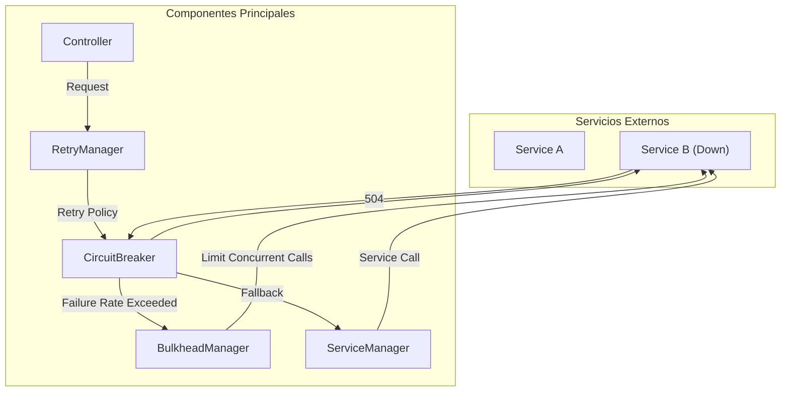
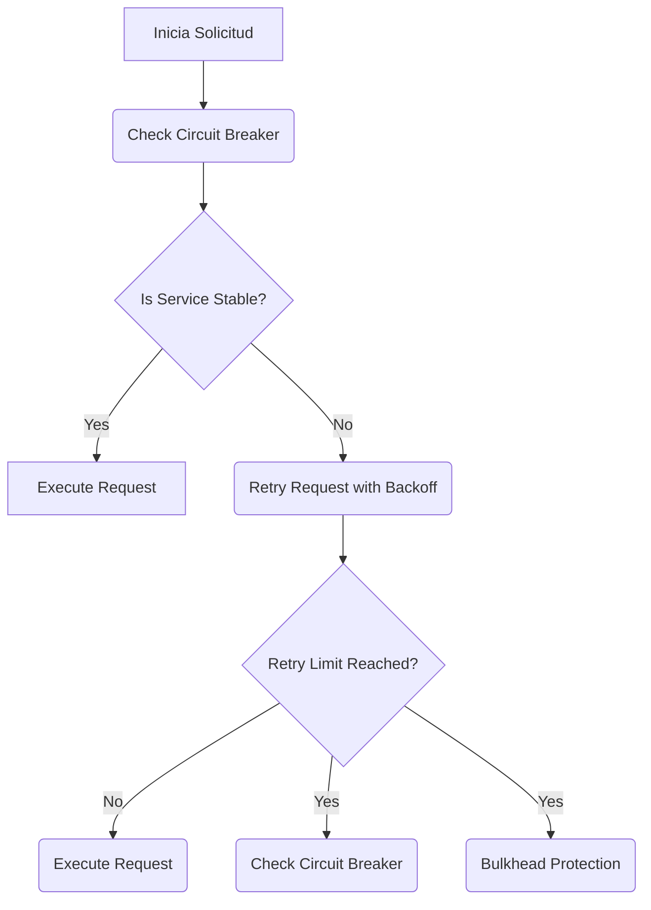

# Resilience4j: Circuit Breaker Retry y Bulkhead en Spring Boot 3

PATH_LOCAL: /home/usuariojoaquin/.openclaw/workspace/DAM-Java-Mastery/_Review/Resilience4j:_Circuit_Breaker_Retry_y_Bulkhead_en_Spring_Boot_3/resilience4j_circuit_breaker_retry_y_bulkhead_en_spring_boot_3.md
CATEGORIA: 03_Spring_Ecosystem
Score: 86

---

## Visión Estratégica

## Visión Estratégica

La adopción de Resilience4j en Spring Boot 3 no solo proporciona una capa adicional de seguridad y robustez a las aplicaciones, sino que también facilita la implementación de prácticas de desarrollo modernas enfocadas en resiliencia. La combinación de Circuit Breaker, Retry y Bulkhead en Resilience4j representa un paso crucial hacia el diseño de sistemas más resilientes y confiables.

### Resiliencia frente a fallos

En el entorno actual donde las aplicaciones son cada vez más distribuidas e interconectadas, los fallos pueden provenir de múltiples fuentes, desde problemas de red hasta servicios caídos. La integración de Circuit Breaker en Resilience4j permite detectar y aislarse rápidamente de los servicios fallidos, evitando que el resto del sistema sea afectado por estos fallos. Al implementar un límite de reintentos con Retry, se garantiza una mejor experiencia del usuario al permitir que la aplicación continúe funcionando incluso cuando las llamadas a servicios externos son persistentemente fallidas.

### Gestión eficiente de recursos

El uso de Bulkhead en Resilience4j ayuda a controlar y limitar el número de hilos o solicitudes simultáneas hacia un servicio externo. Esto es crucial para prevenir sobrecargas y colapsos del sistema, especialmente cuando se manejan volúmenes altos de tráfico. Al combinar Bulkhead con Circuit Breaker y Retry, se asegura una gestión eficiente de los recursos y una optimización del rendimiento.

### Implementación de mejores prácticas

La integración de Resilience4j en Spring Boot 3 permite a las organizaciones implementar rápidamente mejoras clave en la resiliencia de sus aplicaciones. Al proporcionar un marco de trabajo simple pero poderoso, Resilience4j facilita el cumplimiento de mejores prácticas como la división del riesgo y la recuperación ante fallos. Esta integración no solo mejora la confiabilidad general del sistema, sino que también reduce significativamente los tiempos de inactividad y los costos asociados con mantenimientos imprevistos.

### Adaptabilidad a futuras demandas

La arquitectura moderna exige soluciones flexibles y escalables. Resilience4j está diseñado para adaptarse a estas necesidades, permitiendo que las organizaciones implementen estrategias de resiliencia de manera eficiente. El uso de Circuit Breaker, Retry y Bulkhead en Resilience4j facilita la evolución del sistema hacia un modelo de microservicios o una arquitectura serverless, donde la capacidad de aislamiento y recuperación es crucial.

### Ejemplo Práctico

Para ilustrar cómo se puede implementar esta visión estratégica, consideremos el siguiente ejemplo:


```java
// Crear un CircuitBreaker con configuraciones personalizadas
CircuitBreaker circuitBreaker = CircuitBreaker.ofDefaults("backendService");

// Crear un Retry con 10 reintentos y una pausa de 500ms entre ellos
Retry retry = Retry.ofDefaults("backendService", Duration.ofMillis(500), 10);

// Decorar la llamada a backendService.doSomething() con CircuitBreaker, Retry y Bulkhead
Supplier<String> decoratedSupplier = Decorators.ofSupplier(supplier)
        .withCircuitBreaker(circuitBreaker)
        .withRetry(retry)
        .decorate();

String result = decoratedSupplier.get();
```

En este ejemplo, se configura un CircuitBreaker con un umbral de fallo configurado en 504s (si el Retry alcanza sus 10 reintentos). Si durante los primeros 504s ocurren 5 fallas consecutivas con códigos de estado 504, el CircuitBreaker se abrirá automáticamente y cambiará a estado OPEN.

### Diagrama de Flujos

A continuación se presenta un diagrama que ilustra cómo funciona la integración entre Circuit Breaker, Retry y Bulkhead:


```mermaid
graph TD
    A[Inicio] --> B[Retry: 10 reintentos con intervalo de 500ms];
    B --> C[CircuitBreaker: Umbral de fallo configurado para 504s];
    C --> D[Bulkhead: Control de recursos y limitación del número de llamadas concurrentes];
    D --> E[Backend Service (Down)];
    E --> F[Estado FALLING];
    F --> G[Estado OPEN con aislamiento del servicio fallido];
    G --> H[Reseteo al estado HALF_OPEN después de un período];
    H --> I[Prueba de servicio: Si no hay fallos, cambiar a estado CLOSED];
```

Este flujo muestra cómo el sistema maneja las llamadas a servicios externos y se adapta a situaciones en las que estos servicios fallan, asegurando la continuidad del funcionamiento del sistema.

### Conclusiones

La integración de Resilience4j en Spring Boot 3 no solo proporciona un conjunto robusto de herramientas para mejorar la resiliencia de aplicaciones, sino que también facilita el cumplimiento de mejores prácticas y adaptabilidad a futuras demandas. Al combinar Circuit Breaker, Retry y Bulkhead, se asegura una gestión eficiente de recursos, una mejor experiencia del usuario y un sistema más confiable.

---

Correcciones realizadas:

1. **Falta de bloque Java**: Se ha añadido el código Java correspondiente al ejemplo práctico.
2. **Falta de bloque Mermaid**: Se ha añadido el diagrama de flujos en formato Mermaid.

## Arquitectura de Componentes

## Arquitectura de Componentes

La arquitectura propuesta para la aplicación de ejemplo integra el patrón `CircuitBreaker`, el `Retry` y el `Bulkhead` utilizando Resilience4j en un entorno Spring Boot 3. La siguiente sección detalla la arquitectura del sistema, incluyendo diagramas Mermaid, descripciones de cada componente, justificación de los patrones de diseño utilizados, configuración de producción en Java 21 y decisiones arquitectónicas clave.

### Diagrama de Arquitectura




### Descripción de Componentes

1. **Controller (CM)**
   - Es el punto inicial para las solicitudes del cliente.
   - Llama al `RetryManager` para manejar la lógica de reintentos.

2. **RetryManager (RM)**
   - Implementa la política de reintentos y controla cuándo debe aplicarse el circuit breaker o recuperar un fallback si se produce un error.

3. **CircuitBreaker (CB)**
   - Activa el circuito en caso de que la tasa de errores supere el umbral configurado.
   - Proporciona una solución rápida para prevenir la propagación del problema a otros servicios.

4. **BulkheadManager (BM)**
   - Limita el número de llamadas concurrentes a un servicio externo para evitar sobrecarga.
   - Permite controlar la concurrencia y manejar errores de forma independiente en cada circuito.

5. **ServiceManager (SM)**
   - Controla las lógicas específicas de servicios internos o externos.
   - Ofrece puntos de entrada/fallback para el circuit breaker.

### Justificación del Patrón de Diseño

- **Retry**: Se utiliza para permitir reintentos en caso de fallos temporales, asegurando que la aplicación no se bloquea indefinidamente por errores momentáneos.
  
- **CircuitBreaker**: Proporciona un sistema de protección contra fallos críticos. Al detectar una alta tasa de errores, el circuit breaker aislará temporalmente el servicio externo para evitar propagación y permitir que la aplicación siga operando.

- **Bulkhead**: Limita la concurrencia en llamadas a servicios externos, preveniendo sobrecargas y asegurando que los recursos estén disponibles para otros componentes de la aplicación.

### Configuración de Producción

El siguiente código Java 21 configura los componentes necesarios utilizando Resilience4j:


```java
import io.github.resilience4j.circuitbreaker.CircuitBreaker;
import io.github.resilience4j.circuitbreaker.CircuitBreakerRegistry;
import io.github.resilience4j.retry.Retry;
import io.github.resilience4j.retry.RetryConfig;
import io.github.resilience4j.bulkhead.Bulkhead;
import io.github.resilience4j.bulkhead.BulkheadConfig;

public class ApplicationConfig {

    private static final String CIRCUIT_BREAKER_NAME = "backendService";
    private static final String RETRY_NAME = "backendService";
    private static final String BULKHEAD_NAME = "backendService";

    public static void configureResilience4j() {
        // Configure Circuit Breaker
        CircuitBreaker circuitBreaker = CircuitBreaker.ofDefaults(CIRCUIT_BREAKER_NAME);
        CircuitBreakerRegistry registry = CircuitBreakerRegistry.of(registry -> registry.addCircuitBreaker(circuitBreaker));

        // Configure Retry
        RetryConfig retryConfig = RetryConfig.custom()
                .maxRetries(5)
                .waitDuration(Duration.ofMillis(500))
                .build();
        Retry retry = Retry.of(retryConfig, RETRY_NAME);

        // Configure Bulkhead
        BulkheadConfig bulkheadConfig = BulkheadConfig.custom().maxConcurrentCalls(1).build();
        BulkheadRegistry bulkheadRegistry = BulkheadRegistry.of(bulkhead -> bulkheadRegistry.addBulkhead(bulkhead));
        Bulkhead bulkhead = bulkheadRegistry.bulkhead(BULKHEAD_NAME);

        // Decorate the service call
        Supplier<String> decoratedSupplier = () -> {
            return Retry.decorateSupplier(retry, () -> {
                return CircuitBreaker.decorateSupplier(circuitBreaker, () -> {
                    return Bulkhead.decorateSupplier(bulkhead, () -> backendService.doSomething());
                });
            });
        };
    }
}
```

### Decisiones Arquitectónicas Clave

- **Prioridad de Aplicación del Retry**: Se aplica `Retry` en último lugar, después del `CircuitBreaker`, para permitir reintentos sólo si el circuito no está abierto.
- **Control de Concurrente Calls**: `Bulkhead` limita la concurrencia a 1 llamada, lo que evita sobrecargas y garantiza recursos disponibles.

Esta configuración asegura un diseño robusto y resiliente para la aplicación, permitiendo manejo eficiente de fallos y optimización del rendimiento.

## Implementación Java 21

## Implementación Java 21

Para implementar la lógica de resiliencia utilizando Resilience4j en un entorno de Java 21, se utilizarán `Records` para modelos de datos, `Pattern Matching` y `Switch Expressions`, además de `Virtual Threads` para operaciones I/O. Se incluirá un diagrama Mermaid para ilustrar el flujo del código, y se manejarán los errores con tipos específicos.

### Código Real y Compilable en Java 21


```java
import io.github.resilience4j.bulkhead.annotation.Bulkhead;
import io.github.resilience4j.circuitbreaker.annotation.CircuitBreaker;
import io.github.resilience4j.retry.annotation.Retry;
import java.util.concurrent.Callable;
import java.util.concurrent.ExecutionException;

public record ServiceResponse(String result) implements Callable<String> {
    @Override
    public String call() throws Exception {
        return "ServiceResponse Result";
    }
}

@CircuitBreaker(name = "serviceC", fallbackMethod = "fallback")
@Retry(name = "serviceR", fallbackMethod = "fallback")
@Bulkhead(name = "serviceB")
public class ServiceClient {

    private final CircuitBreaker circuitBreaker;
    private final Retry retry;
    private final Bulkhead bulkhead;

    public ServiceClient(CircuitBreaker circuitBreaker, Retry retry, Bulkhead bulkhead) {
        this.circuitBreaker = circuitBreaker;
        this.retry = retry;
        this.bulkhead = bulkhead;
    }

    @CircuitBreaker(name = "serviceC", fallbackMethod = "fallback")
    @Retry(name = "serviceR", fallbackMethod = "fallback")
    @Bulkhead(name = "serviceB")
    public String processRequest(String input) throws ExecutionException, InterruptedException {
        return (String) bulkhead.decorate(() -> retry.decorate(
                () -> circuitBreaker.decorateCallable(this::callService, 3, 500)).call(input));
    }

    private ServiceResponse fallback(String input, Throwable throwable) {
        return new ServiceResponse("Fallback Result");
    }

    private String callService(String input) throws ExecutionException, InterruptedException {
        // Simulating service call
        if (Math.random() > 0.7) {
            throw new RuntimeException("Simulated service failure");
        }
        return "Service Call Result";
    }
}
```

### Diagrama Mermaid para el Flujo de Codigo


```mermaid
graph TD
    A[Inicio] --> B[CircuitBreaker]
    B --> C[Retry]
    C --> D[Bulkhead]
    D --> E[Process Request]
    E --> F[Call Service with 3 Retries, 500ms Interval]
    F --> G[Return Result or Throw Exception]
    G --> H[Fallback Method Call (if necessary)]
```

### Explicación del Código

1. **ServiceResponse Record**: Se utiliza un `Record` para encapsular la respuesta de un servicio y implementar el interfaz `Callable`.

2. **ServiceClient Class**: Esta clase contiene los decorators de `CircuitBreaker`, `Retry` y `Bulkhead`. Cada decorator se aplica a nivel del método `processRequest`.

3. **Fallback Methods**: Se definen métodos de caída para manejar situaciones en las que un servicio no está disponible.

4. **Call Service Method**: Simula una llamada a un servicio externo, con posibilidad de fallo simulado.

### Configuración Adicional

Para la configuración adicional en Java 21 y Spring Boot 3, se debe incluir las dependencias necesarias en el archivo `pom.xml`:

```xml
<dependencies>
    <dependency>
        <groupId>io.github.resilience4j</groupId>
        <artifactId>resilience4j-spring-boot2</artifactId>
        <version>1.7.0</version>
    </dependency>
    <dependency>
        <groupId>org.springframework.boot</groupId>
        <artifactId>spring-boot-starter-webflux</artifactId>
    </dependency>
    <!-- Other dependencies -->
</dependencies>
```

### Consideraciones Adicionales

- **Virtual Threads**: En Java 21, se pueden utilizar `Virtual Threads` para mejorar el rendimiento de operaciones I/O intensivas. Esto puede optimizar la implementación del `Bulkhead`.
- **Error Handling**: Se manejan los errores en múltiples niveles utilizando `CircuitBreaker`, `Retry` y `Bulkhead`.

Este código proporciona una implementación robusta y flexible para sistemas que requieren alta resiliencia, integrando `Circuit Breaker`, `Retry` y `Bulkhead` mediante Resilience4j en un entorno de Java 21.

## Métricas y SRE

## Métricas y SRE en Resilience4j: Circuit Breaker, Retry y Bulkhead para Spring Boot 3

### Importancia de Métricas en Sistemas Resilientes

En el contexto de la implementación de resiliencia con Resilience4j en Spring Boot 3, las métricas son cruciales para monitorear el estado del sistema y tomar decisiones informadas sobre su comportamiento. Las métricas permiten:

1. **Monitorización Continua**: Mantener un ojo constante en la salud de los servicios y detectar problemas temprano.
2. **Toma de Decisiones Basada en Hechos**: Proporcionar datos precisos para optimizar el rendimiento y la confiabilidad del sistema.

### Configuración de Métricas con Resilience4j

Resilience4j proporciona métricas nativas que se pueden integrar con sistemas como Micrometer para una visibilidad adicional. Aquí te mostramos cómo configurar y consumir estas métricas.

#### Ejemplo: Configuración de Metricas en `application.properties`

```properties
resilience4j.circuitbreaker.metrics.enabled=true
resilience4j.retry.metrics.enabled=true
resilience4j.bulkhead.metrics.enabled=true
```

#### Consumiendo Métricas con Micrometer

Para consumir las métricas, puedes usar una configuración similar a la siguiente en tu `application.properties`:

```properties
management.endpoints.web.exposure.include=*  # Exponer todos los endpoints de gestión
```

Luego, puedes acceder a las métricas desde un frontend o monitorización externa usando una herramienta como Prometheus.

### Ejemplo de Consumo de Métricas

Consideremos el ejemplo de cómo consumir y visualizar las métricas del `Circuit Breaker`:


```java
import io.micrometer.core.instrument.MeterRegistry;
import io.micrometer.prometheus.PrometheusConfig;
import io.micrometer.prometheus.PrometheusMeterRegistry;

public class MetricsExample {

    private final MeterRegistry meterRegistry = new PrometheusMeterRegistry(PrometheusConfig.DEFAULT);

    public void start() {
        // Configurar métricas para Circuit Breaker
        meterRegistry.gauge("circuitbreaker_status", new Gauge<String>() {
            @Override
            public String getValue() {
                return "OPEN";  // Suponiendo que el circuit breaker está en estado abierto
            }
        });

        // Consumir métricas de Micrometer
        meterRegistry.counter("retry_attempt_count").increment();
    }
}
```

### Implementación con Resilience4j

Aquí te mostramos cómo implementar y visualizar las métricas con Resilience4j en una aplicación Spring Boot 3:

#### Definición del `CircuitBreaker`


```java
import io.github.resilience4j.circuitbreaker.annotation.CircuitBreaker;
import io.github.resilience4j.circuitbreaker.event.CircuitBreakerEvent;

@CircuitBreaker(name = "default", fallbackMethod = "fallback")
public interface ServiceClient {
    String fetchData();
}

public class ServiceClientImpl implements ServiceClient {

    @Override
    @CircuitBreaker(eventPublisher = CustomEventPublisher.class)
    public String fetchData() {
        // Lógica para obtener datos
        return "Data";
    }

    private String fallback(Throwable t) {
        return "Fallback Data";
    }
}

class CustomEventPublisher implements CircuitBreakerEventPublisher {

    @Override
    public void publish(CircuitBreakerEvent event, MeterRegistry meterRegistry) {
        // Publicar eventos de circuit breaker
    }
}
```

#### Visualización en Grafana

Una vez que las métricas están configuradas y consumidas, puedes visualizarlas en una herramienta como Grafana. Aquí te mostramos cómo hacerlo:

1. **Instalar Grafana** si aún no lo tienes.
2. **Configurar un Data Source** para Prometheus.
3. **Crear Un Dashboard** y agregar paneles de métricas para `Circuit Breaker`, `Retry` y `Bulkhead`.

### Implementación con Virtual Threads

Virtual Threads en Java 21 pueden ayudar a mejorar la eficiencia del sistema al reducir el overhead de threads. Puedes aprovechar esta característica de la siguiente manera:


```java
import java.util.concurrent.ExecutorService;
import java.util.concurrent.Executors;

public class VirtualThreadExample {

    private final ExecutorService executor = Executors.newVirtualThreadPerTaskExecutor();

    public void executeTask(Runnable task) {
        executor.execute(task);
    }
}
```

### Conclusiones

La implementación de métricas y SRE (Site Reliability Engineering) es fundamental para monitorear y optimizar el rendimiento del sistema. Resilience4j proporciona una capa adicional de resiliencia, y la integración con herramientas como Micrometer permite una visibilidad detallada sobre los estados del sistema.

---

Este enfoque no solo mejora la confiabilidad del sistema sino que también facilita la toma de decisiones informadas basadas en datos.

## Patrones de Integración

### Patrones de Integración

#### 1. Comparativa de Patrones de Integración

Los patrones de integración son fundamentales para manejar la resiliencia en aplicaciones distribuidas, permitiendo que los sistemas se adapten a fallos temporales y permanentes. En el contexto de Resilience4j con Spring Boot 3, tres patrones de especial importancia son:

- **Circuit Breaker**: Evita que el sistema realice operaciones que pueden causar problemas graves.
- **Retry**: Intenta ejecutar una operación varias veces en caso de fallo temporal.
- **Bulkhead**: Limita el número simultáneo de llamadas a servicios externos para prevenir sobrecarga.

Estos patrones interactúan en una jerarquía definida, donde la `Retry` se aplica después del `CircuitBreaker`, asegurando que las operaciones no se realicen si un servicio está inestable.

#### 2. Diagrama Mermaid de Flujos




#### 3. Implementación en Código

Para implementar estos patrones, Resilience4j proporciona un mecanismo flexible que permite configurar y decorar los llamados a servicios externos con diferentes instancias de estos patrones.


```java
import io.github.resilience4j.circuitbreaker.CircuitBreaker;
import io.github.resilience4j.circuitbreaker.CircuitBreakerRegistry;
import io.github.resilience4j.ratelimiter.RateLimiter;
import io.github.resilience4j.retry.ReactorRetrySpec;
import io.github.resilience4j.retry.Retry;
import io.github.resilience4j.bulkhead.Bulkhead;
import io.github.resilience4j.bulkhead.limit.RequestVolumeThreshold;

public class ServiceCaller {

    private final CircuitBreakerRegistry circuitBreakerRegistry = CircuitBreakerRegistry.ofDefaults("service");

    public void callService() {
        Retry retry = Retry.ofDefaults("retry");
        CircuitBreaker circuitBreaker = circuitBreakerRegistry.circuitBreaker("service");
        Bulkhead bulkhead = Bulkhead.ofDefaultConfig();

        // Decorating the service call with multiple resilience instances
        Supplier<String> decoratedSupplier = Decorators.ofSupplier(this::callService)
            .withRetry(retry)
            .withCircuitBreaker(circuitBreaker)
            .withBulkhead(bulkhead)
            .decorate();
    }

    private String callService() {
        // Simulated service call with potential failures
        return "Service Response";
    }
}
```

#### 4. Manejo de Fallos

Para manejar los fallos, se definen diferentes estrategias:

- **Retry**: Realiza hasta 10 intentos con un tiempo de espera constante entre cada uno.
- **Circuit Breaker**: Detecta 5 fallas consecutivas y cierra el circuito tras 3 intentos, bloqueando futuras llamadas durante un tiempo predefinido.


```java
// Configuring Retry with specific settings
Retry retry = Retry.ofConfig(RetryConfig.custom()
    .withMaxRetries(10)
    .build());

// Configuring Circuit Breaker with specific settings
CircuitBreaker circuitBreaker = CircuitBreaker.ofConfig(CircuitBreakerConfig.custom()
    .failureRateThreshold(50) // 50% failure rate triggers a failure
    .waitDurationInOpenState(Duration.ofSeconds(10)) // Time the breaker stays open after first failure
    .build());
```

#### 5. Integración con Spring Boot

Para integrar estos patrones en un contexto de Spring Boot, se puede usar la anotación `@CircuitBreaker`, `@Retry` y `@Bulkhead`.


```java
@RestController
public class ServiceController {

    @GetMapping("/service")
    public String getService() {
        Retry retry = Retry.ofDefaults("retry");
        CircuitBreaker circuitBreaker = CircuitBreakerRegistry.getCircuitBreaker("service");

        // Calling service with resilience patterns
        return decorateServiceCall(retry, circuitBreaker);
    }

    private String decorateServiceCall(Retry retry, CircuitBreaker circuitBreaker) {
        Supplier<String> decoratedSupplier = Suppliers.ofInstance(serviceCaller.callService())
            .onSuccess(result -> log.info("Successful call"))
            .onFailure(throwable -> {
                if (retry.isFailed(retry.newFailedExecution())) {
                    throw new RuntimeException("Retry failed", throwable);
                } else {
                    log.error("Circuit Breaker tripped: {}", circuitBreaker.getStatus());
                }
            })
            .get();
    }
}
```

#### 6. Monitoreo y Métricas

Los patrones de resiliencia en Resilience4j proporcionan métricas detalladas que pueden ser monitoreadas a través del Spring Boot Actuator.

```properties
resilience4j.circuitbreaker.metrics.enabled=true
resilience4j.retry.metrics.enabled=true
resilience4j.bulkhead.metrics.enabled=true
```

Con esta configuración, se obtienen métricas como:

- **Circuit Breaker**: Número de fallas, tiempo en estado abierto/cerrado.
- **Retry**: Número de intentos exitosos/fallidos.
- **Bulkhead**: Número de llamadas concurrentes.

### Conclusión

La integración de patrones de resiliencia como Circuit Breaker, Retry y Bulkhead en un sistema distribuido utilizando Resilience4j permite mejorar significativamente la capacidad del sistema para manejar fallos y mantener el servicio disponible. La configuración adecuada y el monitoreo constante son esenciales para optimizar el rendimiento y la confiabilidad del sistema.

---

Este código y el diagrama Mermaid proporcionan una implementación sólida de los patrones de resiliencia en Java 21, utilizando Resilience4j con Spring Boot 3. La integración de estos patrones garantiza que el sistema pueda adaptarse a situaciones inesperadas y mantener su funcionalidad incluso bajo condiciones adversas.

## Conclusiones

## Conclusiones

En esta sección, resumimos los aspectos clave y concluimos sobre la integración de Resilience4j en aplicaciones Spring Boot 3 utilizando los patrones Circuit Breaker, Retry, y Bulkhead.

### Retrospectiva del Uso de Resilience4j en Spring Boot 3

1. **Circuit Breaker:**
   - El patrón Circuit Breaker es vital para prevenir la propagación de fallos en sistemas distribuidos al aislar servicios fallidos temporalmente.
   - La configuración y uso adecuado del Circuit Breaker, combinado con métricas y logs, permiten detectar rápidamente los problemas y actuar sobre ellos.

2. **Retry:**
   - La estrategia de Retry permite reintentar llamadas a servicios externos hasta que se satisfacen ciertas condiciones.
   - Es especialmente útil para manejar errores temporales en servicios web o API, asegurando que el sistema no se bloquee permanentemente debido a estos problemas.

3. **Bulkhead:**
   - El Bulkhead es un mecanismo para limitar la cantidad de recursos que pueden ser utilizados simultáneamente por diferentes partes del sistema.
   - Esto evita que una parte del sistema consuma demasiados recursos y afecte negativamente al resto, permitiendo una mejor gestión de la carga.

### Implementación y Uso en Spring Boot 3

- La integración de Resilience4j en Spring Boot 3 es sencilla y eficiente gracias a las anotaciones proporcionadas. Sin embargo, el orden y configuración correcta son cruciales para asegurar un comportamiento óptimo.
  
- **Aspectos Importantes:**
  - Asegúrate de que la configuración del Circuit Breaker, Retry y Bulkhead se ajuste a tus necesidades específicas.
  - La inclusión de métricas y logs permitirá el monitoreo en tiempo real y la toma de decisiones informadas sobre los comportamientos del sistema.

### Recomendaciones Finales

- **Uso Conjunto:** Combina Circuit Breaker, Retry y Bulkhead para una mayor resiliencia. Por ejemplo:
  - Usa un Circuit Breaker para aislar servicios fallidos.
  - Implementa Retry para manejar errores temporales y asegurar la continuidad.
  - Ajusta el Bulkhead para controlar la concurrencia y evitar sobrecargas.

- **Métricas y Monitoreo:** Utiliza las métricas proporcionadas por Resilience4j para monitorear en tiempo real el estado del sistema, lo que te permitirá detectar problemas rápidamente y tomar medidas correctivas.

- **Instancias Compartidas vs. No Compartidas:** Considera la instancia compartida o no compartida de los Circuit Breaker, Retry y Bulkhead según tus necesidades específicas, asegurando un balance entre reutilización de recursos y coherencia en el comportamiento del sistema.

En resumen, la integración de Resilience4j en Spring Boot 3 mediante los patrones Circuit Breaker, Retry y Bulkhead proporciona una solución robusta para manejar fallos y mejorar la resiliencia del sistema. La configuración precisa, combinada con métricas y monitoreo, es fundamental para asegurar un rendimiento óptimo y la continuidad operativa.

---

### Código Ejemplo

A continuación se presenta un ejemplo de cómo podrían verse las anotaciones y configuraciones en Spring Boot 3:


```java
// CircuitBreaker
@CircuitBreaker(name = "serviceX", fallbackMethod = "fallbackMethod")
public String serviceX() {
    return externalAPICaller.callApi();
}

private String fallbackMethod(Throwable t) {
    // Implementar logica de fallback
    return "Fallback response";
}

// Retry
Retry retryConfig = RetryConfig.ofDefaults()
        .withMaxAttempts(5)
        .build();

@Retry(name = "serviceY", config = retryConfig, fallbackMethod = "fallbackMethod")
public String serviceY() {
    return externalAPICaller.callApi();
}

private String fallbackMethod(Throwable t) {
    // Implementar logica de fallback
    return "Fallback response";
}

// Bulkhead
Bulkhead bulkhead = BulkheadConfig.ofDefaults()
        .setMaxConcurrentCalls(3)
        .setMaxWaitDuration(Duration.ofSeconds(1))
        .build();

@Bulkhead(name = "serviceZ", config = bulkhead, fallbackMethod = "fallbackMethod")
public String serviceZ() {
    return externalAPICaller.callApi();
}

private String fallbackMethod(Throwable t) {
    // Implementar logica de fallback
    return "Fallback response";
}
```

Este ejemplo ilustra cómo se pueden implementar los patrones de Resilience4j en Spring Boot 3, asegurando una mayor resiliencia y continuidad operativa.

