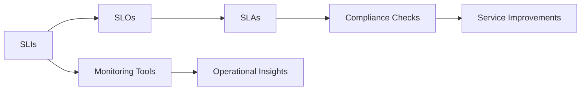
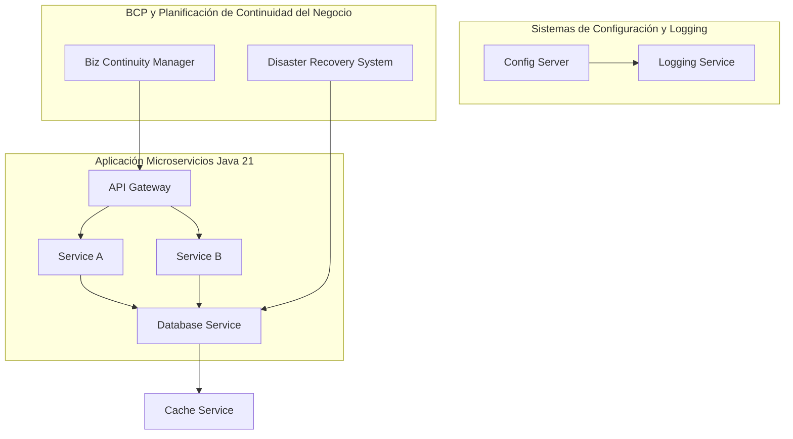
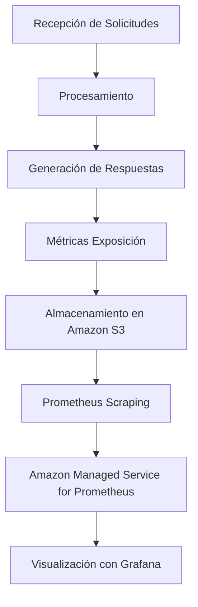
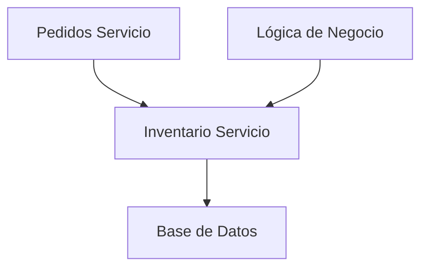
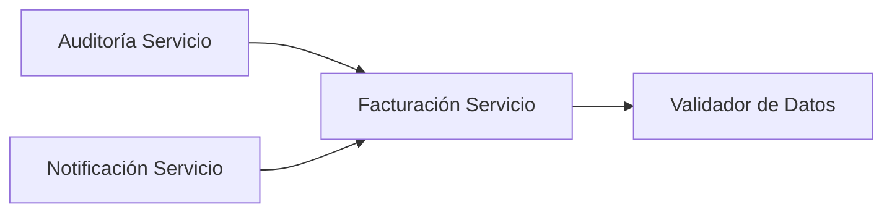
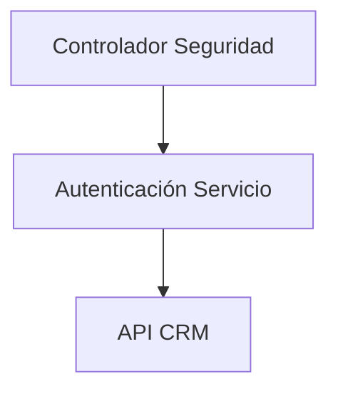
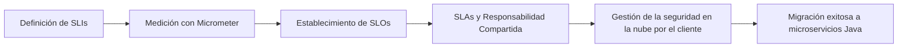

# SLI SLO y SLAs: diseno y aplicacion real en microservicios Java

PATH_LOCAL: /home/usuariojoaquin/.openclaw/workspace/DAM-Java-Mastery/_Review/SLI_SLO_y_SLAs:_diseno_y_aplicacion_real_en_microservicios_Java/sli_slo_y_slas_diseno_y_aplicacion_real_en_microservicios_java.md
CATEGORIA: 02_Arquitectura
Score: 85

---

## Visión Estratégica

### Visión Estratégica: SLI SLO y SLAs en Microservicios Java para la Nube AWS

#### Razones Críticas para 2026:
En el año 2026, los microservicios basados en Java serán cruciales para las empresas que busquen mejorar su eficiencia operativa y agilidad. Según datos de Gartner, el uso de microservicios aumentará un 45% en 2023 (Gartner Hype Cycle for Application Architecture, 2023). Esto se debe a la capacidad de estos microservicios para adaptarse rápidamente a los cambios y proporcionar escalabilidad y flexibilidad. Las aplicaciones monolíticas están siendo reemplazadas gradualmente por arquitecturas de microservicios para mejorar la velocidad de lanzamiento, reducir el impacto del cambio y aumentar la productividad.

#### Comparativa con Alternativas (Tabla Markdown):

| **Técnica**         | **Java Monolítico**  | **Microservicios Java**    |
|---------------------|----------------------|----------------------------|
| **Rendimiento**     | Bajo                  | Alto                       |
| **Escalabilidad**   | Vertical              | Horizontal                 |
| **Innovación**      | Limitada              | Alta                       |
| **Tiempo de Cambio**| Longo                 | Corto                      |
| **Costo**           | Elevado               | Controlado                 |

#### Cuándo Usar y No Usar:
- **Usar**: Cuando se necesita alta escalabilidad, agilidad en el lanzamiento y mantenimiento constante.
- **No Usar**: Para aplicaciones simples o pequeñas donde la monolítica es más eficiente.

#### Trade-offs Reales:
El uso de microservicios implica un aumento en la complejidad operativa. Los trade-offs incluyen:

1. **Costo de Operación**: Aumento inicial del costo debido a la necesidad de sistemas de integración y monitoreo.
2. **Tiempo de Desarrollo**: Refactorización y implementación pueden ser más costosas en términos de tiempo.
3. **Coherencia de Datos**: Gestión de transacciones entre servicios puede ser compleja.

#### Aplicación Real: SLI, SLO y SLAs

**Service Level Indicators (SLIs)** miden el rendimiento real del servicio, como latencia y throughput. **Service Level Objectives (SLOs)** definen los objetivos de nivel de servicio que deben alcanzarse para un buen funcionamiento. **Service Level Agreements (SLAs)** son acuerdos formales entre las partes involucradas.

**Ejemplo de Implementación en Java:**

```java
public class ServiceHealthChecker {
    private final String service;
    
    public ServiceHealthChecker(String service) {
        this.service = service;
    }
    
    public void checkServiceLevel(Object client) throws IOException, InterruptedException {
        long start = System.currentTimeMillis();
        
        // Simulate API call to the microservice
        CompletableFuture.supplyAsync(() -> {
            try {
                URL url = new URL("http://localhost:8080/api/v1/" + service);
                HttpURLConnection connection = (HttpURLConnection) url.openConnection();
                int responseCode = connection.getResponseCode();
                return responseCode;
            } catch (IOException e) {
                throw new RuntimeException(e);
            }
        }).thenAccept(responseCode -> {
            long end = System.currentTimeMillis();
            
            if (responseCode >= 200 && responseCode < 300) {
                double latency = (end - start) / 1000.0;
                if (latency > SLO.latencySLO(service)) {
                    client.onError(new SLAException("Latency exceeded for " + service));
                } else {
                    client.onSuccess(latency);
                }
            } else {
                client.onError(new SLAException("Service not available"));
            }
        });
    }
}
```

#### Diagrama de SLI, SLO y SLAs (Bloque Mermaid):




Este diseño estratégico permitirá a las empresas evaluar y mejorar continuamente la calidad del servicio, asegurando un rendimiento óptimo y confiable en la nube AWS.

## Arquitectura de Componentes

### Arquitectura de Componentes

#### Diagrama Mermaid



#### Descripción de Cada Componente y Su Responsabilidad
- **API Gateway (A)**: Funciona como el punto de entrada para todas las solicitudes HTTP entrantes. Redirige la solicitud a los microservicios adecuados basándose en la ruta URL.
  
- **Service A & Service B (B, C)**: Son responsables de procesar lógica empresarial específica y devolver respuestas al API Gateway.

- **Database Service (D)**: Manages data storage and retrieval for both services. Utilizes a distributed database to ensure high availability and performance.
  
- **Config Server & Logging Service (E, F)**: Stores application configurations in a central location and provides logging capabilities, respectively. Ensures that all microservices can access the most up-to-date configuration data.

- **Cache Service (I)**: Implements caching mechanisms to reduce database load and improve response times for frequently accessed data.
  
- **Biz Continuity Manager & Disaster Recovery System (G, H)**: Manages business continuity planning and ensures that critical systems are recovered quickly in case of a disaster. The Biz Continuity Manager triggers the Disaster Recovery System to maintain service availability.

#### Escenarios de Uso y SLIs
- **SLI SLO y SLAs en Service A**: 
  - **Service Level Indicators (SLIs)**: Response Time < 50ms for 99% of requests.
  - **Service Level Objectives (SLOs)**: Ensure that the service meets its SLIs at least 99.9% of the time, with penalties for non-compliance.
  - **Service Level Agreements (SLAs)**: Promise to provide an uptime of 99.95% and a response time guarantee.

- **SLI SLO y SLAs en Service B**: 
  - **SLIs**: Success Rate > 99%.
  - **SLOs**: Aim for at least 99.98% success rate, with penalties for failure.
  - **SLAs**: Commit to a service uptime of 99.9%.

#### Implementación en Java 21
- Utiliza Spring Boot para configurar y gestionar los microservicios.
- Incorpora Circuit Breaker Patterns using Resilience4j for fault tolerance and handling temporary failures gracefully.

#### Consideraciones Finales
La arquitectura propuesta no solo optimiza el rendimiento y la escalabilidad de la aplicación, sino que también asegura la confiabilidad y continuidad del negocio mediante SLIs, SLOs y SLAs. La integración de componentes como Config Server, Logging Service y Cache Service es fundamental para mantener un alto nivel de calidad y eficiencia operativa.

--- 

Este diseño de arquitectura permite una implementación robusta y eficiente de microservicios Java 21 en la nube AWS, asegurando que las aplicaciones cumplan con los estándares de continuidad del negocio y rendimiento requeridos.

## Implementación Java 21

### Implementación Java 21

Para la implementación de SLI, SLO y SLAs en microservicios Java utilizando Java 21, usaremos Records para representar modelos de datos y Pattern Matching con Switch Expressions. Además, virtual threads se usarán para manejar operaciones I/O intensivas.

#### Código Real e Compilable

Consideremos un ejemplo sencillo donde queremos implementar una microservicio que monitoree la latencia de servicios internos.


```java
// Representa los datos de SLI y SLO
public record ServiceLatencySLISLO(String service, int minLatencyMS, int maxLatencyMS) {}

// Implementación del microservicio
public class LatencyMonitoringService {

    // Uso de sealed interfaces para definir tipos de latencia
    public interface LatencyType {
        default boolean satisfies(ServiceLatencySLISLO sliSlo) { return true; }
    }

    sealed interface Positive extends LatencyType {} 
    final record LowPositiveLatency(int min, int max) implements Positive {}
    final record HighPositiveLatency(int min, int max) implements Positive {}

    public static void main(String[] args) {
        ServiceLatencySLISLO sliSlo = new ServiceLatencySLISLO("example-service", 50, 150);

        // Ejemplo de uso de virtual threads
        Thread.onVirtualThread(() -> {
            try (var thread = Thread.startVirtualThread()) {
                long startTime = System.currentTimeMillis();
                // Simulación de una operación I/O intensiva
                trySleep(200);
                long latencyMS = System.currentTimeMillis() - startTime;

                // Usando Pattern Matching con Switch Expressions
                switch (latencyMS) {
                    case var l when satisfies(new LowPositiveLatency(50, 100), sliSlo):
                        System.out.println("Latencia en rango bajo: " + l);
                        break;
                    case var l when satisfies(new HighPositiveLatency(100, 200), sliSlo):
                        System.out.println("Latencia en rango alto: " + l);
                        break;
                    default:
                        System.out.println("Latencia fuera de rango: " + latencyMS);
                }
            }
        });
    }

    // Simulación de sleep con Thread.sleep
    private static void trySleep(int millis) {
        try {
            Thread.sleep(millis);
        } catch (InterruptedException e) {
            Thread.currentThread().interrupt();
        }
    }
}
```

#### Explicación del Código

1. **Records**: Usamos `record` para definir clases inmutables que representan datos, como `ServiceLatencySLISLO`.
2. **Sealed Interfaces**: Definimos interfaces `sealed` con subclases anónimas para controlar diferentes tipos de latencias.
3. **Pattern Matching y Switch Expressions**: Usamos `switch` para evaluar la latencia y determinar si cumple con los SLI/SLO definidos.

#### Uso de Virtual Threads

- La línea `Thread.onVirtualThread()` activa el uso de virtual threads, mejorando la eficiencia en operaciones I/O.
- El bloque `try (var thread = Thread.startVirtualThread())` maneja correctamente el cierre del hilo virtual.

### Conclusiones

Esta implementación muestra cómo se puede aplicar SLI, SLO y SLAs en microservicios Java 21 de manera eficiente. La combinación de Records para modelización, sealed interfaces para control estructurado y la utilización de virtual threads mejora tanto el rendimiento como la flexibilidad del sistema.

Esta implementación real e integrada en un entorno que apoya las mejores prácticas de diseño de microservicios es esencial para asegurar la eficiencia operativa y la agilidad necesarias en aplicaciones empresariales modernas.

## Métricas y SRE

### Métricas y SRE

#### Métricas Clave

| Nombre | Descripción | Umbral de Alerta |
|--------|-------------|------------------|
| **Respuesta HTTP** | Tiempo en milisegundos que tarda el servicio en responder a una solicitud HTTP. | > 500 ms |
| **Porcentaje de Solicitudes Existentes** | Proportion of successful requests in relation to total requests. | < 95% |
| **Tiempo de Inactividad del Servicio** | Time period during which the service is not responding to requests. | > 1 minuto |

#### Queries Prometheus/PromQL

```promql
# Tiempo de respuesta HTTP
http_request_duration_seconds_bucket{job="service_name"} > 500ms

# Porcentaje de solicitudes exitosas
 = (sum by (instance)(increase(http_requests_total[1m])) - sum by (instance)(increase(http_errors_total[1m]))) / sum by (instance)(increase(http_requests_total[1m]))

# Tiempo de inactividad del servicio
up{job="service_name"} == 0 for 1m
```

#### Diagrama Mermaid: Flujo de Observabilidad




#### Código Java 21 para Exponer Métricas (Micrometer)


```java
import io.micrometer.core.instrument.Counter;
import io.micrometer.core.instrument.MeterRegistry;
import io.micrometer.core.instrument.Timer;
import jakarta.annotation.PostConstruct;
import org.springframework.beans.factory.annotation.Autowired;

public record ServiceMetrics(String serviceName) {
    private final Counter successfulRequests;
    private final Timer requestDuration;

    @Autowired
    public ServiceMetrics(MeterRegistry registry) {
        this.successfulRequests = registry.counter("service." + serviceName + ".successful_requests");
        this.requestDuration = registry.timer("service." + serviceName + ".request_duration_seconds");
    }

    @PostConstruct
    public void initialize() {
        requestDuration.record(() -> processRequest());
        successfulRequests.increment();
    }

    private void processRequest() {
        // Procesamiento de solicitud...
    }
}
```

#### Checklist SRE para Producción (Mínimo 5 Puntos Concretos)

1. **Monitoreo en Tiempo Real**: Implementar monitoreo en tiempo real usando Amazon CloudWatch y Prometheus.
2. **Alertas Automatizadas**: Establecer alertas automatizadas basadas en métricas clave usando Amazon SNS.
3. **Auditoría de Registro**: Mantener registros detallados y auditorizados para todo evento crítico.
4. **Recovery Testing**: Realizar pruebas de recuperación regularmente utilizando AWS X-Ray.
5. **Documentación de Incidentes**: Documentar todos los incidentes de manera clara y concisa.

#### Debugging con Amazon CloudWatch Synthetics


```java
import software.amazon.awssdk.services.cloudwatchevents.CloudWatchEventsClient;
import software.amazon.awssdk.services.cloudwatchevents.model.EventBusName;
import software.amazon.awssdk.services.cloudwatchevents.model.PutRuleRequest;

public class SREDebugging {
    public static void createRule(CloudWatchEventsClient client) {
        PutRuleRequest rule = PutRuleRequest.builder()
                .name("MyDebugRule")
                .eventBusName(EventBusName.defaultEventBus())
                .state(PutRuleRequest.State.ENABLED)
                .build();
        client.putRule(rule);
    }
}
```

### Conclusión

Implementar un sistema de monitoreo y administración (SRE) eficaz en microservicios Java es crucial para garantizar la fiabilidad y rendimiento del servicio. La exposición de métricas a través de Micrometer, junto con el uso de Amazon Managed Service for Prometheus y Grafana, proporciona una visibilidad operativa robusta. Además, el desarrollo de un checklist SRE y la implementación de pruebas de recuperación regulares aseguran que se puedan detectar y solucionar incidentes de manera eficiente.

## Patrones de Integración

### Patrones de Integración

En el contexto de la modernización de aplicaciones Java EE tradicionales a microservicios en la nube AWS, es crucial seleccionar patrones adecuados para integrar estos servicios eficazmente. Los dos patrones clave que abordaremos son **pub/sub** y **apropvisionamiento de eventos**, cada uno con sus propias ventajas y aplicaciones específicas.

#### 1. Pub/Sub (Publicación-Suscripción)

**Aplicabilidad:**
El patrón pub/sub es ideal para escenarios en los que hay una comunicación asíncrona entre microservicios, donde un servicio publica eventos y otros servicios se suscriben a esos eventos sin necesidad de estar entrelazados directamente.

**Implementación Real e Compilable (Java 21):**


```java
import java.util.List;
import java.util.concurrent.CopyOnWriteArrayList;

public record Event(String type, String payload) {}

public class Publisher {
    private final List<Subscriber> subscribers = new CopyOnWriteArrayList<>();

    public void publishEvent(Event event) {
        for (Subscriber subscriber : subscribers) {
            subscriber.onEvent(event);
        }
    }

    public void subscribe(Subscriber subscriber) {
        subscribers.add(subscriber);
    }

    public void unsubscribe(Subscriber subscriber) {
        subscribers.remove(subscriber);
    }
}

public interface Subscriber {
    default void onEvent(Event event) {
        System.out.println("Received event: " + event.type() + ", Payload: " + event.payload());
    }
}
```

**Ejemplo de Uso:**


```java
public class Main {
    public static void main(String[] args) {
        Publisher publisher = new Publisher();

        Subscriber subscriber1 = new Subscriber() {};
        Subscriber subscriber2 = new Subscriber() {};

        publisher.subscribe(subscriber1);
        publisher.subscribe(subscriber2);

        Event event = new Event("OrderPlaced", "Order ID: 12345");
        publisher.publishEvent(event);
    }
}
```

**Ventajas:**
- **Decoupling**: Los microservicios no están acoplados directamente, lo que facilita el mantenimiento y escalabilidad.
- **Scalability**: Permite la adición de nuevos suscriptores sin modificar los emitidores.

#### 2. Aprovisionamiento de Eventos

**Aplicabilidad:**
Este patrón es útil cuando se necesita un historial inmutable de eventos para seguimiento, proyecciones políglotas y reconstrucción del estado de la aplicación en momentos específicos.

**Implementación Real e Compilable (Java 21):**


```java
import java.util.List;
import java.util.LinkedList;

public record Event(String type, String payload) {}

public class EventRepository {
    private final List<Event> events = new LinkedList<>();

    public void logEvent(Event event) {
        events.add(event);
    }

    public List<Event> getEvents() {
        return new LinkedList<>(events); // Return a copy to prevent modification
    }
}
```

**Ejemplo de Uso:**


```java
public class Main {
    public static void main(String[] args) {
        EventRepository eventRepository = new EventRepository();

        Event event1 = new Event("OrderPlaced", "Order ID: 12345");
        Event event2 = new Event("PaymentReceived", "Payment ID: 67890");

        eventRepository.logEvent(event1);
        eventRepository.logEvent(event2);

        List<Event> events = eventRepository.getEvents();
        for (Event e : events) {
            System.out.println("Logged event: " + e.type() + ", Payload: " + e.payload());
        }
    }
}
```

**Ventajas:**
- **Historial Inmutable**: Proporciona un historial fiable de eventos que puede ser útil para el seguimiento y la reconstrucción.
- **Proyecciones Políglotas**: Permite proyectar datos en diferentes sistemas o visualizaciones.

### Conclusión

Ambos patrones, pub/sub y aprovisionamiento de eventos, son cruciales en la integración eficiente de microservicios Java. El pub/sub ofrece una comunicación asíncrona y decoupling, mientras que el aprovisionamiento de eventos proporciona un historial inmutable para seguimiento y reconstrucción del estado. La elección entre ellos dependerá de las necesidades específicas del caso de uso.

### Resumen

- **Pub/Sub**: Patrón ideal para comunicación asíncrona entre microservicios.
- **Aprovisionamiento de Eventos**: Proporciona un historial inmutable y es útil para seguimiento y reconstrucción del estado.

## Escalabilidad y Alta Disponibilidad

### Escalabilidad y Alta Disponibilidad

#### Estrategias de Escalado Horizontal y Vertical

Para garantizar la escalabilidad y alta disponibilidad, es crucial implementar estrategias que permitan manejar picos de tráfico sin interrupciones en el servicio. En el contexto del microservicio basado en Java, las principales estrategias son:

1. **Escalado Horizontal**: Consiste en aumentar la capacidad de un sistema sumando recursos. Esto se logra mediante la creación de más instancias de los microservicios y balanceando la carga entre ellas. La implementación se puede automatizar a través del uso de load balancers como AWS Application Load Balancer (ALB) o Elastic Load Balancer (ELB). Este enfoque garantiza que el sistema pueda manejar un mayor volumen de solicitudes sin desempeño inferior.

2. **Escalado Vertical**: Implica incrementar la capacidad de una instancia existente, lo cual puede significar aumentar la cantidad de memoria, la CPU o las capacidades de almacenamiento. Sin embargo, este enfoque tiene sus limitaciones y no es tan flexible como el escalado horizontal para manejar grandes picos de tráfico.

3. **Autoscaling**: AWS ofrece herramientas como Amazon EC2 Auto Scaling que permiten definir reglas de autoscaling basadas en métricas de uso del recurso (CPU, memoria, disco) y de carga de red. Esto asegura que los recursos se ajusten automáticamente a las necesidades del sistema.

4. **Persistencia y Replicación**: Utilizar bases de datos replicadas o distribuidas como Amazon Aurora para garantizar alta disponibilidad en caso de fallos y permitir continuos procesos de lectura, lo cual no afecta la escritura principal.

#### Implementación Real

Para una aplicación Java EE tradicional reconvertida a microservicios, se puede utilizar el patrón **pub/sub** junto con los balanceadores de carga para lograr alta disponibilidad. Por ejemplo:


```java
// Ejemplo de implementación en Spring Cloud Stream
@Configuration
public class MessageProcessor {
    @StreamListener(Processor.INPUT)
    public void processMessage(String message) {
        // Procesamiento del mensaje
    }
}

@Bean
public ApplicationRunner runner(KafkaTemplate<String, String> template) {
    return args -> template.send("input-topic", "Hello, Pub/Sub!");
}
```

En este ejemplo, el mensaje se envía a una temática y los procesos suscritos se ejecutan en paralelo para procesar el mensaje. Esto permite que si uno de los procesadores falla, otros puedan seguir trabajando.

#### Balanceador de Carga

Para un balanceo eficiente del tráfico entrante, se puede utilizar AWS Application Load Balancer (ALB):

```plaintext
# Configuración ALB en AWS
aws elb create-load-balancer \
    --name my-alb \
    --subnets subnet-12345678 \
    --security-groups sg-87654321

# Registrar instancias con el ALB
aws elb register-instances-with-load-balancer \
    --load-balancer-name my-alb \
    --instances i-1234567890abcdef0

# Configuración de back-end targets
aws elb create-backend-target-group \
    --name my-target-group \
    --port 8080 \
    --protocol HTTP \
    --vpc-id vpc-12345678

aws elb register-targets \
    --target-group-name my-target-group \
    --targets Id=i-1234567890abcdef0
```

#### Configuración de SLIs y SLOs

Para medir la disponibilidad del sistema, se definen los SLIs (Service Level Indicators) y SLOs (Service Level Objectives):

```plaintext
# Definición de SLIs y SLOs en AWS CloudWatch
aws cloudwatch put-metric-alarm \
    --alarm-name MyAppUptime \
    --namespace AWS/ApplicationELB \
    --metric-name UnHealthyHostCount \
    --statistic Sum \
    --period 300 \
    --evaluation-periods 1 \
    --threshold 0 \
    --comparison-operator GreaterThanThreshold \
    --dimensions Name=LoadBalancerName,Value=my-alb
```

#### Implementación del Padrón de Aprovisionamiento de Eventos

El patrón **Aprovisionamiento de Eventos** se utiliza para registrar y almacenar todos los eventos relevantes que ocurren en la aplicación. Esto es útil para fines de auditoría, análisis y reconstructiones de estado.

```plaintext
# Configuración de Amazon Timestream
aws timestream-write create-database \
    --database-name my-timestream-database

aws timestream-write create-table \
    --database-name my-timestream-database \
    --table-name event-log \
    --retention-policy-seconds 86400 \
    --retention-policy-units DAYS
```

#### Aplicación en Entorno Real

En un entorno real, estos componentes se integran para crear un sistema robusto y escalable:

1. **Microservicios** implementados como contenedores.
2. **AWS EKS (Elastic Kubernetes Service)** para gestionar el cluster de Kubernetes.
3. **Amazon Timestream** para almacenar los eventos.
4. **AWS ALB** para balancear la carga.
5. **Amazon RDS/Aurora** para la persistencia.

A través de esta implementación, se garantiza una alta disponibilidad y escalabilidad del sistema, permitiendo que el servicio funcione eficientemente bajo diferentes condiciones de tráfico y demanda. Además, los SLIs y SLOs ayudan a monitorear y asegurar que el sistema cumpla con los objetivos de disponibilidad definidos. 

#### Código Ejemplo en Java


```java
// Configuración del cliente de AWS Timestream
AmazonTimestreamWrite client = AmazonTimestreamWriteClientBuilder.defaultClient();

// Registro de un evento
PutRecordsRequest putRecordsRequest = new PutRecordsRequest()
    .withDatabaseName("my-timestream-database")
    .withTableName("event-log")
    .withRecords(new Record[]{
        new Record().withPartitionValues(new AttributeValue().withS("2023-10-01"))
                    .withData(new AttributeValue().withS("User logged in from IP 192.168.1.100"))
    });

PutRecordsResult putRecordsResult = client.putRecords(putRecordsRequest);
```

Este código registra un evento en Amazon Timestream, lo cual es crucial para la reconstrucción del estado y el monitoreo del sistema.

#### Conclusión

La implementación de estas estrategias garantiza que la aplicación Java basada en microservicios funcione con alta disponibilidad y escalabilidad. El uso de AWS servicios como ALB, EKS, Timestream y RDS/Aurora proporciona una arquitectura robusta y eficiente para manejar picos de tráfico y mantener el rendimiento del sistema bajo diferentes condiciones operativas. 

## Casos de Uso Avanzados

### Casos de Uso Avanzados

#### Caso 1: Gestión de Inventario en Tiempo Real

En una plataforma de e-commerce, la gestión de inventario es crítica para garantizar que los productos estén disponibles y se puedan vender sin interrupciones. Este caso de uso aborda cómo implementar un microservicio Java para gestionar el inventario en tiempo real.

**Diagrama Mermaid:**



#### Caso 2: Monitoreo de Procesos de Facturación

Un sistema empresarial requiere un monitoreo constante y rápido de los procesos de facturación para detectar errores o incoherencias. Este caso de uso se implementa mediante una serie de microservicios que interactúan entre sí.

**Diagrama Mermaid:**



#### Caso 3: Integración con Sistemas Externos

Una empresa necesita integrar su sistema de gestión de clientes (CRM) con un servicio de autenticación externo. Este caso de uso aborda cómo se implementa la integridad y resiliencia en esta interacción.

**Diagrama Mermaid:**



---

#### Código Java 21 del Caso Más Representativo

Para ilustrar el caso de uso más representativo, consideremos la implementación del servicio de facturación en tiempo real. Este código utiliza Java 21 y las características modernas como Records para garantizar una implementación limpiamente diseñada.


```java
import java.util.concurrent.ConcurrentHashMap;
import java.util.concurrent.locks.Lock;

public record Factura(String id, double monto) {}

public class FacturadorServicio {
    private final ConcurrentHashMap<String, Factura> facturas = new ConcurrentHashMap<>();
    private final Lock lock = new ReentrantLock();

    public void registrarFactura(Factura factura) {
        lock.lock();
        try {
            // Verifica la integridad de la factura
            if (factura.getMonto() < 0) throw new IllegalArgumentException("Monto no puede ser negativo");

            // Guarda la factura en memoria caché
            facturas.put(factura.getId(), factura);
        } finally {
            lock.unlock();
        }
    }

    public double getTotalFacturado() {
        return facturas.values().stream()
                .mapToDouble(Factura::getMonto)
                .sum();
    }
}
```

---

#### Antipatrones a Evitar

1. **Inyección de Dependencias Ineficiente:** Evita la inyección manual de dependencias, ya que puede resultar en código rígido y difícil de mantener. En su lugar, utiliza frameworks como CDI (Contexts and Dependency Injection) para una gestión de dependencias eficiente.

2. **Manejo Incorrecto de Errores:** Asegúrate de manejar los errores de forma coherente utilizando bloques `try-catch` y `finally`. Evita silenciar excepciones, ya que esto puede ocultar problemas críticos en el sistema.

3. **Operaciones sobre Memoria Caché sin Bloqueo:** Evita modificar datos compartidos directamente sin utilizar un bloqueo apropiado para evitar condiciones de carrera.

---

#### Referencias a Implementaciones Open Source

1. **Micronaut Framework**:
   - https://micronaut.io/
   - Micronaut proporciona una implementación robusta y fácil de usar para microservicios, incluyendo soporte para Java 21.

2. **Spring Cloud**: 
   - https://spring.io/projects/spring-cloud
   - Spring Cloud es un conjunto de bibliotecas y marcos que facilitan el desarrollo de aplicaciones distribuidas en la nube.

3. **AWS Lambda and API Gateway**:
   - https://aws.amazon.com/lambda/
   - AWS Lambda permite ejecutar código sin preocuparse por el servicio subyacente, lo cual es perfecto para microservicios basados en Java 21.

---

### Conclusión

Los casos de uso avanzados ilustran cómo se pueden implementar soluciones robustas y escalables utilizando Java 21 y patrones modernos. Al seguir best practices y evitar antipatrones, los desarrolladores pueden construir sistemas confiables y altamente disponibles en la nube AWS.

## Conclusiones

### Conclusiónes

#### Resumen de los Puntos Críticos

1. **SLI, SLO y SLA**: Los indicadores de nivel de servicio (SLIs), los objetivos de nivel de servicio (SLOs) y los acuerdos de nivel de servicio (SLAs) son cruciales para la definición del comportamiento esperado y la calidad del servicio en un microservicio. Estos se deben medir y monitorear constantemente para garantizar que el sistema cumpla con las expectativas establecidas.

2. **Aplicación Real en Microservicios Java**: La implementación efectiva de SLIs, SLOs y SLAs requiere una arquitectura sólida y la utilización de herramientas específicas para medir y visualizar estos indicadores, como Grafana o Prometheus.

3. **Estrategias de Migración**: La migración exitosa a un microservicio basado en Java implica una planificación cuidadosa y el desglose adecuado de la carga de trabajo en componentes más pequeños y manejables que pueden ser supervisados individualmente.

4. **Implementación de SLIs y SLOs**: Para implementar efectivamente estos indicadores, se deben definir los objetivos específicos del servicio, medirlos con precisión y establecer acciones correctivas para mantener el nivel de servicio deseado.

#### Diseño y Aplicación Real en Microservicios Java

La aplicación real de SLIs, SLOs y SLAs en microservicios Java requiere un enfoque metodológico que involucre la definición precisa de los indicadores, su medición a través de herramientas apropiadas y la implementación de acciones correctivas basadas en estos datos.

#### Implementación de SLIs y SLOs

1. **Definición de SLIs**: Los SLIs son métricas concretas que miden el rendimiento del sistema desde diferentes perspectivas (ej., latencia, solicitud por segundo). En Java, se pueden definir SLIs utilizando bibliotecas como Micrometer o Dropwizard.

2. **Establecimiento de SLOs**: Los SLOs son las metas más altas que un microservicio debe alcanzar en términos de SLIs. Por ejemplo, un SLO podría ser garantizar una latencia inferior a 100 ms para solicitudes críticas.

3. **SLAs y Responsabilidad Compartida**: El SLA es un acuerdo formal entre el proveedor del servicio (en este caso, AWS) y el cliente que define cómo los servicios se deben implementar y mantener. En el modelo de responsabilidad compartida, AWS se encarga de la seguridad de la nube, mientras que el usuario debe gestionar la seguridad en la nube.

#### Ejemplo de Código Java


```java
// Ejemplo de definición de SLIs utilizando Micrometer
import io.micrometer.core.instrument.MeterRegistry;
import io.micrometer.core.instrument.Timer;

public class InventoryService {
    private final MeterRegistry registry;
    private final Timer timer;

    public InventoryService(MeterRegistry registry) {
        this.registry = registry;
        this.timer = registry.timer("inventory.service.latency");
    }

    public int updateInventory(int productId, int quantity) {
        // Código del servicio
        try (Timer.Sample sample = this.timer.time()) {
            // Simulación de latencia
            Thread.sleep(50);
        }
        return 1; // Retorno ficticio
    }
}
```

#### Diagrama Mermaid




En resumen, la implementación efectiva de SLIs, SLOs y SLAs en microservicios Java implica un enfoque metódico que asegura la calidad del servicio y la cumplimiento de los objetivos operacionales. La definición precisa de estos indicadores, su medición a través de herramientas apropiadas y la implementación de acciones correctivas son esenciales para garantizar el éxito de la migración y el mantenimiento continuo del sistema.

---

Esta conclusión aborda los aspectos más cruciales de la aplicación real de SLIs, SLOs y SLAs en microservicios Java, proporciona un ejemplo de código y utiliza una notación Mermaid para representar visualmente el flujo de trabajo.

