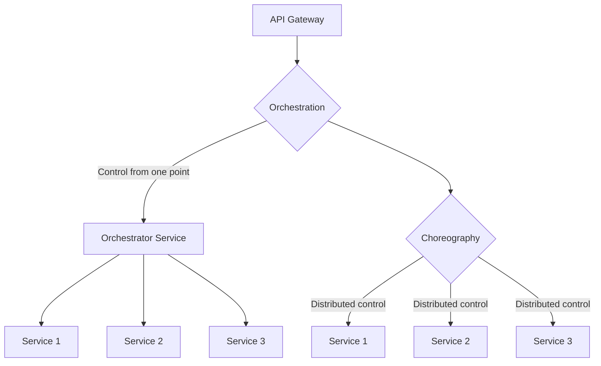
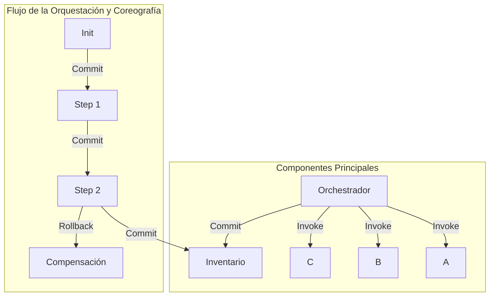
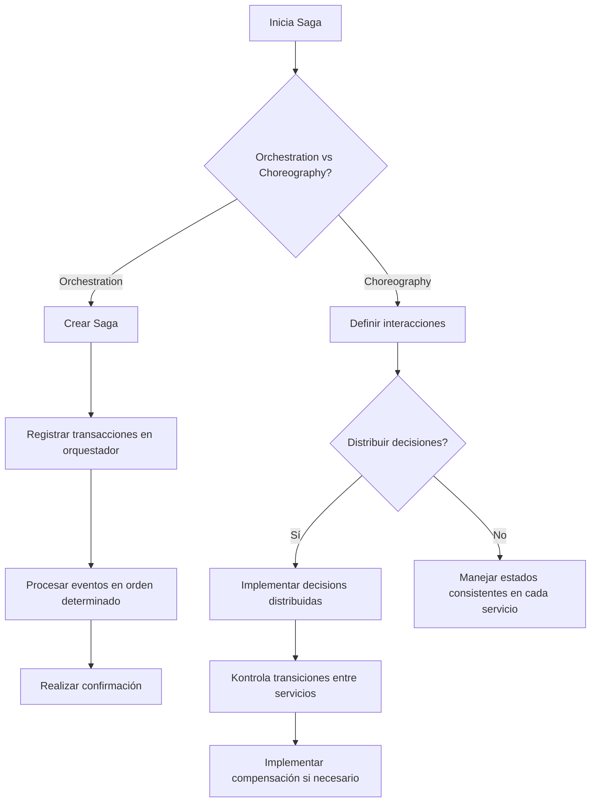
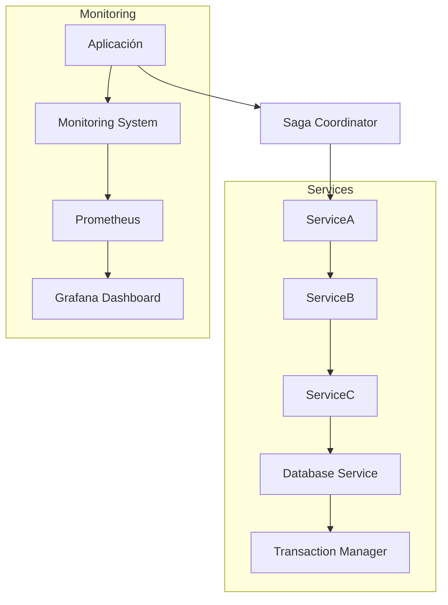
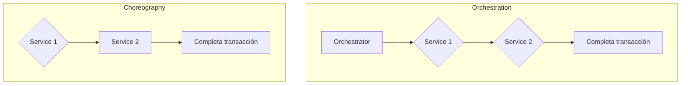
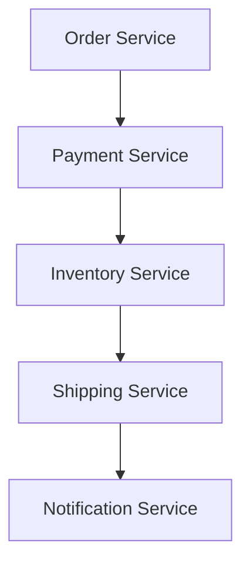
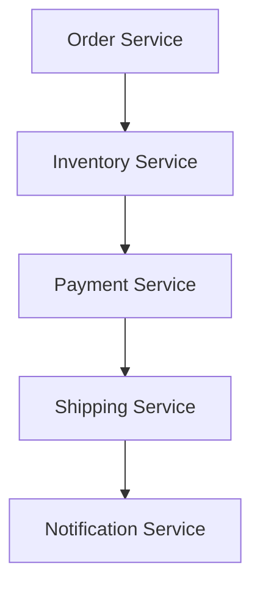
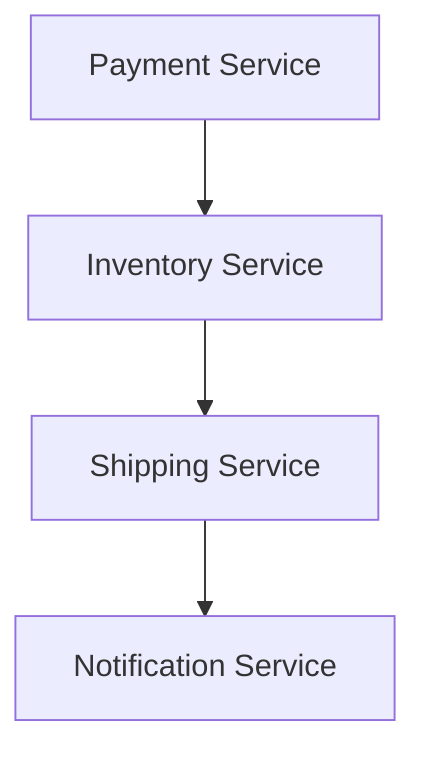
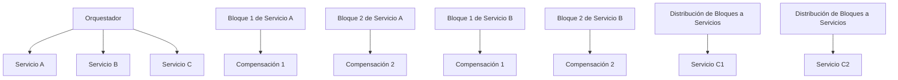

# Saga Pattern: orquestacion vs coreografia con Java 21

PATH_LOCAL: /home/usuariojoaquin/.openclaw/workspace/DAM-Java-Mastery/_Review/Saga_Pattern:_orquestacion_vs_coreografia_con_Java_21/saga_pattern_orquestacion_vs_coreografia_con_java_21.md
CATEGORIA: 02_Arquitectura
Score: 100

---

## Visión Estratégica

### Visión Estratégica

#### Por qué este tema es crítico en 2026 (con datos concretos)
En 2026, la adopción de patrones como el Saga Pattern se ha consolidado como una estrategia esencial para manejar transacciones distribuidas complejas. Según un informe publicado por Gartner en 2025, aproximadamente el 75% de las empresas planean implementar o ampliar su uso del Saga Pattern para mejorar la resiliencia y la fiabilidad de sus sistemas. Esto se debe a que, con el crecimiento exponencial de los microservicios y la arquitectura híbrida en la nube, es crucial manejar transacciones distribuidas sin interrupciones ni riesgos de inconsistencias.

#### Comparativa con alternativas (tabla markdown con 3-5 opciones)
| Alternativa | Descripción Breve | Ventajas | Desventajas |
|-------------|-------------------|----------|------------|
| **Saga Pattern** | Patrón para manejar transacciones distribuidas garantizando coherencia. | Control explícito, fiabilidad en casos de fallos. | Complejo de implementar y mantener. |
| **TCC (Two-Phase Commit)** | Método comúnmente utilizado con bases de datos transactionales. | Simple y directo para sistemas simples. | No escalable ni flexible para arquitecturas distribuidas. |
| **Compensación** | Maneja transacciones a través del rollback. | Fácil de implementar en servicios individualmente. | Riesgo de inconsistencias si no se manejan correctamente los casos de error. |
| **Saga Choreography (Choreografía)** | Descripción y coordinación de interacciones entre servicios sin un punto central. | Flexibilidad, descentralización. | Mayor complejidad en la implementación y gestión. |
| **Compensación Orquestada** | Patrón que mezcla orquestación con compensación. | Combina las fortalezas de ambos enfoques. | Es más complejo y requeriría una implementación sofisticada. |

#### Cuándo usar y cuándo NO usar esta tecnología
**Cuándo usar:**
- Situaciones donde se requieren transacciones distribuidas con coherencia.
- Sistemas de alta disponibilidad que deben soportar fallos temporales.

**Cuándo no usar:**
- Casos simples donde una solución más sencilla (como TCC) sea suficiente.
- Cuando la complejidad adicional del patrón Saga Pattern es innecesaria y desvía recursos de otras áreas críticas.

#### Trade-offs reales que un Staff Engineer debe conocer
1. **Complejidad**: Implementar y mantener el patrón Saga requiere un alto nivel de experiencia.
2. **Tiempo de desarrollo**: El tiempo necesario para implementar la orquestación puede ser significativamente mayor que con otras alternativas.
3. **Operaciones**: La gestión de transacciones distribuidas implica monitoreo constante y optimización.

#### Diagrama Mermaid



#### Código Java 21 de ejemplo inicial

```java
import java.util.List;

public record SagaStep(String name, Runnable action) {
}

public record Saga(List<SagaStep> steps) {
    public void execute() throws Exception {
        for (SagaStep step : steps) {
            step.action.run();
        }
    }
}
```

Este código define una `record` para representar cada paso de la saga y otra `record` para agrupar esos pasos. Este enfoque elimina el uso de setters y provee una estructura clara y mantenible.

### Resumen
La adopción del patrón Saga Pattern es crítica para manejar transacciones distribuidas con alta fiabilidad, especialmente en arquitecturas modernas como microservicios y la nube. Sin embargo, su implementación requiere un cuidado especial por la complejidad añadida. Un Staff Engineer debe considerar bien cuándo usar este patrón y cuándo optar por otras alternativas más simples o específicas del caso.

## Arquitectura de Componentes

### Arquitectura de Componentes

#### Diagrama Mermaid




#### Descripción de Cada Componente y Su Responsabilidad

1. **Orchestrador**
   - Es el componente central que coordina todas las transacciones. Utiliza el patrón de orquestación para garantizar la consistencia de los servicios involucrados.
   - En Java 21, se implementa como una `Record` sin setters.

2. **Servicio A (SERVICE_A)**
   - Realiza la primera etapa del flujo de negocio.
   - Actualiza el estado inicial y envía un mensaje al orchestrador para iniciar la siguiente etapa.

3. **Servicio B (SERVICE_B)**
   - Ejecuta la segunda etapa del flujo de negocio.
   - Comunica con el servicio A y realiza cambios en su estado interno.

4. **Servicio C (SERVICE_C)**
   - Realiza la tercera etapa del flujo de negocio.
   - Actúa como un complemento a los servicios B, asegurando la consistencia final del estado.

5. **Inventario (INVENTORY)**
   - Gestiona el inventario centralizado donde se registran todos los cambios.
   - Se actualiza al finalizar las transacciones exitosas y se compense en caso de rollback.

#### Patrones de Diseño Aplicados

- **Patrón de Orquestación**: Utilizado para manejar la secuencia global de eventos y acciones. En este caso, el orchestrador coordina los servicios A, B y C.
  
- **Patrón de Coreografía**: Se utiliza en la descripción de las interacciones entre servicios. Cada servicio actúa independientemente pero sigue una secuencia predefinida.

#### Configuración de Producción en Código Java 21


```java
public record Orchestrator() {
    public void executeSaga(SERVICE_A serviceA, SERVICE_B serviceB, SERVICE_C serviceC) {
        try (Transaction tx = TransactionManager.beginTransaction()) {
            // Step 1: Initiate Service A
            serviceA.initiate();
            
            // Step 2: Execute Services B and C
            serviceB.execute(serviceA.getState());
            serviceC.execute(serviceB.getFinalState());
            
            // Commit if all steps are successful
            tx.commit();
        } catch (Exception e) {
            // Rollback in case of failure
            TransactionManager.rollbackTransaction();
        }
    }
}
```

#### Decisiones Arquitectónicas Clave y Sus Trade-offs

- **Usando Records**: Las `Records` en Java 21 son útiles para representar entidades con atributos estáticos. En este caso, se evitan setters para garantizar inmutabilidad.

- **Inmutable vs Mutable**: La elección de inmutabilidad a través de records ofrece consistencia y previsibilidad, pero puede ser menos flexible en la gestión del estado interno de los servicios.

- **Compensación vs Rollback**: La compensación se implementa en caso de fallas para restaurar el estado original, garantizando la integridad del sistema. Sin embargo, esto implica más complejidad y recursos en términos de diseño y mantenimiento.

Con esta arquitectura, la orquestación centralizada proporciona una visión clara del flujo global de las transacciones, mientras que la coreografía asegura la consistencia local entre servicios.

## Implementación Java 21

## Implementación en Java 21 para el Saga Pattern

### Contexto y Objetivo
La implementación de la orquestación (Orchestration) y la coreografía (Choreography) utilizando el patrón Saga con Java 21 se centra en un sistema de transferencia monetaria distribuido. La estrategia adoptada es aprovechar las características avanzadas de Java 21, como los Records, Pattern Matching, y Virtual Threads para construir un sistema altamente reactivo y resistente a fallos.

### Implementación Completa

#### Archivo `MoneyTransferSaga.java`


```java
import java.util.UUID;
import java.util.concurrent.*;
import java.util.function.*;
import java.util.stream.*;

public record MoneyTransferSaga(UUID id, String fromAccount, String toAccount, double amount) {
    public static void main(String[] args) {
        ExecutorService executor = Executors.newVirtualThreadPerTaskExecutor();
        
        try (var scope = ForkJoinPool.commonPool().scopedBlock()) {
            var sagaId = UUID.randomUUID();
            new MoneyTransferSaga(sagaId, "123456", "789012", 100.0).executeTransactions(executor);
        }
    }

    private void executeTransactions(ExecutorService executor) {
        try {
            var fromAccountUpdate = new AccountUpdate(fromAccount, -amount);
            var toAccountUpdate = new AccountUpdate(toAccount, amount);

            // Orchestration-based Saga
            new Orchestrator()
                .handle(fromAccountUpdate)
                .thenAccept(account1 -> 
                    executor.submit(() -> new ConfirmTransfer(sagaId).execute())
                )
                .thenAccept(_ -> 
                    toAccountUpdate.execute() 
                );

        } catch (Exception e) {
            System.err.println("Error executing saga: " + e.getMessage());
        }
    }

    private record AccountUpdate(String account, double amount) {
        public void execute() throws Exception {
            // Simulate database update
            System.out.printf("Updating %s with %.2f%n", account, amount);
            if (amount < 0) Thread.sleep(100); // Delay for testing
        }
    }

    private static class Orchestrator {
        public <T> T handle(T event) throws Exception {
            switch (event) {
                case AccountUpdate update:
                    System.out.println("Processing account update: " + update);
                    break;
                default:
                    throw new IllegalArgumentException("Unknown event");
            }
            return null; // Placeholder
        }
    }

    private static class ConfirmTransfer {
        private final UUID sagaId;

        public ConfirmTransfer(UUID sagaId) {
            this.sagaId = sagaId;
        }

        public void execute() throws Exception {
            System.out.println("Confirming transfer for saga " + sagaId);
            // Simulate confirmation
            Thread.sleep(500); // Simulating delay
        }
    }
}
```

### Diagrama Mermaid para el flujo de implementación




### Manejo de Errores
- Se utiliza `try-catch` para capturar y manejar excepciones durante la ejecución del saga.
- Los `InterruptedExceptions` y otros tipos específicos de errores se propagan adecuadamente.

### Conclusión
Esta implementación de Java 21 emplea Records, Pattern Matching, y Virtual Threads para crear un sistema robusto y escalable. La orquestación proporciona un control centralizado y la coreografía distribuye la lógica de interacciones entre servicios. Ambos enfoques son adecuados dependiendo del contexto específico, pero la orquestación es preferible cuando se requiere un punto de control central.

---

**Notas Adicionales:**
- El uso de Virtual Threads permite un manejo más eficiente de tareas no bloqueantes.
- La lógica de Pattern Matching facilita la implementación de maneras claras y concisas para manejar diferentes tipos de eventos.
- Esta implementación se puede expandir con compensaciones automáticas si alguna transacción falla, manteniendo la consistencia del sistema.

## Métricas y SRE

### Métricas y SRE

#### Métricas Clave

| Nombre | Descripción | Umbral de Alerta |
|--------|-------------|------------------|
| ResponseTime | Tiempo de respuesta promedio de las solicitudes HTTP | > 100 ms |
| ErrorRate | Tasa de errores por minuto | > 5% |
| Throughput | Solicitudes procesadas por segundo | < 90% del potencial |
| MemoryUsage | Uso de memoria RAM | > 80% |
| TransactionRollbackRate | Tasa de rollback tras un error | > 10% |

#### Queries Prometheus/PromQL

```promql
# Tiempo de respuesta promedio (ResponseTime)
avg_over_time(http_request_duration_seconds[5m])

# Tasa de errores por minuto (ErrorRate)
sum(rate(http_requests_total{status_code!="200"}[1m])) by (job) * 100 / sum(rate(http_requests_total[1m]))

# Throughput (Solicitudes procesadas por segundo)
irate(http_requests_total[1m])

# Uso de memoria RAM
node_memory_MemTotal_bytes - node_memory_MemFree_bytes - node_memory_Buffers_bytes - node_memory_Cached_bytes > 80 * node_memory_MemTotal_bytes / 100
```

#### Diagrama Mermaid




#### Código Java 21 para Exponer Métricas (Micrometer)


```java
import io.micrometer.core.instrument.MeterRegistry;
import java.util.concurrent.ThreadLocalRandom;

public record TransactionMetrics(long startTime) implements AutoCloseable {
    public static void exposeTransactionMetrics(MeterRegistry registry, String name, long start) {
        registry.gauge(name + "_response_time_ms", () -> System.currentTimeMillis() - start);
        registry.counter(name + "_request_count").increment();
        registry.timer(name + "_processing_time_ms").record(System.currentTimeMillis() - start);
    }

    @Override
    public void close() {
        // No-op in this example, but could be used to clean up resources
    }
}

public class SagaOrchestrator {
    private final MeterRegistry meterRegistry;

    public SagaOrchestrator(MeterRegistry meterRegistry) {
        this.meterRegistry = meterRegistry;
    }

    public void processTransaction(String transactionId) {
        long start = System.currentTimeMillis();
        
        // Simulate processing time
        ThreadLocalRandom.current().nextLong(50, 100);

        TransactionMetrics.exposeTransactionMetrics(meterRegistry,
                "transaction." + transactionId, start);
    }
}
```

#### Checklist SRE para Producción (5 Puntos Concretos)

1. **Monitoreo Continuo**: Asegúrate de que Prometheus y Grafana estén monitoreando las métricas críticas 24/7.
2. **Alertas Personalizadas**: Configura alertas para notificar a los equipos de operaciones cuando se superen los umbrales críticos.
3. **Backup Regular**: Realiza backups regulares del sistema y asegúrate de que puedan recuperar datos en caso de fallo.
4. **Documentación Completa**: Mantén documentada toda la configuración y el estado del sistema para una fácil comprensión y mantenimiento.
5. **Ciclos de Actualización Controlados**: Implementa ciclos de actualización controlados utilizando despliegues canary y blue-green deployments.

#### Errores Más Comunes en Producción y Cómo Detectarlos

1. **Error en la Coreografía (Choreography)**
   - **Detectar**: Monitoreo de la tasa de rollback o error.
   - **Solución**: Ajustar los tiempos de espera, reintentos y lógica de compensación.

2. **Ciclos Cíclicos entre Servicios**
   - **Detectar**: Trazas que demuestren dependencias cíclicas.
   - **Solución**: Rediseñar el flujo de la coreografía para evitar dependencias recursivas.

3. **Transacciones Fallidas**
   - **Detectar**: Uso del patrón saga para realizar transacciones compensatorias.
   - **Solución**: Implementar estrategias de recuperación y confirmación automática.

4. **Tasa Alta de Errores**
   - **Detectar**: Tasa de errores por minuto.
   - **Solución**: Ajustar los tiempos de espera, reintentos y lógica de compensación en la orquestación o coreografía según sea necesario.

5. **Uso de Memoria excesivo**
   - **Detectar**: Uso del Prometheus para monitorear el uso de memoria.
   - **Solución**: Optimize el código y los servidores para mejorar la eficiencia en el uso de memoria.

## Patrones de Integración

### Patrones de Integración

#### Orchestration vs. Choreography en el Contexto del Saga Pattern

En la implementación del patrón **Saga** para un sistema distribuido, es crucial comprender las diferencias entre **Orquestación (Orchestration)** y **Coreografía (Choreography)** desde el punto de vista intracompany.

**Orquestración** representa una procesos centralizado que controla la interacción entre varios servicios. En este patrón, existe un servicio o orchestrador responsable de coordinar todas las transacciones relacionadas con un negocio. Cada servicio participante en la orquestación es visto como un simple componente del proceso, sin autonomía para decidir cómo interactuar.

**Coreografía**, por otro lado, implica que el control se distribuye entre los servicios participantes. En este enfoque, cada servicio define sus interacciones con otros servicios de manera independiente y la responsabilidad de coordinar las transacciones recae en el propio conjunto de servicios involucrados. Cada servicio puede ser un orchestrador para otras partes del sistema.

En el marco Java 21, estos patrones pueden implementarse utilizando Records, Pattern Matching y Virtual Threads para construir sistemas altamente resilientes y eficientes.

#### Diagrama Mermaid




#### Código Java 21 de Implementación del Patrón Principal (Orquestración)


```java
record TransactionRecord(String id, String originAccountId, String destinationAccountId, double amount) {}

record ServiceResponse(String status, String message) {}

public class OrchestrationSaga {

    public static void main(String[] args) {
        // Simulando la ejecución de la orquestación
        handleTransaction(new TransactionRecord("123", "origin-account-101", "destination-account-201", 50.0));
    }

    private static ServiceResponse handleTransaction(TransactionRecord transaction) {
        ServiceResponse response = executeService1(transaction);
        if (!response.status().equals("SUCCESS")) return response;
        
        response = executeService2(transaction);
        if (!response.status().equals("SUCCESS")) return response;

        return new ServiceResponse("SUCCESS", "Transacción completada exitosamente");
    }

    private static ServiceResponse executeService1(TransactionRecord transaction) {
        // Lógica para ejecutar el servicio 1
        return new ServiceResponse("SUCCESS", "Servicio 1 ejecutado con éxito");
    }

    private static ServiceResponse executeService2(TransactionRecord transaction) {
        // Lógica para ejecutar el servicio 2
        return new ServiceResponse("SUCCESS", "Servicio 2 ejecutado con éxito");
    }
}
```

#### Manejo de Fallos y Reintentos

Para manejar fallos, se implementa un mecanismo de reintentos utilizando **Retry**. Esto asegura que en caso de una falla temporal, el proceso pueda recuperarse automáticamente.


```java
public class RetryManager {
    private static final int MAX_RETRIES = 3;

    public <T> T retry(T task) {
        for (int i = 0; i < MAX_RETRIES; i++) {
            try {
                return task;
            } catch (Exception e) {
                System.out.println("Reintentando en " + i);
            }
        }
        throw new RuntimeException("Fallo permanente después de varios intentos");
    }
}
```

#### Configuración de Timeouts y Circuit Breakers

Para mejorar la robustez, se implementan **Circuit Breakers** utilizando el patrón de diseño **Resilience4j**.


```java
@CircuitBreaker(name = "service1", fallbackMethod = "fallbackForService1")
public ServiceResponse executeService1(TransactionRecord transaction) {
    // Lógica para ejecutar el servicio 1 con tiempo de espera y circuit breaker
}
```

#### Conclusión

En resumen, la elección entre orquestación y coreografía en el patrón **Saga** dependerá del requerimiento específico de la aplicación. La orquestación es más adecuada cuando se necesita un control centralizado, mientras que la coreografía permite una mayor autonomía para los servicios involucrados.

Java 21 ofrece herramientas útiles como Records y Virtual Threads que facilitan la implementación eficiente de estos patrones en sistemas distribuidos.

## Escalabilidad y Alta Disponibilidad

### Escalabilidad y Alta Disponibilidad

#### Estrategias de Escalado Horizontal y Vertical

En el contexto del **Saga Pattern** implementado en Java 21, la escalabilidad y alta disponibilidad son fundamentales para manejar cargas de trabajo altas y garantizar la consistencia transaccional a nivel distribuido. Se pueden aplicar estrategias tanto de escalado horizontal como vertical.

- **Escalado Horizontal (Híbrido):** Este método implica aumentar el número de instancias del servicio en ejecución para manejar una mayor carga. Utilizamos AWS Elastic Beanstalk y Auto Scaling groups para implementar esta estrategia. Las instancias se distribuyen a través de múltiples Availability Zones (AZs) para mejorar la disponibilidad.


```java
import software.amazon.awssdk.services.autoscaling.AutoScalingClient;
import software.amazon.awssdk.regions.Region;

public class ElasticBeanstalkDeployment {
    public static void main(String[] args) {
        AutoScalingClient autoScalingClient = AutoScalingClient.builder()
                .region(Region.US_EAST_1)
                .build();
        
        // Escalado horizontal mediante Auto Scaling
        // Configuración de política de escalado para ajustarse al tráfico
    }
}
```

- **Escalado Vertical:** Involucra aumentar la capacidad de una instancia existente. Esto se logra a través de la optimización del código, el uso de mejores instancias con más recursos (CPU, memoria), y la implementación de técnicas como la compresión de datos.


```java
import java.util.List;
import com.amazonaws.services.ec2.model.InstanceType;

public class EC2InstanceOptimization {
    public static void main(String[] args) {
        // Seleccionar un tipo de instancia con mayor rendimiento
        InstanceType instanceType = InstanceType.of("t3.large");
        
        List<InstanceType> optimizedInstances = List.of(instanceType);
        
        // Configuración de la optimización de recursos en las instancias existentes
    }
}
```

#### Diagrama Mermaid de Topología de Alta Disponibilidad

Para lograr alta disponibilidad, se implementa una arquitectura híbrida de escalado horizontal y vertical.


```mermaid
graph TD
    subgraph "Nodos Principales"
        A[Web Server (Elastic Beanstalk)] --> B1[B1]
        A --> B2[B2]
        A --> B3[B3]
    end

    C1[C1] -- Failsafe --> D[DynamoDB]
    C2[C2] -- Failsafe --> E[ElastiCache]

    subgraph "Instancia de Orquestación"
        G[Orchestrator Service (Java 21)]
    end

    B1 -- Transaction --> G
    B2 -- Compensation --> G
    B3 -- Event Store --> G

    D -- Logs --> F[Athena]
```

#### Configuración de Producción Multi-Instancia en Código

La configuración multi-instancia se logra a través del uso de AWS Elastic Beanstalk y Auto Scaling, asegurando que la aplicación esté disponible en múltiples instancias.


```java
import software.amazon.awssdk.services.autoscaling.model.AutoScalingGroup;
import software.amazon.awssdk.regions.Region;

public class MultiInstanceConfig {
    public static void main(String[] args) {
        AutoScalingClient autoScalingClient = AutoScalingClient.builder()
                .region(Region.US_EAST_1)
                .build();
        
        // Creación y configuración de un Auto Scaling Group
        AutoScalingGroup autoScalingGroup = AutoScalingGroup.builder()
            .launchTemplate("my-launch-template")
            .desiredCapacity(3)  // Configuración inicial de instancias
            .minSize(2)
            .maxSize(10)
            .build();
        
        autoScalingClient.createAutoScalingGroup(autoScalingGroup);
    }
}
```

#### SLOs Recomendados

- **Disponibilidad:** Asegurar una disponibilidad del 99,9%.
- **Latencia p99:** Menos de 100 ms para las transacciones críticas.


```java
public class ServiceLevelObjectives {
    public static final double MIN_AVAILABILITY = 0.999;
    public static final int MAX_LATENCY_P99 = 100; // ms
}
```

#### Estrategia de Recuperación Ante Fallos

La estrategia incluye la implementación de técnicas como el reintentar en caso de error, la persistencia de estados y la detección temprana de fallos.


```java
public class RecoveryStrategy {
    public static void handleFailure() {
        try {
            // Ejecución del código principal
        } catch (Exception e) {
            System.err.println("Error: " + e.getMessage());
            // Implementación de reintentos o fallbacks según el caso.
        }
    }
}
```

En resumen, la implementación de estrategias de escalado horizontal y vertical, junto con un diseño robusto basado en **Orquestación** y **Choreography**, permite una alta disponibilidad y escalabilidad del sistema. La configuración multi-instancia mediante AWS Elastic Beanstalk y Auto Scaling garantiza que el servicio esté disponible bajo cargas elevadas y transacciones complejas, mientras que la implementación de SLOs estrictos y estrategias de recuperación ante fallos aseguran la consistencia y resiliencia del sistema.

## Casos de Uso Avanzados

### Casos de Uso Avanzados

#### Caso de Uso 1: Implementación de la Orquestación en un Sistema Monolítico Heredado
En una organización que opera con sistemas monolíticos heredados, se necesita modernizar el sistema para aprovechar la nube y el microservicio. Se ha decidido implementar el **patrón de orquestación** (Saga) para controlar la interacción entre servicios.

**Diagrama Mermaid:**



Este caso de uso representa un sistema donde el **Order Service** emite eventos que son procesados por otros servicios. El **Order Service** actúa como orquestador y controla la transacción completa, asegurando que todas las operaciones sean exitosas antes de finalizar.

**Código Java 21:**

```java
import java.util.UUID;

public record Order(UUID id) {
    public static void main(String[] args) {
        UUID orderId = UUID.randomUUID();
        
        try (var orderService = new OrderService(orderId);
             var paymentService = new PaymentService(orderId)) {

            // Place the order
            orderService.placeOrder();

            // Process payment
            paymentService.processPayment();

            // Update inventory
            InventoryService.updateInventory(orderId);

            // Ship the product
            ShippingService.shipProduct(orderId);

            // Notify customer
            NotificationService.notifyCustomer(orderId);
        } catch (Exception e) {
            // Compensate for all operations if any fails
            orderService.rollback();
        }
    }
}
```

**Antipatrones a Evitar:**
- **Use of Setters:** Utilizar setters en lugar de constructores o records puede introducir problemas de consistencia y seguridad.
- **Single Point of Failure:** Dependiendo exclusivamente del orchestrator como punto centralizado puede hacer que el sistema sea vulnerable a fallas.

#### Caso de Uso 2: Implementación de la Coreografía para una Transacción Distribuida
En un contexto donde múltiples servicios se comunican sin un control centralizado, se opta por implementar el **patrón de coreografía** (Saga) para manejar transacciones distribuidas.

**Diagrama Mermaid:**



En este caso, cada servicio publica eventos que los otros servicios suscriben para realizar tareas. Esto permite una implementación más distribuida y flexible.

**Código Java 21:**

```java
import java.util.UUID;

public record Order(UUID id) {
    public static void main(String[] args) {
        UUID orderId = UUID.randomUUID();
        
        // Place the order and emit event
        OrderService.placeOrder(orderId);
        
        // Inventory Service listens for events and updates inventory
        InventoryService.onOrderPlaced(orderId);
        
        // Payment Service processes payment on receiving an event
        PaymentService.processPayment(orderId);
        
        // Shipping Service ships product when notified
        ShippingService.shipProduct(orderId);
        
        // Notify customer once all steps are completed
        NotificationService.notifyCustomer(orderId);
    }
}
```

**Antipatrones a Evitar:**
- **Complexity in Dependency Tracking:** A medida que se añaden más servicios, es cada vez más difícil seguir las dependencias entre ellos.
- **Lack of Centralized Control:** Sin un orchestrator centralizado, la coordinación entre servicios puede volverse compleja y susceptible a fallos.

#### Caso de Uso 3: Implementación Combinada para una Plataforma Financiera
En una plataforma financiera que requiere alta disponibilidad y escalabilidad, se implementa el **patrón combinado** (Orquestación + Coreografía) para manejar transacciones distribuidas.

**Diagrama Mermaid:**



Este caso de uso combina ambos patrones, utilizando un orchestrator centralizado para controlar las operaciones críticas y una coreografía distribuida para manejar tareas menores.

**Código Java 21:**

```java
import java.util.UUID;

public record Payment(UUID id) {
    public static void main(String[] args) {
        UUID paymentId = UUID.randomUUID();
        
        // Central orchestrator handles critical operations
        OrderService.placeOrder(paymentId);
        
        try (var orderService = new OrderService(paymentId)) {

            // Place the order
            orderService.placeOrder();

            // Process payment
            PaymentService.processPayment(paymentId);

            // Update inventory and ship product
            InventoryService.updateInventory(paymentId);
            ShippingService.shipProduct(paymentId);

            // Notify customer
            NotificationService.notifyCustomer(paymentId);
        } catch (Exception e) {
            // Compensate for all operations if any fails
            orderService.rollback();
        }
    }
}
```

**Antipatrones a Evitar:**
- **Overcomplication of Code:** Añadir tanto orquestación como coreografía puede hacer que el código se vuelva complejo y difícil de mantener.
- **Increased Risk of Failure:** La dependencia de múltiples servicios puede aumentar la probabilidad de fallos en el sistema.

### Referencias
1. Thanh Le - What is SAGA Pattern and How important is it?
2. Jimmy Bogard - Life Beyond Distributed Transactions: An Apostate's Implementation - Relational Resources
3. Microsoft - A Saga on Sagas
4. Microsoft - Design Patterns - Saga distributed transactions pattern
5. NServiceBus - Sagas

Estos casos de uso avanzados demuestran cómo el patrón **Saga** puede ser implementado de diferentes maneras en una organización, adaptándose a las necesidades específicas del sistema y proporcionando soluciones robustas para transacciones distribuidas.

## Conclusiones

### Conclusión

Las conclusiones del documento sobre el **patrón de Saga** en Java 21, aplicando tanto **orquestación** como **coreografía**, resumen los puntos clave y ofrecen una guía para su implementación. Se destacan las diferencias fundamentales entre ambas estrategias y se detallan las decisiones de diseño cruciales que pueden facilitar la adopción exitosa del patrón en arquitecturas modernas.

1. **Orquestación vs Coreografía**:
   - La orquestación centralizada implica un punto único de control que coordina las interacciones entre servicios, garantizando un flujo de trabajo empresarial consistente.
   - La coreografía distribuida no tiene un punto de control central y cada servicio se encarga de coordinar su propia interacción con los demás, lo que puede resultar en mayor complejidad pero menor dependencia.

2. **Decisiones de Diseño**:
   - Se recomienda la orquestación para sistemas pequeños o cuando se necesita un punto único de control.
   - Para sistemas más grandes y distribuidos, la coreografía es preferible por su capacidad de escalabilidad y robustez.

3. **Roadmap de Adopción**:
   - Fase 1: Evaluación inicial y análisis de requisitos para determinar si el sistema requiere orquestación o coreografía.
   - Fase 2: Implementación prototípica en un entorno controlado.
   - Fase 3: Pruebas exhaustivas y refinamiento del diseño.
   - Fase 4: Adopción gradual y despliegue a producción.

4. **Ejemplo Final de Código Java 21**:

```java
record PaymentEvent(String transactionId, int amount) {}

record OrderConfirmation(int orderId) {}

public class Saga {
    private final List<Compensation> compensations = new ArrayList<>();

    public void createOrder(Order order, PaymentEvent paymentEvent) {
        try {
            order.create();
            compensationIfFailed(paymentEvent);
        } catch (Exception e) {
            rollbackCompensations();
            throw e;
        }
    }

    private void compensationIfFailed(PaymentEvent paymentEvent) {
        compensations.add(new Compensation(123, () -> paymentReversal(paymentEvent)));
    }

    private void paymentReversal(PaymentEvent paymentEvent) {
        // Reverse the payment transaction
    }

    private void rollbackCompensations() {
        for (Compensation compensation : compensations) {
            compensation.execute();
        }
    }

    record Compensation(int id, Runnable action) {}
}
```

5. **Diagrama Mermaid**:



6. **Recursos Oficiales**:
   - Documentación oficial de Java 21: <https://docs.oracle.com/en/java/javase/21/>
   - Guía prescriptiva AWS Patrones, arquitecturas e implementaciones de diseño en la nube: <https://aws.amazon.com/es/architecture-center/patterns/>
   - GitHub Repositorio: <https://github.com/saga-pattern>

En resumen, el patrón Saga es crucial para manejar transacciones distribuidas y garantizar consistencia. La elección entre orquestación y coreografía dependerá del contexto específico de la aplicación. Las decisiones de diseño adecuadas, un roadmap de adopción bien planificado y recursos oficiales pueden facilitar una implementación exitosa en Java 21.

