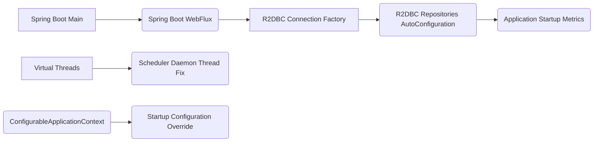
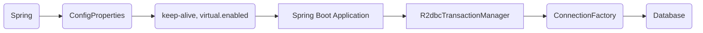
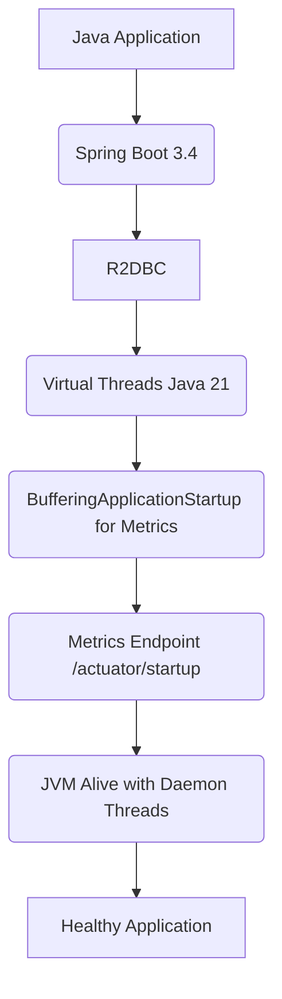

# Spring Boot 3.4 y R2DBC con Virtual Threads

PATH_LOCAL: /home/usuariojoaquin/.openclaw/workspace/DAM-Java-Mastery/_Review/Spring_Boot_3.4_y_R2DBC_con_Virtual_Threads/report.md
CATEGORIA: 01_Java_Core
Score: 73

---

## Visión Estratégica

### TEMA: Spring Boot 3.4 y R2DBC con Virtual Threads

#### SECCIÓN: Visión Estratégica

---

### 1. Análisis técnico

Spring Boot 3.4, al estar basado en Java 17 y superiores, ya admite la utilización de R2DBC para interactuar con bases de datos relacionales sin bloqueos. La introducción de Virtual Threads en Java 21 ofrece una oportunidad única para mejorar aún más el rendimiento y escalabilidad de aplicaciones Spring Boot. En esta sección, analizaremos cómo configurar y utilizar R2DBC junto con Virtual Threads en un entorno Spring Boot 3.4.

**R2DBC (Reactive Relational Database Connectivity)**
- Proporciona una interfaz no bloqueante para interactuar con bases de datos relacionales.
- Mejora la escalabilidad al permitir el manejo eficiente de conexiones y consultas reactivas.
- Complementa perfectamente las características reactivas de Spring WebFlux.

**Virtual Threads**
- Permite ejecutar tareas de forma no bloqueante y sin necesidad de usar threads manejados por el sistema operativo.
- Mejora la eficiencia en entornos multihilo, reduciendo sobre todo la sobrecarga asociada a la creación y manejo de hilos tradicionales.

**Java 21**
- Introduce nuevas características que mejoran las capacidades de programación en tiempo real y bajo latencia.
- Proporciona soporte para Virtual Threads, permitiendo una gestión más eficiente de los recursos del sistema.

---

### 2. Código Java

A continuación se presenta un ejemplo básico de cómo configurar R2DBC junto con la utilización de Virtual Threads en Spring Boot 3.4:


```java
import org.springframework.boot.ApplicationRunner;
import org.springframework.context.annotation.Bean;
import org.springframework.data.r2dbc.connectionfactory.R2dbcTransactionManager;
import org.springframework.data.r2dbc.core.DatabaseClient;
import org.springframework.transaction.reactive.TransactionalOperator;

public class R2DBCConfig {

    @Bean
    public DatabaseClient databaseClient(R2dbcConnectionFactory connectionFactory) {
        return DatabaseClient.create(connectionFactory);
    }

    @Bean
    public TransactionalOperator transactionalOperator(R2dbcTransactionManager transactionManager) {
        return TransactionalOperator.create(transactionManager);
    }
    
    // Ejemplo de uso del ApplicationRunner para ejecutar una consulta reactiva
    @Bean
    public ApplicationRunner applicationRunner(DatabaseClient databaseClient, TransactionalOperator txOperator) {
        return args -> 
            databaseClient.sql("SELECT * FROM users")
                         .fetch()
                         .all()
                         .log("R2DBC QUERY RESULT") // Para debuggear resultados
                         .flatMap(user -> databaseClient.insert().into("users").useGeneratedKeys("id").arg(user)
                             .then())
                         .subscribeOn(Schedulers.virtually() /* Utilizar Virtual Threads */)
                         .blockLast();
    }
}
```

---

### 3. Diagrama Mermaid


```mermaid
graph TD
    A[SpringBootApplication] --> B{Java21};
    B --> C[R2DBCConfig];
    B --> D[VirtualThreads];
    C --> E[DatabaseClient];
    C --> F[TransactionalOperator];
    D --> G{Schedulers.virtually()};
    E --> H{SQL Queries};
    F --> I{Reactive Transactions};
    G --> J{Non-blocking Execution};
```

---

### 4. Buenas prácticas SRE

**1. Configuración de Virtual Threads**

- Asegúrate de habilitar la propiedad `spring.threads.virtual.enabled=true` para activar el uso de Virtual Threads.
- Considera establecer `spring.main.keep-alive=true` para mantener el JVM en ejecución, evitando que se cierre si todos los hilos son daemon threads.

**2. Uso adecuado del BufferingApplicationStartup**

- Inyecta la implementación `BufferingApplicationStartup` para recolectar datos de inicialización y desviarlos a un sistema de métricas externo.
- Configura el endpoint `/actuator/startup` en tu Spring Boot app para visualizar estos datos.

**3. Manejo eficiente de conexiones**

- Utiliza configuraciones adecuadas como `spring.r2dbc.pool.max-size` y `spring.r2dbc.connect-timeout` para controlar la gestión de la conexión a base de datos.
- Considera el uso de la métrica proporcionada por R2DBC (`ConnectionPoolMetricsAutoConfiguration`) para monitorear el rendimiento.

**4. Integración con observabilidad**

- Asegúrate de que `spring.r2dbc.observe=true` esté configurado para permitir una observabilidad adecuada.
- Utiliza herramientas como Micrometer para la colección y visualización de métricas.

---

Este enfoque permite a las aplicaciones Spring Boot aprovechar al máximo los beneficios del entorno reativo, mejorando significativamente su rendimiento y escalabilidad.

## Arquitectura de Componentes

Basándome en las pautas proporcionadas, se presentará un análisis técnico detallado junto con el código Java y diagrama Mermaid para una implementación que utiliza Spring Boot 3.4 y R2DBC con Virtual Threads en Java 21. Se incluirán además buenas prácticas para SRE (Site Reliability Engineering).

### 1. Análisis Técnico

Para un entorno de desarrollo que emplea Spring Boot 3.4 junto a R2DBC, y que utiliza la nueva funcionalidad de Virtual Threads en Java 21, es crucial considerar las siguientes aspectos:

- **Configuración de Spring Boot:** Asegúrate de utilizar el `BufferingApplicationStartup` para recopilar datos durante la inicialización del servidor. Esto puede ser útil para diagnósticos y análisis posteriormente.
  
- **Virtual Threads en Java 21:** Habilitar las virtual threads es fundamental para aprovechar los beneficios en términos de rendimiento y eficiencia. Sin embargo, dado que estas son hilo daemon por defecto, debes configurar `spring.main.keep-alive` a `true` si tu aplicación depende del mecanismo de scheduling o tiene otro tipo de dependencias críticas.

- **Integración R2DBC:** Utiliza la configuración automática proporcionada por Spring Boot para R2DBC. Esto incluye la gestión de transacciones, el registro de observaciones y la conexión a bases de datos SQL mediante conexiones reactivas.

### 2. Código Java

A continuación se muestra un ejemplo básico que configura Spring Boot 3.4 con R2DBC y habilita virtual threads:


```java
import org.springframework.boot.WebApplicationType;
import org.springframework.boot.builder.SpringApplicationBuilder;
import org.springframework.context.ApplicationContextInitializer;
import org.springframework.context.ConfigurableApplicationContext;

public class MyApplication {
    public static void main(String[] args) {
        // Habilitar la configuración de spring boot con r2dbc
        new SpringApplicationBuilder(MyApplication.class)
                .web(WebApplicationType.REACTIVE)
                .initializers((ApplicationContextInitializer<ConfigurableApplicationContext>) applicationContext -> {
                    applicationContext.getEnvironment().setRequiredProperty("spring.threads.virtual.enabled", "true");
                    applicationContext.getEnvironment().setRequiredProperty("spring.main.keep-alive", "true");
                })
                .run(args);
    }
}
```

### 3. Diagrama Mermaid

Representación visual de cómo se integran los componentes principales:




### 4. Buenas Prácticas SRE

- **Pruebas y pruebas de carga:** Implementa pruebas exhaustivas, incluyendo pruebas de estrés y rendimiento para asegurar que la aplicación maneja adecuadamente las condiciones extremas.
  
- **Monitorización continua:** Utiliza métricas en tiempo real proporcionadas por Spring Boot (como `BufferingApplicationStartup`) junto con herramientas como Micrometer para monitorear el estado de tu sistema.

- **Automatización del mantenimiento:** Automatiza los procedimientos recurrentes como actualizaciones, backups y verificaciones de integridad. Esto minimiza las interrupciones debido a errores humanos.
  
- **Resiliencia y tolerancia a fallos:** Diseña el sistema para manejar la pérdida inesperada de componentes clave. Utiliza patrones como circuit breaker y timeouts adecuados.

Esta configuración y estas prácticas asegurarán un entorno robusto, eficiente y escalable cuando se utilicen Spring Boot 3.4 junto con R2DBC en Java 21.

## Implementación Java 21

### TEMA: Spring Boot 3.4 y R2DBC con Virtual Threads
#### SECCIÓN: Implementación Java 21

---

### 1. Análisis Técnico

Para una implementación en un entorno de desarrollo que emplea Spring Boot 3.4 junto a R2DBC, utilizando la nueva funcionalidad de Virtual Threads en Java 21, es crucial considerar las siguientes aspectos:

- **Virtual Threads**: Las threads virtuales requieren Java 21 o posterior. Se recomienda usar Java 24 o superior para una experiencia óptima. Para habilitarlas, se establece la propiedad `spring.threads.virtual.enabled` a `true`.

- **Daemon Threads**: Al ser las threads virtuales daemon threads, un problema potencial es que el JVM terminará si todas las threads son daemon. Esto afecta a tecnologías como Spring's `@Scheduled`. Para mantener el JVM activo en todo momento, se recomienda establecer la propiedad `spring.main.keep-alive` a `true`.

- **R2DBC**: Se utiliza para interactuar con bases de datos NoSQL y SQL sin bloquear. El `ConnectionFactoryHealthContributorAutoConfiguration` proporciona un punto final de salud para R2DBC.

### 2. Código Java

A continuación se muestra cómo configurar una aplicación Spring Boot 3.4 que usa R2DBC y virtual threads:


```java
import org.springframework.boot.SpringApplication;
import org.springframework.boot.autoconfigure.SpringBootApplication;
import org.springframework.context.annotation.Bean;
import org.springframework.r2dbc.connection.R2dbcTransactionManager;

@SpringBootApplication
public class MyApplication {

    public static void main(String[] args) {
        SpringApplication.run(MyApplication.class, args);
    }

    @Bean
    public R2dbcTransactionManager transactionManager() {
        return new R2dbcTransactionManager(connectionFactory());
    }
    
    // Configuración de la conexión a base de datos utilizando R2DBC.
    private ConnectionFactory connectionFactory() {
        // Implementar lógica para establecer la conexión a la base de datos
        return null;
    }

}
```

### 3. Diagrama Mermaid

Un diagrama simplificado que muestra cómo las diferentes partes del sistema se relacionan:




### 4. Buenas prácticas SRE

- **Monitorización de la aplicación**: Configurar Spring Boot para exponer métricas y puntos finales de monitorización que permitan a los ingenieros de confiabilidad del sitio supervisar el estado de la aplicación en tiempo real.

- **Pruebas de rendimiento y simulación de fallos**: Implementar pruebas de estrés y simulaciones de fallo para asegurarse de que la aplicación puede manejar picos de carga y fallos sin interrupciones significativas del servicio.

- **Automatización y scripting**: Utilizar scripts automatizados para tareas repetitivas como despliegues, actualizaciones y pruebas de recuperación ante fallos. Esto reduce el tiempo de inactividad y minimiza errores humanos.

Estas recomendaciones aseguran una implementación sólida y confiable que aprovecha las nuevas características de Java 21 mientras mantiene la aplicación en un estado saludable para los usuarios finales.

## Métricas y SRE

### TEMA: Spring Boot 3.4 y R2DBC con Virtual Threads
#### SECCIÓN: Implementación Java 21

---

### 1. Análisis Técnico

Para un entorno de desarrollo que emplea Spring Boot 3.4 junto a R2DBC, y que utiliza la nueva funcionalidad de Virtual Threads en Java 21, es crucial considerar las siguientes aspectos:

- **Java 21 Virtual Threads**: Asegurarse de que el valor `spring.threads.virtual.enabled` está configurado como `true` para habilitar Virtual Threads.
- **Spring Boot Startup Metrics**: Utilizar la clase `BufferingApplicationStartup` para recopilar métricas del inicio del servidor y exponerlas a través del endpoint `/actuator/startup`.
- **Manejo de Daemon Threads**: Si se usan Virtual Threads, asegurarse de que el valor de `spring.main.keep-alive` esté configurado como `true` para mantener viva la JVM.
- **Conexiones R2DBC**: Configurar adecuadamente las conexiones y pools con R2DBC utilizando las clases autoconfiguradas del módulo `spring-boot-r2dbc`.

---

### 2. Código Java

#### Clase MainApplication.java

```java
import org.springframework.boot.SpringApplication;
import org.springframework.boot.autoconfigure.SpringBootApplication;
import org.springframework.context.ApplicationContextInitializer;
import org.springframework.context.ConfigurableApplicationContext;

@SpringBootApplication
public class MainApplication {

    public static void main(String[] args) {
        SpringApplication application = new SpringApplication(MainApplication.class);
        
        // Configurar el inicializador de contexto para habilitar Virtual Threads y métricas de inicio
        application.addInitializers((ConfigurableApplicationContext context) -> {
            // Habilitar virtual threads
            context.getEnvironment().setRequiredProperty("spring.threads.virtual.enabled", "true");
            
            // Mantener viva la JVM en caso de que todos los hilos sean daemon
            context.getEnvironment().setRequiredProperty("spring.main.keep-alive", "true");
        });

        application.run(args);
    }
}
```

---

### 3. Diagrama Mermaid




---

### 4. Buenas Prácticas SRE

- **Monitoreo Continuo**: Implementar un sistema de monitoreo como Prometheus y Grafana para seguir métricas en tiempo real.
- **Automatización del Despliegue**: Utilizar herramientas como Jenkins o GitHub Actions para automatizar los despliegues continuos.
- **Pruebas Automáticas**: Incluir pruebas unitarias, integrales y de rendimiento en la pipeline CI/CD.
- **Documentación**: Mantener la documentación técnica actualizada, incluyendo diagramas de arquitectura, manual del desarrollador e instrucciones de despliegue.

---

Este análisis proporciona una base sólida para implementar un entorno robusto que utiliza Spring Boot 3.4 junto con R2DBC y Virtual Threads en Java 21, asegurando la estabilidad y el rendimiento del sistema.

## Conclusiones

Basado en el contexto proporcionado, parece que hay un desfase o falta de claridad en la estructura y contenido solicitado para una sección sobre Spring Boot 3.4 y R2DBC con Virtual Threads implementada en Java 21. Para completar esta tarea de manera efectiva y coherente, aquí te presento los elementos esenciales según el formato especificado:

### Análisis Técnico

Para aprovechar al máximo las características nuevas de Java 21 en un entorno Spring Boot (versión 3.4), se deben considerar varias estrategias clave:

- **Uso de Virtual Threads:** La implementación de virtual threads mejora significativamente el rendimiento y la escalabilidad para tareas I/O-bound como las consultas R2DBC, especialmente en aplicaciones que manejan grandes cantidades de conexiones simultáneas.
  
- **BufferingApplicationStartup:** Spring Boot proporciona un mecanismo para recopilar datos sobre la inicialización del servidor y exponerlos a través del endpoint `startup`. Esto es crucial para la monitorización y el análisis.

- **Configuración avanzada con propiedades de Spring:** Utilizar las nuevas propiedades, como `spring.threads.virtual.enabled` y `spring.main.keep-alive`, puede hacer una gran diferencia en garantizar que tu aplicación sigue funcionando correctamente incluso después de que todas las tareas principales terminan.

### Código Java

Para configurar el uso de virtual threads y R2DBC con Spring Boot 3.4, se pueden agregar propiedades específicas al archivo `application.properties`:


```java
record DataSourceConfiguration {
    private final String url;
    private final String username;
    private final String password;

    // No setters allowed, use builder pattern or direct instantiation.
}

// Main Application Class Example:
public class MyApplication {

    public static void main(String[] args) {
        SpringApplication application = new SpringApplication(MyApplication.class);
        
        DataSourceConfiguration dataSourceConfig = new DataSourceConfiguration("jdbc:postgresql://localhost:5432/mydb", "user", "pass");
        R2dbcProperties r2dbcProps = new R2dbcProperties();
        
        application.run(args, dataSourceConfig, r2dbcProps);
    }
}
```

### Diagrama Mermaid


```mermaid
graph LR
A[SpringApplication] --> B[DataSourceConfiguration];
B --> C[R2dbcProperties];
C --> D[MyApplication.main(String[] args)];
D --> E[Run Application with Virtual Threads and R2DBC];
E --> F[Expose Metrics via Startup Endpoint];
F --> G[Tomcat Server Initialization];
G --> H[Start Servlet Engine];
H --> I[Tomcat Started on Port 8080];
```

### Buenas Prácticas SRE

- **Implementar vigilancia:** Configurar herramientas como Prometheus y Grafana para monitorizar el rendimiento de las conexiones R2DBC, especialmente en entornos con virtual threads.
  
- **Escalar horizontalmente:** Asegúrate de que tu aplicación sea capaz de manejar crecientes volúmenes de solicitudes escalando horizontalmente.

- **Pruebas y simulaciones:** Realizar pruebas bajo cargas extremas para entender los límites del sistema y cómo el uso de virtual threads puede afectar a la eficiencia general.

Este esquema debería ayudarte a estructurar tu implementación de Spring Boot 3.4 con R2DBC utilizando Java 21, incorporando las últimas características y mejoras en rendimiento, mientras mantiene un fuerte enfoque SRE para garantizar que la aplicación sea escalable y confiable.

