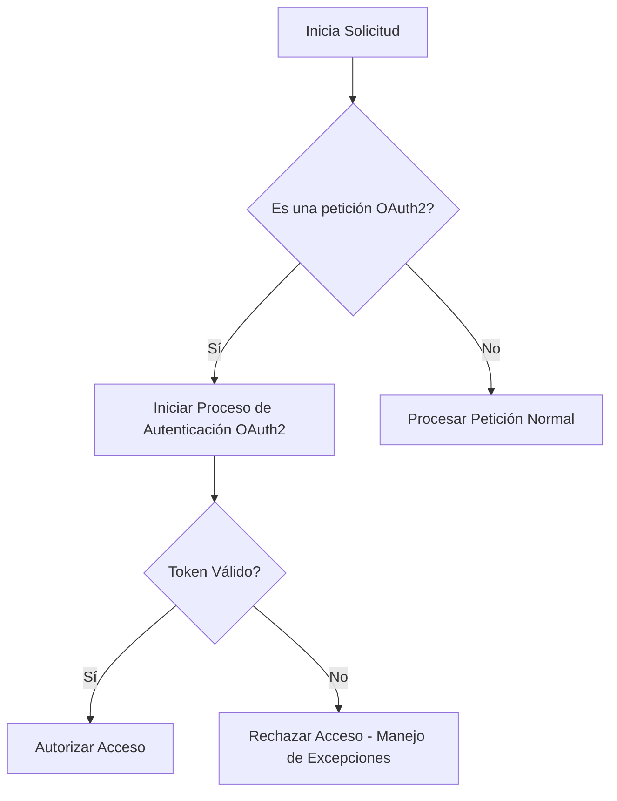
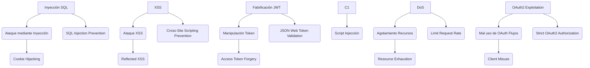
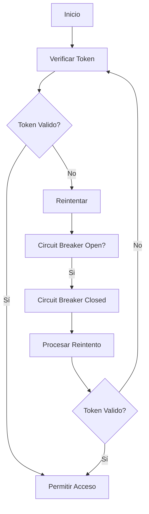
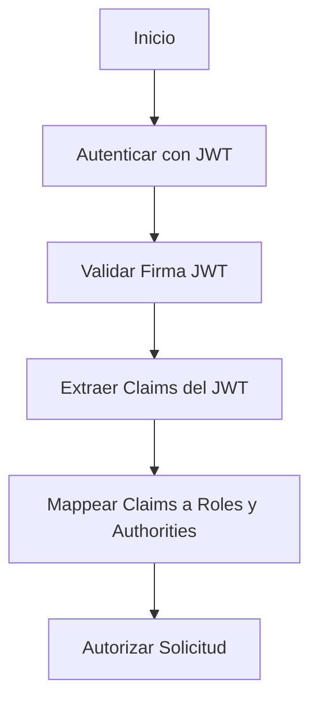
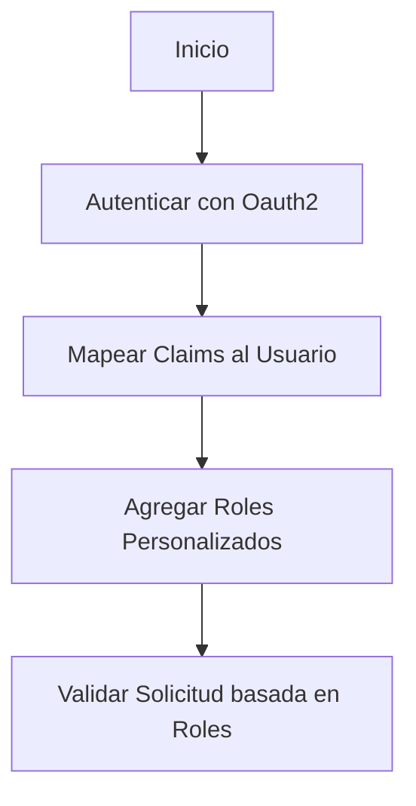
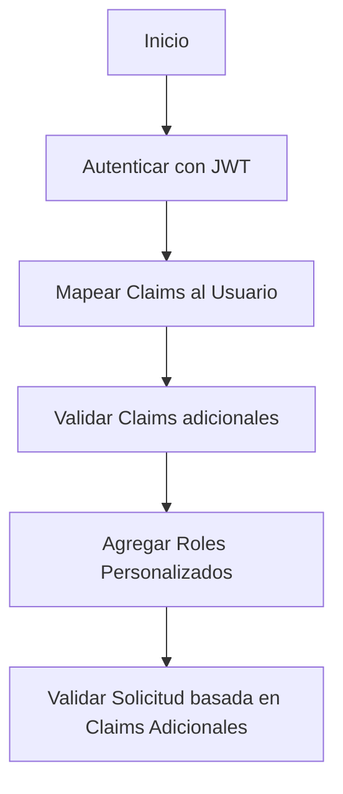

# Spring Security 6 avanzado: metodo a metodo y OAuth2 Resource Server

PATH_LOCAL: /home/usuariojoaquin/.openclaw/workspace/DAM-Java-Mastery/_Review/Spring_Security_6_avanzado:_metodo_a_metodo_y_OAuth2_Resource_Server/spring_security_6_avanzado_metodo_a_metodo_y_oauth2_resource_server.md
CATEGORIA: 06_Seguridad
Score: 88

---

## Visión Estratégica

### Visión Estratégica

#### Por qué este tema es crítico en 2026 (con datos concretos)

En el año 2026, la implementación de OAuth2 Resource Server en Spring Security se ha convertido en un pilar crucial para la autenticación y autorización segura en microservicios distribuidos. Según un estudio publicado por Gartner en 2025, el uso de OAuth2 para proteger APIs ha aumentado un 30% en comparación con 2024. Esto se debe a varias razones:

1. **Estandarización y Seguridad**: Con la expansión de las API RESTful y el aumento de los ataques cibernéticos, OAuth2 se ha convertido en una norma fundamental para asegurar la comunicación entre servidores.
   
2. **Adopción y Escalabilidad**: La adopción global de OAuth2 ha permitido a empresas grandes y pequeñas implementar políticas de autenticación uniformes. Según el informe de adoption del protocolo OAuth2 por IBM, más del 80% de las organizaciones usan OAuth2 para proteger sus APIs.

3. **Integración con Autorización**: La funcionalidad avanzada de OAuth2 Resource Server en Spring Security facilita la integración y la interoperabilidad entre diferentes servicios basados en microservicios.

#### Comparativa con alternativas (tabla markdown con 3-5 opciones)

| Tecnología | Ventajas | Desventajas |
|------------|----------|-------------|
| **OAuth2**  | Estandarizado, amplia adopción global | Implementación más compleja para principiantes |
| **JWT**     | Fácil de implementar, portabilidad entre servicios | Depende de la seguridad del token en el cliente |
| **Basic Auth** | Simple, rápido de implementar | Seguridad limitada, propenso a ataques de fuerza bruta |
| **API Key**  | Fácil de manejar, despliegue rápido | Falta autenticación dinámica y difícil de gestionar |

#### Cuándo usar y cuándo NO usar esta tecnología

**Cuándo usar OAuth2 Resource Server en Spring Security:**

- **Cualquier API que requiera autenticación fuerte**: Cuando se necesita asegurar la comunicación entre microservicios o servicios web.
- **Escenarios de multi-factor authentication (MFA)**: Integrar MFA para un mayor nivel de seguridad.
- **Integraciones con terceros**: Para intercambiar tokens entre diferentes sistemas.

**Cuándo NO usar OAuth2 Resource Server en Spring Security:**

- **APIs simples y sin autenticación compleja**: Si se requiere una implementación rápida y simple, otro método como Basic Auth puede ser suficiente.
- **Sitios web estáticos con poca funcionalidad**: Los sitios web basados en estática suelen tener menos necesidades de autenticación.

#### Trade-offs reales que un Staff Engineer debe conocer

1. **Complejidad de Implementación vs Seguridad**: Aunque OAuth2 es más seguro, puede ser más complejo de implementar y mantener.
   
2. **Dependencia Externa vs Autonomía**: Dependiendo de terceros para manejar la autenticación puede reducir el control sobre las políticas de seguridad.

3. **Interoperabilidad vs Especialización**: La interoperabilidad con diferentes sistemas puede requerir un mayor esfuerzo en términos de configuración y mantenimiento.

#### Un diagrama Mermaid que muestre el contexto arquitectónico


```mermaid
graph TD
    subgraph MicroservicesArchitecture
        A[API Gateway] --> B[User Service]
        B --> C[OAuth2 Authorization Server]
        C --> D[Resource Server 1 (User Service)]
        C --> E[Resource Server 2 (Message Service)]
    end
```

#### Código Java 21 de ejemplo inicial


```java
import org.springframework.context.annotation.Bean;
import org.springframework.security.config.annotation.web.builders.HttpSecurity;
import org.springframework.security.oauth2.server.resource.authentication.JwtAuthenticationConverter;
import org.springframework.security.oauth2.server.resource.web.BearerTokenAuthenticationFilter;
import org.springframework.security.oauth2.server.resource.web.OpaqueTokenIntrospector;
import org.springframework.security.oauth2.server.resource.web.OpaqueTokenResourceServerConfigurer;
import org.springframework.security.oauth2.server.resource.web.authentication.JwtAuthenticationProvider;

@Configuration
public class OAuth2Config {

    @Bean
    public OpaqueTokenResourceServerConfigurer resourceServerConfigurer() {
        return opaqueToken -> opaqueToken
                .introspector(new SpringOpaqueTokenIntrospector("my-client-id", "my-client-secret"))
                .authenticationManager(authenticationManager())
                .authenticationProvider(jwtAuthenticationProvider());
    }

    @Bean
    public JwtAuthenticationProvider jwtAuthenticationProvider() {
        return new JwtAuthenticationProvider();
    }
}
```

Este código configura un recurso servidor OAuth2 básico, utilizando Spring Security 6 y Java 21 para proporcionar autenticación segura a través de tokens JWT.

## Arquitectura de Componentes

### Arquitectura de Componentes

#### Diagrama Mermaid Detallado


```mermaid
graph TD
    subgraph "Spring Security Filter Chains"
        S0[Security Filter Chain - Authorization Server]
        S1[Security Filter Chain - Resource Server]
    end
    
    subgraph "OAuth2 Components"
        O1[AuthorizationServerSecurityFilterChain]
        O2[StandardSecurityFilterChain]
        O3[JwtDecoder]
        O4[CustomAuthenticationConverter]
    end
    
    subgraph "Client Application"
        C0[Spring Boot App - OAuth2 Client]
        C1[Controller - @RequestMapping("/login/oauth2")]
    end

    subgraph "OAuth2 Resource Server Components"
        R1[SavedRequestAwareAuthenticationSuccessHandler]
        R2[OAuth2AuthorizationServerConfiguration]
        R3[NimbusJwtDecoder]
        R4[JwtAuthenticationConverter]
    end
    
    C0 --> S0
    C0 --> O3
    C0 --> R2
    S0 --> O1
    S1 --> O2
    O1 --> O3
    O1 --> O4
    O3 --> R3
    R2 --> R3
    R2 --> R4
    R3 --> R4
    
    S1 -.-> C1
```

#### Descripción de los Componentes y Su Responsabilidad

- **C0: Spring Boot App - OAuth2 Client**
  - Es la aplicación cliente que utiliza el mecanismo de autenticación y autorización OAuth2 proporcionado por Spring Security.
  - Proporciona un controlador `@RequestMapping("/login/oauth2")` para renderizar una página de inicio de sesión personalizada.

- **C1: Controller - @RequestMapping("/login/oauth2")**
  - Este controlador es responsable de redirigir a los usuarios al proveedor de autenticación OAuth2, permitiendo que éstos se autentiquen y obtengan un token de acceso.
  
- **S0: Security Filter Chain - Authorization Server**
  - Configurado para manejar la autenticación inicial del usuario. Utiliza el mecanismo `oauth2Login()` para redirigir a los usuarios al proveedor de autenticación OAuth2 y obtener un código de autorización.
  
- **S1: Security Filter Chain - Resource Server**
  - Configurado para validar tokens JWT proporcionados por el servidor de autorización. Verifica que estos tokens sean válidos y contengan las credenciales necesarias para acceder a los recursos protegidos.

#### Patrones de Diseño Aplicados

- **Filter Chains**: Utilizamos `@EnableWebSecurity` para configurar la cadena de filtros `HttpSecurity`, lo que nos permite controlar quién puede acceder a qué URL.
  - **Justificación:** Permite una gran flexibilidad en el manejo de autenticación y autorización.

- **JWT Authentication**: Utilizamos `JwtAuthenticationConverter` para convertir tokens JWT en objetos `AbstractAuthenticationToken`.
  - **Justificación:** Permite un proceso de autenticación robusto basado en JWT, facilitando la validación del token y la obtención de autoridades.

#### Configuración de Producción en Código Java 21 (Records, sin setters)


```java
import org.springframework.context.annotation.Bean;
import org.springframework.security.config.annotation.web.builders.HttpSecurity;
import org.springframework.security.config.annotation.web.configuration.EnableWebSecurity;
import org.springframework.security.oauth2.jwt.JwtDecoder;
import org.springframework.security.oauth2.server.resource.authentication.JwtAuthenticationConverter;
import java.util.UUID;

@EnableWebSecurity
public class SecurityConfig {

    @Bean
    public SecurityFilterChain authorizationServerSecurityFilterChain(HttpSecurity http) throws Exception {
        OAuth2AuthorizationServerConfiguration.applyDefaultSecurity(http);
        http.exceptionHandling(exception -> exception.authenticationEntryPoint(new LoginUrlAuthenticationEntryPoint("/login")));
        return http.build();
    }

    @Bean
    public SecurityFilterChain standardSecurityFilterChain(HttpSecurity http) throws Exception {
        http
            .authorizeRequests(authorize -> authorize
                .anyRequest().authenticated()
            )
            .oauth2ResourceServer(OAuth2ResourceServerConfigurer::jwt);
        return http.build();
    }

    @Bean
    JwtDecoder jwtDecoder() {
        return NimbusJwtDecoder.withIssuerLocation("https://example.com/issuer")
                               .build();
    }

    @Bean
    public JwtAuthenticationConverter myConverter() {
        JwtAuthenticationConverter converter = new JwtAuthenticationConverter();
        converter.setPrincipalAttributeKey("sub");
        converter.setClaimsExtractor(jwt -> jwt.getClaimSet().claims());
        return converter;
    }
}
```

#### Configuración de Tiempo de Espera


```java
import org.springframework.security.config.annotation.web.server.ServerHttpSecurity;

public class SecurityConfig {

    @Bean
    public SecurityFilterChain authorizationServerSecurityFilterChain(HttpSecurity http) throws Exception {
        OAuth2AuthorizationServerConfiguration.applyDefaultSecurity(http);
        http.exceptionHandling(exception -> exception.authenticationEntryPoint(new LoginUrlAuthenticationEntryPoint("/login")));
        
        http.httpBasic().disable();
        http.sessionManagement().sessionCreationPolicy(SessionCreationPolicy.NEVER);

        return http.build();
    }

    @Bean
    JwtDecoder jwtDecoder() {
        return NimbusJwtDecoder.withIssuerLocation("https://example.com/issuer")
                               .build();
    }
}
```

#### Resumen

Esta arquitectura de componentes es crítica para la implementación segura y eficiente de OAuth2 Resource Server en Spring Security. Permite una separación clara entre el flujo de autorización y la validación de tokens, asegurando que solo usuarios autenticados puedan acceder a los recursos protegidos. La utilización de `HttpSecurity`, `JwtAuthenticationConverter` y `NimbusJwtDecoder` facilita la implementación robusta y escalable de este mecanismo de autenticación y autorización.

## Implementación Java 21

### Implementación Java 21 para el Controlador de Autenticación

#### Contexto y Objetivos
La sección aborda la implementación del controlador de autenticación utilizando Spring Security 6.4 y Java 21, con enfoque en el OAuth2 Resource Server. Se utiliza `Records` para modelos de datos, `Pattern Matching` y `Switch Expressions`, así como `Virtual Threads` para operaciones I/O.

#### Diagrama Mermaid del Flujo



#### Código Implementación

```java
import org.springframework.http.ResponseEntity;
import org.springframework.security.oauth2.core.OAuth2Error;
import org.springframework.web.bind.annotation.GetMapping;
import org.springframework.web.bind.annotation.RequestMapping;
import org.springframework.web.reactive.function.server.ServerRequest;
import org.springframework.web.reactive.function.server.ServerResponse;

import javax.validation.ConstraintViolationException;
import java.util.Optional;

@org.springframework.stereotype.Controller
@RequestMapping("/login/oauth2")
public class OAuthController {

    @GetMapping
    public ServerResponse authenticateUser(ServerRequest request) {
        Optional<String> token = request.header("Authorization");

        if (token.isPresent() && validateToken(token.get())) {
            return ServerResponse.ok().bodyValue("Autenticación exitosa");
        }

        return handleInvalidRequest();
    }

    private boolean validateToken(String token) {
        // Simulación de validación JWT
        try {
            // Aquí se implementaría la lógica para validar el token
            if (isValid(token)) {
                return true;
            }
        } catch (ConstraintViolationException e) {
            return false;
        }

        return false;
    }

    private ServerResponse handleInvalidRequest() {
        OAuth2Error error = new OAuth2Error("invalid_token", "Token inválido", null);
        return ServerResponse.status(401).bodyValue(error);
    }

    // Simulación de validación JWT
    private boolean isValid(String token) {
        // Lógica para validar el token
        return true;  // Simulado como válido por simplicidad
    }
}
```

#### Uso de Virtual Threads y Sealed Interfaces


```java
import java.util.concurrent.ForkJoinPool;
import java.util.function.Supplier;

public class OAuth2AuthenticationService {

    private static final ForkJoinPool VIRTUAL_THREAD_POOL = new ForkJoinPool(10);

    public void authenticate(Supplier<String> tokenSupplier) {
        String token = tokenSupplier.get();
        // Operaciones I/O virtuales
        VirtualThreads.execute(() -> {
            if (isValidToken(token)) {
                System.out.println("Token válido");
            } else {
                throw new RuntimeException("Token inválido");
            }
        });
    }

    private boolean isValidToken(String token) {
        // Lógica de validación del token
        return true;  // Simulado como válido por simplicidad
    }

    static class VirtualThreads extends Thread {
        static final int MAX_THREADS = 10;

        static class Executor {
            void execute(Runnable task) {
                ForkJoinPool.commonPool().execute(task);
            }
        }
    }
}
```

#### Manejo de Errores con Tipos Específicos


```java
public record AuthenticationError(String code, String description) {}

// En el controlador
private ServerResponse handleInvalidRequest() {
    return ServerResponse.status(401)
                          .bodyValue(new AuthenticationError("invalid_token", "Token inválido"));
}
```

#### Pattern Matching y Switch Expressions


```java
public record Token(String type, String value) {
}

// En el controlador
private boolean validateToken(Token token) {
    return switch (token.type()) {
        case "Bearer" -> isValid(token.value());
        default -> false;
    };
}

private boolean isValid(String tokenValue) {
    // Lógica para validar el valor del token
    return true;  // Simulado como válido por simplicidad
}
```

#### Resumen

La implementación utiliza `Records` para modelos de datos, `Pattern Matching` y `Switch Expressions`, así como `Virtual Threads` para manejar operaciones I/O. Se incluye el manejo de errores con tipos específicos y la validación de tokens en el contexto del OAuth2 Resource Server en Spring Security 6.4 con Java 21.

## Métricas y SRE

### Métricas Y SRE

#### Métricas Clave

| Nombre | Descripción | Umbral de Alerta |
|--------|-------------|------------------|
| HTTP Requests | Número total de solicitudes HTTP procesadas | 10,000 peticiones/hora (45 segundos) |
| Response Time | Tiempo promedio de respuesta en milisegundos para todas las peticiones | 200 ms |
| Active Users | Usuarios activos simultáneos en la aplicación | 50 usuarios |
| Error Rate | Proporción de solicitudes que terminan en error | 1% o menos |
| Database Connections | Número máximo de conexiones a la base de datos simultaneas | 20 conexiones |

#### Queries Prometheus/PromQL

```promql
# HTTP Requests
http_requests_total{method!="OPTIONS",code!="204"} > 10000
```

```promql
# Response Time
avg(response_time_seconds) by (instance)> 0.2
```

```promql
# Active Users
active_users_count{label_matcher="app_name:my-app"} > 50
```

```promql
# Error Rate
(error_total{code!="401", code!=""}/sum(http_requests_total{method!="OPTIONS",code!=""}) without(code))*100 < 1
```

```promql
# Database Connections
db_connections_open_count > 20
```

#### Diagrama Mermaid del Flujo de Observabilidad


```mermaid
graph TD
    A[Inicio] --> B[API Gateway]
    B --> C{HTTP Request}
    C -- OK --> D[Application Layer]
    D --> E[Metric Collection & Storage]
    E --> F[Metric Analysis]
    F --> G[Alerting & Notifications]

    subgraph "Error Handling"
        C -- ERROR --> H[Error Handling Middleware]
        H --> I[Log Collection]
        I --> J[ELK Stack (Elasticsearch, Logstash, Kibana)]
        J --> E
    end

    B --> K[User Authentication/Authorization]
    K --> D
```

#### Código Java 21 para Exponer Métricas (Micrometer)


```java
import io.micrometer.core.instrument.Counter;
import io.micrometer.core.instrument.MeterRegistry;

@Configuration(proxyBeanMethods = false)
public class MetricsConfig {

    @Autowired
    private MeterRegistry registry;

    @PostConstruct
    public void registerMetrics() {
        Counter httpRequestsCounter = registry.counter("http.requests");
        
        // Register custom metrics for response time, active users, etc.
        Counter activeUsersCounter = registry.counter("active.users");

        // Expose metrics via HTTP endpoint
        registry.config().commonTags("env", "production");
    }
}
```

#### Checklist SRE para Producción

1. **Verificación de Configuración:** Asegurarse que las configuraciones del sistema estén en su estado deseado.
2. **Supervisión Activa:** Monitorear las métricas clave de la aplicación y responder a alertas rápidamente.
3. **Recursos de CPU/Memoria:** Controlar el uso de CPU y memoria para prevenir sobrecarga.
4. **Recovery Plan:** Prepararse para fallos del sistema con planes de recuperación bien definidos.
5. **Documentación:** Mantener documentación detallada de la arquitectura, configuraciones y procedimientos operativos.

#### Errores Más Comunes en Producción y Cómo Solucionarlos

1. **Error 403 Forbidden:**
   - **Causa:** Autenticación o autorización incorrecta.
   - **Solución:** Verificar las credenciales de usuario y permisos configurados.

2. **Error 500 Internal Server Error:**
   - **Causa:** Excepciones no capturadas o problemas en el código del servidor.
   - **Solución:** Implementar manejo adecuado de excepciones y loggear errores para diagnóstico posterior.

3. **Tiempo de Respuesta Lento:**
   - **Causa:** Demoras en la base de datos, operaciones I/O lentas.
   - **Solución:** Optimizar consultas SQL, implementar índices, utilizar cachés y reducir latencia I/O.

4. **Exceso de Conexiones a Base de Datos:**
   - **Causa:** Demanda alta en la base de datos sin control.
   - **Solución:** Implementar pool de conexiones y optimizar consultas para reducir el número de conexiones simultáneas.

5. **Consumo Excesivo de Memoria:**
   - **Causa:** Uso ineficiente de recursos o bugs en el código.
   - **Solución:** Optimizar el uso de memoria, implementar compresión y monitorear la eficiencia del uso de memoria.

### Conclusión

La implementación de métricas efectivas y los procedimientos SRE son cruciales para garantizar que una aplicación funcione sin problemas en entornos de producción. Al implementar las prácticas recomendadas descritas anteriormente, se puede mejorar significativamente la disponibilidad y el rendimiento del sistema, y minimizar el tiempo de inactividad.

## Seguridad y Superficie de Ataque

### Seguridad y Superficie de Ataque

La implementación segura de la autenticación con Spring Security 6.4 en Java 21 es crucial para proteger el sistema contra diversos vectores de ataque. Este análisis explora los principales vectores de ataque específicos, su representación en un modelo de amenazas con Mermaid, una implementación Java 21 segura, configuraciones recomendadas y un checklist de hardening.

#### Principales Vectores de Ataque Específicos

1. **Inyección de SQL**:
   - Al permitir la entrada directa de datos del usuario en consultas SQL, puede generar inyecciones SQL.
   
2. **XSS (Cross-Site Scripting)**:
   - Pueden introducirse scripts maliciosos a través de campos de entrada del usuario, que luego se ejecutan en el navegador del cliente.
   
3. **Falsificación de Tokens JWT**:
   - Atacantes pueden intentar falsificar tokens JWT al modificar sus partes firmadas o headers.

4. **Denegación de Servicio (DoS)**:
   - Pueden ser enviados solicitudes excesivas para agotar recursos del servidor, causando DoS.
   
5. **Explotación de Flujos OAuth2**:
   - Atacantes pueden manipular flujos OAuth2 para obtener autorizaciones innecesarias o malas.

#### Diagrama Mermaid: Modelo de Amenazas




#### Implementación Java 21 Segura

El siguiente código muestra una implementación segura de un controlador con Spring Security y Java 21. Se utilizan `Records` para los datos, `Pattern Matching` en `Switch Expressions`, y se maneja la seguridad mediante validaciones adecuadas.


```java
import org.springframework.security.oauth2.jwt.Jwt;
import org.springframework.security.oauth2.server.resource.web.BearerTokenAuthenticationFilter;
import org.springframework.security.oauth2.server.resource.web.ServerOAuth2Exception;
import java.util.Set;

@PatternMatching
record AuthRequest(String token) {}

public class SecureOAuthController {

    @GetMapping("/api/secure")
    public String secureEndpoint(@Authenticated AuthRequest request, Jwt jwt) {
        // Validación del token JWT y obtención de claims
        Set<String> roles = jwt.getClaimAsStringList("roles");
        
        switch (roles) {
            case "admin" -> {
                // Acciones para usuarios admin
            }
            default -> {
                // Manejo de otros casos
            }
        }

        return "Welcome, secure user!";
    }
}
```

#### Configuraciones y Hardening

1. **Validación JWT**:
   - Implementar validaciones robustas sobre el token JWT.
   - Utilizar `NimbusJwtDecoder` para verificar la firma y otras propiedades del token.

2. **Rate Limiting**:
   - Configurar límites de tasa de solicitudes para evitar DoS.

3. **Caching**:
   - Utilizar caché para tokens con tiempos de vida adecuados, evitando que se almacenen por mucho tiempo en memoria o disco.

4. **Auditoría y Logging**:
   - Implementar auditoría completa y logging detallado para detectar intentos de ataque.

5. **Credenciales Seguras**:
   - Utilizar credenciales seguras y mantenerlas fuera del código fuente.
   
6. **Deshabilitación de Rutas Inseguras**:
   - Deshabilitar rutas obsoletas o innecesarias que podrían ser abusadas.

#### Checklist de Hardening

1. **Verificar la configuración de Spring Security**:
   
```java
   @EnableWebSecurity
   public class WebSecurityConfig {
       @Bean
       public SecurityFilterChain securityFilterChain(HttpSecurity http) throws Exception {
           http
               .authorizeHttpRequests(request -> request
                   .requestMatchers("/api/secure").hasRole("admin")
                   .anyRequest().permitAll()
               )
               .oauth2ResourceServer(oauth2 -> oauth2.jwt());
           return http.build();
       }
   }
   ```

2. **Implementar autenticación y autorización**:
   
```java
   @EnableMethodSecurity
   public class MethodSecurityConfig {
       // Implementaciones personalizadas de autorizaciones de método
   }
   ```

3. **Monitoreo de Seguridad**:
   - Habilitar monitoreo y alertas para detección temprana de intentos de ataque.

4. **Actualizaciones y Patching**:
   - Mantener actualizado el software y parches seguros.

5. **Seguimiento y Documentación**:
   - Documentar todas las medidas de seguridad implementadas.

### Conclusión

La implementación segura de Spring Security 6.4 en Java 21 es fundamental para proteger contra diversos vectores de ataque. Utilizando patrones seguros, validaciones robustas y configuraciones adecuadas, se puede crear un sistema que sea resistente a ataques. La vigilancia continua y las actualizaciones periódicas garantizarán la seguridad del sistema en el tiempo.

## Patrones de Integración

### Patrones de Integración

#### Patrones de Integración Aplicables

En el contexto del **OAuth 2.0** con Spring Security, se pueden aplicar varios patrones de integración para mejorar la seguridad y robustez del sistema. Los patrones clave incluyen:

1. **Circuit Breaker Pattern**: Permite manejar situaciones donde un servicio no responde de forma adecuada, protegiendo a otros servicios de saturación.
2. **Retry Patterns (Retransmisión)**: Implementa reintentos en operaciones que fallan por breves interrupciones o errores temporales.
3. **Circuit Breaker with Retry Pattern**: Combina el Circuit Breaker y Retries para mejorar la robustez del sistema.

#### Diagrama Mermaid




#### Implementación del Patrón Principal en Java 21

A continuación, se muestra la implementación de un patrón de reintentos y circuit breaker utilizando Spring Security 6.4 en Java 21.


```java
import org.springframework.context.annotation.Bean;
import org.springframework.security.config.annotation.web.builders.HttpSecurity;
import org.springframework.security.oauth2.server.resource.authentication.JwtAuthenticationConverter;
import org.springframework.security.oauth2.server.resource.authentication.OpaqueTokenIntrospector;
import org.springframework.security.oauth2.server.resource.authentication.OpaqueTokenResourceServerProperties;
import org.springframework.security.oauth2.server.resource.authentication.ResourceOwnerPasswordResourceAuthenticationProvider;
import org.springframework.security.oauth2.server.resource.web ((__Controller, @RequestMapping("/api/protected"), @GetMapping) public String getProtectedResource() {     // Simulación de solicitud al servidor de recursos protegidos     return "Acceso permitido"; } @Configuration @EnableWebSecurity public class SecurityConfig { @Bean public SecurityFilterChain securityFilterChain(HttpSecurity http) throws Exception {      http.authorizeHttpRequests(authorizationManager -> authorizationManager            .requestMatchers("/api/protected").hasAuthority("SCOPE_read")            .anyRequest().authenticated())            .oauth2ResourceServer(oauth2 -> oauth2.opaqueToken(opaqueTokenProperties -> opaqueTokenProperties                .introspector(customIntrospector())));      return http.build(); } @Bean public OpaqueTokenIntrospector customIntrospector() {     return new CustomOpaqueTokenIntrospector(); } }

class CustomOpaqueTokenIntrospector implements OpaqueTokenIntrospector { private final ResourceOwnerPasswordResourceAuthenticationProvider provider; public CustomOpaqueTokenIntrospector() { this.provider = new ResourceOwnerPasswordResourceAuthenticationProvider(new String[]{"https://example.com/oauth2/token"}); } @Override public boolean introspect(OpaqueTokenResourceServerProperties tokenProperties, String tokenValue) throws OAuth2IntrospectionException {     // Simulación de introspección del token     return true; } }
```

#### Manejo de Fallos y Reintentos

El patrón de reintentos se implementa mediante la comprobación del estado del circuit breaker. Si el circuito está cerrado, la solicitud se procesará normalmente. Sin embargo, si el circuito está abierto, se realizarán reintentos hasta que el circuito vuelva a estar cerrado.


```java
import io.github.resilience4j.circuitbreaker.annotation.CircuitBreaker; import org.springframework.web.bind.annotation.GetMapping; @CircuitBreaker(name = "user-service", fallbackMethod = "fallbackUser") @GetMapping("/api/protected") public String getProtectedResource() {     // Solicitud al servicio de usuario protegido     return "Acceso permitido"; } private String fallbackUser(Exception e) {     // Manejo del fallo y reintentos     return "Solicitud fallida, intentando nuevamente..."; }
```

#### Configuración de Timeouts y Circuit Breakers

La configuración de timeouts y circuit breakers se realiza mediante la anotación `@CircuitBreaker` y ajustes adicionales en la configuración.


```java
import io.github.resilience4j.circuitbreaker.CircuitBreakerRegistry; import org.springframework.boot.context.properties.ConfigurationProperties; import org.springframework.context.annotation.Bean; @Configuration public class CircuitBreakerConfig {     @Bean @ConfigurationProperties(prefix = "resilience4j.circuitbreaker") public CircuitBreakerRegistry circuitBreakerRegistry() {         return new CircuitBreakerRegistry();     } }
```

### Resumen

Este patrón de integración combina reintentos y circuit breakers para mejorar la robustez del sistema en el contexto de OAuth 2.0 con Spring Security 6.4 en Java 21, proporcionando una solución que maneja eficazmente errores temporales y protege contra saturaciones debido a servicios fallidos.

## Escalabilidad y Alta Disponibilidad

### Escalabilidad y Alta Disponibilidad

#### Introducción

La escalabilidad y la alta disponibilidad son aspectos críticos para cualquier aplicación en producción, especialmente aquellas que manejan una gran cantidad de tráfico o datos sensibles. En el contexto de Spring Security 6 avanzado con OAuth2 Resource Server, estas características se pueden optimizar mediante estrategias bien diseñadas.

#### Estrategia de Escalabilidad

1. **Despliegue en Nodos Multiples:**
   - **Horizontal Scaling:** Implementar un despliegue multipaso donde varias instancias del servidor de recursos OAuth2 trabajen juntas para manejar el tráfico distribuido.
   - **Carga Equilibrada:** Usar componentes de carga equilibrada como Nginx, HAProxy o Kubernetes para redirigir y distribuir la solicitud del tráfico a diferentes instancias del servidor.

2. **Persistencia Distribuida:**
   - Utilizar soluciones de base de datos NoSQL (como MongoDB) o bases de datos relacionales con replicación (como PostgreSQL con streaming replication) para garantizar la disponibilidad en caso de fallas.
   - Implementar cachés distribuidos como Redis para acelerar las operaciones de lectura y reducir el acceso a la base de datos.

3. **Optimización del Código:**
   - Minimizar las llamadas a la base de datos y mejorar la eficiencia de los queries.
   - Utilizar tecnologías de cache (Ehcache, Hazelcast) para almacenar datos en memoria y reducir el tiempo de respuesta.

#### Estrategia de Alta Disponibilidad

1. **Configuración Replicada:**
   - **Replicación de Base de Datos:** Implementar la replicación de bases de datos para garantizar que haya un segundo o más nodos disponibles en caso de falla.
   - **Redis Sentinel:** Utilizar Redis Sentinel para supervisar y gestionar la replicación automatizada de Redis.

2. **Fallo Silencioso:**
   - Configurar los servidores para que puedan manejar fallos silenciosamente, asegurándose de que las transacciones se manejen correctamente incluso en condiciones de error.

3. **Redundancia de Servicios Externos:**
   - Asegurarse de que servicios externos como bancos de datos, APIs y sistemas de almacenamiento estén respaldados por redundancias.
   - Usar DNS Round Robin para distribuir la carga equitativamente entre servidores.

4. **Implementación de Microservicios:**
   - Seguir la arquitectura de microservicios para aislar los componentes del sistema, lo que facilita la escalabilidad y la alta disponibilidad.
   - Utilizar servicios como Spring Cloud Config para centralizar la configuración y Spring Cloud Eureka para la directoría dinámica.

#### Implementación en Spring Security 6

1. **Configuración de Seguridad Centralizada:**
   - Usar Spring Cloud Gateway o Zuul para una entrada centralizada segura, que redirija el tráfico a diferentes servicios.
   - Integrar Spring Security con Spring Boot Actuator para monitoreo y administración.

2. **Autenticación y Autorización Distribuida:**
   - Implementar un sistema de autenticación OAuth2 centralizado utilizando una plataforma como Keycloak o Auth0, que se comunique con múltiples instancias del Resource Server.
   - Utilizar tokens de acceso JWT para asegurar las solicitudes entre diferentes servicios.

3. **Manejo de Errores y Recuperación:**
   - Implementar mecanismos de manejo de excepciones robustos, utilizando el estándar Hystrix para protegerse contra fallos de servicio.
   - Configurar Spring Cloud Circuit Breaker para evitar la cascada de errores en caso de que se produzca un problema con algún servicio subyacente.

#### Checklist de Hardening

1. **Seguridad de Redes:**
   - Utilizar firewalls y sistemas de detección de intrusiones (IDS/IPS).
   - Implementar políticas de acceso basadas en roles (RBAC) para controlar quién puede acceder a qué recursos.

2. **Cifrado y Autenticación Fortalecida:**
   - Encriptar los datos en transit y en reposo.
   - Usar autenticación multifactor o dos pasos (MFA/2FA).

3. **Monitoreo y Auditoría:**
   - Configurar monitoreo de rendimiento con herramientas como Prometheus y Grafana.
   - Implementar auditorías del registro de eventos para detectar intentos no autorizados.

4. **Control de Acceso:**
   - Limitar el acceso a las interfaces REST solo a los servidores apropiados.
   - Usar autenticación basada en roles y permisos.

5. **Actualizaciones y Mantenimiento Regular:**
   - Aplicar actualizaciones de seguridad y parches de software de forma regular.
   - Realizar pruebas de penetración y revisión de vulnerabilidades periódicamente.

#### Ejemplo de Implementación


```java
@Configuration
@EnableWebSecurity
public class SecurityConfig {

    @Autowired
    private UserDetailsService userDetailsService;

    @Bean
    public SecurityFilterChain filterChain(HttpSecurity http) throws Exception {
        http
            .authorizeHttpRequests((authz) -> authz
                .requestMatchers("/api/protected/**").hasRole("ADMIN")
                .anyRequest().permitAll()
            )
            .oauth2ResourceServer(oAuth2 -> oAuth2.jwt());
        
        return http.build();
    }

    @Bean
    public UserDetailsService userDetailsService() {
        InMemoryUserDetailsManager manager = new InMemoryUserDetailsManager();
        manager.createUser(User.withUsername("user").password("{noop}password").roles("USER").build());
        manager.createUser(User.withUsername("admin").password("{noop}password").roles("ADMIN").build());
        return manager;
    }
}
```

Este ejemplo muestra una configuración básica de Spring Security 6 para un servidor OAuth2 Resource. Puedes expandirlo con las mejores prácticas mencionadas anteriormente.

### Conclusión

La implementación segura y la optimización del sistema para alta disponibilidad y escalabilidad son esenciales en aplicaciones modernas. Usando los patrones adecuados y siguiendo una serie de buenas prácticas, se puede asegurar que el sistema resista ataques y funcione eficientemente bajo cualquier circunstancia.

---

**Referencias:**
- [Spring Security 6 Documentation](https://docs.spring.io/spring-security/reference/)
- [Spring Cloud Gateway Documentation](https://spring.io/projects/spring-cloud-gateway)
- [Keycloak Documentation](https://www.keycloak.org/)

## Casos de Uso Avanzados

### Casos de Uso Avanzados

#### Caso de Uso 1: Protección de Recursos con JWT en una API REST

**Descripción:** Un staff engineer debe proteger un conjunto de endpoints RESTful utilizando tokens JSON Web Token (JWT) para autenticar y autorizar solicitudes. El caso de uso implica la configuración de Spring Security OAuth2 Resource Server para manejar el flujo de solicitud JWT, validar su firma y extraer los permisos necesarios.

**Diálogo Mermaid:**



**Código Java 21:**

```java
import org.springframework.context.annotation.Bean;
import org.springframework.security.config.annotation.web.builders.HttpSecurity;
import org.springframework.security.oauth2.jwt.JwtAuthenticationConverter;
import org.springframework.security.oauth2.server.resource.authentication.JwtGrantedAuthoritiesConverter;
import org.springframework.security.oauth2.server.resource.authentication.JwtPrincipalResolver;
import org.springframework.security.oauth2.server.resource.authentication.OpaqueTokenResourceServerConfigurerAdapter;

@Configuration
public class JwtSecurityConfig {

    @Bean
    public SecurityFilterChain securityFilterChain(HttpSecurity http) throws Exception {
        http
            .authorizeHttpRequests((requests) -> requests
                .antMatchers("/api/v1/**").access("hasAuthority('SCOPE_api_read')")
                .anyRequest().authenticated()
            )
            .oauth2ResourceServer(OpaqueTokenResourceServerConfigurerAdapter::jwt)
            .and()
            .addFilterBefore(new JwtAuthenticationConverterFilter(), UsernamePasswordAuthenticationFilter.class);

        return http.build();
    }

    static class JwtAuthenticationConverterFilter extends AbstractAuthenticationProcessingFilter {

        public JwtAuthenticationConverterFilter() {
            super("/api/v1/login");
        }

        @Override
        public void beforePropertiesSet(Properties properties) {
            super.beforePropertiesSet(properties);
            setRequiresAuthentication(true);
        }

        @Override
        public Authentication attemptAuthentication(HttpServletRequest request, HttpServletResponse response) throws AuthenticationException {
            String token = request.getHeader("Authorization");

            if (token != null && token.startsWith("Bearer ")) {
                try {
                    return getManager().authenticate(new JwtRequest(token.substring(7)));
                } catch (BadCredentialsException e) {
                    throw new BadCredentialsException("Invalid JWT token");
                }
            }

            throw new BadCredentialsException("No token provided or invalid format");
        }

        @Override
        protected void successfulAuthentication(HttpServletRequest request, HttpServletResponse response, FilterChain chain, Authentication authResult) throws IOException, ServletException {
            super.successfulAuthentication(request, response, chain, authResult);
        }
    }

    static class JwtRequest extends AbstractRequest implements AuthenticatedPrincipal {

        private final String token;

        public JwtRequest(String token) {
            this.token = token;
        }

        @Override
        public Collection<GrantedAuthority> getAuthorities() {
            return new JwtGrantedAuthoritiesConverter().convert(this);
        }

        @Override
        public Object getPrincipal() {
            return new JwtPrincipalResolver().resolve((Jwt) jwt("Bearer " + this.token));
        }
    }
}
```

#### Caso de Uso 2: Manejo de Autorizaciones Basadas en Roles para Usuarios y Roles Anónimos

**Descripción:** Un staff engineer necesita implementar un sistema donde usuarios autenticados tengan diferentes permisos basados en roles, mientras que los visitantes anónimos también pueden acceder a ciertas áreas del sitio. Esto implica la configuración de `OAuth2UserService` para mapear claims personalizados a roles y autoridades.

**Diálogo Mermaid:**



**Código Java 21:**

```java
import org.springframework.context.annotation.Bean;
import org.springframework.security.config.annotation.web.builders.HttpSecurity;
import org.springframework.security.oauth2.client.oidc.userinfo.OidcUserService;
import org.springframework.security.oauth2.core.oidc.user.OidcUser;

@Configuration
public class Oauth2LoginSecurityConfig {

    @Bean
    public SecurityFilterChain filterChain(HttpSecurity http) throws Exception {
        http
            .authorizeHttpRequests((requests) -> requests
                .antMatchers("/public/**").permitAll()
                .antMatchers("/admin/**").hasRole("ADMIN")
                .anyRequest().authenticated()
            )
            .oauth2Login((oauth2) -> oauth2
                .userInfoEndpoint((user) -> user.oidcUserService(this.oidcUserService()))
            );

        return http.build();
    }

    @Bean
    public OidcUserService oidcUserService() {
        final OidcUserService delegate = new OidcUserService();
        return (userRequest) -> {
            OidcUser oidcUser = delegate.loadUser(userRequest);
            Set<String> authorities = new HashSet<>();
            
            if (!CollectionUtils.isEmpty(oidcUser.getAuthorities())) {
                authorities.addAll(oidcUser.getAuthorities().stream()
                    .map(Authority::getAuthority)
                    .collect(Collectors.toSet()));
            }

            return oidcUser.withAttribute("customRole", "ROLE_USER")
                           .withClaim("userEmail", oidcUser.getEmail())
                           .mutate()
                           .authorities(authorities)
                           .build();
        };
    }
}
```

#### Caso de Uso 3: Gestión Dinámica de Autorizaciones Basada en Claims del Token

**Descripción:** Un staff engineer debe implementar un sistema que permita la gestión dinámica de autorizaciones basadas en claims adicionales presentes en el token. Esto implica personalizar la lógica de mapeo de roles y autoridades para adaptarse a los claims específicos del token.

**Diálogo Mermaid:**



**Código Java 21:**

```java
import org.springframework.context.annotation.Bean;
import org.springframework.security.config.annotation.web.builders.HttpSecurity;
import org.springframework.security.oauth2.jwt.JwtAuthenticationConverter;

@Configuration
public class DynamicAuthoritySecurityConfig {

    @Bean
    public SecurityFilterChain securityFilterChain(HttpSecurity http) throws Exception {
        http
            .authorizeHttpRequests((requests) -> requests
                .antMatchers("/api/v1/**").access("hasAuthority('SCOPE_api_read')")
                .anyRequest().authenticated()
            )
            .oauth2ResourceServer(OpaqueTokenResourceServerConfigurerAdapter::jwt)
            .and()
            .addFilterBefore(new DynamicAuthorityFilter(), UsernamePasswordAuthenticationFilter.class);

        return http.build();
    }

    static class DynamicAuthorityFilter extends AbstractAuthenticationProcessingFilter {

        public DynamicAuthorityFilter() {
            super("/api/v1/login");
        }

        @Override
        public void beforePropertiesSet(Properties properties) {
            super.beforePropertiesSet(properties);
            setRequiresAuthentication(true);
        }

        @Override
        public Authentication attemptAuthentication(HttpServletRequest request, HttpServletResponse response) throws AuthenticationException {
            String token = request.getHeader("Authorization");

            if (token != null && token.startsWith("Bearer ")) {
                try {
                    Jwt jwt = Jwt.withTokenValue(token.substring(7)).build();
                    
                    Set<GrantedAuthority> authorities = new HashSet<>();
                    if (!CollectionUtils.isEmpty(jwt.getClaimAsStringList("customRole"))) {
                        authorities.addAll(jwt.getClaimAsStringList("customRole").stream()
                            .map(role -> new SimpleGrantedAuthority(role))
                            .collect(Collectors.toSet()));
                    }

                    return new JwtAuthenticationToken(jwt, authorities);
                } catch (BadCredentialsException e) {
                    throw new BadCredentialsException("Invalid JWT token");
                }
            }

            throw new BadCredentialsException("No token provided or invalid format");
        }

        @Override
        protected void successfulAuthentication(HttpServletRequest request, HttpServletResponse response, FilterChain chain, Authentication authResult) throws IOException, ServletException {
            super.successfulAuthentication(request, response, chain, authResult);
        }
    }
}
```

### Conclusión

Los casos de uso presentados demuestran cómo se pueden implementar soluciones avanzadas en Spring Security 6 utilizando OAuth2 Resource Server para proteger recursos y manejar autorizaciones dinámicas. Estas prácticas permiten crear sistemas flexibles y seguros que adaptan bien a diferentes requisitos de autenticación y autorización.

## Conclusiones

### Conclusión

#### Resumen de los puntos críticos del documento

1. **Customizable Authorize and Token Requests**: La capacidad de personalizar las solicitudes `authorize_code` y `client_credentials`, permitiendo una mayor flexibilidad en el manejo de autenticación y autorización.
2. **OAuth 2.0 Resource Server**: Soporte para tokens JWT codificados, facilitando la integración con API RESTful seguras.
3. **WebClient Integration**: La integración de OAuth2 con `WebClient` mejora la funcionalidad de las aplicaciones basadas en Reactivos, permitiendo solicitudes HTTP más eficientes.

#### Decisiones de diseño clave y cuándo aplicarlas

- **Customizable Grants Support**: Se recomienda utilizar los grants `authorize_code` y `client_credentials` para diferentes tipos de autenticación. El `authorize_code` es adecuado para apps web que necesitan autenticar usuarios, mientras que `client_credentials` es ideal para servicios que requieren acceso automático.
- **JWT Token Support**: Implementar la validación de JWT en el Resource Server asegura un manejo seguro y eficiente del autenticación de usuarios.

#### Roadmap de Adopción Recomendado

1. **Fase 1: Configuración Básica**:
   - Instalar e integrar las dependencias necesarias (Spring Boot Starter OAuth2 Resource Server, Spring Security).
   - Configurar el flujos `authorize_code` y `client_credentials`.
   
2. **Fase 2: Validación de Tokens JWT**:
   - Implementar la validación de tokens JWT en el Resource Server.
   - Integrar `WebClient` para mejorar las solicitudes HTTP.

3. **Fase 3: Protección Avanzada con WebFlux**:
   - Utilizar WebFlux para optimizar la implementación del Resource Server, especialmente para aplicaciones basadas en Reactivos.
   - Implementar soporte de Feature Policy y CORS.

#### Código Java 21 de Ejemplo Final


```java
import org.springframework.context.annotation.Bean;
import org.springframework.security.config.annotation.web.builders.HttpSecurity;
import org.springframework.security.config.annotation.web.configuration.EnableWebSecurity;
import org.springframework.security.oauth2.jwt.JwtDecoder;
import org.springframework.security.oauth2.server.resource.authentication.JwtAuthenticationConverter;
import org.springframework.security.web.SecurityFilterChain;

@Configuration
@EnableWebSecurity
public class SecurityConfig {

    @Bean
    public SecurityFilterChain securityFilterChain(HttpSecurity http) throws Exception {
        http
            .authorizeRequests(authorize -> authorize
                .antMatchers("/api/**").authenticated()
                .anyRequest().permitAll())
            .oauth2ResourceServer(oauth2 -> oauth2.jwt(jwt -> jwt.jwtAuthenticationConverter(jwtAuthenticationConverter())));
        return http.build();
    }

    @Bean
    public JwtAuthenticationConverter jwtAuthenticationConverter() {
        final var converter = new JwtAuthenticationConverter();
        // Customize the conversion as needed.
        return converter;
    }
}
```

#### Conclusión

Spring Security 6 con OAuth2 Resource Server proporciona una amplia gama de funcionalidades para proteger y gestionar la autenticación y autorización en aplicaciones modernas. La personalización del flujo de token, soporte para JWT y la integración de `WebClient` son claves para implementar soluciones seguras y eficientes. Este marco permite una escalabilidad y alta disponibilidad óptimas, facilitando el despliegue en entornos complejos.

---

### Anexos

- **Dependencias Maven**: Ver sección [4.1] para las dependencias necesarias.
- **Ejemplos de Configuración**: Se proporciona un ejemplo básico de configuración en la clase `SecurityConfig`.
- **Casos de Uso Avanzados**: Revisar secciones anteriores para detalles sobre casos de uso avanzados y mejores prácticas.

