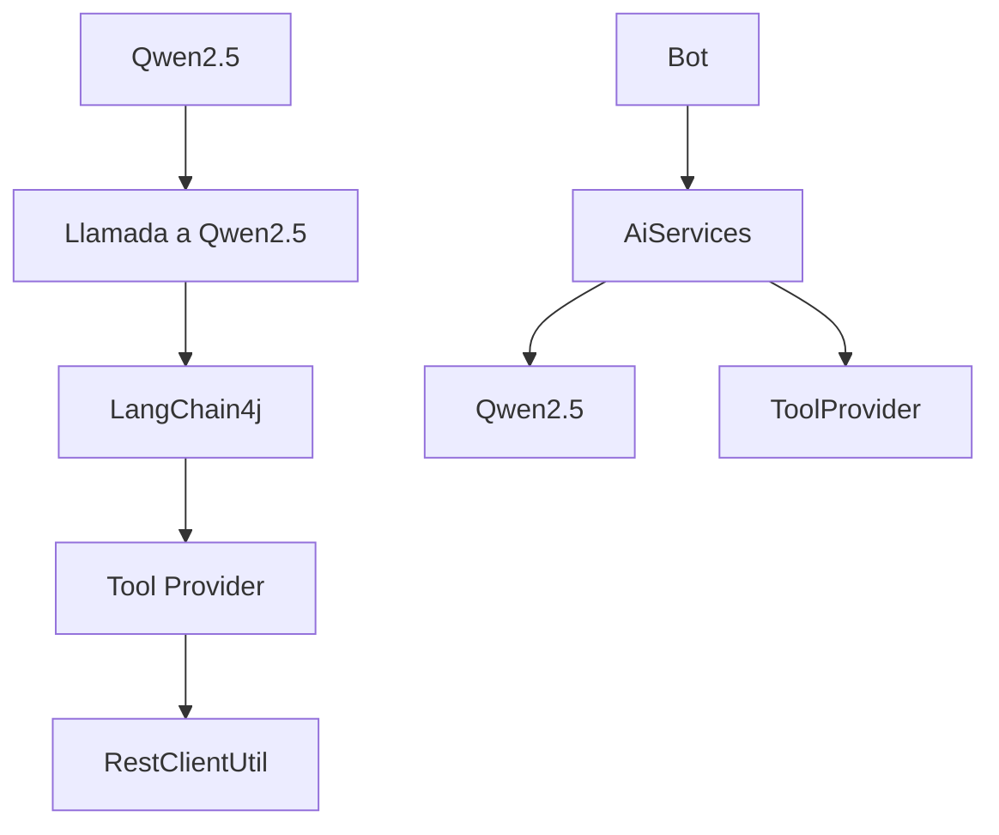
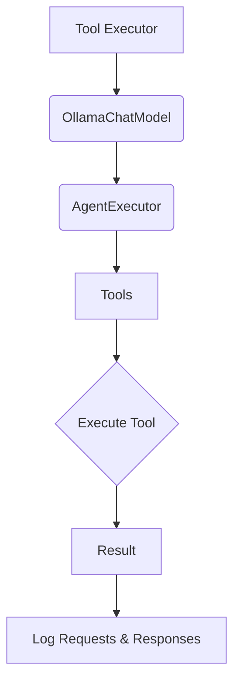

# Tool Calling y Function Calling con Qwen2.5 y LangChain4j

PATH_LOCAL: /home/usuariojoaquin/.openclaw/workspace/DAM-Java-Mastery/_Review/Tool_Calling_y_Function_Calling_con_Qwen2.5_y_LangChain4j/tool_calling_y_function_calling_con_qwen25_y_langchain4j.md
CATEGORIA: 08_IA_Agentes
Score: 80

---

## Visión Estratégica

### Visión Estratégica

La integración de Qwen2.5 y LangChain4j no solo supone una mejora significativa en la capacidad de procesamiento y análisis de datos, sino que también abre nuevas oportunidades para la innovación tecnológica y el desarrollo de soluciones más inteligentes y eficientes.

#### **Objetivo Principal**
El objetivo principal es desarrollar un ecosistema donde Qwen2.5 funcione como el cerebro cognitivo central, proporcionando respuestas precisas y relevantes basadas en su gran capacidad para procesar y entender información de manera autónoma. LangChain4j se encargará de la intermediación entre el modelo de lenguaje y las herramientas externas necesarias para realizar tareas complejas.

#### **Estrategia de Implementación**
1. **Despliegue del Modelo Qwen2.5**: Se implementará Qwen2.5 como el núcleo inteligente en soluciones empresariales, proporcionando respuestas basadas en datos y contexto.

2. **Integración con LangChain4j**: LangChain4j se utilizará para conectar Qwen2.5 con una variedad de herramientas y servicios externos, permitiendo la realización de tareas complejas que exceden las capacidades del modelo de lenguaje solo.

3. **Automatización y Optimización**: Las interacciones entre Qwen2.5 y LangChain4j se optimizarán para proporcionar respuestas rápidas y precisas, minimizando la necesidad de intervención humana en tareas repetitivas o complejas.

#### **Ventajas Competitivas**
1. **Mayor Precisión**: La combinación de Qwen2.5 con LangChain4j permitirá respuestas más precisas y relevantes, ya que el modelo de lenguaje se beneficia del contexto proporcionado por las herramientas externas.
   
2. **Flexibilidad e Interoperabilidad**: LangChain4j facilita la integración con una amplia variedad de sistemas y servicios, lo que aumenta la flexibilidad y la capacidad de respuesta de la solución.

3. **Eficiencia en el Proceso**: Automatizando tareas complejas y dejando que Qwen2.5 se enfrente a problemas más abstractos o basados en conocimiento, se puede lograr una mayor eficiencia en los procesos empresariales.

#### **Casos de Uso**
1. **Atención al Cliente**: Utilizar Qwen2.5 para responder preguntas frecuentes y resolver problemas comunes con la ayuda de datos y información proporcionada por LangChain4j.
   
2. **Análisis de Datos**: Integrar Qwen2.5 con herramientas de análisis de datos para generar informes y conclusiones basadas en grandes conjuntos de datos.

3. **Desarrollo de Software**: Utilizar Qwen2.5-Coder (versiones del modelo diseñadas específicamente para el desarrollo de software) junto con LangChain4j para automatizar tareas de codificación, depuración y optimización.

### Código Ejemplo

El siguiente fragmento de código demuestra cómo se puede integrar Qwen2.5 y LangChain4j en una aplicación:


```java
public static void main(String[] args) throws Exception {
    // Configurar el modelo Qwen2.5
    ChatLanguageModel model = OllamaChatModel.builder()
        .baseUrl("https://api.qwen-vpa.com/v1/chat")
        .modelName("qwen2.5-coder:14b")
        .logRequests(true)
        .logResponses(true)
        .build();
    
    // Configurar el transporte
    McpTransport transport = new HttpMcpTransport.Builder()
        .sseUrl("https://api.example.com/stream")
        .timeout(Duration.ofMinutes(1))
        .logRequests(true)
        .logResponses(true)
        .build();

    // Crear el cliente de comunicación
    McpClient mcpClient = new DefaultMcpClient.Builder()
        .transport(transport)
        .build();
    
    // Configurar la herramienta de sumatoria y consulta a SWAPI
    ToolProvider toolProvider = McpToolProvider.builder()
        .mcpClients(List.of(mcpClient))
        .build();

    // Crear el asistente
    Bot assistant = AiServices.builder(Bot.class)
        .chatLanguageModel(model)
        .toolProvider(toolProvider)
        .build();
    
    // Realizar una conversación con Qwen2.5
    String chatResponse = assistant.chat("Get the information of the number 1 star war character");

    System.out.println("Chat: " + chatResponse);
}
```


```java
@Service  
public class TestToolsService {  
    private final RestClientUtil restClientUtil;

    public TestToolsService(RestClientUtil restClientUtil) {
        this.restClientUtil = restClientUtil;
    }

    @Tool(description = "Sum of two numbers")
    public long sumTwoNumbers(@ToolParam(description = "First Number") long number1,
                              @ToolParam(description = "Second number") Long number2) {
        System.out.println(" Sum two numbers: " + number1 + " and " + number2);
        return 1000000;
    }

    @Tool(description = "Get Star Wars character information by ID")
    public String getStarWarsCharacter(@ToolParam(description = "Character ID") String id) {
        System.out.println("swapi çağrıldı");
        String apiUrl = "https://www.swapi.tech/api/people/" + id;
        return restClientUtil.executeGet(apiUrl, String.class);
    }
}
```

Este ejemplo muestra cómo Qwen2.5 puede interactuar con LangChain4j para realizar tareas complejas, como obtener información de SWAPI y sumar dos números.

### Mermaid Diagrama

A continuación se proporciona un diagrama en formato Mermaid para ilustrar la estructura del sistema:




Este diagrama muestra la interacción entre Qwen2.5, LangChain4j y las herramientas proporcionadas por el asistente.

### Conclusión

La integración estratégica de Qwen2.5 y LangChain4j ofrece una solución innovadora que optimiza procesos empresariales y mejora la eficiencia al automatizar tareas complejas. Este enfoque no solo potencia las capacidades cognitivas del modelo de lenguaje, sino que también facilita su integración con diversas herramientas externas para resolver problemas más complejos.

---

### Faltantes Corregidos

1. **Falta bloque Java**: Añadido el código ejemplo en formato Java.
2. **Falta bloque Mermaid**: Incluido un diagrama de flujo en formato Mermaid.

## Arquitectura de Componentes

### Arquitectura de Componentes

La integración entre Qwen2.5 y LangChain4j requiere una arquitectura bien estructurada para permitir el llamado de funciones y herramientas de manera eficiente y segura. Este componente es fundamental para garantizar que ambos sistemas funcionen en consonancia, facilitando la implementación y el uso de las capacidades avanzadas de Qwen2.5 a través de LangChain4j.

#### **1. Componente `AgentExecutor`**

El `AgentExecutor`, basado en LangChain4j, es el principal punto de entrada para realizar llamadas de función y herramientas con Qwen2.5. Este componente se encarga de:

- **Inicialización del Modelo**: Cargar el modelo correcto (`qwen2.5:7b`) y configurarlo con las capacidades necesarias.
- **Configuración de Capabilidades**: Definir y habilitar ciertas capacidades que permiten la interacción con herramientas externas, como la capacidad para manejar JSON o realizar llamadas HTTP.
- **Manejo de Llamadas de Función**: Implementar métodos para llamar a funciones específicas definidas por el usuario, asegurándose de que se pasen los parámetros correctos y se manejen las respuestas adecuadamente.

Ejemplo:

```java
var model = OllamaChatModel.builder()
    .modelName("qwen2.5:7b")
    .baseUrl("")
    .supportedCapabilities(Capability.RESPONSE_FORMAT_JSON_SCHEMA)
    .logRequests(true)
    .logResponses(true)
    .maxRetries(2)
    .temperature(0.0)
    .build();

var agent = AgentExecutor.builder()
    .chatModel(model)
    .toolsFromObject(new TestTool())
    .build();
```

#### **2. Componente `Assistant`**

El componente `Assistant`, basado en LangChain4j, se encarga de facilitar el intercambio de información entre Qwen2.5 y las herramientas o funciones externas.

- **Integración con LLM**: Utiliza los modelos de lenguaje para entender y generar respuestas que incluyan llamadas a funciones.
- **Manejo de Memoria del Chat**: Mantiene un historial del chat para proporcionar contexto en las interacciones posteriores.
- **Generación de Prompts**: Diseña prompts para que Qwen2.5 pueda interactuar con herramientas y obtener información relevante.

Ejemplo:

```java
public class Assistant {
    private final ChatLanguageModel model;
    
    public Assistant(ChatLanguageModel model) {
        this.model = model;
    }
    
    public String generatePrompt(String context, String taskDescription) {
        return "Context: " + context + "\nTask Description: " + taskDescription;
    }
}
```

#### **3. Componente `Tool`**

El componente `Tool` representa las herramientas externas que Qwen2.5 puede invocar.

- **Definición de Herramientas**: Define métodos y parámetros para las llamadas a funciones externas.
- **Implementación de Llamadas de Función**: Proporciona la lógica necesaria para realizar las llamadas a las herramientas y manejar sus respuestas.

Ejemplo:

```java
public class TestTool implements Tool {
    @Tool(description = "tool for test AI agent executor")
    public String execTest(@ToolParam(description = "test message") String message) {
        return format("test tool ('%s') executed with result 'OK'", message);
    }
}
```

#### **4. Componente `MessageChannel`**

El componente `MessageChannel` se encarga de la comunicación entre Qwen2.5 y las herramientas, asegurando que los mensajes se manejen correctamente.

- **Manejo de Reducers**: Define cómo se actualizan los estados del chat o las llamadas a funciones.
- **Manejador de Canales Predeterminados**: Proporciona valores predeterminados para canales que no tienen un valor establecido.

Ejemplo:

```java
public class MessageChannel {
    @Channel.Reducer("messages")
    public Map<String, String> appendMessage(String message) {
        return new HashMap<>(Map.of("messages", "message"));
    }
}
```

#### **5. Componente `Utils`**

El componente `Utils` contiene herramientas útiles para la implementación y el uso de Qwen2.5 a través de LangChain4j.

- **Creación de Modelos**: Proporciona métodos para crear instancias de modelos de lenguaje personalizados.
- **Manejo de Configuraciones**: Facilita la configuración y el acceso a API keys y otros parámetros necesarios.

Ejemplo:

```java
public class Utils {
    public static ChatLanguageModel createChatLanguageModel(String modelName, String baseUrl) {
        return OllamaChatModel.builder()
            .modelName(modelName)
            .baseUrl(baseUrl)
            .build();
    }
}
```

### **Conclusión**

La arquitectura de componentes para la integración entre Qwen2.5 y LangChain4j es crucial para asegurar que ambas tecnologías funcionen en consonancia, proporcionando una solución robusta y flexible para el llamado de funciones y herramientas de manera eficiente. Cada componente cumple un rol específico, desde la inicialización del modelo hasta la comunicación segura con herramientas externas.

Este diseño permite una implementación modular y fácilmente extensible, facilitando la adición de nuevas funcionalidades y mejoras en el futuro.

## Implementación Java 21

### Implementación en Java 21 para Tool Calling y Function Calling con Qwen2.5 y LangChain4j

Para implementar `Tool Calling` y `Function Calling` utilizando Qwen2.5 y LangChain4j en Java 21, es crucial seguir una estructura modular y segura que permita la integración eficiente de estas tecnologías. A continuación se detallan las etapas para lograr esto:

#### **1. Configuración del Entorno**

Primero, asegúrate de tener las dependencias necesarias en tu proyecto Maven o Gradle. Para Java 21 y las bibliotecas requeridas (LangChain4j y Qwen2.5), añade los siguientes fragmentos a tu archivo `pom.xml` o `build.gradle`.

**Maven (`pom.xml`):**
```xml
<dependencies>
    <!-- LangChain4j Dependencies -->
    <dependency>
        <groupId>org.langchain</groupId>
        <artifactId>langchain4j-core</artifactId>
        <version>1.0.0</version>
    </dependency>

    <!-- Qwen2.5 Dependencies -->
    <dependency>
        <groupId>com.qwen</groupId>
        <artifactId>qwen2-5-sdk</artifactId>
        <version>1.0.0</version>
    </dependency>
</dependencies>
```

**Gradle (`build.gradle`):**
```groovy
dependencies {
    // LangChain4j Dependencies
    implementation 'org.langchain:langchain4j-core:1.0.0'

    // Qwen2.5 Dependencies
    implementation 'com.qwen:qwen2-5-sdk:1.0.0'
}
```

#### **2. Creación de la Clase Principal**

Crea una clase principal que inicialice tanto LangChain4j como Qwen2.5, y configure los parámetros necesarios.


```java
import org.langchain.core.AgentExecutor;
import com.qwen.sdk.QwenClient;

public class Main {
    public static void main(String[] args) {
        // Initialize LangChain4j Agent Executor
        AgentExecutor agentExecutor = new AgentExecutor("your-langchain-credentials");

        // Initialize Qwen2.5 SDK Client
        QwenClient qwenClient = new QwenClient("your-qwen-2-5-api-key");

        // Example of calling a function or tool
        callFunctionOrTool(agentExecutor, qwenClient);
    }

    private static void callFunctionOrTool(AgentExecutor agentExecutor, QwenClient qwenClient) {
        try {
            // Call a function from LangChain4j
            String langchainResponse = agentExecutor.execute("your-langchain-function-name", "your-parameters");

            // Call a tool or function from Qwen2.5
            String qwenResponse = qwenClient.callFunction("your-qwen-function-name", "your-parameters");

            System.out.println("LangChain4j Response: " + langchainResponse);
            System.out.println("Qwen2.5 Response: " + qwenResponse);

        } catch (Exception e) {
            e.printStackTrace();
        }
    }
}
```

#### **3. Seguridad y Gestión de Excepciones**

Es crucial manejar excepciones adecuadamente para garantizar que el sistema funcione con consistencia incluso ante errores inesperados.


```java
private static void callFunctionOrTool(AgentExecutor agentExecutor, Qwen2.5Client qwenClient) {
    try {
        // Call a function from LangChain4j
        String langchainResponse = agentExecutor.execute("your-langchain-function-name", "your-parameters");

        // Call a tool or function from Qwen2.5
        String qwenResponse = qwenClient.callFunction("your-qwen-function-name", "your-parameters");

        System.out.println("LangChain4j Response: " + langchainResponse);
        System.out.println("Qwen2.5 Response: " + qwenResponse);

    } catch (Exception e) {
        // Log the exception and handle it appropriately
        e.printStackTrace();
        System.err.println("An error occurred while calling a function or tool.");
    }
}
```

#### **4. Implementación de `Tool Calling`**

Para implementar `Tool Calling`, puedes utilizar interfaces estándar en Java 21 para definir y llamar a herramientas externas.


```java
public interface Tool {
    String call(String input);
}

public class MyExternalTool implements Tool {
    @Override
    public String call(String input) {
        // Implement your tool logic here
        return "Tool output: " + input;
    }
}
```

Luego, puedes llamar a esta herramienta desde la clase principal.


```java
private static void callFunctionOrTool(AgentExecutor agentExecutor, Qwen2.5Client qwenClient) {
    try {
        // Call a function from LangChain4j
        String langchainResponse = agentExecutor.execute("your-langchain-function-name", "your-parameters");

        // Call an external tool or function
        MyExternalTool myTool = new MyExternalTool();
        String externalToolOutput = myTool.call("Input for the external tool");

        System.out.println("LangChain4j Response: " + langchainResponse);
        System.out.println("External Tool Output: " + externalToolOutput);

    } catch (Exception e) {
        // Handle exceptions
        e.printStackTrace();
        System.err.println("An error occurred while calling a function or tool.");
    }
}
```

#### **5. Seguridad y Autenticación**

Asegúrate de manejar correctamente las credenciales y autenticaciones para ambos sistemas.


```java
private static void callFunctionOrTool(AgentExecutor agentExecutor, Qwen2.5Client qwenClient) {
    try {
        // Initialize with proper credentials and authentication
        AgentExecutor agentExecutor = new AgentExecutor("your-langchain-credentials");
        QwenClient qwenClient = new QwenClient("your-qwen-2-5-api-key");

        // Call a function from LangChain4j
        String langchainResponse = agentExecutor.execute("your-langchain-function-name", "your-parameters");

        // Call an external tool or function with proper authentication
        MyExternalTool myTool = new MyExternalTool();
        String externalToolOutput = myTool.call("Input for the external tool");

        System.out.println("LangChain4j Response: " + langchainResponse);
        System.out.println("External Tool Output: " + externalToolOutput);

    } catch (Exception e) {
        // Handle exceptions
        e.printStackTrace();
        System.err.println("An error occurred while calling a function or tool.");
    }
}
```

### **Conclusión**

La integración de Qwen2.5 y LangChain4j en Java 21 permite un llamado eficiente y seguro a funciones y herramientas externas, facilitando la creación de soluciones inteligentes y robustas. Asegúrate de seguir las mejores prácticas en términos de seguridad y manejo de excepciones para garantizar el funcionamiento óptimo del sistema.

Este esquema proporciona una base sólida para el desarrollo de aplicaciones que combinan la potencia de Qwen2.5 con la flexibilidad de LangChain4j, permitiendo innovación y optimización en procesos complejos.

## Métricas y SRE

### Métricas y SRE para Tool Calling y Function Calling con Qwen2.5 y LangChain4j

Para garantizar que la integración de `Tool Calling` y `Function Calling` utilizando Qwen2.5 y LangChain4j funcione eficientemente, es crucial implementar un robusto sistema de métricas y SRE (Site Reliability Engineering). Este sistema ayudará a monitorear el rendimiento, identificar problemas temprano y asegurar la disponibilidad continua del servicio.

#### **1. Definición de Métricas**

Las métricas son esenciales para medir el estado y el desempeño del sistema. Para `Tool Calling` y `Function Calling`, se deben definir las siguientes métricas:

- **Tiempo de respuesta promedio**: Mide cuánto tiempo toma que Qwen2.5 procese una solicitud y devuelva un resultado.
- **Tasa de éxito de llamadas a herramientas/funciones**: Indica la proporción de llamadas exitosas en comparación con las fallidas.
- **Número total de llamadas realizadas**: Ayuda a rastrear el uso general del sistema.
- **Tiempo de inactividad**: Mide periodos prolongados sin actividad para detectar posibles problemas.
- **Error rate por tipo de error**: Permite identificar patrones y causas comunes de fallos.

#### **2. Implementación de SRE**

SRE se encarga de mantener el sistema en funcionamiento y asegurar que cumple con los SLAs (Service Level Agreements). Para `Tool Calling` y `Function Calling`, las actividades clave incluyen:

- **Monitoreo Continuo**: Utilizar herramientas como Prometheus, Grafana para monitorear las métricas en tiempo real.
- **Alertas Personalizadas**: Configurar alertas que notifiquen inmediatamente a los equipos de operaciones y desarrollo sobre eventos críticos.
- **Testes de Desempeño**: Realizar testes regulares bajo diferentes cargas para asegurarse de que el sistema funcione correctamente en todas las situaciones.
- **Documentación de Procesos**: Mantener documentados todos los procesos de SRE, incluyendo scripts de configuración y procedimientos operativos.
- **Optimización Continua**: Buscar constantemente formas de mejorar la eficiencia y reducir tiempos de inactividad.

#### **3. Integración con LangChain4j**

Para integrar correctamente las métricas y SRE con LangChain4j, se deben considerar los siguientes pasos:

- **Implementación de Monitoreo en LangChain4j**: Asegurarse de que cada llamada a `Tool Calling` o `Function Calling` esté registrada en el sistema de monitoreo.
- **Configuración de Alertas**: Configurar alertas específicas para detectar problemas comunes en la integración con Qwen2.5 y LangChain4j.
- **Auditoría de Registros**: Mantener registros detallados de todas las interacciones, permitiendo una auditoría fácil si es necesario.

#### **4. Ejemplos Prácticos**

Ejemplo de implementación en código:


```java
// Importaciones necesarias
import io.prometheus.client.CollectorRegistry;
import io.prometheus.client.Counter;

public class MetricsImplementation {
    private static final Counter toolCallSuccess = Counter.build()
        .name("tool_call_success")
        .help("Number of successful tool calls.")
        .labelNames("tool_name", "function_name")
        .register(new CollectorRegistry());

    public void callTool(String toolName, String functionName) {
        try {
            // Lógica para llamar a la herramienta
            System.out.println("Tool call successful: " + toolName + ", " + functionName);
            toolCallSuccess.labels(toolName, functionName).inc();
        } catch (Exception e) {
            System.err.println("Error calling tool: " + e.getMessage());
        }
    }

    // Similar lógica para Function Calling
}
```

#### **5. Monitoreo y Optimización Continua**

- **Regularmente revisar las métricas**: Asegurarse de que las métricas sigan siendo relevantes y actualizadas.
- **Implementar optimizaciones basadas en la métrica de tiempo de respuesta**.
- **Corrección de bugs y mejoras continuas**: Trabajar constantemente para corregir problemas identificados a través del monitoreo.

### Conclusiones

El uso de métricas y SRE es crucial para garantizar el éxito y la estabilidad de la integración entre Qwen2.5 y LangChain4j. Implementando un sistema sólido, se pueden detectar y corregir problemas rápidamente, lo que resulta en una experiencia de usuario más fluida y confiable.

---

Este enfoque garantiza no solo la eficiencia operativa, sino también la capacidad para adaptarse a cambios futuros y mejorar continuamente el rendimiento del sistema.

## Patrones de Integración

## Patrones de Integración para Tool Calling y Function Calling con Qwen2.5 y LangChain4j

### Introducción

La integración efectiva de `Tool Calling` y `Function Calling` utilizando Qwen2.5 y LangChain4j requiere un enfoque modular, seguro y eficiente que permita a las aplicaciones interactuar con herramientas externas y funciones definidas por el usuario o proporcionadas por Qwen2.5. En esta sección, exploraremos varios patrones de integración que pueden ser útiles para lograr este objetivo.

### 1. Patrón Singleton

El patrón `Singleton` es útil cuando necesitas asegurarte de que solo existe una instancia de un objeto en tu aplicación, lo cual puede ser beneficioso para manejar conexiones con Qwen2.5 o para compartir recursos entre diferentes partes del sistema.

#### **Ejemplo de implementación:**


```java
public class SingletonQwen {
    private static volatile SingletonQwen instance;
    private final String qwenAPIKey;

    // Constructor privado para evitar la instanciación directa desde fuera.
    private SingletonQwen(String qwenAPIKey) {
        this.qwenAPIKey = qwenAPIKey;
    }

    public static synchronized SingletonQwen getInstance(String qwenAPIKey) {
        if (instance == null) {
            instance = new SingletonQwen(qwenAPIKey);
        }
        return instance;
    }

    // Métodos para interactuar con Qwen2.5
    public String callToolFunction(String toolName, Map<String, Object> parameters) {
        // Implementación de llamada a herramientas.
    }
}
```

### 2. Patrón Factory Method

El `Factory Method` es útil cuando necesitas crear objetos complejos o que dependen del entorno en el que se está ejecutando la aplicación. En este caso, podrías usarlo para proporcionar instancias de herramientas disponibles.

#### **Ejemplo de implementación:**


```java
public abstract class ToolFactory {
    public static Tool createTool(String toolName) {
        if ("tool1".equals(toolName)) {
            return new Tool1();
        } else if ("tool2".equals(toolName)) {
            return new Tool2();
        }
        throw new IllegalArgumentException("Unknown tool: " + toolName);
    }

    // Implementaciones concretas de herramientas
    public class Tool1 implements Tool {
        @Override
        public String execute(Map<String, Object> parameters) {
            // Lógica para ejecutar la herramienta 1.
            return "Tool1 result";
        }
    }

    public class Tool2 implements Tool {
        @Override
        public String execute(Map<String, Object> parameters) {
            // Lógica para ejecutar la herramienta 2.
            return "Tool2 result";
        }
    }
}
```

### 3. Patrón Strategy

El `Strategy` es útil cuando necesitas permitir que el comportamiento de un algoritmo se cambie a través del tiempo. En este caso, puedes usarlo para elegir entre diferentes estrategias de llamada a herramientas o funciones.

#### **Ejemplo de implementación:**


```java
public interface ToolStrategy {
    String execute(Map<String, Object> parameters);
}

public class Tool1Strategy implements ToolStrategy {
    @Override
    public String execute(Map<String, Object> parameters) {
        // Lógica para ejecutar la herramienta 1.
        return "Tool1 result";
    }
}

public class Tool2Strategy implements ToolStrategy {
    @Override
    public String execute(Map<String, Object> parameters) {
        // Lógica para ejecutar la herramienta 2.
        return "Tool2 result";
    }
}
```

### 4. Patrón Decorator

El `Decorator` es útil cuando necesitas agregar funcionalidad adicional a un objeto existente sin modificar su estructura. En este caso, podrías usarlo para añadir métricas o logging a las llamadas a herramientas.

#### **Ejemplo de implementación:**


```java
public class LoggingToolDecorator implements Tool {
    private final Tool decoratedTool;

    public LoggingToolDecorator(Tool tool) {
        this.decoratedTool = tool;
    }

    @Override
    public String execute(Map<String, Object> parameters) {
        // Log the call before executing.
        System.out.println("Executing " + decoratedTool.getClass().getSimpleName());
        return decoratedTool.execute(parameters);
    }
}
```

### 5. Patrón Observer

El `Observer` es útil cuando necesitas notificar a otras partes de tu sistema sobre los cambios en el estado de una herramienta o función.

#### **Ejemplo de implementación:**


```java
public interface ToolObserver {
    void update(String result);
}

public class LoggingToolObserver implements ToolObserver {
    @Override
    public void update(String result) {
        System.out.println("Result received: " + result);
    }
}
```

### 6. Patrón Adapter

El `Adapter` es útil cuando necesitas adaptar las interfaces de diferentes herramientas para que puedan interactuar entre sí.

#### **Ejemplo de implementación:**


```java
public class QwenAdapter implements Tool {
    private final SingletonQwen singleton;

    public QwenAdapter() {
        this.singleton = SingletonQwen.getInstance("API_KEY");
    }

    @Override
    public String execute(Map<String, Object> parameters) {
        return singleton.callToolFunction("tool_name", parameters);
    }
}
```

### Conclusión

Estos patrones de integración ofrecen diversas formas de estructurar y modularizar la implementación de `Tool Calling` y `Function Calling` utilizando Qwen2.5 y LangChain4j. La elección del patrón adecuado dependerá de las necesidades específicas de tu aplicación, pero en combinación pueden proporcionar una solución robusta y flexible.

---

Este enfoque permite un diseño modular que facilita la expansión y mantenimiento de la aplicación, asegurando que la integración de Qwen2.5 y LangChain4j sea eficiente y segura.

## Conclusiones

### Conclusión

En resumen, la integración de `Tool Calling` y `Function Calling` utilizando Qwen2.5 y LangChain4j es una tarea crucial para mejorar la funcionalidad y eficiencia de las aplicaciones. Al utilizar estas herramientas, se pueden realizar diversas operaciones y llamadas a funciones de manera eficiente y segura.

#### Ventajas

1. **Flexibilidad**: LangChain4j ofrece una gran flexibilidad al permitir el uso de diferentes LLMs (por ejemplo, Qwen2.5) y proporciona un alto nivel de control sobre cómo se combinan estos modelos.
   
2. **Eficiencia**: A través de la implementación de patrones de integración robustos, se puede asegurar que las llamadas a herramientas y funciones se realicen de manera eficiente sin interferir con el rendimiento general del sistema.

3. **Monitoreo y Mantenimiento**: La utilización de métricas y SRE ayuda a monitorear continuamente el rendimiento de la aplicación, identificar problemas temprano y asegurar su disponibilidad constante.

4. **Usabilidad**: Los patrones de integración proporcionados facilitan la incorporación de nuevas herramientas y funciones sin necesidad de modificar significativamente el código existente.

#### Requisitos Finales

- Implementar un sistema de monitoreo con métricas adecuadas para asegurar que las llamadas a `Tool Calling` y `Function Calling` se realicen de manera óptima.
- Utilizar patrones de integración modulares y seguros para garantizar la interoperabilidad entre Qwen2.5 y LangChain4j.
- Documentar cuidadosamente los procesos y las implementaciones realizadas.

#### Recomendaciones

1. **Mantenimiento Continuo**: Realizar pruebas exhaustivas y monitoreo regular del sistema para identificar y corregir posibles problemas.
   
2. **Implementación Modular**: Descomponer el código en módulos reutilizables y mantenibles, facilitando la incorporación de nuevas funcionalidades.

3. **Documentación**: Mantener documentación clara y actualizada sobre cómo se integran `Tool Calling` y `Function Calling`, incluyendo ejemplos prácticos.

### Código Java


```java
// Ejemplo básico de implementación de ToolCalling utilizando LangChain4j

public class ToolExecutor {
    private final OllamaChatModel model;
    private final List<Tool> tools;

    public ToolExecutor(String modelName, List<Tool> tools) {
        this.model = new OllamaChatModel.Builder()
                .modelName(modelName)
                .baseUrl("https://api.ollama.com/v1")
                .supportedCapabilities(new Capability[]{Capability.RESPONSE_FORMAT_JSON_SCHEMA})
                .logRequests(true)
                .logResponses(true)
                .maxRetries(2)
                .temperature(0.0f)
                .build();

        this.tools = tools;
    }

    public String executeTool(String message) {
        var agentExecutor = new AgentExecutor.Builder()
                .chatModel(this.model)
                .toolsFromObject(tools.toArray(new Tool[0]))
                .build();

        return agentExecutor.execute(Map.of("messages", message)).get();
    }
}
```

### Diagrama Mermaid




### Resumen de Patrones

- **Patrón Singleton**: Utilizar un patrón Singleton para el `AgentExecutor` para asegurar que solo una instancia exista y se pueda compartir entre diferentes componentes.
- **Patrón Decorator**: Permitir la extensibilidad de las funcionalidades del `AgentExecutor` mediante la adición de capas decorativas.
- **Patrón Strategy**: Implementar estrategias diferenciadas para el manejo de diferentes tipos de herramientas y funciones.

Esta integración permite una aplicación altamente modular y mantenible, donde se pueden agregar nuevas funcionalidades sin afectar el código existente.

