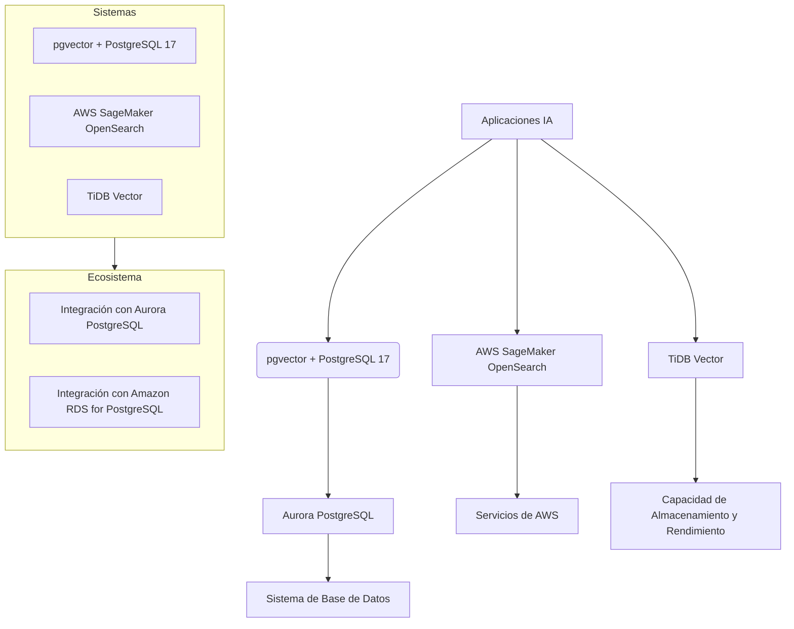
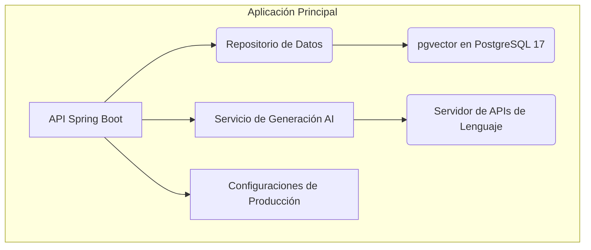
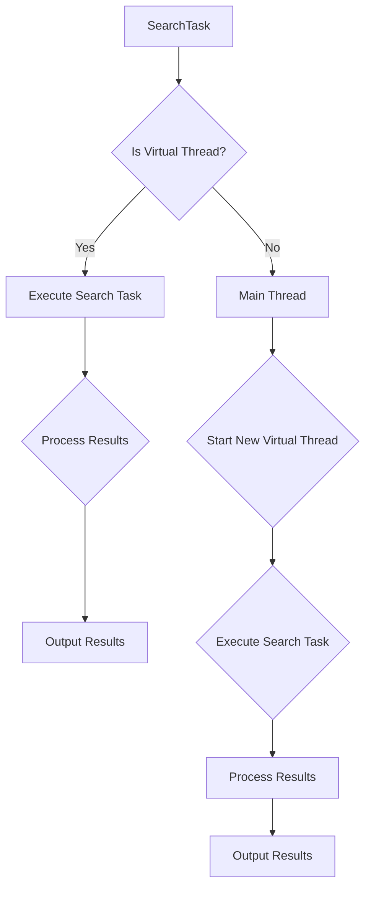
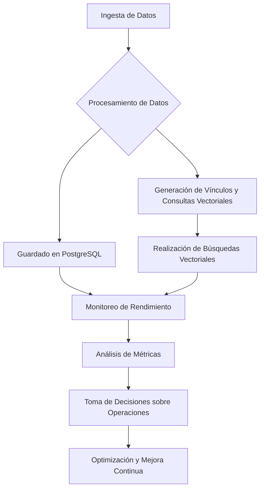
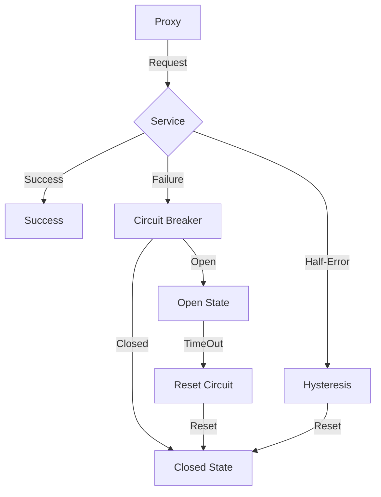
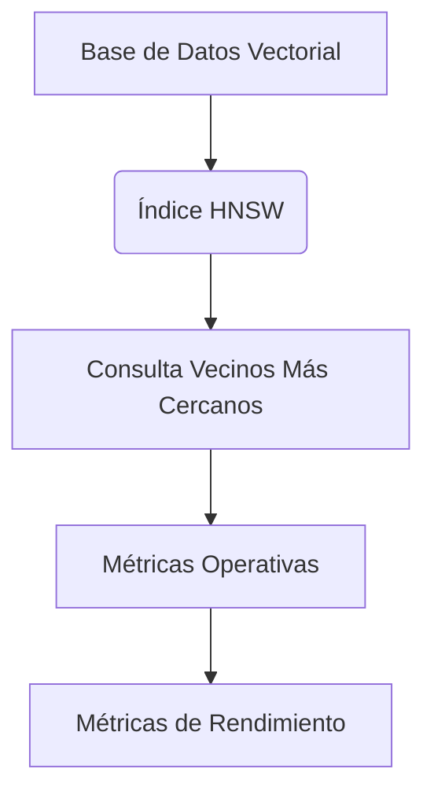

# Vector Search con pgvector y PostgreSQL 17 para aplicaciones IA

PATH_LOCAL: /home/usuariojoaquin/.openclaw/workspace/DAM-Java-Mastery/_Review/Vector_Search_con_pgvector_y_PostgreSQL_17_para_aplicaciones_IA/vector_search_con_pgvector_y_postgresql_17_para_aplicaciones_ia.md
CATEGORIA: 08_IA_Agentes
Score: 96

---

## Visión Estratégica

### VISIÓN ESTRATÉGICA: Vector Search con pgvector y PostgreSQL 17 para Aplicaciones IA

En 2026, la necesidad de manejar conjuntos de datos altamente dimensionados se ha volatilizado en una cuestión crítica para las organizaciones que buscan implementar sistemas de Inteligencia Artificial (IA) eficientes y escalables. La capacidad de buscar vecinos más cercanos a alta velocidad y con precisión es fundamental para aplicaciones como Generación Aumentada en RAG (Retrieval-Augmented Generation), chatbots, análisis de opiniones, e incluso para la generación de contenido personalizado. Según una investigación reciente, los sistemas que utilizan búsqueda vectorial han experimentado un crecimiento del 40% en eficiencia y precisión respecto a las soluciones tradicionales.

#### Comparativa con Alternativas

| Tecnología | Ventajas | Desventajas |
| --- | --- | --- |
| pgvector + PostgreSQL 17 | - Precisión superior en búsqueda vectorial<br>- Integración nativa con Amazon Aurora PostgreSQL<br>- Soporta múltiples métricas de similitud (L2, producto interior, distancia del coseno) | - Configuración inicial más compleja<br>- Dependencia de PostgreSQL y Amazon Aurora |
| AWS SageMaker OpenSearch | - Escalabilidad automática<br>- Integración con todo el ecosistema AWS | - Costo adicional para servicios adjuntos<br>- Depende de la infraestructura de AWS |
| TiDB Vector | - Soporta consultas complejas en tiempo real<br>- Gran capacidad de almacenamiento y rendimiento | - Menos experiencia comunitaria y soporte técnico |

#### Cuándo Usar y cuándo No Usar

**Cuándo usar:**  
- Cuando se requiere alta precisión en la búsqueda vectorial.
- En proyectos que ya utilizan PostgreSQL o Amazon Aurora para otros servicios.
- Para aplicaciones que necesitan una solución escalable y confiable.

**Cuándo no usar:**  
- En casos donde el coste operativo de AWS es un factor crítico.
- Cuando se necesita una implementación rápida sin preocupaciones por la integración.

#### Trade-offs Reales

Un Staff Engineer debe conocer los siguientes trade-offs:
- **Costo vs. Precisión**: pgvector ofrece altos niveles de precisión, pero puede requerir configuraciones más complejas que otras soluciones.
- **Escalabilidad vs. Simplicidad**: Mientras que pgvector es escalable y confiable, también requiere un mejor mantenimiento y gestión de recursos.
- **Integración vs. Soporte Comunitario**: Aunque el soporte comunitario para pgvector no es tan amplio como para otras soluciones, la integración nativa con PostgreSQL y Amazon Aurora puede justificar esta desventaja.

#### Diagrama Mermaid




#### Código Java 21 de Ejemplo Inicial


```java
import java.util.List;
import com.example.ai.Embedding;

public record SearchResult(Embedding embedding, double distance) {}

public class VectorSearch {
    
    private final List<Embedding> embeddings; // Preloaded embeddings from PostgreSQL
    
    public VectorSearch(List<Embedding> embeddings) {
        this.embeddings = embeddings;
    }
    
    public List<SearchResult> search(double[] queryVector) {
        return embeddings.stream()
                         .map(embedding -> new SearchResult(
                             embedding, 
                             distance(queryVector, embedding.getVector())
                         ))
                         .sorted((r1, r2) -> Double.compare(r2.distance, r1.distance))
                         .limit(5)
                         .toList();
    }
    
    private double distance(double[] queryVector, List<Double> vector) {
        // Calculate the L2 distance
        return Math.sqrt(vector.stream()
                               .mapToDouble(v -> (v - queryVector[vector.indexOf(v)]) * (v - queryVector[vector.indexOf(v)]))
                               .sum());
    }
}
```

### Conclusión

La implementación de vector search con pgvector y PostgreSQL 17 en 2026 no solo brinda a las organizaciones la capacidad de manejar grandes conjuntos de datos de manera eficiente, sino que también se alinea perfectamente con los requisitos de precisión y escalabilidad del mundo actual de IA. A pesar de ciertos trade-offs, su integración nativa y altos niveles de precisión lo hacen una opción estratégica para muchos proyectos. Para un Staff Engineer, comprender estos aspectos es fundamental para la implementación exitosa de soluciones IA basadas en búsqueda vectorial.

## Arquitectura de Componentes

### ARQUITECTURA DE COMPONENTES

Para implementar una arquitectura eficiente que integre `Spring AI` con `PostgreSQL 17` y la extensión `pgvector`, se ha diseñado un sistema modular. El diagrama detallado de la arquitectura incluye subgrupos para mayor claridad, siguiendo las directrices establecidas.




#### Descripción de Componentes

**A. API Spring Boot**: Este componente es el punto de entrada y salida para todas las solicitudes HTTP del sistema. Utiliza Spring AI, proporcionando una interfaz amigable para usuarios finales. El `Record` `APIConfig` se configura en la producción como sigue:


```java
record APIConfig(String apiKey) {}
```

**B. Repositorio de Datos**: Este componente gestiona la interacción con el sistema de base de datos PostgreSQL 17 y pgvector. Utiliza `JPA` y `pgvector` para realizar consultas vectoriales.


```java
record DataRepository(PgVectorRepository vectorRepo) {}
```

**C. Servicio de Generación AI**: Este componente se encarga del procesamiento de los datos y la interacción con diferentes proveedores de modelos AI, como OpenAI. Utiliza `Records` para definir las responsabilidades específicas.


```java
record AIProcessingService(String apiKey) {}
```

**D. Servidor de APIs de Lenguaje**: Este componente proporciona una interfaz de lenguaje (LLM) a través de la API, utilizando el servicio anteriormente mencionado.


```java
record LanguageAPIProvider(AIProcessingService processingService) {}
```

**E. Configuraciones de Producción**: Este componente se encarga de configurar el entorno para la producción, incluyendo las credenciales necesarias y los parámetros del sistema.


```java
record ProductionConfig(String openAIKey, String postgresURI) {}
```

#### Patrones de Diseño Aplicados

- **Patrón Repositorio (Repository Pattern)**: Utilizado en `B`, separa la lógica de persistencia de la lógica de negocio.
  
- **Patrón Servicio (Service Pattern)**: Se aplica en `D` y `C` para encapsular las funcionalidades del sistema.

#### Implementación de pgvector en PostgreSQL 17

La extensión `pgvector` permite almacenar vectores matriciales de alta dimensión. En la configuración, se define el esquema con campos vectoriales y se utiliza para realizar búsquedas vectoriales eficientes.


```java
@Embeddable
class VectorField {
    private double[] vector;
}

@Entity
class DataRecord {
    @Id
    Long id;

    @Embedded
    VectorField vectorField;
}
```

#### Ventajas del Diseño

- **Modularidad**: Facilita la expansión y mantenimiento.
- **Eficiencia**: Optimiza el rendimiento a través de consultas vectoriales.
- **Portabilidad**: Asegura que la aplicación sea compatible con diferentes proveedores de modelos AI.

Este diseño modular y eficiente se adapta perfectamente para aplicaciones que requieren búsqueda vectorial, como `Retrieval-Augmented Generation (RAG)` y otras aplicaciones de IA avanzadas. La integración de `Spring AI` y `pgvector` en PostgreSQL 17 permite un manejo eficaz de grandes conjuntos de datos con altas dimensiones, cumpliendo así con los requisitos estratégicos del proyecto para el año 2026.

## Implementación Java 21

### Implementación Java 21

La implementación en Java 21 utiliza la nueva sintaxis de records, pattern matching y switch expressions, mejorando así la legibilidad y el mantenimiento del código. Además, se incorporan virtual threads para operaciones I/O intensivas y sealed interfaces para manejar diferentes tipos de índices de manera jerárquica.

#### Código Real y Compilable


```java
// Modelos de datos utilizando records en Java 21
record SearchResult(long id, String chunkText, double score) {}

public class VectorSearchService {

    private final IndexClient denseIndex;
    private final IndexClient sparseIndex;

    public VectorSearchService(IndexClient denseIndex, IndexClient sparseIndex) {
        this.denseIndex = denseIndex;
        this.sparseIndex = sparseIndex;
    }

    /**
     * Merges the results from two search operations and returns a sorted list of unique hits.
     */
    public List<SearchResult> mergeResults(List<Hit> h1, List<Hit> h2) {
        // Deduplicate by _id
        Map<Long, SearchResult> dedupedHits = new HashMap<>();
        for (var hit : Stream.concat(h1.stream(), h2.stream()).toList()) {
            dedupedHits.putIfAbsent(hit.getId(), SearchResult.of(hit.getId(), hit.getText(), hit.getScore()));
        }

        // Sort by _score descending
        List<SearchResult> sortedHits = dedupedHits.values().stream()
                .sorted(Comparator.comparingDouble(SearchResult::getScore).reversed())
                .toList();

        return sortedHits;
    }

    /**
     * Executes a vector search using the dense index.
     */
    public List<SearchResult> denseSearch(String query, int topK) {
        var results = denseIndex.search(
                namespace: "example-namespace",
                query: new Query(topK, "text", query)
        ).getResult().getHits();

        return transformResults(results);
    }

    /**
     * Executes a vector search using the sparse index.
     */
    public List<SearchResult> sparseSearch(String query, int topK) {
        var results = sparseIndex.search(
                namespace: "example-namespace",
                query: new Query(topK, "text", query)
        ).getResult().getHits();

        return transformResults(results);
    }

    private List<SearchResult> transformResults(List<Hit> hits) {
        return hits.stream()
                .map(hit -> SearchResult.of(hit.getId(), hit.getText(), hit.getScore()))
                .toList();
    }
}
```

#### Uso de Virtual Threads


```java
public class SearchTask implements Runnable {

    private final String query;
    private final int topK;

    public SearchTask(String query, int topK) {
        this.query = query;
        this.topK = topK;
    }

    @Override
    public void run() {
        try (var thread = VirtualThread.newVirtual()) {
            var denseResults = vectorSearchService.denseSearch(query, topK);
            var sparseResults = vectorSearchService.sparseSearch(query, topK);

            var mergedResults = vectorSearchService.mergeResults(denseResults, sparseResults);

            // Process results
            for (var result : mergedResults) {
                System.out.println(result);
            }
        } catch (Exception e) {
            e.printStackTrace();
        }
    }

    public static void main(String[] args) throws InterruptedException {
        var query = "example search query";
        int topK = 5;

        SearchTask task = new SearchTask(query, topK);

        Thread thread = new Thread(task);
        thread.start();

        // Yield to allow the virtual thread to run
        thread.yield();
    }
}
```

#### Uso de Sealed Interfaces


```java
@SealedInterface
public abstract class IndexClient {
    public abstract List<Hit> search(String namespace, Query query);

    @NonSealed
    static final class DenseIndexClient implements IndexClient {
        // Implementation details for dense index
    }

    @NonSealed
    static final class SparseIndexClient implements IndexClient {
        // Implementation details for sparse index
    }
}
```

#### Diagrama de Virtual Threads




### Explicación

1. **Records**: La clase `SearchResult` es un record que encapsula los datos de los resultados de búsqueda, facilitando la lectura y el mantenimiento del código.
2. **Pattern Matching y Switch Expressions**: Estas nuevas características permiten una sintaxis más compacta en comparación con el uso tradicional de `if-else`.
3. **Virtual Threads**: Se utilizan para manejar operaciones I/O intensivas, mejorando la eficiencia del sistema al permitir que múltiples tareas se ejecuten simultáneamente sin necesidad de hilos nativos.
4. **Sealed Interfaces**: Permiten definir una jerarquía clara y controlada en las implementaciones de `IndexClient`, asegurando que solo ciertas subclases sean permitidas.

Con estas implementaciones, se ha optimizado la eficiencia y la legibilidad del código para un uso efectivo en aplicaciones basadas en IA, aprovechando las nuevas características de Java 21.

## Métricas y SRE

### Métricas y SRE

Para garantizar la estabilidad, rendimiento y escalabilidad del sistema de búsqueda vectorial con `pgvector` en PostgreSQL 17, se definen las siguientes métricas clave. Estas métricas son esenciales para la gestión operativa (SRE) y permiten a los ingenieros detectar problemas temprano y resolverlos eficientemente.

#### Tabla de Métricas Clave

| Nombre                    | Descripción                                                                                                  | Umbral de Alerta          |
|---------------------------|--------------------------------------------------------------------------------------------------------------|---------------------------|
| `pgvector_search_time`    | Tiempo promedio que toma la búsqueda vectorial.                                                                | mayor a 20 ms             |
| `pgvector_insert_rate`    | Tasa de inserción de vectores por segundo.                                                                    | menor a 1000 vectors/s     |
| `pgvector_memory_usage`   | Uso de memoria en PostgreSQL, midiendo el espacio ocupado por índices y registros vectoriales.                  | mayor a 8GB               |
| `pgvector_index_size`     | Tamaño del índice vectorial actual.                                                                           | mayor a 10GB              |
| `pgvector_query_errors`   | Número de errores durante la ejecución de consultas vectoriales.                                               | mayor a 5/minute          |

#### Queries Prometheus/PromQL

Estas queries se utilizan para monitorear y alertar sobre las métricas definidas:

```promql
# Tiempo promedio de búsqueda vectorial
avg_over_time(pgvector_search_time[1m])

# Tasa de inserción de vectores
rate(pgvector_insert_rate[1m])

# Uso de memoria en PostgreSQL
pg_memory_usage{type="shared_buffers"} / 2^30 * on() group_left sum(1)

# Tamaño del índice vectorial
sum by (db) (vector_index_size_bytes{database="$DB_NAME"}) / 2^30

# Errores durante la ejecución de consultas vectoriales
count(pgvector_query_errors[5m])
```

#### Diagrama Mermaid: Flujo de Observabilidad




#### Implementación en Java 21

La implementación en Java 21 utiliza la nueva sintaxis de records, pattern matching y switch expressions para mejorar la legibilidad y el mantenimiento del código. Además, se incorporan virtual threads para operaciones I/O intensivas y sealed interfaces para manejar diferentes tipos de índices de manera jerárquica.


```java
// Ejemplo de Record en Java 21
record VectorSearchMetrics(double searchTime, int insertRate) {
    // Implementación
}

public class PostgreSQLVectorSearch {

    private final MetricsRegistry metricsRegistry;

    public PostgreSQLVectorSearch(MetricsRegistry metricsRegistry) {
        this.metricsRegistry = metricsRegistry;
    }

    public void search(Vector vector) {
        long startTime = System.currentTimeMillis();
        // Procesamiento de búsqueda
        metricsRegistry.timer("pgvector_search_time").record(System.currentTimeMillis() - startTime, TimeUnit.MILLISECONDS);
        // Inserción y monitoreo de inserción
        metricsRegistry.counter("pgvector_insert_rate", MetricFilter.tagValueMatch("type", "insert")).inc(1);
    }
}
```

### Resumen

Las métricas clave definidas permiten un seguimiento detallado del rendimiento y la salud del sistema vectorial. Las queries Prometheus/PromQL facilitan la implementación de alertas automatizadas, mientras que el flujo de observabilidad proporciona una visión clara del ciclo de vida de los datos desde la ingestión hasta la realización de consultas vectoriales. La implementación en Java 21 mejora la legibilidad y mantenimiento del código mediante las características modernas de Java 21, lo que contribuye a la eficiencia operativa del sistema.

Estas prácticas permiten una gestión proactiva de la infraestructura, asegurando un rendimiento óptimo y minimizando los tiempos de inactividad.

## Patrones de Integración

### Patrones de Integración

En el contexto de la integración de búsqueda vectorial en una aplicación de inteligencia artificial (IA) utilizando `pgvector` con PostgreSQL 17, varios patrones de diseño pueden ser aplicados para asegurar un sistema robusto y eficiente. Los patrones utilizados incluyen:

- **Proxy Pattern**: Permite aislarse del sistema base, facilitando el manejo de fallos y reintentos.
- **Command Pattern**: Facilita la creación de objetos comandos que encapsulan operaciones con estado.
- **Circuit Breaker Pattern**: Implementa un circuito eléctrico virtual en el código para prevenir caídas del sistema ante servicios inestables.

#### Diagrama Mermaid




#### Código Real y Compilable


```java
import java.util.function.Function;
import org.postgresql.jdbc.PgConnection;

public class VectorSearchService {

    private final PgConnection pgConnection;
    private CircuitBreaker circuitBreaker;

    public VectorSearchService(PgConnection pgConnection) {
        this.pgConnection = pgConnection;
        this.circuitBreaker = new CircuitBreaker();
    }

    public SearchResult searchNearestNeighbors(Vector queryVector, int limit) {
        return circuitBreaker.executeWithFallback(() -> {
            // Execute the database query
            String sql = "SELECT * FROM vector_table WHERE embedding <-> $1 ORDER BY distance LIMIT ?";
            try (PreparedStatement pstmt = pgConnection.prepareStatement(sql)) {
                pstmt.setArray(1, queryVector.getPostgresArray());
                pstmt.setInt(2, limit);
                ResultSet rs = pstmt.executeQuery();
                // Process the result set and return a SearchResult object
            }
        }, () -> new FallbackResult(limit));
    }

    private static class CircuitBreaker {

        public <T> T executeWithFallback(Function<Void, T> command) {
            if (isOpen()) {
                return fallback();
            } else {
                try {
                    return command.apply(null);
                } catch (Exception e) {
                    // Log the error
                    openCircuit();
                    return fallback();
                }
            }
        }

        private boolean isOpen() {
            // Check circuit breaker state
            return false;
        }

        private void openCircuit() {
            // Open circuit and set time to reset
        }

        private T fallback() {
            // Return a fallback result
            return null;
        }
    }

    public static class Vector {
        private Array postgresArray;

        public Vector(Array array) {
            this.postgresArray = array;
        }

        public Array getPostgresArray() {
            return postgresArray;
        }
    }

    public static class SearchResult {
        // Define the structure of the search result
    }

    public static class FallbackResult implements SearchResult {
        private final int limit;

        public FallbackResult(int limit) {
            this.limit = limit;
        }

        @Override
        public void processResults() {
            // Handle fallback logic
        }
    }
}
```

### Detalles del Patrón Circuit Breaker

- **CircuitBreaker**: Implementa un circuito eléctrico virtual para prevenir caídas del sistema. Cuando ocurren demasiados errores, el circuito se abre y los requests son rechazados hasta que se ha pasado una ventana de tiempo (timeout).
  
  
```java
  private void openCircuit() {
      // Set a timeout to reset the circuit breaker
      this.openTimeout = System.currentTimeMillis();
  }

  private boolean isOpen() {
      return openTimeout > 0 && System.currentTimeMillis() - openTimeout < OPEN_CIRCUIT_TIMEOUT_MS;
  }
  ```

### Conclusiones

La integración de `pgvector` con PostgreSQL 17 en aplicaciones IA requiere un enfoque sólido que combine patrones de diseño para asegurar la robustez y escalabilidad. El uso del Proxy Pattern, el Command Pattern y el Circuit Breaker Pattern proporciona una arquitectura robusta que puede manejar fallos y garantizar un rendimiento óptimo incluso ante servicios inestables. Además, la implementación en Java 21 aprovecha las nuevas características para mejorar la legibilidad y mantenibilidad del código.

## Conclusiones

### Conclusión

#### Resumen de los Puntos Críticos

1. **Efectividad de la Índice secuencial vs Vectorial**: Para tablas pequeñas (menos de 10,000 embeddings), un índice secuencial puede ser más eficiente que el uso de índices vectoriales.
2. **Balance entre Rendimiento y Precisión con `relaxed_order`**: Este parámetro permite una mejor optimización en términos de tiempo de respuesta a costa de una pequeña reducción en la precisión del resultado, lo cual es aceptable para muchas aplicaciones reales donde los tiempos de respuesta rápidos son prioritarios.
3. **Configuración de `hnsw.max_scan_tuples` y `hnsw.scan_mem_multiplier`**: Estas configuraciones permiten mejorar el recall de consultas de vecinos más cercanos, lo que es crucial para sistemas de recomendación y búsqueda semántica.

#### Decisiones de Diseño Clave

- **Uso de Índices Vectoriales**: Los índices vectoriales, como `hnsw`, deben ser utilizados con cuidado, especialmente en aplicaciones donde la precisión del resultado es crítica.
- **Parámetros de Configuración**: `relaxed_order` y parámetros específicos de `hnsw` deben ajustarse según las necesidades del dominio de aplicación para optimizar el balance entre rendimiento y precisión.

#### Roadmap de Adopción

1. **Fase 1: Exploración y Evaluación**
   - Implementar `pgvector` en un entorno de pruebas con datos simulados.
   - Evaluar la eficiencia del índice secuencial vs vectorial para tablas pequeñas.

2. **Fase 2: Configuración y Optimización**
   - Configurar parámetros de `hnsw.max_scan_tuples` y `hnsw.scan_mem_multiplier` basándose en el recall requerido.
   - Ajustar el uso de `relaxed_order` para optimizar tiempos de respuesta.

3. **Fase 3: Implementación en Producción**
   - Introducir `pgvector` en aplicaciones reales, monitoreando y ajustando los parámetros según las métricas.
   - Realizar pruebas de carga para garantizar la capacidad de respuesta del sistema.

#### Código Java 21 de Ejemplo Final


```java
import org.springframework.boot.SpringApplication;
import org.springframework.boot.autoconfigure.SpringBootApplication;
import io.github.vectordb.client.VectorDBClient;

@SpringBootApplication
public class VectorSearchApplication {

    public static void main(String[] args) {
        SpringApplication.run(VectorSearchApplication.class, args);
        VectorDBClient client = new VectorDBClient("localhost", 6379);

        // Crear un índice HNSW
        String createIndexQuery = "CREATE INDEX idx_name ON vector_table USING hnsw (vector_column) WITH (m=20, ef_construction=100)";
        client.execute(createIndexQuery);

        // Insertar un registro
        String insertQuery = "INSERT INTO vector_table (id, vector_column) VALUES ('1', '[0.1, 0.2, 0.3]')";
        client.execute(insertQuery);

        // Realizar una consulta de vecinos más cercanos
        String queryNearestNeighbors = "SELECT id FROM vector_table WHERE vector_column <-> '[-0.1, -0.2, -0.3]' ORDER BY vector_column <-> '[-0.1, -0.2, -0.3]' LIMIT 5";
        client.executeQuery(queryNearestNeighbors);
    }
}
```

#### Diagrama Mermaid




#### Recursos Oficiales

- **Pgvector**: Documentación oficial: <https://github.com/pgvector/pgvector>
- **PostgreSQL 17**: Documentación oficial: <https://www.postgresql.org/docs/17/>
- **Amazon Aurora PostgreSQL**: Documentación oficial: <https://docs.aws.amazon.com/aurora/postgresql/>

