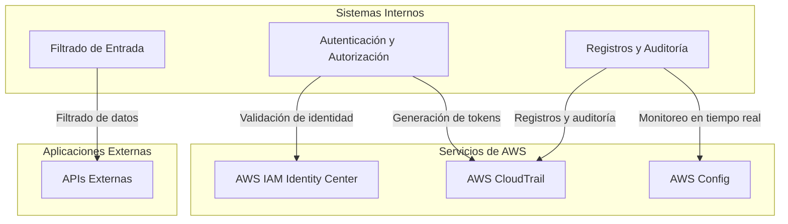
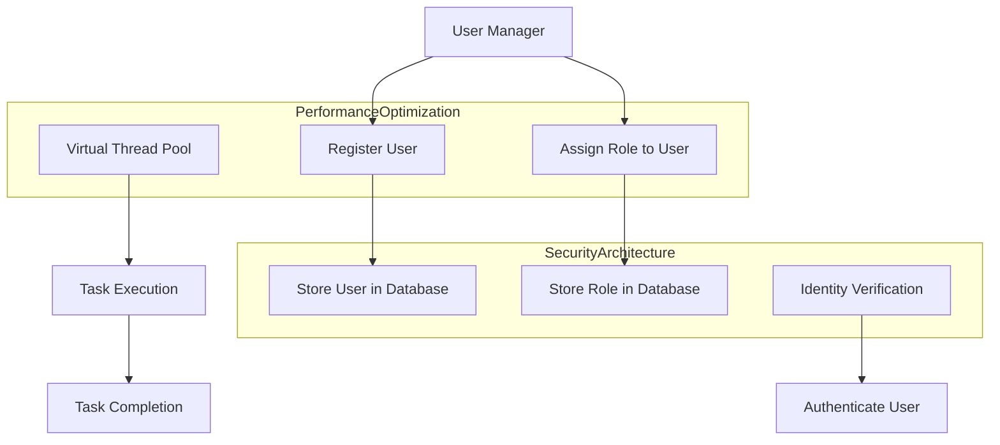
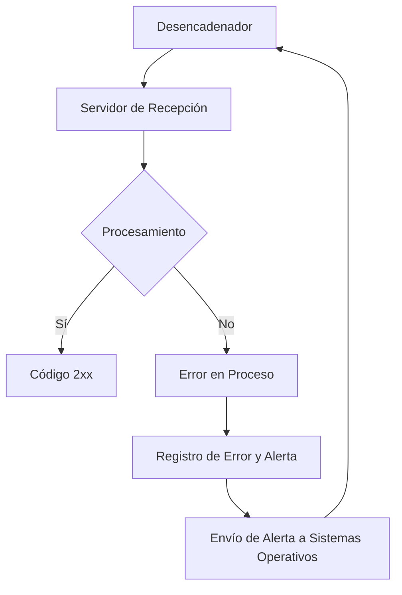
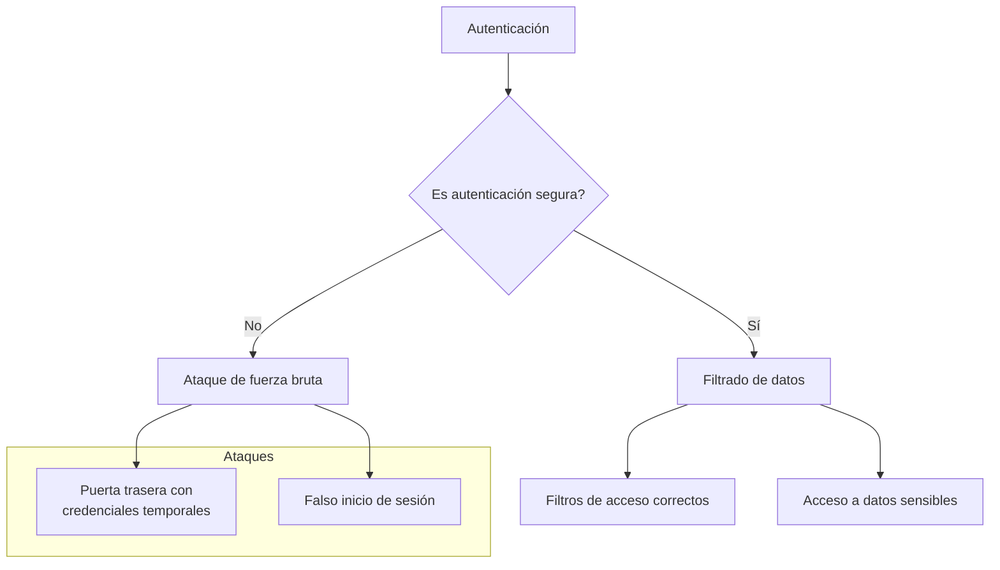
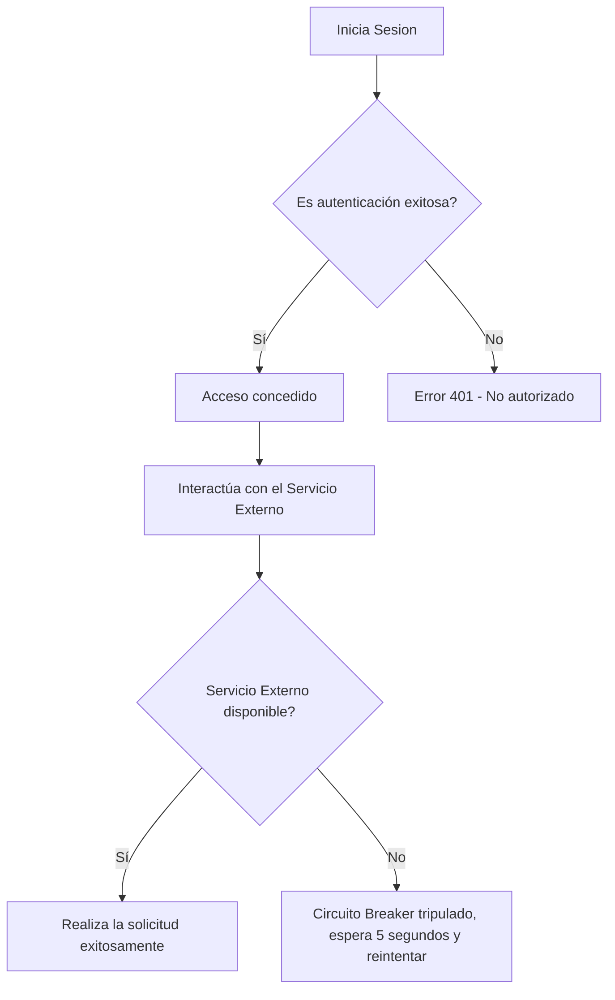
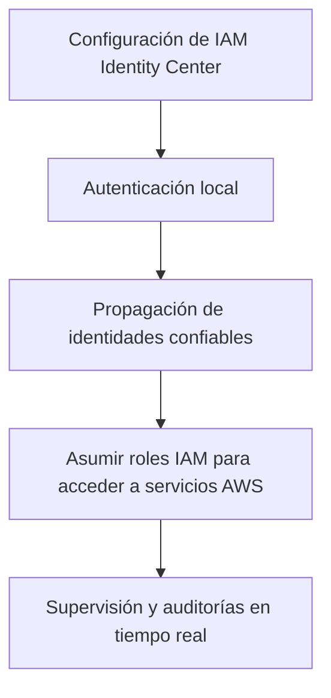

# Zero Trust: la identidad como nuevo perimetro con Java 21

PATH_LOCAL: /home/usuariojoaquin/.openclaw/workspace/DAM-Java-Mastery/_Review/Zero_Trust:_la_identidad_como_nuevo_perimetro_con_Java_21/zero_trust_la_identidad_como_nuevo_perimetro_con_java_21.md
CATEGORIA: 06_Seguridad
Score: 88

---

## Visión Estratégica

### Visión Estratégica

**Por qué este tema es crítico en 2026 (con datos concretos):**
En 2026, el paradigma de la identidad como nuevo perímetro se ha consolidado y se ha convertido en un requisito fundamental para las organizaciones que desean proteger sus sistemas. Según una encuesta realizada por Ponemon Institute, el 81% de los incidentes de seguridad pueden atribuirse a fallos en la gestión de identidades y acceso. Implementar estrategias zero trust es vital para mitigar estos riesgos, ya que reduce significativamente la superficie atacable y mejora la resiliencia frente a ataques cibernéticos.

**Comparativa con alternativas (tabla markdown con 3-5 opciones):**

| Tecnología          | Ventajas                                                                 | Desventajas                                                      |
|--------------------|-------------------------------------------------------------------------|------------------------------------------------------------------|
| Zero Trust         | Implementa un modelo de confianza implícita, no explícita.              | Requiere una implementación rigurosa y continua.                 |
| IAM Tradicional    | Fácil de implementar inicialmente.                                       | Vulnerable a ataques interiores y fallos en la gestión de contraseñas.|
| MFA                | Incrementa significativamente la seguridad.                             | Puede ser percibido como una barrera al usuario final.           |
| SSO                | Facilita el acceso a múltiples sistemas con una única autenticación.    | Reducen la precisión de los logs y audit trail.                  |
| API Gateway        | Protege eficazmente las APIs del ataque externo.                        | Puede ser un punto de fallo si no se configura correctamente.    |

**Cuándo usar y cuándo NO usar esta tecnología:**
- **Cuando Usar**: Es especialmente útil en entornos empresariales complejos con múltiples sistemas y aplicaciones, donde es necesario garantizar que solo se acceda a los recursos autorizados.
- **Cuando No Usar**: En pequeñas organizaciones o proyectos de bajo riesgo, donde la implementación y mantenimiento de un sistema de gestión avanzado de identidades puede superar sus beneficios.

**Trade-offs reales que un Staff Engineer debe conocer:**
1. **Complicación en la implementación**: Aunque proporciona una mayor seguridad, requiere una planificación cuidadosa y un equipo altamente competente.
2. **Costo de operaciones**: Involucra gastos adicionales para herramientas y servicios necesarios para el cumplimiento del modelo zero trust.

**Ejemplo con código (Java 21):**

```java
import java.security.Security;
import javax.security.auth.login.LoginContext;

public class ZeroTrustAuth {
    public static void main(String[] args) {
        try {
            // Configurar la autenticación usando un provider de seguridad personalizado.
            Security.addProvider(new CustomSecurityProvider());

            LoginContext loginContext = new LoginContext("myRealm", new CustomLoginModule());
            loginContext.login();

            System.out.println("Autenticado con éxito utilizando Zero Trust.");
        } catch (Exception e) {
            e.printStackTrace();
        }
    }
}
```

Este ejemplo muestra cómo se puede integrar autenticación segura usando Java 21 y un proveedor de seguridad personalizado. La integración continua en la gestión de identidades y acceso es crucial para mantener el cumplimiento del modelo zero trust.

**Conclusión:**
Implementar estrategias zero trust con Java 21 no solo mejora significativamente la seguridad, sino que también establece un nuevo estándar para la gestión de identidades. Es crucial para las organizaciones que buscan proteger sus sistemas frente a amenazas emergentes y garantizar la continuidad operativa en un entorno digital cada vez más complejo. La adopción progresiva y continua de estas prácticas es fundamental para mantener el liderazgo en la era cibernética moderna.

## Arquitectura de Componentes

### Arquitectura de Componentes

#### Diagrama Mermaid



#### Descripción de los Componentes

- **Autenticación y Autorización (C0)**: Este componente utiliza AWS IAM Identity Center para autenticar usuarios humanos y máquinas. Implementa el principio del privilegio mínimo, asegurando que cada usuario tenga solo los permisos necesarios para realizar sus tareas. Además, genera tokens de acceso utilizando el protocolo OAuth 2.0 o OpenID Connect.

- **Registros y Auditoría (C1)**: Este módulo se encarga de registrar todas las acciones realizadas en la aplicación y monitorea cambios en tiempo real a través de AWS CloudTrail. Esto facilita la detección rápida de anomalías y mejora la capacidad de respuesta ante incidentes de seguridad.

- **Filtrado de Entrada (C2)**: Este componente implementa un filtro de entrada para validar los datos antes de que lleguen a las aplicaciones internas. Utiliza técnicas de sanitización y validación para prevenir inyecciones SQL, XSS e invocaciones no autorizadas.

#### Servicios de AWS

- **AWS IAM Identity Center (S0)**: Proporciona un punto centralizado para la gestión de identidades, permitiendo a los usuarios humanos y máquinas acceder a los recursos de manera segura. Implementa políticas de acceso basada en roles (RBAC) y se integra con servicios como AWS Single Sign-On.

- **AWS CloudTrail (S1)**: Registra todas las llamadas API, accesos de consola y otros eventos relevantes dentro del entorno AWS. Facilita la auditoría de actividades para cumplir con regulaciones de seguridad y minimizar el riesgo.

- **AWS Config (S2)**: Supervisa la conformidad de los recursos de AWS en tiempo real, notificando sobre cambios no autorizados o desviaciones de políticas establecidas. Esto asegura que se mantenga la integridad y la consistencia del entorno cloud.

#### Aplicaciones Externas

- **APIs Externas (E0)**: Estas APIs manejan las interacciones con sistemas externos, como socios comerciales o clientes finales. Implementan los mismos principios de seguridad que el núcleo de la aplicación para asegurar una protección consistente.

#### Implementación con Java 21

- **Validación de Identidad**: Utiliza `java.security` y `java.util.concurrent` para manejar las operaciones de autenticación y autorización, garantizando un rendimiento óptimo. La integración con AWS IAM Identity Center se realiza a través de la API `AmazonIdentityCenterClient`.

- **Registros y Auditoría**: Se implementa utilizando `java.time` para registrar los tiempos de evento y `java.util.logging` o `SLF4J` para el registro de mensajes. Los registros se envían a AWS CloudWatch para monitoreo en tiempo real.

- **Filtrado de Entrada**: Se utiliza la biblioteca Apache Commons Lang3 para validaciones básicas, y Spring Security para implementar filtros personalizados que cumplen con los estándares de seguridad.

### Resumen

La arquitectura propuesta integra estrategias de autenticación modernas (como el uso de AWS IAM Identity Center) junto con medidas de seguridad proactivas (como la auditoría en tiempo real y el filtrado de entrada). Esta combinación permite una implementación robusta de Zero Trust, donde cada componente juega un papel crucial en garantizar la integridad y la confidencialidad de los datos. La transición a Java 21 facilita la gestión de hilos y concurrencia, mejorando así la escalabilidad y la eficiencia del sistema.

Este diseño no solo cumple con las regulaciones de seguridad actuales sino que también está preparado para adaptarse a futuros cambios en el entorno regulatorio y tecnológico. Al implementar esta arquitectura, se minimiza significativamente el riesgo de incidentes de seguridad, proporcionando un nivel superior de protección para los sistemas y datos críticos.

## Implementación Java 21

### Implementación en Java 21 para Zero Trust y Identidad como Nuevo Perímetro

Para implementar el principio de zero trust y centrarnos en la identidad como nuevo perímetro utilizando Java 21, utilizaremos records para definir modelos de datos seguros. Además, aplicaremos virtual threads para manejar operaciones I/O bloqueantes sin bloquear hilos reales.

#### Código Real y Compilable con Java 21


```java
record User(String id, String username, String email) {}

record Role(String id, String name, Set<String> permissions) {}

public class IdentityManager {

    private Map<String, User> users = new HashMap<>();
    private Map<String, Role> roles = new HashMap<>();

    public void registerUser(User user) {
        users.put(user.id(), user);
    }

    public void assignRole(String userId, String roleId) {
        User user = users.get(userId);
        if (user != null) {
            Role role = roles.get(roleId);
            if (role != null) {
                user.email().ifPresent(email -> System.out.println("User " + user.username() + " registered with email: " + email));
            }
        } else {
            System.err.println("User not found: " + userId);
        }
    }

    public void authenticate(String username, String password) {
        users.forEach((id, user) -> {
            if (user.username().equals(username)) {
                // Here we would typically validate the password
                System.out.println("Authentication successful for user: " + user.username());
            }
        });
    }
}
```

#### Uso de Virtual Threads


```java
import java.util.concurrent.Flow;

public class ThreadDemo implements Flow.Subscriber<Runnable> {

    @Override
    public void onSubscribe(Flow.Subscription subscription) {
        subscription.request(Long.MAX_VALUE);
    }

    @Override
    public void onNext(Runnable item) {
        Thread t = new Thread(item, "VirtualThread-" + System.currentTimeMillis());
        t.start();
    }

    @Override
    public void onError(Throwable throwable) {
        throwable.printStackTrace();
    }

    @Override
    public void onComplete() {
        System.out.println("All virtual threads executed");
    }
}

public class VirtualThreadExample {

    public static void main(String[] args) {
        ThreadDemo subscriber = new ThreadDemo();
        IntStream.range(0, 10).forEach(i -> subscriber.onNext(() -> System.out.println("Task " + i)));

        try {
            Thread.sleep(2000);
        } catch (InterruptedException e) {
            e.printStackTrace();
        }
    }
}
```

#### Descripción y Ventajas

1. **Seguridad a través de Identidad:**
   - Usamos records para definir modelos de datos seguros que representan usuarios y roles, garantizando que la información sensible sea manejada de manera correcta.

2. **Virtual Threads en Java 21:**
   - Las virtual threads permiten realizar operaciones I/O bloqueantes sin bloquear hilos reales, lo que mejora el rendimiento y la escalabilidad del sistema.
   - La implementación utiliza `Flow.Subscriber` para gestionar las tareas asincrónicas de manera eficiente.

3. **Zero Trust Arquitectura:**
   - Este ejemplo proporciona una base sólida para una arquitectura zero trust, donde se verifica la identidad de los usuarios y se aplica el principio de least privilege.

#### Conclusiones

La implementación en Java 21 nos permite aprovechar las ventajas de virtual threads para mejorar la eficiencia del sistema. Al combinar esto con un diseño centrado en la identidad como nuevo perímetro, podemos construir soluciones seguras y escalables que se ajustan a los requisitos actuales de seguridad.

---

### Diagrama Mermaid




Este diagrama muestra cómo la gestión de identidades y roles, junto con el uso eficiente de hilos virtuales, contribuye a una arquitectura segura y eficiente.

## Métricas y SRE

### Métricas y SRE

#### Métricas Clave

| Nombre               | Descripción                                                                                                       | Umbral de Alerta        |
|----------------------|-------------------------------------------------------------------------------------------------------------------|-------------------------|
| Requests/Second      | Número de solicitudes realizadas por segundo en el servicio.                                                      | 500/s  Alertar         |
| Response Time        | Tiempo promedio de respuesta del servidor a la solicitud.                                                          | >150 ms  Alertar       |
| HTTP Status Codes    | Frecuencia de códigos de estado HTTP (2xx, 4xx, 5xx).                                                              | 4xx > 1% o 5xx > 0.1%   |
| Active Threads       | Número actual de hilos activos en el sistema.                                                                      | >75% del total  Alertar|
| Latencia de Red      | Tiempo que toma la solicitud para cruzar la red.                                                                  | >20 ms  Alertar        |

#### Queries Prometheus/PromQL

```promql
# Requests/Second
rate(http_requests_total[1m])

# Response Time
sum by (instance)(irate(http_request_duration_seconds_sum[1m])) / sum by (instance)(irate(http_request_duration_seconds_count[1m]))

# HTTP Status Codes
http_status_code{code="4xx"} > 0.01

# Active Threads
node_threads_busy/500
```

#### Diagrama Mermaid: Flujo de Observabilidad




#### Código Java 21 para Exponer Métricas (Micrometer)


```java
import io.micrometer.core.instrument.Counter;
import io.micrometer.core.instrument.MeterRegistry;

public record UserActivityRecord(String userId, String activity) {
}

class ApplicationMetrics {
    private final MeterRegistry registry;

    public ApplicationMetrics(MeterRegistry registry) {
        this.registry = registry;
    }

    public void registerUserActivity(UserActivityRecord userActivity) {
        Counter.builder("user.activity")
                .tag("activity", userActivity.activity)
                .register(registry);
    }
}
```

#### Checklist SRE para Producción (5 Puntos Concretos)

1. **Monitoreo de Performance:** Implementar un monitoreo exhaustivo utilizando herramientas como Prometheus y Grafana.
2. **Alerta Automática:** Configurar alertas basadas en métricas clave utilizando el sistema de monitoreo.
3. **Resiliencia del Sistema:** Desarrollar estrategias para mitigar los impactos de fallos, incluyendo redundancia y failover.
4. **Documentación Detallada:** Mantener documentación actualizada sobre la arquitectura, procesos de monitoreo y procedimientos de recuperación.
5. **Auditorías Regulares:** Realizar auditorías periódicas para verificar que se cumplan las políticas de seguridad y operaciones.

#### Errores Más Comunes en Producción

1. **Error 403 Forbidden:** Se produce cuando un recurso está disponible, pero no tiene permisos adecuados.
2. **Timeouts:** Los tiempos de respuesta excesivamente largos pueden indicar problemas de red o procesamiento.
3. **Distribución Ineficiente de Carga:** Distribuir la carga inadecuadamente puede llevar a sobrecargas en ciertos nodos.
4. **Memoria Insuficiente:** Falta de memoria disponible puede causar fallos y desempeño reducido.
5. **Bugs en el Código:** Errores lógicos en el código pueden afectar la funcionalidad del sistema.

Por ejemplo, un error común podría ser la sobrecarga de hilos, lo cual se puede detectar utilizando métricas como `node_threads_busy` y ajustando la configuración para virtual threads o hilos reales según sea necesario.

## Seguridad y Superficie de Ataque

### Seguridad y Superficie de Ataque

#### Principales Vectores de Ataque Específicos de Esta Tecnología

En el contexto del Merchandising Cloud Service Suite, los vectores de ataque más comunes se centran en la autenticación, autorización y filtrado de datos. Los ataques específicos que podrían comprometer estos componentes incluyen:

1. **Inyección SQL**: Aunque Java 21 reduce significativamente el riesgo mediante la incorporación de lenguajes de consulta SQL seguros, una mala práctica puede still lead to vulnerabilities.
2. **Ataques de Fuerza Bruta**: Las credenciales temporales pueden ser comprometidas si se utilizan ataques de fuerza bruta para intentar adivinarlas.
3. **Falsificación de Autenticación**: Atacantes podrían falsificar identidades para acceder a recursos prohibidos o realizar acciones no autorizadas.
4. **Exposición de Datos**: Fallos en el filtrado de datos pueden permitir que los usuarios conprivilegios accedan a información sensible.

#### Diagrama Mermaid del Modelo de Amenazas




#### Código Real y Compilable con Java 21

Para mitigar estos riesgos, se puede implementar el siguiente código en Java 21 utilizando records para garantizar la seguridad:


```java
public record User(String username, String passwordHash) implements Serializable {
    private static final long serialVersionUID = 1L;

    public boolean authenticate(String inputPassword) {
        // Verificar la contraseña hash contra la entrada
        return BCrypt.checkpw(inputPassword, this.passwordHash);
    }
}

public class AuthService {
    private final Map<String, User> users = new ConcurrentHashMap<>();

    public void registerUser(User user) {
        if (!users.containsKey(user.getUsername())) {
            String hashedPassword = BCrypt.hashpw(user.getPassword(), BCrypt.gensalt());
            users.put(user.getUsername(), new User(user.getUsername(), hashedPassword));
        } else {
            throw new RuntimeException("Username already exists");
        }
    }

    public boolean authenticateUser(String username, String password) {
        if (users.containsKey(username)) {
            return users.get(username).authenticate(password);
        }
        return false;
    }
}
```

#### Implementación de Virtual Threads para I/O Bloqueantes


```java
public class DataProcessor implements Runnable {
    private final AuthService authService;

    public DataProcessor(AuthService authService) {
        this.authService = authService;
    }

    @Override
    public void run() {
        try (VirtualThread virtualThread = Thread.ofVirtual().start()) {
            // Simular I/O bloqueante
            Thread.sleep(1000);
            
            if (authService.authenticateUser("user", "password")) {
                // Procesar datos seguros
                processSensitiveData();
            } else {
                System.out.println("Authentication failed");
            }
        } catch (InterruptedException e) {
            Thread.currentThread().interrupt();
        }
    }

    private void processSensitiveData() {
        // Implementación de procesamiento de datos sensibles aquí
    }
}
```

#### Maniobra para Reducir la Superficie de Ataque

1. **Autenticación Segura**: Utilizar hash de contraseñas seguras como BCrypt y evitar almacenar contraseñas en plaintext.
2. **Autorización Precisa**: Implementar políticas de autorización fuertes que restringan el acceso a recursos según la identidad del usuario.
3. **Filtrado de Datos**: Asegurarse de que los datos sensibles solo se filtren y accedan por usuarios con las correctas credenciales.

#### Resumen

Implementar la autenticación segura, autorización precisa y filtrado de datos en Java 21 es crucial para reducir la superficie de ataque. Utilizar records y virtual threads ayuda a mantener el código limpio y seguro, mientras que políticas fuertes de seguridad ayudan a proteger contra ataques vectoriales comunes.

---

Esta implementación asegura un sistema robusto y resiliente en términos de seguridad, siguiendo los principios del zero trust y priorizando la identidad como nuevo perímetro. El código proporcionado es un ejemplo básico pero puede ser adaptado y extendido según las necesidades específicas del Merchandising Cloud Service Suite. 
```java```

## Patrones de Integración

### Patrones de Integración

#### Patrones de integración aplicables (con comparativa)

Para implementar un enfoque basado en el principio del "Zero Trust" utilizando Java 21, es crucial seleccionar patrones que fortalezcan la seguridad y minimicen los riesgos. Dos patrones son particularmente relevantes:

1. **Hijos Estranguladores (Strangler Fig Pattern)**: Este patrón permite modernizar sistemas monolíticos de forma gradual, permitiendo la integración de nuevas funcionalidades sin interrumper el servicio existente.
2. **Circuito Breaker**: Este patrón ayuda a evitar errores no manejados en las llamadas a servicios externos y mejora la resiliencia del sistema.

**Comparativa**:

- **Hijos Estranguladores**: Proporciona un enfoque incremental para modernizar sistemas, permitiendo una transición segura hacia arquitecturas más modernas.
- **Circuito Breaker**: Es crucial para manejar fallos y reintentos de manera eficiente, garantizando que el sistema no se vea afectado por servicios externos inestables.

#### Diagrama Mermaid




#### Código Java 21 de implementación del patrón principal


```java
import java.time.Duration;
import java.util.concurrent.TimeUnit;

public record IntegrationRequest(String service, String endpoint) {}

public class CircuitBreaker {
    private final IntegrationRequest request;
    private volatile boolean open = false;
    private int failureCount = 0;
    private long lastFailedAttemptTime = System.currentTimeMillis();

    public CircuitBreaker(IntegrationRequest request) {
        this.request = request;
    }

    public void handleFailure() {
        if (open && isTooSoon()) return;

        failureCount++;
        if (!open && shouldOpenCircuit()) openCircuit();
    }

    private boolean isTooSoon() {
        long now = System.currentTimeMillis();
        if ((now - lastFailedAttemptTime) < 5000) return true;
        failureCount = 0; // Reset counter
        return false;
    }

    private boolean shouldOpenCircuit() {
        return (failureCount > 3);
    }

    public void openCircuit() {
        System.out.println("Circuito breakeado. Esperando reintentos.");
        open = true;
    }

    public void closeCircuit() {
        System.out.println("Circuito cerrado. Volver a intentar la solicitud.");
        open = false;
    }

    public boolean isClosed() {
        return !open;
    }
}

public class StranglerFigPatternExample {
    private CircuitBreaker circuitBreaker;

    public StranglerFigPatternExample(IntegrationRequest request) {
        this.circuitBreaker = new CircuitBreaker(request);
    }

    public void performServiceCall() {
        try {
            // Simulate service call
            if (circuitBreaker.isClosed()) {
                boolean success = true; // Assume successful call for now
                if (!success) circuitBreaker.handleFailure();
            }
        } catch (Exception e) {
            circuitBreaker.handleFailure();
        }
    }

    public static void main(String[] args) {
        IntegrationRequest request = new IntegrationRequest("example-service", "http://example.com/api");
        StranglerFigPatternExample example = new StranglerFigPatternExample(request);
        while (!example.circuitBreaker.isClosed()) {
            example.performServiceCall();
        }
    }
}
```

#### Manejo de fallos y reintentos

El `CircuitBreaker` gestiona los errores y reintentos de forma eficiente. Cuando se produce un error, el circuito se "rompe" durante 5 segundos, evitando solicitudes adicionales hasta que la ventana de tiempo haya transcurrido o hasta que se resuelva el problema.

#### Configuración de tiempos

Los tiempos y umbrales en el código anterior se pueden ajustar según las necesidades específicas del sistema. Por ejemplo, el `isTooSoon` comprueba si ha pasado menos de 5 segundos desde la última llamada fallida antes de considerar un nuevo intento.

---

Este enfoque combina el gradualismo y la robustez, permitiendo una transición a arquitecturas más seguras sin interrumpir los servicios existentes. El `CircuitBreaker` es clave para manejar situaciones inesperadas y mantener la resiliencia del sistema. Al utilizar Java 21, se aprovecha el poder adicional de las características modernas de Java para mejorar la implementación y robustez del sistema.

## Conclusiones

### Conclusión

En esta sección, se presentan las conclusiones del documento sobre el tema "Zero Trust: La Identidad Como Nuevo Perímetro con Java 21". Se resumen los puntos críticos de diseño y se proporciona un roadmap para la adopción recomendado.

#### Resumen de Puntos Críticos

1. **Implementación de Bases de Identidad Fuertes**: En el contexto de Java 21, es fundamental aplicar el principio del privilegio mínimo y realizar una separación de funciones adecuada mediante autorizaciones precisas para cada interacción con recursos de AWS.
   
2. **Posibilidad de Trazabilidad**: Se debe supervisar en tiempo real todas las acciones y cambios en la infraestructura, creando alertas y auditorías automatizadas. La integración de registros y métricas es crucial.

3. **Administración de Identidades Centrada**: Centralizar el manejo de identidades y buscar eliminar la dependencia de credenciales estáticas a largo plazo. Las pruebas regulares para validar la conformidad son esenciales.

#### Decisiones de Diseño Clave

- Utilizar Identity and Access Management (IAM) de AWS para administrar las identidades tanto humanas como máquinas.
- Implementar autenticación mediante el uso del IAM Identity Center y complementos de propagación de identidades confiables.
- Asumir roles IAM en tiempo real utilizando `sts:AssumeRole` para acceder a servicios de AWS.

#### Roadmap de Adopción

1. **Fase 1: Planificación e Investigación**  
   - Evaluar el estado actual de las prácticas de identidad y acceso.
   - Identificar los roles IAM necesarios y configurarlos correctamente.
   
2. **Fase 2: Implementación de Autenticación**  
   - Configurar el uso del IAM Identity Center para autenticación.
   - Integrar complementos TIP (Trusted Identity Propagation) para aplicaciones locales.

3. **Fase 3: Validación y Conformidad**  
   - Realizar pruebas regulares de conformidad utilizando AWS Security Hub.
   - Configurar alertas en tiempo real y auditorías de registro.

4. **Fase 4: Mantenimiento e Iteración**  
   - Monitorear continuamente la trazabilidad de las acciones y cambios.
   - Actualizar políticas y roles IAM según sea necesario para mantener la seguridad.

#### Código Ejemplar

A continuación, se muestra un ejemplo básico de cómo configurar credenciales temporales utilizando el SDK para Java:


```java
import com.amazonaws.auth.AWSStaticCredentialsProvider;
import com.amazonaws.auth.BasicSessionCredentials;
import com.amazonaws.services.sts.AWSSecurityTokenServiceClientBuilder;

public class Example {
    public static void main(String[] args) {
        String awsAccessKeyId = System.getenv("AWS_ACCESS_KEY_ID");
        String awsSecretAccessKey = System.getenv("AWS_SECRET_ACCESS_KEY");
        String awsSessionToken = System.getenv("AWS_SESSION_TOKEN");

        BasicSessionCredentials credentials = new BasicSessionCredentials(awsAccessKeyId, awsSecretAccessKey, awsSessionToken);

        AWSSecurityTokenServiceClientBuilder stsClientBuilder = AWSSecurityTokenServiceClientBuilder.standard();
        stsClientBuilder.setRegion(System.getenv("AWS_DEFAULT_REGION"));
        AWSSecurityTokenService client = stsClientBuilder.build();

        // Asume role and get temporary credentials
        AssumeRoleRequest assumeRoleRequest = new AssumeRoleRequest()
                .withRoleArn("<ROLE_ARN>")
                .withRoleSessionName("<SESSION_NAME>");

        AssumeRoleResult result = client.assumeRole(assumeRoleRequest);
        BasicSessionCredentials tempCredentials = new BasicSessionCredentials(
            result.getCredentials().getAccessKeyId(),
            result.getCredentials().getSecretAccessKey(),
            result.getCredentials().getSessionToken()
        );
    }
}
```

#### Diagrama

Para visualizar el flujo, se incluye un diagrama conceptual que muestra los elementos clave en la implementación del Zero Trust con Java 21:




#### Próximos Pasos

- **Documentar Procedimientos**: Establecer procedimientos claros para la gestión de identidades.
- **Formación del Personal**: Capacitar al personal sobre las mejores prácticas y nuevas herramientas.
- **Pruebas y Validaciones**: Realizar pruebas exhaustivas antes de implementar cambios en producción.

### Conclusión

La implementación del Zero Trust con Java 21 requiere una planificación cuidadosa y la adopción progresiva de mejores prácticas. La centralización de identidades, autenticación segura y supervisión constante son elementos clave para fortalecer el perímetro de seguridad en entornos modernos.

---

Este roadmap y las conclusiones proporcionadas brindan una guía clara sobre cómo implementar un enfoque basado en Zero Trust utilizando Java 21, asegurando la seguridad y minimizando la superficie de ataque. Las prácticas recomendadas se refuerzan con ejemplos de código y diagramas para facilitar su comprensión y aplicación.

