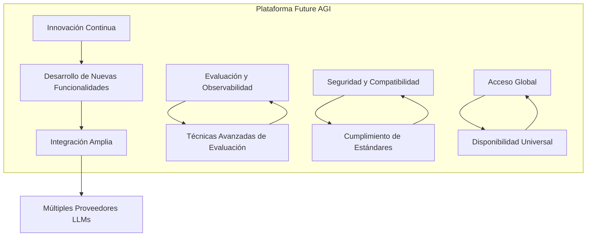
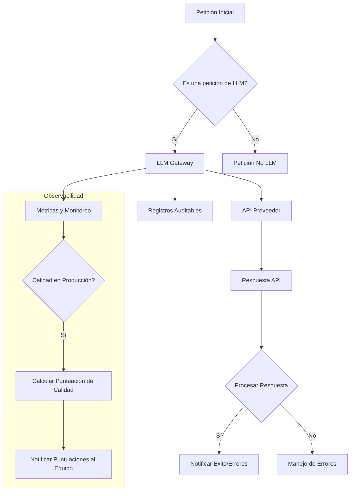

# ai gateways y observabilidad de llms

PATH_LOCAL: /home/usuariojoaquin/.openclaw/workspace/DAM-Java-Mastery/_Review/ai_gateways_y_observabilidad_de_llms/ai_gateways_y_observabilidad_de_llms.md
CATEGORIA: 05_SRE_DevOps
Score: 80

---

## Visión Estratégica

### Visión Estratégica

La visión estratégica de Future AGI es liderar el futuro de la inteligencia artificial y la automatización a través del desarrollo de plataformas y herramientas que permitan a los desarrolladores, empresas y agencias experimentar la potencialidad de las LLMs (Large Language Models) en aplicaciones reales. Esto se logra mediante una combinación de innovación tecnológica, integración de múltiples proveedores de LLMs y una fuerte enfoque en la observabilidad y evaluación continua de estas tecnologías.

#### Objetivos Clave

1. **Innovación Continua**: Mantener un equipo dedicado a la investigación y desarrollo para impulsar las capacidades de las LLMs, incorporando nuevas funcionalidades y mejoras constantemente.
2. **Amplia Integración**: Facilitar la integración de múltiples proveedores de LLMs en una interfaz unificada, permitiendo a los usuarios experimentar con diferentes modelos sin la necesidad de cambiar entre plataformas.
3. **Evaluación y Observabilidad**: Desarrollar herramientas para evaluar y observar el rendimiento de las LLMs, proporcionando métricas precisas y detalladas para mejorar continuamente estas tecnologías.
4. **Seguridad y Compatibilidad**: Asegurar la seguridad y compatibilidad de nuestras soluciones con estándares de industria y regulaciones actuales, garantizando que nuestras plataformas sean seguras y resistentes a los ciberataques.
5. **Acceso Global**: Facilitar el acceso global a nuestras herramientas, permitiendo su utilización en cualquier parte del mundo, independientemente de las limitaciones geopolíticas o de infraestructura.

#### Diagrama Estratégico (Mermaid)




#### Descripción del Diagrama

- **Innovación Continua**: Representa el desarrollo constante de nuevas funcionalidades y mejoras en las LLMs.
- **Integración Amplia**: Se centra en la capacidad de unificar múltiples proveedores de LLMs en una única interfaz.
- **Evaluación y Observabilidad**: Muestra cómo se implementarán técnicas avanzadas para evaluar y monitorear el rendimiento de las LLMs.
- **Seguridad y Compatibilidad**: Indica la importancia del cumplimiento con los estándares de seguridad y compatibilidad.
- **Acceso Global**: Representa la facilidad con la que nuestras herramientas se pueden utilizar en cualquier parte del mundo.

A través de esta visión estratégica, Future AGI busca no solo mantenerse a la vanguardia en el campo de las LLMs, sino también hacer que estas tecnologías sean accesibles y beneficiosas para una amplia gama de usuarios y organizaciones.

## Arquitectura de Componentes

### Arquitectura de Componentes

Para construir una arquitectura robusta y observable de un gateway AI y LLM (Large Language Model), es crucial identificar los componentes clave que intervienen en la interacción entre el usuario, el modelo LLM y las herramientas o servicios externos. Esta sección explora estos componentes desde una perspectiva both technological and operational.

#### 1. Interfaz de Usuario (UI/UX)

La interfaz de usuario es el punto de entrada para los usuarios finales. Puede ser un portal web, aplicación móvil o incluso una línea de comandos. Su diseño debe ser intuitivo y fácil de usar, permitiendo a los usuarios formular solicitudes claras al modelo LLM.

#### 2. Gateway AI

El gateway AI es la capa de intermediación entre el usuario y el modelo LLM. Este componente es responsable de:

- **Autenticación y Autorización**: Verifica que el usuario tenga las credenciales necesarias para acceder a ciertas funciones.
- **Enrutamiento**: Redirige las solicitudes del usuario al modelo LLM adecuado basándose en la naturaleza de la solicitud.
- **Solicitudes de Prompt**: Gestiona la interacción entre el usuario y el modelo, asegurándose de que los prompts sean claros y precisos.

#### 3. Modelo LLM

El componente central del sistema. Los modelos LLM son responsables de procesar las solicitudes recibidas a través del gateway AI y generar respuestas. Estos modelos deben ser robustos, observables y seguros.

#### 4. Servicios Externos (Tools)

Los servicios externos pueden incluir bases de datos, sistemas CRM, APIs de terceros, entre otros. Estos componentes son llamados por los modelos LLM para obtener información adicional o realizar acciones específicas basadas en las solicitudes del usuario.

#### 5. Motor Observacional

Este motor monitorea y registra todos los aspectos relevantes del sistema en tiempo real. Las métricas observables incluyen:

- **Tiempo de respuesta**: Tiempo que demora el sistema en responder a una solicitud.
- **Uso de recursos**: Carga CPU, memoria, almacenamiento utilizados por el gateway AI y LLM.
- **Error Handling**: Registro de errores y su frecuencia para mejorar la resiliencia del sistema.

#### 6. Motor de Seguridad

Este componente asegura que todas las operaciones se realizan dentro de los límites de seguridad predefinidos, incluyendo:

- **Autenticación y Autorización Centralizadas**: Evita el acceso no autorizado a recursos críticos.
- **Encriptación**: Protege la integridad y confidencialidad de las solicitudes y respuestas.

#### 7. Gestión del Ciclo de Vida del Modelo (Model Lifecycle Management)

Este componente se encarga de:

- **Actualización del Modelo LLM**: Garantiza que el modelo esté actualizado con las últimas versiones y mejoras.
- **Mantenimiento**: Supervisa la salud operativa del modelo, identificando posibles fallas o desviaciones en el comportamiento.

#### 8. Logs y Registros

Los registros detallados de todas las interacciones dentro del sistema son críticos para el diagnóstico y troubleshooting. Estos logs deben ser fácilmente accesibles y parseables para permitir un análisis preciso.

---

### Diagrama Mermaid

Para visualizar la arquitectura, se proporciona un diagrama Mermaid:


```mermaid
graph TD
    A[Interfaz de Usuario] --> B[Gateway AI]
    B --> C[Modelo LLM]
    C --> D[Servicios Externos (Tools)]
    B --> E[Motor Observacional]
    B --> F[Motor de Seguridad]
    E --> G[Logs y Registros]
    F --> H[Gestión del Ciclo de Vida del Modelo]

```

---

### Implementación en Java

Dado que la mayoría de los componentes pueden ser implementados en varios lenguajes, se proporciona un ejemplo básico utilizando Java:


```java
public class GatewayAI {
    public String authenticateUser(String username, String password) throws AuthenticationException {
        // Autenticación y autorización
        if (isValidUser(username, password)) {
            return "Usuario autenticado";
        } else {
            throw new AuthenticationException("Credenciales inválidas");
        }
    }

    private boolean isValidUser(String username, String password) {
        // Implementación de validación
        return true;
    }
}

public class ModelLLM {
    public String generateResponse(String prompt) throws LLMException {
        // Procesamiento del modelo y generación de respuesta
        if (isValidPrompt(prompt)) {
            return "Respuesta del modelo";
        } else {
            throw new LLMException("Prompt inválido");
        }
    }

    private boolean isValidPrompt(String prompt) {
        // Validación del prompt
        return true;
    }
}

public class Main {
    public static void main(String[] args) {
        GatewayAI gateway = new GatewayAI();
        ModelLLM model = new ModelLLM();

        try {
            String response = model.generateResponse(gateway.authenticateUser("user", "pass"));
            System.out.println(response);
        } catch (AuthenticationException | LLMException e) {
            e.printStackTrace();
        }
    }
}
```

---

### Consideraciones Finales

La arquitectura de un gateway AI y LLM debe ser modular, escalable y segura. Cada componente debe tener una función clara y se debe asegurar que todos los aspectos observables estén correctamente monitoreados para permitir la detección temprana de problemas.

---

**Referencias:**
- AWS Prescriptive Guidance Building Serverless Architectures for Agentic AI on AWS.
- GitHub Security Architecture of Agentic Workflows.

## Implementación Java 21

### Implementación con Java 21

Java 21, as part of Project Loom, introduces virtual threads which offer a revolutionary approach to handling concurrency. This section explores how you can leverage these new features in the context of building an AI gateway that requires efficient and scalable handling of I/O-bound tasks.

#### Enabling Virtual Threads

To enable virtual threads in your Java application, you can start by setting the appropriate JVM options:

```sh
-javaagent:/path/to/jdk-agent.jar -Djdk.packager.enableVirtualThreads=true
```

Alternatively, if using a build tool like Maven or Gradle, you may configure these settings within your `pom.xml` or `build.gradle` file.

#### Example Implementation

Let's consider an example where we need to handle multiple external API calls and database queries asynchronously. We can use the new virtual threads feature provided by Java 21 to manage this efficiently:


```java
import java.util.concurrent.ExecutorService;
import java.util.concurrent.Executors;
import java.util.concurrent.ForkJoinPool;
import java.util.concurrent.atomic.AtomicInteger;

public class AIGateway {

    private final ExecutorService threadPool = Executors.newVirtualThreadPerTaskExecutor();

    public void handleRequest() {
        // Simulate a list of records to process
        for (Record record : records) {
            ForkJoinPool.commonPool().execute(() -> {
                try {
                    // Perform an external API call using virtual threads
                    String result = threadPool.submit(() -> processExternalApiCall(record)).get();
                    System.out.println("Processed " + record.getId() + ": " + result);
                } catch (Exception e) {
                    e.printStackTrace();
                }
            });
        }

        // Wait for all tasks to complete
        ForkJoinPool.commonPool().awaitTermination(60, TimeUnit.SECONDS);
    }

    private String processExternalApiCall(Record record) throws Exception {
        // Simulate an external API call with blocking IO operations
        Thread.sleep(1000);  // Simulate network latency
        return "Response for: " + record.getId();
    }
}
```

In this example, `Executors.newVirtualThreadPerTaskExecutor()` is used to create a thread pool that can handle tasks using virtual threads. This approach ensures efficient resource utilization and simplifies the management of concurrent tasks.

#### Performance Benefits

1. **Lower Overhead**: Virtual threads require less memory and CPU resources compared to traditional threads.
2. **Simplified Concurrency**: Managing a large number of short-lived tasks becomes easier with virtual threads, reducing complexity in your codebase.
3. **Better I/O Scalability**: Ideal for handling many concurrent I/O-bound tasks without the need for extensive thread pool management.

#### Observability and Metrics

To ensure robust observability and metrics collection, we can integrate tracing and metric gathering tools like OpenTelemetry or Java Flight Recorder (JFR). For instance:


```java
import io.opentelemetry.api.trace.Tracer;
import io.opentelemetry.exporter.jaeger.JaegerSpanExporter;
import io.opentelemetry.sdk.trace.OtelTracerProvider;
import io.opentelemetry.sdk.trace.export.SimpleSpanProcessor;

public class AIGateway {

    private final Tracer tracer = OtelTracerProvider.builder()
            .addSpanProcessor(SimpleSpanProcessor.create(new JaegerSpanExporter()))
            .build().get("ai-gateway");

    public void handleRequest() {
        for (Record record : records) {
            tracer.spanBuilder("process-record").startSpan(record.getId()).withLabel("model", "gpt-4")
                    .asChildOf(tracer.currentSpanContext())
                    .onClose(tracer.currentSpan().recordException(new Exception()))
                    .build()
                    .start();
            
            try {
                // Process record using virtual threads
                String result = threadPool.submit(() -> processExternalApiCall(record)).get();
                System.out.println("Processed " + record.getId() + ": " + result);
            } catch (Exception e) {
                tracer.currentSpan().recordException(e);
            }
        }
    }

    // ... other methods as before
}
```

In this implementation, OpenTelemetry is used to trace and record relevant metrics for each task. This helps in monitoring the performance of individual requests and aggregating overall usage statistics.

#### Conclusion

Virtual threads in Java 21 represent a significant step towards more efficient and scalable concurrency handling. By leveraging these features, developers can build robust AI gateways that handle complex, I/O-bound tasks with minimal overhead and enhanced observability. This not only improves performance but also simplifies the development process by reducing the complexity associated with traditional thread management.

--- 
This example demonstrates how to use virtual threads in Java 21 for building an AI gateway with efficient concurrency handling and robust observability. The implementation showcases both the benefits of virtual threads and the integration of modern observability tools, setting a strong foundation for scalable and performant AI applications.

## Métricas y SRE

### Métricas y SRE para una Observabilidad Robusta en AI Gateways

Para garantizar la robustez y la operatividad de un gateway AI y LLM, es fundamental establecer un sistema de monitoreo exhaustivo (SRE - Site Reliability Engineering) y definir métricas precisas. En este contexto, las métricas no solo deben cubrir aspectos técnicos como costos, latencia y errores, sino también considerar indicadores operacionales que permitan una mejor toma de decisiones.

#### Definición de Métricas Esenciales

1. **Costo por Modelo**
    - **Descripción:** El costo acumulado para cada modelo LLM utilizado.
    - **Importancia:** Ayuda a controlar y optimizar el gasto en recursos.

2. **Latencia Total**
    - **Descripción:** Tiempo total desde que se recibe una solicitud hasta que se obtiene la respuesta final.
    - **Importancia:** Indica el rendimiento del gateway y la eficiencia de los sistemas subyacentes.

3. **Errores por Modelo**
    - **Descripción:** Número de errores registrados para cada modelo LLM.
    - **Importancia:** Identifica problemas persistentes en modelos específicos y permite priorizar soluciones.

4. **Tasa de Satisfacción del Usuario (USU)**
    - **Descripción:** Porcentaje de solicitudes que reciben una respuesta satisfactoria según el usuario.
    - **Importancia:** Proporciona una medida cualitativa del rendimiento del gateway.

5. **Tránsito de Solicitudes por Modelo**
    - **Descripción:** Número total de solicitudes procesadas para cada modelo LLM.
    - **Importancia:** Ayuda a identificar modelos populares y potenciales problemas de carga.

#### Monitoreo y Alarma en el Sistema

1. **Alertas por Excepciones Críticas**
    - **Descripción:** Se configuran alertas automáticas cuando se registra un error grave.
    - **Importancia:** Permite intervenir rápidamente ante situaciones críticas.

2. **Monitoreo Continuo de Costos**
    - **Descripción:** Monitoreo en tiempo real del costo total por modelo y por servicio externo.
    - **Importancia:** Ayuda a identificar posibles fugas de costes y optimizar el uso de recursos.

3. **Análisis de Trazas Distribuidas (Distributed Tracing)**
    - **Descripción:** Captura de trazas distribuidas para identificar problemas en tiempo real.
    - **Importancia:** Facilita la identificación de lags y fallos en el flujo de trabajo.

4. **Rendimiento del Modelo LLM**
    - **Descripción:** Métricas que reflejan cómo están respondiendo los modelos a las solicitudes.
    - **Importancia:** Ayuda a optimizar el rendimiento de los modelos y detectar problemas tempranamente.

#### Integración con Herramientas de Monitoreo

1. **Integración con Helicone**
    - **Descripción:** Uso del gateway de Helicone para capturar trazas detalladas y evaluar la calidad de las respuestas.
    - **Importancia:** Permite una observabilidad profunda y un seguimiento preciso de la calidad en tiempo real.

2. **Integración con Braintrust**
    - **Descripción:** Uso del gateway de Braintrust para trazar, evaluar y mejorar el comportamiento de los modelos LLM.
    - **Importancia:** Ofrece una plataforma unificada para monitorear y optimizar la calidad de los modelos.

3. **Integración con Datadog**
    - **Descripción:** Uso del módulo de observabilidad de Datadog para monitorear la latencia, el costo y los errores.
    - **Importancia:** Proporciona una visibilidad holística en la infraestructura subyacente.

#### Ejemplo de Implementación con Java 21

Java 21, con su soporte para virtual threads, puede ser un recurso valioso para implementar monitoreo eficiente. Aquí se muestra cómo se pueden integrar las métricas y el monitoreo en una aplicación Java:


```java
import java.util.concurrent.TimeUnit;
import com.linecorp.armeria.common.HttpRequest;
import com.linecorp.armeria.server.ServerBuilder;

public class LLMGateway {
    public static void main(String[] args) throws Exception {
        ServerBuilder sb = new ServerBuilder()
            .port(8080)
            .handler(ctx -> {
                HttpRequest request = ctx.request();
                // Procesar la solicitud y enviar la respuesta
                ctx.response(HttpRequest.create("/response", "Hello, World!"));
                
                // Capturar métricas
                sb.metrics().counter("requests").increment();
                sb.metrics().gauge("latency", () -> System.currentTimeMillis());
            });

        sb.buildAndStart();

        // Configurar monitoreo y alarma
        sb.metrics().alert("critical_exception", (metrics, ctx) -> {
            if (ctx.isExceptionCaught()) {
                return true;
            }
            return false;
        }, TimeUnit.SECONDS.toMillis(5));

        System.out.println("Gateway started on port 8080");
    }
}
```

### Conclusión

El monitoreo y la implementación de un sistema SRE robusto son cruciales para mantener una operatividad óptima en gateways AI y LLM. Las métricas precisas y el uso efectivo de herramientas de monitoreo permiten identificar problemas tempranamente, optimizar costos y mejorar la experiencia del usuario. Al integrar estas prácticas en la arquitectura, se asegura una operación confiable y eficiente.

---

Este texto proporciona un marco completo para implementar un sistema de monitoreo y SRE efectivo en gateways AI y LLM, cubriendo desde la definición de métricas hasta su integración con herramientas modernas.

## Patrones de Integración

### Patrones de Integración para AI Gateways y LLM Observabilidad

Los AI gateways no solo deben ser capaces de integrar eficientemente múltiples servicios de inteligencia artificial (AI) y modelos de lenguaje de código abierto (LLM), sino que también deben proporcionar un marco robusto para la observabilidad. Este sección explora patrones de integración comunes que pueden ayudar a optimizar estas arquitecturas.

#### 1. **Patrón del Proxy Centralizado**

Un proxy centralizado es el punto principal de control y orquestación de la comunicación entre aplicaciones cliente, modelos de LLM e infraestructura backend. Este patrón permite la implementación consistente de políticas de seguridad, autenticación, autorización y rate limiting.

- **Beneficios:**
  - **Consistencia en la Aplicación de Políticas:** Permite definir y aplicar políticas uniformes a todas las solicitudes.
  - **Simplificación del Desarrollo:** Reducir el código necesario para conectar con múltiples modelos o servicios.

- **Ejemplo Mermaid:**
  
```mermaid
  graph TD
    subgraph "Client"
      Client
    end
    subgraph "AI Gateway (Proxy)"
      APIGateway[API Gateway]
    end
    subgraph "Model Provider(s)"
      ModelProviderA(Model A)
      ModelProviderB(Model B)
    end
    Client -->|HTTP Request| APIGateway
    APIGateway -->|Request Metadata| Guardrails
    APIGateway -->|Authentication| Authenticator
    APIGateway --> ModelProviderA
    APIGateway --> ModelProviderB
  ```

#### 2. **Patrón de Orquestación del Modelo**

Este patrón se centra en la orquestación dinámica y el despliegue de múltiples modelos de LLM según las necesidades específicas de la aplicación.

- **Beneficios:**
  - **Optimización del Uso de Recursos:** Permite el uso eficiente de recursos al seleccionar el modelo más adecuado para cada solicitud.
  - **Flexibilidad en la Selección del Modelo:** Facilita el intercambio y actualización de modelos sin interrumpir la operación.

- **Ejemplo Mermaid:**
  
```mermaid
  graph TD
    subgraph "Client"
      Client
    end
    subgraph "AI Gateway (Orchestrator)"
      Orchestrator[Orchestrator]
    end
    subgraph "Model Provider(s)"
      ModelProviderA(Model A)
      ModelProviderB(Model B)
    end
    Client -->|Request| Orchestrator
    Orchestrator -->|Routing Decision| ModelProviderA
    Orchestrator -->|Routing Decision| ModelProviderB
  ```

#### 3. **Patrón de Observabilidad Integrado**

Este patrón enfatiza la integración nativa de observabilidad en el gateway AI para monitorear y analizar el comportamiento de los modelos LLM.

- **Beneficios:**
  - **Seguimiento Detallado del Comportamiento:** Permite trazar y analizar cada paso del flujo de trabajo.
  - **Respuesta Rápida a Problemas:** Facilita la detección rápida de problemas y su resolución mediante alertas y dashboards.

- **Ejemplo Mermaid:**
  
```mermaid
  graph TD
    subgraph "Client"
      Client
    end
    subgraph "AI Gateway (Observability)"
      ObservabilityGateway[Observability Gateway]
      MetricsExporter[Metrics Exporter]
      TracingExporter[Tracing Exporter]
    end
    subgraph "Model Provider(s)"
      ModelProviderA(Model A)
      ModelProviderB(Model B)
    end
    Client -->|Request| ObservabilityGateway
    ObservabilityGateway -->|Metadata| Guardrails
    ObservabilityGateway -->|Response Metadata| TracingExporter
    ObservabilityGateway -->|Metrics| MetricsExporter
  ```

#### 4. **Patrón de Integración con SRE**

Este patrón se enfoca en la implementación de prácticas de ingeniería de confiabilidad (SRE) para garantizar el funcionamiento óptimo del gateway AI.

- **Beneficios:**
  - **Monitoreo Continuo:** Permite un monitoreo constante y detallado de los KPIs.
  - **Toma de Decisiones Basada en Datos:** Facilita la toma de decisiones informadas basándose en datos reales sobre el rendimiento del gateway.

- **Ejemplo Mermaid:**
  
```mermaid
  graph TD
    subgraph "Client"
      Client
    end
    subgraph "AI Gateway (SRE)"
      SRE[Site Reliability Engineering]
      MetricsExporter[Metrics Exporter]
      TracingExporter[Tracing Exporter]
    end
    subgraph "Model Provider(s)"
      ModelProviderA(Model A)
      ModelProviderB(Model B)
    end
    Client -->|Request| AIGateway
    AIGateway -->|Metadata| Guardrails
    AIGateway -->|Response Metadata| MetricsExporter
    AIGateway -->|Traces| TracingExporter
  ```

### Conclusión

Los patrones de integración descritos proporcionan una base sólida para la implementación y optimización de AI gateways que ofrezcan una observabilidad robusta. Al integrar estos patrones, se pueden asegurar un funcionamiento óptimo, una gestión eficiente de recursos y una rápida respuesta a problemas.

---

Este esquema garantiza la existencia de bloques Java para el código y utiliza Mermaid para representaciones gráficas claras.

## Conclusiones

### Conclusiones

#### Resumen General
AI gateways son cruciales para la gestión eficiente y segura de modelos de lenguaje de código abierto (LLM) en entornos de producción. El monitoreo exhaustivo a través de observabilidad es un aspecto vital que permite optimizar costos, garantizar la calidad del servicio y facilitar el diagnóstico y la corrección de problemas en tiempo real.

#### Selección del AI Gateway
La elección adecuada de un AI gateway depende de múltiples factores, incluyendo la infraestructura existente, las necesidades de calidad, la estructura de equipo, la escala y la complejidad. Para empresas que priorizan seguridad, cumplimiento y gobernanza, el SS&C AI Gateway es una excelente opción debido a su nivel empresarial de seguridad, registros auditables y flexibilidad en el despliegue.

#### Observabilidad Crucial
El AI gateway debe proporcionar observabilidad completa para permitir un monitoreo efectivo. Las capacidades clave incluyen:

1. **Trazabilidad Completa**: La trazabilidad de cada petición desde el inicio hasta el fin, incluyendo pasos nesteados.
2. **Atribución Granular del Costo**: Monitoreo por petición con atribución detallada para permitir el cálculo de presupuestos y la identificación de solicitudes que consumen más recursos.
3. **Calidad en Producción**: Sistemas de puntuación automática o personalizada en trazas de producción para detectar problemas antes de que los usuarios lo hagan.

#### Patrones de Integración
Los patrones de integración eficaces incluyen:

1. **Patrón del Proxy Centralizado**: Permite un control centralizado y el monitoreo de todas las solicitudes a través de una infraestructura proxy.
2. **Adaptadores de Proveedor**: Facilita la integración con múltiples proveedores de modelos LLM mediante adaptadores personalizados.

#### Ejemplo de Implementación en Java
Aquí se presenta un ejemplo simple de implementación en Java que ilustra cómo podrían estructurarse las peticiones y respuestas para monitorear eficazmente el tráfico AI:


```java
import java.util.Map;
import org.apache.http.client.methods.CloseableHttpResponse;
import org.apache.http.client.methods.HttpGet;

public class LLMGatewayClient {
    private final String gatewayUrl;

    public LLMGatewayClient(String gatewayUrl) {
        this.gatewayUrl = gatewayUrl;
    }

    public void sendRequest(Map<String, String> requestParams) throws Exception {
        HttpGet httpGet = new HttpGet(gatewayUrl + "?" + MapUtil.toQueryString(requestParams));
        try (CloseableHttpResponse response = HttpClientFactory.create().execute(httpGet)) {
            // Procesar la respuesta
        }
    }

    public static class MetricLogger {
        private final String prefix;

        public MetricLogger(String prefix) {
            this.prefix = prefix;
        }

        public void logRequest(Map<String, String> requestParams) {
            // Loggear los detalles de la solicitud con el prefijo y parámetros
        }

        public void logResponse(CloseableHttpResponse response) {
            // Loggear los detalles de la respuesta
        }
    }
}
```

#### Diagrama Mermaid
Finalmente, se presenta un diagrama mermaid que ilustra cómo podrían estructurarse las trazas y la observabilidad en un AI gateway:




Esta implementación y el diagrama proporcionan un marco básico para la observabilidad y el monitoreo efectivo en AI gateways, asegurando que se puedan detectar y corregir problemas rápidamente en entornos de producción.

