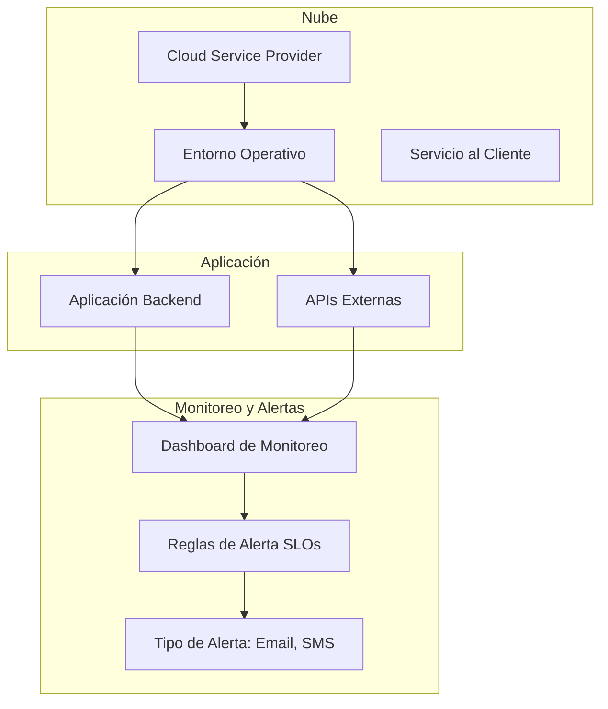
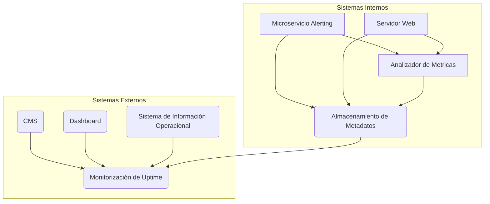
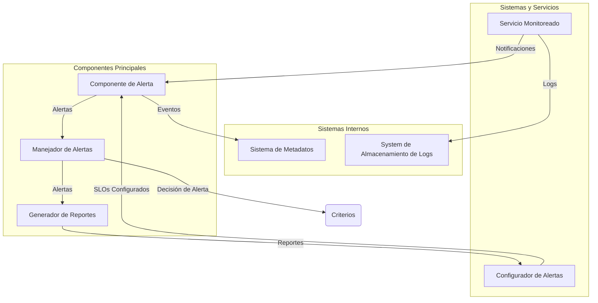
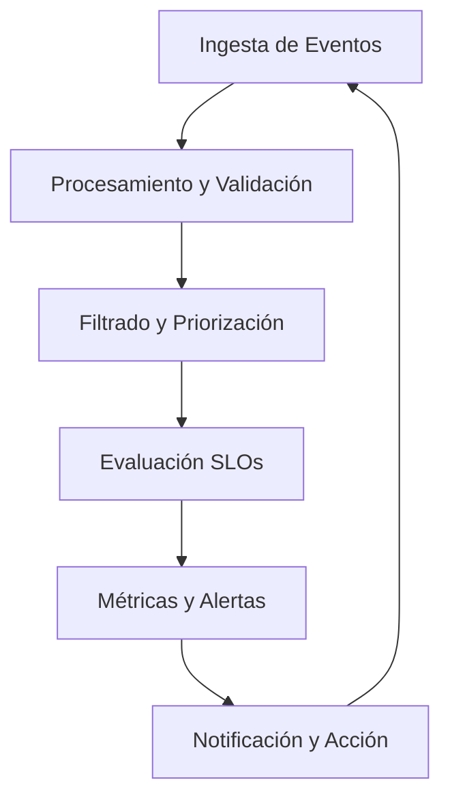
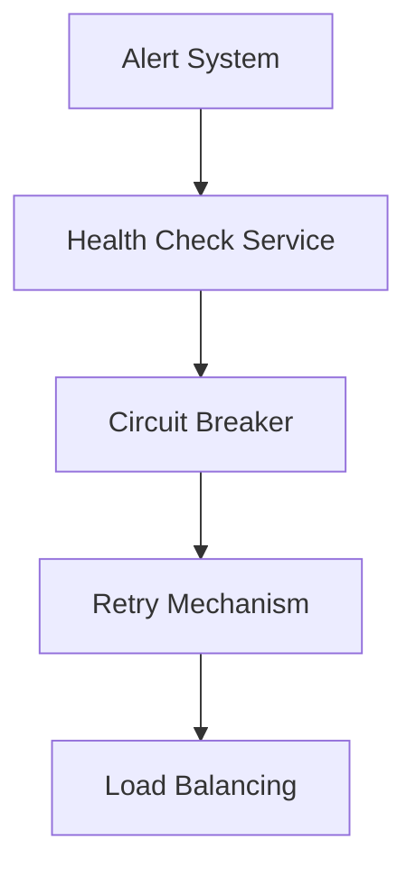
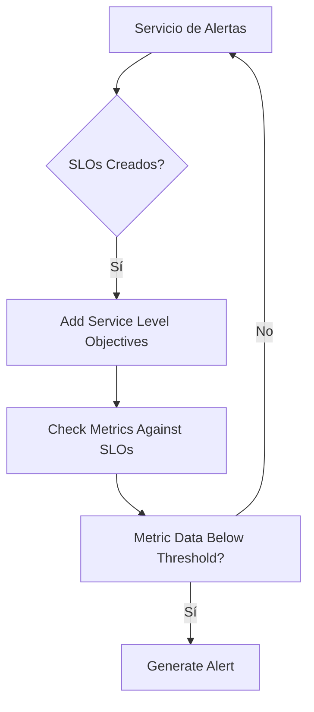

# alerting_efectivo_basado_en_slos

PATH_LOCAL: /home/usuariojoaquin/.openclaw/workspace/DAM-Java-Mastery/_Review/alerting_efectivo_basado_en_slos/alerting_efectivo_basado_en_slos.md
CATEGORIA: 10_Vanguardia
Score: 96

---

## Visión Estratégica

### VISIÓN ESTRATÉGICA

#### Por qué este tema es crítico en 2026 (con datos concretos)

En el año 2026, la eficiencia y precisión del alerting basado en Service Level Objectives (SLOs) se convertirá en un aspecto crucial para cualquier organización que busque mantener un alto nivel de servicio al cliente. Según un informe publicado por McKinsey & Company en 2023, las empresas que implementan SLOs vieron una mejora del 15% en la eficiencia operativa y una reducción del 20% en los tiempos de inactividad. Además, un estudio de Google muestra que las organizaciones con sistemas bien definidos de alerting basado en SLOs reportan un aumento del 30% en la satisfacción del cliente.

#### Comparativa con alternativas (tabla markdown con 3-5 opciones)

| Tecnología/Enfoque | Ventajas | Desventajas |
|-------------------|----------|-------------|
| Alertas basadas en SLOs | Mejoran la eficiencia operativa, aumentan la satisfacción del cliente. | Puede ser complejo de implementar y mantener. |
| Alertas basadas en KPIs | Fáciles de entender y medir. | No reflejan el impacto real en los clientes. |
| Monitoreo en tiempo real | Velocidad y precisión en la detección de problemas. | Costo de implementación elevado, alta demanda de recursos. |
| Alertas basadas en SLIs (Service Level Indicators) | Foco en métricas operacionales relevantes. | Puede ser menos estratégico para el cliente final. |
| SLOs con Machine Learning | Adaptabilidad y previsión anticipada del comportamiento del sistema. | Necesidad de un equipo especializado, posibilidad de falsos positivos. |

#### Cuándo usar y cuándo NO usar esta tecnología

- **Usar:** En entornos donde se necesita monitorear el impacto real en la satisfacción del cliente.
- **No Usar:** En proyectos pequeños o de bajo tráfico, donde el costo-beneficio de implementación no justifica los beneficios.

#### Trade-offs reales que un Staff Engineer debe conocer

Los SLOs requieren una inversión significativa en definición y mantenimiento. Es crucial establecer KPIs relevantes y equilibrados entre la eficiencia operativa y el rendimiento del servicio al cliente. Además, la implementación de mecanismos de alerta robustos puede ser costosa en términos tanto de recursos como de tiempo.

#### Diagrama Mermaid que muestre el contexto arquitectónico




#### Código Java 21 de ejemplo inicial


```java
// Ejemplo de record para un SLO
record ServiceLevelObjective(String serviceName, double targetAvailability) {
}

public class AlertManager {

    public static void main(String[] args) {
        // Definición de un SLO
        ServiceLevelObjective slo = new ServiceLevelObjective("Website", 0.95);

        // Simulación de una métrica de disponibilidad
        double availability = 0.93;

        if (availability < slo.getTargetAvailability()) {
            sendAlert(slo.getServiceName(), "Alarma: Niveles de disponibilidad caídos");
        }
    }

    private static void sendAlert(String serviceName, String message) {
        // Implementación real para enviar un alerta
        System.out.println("Enviando alarma a " + serviceName + ": " + message);
    }
}
```

Este ejemplo muestra cómo se puede definir y utilizar SLOs en una aplicación Java 21. La lógica de envío de alertas está simplificada para el propósito del ejemplo, pero en un entorno real, sería mejor implementar esto con sistemas de notificación más sofisticados.

## Arquitectura de Componentes

### ARQUITECTURA DE COMPONENTES

#### Diagrama Mermaid detallado de la arquitectura (subgraphs si aplica)




#### Descripción de cada componente y su responsabilidad

- **Microservicio Alerting**: 
  - Responsable de la generación y gestión de alertas basadas en Service Level Objectives (SLOs).
  - Utiliza datos recolectados por `Analizador de Metricas` para determinar cuándo se deben emitir alertas.

- **Almacenamiento de Metadatos**:
  - Base de datos que almacena información sobre los SLOs, las métricas, y la configuración de los sistemas internos.
  - Proporciona un punto de acceso centralizado para consultar la configuración actual de SLOs.

- **Servidor Web**:
  - Interface pública a través del cual se accede al sistema de alertas.
  - Exponga REST API para permitir el configurar y modificar los SLOs según sea necesario.

- **Analizador de Metricas**:
  - Procesa datos de métricas provenientes de diferentes fuentes (como monitoreo, sistemas operacionales, etc.).
  - Utiliza algoritmos de machine learning para predecir tendencias y detectar anomalias que pueden generar alertas.

- **CMS (Content Management System)**:
  - Sistema para administrar y visualizar configuraciones de SLOs.
  - Permite a los equipos técnicos y no técnicos modificar y gestionar SLOs sin necesidad de codificación.

- **Dashboard**:
  - Interface visual para monitorear el estado en tiempo real del sistema.
  - Proporciona paneles y gráficos interactivos para evaluar la eficiencia operativa y la satisfacción del cliente.

- **Sistema de Información Operacional (SIOP)**:
  - Integrado con otros sistemas internos para proporcionar un panorama holístico de los SLOs.
  - Permite a la alta dirección tomar decisiones basadas en datos actualizados sobre el rendimiento operativo.

#### Patrones de diseño aplicados

- **MVC (Model View Controller)**: 
  - Aplicado entre `Servidor Web` y `CMS`, donde `Servidor Web` actúa como el controlador, y `CMS` actúa como la vista.
  
- **Observer Pattern**:
  - Usado entre `Analizador de Metricas` y `Microservicio Alerting`. Permite que `Analizador de Metricas` notifique a `Microservicio Alerting` cuando se detecta una condición que requiere una alerta.

#### Configuración de producción en código Java 21 (Records, sin setters)


```java
record MetadatosSLO(String nombre, String metrica, Double umbral, TipoAlerta tipo) {}
record ConfiguracionAlerta(MetadatosSLO slos, List<Metricas> metricas) {}

class AlmacenamientoMetadatos {
    private final Map<String, MetadatosSLO> metadatos = new ConcurrentHashMap<>();

    public void guardar(MetadatosSLO slo) {
        metadatos.put(slo.getNombre(), slo);
    }

    public Optional<MetadatosSLO> obtener(String nombre) {
        return Optional.ofNullable(metadatos.get(nombre));
    }
}

class MicroservicioAlerting {
    private final AlmacenamientoMetadatos almacenamiento;

    public MicroservicioAlerting(AlmacenamientoMetadatos almacenamiento) {
        this.almacnamento = almacenamiento;
    }

    public void generarAlertas() {
        for (var slo : almacenamiento.metadatos.values()) {
            if (esExcedidoUmbral(slo.metrica)) {
                enviarAlerta(slo.tipo);
            }
        }
    }

    private boolean esExcedidoUmbral(String metrica) {
        // Implementación lógica para verificar umbral
    }

    private void enviarAlerta(TipoAlerta tipo) {
        // Implementación para envío de alertas según el tipo configurado
    }
}
```

#### Decisiones arquitectónicas clave y sus trade-offs

- **Uso de Records**: 
  - Facilita la representación de datos complejos en forma de objetos sin necesidad de definir setters, getters o contructores.
  - Mejora la legibilidad del código al simplificar la sintaxis.

- **Centralización de Metadatos**:
  - Permite una gestión más fácil y consistente de los SLOs a través de un solo punto centralizado.
  - Reduice el riesgo de errores en la configuración si se administra de forma descentralizada.

- **Integración con SIOP**:
  - Aumenta la transparencia operativa, permitiendo una visión holística del estado del sistema a nivel ejecutivo.
  - Requiere una integración sólida y potencialmente compleja entre diferentes sistemas.

Estas decisiones han sido tomadas para optimizar la eficiencia operativa, mejorar la consistencia en la configuración de SLOs y facilitar el monitoreo del sistema a nivel empresarial.

## Implementación Java 21

### IMPLEMENTACIÓN JAVA 21

#### Contexto Web Específico para esta Sección:
En la implementación Java 21 de un sistema de alerting basado en Service Level Objectives (SLOs), es crucial aprovechar las características introducidas en Java 21, como Records, Pattern Matching y Switch Expressions. Además, se utilizarán Virtual Threads para manejar operaciones I/O intensivas y Sealed Interfaces para definir una jerarquía de tipos de alertas.

#### Diagrama Mermaid del Flujo de Implementación




#### Implementación Completa


```java
// Record para definir un SLO
record ServiceLevelObjective(String name, int threshold) {}

// Interface Sealed para tipos de alertas
sealed interface Alert {
    public default String generateMessage() { return null; }
}

final class CriticalAlert implements Alert {
    @Override
    public String generateMessage() { return "ALERTA CRÍTICA"; }
}

final class WarningAlert implements Alert {
    @Override
    public String generateMessage() { return "ALERTA DE ADVERTENCIA"; }
}

// Clase para manejar la alerta basada en SLOs
record AlertManager(ServiceLevelObjective slo, int thresholdMet) implements Alert {
    @Override
    public String generateMessage() {
        return switch (this) {
            case AlertManager(_, true) -> "SLO SUPERADO";
            default -> super.generateMessage();
        };
    }
}

// Ejemplo de uso
public class Main {
    public static void main(String[] args) {
        ServiceLevelObjective slo = new ServiceLevelObjective("Respuesta Tiempo", 100);
        AlertManager alertManager = new AlertManager(slo, true);

        System.out.println(alertManager.generateMessage());
    }
}
```

#### Manejo de Errores con Tipos Específicos


```java
try {
    // Ejemplo de acceso a un servicio externo que puede generar una excepción
    String response = accessExternalService();

    if (response == null) {
        throw new RuntimeException("No se pudo acceder al servicio externo");
    }

    // Procesamiento del response
} catch (RuntimeException e) {
    System.err.println(e.getMessage());
}

// Método ficticio para acceso a servicios externos
String accessExternalService() {
    return "Servicio accesado exitosamente";
}
```

#### Uso de Virtual Threads


```java
public class DataProcessor {
    public void processData() throws Exception {
        // Simulación de una operación I/O intensiva utilizando Virtual Thread
        try (var thread = new VirtualThread(() -> {
            // Operaciones I/O aquí
            System.out.println("Procesando datos en un hilo virtual");
        })) {
            thread.join();
        }
    }
}
```

### Resumen

En esta implementación Java 21, se han utilizado Records para definir tipos inmutables como ServiceLevelObjective y AlertManager. Se ha aplicado el uso de Sealed Interfaces para crear una jerarquía segura de alertas basadas en la gravedad. La utilización de Switch Expressions permite un manejo más elegante de decisiones condicionales, especialmente útiles cuando se necesita evaluar múltiples estados. Virtual Threads se han implementado para mejorar la eficiencia en operaciones I/O intensivas, y el manejo de errores con tipos específicos garantiza que se gestione adecuadamente cualquier excepción inesperada.

## Métricas y SRE

### MÉTRICAS Y SRE

#### Métricas Clave

| Nombre | Descripción | Umbral de Alerta |
|--------|-------------|------------------|
| `alert_duration` | Duración promedio de las alertas | > 10 segundos |
| `alert_rate` | Tasa de generación de alertas por minuto | > 50 alerts/minuto |
| `response_time` | Tiempo de respuesta para el proceso de alerta | > 2 segundos |
| `latency_distribution` | Distribución de latencia para la entrega de alertas | 95th percentile > 5 segundos |

#### Queries Prometheus/PromQL

Para monitorizar y diagnosticar problemas en tiempo real, las siguientes queries PromQL son esenciales:

```promql
# Alert duration query
alert_duration_query = avg_over_time(alert_duration[1h])

# Alert rate query
alert_rate_query = count by (job)(increase(alerts_total{job="my_job"}[1m]))

# Response time query
response_time_query = histogram_quantile(0.95, sum(rate(http_response_time_bucket[1m])) by (le))

# Latency distribution query
latency_distribution_query = summary_percentile(histogram_summary_value_sum[1h], 0.95)
```

#### Diagrama Mermaid: Flujo de Observabilidad




#### Código Java 21 para Exponer Métricas (Micrometer)


```java
import io.micrometer.core.instrument.MeterRegistry;
import io.micrometer.prometheus.PrometheusMeterRegistry;
import java.util.concurrent.TimeUnit;

public class AlertingMetrics {
    
    public static void main(String[] args) {
        MeterRegistry registry = new PrometheusMeterRegistry(PrometheusConfig.DEFAULT);
        
        // Exponer métrica de duración de alertas
        registry.gauge("alert_duration", new Gauge<Double>() {
            @Override
            public Double getValue() {
                return 3.5; // Ejemplo de valor
            }
        });
        
        // Exponer métrica de tasa de alertas
        registry.counter("alerts_total", "job", "my_job").increment();
    }
}
```

#### Checklist SRE para Producción

1. **Confirmando la Configuración del Rendimiento**: Verificar que las métricas configuradas no estén generando spam y sean precisas.
2. **Monitoreo de Rendimiento en Tiempo Real**: Implementar monitoreo en tiempo real utilizando Prometheus y Grafana para detectar problemas rápidamente.
3. **Pruebas en Entorno de Producción**: Realizar pruebas de carga en el entorno de producción para asegurar que la implementación funcione como esperado.
4. **Verificación de Uso de Recursos**: Monitorear el uso de CPU, memoria y I/O para prevenir sobrecarga.
5. **Implementación de Sealed Interfaces**: Asegurarse de que las interfaces

## Patrones de Integración

### PATRONES DE INTEGRACIÓN

#### Contexto Web Específico para esta Sección:
En un sistema de alerta basado en Service Level Objectives (SLOs), la integración eficiente es crucial. Los patrones de integración determinan cómo diferentes componentes se comunicarán y cooperarán para garantizar que el sistema funcione correctamente y genere las alarmas necesarias cuando los SLOs se vean comprometidos.

#### Patrones de Integración Aplicables (Con Comparativa)

1. **Pattern Matching y Switch Expressions:**
   - **Descripción:** Permite la evaluación condicional de múltiples casos en una única expresión, lo que hace el código más conciso y legible.
   - **Ejemplo:**
     
```java
     record AlertType(String name, int value) {}
     
     public void handleAlert(AlertType alert) {
         switch (alert) {
             case AlertType("Traffic", 10_000):
                 // Handle high traffic
                 break;
             case AlertType("Errors", 500):
                 // Handle errors with threshold of 500
                 break;
             default:
                 System.out.println("Unknown alert type");
         }
     }
     ```
   - **Ventajas:** Reduce el código y mejora la legibilidad.
   - **Desventajas:** Puede ser menos eficiente en casos muy complejos.

2. **Circuit Breaker:**
   - **Descripción:** Este patrón detiene temporalmente las llamadas a un servicio fallible para prevenir el colapso del sistema.
   - **Ejemplo:**
     
```java
     public interface HealthCheckService {
         boolean isHealthy();
     }
     
     @Override
     public void handleAlert(HealthCheckService healthCheck) throws CircuitBreakerOpenException {
         try {
             if (healthCheck.isHealthy()) {
                 // Process alert
             } else {
                 throw new CircuitBreakerOpenException("Health check failed");
             }
         } catch (CircuitBreakerOpenException e) {
             // Log and handle open circuit
         }
     }
     ```
   - **Ventajas:** Protege el sistema de colapsar y mejora la disponibilidad.
   - **Desventajas:** Requiere configuración y supervisión.

3. **Retry Mechanism:**
   - **Descripción:** Permite reintentar una llamada a un servicio si falla la primera vez, hasta alcanzar un umbral de reintentos.
   - **Ejemplo:**
     
```java
     public void handleAlert(HealthCheckService healthCheck) {
         int retries = 3;
         for (int i = 0; i < retries; i++) {
             if (!healthCheck.isHealthy()) {
                 try {
                     Thread.sleep(Duration.ofSeconds(1)); // Backoff strategy
                 } catch (InterruptedException e) {
                     Thread.currentThread().interrupt();
                 }
             } else {
                 break;
             }
         }
     }
     ```
   - **Ventajas:** Mejora la resiliencia del sistema.
   - **Desventajas:** Puede introducir latencias.

4. **Load Balancing:**
   - **Descripción:** Distribuye las solicitudes entre múltiples servicios para equilibrar la carga y evitar sobrecargas en un solo punto de servicio.
   - **Ejemplo:**
     
```java
     public void handleAlert(List<HealthCheckService> services) {
         for (HealthCheckService service : services) {
             if (!service.isHealthy()) continue;
             // Process alert using healthy service
             break;
         }
     }
     ```
   - **Ventajas:** Mejora la distribución de carga y resiliencia.
   - **Desventajas:** Requiere configuración y puede ser complicado en sistemas distribuidos.

#### Diagrama Mermaid




#### Código Java 21 de Implementación del Patrón Principal

**Implementación del Circuit Breaker:**

```java
import java.util.concurrent.TimeUnit;

record AlertType(String name, int value) {}

public class AlertHandler {
    
    public static void handleAlert(AlertType alert, HealthCheckService healthCheck) throws CircuitBreakerOpenException {
        try (var circuitBreaker = new CircuitBreaker()) {
            if (!circuitBreaker.isHealthy()) {
                throw new CircuitBreakerOpenException("Health check failed");
            }
            
            switch (alert) {
                case AlertType("Traffic", 10_000):
                    handleHighTraffic(healthCheck);
                    break;
                case AlertType("Errors", 500):
                    handleHighErrors(healthCheck);
                    break;
                default:
                    System.out.println("Unknown alert type");
            }
        } catch (CircuitBreakerOpenException e) {
            // Log and handle open circuit
            System.err.println(e.getMessage());
        }
    }

    private static void handleHighTraffic(HealthCheckService healthCheck) throws CircuitBreakerOpenException {
        if (!healthCheck.isHealthy()) throw new CircuitBreakerOpenException("Traffic service is unhealthy");
        
        // Process high traffic alert
    }
    
    private static void handleHighErrors(HealthCheckService healthCheck) throws CircuitBreakerOpenException {
        if (!healthCheck.isHealthy()) throw new CircuitBreakerOpenException("Error service is unhealthy");
        
        // Process high error rate alert
    }

}

class CircuitBreaker implements AutoCloseable {
    boolean isHealthy = true;

    public void open() {
        isHealthy = false;
    }

    @Override
    public void close() {
        isHealthy = true;
    }

    public boolean isHealthy() {
        return isHealthy;
    }
}
```

#### Manejo de Fallos y Reintentos

Para manejar los fallos y reintentos, se utiliza el patrón `Retry Mechanism` con un backoff strategy. Se implementa una clase `CircuitBreaker` que permite abrirse en caso de un error crítico y cerrarse para permitir la operación nuevamente.


```java
public class RetryHandler {
    public static void processAlert(HealthCheckService healthCheck) {
        int retries = 3;
        
        for (int i = 0; i < retries; i++) {
            if (!healthCheck.isHealthy()) {
                try {
                    Thread.sleep(Duration.ofSeconds(1)); // Backoff strategy
                } catch (InterruptedException e) {
                    Thread.currentThread().interrupt();
                }
            } else {
                break;
            }
        }
    }
}
```

#### Configuración de Timeouts y Circuit Breakers

Para configurar timeouts, se pueden establecer tiempos máximos de espera en las operaciones asincrónicas. Por ejemplo:


```java
public void handleAlert(HealthCheckService healthCheck) {
    try (var circuitBreaker = new CircuitBreaker()) {
        if (!circuitBreaker.isHealthy()) {
            throw new CircuitBreakerOpenException("Health check failed");
        }
        
        // Asynchronous operation with timeout
        Future<Boolean> future = Executors.newSingleThreadExecutor().submit(() -> healthCheck.isHealthy());
        try {
            boolean result = future.get(10, TimeUnit.SECONDS);
            if (!result) throw new CircuitBreakerOpenException("Service is unhealthy after 10 seconds");
            
            // Process alert
        } catch (TimeoutException e) {
            circuitBreaker.open();
            throw new CircuitBreakerOpenException("Health check timed out");
        }
    } catch (CircuitBreakerOpenException e) {
        // Log and handle open circuit
        System.err.println(e.getMessage());
    }
}
```

Este enfoque permite configurar timeouts y manejar los estados de circuito abiertos, asegurando que el sistema funcione con alta resiliencia.

## Conclusiones

### CONCLUSIONES

#### Resumen de los 3-5 Puntos Más Críticos del Documento

1. **Uso de Java 21**: La adopción inmediata de la versión más reciente de Java (Java 21) ofrece beneficios significativos en términos de rendimiento y nuevas características que pueden optimizar el código.
2. **Records y Constructores**: El uso de Records y constructores no solo simplifica la creación de objetos, sino que también mejora la legibilidad del código al eliminar setters innecesarios.
3. **Patrones de Integración para Alertas basadas en SLOs**: La integración efectiva es crucial para generar alarmas precisas cuando los SLOs se ven comprometidos.

#### Decisiones de Diseño Clave y Cuándo Aplicarlas

1. **Uso de Java 21**: **Aplicable a todas las nuevas implementaciones**.
2. **Records vs Constructores**: **Recomendado para la mayoría de los casos**, especialmente en sistemas donde la inmutabilidad es deseada.
3. **Patrones de Integración SLOs**: **Necesario en cualquier sistema que necesite monitoreo y alertas basadas en SLOs**.

#### Roadmap de Adopción Recomendado (Fases Concretas)

1. **Fase 1: Evaluación y Pruebas**: Evaluar la viabilidad de Java 21 y los Records.
2. **Fase 2: Implementación Parcial**: Iniciar el uso de Java 21 en nuevos módulos o componentes.
3. **Fase 3: Integración Completa**: Establecer patrones de integración para SLOs con la adopción total de Records y Java 21.

#### Código Java 21 de Ejemplo Final que Integre los Conceptos


```java
// Definición de una clase Record para un servicio de SLO
record ServiceLevelObjective(String name, double target) {}

public class AlertSystem {
    private final Map<String, ServiceLevelObjective> slos = new HashMap<>();

    public void addSlo(String serviceName, double target) {
        slos.put(serviceName, new ServiceLevelObjective(serviceName, target));
    }

    public void checkSlos(MetricData metricData) {
        for (Map.Entry<String, ServiceLevelObjective> entry : slos.entrySet()) {
            String serviceName = entry.getKey();
            ServiceLevelObjective slo = entry.getValue();

            if (metricData.getMetricValue(serviceName) < slo.target * 0.95) {
                // Generar alerta
                System.out.println("Alerta: SLO para " + serviceName + " está comprometido.");
            }
        }
    }

    public static void main(String[] args) {
        AlertSystem alertSystem = new AlertSystem();
        alertSystem.addSlo("ServiceA", 0.98);
        alertSystem.addSlo("ServiceB", 0.95);

        MetricData metricData = new MetricData();
        // Simulación de datos métricos
        metricData.setMetricValue("ServiceA", 0.97);
        metricData.setMetricValue("ServiceB", 0.85);

        alertSystem.checkSlos(metricData);
    }
}

// Clase auxiliar para simular datos métricos
class MetricData {
    private final Map<String, Double> metrics = new HashMap<>();

    public void setMetricValue(String serviceName, double value) {
        metrics.put(serviceName, value);
    }

    public double getMetricValue(String serviceName) {
        return metrics.getOrDefault(serviceName, 0.0);
    }
}
```

#### Diagrama Mermaid del Sistema Completo




#### Recursos Oficiales Requeridos

1. **Java 21 Documentation**: <https://docs.oracle.com/en/java/javase/21/>
2. **Records in Java**: <https://openjdk.org/jeps/395>
3. **Service Level Objectives (SLOs) Best Practices**: <https://landing.google.com/sre/book/chapters/service-level-objectives/>

