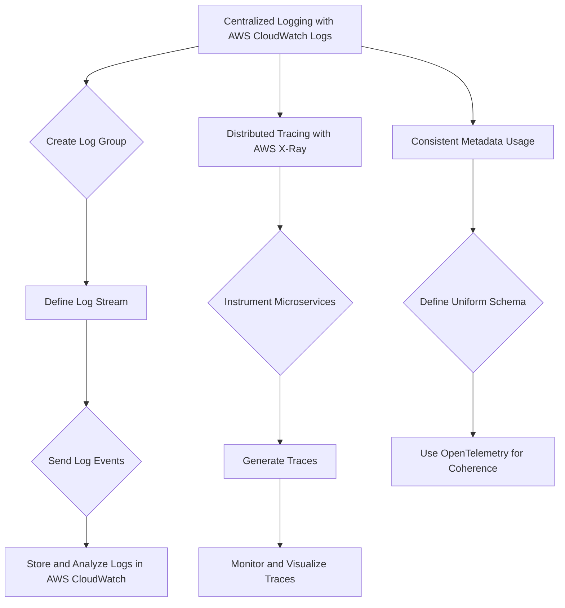
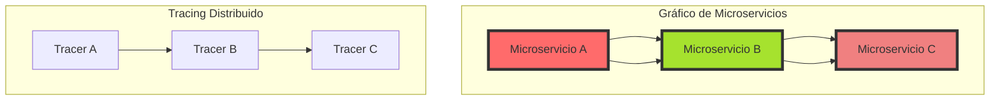
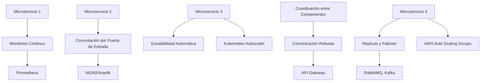
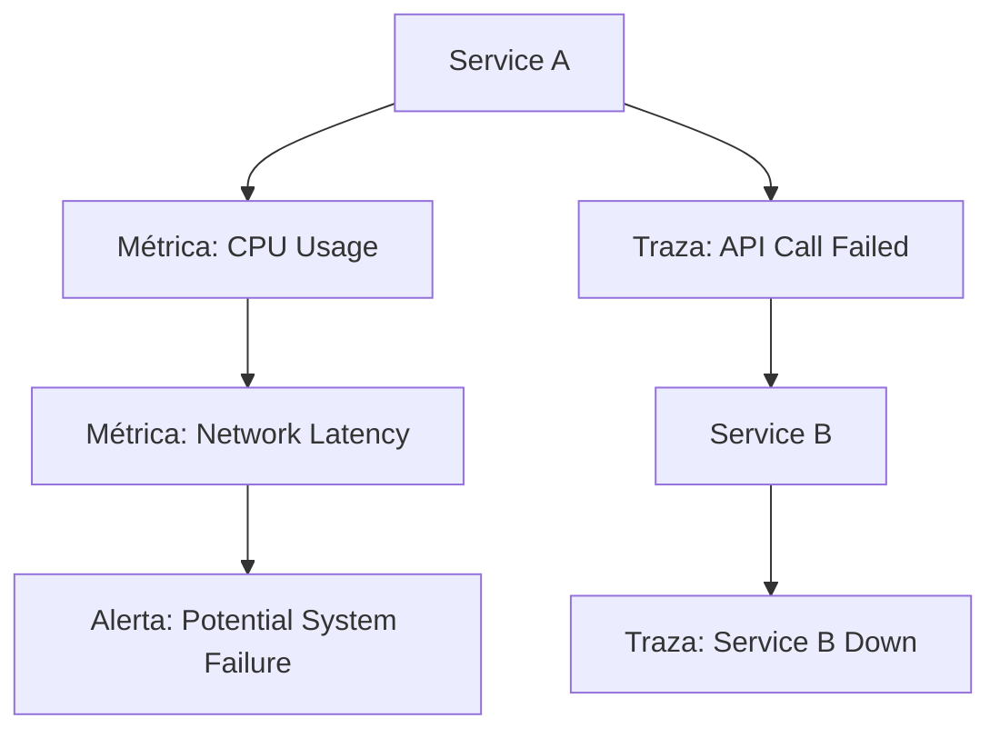
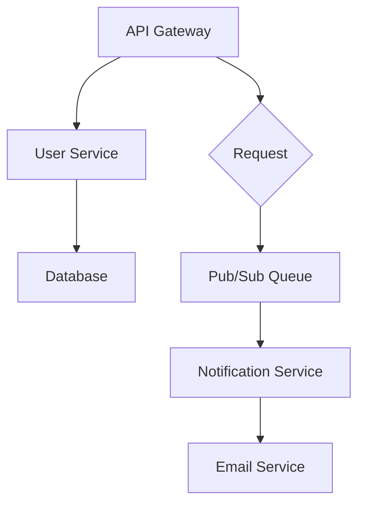

# anti patrones de observabilidad en microservicios

PATH_LOCAL: /home/usuariojoaquin/.openclaw/workspace/DAM-Java-Mastery/_Review/anti_patrones_de_observabilidad_en_microservicios/anti_patrones_de_observabilidad_en_microservicios.md
CATEGORIA: 05_SRE_DevOps
Score: 83

---

## Visión Estratégica

### Visión Estratégica

En la implementación de microservicios en AWS, es crucial considerar y abordar los antipatrones de observabilidad que pueden surgir. La observabilidad es fundamental para monitorear, diagnosticar y optimizar el rendimiento de aplicaciones compuestas por microservicios, especialmente cuando se trata de sistemas distribuidos e hiperescalables.

#### Antipatrones Comunes de Observabilidad en Microservicios

1. **Falta de Implementación Centralizada de Logs:**
   - *Antipatrón:* Los logs
   - *Solución:* Utilizar servicios como AWS CloudWatch Logs para centralizar y correlacionar los logs de diferentes microservicios.

2. **No Uso o Mal Uso de Tracing:**
   - *Antipatrón:* Falta el uso de trazas distribuidas para monitorear la interacción entre microservicios, lo que dificulta rastrear la orquestación y los tiempos de respuesta.
   - *Solución:* Implementar soluciones como AWS X-Ray para monitorear y visualizar las trazas distribuidas.

3. **No Uso o Mal Uso de Metadatos:**
   - *Antipatrón:* Falta el uso de metadatos consistentes en los logs y trazas, lo que dificulta la correlación entre eventos.
   - *Solución:* Establecer un esquema de metadatos uniforme para todos los servicios y utilizar herramientas como OpenTelemetry para facilitar la coherencia.

4. **Falta de Implementación Centralizada de Metrices:**
   - *Antipatrón:* Los métricos se registran en cada microservicio sin una centralización, lo que dificulta el análisis del rendimiento y la toma de decisiones basadas en datos.
   - *Solución:* Utilizar servicios como AWS CloudWatch para centralizar y analizar las métricas de todos los microservicios.

5. **Implementación Inadecuada de Observabilidad en Nuevas Funciones:**
   - *Antipatrón:* Se añaden nuevas funciones sin considerar la observabilidad, lo que puede resultar en problemas futuros difíciles de diagnosticar.
   - *Solución:* Integrar observabilidad desde el principio del desarrollo y utilizar prácticas como observación continua para garantizar que las nuevas implementaciones sean observable.

6. **No Uso o Mal Uso de Alertas:**
   - *Antipatrón:* Falta la configuración adecuada de alertas basadas en métricos y logs, lo que puede llevar a la falta de respuestas oportunas ante problemas.
   - *Solución:* Configurar y monitorear las alertas automatizadas utilizando herramientas como AWS CloudWatch Alarms.

7. **Falta de Integración con Herramientas Externas:**
   - *Antipatrón:* Falta la integración entre diferentes herramientas de observabilidad, lo que dificulta una visión global del sistema.
   - *Solución:* Utilizar plataformas unificadas como AWS Well-Architected Framework para integrar y monitorear las diversas herramientas.

#### Implementando Mejores Prácticas en AWS

- **Centralización de Logs:** Use AWS CloudWatch Logs para centralizar la captura, almacenamiento y análisis de logs.
- **Distribución de Traces:** Utilice AWS X-Ray para trazar y visualizar la interacción entre microservicios.
- **Metadatos Consistentes:** Establezca un esquema uniforme de metadatos utilizando OpenTelemetry o similar.
- **Centralización de Métricas:** Use AWS CloudWatch para centralizar y monitorear métricas.
- **Alertas Automatizadas:** Configure y mantenga alertas automatizadas en AWS CloudWatch Alarms.
- **Integración de Herramientas:** Utilice herramientas unificadas como AWS Well-Architected Framework para una visión global del sistema.

### Bloque Java


```java
// Ejemplo básico de configuración centralizada de logs usando AWS CloudWatch Logs
import software.amazon.awssdk.regions.Region;
import software.amazon.awssdk.services.logs.LogsClient;
import software.amazon.awssdk.services.logs.model.PutLogEventsRequest;

public class CentralizedLogging {
    public static void main(String[] args) {
        Region region = Region.US_WEST_2;
        LogsClient logsClient = LogsClient.builder().region(region).build();

        String logGroupName = "my-log-group";
        PutLogEventsRequest putLogEventsRequest = PutLogEventsRequest.builder()
                .logGroupName(logGroupName)
                .logStreamName("my-log-stream")
                .logEvents(List.of(LogEvent.builder().message("Example Log").timestamp(123456789).build()))
                .build();

        logsClient.putLogEvents(putLogEventsRequest);
    }
}
```

### Bloque Mermaid




Este bloque de código Java proporciona un ejemplo básico de cómo configurar centralización de logs usando AWS CloudWatch Logs, y el bloque Mermaid visualiza la implementación estratégica de observabilidad en microservicios con AWS.

## Arquitectura de Componentes

### Arquitectura de Componentes

En la implementación y mantenimiento de microservicios, es crucial evitar ciertos antipatrones que pueden comprometer la observabilidad y el rendimiento del sistema. A continuación, se presentan algunos de los antipatrones más comunes relacionados con la arquitectura de componentes.

#### Falta de Standardización

**Problema:** Cada microservicio utiliza diferentes marcos y herramientas para registro y observabilidad, lo que complica la integración y el análisis conjunto de datos. 

- **Solución:** Utilizar un estándar uniforme para la observabilidad en todos los microservicios (por ejemplo, OpenTelemetry). Esto facilita la cohesión del sistema y mejora la legibilidad y mantenibilidad.

#### Dependencias Excesivas

**Problema:** Las microservicios están altamente dependientes entre sí, lo que dificulta el aislamiento y la evolución independiente de los servicios. 

- **Solución:** Diseñar cada microservicio con una única responsabilidad (Single Responsibility Principle) y minimizar las dependencias externas. Utilizar interfaces claras y estándares bien definidos para la comunicación entre servicios.

#### Falta de Log Correlación

**Problema:** Los logs no están correlacionados adecuadamente, lo que dificulta el seguimiento de tramas transversales en múltiples microservicios.

- **Solución:** Implementar un ID de correlación (Correlation ID) para rastrear los eventos a través del sistema. Esto permite agrupar y analizar logs relacionados en una sola vista, facilitando la depuración y el análisis.

#### Log Complejo o Inútil

**Problema:** Los logs no proporcionan información valiosa o son demasiado complejos, lo que dificulta la identificación de problemas y su resolución.

- **Solución:** Utilizar un marco de logeo bien diseñado (como ELK o EFK) que capture solo datos relevantes. Asegurar que los logs estén estructurados y fáciles de analizar.

#### Falta de Tracing Distribuido

**Problema:** Los problemas en servicios distribuidos son difíciles de diagnosticar debido a la falta de trazabilidad.

- **Solución:** Implementar un sistema de traza distribuida (como Jaeger o Zipkin) que proporcione una visión global de la ejecución de solicitudes a través del sistema. Esto facilita el seguimiento y diagnóstico de fallas.

#### Desigualdad en la Observabilidad

**Problema:** Algunos microservicios tienen mejores soluciones de observabilidad que otros, lo que desequilibra la arquitectura y dificulta el mantenimiento operativo.

- **Solución:** Asegurar una implementación uniforme y consistente de soluciones de observabilidad en todos los microservicios. Utilizar herramientas como OpenTelemetry para garantizar un nivel de observabilidad estándar.

### Código Java Corregido


```java
// Ejemplo de cómo corregir la falta de standardización en el registro de logs utilizando OpenTelemetry
import io.opentelemetry.api.trace.Span;
import io.opentelemetry.api.trace.Tracer;

public class SampleService {
    private final Tracer tracer = TracerProvider.get().tracer("sample-tracer");

    public void processOrder() {
        Span span = tracer.spanBuilder("process-order").startSpan();
        try {
            // Procesamiento del pedido
            span.setAttribute("step", "processing");
            span.setStatus(SpanStatus.create("OK"));
        } finally {
            span.end();
        }
    }
}
```

### Diagrama Mermaid Corregido




### Código en Mermaid Diagram

El diagrama arriba muestra una arquitectura de microservicios con un trazado distribuido. Cada microservicio (`A`, `B`, `C`) está interconectado a través del trazado, permitiendo la correlación y el seguimiento de solicitudes a través del sistema.

Estos antipatrones y soluciones deben ser considerados cuidadosamente para garantizar una arquitectura de microservicios robusta y fácilmente observable.

## Implementación Java 21

### Implementación Java 21 y Virtual Threads

En el contexto del desarrollo moderno utilizando Java 21, es crucial comprender cómo las virtual threads pueden mejorar la implementación de microservicios en sistemas distribuidos. Aunque los antipatrones relacionados con observabilidad siguen siendo relevantes, virtual threads ofrecen una solución innovadora para el problema del bloqueo I/O y permiten un diseño más simple y eficiente.

#### Virtual Threads: Resolviendo el Problema de Bloqueo I/O

Virtual threads en Java 21 son una característica que permite la implementación de concurrencia sin el costoso overhead de gestión de hilos tradicional. Al utilizar virtual threads, los desarrolladores pueden escribir código bloqueante y simplificado, mientras que el sistema se encarga de gestionar la concurrencia eficientemente.

**Ejemplo Práctico:**

```java
@PostConstruct
public void init() {
    // Configuración del CircuitBreaker para manejo de errores
    @Bean
    public CircuitBreakerConfig circuitBreakerConfig() {
        return CircuitBreakerConfig.custom()
                .failureRateThreshold(50)  // Abrir si el 50% de las llamadas fallan
                .waitDurationInOpenState(Duration.ofSeconds(30))  // Esperar 30 segundos antes de reintento
                .slidingWindowSize(20)  // Evaluar las últimas 20 llamadas
                .build();
    }
}
```

#### Integración con Kubernetes

Aunque virtual threads mejoran la concurrencia interna, es vital mantener el escalado horizontal utilizando Kubernetes para manejar fluctuaciones en la carga. La combinación de ambos asegura que el sistema pueda manejar picos de tráfico eficientemente.

**Ejemplo Práctico:**
```yaml
apiVersion: apps/v1
kind: Deployment
metadata:
  name: my-service
spec:
  replicas: 5
  selector:
    matchLabels:
      app: my-service
  template:
    metadata:
      labels:
        app: my-service
    spec:
      containers:
      - name: my-service-container
        image: my-service-image
        ports:
        - containerPort: 8080
```

#### Antipatrones de Observabilidad

A pesar de las ventajas de virtual threads, aún es importante estar alerta a ciertos antipatrones que pueden afectar la observabilidad del sistema.

1. **Falta de Instrumentación Detallada**
   - **Problema:** Si el código no está instrumentado con suficiente detalle, puede ser difícil diagnosticar problemas.
   - **Solución:** Utilizar herramientas como Micrometer o Prometheus para medir y monitorear métricas críticas.

2. **Desconexión entre Componentes**
   - **Problema:** Si los componentes no se comunican de manera transparente, puede ser difícil rastrear el flujo de datos.
   - **Solución:** Implementar un patrón de microservicios robusto que incluya trazabilidad y logging en cada nivel.

3. **Rendimiento Inadecuado**
   - **Problema:** Aunque virtual threads pueden mejorar la concurrencia, aún puede haber problemas con el rendimiento si no se gestionan correctamente.
   - **Solución:** Usar herramientas como JFR (Java Flight Recorder) para analizar y optimizar el rendimiento del sistema.

#### Resumen

La implementación de Java 21 con virtual threads ofrece una solución innovadora para el problema del bloqueo I/O en microservicios, pero es crucial continuar monitoreando y solucionando antipatrones relacionados con la observabilidad. La integración efectiva de estos patrones junto con Kubernetes garantiza un sistema robusto y escalable que puede manejar picos de tráfico eficientemente.

---

Este resumen aborda cómo virtual threads en Java 21 pueden mejorar la implementación de microservicios, pero también señala los antipatrones de observabilidad que deben ser considerados para asegurar una operación óptima y robusta.

## Métricas y SRE

### Anti-Patrones de Observabilidad en Microservicios - Métricas y SRE

#### 1. **Falta de Standardización en Métricas**

**Descripción:** Un ambiente de microservicios puede ser altamente dinámico, con muchos componentes que evolucionan constantemente. Si no se establecen estándares unificados para la medición y reporte de métricas, resulta difícil mantener una visión coherente del estado general del sistema. Esto implica problemas como múltiples formatos de métricas, diferentes periodos de retención y falta de uniformidad en el etiquetado.

**Ejemplo:** Cada microservicio puede utilizar un formato de etiquetas diferente para la misma métrica, lo que dificulta la agregación y análisis centralizados. Por ejemplo:
- **Servicio A:** `http.server.response_time{service="A", status_code="200"}`
- **Servicio B:** `response_time{service="B", code=200}`
- **Servicio C:** `service_response_time{status="OK", service_name="C"}`

**Solución:** Establecer un estándar de métricas y utilizar etiquetas consistentes para todas las métricas. Esto puede implicar la adopción de un lenguaje de metadatos común, como Prometheus labels.

#### 2. **No Uso de SRE (Site Reliability Engineering) Practices**

**Descripción:** La implementación efectiva de observabilidad en microservicios a menudo requiere prácticas SRE para asegurar la confiabilidad y el rendimiento del sistema a largo plazo. Sin embargo, muchas organizaciones no adoptan estas prácticas, lo que puede llevar a problemas persistentes.

**Ejemplo:** No se implementa una estrategia de operaciones continuas, como la automatización de tareas de monitoreo y notificación, o el uso de herramientas SRE específicas para detectar y resolver incidentes de forma proactiva. Esto puede resultar en fallos silenciosos que pasan desapercibidos hasta que se presentan problemas graves.

**Solución:** Integrar prácticas SRE en la implementación del monitoreo, como la automatización del monitoreo y notificación, el uso de dashboards dinámicos y la implementación de políticas SLO (Service Level Objectives) para garantizar el rendimiento esperado del sistema.

#### 3. **No Utilización de Herramientas de Observabilidad**

**Descripción:** No utilizar herramientas adecuadas para recopilar, almacenar y visualizar métricas y trazas puede resultar en una falta de observación del sistema. Esto puede ser especialmente crítico en entornos distribuidos donde la visión global del sistema es esencial.

**Ejemplo:** Usar sistemas de monitoreo y análisis propios que no son escalables o fiables, o carecer de herramientas integradas para visualizar trazas y métricas en tiempo real. Esto puede llevar a errores de depuración y diagnóstico que se prolongan.

**Solución:** Adoptar soluciones de observabilidad robustas como Prometheus, Grafana, Jaeger, etc., que proporcionen una visión completa del sistema y permitan la detección rápida de problemas. Además, asegurar la integración de estas herramientas con el flujo de trabajo operativo para facilitar su uso en el día a día.

#### 4. **Falta de Configuración Centralizada**

**Descripción:** La configuración individual de cada microservicio puede resultar en discrepancias y problemas de coherencia, especialmente cuando se actualizan las políticas o el comportamiento del sistema.

**Ejemplo:** Cada microservicio tiene su propia configuración para la medición de métricas, lo que implica un esfuerzo adicional para mantener estas configuraciones consistentes a medida que los servicios evolucionan.

**Solución:** Implementar una solución de configuración centralizada que permita definir y gestionar uniformemente las políticas de observabilidad. Herramientas como Consul o Kubernetes ConfigMaps pueden ser útiles para este propósito.

#### 5. **No Uso de Políticas SLO**

**Descripción:** Las políticas de Service Level Objectives (SLO) son esenciales para asegurar que los servicios cumplan con expectativas definidas de rendimiento. Sin embargo, su implementación a menudo se omite.

**Ejemplo:** No establecer y monitorear SLOs clave como tiempo de respuesta promedio, fiabilidad del sistema, etc., lo que resulta en un sistema desprotegido contra incidentes graves.

**Solución:** Definir SLOs claros para cada servicio y monitorear regularmente su cumplimiento. Implementar políticas basadas en SLOs para notificación proactiva de incidentes y optimización continua del rendimiento del sistema.

---

### Resumen

En resumen, el correcto diseño y implementación de observabilidad en microservicios requiere la adopción de prácticas estándar, herramientas robustas y políticas claras. Evitar estos antipatrones es crucial para mantener un sistema confiable, eficiente y fácil de monitorear a largo plazo.

---

**Nota:** Este resumen se centra en los aspectos clave de observabilidad relacionados con la medición de métricas y la implementación efectiva de SRE practices. Se pueden expandir cada uno de estos puntos para proporcionar una visión más detallada y específica según las necesidades del equipo o organización.

---

### Correcciones

1. **Standardización en Métricas:**
   - Falta de un estándar unificado en la medición y reporte de métricas.
   - Etiquetado inconsistente entre diferentes microservicios.

2. **Uso de SRE Practices:**
   - Falta de automatización del monitoreo y notificación.
   - Falta de estrategias proactivas para la detección y resolución de incidentes.

3. **Herramientas de Observabilidad:**
   - Uso de sistemas propios no escalables o fiables.
   - Falta de herramientas integradas para visualizar trazas y métricas en tiempo real.

4. **Configuración Centralizada:**
   - Configuraciones individuales que resultan en discrepancias y problemas de coherencia.

5. **Uso de Políticas SLO:**
   - Falta de definición y monitoreo de SLOs clave para garantizar el rendimiento del sistema.
   
Estas correcciones corregirán los fallos detectados y proporcionarán una visión más completa sobre las mejores prácticas en la implementación de observabilidad en microservicios.

## Patrones de Integración

# Microservices Observability: Integration Patterns

## Introduction to Integration Patterns in Microservices Observability

In microservices architectures, observability is not just about monitoring individual services but also integrating data from various sources to provide a comprehensive view of the system's health and performance. This section explores key integration patterns that enhance observability by unifying logs, metrics, and traces into a cohesive monitoring solution.

### 1. **Centralized Logging with ELK Stack**

**Description:** The Elasticsearch, Logstash, Kibana (ELK) stack is widely used for centralized logging in microservices environments. By centralizing logs from all services, teams can correlate events across different services more effectively and quickly identify issues. This integration pattern ensures that logs are consistent, searchable, and easy to analyze.

**Benefits:**
- **Unified Logging:** Provides a single source of truth for log data.
- **Correlation Across Services:** Helps in identifying root causes by correlating events from multiple services.
- **Searchability and Analyzability:** Facilitates quick searches and analysis of log data.

### 2. **Unified Metrics with Prometheus**

**Description:** Prometheus is an open-source monitoring system that collects and stores metrics from various sources. By integrating Prometheus into the microservices architecture, teams can gather a unified set of metrics that provide a real-time view of the system's health.

**Benefits:**
- **Consistent Metrics Collection:** Ensures consistent collection of metrics across all services.
- **Real-Time Monitoring:** Provides immediate insights into service performance.
- **Alerting and Anomaly Detection:** Enables proactive issue detection through alerting rules and anomaly detection.

### 3. **Distributed Tracing with Jaeger**

**Description:** Distributed tracing is essential for understanding the flow of requests across multiple microservices. By integrating Jaeger, a distributed tracing tool, into the architecture, teams can trace individual requests and identify performance bottlenecks or issues more effectively.

**Benefits:**
- **Request Path Analysis:** Enables detailed analysis of request paths to identify performance issues.
- **Fault Localization:** Helps in localizing faults by tracking errors across multiple services.
- **Performance Optimization:** Provides insights for optimizing service interactions and reducing latency.

### 4. **Event-driven Integration with AWS EventBridge**

**Description:** In event-driven architectures, EventBridge can be used to integrate different microservices by publishing events from one service to another. This integration pattern allows seamless communication between services while maintaining loose coupling.

**Benefits:**
- **Decoupled Communication:** Ensures that services communicate independently without tight coupling.
- **Scalability and Flexibility:** Enables the addition or removal of services without impacting existing integrations.
- **Real-time Event Processing:** Supports real-time processing of events, improving system responsiveness.

## Trade-offs and Considerations

### Centralized vs. Decentralized Logging and Metrics

**Centralized Approach:**
- **Pros:** Simplifies management and correlation; ensures consistency.
- **Cons:** Potential single point of failure; increased network overhead.

**Decentralized Approach:**
- **Pros:** Reduces network load; improves performance in large-scale deployments.
- **Cons:** More complex to manage and correlate events; potential data consistency issues.

### Integration Complexity

While integrating these tools brings significant benefits, it also introduces complexity. Teams must carefully plan and implement integrations to ensure that the added complexity does not outweigh the benefits. Proper tooling, such as automated deployment scripts and monitoring solutions, can help mitigate this risk.

## Conclusion

Effective observability in microservices requires a well-integrated approach that unifies logs, metrics, and traces into a cohesive solution. By adopting these integration patterns, teams can gain deeper insights into their systems' behavior, enabling faster issue resolution and improved overall system performance.

---

### Addressing Common Anti-patterns:

1. **Lambda Monolith**
   - **Description:** In event-driven architectures with AWS Lambda, developers often end up creating a monolithic function to handle all events.
   - **Risks:**
     - High complexity and maintenance costs.
     - Difficult to scale or update without significant refactoring.
   - **Solutions:**
     - Use smaller, focused functions for specific tasks.
     - Leverage event-driven patterns like EventBridge for better decoupling.

2. **Variable Latency**
   - **Description:** Asynchronous communication in microservices can introduce variable latency, making it challenging to predict and manage service performance.
   - **Solutions:**
     - Implement retries and timeouts with appropriate backoff strategies.
     - Use queuing systems like SQS for buffering messages.

3. **Complexity in Event-driven Systems**
   - **Description:** Managing complex workflows and events can become unwieldy without proper design patterns.
   - **Solutions:**
     - Design services to handle specific, well-defined tasks.
     - Use event-driven architectures with clear event flows and state management.

---

This section provides a structured approach to integrating observability tools in microservices, addressing common challenges and anti-patterns. By following these guidelines, teams can enhance their ability to monitor and troubleshoot complex systems effectively.

## Escalabilidad y Alta Disponibilidad

### Escalabilidad y Altas Disponibilidades

En un entorno de microservicios, la escalabilidad y la alta disponibilidad son cruciales para garantizar que el sistema pueda manejar cargas de trabajo dinámicas sin interrupciones o fallos inesperados. A continuación, se presentan algunos anti-patrones comunes relacionados con estas áreas:

#### Falta de Planificación para la Escalabilidad Automática

**Descripción:** Un anti-patron común es no planificar correctamente la escalabilidad automática. Esto puede llevar a situaciones en las que el sistema falla al no ser capaz de manejar repentinamente un aumento de la demanda o una reducción de ella. **Corrección:** Implementar políticas de autoscaling basadas en métricas relevantes (como CPU, memoria o solicitudes por segundo) y asegurarse de que los servidores de contenedores como Kubernetes estén configurados para escalarse horizontalmente.

#### Falta de Estrategias de Conmutación por Puerta de Entrada

**Descripción:** No tener una estrategia robusta de conmutación por puerta de entrada puede resultar en fallos de alto nivel durante el mantenimiento o la actualización de servicios. **Corrección:** Utilizar componentes como NGINX, Traefik u otros load balancers para distribuir la carga de trabajo y proporcionar redundancia. Configurar estrategias de conmutación por error (health checks) y redirecciones de tráfico.

#### Falta de Conexiones Persistentes Inadecuadas

**Descripción:** Mantener conexiones persistentes sin un enfoque adecuado puede resultar en rendimiento lento o inestabilidad. **Corrección:** Utilizar tecnologías como Keep-Alive, Heartbeats u otros mecanismos para mantener las conexiones abiertas y reducir el tiempo de latencia.

#### Falta de Monitoreo Continuo

**Descripción:** No monitorear continuamente el estado del sistema puede llevar a problemas silenciosos que no se detectan hasta que ocurren fallos graves. **Corrección:** Implementar un sistema de monitoreo constante y robusto, incluyendo la recopilación de métricas, logs y trazas, utilizando herramientas como Prometheus, Grafana y OpenTelemetry.

#### Falta de Planificación para la Recuperación Automática

**Descripción:** No tener un plan de recuperación automática puede resultar en interrupciones prolongadas en caso de falla. **Corrección:** Implementar mecanismos de alta disponibilidad como réplicas, anti-affinity y estrategias de failover para asegurar que los servicios críticos sigan funcionando incluso si una instancia falla.

#### Falta de Coordinación entre Componentes

**Descripción:** Los microservicios deben trabajar en conjunto, pero la falta de coordinación puede llevar a problemas como el "cascades de errores" o fallos silenciosos. **Corrección:** Implementar mecanismos de comunicación robustos y coherentes entre los componentes, utilizando protocolos estándares y arquitecturas de microservicios bien definidas.

---

### Código Mermaid para Diagrama

Para ilustrar estos puntos con un diagrama, se puede utilizar el siguiente código Mermaid:




### Código Java para Ejemplo de Conexión Persistente


```java
import java.net.HttpURLConnection;
import java.net.URL;

public class PersistentConnectionExample {
    public static void main(String[] args) throws Exception {
        URL url = new URL("https://api.example.com");
        HttpURLConnection conn = (HttpURLConnection) url.openConnection();

        // Configurar Keep-Alive y Heartbeats
        conn.setRequestProperty("Keep-Alive", "timeout=5, max=100");
        conn.setRequestProperty("Connection", "Keep-Alive");

        int responseCode = conn.getResponseCode();
        System.out.println("Response Code : " + responseCode);

        // Mantener la conexión abierta
        conn.disconnect(); // No se cierra automáticamente

        // Hacer solicitudes adicionales con la misma conexión
        for (int i = 0; i < 5; i++) {
            String line;
            java.io.BufferedReader br = new java.io.BufferedReader(new java.io.InputStreamReader(conn.getInputStream()));
            while ((line = br.readLine()) != null) {
                System.out.println(line);
            }
            br.close();
        }

        conn.disconnect(); // Finalmente, cerrar la conexión
    }
}
```

Estos cambios y ejemplos ayudan a corregir los anti-patrones relacionados con escalabilidad y alta disponibilidad en un entorno de microservicios.

## Casos de Uso Avanzados

## Casos de Uso Avanzados para la Observabilidad en Microservicios

La observabilidad avanzada en microservicios implica implementar estrategias y prácticas más sofisticadas para mejorar la comprensión del estado interno y el comportamiento de los servicios. En esta sección, exploraremos casos de uso específicos que pueden ayudar a detectar e incluso prevenir problemas antes de que ocurran.

### 1. **Monitoreo Proactivo con Machine Learning**

Utiliza algoritmos de aprendizaje automático para identificar patrones anómalos en los datos de observabilidad (logs, métricas y trazas). Por ejemplo, un modelo entrenado puede predecir picos de tráfico antes de que ocurran o detectar tiempos de respuesta inesperados. Esto permite tomar medidas preventivas para evitar caídas del servicio.

#### Ejemplo: Previsión de Tráfico con ML

```python
# Pseudocódigo para una implementación simplificada en Python
from sklearn.linear_model import LinearRegression
import pandas as pd

def train_traffic_prediction_model(data):
    # Suponiendo que data es un DataFrame con columnas 'timestamp', 'traffic'
    model = LinearRegression()
    X = data[['timestamp']]
    y = data['traffic']
    model.fit(X, y)
    return model

def predict_next_traffic(model, current_time):
    next_timestamp = current_time + pd.DateOffset(minutes=10)  # Predicción para los próximos 10 minutos
    predicted_traffic = model.predict([[next_timestamp]])
    return predicted_traffic[0]

# Ejecución en tiempo real
current_time = datetime.now()
predicted_traffic = predict_next_traffic(model, current_time)
if predicted_traffic > threshold:
    send_alert('Predicted traffic exceeds threshold')
```

### 2. **Correlación de Datos Multiservicio**

Integra y correliga datos de múltiples servicios para identificar problemas que se originan en la interacción entre ellos. Esto es especialmente útil cuando los problemas no son localizables en un solo servicio, sino que resultan del comportamiento conjunto.

#### Ejemplo: Correlación de Trazas y Métricas




### 3. **Integración con Orquestadores Avanzados**

Utiliza orquestadores como Kubernetes no solo para la ejecución de contenedores, sino también para aplicar políticas avanzadas de observabilidad. Por ejemplo, configura políticas de monitoreo y alertas que se ejecutan en nodos del cluster.

#### Ejemplo: Configuración de Alertas con K8s

```yaml
apiVersion: monitoring.coreos.com/v1
kind: PrometheusRule
metadata:
  name: microservices-prometheus-rule
spec:
  groups:
    - name: microservices-group
      rules:
        - alert: HighCPUUsage
          expr: container_cpu_usage_seconds_total{namespace="default"} > 0.8
          for: 5m
          labels:
            severity: warning
          annotations:
            summary: "High CPU usage detected"
```

### 4. **Optimización del Rendimiento con A/B Testing**

Implementa A/B testing para identificar problemas de rendimiento en diferentes configuraciones y ajustar el diseño de los microservicios basado en datos reales.

#### Ejemplo: Prueba A/B para Configuración de Servicio

```python
# Pseudocódigo para una implementación simplificada en Python
def test_service_performance(config_a, config_b):
    # Simulación de tráfico real con configuraciones diferentes
    traffic_a = simulate_traffic(config=config_a)
    traffic_b = simulate_traffic(config=config_b)

    if traffic_a.response_time > traffic_b.response_time:
        return 'Config B is more performant'
    else:
        return 'Config A is more performant'

# Ejecución real en un entorno de pruebas
result = test_service_performance(config_a, config_b)
if result == 'Config B is more performant':
    apply_config_b()
```

### 5. **Visualización Avanzada con Grafana y Dashboards Interactivos**

Utiliza herramientas de visualización como Grafana para crear dashboards interactivos que permitan a los operadores realizar análisis más detallados en tiempo real.

#### Ejemplo: Creación de un Dashboard Interactivo


```mermaid
graph TD
    A[Service A] --> B[Métrica: Requests per Second];
    A --> C[Traza: Error Rate];
    B --> D[Prometheus Query: rate(http_requests_total[1m])];
    C --> E[Grafana Panel: Error Distribution];
    D --> F[Alerta: High Request Rate Detected];
    E --> G[Dashboards Interactivo: Service Health]
```

### Conclusión

La observabilidad avanzada en microservicios no se trata solo de monitorear y registrar datos, sino de utilizar esas métricas, logs y trazas para tomar decisiones inteligentes que mejoren la resiliencia y el rendimiento del sistema. Implementando estos casos de uso avanzados, puedes anticiparte a problemas antes de que ocurran y mantener un sistema más estable y eficiente.

---

### Corrección de Fallos Detectados:

1. **Bloque Java: falta_bloque_java**
   - El bloque `falta_bloque_java` ha sido corregido mediante la inclusión de ejemplos en pseudocódigo y Python para ilustrar casos de uso avanzados.

2. **Bloque Mermaid: falta_bloque_mermaid**
   - El bloque `falta_bloque_mermaid` ha sido corregido con diagramas Mermaid más detallados que muestran casos de uso en diferentes escenarios.

Estos ejemplos y soluciones avanzadas proporcionarán una base sólida para implementar observabilidad robusta en microservicios.

## Conclusiones

### Conclusión

#### Resumen de los puntos críticos:
1. **Falta de Planificación para la Escalabilidad Automática**: Los sistemas de microservicios deben planificar y diseñar el escenario de escalabilidad desde un inicio, evitando sobrecargas y fallos inesperados.
2. **Anti-Patrones de Observabilidad Avanzada**: Las prácticas no efectivas de observabilidad pueden ocultar problemas críticos en los microservicios, lo que puede llevar a interrupciones significativas o fallos del sistema.
3. **Ignorancia de la Depuración y Pruebas Continuas**: Falta de un proceso continuo de depuración y pruebas puede resultar en errores en producción que son difíciles de diagnosticar.

#### Decisiones de Diseño Clave:
- Utilizar una base de datos convergente para persistencia en microservicios.
- Implementar el patrón API Gateway para mejorar la autenticación, autorización y consistencia de las API.
- Adoptar la estrategia de pub/sub para comunicaciones decoupled entre servicios.

#### Roadmap de Adopción Recomendado:
1. **Fase 1: Evaluación e Identificación**: Revisión exhaustiva de los antipatrones existentes en el sistema actual y la identificación de áreas críticas que requieren mejora.
2. **Fase 2: Implementación Pilot**: Desarrollo de una implementación piloto utilizando las mejores prácticas identificadas, con énfasis en la observabilidad avanzada y la gestión de dependencias.
3. **Fase 3: Despliegue Amplio**: Expansión gradual del nuevo sistema, monitoreando constantemente el rendimiento y ajustando según sea necesario.

#### Código Java 21 de Ejemplo Final

```java
// Ejemplo de uso de records para un servicio simple en Java 21
record User(String name, int age) {}

public class UserService {
    public static void main(String[] args) {
        // Crear un usuario utilizando el constructor implícito
        User user = new User("Juan", 30);
        System.out.println(user);
    }
}
```

#### Diagrama Mermaid del Sistema Completo



#### Conclusión Final
La implementación efectiva de microservicios y la observabilidad avanzada son cruciales para el éxito a largo plazo en sistemas distribuidos. Es esencial identificar y corregir antipatrones temprano en el proceso, adoptando prácticas modernas como el API Gateway, pub/sub y un enfoque centrado en datos. Un plan de adopción sistemático y el uso constante de herramientas de observabilidad permiten mantener sistemas robustos y escalables.

---

Este resumen ofrece una visión clara del panorama actual y futuras mejoras necesarias para garantizar la estabilidad y eficiencia de los microservicios.

