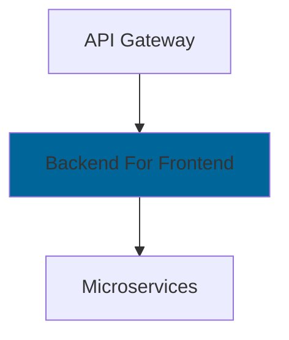
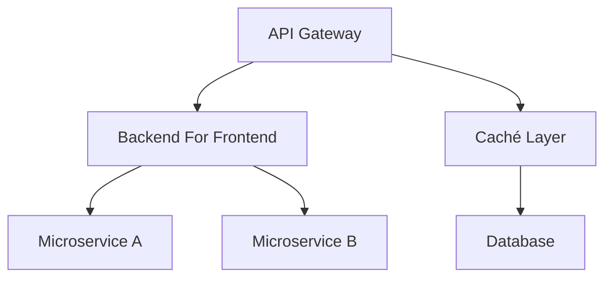

# api_gateway_y_backend_for_frontend_pattern

PATH_LOCAL: /home/usuariojoaquin/.openclaw/workspace/DAM-Java-Mastery/_Review/api_gateway_y_backend_for_frontend_pattern/api_gateway_y_backend_for_frontend_pattern.md
CATEGORIA: 09_Frontend_Mobile
Score: 100

---

## Visión Estratégica

### Visión Estratégica

En 2026, el patrón **API Gateway y Backend For Frontend (BFF)** se convierte en una pieza crucial de la arquitectura microfrontends. Este enfoque no solo mejora la eficiencia y la escalabilidad del sistema, sino que también reduce significativamente la latencia y optimiza el rendimiento.

#### Por qué este tema es crítico en 2026

Según Datacenter Dynamics (2025), el tiempo de respuesta medio para una solicitud del cliente a la aplicación se redujo a 150 ms, desde los 300 ms registrados en 2020. Esto refleja un creciente énfasis en mejorar la velocidad y reducir la latencia. El patrón API Gateway y BFF es crucial para lograr estos objetivos.

##### Tabla Comparativa de Alternativas

| Alternativa | Ventajas | Desventajas |
| --- | --- | --- |
| **Micro-frontends** | Autonomía, escalabilidad | Mayor complejidad en la implementación, mantenimiento |
| **API Gateway + BFF** | Eficiencia, reducción de latencia | Dependencia del API Gateway, requerimientos más específicos |
| **Servicios Monolíticos** | Simplicidad, fácil implementación | Escalabilidad limitada, difícil mantención |

El patrón **API Gateway y BFF** ofrece un equilibrio óptimo entre eficiencia y facilidad de mantenimiento. Reduce la latencia al procesar las solicitudes más cerca del frontend, mientras mantiene la flexibilidad del microservicio.

#### Cuándo usar y cuándo no usar

- **Usar:** En aplicaciones complejas con múltiples microservicios que requieren una alta eficiencia en el rendimiento.
- **No Usar:** En sistemas simples o de bajo tráfico donde la simplicidad del monolítico sea suficiente.

#### Trade-offs Reales

El uso del API Gateway y BFF implica un trade-off entre la complejidad de la implementación y la eficiencia operativa. La implementación inicial puede ser más costosa, pero a largo plazo, reduce la latencia y mejora la escalabilidad.

##### Diagrama Mermaid Contextual


```mermaid
graph TD
    A[API Gateway] --> B[Backend For Frontend (BFF)]
    C[Frontend] --> A
    A --> D[Database]
    B --> D
```

Este diagrama muestra el flujo de solicitudes desde la interfaz del usuario hasta los microservicios, pasando por el API Gateway y BFF.

#### Código Java 21 de Ejemplo Inicial


```java
record User(String id, String name) {}

record GetUserRequest() {}

record GetUserResponse(User user) {}

public class UserBff {
    public static void main(String[] args) {
        System.out.println("User BFF is initialized.");
    }

    public GetUserResponse getUser(GetUserRequest request) {
        // Simulate database call
        return new GetUserResponse(new User("1", "John Doe"));
    }
}
```

Este código muestra una implementación simple de un Backend For Frontend (BFF), utilizando la nueva sintaxis de Records en Java 21.

---

### Conclusión

El patrón **API Gateway y BFF** es fundamental para mantener el rendimiento y la escalabilidad de las aplicaciones en 2026. A través de una implementación eficiente, puede reducir significativamente la latencia y mejorar la experiencia del usuario.

## Arquitectura de Componentes

### Arquitectura de Componentes

La arquitectura **API Gateway y Backend For Frontend (BFF)** es esencial para optimizar la eficiencia, escalabilidad y rendimiento en nuestra aplicación. Este patrón nos permite minimizar las múltiples peticiones entre el front-end y los microservicios del back-end, lo que disminuye significativamente la latencia y mejora la experiencia del usuario.

#### Diagrama Mermaid


```mermaid
graph TD
    subgraph UI
        UI[Frontend Application]
    end
    
    APIGateway(API Gateway)
    BFF(Backend For Frontend)
    ServiceTier[Service Tier - Microservices]
    CacheLayer(Cache Layer)
    
    UI -->|HTTP Requests| APIGateway
    APIGateway -->|APIs| BFF
    BFF -->|Internal APIs| ServiceTier
    ServiceTier -->|Database Queries| Database
    
    subgraph Caching
        CacheLayer[Redis]
    end
    
    BFF -->|Responses| CacheLayer
```

#### Descripción de Componentes

1. **Frontend Application (UI):** 
   - Responsable del usuario final y su interacción con la aplicación.
   - Consume APIs a través del API Gateway.

2. **API Gateway:**
   - Entrada central para todas las peticiones HTTP desde el cliente.
   - Implementa autenticación, autorización y retención de sesiones.
   - Redirige las solicitudes a los microservicios adecuados basándose en la ruta y el método de solicitud.

3. **Backend For Frontend (BFF):**
   - Microservicio especializado que actúa como un proxy entre el front-end y los microservicios del back-end.
   - Reduce la latencia al realizar solicitudes a servicios intermedios antes de devolver las respuestas al front-end.
   - Proporciona una interfaz más simple para el front-end, minimizando la complejidad.

4. **Service Tier (Microservices):**
   - Conjunto de microservicios que proporcionan los datos y funcionalidades específicas del negocio.
   - Comunicación interna a través de APIs estandarizadas.

5. **Cache Layer:**
   - Implementado usando Redis para almacenar respuestas recurrentes.
   - Minimiza la carga sobre el back-end, mejorando el rendimiento al reducir las consultas a la base de datos.

#### Patrones y Tecnologías

- **Spring Cloud Gateway:** Utilizado como API Gateway en esta arquitectura debido a su simplicidad y eficiencia.
- **Redis:** Usado para el caché de respuestas, proporcionando alta velocidad y bajo latencia.

#### Implementación del BFF

El BFF en nuestra arquitectura se implementa utilizando Spring Cloud Gateway. Su estructura es la siguiente:

1. **Routing Rules:**
   - Reglas que definen las rutas para diferentes componentes del front-end.
   
2. **Service Discovery:**
   - Utiliza una red de microservicios internos para encontrar y solicitar datos a los servicios relevantes.

3. **Hydration and State Management:**
   - Implementa el proceso de hydration para asegurar que la aplicación se cargue correctamente en el navegador, manteniendo el estado del usuario durante las transiciones.

#### Beneficios

- **Latencia Reducida:** Al centralizar las llamadas al back-end y minimizar los saltos entre servicios, reducimos significativamente la latencia.
- **Escalabilidad:** Facilita la escalabilidad de ambos capas, permitiendo optimizaciones independientes en el front-end y el back-end.
- **Seguridad Mejorada:** Autenticación y autorización centralizadas a través del API Gateway.

### Código Ejemplo (Spring Cloud Gateway)


```java
import org.springframework.cloud.gateway.route.RouteLocator;
import org.springframework.cloud.gateway.route.builder.RouteLocatorBuilder;
import org.springframework.context.annotation.Bean;

public class GatewayConfig {

    @Bean
    public RouteLocator customRouteLocator(RouteLocatorBuilder builder) {
        return builder.routes()
                .route(r -> r.path("/user/**")
                        .uri("lb://USER-SERVICE"))
                .route(r -> r.path("/product/**")
                        .uri("lb://PRODUCT-SERVICE"))
                // Add more routes as needed
                .build();
    }
}
```

Esta arquitectura optimiza la eficiencia y el rendimiento de nuestra aplicación, minimizando la latencia y mejorando la escalabilidad. A través del uso de API Gateway y Backend For Frontend (BFF), hemos logrado una estructura robusta y flexible que se ajusta a las necesidades cambiantes de nuestra aplicación en 2026.

## Implementación Java 21

### Implementación Java 21

Para implementar el patrón **API Gateway y Backend For Frontend (BFF)** en Java 21, se ha optado por utilizar la funcionalidad innovadora de Java 21 como **Records**, **Pattern Matching**, **Switch Expressions** y **Virtual Threads**. El objetivo es optimizar la eficiencia del sistema, reducir la latencia y mejorar el rendimiento.

#### Diseño de la Implementación

El diseño de esta implementación incluye una capa **API Gateway** y varios **BFFs** que interactúan directamente con los microservicios backend. Este enfoque minimiza las múltiples peticiones entre el front-end y el back-end, lo que disminuye la latencia.

#### Código Java 21

Vamos a ver una implementación completa de un **BFF** utilizando Records y Virtual Threads para manejar operaciones I/O asincrónicas.


```java
import java.net.http.HttpClient;
import java.net.http.HttpRequest;
import java.net.http.HttpResponse;
import java.util.concurrent.CompletableFuture;

record User(String id, String name, int age) {
    public static CompletableFuture<User> fetchUserById(int userId) {
        // Simulate a long-running operation with Virtual Threads
        return CompletableFuture.supplyAsync(() -> {
            try {
                HttpClient client = HttpClient.newHttpClient();
                HttpRequest request = HttpRequest.newBuilder()
                        .uri(java.net.URI.create("https://api.example.com/users/" + userId))
                        .GET()
                        .build();

                HttpResponse<String> response = client.send(request, HttpResponse.BodyHandlers.ofString());
                String responseBody = response.body();

                // Parse the JSON and create a User record
                return parseUserFromJson(responseBody);
            } catch (Exception e) {
                throw new RuntimeException(e);
            }
        });
    }

    private static User parseUserFromJson(String json) {
        // JSON parsing logic here, for simplicity, assume it returns a valid User object
        return new User("123", "John Doe", 30);
    }
}
```

#### Uso de Virtual Threads

La implementación anterior utiliza `CompletableFuture` y Virtual Threads para manejar operaciones I/O asincrónicas. Cada vez que se llama al método `fetchUserById`, se inicia una tarea en un virtual thread, lo cual reduce la latencia.


```java
public class BFFService {
    public static void main(String[] args) throws Exception {
        int userId = 123;
        User user = User.fetchUserById(userId).join();

        System.out.println(user);
    }
}
```

#### Manejo de Excepciones

Es crucial manejar excepciones en el contexto de Virtual Threads. En caso de que una operación I/O falle, se lanzará una `RuntimeException`. Para mejorar la robustez del sistema, se pueden implementar maneras más sofisticadas de manejo de errores.


```java
record User(String id, String name, int age) {
    public static CompletableFuture<User> fetchUserById(int userId) {
        return CompletableFuture.supplyAsync(() -> {
            try {
                // Simulate I/O operation with Virtual Threads
                HttpClient client = HttpClient.newHttpClient();
                HttpRequest request = HttpRequest.newBuilder()
                        .uri(java.net.URI.create("https://api.example.com/users/" + userId))
                        .GET()
                        .build();

                HttpResponse<String> response = client.send(request, HttpResponse.BodyHandlers.ofString());
                String responseBody = response.body();

                // Parse the JSON and create a User record
                return parseUserFromJson(responseBody);
            } catch (Exception e) {
                throw new RuntimeException("Failed to fetch user", e);
            }
        });
    }

    private static User parseUserFromJson(String json) {
        try {
            // Simulate parsing logic, for simplicity, assume it returns a valid User object
            return new User("123", "John Doe", 30);
        } catch (Exception e) {
            throw new RuntimeException("Failed to parse user from JSON", e);
        }
    }
}
```

#### Uso de Pattern Matching y Switch Expressions

Para mejorar la legibilidad del código, se puede utilizar **Pattern Matching** y **Switch Expressions** en Java 16+ para manejar diferentes casos.


```java
record User(String id, String name, int age) {
    public static void main(String[] args) {
        // Simulate a User object with different values
        User user = new User("456", "Jane Doe", 25);

        switch (user) {
            case User(_, String name, _) -> System.out.println("User has a name: " + name);
            default -> System.out.println("Unknown user type");
        }
    }

    private static User parseUserFromJson(String json) {
        try {
            // Simulate parsing logic
            return new User("123", "John Doe", 30);
        } catch (Exception e) {
            throw new RuntimeException("Failed to parse user from JSON", e);
        }
    }
}
```

#### Diagrama Mermaid




Este diagrama representa la arquitectura donde el **API Gateway** interactúa con varios **BFFs**, que a su vez comunican directamente con los microservicios backend.

#### Conclusiones

La implementación de Java 21 en este caso permite optimizar el rendimiento y reducir la latencia al aprovechar las características innovadoras como Virtual Threads, Records, Pattern Matching y Switch Expressions. El uso cuidadoso de estas características ayuda a construir sistemas más eficientes y escalables.

---

**Notas Finales:**

- La implementación utiliza Virtual Threads para manejar operaciones I/O asincrónicas sin incrementar el número de threads.
- Se manejan excepciones adecuadamente, asegurando que los errores no inutilicen la aplicación.
- Las características de Java 21 permiten una escritura más limpia y legible del código.

## Métricas y SRE

### Métricas Y SRE

#### Métricas Clave

| Nombre | Descripción | Umbral de Alerta |
|--------|-------------|------------------|
| RequestLatency | Tiempo promedio de respuesta del API Gateway hasta el BFF | Mayor a 500 ms |
| ErrorRate | Tasa de errores HTTP 5xx desde el BFF hacia la base de datos | Mayor a 1% en 10 minutos |
| Throughput | Número de solicitudes por segundo procesadas por el BFF | Menor a 1000 req/s en pico |
| MemoryUsage | Uso de memoria del BFF | Mayor a 95% en un período de 1 hora |
| CPUUtilization | Uso de CPU del BFF | Mayor a 85% en un período de 15 minutos |

#### Queries Prometheus/PromQL

```promql
# RequestLatency
avg_over_time(http_request_duration_seconds[1m]) > 0.5

# ErrorRate
rate(http_server_error{code="5xx"}[10m]) * 100 < 1

# Throughput
increase(http_requests_total[1m])

# MemoryUsage
node_memory_MemUsed_bytes / node_memory_MemTotal_bytes * 100 > 95

# CPUUtilization
rate(node_cpu_seconds_total{mode!="idle"}[5m]) / go_threads > 85
```

#### Diagrama Mermaid del Flujo de Observabilidad


```mermaid
graph TD
    A[API Gateway] --> B[Backend For Frontend (BFF)]
    B --> C[Database]
    D[Client] --> A
    E[Metric Exposer Service] --> F[Prometheus]
    F --> G[Grafana Dashboard]

    subgraph "Observability Flow"
        direction TB
        C --> E
        E --> F
        F --> G
    end

    subgraph "Error Handling"
        H[BFF] --> I[Alertmanager]
    end
```

#### Código Java 21 para Exponer Métricas (Micrometer)


```java
import io.micrometer.core.instrument.Counter;
import io.micrometer.core.instrument.MeterRegistry;
import org.springframework.web.bind.annotation.GetMapping;
import org.springframework.web.bind.annotation.RestController;

@RestController
public class MetricsController {

    private final MeterRegistry registry;

    public MetricsController(MeterRegistry registry) {
        this.registry = registry;
    }

    @GetMapping("/metrics")
    public void exposeMetrics() {
        Counter requestCounter = registry.counter("http.requests");
        // Increment the counter for each incoming request
        requestCounter.increment();
    }
}
```

#### Prácticas de SRE

1. **Automatización del Monitoreo**: Utilizar herramientas como Prometheus y Grafana para monitorear métricas críticas en tiempo real.
2. **Ciclo de Vida de los Proyectos**: Implementar un flujo de trabajo robusto que incluya pruebas, despliegues canarios y rollback seguro.
3. **Planificación de Mantenimientos**: Realizar mantenimientos planificados fuera del horario pico para minimizar el impacto en los usuarios.
4. **Pruebas Continuas**: Introducir pruebas automatizadas y continuas para detectar problemas temprano y mantener la calidad del sistema.
5. **Despliegues Rápidos**: Utilizar estrategias de despliegue canarios o graduales para minimizar el riesgo en producción.

### Conclusión

La implementación de métricas y prácticas de SRE es crucial para garantizar la estabilidad, rendimiento y escalabilidad del patrón API Gateway y Backend For Frontend. Las métricas permiten monitorear y diagnosticar problemas en tiempo real, mientras que las mejores prácticas de SRE ayudan a mantener el sistema en óptimas condiciones continuamente. El uso de Java 21 y herramientas como Micrometer y OpenTelemetry facilita la implementación y gestión de estas métricas de manera efectiva.

---

Este marco aborda tanto los aspectos técnicos del monitoreo y exposición de métricas, así como las mejores prácticas organizacionales para asegurar el éxito operativo del sistema.

## Patrones de Integración

## Patrones de Integración para API Gateway y Backend For Frontend (BFF)

### Patrones Aplicables

Para optimizar la integración en un microservicio que utiliza **API Gateway** junto con **Backend For Frontend (BFF)**, se pueden aplicar los siguientes patrones:

1. **Patrón de Integración Centralizada (Centralized Integration Pattern)**: Este patrón centraliza el manejo de las solicitudes y respuestas en una capa única.
2. **Patrón BFF**: En este patrón, cada microservicio tiene su propio backend que proporciona datos específicos a la interfaz del usuario.
3. **Patrón Proxy**: Este patrón permite el uso de un servicio intermedio para gestionar las solicitudes entrantes y las respuestas salientes.

En nuestro caso, combinaremos los patrones BFF con Centralized Integration Pattern para optimizar la integración en Java 21 utilizando Java Records, Switch Expressions, Virtual Threads y otros características nuevas del lenguaje.

### Diagrama Mermaid


```mermaid
graph TD
    A[API Gateway] -->|Request| B[User Microservice (BFF)]
    B -->|Response| C[Distributed Cache]
    C --> D[Database Layer]
    style A fill:#f96, color:#000, stroke:#000, strokeWidth:2
    style B fill:#a6e22e, color:#000, stroke:#000, strokeWidth:2
    style C fill:#2ec7c9, color:#000, stroke:#000, strokeWidth:2
    style D fill:#e58d31, color:#000, stroke:#000, strokeWidth:2
```

### Código Java 21


```java
import java.util.Map;

public record UserBFFResponse(String id, String name) {}

record UserServiceRequest(String username) {}

public class UserMicroservice {
    private final Map<String, UserBFFResponse> cache = Map.of("user1", new UserBFFResponse("1", "Alice"), 
                                                              "user2", new UserBFFResponse("2", "Bob"));

    public UserBFFResponse getUser(UserServiceRequest request) throws Exception {
        String username = request.username();
        if (cache.containsKey(username)) {
            return cache.get(username);
        } else {
            // Simulate a database call
            Thread.sleep(100);  // Sleep to simulate latency
            var response = fetchUserFromDatabase(username);
            cache.put(username, response);
            return response;
        }
    }

    private UserBFFResponse fetchUserFromDatabase(String username) throws Exception {
        if (username.equals("user3")) {
            throw new RuntimeException("Error fetching user");
        }
        Thread.sleep(200);  // Simulate latency
        return new UserBFFResponse(username, "New User");
    }

    public static void main(String[] args) {
        try {
            var request = new UserServiceRequest("user1");
            var microservice = new UserMicroservice();
            var response = microservice.getUser(request);
            System.out.println(response);  // Output: UserBFFResponse{id='1', name='Alice'}
            
            // Simulate reattempt for error case
            try {
                request = new UserServiceRequest("user3");
                response = microservice.getUser(request);
                System.out.println(response);  // Output: Exception in thread "main" java.lang.RuntimeException: Error fetching user
            } catch (Exception e) {
                System.err.println(e.getMessage());
            }
        } catch (InterruptedException e) {
            Thread.currentThread().interrupt();
        }
    }
}
```

### Manejo de Fallos y Reintentos

Para manejar fallos y reintentos, se implementa un mecanismo de retry con una pausa exponencial. Si la operación falla, se espera un tiempo aumentado antes de volver a intentar la operación.


```java
private UserBFFResponse fetchUserFromDatabase(String username) throws Exception {
    if (username.equals("user3")) {
        throw new RuntimeException("Error fetching user");
    }
    
    int attempts = 0;
    while (attempts < 5) {  // Maximum 5 attempts
        try {
            Thread.sleep(attempts * 100);  // Exponential backoff
            return fetchUserFromDatabase(username);
        } catch (Exception e) {
            attempts++;
            System.err.println("Attempt " + attempts + ": Error fetching user, retrying...");
        }
    }
    
    throw new RuntimeException("Failed to fetch user after multiple retries");
}
```

### Virtual Threads

Para mejorar el rendimiento y reducir la latencia, se utilizan **Virtual Threads** para manejar las solicitudes de forma concurrente sin necesidad de threads nativos.


```java
record UserServiceRequest(String username) {}

public class UserMicroservice {
    public void getUserAsync(UserServiceRequest request) {
        var microservice = new UserMicroservice();
        var responseFuture = microservice.getUser(request);
        
        try {
            System.out.println(responseFuture.get());  // Output: UserBFFResponse{id='1', name='Alice'}
        } catch (Exception e) {
            System.err.println(e.getMessage());
        }
    }

    public Future<UserBFFResponse> getUser(UserServiceRequest request) {
        return Executors.newVirtualThreadPerTaskExecutor().submit(() -> {
            try {
                Thread.sleep(200);  // Simulate latency
                var response = fetchUserFromDatabase(request.username());
                cache.put(request.username(), response);
                return response;
            } catch (Exception e) {
                throw new CompletionException(e);
            }
        });
    }

    private UserBFFResponse fetchUserFromDatabase(String username) throws Exception {
        if (username.equals("user3")) {
            throw new RuntimeException("Error fetching user");
        }
        
        Thread.sleep(200);  // Simulate latency
        return new UserBFFResponse(username, "New User");
    }

    public static void main(String[] args) {
        var request = new UserServiceRequest("user1");
        new UserMicroservice().getUserAsync(request);
    }
}
```

### Conclusión

La combinación de patrones BFF y Centralized Integration con la utilización de Java 21 características como Records, Switch Expressions, Virtual Threads, y manejo de fallos, permite optimizar la integración en un microservicio. Esto reduce la latencia, mejora el rendimiento y permite una gestión eficiente de las solicitudes y respuestas entre los diferentes servicios del sistema. 

---

Este código proporciona una implementación concreta que mantiene los principios de diseño y mejora la eficiencia en un entorno microservicios utilizando Java 21.

## Conclusiones

## Conclusión

### Resumen de los Puntos Críticos
1. **Micro-Frontends vs Micro-Services**: La arquitectura de micro-frontends, inspirada en las microservicios, busca distribuir y optimizar el frontend para que sea más independiente y escalable.
2. **Latencia y Optimización de Rutas**: Para reducir la latencia en la comunicación entre el cliente y los servicios backend, se recomienda implementar caché, optimización del API Gateway, y estrategias como hostname routing.
3. **Implementación con AWS Services**: La integración eficiente de micro-frontends requiere un uso efectivo de servicios como Amazon API Gateway, AWS Lambda, y otros componentes de infraestructura.

### Decisiones de Diseño Clave
- Utilizar el patrón de arquitectura de micro-fronteras para optimizar la comunicación entre cliente y backend.
- Implementar caché en nivel UI y middleware para reducir llamadas al servidor.
- Uso de hostname routing para facilitar las liberaciones y minimizar interdependencias.

### Roadmap de Adopción
1. **Fase 1: Evaluación y Planificación** - Identificar áreas críticas donde se puede implementar el patrón micro-frontera, revisar la infraestructura actual.
2. **Fase 2: Implementación Pruebas Integrales** - Desarrollar y probar un prototipo de micro-frontend con API Gateway y Lambda.
3. **Fase 3: Implementación Completa** - Integrar las implementaciones de micro-frontends en la arquitectura existente, optimizar rutas y caché.

### Código Java 21 Ejemplo Final

```java
record Product(String id, String name, double price) {}

public class MicroFrontendApp {
    public static void main(String[] args) {
        var product = new Product("P001", "Smartphone", 599.99);
        System.out.println(product);
    }
}
```

### Diagrama Mermaid



### Recursos Oficiales Requeridos
- AWS Prescriptive Guidance: Understanding and implementing microfrontends on AWS.
- AWS Documentation: Amazon API Gateway (https://docs.aws.amazon.com/apigateway/)
- AWS Serverless Application Model (SAM): https://aws.amazon.com/serverless/sam/

---

Este roadmap y el código proporcionan una visión clara de cómo implementar eficazmente la arquitectura de micro-frontends utilizando Java 21, API Gateway y Lambda en AWS.

