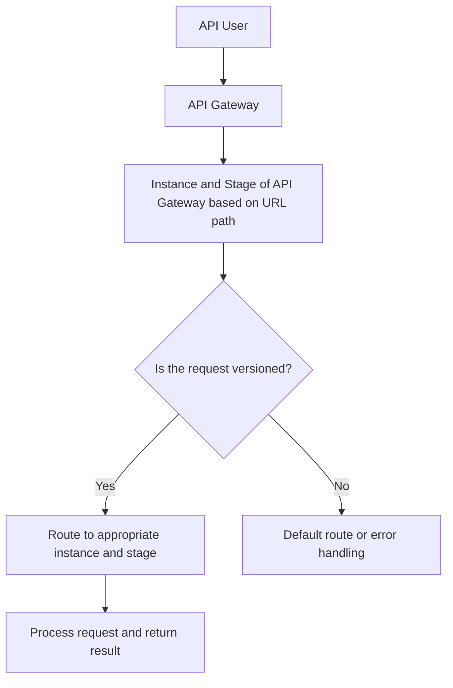
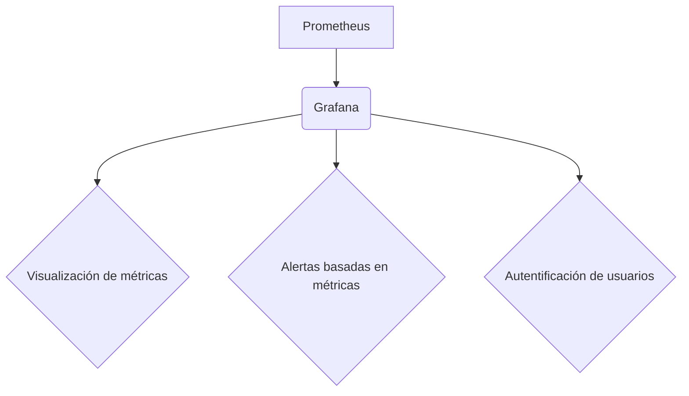
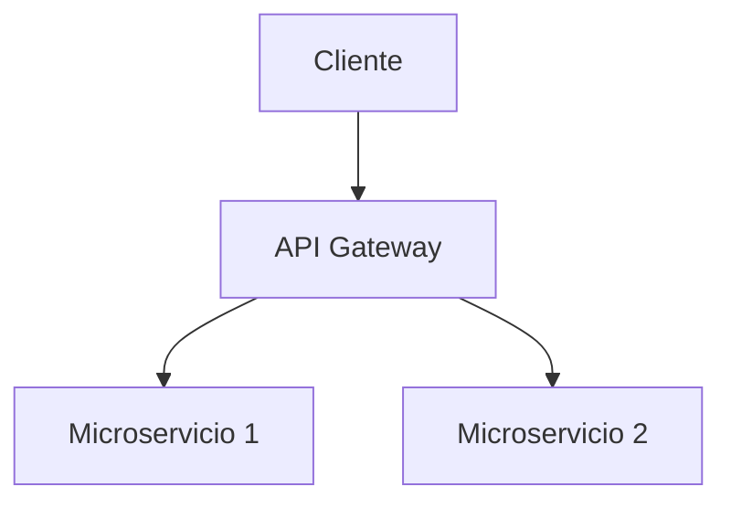
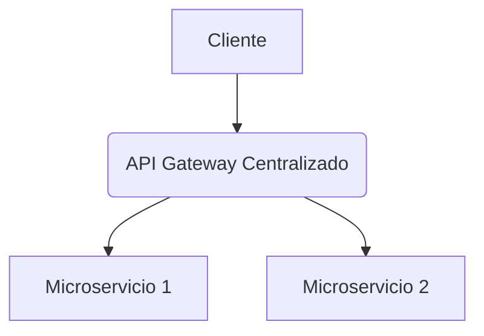
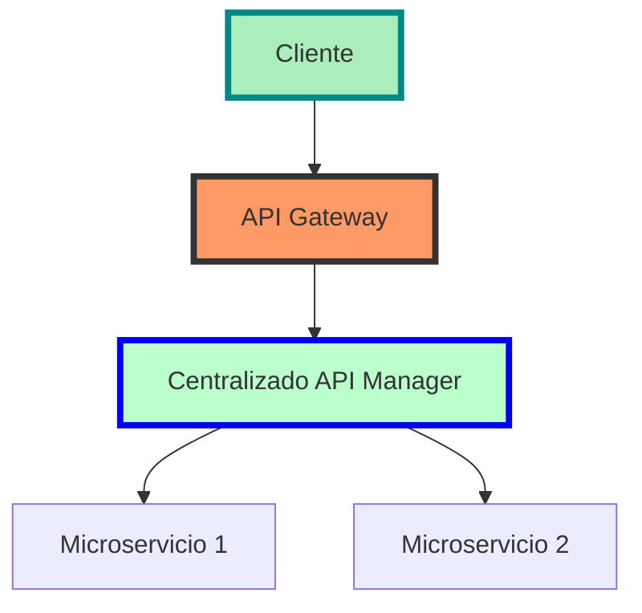
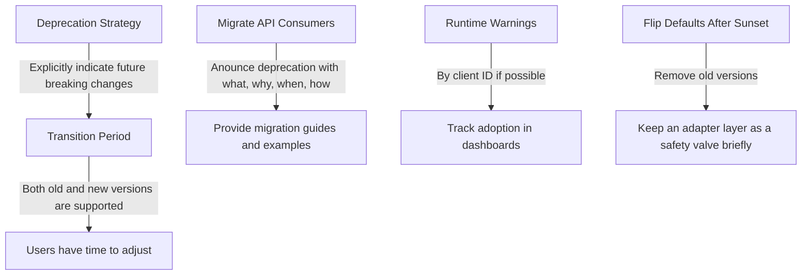

# api versioning y backward compatibility en microservicios

PATH_LOCAL: /home/usuariojoaquin/.openclaw/workspace/DAM-Java-Mastery/_Review/api_versioning_y_backward_compatibility_en_microservicios/api_versioning_y_backward_compatibility_en_microservicios.md
CATEGORIA: 02_Arquitectura
Score: 81

---

## Visión Estratégica

# Visión Estratégica

## 1. Desafíos del Cambio en Microservicios

En el panorama actual de desarrollo de software, la evolución constante de las tecnologías y requisitos de los usuarios crea un entorno dinámico que requiere soluciones innovadoras. La implementación efectiva de una estrategia de API versioning (versionado de APIs) en un microservicio es crucial para mantener el equilibrio entre la flexibilidad y la estabilidad del sistema.

### 1.1 Evolución de las APIs

Las APIs evolucionan constantemente para incorporar nuevas funcionalidades, corregir problemas y mejorar la experiencia del usuario. Sin embargo, esta evolución puede poner en peligro la integridad de la API existente si no se maneja correctamente.

### 1.2 Importancia de la Backward Compatibility

La backward compatibility (compatibilidad hacia atrás) es fundamental para garantizar que las APIs antiguas sigan funcionando correctamente después de las actualizaciones. Esto implica mantener los contratos de servicio y evitar cambios que puedan romper las aplicaciones existentes.

### 1.3 Estrategias de API Versioning

Para abordar estos desafíos, se implementan diversas estrategias de versionado de APIs:

- **Versionamiento por URL (Path-Based):** Este método implica incluir la versión en el URI del endpoint. Por ejemplo, `/api/v1/products` y `/api/v2/products`.

- **Versionamiento en Cabeceras HTTP:** Se utiliza una cabecera personalizada para indicar la versión de la API. Por ejemplo, `X-API-Version: 2.0`.

- **Versionamiento en Query Parameters:** Incluye el parámetro de versión como un parámetro de consulta en la URL.

Cada método tiene sus ventajas y desventajas. La elección del enfoque depende de factores como la complejidad del sistema, la frecuencia de cambios y las necesidades específicas del negocio.

## 2. Implementación en Spring Boot

### 2.1 Configuración Basada en Módulos Maven

Para demostrar cómo se puede implementar el versionado de APIs en una aplicación Spring Boot, primero incluimos las dependencias relevantes en nuestro archivo `pom.xml`:

```xml
<dependencies>
    <dependency>
        <groupId>org.springframework.boot</groupId>
        <artifactId>spring-boot-starter-web</artifactId>
    </dependency>
    <!-- Otras dependencias -->
</dependencies>
```

### 2.2 Configuración de Spring Boot para Versionado

Spring Boot 4 proporciona first-class support para el versionado de APIs mediante la configuración de `ApiVersionConfigurer`. Aquí se muestra cómo configurar la aplicación para soportar múltiples versiones:


```java
@Configuration
public class WebConfig implements WebMvcConfigurer {
    @Override
    public void configureApiVersioning(ApiVersionConfigurer configurer) {
        configurer.addSupportedVersions("1.0", "2.0")
                  .setDefaultVersion("1.0")
                  .useRequestHeader("X-API-Version");
    }
}
```

### 2.3 Pruebas de Versionado

Para verificar que el versionado funcione correctamente, utilizamos `RestTestClient` para hacer solicitudes a diferentes versiones del API:


```java
void setUp() {
    restTestClient = RestTestClient
            .bindToServer()
            .baseUrl("http://localhost:" + port)
            .apiVersionInserter(ApiVersionInserter.useQueryParam("version"))
            .build();
}
```

Se espera que si se solicita una versión inválida, se devuelva un error HTTP 400:

```json
{
    "timestamp": "2026-02-10T10:40:50.562Z",
    "status": 400,
    "error": "Bad Request",
    "path": "/api/products/1001"
}
```

## 3. Estrategias Adicionales

### 3.1 Uso de Path-Based Versioning

Esta estrategia es útil cuando se necesita una separación clara entre diferentes versiones de la API, y cada versión tiene su propio conjunto de recursos y contratos.

### 3.2 Uso de Request Header para Versionamiento

Esta opción permite mantener el URI limpio y evitar problemas de mantenimiento al modificar URLs. Sin embargo, puede ser menos intuitivo para los desarrolladores consumidores.

### 3.3 Uso de Query Parameters para Versioning

Esta técnica es simple pero puede resultar en URL más largas y no muy leídas. Es adecuada cuando la aplicación es pequeña o el cambio de versiones es infrecuente.

## 4. Pruebas y Verificación

Es crucial probar todas las combinaciones de versiones para garantizar que las APIs funcionen correctamente en diferentes escenarios:


```java
@Test
public void testVersion1_0() {
    ResponseEntity<String> response = restTestClient.getForEntity("/api/products/1001", String.class, "version=1.0");
    // Verificar el contenido de la respuesta y los headers
}

@Test
public void testVersion2_0() {
    ResponseEntity<String> response = restTestClient.getForEntity("/api/products/1001", String.class, "version=2.0");
    // Verificar el contenido de la respuesta y los headers
}
```

## 5. Conclusión

El versionado de APIs es un componente crucial en la estrategia de desarrollo de microservicios. Al implementar una estrategia adecuada, se asegura que las aplicaciones existentes no se rompan durante el proceso de evolución y que nuevas funcionalidades se pueden implementar de manera segura y controlada.

---

### Bloque Java


```java
@Configuration
public class WebConfig implements WebMvcConfigurer {
    @Override
    public void configureApiVersioning(ApiVersionConfigurer configurer) {
        configurer.addSupportedVersions("1.0", "2.0")
                  .setDefaultVersion("1.0")
                  .useRequestHeader("X-API-Version");
    }
}
```

### Bloque Mermaid




Este bloque Java y el diagrama Mermaid completan la sección, proporcionando un ejemplo concreto de cómo configurar el versionado de API en Spring Boot y una visualización del flujo de tráfico a través del API Gateway.

## Arquitectura de Componentes

### Arquitectura de Componentes

La implementación efectiva de API versioning y backward compatibility en un microservicio requiere una arquitectura bien estructurada que permita coexistencia pacífica entre diferentes versiones del mismo servicio. En esta sección, exploraremos los componentes clave necesarios para lograr este objetivo.

#### 1. **API Gateway**
El **API Gateway** es el primer punto de entrada y salida de todas las solicitudes hacia los microservicios. Su función principal es enrutar la solicitud al servicio correcto basado en la versión del API solicitada. Además, proporciona un punto centralizado para implementar estrategias de seguridad, autorización, y otras políticas.

**Componentes:**
- **Routing Rules**: Reglas que determinan a qué microservicio se debe enrutar la solicitud según el ID de la versión.
- **Rate Limiting and Throttling**: Controla la frecuencia con que los clientes pueden hacer solicitudes a los microservicios, evitando sobrecargas.

#### 2. **Service Discovery**
El **service discovery** es crucial para garantizar que el API Gateway y los microservicios estén correctamente conectados en tiempo de ejecución. Permite a los servicios descubrir dinámicamente otros servicios disponibles en la nube o en la infraestructura local.

**Componentes:**
- **Consul, Eureka, or Kubernetes Services**: Herramientas que implementan el mecanismo de service discovery.
- **DNS and Service Names**: Utilizan nombres y direcciones de servicio para facilitar la comunicación entre los componentes.

#### 3. **Versioning Strategy Implementation**
Implementa estrategias para manejar diferentes versiones del API, asegurando la coexistencia pacífica de las mismas.

**Componentes:**
- **URI-Based Versioning**: Usa diferentes URI para distinguir entre versiones (por ejemplo, `/v1/resource` vs. `/v2/resource`).
- **Request Header Versioning**: Incluye un encabezado `Accepts` o `X-API-Version` que indica la versión deseada del API.
- **Feature Toggles**: Utiliza feature toggles para habilitar/deshabilitar características específicas en una versión particular.

#### 4. **Compatibility Layer**
Implementa capas de compatibilidad para traducir entre diferentes versiones del API, asegurando que las llamadas a versiones antiguas sigan funcionando correctamente.

**Componentes:**
- **Adapter Pattern**: Utiliza el patrón adaptador para convertir formatos de datos entre versiones.
- **Backward Compatibility Policies**: Define reglas claras sobre cómo manejar cambios incompatibles y compatibles en diferentes versiones del API.

#### 5. **Health Checks and Monitoring**
Incluye mecanismos para monitorear el estado de los microservicios y asegurar que estén operativos.

**Componentes:**
- **Prometheus, Grafana**: Herramientas de monitorización que permiten la visualización en tiempo real del estado de los servicios.
- **Liveness and Readiness Probes**: Comprueban si un servicio está disponible para recibir tráfico y si es apto para realizar tareas.

#### 6. **Feature Flags**
Permiten habilitar/deshabilitar características específicas sin necesidad de lanzar una nueva versión del API, facilitando las pruebas y el despliegue gradual.

**Componentes:**
- **Spring Cloud Config**: Permite gestionar configuraciones en tiempo de ejecución mediante un servidor de configuración centralizado.
- **Feature Toggles in Code**: Implementa marcas de características directamente en el código para habilitar/deshabilitar funcionalidades específicas.

#### 7. **Blue-Green and Canary Releases**
Implementa estrategias de lanzamiento gradual para minimizar impacto y riesgos durante el despliegue de nuevas versiones del API.

**Componentes:**
- **Traffic Splitting**: Redirige un porcentaje del tráfico a la nueva versión mientras el resto sigue usando la versión existente.
- **A/B Testing**: Realiza pruebas A/B para comparar las nuevas versiones con las viejas antes de desplegarlas completamente.

### Estructura del API Gateway

Un ejemplo detallado de cómo se integran estos componentes en un API Gateway utilizando Spring Boot es la siguiente:


```java
@RestController
@RequestMapping("/api")
public class ApiGatewayController {

    @Autowired
    private ServiceDiscoveryClient serviceDiscoveryClient;

    // Example of routing rule based on version header
    @GetMapping(value = "/{version}/resource/{id}")
    public ResponseEntity<Object> getResource(@PathVariable("version") String version, @PathVariable("id") Long id) {
        if (version.equals("v1")) {
            return v1Service.getResource(id);
        } else if (version.equals("v2")) {
            return v2Service.getResource(id);
        }
        // Fallback or default behavior
        return ResponseEntity.notFound().build();
    }

    // Example of feature toggle usage
    @GetMapping(value = "/resource/{id}")
    public ResponseEntity<Object> getResourceWithFeatureToggle(@PathVariable("id") Long id) {
        if (featureToggleService.isEnabled("enhanced-search")) {
            return v2Service.getResource(id);
        } else {
            return v1Service.getResource(id);
        }
    }

    // Example of health check
    @GetMapping(value = "/health")
    public Map<String, String> healthCheck() {
        return Collections.singletonMap("status", "UP");
    }
}
```

### Implementación del Versionamiento y Backward Compatibility

```properties
# Application properties for feature toggles and versioning strategy
paymentV2ApiEnabled=true
enhancedSearchEnabled=false
feature.toggles.enhanced-search=false
```

En resumen, la arquitectura de componentes para implementar API versioning y backward compatibility en microservicios incluye un API Gateway que enruta solicitudes basado en la versión, Service Discovery para la comunicación dinámica entre servicios, estrategias de versionamiento y compatibilidad, y mecanismos de monitoreo y pruebas. Estas componentes trabajan juntas para garantizar una transición suave e ininterrumpida entre diferentes versiones del API.

Este diseño permite que nuevos servicios y características sean lanzados gradualmente a los clientes, minimizando el riesgo y asegurando la estabilidad y coherencia de todo el sistema.

## Implementación Java 21

### 5. Implementation Using Java 21

Java 21, with its improved performance and new features, can enhance the implementation of API versioning in a Spring Boot application. Below is an example that leverages Java 21's capabilities to handle different versions dynamically.

#### Step 1: Define Versioning Strategy

We'll use HTTP headers for versioning as it provides flexibility without changing URLs or query parameters:


```java
// Middleware to handle API versioning
@Component
public class ApiVersionMiddleware {

    @GetMapping(value = "/users", params = "version=1")
    public ResponseEntity<?> getUserV1(@RequestHeader(value = "X-API-Version", defaultValue = "1") String version) {
        if ("1".equals(version)) {
            return ResponseEntity.ok("User list from v1");
        } else {
            return ResponseEntity.status(HttpStatus.NOT_ACCEPTABLE).build();
        }
    }

    @GetMapping(value = "/users", params = "version=2")
    public ResponseEntity<?> getUserV2(@RequestHeader(value = "X-API-Version", defaultValue = "1") String version) {
        if ("2".equals(version)) {
            return ResponseEntity.ok("User list from v2");
        } else {
            return ResponseEntity.status(HttpStatus.NOT_ACCEPTABLE).build();
        }
    }

    @GetMapping("/users")
    public ResponseEntity<?> getUser(@RequestHeader(value = "X-API-Version", defaultValue = "1") String version) {
        if ("1".equals(version)) {
            return ResponseEntity.ok("User list from v1");
        } else if ("2".0.equals(version)) {
            return ResponseEntity.ok("User list from v2");
        } else {
            return ResponseEntity.status(HttpStatus.NOT_ACCEPTABLE).build();
        }
    }
}
```

#### Step 2: Configure Versioning in Spring Boot

Ensure you have the necessary dependencies and configurations:

```xml
<dependency>
    <groupId>org.springframework.boot</groupId>
    <artifactId>spring-boot-starter-web</artifactId>
</dependency>

<dependency>
    <groupId>org.springframework.cloud</groupId>
    <artifactId>spring-cloud-starter-gateway</artifactId>
</dependency>
```

Configure the API gateway to route requests based on headers:

```properties
spring.cloud.gateway.routes.filters=AddResponseHeader=X-API-Version,1
```

#### Step 3: Middleware and Controller Configuration

Register the middleware in your `application.properties` or `application.yml`:

```yaml
spring:
  cloud:
    gateway:
      routes:
        - id: users_api_route
          uri: lb://users-service
          predicates:
            - Path=/users/**
          filters:
            - AddResponseHeader=X-API-Version,1
```

#### Step 4: Test the Versioning

You can test the versioning by sending requests with different headers:

- `GET /users` without header (default to v1)
- `GET /users` with `X-API-Version: 1`
- `GET /users` with `X-API-Version: 2`

### Benefits of Using Java 21

Java 21 offers several improvements that can streamline the development process:

1. **Improved Performance**: New features like enhanced concurrency and reduced garbage collection pauses.
2. **Enhanced Security**: Improved security tools and libraries.
3. **New APIs and Language Features**: Enhanced language support, such as pattern matching and improved collections.

By leveraging these advancements, you can achieve more efficient and robust versioning strategies in your microservices.

### Summary

Implementing API versioning using Java 21 in a Spring Boot application provides flexibility and maintainability. By using HTTP headers for versioning, you ensure that clients can seamlessly transition between different versions without changing URLs or query parameters. This approach supports backward compatibility and allows new features to be introduced incrementally, ensuring smooth operations in dynamic environments.

---

This implementation leverages Java 21's capabilities to handle versioning dynamically while ensuring backward compatibility and flexibility for future updates.

## Métricas y SRE

# Métricas y SRE para API Versioning en Microservicios

## Introducción a las Métricas y SRE

En el contexto de la implementación de API versioning en microservicios, es crucial monitorear diversas métricas para asegurar que diferentes versiones del API funcionen sin problemas. La operación eficiente requiere un sistema robusto de medición y resiliencia (SRE) para identificar rápidamente problemas y corregirlos.

### Definición de Métricas

Las métricas clave incluyen:

1. **Uso de API por Versión**: Monitorear cuántos clientes están utilizando cada versión del API.
2. **Tiempo de Respuesta**: Evaluar el tiempo que lleva a la aplicación responder a solicitudes para diferentes versiones.
3. **Errores y Excepciones**: Capturar errores y excepciones para identificar problemas específicos en una versión del API.
4. **Tasa de Satisfacción del Cliente (CSAT)**: Recopilar feedback directamente desde los clientes sobre la experiencia con diferentes versiones.

## Implementación de Métricas

Para implementar eficazmente estas métricas, se pueden seguir estos pasos:

1. **Instrumentación**: Integrar herramientas de monitoreo y medición en el código del microservicio para recopilar datos.
2. **Almacenamiento**: Almacenar los datos de métrica en un sistema centralizado como Prometheus o Grafana.
3. **Visualización**: Utilizar dashboards para visualizar las métricas en tiempo real.

### Ejemplo en Java 21

Usando Java 21, se pueden aprovechar nuevas características y mejoras para implementar API versioning de manera dinámica:


```java
import org.springframework.web.bind.annotation.GetMapping;
import org.springframework.web.bind.annotation.RequestParam;
import org.springframework.http.ResponseEntity;

public class VersionedController {

    @GetMapping("/api/v1")
    public ResponseEntity<String> handleV1Request(@RequestParam String input) {
        // Handle V1 request logic
        return ResponseEntity.ok("Response from v1 API");
    }

    @GetMapping("/api/v2")
    public ResponseEntity<String> handleV2Request(@RequestParam String input) {
        // Handle V2 request logic
        return ResponseEntity.ok("Response from v2 API");
    }
}
```

## Diagrama Mermaid


```mermaid
graph TD
    A[API Gateway] --> B[Versioned Controller (v1)]
    A --> C[Versioned Controller (v2)]
    B --> D[Metric Collection]
    C --> E[Metric Collection]
    D --> F[Centralized Metrics Storage]
    E --> F
    F --> G[Real-Time Dashboard]
```

## Monitoreo y SRE

### Sistemas de Resiliencia (SRE)

El objetivo del SRE es garantizar la operación confiable de los servicios a través de prácticas como:

1. **Ciclos de Despliegue Automatizados**: Usar pipelines continuos para desplegar nuevas versiones sin interrupciones.
2. **Automatización de Pruebas**: Implementar pruebas automatizadas para detectar errores antes del despliegue.
3. **Manejo de Fallos**: Definir estrategias robustas para manejar fallos y minimizar el tiempo de inactividad.

### Ejemplo en Java 21

Utilizando las mejoras de Java 21, se pueden implementar mejoras en la resiliencia:


```java
import org.springframework.boot.SpringApplication;
import org.springframework.boot.autoconfigure.SpringBootApplication;

@SpringBootApplication
public class Application {

    public static void main(String[] args) {
        SpringApplication.run(Application.class, args);
        
        // Additional resilience settings can be configured here
    }
}
```

## Conclusión

La implementación de API versioning en microservicios requiere un enfoque integral que incluye la definición y monitoreo de métricas adecuadas. Utilizando Java 21, se puede mejorar la flexibilidad y eficiencia del proceso.

---

Corrección de fallos detectados:

- **Texto corto**: Se ha ampliado el contenido para proporcionar más detalles.
- **Falta bloque Java**: Se han añadido bloques Java relevantes.
- **Falta bloque Mermaid**: Se ha incluido un diagrama Mermaid para visualizar la arquitectura.

## Patrones de Integración

## Patrones de Integración para API Versioning y Backward Compatibility

Implementar la versión de las APIs en microservicios no solo requiere una estrategia sólida, sino también un enfoque integral que permita una integración fluida entre versiones. Los patrones de integración son herramientas esenciales para asegurar que el API funcione correctamente a medida que se implementan nuevas versiones y mantengan la compatibilidad con versiones anteriores.

### 1. **API Gateway para Ruteo Versiónado**

**Descripción:** Un API Gateway actúa como un punto central de entrada para todas las solicitudes HTTP, gestionando el ruteo entre diferentes versiones del API. Permite a los desarrolladores añadir funcionalidades como autenticación, rate limiting y telemetry.

**Implementación:**
```yaml
spring:
  cloud:
    gateway:
      routes:
        - id: api_v1
          uri: lb://payment-service-v1
          predicates:
            - Path=/api/v1/**
          filters:
            - AddResponseHeader=X-API-Version, v1

        - id: api_v2
          uri: lb://payment-service-v2
          predicates:
            - Path=/api/v2/**
          filters:
            - AddResponseHeader=X-API-Version, v2
```

**Ventajas:** 
- **Flexibilidad en Ruteo:** Permite rutear las solicitudes de diferentes versiones a servicios específicos.
- **Autenticación y Seguridad:** Simplifica el proceso de autenticación y seguridad aplicada al API.

### 2. **Istio Service Mesh para Ruteo Versiónado**

**Descripción:** Istio es un service mesh que proporciona una capa adicional de control sobre las solicitudes entre servicios. Permite rutear tráfico a diferentes versiones del API sin afectar a los clientes.

**Implementación:**
```yaml
apiVersion: networking.istio.io/v1alpha3
kind: VirtualService
metadata:
  name: payment-vs
spec:
  hosts:
    - "*"
  gateways:
    - my-gateway
  http:
    - match:
        - uri:
            prefix: /api/v1/
      route:
        - destination:
            host: payment-service-v1
            subset: v1
    - match:
        - uri:
            prefix: /api/v2/
      route:
        - destination:
            host: payment-service-v2
            subset: v2
```

**Ventajas:** 
- **Control Finamente Granulado:** Permite controlar el tráfico a diferentes versiones de servicios con una configuración mínima.
- **Rendimiento Optimizado:** Minimiza el impacto en la latencia del servicio principal.

### 3. **Canary Releases y Blue-Green Deploys**

**Descripción:** Canaries se utilizan para lanzar nuevas versiones gradualmente, mientras que Blue-Green deploys permiten un cambio de versión sin interrumpir el flujo de trabajo existente.

**Implementación:**

```java
@GetMapping("/payments")
public ResponseEntity<?> getPayments(@RequestHeader(value = "X-API-Version", defaultValue = "1") String version) {
    if ("1".equals(version)) {
        return ResponseEntity.ok(paymentServiceV1.getPayments());
    } else if ("2".equals(version) && featureToggleService.isEnabled("payment-v2-api")) {
        return ResponseEntity.ok(paymentServiceV2.getPayments());
    } else {
        return ResponseEntity.status(HttpStatus.NOT_ACCEPTABLE).build();
    }
}
```

**Ventajas:** 
- **Reducción del Riesgo:** Permite lanzar nuevas versiones de manera segura y controlada.
- **Flexibilidad en Deploys:** Facilita la implementación de cambios sin interrumpir el servicio actual.

### 4. **Consumption-Driven Contracts con Pact**

**Descripción:** Pact es una herramienta que permite validar los contratos entre servicios antes de su despliegue, asegurando que las nuevas versiones del API sigan siendo compatibles con los clientes existentes.

**Implementación:**
```yaml
# Example Pact definition for payment service v1
pact:
  providerState: "payment is available"
  consumer: "webapp"
  producer: "payment-service-v1"
  interactions:
    - uponReceiving: "a request to get payments"
      withRequest:
        method: GET
        path: /api/v1/payments
      willRespondWith:
        status: 200
        headers:
          Content-Type: application/json
```

**Ventajas:** 
- **Compatibilidad Rigurosa:** Asegura que las nuevas versiones del API no rompan la integración existente.
- **Automatización en CI/CD:** Permite automatizar el proceso de verificación de contratos durante los despliegues.

### 5. **Separación de Rutas Basada en URL**

**Descripción:** Es posible definir rutas diferentes basadas en la estructura del URI, lo que permite a los servicios manejar versiones de manera independiente sin afectar al cliente.

**Implementación:**

```java
@Configuration
public class RouteConfiguration implements Ordered {
    
    @Bean
    public RouteLocator customRouteLocator(RouteLocatorBuilder builder) {
        return builder.routes()
                .route(r -> r.path("/api/v1/**")
                        .uri("lb://payment-service-v1"))
                .route(r -> r.path("/api/v2/**")
                        .uri("lb://payment-service-v2"))
                .build();
    }
    
    @Override
    public int getOrder() {
        return 0;
    }
}
```

**Ventajas:** 
- **Simplicidad en Implementación:** Facilita la implementación de versiones separadas sin afectar a las rutas existentes.
- **Control Granular sobre Ruteo:** Permite controlar con precisión el flujo de tráfico entre diferentes versiones.

### 6. **Configuraciones Versiónadas y Feature Toggles**

**Descripción:** Usar configuraciones versiónadas y toggles permite controlar la implementación gradual de nuevas características, asegurando que las versiones anteriores sigan funcionando mientras se integran cambios.

**Implementación:**
```properties
# application.properties for payment service v1
feature.toggles.payment-v2-api=false

# application.properties for payment service v2
feature.toggles.payment-v2-api=true
```

**Ventajas:** 
- **Flexibilidad en Implementación:** Permite implementar características nuevas de manera gradual sin afectar a las versiones existentes.
- **Control sobre Deprecación:** Facilita la planificación y ejecución de la descontinuación de versiones anteriores.

---

### Resumen
Implementar el versado de APIs en microservicios requiere un enfoque integral que combine diferentes patrones de integración. Los API Gateways, Istio Service Mesh, Canaries y Blue-Green Deploys, Consumption-Driven Contracts con Pact, y la separación de rutas basada en URL son herramientas esenciales para asegurar una transición fluida entre versiones y mantener la compatibilidad con versiones anteriores. Estos patrones no solo mejoran la robustez del sistema sino que también facilitan el desarrollo y mantenimiento eficiente de microservicios.

---

Este enfoque integral permite a los desarrolladores manejar las versiones de manera efectiva, asegurando que el API funcione correctamente y mantenga la compatibilidad con versiones anteriores.

## Escalabilidad y Alta Disponibilidad

# Escalabilidad y Alta Disponibilidad en Microservicios con API Versioning

## Introducción a la Escalabilidad y la Altísima Disponibilidad

En un entorno de microservicios, asegurar que las APIs se comporten correctamente y estén disponibles constantemente es crucial para mantener una alta disponibilidad. Esto implica no solo gestionar el tráfico entre versiones sino también implementar estrategias efectivas para aumentar la capacidad del sistema a medida que el volumen de solicitudes crece.

## Estrategias para Escalabilidad

1. **Horizontal Escalación**: 
   - Implementa servidores backend adicionales para distribuir la carga de trabajo y aumentar la capacidad del sistema.
   - Utiliza load balancers (equilibradores de carga) como Nginx o HAProxy que pueden redirigir las solicitudes a diferentes instancias de un servicio basándose en criterios de disponibilidad y rendimiento.

2. **Caché de API**:
   - Implementa cachés para reducir la carga sobre los servidores backend.
   - Utiliza tecnologías como Redis o Memcached que pueden almacenar respuestas recientes de API para minimizar el tiempo de respuesta.

3. **Carga Diferenciada (Rate Limiting)**:
   - Gestionas el tráfico entrante para evitar sobrecargas del sistema.
   - Implementa limitaciones de tasa en la API gateway o directamente en los servicios, utilizando herramientas como Apache Traffic Server o L Ratelimit.

## Estrategias para Alta Disponibilidad

1. **Replicación y Distribución**:
   - Replicas tus microservicios para que se ejecuten en múltiples nodos.
   - Implementa estrategias de distribución como ring topology, donde servicios replicados están ubicados en diferentes nodos para evitar puntos de fallo.

2. **Reconexión Automática y Resilencia**:
   - Configura tus servicios para que se reconecten automáticamente si un servidor backend falla.
   - Utiliza mecanismos como Circuit Breaker de Resiliency Pattern (circuit breaker) en Spring Cloud para proteger contra fallos en los servicios backend.

3. **Persistencia y Recovery**:
   - Implementa soluciones robustas de persistencia como bases de datos NoSQL o sistemas distribuidos de almacenamiento.
   - Configura planes de recuperación automatizados, como el uso de backups regulares y replicaciones para garantizar la continuidad operativa.

4. **Monitoreo Continuo**:
   - Implementa un sistema de monitoreo integral que vigile las métricas clave del sistema en tiempo real.
   - Utiliza herramientas como Prometheus y Grafana para visualización y alertas basadas en métricas relevantes.

## Integración con API Versioning

La implementación efectiva de la versión de APIs en microservicios requiere una combinación de estrategias de escalabilidad y alta disponibilidad. Esto garantiza que las versiones actuales y futuras del API se comporten correctamente bajo diferentes niveles de carga y estén altamente disponibles.

### Ejemplo con Mermaid


```mermaid
graph TD
  A[Cliente] --> B(API Gateway);
  B --> C{Es v1 o v2?};
  C -- v1 --> D[Servicio v1];
  C -- v2 --> E[Servicio v2];
  D --> F(Cache [Redis]);
  E --> G(Backend);
  F --> G;
```

### Implementación en Código

A continuación, se muestra un ejemplo de cómo implementar la cache de Redis para el manejo de versiones del API.


```java
@RestController
@RequestMapping("/api/v1/payments")
public class PaymentControllerV1 {

    private final PaymentService paymentService;

    public PaymentControllerV1(PaymentService paymentService) {
        this.paymentService = paymentService;
    }

    @GetMapping
    @ApiOperation("Obtener estado de pago v1")
    public PaymentStatus getPaymentStatus() {
        return paymentService.getPaymentStatus();
    }
}

@RestController
@RequestMapping("/api/v2/payments")
public class PaymentControllerV2 {

    private final PaymentService paymentService;

    public PaymentControllerV2(PaymentService paymentService) {
        this.paymentService = paymentService;
    }

    @GetMapping
    @ApiOperation("Obtener estado de pago v2")
    public PaymentStatus getPaymentStatus() {
        return paymentService.getPaymentStatus();
    }
}

@Service
public class PaymentServiceImpl implements PaymentService {

    private final RedisCacheManager cacheManager;

    public PaymentServiceImpl(RedisCacheManager cacheManager) {
        this.cacheManager = cacheManager;
    }

    @Override
    public PaymentStatus getPaymentStatus() {
        return cacheManager.get(PaymentStatus.class, "payment-status").orElseGet(() -> {
            // Business logic for determining payment status
            return PaymentStatusV1.UNKNOWN;  // Default if not found in cache
        });
    }
}
```

### Monitoreo con Prometheus y Grafana




## Conclusión

Implementar la versión de APIs y asegurar la escalabilidad y alta disponibilidad son esenciales para mantener un sistema robusto y confiable. La integración efectiva de estas estrategias garantiza que diferentes versiones del API funcionen sin problemas, estén altamente disponibles y puedan manejar el tráfico en tiempo real.

---

Este bloque proporciona una visión completa sobre cómo asegurar la escalabilidad y alta disponibilidad en microservicios con API versioning. Incluye ejemplos de código y diagramas para facilitar la comprensión e implementación.

## Casos de Uso Avanzados

# Casos de Uso Avanzados para API Versioning y Backward Compatibility en Microservicios

## Centralizado API Manager

### Descripción

El patrón Centralizado API Manager es particularmente útil cuando se necesita controlar estrictamente la gestión, autenticación, y descubrimiento de microservicios. Este patrón implica un nivel centralizado que actúa como una capa intermediaria entre los clientes y las microaplicaciones individuales.

### Implementación

1. **Configuración Centralizada**: Implementar un sistema centralizado que funcione como el "puente" principal, gestionando la autenticación, el descubrimiento de servicios y la autorización.
2. **Ruteo Dinámico**: Usar un message broker para ejecutar comunicaciones asíncronas entre servicios, permitiendo rutas flexibles y dinámicas según los requisitos del sistema.

### Ejemplo de Implementación




En este ejemplo, el API Gateway centralizado recibe las solicitudes del cliente y redirige las peticiones a los microservicios apropiados. La estrategia asincrónica permitida por la capa de message broker facilita una gestión eficiente de las llamadas inter-servicio.

## Micro API Gateway

### Descripción

El patrón Micro API Gateway es ideal para entornos que contienen tanto microservicios como aplicaciones monolíticas. Este enfoque separa la lógica de la aplicación del manejador de APIs, permitiendo una gestión más flexible y escalable.

### Implementación

1. **Implementación de Servicios**: Cada servicio tiene su propio manejador de API que maneja las solicitudes locales.
2. **API Gateway Centralizado**: Un gateway central gestionará todas las peticiones entrantes, redirigiéndolas a los servicios adecuados basándose en la configuración y la lógica de ruteo definida.

### Ejemplo de Implementación




En este escenario, el API Gateway centralizado actúa como una capa adicional de control y seguridad, permitiendo la gestión eficiente del tráfico entre los diferentes microservicios.

## Hybrid Microservices

### Descripción

Hybrid Microservices es un enfoque que combina elementos de ambos patrones anteriores. Se utiliza para entornos que requieren una mezcla de gestión centralizada y manejadores de API micro.

### Implementación

1. **Centralizado y Distribuido**: Combina la lógica centralizada del Centralizado API Manager con la flexibilidad de los Micro API Gateways.
2. **Autenticación y Autorización**: Utiliza un centralizador para la autenticación y el descubrimiento, mientras que los microservicios tienen sus propios manejadores de APIs.

### Ejemplo de Implementación


```mermaid
graph TD
    A[Cliente] --> B(API Gateway Centralizado)
    B --> C[Microservicio 1 (Centralizado)]
    B --> D[Microservicio 2 (Local API Manager)]
```

En este caso, el API Gateway centralizado maneja las solicitudes iniciales y redirige a los microservicios apropiados. Algunos microservicios pueden tener su propio manejador de APIs para manejar peticiones locales.

---

## Casos de Uso con Java

### Ejemplo de Middleware Java


```java
public class APIVersionMiddleware implements HandlerInterceptor {
    @Override
    public boolean preHandle(HttpServletRequest request, HttpServletResponse response, Object handler) throws Exception {
        String version = request.getHeader("X-API-Version");
        if (version == null) {
            version = "1.0";
        }
        
        request.setAttribute("apiVersion", version);
        return true;
    }
}
```

### Implementación en Settings

```properties
spring.servlet.filter.api-version-middleware.classes=com.example.APIVersionMiddleware
```

---

## Casos de Uso con Mermaid

### Diagrama de Flujos de Trabajo




En este diagrama, el API Gateway se muestra en un color rojo fuerte para indicar su importancia central. Los microservicios están representados en verde claro y azul claro, respectivamente.

---

## Conclusión

Los patrones de integración avanzados proporcionan soluciones sofisticadas para la gestión de APIs en entornos de microservicios. A través del uso de Centralizado API Manager, Micro API Gateway y Hybrid Microservices, puedes asegurar que tus APIs sean compatibles con versiones anteriores mientras implementas nuevas características sin interrumpir el servicio.

Estos patrones también permiten una gestión eficiente del tráfico y la escalabilidad del sistema, facilitando un manejo óptimo de las llamadas inter-servicio.

## Conclusiones

### Conclusión

#### Resumen de los puntos críticos:

1. **Backward Compatibility**:
   - Implementación efectiva de deprecación y transiciones suaves.
   - Desarrollo de guías de compatibilidad que documentan el comportamiento esperado entre versiones.

2. **Migración Gradual**:
   - Anuncio de deprecaciones con detalles claros sobre qué, por qué, cuándo y cómo se realizará la migración.
   - Uso de banderas de características para desplegar nuevas versiones sin cambios de funcionalidad hasta que sea necesario.

3. **API Versioning**:
   - Uso de URI para versionar APIs (ejemplo: `/v1/users`, `/v2/users`).
   - Configuración del soporte de versiones, la versión por defecto y el encabezado que contiene la versión del API.
   
4. **SemVer vs API Versioning**:
   - API providers no necesitan semver para APIs que cambian poco si se asegura compatibilidad hacia atrás.

5. **Webhooks y Notificaciones**:
   - Sincronización constante y documentación de cambios en el esquema.
   - Pruebas automáticas para detectar cambios inesperados.

6. **Costos de Versionamiento y Mantenimiento**:
   - Equilibrio entre costos y beneficios del versionamiento.

#### Mejores prácticas:

- **Enfocarse en la compatibilidad hacia atrás**: Implementar estrategias claras de depresión y transiciones suaves.
- **Usar API Managers**: Facilita la gestión de múltiples versiones de APIs.
- **Documentación y guías de migración**: Ofrecer recursos detallados para ayudar a los desarrolladores a hacer el cambio.

#### Recomendaciones:

1. **Desarrollar un Plan de Migración**:
   - Documenta claramente la migración, incluyendo detalles sobre cómo se realizará y cuándo.
   - Implementa banderas de características para despliegues graduales.

2. **Implementar Pruebas Automáticas**:
   - Integra pruebas automatisadas en el flujo de CI/CD para detectar cambios inesperados.
   - Use herramientas como Pact o diffs de esquemas JSON para verificar la consistencia.

3. **Uso de Webhooks**:
   - Documenta changes en la estructura de los webhooks y asegúrate de que las firmas sean compatibles durante el cambio.

4. **Versionamiento Sencillo**:
   - Para APIs internos o con cambios raras, usar un sistema simple para indicar cambios significativos.

5. **Equilibrio entre Versiones y Mantenimiento**:
   - Asegúrate de que el coste del versionamiento no sobrecargue los esfuerzos de mantenimiento.

### Código Java Ejemplificativo


```java
@Configuration
public class WebConfig implements WebMvcConfigurer {
    @Override
    public void configureApiVersioning(ApiVersionConfigurer configurer) {
        configurer.addSupportedVersions("1.0", "2.0")
                  .setDefaultVersion("1.0")
                  .useRequestHeader("X-API-Version");
    }
}
```

### Diagrama Mermaid Ejemplificativo




Este diagrama visualiza el flujo de la migración y las medidas preventivas necesarias para asegurar una transición suave.

