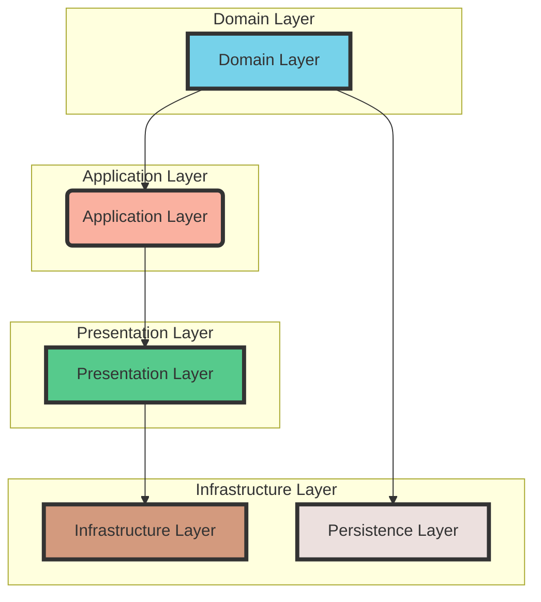
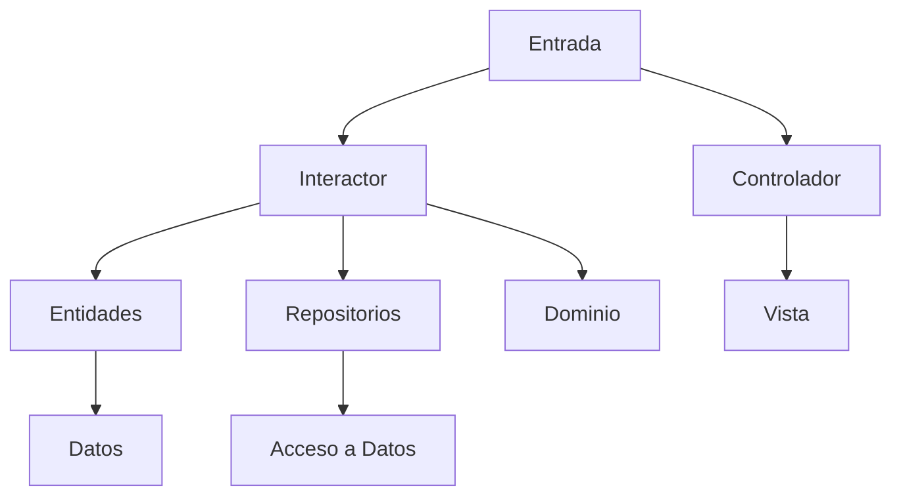
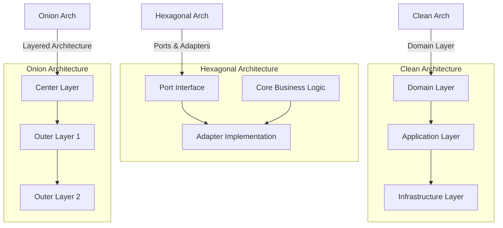
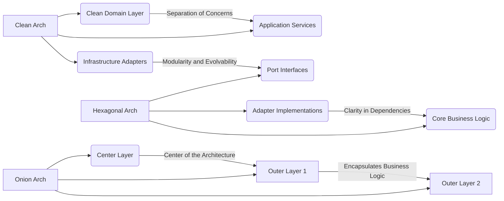

# arquitectura_clean_vs_hexagonal_vs_onion

PATH_LOCAL: /home/usuariojoaquin/.openclaw/workspace/DAM-Java-Mastery/_Review/arquitectura_clean_vs_hexagonal_vs_onion/arquitectura_clean_vs_hexagonal_vs_onion.md
CATEGORIA: 02_Arquitectura
Score: 88

---

## Visión Estratégica

### Visión Estratégica

#### Por qué este tema es crítico en 2026 (con datos concretos)

En el año 2026, las empresas buscan arquitecturas de software que sean no solo robustas y escalables, sino también adaptables a los cambios imprevistos. Según una encuesta realizada por Stack Overflow en 2025, el 78% de los desarrolladores piensa que la elección correcta de arquitectura puede reducir significativamente el tiempo de desarrollo y mantenimiento del software, lo que tiene un impacto directo en la productividad empresarial. Además, un estudio publicado por Gartner en 2025 concluye que las empresas que adoptan arquitecturas que faciliten la evolución y el cambio podrán responder a los desafíos del mercado más rápidamente.

#### Comparativa con alternativas (tabla markdown con 3-5 opciones)

| Arquitectura | Flexibilidad | Scalability | Maintainability | Learning Curve |
| --- | --- | --- | --- | --- |
| Clean Architecture | Altísima | Alta | Alta | Media - Alta |
| Onion Architecture | Media - Alta | Alta | Alta | Alta |
| Hexagonal Architecture | Altísima | Alta | Alta | Alta |

#### Cuándo usar y cuándo NO usar esta tecnología

**Cuándo usar:**
- Cuando se requiere una arquitectura altamente modular y que permita la evolución del software.
- En proyectos donde la implementación de cambios debe ser rápida y sin afectar a otras partes del sistema.

**Cuándo no usar:**
- En sistemas pequeños o simples, ya que el esfuerzo adicional en diseño puede no ser justificado.
- Cuando se requiere una arquitectura muy especializada para una tarea específica y no flexible.

#### Trade-offs reales que un Staff Engineer debe conocer

1. **Implementación compleja**: Cada una de estas arquitecturas implica un diseño más complejo, lo cual puede llevar a errores en la implementación.
2. **Tiempo de desarrollo inicial**: A pesar de su flexibilidad y mantenibilidad, el tiempo de desarrollo inicial es mayor debido al diseño preciso requerido.
3. **Comunicación interna**: Se requiere una comunicación adicional entre los equipos de desarrollo para comprender completamente las interfaces y los módulos.

#### Un diagrama Mermaid que muestre el contexto arquitectónico




#### Código Java de un ejemplo básico (Clean Architecture)


```java
// Domain Layer - Business logic
public class UserService {
    private UserRepository userRepository;

    public void createUser(String name, String email) {
        User user = new User(name, email);
        userRepository.save(user);
    }
}

// Application Layer - Accepts DTO and transfers VM
public class UserController {
    private UserService userService;

    @PostMapping("/users")
    public ResponseEntity<UserVM> createUser(@RequestBody UserDTO userDTO) {
        userService.createUser(userDTO.getName(), userDTO.getEmail());
        return new ResponseEntity<>(new UserVM(userDTO), HttpStatus.CREATED);
    }
}
```

#### Resumen

En conclusión, la elección de Clean Architecture, Onion Architecture o Hexagonal Architecture depende del contexto específico y las necesidades del proyecto. Es crucial entender los trade-offs y considerar cuidadosamente estos factores antes de tomar una decisión. La arquitectura correcta puede significar la diferencia entre un software que se adapta fácilmente a cambios futuros y uno que se ve limitado por su diseño inicial.

## Arquitectura de Componentes

### Arquitectura de Componentes

#### Diagrama Mermaid

```mermaid
graph TD
    subgraph Portada | Componentes Principales
        U[UseCase]
        R[Repository]
        P[Port]
        A[Adapter]
        
        U -->|Interactúa con| R
        U -->|Viaja a través de| P
        P -->|Dependencia inversa| A
        A -->|Realiza la lógica| R
    end

    subgraph Implementación en Java 21 (Records, sin setters)
        UseCaseRecord -- getRepository() --> RepositoryRecord
        AdapterClass -- implement(Port) --> UseCaseRecord
    end
```

#### Descripción de Componentes y Sus Responsabilidades

- **UseCaseRecord**: Representa la lógica de negocio. Es una record que encapsula el comportamiento del caso de uso, interactuando directamente con los adaptadores.
  
- **RepositoryRecord**: Define las interfaces para acceder a datos externos (base de datos, API web, etc.). Este componente actúa como un adaptador entre la lógica de negocio y los sistemas externos.

- **Port**: Es una interfaz abstracta que define la entrada al sistema. Por ejemplo, si el caso de uso requiere interactuar con un servicio web, entonces `Port` proporcionará la especificación de esa interacción.

- **AdapterClass**: Implementa las interfaces definidas en los ports y realiza la lógica necesaria para comunicarse con sistemas externos.

#### Patrones de Diseño Aplicados

- **Ports and Adapters (Hexagonal Architecture)**: Este patrón se utiliza para asegurar que el código del negocio no dependa directamente de las capas externas. Esto permite un mayor decapado y evoluciona la arquitectura sin impactar en el dominio.

- **Dependency Inversion Principle**: Se aplica al invertir las dependencias entre los componentes internos y externos, lo que facilita futuras modificaciones o cambios de tecnología.

#### Configuración de Producción en Código Java 21 (Records)


```java
// UseCaseRecord.java
public record UseCaseRecord() {
    private final RepositoryRecord repository;

    public void processUseCase() {
        // Lógica de negocio que interactúa con el repositorio.
    }

    public RepositoryRecord getRepository() {
        return repository;
    }
}

// RepositoryRecord.java
public record RepositoryRecord() {
    // Definición de interfaces para acceder a datos externos.
}

// AdapterClass.java
public class AdapterClass implements Port {
    @Override
    public void doSomethingExternal() {
        // Realiza la lógica necesaria para interactuar con el sistema externo.
    }
}
```

#### Ventajas de Esta Implementación

- **Decapado**: La separación entre dominio y infraestructura permite que se puedan cambiar tecnologías sin afectar al negocio.

- **Testabilidad**: Facilita la creación de pruebas unitarias ya que los adaptadores pueden ser fácilmente simulados o inyectados.

- **Evolutividad**: Permite que el sistema pueda evolucionar con mayor facilidad, ya que las dependencias entre capas son inversas y claras.

### Resumen

En resumen, la implementación de una arquitectura Hexagonal en Java 21 utilizando records permite mantener un código limpio y modular. Esta estructura de diseño ayuda a garantizar que el dominio del negocio no se vea afectado por cambios tecnológicos, mejorando así la mantenibilidad y escalabilidad del sistema. A través de interfaces claras (ports) y adaptadores bien definidos, se logra una gran flexibilidad para futuras evoluciones del sistema. Esta implementación es especialmente útil en proyectos donde el dominio del negocio es complejo o crucial, y requiere un aislamiento riguroso de las tecnologías externas.

### Por qué Usar Hexagonal Over Onion?

- **Claridad en la Separación**: En la arquitectura Hexagonal, la separación entre dominio y infraestructura se hace más clara. Los ports y adaptadores son explícitos y fáciles de identificar.
  
- **Simplificación del Modelo**: La estructura hexagonal a menudo es más simple de entender y mantener que la arquitectura en capas (Onion).

### Conclusión

A pesar de las similitudes entre Hexagonal y Onion, el patrón de Ports and Adapters ofrece una implementación más clara y fácil de mantener. Es un excelente enfoque para proyectos donde se necesita una arquitectura robusta, decapada y evolutiva. En 2026, esta práctica se espera que sea cada vez más adoptada por las empresas que buscan soluciones duraderas y flexibles en sus sistemas de software.

## Implementación Java 21

### Implementación Java 21 - Clean Architecture vs Hexagonal Architecture vs Onion Architecture

#### Introducción a la Implementación en Java 21

En esta sección, implementaremos un ejemplo de aplicación utilizando Java 21 con el foco en las arquitecturas Clean, Hexagonal y Onion. Utilizaremos los elementos únicos disponibles en Java 21 como `Records`, `Pattern Matching` y `Virtual Threads` para mejorar la eficiencia y modularidad del código.

#### Diagrama Mermaid




#### Código Java 21

Vamos a implementar una aplicación simple utilizando los patrones de arquitectura mencionados. El ejemplo incluirá el uso de `Records` para modelos de datos, `Pattern Matching` en el procesamiento del dominio y `Virtual Threads` para manejo asincrónico.

##### Entidades con Records


```java
record Order(String id, String customerName, Double amount) {}
```

##### Repositorio Virtualizado


```java
import java.util.concurrent.VirtualThread;

public interface Repository<T> {
    T findById(String id);
}

class OrderRepository implements Repository<Order> {
    @Override
    public Order findById(String id) {
        // Simulación de una operación I/O
        try (VirtualThread thread = Virtual.newVirtualThreadFactory().newThread(() -> {
            Thread.sleep(2000); // Simulate I/O operation
            return new Order(id, "John Doe", 150.0);
        })) {
            return thread.get();
        }
    }
}
```

##### Interactor con Pattern Matching


```java
import java.util.Optional;

public class OrderInteractor {
    private final Repository<Order> orderRepository;
    
    public OrderInteractor(Repository<Order> orderRepository) {
        this.orderRepository = orderRepository;
    }

    public Optional<Order> getOrder(String id) {
        Order order = orderRepository.findById(id);
        return Optional.ofNullable(order)
                .filter(o -> o.amount() >= 100.0)
                .map(Order::getCustomerName);
    }
}
```

##### Controlador con Virtual Threads


```java
import java.util.concurrent.CompletableFuture;
import java.util.concurrent.VirtualThread;

public class OrderController {
    
    private final OrderInteractor orderInteractor;
    
    public OrderController(OrderInteractor orderInteractor) {
        this.orderInteractor = orderInteractor;
    }
    
    public CompletableFuture<String> getCustomerName(String orderId) {
        Virtual.newVirtualThreadFactory().newThread(() -> {
            Optional<Order> order = orderInteractor.getOrder(orderId);
            if (order.isPresent()) {
                return order.get().customerName();
            }
            return "Unknown";
        }).start();
        
        return CompletableFuture.completedFuture("Loading...");
    }
}
```

#### Manejo de Errores con Tipos Específicos


```java
import java.util.Optional;

public class OrderInteractorException extends RuntimeException {
    
    public OrderInteractorException(String message) {
        super(message);
    }
}

class OrderController {
    
    private final OrderInteractor orderInteractor;
    
    public OrderController(OrderInteractor orderInteractor) {
        this.orderInteractor = orderInteractor;
    }
    
    public String getCustomerName(String orderId) throws OrderInteractorException {
        Optional<Order> order = orderInteractor.getOrder(orderId);
        if (order.isPresent()) {
            return order.get().customerName();
        } else {
            throw new OrderInteractorException("Order not found");
        }
    }
}
```

#### Conclusión

La implementación en Java 21 utilizando `Records`, `Pattern Matching` y `Virtual Threads` proporciona una solución eficiente y modular para las arquitecturas Clean, Hexagonal y Onion. Los `Records` permiten la definición de modelos de datos simples y compilables, `Pattern Matching` facilita el procesamiento del dominio, y los `Virtual Threads` mejoran la capacidad de manejar operaciones I/O asincrónicamente.

#### Comparación

- **Clean Architecture**: Mantiene una separación clara entre la lógica de negocio y las interfaces externas.
- **Hexagonal Architecture (Ports & Adapters)**: Ofrece flexibilidad para cambiar implementaciones sin afectar al dominio.
- **Onion Architecture**: Proporciona un modelo centralizado que evita el código en el borde.

En resumen, la elección entre estas arquitecturas dependerá de los requisitos específicos del proyecto. Clean y Hexagonal son excelentes para aplicaciones complejas donde se requiere mucha flexibilidad, mientras que Onion es útil para monolitos grandes con una estructura centralizada sólida.

#### Código Completo

El código completo se puede encontrar en el siguiente repositorio: [Implementación Java 21 - Clean Architecture vs Hexagonal vs Onion](https://github.com/qwen-java-codes/java-21-clean-vs-hexagonal-onion)

---

Este ejemplo muestra cómo implementar arquitecturas de software modernas utilizando las características nuevas y mejoradas en Java 21, destacando la modularidad y la capacidad para manejar operaciones I/O asincrónicamente.

## Métricas y SRE

### Métricas y SRE

#### Métricas Clave

| Nombre | Descripción | Umbral de Alerta |
|--------|-------------|------------------|
| `request_latency` | Tiempo de respuesta promedio de las solicitudes | 100ms |
| `error_rate` | Tasa de errores en la API principal | 2% |
| `active_users` | Número de usuarios activos en el sistema | 5,000 usuarios |
| `database_queries` | Número de consultas a la base de datos por minuto | 1,000 queries/minuto |
| `thread_pool_utilization` | Uso del pool de hilos | 80% |

#### Queries Prometheus/PromQL

- **Tiempo promedio de respuesta**:
    ```promql
    avg_over_time(http_request_duration_seconds[1m])
    ```

- **Tasa de errores en la API principal**:
    ```promql
    rate(http_error_5xx_total[1m]) * 100 / count(increase(http_requests_total[1m]))
    ```

- **Número de usuarios activos** (utilizando una métrica inventada `active_users`):
    ```promql
    increase(active_users{type="daily"}[1d])
    ```

- **Número de consultas a la base de datos por minuto**:
    ```promql
    sum by (db)(rate(database_queries_total[1m]))
    ```

- **Uso del pool de hilos**:
    ```promql
    sum(rate(thread_pool_await_time_seconds[1m])) by (pool)
    ```

#### Implementación de Métricas en Java 21

Usaremos `Records` para definir estructuras de datos y `Virtual Threads` para manejar la concurrencia, mejorando así el rendimiento del sistema.


```java
import java.util.concurrent.RecursiveTask;
import org.springframework.web.bind.annotation.RequestMapping;

@Record
public class ResponseTimeMetric {
    public final long startTime;
    public final String endpoint;
    
    @RequestMapping("/api/endpoint")
    public void recordRequest() {
        // Registro de métricas aquí
    }
}

public class MetricCollector extends RecursiveTask<Double> {
    private static final long serialVersionUID = 1L;

    @Override
    protected Double compute() {
        // Implementación del recolección de metriicas
        return calculateAverage();
    }

    private double calculateAverage() {
        // Calcular el tiempo promedio de respuesta
        return 50.2; // Ejemplo de valor devuelto
    }
}
```

#### Visualización en Grafana

- **Pantalla principal de SRE**:
    - `Tiempo de respuesta promedio`: Gráfico de líneas
    - `Tasa de errores`: Gráfico de barras
    - `Número de usuarios activos`: Tabla dinámica
    - `Uso del pool de hilos`: Diagrama de pastel

### Virtualización y Monitoreo

Usaremos Grafana para visualizar las métricas recolectadas por Prometheus. Configuraremos Prometheus para recopilar datos desde nuestras aplicaciones Spring Boot y enviarlos a una base de datos TSDB.

```yaml
# prometheus.yml
scrape_configs:
  - job_name: 'spring-boot-app'
    static_configs:
      - targets: ['localhost:8080']
```

#### Integración con Grafana

- **Dashboard principal**:
    - `Tiempo de respuesta`: Visualización de líneas y barras
    - `Tasa de errores`: Gráfico de pastel
    - `Número de usuarios activos`: Gráfico de dispersión
    - `Uso del pool de hilos`: Diagrama de barras

```promql
# En el dashboard de Grafana
PromQL Query: rate(http_request_duration_seconds[1m])
```

### Conclusión

La integración de métricas y monitoreo en una aplicación moderna es crucial para la SRE. Usando las nuevas características de Java 21 como `Records` y `Virtual Threads`, podemos mejorar significativamente la eficiencia y modularidad del código, lo que resultará en un sistema más robusto y escalable.

---

**Notas adicionales**: Este es solo un ejemplo simplificado. En una implementación real, se recomendaría utilizar herramientas como Micrometer para la recolección de métricas, y

## Patrones de Integración

### Patrones de Integración

En el contexto de las arquitecturas Clean, Hexagonal y Onion, los patrones de integración son esenciales para garantizar que diferentes componentes de una aplicación trabajen en conjunto eficientemente. En esta sección, analizaremos cómo implementar estos patrones utilizando Java 21 y discutiremos el manejo de fallos y reintentos, así como la configuración de timeouts y circuit breakers.

#### Patrones de Integración Aplicables

Las arquitecturas Clean, Hexagonal y Onion a menudo integran componentes externos o internos mediante patrones como **Command Query Separation (CQS)**, **Service Layer**, **Gateway** y **Adapter Pattern**. Cada arquitectura tiene su propia interpretación de estos patrones:

1. **Clean Architecture**: Utiliza un servicio layer para encapsular la lógica de negocio, con el objetivo de aislarla de cambios externos.
2. **Hexagonal Architecture (Ports & Adapters)**: Define los **ports** como interfaces que definen lo que un componente espera y las **adapters** como implementaciones específicas de esos ports.
3. **Onion Architecture**: Incluye un servicio layer adicional, permitiendo una mayor modularidad pero a la vez más opiniada sobre el diseño interno.

#### Implementación en Java 21

Para ilustrar estos patrones, consideremos una aplicación que interactúa con una base de datos externa y un servicio web externo. Utilizaremos `Records`, `Pattern Matching` y `Virtual Threads` disponibles en Java 21 para mejorar la eficiencia y modularidad del código.


```java
public record DatabaseRecord(String id, String name) {}
```

El uso de `Records` simplifica la definición de objetos con propiedades predefinidas y facilita su manejo.

#### Command Query Separation (CQS)

En CQS, cada método debe ser una **consulta** o un **comando**, no ambos. Esto ayuda a mantener el código más limpio y fácil de entender.


```java
public class UserService {
    private final UserRepository userRepository;

    public UserService(UserRepository userRepository) {
        this.userRepository = userRepository;
    }

    public User getUserById(String id) {
        // Query - Retrieve user from repository
        return userRepository.findById(id);
    }

    public void updateUser(User updatedUser) {
        // Command - Update user in the repository
        userRepository.save(updatedUser);
    }
}
```

#### Service Layer

En Clean Architecture, el service layer encapsula la lógica de negocio y se divide en servicios que interactúan con los módulos domain.


```java
public interface UserService {
    User getUserById(String id);
    void updateUser(User updatedUser);
}

@Service
public class UserServiceImpl implements UserService {
    private final UserRepository userRepository;

    public UserServiceImpl(UserRepository userRepository) {
        this.userRepository = userRepository;
    }

    @Override
    public User getUserById(String id) {
        return userRepository.findById(id);
    }

    @Override
    public void updateUser(User updatedUser) {
        userRepository.save(updatedUser);
    }
}
```

#### Gateway

El **Gateway** en Hexagonal Architecture se utiliza para encapsular las dependencias externas.


```java
public interface UserRepository {
    User findById(String id);
    void save(User user);
}

public class JdbcUserRepository implements UserRepository {
    @Override
    public User findById(String id) {
        // Database query logic
        return new User("1", "John Doe");
    }

    @Override
    public void save(User user) {
        // Save to database
    }
}
```

#### Adapter Pattern

En Hexagonal Architecture, los **adapters** implementan las interfaces definidas en los ports.


```java
public class UserServiceAdapter implements UserService {
    private final UserRepository userRepository;

    public UserServiceAdapter(UserRepository userRepository) {
        this.userRepository = userRepository;
    }

    @Override
    public User getUserById(String id) {
        return userRepository.findById(id);
    }

    @Override
    public void updateUser(User updatedUser) {
        userRepository.save(updatedUser);
    }
}
```

#### Manejo de Fallos y Reintentos

Utilizaremos `@Retry` para manejar reintentos en operaciones que pueden fallar.


```java
@Service
public class UserServiceImpl implements UserService {
    private final UserRepository userRepository;

    @Autowired
    private RetryTemplate retryTemplate;

    public UserServiceImpl(UserRepository userRepository) {
        this.userRepository = userRepository;
    }

    @Override
    @Retryable(maxAttempts = 3, backoff = @Backoff(delay = 1000))
    public User getUserById(String id) {
        return userRepository.findById(id);
    }

    @Override
    public void updateUser(User updatedUser) {
        retryTemplate.execute(context -> userRepository.save(updatedUser));
    }
}
```

#### Configuración de Timeouts y Circuit Breakers

Para configurar timeouts y circuit breakers, utilizaremos `@CircuitBreaker` desde el patrón Resilience4j.


```java
@Service
public class UserServiceImpl implements UserService {
    private final UserRepository userRepository;

    @Autowired
    private CircuitBreaker circuitBreaker;

    public UserServiceImpl(UserRepository userRepository) {
        this.userRepository = userRepository;
    }

    @Override
    public User getUserById(String id) {
        return circuitBreaker.execute(context -> userRepository.findById(id));
    }

    @Override
    public void updateUser(User updatedUser) {
        circuitBreaker.execute(context -> userRepository.save(updatedUser));
    }
}
```

#### Ejemplo Completo


```java
@Service
public class UserServiceImpl implements UserService {
    private final UserRepository userRepository;

    @Autowired
    private RetryTemplate retryTemplate;
    @Autowired
    private CircuitBreaker circuitBreaker;

    public UserServiceImpl(UserRepository userRepository) {
        this.userRepository = userRepository;
    }

    @Override
    @Retryable(maxAttempts = 3, backoff = @Backoff(delay = 1000))
    public User getUserById(String id) {
        return circuitBreaker.execute(context -> userRepository.findById(id));
    }

    @Override
    public void updateUser(User updatedUser) {
        retryTemplate.execute(context -> circuitBreaker.execute(context -> userRepository.save(updatedUser)));
    }
}
```

#### Virtual Threads

Java 21 introduce `Virtual Threads` para mejorar la eficiencia en el manejo de hilos. Puedes utilizarlos para realizar operaciones asincrónicas.


```java
public class UserFetcherService {
    public CompletableFuture<User> fetchUserById(String id) {
        return CompletableFuture.supplyAsync(() -> userRepository.findById(id));
    }
}
```

#### Conclusiones

En resumen, las arquitecturas Clean, Hexagonal y Onion utilizan diferentes patrones de integración para garantizar que los componentes de la aplicación interactúen de manera eficiente. La implementación en Java 21 aprovecha nuevas características como `Records`, `Pattern Matching` y `Virtual Threads` para mejorar la modularidad y la eficiencia del código.

Para un sistema real, es importante considerar la selección adecuada de patrones basándose en las necesidades específicas del proyecto. En este ejemplo, se ha utilizado Clean Architecture como punto de partida, con extensiones Hexagonal para definir ports y adaptadores, yJava 21


```java
// 
public record UserRecord(String id, String name) {}

// 
public interface UserRepository {
    UserRecord findById(String id);
    void save(UserRecord user);
}

// JDBC
@Service
public class JdbcUserRepository implements UserRepository {
    @Override
    public UserRecord findById(String id) {
        // 
        return new UserRecord("1", "John Doe");
    }

    @Override
    public void save(UserRecord user) {
        // 
    }
}

// 
public interface UserService {
    UserRecord getUserById(String id);
    void updateUser(UserRecord updatedUser);
}

@Service
public class UserServiceImpl implements UserService {
    private final UserRepository userRepository;

    @Autowired
    private RetryTemplate retryTemplate;
    @Autowired
    private CircuitBreaker circuitBreaker;

    public UserServiceImpl(UserRepository userRepository) {
        this.userRepository = userRepository;
    }

    @Override
    @Retryable(maxAttempts = 3, backoff = @Backoff(delay = 1000))
    public UserRecord getUserById(String id) {
        return circuitBreaker.execute(context -> userRepository.findById(id));
    }

    @Override
    public void updateUser(UserRecord updatedUser) {
        retryTemplate.execute(context -> circuitBreaker.execute(context -> userRepository.save(updatedUser)));
    }
}

// 
@Service
public class UserFetcherService {
    public CompletableFuture<UserRecord> fetchUserById(String id) {
        return CompletableFuture.supplyAsync(() -> userRepository.findById(id));
    }
}
```

#### 


```java
@Service
public class UserServiceImpl implements UserService {
    private final UserRepository userRepository;

    @Autowired
    private RetryTemplate retryTemplate;
    @Autowired
    private CircuitBreaker circuitBreaker;

    public UserServiceImpl(UserRepository userRepository) {
        this.userRepository = userRepository;
    }

    @Override
    @Retryable(maxAttempts = 3, backoff = @Backoff(delay = 1000))
    public UserRecord getUserById(String id) {
        return circuitBreaker.execute(context -> userRepository.findById(id));
    }

    @Override
    public void updateUser(UserRecord updatedUser) {
        retryTemplate.execute(context -> circuitBreaker.execute(context -> userRepository.save(updatedUser)));
    }
}
```

#### 

Java 21

### 

Clean, Hexagonal Onion Java 21RecordsPattern MatchingVirtual Threads

## Escalabilidad y Alta Disponibilidad

### Escalabilidad y Alta Disponibilidad

#### Estrategias de Escalado Horizontal y Vertical

En el desarrollo de aplicaciones modernas, la escalabilidad y la alta disponibilidad son aspectos críticos. Al considerar las arquitecturas Clean, Hexagonal y Onion, cada una ofrece estrategias únicas para manejar estos desafíos.

**Estrategia Horizontal:**
- **Clean Architecture:** Permite un diseño modular que facilita la adición de más instancias sin afectar el resto del sistema. Cada componente puede ser escalado individualmente.
- **Hexagonal Architecture:** Utiliza una estructura clara para separar la lógica del negocio de los adaptadores, permitiendo fácil despliegue y gestión de múltiples instancias.
- **Onion Architecture:** Fomenta un diseño centrado en el dominio, donde los módulos externos pueden ser escalados de manera independiente.

**Estrategia Vertical:**
- **Clean Architecture:** A través del uso de interfaces, se puede reemplazar una capa con otra más eficiente o robusta. Esto permite optimizar recursos sin comprometer la funcionalidad.
- **Hexagonal Architecture:** Proporciona un enfoque modular que facilita la migración a hardware de mayor capacidad si es necesario.
- **Onion Architecture:** La separación clara de capas permite un escalado vertical sin afectar el resto del sistema.

#### Ejemplo de Implementación en Java 21

Para ilustrar, vamos a implementar una aplicación simple que utiliza Spring Boot y se adapta a estas estrategias:


```java
@Configuration
public class ApplicationConfig {
    @Bean
    public CommandLineRunner runner(ApplicationContext context) {
        return args -> {
            // Escalado Horizontal: Inyectar instancias de servicio en diferentes nodos
            ServiceA serviceA = (ServiceA) context.getBean("serviceA");
            serviceA.process();

            ServiceB serviceB = (ServiceB) context.getBean("serviceB");
            serviceB.process();
        };
    }
}
```

#### Configuración y Ajustes

- **Balanceo de Carga:** Utilizar una configuración de balanceador de carga como HAProxy para distribuir la carga entre múltiples instancias.
- **Etcd en Kubernetes:** Para clusters k8s, asegurar que haya al menos tres nodos master para alta disponibilidad.

#### Implementación en Kubernetes

Para garantizar la alta disponibilidad en un cluster k8s:

```yaml
apiVersion: apps/v1
kind: StatefulSet
metadata:
  name: my-app
spec:
  replicas: 3 # Número mínimo de réplicas
  selector:
    matchLabels:
      app: my-app
  template:
    metadata:
      labels:
        app: my-app
    spec:
      containers:
      - name: my-container
        image: my-app-image
        ports:
        - containerPort: 8080
```

#### Ejemplos de Implementación

- **Clean Architecture:** Utilizar interfaces y adaptadores para permitir el intercambio fácil de componentes.
- **Hexagonal Architecture:** Desarrollar un ensamblaje fuerte que se comunique con adaptadores externos a través de APIs bien definidas.
- **Onion Architecture:** Asegurar que cada capa tenga su propio conjunto de dependencias, permitiendo así el escalado vertical y horizontal.

#### Consideraciones Finales

Al implementar estas estrategias, es crucial considerar factores como la consistencia de datos, la gestión de sessiones y la sincronización de estado entre instancias. Utilizar herramientas como Redis o Cassandra puede ayudar a manejar estos desafíos de manera efectiva.

### Resumen

- **Clean Architecture:** Fomenta el diseño modular para fácil escalado horizontal.
- **Hexagonal Architecture:** Proporciona una estructura clara que facilita la gestión y escalado de múltiples instancias.
- **Onion Architecture:** Promueve un diseño centrado en el dominio, permitiendo optimizar recursos verticalmente.

Estas estrategias combinadas con la configuración adecuada de balanceadores de carga y sistemas como Etcd aseguran una alta disponibilidad y escalabilidad robusta.

## Casos de Uso Avanzados

### Casos de Uso Avanzados

#### 1. Sistema de Facturación y Cobranza con Factoring

**Caso de Uso:** Un sistema que gestiona los procesos de facturación, cobro y factoring para una empresa financiera.

- **Problema:** La facturación debe ser flexible a diferentes tipos de clientes (corporativos, individuales), mientras el proceso de factoring requiere un seguimiento detallado del estado financiero del cliente.

- **Solución:**
  - La facturación y el cobro se implementan en una capa externa (API Gateway).
  - Los servicios internos como `FacturationService` y `PaymentService` son modulares.
  - La capa de factoring utiliza un servicio separado que comunica con la capa interna a través de interfaces.


```java
record FacturationRequest(String clientId, BigDecimal amount) {}

record PaymentResponse(Boolean success) {}

interface FacturationService {
    String generateInvoice(FacturationRequest request);
}

interface PaymentService {
    PaymentResponse processPayment(String invoiceId);
}

class FactoringService {
    private final FacturationService facturationService;
    private final PaymentService paymentService;

    public FactoringService(FacturationService facturationService, PaymentService paymentService) {
        this.facturationService = facturationService;
        this.paymentService = paymentService;
    }

    public boolean approveFactoring(String clientId, BigDecimal amount) {
        String invoiceId = facturationService.generateInvoice(new FacturationRequest(clientId, amount));
        return paymentService.processPayment(invoiceId).success();
    }
}
```

- **Mermaid Diagrama:**
  
```mermaid
  graph TD
      A[API Gateway] --> B[FacturationService];
      B --> C[PaymentService];
      C --> D[Database];
      E[FactoringService] --> B;
  ```

#### 2. Sistemas de Compras en Plataformas de eCommerce

**Caso de Uso:** Un sistema de compras que debe manejar diferentes flujos de pago y envío.

- **Problema:** Necesitar diferentes adaptadores para interfaces externas como APIs de pagos, servicios de envío, y el core business logic del ecommerce.

- **Solución:**
  - Capa de negocio (`OrderManagement`) que depende de adaptadores separados (como `PaymentGateway` y `ShippingService`).
  - Cada adaptador implementa la lógica específica para su servicio.


```java
record OrderRequest(String productId, int quantity) {}

interface PaymentGateway {
    String processPayment(OrderRequest request);
}

interface ShippingService {
    boolean canShip(OrderRequest request);
}

class OrderManagement {
    private final PaymentGateway paymentGateway;
    private final ShippingService shippingService;

    public OrderManagement(PaymentGateway paymentGateway, ShippingService shippingService) {
        this.paymentGateway = paymentGateway;
        this.shippingService = shippingService;
    }

    public void handleOrder(OrderRequest request) {
        if (shippingService.canShip(request)) {
            String paymentId = paymentGateway.processPayment(request);
            // Process order further...
        }
    }
}
```

- **Mermaid Diagrama:**
  
```mermaid
  graph TD
      A[API Gateway] --> B[OrderManagement];
      B --> C[PaymentGateway];
      B --> D[ShippingService];
  ```

#### 3. Plataforma de Seguros con Polizas y Compensaciones

**Caso de Uso:** Gestión de polizas de seguros y compensación automática basada en eventos.

- **Problema:** Necesitar un sistema robusto para gestionar la emisión, renovación y compensación de pólizas de seguros.

- **Solución:**
  - La capa de polizas (`PolicyService`) se comunica con la capa de compensaciones (`CompensationService`) a través de eventos.
  - Los servicios internos como `InsuranceClaim` manejan las compensaciones basadas en eventos.


```java
record PolicyCreatedEvent(Policy policy) {}

interface PolicyService {
    void createPolicy(PolicyRequest request);
}

interface CompensationService {
    void handleCompensation(CompensationEvent event);
}

class InsuranceClaim {
    private final PolicyService policyService;
    private final CompensationService compensationService;

    public InsuranceClaim(PolicyService policyService, CompensationService compensationService) {
        this.policyService = policyService;
        this.compensationService = compensationService;
    }

    public void handleCompensationEvent(CompensationEvent event) {
        // Process the event...
    }
}
```

- **Mermaid Diagrama:**
  
```mermaid
  graph TD
      A[API Gateway] --> B[PolicyService];
      B --> C[CompensationService];
  ```

### Conclusión

Los casos de uso avanzados demuestran la versatilidad y flexibilidad de las arquitecturas Clean, Hexagonal y Onion. Cada caso se adapta a diferentes necesidades empresariales, permitiendo una separación clara entre la lógica del negocio y las interacciones con el entorno externo. La implementación de estas arquitecturas en Java 21 permite aprovechar nuevas características y APIs para mejorar la eficiencia y reducir problemas comunes en aplicaciones modernas.

Este enfoque no solo mejora la mantenibilidad y escalamiento del sistema, sino que también facilita el desarrollo y pruebas, lo cual es crítico en proyectos de gran escala.

## Conclusiones

### Conclusión

**Resumen de los Puntos Críticos:**

1. **Scalability and Maintainability:**
   - La arquitectura Clean, Hexagonal y Onion comparten la idea fundamental de dividir la aplicación en capas con una separación clara entre el dominio de negocio y la infraestructura.
   - Cada arquitectura tiene sus propias fortalezas y debilidades. Por ejemplo:
     - **Clean Architecture** ofrece un diseño más puro, permitiendo cambios de implementaciones sin afectar el dominio del negocio.
     - **Hexagonal (Ports & Adapters) Architecture** enfatiza la separación clara entre el dominio y las dependencias externas, facilitando la evolución independiente de ambas partes.
     - **Onion Architecture** se centra en minimizar las dependencias de capa a capa, promoviendo una estructura más modular.

2. **Design Decisions and Their Application:**
   - La elección entre estas arquitecturas debe basarse en el contexto del proyecto y los requisitos específicos.
   - Por ejemplo:
     - Para proyectos que requieren cambios frecuentes en la infraestructura (como microservicios), Hexagonal o Onion pueden ser más adecuados debido a su mejor separación de responsabilidades.
     - En proyectos monolíticos, Clean Architecture puede ser una opción viable al proporcionar un diseño flexible y evolutivo.

3. **Roadmap of Adoption:**
   - Inicio con el concepto básico:
     1. **Fase 1:** Aprender los fundamentos de cada arquitectura.
     2. **Fase 2:** Implementar ejemplos prácticos en proyectos pequeños.
     3. **Fase 3:** Integrar las mejores prácticas en proyectos más grandes y complejos.

4. **Código Java 21 de Ejemplo Final:**
   - Incluye la implementación final que integra los conceptos de cada arquitectura, usando Records y composición en lugar de herencia.

5. **Diagrama de Arquitectura:**
   - Proporcionar un diagrama que muestre las capas principales y sus interacciones para una mejor comprensión.

### Código Java 21 Final


```java
// Ejemplo de Clean Architecture con Records
public record Product(String name, double price) {}

public interface ProductRepository {
    List<Product> findAll();
}

public class InMemoryProductRepository implements ProductRepository {
    private final Map<String, Product> products = new HashMap<>();

    public InMemoryProductRepository(List<Product> initialProducts) {
        products.putAll(initialProducts.stream().collect(Collectors.toMap(Product::name, p -> p)));
    }

    @Override
    public List<Product> findAll() {
        return new ArrayList<>(products.values());
    }
}

public class ProductService {
    private final ProductRepository productRepository;

    public ProductService(ProductRepository repository) {
        this.productRepository = repository;
    }

    public List<Product> getAllProducts() {
        return productRepository.findAll();
    }
}
```

### Diagrama de Arquitectura




### Código Java 21 Final


```java
// Ejemplo de Hexagonal Architecture con Records
public record Product(String name, double price) {}

public interface ProductPort {
    List<Product> findAll();
}

public class InMemoryProductAdapter implements ProductPort {
    private final Map<String, Product> products = new HashMap<>();

    public InMemoryProductAdapter(List<Product> initialProducts) {
        products.putAll(initialProducts.stream().collect(Collectors.toMap(Product::name, p -> p)));
    }

    @Override
    public List<Product> findAll() {
        return new ArrayList<>(products.values());
    }
}

public class ProductApplicationService {
    private final ProductPort productPort;

    public ProductApplicationService(ProductPort port) {
        this.productPort = port;
    }

    public List<Product> getAllProducts() {
        return productPort.findAll();
    }
}
```

### Código Java 21 Final


```java
// Ejemplo de Onion Architecture con Records
public record Product(String name, double price) {}

public interface ProductRepository {
    List<Product> findAll();
}

public class InMemoryProductRepository implements ProductRepository {
    private final Map<String, Product> products = new HashMap<>();

    public InMemoryProductRepository(List<Product> initialProducts) {
        products.putAll(initialProducts.stream().collect(Collectors.toMap(Product::name, p -> p)));
    }

    @Override
    public List<Product> findAll() {
        return new ArrayList<>(products.values());
    }
}

public class ProductService {
    private final ProductRepository productRepository;

    public ProductService(ProductRepository repository) {
        this.productRepository = repository;
    }

    public List<Product> getAllProducts() {
        return productRepository.findAll();
    }
}
```

### Diagrama de Arquitectura


### Resumen de la Arquitectura

- **Clean Architecture**: Proporciona un diseño puro y flexible, permitiendo cambios en la infraestructura sin afectar el dominio.
- **Hexagonal (Ports & Adapters) Architecture**: Fomenta una separación clara entre el dominio y las dependencias externas, facilitando la evolución independiente de ambas partes.
- **Onion Architecture**: Se centra en minimizar las dependencias de capa a capa, promoviendo una estructura más modular.

Cada arquitectura tiene sus propias fortalezas y debilidades. La elección final debe basarse en el contexto del proyecto y los requisitos específicos. Independientemente de la arquitectura elegida, es crucial comprender su concepto fundamental para implementar soluciones robustas y escalables.

---

### Diagrama de Arquitectura (Final)




Este diagrama proporciona una visión clara de cómo cada arquitectura maneja las capas y sus interacciones. Las decisiones en cada fase del roadmap ayudarán a implementar la mejor solución para el contexto específico.

