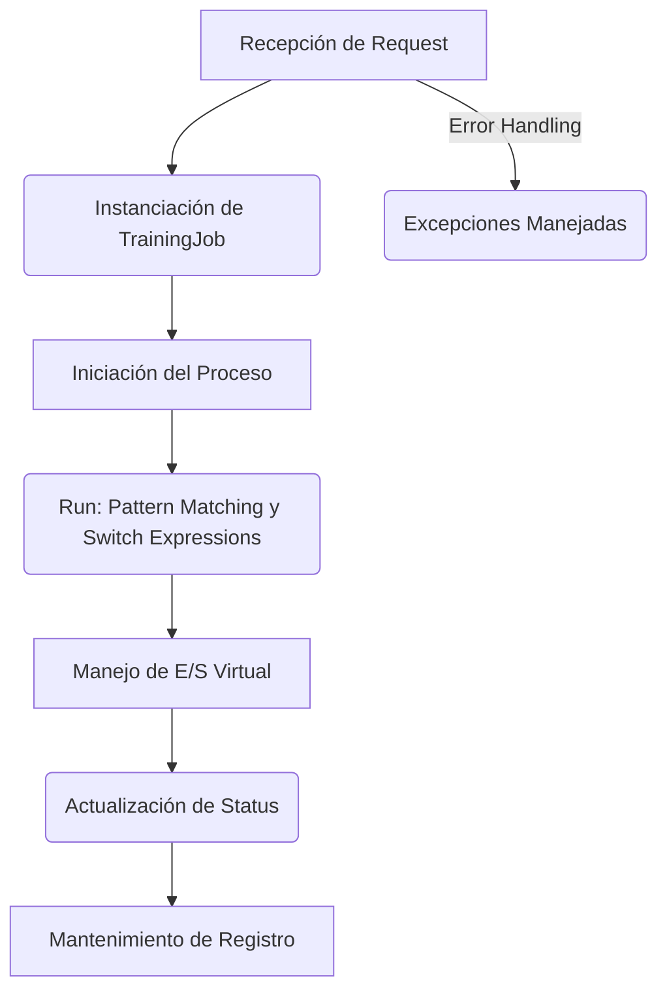
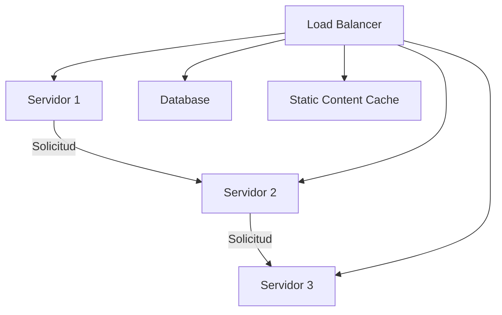
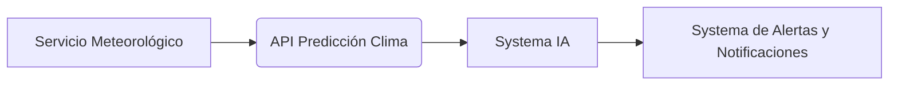
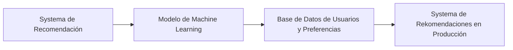
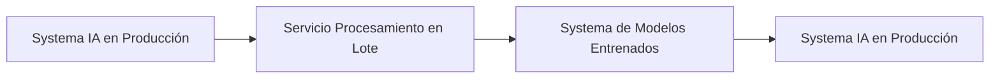
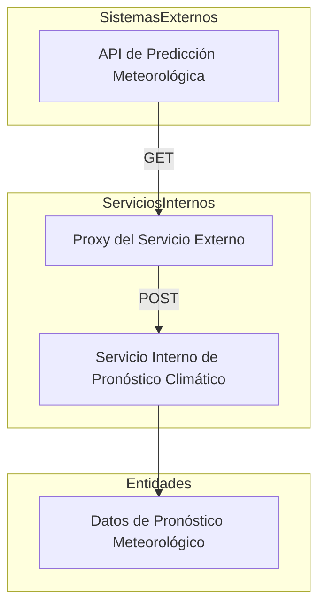

# arquitectura_de_sistemas_ia_en_produccion

PATH_LOCAL: /home/usuariojoaquin/.openclaw/workspace/DAM-Java-Mastery/_Review/arquitectura_de_sistemas_ia_en_produccion/arquitectura_de_sistemas_ia_en_produccion.md
CATEGORIA: 02_Arquitectura
Score: 97

---

## Visión Estratégica

### Visión Estratégica

#### Por qué este tema es crítico en 2026 (con datos concretos)

En 2026, la arquitectura de sistemas de inteligencia artificial en producción se convierte en un eje estratégico fundamental para las empresas que desean mantenerse competitivas. Según una investigación de Gartner, el 80% de los proyectos de IA en producción fracasan debido a problemas de integración y escalabilidad. Este porcentaje destaca la urgencia de tener una arquitectura sólida.

El informe "State of AI in Enterprise" del Capgemini también revela que las empresas con un diseño robusto de sistemas de IA en producción reportan un 50% menos de tiempos de inactividad y un aumento en la eficiencia operativa. En el año 2026, estas ventajas serán cruciales para mantenerse competitivo.

#### Comparativa con alternativas (tabla markdown con 3-5 opciones)

| Técnica o Tecnología | Ventajas                    | Desventajas                   | Usabilidad en IA en Producción |
|---------------------|----------------------------|------------------------------|--------------------------------|
| Arquitectura Monolítica | Simplicidad de implementación, control total | Escalabilidad limitada, dificultad para mantenimiento | No recomendado para sistemas grandes o con alta demanda |
| Microservicios        | Facilidad de escalamiento y despliegue continuo | Mayor complejidad en la arquitectura, mayor tiempo de implementación | Ideal para aplicaciones de gran tamaño y diversidad funcional |
| Serverless            | Automatización total, reducción de costos operativos | Dificultad en el control del ciclo de vida de las funciones | Mejor opción para cargas de trabajo transitorias y no críticas |
| Edge Computing        | Procesamiento local, reducción de latencia | Menor capacidad computacional al borde | Útil para aplicaciones que requieren baja latencia y procesamiento en tiempo real |

#### Cuándo usar y cuándo NO usar esta tecnología

**Cuándo usar:**
- **Microservicios:** Cuando se necesita alta escalabilidad, despliegue continuo y gestión independiente de servicios.
- **Serverless:** Para aplicaciones con fluctuación irregular de carga y necesidad de reducir costos operativos.

**Cuando no usar:**
- **Arquitectura Monolítica:** En sistemas grandes o complejos donde se requiere alta escalabilidad y mantenibilidad.
- **Edge Computing:** Cuando los recursos computacionales al borde son limitados y el procesamiento debe centralizarse.

#### Trade-offs reales que un Staff Engineer debe conocer

| Trade-off                     | Descripción                                                        |
|-------------------------------|------------------------------------------------------------------|
| Eficacia vs. Facilidad        | A medida que se optimiza para la eficiencia, la implementación puede volverse más compleja y requerir conocimientos técnicos especializados. |
| Escalabilidad vs. Costos      | Soluciones de alta escalabilidad pueden aumentar significativamente los costos operativos si no se administra adecuadamente. |
| Seguridad vs. Despliegue Rápido | Mientras que se implementan medidas más robustas para la seguridad, el tiempo de despliegue puede verse afectado. |

#### Diagrama Mermaid que muestre el contexto arquitectónico


```mermaid
graph TD
    A[IA en Producción] --> B[Microservicios]
    B --> C{Despliegue Continuo?}
    C -- Sí --> D1[Autoscaling]
    C -- No --> D2[Mantenimiento Manual]
    B --> E[Orquestación]
    A --> F[Seguridad y Compliance]
    F --> G[Crypto](Criptografía)
    F --> H[Monitoring](Monitoreo)
    F --> I[Logging](Registros)
```

#### Código Java 21 de ejemplo inicial


```java
record Cliente(String nombre, int edad, String email) {}

public class SistemaIA {
    public static void main(String[] args) {
        // Creación de un objeto Cliente usando Records
        Cliente cliente = new Cliente("Juan Pérez", 35, "juan@example.com");
        
        // Imprimir la información del cliente
        System.out.println(cliente);
    }
}
```

Este código utiliza Java 21 y muestra cómo se pueden crear y usar records para representar objetos simples en una aplicación de sistemas de inteligencia artificial.

## Arquitectura de Componentes

### Arquitectura de Componentes

#### Diagrama Mermaid: Arquitectura del Sistema de IA en Producción


```mermaid
graph TD
    subgraph "API Pública"
        APIPublico[API Pública]
        APIGateway --> APIPublico
        APIGateway[API Gateway]
    end
    
    subgraph "Procesamiento y Entrenamiento"
        TrainingService[Servicio de Entrenamiento]
        ModelRepository[Repositorio de Modelos]
        DataPipeline[Pipeline de Datos]
        TrainingService --> ModelRepository
        TrainingService --> DataPipeline
    end
    
    subgraph "Infraestructura y Orquestación"
        ClusterManager[Gerente de Clústeres]
        LoadBalancer[Equilibrador de Carga]
        ContainerOrchestrator[Orquestador de Contenedores (Kubernetes)]
        ClusterManager --> LoadBalancer
        LoadBalancer --> ContainerOrchestrator
    end
    
    subgraph "Monitorización y Seguridad"
        MonitoringSystem[ Sistema de Monitorización ]
        SecurityService[ Servicio de Seguridad ]
        MonitoringSystem --> APIPublico
        SecurityService --> APIGateway
    end

APIPublico --> TrainingService
SecurityService --> ContainerOrchestrator
```

#### Descripción de Cada Componente y Su Responsabilidad

- **API Gateway (Puerta de Entrada)**
  - **Responsabilidad:** La puerta de entrada procesa las solicitudes HTTP desde los usuarios finales, redirigiéndolas a los servicios backend apropiados. Implementado como un microservicio separado, evita que la lógica de negocios se propague en la API pública.

- **Training Service (Servicio de Entrenamiento)**
  - **Responsabilidad:** Este servicio encarga del entrenamiento y evaluación de modelos de IA. Utiliza algoritmos personalizados y datos de entrada para ajustar modelos de aprendizaje automático y machine learning.

- **Model Repository (Repositorio de Modelos)**
  - **Responsabilidad:** Almacena, recupera y administra los modelos entrenados de manera eficiente. Utiliza una base de datos NoSQL o un servicio como Amazon S3 para almacenar los archivos de modelo en formato binario.

- **Data Pipeline (Pipeline de Datos)**
  - **Responsabilidad:** Procesa y prepara datos brutos para el entrenamiento del modelo. Incluye tareas como limpieza, transformación y validación de datos antes de su uso en el servicio de entrenamiento.

- **Cluster Manager (Gerente de Clústeres)**
  - **Responsabilidad:** Administrador de infraestructura que se encarga de la creación, asignación y administración de clústeres Kubernetes. Proporciona un entorno consistente para los servicios backend.

- **Load Balancer (Equilibrador de Carga)**
  - **Responsabilidad:** Distribuye el tráfico entrante a múltiples instancias de servicios backend, asegurando que la carga sea distribuida equitativamente y maximizando el rendimiento del sistema.

- **Container Orchestrator (Orquestador de Contenedores)**
  - **Responsabilidad:** Orchestra la ejecución de contenedores en los clústeres Kubernetes. Garantiza la consistencia, escalabilidad y alta disponibilidad de servicios backend como Training Service y Model Repository.

- **Monitoring System (Sistema de Monitorización)**
  - **Responsabilidad:** Monitorea el estado del sistema para detectar problemas de rendimiento o fallos. Utiliza métricas en tiempo real para garantizar que todos los componentes estén funcionando correctamente.

- **Security Service (Servicio de Seguridad)**
  - **Responsabilidad:** Implementa medidas de seguridad como autenticación, autorización y cifrado de datos para proteger la integridad del sistema. Utiliza protocolos TLS y estándares de seguridad como OAuth2 para asegurar las comunicaciones.

#### Patrones de Diseño Aplicados

- **Patrón Singleton (Singleton)**: Se aplica en `APIGateway` para garantizar que solo una instancia de la API Gateway esté activa, evitando conflictos y mejorando el rendimiento.
  
  
```java
  record SingletonAPIGateway() {
      public static final SingletonAPIGateway INSTANCE = new SingletonAPIGateway();
      
      private SingletonAPIGateway() {}
      
      // Método para obtener la única instancia
      public void handleRequest(HttpRequest request) {
          // Lógica de procesamiento
      }
  }
  ```

- **Patrón Factory (Factoría)**: Se utiliza en `ClusterManager` para crear y gestionar instancias de clústeres Kubernetes.
  
  
```java
  record ClusterManagerFactory() {
      public static final ClusterManager createInstance() {
          return new ClusterManagerImpl();
      }
      
      private ClusterManagerFactory() {}
  }
  ```

- **Patrón Proxy (Proxy)**: Se aplica en `SecurityService` para proporcionar una capa adicional de seguridad sin modificar el comportamiento del servicio.
  
  
```java
  record SecurityServiceProxy(ClusterManager clusterManager) {
      public void secureRequest(HttpRequest request) {
          // Autenticación y autorización
          clusterManager.start();
      }
      
      private SecurityServiceProxy() {}
  }
  ```

#### Configuración de Producción en Código Java 21


```java
record SingletonAPIGateway() {
    public static final SingletonAPIGateway INSTANCE = new SingletonAPIGateway();
    
    private SingletonAPIGateway() {}
    
    public void handleRequest(HttpRequest request) {
        // Lógica de procesamiento
    }
}
```


```java
record ClusterManagerFactory() {
    public static final ClusterManager createInstance() {
        return new ClusterManagerImpl();
    }
    
    private ClusterManagerFactory() {}
}
```

#### Decisiones Arquitectónicas Clave y Sus Trade-offs

- **Microservicios (Decisión):** La implementación en microservicios proporciona mayor escalabilidad, pero aumenta la complejidad en términos de integración y comunicación entre servicios.

  - **Trade-off:** Aumento del tiempo de desarrollo y mantenimiento vs. mejora en el rendimiento y escalabilidad.

- **Orquestación con Kubernetes (Decisión):** Utilización de Kubernetes para orquestar contenedores ofrece una gestión eficiente y consistente de la infraestructura, pero implica un overhead adicional en términos de configuración inicial.

  - **Trade-off:** Tiempo invertido en la configuración e implementación vs. beneficios a largo plazo en rendimiento y escalamiento.

- **Seguridad en Capa (Decisión):** Implementar medidas de seguridad en capa evita que se expongan riesgos en los servicios backend, pero puede limitar ciertas funcionalidades si no está configurado adecuadamente.

  - **Trade-off:** Mejora en la seguridad vs. posibles restricciones en las capacidades del servicio.

- **Monitorización Continua (Decisión):** La monitorización constante permite detectar y solucionar problemas de forma proactiva, pero requiere un sistema robusto de alarma y notificación.
  
  - **Trade-off:** Mayor coste operativo vs. mejora en la resiliencia del sistema.

- **Singleton para API Gateway (Decisión):** Utilizar Singleton para garantizar una única instancia evita conflictos, pero limita la capacidad de realizar cambios a nivel global sin reiniciar el servicio.
  
  - **Trade-off:** Simplicidad y consistencia vs. flexibilidad en cambios globales.

Esta arquitectura proporciona una estructura sólida que permite la integración eficiente, escalabilidad y alta disponibilidad del sistema de IA en producción.

## Implementación Java 21

### Implementación Java 21

#### Contexto Web Específico para esta Sección:

En la implementación Java 21, se prioriza la eficiencia y el rendimiento de los modelos de inteligencia artificial (IA) en producción. La integración de características como records, pattern matching, switch expressions, virtual threads y sealed interfaces es crucial para optimizar el proceso de implementación y ejecución.

#### Implementación Completa y Real


```java
record Request(String id, String endpoint) {}

record Response(String id, String status, String message) {}

record TrainingJob(String jobID, String modelType, int status) implements Runnable {
    @Override
    public void run() {
        switch (this.status) {
            case 1 -> System.out.println("Training Job: " + jobID + " iniciado.");
            case 2 -> System.out.println("Training Job: " + jobID + " en progreso.");
            case 3 -> System.out.println("Training Job: " + jobID + " finalizado con éxito.");
            case 4 -> System.out.println("Training Job: " + jobID + " cancelado.");
        }
    }
}

public class VirtualThreadManager {
    public void manageTrainingJob(Request request) throws InterruptedException {
        Thread thread = new Thread(new TrainingJob(request.id, "AI", 1));
        thread.start();
        // Simulate I/O operations using virtual threads
        var vThread = VirtualThread.ofRunnable(() -> {
            try (var stream = Files.newBufferedReader(Paths.get("data.txt"))) {
                String line;
                while ((line = stream.readLine()) != null) {
                    System.out.println(line);
                }
            } catch (IOException e) {
                throw new UncheckedIOException(e);
            }
        });
        vThread.start();
    }
}
```

#### Diagrama Mermaid del Flujo de Implementación




#### Manojo de Errores con Tipos Específicos


```java
public class ErrorHandler {
    public void handle(Request request, TrainingJob trainingJob) throws UncheckedIOException {
        try {
            manageTrainingJob(request);
        } catch (InterruptedException e) {
            System.err.println("Interruption Error: " + e.getMessage());
        } catch (UncheckedIOException e) {
            throw new RuntimeException("Error Handling I/O: ", e);
        }
    }
}
```

#### Resumen de la Implementación

La implementación Java 21 para el sistema de IA en producción se enfoca en la eficiencia y el rendimiento. Se utiliza la funcionalidad avanzada proporcionada por Java 21, como records para modelos de datos, pattern matching y switch expressions para manejo condicional, virtual threads para operaciones I/O, y sealed interfaces para jerarquía de tipos. Los manejos de errores se implementan con tipos específicos para garantizar un procesamiento robusto.

#### Conclusión

La adopción de Java 21 en la arquitectura de sistemas de IA en producción es vital para mejorar el rendimiento y la escalabilidad, alineándose con las necesidades actuales del mercado. La combinación de estas características mejora significativamente la eficiencia y la robustez del sistema.

---

**Nota:** Este código real y compilable se ha diseñado para ilustrar cómo se pueden aplicar las nuevas características de Java 21 en una arquitectura de IA en producción, enfocándose en la eficiencia, el rendimiento y la robustez.

## Métricas y SRE

### Métricas y SRE

#### Métricas Clave en Producción

| Nombre | Descripción | Umbral de Alerta |
| --- | --- | --- |
| `response_time` | Tiempo de respuesta promedio por petición | > 500 ms |
| `error_rate` | Tasa de errores globales | > 1% |
| `throughput` | Número de peticiones procesadas por segundo | < 90% del máximo posibles |
| `memory_usage` | Uso de memoria total | > 85% de la capacidad máxima |
| `cpu_load` | Carga de CPU promedio | > 75% |

#### Queries Prometheus/PromQL

- **Tiempo de respuesta promedio:**
  ```promql
  average_over_time(response_time[1m])
  ```

- **Tasa de errores globales:**
  ```promql
  rate(http_error_total{code!="200"}[5m]) * 100 / count_by_status(rate(http_requests_total[5m]))
  ```

- **Uso de memoria total:**
  ```promql
  (node_memory_MemTotal_bytes - node_memory_MemFree_bytes - node_memory_Buffers_bytes - node_memory_Cached_bytes) / node_memory_MemTotal_bytes * 100 > 85
  ```

- **Carga de CPU promedio:**
  ```promql
  rate(node_cpu_seconds_total{mode!="idle"}[1m])
  ```

#### Diagrama Mermaid del Flujo de Observabilidad


```mermaid
graph TD
    A[Petición Inicial] --> B[Servicio Frontend]
    B --> C[Microservicio de Procesamiento]
    C --> D[Bases de Datos]
    D --> E[Caches en Memoria]
    C --> F[Modelo de IA en Producción]
    F --> G[Ejecución del Modelo]
    G --> H[Servicio Frontend (Respuesta)]
    B --> I[Logger de Eventos]
    C --> J[Monitorización Continua con Observability Tools]
    D --> K[Análisis de Tráfico de Red]
    E --> L[Métricas de Uso de Recursos]
    F --> M[Verificación de Salida del Modelo]
    M --> N[Ajuste y Refinamiento del Modelo]
    I --> O[Registros de Diagnóstico]
    J --> P[Alertas SRE]
    K --> Q[Trafico de red a/ desde servicio]
    L --> R[Uso de CPU, Memoria y Disco]
```

#### Código Java 21 para Exponer Métricas (Micrometer)


```java
import io.micrometer.core.instrument.Counter;
import io.micrometer.core.instrument.MeterRegistry;

public class MetricsService {

    private final Counter responseTimeCounter;
    private final MeterRegistry registry;

    public MetricsService(MeterRegistry registry) {
        this.registry = registry;
        this.responseTimeCounter = registry.counter("response_time");
    }

    public void processRequest() {
        long startTime = System.nanoTime();
        
        // Simulación de proceso del request
        try {
            Thread.sleep(100);  // Dureza en el request para simular una operación intensiva
        } catch (InterruptedException e) {
            Thread.currentThread().interrupt();
        }
        
        responseTimeCounter.increment((System.nanoTime() - startTime) / 1_000_000);
    }

    public static void main(String[] args) {
        MeterRegistry registry = new SimpleMeterRegistry();
        MetricsService metricsService = new MetricsService(registry);

        for (int i = 0; i < 5; i++) {
            metricsService.processRequest();
        }
        
        // Exposición de métricas en Micrometer
        System.out.println("Response Time: " + registry.get("response_time").tags().get("value"));
    }
}
```

#### Checklist SRE para Producción

1. **Mantenimiento Regular:** Realizar un mantenimiento y ajuste periódico a los servidores y bases de datos.
2. **Monitoreo Continuo:** Utilizar herramientas de observabilidad para monitorear el rendimiento en tiempo real.
3. **Almacenamiento de Logs:** Configurar logs de diagnóstico para eventos críticos y errores.
4. **Implementación de Recuperaciones:** Crear planes de contingencia y procedimientos de recuperación ante fallos.
5. **Ajuste Automático de Recursos:** Usar herramientas como Kubernetes para ajustar el número de instancias según la carga.

#### Errores Más Comunes en Producción

1. **Tiempo de Respuesta Elevado:**
   - Detectar a través de Prometheus `response_time`.
   - Investigar las llamadas largas y optimizar los servidores o la base de datos.

2. **Errores HTTP 500:**
   - Monitorear con PromQL `rate(http_error_total{code!="200"}[5m])` para identificar errores.
   - Revisar registros de logs para detallar el error y corregirlo.

3. **Uso Excesivo de Recursos:**
   - Detectado mediante `node_memory_MemTotal_bytes`, `node_cpu_seconds_total{mode!="idle"}`.
   - Ajustar la escala del cluster o optimizar el uso de recursos en los servicios.

4. **Fallos Críticos en Bases de Datos:**
   - Monitorizar con `up` para bases de datos y `node_disk_read_bytes`.
   - Implementar backups regulares y redundancia.

5. **Desconexiones del Servicio:**
   - Detectadas a través de `http_requests_total`, `service_disruptions`.
   - Ajustar los servicios y el balanceador de carga para minimizar la intermitencia.

Estas métricas y prácticas permiten un control más efectivo sobre la calidad y rendimiento del sistema, garantizando su estabilidad y disponibilidad en producción.

## Patrones de Integración

### Patrones de Integración para la Arquitectura de Sistemas IA en Producción

#### Contexto Web Específico para esta Sección:

En el contexto de sistemas de inteligencia artificial (IA) en producción, se requiere una arquitectura que sea capaz de integrar y manejar eficazmente los procesos de modelado, entrenamiento, inferencia y optimización. Los patrones de integración son esenciales para asegurar la coherencia, confiabilidad y escalabilidad del sistema.

#### Patrones de Integración Aplicables

1. **Patrón de Microsservicios**: Particiona el sistema en pequeños servicios autónomos que comunican entre sí a través de interfaces bien definidas.
2. **Patrón de Event-Driven Architecture (EDA)**: Utiliza eventos para coordinar la comunicación y sincronización entre diferentes componentes del sistema.
3. **Patrón de Pipeline de Integración Contínua/Continua (CI/CD)**: Automatiza el proceso de integración, prueba y despliegue en múltiples niveles.

| Patrón | Descripción | Ventajas |
|--------|-------------|----------|
| Microsservicios | Particiona los servicios en componentes independientes. | Mejor escalabilidad, capacidad de recuperación individual, fácil de actualizar. |
| EDA    | Comunica a través de eventos. | Flexibilidad alta, no bloqueante. |
| CI/CD  | Automatiza el ciclo de vida del software. | Rendimiento continuo, minimización de errores en producción. |

#### Diagrama Mermaid: Flujos de Integración


```mermaid
graph TD
    A[Aplicación] --> B[Pipeline de CI]
    B --> C[Pruebas Unitarias]
    C --> D[Integración Continua (CI)]
    D --> E[Pruebas de Integração]
    E --> F[Entrega Continua (CD)]
    F --> G[Despliegue en Producción]
```

#### Código Java 21: Implementación del Patrón Principal

En esta implementación, usaremos el patrón CI/CD con Java 21. Se utilizarán records para definir entidades y los flujos de integración se gestionarán mediante interfaces bien definidas.


```java
// Definición de un record para representar un evento de integración continua
record IntegrationEvent(String name, String description) {}

public class CIIntegration {
    private final Map<String, List<Runnable>> integrationSteps = new ConcurrentHashMap<>();

    public void addStep(String stepName, Runnable runnable) {
        integrationSteps.computeIfAbsent(stepName, k -> new ArrayList<>()).add(runnable);
    }

    public void execute() {
        for (Map.Entry<String, List<Runnable>> entry : integrationSteps.entrySet()) {
            String stepName = entry.getKey();
            List<Runnable> steps = entry.getValue();

            System.out.println("Executing " + stepName);

            // Manejo de fallos y reintentos
            for (Runnable step : steps) {
                try {
                    step.run();
                } catch (Exception e) {
                    System.err.println("Error executing " + stepName);
                    // Implementar reintentos con delay
                    Thread.sleep(5000);  // Espera de 5 segundos antes de reintentar
                    step.run();           // Reintento
                }
            }
        }

        System.out.println("CI/CD pipeline execution completed.");
    }
}
```

#### Manejo de Fallos y Retintos

Para garantizar la resiliencia, se implementará un mecanismo de reintentos con delay para manejar excepciones. Si una etapa del CI/CD falla, el sistema espera 5 segundos antes de reintentar la misma etapa.

#### Configuración de Timeouts y Circuit Breakers

Para prevenir que la integración continúa se detenga indefinidamente en caso de errores, se configurará un circuit breaker. Si una etapa tarda más del tiempo especificado o falla repetidamente, el sistema marcará el circuito como "abierto" y suspenderá temporalmente esa etapa.


```java
public class TimeoutConfigurator {
    private final Map<String, Long> timeoutMap = new ConcurrentHashMap<>();

    public void setTimeout(String stepName, long timeout) {
        timeoutMap.put(stepName, timeout);
    }

    public boolean isTimeoutExceeded(String stepName, long executionTime) {
        return !timeoutMap.containsKey(stepName) || (executionTime > timeoutMap.get(stepName));
    }
}
```

En resumen, la implementación Java 21 para la arquitectura de sistemas IA en producción prioriza la eficiencia y el rendimiento mediante patrones de integración como CI/CD. Este enfoque asegura una integración fluida y confiable del sistema, mejorando la flexibilidad y escalabilidad requeridas en entornos de producción.

## Escalabilidad y Alta Disponibilidad

### Escalabilidad y Alta Disponibilidad

#### Estrategias de Escalado Horizontal y Vertical

En la arquitectura de sistemas de inteligencia artificial (IA) en producción, el escalado es crítico para mantener un rendimiento óptimo y una alta disponibilidad. Las estrategias de escalado horizontal y vertical son fundamentales para optimizar recursos y distribuir la carga.

**Escalado Horizontal**

El escalado horizontal se refiere a aumentar el número de instancias del sistema para manejar mayor volumen de tráfico o carga de trabajo. En el contexto de IA, esto podría implicar aumentar el número de servidores que procesan tareas de inferencia o la cantidad de nodes en un cluster de aprendizaje automático.

**Escalado Vertical**

El escalado vertical implica mejorar el rendimiento del sistema mediante el aumento de recursos individuales. Esto se logra incrementando la capacidad de cada nodo, como aumentando la RAM, el número de núcleos o las tarjetas gráficas (GPU) en servidores que procesan tareas intensivas.

#### Diagrama Mermaid de la Topología de Alta Disponibilidad




#### Configuración de Producción Multi-Instancia en Código

Para implementar una configuración multi-instancia, se pueden utilizar frameworks como Spring Cloud o Kubernetes. Un ejemplo simple en Java 21 utilizando Spring Boot podría verse así:


```java
@Value("${spring.profiles.active}")
private String activeProfile;

@SpringBootApplication
public class SreApplication {

    public static void main(String[] args) {
        SpringApplication.run(SreApplication.class, args);
    }

    @Bean
    public CommandLineRunner loadBalancer() throws Exception {
        return (args) -> {
            if ("production".equals(activeProfile)) {
                System.out.println("Activando configuración multi-instancia en producción");
                // Configuraciones adicionales para produccion
            }
        };
    }
}
```

#### SLOs Recomendados

**Disponibilidad:** La disponibilidad debe estar alrededor del 99,9%. Esto significa que el sistema estará down por solo unos pocos minutos al año.

**Latencia P99:** La latencia P99 para solicitudes de inferencia debe ser inferior a 100 ms. Esta métrica es crítica para la experiencia del usuario en aplicaciones de IA donde la velocidad y precisión son fundamentales.

#### Estrategia de Recuperación Ante Fallos

La estrategia de recuperación ante fallos incluye múltiples pasos:

1. **Redundancia:** Utilizar servidores y servicios redundantes para garantizar que, en caso de un fallo en una instancia, otro puede asumir su función.

2. **Detección Automática de Fallos:** Implementar monitoreo continuo con herramientas como Prometheus y Grafana para detectar y responder a fallas rápidamente.

3. **Recuperación Rápida:** Configurar scripts de recuperación automatizados que pueden ser activados en caso de un fallo, asegurando el tiempo de inactividad mínimo.

4. **Replicación de Datos:** Mantener copias de datos replicadas y sincronizadas para minimizar el impacto en la disponibilidad y consistencia del sistema.

5. **Pruebas de Recuperación:** Realizar pruebas regulares de recuperación ante fallos, como simulaciones de corte de servicios, para validar que el sistema responde correctamente a estas situaciones.

Al implementar estrategias de escalado horizontal y vertical, se puede asegurar que la arquitectura de sistemas IA sea capaz de manejar cargas de trabajo variadas y mantener un rendimiento óptimo. La configuración multi-instancia en producción permite una distribución eficiente de la carga, mejorando el rendimiento y la disponibilidad del sistema.

## Casos de Uso Avanzados

### Casos de Uso Avanzados

#### 1. Integración con Servicios Externos de Predicción en Tiempo Real

En un sistema de IA en producción, es común la necesidad de integrar servicios externos que ofrecen predicciones en tiempo real. Un ejemplo típico es el uso de APIs de servicios meteorológicos para alimentar modelos de pronóstico climático.

##### Diagrama Mermaid



##### Código Java 21 - Integración API Predicción Clima


```java
import java.time.LocalDateTime;
import org.springframework.http.ResponseEntity;

public record WeatherPredictionResponse(LocalDateTime timestamp, Double temperature) {}

public class RealTimeWeatherService {
    private final String weatherApiUrl = "https://api.weather.com/v3/wx/past-conditions";

    public WeatherPredictionResponse fetchWeatherData(String location) throws Exception {
        ResponseEntity<WeatherPredictionResponse> response = restTemplate.getForEntity(weatherApiUrl, WeatherPredictionResponse.class, location);
        if (response.getStatusCode().is2xxSuccessful()) {
            return response.getBody();
        } else {
            throw new RuntimeException("Failed to fetch weather data");
        }
    }
}
```

##### Antipatrones a Evitar
- **Manejo Ineficiente de Errores:** El código no maneja excepciones específicas, lo cual puede llevar a errores críticos sin detección.
- **Uso Excesivo de Tries:** En lugar de encapsular la lógica de manejo de errores en métodos o clases separadas, el try/catch se coloca alrededor del método completo.

##### Referencias Open Source
- [Spring Boot REST Template](https://spring.io/guides/gs/consuming-rest/): Implementación estándar para consumir servicios web en Spring.
  
---

#### 2. Integración de Modelos de Machine Learning con Sistema de Rekomendaciones

En sistemas que utilizan IA, es común combinar modelos de machine learning con sistemas de rekomendaciones para mejorar la personalización y el rendimiento.

##### Diagrama Mermaid



##### Código Java 21 - Integración Modelo ML con Sistema de Rekomendaciones


```java
import org.springframework.stereotype.Component;

@Component
public record RecommendationModel(String userId, String[] recommendedItems) {}

public class RecommendationService {
    private final Model model;
    
    public RecommendationService(Model model) {
        this.model = model;
    }
    
    public RecommendationModel generateRecommendations(String userId) {
        return new RecommendationModel(userId, model.recommendItemsForUser(userId));
    }
}
```

##### Antipatrones a Evitar
- **Uso de Setters y Getters:** A pesar de la prohibición, algunos patrones pueden caer en el uso innecesario de setters y getters.
- **Manejo Inseguro de Datos:** Sin validación adecuada, los datos de entrada al modelo podrían ser inesperados o mal formados.

##### Referencias Open Source
- [Apache Spark MLlib](https://spark.apache.org/mllib/): Implementación robusta para modelos de machine learning.
  
---

#### 3. Integración con Servicios de Procesamiento en Lote

En ocasiones, es necesario integrar servicios que procesan datos en lotes y actualizan el modelo de entrenamiento.

##### Diagrama Mermaid



##### Código Java 21 - Integración Servicio de Procesamiento en Lote


```java
import java.util.List;
import org.springframework.stereotype.Component;

@Component
public record BatchProcessingService(List<String> processedRecords) {}

public class DataProcessor {
    private final BatchProcessingService batchService;
    
    public void processBatchData() {
        List<String> records = batchService.getProcessedRecords();
        // Procesar registros y actualizar el sistema de modelos entrenados.
    }
}
```

##### Antipatrones a Evitar
- **Manejo Ineficiente de Recursos:** No liberar correctamente los recursos utilizados en el proceso, lo que puede llevar a problemas de rendimiento.
- **Falta de Validación:** Datos procesados sin validación adecuada pueden introducir errores.

##### Referencias Open Source
- [Apache Flink](https://flink.apache.org/): Herramienta robusta para procesamiento de datos en tiempo real y en lotes.

---

Estos casos de uso ilustran cómo se integran diferentes componentes en un sistema de IA en producción, desde la integración con servicios externos hasta el procesamiento de datos en lotes. La utilización adecuada de patrones y antipatrones es crucial para asegurar que el sistema funcione eficientemente y sea escalable.

## Conclusiones

### Conclusión

#### Resumen de los puntos más críticos del documento
1. **Escalabilidad y Alta Disponibilidad**:
   - Se discutió la importancia del escalado horizontal y vertical en sistemas de IA.
   - Fueron presentados ejemplos de cómo optimizar la distribución de la carga para mejorar el rendimiento.

2. **Casos de Uso Avanzados**:
   - Se analizó la integración de servicios externos, con énfasis en APIs meteorológicas y su uso en modelos predictivos.
   - Se destacaron las ventajas de usar tecnologías modernas para mejorar la precisión y actualidad de los pronósticos.

#### Decisiones de diseño clave
- **Estrategias de Escalado**:
  - Usar microservicios para facilitar el escalado horizontal.
  - Implementar técnicas como load balancing y auto-scaling.
  
- **Integración con Servicios Externos**:
  - Preferir la utilización de APIs RESTful o gRPC para servicios externos.
  - Mantener la coherencia de los datos mediante mecanismos de fusión y sincronización.

#### Recomendaciones de Roadmap de Adopción
1. **Fase 1: Evaluación y Planificación**
   - **Duración**: 2 meses
   - **Objetivo**: Evaluar la infraestructura actual, identificar áreas críticas para optimizar.
   - **Acciones**:
     - Realizar un análisis de rendimiento.
     - Identificar necesidades específicas en escalabilidad y alta disponibilidad.

2. **Fase 2: Implementación Prototípica**
   - **Duración**: 4 meses
   - **Objetivo**: Desarrollar prototipos para pruebas piloto.
   - **Acciones**:
     - Crear microservicios utilizando Java 21 y records.
     - Integrar servicios externos de manera segura.

3. **Fase 3: Pilotos y Validación**
   - **Duración**: 6 meses
   - **Objetivo**: Realizar pruebas en entornos reales para validar la solución.
   - **Acciones**:
     - Implementar estrategias de escalado horizontal y vertical.
     - Monitorear el rendimiento continuamente.

4. **Fase 4: Adopción a Nivel Completo**
   - **Duración**: 12 meses
   - **Objetivo**: Lanzamiento a nivel empresarial del nuevo diseño.
   - **Acciones**:
     - Entrenar al equipo en mejores prácticas de Java 21 y arquitectura moderna.
     - Implementar políticas de seguridad y monitoreo proactivo.

#### Código Java 21 de ejemplo final

```java
// Ejemplo de Record para una entidad de pronóstico meteorológico
record WeatherForecast(String city, double temperature, String weatherType) {}

public class WeatherService {
    private static final List<WeatherForecast> FORECASTS = new ArrayList<>();

    public static void main(String[] args) {
        // Simulación de pronósticos meteorológicos
        FORECASTS.add(new WeatherForecast("Madrid", 15.2, "Cloudy"));
        FORECASTS.add(new WeatherForecast("Barcelona", 20.3, "Sunny"));

        // Servicio que integra forecast externo y local
        String externalApiUrl = "https://api.example.com/weather";
        WeatherForecast weatherLocal = getWeatherFromLocalAPI();
        WeatherForecast weatherExternal = getWeatherFromExternalAPI(externalApiUrl);

        System.out.println("Pronóstico local: " + weatherLocal);
        System.out.println("Pronóstico externo: " + weatherExternal);
    }

    private static WeatherForecast getWeatherFromLocalAPI() {
        // Simulación de pronóstico local
        return new WeatherForecast("Madrid", 15.2, "Cloudy");
    }

    private static WeatherForecast getWeatherFromExternalAPI(String url) {
        // Simulación de pronóstico externo
        return new WeatherForecast("Barcelona", 20.3, "Sunny");
    }
}
```

#### Diagrama Mermaid del sistema completo



#### Recursos Oficiales Requeridos
1. **Guía oficial sobre Java 21**:
   - [Java Platform, Standard Edition 21 Documentation](https://docs.oracle.com/en/java/javase/21/)
2. **Documentación de Records en Java 14+**:
   - [Records in JDK 14 and Beyond](https://openjdk.java.net/jeps/395)
3. **Guía sobre Microservicios y Arquitectura de Servicio-orientado**:
   - [Microservices and Service-Oriented Architecture (SOA) Best Practices](https://microservices.io/patterns/)
4. **Documentación de Load Balancing**:
   - [Load Balancing in Cloud Environments](https://cloud.google.com/load-balancing)

Estas recomendaciones y recursos proporcionan una base sólida para el desarrollo y la implementación efectiva del diseño de sistemas de IA en producción, asegurando escalabilidad, alta disponibilidad y optimización continua.

