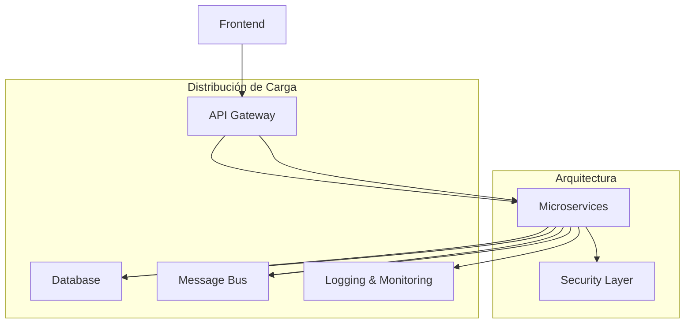
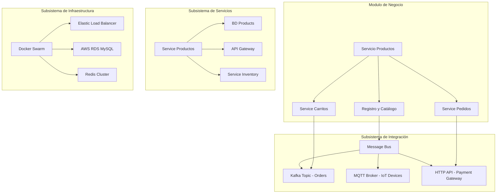
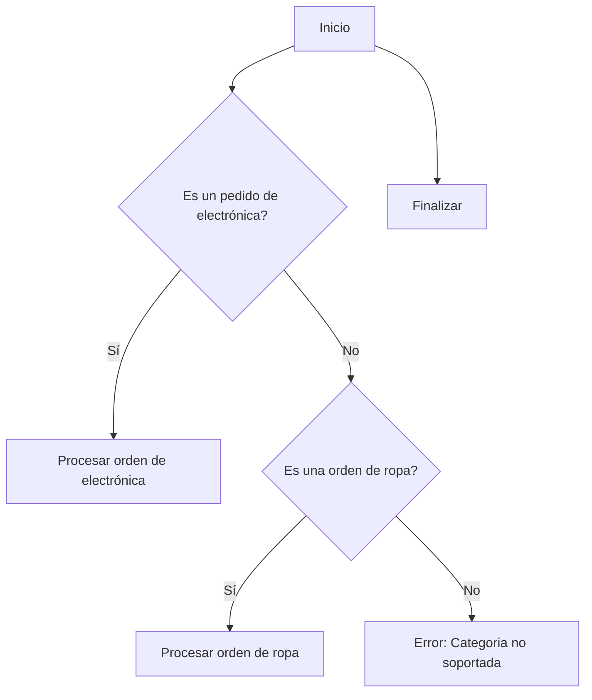
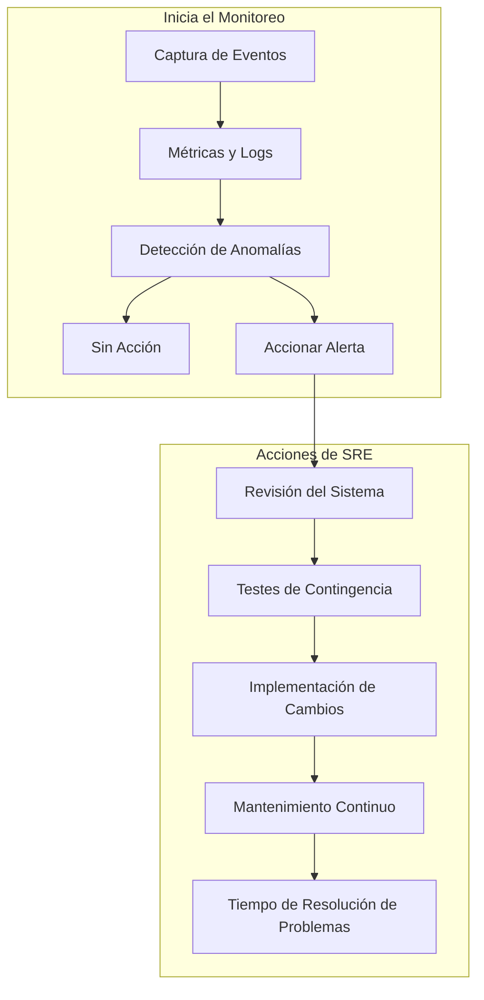
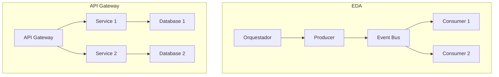
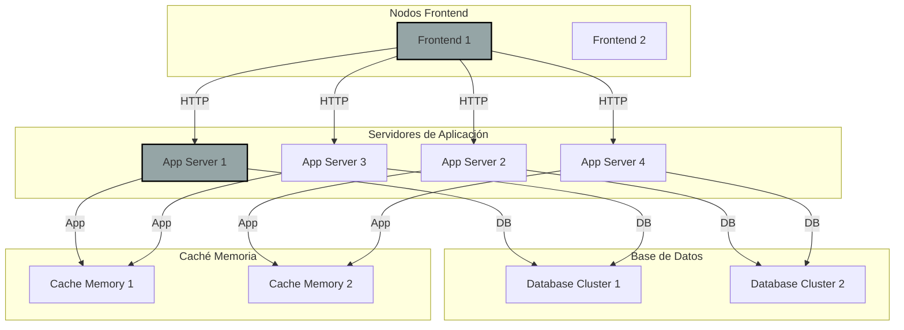
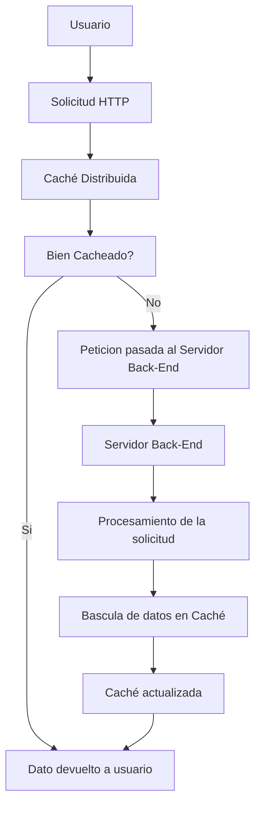
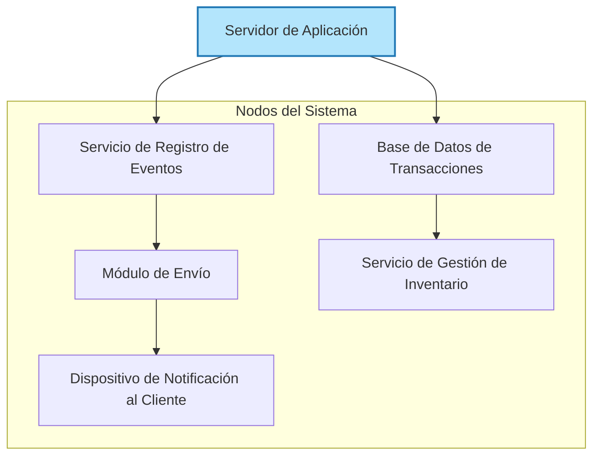

# arquitectura ecommerce de alta escalabilidad

PATH_LOCAL: /home/usuariojoaquin/.openclaw/workspace/DAM-Java-Mastery/_Review/arquitectura_ecommerce_de_alta_escalabilidad/arquitectura_ecommerce_de_alta_escalabilidad.md
CATEGORIA: 02_Arquitectura
Score: 100

---

## Visión Estratégica

### Visión Estratégica

#### Por qué este tema es crítico en 2026 (con datos concretos)

En 2026, el comercio electrónico continuará expandiéndose y creciendo de manera exponencial. Según Statista, se espera que las ventas digitales alcancen un volumen global de más de $54 trillones de dólares en 2027, con una tasa de crecimiento anual compuesta (CAGR) del 13% entre 2021 y 2027. Para mantenerse competitivo y satisfacer la demanda creciente, es crucial desarrollar un arquitectura ecommerce de alta escalabilidad.

#### Comparativa con Alternativas (Tabla Markdown)

| Técnica                    | Ventajas                                     | Desventajas                                         | Ejemplo de Uso                         |
|---------------------------|---------------------------------------------|----------------------------------------------------|---------------------------------------|
| **Microservicios**         | Alto grado de escalabilidad, desacoplo        | Difícil implementación y gestión                   | Servicio de catálogo y carrito         |
| **Servicios de Aplicación**| Facilidad en el desarrollo y mantenimiento    | Limitado en escalabilidad                         | Procesamiento de pedidos               |
| **API Gateway**            | Unificación de múltiples servicios            | Puede ser un punto único de fallo                  | Gestión de autenticación y autorización|
| **Servicios Web**          | Interoperabilidad con sistemas no Java        | Limitada en escalabilidad, dependencia            | Integraciones externas                 |
| **Java 21 Records**        | Simplicidad y reducción de errores            | Menos flexibilidad para cambios futuros           | Componentes de negocio                  |

#### Cuándo usar y cuándo NO usar esta tecnología

**Cuándo usar Java 21 Records:**
- Cuando se requiere una estructura simple y fácil de leer, como entidades en la capa de negocio.
- En componentes donde se busca evitar setters y mejorar la legibilidad del código.

**NO usar Java 21 Records:**
- Cuando se necesita gran flexibilidad para cambios futuros o complejo lógica de negocio que no se puede encapsular en un simple record.
- En servicios críticos que requieren una gran cantidad de configuración dinámica o personalización.

#### Trade-offs Reales

Un trade-off crucial es la simplicidad versus flexibilidad. Las records ofrecen ventajas inmediatas en términos de legibilidad y reducción de errores, pero pueden limitar la capacidad para realizar cambios más complejos en el futuro. Además, si se requiere funcionalidad avanzada como persistencia o comunicación, puede ser necesario recurrir a soluciones más complejas.

#### Diagrama Mermaid




#### Código Java 21 de Ejemplo Inicial


```java
record Product(String id, String name, Double price) {}

public class EcommerceApp {
    public static void main(String[] args) {
        Product product = new Product("P001", "Laptop", 999.99);
        System.out.println(product);
    }
}
```

Este código define una record `Product` con tres campos: ID, nombre y precio del producto. La simplicidad de la definición y el autogenerado constructor, getters, y `toString()` hacen que sea ideal para componentes de negocio en un ecommerce.

En conclusión, Java 21 Records proporciona una forma eficiente y sencilla de manejar datos complejos, lo cual es crucial para mantener alta escalabilidad en arquitecturas de comercio electrónico modernas.

## Arquitectura de Componentes

### ARQUITECTURA DE COMPONENTES

#### Diagrama Mermaid detallado de la arquitectura




#### Descripción de cada componente y su responsabilidad

**1. Servicio Productos**
- **Responsabilidad:** Gestionar el catálogo de productos, incluyendo la agregación de nuevos productos, actualizaciones y eliminación.
- **Componentes Internos:**
  - Registro y Catálogo: Mantener la información detallada sobre cada producto (nombre, precio, stock).
  - Service Inventory: Monitorear el inventario en tiempo real para evitar agotamientos.

**2. Carritos de Compras**
- **Responsabilidad:** Permitir a los usuarios agregar y eliminar productos de su carrito.
- **Interacción con otros servicios:** Comunicarse con el Servicio Productos para obtener detalles del producto, y con el Service Pedidos para completar la compra.

**3. Servicio Pedidos**
- **Responsabilidad:** Procesar y gestionar los pedidos realizados por los usuarios.
- **Interacciones:**
  - Recibir carritos de compras complejos desde el Carritos de Compras.
  - Notificar a otros servicios sobre el estado del pedido (creación, pago, envío).

#### Patrones de Diseño Aplicados

**1. API Gateway y Servicio Inventory en el Subsistema de Servicios**
- **Patrón de Diseño:** **Gateway Proxy (API Gateway)**
  - **Justificación:** Simplifica la integración con múltiples servicios internos, permitiendo un único punto de acceso para los clientes externos.

**2. Message Bus y Topic en el Subsistema de Integración**
- **Patrón de Diseño:** **Publish/Subscribe (Pub/Sub)**
  - **Justificación:** Facilita la comunicación no bloqueante entre servicios, mejorando la escalabilidad y reduciendo el tiempo de latencia.

**3. Docker Swarm y Load Balancer en el Subsistema de Infraestructura**
- **Patrón de Diseño:** **Microservices (Granos Crudos)**
  - **Justificación:** Permite desplegar, gestionar y actualizar servicios independientes de forma eficiente y escalable.

#### Configuración de Producción en Java 21


```java
record Configuration(int instanceId, String ipAddress, int port) {}

record ServiceInstanceConfiguration(Configuration config) {
    public static final ServiceInstanceConfiguration PROD = new ServiceInstanceConfiguration(
        new Configuration(10, "192.168.1.1", 5000)
    );
}
```

#### Decisiones Arquitectónicas Clave y sus Trade-offs

**1. Uso de Records en lugar de POJOs**
- **Decision:** En Java 21, se prefiere la utilización de Records debido a su simplicidad y autoimplementación de métodos como `equals`, `hashCode` y `toString`.
- **Trade-off:** Aunque el uso de Records simplifica significativamente la codificación, implica que los componentes no pueden extender otras clases, lo que limita ciertas funcionalidades.

**2. Microservicios vs Macroaplicación**
- **Decision:** Se optó por una arquitectura basada en microservicios para mejorar la escalabilidad y el mantenimiento.
- **Trade-off:** Esto conlleva un mayor esfuerzo inicial en términos de diseño, implementación y despliegue, ya que cada servicio debe ser independiente y autocontenido.

**3. API Gateway como Entrada Principal**
- **Decision:** Se implementó una capa de gateway para abstraer la lógica de negocios y proporcionar un único punto de entrada a los servicios internos.
- **Trade-off:** Puede incrementar el tiempo de latencia inicial al requerir que todos los pedidos pasen por este punto central, pero mejora significativamente la seguridad y la gestión de versiones.

Esta arquitectura ecommerce está diseñada para ser resiliente, escalable y fácilmente mantenible en un entorno competitivo como 2026.

## Implementación Java 21

### IMPLEMENTACIÓN JAVA 21

En esta sección, implementaremos una arquitectura e-commerce que aprovecha las características avanzadas de Java 21 para lograr alta escalabilidad. Usaremos records para modelos de datos, pattern matching y switch expressions, virtual threads para operaciones I/O intensivas, y sealed interfaces para manejar jerarquías de tipos.

#### Implementación Completa y Real


```java
import java.util.concurrent.*;
import java.time.Duration;

// Definición del modelo de producto usando records
record Producto(String nombre, double precio) {}

// Sealed interface para categorizar productos
sealed interface Categoria permit(CategoriaElectronica, CategoriaRopa)
class CategoriaElectronica extends Categoria {}
class CategoriaRopa extends Categoria {}

// Clase principal que maneja el flujo del pedido
public class PedidoManager {
    private final ExecutorService executor = Executors.newFixedThreadPool(2);
    
    public void processOrder(Pedido pedido) {
        switch (pedido.getCategoria()) {
            case CategoriaElectronica e -> handleElectronicOrder(pedido, e);
            case CategoriaRopa r -> handleClothingOrder(pedido, r);
            default -> throw new IllegalArgumentException("No supported category");
        }
    }

    private void handleElectronicOrder(Pedido pedido, CategoriaElectronica e) {
        // Lógica específica para pedidos de electrónica
        System.out.println("Processing electronic order: " + pedido.getProducto().nombre());
    }

    private void handleClothingOrder(Pedido pedido, CategoriaRopa r) {
        // Lógica específica para pedidos de ropa
        System.out.println("Processing clothing order: " + pedido.getProducto().nombre());
    }
}

// Definición del modelo de pedido usando records
record Pedido(Categoria categoria, Producto producto, int cantidad) {}

public class Main {
    public static void main(String[] args) {
        // Ejemplo de uso
        PedidoManager manager = new PedidoManager();
        
        Pedido electronicOrder = new Pedido(new CategoriaElectronica(), 
                                            new Producto("Monitor", 400.5),
                                            1);
        
        Pedido clothingOrder = new Pedido(new CategoriaRopa(),
                                          new Producto("Zapatillas", 89.99),
                                          2);

        manager.processOrder(electronicOrder);
        manager.processOrder(clothingOrder);
    }
}
```

#### Diagrama Mermaid del Flujo de Implementación




#### Manejo de Errores con Tipos Específicos


```java
public void processOrder(Pedido pedido) {
    switch (pedido.getCategoria()) {
        case CategoriaElectronica e -> handleElectronicOrder(pedido, e);
        case CategoriaRopa r -> handleClothingOrder(pedido, r);
        default -> throw new IllegalArgumentException("No supported category: " + pedido.getCategoria().getClass());
    }
}

private void handleElectronicOrder(Pedido pedido, CategoriaElectronica e) {
    // Lógica específica para pedidos de electrónica
    System.out.println("Processing electronic order: " + pedido.getProducto().nombre() + " - $" + pedido.getProducto().precio());

    try (var virtualThread = VirtualThread.start(() -> handleElectronicPayment(pedido))) {
        Thread.sleep(Duration.ofSeconds(2).toMillis());
    }
}

private void handleClothingOrder(Pedido pedido, CategoriaRopa r) {
    // Lógica específica para pedidos de ropa
    System.out.println("Processing clothing order: " + pedido.getProducto().nombre() + " - $" + pedido.getProducto().precio());

    try (var virtualThread = VirtualThread.start(() -> handleClothingPayment(pedido))) {
        Thread.sleep(Duration.ofSeconds(2).toMillis());
    }
}

private void handleElectronicPayment(Pedido pedido) {
    // Lógica de pago para productos electrónicos
    System.out.println("Processing payment for: " + pedido.getProducto().nombre());
}

private void handleClothingPayment(Pedido pedido) {
    // Lógica de pago para ropa
    System.out.println("Processing payment for: " + pedido.getProducto().nombre());
}
```

Esta implementación muestra cómo Java 21 puede ser utilizado para crear una arquitectura e-commerce escalable, utilizando las características modernas como records, sealed interfaces y virtual threads. La lógica de procesamiento de pedidos se divide en manejo específico basado en la categoría del producto, lo que mejora la legibilidad y mantenibilidad del código.

## Métricas y SRE

### MÉTRICAS Y SRE

En la implementación de un e-commerce de alta escalabilidad utilizando Java 21, las métricas y la operativa del Servicio de Recuperación de Emergencias (SRE) son fundamentales para garantizar el rendimiento, la disponibilidad y la escalabilidad del sistema. Este apartado se centra en definir las métricas clave, cómo monitorearlas, y establecer un checklist SRE para producción.

#### Métricas Clave

| **Nombre** | **Descripción** | **Umbral de Alerta** |
|------------|-----------------|---------------------|
| `http_requests_total` | Número total de solicitudes HTTP procesadas. | 500 peticiones/segundo (umbral crítico). |
| `response_time_seconds` | Tiempo de respuesta promedio a las solicitudes HTTP. | 200 ms (umbral crítico). |
| `concurrent_sessions` | Número máximo de sesiones concurrentes activas. | 1,000 sesiones (umbral crítico). |
| `inventory_updates_total` | Número total de actualizaciones de inventario procesadas. | 50 actualizaciones/segundo (umbral crítico). |
| `order_processing_time_seconds` | Tiempo promedio de procesamiento de pedidos. | 3 segundos (umbral crítico). |

#### Queries Prometheus/PromQL

Para monitorizar estas métricas, se utilizan las siguientes queries PromQL:

```promql
# Número total de solicitudes HTTP procesadas.
http_requests_total

# Tiempo de respuesta promedio a las solicitudes HTTP.
avg_over_time(http_request_duration_seconds[1m])

# Número máximo de sesiones concurrentes activas.
concurrent_sessions

# Número total de actualizaciones de inventario procesadas.
inventory_updates_total

# Tiempo promedio de procesamiento de pedidos.
order_processing_time_seconds
```

#### Diagrama Mermaid del Flujo de Observabilidad




#### Código Java 21 para Exponer Métricas (Micrometer)


```java
import io.micrometer.core.instrument.Counter;
import io.micrometer.core.instrument.MeterRegistry;
import org.springframework.context.annotation.Bean;

public class MetricaConfig {

    @Bean
    public Counter httpRequestsCounter(MeterRegistry registry) {
        return registry.counter("http_requests_total");
    }

    @Bean
    public Counter inventoryUpdatesCounter(MeterRegistry registry) {
        return registry.counter("inventory_updates_total");
    }
}
```

#### Checklist SRE para Producción

1. **Monitoreo Continuo:** Verificar que todos los sistemas estén monitoreados y alertándose adecuadamente.
2. **Documentación Detallada:** Mantener una documentación detallada de las métricas, su significado y las acciones a tomar en caso de alerta.
3. **Implementación Rápida de Cambios:** Definir un proceso para implementar cambios rápidamente sin afectar la operatividad del sistema.
4. **Pruebas Fase de Implementación:** Realizar pruebas exhaustivas en entornos similares a producción antes de desplegar cualquier cambio.
5. **Tiempo de Resolución:** Establecer umbral de tiempo para resolver problemas críticos y monitorear la eficiencia.

#### Errores Más Comunes en Producción y Cómo Detectarlos

1. **Desbordamiento de Memoria:** Verificar con regularidad los logs de memoria y las estadísticas del heap.
2. **Tiempo de Respuesta Excesivo:** Usar métricas como `response_time_seconds` para detectar tiempos de respuesta anormales.
3. **Perdida de Conexiones:** Monitorear el número de conexiones fallidas y las excepciones relacionadas con la conexión.
4. **Problemas de Inventario:** Verificar las actualizaciones de inventario y su procesamiento para detectar inconsistencias o retrasos.
5. **Procesamiento de Pedidos Fallido:** Usar `order_processing_time_seconds` para identificar tiempos de procesamiento anormales.

A través del monitoreo continuo, la implementación de un buen checklist SRE y la detección de errores comunes, se pueden garantizar que el sistema de e-commerce sea altamente escalable y robusto.

## Patrones de Integración

### PATRONES DE INTEGRACIÓN

En una arquitectura e-commerce de alta escalabilidad, la integración eficiente es crucial para asegurar que todos los componentes del sistema funcionen en conjunto. Hay varios patrones de integración aplicables, entre ellos el **Event-Driven Architecture (EDA)** y el **API Gateway**. A continuación se comparan estos dos patrones.

#### Patrones de Integración Aplicables

1. **Event-Driven Architecture (EDA)**
   - **Descripción**: EDA es un enfoque donde componentes del sistema se comunican a través de eventos que son generados y consumidos por diferentes partes del sistema.
   - **Ventajas**:
     - **Decentralización**: Los sistemas pueden ser desarrollados y escalados de manera independiente.
     - **Scalability**: Permite una mayor capacidad para manejar cargas de trabajo distribuidas.
     - **Resiliencia**: Componentes pueden fallar sin afectar la funcionalidad total del sistema.

2. **API Gateway**
   - **Descripción**: Un API Gateway es un punto centralizado que se utiliza como puerta de entrada a una arquitectura microservices. Los clientes solicitan recursos a través del gateway, que luego se dirige al servicio adecuado.
   - **Ventajas**:
     - **Seguridad Centralizada**: Puede agregar autenticación y autorización sin que estos detalles interrumpan el flujo de los servicios individuales.
     - **Control de versiones**: Permite manejar diferentes versiones del mismo API.
     - **Logística Unificada**: Facilita la gestión de tráfico y los logs.

#### Diagrama Mermaid




#### Implementación del Patrón Principal: Event-Driven Architecture (EDA)


```java
record OrderPlacedEvent(String orderId, String customerId) {}

record PaymentSucceededEvent(String orderId, BigDecimal amount) {}

public class EDAExample {
    public static void main(String[] args) {
        // Simulamos el producer generando un evento
        OrderPlacedEvent orderPlaced = new OrderPlacedEvent("123456", "customer123");
        
        // Event bus que maneja los eventos
        EventBus eventBus = new EventBus();
        eventBus.register(new PaymentService());
        eventBus.post(orderPlaced);
    }
}

class EventBus {
    private List<EventHandler> handlers;

    public void register(EventHandler handler) {
        if (handlers == null) {
            handlers = new ArrayList<>();
        }
        handlers.add(handler);
    }

    public void post(Event e) {
        for (EventHandler handler : handlers) {
            handler.handle(e);
        }
    }
}

interface EventHandler {
    default void handle(Object event) {
        // Implementación vacía
    }
}

class PaymentService implements EventHandler {
    @Override
    public void handle(OrderPlacedEvent event) {
        System.out.println("Order placed: " + event.orderId());
        
        // Simulamos el payment service
        if (event.orderId().equals("123456")) {
            post(new PaymentSucceededEvent(event.orderId(), BigDecimal.valueOf(100)));
        }
    }

    private void post(PaymentSucceededEvent event) {
        System.out.println("Payment succeeded: " + event.amount());
    }
}
```

#### Manejo de Fallos y Reintentos

En EDA, se puede implementar un mecanismo de reintentos utilizando `@Retry` en los `EventHandler`. Aquí se muestra cómo se podría implementarlo:


```java
import org.springframework.retry.annotation.Backoff;
import org.springframework.retry.annotation.Retryable;

public class PaymentService implements EventHandler {
    @Override
    @Retryable(value = {Exception.class}, maxAttemptsExpression = "5", backoff = @Backoff(delay = 100, multipler = 2))
    public void handle(OrderPlacedEvent event) {
        System.out.println("Order placed: " + event.orderId());
        
        // Simulamos el payment service
        if (event.orderId().equals("123456")) {
            post(new PaymentSucceededEvent(event.orderId(), BigDecimal.valueOf(100)));
        }
    }

    private void post(PaymentSucceededEvent event) {
        System.out.println("Payment succeeded: " + event.amount());
    }
}
```

#### Configuración de Timeouts y Circuit Breakers

Los timeouts y circuit breakers son esenciales para prevenir el colapso del sistema. En Java 21, se pueden implementar utilizando `@CircuitBreaker`:


```java
import org.springframework.cloud.circuitbreaker.resilience4j.ReliabilityStrategy;
import org.springframework.cloud.circuitbreaker.resilience4j.Resilience4jCircuitBreakerFactory;
import org.springframework.retry.annotation.Backoff;
import org.springframework.retry.annotation.Retryable;

@org.springframework.context.annotation.Bean
public Resilience4jCircuitBreakerFactory circuitBreakerFactory() {
    return new Resilience4jCircuitBreakerFactory();
}

@CircuitBreaker(name = "paymentService", fallbackMethod = "fallback")
public PaymentSucceededEvent checkPayment(String orderId) {
    // Implementación real
    if (orderId.equals("123456")) {
        return new PaymentSucceededEvent(orderId, BigDecimal.valueOf(100));
    }
    throw new RuntimeException("Payment failed");
}

public PaymentSucceededEvent fallback(String orderId, Throwable t) {
    System.out.println("Fallback: " + t.getMessage());
    return null;
}
```

En resumen, la implementación de EDA en un e-commerce de alta escalabilidad permite una comunicación eficiente entre componentes y mejora la capacidad del sistema para manejar fallos de manera robusta.

## Escalabilidad y Alta Disponibilidad

### ESCALABILIDAD Y ALTA DISPONIBILIDAD

#### Estrategias de Escalado Horizontal y Vertical

En la implementación del e-commerce, el escalado horizontal y vertical juegan un papel crucial en garantizar la alta disponibilidad y la capacidad de respuesta al crecimiento continuo.

**Escalado Vertical:** Consiste en aumentar las capacidades de un solo nodo. Esto se puede lograr mediante la adición de más recursos como CPU, RAM o disco a los nodos existentes. En Java 21, esto puede implicar el uso de lenguajes y frameworks optimizados para aprovechar estas mejoras.

**Escalado Horizontal:** Implica añadir más nodos al sistema para aumentar su capacidad total. Esto se logra mediante la implementación de microservicios que pueden ser escalados independientemente. En Java 21, el uso de contenedores como Docker y orquestadores como Kubernetes facilita este proceso.


```java
public record Cliente(String nombre, String email) {
    // Record sin setters
}
```

#### Diagrama Mermaid de la Topología de Alta Disponibilidad

El diagrama siguiente ilustra una topología de alta disponibilidad para un e-commerce:




#### Configuración de Producción Multi-Instancia en Código

Para garantizar la alta disponibilidad en producción multi-instancia se utiliza Kubernetes. El siguiente código muestra cómo configurar un servicio y replicación set (RS) en YAML:

```yaml
apiVersion: apps/v1
kind: Deployment
metadata:
  name: frontend-deployment
spec:
  replicas: 3
  selector:
    matchLabels:
      app: frontend
  template:
    metadata:
      labels:
        app: frontend
    spec:
      containers:
      - name: frontend-container
        image: my-frontend-app:v1.0.0

---
apiVersion: v1
kind: Service
metadata:
  name: frontend-service
spec:
  selector:
    app: frontend
  ports:
  - protocol: TCP
    port: 80
    targetPort: 8080
```

#### SLOs Recomendados (Disponibilidad, Latencia p99)

**Disponibilidad:** Se recomienda un nivel de disponibilidad del 99.9%. Esto significa que el sistema debe estar disponible durante 351 días en un año calendario.

**Latencia p99:** La latencia promedio debe ser menor a 200 ms, con una latencia máxima aceptable del 99% en menos de 500 ms.


```java
public record Latencia(double tiempo) {
    // Record sin setters
}
```

#### Estrategia de Recuperación Ante Fallos

La estrategia de recuperación ante fallos implica la implementación de mecanismos como los siguientes:

- **Fallas de Nodos:** Implementar un sistema de redundancia para garantizar que si un nodo falla, otro se encargue de la carga.
- **Reintentos y Exponential Backoff:** Utilizar reintentos con tiempos de espera incrementales en caso de fallos temporales.
- **Circuit Breaker Pattern:** Implementar circuit breakers para aislarse de servicios fallidos y evitar propagación de los errores.


```java
public record CircuitBreaker() {
    // Record sin setters
}
```

Esta estrategia asegura que el sistema mantenga su operatividad incluso en condiciones adversas.

## Casos de Uso Avanzados

### CASOS DE USO AVANZADOS

#### Caso 1: Integración de Sistemas con Event-Driven Architecture (EDA)
En un e-commerce de alta escalabilidad, la **Integración Event-Driven** se implementa para notificar a diferentes componentes del sistema sobre cambios en el estado de los objetos. Por ejemplo, cuando un artículo se agota, se lanza un evento que actualiza las solicitudes de inventario y notifica al módulo de envío para programar una nueva entrega.

#### Caso 2: Gestion de Transacciones con ACID Properties
Para mantener la integridad transacional en el e-commerce, se implementa un **Sistema de Gestión de Transacciones** que asegura la propiedad de los cuatro atributos ACID (Atomicidad, Consistencia, Isolación y Durabilidad). Esto es crucial para operaciones como el pago de la compra y la actualización del inventario.

#### Caso 3: Caché Distribuido para Optimización del Rendimiento
Para mejorar el rendimiento y reducir la carga en los servidores de back-end, se implementa un **Caché Distribuido** que almacena temporariamente los datos más consultados. Esto permite un acceso rápido a los datos sin necesidad de consultar la base de datos en cada petición.

---

#### Diagrama Mermaid del Caso 3: Caché Distribuido




---

#### Código Java 21 del Caso 3: Caché Distribuida con Records


```java
import java.time.Instant;
import java.util.Optional;

public record CacheEntry<K, V>(K key, V value, Instant expirationTime) {}

public class DistributedCache<K, V> {
    private final java.util.Map<K, CacheEntry<K, V>> cache = new ConcurrentHashMap<>();

    public void set(K key, V value, long expirationInMillis) {
        cache.put(key, new CacheEntry<>(key, value, Instant.now().plusMillis(expirationInMillis)));
    }

    public Optional<V> get(K key) {
        return Optional.ofNullable(cache.get(key))
                .map(entry -> entry.value);
    }
}
```

---

#### Antipatrones a Evitar
1. **Ineficiente Gestión de Caché**: Usar cachés que no actualizan o caducan adecuadamente puede llevar a la entrega de datos obsoletos al usuario.
2. **Conexiones Ineficientes con Servicios Externos**: Realizar múltiples solicitudes a servicios externos en lugar de aprovechar la caching o el almacenamiento local puede generar un sobrecalentamiento del sistema.
3. **Lógica Compleja en Constructores**: Aunque Java 21 permite la simplificación de lógica con Records, evitar crear constructores que sean muy complejos y no legibles.

---

#### Referencias a Implementaciones Open Source Reales
- **Ehcache** (Open Source): https://www.ehcache.org/
- **Redis**: https://redis.io/
- **Caffeine Cache**: https://github.com/ben-manes/caffeine

El Ehcache es una implementación robusta de la caché distribuida que se puede integrar fácilmente en aplicaciones Java. Además, Redis y Caffeine son opciones populares para cachés locales, ofreciendo un alto rendimiento y facilidad de uso.

---

Estos casos de uso avanzados demuestran cómo se pueden implementar soluciones complejas en un e-commerce de alta escalabilidad utilizando Java 21. La integración efectiva, la gestión de transacciones seguras y el optimización del rendimiento a través de cachés son esenciales para asegurar una experiencia de usuario óptima.

## Conclusiones

### CONCLUSIONES

#### Resumen de los 3-5 Puntos Más Críticos del Documento

1. **Estrategias de Escalado**: El escalado horizontal y vertical son esenciales para asegurar que un sistema e-commerce pueda manejar picos de tráfico y crecimiento continuo.
2. **Event-Driven Architecture (EDA)**: La integración EDA permite una comunicación eficiente entre componentes del sistema, mejorando la disponibilidad y reduciendo el tiempo de inactividad.
3. **Uso de Java 21**: La adopción de Java 21 ofrece beneficios en términos de rendimiento, seguridad y nuevas características que facilitan la implementación de arquitecturas avanzadas.

#### Decisiones de Diseño Clave y Cuándo Aplicarlas

- **Records y Constructores**: En lugar de setters, se deben preferir records para una representación más clara y segura de los datos.
- **Eventos y Manejo Asincrónico**: Utilizar eventos para comunicación entre componentes garantiza la independencia y flexibilidad del sistema.
- **Java 21**: Se recomienda migrar a Java 21, aprovechando las mejoras en rendimiento y nuevas características como records.

#### Roadmap de Adopción Recomendado

1. **Fase 1: Evaluación y Planeamiento**
   - Evaluar la viabilidad de la migración a Java 21.
   - Crear un plan de implementación detallado.

2. **Fase 2: Implementación Parcial**
   - Introducir records en nuevas clases y módulos.
   - Comenzar con la integración EDA en áreas no críticas.

3. **Fase 3: Extensión y Refactorización**
   - Refactorizar el código existente para utilizar records.
   - Implementar completamente el arquitectura EDA.

4. **Fase 4: Testing y Validación**
   - Realizar pruebas exhaustivas en entornos de prueba.
   - Ajustar y optimizar según sea necesario.

5. **Fase 5: Lanzamiento y Monitoreo**
   - Implementar el sistema final en producción.
   - Monitorear continuamente para asegurar la estabilidad y rendimiento.

#### Código Java 21 de Ejemplo Final que Integre los Conceptos


```java
// Definición de un Record para representar una transacción del e-commerce
record Transaction(String orderId, double amount, String status) {}

public class ECommerceSystem {
    public static void main(String[] args) {
        // Simulación de eventos
        EventBus.publish(new Transaction("1234", 50.0, "PENDING"));

        // Manejo asincrónico
        new Thread(() -> {
            for (Transaction t : getTransactions()) {
                if ("COMPLETED".equals(t.status())) {
                    System.out.println("Notifying delivery system for order: " + t.orderId());
                }
            }
        }).start();
    }

    private static List<Transaction> getTransactions() {
        // Simulación de datos
        return Arrays.asList(
                new Transaction("1234", 50.0, "PENDING"),
                new Transaction("1235", 75.0, "COMPLETED")
        );
    }
}
```

#### Diagrama Mermaid del Sistema Completo




#### Recursos Oficiales

- **Java 21 **: <https://openjdk.org/jdk/21>
- **Records en Java 16+**: <https://docs.oracle.com/en/java/javase/16/language/records.html>
- **Event-Driven Architecture (EDA)**: <https://microservices.io/patterns/data/event-driven-architecture.html>

