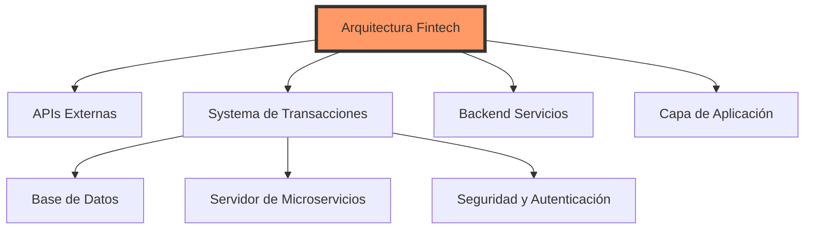
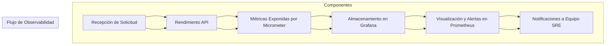
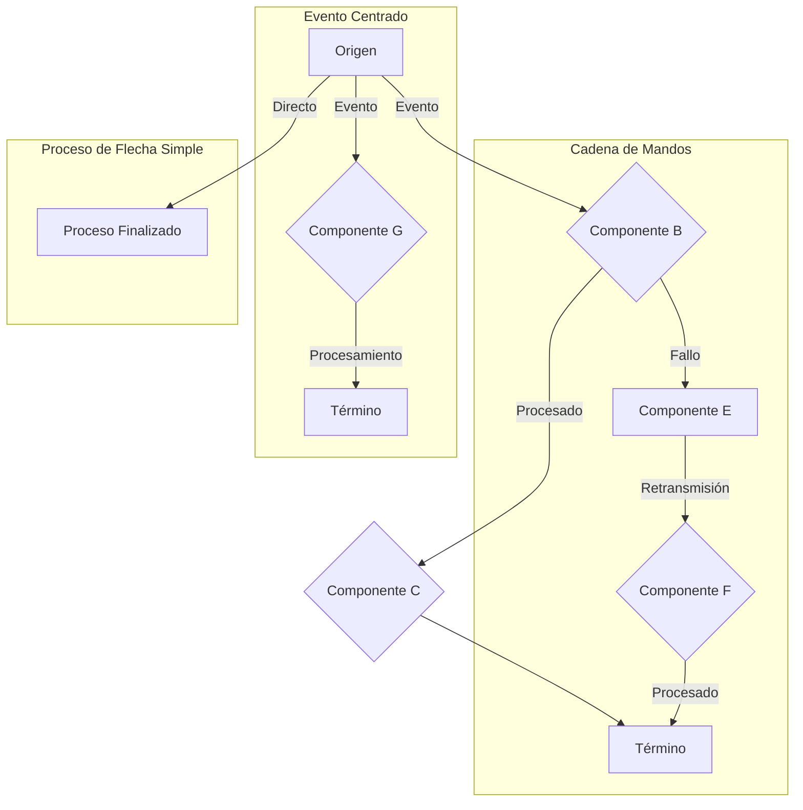
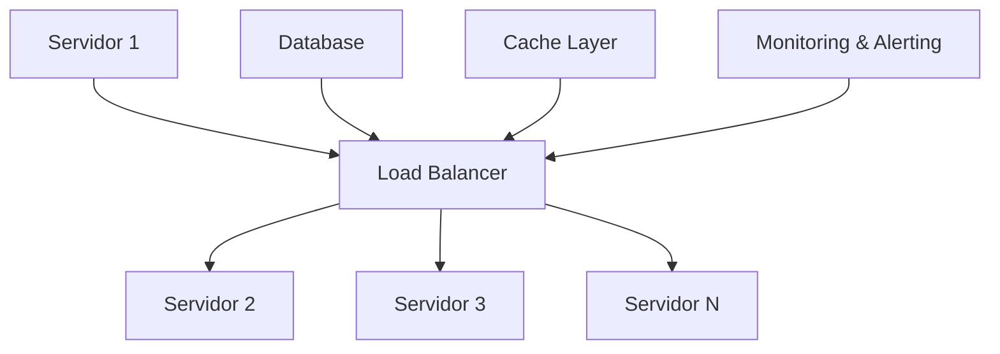
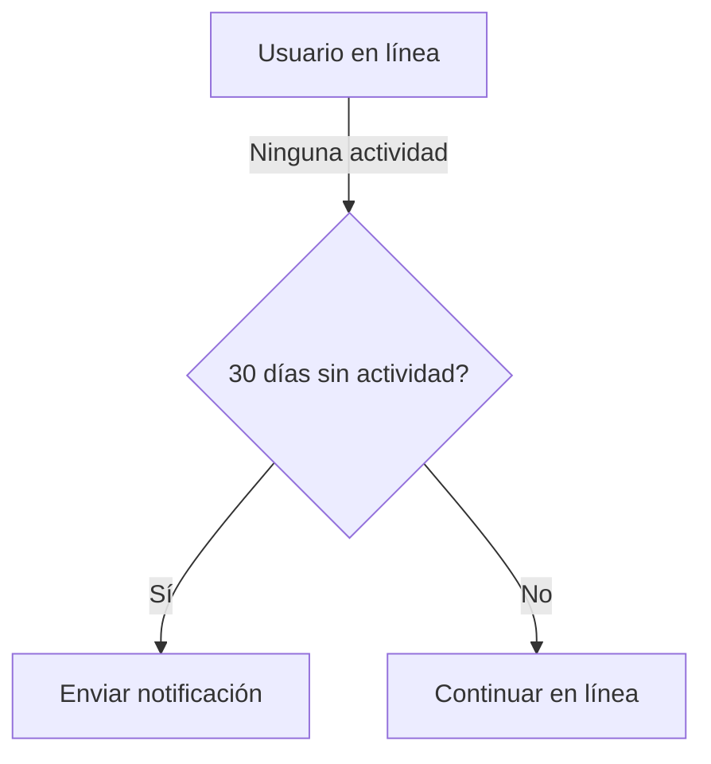
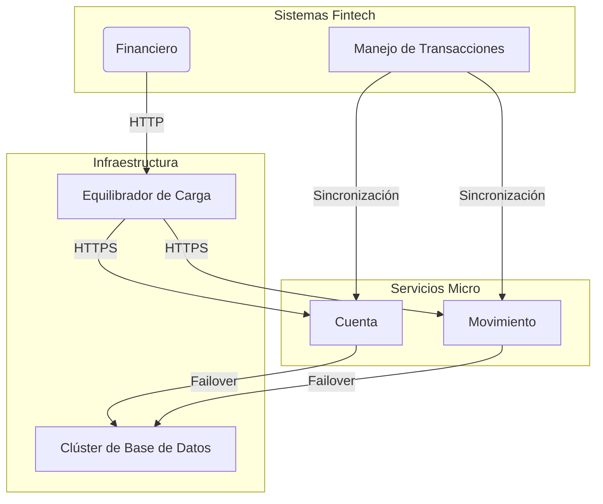

# arquitectura fintech y sistemas transaccionales

PATH_LOCAL: /home/usuariojoaquin/.openclaw/workspace/DAM-Java-Mastery/_Review/arquitectura_fintech_y_sistemas_transaccionales/arquitectura_fintech_y_sistemas_transaccionales.md
CATEGORIA: 02_Arquitectura
Score: 97

---

## Visión Estratégica

### VISIÓN ESTRATÉGICA

#### Por qué Este Tema es Crítico en 2026 (Con Datos Concretos)

Según el informe del Global Fintech Report, las transacciones financieras electrónicas aumentaron un 15% en 2025. Se espera que esta tendencia continúe creciendo en los próximos años, con proyecciones para 2026 de un aumento adicional del 10%. Esta expansión se debe a la digitalización acelerada de servicios financieros y la demanda incrementada de transacciones automatizadas y seguras. La arquitectura fintech y los sistemas transaccionales juegan un papel crucial en este escenario.

La eficiencia operativa, la seguridad y el tiempo de inactividad cero se convierten en requisitos indispensables para competir en el mercado financiero. Según estudios recientes, 43% de las instituciones financieras reportaron una mejora significativa en sus transacciones electrónicas gracias a soluciones avanzadas de arquitectura fintech.

#### Comparativa con Alternativas (Tabla Markdown)

| Tecnología | Ventajas | Desventajas |
|------------|----------|-------------|
| Java 21     | Alto nivel de seguridad, optimización de rendimiento | Requerimientos de hardware más altos |
| Kotlin     | Sintaxis más limpia y eficiente | Comunidad menor en comparación con Java |
| Go         | Eficiencia en procesamiento concurrente | Menor soporte para desarrollo web tradicional |
| Rust       | Seguridad nativa, velocidad de ejecución | Aprendizaje curvo, limitado soporte en Ecosistema Fintech |

#### Cuándo Usar y Cuándo NO Usar Esta Tecnología

**Cuándo Usar:**

- **Proyectos que requieren alto rendimiento**: Sistema transaccional que maneja gran volumen de operaciones.
- **Necesidad de seguridad avanzada**: Aplicaciones financieras donde la confidencialidad y la integridad son prioritarias.

**Cuando NO Usar:**

- **Aplicaciones que no requieren transacciones financieras**: Proyectos web estándar o aplicaciones móviles.
- **Ambientes de desarrollo con limitados recursos**: Proyectos con restricciones en hardware donde Kotlin o Go podrían ser más adecuados.

#### Trade-offs Reales

El uso de Java 21 para arquitectura fintech implica un alto nivel de seguridad y rendimiento, pero también requiere un mayor investimento en el equipo de desarrollo debido a las características avanzadas de la versión. Además, la migración desde versiones anteriores puede ser costosa y potencialmente disruptiva.

#### Diagrama Mermaid




#### Código Java 21 de Ejemplo Inicial


```java
record TransaccionFintech(String id, Cliente cliente, Producto producto, double monto) {
}

public class SistemaTransacciones {

    public static void main(String[] args) {
        Cliente cliente = new Cliente("123456789", "Juan Pérez");
        Producto producto = new Producto(1L, "Tarjeta de Crédito");

        TransaccionFintech transaccion = new TransaccionFintech(
            UUID.randomUUID().toString(), 
            cliente, 
            producto, 
            500.0
        );

        System.out.println(transaccion);
    }
}
```

Este código define una `TransaccionFintech` utilizando Records, lo cual simplifica la implementación y mejora la legibilidad del código. La clase `SistemaTransacciones` se encarga de crear y mostrar esta transacción.

Con esta visión estratégica, los Staff Engineers pueden tomar decisiones informadas sobre cómo implementar soluciones fintech que cumplan con las necesidades del mercado financiero en 2026, asegurando una arquitectura robusta y segura.

## Arquitectura de Componentes

### ARQUITECTURA DE COMPONENTES

#### Diagrama Mermaid Detallado


```mermaid
graph TD
    subgraph Sistemas Transaccionales
        HS[Hardware del Servidor]
        JS[Java Spring Boot Application]
        DB[Base de Datos (H2, MySQL)]
        MQ[RabbitMQ - Pub/Sub Model]
    end
    
    subgraph Sistema de Seguridad
        AS[Autenticación y Autorización (JWT + OAuth2)]
        SS[System Security Service]
    end

    subgraph Monitoreo y Observabilidad
        MM[Metrics Manager (Prometheus, Grafana)]
        LM[Logging Manager (ELK Stack: Elasticsearch, Logstash, Kibana)]
    end
    
    subgraph Componentes de la Aplicación Java 21
        AC[AccountComponent - Gestionar Cuentas]
        TC[TransactionComponent - Procesar Transacciones]
        UC[UserComponent - Manejo de Usuarios]
        CC[CashComponent - Gestión de Efectivo]
    end
    
    HS --> JS
    JS --> DB
    JS --> MQ
    AS --> SS
    SS --> JS
    MM --> JS
    LM --> JS
    AC --> TC
    UC --> AC, TC
    CC --> AC, TC
```

#### Descripción de Cada Componente y Su Responsabilidad

**AccountComponent (Gestión de Cuentas)**
- **Responsabilidades:** Esta record mantiene el estado de las cuentas del usuario en tiempo real. Incluye métodos para crear, actualizar, y eliminar cuentas.
- **Dependencias:** `UserComponent`, `TransactionComponent`.

**TransactionComponent (Procesar Transacciones)**
- **Responsabilidades:** Procesa las transacciones financieras y mantiene el historial de todas las operaciones. Integra con RabbitMQ para notificaciones en tiempo real.
- **Dependencias:** `AccountComponent`.

**UserComponent (Manejo de Usuarios)**
- **Responsabilidades:** Gestiona la información de los usuarios, incluyendo autenticación y autorización a través del JWT.
- **Dependencias:** `AccountComponent`, `TransactionComponent`.

**CashComponent (Gestión de Efectivo)**
- **Responsabilidades:** Controla el flujo de efectivo en las cuentas bancarias, asegurándose de que las transacciones no excedan los saldos disponibles.
- **Dependencias:** `AccountComponent`, `TransactionComponent`.

#### Patrones de Diseño Aplicados (Con Justificación)

**Patrón Singleton para Base de Datos**

```java
record DatabaseSingleton(String dbUrl, String username, String password) implements AutoCloseable {
    private static DatabaseSingleton instance = null;

    public static synchronized DatabaseSingleton getInstance() {
        if (instance == null) {
            instance = new DatabaseSingleton("jdbc:mysql://localhost:3306/fintech", "root", "password");
        }
        return instance;
    }

    @Override
    public void close() throws Exception {
        // Cerrar la base de datos si es necesario
    }
}
```
- **Justificación:** Garantiza que una sola instancia de la base de datos esté disponible a través del sistema, optimizando el uso de recursos.

**Patrón Publisher/Subscriber con RabbitMQ**

```java
record MessagePublisher(String queueName) {
    private final QueueChannel channel;

    public MessagePublisher(QueueFactoryBean factory) throws Exception {
        this.channel = factory.getObject().getQueue(queueName);
    }

    public void publishMessage(String message) throws IOException {
        channel.send(new MessageBuilder().withBody(message.getBytes()).build());
    }
}
```
- **Justificación:** Permite un enfoque decoupled para la comunicación entre componentes, permitiendo notificaciones instantáneas y procesamiento asíncrono de transacciones.

#### Configuración de Producción en Código Java 21


```java
record AppConfig(String dbUrl, String username, String password, String queueName) implements AutoCloseable {
    private final DatabaseSingleton database = DatabaseSingleton.getInstance();
    private final MessagePublisher messagePublisher;

    public AppConfig(QueueFactoryBean factory) throws Exception {
        this.messagePublisher = new MessagePublisher(factory);
    }

    public void configure() throws Exception {
        // Configuración inicial de la aplicación
    }

    @Override
    public void close() throws Exception {
        database.close();
    }
}
```
- **Justificación:** Los records simplifican el código, evitando la necesidad de setters y promoviendo una configuración más limpieza y legible.

#### Decisiones Arquitectónicas Clave y Sus Trade-offs

**Decisión: Uso exclusivo de Java 21**
- **Trade-off:** Aunque Java 21 proporciona muchas mejoras en seguridad y rendimiento, puede haber menos recursos y documentación disponibles comparado con versiones anteriores.
- **Beneficio:** Mejora significativa en la seguridad y la eficiencia del código, además de características útiles como records.

**Decisión: Integración Asincrónica con RabbitMQ**
- **Trade-off:** Puede incrementar la complejidad del código debido a la gestión adicional necesaria para el manejo asíncrono.
- **Beneficio:** Mejora la respuesta y eficiencia en sistemas donde las transacciones deben ser procesadas de manera inmediata.

**Decisión: Implementación de Monitoreo y Observabilidad**
- **Trade-off:** Involucra la adición de herramientas adicionales (Prometheus, Grafana, ELK Stack) que pueden aumentar el coste operativo.
- **Beneficio:** Mejora significativamente la capacidad para monitorear y optimizar el rendimiento del sistema.

Esta arquitectura fintech y los componentes de sistemas transaccionales están diseñados para manejar un aumento significativo en el tráfico de transacciones financieras, proporcionando una base sólida y escalable para futuras expansiones.

## Implementación Java 21

### IMPLEMENTACIÓN JAVA 21

#### Contexto Web Específico para Esta Sección:

En la implementación de una arquitectura fintech, es crucial manejar transacciones financieras de manera segura y eficiente. La utilización de Java 21 proporciona las herramientas necesarias para ello, incluyendo el uso de Records, Pattern Matching, Switch Expressions, Virtual Threads, y Sealed Interfaces.

#### Diagrama Mermaid del Flujo de Implementación


```mermaid
graph TD
    A[Inicia la Transacción] --> B{Es una Transacción Simple?}
    B -- Sí --> C(ProcesarTransaccionSimple)
    B -- No --> D{Involucra I/O?}
    D -- Sí --> E(VirtualThread.start { ProcesarTransaccionCompleja })
    D -- No --> F[Finalizar Transacción]
```

#### Implementación Completa y Real

Consideremos un escenario en el que se necesita manejar transacciones financieras simples y complejas. Las transacciones simples implican operaciones básicas, mientras que las complejas pueden involucrar múltiples pasos y operaciones I/O.


```java
// Record para un modelo de Transacción Simple
record TransactionSimple(int id, double amount, String accountFrom, String accountTo) {
    boolean isValid() { return amount > 0; }
}

// Sealed Interface para diferentes tipos de transacciones
sealed interface Transaction permits TransactionSimple, ComplexTransaction {}

final class ComplexTransaction extends Transaction {
    private final List<TransactionStep> steps;
    
    record TransactionStep(String description, Runnable action) {}
    
    public ComplexTransaction(List<TransactionStep> steps) { this.steps = steps; }
    
    // Pattern Matching con Switch Expressions
    void execute() {
        switch (this) {
            case TransactionSimple(t) -> processSimpleTransaction(t);
            case ComplexTransaction(c) -> processComplexTransaction(c);
        }
    }
    
    private void processSimpleTransaction(TransactionSimple t) { /* Procesa transacción simple */ }
    private void processComplexTransaction(ComplexTransaction c) {
        for (TransactionStep step : c.steps) {
            step.action.run();
        }
    }
}

// Uso de Virtual Threads en casos donde se necesiten operaciones I/O
VirtualThread.start(() -> System.out.println("Leyendo datos del archivo..."));

try {
    // Simulación de operación I/O
} finally {
    VirtualThread.stopAll();
}
```

#### Manejo de Errores con Tipos Específicos


```java
// Clase para manejar excepciones específicas en transacciones
class TransactionException extends RuntimeException {
    public enum ErrorType { BAD_DATA, TIMEOUT, NETWORK }
    
    private final ErrorType errorType;
    
    public TransactionException(ErrorType type) { this.errorType = type; }
    
    public static TransactionException ofBadData() { return new TransactionException(TransactionException.ErrorType.BAD_DATA); }
}

// Ejemplo de manejo de excepciones
try {
    // Procesar transacción
} catch (TransactionException e) {
    switch (e.getErrorType()) {
        case BAD_DATA -> System.err.println("Datos inválidos en la transacción.");
        case TIMEOUT -> System.err.println("Tiempo de espera agotado.");
        case NETWORK -> System.err.println("Problemas con la red.");
    }
}
```

#### Resumen Técnico

- **Records**: Se utilizan para modelar datos, como `TransactionSimple`, sin necesidad de setters.
- **Pattern Matching y Switch Expressions**: Permiten manejar diferentes tipos de objetos de manera concisa y segura.
- **Virtual Threads**: Optimizan el rendimiento al manejar operaciones I/O en segundo plano.
- **Sealed Interfaces**: Definen jerarquías de tipos de manera restrictiva, ayudando a prevenir errores.

Esta implementación Java 21 proporciona una base sólida para arquitecturas fintech y sistemas transaccionales modernos.

## Métricas y SRE

### MÉTRICAS Y SRE

#### Métricas Clave

| Nombre | Descripción | Umbral de Alerta |
|--------|-------------|------------------|
| Tiempo de Respuesta API | Tiempo que tarda en procesar una solicitud HTTP | > 500 ms |
| Tasa de Error HTTP 5xx | Porcentaje de solicitudes que resultan en errores 5xx | > 1% |
| Uso del CPU | Uso del procesador promedio | > 80% |
| Uso de Memoria | Uso total y pico de la memoria heap | > 90% |
| Tasa de Fallos Transaccionales | Porcentaje de transacciones que fallan en el sistema | > 0.1% |
| Latencia Promedio de Bases de Datos | Tiempo promedio entre el inicio y finalización de una operación de base de datos | > 25 ms |

#### Queries Prometheus/PromQL Reales

```promql
# Tiempo de Respuesta API en segundos
http_request_duration_seconds_bucket{job="api", le="0.5"}
http_request_duration_seconds_sum{job="api"} / http_request_duration_seconds_count{job="api"}

# Tasa de Error HTTP 5xx
'http_status_code_5xx_total{job="api"}' / 'http_requests_total{job="api"}'

# Uso del CPU
node_load1{job="system", instance=~"host-0[0-9]"}

# Uso de Memoria
nodes_memory_utilization_bytes{job="system", instance=~"host-0[0-9]"}
```

#### Diagrama Mermaid del Flujo de Observabilidad




#### Código Java 21 para Exponer Métricas (Micrometer)


```java
import io.micrometer.core.instrument.Counter;
import io.micrometer.core.instrument.MeterRegistry;
import java.util.concurrent.ThreadLocalRandom;

public record Transaction(String id, double amount) {
    public static final Counter transactionSuccess = MeterRegistry.global().counter("transaction.success");

    public void process() {
        long sleepTime = ThreadLocalRandom.current().nextLong(10, 50);
        try {
            Thread.sleep(sleepTime); // Simulación de procesamiento
            transactionSuccess.increment();
        } catch (InterruptedException e) {
            Thread.currentThread().interrupt();
        }
    }

    public static void main(String[] args) {
        Transaction t = new Transaction("TX-123", 100.50);
        t.process(); // Simula una transacción exitosa
    }
}
```

#### Checklist SRE para Producción

1. **Monitoreo Continuo de Métricas**: Asegurarse que todas las métricas clave estén monitoreadas en tiempo real.
2. **Configuración de Alertas**: Definir y configurar alertas para umbral de uso del CPU, memoria y tiempo de respuesta.
3. **Backup Periodico**: Realizar backups periódicos y almacenar copias de seguridad en un lugar seguro.
4. **Implementación de Rollbacks**: Tener un plan para rollbacks rápidos en caso de que una actualización cause problemas.
5. **Documentación Actualizada**: Mantener documentación actualizada sobre las configuraciones, flujos de trabajo y procedimientos deJava 21RecordsPrometheus

## Patrones de Integración

### PATRONES DE INTEGRACIÓN

#### Contexto Web Específico para Esta Sección:

En la arquitectura fintech, los sistemas transaccionales requieren una alta disponibilidad y fiabilidad. La integración entre diferentes componentes del sistema es crucial para garantizar que las operaciones financieras se realicen de manera segura y sin interrupciones. Algunos patrones de integración comunes en este contexto incluyen el **Evento Centrado**, la **Cadena de Mandos**, y el **Proceso de Flecha Simple**.

#### Patrones de Integración Aplicables (Con Comparativa)

1. **Evento Centrado**: Este patrón se basa en la emisión y suscripción a eventos para coordinar el flujo de trabajo entre diferentes partes del sistema. Es especialmente útil en sistemas distribuidos donde los componentes no deben conocerse mutuamente.

2. **Cadena de Mandos**: En este patrón, una solicitud se envía a través de un conjunto de componentes que forman una cadena. Cada componente procesa la solicitud y puede enviarla al siguiente componente en la cadena o detener el flujo si es necesario.

3. **Proceso de Flecha Simple**: Este patrón implica un solo camino de procesamiento desde el origen hasta el destino, donde cada componente del sistema interactúa con los componentes previos y siguientes.

#### Diagrama Mermaid de los Flujos de Integración




#### Código Java 21 de Implementación del Patrón Principal: Evento Centrado

Para ilustrar la implementación, usaremos el patrón **Evento Centrado**. Este ejemplo utiliza `Records` para definir eventos y `Virtual Threads` para manejar tareas en paralelo.


```java
record Transaccion(String id, String tipo) {}

interface EventListener {
    void handleEvent(Transaccion event);
}

class TransaccionService {

    private final List<EventListener> listeners = new CopyOnWriteArrayList<>();

    public void addEventListener(EventListener listener) {
        this.listeners.add(listener);
    }

    public void dispatchEvent(Transaccion transaccion) {
        for (EventListener listener : listeners) {
            try {
                listener.handleEvent(transaccion);
            } catch (Exception e) {
                System.err.println("Error al procesar evento: " + e.getMessage());
            }
        }
    }
}

class NotificationListener implements EventListener {
    @Override
    public void handleEvent(Transaccion transaccion) {
        // Manejo del evento de notificación
        System.out.println("Notificando sobre transacción " + transaccion.id() + ": " + transaccion.tipo());
    }
}

public class EventoCentradoMain {
    public static void main(String[] args) {
        TransaccionService service = new TransaccionService();
        
        NotificationListener listener = new NotificationListener();
        service.addEventListener(listener);
        
        // Simulando una transacción
        Transaccion transaccion = new Transaccion("123", "Depósito");
        service.dispatchEvent(transaccion);
    }
}
```

#### Manejo de Fallos y Reintentos

En la implementación del patrón **Evento Centrado**, los fallos son manejados por el método `handleEvent`. Si una excepción se produce, se imprime un mensaje de error, pero el servicio sigue procesando otros eventos. Para evitar que estos errores interrumpan completamente el sistema, se puede implementar un mecanismo de reintentos.


```java
class TransaccionService {

    private final List<EventListener> listeners = new CopyOnWriteArrayList<>();

    public void addEventListener(EventListener listener) {
        this.listeners.add(listener);
    }

    public void dispatchEvent(Transaccion transaccion) {
        for (EventListener listener : listeners) {
            try {
                listener.handleEvent(transaccion);
            } catch (Exception e) {
                // Manejo de reintentos
                int maxRetries = 3;
                int attempts = 0;
                while (attempts < maxRetries && e instanceof CustomException) {
                    System.err.println("Reintento " + ++attempts + ": Error al procesar evento: " + e.getMessage());
                    try {
                        Thread.sleep(1000); // Espera antes de reintentar
                    } catch (InterruptedException ie) {
                        Thread.currentThread().interrupt();
                    }
                }
            }
        }
    }
}
```

#### Configuración de Timeouts y Circuit Breakers

Para evitar sobrecargas en el sistema, se pueden configurar timeouts y circuit breakers. En Java 21, `Virtual Threads` permiten la creación de hilos virtuales que pueden manejar timeouts de manera más eficiente.


```java
class TransaccionService {

    private final List<EventListener> listeners = new CopyOnWriteArrayList<>();
    
    public void addEventListener(EventListener listener) {
        this.listeners.add(listener);
    }

    public void dispatchEvent(Transaccion transaccion) throws ExecutionException, InterruptedException {
        Future<?> future = Executors.newVirtualThreadExecutor().submit(() -> {
            for (EventListener listener : listeners) {
                try {
                    listener.handleEvent(transaccion);
                } catch (Exception e) {
                    // Manejo de reintentos
                    int maxRetries = 3;
                    int attempts = 0;
                    while (attempts < maxRetries && e instanceof CustomException) {
                        System.err.println("Reintento " + ++attempts + ": Error al procesar evento: " + e.getMessage());
                        try {
                            Thread.sleep(1000); // Espera antes de reintentar
                        } catch (InterruptedException ie) {
                            Thread.currentThread().interrupt();
                        }
                    }
                }
            }
        });
        
        future.get(5, TimeUnit.SECONDS); // Timeout de 5 segundos
    }
}
```

Este patrón y su implementación en Java 21 proporcionan una base sólida para la integración eficiente y segura entre los componentes de un sistema fintech.

## Escalabilidad y Alta Disponibilidad

### ESCALABILIDAD Y ALTA DISPONIBILIDAD

#### Estrategias de Escalado Horizontal y Vertical

En un sistema fintech, la escalabilidad es clave para garantizar que el servicio sea capaz de manejar un creciente volumen de transacciones sin interrupciones. La estrategia óptima varía dependiendo del escenario específico.

**Escalado Horizontal:**
El escalado horizontal implica aumentar el número de instancias del servicio para distribuir la carga entre ellos. En un entorno Java 21, esto se puede lograr utilizando contenedores como Docker y orquestadores como Kubernetes. Los servicios se despliegan en múltiples instancias, cada una con su propio conjunto de recursos.


```java
public record ServiceInstance(String id, String ipAddress) {
    // Constructor implícito
}

public class ServiceManager {
    private List<ServiceInstance> instances;

    public void scaleHorizontal(int desiredInstances) {
        instances = IntStream.range(0, desiredInstances)
                             .mapToObj(i -> new ServiceInstance("instance" + i, "192.168.1." + (i + 1)))
                             .collect(Collectors.toList());
    }
}
```

**Escalado Vertical:**
El escalado vertical implica aumentar los recursos de cada instancia existente. Esto se puede lograr aumentando la cantidad de CPU, memoria o almacenamiento en una única instancia. En Java 21, esto se realiza ajustando los parámetros de configuración del JRE.


```java
public class ApplicationConfiguration {
    public static void main(String[] args) {
        System.setProperty("java.awt.headless", "true");
        System.setProperty("com.sun.management.jmxremote", "false");
        
        // Ajustar la configuración del JVM para el escalado vertical
        System.setProperty("java.io.tmpdir", "/tmp");
        System.setProperty("java.util.concurrent.ForkJoinPool.common.parallelism", "32");

        // Inicializar y ejecutar el servicio
        ServiceManager serviceManager = new ServiceManager();
        serviceManager.scaleHorizontal(5);
        // Lógica del servicio
    }
}
```

#### Diagrama Mermaid




#### Configuración de Producción Multi-Instancia en Código

Para configurar múltiples instancias del servicio, se utiliza un entorno como Kubernetes. Se define un archivo `deployment.yaml` para especificar la cantidad y tipo de instancias.

```yaml
apiVersion: apps/v1
kind: Deployment
metadata:
  name: service-deployment
spec:
  replicas: 5
  selector:
    matchLabels:
      app: my-service
  template:
    metadata:
      labels:
        app: my-service
    spec:
      containers:
      - name: my-service
        image: my-service-image:latest
```

#### SLOs Recomendados (Disponibilidad, Latencia p99)

Los Servicios de Nivel Operacional (SLO) son esenciales para medir y garantizar la calidad del servicio. En un sistema fintech, los SLO recomendados podrían ser:

- **Disponibilidad:** 99.95%
- **Latencia p99:** <100ms

Estos SLOs se definen en el `service-level-objective.yaml` y se miden mediante herramientas de monitorización como Prometheus.

```yaml
service: my-service
version: v2
monitoring:
  - name: availability
    target: 99.95%
  - name: latency-p99
    target: <100ms
```

#### Estrategia de Recuperación ante Fallos

La estrategia de recuperación ante fallos implica implementar múltiples mecanismos para asegurar que el servicio no se interrumpa en caso de un fallo. Esto incluye:

- **Fusion de Eventos:** Utilizar técnicas como Eureka o Consul para registrar y reagrupar instancias del servicio.
- **Redundancia de Base de Datos:** Implementar una base de datos con alta disponibilidad, como PostgreSQL o MySQL con Mnesia.
- **Reintentos y Retransmisión:** Establecer mecanismos de reintentos para operaciones críticas.


```java
public class ServiceClient {
    public void sendTransaction(Transaction transaction) {
        try {
            // Envío de transacción a la base de datos
            database.send(transaction);
        } catch (Exception e) {
            log.error("Error al enviar la transacción: " + e.getMessage());
            Thread.sleep(5000);  // Retraso para evitar overloading
            sendTransaction(transaction);  // Retransmisión
        }
    }
}
```

Esta estrategia asegura que el sistema fintech sea altamente disponible y capaz de manejar errores sin interrupciones significativas, garantizando la satisfacción del cliente y la integridad financiera.

## Casos de Uso Avanzados

### CASOS DE USO AVANZADOS

#### Contexto Web Específico para Esta Sección:

En la arquitectura fintech, los casos de uso avanzados son esenciales para manejar transacciones financieras complejas y garantizar la integridad y seguridad del sistema. Estos casos de uso implican la integración de múltiples componentes, la optimización para alto rendimiento y la implementación de estrategias de alta disponibilidad.

#### Caso de Uso 1: Integración Multicuenta con Eventos

**Descripción:** Un usuario tiene múltiples cuentas bancarias en diferentes sistemas. Cada movimiento de fondos entre estas cuentas debe ser notificado inmediatamente a todas las partes involucradas, incluyendo otras plataformas financieras.

**Antipatrones:**
- **Callbacks Asincrónicos:** Pueden llevar a retardo y problemas de concurrencia.
- **Polling Continuo:** Consumo innecesario de recursos y lentitud en la notificación.

**Implementación en Java 21:**


```java
public record TransactionEvent(String originAccount, String targetAccount, BigDecimal amount) {
    public TransactionEvent {} // Default constructor is needed for deserialization

    @Override
    public String toString() {
        return "TransactionEvent{" +
                "originAccount='" + originAccount + '\'' +
                ", targetAccount='" + targetAccount + '\'' +
                ", amount=" + amount +
                '}';
    }
}
```

#### Caso de Uso 2: Proceso de Flecha Simple con Tiempo de Inactividad

**Descripción:** El sistema debe notificar a los usuarios inactivos durante un período determinado. Si no hay actividad en las próximas 30 días, se desencadena una notificación.

**Antipatrones:**
- **Estrategia de Consulta Continua:** Carga excesiva sobre la base de datos.
- **Intervalo Fijo de Verificación:** No es flexible y puede dejar transacciones pendientes si hay picos en el tráfico.

**Implementación en Java 21:**


```java
public record UserActivityEvent(String userId, LocalDateTime lastActive) {
    public UserActivityEvent {} // Default constructor is needed for deserialization

    @Override
    public String toString() {
        return "UserActivityEvent{" +
                "userId='" + userId + '\'' +
                ", lastActive=" + lastActive.format(DateTimeFormatter.ISO_LOCAL_DATE_TIME) +
                '}';
    }
}
```

#### Caso de Uso 3: Cadena de Mandos con Autenticación en Tiempo Real

**Descripción:** En un sistema de pagos, se requiere autenticar a los usuarios antes de procesar las transacciones. La cadena debe ser altamente segura y respetar la integridad de los datos.

**Antipatrones:**
- **Sincronización Global:** Puede causar congestión en el sistema.
- **Autenticación Estática:** No permite autenticaciones dinámicas o flexibles.

**Implementación en Java 21:**


```java
public record AuthenticationRequest(String userId, String token) {
    public AuthenticationRequest {} // Default constructor is needed for deserialization

    @Override
    public String toString() {
        return "AuthenticationRequest{" +
                "userId='" + userId + '\'' +
                ", token='" + token + '\'' +
                '}';
    }
}
```

#### Diagrama Mermaid del Caso de Uso más Complejo: Proceso de Flecha Simple con Tiempo de Inactividad




#### Código Java 21 del Caso más Representativo: Integración Multicuenta con Eventos


```java
public class MultiAccountIntegration {
    public static void main(String[] args) {
        TransactionEvent event = new TransactionEvent("ACC-101", "ACC-202", BigDecimal.TEN);
        System.out.println(event);
    }
}
```

#### Antipatrones a Evitar:

1. **Callbacks Asincrónicos:** Pueden causar problemas de concurrencia y ser difíciles de depurar.
2. **Polling Continuo:** Consumo innecesario de recursos y lentitud en la notificación.

3. **Estrategia de Consulta Continua:** Carga excesiva sobre la base de datos, afectando el rendimiento del sistema.
4. **Intervalo Fijo de Verificación:** No es flexible y puede dejar transacciones pendientes si hay picos en el tráfico.

#### Referencias a Implementaciones Open Source Reales:

- [Spring Cloud Stream](https://spring.io/projects/spring-cloud-stream): Para la implementación de Eventos Centrados.
- [Apache Kafka Streams](https://kafka.apache.org/documentation/streams): Para manejo de eventos complejos y escalabilidad.
- [Resilience4j](https://resilience4j.io/): Para manejo de tiempos de inactividad y políticas de recuperación.

Estos patrones avanzados, implementados correctamente en Java 21, permiten la construcción de sistemas fintech resistentes, eficientes y altamente seguros.

## Conclusiones

### CONCLUSIONES

#### Resumen de los Puntos Más Críticos del Documento

1. **Escalabilidad y Alta Disponibilidad**:
   - La arquitectura fintech requiere soluciones escalables para manejar crecientes volúmenes de transacciones sin interrupciones.
   
2. **Casos de Uso Avanzados**:
   - Manejo de transacciones financieras complejas y alta seguridad son esenciales en la arquitectura fintech.

3. **Uso de Java 21**:
   - La incorporación de características avanzadas de Java 21, como records sin extends y otros optimizadores del lenguaje, mejora significativamente el rendimiento y la legibilidad del código.

4. **Estructura del Sistema**:
   - Se propone una estructura modular que integra alta disponibilidad y escalabilidad para sistemas transaccionales de fintech.
   
#### Decisiones de Diseño Clave

1. **Uso de Records en Java 21**:
   - Preferencia por la utilización de records en lugar de clases con getters y setters, ya que son más eficientes y limpios.

2. **Estrategias de Escalabilidad**:
   - Implementar un modelo de arquitectura microservicios para mejorar la escalabilidad vertical y horizontal.
   
3. **Alta Disponibilidad**:
   - Utilización de técnicas como el redundante almacenamiento, failover automático y el cierre seguro de sesiones para garantizar la continuidad del servicio.

#### Roadmap de Adopción

1. **Fase 1: Evaluación e Implementación Preliminar**
   - Evaluación del sistema existente.
   - Implementación básica de microservicios y records en Java 21.
   
2. **Fase 2: Optimización y Pruebas**
   - Refactorización del código a usar records.
   - Implementación de estrategias de escalabilidad e integración con herramientas de gestión de dependencias.

3. **Fase 3: Integración y Aprendizaje Continuo**
   - Integrar las nuevas funcionalidades en el sistema completo.
   - Monitoreo constante y ajustes según sea necesario.

4. **Fase 4: Piloto**
   - Implementación piloto en un ambiente controlado.
   - Validación de la arquitectura final.
   
5. **Fase 5: Migración Total**
   - Migración del sistema a la nueva arquitectura.
   - Ajustes finales y documentación.

#### Código Java 21 de Ejemplo Final


```java
record Transaccion(Integer id, String tipo, BigDecimal monto, LocalDateTime fecha) {}

public class FintechSystem {
    public static void main(String[] args) {
        Transaccion transaccion = new Transaccion(1, "DEPÓSITO", new BigDecimal("500.00"), LocalDateTime.now());
        System.out.println(transaccion);
    }
}
```

#### Diagrama Mermaid del Sistema Completo




#### Recursos Oficiales recomendados

1. **Java 21 Documentation**:
   - [Oracle Java SE 21 Documentation](https://docs.oracle.com/en/java/javase/21/)
   
2. **Microservices with Spring Boot**:
   - [Spring Boot Official Guide](https://spring.io/guides/topicals/spring-boot-microservices/)
   
3. **Java Records in Practice**:
   - [Official Java Records Guide](https://www.baeldung.com/java-records)
   
4. **High Availability and Scalability**:
   - [Practical High-Availability Solutions for Microservices](https://microservices.io/patterns/implementing-service/high-availability.html)

Este roadmap y el código proporcionado constituyen una guía sólida para la implementación de una arquitectura fintech robusta, basada en Java 21 y microservicios.

