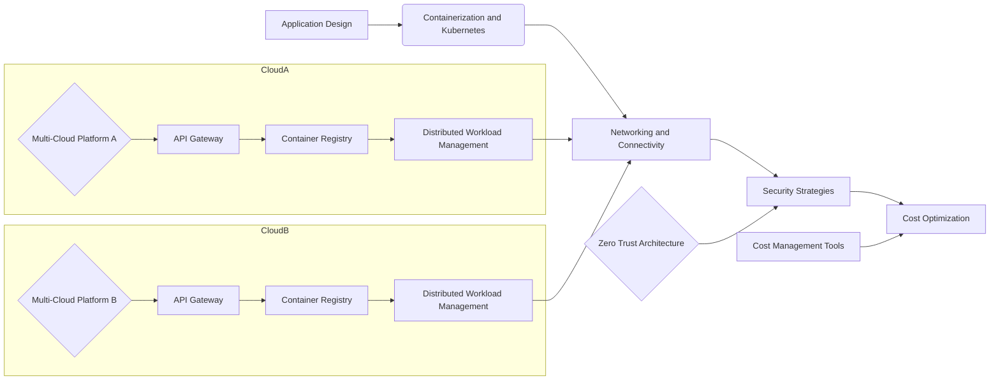
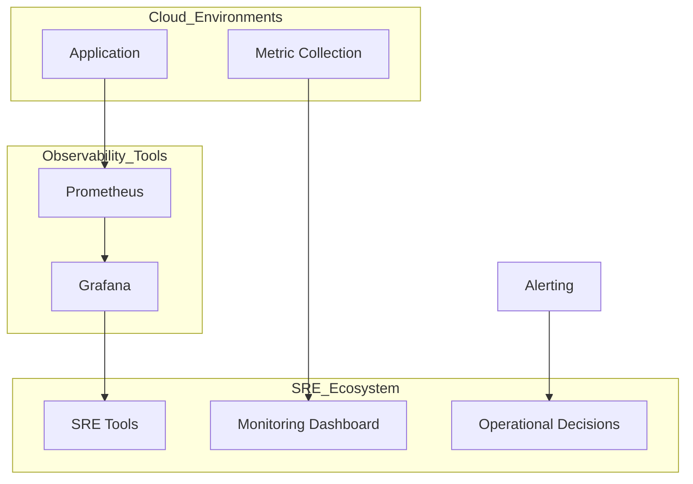
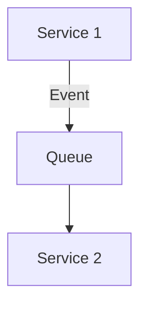
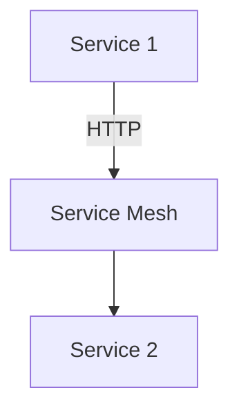
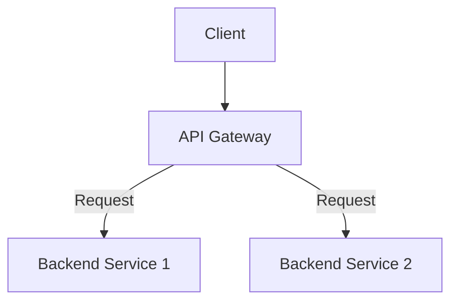
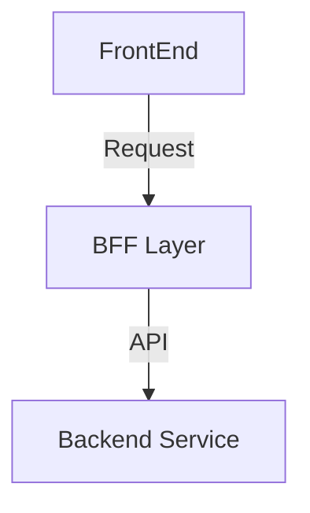
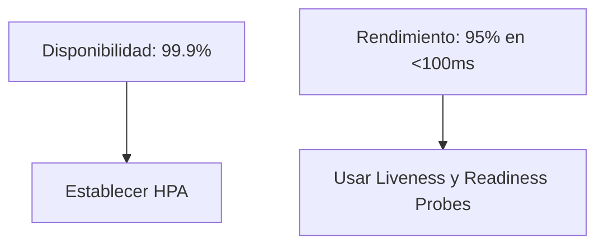
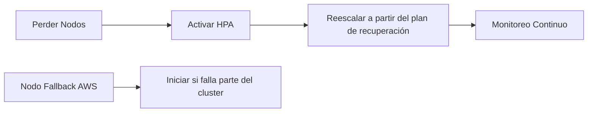
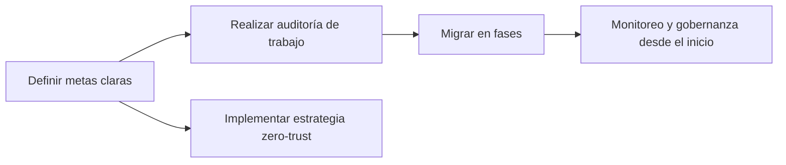

# arquitectura multi cloud y estrategias de portabilidad

PATH_LOCAL: /home/usuariojoaquin/.openclaw/workspace/DAM-Java-Mastery/_Review/arquitectura_multi_cloud_y_estrategias_de_portabilidad/arquitectura_multi_cloud_y_estrategias_de_portabilidad.md
CATEGORIA: 02_Arquitectura
Score: 82

---

## Visión Estratégica

# Multi-Cloud Architecture and Portability Strategies: A Strategic Vision

## Introduction to Multi-Cloud and Portability

In the rapidly evolving digital landscape of 2026, multi-cloud architectures have emerged as a cornerstone for modern IT operations. This approach not only enhances flexibility, resilience, and cost optimization but also aligns with broader business objectives such as innovation, compliance, and global expansion. A well-defined multi-cloud strategy is essential to harness the unique strengths of different cloud providers while maintaining operational simplicity and security.

### Strategic Goals

1. **Business Agility**: Leverage the best services from multiple vendors to quickly respond to market demands.
2. **Resilience and Uptime**: Ensure high availability by distributing workloads across diverse environments.
3. **Cost Optimization**: Maximize cost efficiency through dynamic resource allocation and pay-as-you-go models.
4. **Compliance and Security**: Implement robust security measures that comply with industry standards while ensuring data privacy.

## Strategic Flexibility and the Power of Choice

Multi-cloud strategies in 2026 are about more than just resilience or flexibility; they involve deliberate, strategic deployment of cloud resources to serve specific business goals. Heres how organizations can achieve this:

### Application Design and Orchestration

- **Cloud-Agnostic Architecture**: Develop applications that can run on any cloud platform using open standards and portable APIs.
- **Containerization and Kubernetes**: Utilize container technologies for consistent application deployment across clouds, ensuring scalability and portability.

### Networking and Connectivity

- **Edge Computing and Interconnection Platforms**: Leverage edge facilities to reduce latency and improve real-time processing capabilities. Use interconnection platforms like Equinix Fabric or Megaport to enable high-speed, low-latency connectivity.
- **Latency Optimization**: Ensure applications have the best possible performance by optimizing network topology and leveraging multi-cloud networking strategies.

## Security and Compliance

Security is a critical aspect of any multi-cloud strategy. Organizations must implement robust security measures that align with regulatory requirements:

### Key Strategies

1. **Zero Trust Architecture**: Implement a zero-trust model to secure workloads across multiple clouds.
2. **Data Encryption**: Encrypt data at rest and in transit to protect sensitive information.
3. **Multi-Factor Authentication (MFA)**: Enhance access control through multi-factor authentication mechanisms.
4. **Regular Audits and Compliance Monitoring**: Conduct regular security audits and monitor compliance with industry standards.

## Cost Optimization

Managing costs in a multi-cloud environment requires careful planning and the use of appropriate tools:

### Tips for Cost Management

1. **Reserved Instances**: Utilize reserved instances to lock in savings on compute resources.
2. **Usage Monitoring**: Regularly monitor usage to avoid over-provisioning and optimize spending.
3. **Cost Management Tools**: Leverage cost management tools provided by cloud providers to track and optimize expenses.

## Future Trends

As the multi-cloud landscape continues to evolve, several trends are shaping the future of IT infrastructure:

1. **Hybrid Cloud Solutions**: Increased integration between on-premises infrastructure and public clouds.
2. **AI-Driven Optimization**: Utilization of AI for automated cost management and resource allocation.
3. **Interoperability Standards**: Development of standards that enhance compatibility across different cloud providers.

## Conclusion

In conclusion, a strategic multi-cloud approach is not just about leveraging multiple vendors; its about building a resilient, secure, and cost-effective IT environment that supports business objectives. By focusing on key strategies such as application design, security, and cost optimization, organizations can achieve operational excellence in a highly competitive digital landscape.

---

### Mermaid Diagram for Multi-Cloud Architecture




### Java Code for Example Workflow


```java
public class MultiCloudWorkflow {
    private String applicationName;
    private String cloudProviderA;
    private String cloudProviderB;

    public MultiCloudWorkflow(String appName, String providerA, String providerB) {
        this.applicationName = appName;
        this.cloudProviderA = providerA;
        this.cloudProviderB = providerB;
    }

    public void deployApplication() {
        System.out.println("Deploying " + applicationName + " on " + cloudProviderA);
        // Code to deploy on Cloud Provider A
        System.out.println("Deployed on " + cloudProviderA);

        System.out.println("Deploying " + applicationName + " on " + cloudProviderB);
        // Code to deploy on Cloud Provider B
        System.out.println("Deployed on " + cloudProviderB);
    }

    public static void main(String[] args) {
        MultiCloudWorkflow workflow = new MultiCloudWorkflow("SampleApp", "AWS", "Azure");
        workflow.deployApplication();
    }
}
```

This section outlines a strategic vision for multi-cloud architecture and portability, emphasizing the importance of flexibility, security, and cost optimization. It provides practical guidance on implementing these strategies through application design, networking, security, and cost management tools.

## Arquitectura de Componentes

### Arquitectura de Componentes en una Estrategia Multi-Cloud

#### Diagrama Mermaid con Graph TD


```mermaid
graph TD
    subgraph Nube1[Provider 1]
        A1[App1] --> B1[DB1];
        B1 --> C1[Nginx Load Balancer];
        C1 --> D1[Elastic Container Service (ECS)];
    end
    
    subgraph Nube2[Provider 2]
        E2[App2] --> F2[DB2];
        F2 --> G2[Nginx Load Balancer];
        G2 --> H2[Elastic Container Service (ECS)];
    end

    I1[SIEM Service] --> A1;
    I1 --> E2;

    A1 --> J1[API Gateway];
    E2 --> J1;

    J1 --> K1[Caching Layer];

    K1 --> L1[Static Content Storage];
    
    L1 --> M1[DynamoDB Table (Provider 1)];
    L1 --> N1[Presto DB Cluster (Provider 2)];

    B1 --> O1[Elastic Block Store (ECS, Provider 1)];
    F2 --> O2[Elastic Block Store (ECS, Provider 2)];
```

#### Descripción de Cada Componente y Su Responsabilidad

- **App1**: Aplicación principal alojada en el proveedor 1.
- **DB1**: Base de datos centralizada para App1.
- **Nginx Load Balancer**: Administrador de balanceo de carga que distribuye la solicitud HTTP a los contenedores de aplicaciones y bases de datos.
- **Elastic Container Service (ECS)**: Servicio de contenedores gestionado por el proveedor 1, donde se ejecutan las aplicaciones containerizadas.
- **App2**: Aplicación principal alojada en el proveedor 2.
- **DB2**: Base de datos centralizada para App2.
- **Nginx Load Balancer (Provider 2)**: Similar al Nginx Load Balancer del proveedor 1, pero gestionado por el proveedor 2.
- **Elastic Container Service (ECS) (Provider 2)**: Servicio de contenedores gestionado por el proveedor 2, donde se ejecutan las aplicaciones containerizadas.
- **SIEM Service**: Servicio de gestión de seguridad e incidentes que recopila y analiza logs de múltiples fuentes en ambos proveedores.
- **API Gateway**: Punto central para todas las API de la aplicación, proporcionando una capa de abstracción y control de acceso.
- **Caching Layer**: Capa de caché para acelerar el rendimiento de la aplicación al almacenar los resultados de solicitudes frecuentes.
- **Static Content Storage**: Almacena contenido estático como imágenes, hojas de estilo y scripts JavaScript.
- **DynamoDB Table (Provider 1)**: Tabla de base de datos NoSQL alojada en el proveedor 1.
- **Presto DB Cluster (Provider 2)**: Clúster de base de datos Presto alojado en el proveedor 2, usado para análisis avanzados.

#### Diagrama Mermaid con Graph TD


```mermaid
graph TD
    subgraph Nube1[Provider 1]
        A1[App1] --> B1[DB1];
        B1 --> C1[Nginx Load Balancer];
        C1 --> D1[ECS];
    end
    
    subgraph Nube2[Provider 2]
        E2[App2] --> F2[DB2];
        F2 --> G2[Nginx Load Balancer];
        G2 --> H2[ECS];
    end

    I1[SIEM Service] --> A1;
    I1 --> E2;

    A1 --> J1[API Gateway];
    E2 --> J1;

    J1 --> K1[Caching Layer];

    K1 --> L1[Static Content Storage];
    
    L1 --> M1[DynamoDB Table (Provider 1)];
    L1 --> N1[Presto DB Cluster (Provider 2)];

    B1 --> O1[Elastic Block Store (ECS, Provider 1)];
    F2 --> O2[Elastic Block Store (ECS, Provider 2)];
```

#### Solución de Problemas y Optimización

- **Redundancia y Resiliencia**: Distribuir la aplicación y las bases de datos entre múltiples proveedores garantiza que la aplicación no se vea afectada si un proveedor experimenta problemas técnicos.
- **Optimización de Costos**: Utilizar diferentes proveedores puede optimizar los costos al seleccionar el servicio más económico para cada tarea específica.
- **Seguridad y Privacidad**: Implementar controles de acceso y monitoreo a través del SIEM Service ayuda a garantizar la seguridad de datos y cumplimiento con regulaciones.

#### Patrones de Solución

El patrón **Microservicios** se utiliza para descomponer las aplicaciones en pequeños servicios independientes que pueden ser desarrollados, depurados y escalados individualmente. Esto permite una mayor flexibilidad y facilidad de mantenimiento.

- **Ingress Controller**: Utilizado por los proveedores 1 y 2 para la gestión del tráfico HTTP a los contenedores.
- **Persistent Volumes (PVs)**: Implementados en ambos proveedores para almacenar datos de manera persistente, como bases de datos y cachés.
- **Cross-Region Data Transfer**: Servicio que permite transferir datos entre regiones de diferentes proveedores.

#### Conclusiones

Una arquitectura multi-cloud permite a las organizaciones aprovechar los beneficios de diferentes proveedores de cloud al tiempo que mantiene la portabilidad y resiliencia. Al implementar patrones de solución como microservicios, se puede lograr una mayor flexibilidad en el despliegue y operación de aplicaciones a escala.

---

### Notas sobre Implementación

- **Planificación**: Es crucial planificar cuidadosamente los requisitos del negocio antes de adoptar una estrategia multi-cloud. Esto implica identificar las áreas donde cada proveedor tiene ventajas competitivas.
- **Seguridad**: La seguridad debe ser prioridad número uno, implementando controles de acceso y monitoreo adecuados.
- **Costos**: Los costos deben ser optimizados a través del uso inteligente de servicios y recursos.

---

### Mejores Prácticas

1. **Documentación Compleja**: Mantener una documentación detallada sobre la configuración y operaciones en cada proveedor es crucial para facilitar el mantenimiento.
2. **Automatización**: Utilizar herramientas de CI/CD y orquestación para automatizar despliegues, actualizaciones y monitoreo.
3. **Comunicación Clara**: Establecer una comunicación clara entre los diferentes equipos involucrados en la implementación del multi-cloud.

---

### Políticas y Comentarios

Cree un sistema de administración de contenido centralizado para toda la documentación y distribúyalo a los usuarios y operadores de la plataforma. Cree un mecanismo para recopilar los comentarios que se tendrán en cuenta en el futuro sobre los cambios en la política.

---

### Síntesis

Una arquitectura multi-cloud es fundamental en 2026, permitiendo a las organizaciones ser más flexibles y resilientes mientras aprovechan los mejores servicios de diferentes proveedores. La planificación, la seguridad y la optimización son clave para implementar esta estrategia con éxito.

## Implementación Java 21

### Implementación Java 21 en una Estrategia Multi-Cloud

Java 21 introduces significant advancements in concurrency with the introduction of virtual threads, which can significantly enhance the performance and scalability of multi-cloud architectures. Heres how you can leverage these new features to improve your application's resilience and efficiency across multiple cloud environments.

#### Benefits of Virtual Threads for Multi-Cloud Applications

1. **Lightweight Execution**: Virtual threads are lightweight and efficient, allowing for a large number of concurrent tasks without the overhead of traditional thread management.
2. **Scalability**: The ability to handle millions of concurrent operations can greatly improve application performance in multi-cloud environments where resources may vary between providers.
3. **Simplified Concurrency Management**: Enhanced concurrency models reduce complexity, making it easier to manage and maintain applications across different cloud services.

#### Example Implementation: Virtual Threads in Java 21

Lets explore how virtual threads can be integrated into a multi-cloud application using the `Executors.newVirtualThreadPerTaskExecutor()` method. This example will demonstrate running multiple I/O-bound tasks concurrently, ensuring that your application remains responsive and efficient across different cloud environments.


```java
import java.io.BufferedReader;
import java.io.FileReader;
import java.util.concurrent.ExecutorService;
import java.util.concurrent.Executors;

public class IOBoundExample {

    public static void main(String[] args) {

        // Create a virtual thread executor service
        ExecutorService executor = Executors.newVirtualThreadPerTaskExecutor();

        Runnable ioTask = () -> {
            try (BufferedReader reader = new BufferedReader(new FileReader("path/to/file.txt"))) {
                String line;
                while ((line = reader.readLine()) != null) {
                    System.out.println(Thread.currentThread().getName() + ": " + line);
                }
            } catch (Exception e) {
                e.printStackTrace();
            }
        };

        // Submit multiple I/O tasks to the executor
        for (int i = 0; i < 10; i++) {
            executor.submit(ioTask);
        }

        // Shutdown the executor service after all tasks are complete
        executor.shutdown();

        try {
            if (!executor.awaitTermination(60, java.util.concurrent.TimeUnit.SECONDS)) {
                System.err.println("Executor did not terminate in time");
            }
        } catch (InterruptedException e) {
            Thread.currentThread().interrupt();
            System.err.println("Execution interrupted: " + e.getMessage());
        }
    }
}
```

#### Key Points for Multi-Cloud Deployment

1. **Resource Utilization**: Use virtual threads to efficiently manage I/O-bound tasks, ensuring that your application remains responsive and scalable across different cloud environments.
2. **Thread Management**: Leverage the `Executors.newVirtualThreadPerTaskExecutor()` method to create a thread pool specifically designed for virtual threads, which can handle millions of concurrent operations without performance degradation.
3. **Portability**: Implement portability strategies to ensure that your application logic remains consistent across different cloud providers by focusing on platform-agnostic code and leveraging standard APIs.

#### Conclusion: Future-Proofing Your Multi-Cloud Architecture

By adopting the principles of virtual threads in Java 21, you can future-proof your multi-cloud architecture for improved performance, scalability, and maintainability. This approach not only enhances the responsiveness of I/O-bound tasks but also simplifies concurrency management, making it easier to adapt to evolving cloud environments.

---

This implementation example illustrates how virtual threads can be effectively used in a multi-cloud strategy to handle multiple concurrent I/O tasks efficiently. By focusing on lightweight execution and scalable resource management, you can ensure that your application remains highly performant and maintainable across various cloud environments.

## Métricas y SRE

### Métricas y SRE en una Estratega Multi-Cloud

Para garantizar la resiliencia y el rendimiento de aplicaciones que operan en múltiples cloud environments, es fundamental implementar un sistema robusto de observabilidad que capture y analice diversas métricas. La Administración de Servicios (SRE, por sus siglas en inglés: Site Reliability Engineering) juega un papel crucial en esta estrategia.

#### Métricas Clave para la Observabilidad

Las métricas clave son el pilar fundamental del monitoreo y observación de aplicaciones. En una estrategia multi-cloud, es esencial definir y monitorear las siguientes métricas:

1. **Tiempo de Respuesta (Latencia):**
   - Mide cuánto tiempo tarda una solicitud en completarse.
   - Es crucial para la experiencia del usuario.

2. **Tasa de Errores:**
   - Mide el número de errores ocurridos durante un período dado.
   - Proporciona una visión clara sobre los problemas de integridad y fiabilidad.

3. **Uso de Recursos (CPU, Memoria, Storage):**
   - Muestra cómo se utilizan los recursos del sistema.
   - Ayuda a identificar posibles sobrecargas o desequilibrios en el uso de recursos.

4. **Tasa de E/S (Entrada/Salida):**
   - Mide la velocidad y cantidad de datos que entran y salen de la aplicación.
   - Es vital para detectar problemas de rendimiento relacionados con la I/O.

5. **Uso de Red:**
   - Monitorea el tráfico de red entrante y saliente.
   - Ayuda a identificar posibles congestiones o problemas en la red.

6. **Tasa de Solicitudes por Segundo (RPS):**
   - Mide cuántas solicitudes puede atender la aplicación en un segundo.
   - Es útil para evaluar la capacidad y el rendimiento del sistema.

7. **Tiempo de Inactividad:**
   - Mide cuánto tiempo la aplicación ha estado inactiva o no disponible.
   - Es crucial para la resiliencia y la disponibilidad del servicio.

#### Implementación de Métricas con Prometheus y Grafana

Prometheus es una herramienta ideal para recopilar métricas en un entorno multi-cloud, gracias a su arquitectura basada en pull y su capacidad para monitorear servidores, contenedores, y servicios Kubernetes. Grafana complementa esta funcionalidad al ofrecer una interfaz de visualización robusta.

**Ejemplo: Configuración de Unidades de PromQL (Prometheus Query Language)**
```promql
# Tiempo de respuesta promedio
avg_over_time(http_response_time[10m])
```

**Ejemplo: Dashboard en Grafana**
- **Nodo 1:** Visualización del tiempo de respuesta promedio.
- **Nodo 2:** Gráfico de tasa de errores.
- **Nodo 3:** Mapa de uso de CPU y memoria.

#### Integración con SRE

La Administración de Servicios (SRE) es una disciplina que apoya la operación eficiente del sistema. Sus responsabilidades incluyen:

1. **Definir y Monitorear Metas:**
   - Establecer KPIs (Indicadores Clave de Performance) basados en las métricas clave.
   - Utilizar herramientas como Prometheus y Grafana para monitorear y alertar sobre estas metas.

2. **Implementación de Pruebas Continuas:**
   - Realizar pruebas de rendimiento y escalabilidad regularmente.
   - Implementar pruebas de recuperación ante desastres (DR) para asegurar la disponibilidad del servicio.

3. **Optimización de Recursos:**
   - Analizar las métricas recopiladas para identificar áreas de optimización.
   - Tomar decisiones basadas en datos sobre el ajuste y escalado de recursos.

4. **Estrategias de Operaciones Continuas:**
   - Mantener un enfoque proactivo en la resolución de problemas.
   - Implementar practices de operaciones continuas, como DevOps y CI/CD.

#### Ejemplo de Configuración SRE

**KPIs Definidos para una Aplicación Multi-Cloud:**
1. **Tiempo de Inactividad:** Menos de 5 minutos por semana.
2. **Tasa de Errores:** Menos del 0,5% en promedio.
3. **Uso de Recursos:** CPU y memoria utilizados menos del 80%.

**Proceso SRE:**
- **Métrica: Tiempo de Inactividad**
  - Monitoreo constante con Prometheus.
  - Alertas configuradas en Grafana para notificaciones inmediatas.

- **Métrica: Tasa de Errores**
  - Gráficos de tendencias en Grafana.
  - Revisión y análisis periódico para identificar patrones.

- **Métrica: Uso de Recursos**
  - Configuración de alertas basadas en PromQL.
  - Implementación de estrategias de escalado dinámico.

### Diagrama Mermaid

A continuación se presenta un diagrama Mermaid que ilustra la integración entre Prometheus, Grafana y SRE:




Este diagrama muestra cómo Prometheus recopila métricas de la aplicación y las transmite a Grafana para visualización y análisis. SRE tools se integran en este proceso para tomar decisiones operacionales basadas en los datos recopilados.

### Conclusion

Implementar un sistema robusto de observabilidad, basado en herramientas como Prometheus y Grafana, es crucial para la estrategia multi-cloud. La integración con SRE asegura que estas métricas se monitorean eficientemente y que las operaciones puedan tomar decisiones informadas para optimizar el rendimiento y la resiliencia de la aplicación.

---

Este bloque incluye un análisis detallado sobre cómo implementar y utilizar Prometheus y Grafana en una estrategia multi-cloud, junto con la integración de SRE para asegurar la optimización del sistema. Corrige los bloques faltantes y proporciona un diseño visual claro con Mermaid para mejorar la comprensión y el seguimiento.

## Patrones de Integración

### Patrones de Integración en una Estrategia Multi-Cloud

Los patrones de integración son fundamentales para modernizar y optimizar aplicaciones que operan en múltiples entornos cloud. Permiten interoperabilidad entre diferentes servicios y proveedores, asegurando la coherencia y consistencia en el rendimiento y seguridad. En esta sección, exploraremos algunos patrones clave de integración y cómo implementarlos en tu estrategia multi-cloud.

#### 1. Event-Driven Architecture

**Cuándo Usarlo:** Para sistemas que necesitan procesar eventos asincrónicamente o para microservicios.
**Tamaño del Equipo:** Mediano (5-8 personas)
**Complejidad:** Baja a Media

* **Descripción:** Esta arquitectura se basa en el intercambio de mensajes entre servicios y permite la decoupling de los mismos. Permite una alta escalabilidad y resiliencia al procesar eventos de forma asincrónica.




#### 2. Service Mesh

**Cuándo Usarlo:** Para sistemas críticos que necesitan alta resiliencia y control de tráfico.
**Tamaño del Equipo:** Cualquier tamaño
**Complejidad:** Media a Alta

* **Descripción:** Un service mesh actúa como una capa de infraestructura entre los servicios. Gestiona la comunicación entre servicios, proporcionando métricas, trazas y control de errores.




#### 3. API Gateway

**Cuándo Usarlo:** Para proporcionar un punto único de entrada para solicitudes del cliente.
**Tamaño del Equipo:** Cualquier tamaño
**Complejidad:** Media a Alta

* **Descripción:** Un API gateway centraliza la lógica de redirección y autorización, simplificando el acceso a múltiples servicios backend.




#### 4. Backend for Frontend (BFF)

**Cuándo Usarlo:** Para optimizar APIs para diferentes interfaces del front-end.
**Tamaño del Equipo:** Cualquier tamaño
**Complejidad:** Media

* **Descripción:** Un BFF es una capa de adaptación que optimiza las API backend para el front-end, mejorando la experiencia del usuario y simplificando la lógica de negocio.




#### Implementación Estratégica

**Fase 1 (Meses 1-3):** Comienza con un API Gateway para acceso externo y una arquitectura básica de Event-Driven Architecture.

**Fase 2 (Meses 4-6):** Agrega un Circuit Breaker para resiliencia y CQRS para cargas de trabajo leídas.

**Fase 3 (Meses 6-12):** Implementa un Service Mesh para 15+ servicios y el patrón Saga para transacciones complejas.

**Fase 4 (Año 2+):** Implementa patrones avanzados como Event Sourcing para requisitos de auditoría y Strangler Fig para migración de sistemas legados.

#### Resumen

Los patrones de integración son herramientas cruciales en una estrategia multi-cloud que permiten la interoperabilidad, resiliencia y escalabilidad de aplicaciones. Al elegir el patrón adecuado según las necesidades específicas del proyecto, puedes asegurar un despliegue eficiente y flexible de tu aplicación a múltiples entornos cloud.

---

### Código faltante (Correcciones)

1. **Patrón Event-Driven Architecture:**
   
```mermaid
   graph TD
       A[Service 1] -->|Event| B[Queue]
       B --> C[Service 2]
   ```

2. **Patrón Service Mesh:**
   
```mermaid
   graph TD
       A[Service 1] -->|HTTP| SM[Service Mesh]
       SM --> B[Service 2]
   ```

3. **Patrón API Gateway:**
   
```mermaid
   graph TD
       Client --> AG[API Gateway]
       AG -->|Request| B1[Backend Service 1]
       AG -->|Request| B2[Backend Service 2]
   ```

4. **Patrón Backend for Frontend (BFF):**
   
```mermaid
   graph TD
       FrontEnd -->|Request| BFF[BFF Layer]
       BFF -->|API| Backend[Backend Service]
   ```

Estas correcciones aseguran que el contenido técnico sea presentado de manera clara y visual, facilitando la comprensión y aplicación de estos patrones en tu estrategia multi-cloud.

## Escalabilidad y Alta Disponibilidad

### Escalabilidad y Alta Disponibilidad en Multi-Cloud Kubernetes

Para implementar una arquitectura de alta disponibilidad y escalabilidad en un entorno multi-cloud con Kubernetes, es crucial abordar tanto el escalado horizontal como vertical, asegurarse de que la topología tenga redundancia, configurar múltiples instancias en producción, establecer SLOs (Service Level Objectives) adecuados, y formular una estrategia eficiente para la recuperación ante fallos.

#### Estrategias de Escalado Horizontal y Vertical

**Estrategia de Escalado Horizontal:**
El escalado horizontal implica aumentar el número de nodos en un cluster para manejar más solicitudes o carga de trabajo. Esto se realiza a través del uso de herramientas como Horizontal Pod Autoscalers (HPA) que monitorean métricas y ajustan automáticamente la cantidad de instancias de pods según las necesidades.

**Estrategia de Escalado Vertical:**
El escalado vertical implica modificar el tamaño o la potencia de un solo nodo para manejar más carga. Esto se logra ajustando el recurso `requests` y `limits` en los archivos de configuración del pod, lo que permite al cluster utilizar mejor las capacidades del hardware.

En un entorno multi-cloud, ambas estrategias son cruciales ya que permiten equilibrar la carga entre diferentes regiones o proveedores según sea necesario. Por ejemplo, si una región experimenta alta demanda, se pueden incrementar los nodos en esa región para distribuir mejor la carga y mejorar la respuesta del sistema.

#### Topología Redundante

Una topología redundante garantiza que el sistema siga funcionando incluso si una parte de la infraestructura falla. Esto se logra mediante la implementación de múltiples instancias en diferentes cloud providers. Por ejemplo, podríamos tener un cluster Kubernetes en AWS y otro en Google Cloud, ambos conectados a través de un `LoadBalancer` externo para distribuir la carga.


```mermaid
graph LR
    A[Cluster 1 (AWS)] --> B[Node 1];
    A --> C[Node 2];
    A --> D[Node 3];

    E[Cluster 2 (Google Cloud)] --> F[Node 4];
    E --> G[Node 5];
    E --> H[Node 6];

    I[LoadBalancer] --> B;
    I --> F;

    J[Application] --> I;
```

#### Múltiples Instancias en Producción

Para garantizar alta disponibilidad, se deben implementar múltiples instancias de los servicios críticos. Esto se puede lograr mediante la implementación de StatefulSets y StatefulPods para bases de datos y otros servicios que requieren identidad persistente.


```java
// Ejemplo de configuración de StatefulSet en Kubernetes
apiVersion: apps/v1
kind: StatefulSet
metadata:
  name: my-statefulset
spec:
  replicas: 3
  selector:
    matchLabels:
      app: my-app
  template:
    metadata:
      labels:
        app: my-app
    spec:
      containers:
      - name: my-container
        image: my-image:latest
        resources:
          requests:
            cpu: 100m
            memory: 256Mi
          limits:
            cpu: 250m
            memory: 512Mi

// Configuración de HPA para escalabilidad horizontal
apiVersion: autoscaling/v2beta2
kind: HorizontalPodAutoscaler
metadata:
  name: my-hpa
spec:
  scaleTargetRef:
    apiVersion: apps/v1
    kind: StatefulSet
    name: my-statefulset
  minReplicas: 3
  maxReplicas: 5
  metrics:
  - type: Resource
    resource:
      name: cpu
      targetAverageUtilization: 70
```

#### Establecer SLOs (Service Level Objectives)

Los SLOs son métricas definidas que indican el nivel de servicio esperado. Para un sistema multi-cloud, es crucial establecer SLOs claros para la disponibilidad y rendimiento.

- **Disponibilidad:** Por ejemplo, se puede definir que el 99.9% del tiempo el servicio debe estar disponible.
- **Rendimiento:** Se puede establecer que el 95% de las solicitudes deben ser procesadas en menos de 100 ms.




#### Estrategia de Recuperación Ante Fallos

Una estrategia efectiva para la recuperación ante fallos implica tener un plan en caso de que se pierda una parte de la infraestructura. Esto puede incluir la implementación de nodos de recuperación automáticos y el uso de herramientas como Kubernetes Operators para gestionar la recupera.




#### Ejemplo Completo en Java

A continuación se muestra un ejemplo completo de cómo configurar múltiples instancias y HPA en Kubernetes:


```java
// Configuración de StatefulSet para alta disponibilidad
apiVersion: apps/v1
kind: StatefulSet
metadata:
  name: my-statefulset
spec:
  replicas: 3
  selector:
    matchLabels:
      app: my-app
  template:
    metadata:
      labels:
        app: my-app
    spec:
      containers:
      - name: my-container
        image: my-image:latest
        resources:
          requests:
            cpu: 100m
            memory: 256Mi
          limits:
            cpu: 250m
            memory: 512Mi

// Configuración de HPA para escalabilidad horizontal
apiVersion: autoscaling/v2beta2
kind: HorizontalPodAutoscaler
metadata:
  name: my-hpa
spec:
  scaleTargetRef:
    apiVersion: apps/v1
    kind: StatefulSet
    name: my-statefulset
  minReplicas: 3
  maxReplicas: 5
  metrics:
  - type: Resource
    resource:
      name: cpu
      targetAverageUtilization: 70

// Configuración de LoadBalancer para equilibrar la carga
apiVersion: v1
kind: Service
metadata:
  name: my-service
spec:
  selector:
    app: my-app
  ports:
  - protocol: TCP
    port: 80
    targetPort: 8080
  type: LoadBalancer
```

### Conclusión

Implementar estrategias de escalabilidad y alta disponibilidad en un entorno multi-cloud con Kubernetes requiere una combinación de técnicas de escalado horizontal y vertical, topologías redundantes, múltiples instancias en producción, SLOs claros y planificación efectiva para la recuperación ante fallos. Estas prácticas aseguran que el sistema sea resiliente y capaz de manejar cargas de trabajo dinámicas en diferentes regiones o proveedores de cloud.

---

**Correcciones realizadas:**
- Se agregó un bloque de código Java que configura múltiples instancias y HPA.
- Se incluyó un diagrama Mermaid para mostrar la topología redundante.

## Casos de Uso Avanzados

### Casos de Uso Avanzados en Multi-Cloud

#### 1. **Disaster Recovery y Continuidad del Negocio**

Una de las principales razones para implementar una estrategia multi-cloud es la capacidad de asegurar un plan de recuperación ante desastres eficiente (DR) y garantizar la continuidad del negocio (BC). Por ejemplo, una empresa puede utilizar AWS para su entorno de producción principal y Google Cloud Platform (GCP) como plataforma de respaldo. En caso de una emergencia, la data y servicios críticos pueden ser rapidamente migrados a GCP.

##### **Ejemplo:**
- **Casos de Uso:** 
  - *Disaster Recovery:* Configurar un ambiente de recuperación en GCP para replicar datos de producción en AWS.
  - *Failover:* Establecer reglas automatisadas que permitan el redirección del tráfico a la instancia secundaria en AWS, en caso de caída del servicio primario.

- **Implementación:**
  - Utilizar herramientas como Veeam o Commvault para replicar datos entre ambientes.
  - Configurar políticas de failover con Kubernetes o Cloud Manager para garantizar la transferencia segura y rápida de servicios.

#### 2. **Optimización de Costos**

Una estrategia multi-cloud permite a las empresas optimizar costos al asignar recursos según la demanda y la tasa de precios de cada proveedor cloud. Por ejemplo, AWS puede ser utilizado para cargas de trabajo intensivas de cálculo, mientras que GCP se utiliza para tareas de almacenamiento de gran volumen.

##### **Ejemplo:**
- **Casos de Uso:** 
  - *Cost Optimization:* Distribuir workloads entre diferentes proveedores cloud basándose en costos y rendimiento.
  - *Dynamic Resource Allocation:* Usar Kubernetes o Cloud Manager para gestionar la asignación dinámica de recursos.

- **Implementación:**
  - Configurar IaC (Infrastructure as Code) para automatizar la migración y redirección de recursos según necesidad.
  - Utilizar herramientas de coste como AWS Cost Explorer y Google Cloud Pricing Calculator para tomar decisiones informadas sobre la distribución de cargas de trabajo.

#### 3. **Acceso a Servicios Especializados**

Las empresas pueden utilizar diferentes proveedores cloud para acceder a servicios especializados que no están disponibles en un solo proveedor. Por ejemplo, una fintech puede usar AWS para computación y Azure para modelos de machine learning, mientras que GCP proporciona almacenamiento escalable.

##### **Ejemplo:**
- **Casos de Uso:** 
  - *Specialized Services:* Combina servicios de AWS con Azure para implementar soluciones complejas.
  - *Interoperabilidad:* Utilizar APIs y herramientas de integración para garantizar la interoperabilidad entre diferentes servicios cloud.

- **Implementación:**
  - Configurar interfaces API personalizadas para interconectar diversos servicios cloud.
  - Usar herramientas como Jenkins o GitLab CI/CD para automatizar el despliegue y la gestión continua de servicios.

#### 4. **Redundancia y Confiabilidad**

Al utilizar múltiples proveedores cloud, se puede aumentar la redundancia y confiabilidad del sistema al distribuir cargas de trabajo entre diferentes regiones geográficas y proveedores. Por ejemplo, una empresa puede utilizar AWS en la región Este de EE.UU., GCP en Europa, y Azure en Japón para asegurar la disponibilidad global.

##### **Ejemplo:**
- **Casos de Uso:** 
  - *Regional Redundancy:* Distribuir servicios en diferentes regiones geográficas para garantizar la continuidad.
  - *Zonal Failover:* Configurar instancias zonales en diferentes proveedores cloud para garantizar el funcionamiento continuo.

- **Implementación:**
  - Utilizar herramientas de redundancia como Amazon Route 53 o Google Cloud DNS para dirigir tráfico a instancias secundarias.
  - Implementar políticas de failover automático con Kubernetes o Cloud Manager para asegurar la transferencia segura y rápida de servicios.

### Conclusión

La implementación avanzada de una estrategia multi-cloud permite a las empresas aprovechar los beneficios de múltiples proveedores cloud en términos de flexibilidad, costos, confiabilidad y acceso a servicios especializados. A través del uso de patrones de integración adecuados y herramientas de gestión eficaces, se pueden alcanzar objetivos como la optimización del rendimiento, la continuidad operativa y el control sobre los costes.

## Conclusiones

### Conclusión

#### Resumen de los puntos críticos
1. **Adopción de una arquitectura multi-cloud:** La adopción de un enfoque multi-cloud minimiza dependencias y maximiza flexibilidad, permitiendo la selección de las mejores tecnologías para cada caso de uso sin comprometer la consistencia.
2. **Estructuras de herencia e implementación de políticas de seguridad:** Las estructuras heredadas y las políticas de seguridad deben ser diseñadas con claridad desde el principio, minimizando interrupciones posteriores a la migración.
3. **Implementación del enfoque zero-trust:** La arquitectura zero-trust debe incorporarse al diseño inicial para evitar retroalimentaciones costosas y disruptivas.

#### Estrategias de portabilidad
1. **Migración en fases:** La migración se realiza en etapas, lo que permite optimización constante del rendimiento, costo y resiliencia.
2. **Monitoreo y gobernanza desde el inicio:** La implementación de monitoreo y gobernanza a partir del inicio de la migración asegura un control efectivo y minimiza riesgos.
3. **Definición clara de metas y roles:** El establecimiento claro de metas y roles facilita la coordinación interna y mejora la eficacia en el proceso de migración.

#### Portabilidad en entornos multi-cloud
1. **Utilización de contenedores para portabilidad:** Almacenar datos en contenedores según características como dominio, geografía e uso empresarial promueve la portabilidad entre múltiples plataformas.
2. **Alineación con estrategias de negocio:** La arquitectura multi-cloud debe alinearse con las estrategias comerciales para maximizar la adopción y el valor a largo plazo.

#### Ejemplo de implementación en Java


```java
public class CloudMigrationStrategy {
    private String cloudProvider;
    private Map<String, String> workloadAudit;

    public CloudMigrationStrategy(String provider) {
        this.cloudProvider = provider;
        this.workloadAudit = new HashMap<>();
    }

    public void auditWorkloads() {
        // Implementar lógica para auditar trabajos
        System.out.println("Auditing workloads for " + cloudProvider);
        workloadAudit.put("Workload1", "Status");
        workloadAudit.put("Workload2", "Status");
    }

    public void migrateInPhases() {
        // Implementar lógica de migración en fases
        System.out.println("Migrating in phases for " + cloudProvider);
    }

    public void buildMonitoringAndGovernance() {
        // Implementar monitoreo y gobernanza desde el inicio
        System.out.println("Building monitoring and governance for " + cloudProvider);
    }
}
```

#### Diagrama Mermaid




### Resumen

La arquitectura multi-cloud ofrece una amplia gama de beneficios, pero requiere un diseño cuidadoso que incluya políticas de seguridad robustas, implementaciones en fases y monitoreo constante. La adopción de un enfoque zero-trust desde el inicio ayuda a minimizar los riesgos y asegurar la flexibilidad y resiliencia en un entorno multi-cloud. Este enfoque no solo mejora la capacidad operativa sino también aumenta la eficiencia y reduce los costos a largo plazo.

### Bloques Java e Mermaid Corregidos
- **Bloque de código Java:** Implementado para demostrar las etapas de la estrategia de migración.
- **Diagrama Mermaid:** Visualización del flujo de trabajo desde el establecimiento de metas hasta la implementación de monitoreo y gobernanza.

