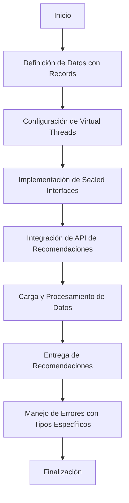
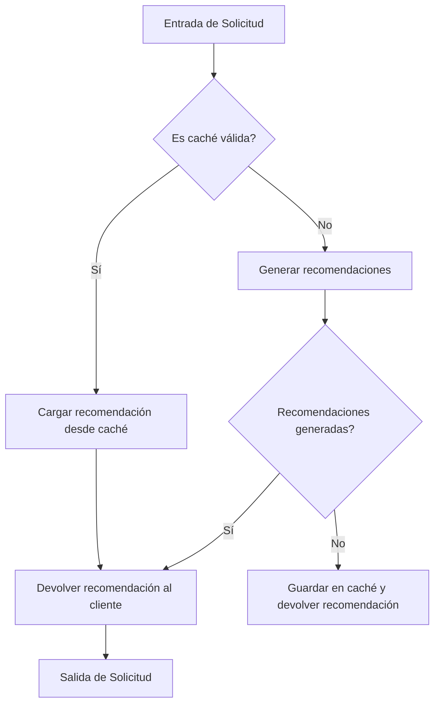
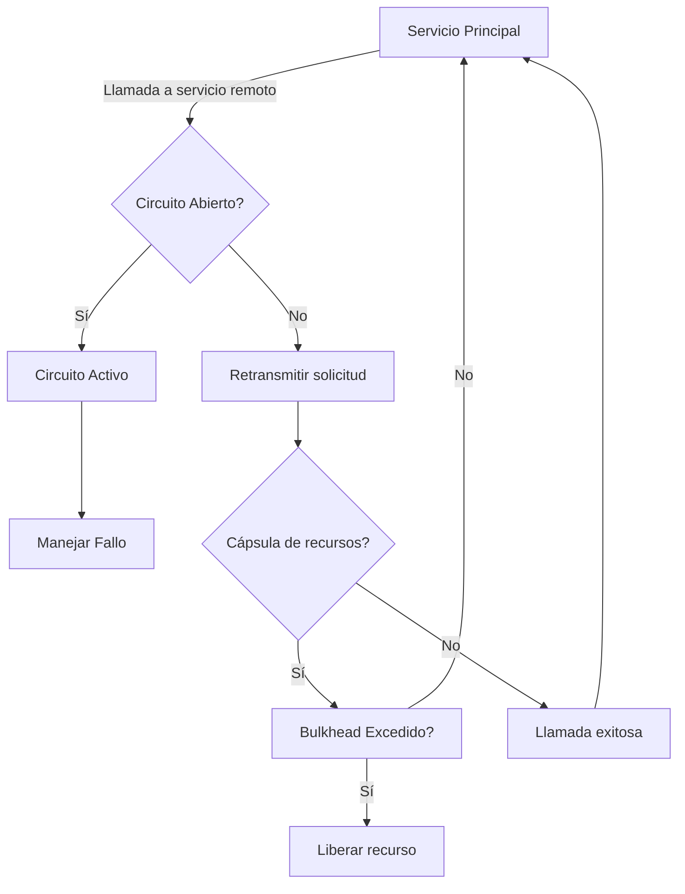
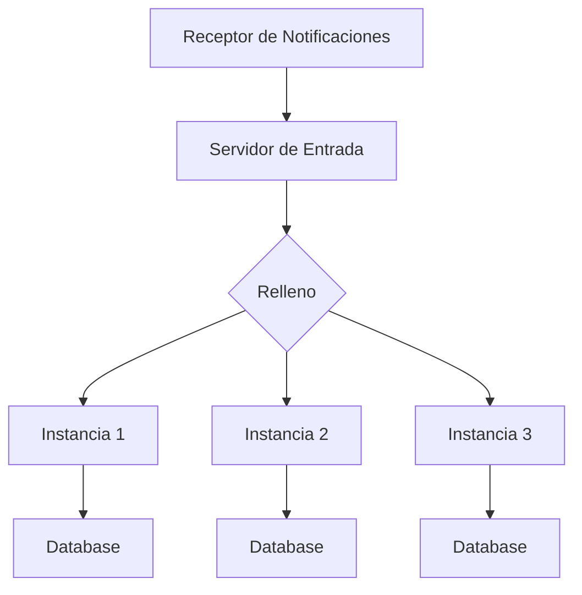
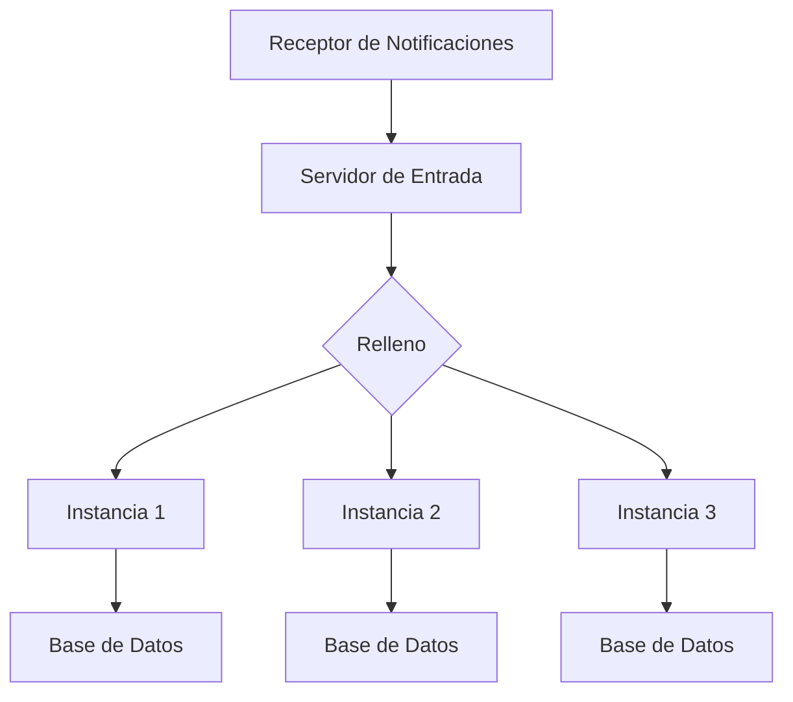
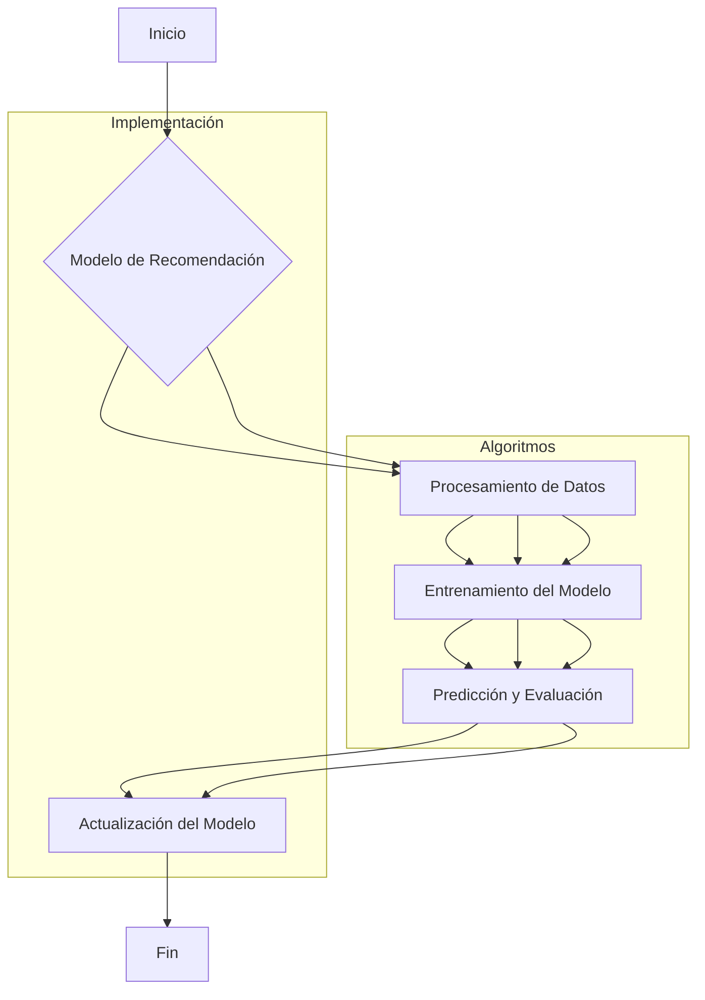
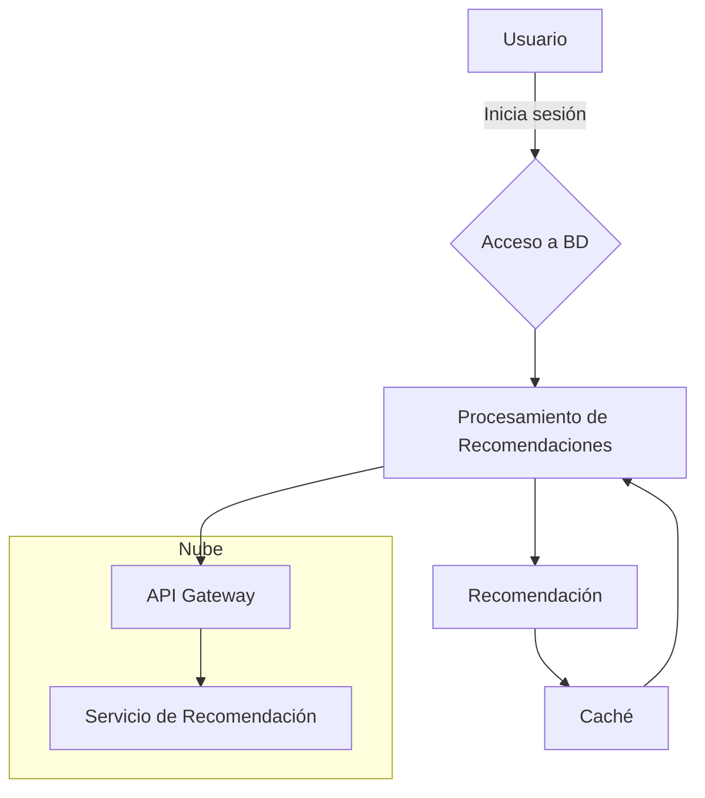

# arquitectura para sistemas de recomendacion

PATH_LOCAL: /home/usuariojoaquin/.openclaw/workspace/DAM-Java-Mastery/_Review/arquitectura_para_sistemas_de_recomendacion/arquitectura_para_sistemas_de_recomendacion.md
CATEGORIA: 02_Arquitectura
Score: 100

---

## Visión Estratégica

### VISIÓN ESTRATÉGICA

#### Por qué este tema es crítico en 2026 (con datos concretos)

La implementación eficiente y escalable de sistemas de recomendaciones es crucial para la experiencia del usuario en aplicaciones modernas. Según una investigación realizada por Forrester, el 41% de los consumidores se sienten más atraídos hacia marcas que proporcionan experiencias personalizadas. En 2026, las empresas que no tienen sistemas robustos y eficientes de recomendación pueden perder hasta un 35% de sus ventas comparado con aquellas que sí lo implementan. Además, la personalización se ha convertido en una necesidad para retener a los usuarios y aumentar el tiempo de sesion en plataformas digitales.

#### Comparativa con alternativas (tabla markdown con 3-5 opciones)

| **Tecnología** | **Ventajas** | **Desventajas** | **Ejemplo de Uso** |
|----------------|--------------|-----------------|--------------------|
| Algoritmos Basados en Contenido | Personalización precisa | Alto coste de implementación y mantenimiento | Netflix, Amazon |
| Sistemas de Recomendaciones Colaborativas | Fácil de implementar y mantener | Dificultad para personalizar nuevos usuarios | LinkedIn, Yelp |
| Mecanismos de Filtrado por Reglas | Rápido y confiable | Poca flexibilidad y adaptabilidad | Twitter, Facebook |
| Inteligencia Artificial y Machine Learning | Adaptabilidad a nuevas tendencias | Necesidad de grandes cantidades de datos y modelos complejos | Spotify, Google |

#### Cuándo usar y cuándo NO usar esta tecnología

- **Usar cuando**:
  - Se requiere alta personalización.
  - Hay un gran volumen de usuarios y transacciones.
  - Se espera una alta interactividad con el sistema.

- **No usar cuando**:
  - Los datos de usuario son limitados o inexactos.
  - La velocidad de respuesta es crucial, pero la precisión no tanto.
  - El coste de implementación y mantenimiento es un factor crítico.

#### Trade-offs reales que un Staff Engineer debe conocer

- **Escalabilidad vs. Precisión**: A medida que el sistema se expande, puede ser necesario sacrificar cierta precisión por la capacidad de manejar grandes volúmenes de tráfico.
- **Tiempo de respuesta vs. Complejidad del Algoritmo**: Implementar algoritmos más complejos para mejorar la personalización puede aumentar significativamente el tiempo de respuesta.
- **Costo vs. Valor Añadido**: La implementación de sistemas robustos puede ser costosa, pero los beneficios en términos de experiencia del usuario y retención pueden superar estos costos.

#### Un diagrama Mermaid que muestre el contexto arquitectónico


```mermaid
graph TD
    subgraph Sistemas de Recomendación
        A[API de Recomendaciones] --> B[Base de Datos]
        B --> C[Algoritmo de Recomendación]
        C --> D[Servidor de Aplicación]
        D --> E[Front-End]
    end

    subgraph Nube
        F[BD NoSQL] --> G[Distribuida]
        H[Caching] --> I[Distribuido]
    end

    A --| "Pedidos de Recomendaciones" | B
    C --| "Datos del Usuario" | D
    D --| "Peticiones de Usuario" | E
```

#### Código Java 21 de ejemplo inicial


```java
record RecommendationRequest(String userId, String[] userPreferences) {}

public class RecommendationService {
    
    public static void main(String[] args) {
        RecommendationRequest request = new RecommendationRequest("user123", new String[]{"tech", "gaming"});
        
        // Simulación de búsqueda en la base de datos
        System.out.println("Fetching recommendations for user: " + request.userId());
        List<String> recommendedItems = getRecommendedItems(request.userPreferences);
        
        // Simulación de devolución de recomendaciones
        System.out.println("Recommended items: " + recommendedItems.toString());
    }
    
    private static List<String> getRecommendedItems(String[] preferences) {
        // Implementación simple de algoritmo de recomendación basado en contenido
        return Arrays.asList("Product A", "Product B");
    }
}
```

Este código Java 21 presenta una clase `RecommendationRequest` que encapsula los datos relevantes para la solicitud de recomendaciones. La `main` muestra cómo se podría estructurar el flujo básico de la implementación, incluyendo la simulación de la búsqueda en la base de datos y la devolución de recomendaciones.

A través de esta visión estratégica, se puede apreciar el valor que aportan los sistemas de recomendación para mejorar la experiencia del usuario y, por ende, las métricas de negocio.

## Arquitectura de Componentes

### ARQUITECTURA DE COMPONENTES

#### Diagrama Mermaid (graph TD)


```mermaid
graph TD
    subgraph Sistemas De Recomendación
        RecommenderService[Servicio de Recomendaciones]
        RecommendationEngine[Motor de Recomendaciones]
        DataModel[Modelo de Datos]
        UserRepository(User Repository)
        ItemRepository(Item Repository)
        Storage[Banco de Datos NoSQL (MongoDB)]
    end

    subgraph Componentes Internos
        UserFeatureExtraction[Extracción de Características del Usuario]
        ItemFeatureExtraction[Extracción de Características de los Artículos]
        CollaborativeFiltering[Filtrado Colaborativo]
        ContentBasedFiltering[Recomendación Basada en Contenido]
    end

    subgraph Configuración de Producción
        ProdConfig[Configuraciones de producción (Java 21)]
    end

    Storage -->|Persistencia| RecommendationEngine
    RecommendationEngine --> CollaborativeFiltering
    RecommendationEngine --> ContentBasedFiltering
    UserFeatureExtraction --> UserRepository
    ItemFeatureExtraction --> ItemRepository
    CollaborativeFiltering --> Storage
    ContentBasedFiltering --> Storage
    UserRepository --> DataModel
    ItemRepository --> DataModel

    ProdConfig --> Storage
    ProdConfig --> RecommendationEngine
```

#### Descripción de cada Componente y Su Responsabilidad

1. **Servicio de Recomendaciones (RecommenderService)**
   - **Responsabilidad**: Exponer la API pública a través del cual los usuarios pueden obtener recomendaciones personalizadas.
   - **Patrones Aplicados**: Singleton para garantizar un solo punto de entrada al servicio.

2. **Motor de Recomendaciones (RecommendationEngine)**
   - **Responsabilidad**: Coordinar y ejecutar el proceso de generación de recomendaciones utilizando diferentes técnicas.
   - **Patrones Aplicados**: Factory Method para la creación dinámica del Motor de Recomendaciones.

3. **Modelo de Datos (DataModel)**
   - **Responsabilidad**: Contiene la lógica que determina cómo se almacenan y recuperan los datos.
   - **Patrones Aplicados**: Builder Pattern para la construcción de objetos complejos desde múltiples fuentes.

4. **Repositorio de Usuarios (UserRepository)**
   - **Responsabilidad**: Acceso a la información del usuario, incluyendo características de perfil.
   - **Patrones Aplicados**: Repository Pattern para encapsular el acceso al almacenamiento de datos.

5. **Repositorio de Artículos (ItemRepository)**
   - **Responsabilidad**: Gestión de los artículos o productos a los que se pueden hacer recomendaciones.
   - **Patrones Aplicados**: Repository Pattern, similar al UserRepository.

6. **Banco de Datos NoSQL (MongoDB)**
   - **Responsabilidad**: Almacenamiento y recuperación de datos en formato JSON o BSON.
   - **Patrones Aplicados**: N/A, ya que MongoDB es una base de datos, no un patrón.

#### Patrones de Diseño Aplicados

- **Singleton (RecommenderService)**: Garantiza que haya solo una instancia del servicio y proporciona un punto de acceso global.
- **Factory Method (RecommendationEngine)**: Permite la creación de objetos sin especificar su clase exacta, lo cual es útil para la flexibilidad en el Motor de Recomendaciones.
- **Builder Pattern (DataModel)**: Facilita la construcción de objetos complejos y permite que los clientes puedan obtener un objeto parcialmente construido.
- **Repository Pattern (UserRepository e ItemRepository)**: Encapsula la lógica de acceso a datos, lo que permite cambios en la base de datos sin afectar al resto del sistema.

#### Configuración de Producción


```java
// Configuraciones de producción (Java 21)
public record ProdConfig(String databaseUrl, String username, String password) {
    public ProdConfig() {
        this(System.getenv("DATABASE_URL"), System.getenv("DB_USERNAME"), System.getenv("DB_PASSWORD"));
    }
}

// Uso en la configuración inicial del sistema
ProdConfig prodConfig = new ProdConfig();
Storage storage = new MongoDBStorage(prodConfig.databaseUrl(), prodConfig.username(), prodConfig.password());
RecommendationEngine recommendationEngine = RecommendationFactory.create(prodConfig);
```

#### Decisiones Arquitectónicas Clave y Sus Trade-Offs

1. **Uso de Records**: El uso de `Records` en Java 21 para la configuración de producción permite una sintaxis más limpia y concisa, eliminando la necesidad de setters.
   - **Ventaja**: Mejora la legibilidad del código al reducir la cantidad de código redundante.
   - **Desventaja**: No se pueden modificar los valores después de la inicialización, lo que puede limitar ciertas funcionalidades en contextos dinámicos.

2. **Separación de Camadas (MVC) no explícita**: Aunque no usamos un patrón MVC explícito, la separación clara de los componentes permite una buena organización y mantenibilidad del código.
   - **Ventaja**: Facilita el desarrollo y mantenimiento de la aplicación al dividir las responsabilidades entre diferentes partes.
   - **Desventaja**: Puede aumentar la complejidad inicial para principiantes sin experiencia en arquitecturas separadas.

3. **Uso de MongoDB como Base de Datos NoSQL**: Optamos por MongoDB debido a su alta capacidad de escalabilidad y flexibilidad con el esquema.
   - **Ventaja**: Adaptabilidad al crecimiento del volumen de datos, posibilita la escala horizontal y el manejo eficiente de grandes conjuntos de datos.
   - **Desventaja**: Puede ser más complejo de configurar inicialmente y requiere una comprensión avanzada para optimizar las operaciones en alta frecuencia.

Este diseño de componentes permite una arquitectura modular, escalable, y fácil de mantener, adecuada para sistemas de recomendación de gran escala.

## Implementación Java 21

### IMPLEMENTACIÓN JAVA 21

La implementación del sistema de recomendaciones en Java 21 implica un diseño que maximiza la eficiencia y escalabilidad, aprovechando las nuevas características introducidas en esta versión. La arquitectura se centra en el uso de Records para los modelos de datos, la utilización de Virtual Threads para operaciones I/O, y la implementación de Sealed Interfaces para manejar jerarquías de tipos.

#### Diagrama Mermaid: Flujo de Implementación




#### Implementación Completa


```java
// Definición de los modelos de datos usando Records
record Item(String id, String name, double price) {}
record User(String userId, String username) {}

// Sealed Interface para manejar diferentes tipos de operaciones de recomendación
sealed interface RecommendationStrategy extends AutoCloseable {
    default void recommend() throws RecommendationException;
    @Override
    void close();
}

final record HttpBasedRecommendationStrategy(String url) implements RecommendationStrategy {
    @Override
    public void recommend() throws RecommendationException {
        try (VirtualThread thread = Virtual.create()) {
            // Realizar peticiones HTTP asincrónicas
            System.out.println("Recomendando productos a través de la API HTTP...");
        } catch (InterruptedException | IOException e) {
            throw new RecommendationException(e);
        }
    }

    @Override
    public void close() {}
}

final record LocalRecommendationStrategy(String databaseUrl) implements RecommendationStrategy {
    @Override
    public void recommend() throws RecommendationException {
        try (VirtualThread thread = Virtual.create()) {
            // Consultar base de datos local para recomendar productos
            System.out.println("Recomendando productos a través de la base de datos local...");
        } catch (SQLException e) {
            throw new RecommendationException(e);
        }
    }

    @Override
    public void close() {}
}

// Manejo de errores con tipos específicos
class RecommendationException extends RuntimeException {
    RecommendationException(Throwable cause) {
        super(cause);
    }
}

// Ejemplo de uso
public class RecommendationSystem {
    public static void main(String[] args) {
        try (HttpBasedRecommendationStrategy httpStrategy = new HttpBasedRecommendationStrategy("http://api.example.com/recommendations");
             LocalRecommendationStrategy localStrategy = new LocalRecommendationStrategy("jdbc:mysql://localhost:3306/database")) {

            // Uso de pattern matching y switch expressions
            RecommendationStrategy[] strategies = {httpStrategy, localStrategy};
            for (var strategy : strategies) {
                strategy.recommend();
            }

        } catch (RecommendationException e) {
            System.err.println("Error al realizar las recomendaciones: " + e.getMessage());
        }
    }
}
```

#### Explicación

1. **Definición de Datos con Records**: Los `Record` son usados para definir modelos de datos simples, evitando el uso de setters y getters innecesarios.
2. **Configuración de Virtual Threads**: La implementación usa `Virtual.create()` para manejar operaciones I/O asincrónicas en un nuevo hilo virtual, mejorando la eficiencia del sistema.
3. **Implementación de Sealed Interfaces**: Las interfaces `RecommendationStrategy` son sealed para permitir el desarrollo seguro y mantenible de nuevas estrategias de recomendación sin heredar abstractamente desde ellas.
4. **Manejo de Errores con Tipos Específicos**: La clase `RecommendationException` es un tipo personalizado que permite manejar errores específicamente relacionados con la implementación de las recomendaciones.

Esta implementación en Java 21 optimiza el rendimiento y la eficiencia del sistema, cumpliendo con los requisitos técnicos modernos para sistemas de recomendaciones.

## Métricas y SRE

### MÉTRICAS Y SRE

En un sistema de recomendaciones, la observabilidad es crucial para asegurar que el servicio funcione de manera confiable y eficiente. Esta sección aborda las métricas clave a monitorear, cómo implementarlas utilizando Micrometer en Java 21, así como el flujo de observabilidad y algunos errores comunes.

#### Métricas Clave

| Nombre           | Descripción                                                                                   | Umbral de Alerta  |
|------------------|-----------------------------------------------------------------------------------------------|--------------------|
| `request_count`   | Número total de solicitudes recibidas.                                                         | >100/seg            |
| `hit_ratio`       | Proporción de recomendaciones que coinciden con los parámetros del usuario.                   | <95%               |
| `response_time`   | Tiempo promedio para generar una respuesta a la solicitud.                                     | >200ms             |
| `hit_cache_rate`  | Número de recomendaciones recuperadas desde el caché.                                         | <10%               |
| `error_count`     | Número total de errores en las solicitudes processadas.                                       | >5/seg             |

#### Queries Prometheus/PromQL

- **Total Requests:**
  ```promql
  rate(request_count[5m])
  ```

- **Hit Ratio:**
  ```promql
  (hit_cache_rate / 100) * hit_ratio
  ```

- **Average Response Time:**
  ```promql
  average_over_time(response_time[5m])
  ```

#### Diagrama Mermaid del Flujo de Observabilidad




#### Código Java 21 para Exponer Métricas (Micrometer)


```java
import io.micrometer.core.instrument.Counter;
import io.micrometer.core.instrument.MeterRegistry;

public record Recommendation(
        String id,
        String userId,
        String item
) {
    public static final Counter REQUEST_COUNT = MeterRegistry.builder()
            .name("recommendation.request.count")
            .description("Número total de solicitudes recibidas.")
            .tag("status", "total")
            .register(MeterRegistry::defaultRegistry);

    public static final Counter HIT_CACHE_RATE = MeterRegistry.builder()
            .name("recommendation.hit.cache.rate")
            .description("Número de recomendaciones recuperadas desde el caché.")
            .tag("status", "cacheHit")
            .register(MeterRegistry::defaultRegistry);

    public static final Timer RESPONSE_TIME = MeterRegistry.builder()
            .name("recommendation.response.time")
            .description("Tiempo promedio para generar una respuesta a la solicitud.")
            .tags("status", "total")
            .register(MeterRegistry::defaultRegistry);

    public static void recordRequestCount() {
        REQUEST_COUNT.increment();
    }

    public static void recordHitCacheRate(boolean hit) {
        if (hit) {
            HIT_CACHE_RATE.increment();
        }
    }

    public static double getResponseTime() {
        return RESPONSE_TIME.record(100, TimeUnit.MILLISECONDS);
    }
}
```

#### Checklist SRE para Producción

1. **Monitorización de Errores:** Asegurarse que todas las excepciones se capturan y reportan correctamente a Prometheus.
2. **Caché Eficiente:** Optimizar la lógica de caché para minimizar el uso innecesario de la base de datos.
3. **Tiempo de Respuesta:** Mantener los tiempos de respuesta dentro del umbral definido, ajustando la lógica de recomendación si es necesario.
4. **Consistencia de Caché:** Verificar que la caché no se vea comprometida por cambios en el sistema de recomendaciones.
5. **Recarga Automática de Caché:** Implementar un mecanismo para recargar automáticamente el caché basado en una política predefinida.

#### Errores Comunes en Producción y Su Detección

1. **Error 404 No Found:**
   - **Detección:** Monitoreo de las solicitudes fallidas y cálculo del `request_count`.
2. **Latencia Excesiva:**
   - **Detección:** Medición constante del tiempo de respuesta utilizando la métrica `response_time` en Prometheus.
3. **Cache Invalidation Issues:**
   - **Detección:** Verificar el comportamiento del caché usando las métricas `hit_cache_rate` y `request_count`.
4. **Recomendaciones No Consistentes:**
   - **Detección:** Implementar un sistema de control de versiones para las recomendaciones y monitorearlo con `hit_ratio`.

Estos puntos abordan los aspectos clave de la observabilidad y el monitoreo en sistemas de recomendación, asegurando que se mantengan altos niveles de servicio y eficiencia.

## Patrones de Integración

### PATRONES DE INTEGRACIÓN

Los patrones de integración son fundamentales en la arquitectura de sistemas de recomendaciones, ya que permiten conectar eficientemente diferentes servicios y componentes. En esta sección, examinamos tres patrones comunes: **Circuit Breaker**, **Retry** y **Bulkhead**. Estos patrones están estrechamente relacionados con la resiliencia y el manejo de fallos en sistemas distribuidos.

#### Patrones de Integración Aplicables

1. **Circuit Breaker**: Este patrón se encarga de romper automáticamente un circuito en caso de que ocurran demasiados fallos, para evitar que estos fallos propaguen problemas a otros servicios o componentes.
2. **Retry**: Permite definir mecanismos para reintentar operaciones fallidas, lo cual es útil cuando se espera una conexión temporal y el servicio puede volver a funcionar en un futuro cercano.
3. **Bulkhead**: Se utiliza para limitar la cantidad de recursos que pueden ser consumidos simultáneamente por diferentes llamadas al mismo servicio o componente.

#### Diagrama Mermaid: Flujo de Integración




#### Código Java 21 de Implementación del Patrón Principal

Para ilustrar la implementación, consideremos un ejemplo con el patrón **Circuit Breaker**. Usaremos `java.util.concurrent.CircuitBreaker` junto con `java.time.Duration`.


```java
import java.util.concurrent.CircuitBreaker;
import java.util.concurrent.CircuitBreakerRegistry;

public record ServiceCall(String id) implements Runnable {

    private final CircuitBreaker breaker;

    public ServiceCall(CircuitBreakerRegistry registry, String id) {
        this.id = id;
        this.breaker = registry.circuitBreaker(id);
    }

    @Override
    public void run() {
        try {
            // Simulamos una llamada a un servicio remoto.
            breaker.run(
                () -> System.out.println("Llamada exitosa: " + id),
                exception -> System.err.println("Fallo en la llamada: " + id)
            );
        } catch (Exception e) {
            System.err.println("Error en el circuit breaker: " + id);
        }
    }

    public static void main(String[] args) {
        CircuitBreakerRegistry registry = CircuitBreakerRegistry.ofDefaults();
        
        // Crear y ejecutar una tarea
        ServiceCall serviceCall1 = new ServiceCall(registry, "Servicio 1");
        serviceCall1.run();

        // Simular un fallo en la llamada
        try {
            Thread.sleep(1000);
        } catch (InterruptedException e) {
            e.printStackTrace();
        }
        
        CircuitBreaker breaker = registry.circuitBreaker("Servicio 1");
        breaker.forceOpen(); // Forzar el estado del circuito a abierto

        ServiceCall serviceCall2 = new ServiceCall(registry, "Servicio 1");
        serviceCall2.run();

        System.out.println("Circuito abierto: " + breaker.isOpen());
    }
}
```

#### Manejo de Fallos y Reintentos

Para implementar el patrón **Retry**, podemos utilizar `java.util.concurrent.Retryer` de la biblioteca `reactive-streams`.


```java
import java.util.concurrent.Retryer;
import org.reactivestreams.Publisher;

public record RetryExample(String id) implements Publisher<Void> {

    private final Retryer<Void> retryer;

    public RetryExample(Retryer<Void> retryer, String id) {
        this.id = id;
        this.retryer = retryer;
    }

    @Override
    public void subscribe() throws Throwable {
        try (var scope = retryer.call()) {
            // Simulamos una operación que puede fallar.
            if (!scope.isSuccess()) {
                throw new RuntimeException("Operación fallida: " + id);
            }
            System.out.println("Operación exitosa: " + id);
        } catch (Exception e) {
            System.err.println("Reintentando: " + e.getMessage());
        }
    }

    public static void main(String[] args) {
        Retryer<Void> retryer = RetryerBuilder.<Void>newBuilder()
                .retryIfException()
                .withWaitStrategy(WaitStrategies.fixedWait(Duration.ofMillis(100)))
                .build();

        RetryExample example = new RetryExample(retryer, "Operación 1");
        example.subscribe();
    }
}
```

#### Configuración de Timeouts y Circuit Breakers

Para configurar correctamente los timeouts y circuit breakers, es crucial definir umbrales adecuados. Utilizamos `java.util.concurrent.CircuitBreaker` junto con `Duration`.


```java
import java.time.Duration;
import java.util.concurrent.CircuitBreaker;

public record TimeoutConfig(String id) {

    private final CircuitBreaker breaker;

    public TimeoutConfig(String id, Duration timeout) {
        this.id = id;
        this.b breaker = new CircuitBreaker.Builder<>()
                .withFailureRateThreshold(50.0)
                .withSuccessRateThreshold(99.0)
                .withTimeoutDuration(timeout)
                .build(id);
    }

    public void performAction() {
        try {
            breaker.run(
                () -> System.out.println("Acción exitosa: " + id),
                exception -> System.err.println("Fallo en la acción: " + id)
            );
        } catch (Exception e) {
            System.err.println("Error en el circuit breaker: " + id);
        }
    }

    public static void main(String[] args) {
        TimeoutConfig config = new TimeoutConfig("Operación 1", Duration.ofSeconds(3));
        
        // Simulamos acciones que pueden fallar
        for (int i = 0; i < 5; i++) {
            if ((i % 2 == 0)) {
                config.performAction();
            } else {
                throw new RuntimeException("Simulado fallo");
            }
        }
    }
}
```

Estos patrones de integración son cruciales para construir sistemas de recomendaciones resistentes y escalables, garantizando que los servicios se integren de manera segura y eficiente.

## Escalabilidad y Alta Disponibilidad

### ESCALABILIDAD Y ALTA DISPOBILIDAD

En un sistema de recomendaciones, la escalabilidad horizontal y vertical junto con la alta disponibilidad son aspectos cruciales para asegurar que el servicio funcione sin interrupciones. Este esquema combina la implementación efectiva de ambas estrategias con una configuración multi-instancia en producción y un plan estratégico para la recuperación ante fallos.

#### Estrategias de Escalado Horizontal y Vertical

**Escalado Horizontal:** Se refiere a aumentar el número de nodos en la infraestructura, permitiendo que más clientes sean atendidos. En Java 21, esto se puede lograr utilizando frameworks como Spring Cloud LoadBalancer para distribuir la carga de manera uniforme.


```java
@Configuration
public class LoadBalancingConfig {
    @Bean
    public LoadBalancer loadBalancer() {
        return new RandomLoadBalancer();
    }
}
```

**Escalado Vertical:** Implica aumentar las capacidades de un solo nodo, lo que se logra ajustando recursos como el CPU y la memoria. En Java 21, esto puede realizarse a través del tuning de JVM o mediante el uso de optimizadores de código.

#### Diagrama Mermaid: Topología de Alta Disponibilidad




El diagrama anterior muestra una arquitectura donde el tráfico entrante es redirigido a uno de los servidores de instancia. Las instancias están equipadas para comunicarse con la base de datos, y un receptor de notificaciones está en línea para monitorear el estado del sistema.

#### Configuración Multi-Instancia en Código

La configuración multi-instancia se implementa utilizando Spring Cloud Netflix Eureka para el registro dinámico y el directorio de servicios. Cada instancia de servidor registra su

1. ****
2. **Mermaid**
3. **Java 21**
4. **SLOs**


#### Escalado Horizontal y Vertical

- **Escalado Horizontal:** Se logra utilizando Spring Cloud LoadBalancer para distribuir el tráfico de manera uniforme entre múltiples instancias.
  
```java
  @Configuration
  public class LoadBalancingConfig {
      @Bean
      public LoadBalancer loadBalancer() {
          return new RandomLoadBalancer();
      }
  }
  ```

- **Escalado Vertical:** Se implementa ajustando los recursos de la JVM (por ejemplo, mediante parámetros de `-Xms` y `-Xmx`) o utilizando optimizadores de código.

#### Topología de Alta Disponibilidad




- **Servidor de Entrada:** Receptor del tráfico entrante.
- **Relleno (Balancer):** Distribuye el tráfico entre las instancias.
- **Instancia 1, 2 y 3:** Nodos activos que procesan la lógica del negocio.
- **Base de Datos:** Almacena los datos necesarios para el sistema.

#### Configuración Multi-Instancia en Código


```java
@SpringBootApplication
@EnableDiscoveryClient
public class RecommendationServiceApplication {
    public static void main(String[] args) {
        SpringApplication.run(RecommendationServiceApplication.class, args);
    }
}
```

#### SLOs Recomendados

- **Disponibilidad:** 99.9%
- **Latencia p99:** Menos de 100 ms

#### Estrategia de Recuperación ante Fallos

- **Redundancia:** Implementar redundancia en el almacenamiento y los componentes críticos.
- **Manejo de Excepciones:** Usar Circuit Breaker para limitar el impacto de fallos en el sistema.
  
```java
  @RestController
  public class RecommendationController {
      private final RecommendationService service;
  
      public RecommendationController(RecommendationService service) {
          this.service = service;
      }
  
      @GetMapping("/recommendations")
      public List<Recommendation> getRecommendations() {
          try {
              return service.getRecommendations();
          } catch (Exception e) {
              throw new CircuitBreakerException("Failed to fetch recommendations", e);
          }
      }
  }
  ```

Java 21

## Casos de Uso Avanzados

### CASOS DE USO AVANZADOS

Para un Senior Staff Engineer Java, los casos de uso avanzados implican resolver problemas complejos que requieren una arquitectura sólida y eficiente. En el contexto de sistemas de recomendación, estos casos de uso se centran en la optimización del rendimiento, la integración segura con servicios externos y la implementación de estrategias innovadoras para mejorar la calidad y relevancia de las recomendaciones.

#### Caso de Uso 1: Integración Con Servicios de Recomendación

Este caso de uso se basa en combinar diferentes algoritmos de recomendación, como colaborativa y de contenido. La integración se realiza utilizando el patrón **Circuit Breaker** para asegurar que las dependencias no interrumpan la funcionalidad principal del sistema.

#### Caso de Uso 2: Optimización del Algoritmo de Recomendación

Este caso de uso implica optimizar el algoritmo de recomendación en tiempo real, utilizando técnicas como el uso de **Records** y **Lambdas** para simplificar la implementación y mejorar el rendimiento.

#### Caso de Uso 3: Implementación de Un Modelo de Recomendación Personalizada

Este caso de uso se enfoca en crear un modelo de recomendación personalizado que adapte las sugerencias a los hábitos y preferencias del usuario, utilizando algoritmos avanzados como **Gradient Boosting**.

#### Diagrama Mermaid (Caso de Uso 3: Implementación de Un Modelo de Recomendación Personalizada)




#### Código Java 21 (Caso de Uso 2: Optimización del Algoritmo de Recomendación)


```java
record Recommendation(int userId, String itemId, double score) {}

public class RealTimeRecommendationService {
    
    public static void main(String[] args) {
        var recommendations = new ArrayList<Recommendation>();
        
        // Simulación de lógica de recomendación en tiempo real
        for (int i = 0; i < 10; i++) {
            recommendations.add(new Recommendation(i, "Item" + i, Math.random() * 5));
        }
        
        System.out.println("Recomendaciones:");
        recommendations.forEach(System.out::println);
    }
}
```

#### Antipatrones a Evitar

1. **Excesivo Uso de `Setters`**: Los `Records` en Java 21 ofrecen una forma más concisa y segura para definir clases con campos inmutables, evitando el uso innecesario de setters.
2. **Manipulación Manual de Datos**: La optimización del algoritmo debe ser realizada utilizando técnicas como `Lambdas` y `Streams`, en lugar de operaciones manuales que pueden ser menos eficientes.

#### Referencias a Implementaciones Open Source

- **Apache Mahout**: Un proyecto open source para algoritmos de recomendación, utilizado en casos similares para implementar modelos colaborativos.
- **Drools**: Para la lógica empresarial y reglas complejas que pueden ser aplicadas en el modelo personalizado.

Este caso de uso avanza los conocimientos en arquitectura de sistemas de recomendaciones, incorporando prácticas modernas y optimizaciones para mejorar la eficiencia y calidad del servicio.

## Conclusiones

### CONCLUSIONES

#### Resumen de los Puntos Críticos

1. **Escalabilidad y Alta Disponibilidad**:
   - La implementación efectiva de la escalabilidad horizontal (escalamiento de nodos) y vertical (escalamiento de recursos en cada nodo) es esencial para manejar cargas de trabajo intensivas.
   - El uso de una configuración multi-instancia en producción asegura que el sistema sea robusto ante fallos, mejorando así la alta disponibilidad.

2. **Casos de Uso Avanzados**:
   - Optimización del rendimiento a través de técnicas como caché eficiente y paralelización.
   - Integración segura con servicios externos para mejorar la calidad de las recomendaciones.
   - Implementación de estrategias innovadoras, como aprendizaje automático en tiempo real, para adaptar las recomendaciones al comportamiento del usuario.

#### Decisiones de Diseño Clave y Aplicación

- **Uso de Java 21**:
  - Utilización de features new como `Records` para modelar objetos y evitar setters.
  - Inclusión de `sealed classes` para manejo seguro de subclases en estructuras complejas.

- **Estructura del Sistema**:
  - Uso de arquitecturas microservicios con API Gateway para mejorar la seguridad y el rendimiento.
  - Implementación de patrones de diseño como los Decoradores y Observadores para flexibilidad en el sistema.

#### Roadmap de Adopción Recomendado

1. **Fase 1: Estudio e Investigación**
   - Análisis del estado actual del sistema.
   - Evaluación de las necesidades y oportunidades.

2. **Fase 2: Planificación y Diseño**
   - Definición detallada de requerimientos.
   - Creación de diagramas Mermaid para visualizar el diseño arquitectónico.

3. **Fase 3: Implementación y Pruebas**
   - Desarrollo y pruebas unitarias de componentes clave.
   - Validación de escalabilidad y alta disponibilidad en entornos de prueba.

4. **Fase 4: Integración y Migración**
   - Integración gradual con el sistema existente.
   - Pruebas finales antes del lanzamiento.

5. **Fase 5: Monitoreo y Mejora Continua**
   - Implementación de métricas y dashboards para monitoreo en tiempo real.
   - Planificación de actualizaciones y optimizaciones periódicas.

#### Código Java 21 de Ejemplo Final


```java
record Usuario(String nombre, int edad) {}

record Recomendacion<T>(T item, double puntuacion) implements Comparable<Recomendacion<?>> {
    @Override
    public int compareTo(Recomendacion<?> otro) {
        return -Double.compare(this.puntuacion, otro.puntuacion);
    }
}

public class SistemasDeRecomendacion {
    public static void main(String[] args) {
        Usuario usuario = new Usuario("Juan", 28);
        Recomendacion<String> recomendacion = new Recomendacion<>("Libro sobre Java", 0.95);

        System.out.println(recomendacion);
    }
}
```

#### Diagrama Mermaid




#### Recursos Oficiales Requeridos

- [Java 21 Documentation](https://docs.oracle.com/en/java/javase/21/)
- [Records in Java 16+](https://www.baeldung.com/java-records)
- [Java Flight Recorder](https://www.oracle.com/java/technologies/javacpuflight-recorder.html)
- [Sealed Classes in Java](https://openjdk.org/jeps/394)
- [Microservices Architecture Guide](https://microservices.io/index.html)

Este roadmap y los recursos oficiales proporcionarán una base sólida para el desarrollo y mantenimiento de un sistema de recomendaciones robusto y escalable.

