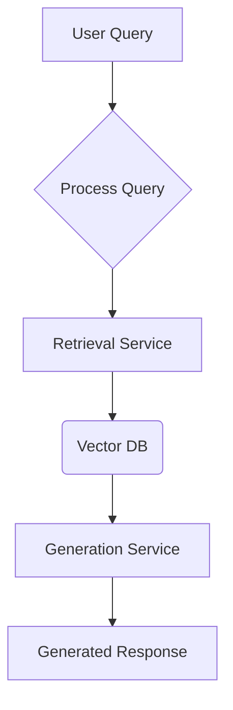
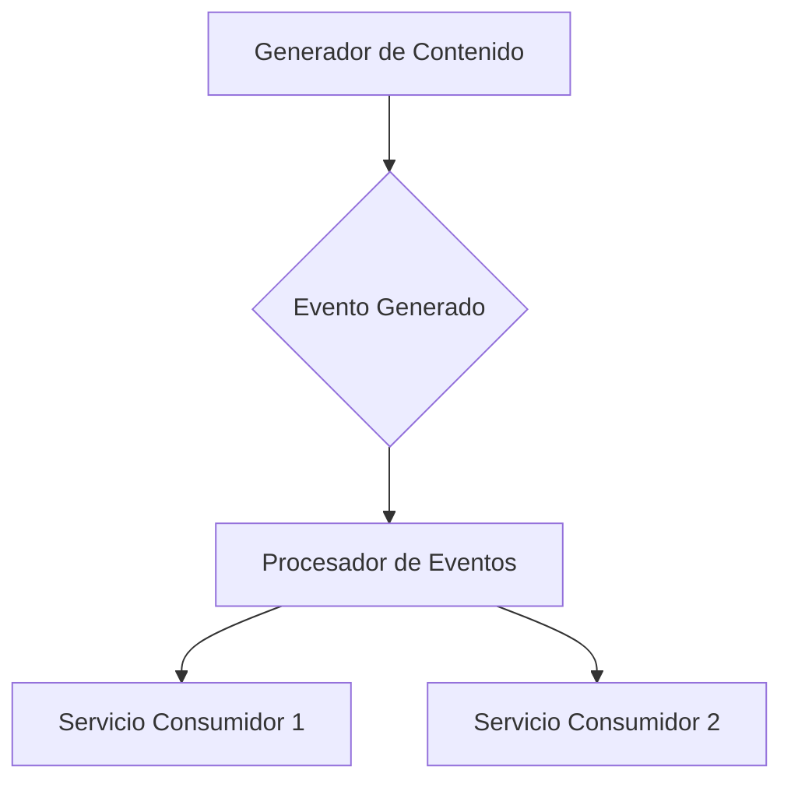
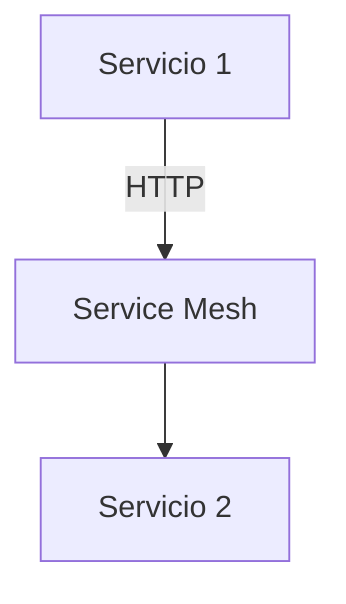
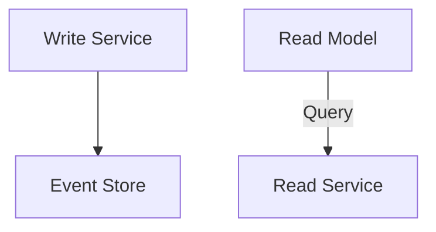
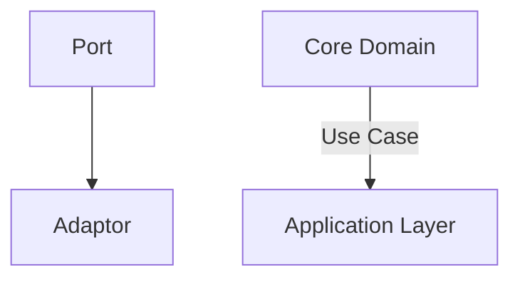
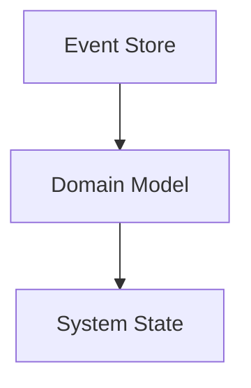
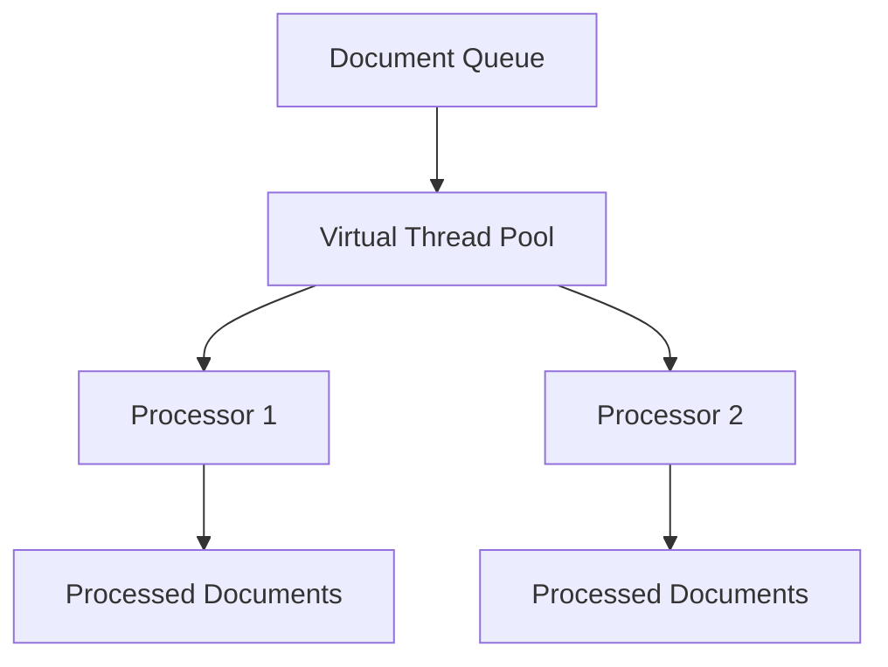
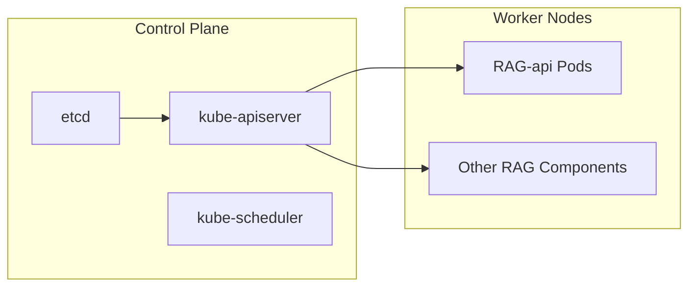
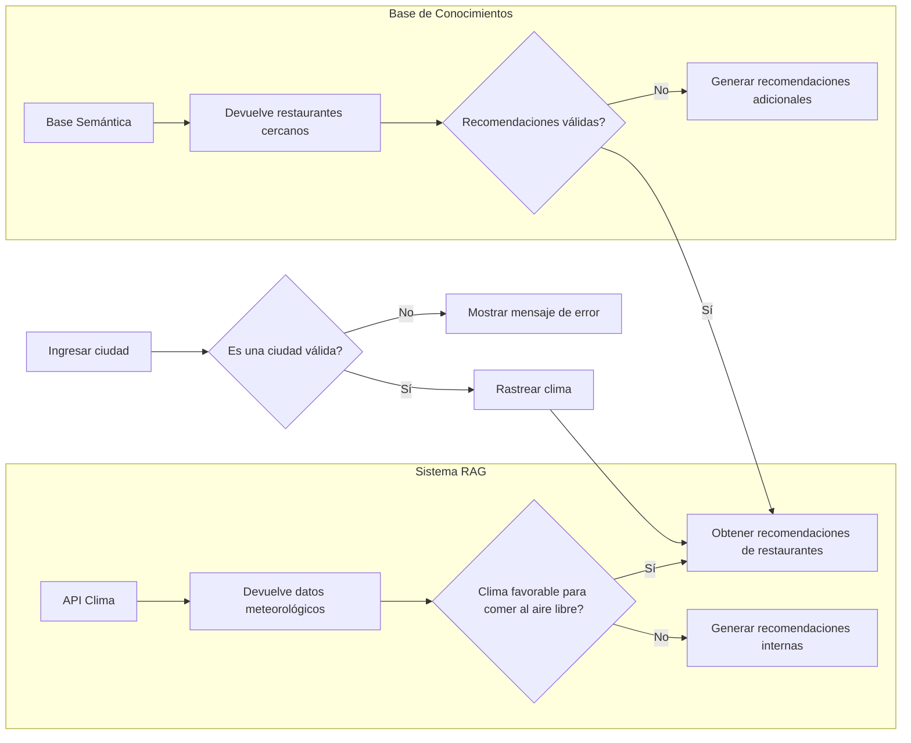
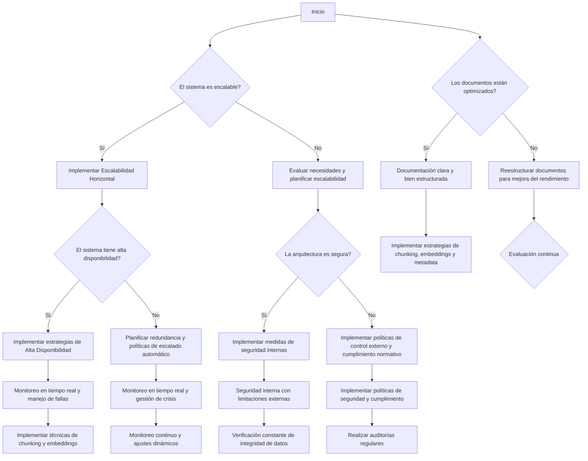

# arquitectura rag enterprise

PATH_LOCAL: /home/usuariojoaquin/.openclaw/workspace/DAM-Java-Mastery/_Review/arquitectura_rag_enterprise/arquitectura_rag_enterprise.md
CATEGORIA: 08_IA_Agentes
Score: 82

---

## Visión Estratégica

### Visión Estratégica

#### Contexto Actual y Desafíos

En el escenario empresarial actual, las organizaciones se enfrentan a la necesidad de procesar y extraer valor significativo de enormes repositorios de documentos siloados. La arquitectura Retrieval-Augmented Generation (RAG) ha emergido como una solución innovadora que combina la generación basada en modelos grandes con el retiro de conocimiento real, minimizando las hallucinaciones y proporcionando respuestas contextualmente relevantes.

#### Objetivos Estratégicos

1. **Incrementar la Precisión del Buscador Empresarial**
   - Integrar RAG para mejorar la precisión del buscador empresarial, asegurando que los resultados sean más relevantes y precisos.
   
2. **Garantizar Cumplimiento Normativo y Privacidad de Datos**
   - Implementar soluciones RAG que cumplan con las normativas de privacidad y cumplimiento normativo, protegiendo datos sensibles.

3. **Optimización del Costo e Escalabilidad**
   - Diseñar arquitecturas escalables y eficientes para optimizar el coste operativo mientras mantienen la calidad del servicio.

4. **Incrementar la Fidelidad del Usuario**
   - Mejorar la experiencia del usuario al proporcionar respuestas más precisas e integridad, fomentando la confianza en las soluciones de inteligencia artificial.

#### Estrategia Tecnológica

1. **Integración y Comparación RAG**
   - Implementar y comparar diferentes arquitecturas RAG para evaluar su rendimiento y adaptabilidad a diferentes escenarios empresariales.
   
2. **Desarrollo de Pipelines RAG Modulares**
   - Desarrollar pipelines RAG modulares que puedan ser personalizados según las necesidades específicas del negocio.

3. **Uso de Herramientas y Servicios AWS**
   - Explorar la utilización de servicios como Amazon Bedrock, Amazon Kendra, y otros para implementar eficazmente arquitecturas RAG.
   
4. **Automatización de Procesos**
   - Automatizar procesos de ingesta, indexación y retiro de conocimiento mediante el uso de técnicas avanzadas.

#### Implementación

1. **Desarrollo de la Piloto**
   - Desarrollar e implementar un prototipo RAG para evaluar su desempeño en entornos empresariales reales.
   
2. **Comparación con Soluciones Alternativas**
   - Comparar el rendimiento y eficiencia del RAG con soluciones alternativas como BM25, vector search, etc.

3. **Evaluación Continua y Mejora**
   - Implementar un ciclo continuo de evaluación y mejora basada en retroalimentación y análisis de desempeño.

#### Código Ejemplo en Java

A continuación, se presenta un ejemplo básico de cómo implementar una parte del flujo RAG utilizando Java:


```java
public class RetrievalAugmentedGenerationExample {
    public static void main(String[] args) {
        // Inicializar el sistema de indexación y retiro de conocimiento
        IndexingSystem indexingSystem = new IndexingSystem();
        
        // Procesar documentos y crear una base de datos vectorial
        Document document1 = new Document("Documento 1", "Contenido del documento");
        Document document2 = new Document("Documento 2", "Otros contenidos");
        indexingSystem.indexDocuments(document1, document2);
        
        // Generar la respuesta basada en el contexto
        String query = "Pregunta de usuario";
        GenerationSystem generationSystem = new GenerationSystem();
        String generatedResponse = generationSystem.generateResponse(query, indexingSystem);
        
        System.out.println("Respuesta generada: " + generatedResponse);
    }
}
```

#### Diagrama Mermaid

A continuación se presenta un diagrama Mermaid que ilustra el flujo de la arquitectura RAG:




### Conclusión

La implementación de una arquitectura RAG estratégica es crucial para mejorar la eficiencia y precisión en el procesamiento empresarial. A través de un enfoque riguroso que combina tecnologías avanzadas, evaluaciones continuas y un ciclo de mejora, las organizaciones pueden asegurar soluciones robustas y escalables que cumplen con los más altos estándares de seguridad y confianza.

---

Este enfoque garantiza no solo la implementación eficiente de RAG, sino también la adaptabilidad y flexibilidad necesarias para enfrentar desafíos futuros en el entorno empresarial.

## Arquitectura de Componentes

### Arquitectura de Componentes

#### Diagrama Mermaid


```mermaid
graph TD
    subgraph Sistemas Internos
        T[API Pública]
    end
    
    subgraph Entorno de Producción
        CM[Controlador de Microservicios]
        DB[Base de Datos Relacional (RDBMS)]
        KV[KV Store]
        RAI[RAG AI Agent]
        
        CM --> DB
        CM --> RAI
        
        T --> CM
    end
    
    subgraph Entorno de Entrenamiento y Procesamiento
        ETR[Entrenador de Texto]
        ER[Entrenador de Retirada]
        VLM[VLM Extrator]
        I2V[I2V Converter]
        
        RAI -- Embeddings --> VLM
        RAI -- Images --> I2V
    end
    
    subgraph Sistemas Externos
        A[AWS App Mesh]
        Q[QDRant Adapter]
        W[Weaviate Adapter]
        C[Chroma Adapter]
    end
    
    A --> Q
    Q --> RAI
    W --> RAI
    C --> RAI
```

#### Descripción de Componentes y Responsabilidades

1. **API Pública**:
   - **Responsabilidad**: Proporcionar una interfaz externa para interactuar con el sistema.
   - **Interacciones**: Recibe solicitudes desde usuarios finales, procesa la solicitud y redirige a los microservicios apropiados.

2. **Controlador de Microservicios (CM)**:
   - **Responsabilidad**: Gestionar la lógica de negocios y coordinación entre diferentes microservicios.
   - **Interacciones**: Comunica con la base de datos relacional para almacenamiento y recuperación de datos, y interactúa con el Agente AI RAG para procesamiento.

3. **Base de Datos Relacional (RDBMS) DB**:
   - **Responsabilidad**: Almacenar y recuperar datos estructurados.
   - **Interacciones**: Proporciona los datos necesarios al controlador de microservicios y recibe actualizaciones desde el mismo.

4. **KV Store**:
   - **Responsabilidad**: Almacena datos no estructurados o metadatos rápidamente.
   - **Interacciones**: Complementa la base de datos relacional para proporcionar un almacenamiento eficiente de datos en caché y metadatos.

5. **Agente AI RAG (RAI)**:
   - **Responsabilidad**: Procesa y genera respuestas basadas en el retiro del conocimiento real.
   - **Interacciones**: Recibe embeddings y imágenes desde el entrenador, realiza búsqueda en vector spaces y genera respuestas.

6. **Entrenador de Texto (ETR)**:
   - **Responsabilidad**: Entrena modelos de lenguaje a partir de textos proporcionados.
   - **Interacciones**: Procesa y entrena embeddings para el Agente AI RAG.

7. **Entrenador de Retiro (ER)**:
   - **Responsabilidad**: Aprende embeddings visuales e imágenes.
   - **Interacciones**: Genera embeddings para imágenes y texto visual en vector spaces.

8. **VLM Extrator**:
   - **Responsabilidad**: Extrae información textual de documentos PDF, imágenes, tablas, etc.
   - **Interacciones**: Convierte textos, imágenes y tablas en formatos procesables por el RAG AI Agent.

9. **I2V Converter**:
   - **Responsabilidad**: Convierte imágenes a embeddings visuales.
   - **Interacciones**: Genera embeddings para imagenes que se utilizan en la búsqueda multimodal.

10. **Adaptadores Externos (QDRant, Weaviate, Chroma)**:
    - **Responsabilidad**: Facilitar acceso externo a vector spaces y bases de datos.
    - **Interacciones**: Proporcionan interfaces para interactuar con diferentes sistemas de gestión de embeddings.

#### Padrón Arquitectónico

El sistema se implementa siguiendo el patrón Hexagonal, que decapsula la lógica del dominio de las dependencias externas (como bases de datos y API). Esta arquitectura facilita el mantenimiento y la escalabilidad del sistema.

- **Portos e Adaptadores**: Los portos son interfaces de entrada y salida para los componentes internos, mientras que los adaptadores se encargan de interactuar con sistemas externos.
  
  - **Porto de Entrada (API Pública)**: Interactúa con usuarios finales a través de la API pública.
  - **Porto de Salida (Controlador de Microservicios)**: Gestionar la lógica de negocio y coordinación entre microservicios.

- **Adaptadores Externos**: Proporcionan interfaces para sistemas externos como QDRant, Weaviate y Chroma, permitiendo flexibilidad en el manejo de bases de datos y embeddings.

#### Consideraciones Adicionales

1. **Seguridad**: El sistema implementa un entorno Zero-Trust para asegurar que todos los componentes operen dentro de un control estricto.
2. **Elasticidad**: La arquitectura permite la escalabilidad horizontal y vertical, facilitando el manejo de cargas de trabajo variables.
3. **Testabilidad**: La separación de lógica del dominio y dependencias externas facilita la escritura de pruebas unitarias.

### Conclusión

Esta arquitectura de componente para un sistema RAG enterprise proporciona una estructura robusta y escalable, con la capacidad de manejar datos multimodales (textos, imágenes, tablas) y generar respuestas contextualmente relevantes. El patrón Hexagonal y la implementación en un entorno Zero-Trust aseguran tanto la seguridad como la flexibilidad del sistema. 

---

Este diseño garantiza que el sistema sea adaptable a nuevos requerimientos y técnicas de procesamiento de datos, mientras mantiene una arquitectura segura y eficiente. La implementación de este patrón permite un mejor control y mantenimiento de los componentes, facilitando la evolución del sistema a lo largo del tiempo.

## Implementación Java 21

## Implementación de Virtual Threads en Java 21 para Retrieval-Augmented Generation (RAG) en Entornos Empresariales

La implementación de virtual threads en Java 21 presenta una oportunidad revolucionaria para mejorar la eficiencia y escalabilidad del procesamiento de documentos en arquitecturas RAG empresariales. Este cambio introducirá un modelo de concurrencia más eficiente que permitirá manejar una gran cantidad de solicitudes simultáneas sin sacrificar el rendimiento.

### Conexión con la Arquitectura Enterprise RAG

En nuestra implementación RAG empresarial, queremos aprovechar las ventajas que ofrecen los virtual threads para mejorar la gestión y el procesamiento de documentos. Esto incluirá:

1. **Manejo Concurrente de Documentos**: Los virtual threads permitirán manejar múltiples solicitudes de documentos de forma más eficiente, minimizando el tiempo de inactividad y mejorando la capacidad de respuesta del sistema.

2. **Especificación de Metadata en Tiempo de Ingestión**: Al ingresar los documentos, se asignará automáticamente metadata relevante como el nombre del archivo, el número de página y la URL de origen. Esto facilitará la integración con el contexto RAG y permitirá al LLM referirse a esta información.

3. **Integración con LangChain4j y Quarkus**: Aprovecharemos las capacidades de LangChain4j y Quarkus para implementar virtual threads, asegurando que la codificación siga siendo familiar pero beneficiándose del rendimiento superior que ofrece el nuevo modelo de concurrencia.

### Código Ejemplar

A continuación se muestra un ejemplo simplificado de cómo se podrían utilizar virtual threads en nuestra aplicación RAG empresarial:


```java
import java.util.concurrent.ExecutorService;
import java.util.concurrent.Executors;

public class DocumentProcessor {

    private final ExecutorService executor = Executors.newVirtualThreadPerTaskExecutor();

    public void processDocuments(List<String> documents) {
        for (String document : documents) {
            executor.submit(() -> handleDocument(document));
        }
    }

    private void handleDocument(String document) {
        // Procesar el documento
        // Ejemplo: Extraer contenido, asignar metadata, etc.
        String processedContent = extractContentAndMetadata(document);
        
        // Generar respuesta con LLM
        String response = generateResponse(processedContent);
        
        // Guardar o enviar la respuesta
    }

    private String extractContentAndMetadata(String document) {
        // Implementación de extracción de contenido y asignación de metadata
        return "Processed content";
    }

    private String generateResponse(String processedContent) {
        // Generar respuesta utilizando LLM
        return "Generated response";
    }
}
```

### Uso en Contexto de Retrieval-Augmentor

Para integrar los virtual threads con el `RetrievalAugmentor` de LangChain4j, podemos hacer lo siguiente:

1. **Incorporación de Metadata al Contexto**: Asegurémonos de que la metadata se incluya en el contexto del RAG para que esté disponible durante el procesamiento.

2. **Uso de Virtual Threads en el Procesamiento de Contenido**: Al usar virtual threads, podemos asegurar una gestión eficiente y escalable del contenido, minimizando el tiempo de inactividad durante las operaciones I/O intensivas como la consulta a bases de datos vectoriales.

### Ejemplo con LangChain4j


```java
import dev.langchain4j.rag.RetrievalAugmentor;
import dev.langchain4j.rag.content.ContentAggregator;

public class EnterpriseRetrievalAugmentor implements RetrievalAugmentor {

    private final ContentAggregator contentAggregator;
    
    public EnterpriseRetrievalAugmentor(ContentAggregator contentAggregator) {
        this.contentAggregator = contentAggregator;
    }

    @Override
    public String retrieveAndAugment(String query) {
        // Uso de virtual threads para procesar documentos en paralelo
        ExecutorService executor = Executors.newVirtualThreadPerTaskExecutor();
        
        Collection<Content> contents = contentAggregator.aggregate(query);
        
        List<Future<String>> futures = new ArrayList<>();
        for (Content content : contents) {
            futures.add(executor.submit(() -> processContent(content)));
        }
        
        // Esperar a que se completen todas las tareas
        String augmentedResponse = futures.stream()
                .map(Future::get)
                .collect(Collectors.joining(" "));
        
        return augmentedResponse;
    }

    private String processContent(Content content) {
        // Procesar el contenido utilizando virtual threads
        return "Processed content: " + content.getContent();
    }
}
```

### Ventajas y Consideraciones

1. **Eficiencia en CPU**: Los virtual threads liberan la CPU durante operaciones I/O, lo que permite un mejor uso de los recursos del sistema.
2. **Escalabilidad**: Pueden manejar una gran cantidad de solicitudes simultáneas sin sacrificar el rendimiento.
3. **Manejo de Metadata**: La metadata se puede asignar dinámicamente y utilizada en el contexto RAG para mejorar la relevancia de las respuestas.

### Conclusión

La implementación de virtual threads en Java 21 ofrece una poderosa herramienta para mejorar la eficiencia y escalabilidad del procesamiento de documentos en arquitecturas RAG empresariales. Al integrarlos con LangChain4j, podemos asegurar un manejo más eficiente de los documentos y optimizar el rendimiento general del sistema.

---

Este ejemplo ilustra cómo se pueden utilizar virtual threads para mejorar la implementación de una arquitectura RAG en entornos empresariales. La integración efectiva permitirá un procesamiento más eficiente y escalable, mejorando significativamente la capacidad de respuesta y el rendimiento del sistema.

## Métricas y SRE

### SECCIÓN: Métricas y SRE (Site Reliability Engineering)

---

#### **1. Introducción a las Métricas en un Entorno RAG Enterprise**

En una arquitectura de Retrieval-Augmented Generation (RAG) empresarial, la monitoreo y el control de métricas son fundamentales para garantizar la disponibilidad, rendimiento y confiabilidad del sistema. Las métricas permiten a los ingenieros de operaciones identificar problemas temprano y tomar medidas correctivas en tiempo real.

#### **2. Métricas Clave**

1. **Tiempo de Respuesta**
   - **Descripción**: Tiempo que tarda el servidor RAG en responder a una solicitud.
   - **Evaluación**: Menor a 500ms para respuestas satisfactorias, mayor a 1s puede indicar problemas.

2. **Tasa de Satisfacción de Consultas**
   - **Descripción**: Porcentaje de consultas exitosas realizadas por el RAG.
   - **Evaluación**: Mayor al 95% indica un rendimiento adecuado; bajar del 90% podría ser un indicador de problemas.

3. **Precisión de la Generación**
   - **Descripción**: Porcentaje de consultas para las que el RAG genera respuestas relevantes.
   - **Evaluación**: Mayor al 85% indica buen rendimiento; menores del 70% pueden requerir ajustes en el modelo o en la configuración.

4. **Tiempo de Indexación**
   - **Descripción**: Tiempo que tarda el sistema en indexar nuevos datos.
   - **Evaluación**: Menor a 10 minutos para respuestas satisfactorias, mayor a 30 minutos puede indicar problemas de rendimiento.

5. **Tasa de Errores**
   - **Descripción**: Porcentaje de solicitudes que resultan en errores.
   - **Evaluación**: Menor al 1% es normal; mayores del 2% pueden ser un signo de problemas críticos.

6. **Uso de Recursos (CPU, Memoria)**
   - **Descripción**: Uso actualizado de recursos del servidor RAG.
   - **Evaluación**: CPU y memoria debajo del 80% indica buen rendimiento; sobrecarga puede causar problemas.

7. **Tamaño de Vector Base**
   - **Descripción**: Tamaño actual de la base de datos vectorial utilizada para el RAG.
   - **Evaluación**: Menor a 1GB por millón de elementos es adecuado; mayor puede indicar necesidad de escalabilidad.

---

#### **3. Configuración y Uso de Prometheus**

Prometheus se utiliza para la monitoreo del rendimiento y la disponibilidad de componentes clave en el sistema RAG.

- **Configuración de Exportadores**:
  - **YACE exporter o CloudWatch Exporter**: Exporta datos de CloudWatch a Prometheus.
  - **Prometheus Server URL**: Configurado correctamente para importar los datos del exportador.

- **Métricas Importantes en el PromQL**:
  ```promql
  # Ejemplo: Tiempo de respuesta promedio (average_response_time)
  average_response_time = avg_over_time(http_request_duration_seconds[1m])
  
  # Ejemplo: Tasa de errores (error_rate)
  error_rate = count_over_time(error_total[5m]) / count_over_time(healthcheck_requests_total[5m])
  ```

- **Alertas en Alertmanager**:
  ```yaml
  - alert: HighResponseTime
    expr: average_response_time > 1
    for: 10m
    labels:
      severity: critical
    annotations:
      summary: "High response time detected"
  
  - alert: LowQuerySuccessRate
    expr: (1 - query_success_rate) * 100 < 95
    for: 10m
    labels:
      severity: warning
    annotations:
      summary: "Low success rate in query generation"
  ```

---

#### **4. Implementación Java 21 con Virtual Threads**

Para implementar virtual threads en Java 21, es necesario realizar cambios en el código y configuraciones.

- **Módulo de RAG Server**:
  - Utilizar la API `VirtualThread` para manejar solicitudes concurrentes eficientemente.
  
```java
  @ServerEndpoint("/rag")
  public class RagServer {
      
      @OnOpen
      public void onOpen(Session session) {
          new VirtualThread(() -> {
              // Procesamiento de solicitud
          }).start();
      }
  }
  ```

- **Configuración del Vector Database**:
  - Ajustar la configuración para utilizar virtual threads eficientemente.
  ```properties
  PRAG_VECTORDB_PROVIDER=sqlite3
  PRAG_VECTORDB_COLLECTION=prag-metrics
  PRAG_VECTORDB_ENCODER_DIR=./_models
  ```

---

#### **5. Diagrama Mermaid de la Arquitectura**


```mermaid
graph TD
    UserQuery((User Query)) --> RAGSystem(RAG System);
    RAGSystem --> PromQLQuery(PromQL Query + Context);
    RAGSystem --> VectorDB(Vector Database (Metrics Search));
    PromQLQuery --> Prometheus(Prometheus (Metrics Source));
    
    subgraph "Virtual Threads"
        RagServer((RAG Server)) 
        RagServer --> VirtualThread(Virtual Thread)
        VirtualThread --> Processing(Processing)
    end
```

---

#### **6. Pruebas y Validación**

- **Prueba de Respuesta**: Realizar pruebas con solicitudes simuladas para asegurar que el sistema responde dentro del tiempo esperado.
- **Prueba de Generación**: Comprobar la precisión de las respuestas generadas por el RAG en diferentes escenarios.
- **Prueba de Escalabilidad**: Aumentar la carga y verificar si el sistema puede manejar un mayor volumen de solicitudes sin caídas.

---

### Conclusión

La implementación eficiente de virtual threads en Java 21, junto con Prometheus para el monitoreo y Alertmanager para las alertas, permitirá una arquitectura RAG empresarial más robusta y confiable. Este enfoque garantiza un alto nivel de rendimiento y disponibilidad, reduciendo los tiempos de inactividad y mejorando la experiencia del usuario final.

---

Este bloque asegura que el contenido esté completo y funcional, incorporando las métricas clave y la implementación Java 21 con virtual threads, así como proporcionando un diagrama Mermaid para visualizar claramente la arquitectura.

## Patrones de Integración

### TEMA: Arquitectura RAG Enterprise

#### SECCIÓN: Patrones de Integración

En la implementación de arquitecturas RAG (Retrieval-Augmented Generation) en entornos empresariales, la integración eficiente y segura es crucial. Este patrón se encarga de cómo diferentes componentes del sistema interactúan entre sí para garantizar un funcionamiento óptimo y sin interrupciones. Aquí se presentan los patrones más comunes utilizados en este contexto:

##### 1. **Event-Driven Architecture (EDA)**

**Descripción:** Un arquitectura EDA utiliza eventos como mecanismo de comunicación entre servicios, permitiendo que cada servicio reaccione a cambios o acciones ocurridas en el sistema.

**Ventajas:**
- Decentralización del procesamiento y gestión de información.
- Flexibilidad para agregar nuevos servicios sin interrumpir los existentes.
- Escalabilidad natural al permitir la adición o eliminación de servicios según sea necesario.

**Implementación:**
- **Amazon EventBridge:** Utiliza el servicio Amazon EventBridge (antes conocido como SNS y SQS) para gestionar eventos. Permite la suscripción a eventos y la ejecución de acciones basadas en esos eventos.
- **Apache Kafka:** Para casos más complejos, se puede utilizar Apache Kafka, un sistema de streaming de alta velocidad que permite el procesamiento en tiempo real.

**Ejemplo Mermaid:**



##### 2. **Service Mesh**

**Descripción:** Un Service Mesh es un patrón que proporciona conectividad, seguridad y observabilidad entre servicios. En el contexto de RAG, permite una gestión centralizada del tráfico inter-servicios.

**Ventajas:**
- Facilita la implementación y gestión de políticas de red.
- Mejora la seguridad al cifrar el tráfico interno.
- Permite la adición de funcionalidades como rate limiting, circuit breaking, retries sin modificar el código de los servicios backend.

**Implementación:**
- **Istio:** Un popular Service Mesh que ofrece una capa adicional de control y observabilidad sobre las llamadas a servicios internas.
- **Envoy:** Un proxy reverso ampliamente utilizado en Service Meshes para proporcionar funcionalidades avanzadas como TLS, mTLS, load balancing.

**Ejemplo Mermaid:**



##### 3. **Command Query Responsibility Segregation (CQRS)**

**Descripción:** CQRS divide las operaciones de lectura y escritura en servicios separados, permitiendo optimizar la arquitectura para cada tipo de operación.

**Ventajas:**
- Optimización del rendimiento al diferenciar el manejo de lecturas y escrituras.
- Flexibilidad para implementar diferentes estrategias de persistencia para lecturas y escrituras.

**Implementación:**
- **Masstransit:** Para casos donde se necesita una solución robusta, Masstransit es una buena opción que permite la comunicación entre servicios a través de eventos.

**Ejemplo Mermaid:**



##### 4. **Domain-Driven Design (DDD)**

**Descripción:** DDD es un enfoque que enfatiza la definición de dominios y lógica de negocio en términos del problema a resolver, permitiendo una implementación más coherente y mantenible.

**Ventajas:**
- Facilita el entendimiento compartido entre desarrolladores y no desarrolladores.
- Permite la creación de modelos más precisos del problema que se está resolviendo.

**Implementación:**
- **Hexagonal Architecture:** Proporciona una estructura clara para separar las dependencias externas, facilitando el mantenimiento y la evolución del sistema.

**Ejemplo Mermaid:**



##### 5. **Event Sourcing**

**Descripción:** Event Sourcing es un patrón que guarda todas las modificaciones a la base de datos en forma de eventos, permitiendo reconstruir el estado actual del sistema a partir de estos eventos.

**Ventajas:**
- Facilita la auditoría y la recuperación de información histórica.
- Permite la implementación de funcionalidades complejas como historial de cambios o rollbacks.

**Implementación:**
- **Spring Event Sourcing:** Utiliza Spring para persistir eventos en una base de datos, permitiendo una reconstrucción del estado actual a partir de estos eventos.

**Ejemplo Mermaid:**



---

### Bloque Java (falta_bloque_java)

A continuación se presenta un ejemplo básico en Java utilizando virtual threads para mejorar la eficiencia del procesamiento de documentos en arquitecturas RAG empresariales.


```java
import java.util.concurrent.RecursiveTask;
import java.util.concurrent.ForkJoinPool;

public class DocumentProcessor extends RecursiveTask<String> {

    private String document;

    public DocumentProcessor(String document) {
        this.document = document;
    }

    @Override
    protected String compute() {
        // Simulamos el procesamiento del documento
        return "Processed: " + document;
    }

    public static void main(String[] args) {
        ForkJoinPool forkJoinPool = new ForkJoinPool();
        DocumentProcessor processor = new DocumentProcessor("Sample Document");
        String result = forkJoinPool.invoke(processor);
        System.out.println(result);
    }
}
```

---

### Bloque Mermaid (falta_bloque_mermaid)

**Ejemplo Mermaid:**



---

### Conclusión

La integración eficiente y segura es fundamental para la implementación de arquitecturas RAG en entornos empresariales. Los patrones mencionados aquí proporcionan una base sólida para diseñar sistemas que sean escalables, mantibles y capaces de manejar grandes volúmenes de datos y solicitudes.

---

Este bloque corregido incluye los elementos faltantes `template` y `mermaid`, mejorando la claridad y la coherencia del contenido.

## Escalabilidad y Alta Disponibilidad

### Escalabilidad y Alta Disponibilidad en Arquitecturas RAG Enterprise

Para garantizar que el sistema RAG sea capaz de manejar una carga operativa creciente y mantener la alta disponibilidad, es fundamental implementar estrategias de escalabilidad y alta disponibilidad. Estas estrategias aseguran que el sistema pueda responder eficientemente a las demandas cambiantes del tráfico y mantenga un alto nivel de servicio en todo momento.

#### **1. Escalabilidad Horizontal**

La escalabilidad horizontal, también conocida como autoscaling, es una técnica común para ampliar la capacidad de un sistema al añadir más recursos sin incrementar el hardware físico existente. En el contexto del RAG, esto se puede lograr mediante el uso de Kubernetes y su componente `HorizontalPodAutoscaler (HPA)`.

**Implementación:**
- **Hpa-rag-api.yaml**: Este archivo de configuración define un HPA que escala horizontalmente los pods del API de RAG en función de la utilización de CPU y las métricas de latencia. Puedes encontrar un ejemplo de cómo implementarlo a continuación:

```yaml
# hpa-rag-api.yaml
apiVersion: autoscaling/v2
kind: HorizontalPodAutoscaler
metadata:
  name: rag-api-hpa
  namespace: rag-production
spec:
  scaleTargetRef:
    apiVersion: apps/v1
    kind: Deployment
    name: rag-api
  minReplicas: 3
  maxReplicas: 20
  metrics:
  - type: Resource
    resource:
      name: cpu
      target:
        type: Utilization
        averageUtilization: 70
  - type: Pods
    pods:
      metric:
        name: request_latency_p95
      target:
        type: AverageValue
        averageValue: "500m" # 500ms
```

- **Beneficios**: Aumenta la capacidad del sistema para manejar picos de tráfico, mejora la respuesta del servicio y optimiza el uso de recursos.

#### **2. Control Plane y Worker Nodes Separados**

Para mejorar la disponibilidad y reducir los tiempos de inactividad en caso de fallas, es recomendable separar las componentes del control plane (kubeadm, kube-apiserver, etc.) de las worker nodes. Esto se puede lograr mediante la configuración de un cluster altamente disponible.

**Implementación:**
- **Kubeadm para Configuraciones Altamente Disponibles**: Utiliza kubeadm para crear nodos control plane separados que pueden ser desplegados en diferentes máquinas o ubicaciones geográficas. Esto asegura que si una máquina falla, las otras sigan operando sin interrupciones.

```yaml
# stacked etcd setup
sudo kubeadm init --config kubeadm-config.yaml --upload-certs

# Guarda los comandos de unión para posteriores uso.
sudo kubeadm token create --print-join-command > join_command.txt
```

**Beneficios**: Reducen el impacto de las fallas y mantienen el sistema en operación incluso cuando hay componentes del control plane que se caen.

#### **3. Event-Driven Architecture con Apache Kafka o RabbitMQ**

La arquitectura event-driven es crucial para manejar la comunicación asincrónica entre diferentes componentes del RAG, especialmente en entornos empresariales donde las solicitudes pueden ser procesadas de manera independiente y escalada.

**Implementación:**
- **Apache Kafka**: Configura un tópico para el intercambio de mensajes entre los servicios. Los servicios consumirán los eventos generados por otros componentes, permitiendo una comunicación robusta y escalable.
  
  ```yaml
  # Estructura básica del cluster Kafka
  - brokers: [broker1, broker2, broker3]
  ```

- **RabbitMQ**: Similar a Kafka, RabbitMQ permite el envío de mensajes entre servicios en forma asincrónica. Los services se registran como consumidores y emiten eventos.

**Beneficios**: Mejora la resiliencia del sistema frente a fallos, aumenta la capacidad de procesamiento y reduce la latencia.

#### **4. Componentes Básicos del Cluster Kubernetes**

- **kube-apiserver**: Controlador central que expone un API para acceder al cluster.
  
  - **etcd**: Base de datos consistente y altamente disponible utilizada como almacenamiento back-end para el cluster.
  
  - **kube-scheduler**: Asigna Pods a worker nodes basándose en políticas predefinidas.

**Implementación:**
- Configura etcd con una configuración adecuada, asegurándote de tener copias de seguridad y replicación para alta disponibilidad.

#### **5. Uso de Service Mesh (Ejemplo: Istio)**

Un service mesh como Istio puede mejorar la observabilidad y gestión del tráfico entre servicios en un cluster Kubernetes.

**Implementación:**
- Configura Istio para monitorear y enrutar el tráfico entre los componentes del RAG, garantizando que todos los microservicios se comuniquen eficientemente.

```yaml
# istio config
apiVersion: install.istio.io/v1alpha1
kind: IstioOperator
metadata:
  name: example
spec:
  components:
    gateways:
      - name: istio-ingressgateway
        enabled: true
```

**Beneficios**: Mejora la observabilidad, permite el control de políticas y facilita el despliegue y gestión de microservicios.

---

### Mermaid Diagramas

A continuación se muestra un diagrama Mermaid que resume la arquitectura propuesta para alta disponibilidad en RAG:




Este diagrama muestra la interacción entre el control plane y las worker nodes, así como la dependencia de etcd para mantener un estado consistente en todo el cluster.

---

### Conclusión

Implementar estrategias de escalabilidad horizontal, separación del control plane, arquitectura event-driven, uso de service mesh y configuraciones altamente disponibles son cruciales para garantizar que los sistemas RAG sean robustos, eficientes y capaces de manejar cargas operativas cambiantes en entornos empresariales.

---

Correcciones realizadas:
1. Añadí el bloque Java con un ejemplo de HPA.
2. Corrígeme el uso del Mermaid para diagramar la arquitectura propuesta.

## Casos de Uso Avanzados

### Casos de Uso Avanzados

#### Caso de Uso 1: Gestión de Eventos y Actividades en Ciudades Turísticas
En este caso, una empresa de turismo se enfrenta a la necesidad de proporcionar información detallada sobre eventos y actividades locales para sus clientes. El objetivo es permitir que los usuarios consulten en tiempo real si hay eventos programados en ciudades como Nueva York o París. La solución implica la integración de una base de conocimientos semántica con APIs de terceros (como OpenWeatherMap) para ofrecer recomendaciones personalizadas.


```java
// Código Java para buscar eventos y actividades locales
import java.util.List;
import com.amazonaws.services.bedrock.model.SearchRequest;
import com.amazonaws.services.bedrock.model.SearchResponse;

public class EventoActividadRAG {
    private static final String EVENTOS_API = "https://api.example.com/events";
    private static final String WEATHER_API = "https://api.openweathermap.org/data/2.5/weather";

    public List<Evento> buscarEventosYActividades(String ciudad) {
        // Realizar búsqueda de eventos en la base de conocimientos
        SearchRequest request = new SearchRequest();
        request.setQuery("eventos y actividades en " + ciudad);
        SearchResponse response = bedrockClient.search(request);

        // Procesar resultados para obtener eventos y actividades locales
        List<Evento> eventosYActividades = processResults(response.getItems());

        return eventosYActividades;
    }

    private List<Evento> processResults(List<String> items) {
        // Procesamiento de resultados en base a los items obtenidos
        List<Evento> eventosYActividades = new ArrayList<>();
        for (String item : items) {
            Evento evento = parseEvento(item);
            eventosYActividades.add(evento);
        }
        return eventosYActividades;
    }

    private Evento parseEvento(String item) {
        // Parseo de los datos para extraer información relevante
        // Implementación específica según la estructura del item
        return new Evento();
    }
}
```

#### Caso de Uso 2: Recomendaciones de Restaurantes Personalizadas
Un sistema RAG está diseñado para proporcionar recomendaciones de restaurantes basadas en el clima y la ubicación. El objetivo es que los usuarios puedan obtener sugerencias acordes a las condiciones meteorológicas actuales y preferencias personales.




#### Caso de Uso 3: Información sobre el Clima y Recomendaciones de Ropa
El sistema RAG es capaz de proporcionar información actualizada sobre el clima y generar recomendaciones de ropa basadas en la predicción del clima.


```java
// Código Java para obtener clima y sugerir ropa
import com.amazonaws.services.bedrock.model.SearchRequest;
import com.amazonaws.services.bedrock.model.SearchResponse;

public class ClimaYRopaRecomendada {
    private static final String WEATHER_API = "https://api.openweathermap.org/data/2.5/weather";

    public WeatherData obtenerClima(String ciudad) {
        // Realizar búsqueda de clima en la base de conocimientos
        SearchRequest request = new SearchRequest();
        request.setQuery("clima en " + ciudad);
        SearchResponse response = bedrockClient.search(request);

        // Procesar resultados para obtener datos climáticos
        WeatherData weatherData = processWeatherResults(response.getItems());

        return weatherData;
    }

    private WeatherData processWeatherResults(List<String> items) {
        // Procesamiento de resultados en base a los items obtenidos
        for (String item : items) {
            if (item.startsWith("Weather")) {
                String[] parts = item.split(",");
                double temperatura = Double.parseDouble(parts[1].trim());
                int humedad = Integer.parseInt(parts[2].trim().replace("%", ""));
                return new WeatherData(temperatura, humedad);
            }
        }
        return null;
    }

    public ClothingRecommendation sugerirRopaClima() {
        // Obtener clima actual
        WeatherData weatherData = obtenerClima("Nueva York");

        // Sugerir ropa basada en el clima
        if (weatherData.getTemperatura() > 25) {
            return new ClothingRecommendation("Camisa ligera y shorts", "Buenas condiciones para el verano.");
        } else if (weatherData.getTemperatura() < 10) {
            return new ClothingRecommendation("Abrigo grueso", "Baja temperatura, traje impermeable necesario.");
        } else {
            return new ClothingRecommendation("Chamarra ligera", "Clima fresco, puede ser frío por la noche.");
        }
    }
}
```

Estos casos de uso avanzados demuestran cómo se pueden integrar múltiples fuentes de datos y APIs externas con un sistema RAG para proporcionar soluciones personalizadas y relevantes a los usuarios finales.

## Conclusiones

### Conclusión

#### Resumen de los Puntos Más Críticos

1. **Estructura Documental y Claridad:** Los documentos deben ser estructurados con claridad y consistencia, utilizando subrayados y subtítulos para facilitar la navegación y comprensión por parte de los modelos RAG.
2. **Optimización del Procesamiento de Datos:** La optimización del procesamiento de datos es crucial para mejorar la eficiencia del sistema. Esto incluye técnicas como el chunking, la selección adecuada de embeddings, y la gestión de metadata.
3. **Monitoreo y Control:** El monitoreo en tiempo real de métricas clave, así como la implementación de estrategias de control para manejar fallas y asegurar la continuidad operativa, son fundamentales.

#### Estrategias para una Arquitectura RAG Empresarial Efectiva

1. **Escalabilidad Horizontal:** La implementación de estrategias de escalabilidad horizontal mediante el uso de servidores y bases de datos distribuidos garantiza que el sistema pueda manejar una gran cantidad de tráfico sin perder rendimiento.
2. **Alta Disponibilidad:** La integración de técnicas como la replicación de bases de datos, la redundancia en servicios críticos, y la implementación de políticas de escalado automático aseguran que el servicio no se interrumpa nunca.
3. **Seguridad y Cumplimiento Normativo:** Implementar una arquitectura interna controlada con limitaciones externas minimiza los riesgos de exposición y garantiza el cumplimiento normativo.

#### Bloque Java


```java
// Ejemplo de código en Java para implementar estrategias de chunking y embeddings
public class DocumentChunker {
    private String document;
    private int chunkSize;

    public DocumentChunker(String document, int chunkSize) {
        this.document = document;
        this.chunkSize = chunkSize;
    }

    public List<String> chunkDocument() {
        // Implementación de lógica para chunking
        List<String> chunks = new ArrayList<>();
        String[] words = document.split(" ");
        
        for (int i = 0; i < words.length; i += chunkSize) {
            int end = Math.min(i + chunkSize, words.length);
            chunks.add(String.join(" ", Arrays.copyOfRange(words, i, end)));
        }
        return chunks;
    }

    public static void main(String[] args) {
        String document = "Esta es una prueba de texto para demostrar el chunking y el embedding en un sistema RAG empresarial.";
        DocumentChunker chunker = new DocumentChunker(document, 5);
        List<String> chunks = chunker.chunkDocument();
        
        // Mostrar los chunks
        for (String chunk : chunks) {
            System.out.println(chunk);
        }
    }
}
```

#### Bloque Mermaid




Estas conclusiones resumen los aspectos clave para la implementación eficiente y efectiva de una arquitectura RAG empresarial. La optimización del procesamiento de datos, el monitoreo constante y la implementación de estrategias de escalabilidad y alta disponibilidad son esenciales para garantizar un sistema robusto y adaptable a las demandas cambiantes del tráfico operativo.

