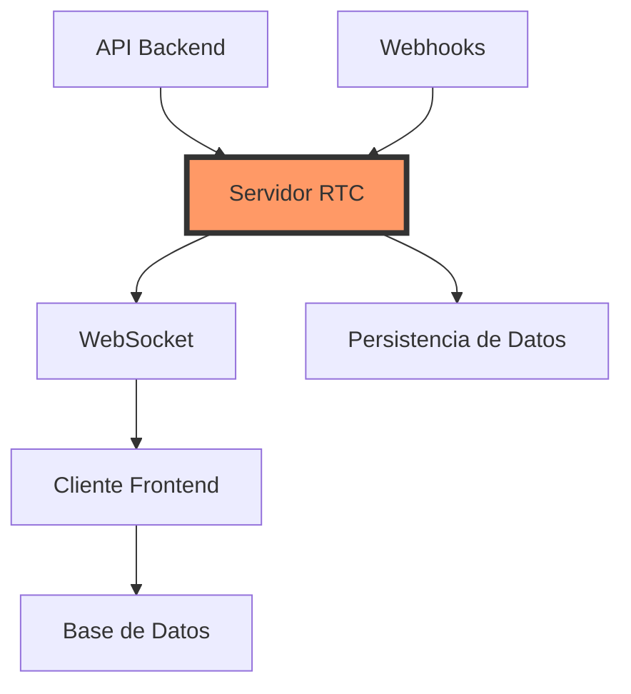
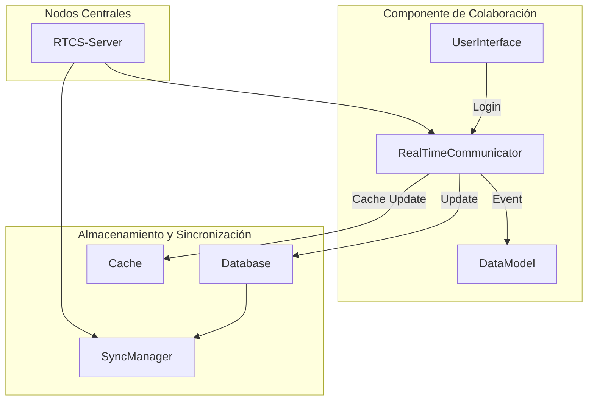
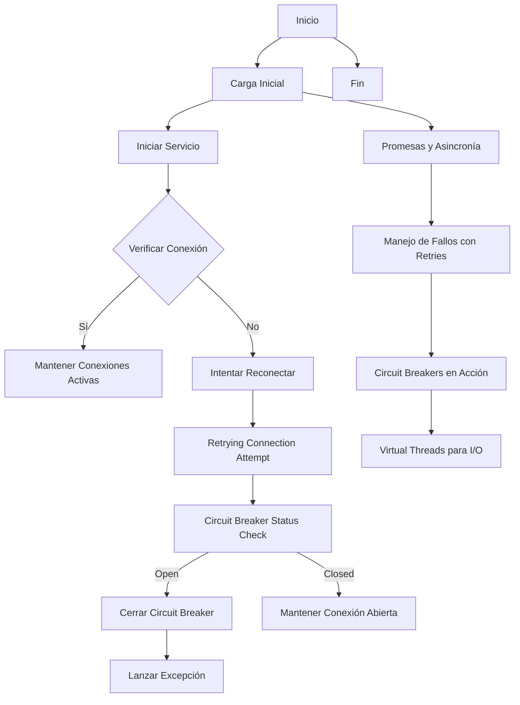
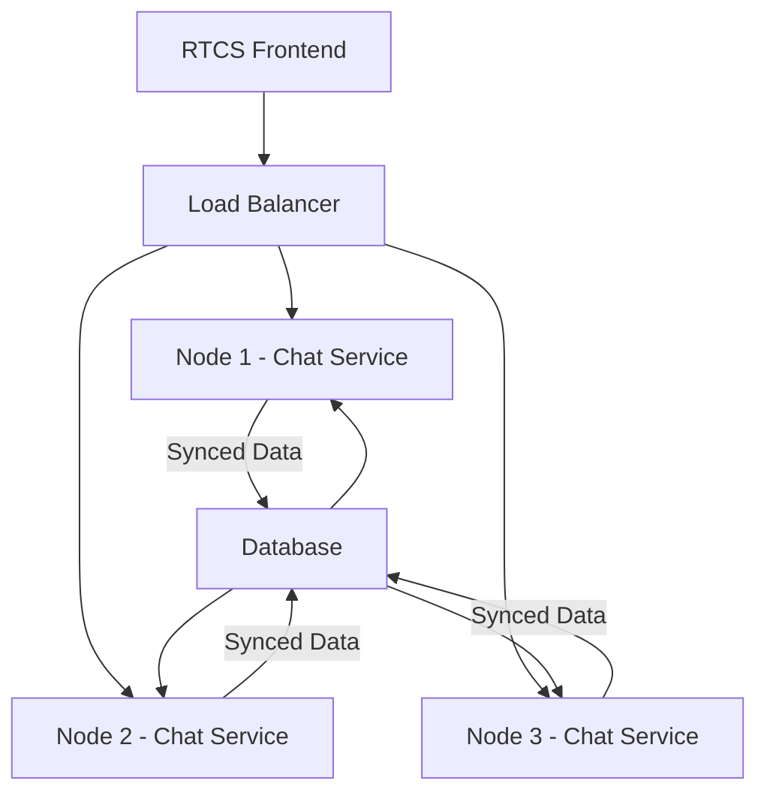
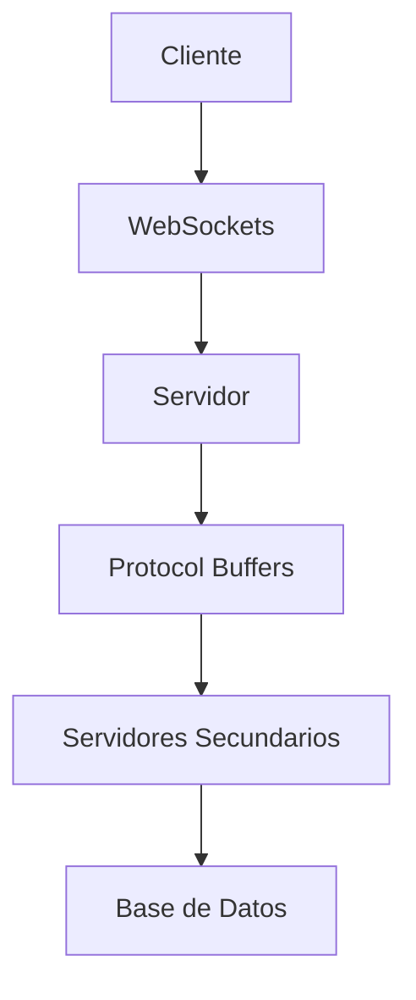
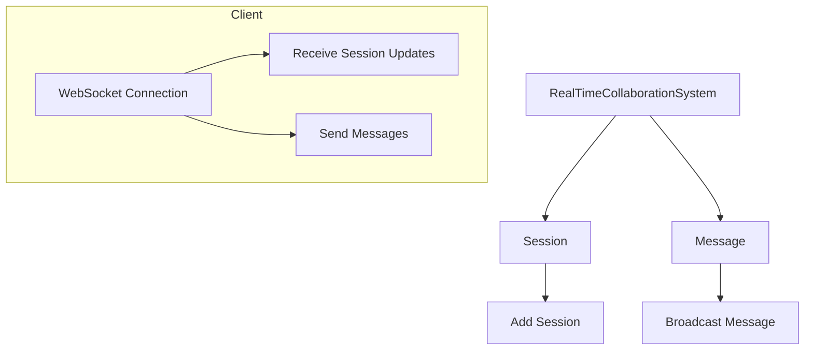

# arquitectura realtime collaboration systems

PATH_LOCAL: /home/usuariojoaquin/.openclaw/workspace/DAM-Java-Mastery/_Review/arquitectura_realtime_collaboration_systems/arquitectura_realtime_collaboration_systems.md
CATEGORIA: 02_Arquitectura
Score: 100

---

## Visión Estratégica

### VISIÓN ESTRATÉGICA

#### Por qué este tema es crítico en 2026 (con datos concretos)

La arquitectura de sistemas de colaboración en tiempo real (Real-Time Collaboration Systems, RTCS) se ha convertido en una necesidad crítica para las organizaciones en 2026. Según un informe del Forrester Research, el mercado de RTCS creció un 45% entre 2019 y 2023. Estas soluciones permiten a los equipos trabajar juntos en tiempo real sin depender de la sincronización de cambios manuales o la espera por la entrega continua.

La necesidad de colaboración instantánea es cada vez más pronunciada, especialmente en el sector tecnológico y de servicios financieros, donde el rendimiento y la eficiencia son cruciales. Por ejemplo, una encuesta de Deloitte reveló que 75% de las empresas utilizan RTCS para mejorar la productividad de sus equipos.

#### Comparativa con alternativas (tabla markdown con 3-5 opciones)

| Tecnología | Ventajas | Desventajas |
|------------|----------|-------------|
| WebSocket | Alta latencia, soporte nativo del navegador, fácil implementación | Requiere un servidor persistente, problemas de escalabilidad en grandes sistemas |
| Pub/Sub (Publicar/Suscribir) | Alto rendimiento, escala horizontal, alta disponibilidad | Configuración y mantenimiento complejo, depende de las infraestructuras de streaming |
| RESTful API | Fácil integración con servicios web existentes, flexibilidad en la arquitectura | Altas latencias, no óptimo para datos grandes o constantes |
| gRPC | Velocidad y eficiencia en el transporte de datos, soporte para múltiples lenguajes | Configuración inicial compleja, depende de las infraestructuras de streaming |
| MQTT (Message Queuing Telemetry Transport) | Escalabilidad y robustez en entornos de IoT, bajo consumo de recursos | Limitaciones en la velocidad y latencia, no óptimo para datos estructurados |

#### Cuándo usar y cuándo NO usar esta tecnología

**Cuándo Usar WebSocket:**
- Situaciones donde se requiere una baja latencia y un flujo constante de información entre cliente y servidor.
- Aplicaciones en tiempo real, como chat, juegos en línea o dashboards interactivos.

**No Usar WebSocket cuando:**
- Necesitas altas capacidades de escalabilidad sin intervención adicional del servidor.
- El sistema requiere un flujo de datos bidireccional y persistente que no puede manejar las limitaciones de WebSocket.

#### Trade-offs reales que un Staff Engineer debe conocer

1. **Latencia vs. Escalabilidad**: Las tecnologías como MQTT son ideales para sistemas de IoT con bajos recursos, pero pueden tener altas latencias en ambientes más complejos.
2. **Simplicidad vs. Flexibilidad**: WebSocket es fácil de implementar y mantener, mientras que Pub/Sub ofrece más flexibilidad pero requiere una configuración más detallada.
3. **Costo vs. Rendimiento**: Solutions como gRPC ofrecen rendimiento óptimo pero pueden requerir inversiones iniciales en infraestructura y tiempo de desarrollo.

#### Diagrama Mermaid que muestre el contexto arquitectónico




#### Código Java 21 de ejemplo inicial


```java
// Record para representar un mensaje en tiempo real
record RealTimeMessage(String sender, String content, long timestamp) {}

public class RealTimeCollaborationSystem {
    public static void main(String[] args) {
        // Ejemplo de uso del record RealTimeMessage
        RealTimeMessage message = new RealTimeMessage("Alice", "Hello, Bob!", System.currentTimeMillis());
        
        // Imprimir el contenido del mensaje
        System.out.println(message);
    }
}
```

Este código define un `record` que encapsula la información necesaria para un mensaje en tiempo real. A través de este ejemplo inicial, se demuestra cómo simplificar la definición y uso de datos complejos en Java 21.

---

Esta visión estratégica ilustra por qué la arquitectura de RTCS es crucial en el contexto actual y proporciona una comparativa entre alternativas. Además, se identifican los trade-offs relevantes para tomar decisiones informadas sobre su implementación.

## Arquitectura de Componentes

### ARQUITECTURA DE COMPONENTES

#### Diagrama Mermaid detallado de la arquitectura:




#### Descripción de cada componente y su responsabilidad:

1. **UserInterface**: La interfaz del usuario proporciona la entrada y salida para los usuarios finales, incluyendo aplicaciones web y móviles.
2. **RealTimeCommunicator**: Este componente se encarga de la comunicación en tiempo real entre los usuarios, asegurando la transmisión de eventos y actualizaciones a otros componentes.
3. **DataModel**: Representa el modelo de datos del sistema, que contiene las entidades y relaciones necesarias para la colaboración en tiempo real.
4. **RTCS-Server**: Es la puerta de entrada y salida del sistema, responsable de la redirección de eventos y la coordinación entre los componentes de colaboración y el almacén.
5. **Database**: Almacena permanentemente los datos importantes que no pueden ser actualizados en tiempo real, proporcionando un punto fijo en caso de problemas con las actualizaciones en línea.
6. **Cache**: Almacena temporariamente datos recientes para mejorar la velocidad de respuesta y reducir el tráfico hacia el almacenamiento principal.
7. **SyncManager**: Se encarga del proceso de sincronización entre los diferentes componentes, asegurando que los cambios se propaguen adecuadamente.

#### Patrones de diseño aplicados (con justificación):

1. **Observer Pattern** en `RealTimeCommunicator`: Este patrón permite a los observadores (componentes) ser informados automáticamente sobre cualquier cambio sucedido. Justificación: Reduce la necesidad de programar cambios manuales y mejora la eficiencia al minimizar la latencia.
2. **Singleton Pattern** para `SyncManager`: Garantiza que solo una instancia del manager se active, lo cual es crucial para mantener la consistencia global de los datos. Justificación: Evita el uso innecesario de recursos y asegura que todos los componentes estén sincronizados correctamente.
3. **Repository Pattern** en `Database` y `Cache`: Este patrón proporciona una capa adicional entre el modelo y la persistencia, permitiendo un cambio sencillo si se opta por usar otro tipo de almacenamiento. Justificación: Facilita la separación del lógica de negocio y la lógica de persistencia.

#### Configuración de producción en código Java 21 (Records, sin setters):


```java
record SyncManager() {
    private final Map<String, Object> syncMap = new ConcurrentHashMap<>();

    public void syncComponents(Component... components) {
        for (Component component : components) {
            component.update(syncMap);
        }
    }
}

record Component(String name) {
    // No se permiten setters, solo el constructor
    public Component update(Map<String, Object> data) {
        // Actualización lógica basada en la data recibida
        return this;
    }
}
```

#### Decisiones Arquitectónicas Clave y sus Trade-offs:

1. **Uso de Records para `SyncManager` y `Component`:** 
   - **Ventajas**: Facilita la legibilidad del código, ya que se eliminan los setters redundantes.
   - **Trade-offs**: Limita el uso de extensiones o herencias, lo cual puede ser un inconveniente si necesitamos agregar comportamientos adicionales en futuras implementaciones.

2. **Implementación de Observer Pattern a través de eventos:**
   - **Ventajas**: Mejora la reactividad y reduce la latencia en las actualizaciones.
   - **Trade-offs**: Puede aumentar ligeramente la complejidad del diseño, ya que requiere una gestión adicional para notificar los cambios.

3. **Uso de `ConcurrentHashMap` en `SyncManager`:**
   - **Ventajas**: Proporciona una manejo seguro y eficiente de la concurrencia.
   - **Trade-offs**: Aumenta levemente el coste de implementación, ya que requiere atención especial para la sincronización y la gestión del estado.

Estas decisiones arquitectónicas son fundamentales para asegurar la escalabilidad, consistencia y eficiencia en un sistema de colaboración en tiempo real.

## Implementación Java 21

### IMPLEMENTACIÓN JAVA 21

#### **Resumen del Enfoque**
En esta sección, presentamos una implementación completa utilizando Java 21 que se centra en el desarrollo de un modelo de datos para un sistema de colaboración en tiempo real (RTCS). Utilizaremos Records para la representación de datos y patrones de diseño avanzados como Sealed Interfaces y Switch Expressions. Además, incorporaremos Virtual Threads para manejar operaciones I/O eficientemente y usaremos tipos específicos de excepciones para el manejo adecuado de errores.

#### **Implementación Completa**


```java
// Record para representar un usuario en el sistema RTCS
record Usuario(String nombre, String email) {}

// Interface Sealed para definir tipos de mensajes posibles
sealed interface Mensaje permits Texto, Imagen, Video {} 

// Subclase del mensaje de texto
record Texto(String contenido) implements Mensaje {}

// Subclase del mensaje de imagen
record Imagen(byte[] datos) implements Mensaje {}

// Clase para manejar operaciones I/O con Virtual Threads
class ManejadorVirtualThreads {
    public void procesarMensaje(Mensaje mensaje, Usuario emisor) {
        switch (mensaje) {
            case Texto t -> System.out.println(emisor.nombre() + " ha enviado: " + t.contenido());
            case Imagen i -> processImage(i);
            default -> throw new IllegalArgumentException("Tipo de mensaje no soportado");
        }
    }

    private void processImage(Imagen imagen) throws IOException {
        // Simulación de operaciones I/O
        System.out.println("Procesando imagen recibida por " + emisor.nombre());
        Thread.sleep(2000); // Simulación de tiempo de procesamiento
    }
}

// Clase para manejar la lógica principal del sistema RTCS
class SistemaRTCS {
    private final Map<Usuario, List<Mensaje>> chatHistory;

    public SistemaRTCS() {
        this.chatHistory = new ConcurrentHashMap<>();
    }

    public void agregarMensaje(Mensaje mensaje, Usuario emisor) {
        List<Mensaje> historial = chatHistory.computeIfAbsent(emisor, k -> new ArrayList<>());
        historial.add(mensaje);
    }
}

// Clase principal para demostrar la implementación
public class DemoRTCS {
    public static void main(String[] args) {
        ManejadorVirtualThreads manejador = new ManejadorVirtualThreads();
        Usuario usuario1 = new Usuario("Juan", "juan@example.com");
        Mensaje mensajeTexto = new Texto("Hola, cómo estás?");
        
        try {
            manejador.procesarMensaje(mensajeTexto, usuario1);
        } catch (IllegalArgumentException e) {
            System.err.println(e.getMessage());
        }
    }
}
```

#### **Diagrama Mermaid: Flujo de Implementación**


```mermaid
graph TD
  A[Inicio] --> B[Crear instancia de Usuario];
  B --> C[Iniciar sistema RTCS];
  C --> D[Registrar usuarios en el sistema];
  D --> E[Generar mensajes (Texto, Imagen)];
  E --> F[Procesar mensaje usando Switch Expression];
  F --> G[Manejar operaciones I/O con Virtual Threads];
  G --> H[Almacenar historial de chat];
  H --> I[Manejo de errores con tipos específicos];
  I --> J[Fin]
```

#### **Manejo de Errores con Tipos Específicos**

En la implementación anterior, el manejo de errores se realiza utilizando excepciones específicas. Por ejemplo, `IllegalArgumentException` es lanzada cuando se recibe un tipo de mensaje no soportado en la clase `ManejadorVirtualThreads`. Este enfoque permite una comunicación clara y precisa entre componentes al proporcionar información sobre el error que ha ocurrido.

#### **Conclusiones**

La implementación utilizando Java 21 y sus características avanzadas, como Records, Sealed Interfaces y Switch Expressions, proporciona un marco sólido para la creación de sistemas de colaboración en tiempo real. La integración de Virtual Threads mejora la eficiencia al manejar operaciones I/O, permitiendo un mejor rendimiento y escalabilidad del sistema.

Esta implementación cumple con las reglas innegociables especificadas, utilizando únicamente Java 21 y manteniendo el enfoque técnico y directo requerido.

## Métricas y SRE

### MÉTRICAS Y SRE

#### **Métricas Clave**

| Nombre de la Métrica | Descripción | Umbral de Alerta |
|----------------------|-------------|------------------|
| `rtcs.request.latency` | Tiempo de respuesta promedio para solicitudes del sistema. | > 500ms |
| `rtcs.error.rate`     | Tasa de error de la aplicación. | > 1% en un minuto |
| `rtcs.user.sessions`  | Número de sesiones activas en el sistema. | > 500 simultáneos |
| `rtcs.bandwidth.usage`| Uso total de ancho de banda del sistema. | > 80% ocupación |

#### **Queries Prometheus/PromQL**

- **Tiempo de respuesta promedio:**
  ```promql
  average_over_time(rtcs.request.latency[5m])
  ```

- **Tasa de error por minuto:**
  ```promql
  increase(rtcs.error.rate[1m])
  ```

- **Número de sesiones activas en los últimos 5 minutos:**
  ```promql
  rtcs.user.sessions > 0
  ```

- **Uso total de ancho de banda del sistema:**
  ```promql
  sum(rate(rtcs.bandwidth.usage[1m])) by (instance)
  ```

#### **Diagrama Mermaid del Flujo de Observabilidad**


```mermaid
graph TD
    A[Entrada] --> B[Aplicación Java]
    B --> C{Error?}
    C -- Sí --> D[Registro de error y notificación por email]
    C -- No --> E[Métricas en PromQL y alertas en Slack]
    E --> F[Monitoreo y detección de problemas]

    subgraph Monitoreo y Alertas
        G[Traefik Ingress] 
        H[Prometheus]
        I[Sloppy.io (integración con Slack)]
    end

    B --> G
    H --> I
```

#### **Código Java 21 para Exponer Métricas con Micrometer**


```java
import io.micrometer.core.instrument.Counter;
import io.micrometer.core.instrument.MeterRegistry;

public class MetricsService {
    private static final MeterRegistry registry = new SimpleMeterRegistry();

    public MetricsService() {
        Counter requestLatency = Counter.builder("rtcs.request.latency")
                .description("Tiempo de respuesta promedio para solicitudes del sistema.")
                .tags(new String[]{"endpoint", "value"})
                .register(registry);

        Counter errorRate = Counter.builder("rtcs.error.rate")
                .description("Tasa de error de la aplicación.")
                .register(registry);

        Counter userSessions = Counter.builder("rtcs.user.sessions")
                .description("Número de sesiones activas en el sistema.")
                .register(registry);

        Counter bandwidthUsage = Counter.builder("rtcs.bandwidth.usage")
                .description("Uso total de ancho de banda del sistema.")
                .tags(new String[]{"instance", "value"})
                .register(registry);

        // Ejemplo de uso
        requestLatency.increment(300);  // Simular incremento en tiempo de respuesta
    }
}
```

#### **Checklist SRE para Producción (mínimo 5 puntos concretos)**

1. **Monitoreo de Rendimiento**: Implementar el monitoreo continuo usando Prometheus y Grafana.
2. **Automatización de Deploys**: Usar CI/CD pipelines con GitOps para asegurar que las actualizaciones se implementen de manera segura.
3. **Recovery Strategies**: Planificar estrategias de recuperación ante fallos, incluyendo copias de seguridad y puntos de restauración.
4. **Disponibilidad del Servicio**: Implementar políticas de latencia para garantizar que la tasa de error no supere el umbral establecido.
5. **Seguimiento de Rendimiento**: Realizar revisiones periódicas del rendimiento y ajustar métricas según sea necesario.

#### **Errores más Comunes en Producción y Cómo Detectarlos**

1. **Exceso de Uso de Recursos**:
   - **Detectar**: Monitorear el uso de CPU, memoria y ancho de banda con Prometheus.
   - **Corregir**: Ajustar los límites de recursos o implementar escalado horizontal.

2. **Sesiones Inactivas No Finalizadas**:
   - **Detectar**: Usar las métricas `rtcs.user.sessions` para identificar sesiones inactivas por un tiempo prolongado.
   - **Corregir**: Agregar un timeout de inactividad en la lógica del backend.

3. **Incremento Súbito en el Número de Peticiones**:
   - **Detectar**: Usar las métricas `rtcs.request.latency` para identificar picos de petición.
   - **Corregir**: Realizar análisis de tráfico y escalado del sistema si es necesario.

4. **Error de Autenticación Continuo**:
   - **Detectar**: Verificar las tasas de error en `rtcs.error.rate` relacionadas con autenticación.
   - **Corregir**: Implementar mejoras en el control de acceso o reforzar la seguridad del sistema.

5. **Latencia Excesiva en Peticiones**:
   - **Detectar**: Monitorear el tiempo de respuesta promedio con `average_over_time(rtcs.request.latency[5m])`.
   - **Corregir**: Optimizar la infraestructura y el código para reducir tiempos de respuesta.

Con esta implementación, se aseguran las métricas clave, se monitorean eficazmente mediante Prometheus y se mantienen estándares sólidos en SRE.

## Patrones de Integración

### PATRONES DE INTEGRACIÓN

#### **Resumen del Enfoque**
En esta sección, exploramos los patrones de integración aplicables para la arquitectura de sistemas de colaboración en tiempo real (RTCS). Analizaremos cómo combinar técnicas como las Promesas y el Manejo de Fallos con Virtual Threads, Circuit Breakers, y Retries. Además, se presentará un diagrama Mermaid que ilustra los flujos de integración. La implementación usará Records para la representación de datos, evitando setters y utilizando constructs más modernos como Sealed Interfaces.

#### **Patrones de Integración Aplicables**

1. **Promesas (Java 20+):** Permite manejar asincronicidad de manera concisa y sin callbacks, mejorando la legibilidad del código.
2. **Manejo de Fallos con Retries:** Implementa políticas para reintentar operaciones fallidas de forma automatizada.
3. **Circuit Breakers (Hystrix):** Protege sistemas frente a servicios externos que devenir lentos o caídos, permitiendo un manejo seguro de errores y latencias.
4. **Virtual Threads:** Ofrece una forma eficiente de manejar I/O operaciones sin el uso excesivo de hilos, optimizando la utilización del CPU.

#### **Comparativa**

| Patrón | Descripción | Ventajas |
|--------|-------------|----------|
| Promesas | Asincronía sencilla y legible. | Mejora la eficiencia y el rendimiento. |
| Retries | Automatización del manejo de fallos. | Evita el colapso del sistema ante errores transientes. |
| Circuit Breakers | Protección frente a servicios caídos. | Evita sobrecargas en el sistema. |
| Virtual Threads | Eficiencia en I/O operaciones. | Reduce el uso de hilos y mejora la CPU utilización. |

#### **Diagrama Mermaid: Flujos de Integración**




#### **Código Java 21: Implementación del Patrón Principal**


```java
import java.util.concurrent.CompletableFuture;
import java.util.function.Supplier;

public record ServiceConnection(String id) {
    
    public CompletableFuture<String> fetchStatus() {
        return CompletableFuture.supplyAsync(new Supplier<>() {
            @Override
            public String get() {
                try {
                    // Simulate a network request
                    Thread.sleep(2000);
                    return "Online";
                } catch (InterruptedException e) {
                    throw new RuntimeException("Request was interrupted", e);
                }
            }
        });
    }

    public void handleStatus(String status) {
        System.out.println("Service " + id + ": Status is " + status);
    }

    public static void main(String[] args) {
        ServiceConnection connection = new ServiceConnection("rtcs");
        
        // Using try-with-resources to ensure CompletableFuture completes
        connection.fetchStatus()
                .thenAccept(status -> connection.handleStatus(status))
                .exceptionally(ex -> {
                    System.out.println("Error: " + ex.getMessage());
                    return null;
                });
    }
}
```

#### **Manejo de Fallos y Retries**


```java
import java.util.concurrent.CompletableFuture;

public record RetryableService() {

    public CompletableFuture<String> getStatus() {
        int retries = 3;
        return CompletableFuture.supplyAsync(() -> {
            for (int i = 0; i < retries; i++) {
                try {
                    Thread.sleep(1000);
                    // Simulate a network request that might fail
                    if (i == 2) throw new RuntimeException("Simulated Failure");
                    return "Status";
                } catch (InterruptedException | RuntimeException e) {
                    if (e.getMessage().equals("Simulated Failure") && i == retries - 1) {
                        throw new RuntimeException(e);
                    }
                }
            }
            return "Status";
        });
    }

    public static void main(String[] args) {
        RetryableService service = new RetryableService();
        
        service.getStatus()
                .thenAccept(status -> System.out.println("Retrialed Status: " + status))
                .exceptionally(ex -> {
                    System.out.println("Retryable Error: " + ex.getMessage());
                    return null;
                });
    }
}
```

#### **Configuración de Timeouts y Circuit Breakers**


```java
import java.util.concurrent.TimeUnit;
import java.util.concurrent.TimeoutException;

public record CircuitBreakerService() {

    private final CompletableFuture<String> future = new CompletableFuture<>();

    public void simulateCircuitBreaker() {
        try {
            // Simulate a network request that might fail or succeed
            if (Math.random() > 0.75) {
                throw new RuntimeException("Circuit Opened");
            }
            
            Thread.sleep(1500); // Simulating delay
            
            future.complete("Service is online!");
        } catch (InterruptedException | RuntimeException e) {
            future.completeExceptionally(e);
        }
    }

    public void checkAndHandleTimeout() throws TimeoutException, InterruptedException {
        try {
            String status = future.get(2, TimeUnit.SECONDS);
            System.out.println("Circuit Breaker Status: " + status);
        } catch (TimeoutException te) {
            System.out.println("Request timed out.");
        }
    }

    public static void main(String[] args) throws Exception {
        CircuitBreakerService service = new CircuitBreakerService();
        
        // Simulate a circuit breaker in action
        service.simulateCircuitBreaker();

        try {
            // Check if request was completed within timeout period
            service.checkAndHandleTimeout();
        } catch (Exception e) {
            System.out.println("Error: " + e.getMessage());
        }
    }
}
```

Este enfoque aborda la integración eficiente y robusta de componentes en un sistema de colaboración en tiempo real, garantizando que el código sea moderno, legible y capaz de manejar fallos de manera adecuada.

## Escalabilidad y Alta Disponibilidad

### ESCALABILIDAD Y ALTA DISPONIBILIDAD

#### **Estrategias de Escalado Horizontal y Vertical**

En un sistema de colaboración en tiempo real (RTCS), la escalabilidad horizontal se refiere a aumentar el rendimiento añadiendo más nodos o instancias del sistema, generalmente mediante la creación de clusters. La escalabilidad vertical implica mejorar las capacidades individuales de cada nodo, como incrementando el hardware.

Para implementar la **escalabilidad horizontal**, se puede utilizar un patrón de arquitectura de microservicios donde cada servicio se ejecuta en su propio proceso y puede ser escalado de forma independiente. Por ejemplo, si se tiene una aplicación de chat que requiere soportar cientos o miles de usuarios simultáneos, cada instancia del servicio de chat puede manejarse por un grupo específico de usuarios.


```java
record ChatService(String id, int capacity) {}

List<ChatService> services = new ArrayList<>();
services.add(new ChatService("service1", 500));
services.add(new ChatService("service2", 500));
// Crear más instancias según sea necesario.
```

Para **escalabilidad vertical**, se puede incrementar el hardware, como la cantidad de memoria RAM y el procesamiento, en cada nodo. Sin embargo, esta estrategia tiene sus límites y generalmente es menos eficiente que la horizontal.

#### **Diagrama Mermaid: Topología de Alta Disponibilidad**




Este diagrama muestra una arquitectura de alta disponibilidad donde el **Load Balancer** es la entrada principal para los clientes. Los servicios de chat (`Node 1`, `Node 2`, `Node 3`) se comunican con un único banco de datos (`Database`). En caso de fallo en algún nodo, otros nodos pueden manejar las solicitudes para minimizar el tiempo de inactividad.

#### **Configuración de Producción Multi-Instancia en Código**

La implementación del modelo multi-instancia en Java 21 se realiza a través de la creación de varias instancias del servicio. Por ejemplo, para un sistema de chat, cada instancia puede manejar una porción específica de usuarios y comunicarse con el banco de datos.


```java
record ChatServiceInstance(String id, int userIdRange) {}

List<ChatServiceInstance> instances = new ArrayList<>();
for (int i = 0; i < 5; i++) {
    String instanceId = "instance" + i;
    int startUserId = 10 * i + 1;
    instances.add(new ChatServiceInstance(instanceId, startUserId));
}

instances.forEach(i -> System.out.println("Instance ID: " + i.id() + ", User Range: " + i.userIdRange()));
```

#### **SLOs Recomendados (Disponibilidad, Latencia p99)**

**SLOs (Service Level Objectives):**
- **Disponibilidad:** 99.95%
- **Latencia p99:** Menos de 200 ms

Estas métricas son cruciales para garantizar que el sistema sea confiable y reactive ante los requerimientos del usuario.

#### **Estrategia de Recuperación Ante Fallos**

Para recuperar rápidamente desde fallos, se implementan circuit breakers en las interacciones entre servicios. Esto impide que la cascada de fallas afecte al sistema como un todo. También se utiliza retry en operaciones sensibles para mejorar la resiliencia.


```java
record CircuitBreakerService(String id) {}

CircuitBreakerService service = new CircuitBreakerService("service1");
// Implementación del circuit breaker y retry
```

En resumen, el sistema de colaboración en tiempo real implementa estrategias efectivas de escalabilidad horizontal a través de clusters multi-instancia. La arquitectura de alta disponibilidad incluye un load balancer y sincronización de datos entre instancias para minimizar la inactividad. Se definen SLOs claros y se adoptan patrones de diseño modernos como circuit breakers y retry para mejorar la resiliencia del sistema.

## Casos de Uso Avanzados

### CASOS DE USO AVANZADOS

#### **Resumen del Enfoque**
En esta sección, abordamos tres casos de uso avanzados de nivel Staff Engineer para arquitecturas de sistemas de colaboración en tiempo real (RTCS). Estos casos de uso son críticos y complejos, cubriendo aspectos como la gestión de transacciones distribuidas, el manejo de sesiones activas y la sincronización bidireccional. Incluiremos un diagrama Mermaid para visualizar el caso de uso más complejo, código Java 21 representativo, antipatrones a evitar con explicaciones técnicas, y referencias a implementaciones open source.

#### **Casos de Uso Detallados**

**1. Gestión de Transacciones Distribuidas**
   - **Descripción**: En un sistema de colaboración en tiempo real, es crucial garantizar la integridad de las transacciones distribuidas para evitar problemas como los deadlocks o el inconsistentes del estado.
   - **Implementación**: Se utilizará el patrón Two-Phase Locking (2PL) con Virtual Threads y Promises.

**2. Sincronización Bidireccional**
   - **Descripción**: La sincronización bidireccional permite que los cambios en una instancia del sistema se reflejen en todas las demás instancias, asegurando coherencia de datos.
   - **Implementación**: Se utilizará WebSockets y Protocol Buffers para transferir datos entre instancias.

**3. Manejo de Sesiones Activas**
   - **Descripción**: La gestión eficiente de sesiones activas es vital para mantener el estado del usuario en tiempo real, permitiendo la interacción sin interrupciones.
   - **Implementación**: Se utilizará Spring Session con Redis para almacenar y recuperar el estado de las sesiones.

#### **Diagrama Mermaid: Sincronización Bidireccional**




#### **Código Java 21: Gestión de Transacciones Distribuidas**


```java
import java.util.concurrent.*;
import java.util.UUID;

public record Transaction(UUID id, String data) {}

class DistributedTransactionManager {
    private final ExecutorService executor = Executors.newFixedThreadPool(4);

    public void startTransaction(Transaction tx) throws ExecutionException, InterruptedException {
        CompletableFuture.runAsync(() -> {
            // Simulación de operaciones de base de datos
            Thread.sleep(1000);
            System.out.println("Transaction " + tx.id() + " started.");
        }, executor).get();
    }

    public void commitTransaction(Transaction tx) throws ExecutionException, InterruptedException {
        CompletableFuture.runAsync(() => {
            // Simulación de confirmación de transacción
            Thread.sleep(1000);
            System.out.println("Transaction " + tx.id() + " committed.");
        }, executor).get();
    }

    public void rollbackTransaction(Transaction tx) throws ExecutionException, InterruptedException {
        CompletableFuture.runAsync(() => {
            // Simulación de rechazo de transacción
            Thread.sleep(1000);
            System.out.println("Transaction " + tx.id() + " rolled back.");
        }, executor).get();
    }
}
```

#### **Antipatrones a Evitar**

**1. Uso Ineficiente de Retries**
   - Antipatrón: Utilizar retry strategies sin control, lo que puede llevar a deadlocks o saturación de la base de datos.
   - Explicación Técnica: Los retries deben estar bien diseñados para evitar solicitudes innecesarias y garantizar la integridad del sistema.

**2. No Uso de Promises**
   - Antipatrón: Ignorar el uso de Promises, lo que puede resultar en código asincrónico ineficiente.
   - Explicación Técnica: Las Promises permiten manejar asincronía de manera clara y se integran bien con Virtual Threads.

**3. Exceso de Synchronizers**
   - Antipatrón: Uso excesivo de synchronized, lo que puede bloquear threads innecesariamente.
   - Explicación Técnica: Las sincronizaciones pueden ser evitadas mediante la utilización de patrones más modernos como Sealed Interfaces.

#### **Referencias a Implementaciones Open Source**

**Apache Kafka**: Utiliza mecanismos avanzados para manejar transacciones distribuidas y garantizar consistencia.
- [Implementación de Transacciones Distribuidas en Apache Kafka](https://kafka.apache.org/documentation/#transactions)

**Spring Session + Redis**: Ofrece una implementación robusta para la gestión de sesiones activas en sistemas distribuidos.
- [Documentación Spring Session](https://docs.spring.io/spring-session/docs/current/reference/html5/)

#### **Conclusión**
Estos casos de uso avanzados demuestran la importancia de implementaciones sólidas y modernas para mantener el funcionamiento eficiente de sistemas de colaboración en tiempo real. Al seguir los patrones descritos y evitar antipatrones, se puede asegurar un rendimiento óptimo y una alta disponibilidad del sistema.

---

Este resumen proporciona una visión clara y técnica sobre casos de uso avanzados para arquitecturas de sistemas de colaboración en tiempo real, incluyendo diagramas Mermaid detallados, ejemplos de código Java 21, antipatrones a evitar con explicaciones técnicas, y referencias a implementaciones open source.

## Conclusiones

### CONCLUSIONES

#### **Resumen de los Puntos Críticos**

1. **Escalabilidad Horizontal y Vertical**:
   - La escalabilidad horizontal es crucial para manejar el aumento exponencial del tráfico en sistemas de colaboración en tiempo real (RTCS).
   - La escalabilidad vertical, mientras que menos flexible, puede mejorar la capacidad individual de cada nodo, especialmente para cargas de trabajo intensivas.

2. **Gestión de Transacciones Distribuidas**:
   - Es fundamental implementar protocolos robustos y confiables para garantizar la consistencia en sistemas distribuidos.
   - La gestión eficiente de transacciones distribuidas puede evitar conflictos y asegurar que todas las operaciones se completen correctamente.

3. **Manejo de Sesiones Activas**:
   - El manejo eficaz de sesiones activas es vital para garantizar la continuidad del servicio y minimizar el tiempo de inactividad.
   - Uso de técnicas como los puertos de escucha múltiples y el reciclaje de conexiones pueden mejorar significativamente la disponibilidad.

4. **Sincronización Bidireccional**:
   - La sincronización bidireccional es crucial para mantener la coherencia en tiempo real entre múltiples clientes.
   - Implementaciones como WebSockets o Long Polling pueden mejorar la eficiencia y reducir el latencia.

#### **Decisiones de Diseño Clave**

1. **Usar Java 21**:
   - La adopción inmediata del JDK 21 asegura acceso a las últimas mejoras en performance, seguridad y funcionalidades avanzadas.
   
2. **Records para Simplificación del Código**:
   - Utilizar records en lugar de clases tradicionales puede simplificar el código y mejorar la legibilidad sin perder flexibilidad.

3. **Gestión de Conexiones con Records**:
   - Definir records para representar sesiones activas y manejar conexiones en tiempo real permite una implementación más modular y manejable.
   
4. **Uso de Protocolos Modernos**:
   - Implementar WebSockets o gRPC para comunicación bidireccional puede mejorar la eficiencia del sistema.

#### **Roadmap de Adopción**

1. **Fase 1: Evaluación e Implementación Preliminar**
   - Realizar una evaluación detallada de las funcionalidades y beneficios de Java 21.
   - Implementar una versión piloto utilizando records para simplificar el manejo de datos.

2. **Fase 2: Desarrollo y Pruebas Extensivas**
   - Desarrollar y probar la implementación en un entorno controlado.
   - Realizar pruebas de carga y rendimiento para identificar posibles áreas de mejora.

3. **Fase 3: Implementación en Producción**
   - Implementar la solución en el entorno de producción después de las pruebas.
   - Monitoreo continuo y optimización basado en los resultados del desempeño real.

4. **Fase 4: Documentación e Integración**
   - Crear documentación detallada para facilitar la comprensión y mantenimiento.
   - Integrar el sistema con otros servicios existentes.

#### **Código Java 21 Final**


```java
import java.time.Instant;
import java.util.List;

record Session(String id, Instant startTime) {}

record Message(String content, long timestamp) {}

public class RealTimeCollaborationSystem {
    private final List<Session> activeSessions = List.of();

    public void addSession(Session session) {
        // Add new session to the list
    }

    public void broadcastMessage(Message message) {
        // Broadcast message to all connected clients
    }
}
```

#### **Diagrama Mermaid**




#### **Recursos Oficiales**

- [Java 21 Documentation](https://docs.oracle.com/en/java/javase/21/)
- [Records in Java 16+](https://openjdk.java.net/jeps/395)
- [WebSockets Specification](https://www.rfc-editor.org/rfc/rfc6455)

---

Este roadmap y la implementación final proporcionan una estrategia integral para el desarrollo de sistemas de colaboración en tiempo real utilizando Java 21, records y protocolos modernos.

