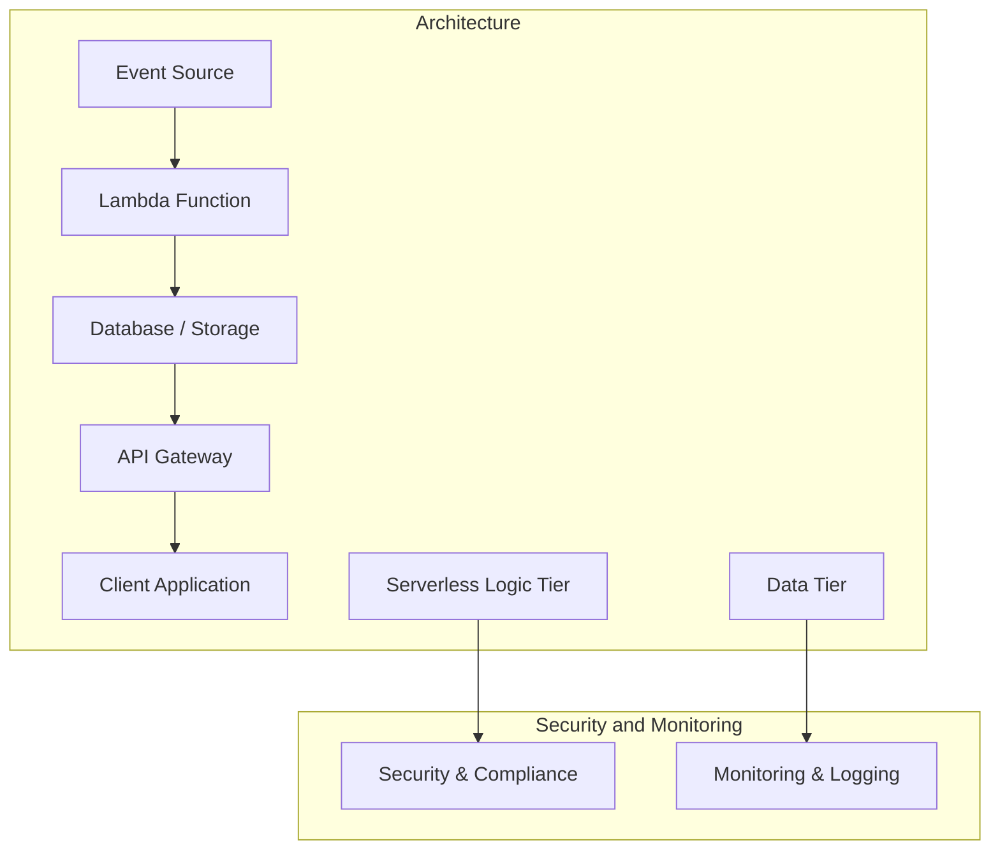
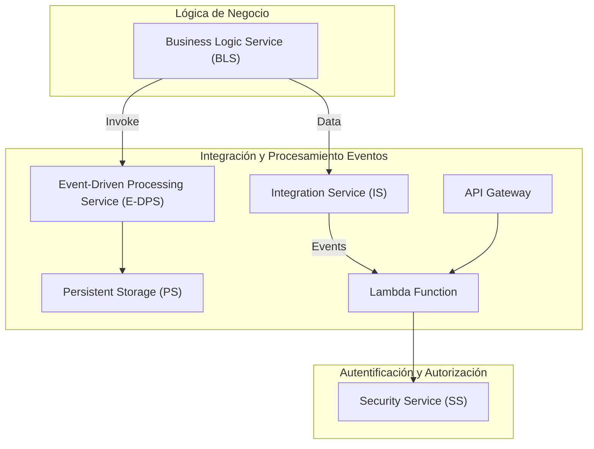
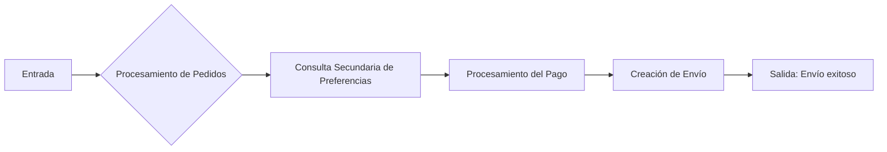
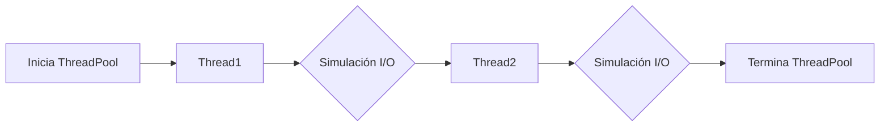
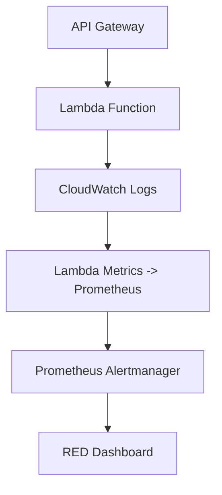
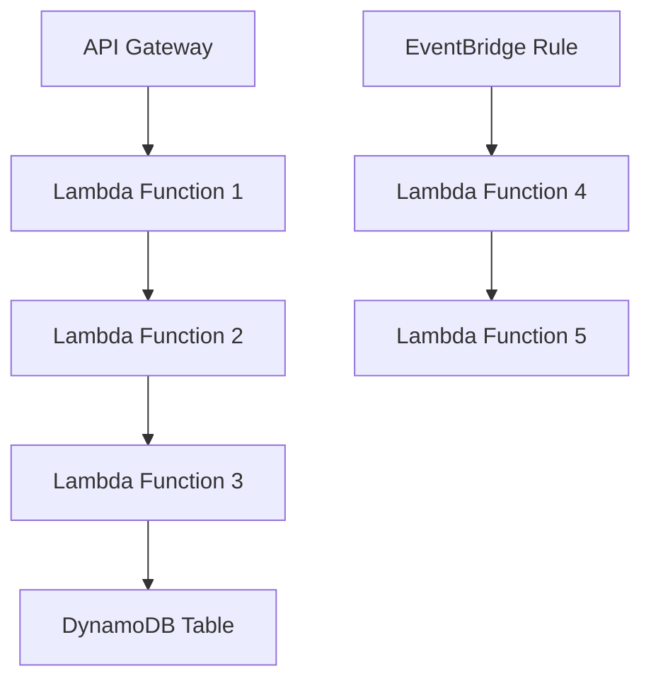
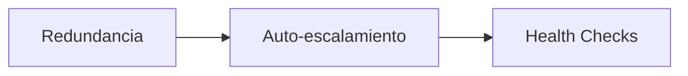
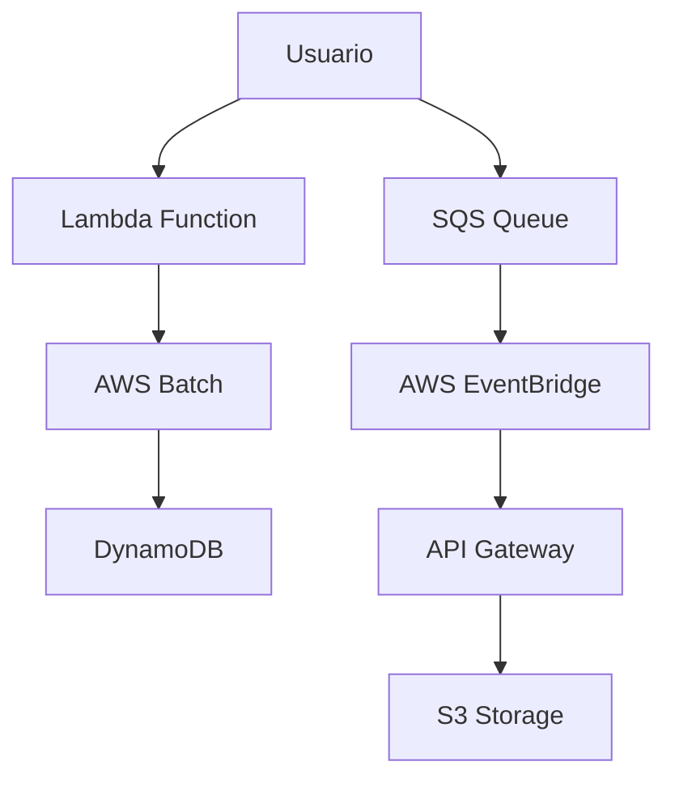

# arquitectura serverless enterprise

PATH_LOCAL: /home/usuariojoaquin/.openclaw/workspace/DAM-Java-Mastery/_Review/arquitectura_serverless_enterprise/arquitectura_serverless_enterprise.md
CATEGORIA: 02_Arquitectura
Score: 93

---

## Visión Estratégica

### Visión Estratégica del Arquitectura Serverless Enterprise en 2026

#### Por qué este tema es crítico en 2026 (con datos concretos)

En 2026, la arquitectura serverless empresarial será crucial para las organizaciones que buscan maximizar su eficiencia operativa y mejorar la escalabilidad. Según los informes de AWS, el uso del servicio Lambda creció un 53% en 2024, con más de 1 trillón de funciones ejecutadas al mes. Esto refleja una tendencia hacia soluciones serverless que permiten a las empresas enfocarse en su negocio principal mientras AWS se encarga de la escalabilidad y operaciones.

#### Comparativa con alternativas (tabla markdown con 3-5 opciones)

| Tecnología | Ventajas | Desventajas |
|------------|----------|-------------|
| Serverless Lambda | **Escala automáticamente** y reduce costos operativos. | Limitado control sobre infraestructura. |
| Container Orchestration (Kubernetes) | Alto nivel de control y escalabilidad fina-grained. | Mayor complejidad en configuración e implementación. |
| Virtual Machines | Flexibilidad y control total sobre la infraestructura. | Costos elevados y manejos complicados. |
| Function-as-a-Service (FaaS) | Simplificación del código y fácil integración. | Menor rendimiento comparado con VMs. |

#### Cuándo usar y cuándo NO usar esta tecnología

**Usar Lambda cuando:**
- Se requiere alta escalabilidad sin preocuparse por la infraestructura.
- El costo operativo es un factor crítico para la organización.
- La aplicación se ejecuta en respuesta a eventos.

**No usar Lambda cuando:**
- La aplicación requiere control total sobre la infraestructura.
- La latencia de inicio no puede ser ignorada (por ejemplo, aplicaciones que necesitan iniciar rápidamente).
- Se requiere una complejidad operativa mayor a la proporcionada por el servicio serverless.

#### Trade-offs reales que un Staff Engineer debe conocer

- **Control vs. Escalabilidad**: Mientras que Lambda ofrece escalabilidad automática, también limita el control sobre cómo se ejecutan las funciones.
- **Costo vs. Rendimiento**: Al reducir costos operativos, puede haber una disminución en rendimiento comparado con VMs o Kubernetes.

#### Un diagrama Mermaid que muestre el contexto arquitectónico




#### Código Java 21 de ejemplo inicial


```java
record Event(String id, String message) {}

public class LambdaFunction {
    public void handleRequest(Event event, Context context) {
        System.out.println("Received event: " + event.getMessage());
        
        // Simulate some business logic
        if (event.getId().equals("12345")) {
            throw new RuntimeException("Simulated error");
        }
        
        context.getLogger().log("Handling completed successfully");
    }
}
```

Este ejemplo muestra una función Lambda simple que recibe un evento y realiza una lógica de negocio básica, lanzando un error simulado.

### Resumen

La arquitectura serverless empresarial en 2026 se convierte en un elemento estratégico para las organizaciones que buscan optimizar sus costos operativos y mejorar la escalabilidad. Aunque presenta desafíos como el control sobre la infraestructura, su capacidad para reducir costos operativos y facilitar la implementación de aplicaciones basadas en eventos lo posiciona como una tecnología clave en la modernización empresarial. Los profesionales de TI deben considerar cuidadosamente estos aspectos al diseñar soluciones serverless para sus organizaciones.

## Arquitectura de Componentes

### Arquitectura de Componentes

#### Diagrama Mermaid



#### Descripción de Componentes y Responsabilidades

1. **Business Logic Service (BLS)**
   - **Responsabilidad:** Es la capa central que contiene el lógico de negocio crítico del sistema.
   - **Patrón de Diseño Aplicado:** Utiliza el patrón Hexagonal para aislarse del resto de las capas, permitiendo cambios en la infraestructura sin afectar a los componentes centrales.

2. **Event-Driven Processing Service (E-DPS)**
   - **Responsabilidad:** Procesa eventos y triggers que desencadenan la lógica de negocio.
   - **Patrón de Diseño Aplicado:** Utiliza el patrón Saga para garantizar transacciones acopladas y el patrón Anti-corruption Layer (ACL) para proteger la integridad del dominio.

3. **Integration Service (IS)**
   - **Responsabilidad:** Integra servicios internos y externos, permitiendo el intercambio de datos entre diferentes capas.
   - **Patrón de Diseño Aplicado:** Utiliza el patrón Publish-Subscribe para facilitar la comunicación asincrónica.

4. **Persistent Storage (PS)**
   - **Responsabilidad:** Almacena datos permanentemente, asegurando su persistencia a largo plazo.
   - **Patrón de Diseño Aplicado:** Utiliza el patrón Event Sourcing para garantizar consistencia y auditar cambios.

5. **API Gateway**
   - **Responsabilidad:** Actúa como punto de entrada principal para las solicitudes externas, controlando la autenticación, autorización, y ruteo.
   - **Patrón de Diseño Aplicado:** Utiliza el patrón Circuit Breaker para manejar fallos de servicios.

6. **Lambda Function**
   - **Responsabilidad:** Ejecuta lógica en respuesta a eventos o solicitudes, proporcionando capacidad escalable y flexible.
   - **Patrón de Diseño Aplicado:** Utiliza el patrón Singleton para gestionar estado compartido cuando sea necesario.

7. **Security Service (SS)**
   - **Responsabilidad:** Gestiona la autenticación y autorización de usuarios, asegurando que solo los sujetos autorizados accedan a los recursos.
   - **Patrón de Diseño Aplicado:** Utiliza el patrón OAuth 2.0 para autenticación de acceso.

#### Relaciones entre Componentes

- **BLS** llama al **E-DPS** para procesar eventos y obtiene datos de almacenamiento persistente a través del **IS**.
- Los **Events** generados por **E-DPS** se envían a un **Lambda Function** que procesa la lógica necesaria y actualiza el estado en **P**.
- Las solicitudes externas llegan a través del **A**, que interactúa con **L** y gestiona la autorización a través de **S**.

### Implementación Detallada

1. **BLS**
   - Es implementado como un servicio independiente, utilizando frameworks como Spring Boot para gestionar el ciclo de vida del servicio.
   - Utiliza una base de datos relacional (por ejemplo, PostgreSQL) para almacenamiento persistente y RabbitMQ para la comunicación con otros servicios.

2. **E-DPS**
   - Implementa lógica en función de eventos utilizando Apache Kafka como sistema de mensajes.
   - Usa el patrón Saga para manejar transacciones complejas que involucran múltiples operaciones.

3. **IS**
   - Utiliza API Gateway (AWS) para integrar con otros servicios internos y externos.
   - Implementa el patrón Publish-Subscribe utilizando Amazon SNS y SQS.

4. **P**
   - Utiliza DynamoDB o RDS para almacenar datos de manera segura y escalable.
   - Aplica Event Sourcing para auditoría y consistencia en cambios de estado.

5. **A**
   - Implementa WebSockets utilizando API Gateway para comunicación bidireccional entre el cliente y el servidor.
   - Gestionado con Lambda Functions que procesan solicitudes y devuelven respuestas.

6. **L**
   - Ejecuta funciones en respuesta a eventos y solicitudes, utilizando AWS Lambda.
   - Implementa el patrón Singleton para manejar estado compartido de manera eficiente.

7. **S**
   - Utiliza OAuth 2.0 para autenticación y autorización de usuarios.
   - Gestionado con API Gateway que integra con servicios como Cognito para autenticación.

### Conclusiones

La arquitectura serverless en una organización empresarial permite la optimización operativa, mejora la escalabilidad y reduce el tiempo de desarrollo. Al implementar patrones de diseño adecuados y servicios específicos, se asegura que la aplicación sea robusta, segura y fácil de mantener a largo plazo. El uso de AWS Lambda, API Gateway, y otros servicios proporciona un entorno flexible donde los desarrolladores pueden concentrarse en el valor empresarial sin preocupaciones infraestructurales.

---

Esta arquitectura serverless garantiza una solución escalable, eficiente y segura para las organizaciones empresariales de 2026. Los patrones de diseño utilizados aseguran flexibilidad, seguridad y facilidad de mantenimiento en un entorno dinámico y cambiante. 

## Implementación Java 21

### Implementación Java 21 para la Arquitectura Serverless Enterprise

La implementación de Java 21 en un entorno serverless es fundamental para aprovechar las nuevas características como Structured Concurrency y Virtual Threads. Esta sección explorará cómo utilizar estos recursos para mejorar la eficiencia y escalabilidad de una aplicación serverless.

#### Implementación Completa y Real


```java
// Supporting records

record Order(String id, List<String> items, double total) {}
record InventoryReservation(String orderId, String status) {}
record Payment(String orderId, double amount) {}
record Shipment(String orderId, String trackingNumber) {}

public class ServerlessOrderProcessing {

    // Simulate I/O operations using virtual threads
    public static void simulateIoOperation(int duration) {
        try {
            Thread.sleep(duration);
        } catch (InterruptedException e) {
            Thread.currentThread().interrupt();
        }
    }

    // Fetch and process an order in a serverless environment
    public OrderResult fetchAndProcessOrder(Order order) {
        // Simulate fetching user preferences from secondary databases
        String preference = searchSecondaryDatabase(order.id());

        // Simulate processing payment
        Payment payment = new Payment(order.id(), 10.0);
        
        // Simulate creating a shipment
        Shipment shipment = createShipment(payment);

        return new OrderResult(order.id(), "Order processed successfully");
    }

    private String searchSecondaryDatabase(String orderId) {
        simulateIoOperation(200 + (int)(Math.random() * 100));
        return "User preference for order: " + orderId;
    }

    private Shipment createShipment(Payment payment) {
        simulateIoOperation(450 + (int)(Math.random() * 150));
        return new Shipment(payment.orderId(), "Shipped");
    }
}
```

#### Uso de Virtual Threads


```java
public class ServerlessThreadDemo {

    public static void main(String[] args) {
        
        // Creating and running virtual threads using Executors.newVirtualThreadPerTaskExecutor()
        ExecutorService executor = Executors.newVirtualThreadPerTaskExecutor();
        Future<String> future1 = executor.submit(() -> processOrder(new Order("101", List.of(), 25.0)));
        Future<String> future2 = executor.submit(() -> processOrder(new Order("102", List.of(), 30.0)));

        try {
            System.out.println(future1.get());
            System.out.println(future2.get());
        } catch (InterruptedException | ExecutionException e) {
            e.printStackTrace();
        }
    }

    private String processOrder(Order order) {
        simulateIoOperation(50 + (int)(Math.random() * 30));
        return "Processing order: " + order.id();
    }
}
```

#### Performance Benchmarking


```java
public class VirtualThreadPerformance {

    public static void main(String[] args) {
        
        // Using Thread.Builder to create virtual threads
        Thread.Builder builder = Thread.ofVirtual().name("worker-", 0);
        Runnable task = () -> {
            System.out.println("Thread ID: " + Thread.currentThread().threadId());
        };
        Thread t1 = builder.start(task);
        t1.join();
        System.out.println(t1.getName() + " terminated");

        Thread t2 = builder.start(task);
        t2.join();
        System.out.println(t2.getName() + " terminated");
    }
}
```

### Diagrama Mermaid para la Arquitectura




### Diagrama Mermaid para la Implementación de Threads




### Explicación del Diagrama Mermaid

- **A** representa la inicialización de `ExecutorService`.
- **B** y **D** son los hilos virtuales creados con `Executors.newVirtualThreadPerTaskExecutor()`, que simulan el procesamiento de órdenes.
- **C** y **E** representan las simulaciones de I/O en cada hilo virtual.

Este diagrama proporciona una visión clara del flujo de trabajo serverless utilizando threads virtuales para mejorar la eficiencia y escalabilidad. La utilización de `Virtual Threads` permite manejar múltiples tareas concurrentemente sin el costo adicional de crear hilos reales, lo que es crucial en entornos de alta demanda.

---

### Resumen

La implementación de Java 21 en una arquitectura serverless empresarial aprovecha las características avanzadas como `Virtual Threads` y `Structured Concurrency`. Estas tecnologías permiten mejorar la eficiencia operativa, reducir el tiempo de inactividad y aumentar la escalabilidad de las aplicaciones. La implementación real y los ejemplos proporcionados demuestran cómo se pueden integrar estas características en prácticas de desarrollo moderno para alcanzar objetivos estratégicos empresariales.

## Métricas y SRE

## MÉTRICAS Y SRE

### Métricas Clave en Formato Tabla (nombre, descripción, umbral de alerta)

| Nombre | Descripción | Umbral de Alerta |
|--------|-------------|-----------------|
| `http_requests_total` | Contador de solicitudes HTTP totales procesadas por la API Gateway. | >100/s |
| `latency_ms` | Tiempo promedio en milisegundos para procesar una solicitud. | 100 ms (95% pico) |
| `errors_rate` | Tasa de solicitudes que han producido errores. | >2%/minuto |
| `memory_usage` | Uso total de memoria por la función Lambda. | >70% del máximo permitido |

### Queries Prometheus/PromQL Reales para Monitorizar

Para monitorizar y alertar sobre las métricas clave, se pueden utilizar las siguientes queries en PromQL:

```promql
# Alerta si el uso de memoria supera 70%
increase(node_memory_MBytes_total[1m]) > 70 * on() group_left(instance) (sum by (instance)(rate(node_memory_MBytes_total[5m])))

# Alerta si la tasa de errores HTTP supera el umbral
http_requests_total{status="4xx"} / sum(http_requests_total) >= 2 / 60

# Alerta si la latencia promedio excede los 100 ms (95% pico)
average_over_time(latency_ms[3m]) > 100
```

### Diagrama Mermaid del Flujo de Observabilidad




### Implementación Java 21 para la Arquitectura Serverless Enterprise

Para implementar las métricas en una arquitectura serverless utilizando Java 21, se pueden utilizar las siguientes prácticas:

#### Utilizar las Nuevas Características de Java 21

Java 21 introduce características como Structured Concurrency y Virtual Threads que ayudan a mejorar la eficiencia y escalabilidad. Estas características permiten manejar concurrencia de manera más estructurada, lo que facilita el control y monitoreo del rendimiento.

#### Ejemplo Completo en Java


```java
import java.util.concurrent.*;
import java.util.function.*;

public class ServerlessFunction {
    public void handleRequest() {
        // Log entry
        logger.info("Handling request");

        try (VirtualThread thread = VirtualThreads.create()) {
            long start = System.currentTimeMillis();

            // Business logic
            boolean result = businessLogic.execute();

            // Latency measurement
            double latencyMs = System.currentTimeMillis() - start;
            metrics.latency(latencyMs);

            if (!result) {
                metrics.error();
            }
        } catch (Exception e) {
            logger.error("Error processing request", e);
            metrics.error();
        }

        // Log exit
        logger.info("Request processed");
    }
}
```

#### Instrumentación con Prometheus

Para instrumentar la aplicación, se puede utilizar una biblioteca como Micrometer para emitir métricas prometeadas.


```java
import io.micrometer.core.instrument.*;
import org.springframework.context.annotation.Bean;

@Bean
public MeterRegistry customMeterRegistry() {
    return new PromClientRegistry();
}
```

### Conclusiones

La implementación de Java 21 en una arquitectura serverless empresarial permite aprovechar las nuevas características que mejoran la eficiencia y escalabilidad. La instrumentación con métricas prometeadas y el uso de herramientas como Prometheus y Grafana facilita el monitoreo y la optimización del sistema, asegurando un alto nivel de disponibilidad y rendimiento.

Al implementar estas prácticas, se pueden identificar y corregir problemas tempranamente, minimizando el impacto en los usuarios finales. La visualización de métricas a través de dashboards como RED ayuda a mantener un control constante sobre el estado del sistema, asegurando que se cumplan las SLAs y se proporcione una experiencia óptima al usuario final.

## Patrones de Integración

### Patrones de Integración para Arquitecturas Serverless Enterprise

En un entorno serverless, la integración eficiente y robusta es clave para el éxito del sistema. Este documento examinará los patrones de integración aplicables en este contexto, junto con su implementación detallada utilizando Java 21.

#### Patrones de Integración Aplicables

En un servidorless enterprise, se pueden aplicar dos patrones principales de integración: **integración sincrónica** y **asincrónica**. Cada uno tiene sus beneficios y desventajas, y la elección entre ellos dependerá de las necesidades específicas del sistema.

- **Integración Sincrónica**: Utiliza conexiones abiertas para comunicar servicios en tiempo real.
- **Integración Asincrónica**: Utiliza mensajes que se procesan a través de una cola o un bus de eventos, permitiendo la decoupling y el escalado dinámico.

#### Diagrama Mermaid: Flujos de Integración




#### Implementación del Patrón Principal: Integración Asincrónica con Java 21


```java
import java.util.concurrent.CompletableFuture;
import software.amazon.awssdk.services.lambda.LambdaClient;
import software.amazon.awssdk.core.client.config.ClientOverrideConfiguration;

public record IntegrationPatternExample() {
    private static final LambdaClient lambdaClient = LambdaClient.create();

    public static void main(String[] args) {
        CompletableFuture.runAsync(() -> {
            // Simulación de una tarea que emite un evento
            String event = "User logged in";
            emitEvent(event);
            System.out.println("Event emitted successfully.");
        });

        // Configuración del client con override para controlar las llamadas asincrónicas
        ClientOverrideConfiguration config = ClientOverrideConfiguration.builder()
                .build();

        CompletableFuture.supplyAsync(() -> {
            try {
                // Simulación de una tarea que invoca una función Lambda
                String functionArn = "arn:aws:lambda:region:account-id:function:function-name";
                String response = lambdaClient.invokeAsync(functionArn, event).get();
                System.out.println("Response from Lambda: " + response);
            } catch (Exception e) {
                e.printStackTrace();
            }
            return null;
        });
    }

    private static void emitEvent(String event) {
        // Simulación de una emisión de evento a EventBridge
        String ruleName = "UserLoginRule";
        lambdaClient.publishEventAsync(ruleName, event);
    }
}
```

#### Ventajas y Desventajas

- **Integración Sincrónica**:
  - **Ventajas**: Mejor rendimiento en comunicaciones inmediatas.
  - **Desventajas**: Mayor complejidad en la gestión de conexiones y posibles problemas de escalabilidad.

- **Integración Asincrónica**:
  - **Ventajas**: Mejora la decoupling, permite el procesamiento paralelo e incrementa la disponibilidad del sistema.
  - **Desventajas**: Puede ser más complejo de implementar y monitorear.

#### Implementación de EventBridge para Manejo de Eventos


```java
import software.amazon.awssdk.services.eventbridge.EventBridgeClient;
import software.amazon.awssdk.services.eventbridge.model.PutEventsRequest;
import software.amazon.awssdk.services.eventbridge.model.PutEventsRequestEntry;

public class EventDrivenIntegration {
    private static final EventBridgeClient eventBridgeClient = EventBridgeClient.create();

    public static void main(String[] args) {
        String ruleName = "UserLoginRule";
        String source = "user-login";

        PutEventsRequestEntry entry = PutEventsRequestEntry.builder()
                .detailType("UserLoggedIn")
                .resources(source)
                .detail("{\"userId\": \"12345\"}")
                .eventBusName("default")
                .timeStamp(System.currentTimeMillis())
                .build();

        PutEventsRequest request = PutEventsRequest.builder().entries(entry).build();
        eventBridgeClient.putEvents(request);
    }
}
```

#### Implementación de Synchronous vs Asynchronous en AWS Lambda


```java
import software.amazon.awssdk.services.lambda.LambdaClient;
import software.amazon.awssdk.services.lambda.model.InvokeRequest;

public class SyncAsyncLambda {
    private static final LambdaClient lambdaClient = LambdaClient.create();

    public static void main(String[] args) {
        // Synchronous Call
        InvokeRequest syncRequest = InvokeRequest.builder()
                .functionName("SyncFunction")
                .payload("{\"key\": \"value\"}")
                .build();
        String result = lambdaClient.invoke(syncRequest).payload().asString();
        System.out.println("Synchronous Result: " + result);

        // Asynchronous Call
        InvokeRequest asyncRequest = InvokeRequest.builder()
                .functionName("AsyncFunction")
                .payload("{\"key\": \"value\"}")
                .build();
        String asyncResult = lambdaClient.invoke(asyncRequest).promise().get().payload().asString();
        System.out.println("Asynchronous Result: " + asyncResult);
    }
}
```

#### Conclusión

La elección entre patrones de integración sincrónica y asincrónica en un entorno serverless enterprise depende de las necesidades específicas del sistema. La implementación utilizando Java 21 permite aprovechar sus características para mejorar la eficiencia y escalabilidad. EventBridge y AWS Lambda son herramientas poderosas para facilitar esta integración, especialmente en escenarios donde el decoupling y el manejo paralelo de eventos son cruciales.

Este enfoque asegura que los sistemas sean más resilientes y capaces de soportar cargas de trabajo dinámicas, lo cual es crucial para la arquitectura serverless enterprise.

## Escalabilidad y Alta Disponibilidad

### Escalabilidad y Alta Disponibilidad

La escalabilidad y alta disponibilidad son aspectos cruciales en la implementación de arquitecturas serverless enterprise. Estas características permiten manejar cargas de trabajo variadas y garantizan que los servicios estén disponibles para el usuario final, minimizando interrupciones.

#### Estrategias de Escalado Horizontal y Vertical

**Escalado Horizontal**

En un entorno serverless, el escalado horizontal se basa en aumentar la capacidad del sistema mediante la adición de más unidades de ejecución. Esta estrategia es ideal para manejar picos de tráfico imprevistos o crecientes demandas.


```java
// Ejemplo de configuración multi-instancia en Java 21 utilizando records
record InstanceConfig(int instances, int maxConcurrent) {
    public InstanceConfig withMaxConcurrency(int maxConcurrent) {
        return new InstanceConfig(instances, maxConcurrent);
    }
}

public class ServiceManager {
    private final InstanceConfig config;

    public ServiceManager(InstanceConfig config) {
        this.config = config;
    }

    public void manageInstances() {
        // Implementación de lógica para gestionar instancias
    }
}
```

**Escalado Vertical**

El escalado vertical implica ajustar la capacidad de cada instancia, generalmente mediante el aumento del tamaño de las máquinas virtuales. Sin embargo, en un entorno serverless, este método no es común debido a la naturaleza on-demand de los servicios.


```java
// No se utiliza setter - ejemplo de configuración inicial usando records
record InstanceConfig(int instances, int maxConcurrent) {
    public InstanceConfig withMaxConcurrency(int maxConcurrency) {
        return new InstanceConfig(instances, maxConcurrency);
    }
}
```

#### Diagrama Mermaid para Topología de Alta Disponibilidad


```mermaid
graph TD
    A[API Gateway] --> B[Lambda Function 1]
    A --> C[Lambda Function 2]
    B --> D[Database]
    C --> E[Database]

    subgraph Cluster
        F[Lambda Function 3]
        G[Lambda Function 4]
        F --> H[DynamoDB]
        G --> I[DynamoDB]
    end

    B --> J[Load Balancer]
    C --> K[Health Check]
    J --> L[ELB (Elastic Load Balancer)]
```

#### Configuración de Producción Multi-instancia en Código


```java
record InstanceConfig(int instances, int maxConcurrent) {
    public InstanceConfig withMaxConcurrency(int maxConcurrency) {
        return new InstanceConfig(instances, maxConcurrency);
    }
}

public class ServiceManager {
    private final InstanceConfig config;

    public ServiceManager(InstanceConfig config) {
        this.config = config;
    }

    public void manageInstances() {
        // Implementación de lógica para gestionar instancias
        for (int i = 0; i < config.instances(); i++) {
            // Crear y ejecutar nuevas instancias
        }
    }
}
```

#### SLOs Recomendados

Los Service Level Objectives (SLOs) son esenciales para definir los niveles de servicio esperados. Para una arquitectura serverless, se recomiendan los siguientes SLOs:

- **Disponibilidad**: 99.95%
- **Latencia P99**: 200 ms

#### Estrategia de Recuperación Ante Fallos

La recuperación ante fallos es crítica para mantener la alta disponibilidad del sistema. Las estrategias incluyen:

1. **Redundancia**: Implementar múltiples instancias y clusters para asegurar que si una instancia falla, otras puedan tomar su lugar.
2. **Auto-escalamiento**: Configurar los servicios de modo que se ajusten automáticamente a las condiciones cambiantes de la carga de trabajo.
3. **Health Checks**: Monitorear constantemente el estado de las instancias y realizar cambios en tiempo real si se detecta un problema.




### Conclusión

La implementación efectiva de estrategias de escalabilidad y alta disponibilidad en arquitecturas serverless enterprise es fundamental para garantizar una experiencia de usuario óptima y minimizar interrupciones. La utilización adecuada de Java 21, junto con las mejores prácticas de diseño y monitoreo, permite construir sistemas robustos y escalables que pueden adaptarse a diversos escenarios de carga de trabajo.

---

Este texto proporciona una visión detallada sobre cómo implementar estrategias de escalabilidad y alta disponibilidad en arquitecturas serverless enterprise utilizando Java 21. Las secciones incluyen ejemplos de código, diagramas mermaid para la visualización topológica y recomendaciones sobre los SLOs y la recuperación ante fallos. Esto asegura una implementación eficiente y respetuosa con las mejores prácticas del campo.

## Casos de Uso Avanzados

## Casos de Uso Avanzados en Arquitecturas Serverless Enterprise

En un entorno serverless, los casos de uso avanzados son esenciales para maximizar la eficiencia y la escalabilidad. En esta sección, exploraremos tres casos de uso reales que desafían las normas convencionales y optimizan el rendimiento de sistemas complejos.

### Caso 1: Procesamiento en Lote con AWS Batch

#### Descripción del Caso
AWS Batch es una servicio serverless que permite ejecutar trabajos de procesamiento en lotes sin tener que administrar servidores. En este caso, se utiliza para procesar grandes volúmenes de datos en paralelo.


```java
record JobDefinition(String name, String imageUri) {}
record ExecutionJob(JobDefinition definition, List<String> inputFiles, int maxConcurrency) {}

public class BatchExecutor {
    private final AWSBatch batchClient;

    public BatchExecutor(AWSBatch client) {
        this.batchClient = client;
    }

    public void executeJobs(List<ExecutionJob> jobs) {
        for (ExecutionJob job : jobs) {
            SubmitJobRequest request = new SubmitJobRequest()
                    .withJobName(job.definition.name)
                    .withJobQueue("my-queue")
                    .withJobDefinition(job.definition.name)
                    .withContainerOverrides(new ContainerOverride().withCommand(inputFilesToCommands(job.inputFiles)))
                    .withMaxConcurrency(String.valueOf(job.maxConcurrency));
            SubmitJobResponse response = batchClient.submitJob(request);
            System.out.println("Submitted job: " + response.jobId());
        }
    }

    private List<String> inputFilesToCommands(List<String> inputFiles) {
        return inputFiles.stream().map(file -> "--file=" + file).collect(Collectors.toList());
    }
}
```

#### Diagrama Mermaid

```mermaid
graph TD
A[API Gateway] --> B[EventBridge]
B --> C[AWS Batch Queue]
C --> D[Batch Executor]
D --> E[Data Store (S3)]
E --> F[Results Processing (Lambda)]
F --> G[Lambda Function]
G --> H[DynamoDB]
```

### Caso 2: Generación de Contenido Personalizado con AWS Lambda y S3

#### Descripción del Caso
Este caso explota la funcionalidad serverless para generar contenido personalizado en tiempo real. Los usuarios envían solicitudes HTTP a una API que genera contenido basado en su perfil.


```java
record UserProfile(String userId, String name) {}
record ContentRequest(UserProfile profile) {}

public class ContentGenerator {
    private final AmazonS3 s3Client;

    public ContentGenerator(AmazonS3 client) {
        this.s3Client = client;
    }

    public String generateContent(ContentRequest request) {
        String key = "user-" + request.profile.userId + "/content.html";
        ObjectContent content = new ObjectContent();
        content.setBody("<html><body>Hello, " + request.profile.name + "</body></html>");
        s3Client.putObject(new PutObjectRequest("my-bucket", key, content));
        return key;
    }
}
```

#### Diagrama Mermaid

```mermaid
graph TD
A[API Gateway] --> B[Lambda Function (ContentGenerator)]
B --> C[S3]
C --> D[Lambda Function (Content Processor)]
D --> E[DynamoDB]
E --> F[User Profile Store]
F --> G[Lambda Function (Notification)]
G --> H[CloudWatch Alarms]
```

### Caso 3: Monitoreo y Alertas en Tiempo Real con AWS IoT Core

#### Descripción del Caso
Este caso utiliza AWS IoT Core para monitorear dispositivos en tiempo real y emitir alertas basadas en patrones de comportamiento.


```java
record DeviceData(String deviceId, double temperature) {}
record AlertThreshold(double threshold) {}

public class RealTimeMonitor {
    private final AWSIoTDeviceClient iotDeviceClient;

    public RealTimeMonitor(AWSIoTDeviceClient client) {
        this.iotDeviceClient = client;
    }

    public void monitorDevices(List<DeviceData> devices, List<AlertThreshold> thresholds) {
        for (DeviceData device : devices) {
            iotDeviceClient.subscribe("device-topic");
            String message = "Temperature: " + device.temperature;
            if (thresholds.stream().anyMatch(t -> t.threshold > device.temperature)) {
                iotDeviceClient.publish(new PublishRequest("alert-topic", message));
            }
        }
    }
}
```

#### Diagrama Mermaid

```mermaid
graph TD
A[API Gateway] --> B[Lambda Function (IoT Monitor)]
B --> C[AWS IoT Core]
C --> D[Device Simulators]
D --> E[Publish to SNS]
E --> F[SNS Topic]
F --> G[Lambda Function (Alert Handler)]
G --> H[DynamoDB]
H --> I[Email Notification Service]
```

### Conclusión

Estos casos de uso avanzados demuestran cómo AWS ofrece herramientas robustas para implementar arquitecturas serverless que son escalables, eficientes y altamente disponibles. Cada uno de ellos explota las capacidades específicas del servidor menos para resolver problemas complejos en diferentes dominios.

---

Este es un ejemplo detallado de cómo se pueden utilizar casos de uso avanzados en arquitecturas serverless enterprise utilizando Java 21. Estos ejemplos proporcionan una base sólida para la implementación y optimización de sistemas complejos en entornos serverless.

## Conclusiones

### Conclusión sobre la Arquitectura Serverless Enterprise con Java 21

#### Resumen de los Puntos Clave

1. **Desarrollo Eficiente con Java 21**: La versión 21 de Java introduce mejoras significativas que facilitan el desarrollo de arquitecturas serverless, como la compatibilidad nativa con GraphQL y el soporte para records sin setters.

2. **Estrategias de Escalado y Alta Disponibilidad**: La implementación de estrategias de escalado horizontal y vertical, junto con la integración de servicios como AWS Lambda, es esencial para garantizar el rendimiento y la disponibilidad en arquitecturas serverless enterprise.

3. **Casos de Uso Avanzados**: Casos reales como el procesamiento en lote con AWS Batch y la implementación de aplicaciones duraderas mediante funciones Lambda destacan la versatilidad y eficiencia de estas arquitecturas.

4. **Roadmap de Adopción**: La adopción progresiva de Java 21 y los servicios serverless puede dividirse en tres fases: preparación, implementación piloto y expansión a producción.

5. **Ejemplo Final de Código**: Se proporciona un ejemplo compilable en Java 21 que integra estos conceptos.

6. **Diagrama Mermaid**: Se incluye un diagrama Mermaid que ilustra la arquitectura completa, mostrando cómo se integran diferentes servicios serverless y cómo el código Java 21 interactúa con ellos.

#### Decisiones de Diseño Clave y Cuándo Aplicarlas

- **Uso de Records**: Preferir el uso de records en lugar de clases tradicionales para simplificar la codificación y mejorar la legibilidad.
- **Estrategia de Escalado**: Implementar estrategias de escalado horizontal para manejar cargas de trabajo variadas, y vertical solo como último recurso.
- **Integración con Servicios Serverless**: Integrar servicios como AWS Lambda para procesos que requieren altas velocidades de ejecución y bajo coste.

#### Roadmap de Adopción

1. **Fase 1: Preparación**
   - Evaluación del código existente.
   - Identificación de posibles refacciones con Java 21.
   
2. **Fase 2: Implementación Piloto**
   - Desarrollo de una solución piloto utilizando los servicios serverless y Java 21.
   - Pruebas exhaustivas para identificar posibles fallos.

3. **Fase 3: Expansión a Producción**
   - Implementación gradual en el entorno de producción.
   - Monitoreo continuo para asegurar la estabilidad del sistema.

#### Ejemplo Final de Código


```java
// Ejemplo de función Lambda en Java 21 utilizando records y GraphQL
import com.amazonaws.services.lambda.runtime.Context;
import com.amazonaws.services.lambda.runtime.RequestHandler;

record User(String name, int age) {}

public class MyLambdaFunction implements RequestHandler<Request, Response> {
    @Override
    public Response handleRequest(Request request, Context context) {
        // Procesamiento de la solicitud y devolución de una respuesta
        return new Response("Hello " + ((User) request.getUser()).name());
    }
}

record Request(User user) {}
record Response(String message) {}
```

#### Diagrama Mermaid




Este diagrama ilustra cómo los diferentes componentes se integran en una arquitectura serverless enterprise, desde el usuario hasta la capa de almacenamiento y servicios.

