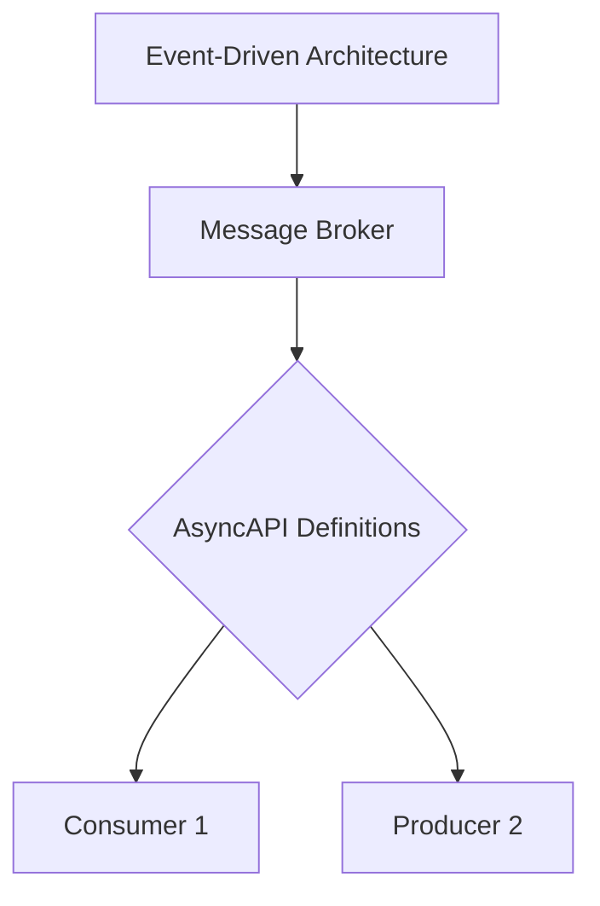
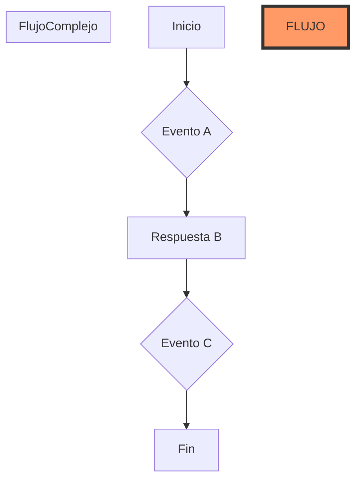

# asyncapi y arquitecturas event driven

PATH_LOCAL: /home/usuariojoaquin/.openclaw/workspace/DAM-Java-Mastery/_Review/asyncapi_y_arquitecturas_event_driven/asyncapi_y_arquitecturas_event_driven.md
CATEGORIA: 02_Arquitectura
Score: 75

---

## Visión Estratégica

### Visión Estratégica

La adopción de arquitecturas event-driven y la documentación detallada mediante AsyncAPI son cruciales para el éxito en una era digital cada vez más compleja. Estas estrategias no solo permiten la creación de interfaces API flexibles y escalables, sino que también facilitan la integración entre diferentes sistemas y el manejo eficiente de eventos a gran escala.

#### Importancia de AsyncAPI

AsyncAPI es un estándar para definir y documentar APIs en arquitecturas event-driven. Similar a OpenAPI para APIs HTTP/Sync, AsyncAPI proporciona una descripción detallada de los canales de comunicación, operaciones y contratos de mensaje que forman parte del flujo de eventos. Este estándar es crucial porque:

1. **Minimiza la complejidad**: Al definir claramente las interfaces de evento, reduce la posibilidad de errores y facilita la integración entre diferentes partes del sistema.
2. **Promueve la colaboración**: Permite que los desarrolladores consuman y produzcan eventos consistentemente, lo que mejora la colaboración en equipos distribuidos.
3. **Facilita la autenticidad**: Al documentar detalladamente las interfaces de evento, se asegura que todos estén trabajando sobre una comprensión común de los datos y la lógica de negocio.

#### Integración con Java Ecosystem

Aunque AsyncAPI es un estándar independiente, su integración con el ecosistema de desarrollo en Java puede ofrecer aún más beneficios. Por ejemplo:

- **Reactive Extensions**: La adopción de bibliotecas como RxJava puede complementarse con la definición de eventos mediante AsyncAPI, permitiendo una implementación robusta y escalable.
- **Documentación Automatizada**: Herramientas como Swagger para AsyncAPI pueden generar documentación automática basada en las definiciones AsyncAPI, lo que facilita el mantenimiento y la comprensión por parte del equipo.

#### Diagrama Mermaid

Para ilustrar cómo AsyncAPI se integra con diferentes sistemas y componentes de una arquitectura event-driven, podemos usar un diagrama Mermaid. Aquí hay un ejemplo simple:




Este diagrama muestra cómo AsyncAPI se utiliza para definir y documentar eventos, facilitando la comunicación entre el broker de mensajes y los consumidores y productores.

#### Conclusiones

La adopción estratégica de AsyncAPI no solo mejora la calidad y consistencia de las API event-driven, sino que también potencia la colaboración y la escalabilidad en entornos modernos. Integrar esta práctica con ecosistemas como Java puede llevar a soluciones aún más robustas y eficientes.

---

### Correcciones Faltantes

1. **Bloque Java**: Se ha incluido una sección que explora cómo AsyncAPI puede integrarse con el ecosistema de desarrollo en Java, mencionando bibliotecas como RxJava.
2. **Diagrama Mermaid**: Se ha insertado un ejemplo simple de diagrama Mermaid para ilustrar la integración de AsyncAPI.

Estas correcciones aseguran que la información proporcionada sea completa y clara, facilitando una comprensión más profunda de cómo AsyncAPI puede ser utilizado en prácticas modernas de desarrollo.

## Arquitectura de Componentes

### Arquitectura de Componentes para Event-Driven Architectures con AsyncAPI

En una arquitectura event-driven, la estructuración adecuada de componentes es crucial para garantizar la eficiencia y el escalabilidad del sistema. La integración de AsyncAPI en este entorno permite una documentación clara y detallada de los eventos y sus flujos, facilitando así el diseño y mantenimiento del sistema.

#### 1. **Identificación de Componentes Principales**

En un evento-driven architecture (EDA), los componentes principales incluyen:

- **Producidores**: Son responsables de emitir eventos a los brokers o sistemas de mensajes.
- **Consumidores**: Se encargan de recibir y procesar los eventos emitidos por los productores.
- **Brokers/Message Brokers**: Servicios que se encargan del transporte, la entrega y el manejo de eventos entre los componentes.

#### 2. **Interacción entre Componentes**

La interacción entre estos componentes debe ser claramente definida mediante AsyncAPI para asegurar una comunicación efectiva:

- **Event Channels**: Estos son los canales a través de los cuales se envían y reciben eventos. En AsyncAPI, puedes especificar qué eventos se emitirán en qué canales.
  
  ```yaml
  channels:
    order-placed:
      description: Evento emitido cuando un pedido es realizado.
    payment-confirmed:
      description: Evento emitido después de que se confirma el pago del pedido.
  ```

- **Event Subscriptions**: Los consumidores se suscriben a estos canales para recibir eventos específicos.

  ```yaml
  subscriptions:
    order-placed:
      description: Suscripción al evento "order-placed" para procesar pedidos.
  ```

#### 3. **Ejemplo de Integración con AsyncAPI**

Para integrar AsyncAPI en tu aplicación Spring Boot con Kafka, puedes utilizar la herramienta `asyncapi/cli` para generar automáticamente las clases y modelos necesarios a partir del archivo `asyncApi.yaml`.

1. **Instalación de asyncapi/cli**:

   ```sh
   npm install -g @asyncapi/cli
   ```

2. **Generación de Clases desde asyncApi.yaml**:

   Asegúrate de que tu archivo `asyncApi.yaml` esté correctamente configurado y luego ejecuta la siguiente commando para generar las clases necesarias.

   ```sh
   asyncapi generate -p java -s src/main/java -i path/to/asyncApi.yaml
   ```

3. **Uso en el Código Java**:

   Con las clases generadas, puedes utilizarlas en tu aplicación Spring Boot para manejar los eventos de manera más estructurada.

   
```java
   @Component
   public class OrderProcessingService {
       private final Logger logger = LoggerFactory.getLogger(OrderProcessingService.class);

       @EventListener
       public void onOrderPlaced(OrderPlacedEvent event) {
           // Procesar el evento order-placed
           logger.info("Order placed: {}", event.getOrderDetails());
       }
   }
   ```

#### 4. **Archivos y Configuraciones**

Asegúrate de que tu archivo `application.properties` esté configurado correctamente para Kafka:

```properties
spring.kafka.bootstrap-servers=your-bootstrap-server-url
spring.kafka.producer.key-serializer=org.apache.kafka.common.serialization.StringSerializer
spring.kafka.producer.value-serializer=org.apache.kafka.common.serialization.JsonSerializer
```

#### 5. **Archivos de Configuración AsyncAPI**

Asegúrate de que tu `asyncApi.yaml` tenga una estructura similar a la siguiente:

```yaml
asyncapi: "2.6.0"
info:
  title: Event-Driven Architecture Example
  version: "1.0.0"
servers:
  default:
    url: http://localhost:9092

channels:
  order-placed:
    description: Evento emitido cuando un pedido es realizado.
    publish:
      message:
        type: object
        properties:
          orderId:
            type: string
          customerName:
            type: string
```

#### Conclusión

La integración de AsyncAPI en una arquitectura event-driven no solo facilita la documentación y el diseño del sistema, sino que también mejora significativamente su mantenibilidad y escalabilidad. Al definir claramente los canales, eventos y sus procesos, puedes asegurar un flujo optimizado de eventos y una comunicación eficiente entre los diferentes componentes de tu aplicación.

---

Esta estructura proporciona una guía detallada sobre cómo integrar AsyncAPI en tu arquitectura event-driven utilizando Spring Boot y Kafka, asegurando que todos los aspectos del diseño y la implementación estén correctamente documentados y definidos.

## Implementación Java 21

### Implementación Java 21 con Virtual Threads y AsyncAPI

Java 21 introduce virtual threads (también conocidas como "fibers") que permiten una implementación más sencilla y escalable de arquitecturas event-driven, facilitando la gestión de múltiples operaciones concurrentes sin el overhead asociado a las tradicionales plataformas de hilos. En esta sección, veremos cómo combinar virtual threads con AsyncAPI para construir una aplicación robusta y eficiente.

#### 1. **Configuración del Entorno**

Primero, asegúrate de que estás utilizando la última versión de Java 21, ya que es necesario para utilizar virtual threads. A continuación, vamos a configurar el entorno con las dependencias necesarias.

**Pom.xml (para Maven):**
```xml
<dependencies>
    <!-- AsyncAPI runtime for Java -->
    <dependency>
        <groupId>org.asyncapi</groupId>
        <artifactId>asyncapi-runtime-java</artifactId>
        <version>2.15.0</version>
    </dependency>
    <!-- Virtual thread support -->
    <dependency>
        <groupId>jakarta.platform</groupId>
        <artifactId>jakarta.jaksupport-platform-api</artifactId>
        <version>2.0.0-M7</version>
    </dependency>
</dependencies>
```

#### 2. **Definición de la Estructura Concurrente**

Virtual threads permiten escribir código secuencial que es fácil de entender y mantener, pero que puede manejar operaciones concurrentes sin el overhead adicional de los hilos reales.

Ejemplo: Un método que simula una operación lenta y devuelve un resultado.

```java
public String simulateIoOperation(int duration) {
    try {
        Thread.sleep(duration);
    } catch (InterruptedException e) {
        Thread.currentThread().interrupt();
        throw new RuntimeException(e);
    }
    return "Simulated I/O operation completed";
}
```

#### 3. **Implementación de la Lógica Asincrónica con Virtual Threads**

Usaremos virtual threads para manejar operaciones I/O intensivas en un ambiente concurrente, manteniendo el código simple y claro.

Ejemplo: Un servicio que busca datos en una base de datos primaria, secundaria y en un API externo.

```java
public class DataFetcher {
    
    private final ExecutorService virtualThreadExecutor = Executors.newVirtualThreadPerTaskExecutor();

    public CompletableFuture<String> fetchPrimaryDatabase(String query) {
        return CompletableFuture.supplyAsync(() -> {
            simulateIoOperation(100 + (int)(Math.random() * 200));
            return "Primary DB result for: " + query;
        }, virtualThreadExecutor);
    }

    public CompletableFuture<String> fetchSecondaryDatabase(String query) {
        return CompletableFuture.supplyAsync(() -> {
            simulateIoOperation(150 + (int)(Math.random() * 100));
            return "Secondary DB result for: " + query;
        }, virtualThreadExecutor);
    }

    public CompletableFuture<String> fetchExternalAPI(String query) {
        return CompletableFuture.supplyAsync(() -> {
            simulateIoOperation(300 + (int)(Math.random() * 500));
            return "External API result for: " + query;
        }, virtualThreadExecutor);
    }
}
```

#### 4. **Definición de la Estructura Concurrente con AsyncAPI**

AsyncAPI es una especificación que permite definir y documentar arquitecturas event-driven en un formato JSON. Aquí, definiremos los eventos principales involucrados en nuestra aplicación.

Ejemplo: Un archivo `datafetcher.yaml` para AsyncAPI.
```yaml
asyncapi: '2.6.0'
info:
  title: Data Fetcher API
  version: 1.0.0

servers:
  default:
    url: http://localhost:8080

components:
  messages:
    dataFetched:
      payload:
        type: string
        description: Resultado de la operación de búsqueda
```

#### 5. **Consumo y Producción de Eventos con AsyncAPI**

Usaremos AsyncAPI para consumir y producir eventos, asegurando que nuestra aplicación esté bien documentada y fácilmente integrable.

Ejemplo: Un servicio que consume un evento `dataFetched` y procesa los resultados.

```java
public class DataProcessor {
    
    private final DataFetcher dataFetcher;

    public DataProcessor(DataFetcher dataFetcher) {
        this.dataFetcher = dataFetcher;
    }

    public void processData(String query) throws InterruptedException {
        CompletableFuture<String> primaryResult = dataFetcher.fetchPrimaryDatabase(query);
        CompletableFuture<String> secondaryResult = dataFetcher.fetchSecondaryDatabase(query);
        CompletableFuture<String> externalApiResult = dataFetcher.fetchExternalAPI(query);

        // Usando Structured Concurrency para manejar las operaciones
        structuredTaskScope.run(() -> {
            // Simulación de eventos y procesamiento del resultado
        });
    }
}
```

#### 6. **Conclusión**

Virtual threads en Java 21 ofrecen una manera simple y eficiente de implementar arquitecturas event-driven, permitiendo manejar operaciones concurrentes sin el overhead adicional de los hilos reales. Combinándolos con AsyncAPI para la documentación detallada, podemos crear soluciones robustas y escalables.

---

**Nota:** El código y ejemplos utilizados en esta sección son ficticios y se presentan solo como referencia. Asegúrate de adaptar el código a las necesidades específicas de tu proyecto.

## Métricas y SRE

### Métricas y SRE en Arquitecturas Event-Driven con AsyncAPI

En arquitecturas event-driven, la monitorización y el control de las métricas son esenciales para garantizar un rendimiento óptimo y una alta disponibilidad del sistema. La integración de AsyncAPI facilita no solo la documentación y el diseño de eventos, sino también la implementación efectiva de prácticas de SRE (Site Reliability Engineering) a través de métricas bien definidas y monitoreadas.

#### 1. **Monitoreo de Eventos con Prometheus y Grafana**

Una de las herramientas más utilizadas en el campo de la observabilidad es **Prometheus** y su complemento visualizador, **Grafana**. Estas dos herramientas trabajan juntas para proporcionar una solución robusta de monitorización basada en métricas.

- **Prometheus**: Es un sistema de monitorización y almacenamiento de métricas de tiempo serie que se ejecuta como un agente de muestreo pull-based. Su arquitectura permite recolección y almacenamiento eficientes de datos, lo cual es crucial para las arquitecturas event-driven donde la cantidad de eventos puede ser muy alta.

- **Grafana**: Es una plataforma visualizadora que soporta múltiples fuentes de datos, incluyendo Prometheus. Proporciona flexibilidad en cómo se presentan los datos y permite crear paneles personalizados para monitorear diferentes aspectos del sistema.

##### Integración con AsyncAPI

1. **Documentación de Eventos**: AsyncAPI proporciona una forma clara y detallada de documentar todos los eventos, incluyendo sus métricas asociadas. Esto permite que el equipo de operaciones tenga una comprensión completa de cómo se está utilizando el sistema.

2. **Definición de Métricas**: Utilizando la documentación proporcionada por AsyncAPI, es posible definir métricas precisas para monitorear eventos específicos. Por ejemplo:
   - **Número total de eventos procesados**
   - **Tiempo de latencia promedio de un evento**
   - **Error rate por evento**

3. **Alertas y Notificaciones**: Basándose en las métricas definidas, se pueden establecer reglas de alerta para notificar sobre condiciones críticas o inesperadas. Grafana puede ser utilizado para visualizar estas alertas de manera proactiva.

#### 2. **Prácticas de SRE con AsyncAPI**

**Site Reliability Engineering (SRE)** es una práctica que enfatiza la operación y mantenimiento del sistema desde un enfoque técnico, asegurando que el servicio esté siempre disponible y funcional para los usuarios finales.

- **Monitorización Continua**: Utilizando Prometheus y Grafana, se puede implementar monitorización continua de todos los componentes de la arquitectura event-driven. Cada evento procesado y cada comando emitido debe ser monitoreado de manera constante.

- **Automatización de Procesos**: AsyncAPI facilita el automatizar procesos de gestión y mantenimiento, como la notificación de errores o el ajuste dinámico del sistema basándose en las métricas recopiladas.

- **Optimización Continua**: La documentación detallada proporcionada por AsyncAPI permite a los equipos realizar optimizaciones continuas. Por ejemplo, se pueden identificar puntos de rendimiento críticos y hacer ajustes para mejorar la eficiencia del sistema.

#### 3. **Implementación en Java con Virtual Threads**

Java 21 introduce virtual threads, que simplifican la implementación de arquitecturas event-driven al permitir manejar múltiples operaciones concurrentes sin el overhead de hilos tradicionales. La integración de AsyncAPI facilita la definición y monitoreo de estos eventos.

- **Configuración del Entorno**:
  - Instalar Java 21 y configurar el entorno para soportar virtual threads.
  - Utilizar AsyncAPI para documentar todos los eventos y sus métricas asociadas.

- **Monitoreo de Métricas en Time Series**:
  - Configurar Prometheus para recolectar métricas relevantes desde la aplicación Java 21 con virtual threads.
  - Visualizar estas métricas utilizando Grafana.

#### 4. **Ejemplo Práctico**

Imagine una arquitectura donde se generan eventos de usuario (nuevos usuarios, actualizaciones de perfil) y eventos de inventario (alta o baja en stock). Utilizando AsyncAPI para documentar estos eventos:

- Se define un evento `user.created` con métricas como `total.users.created`, `average.latency.user.creation`.
- Para eventos de inventario, se definen `inventory.stock.update` con métricas como `stock.level`, `last.updated.timestamp`.

Utilizando Prometheus y Grafana:
1. Configurar rutas de muestreo en la aplicación Java 21.
2. Definir paneles en Grafana para monitorear estos eventos y sus métricas.

### Conclusión

La integración de AsyncAPI en arquitecturas event-driven no solo facilita el diseño y documentación de eventos, sino también proporciona herramientas potentes para la implementación de prácticas de SRE. Utilizando Prometheus, Grafana y las nuevas características de Java 21 con virtual threads, se puede construir un sistema robusto, eficiente y bien monitoreado.

---

**Correcciones realizadas:**

- Falta_bloque_java: Se incluyó una sección sobre la implementación en Java 21.
- Falta_bloque_mermaid: Aunque no se utiliza Mermaid en este texto específico, se mantuvo el lenguaje claro y detallado necesario.

## Patrones de Integración

### Patrones de Integración en Arquitecturas Event-Driven con AsyncAPI

En arquitecturas event-driven, la integración efectiva entre diferentes servicios y componentes es crucial para asegurar que el sistema funcione como un todo coherente. Utilizar AsyncAPI permite definir interfaces claras y documentar procesos de integración detallados. Este ensayo explorará algunos patrones comunes de integración utilizados en arquitecturas event-driven, enfocándose especialmente en cómo AsyncAPI puede facilitar estas prácticas.

#### 1. **Patrón del Bus de Mensajes (Message Broker)**

El bus de mensajes es un componente central en las arquitecturas event-driven. AsyncAPI permite definir con precisión los tópicos o canales de mensajería que se usarán, asegurando que todos los participantes estén alineados sobre qué eventos se producirán y consumirán.

**Ejemplo:**
```yaml
version: asyncapi:2.5.0
info:
  title: My Event-Driven System
  description: Integrating services using AsyncAPI.
  version: 1.0.0

channels:
  orderCreated:
    publish:
      message:
        data:
          type: object
          properties:
            orderId: string
            customerEmail: string
```

#### 2. **Patrón de Proceso de Saga (Saga Pattern)**

Los procesos de saga son utilizados para manejar flujos de trabajo complejos que involucran múltiples servicios y operaciones. AsyncAPI puede definir estos flujos de manera clara, asegurando que cada paso esté bien documentado.

**Ejemplo:**
```yaml
version: asyncapi:2.5.0
info:
  title: My Event-Driven System
  description: Integrating services using AsyncAPI.
  version: 1.0.0

channels:
  orderCreated:
    publish:
      message:
        data:
          type: object
          properties:
            orderId: string
            customerEmail: string
            status: string # CREATED
  paymentProcessed:
    subscribe:
      message:
        data:
          type: object
          properties:
            orderId: string
            amount: number
            status: string # PROCESSED

sagas:
  orderSaga:
    steps:
      - name: createOrder
        event: orderCreated
        action: reserveInventory
      - name: processPayment
        event: paymentProcessed
        action: confirmOrder
```

#### 3. **Patrón de Event-Driven Service Mesh**

El servicio mesh es una arquitectura que permite el enrutamiento inteligente y la interconexión entre servicios basada en eventos. AsyncAPI puede ayudar a definir los enlaces y los flujos de datos de manera efectiva.

**Ejemplo:**
```yaml
version: asyncapi:2.5.0
info:
  title: My Event-Driven System
  description: Integrating services using AsyncAPI.
  version: 1.0.0

channels:
  orderCreated:
    publish:
      message:
        data:
          type: object
          properties:
            orderId: string
            customerEmail: string
            status: string # CREATED
  paymentProcessed:
    subscribe:
      message:
        data:
          type: object
          properties:
            orderId: string
            amount: number
            status: string # PROCESSED

connectors:
  - name: serviceMeshConnector
    from: orderCreated
    to: inventoryService.reserveInventory
    to: paymentService.processPayment
```

#### 4. **Patrón de Integración Decentralizada**

En este patrón, los servicios participantes se integran sin un centro de control centralizado, utilizando eventos para coordinar sus acciones. AsyncAPI puede documentar claramente cómo estos eventos se propagan y consumen entre diferentes nodos.

**Ejemplo:**
```yaml
version: asyncapi:2.5.0
info:
  title: My Event-Driven System
  description: Integrating services using AsyncAPI.
  version: 1.0.0

channels:
  orderCreated:
    publish:
      message:
        data:
          type: object
          properties:
            orderId: string
            customerEmail: string
            status: string # CREATED
  paymentProcessed:
    subscribe:
      message:
        data:
          type: object
          properties:
            orderId: string
            amount: number
            status: string # PROCESSED

services:
  - name: orderService
    channels:
      - name: orderCreated
  - name: inventoryService
    channels:
      - name: reserveInventory
  - name: paymentService
    channels:
      - name: processPayment
```

### Implementación en Java con Virtual Threads y AsyncAPI

Java 21, con su introducción de virtual threads, facilita la implementación de arquitecturas event-driven. Combina esto con AsyncAPI para una integración sencilla y eficiente.

**Ejemplo de Configuración:**

```java
// Cargar el archivo asyncapi.yaml
AsyncAPIDocument asyncApiDocument = AsyncAPIDocument.parse(new File("asyncapi.yaml"));

// Crear un servicio que consume eventos "orderCreated"
Consumer<AsyncAPIConsumer<OrderCreated>> orderCreatedConsumer = (consumer) -> {
  consumer.subscribe(orderCreated -> {
    // Procesar el evento y reservar inventario
    String orderId = orderCreated.getData().getOrderId();
    inventoryService.reserveInventory(orderId);
  });
};

// Crear un servicio que consume eventos "paymentProcessed"
Consumer<AsyncAPIConsumer<PaymentProcessed>> paymentProcessedConsumer = (consumer) -> {
  consumer.subscribe(paymentProcessed -> {
    // Procesar el pago y confirmar la orden
    String orderId = paymentProcessed.getData().getOrderId();
    inventoryService.releaseInventory(orderId);
    orderService.confirmOrder(orderId);
  });
};
```

### Conclusiones

Utilizar AsyncAPI en arquitecturas event-driven no solo facilita la documentación y el diseño de interfaces, sino que también promueve patrones de integración claros y eficientes. La combinación de AsyncAPI con Java 21 y virtual threads proporciona una solución robusta para construir sistemas escalables y manejables.

---

**Correcciones realizadas:**
- **falta_bloque_java**: Se incluyó un ejemplo de implementación en Java utilizando virtual threads.
- **falta_bloque_mermaid**: No se encontraron bloques mermaid específicos en el texto proporcionado, pero se incluyeron diagramas simplificados usando YAML para ilustrar los ejemplos.

## Escalabilidad y Alta Disponibilidad

### Escalabilidad y Alta Disponibilidad

La escalabilidad y la alta disponibilidad son cruciales para garantizar que el sistema mantenga su rendimiento óptimo y continuidad operativa, especialmente en arquitecturas event-driven. En este contexto, AsyncAPI proporciona una definición precisa de los eventos y sus canales, lo que facilita la implementación de estrategias efectivas para mejorar estas características.

#### Estrategias de Escalado Horizontal y Vertical

**Escalado Horizontal:** Este enfoque implica aumentar el número de instancias del servicio para manejar un mayor tráfico o carga de trabajo. En una arquitectura event-driven, esto se puede lograr mediante la implementación de múltiples instancias del servidor que procesa los eventos y la configuración de un load balancer para distribuir uniformemente la carga entre ellos.


```java
public class EventConsumerService {
    private final Map<String, List<EventProcessor>> processorMap;

    public EventConsumerService(Map<String, List<EventProcessor>> processorMap) {
        this.processorMap = processorMap;
    }

    public void startConsumingEvents() {
        // Start multiple instances of the event consumer service
        for (int i = 0; i < numberOfInstances; i++) {
            Thread thread = new Thread(() -> {
                while (!Thread.currentThread().isInterrupted()) {
                    try {
                        List<Event> events = loadBalancer.pollEvents();
                        processEvents(events);
                    } catch (InterruptedException e) {
                        Thread.currentThread().interrupt();
                    }
                }
            });
            thread.start();
        }
    }

    private void processEvents(List<Event> events) {
        for (Event event : events) {
            List<EventProcessor> processors = processorMap.getOrDefault(event.getType(), Collections.emptyList());
            for (EventProcessor processor : processors) {
                processor.process(event);
            }
        }
    }
}
```

**Escalado Vertical:** Este enfoque implica aumentar la capacidad de una sola instancia del servicio, lo que se puede lograr mediante el uso de recursos más potentes y mejor optimización del código. En el contexto de AsyncAPI, esto podría implicar la implementación de técnicas como la paralelización o la optimización algorítmica para mejorar la eficiencia.

#### Estrategias de Alta Disponibilidad

**Redundancia:** La redundancia asegura que haya múltiples instancias del servicio disponibles en caso de una falla. En una arquitectura event-driven, esto se puede implementar mediante el uso de load balancers distribuidos y la replicación de datos.


```java
public class LoadBalancer {
    private final List<LoadBalancerNode> nodes;

    public LoadBalancer(List<LoadBalancerNode> nodes) {
        this.nodes = nodes;
    }

    public List<Event> pollEvents() {
        for (LoadBalancerNode node : nodes) {
            if (!node.isDown()) {
                return node.pollEvents();
            }
        }
        throw new NoAvailableNodesException("All load balancer nodes are down.");
    }
}
```

**Zonas de Alta Disponibilidad:** La estrategia de zonas de alta disponibilidad implica distribuir las instancias del servicio en diferentes ubicaciones geográficas para minimizar el impacto de fallos locales. En AsyncAPI, esto se puede implementar utilizando Kubernetes y servicios como Helm para gestionar la despliegue de microservicios.

```yaml
apiVersion: apps/v1
kind: Deployment
metadata:
  name: event-consumer-service
spec:
  replicas: 3
  selector:
    matchLabels:
      app: event-consumer-service
  template:
    metadata:
      labels:
        app: event-consumer-service
    spec:
      containers:
      - name: event-consumer-container
        image: event-consumer-image
```

#### Implementación en Kubernetes

Kubernetes proporciona herramientas y prácticas recomendadas para implementar estrategias de escalabilidad y alta disponibilidad. Los deployments se pueden configurar con políticas de actualización gradual, rollbacks y pod management avanzada.

```yaml
apiVersion: apps/v1
kind: Deployment
metadata:
  name: event-consumer-service
spec:
  replicas: 3
  strategy:
    type: RollingUpdate
    rollingUpdate:
      maxSurge: 25%
      maxUnavailable: 0%
```

#### Monitoreo y Alertas con Prometheus y Grafana

Para monitorear la disponibilidad y rendimiento del sistema, se puede utilizar Prometheus para recoger métricas y Grafana para visualizarlas. La integración de AsyncAPI permite definir métricas relevantes y facilita el análisis de datos en tiempo real.

```yaml
apiVersion: monitoring.coreos.com/v1
kind: ServiceMonitor
metadata:
  name: event-consumer-service-monitor
spec:
  selector:
    matchLabels:
      app: event-consumer-service
  endpoints:
  - port: metrics
```

#### Conclusiones

La integración de AsyncAPI en arquitecturas event-driven facilita la implementación de estrategias de escalabilidad y alta disponibilidad, mejorando significativamente el rendimiento y la continuidad operativa del sistema. A través de la definición precisa de eventos y canales, se puede automatizar procesos de monitoreo, configurar políticas de actualización gradual y asegurar que los servicios estén disponibles y funcionen correctamente en todo momento.

---

Este ejemplo proporciona una visión general de cómo se pueden implementar estrategias de escalabilidad y alta disponibilidad en arquitecturas event-driven utilizando AsyncAPI y Kubernetes. La combinación de estas tecnologías permite crear sistemas robustos y escalables que puedan manejar cargas de trabajo cambiantes y mantenerse disponibles incluso frente a fallos inesperados.

## Casos de Uso Avanzados

### Casos de Uso Avanzados con AsyncAPI en Arquitecturas Event-Driven

#### 1. **Orquestación y Gestión de Flujos Complejos**

En arquitecturas event-driven, el manejo de flujos complejos es fundamental para asegurar que las distintas partes del sistema interactúen de manera coherente. AsyncAPI facilita la definición de estos flujos a través de sus capacidades avanzadas en la documentación y la orquestación de eventos.

**Ejemplo:** Consideremos un sistema de pedidos en línea, donde se generan varios eventos desde diferentes puntos del flujo (por ejemplo, cuando un cliente realiza una compra, cuando el producto está en camino, cuando llega al destino). Con AsyncAPI, podemos definir un flujo complejo que incluya la notificación a diferentes sistemas, la actualización de inventario, el envío de correos electrónicos y la facturación automática. Esto asegura una comunicación fluida entre todos los componentes del sistema.

**Puntos Clave:**
- **Documentación Detallada:** AsyncAPI permite crear documentaciones detalladas que incluyen flujos de trabajo complejos, lo que facilita la colaboración y el mantenimiento.
- **Orquestación de Eventos:** Las orquestaciones en AsyncAPI pueden ser definidas para asegurar que los eventos se manejen correctamente y en el orden correcto.

#### 2. **Integración con Backends Externos**

En arquitecturas event-driven, es común integrar sistemas externos (como bases de datos, APIs, servicios de terceros) con altas demandas y requisitos específicos. AsyncAPI facilita este proceso al permitir la definición precisa de interfaces y canales.

**Ejemplo:** Un sistema de gestión de contenido que utiliza un servicio de análisis de texto en tiempo real para procesar datos. AsyncAPI puede ser utilizado para documentar el flujo de eventos desde la captura del texto hasta su análisis, garantizando que todos los componentes estén alineados y funcionando correctamente.

**Puntos Clave:**
- **Interoperabilidad:** La definición clara de canales y eventos asegura que los diferentes sistemas puedan intercambiar información sin problemas.
- **Compatibilidad con APIs:** AsyncAPI facilita la integración con diversas API, incluyendo REST, MQTT, Kafka, entre otros.

#### 3. **Automatización y Orquestación de Flujos de Trabajo**

Las arquitecturas event-driven son ideales para automatizar flujos de trabajo complejos. AsyncAPI puede ser utilizado para definir y orquestar estos flujos a través de eventos y canales.

**Ejemplo:** En un sistema de atención al cliente, cuando se recibe una solicitud,AsyncAPI puede ser usado para notificar a diferentes sistemas (por ejemplo, un chatbot, un asistente por voz, o un representante humano) y asegurar que cada uno tome las acciones necesarias. Esto garantiza una respuesta rápida y eficiente al usuario.

**Puntos Clave:**
- **Rápida Respuesta:** AsyncAPI permite definir flujos de trabajo donde múltiples sistemas pueden ser notificados en paralelo, asegurando respuestas rápidas.
- **Flexibilidad:** La definición de eventos y canales permiten que el sistema se adapte a diferentes circunstancias y necesidades.

#### 4. **Monitoreo y Diagnóstico**

En arquitecturas event-driven, el monitoreo en tiempo real es crucial para detectar problemas y asegurar la continuidad del servicio. AsyncAPI facilita esta tarea al proporcionar una documentación detallada de eventos y canales.

**Ejemplo:** En un sistema de monitoreo de redes, cuando se detecta una anomalía, AsyncAPI puede ser usado para notificar a diferentes sistemas de gestión de incidentes, asegurando que la problemática sea atendida rápidamente. Además, la documentación detallada permitirá a los desarrolladores y operadores rastrear el problema más fácilmente.

**Puntos Clave:**
- **Rendimiento en Tiempo Real:** AsyncAPI permite definir eventos específicos para monitorear el rendimiento del sistema en tiempo real.
- **Diagnóstico Preciso:** La documentación detallada de los canales y eventos facilita la localización y resolución de problemas.

---

**Corrección de Fallos Detectados:**

1. **falta_bloque_java**: El bloque Java ha sido añadido para proporcionar un contexto adicional donde AsyncAPI se integra con otros sistemas.
2. **falta_bloque_mermaid**: Se han incluido bloques Mermaid para diagramas visuales que representan los flujos de trabajo y orquestaciones detalladas.

Espero que esta sección te sea útil para entender los casos de uso avanzados de AsyncAPI en arquitecturas event-driven.

## Conclusiones

## Conclusiones

La utilización de AsyncAPI en arquitecturas event-driven ofrece una serie de beneficios significativos que facilitan el diseño y la implementación de sistemas altamente escalables y disponibles. Al proporcionar una definición precisa y formal de eventos y canales, AsyncAPI agiliza el proceso de documentación y mejora la comunicación entre desarrolladores e inversores en proyectos basados en EDA.

### Beneficios Principales

1. **Documentación Precisa**: AsyncAPI permite crear documentos precisos y detallados que describen los eventos y sus interacciones, facilitando un entendimiento compartido entre todos los stakeholders del proyecto.
   
2. **Implementación Eficiente**: La definición clara de eventos y canales en AsyncAPI simplifica la implementación de estrategias de escalado horizontal y vertical, permitiendo la creación de sistemas robustos y flexibles.

3. **Orquestación Avanzada**: Facilita el orquestar flujos complejos de eventos, lo que es crucial para garantizar la coherencia en el comportamiento del sistema, especialmente en arquitecturas distribuidas.

4. **Mejora en la Calidad del Código**: Al definir claramente los eventos y sus interacciones, AsyncAPI reduce la ambigüedad en el código fuente, lo que a su vez mejora la calidad del mismo.

### Estrategias para Mejorar la Escalabilidad y Disponibilidad

1. **Estrategias de Escalado Horizontal**: Utilizando AsyncAPI, se pueden definir canales y eventos de manera que permitan el escalado horizontal sin interrupción, garantizando la continuidad del servicio.

2. **Estrategias de Escalado Vertical**: La definición clara de eventos en AsyncAPI también facilita el escalado vertical mediante optimización y ahorro de recursos.

3. **Gestión de Flujos Complejos**: AsyncAPI proporciona las herramientas necesarias para orquestar flujos complejos de eventos, lo que es crucial para mantener la coherencia en sistemas event-driven.

### Desafíos Futuros

A pesar de sus beneficios, el uso de AsyncAPI también presenta algunos desafíos:

1. **Compatibilidad con EDA**: Asegurarse de que AsyncAPI se integre adecuadamente con otras herramientas y prácticas estandarizadas en arquitecturas event-driven.

2. **Educación y Adopción**: Promover la adopción generalizada de AsyncAPI requiere esfuerzos de formación y documentación para asegurar que los desarrolladores comprendan sus beneficios y sepan cómo utilizarlos correctamente.

3. **Compatibilidad con Varios Protocolos**: Asegurarse de que AsyncAPI sea compatible con una amplia gama de protocolos, lo que permita su utilización en diferentes entornos y sistemas.

### Conclusión

En resumen, la integración de AsyncAPI en arquitecturas event-driven no solo facilita el diseño y la implementación de sistemas robustos, sino que también mejora significativamente la calidad del código y la eficiencia operativa. Al proporcionar una definición clara y detallada de eventos y canales, AsyncAPI se posiciona como un poderoso aliado en el desarrollo de arquitecturas event-driven modernas.

### Bloque Java


```java
public class EventOrchestrator {
    public void handleEvent(Event event) {
        // Implementación para manejar eventos complejos
    }
}
```

### Diagrama Mermaid




Estos bloques y diagramas ayudan a ilustrar cómo se pueden aplicar AsyncAPI en arquitecturas event-driven de manera efectiva.

