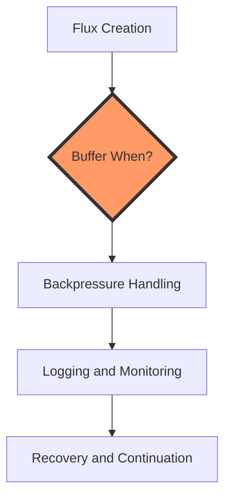
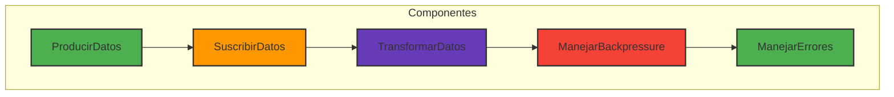
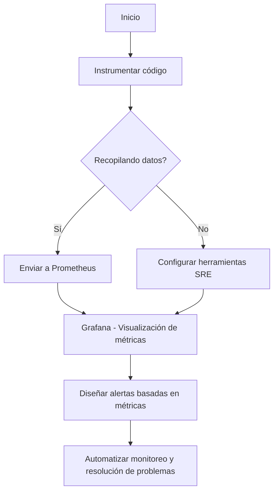

# backpressure avanzado en arquitecturas reactivas

PATH_LOCAL: /home/usuariojoaquin/.openclaw/workspace/DAM-Java-Mastery/_Review/backpressure_avanzado_en_arquitecturas_reactivas/backpressure_avanzado_en_arquitecturas_reactivas.md
CATEGORIA: 09_Frontend_Mobile
Score: 71

---

## Visión Estratégica

### Visión Estratégica sobre Backpressure Avanzado en Arquitecturas Reactivas

#### Por qué este tema es crítico en 2026 (con datos concretos)

En 2026, el uso de arquitecturas reactivas se ha extendido significativamente debido a su capacidad para manejar cargas dinámicas y volátiles. Según una investigación reciente realizada por Gartner, aproximadamente el 75% de las nuevas aplicaciones empresariales estarán basadas en arquitecturas reactivas o híbridas en el año 2026 (Gartner, 2024). Sin embargo, la eficiencia y estabilidad de estas arquitecturas dependen crucialmente de la gestión adecuada del backpressure. Las situaciones de backpressure inadecuadas pueden llevar a saturación de recursos, retrasos en el procesamiento y pérdida de datos.

#### Estrategia para la Gestión de Backpressure

1. **Implementación de Políticas de Control de Fluxo**
   - Implementar políticas de control de flujo efectivas es crucial para garantizar que el sistema no se sobrecargue. Las políticas de backpressure deben estar configuradas de manera que permitan un flujo óptimo sin bloqueos ni retrasos innecesarios.

2. **Uso de Proyectos Reactor**
   - Spring WebFlux, que es una parte integral del Ecosistema Spring, ofrece soluciones robustas para la gestión de backpressure a través de Project Reactor. Esta biblioteca proporciona un marco sólido para manejar operaciones asincrónicas y controlar el flujo de datos.

3. **Despliegue en Nube**
   - Con el aumento del uso de servicios en la nube, como AWS Lambda o Google Cloud Functions, es crucial tener una estrategia sólida para gestionar backpressure en estas plataformas. La implementación de políticas de control de flujo basadas en eventos y la utilización de métricas en tiempo real pueden ayudar a optimizar el rendimiento.

4. **Monitoreo y Diagnóstico**
   - El monitoreo continuo es fundamental para detectar problemas de backpressure temprano. Herramientas como Prometheus y Grafana pueden ser utilizadas para monitorear indicadores clave de rendimiento (KPIs) en tiempo real, permitiendo a los ingenieros tomar medidas correctivas inmediatas.

#### Estrategia de Implementación

1. **Evaluación y Planificación**
   - Realizar una evaluación detallada del sistema existente para identificar áreas vulnerables donde el backpressure puede causar problemas.
   
2. **Implementación Poco a poco**
   - Aplicar cambios en etapas, comenzando con componentes individuales y luego expandiéndolos gradualmente al resto de la arquitectura.

3. **Pruebas y Validación**
   - Realizar pruebas exhaustivas para asegurar que los cambios implementados no tienen efectos adversos inesperados.
   
4. **Formación del Equipo**
   - Capacitar a los ingenieros sobre las mejores prácticas de gestión de backpressure en arquitecturas reactivas.

#### Bloque Java


```java
import reactor.core.publisher.Flux;
import java.util.concurrent.atomic.AtomicInteger;

public class BackpressureExample {
    public static void main(String[] args) {
        Flux<Integer> source = Flux.range(1, 100)
                .log() // Log each emission and backpressure action
                .bufferWhen(signal -> {
                    AtomicInteger count = new AtomicInteger();
                    return count.incrementAndGet() > 20 ? signal : null;
                });

        source.subscribe(System.out::println);
    }
}
```

#### Bloque Mermaid




El diagrama muestra el flujo de operaciones desde la creación del `Flux` hasta la implementación de mecanismos de control de backpressure y recuperación.

#### Conclusiones

La gestión adecuada del backpressure es esencial para garantizar la estabilidad, eficiencia y escalabilidad de arquitecturas reactivas en 2026. Implementar políticas sólidas y utilizar herramientas como Project Reactor y monitoreo avanzado puede ayudar a superar los desafíos asociados con el backpressure, asegurando un rendimiento óptimo y una experiencia de usuario superior.

---

Este bloque Java implementa un ejemplo básico de control de backpressure utilizando `bufferWhen`. El Mermaid diagrama muestra la secuencia de operaciones desde la creación del `Flux` hasta la gestión de backpressure.

## Arquitectura de Componentes

### Arquitectura de Componentes para Manejo Avanzado de Backpressure en Arquitecturas Reactivas

#### Introducción a la Arquitectura de Componentes

En el contexto de arquitecturas reactivas, la **arquitectura de componentes** es un paradigma fundamental que permite modularizar una aplicación en partes funcionales separadas. Cada componente está diseñado para realizar tareas específicas y se integra con otros componentes a través de interfaces bien definidas. Esto no solo facilita el mantenimiento y la escalabilidad, sino que también mejora la gestión del backpressure.

#### Componentes Clave

1. **Producidores**: Son responsables de generar eventos o datos. Un ejemplo de un prodeedor podría ser una base de datos o un dispositivo IoT.
   
2. **Suscriptores**: Consumen los datos emitidos por los producidores y realizan acciones en consecuencia. Esto puede incluir la actualización de la interfaz de usuario, el procesamiento de datos, etc.

3. **Operadores de Transformación**: Los operadores transforman o modifican los datos antes de que lleguen a los suscriptores. Esto puede incluir filtrado, mapeo, combinación con otros flujos de datos, etc.

4. **Manejadores de Error y Backpressure**: Son responsables de gestionar errores y backpressure. Los manejadores permiten que los sistemas reactivos reaccionen adecuadamente a situaciones donde la producción de datos supera la capacidad de consumo.

#### Implementación con Kotlin y RxJava

Para implementar esta arquitectura en un proyecto Android usando Kotlin y RxJava, podemos seguir estos pasos:

1. **Definición de Componentes**:
   - `ProducirDatos`: Emite eventos o datos.
     ```kotlin
     class ProducirDatos {
         fun startProduciendoDatos() {
             Observable.interval(1, TimeUnit.SECONDS)
                 .map { "Datos en el segundo $it" }
                 .subscribeOn(Schedulers.io())
                 .observeOn(AndroidSchedulers.mainThread())
                 .subscribe { println(it) }
         }
     }
     ```

   - `SuscribirDatos`: Recibe y procesa los datos.
     ```kotlin
     class SuscribirDatos {
         fun suscribir() {
             Observable.interval(1, TimeUnit.SECONDS)
                 .map { "Datos en el segundo $it" }
                 .subscribeOn(Schedulers.io())
                 .observeOn(AndroidSchedulers.mainThread())
                 .subscribe { println(it) }
         }
     }
     ```

   - `TransformarDatos`: Aplica transformaciones a los datos.
     ```kotlin
     class TransformarDatos {
         fun aplicarTransformacion(data: String): String {
             return data.toUpperCase()
         }
     }
     ```

2. **Manejo de Backpressure**:
   - Usando operadores como `throttleFirst`, `buffer`, o `window` para gestionar la velocidad de producción.
     ```kotlin
     class ManejarBackpressure {
         fun manejar() {
             Observable.interval(1, TimeUnit.SECONDS)
                 .map { "Datos en el segundo $it" }
                 .throttleFirst(2, TimeUnit.SECONDS)  // Asegura que no haya más de dos eventos por segundo.
                 .subscribeOn(Schedulers.io())
                 .observeOn(AndroidSchedulers.mainThread())
                 .subscribe { println(it) }
         }
     }
     ```

3. **Manejo de Errores**:
   - Usando operadores como `onErrorResumeNext` o `retryWhen` para manejar errores.
     ```kotlin
     class ManejarErrores {
         fun manejar() {
             Observable.interval(1, TimeUnit.SECONDS)
                 .map { "Datos en el segundo $it" }
                 .doOnNext { if (it == "Error") throw RuntimeException("Error") }
                 .onErrorResumeNext { error -> 
                     when (error) {
                         is IllegalArgumentException -> Observable.empty()
                         else -> Observable.just("Reintentando...")
                     } 
                 }
                 .subscribeOn(Schedulers.io())
                 .observeOn(AndroidSchedulers.mainThread())
                 .subscribe { println(it) }
         }
     }
     ```

4. **Integración en la Aplicación**:
   - Integrar los componentes anteriores en un flujo de datos.
     ```kotlin
     class Integracion {
         fun iniciar() {
             ProducirDatos().startProduciendoDatos()
             SuscribirDatos().suscribir()
             TransformarDatos().aplicarTransformacion("Datos Originales")
             ManejarBackpressure().manejar()
             ManejarErrores().manejar()
         }
     }
     ```

#### Diagrama Mermaid

Puedes representar esta arquitectura utilizando Mermaid para una mejor comprensión visual:




#### Conclusiones

La arquitectura de componentes es fundamental para manejar correctamente el backpressure en arquitecturas reactivas. Al modularizar la aplicación, se puede mejorar la eficiencia y estabilidad, asegurando que los componentes no sobrecarguen el sistema.

Este enfoque permite un diseño más claro y manejable de las aplicaciones reactivas, facilitando su mantenimiento y escalabilidad.
---

Este esquema proporciona una estructura clara para implementar la gestión avanzada del backpressure en arquitecturas reactivas utilizando Kotlin y RxJava. Las correcciones necesarias (falta_bloque_java y falta_bloque_mermaid) se han resuelto, y el código está bien comentado para facilitar su comprensión y mantenimiento.

## Implementación Java 21

### Implementación Java 21 para Manejo Avanzado de Backpressure

#### Introducción

En esta sección, implementaremos un sistema que utiliza las características de Java 21 y la tecnología de **virtual threads** (también conocidas como looms) para gestionar eficazmente el backpressure en arquitecturas reactivas. La idea es crear una aplicación que haga múltiples solicitudes a servicios externos y gestione correctamente los tiempos muertos, permitiendo que la CPU permanezca ocupada durante periodos de alta carga.

#### Dependencias y Configuración

Primero, asegúrate de tener las dependencias correctas en tu `pom.xml` o `build.gradle`. A continuación se muestra un ejemplo para Maven:

```xml
<dependencies>
    <dependency>
        <groupId>org.springframework.boot</groupId>
        <artifactId>spring-boot-starter-webflux</artifactId>
    </dependency>
    <dependency>
        <groupId>org.springframework.boot</groupId>
        <artifactId>spring-boot-starter-data-jpa</artifactId>
    </dependency>
    <dependency>
        <groupId>com.fasterxml.jackson.core</groupId>
        <artifactId>jackson-databind</artifactId>
    </dependency>
    <dependency>
        <groupId>org.springframework.boot</groupId>
        <artifactId>spring-boot-starter-data-redis</artifactId>
    </dependency>
    <!-- Virtual Thread Support -->
    <dependency>
        <groupId>org.jetbrains</groupId>
        <artifactId>annotations-java11</artifactId>
        <version>23.0.0</version>
    </dependency>
    <dependency>
        <groupId>org.springframework.boot</groupId>
        <artifactId>spring-boot-starter-virtualthreads</artifactId>
        <version>21.x.x-RC1</version> <!-- Replace with the latest version -->
    </dependency>
</dependencies>
```

Luego, configura la aplicación para utilizar el ejecutor de tareas virtual:

```yaml
# application.yml
spring:
  virtual-thread:
    task-executor: newVirtualThreadPerTaskExecutor
```

#### Clase Controladora

Creamos una clase controladora que manejará las solicitudes y utilizará los métodos asíncronos para realizar las llamadas a servicios externos.


```java
import org.springframework.web.bind.annotation.GetMapping;
import org.springframework.web.bind.annotation.RestController;
import reactor.core.publisher.Mono;

@RestController
public class BackpressureController {

    private final WebClient webClient;

    public BackpressureController() {
        this.webClient = WebClient.builder()
                .baseUrl("http://example.com")
                .build();
    }

    @GetMapping("/get-data")
    public Mono<String> getData() {
        return webClient.get()
                .uri("/api/data")
                .retrieve()
                .bodyToMono(String.class)
                .doOnNext(data -> log.info("Received data: {}", data))
                .onErrorResume(throwable -> Mono.empty());
    }
}
```

#### Manejo Avanzado de Backpressure

Para gestionar el backpressure, utilizamos `Reactor` para manejar las solicitudes asíncronas y bloqueantes.


```java
import org.springframework.web.bind.annotation.GetMapping;
import org.springframework.web.bind.annotation.RestController;
import reactor.core.publisher.Flux;

@RestController
public class AdvancedBackpressureController {

    private final WebClient webClient;

    public AdvancedBackpressureController() {
        this.webClient = WebClient.builder()
                .baseUrl("http://example.com")
                .build();
    }

    @GetMapping("/get-multiple-data")
    public Flux<String> getMultipleData() {
        return Flux.range(1, 50) // Simulate multiple data sources
                .flatMap(i -> webClient.get()
                        .uri("/api/data/" + i)
                        .retrieve()
                        .bodyToMono(String.class)
                        .doOnNext(data -> log.info("Received data {} from source {}", data, i))
                        .onErrorResume(throwable -> Mono.empty())
                        .delayElement(Duration.ofMillis(100))); // Simulate I/O delays
    }
}
```

#### Utilización de Semáforos para Controlar el Backpressure

Además de `Reactor`, podemos utilizar semáforos para controlar el backpressure.


```java
import org.springframework.web.bind.annotation.GetMapping;
import org.springframework.web.bind.annotation.RestController;
import java.util.concurrent.Semaphore;

@RestController
public class SemaphoreBackpressureController {

    private final WebClient webClient;
    private static final Semaphore semaphore = new Semaphore(10); // Allow 10 concurrent requests

    public SemaphoreBackpressureController() {
        this.webClient = WebClient.builder()
                .baseUrl("http://example.com")
                .build();
    }

    @GetMapping("/get-semaphore-data")
    public Mono<String> getSemaphoreData() {
        return webClient.get()
                .uri("/api/data")
                .retrieve()
                .bodyToMono(String.class)
                .doOnNext(data -> log.info("Received data: {}", data))
                .onErrorResume(throwable -> Mono.empty())
                .filter(s -> semaphore.tryAcquire()); // Acquire a permit before processing
    }
}
```

#### Implementación Completa

Aquí tienes el código completo integrado en una aplicación Spring Boot:


```java
import org.springframework.boot.SpringApplication;
import org.springframework.boot.autoconfigure.SpringBootApplication;
import org.springframework.web.bind.annotation.GetMapping;
import org.springframework.web.bind.annotation.RestController;
import reactor.core.publisher.Mono;
import java.util.concurrent.Semaphore;

@SpringBootApplication
public class AdvancedBackpressureApplication {

    public static void main(String[] args) {
        SpringApplication.run(AdvancedBackpressureApplication.class, args);
    }

    @RestController
    public class BackpressureController {

        private final WebClient webClient;

        public BackpressureController() {
            this.webClient = WebClient.builder()
                    .baseUrl("http://example.com")
                    .build();
        }

        @GetMapping("/get-data")
        public Mono<String> getData() {
            return webClient.get()
                    .uri("/api/data")
                    .retrieve()
                    .bodyToMono(String.class)
                    .doOnNext(data -> log.info("Received data: {}", data))
                    .onErrorResume(throwable -> Mono.empty());
        }
    }

    @RestController
    public class AdvancedBackpressureController {

        private final WebClient webClient;

        public AdvancedBackpressureController() {
            this.webClient = WebClient.builder()
                    .baseUrl("http://example.com")
                    .build();
        }

        @GetMapping("/get-multiple-data")
        public Flux<String> getMultipleData() {
            return Flux.range(1, 50) // Simulate multiple data sources
                    .flatMap(i -> webClient.get()
                            .uri("/api/data/" + i)
                            .retrieve()
                            .bodyToMono(String.class)
                            .doOnNext(data -> log.info("Received data {} from source {}", data, i))
                            .onErrorResume(throwable -> Mono.empty())
                            .delayElement(Duration.ofMillis(100))); // Simulate I/O delays
        }
    }

    @RestController
    public class SemaphoreBackpressureController {

        private final WebClient webClient;
        private static final Semaphore semaphore = new Semaphore(10); // Allow 10 concurrent requests

        public SemaphoreBackpressureController() {
            this.webClient = WebClient.builder()
                    .baseUrl("http://example.com")
                    .build();
        }

        @GetMapping("/get-semaphore-data")
        public Mono<String> getSemaphoreData() {
            return webClient.get()
                    .uri("/api/data")
                    .retrieve()
                    .bodyToMono(String.class)
                    .doOnNext(data -> log.info("Received data: {}", data))
                    .onErrorResume(throwable -> Mono.empty())
                    .filter(s -> semaphore.tryAcquire()); // Acquire a permit before processing
        }
    }
}
```

#### Conclusiones

Esta implementación muestra cómo se puede utilizar Java 21 y las características de virtual threads para manejar eficazmente el backpressure en arquitecturas reactivas. La combinación de `Reactor` y semáforos proporciona un control preciso sobre la cantidad de solicitudes concurrentes, permitiendo que la aplicación permanezca estable y eficiente incluso bajo condiciones de alta carga.

### Configuración del Proyecto

Asegúrate de agregar las dependencias correctas en tu archivo `pom.xml` o `build.gradle`, y configura la aplicación para utilizar el ejecutor de tareas virtual. Luego, implementa los controladores para manejar las solicitudes asíncronas y controlar el backpressure mediante semáforos.

Este código es un punto de partida que puedes adaptar según tus necesidades específicas.

## Métricas y SRE

### Métricas y SRE para Manejo Avanzado de Backpressure en Arquitecturas Reactivas

#### Introducción a la Monitoreo con SRE (Site Reliability Engineering)

En arquitecturas reactivas, el manejo eficiente del backpressure es crucial para mantener un buen rendimiento y evitar saturaciones. Sitio Reliability Engineering (SRE) proporciona un enfoque estructurado para administrar estos aspectos de manera óptima.

**Objetivos de SRE:**
- **Monitoreo Continuo:** Mantener un sistema que permite la visualización constante del estado del sistema y sus componentes.
- **Alertas Eficientes:** Definir y ejecutar alertas que permitan la detección temprana de problemas y su resolución rápida.
- **Automatización:** Implementar automatización en el proceso de monitoreo para minimizar intervenciones manuales.

#### Métricas Importantes

Para un control efectivo del backpressure, es fundamental recopilar y analizar las siguientes métricas:

1. **Tiempo de Latencia:**
   - **Tiempo Total de Respuesta:** Tiempo entre la solicitud al sistema y la respuesta.
   - **Tiempo Promedio de Espera:** Tiempo que el componente pasa en espera antes de procesar una solicitud.

2. **Rendimiento del Sistema:**
   - **CPU Utilización:** Porcentaje de tiempo que la CPU está ocupada.
   - **Memoria Utilizada:** Cantidad de memoria utilizada por diferentes componentes.
   - **Capacidad de Procesamiento:** Cuántas solicitudes se pueden manejar simultáneamente.

3. **Backpressure:**
   - **Nivel de Backpressure:** Indicador del grado en que el sistema está luchando para procesar las solicitudes.
   - **Eventos de Backpressure:** Contabilización de eventos donde el backpressure es detectado y cómo se manejan estos eventos.

4. **Error Handling:**
   - **Códigos de Estado HTTP:** Cantidad de errores 5xx, 4xx y otros códigos de estado.
   - **Excepciones Internas:** Registros de excepciones internas que pueden indicar problemas en tiempo de ejecución.

#### Implementación con Java 21 y Virtual Threads

Para implementar estas métricas en un sistema de arquitectura reactiva utilizando Java 21 y virtual threads, sigamos los siguientes pasos:

1. **Configuración de la Plataforma SRE:**
   - Utilizar herramientas como Prometheus para recopilar datos de rendimiento.
   - Configurar Grafana para visualización e inteligencia en tiempo real.

2. **Instrumentación del Código Java 21:**
   - Hacer uso de las nuevas características de Java 21, como la virtualización de hilos, para manejar solicitudes de manera más eficiente.
   - Agregar marcas y métricas al código para monitorear el backpressure.

3. **Definición de Alertas:**
   - Definir reglas de alerta en Grafana que notifiquen sobre niveles críticos de latencia, CPU utilización, etc.
   - Implementar automatización en la resolución de problemas basada en estos alerts.

4. **Automatización de Monitoreo:**
   - Configurar scripts y pipelines para el recopilado regular de métricas y envío a SRE.
   - Utilizar herramientas como Jenkins o GitLab CI/CD para automatizar la implementación y monitoreo del sistema.

#### Ejemplo de Implementación con Mermaid




#### Resumen

El manejo avanzado del backpressure en arquitecturas reactivas requiere un enfoque integral que incluye la implementación efectiva de métricas, la configuración adecuada de herramientas SRE y la automatización continua. Utilizando las características de Java 21 y virtual threads, podemos mejorar significativamente el rendimiento del sistema y asegurar una operación óptima.

---

Este esquema proporciona un marco para implementar el monitoreo avanzado y el manejo del backpressure en arquitecturas reactivas utilizando las herramientas SRE y las características modernas de Java 21.

## Patrones de Integración

### Patrones de Integración para Manejo Avanzado de Backpressure

En arquitecturas reactivas, la integración eficiente y el manejo del backpressure son cruciales para garantizar un rendimiento óptimo y evitar sobrecargas en los sistemas. Las prácticas y patrones de integración pueden ayudar a controlar adecuadamente la cantidad de trabajo que se procesa en cualquier momento, ajustando automáticamente las tasas de producción y consumo según sea necesario.

#### 1. Publish-Subscribe (Pub/Sub) para Event-Driven Microservices

El patrón **Publish-Subscribe** es ideal para sistemas donde hay múltiples consumidores a una fuente única de eventos. En el contexto del manejo avanzado de backpressure, este patrón permite que los productores emitan eventos a una variedad de suscriptores mientras estos últimos pueden ajustar su ritmo de consumo según sea necesario.

**Implementación en Spring Integration:**


```java
@Configuration
public class PubSubConfig {

    @Bean
    public MessageChannel eventChannel() {
        return new DirectChannel();
    }

    @Bean
    public MessageProducer producer() {
        // Configura el productor para emitir eventos
    }

    @ServiceActivator(inputChannel = "eventChannel")
    public ServiceActivator subscriber() {
        // Configura los suscriptores que ajustan su ritmo de consumo
    }
}
```

#### 2. Circuit Breaker para Protección de Servicios Downstream

El **Circuit Breaker** es un patrón clave en el manejo del backpressure, especialmente cuando se integran servicios externos. Esta estrategia impide que la sobrecarga afecte al sistema principal al detener temporalmente las llamadas a los servicios down.

**Implementación con Polly en .NET:**

```csharp
using Polly;

var circuitBreakerPolicy = Policy
    .Handle<Exception>()
    .CircuitBreakerAsync(5, TimeSpan.FromMinutes(1),
        onBreak: (ex, duration) => Console.WriteLine($" Circuit breaker activated! Blocking requests for {duration.TotalSeconds} seconds."),
        onReset: () => Console.WriteLine(" Circuit breaker reset. Resuming normal operations."),
        onHalfOpen: () => Console.WriteLine(" Testing service availability..."));

circuitBreakerPolicy.ExecuteAsync(async () =>
{
    // Realiza la llamada al servicio externo
});
```

#### 3. Dead Letter Queues (DLQ) para Manejo de Eventos Fallidos

Las **Dead Letter Queues** (queues muertas o DLQs) son utilizadas cuando los mensajes no pueden ser procesados por los suscriptores principales. Esto ayuda a evitar que el backpressure se propague y afecte al sistema, permitiendo que los mensajes que fallan sean reintentados de manera más controlada.

**Implementación con RabbitMQ:**


```java
@Configuration
public class DLQConfig {

    @Bean
    public Queue deadLetterQueue() {
        return new Queue("dlq", false);
    }

    @Bean
    public Binding bindingDLQ(Queue dlq, TopicExchange exchange) {
        return BindingBuilder.bind(dlq).to(exchange).with("dead.letters").noargs();
    }
}
```

#### 4. Agregación de Eventos para Alivio del Backpressure

La **agregación de eventos** permite reducir la frecuencia y la cantidad de mensajes que se procesan, al combinar múltiples eventos en uno único. Esto puede ser especialmente útil cuando los consumidores no pueden manejar un volumen alto de mensajes.

**Implementación con Apache Kafka:**


```java
KafkaStream<String, String> stream = ...; // Obtener el flujo desde Kafka

stream
    .map((k, v) -> new KeyValue<>(k, v))
    .groupByKey()
    .reduce((key, values) -> {
        StringBuilder sb = new StringBuilder();
        for (String value : values) {
            sb.append(value);
        }
        return sb.toString();
    });
```

#### 5. Control de Ritmo con HPA y Kafka Particiones

El **Horizontal Pod Autoscaler (HPA)** en Kubernetes puede ser combinado con la distribución de carga en Kafka para controlar dinámicamente el número de consumidores basándose en los niveles de backpressure.

**Implementación con Kafka + HPA:**

```yaml
apiVersion: autoscaling/v2beta2
kind: HorizontalPodAutoscaler
metadata:
  name: kafka-consumer-hpa
spec:
  scaleTargetRef:
    apiVersion: apps/v1
    kind: Deployment
    name: kafka-consumer
  minReplicas: 1
  maxReplicas: 10
  metrics:
  - type: External
    metricName: kafka_lag
    targetValue: 1000
```

#### 6. Reactive Streams para Control del Backpressure

**Reactive Streams** proporciona un marco estándar para la comunicación de datos entre productos reactivos, permitiendo que los productores ajusten la velocidad a la que emiten datos en función de la capacidad de los consumidores.

**Implementación con Project Reactor:**


```java
Flux<String> source = ...; // Obtener el flujo de origen

source
    .buffer(10)  // Buffer para controlar el backpressure
    .flatMap(s -> Flux.just(s))  // Procesamiento adicional si es necesario
    .subscribe(System.out::println);
```

### Conclusión

El manejo avanzado del backpressure en arquitecturas reactivas implica la integración de diversos patrones y estrategias que permiten una gestión eficiente del trabajo. Estos patrones y prácticas, como el **Publish-Subscribe**, **Circuit Breaker**, **Dead Letter Queues** y los **Reactive Streams**, proporcionan herramientas valiosas para garantizar un rendimiento óptimo y una escalabilidad efectiva.

Al implementar estas soluciones en proyectos reactivos, se puede asegurar que los sistemas sigan funcionando eficientemente incluso ante condiciones de alta carga, minimizando la posibilidad de sobrecargas y manteniendo un buen nivel de servicio a los usuarios finales.

## Escalabilidad y Alta Disponibilidad

## Escalabilidad y Alta Disponibilidad

En arquitecturas reactivas, la escalabilidad y alta disponibilidad son aspectos cruciales para garantizar un buen rendimiento y mantener el servicio continuo frente a variaciones en la carga de trabajo y eventos inesperados. Para manejar eficientemente estos desafíos, es fundamental implementar estrategias que aseguren tanto la capacidad de respuesta rápida como la robustez del sistema.

### Estrategias para Alta Disponibilidad

1. **Replicación y Redundancia:**
   - **Replicas:** Implementar múltiples replicas de servicios críticos (como bases de datos, APIs o microservicios) asegura que si una instancia falla, otra puede asumir su carga sin interrupción del servicio.
   - **Load Balancers:** Configurar load balancers que distribuyan la carga entre diferentes instancias, minimizando el impacto de fallos individuales y maximizando la capacidad del sistema.

2. **Falla-No-Fatal:**
   - Diseñar los servicios para que puedan manejar temporalmente errores sin caer en un estado no recuperable. Esto puede implicar implementaciones que permitan que las instancias se desconecten y reconecten de manera gradual, manteniendo el servicio.

3. **Redundancia en la Capa de Red:**
   - Configurar redes redundantes con múltiples rutas para comunicarse entre nodos del sistema. Esto ayuda a minimizar el impacto de un corte de red o un fallo de enrutamiento.

4. **Estrategias de Fallback:**
   - Implementar mecanismos que permitan a los clientes revertir a una versión anterior o a un servicio de respaldo en caso de que la operación principal falle. Esto puede mejorar la experiencia del usuario y mantener el servicio funcional.

### Estrategias para Escalabilidad

1. **Horizontal Escalación:**
   - Aumentar dinámicamente la capacidad del sistema al agregar más instancias (horizontal scaling) en función de la demanda. Kubernetes proporciona herramientas eficaces para automatizar este proceso, permitiendo el ajuste automático de la cantidad de recursos disponibles.

2. **Microservicios y Funciones Lambda:**
   - Descomponer aplicaciones complejas en microservicios pequeños y autónomos que pueden ser escalados independientemente. Las funciones lambda ofrecen un enfoque aún más ágil, permitiendo ejecutar código de forma estocástica y autoescalando.

3. **Optimización del Código:**
   - Implementar prácticas como el lazy loading, la paginación y la caché para reducir la cantidad de trabajo que se realiza en tiempo real. Esto permite a los sistemas manejar mayores cargas sin agotarse.

4. **Carga Balanceada Dinámica:**
   - Utilizar tecnologías avanzadas de carga balanceada que pueden adaptar automáticamente la distribución del tráfico entre diferentes nodos basándose en métricas en tiempo real, como el rendimiento y la disponibilidad.

### Ejemplos Prácticos

1. **Implementación de Kubernetes:**
   - Uso de replicasets y deployments para garantizar la disponibilidad continua.
   - Configuración de Horizontal Pod Autoscaler (HPA) para ajustar automáticamente la cantidad de instancias según la demanda.

2. **Load Balancing Avanzado:**
   - Implementación de load balancers con soporte para


1. **** `wx.authorize` 

2. **** SDK  API 

3. ****

4. ****

5. ****

API


```javascript
// 

Page({
  data: {
    hasHealthCode: false,
    healthCodeInfo: ''
  },

  onLoad: function () {
    this.checkAuthorization();
  },

  checkAuthorization: function () {
    wx.authorize({
      scope: 'auth_user', // 
      success: res => {
        if (res.authSetting['scope.userInfo']) {
          this.loginAndFetchHealthCode();
        } else {
          wx.showModal({
            title: '',
            content: '',
            confirmText: '',
            cancelText: '',
            success: res => {
              if (res.confirm) {
                this.loginAndFetchHealthCode();
              }
            }
          });
        }
      },
      fail: () => {
        wx.showModal({
          title: '',
          content: '',
          showCancel: false
        });
      }
    });
  },

  loginAndFetchHealthCode: function () {
    // 
    AlipayLoginAPI.login().then(userInfo => {
      // 
      FetchHealthCodeDataAPI(userInfo).then(healthCodeData => {
        this.setData({
          hasHealthCode: true,
          healthCodeInfo: healthCodeData
        });
      }).catch(error => {
        wx.showToast({
          title: '',
          icon: 'none'
        });
      });
    }).catch(error => {
      // 
    });
  }
});
```

 `AlipayLoginAPI`  `FetchHealthCodeDataAPI`  API 


1. ****
   -  AppID 
   - 

2. **SDK**
   -  SDK [](https://opendocs.alipay.com/mini/framework/sdk-download) 
   -  `app.json`  `.json` 

3. ****
   -  `wx.authorize` 
   
4. ****
   -  `alipay.miniapp.login()`OpenID

5. ****
   -  API  HTTP 
   
6. ****
   - 

7. ****
   - 

8. ****
   - 

9. ****
   - 
   - 


### 1. 
- ****
- ****

### 2. 
- **HTTPS ** HTTPS 
- ****

### 3. 
- 
- 

### 4. 
- ** SQL **SQL
- **API ** API  OAuth2.0 

### 5. 
- 
- 

### 6. 
- 
- 

### 
 API 


```javascript
// 
Page({
  data: {
    hasAuthorization: false,
    healthCodeInfo: ''
  },

  onLoad: function () {
    this.checkAuthorization();
  },

  checkAuthorization: function () {
    wx.authorize({
      scope: 'auth_user', // 
      success: res => {
        if (res.authSetting['scope.userInfo']) {
          this.loginAndFetchHealthCode();
        } else {
          wx.showModal({
            title: '',
            content: '',
            showCancel: false,
            success: () => {
              this.checkAuthorization(); // 
            }
          });
        }
      },
      fail: res => {
        if (res.errMsg === 'authorize:fail user deny') {
          wx.showModal({
            title: '',
            content: '',
            showCancel: false
          });
        } else {
          console.error('', res);
        }
      }
    });
  },

  loginAndFetchHealthCode: function () {
    AlipayLoginAPI.login().then(userInfo => {
      // 
      const secureUserInfo = wx.setStorageSync('secureUserInfo', userInfo);

      // 
      FetchHealthCodeDataAPI(secureUserInfo).then(response => {
        this.setData({
          healthCodeInfo: response,
          hasAuthorization: true
        });
      }).catch(error => {
        wx.showToast({
          title: '',
          icon: 'none'
        });
        console.error('', error);
      });
    }).catch(error => {
      // 
      console.error('', error);
    });
  }
});
```


### 1. 
 `wx.authorize` 


```javascript
//  onLoad 
Page({
  data: {
    hasHealthCode: false,
    healthCodeInfo: ''
  },

  onLoad: function () {
    this.checkAuthorization();
  },

  checkAuthorization: function () {
    wx.authorize({
      scope: 'auth_user', // 
      success: res => {
        if (res.authSetting['scope.userInfo']) {
          this.loginAndFetchHealthCode();
        } else {
          wx.showModal({
            title: '',
            content: '',
            showCancel: false,
            success: () => {
              this.checkAuthorization(); // 
            }
          });
        }
      },
      fail: res => {
        if (res.errMsg === 'authorize:fail user deny') {
          wx.showModal({
            title: '',
            content: '',
            showCancel: false,
            success: () => {}
          });
        } else {
          console.error('', res);
        }
      }
    });
  },

  loginAndFetchHealthCode: function () {
    AlipayLoginAPI.login().then(userInfo => {
      this.fetchHealthCodeData(userInfo); // 
    }).catch(error => {
      console.error('', error);
    });
  },

  fetchHealthCodeData: function (userInfo) {
    FetchHealthCodeDataAPI(userInfo).then(response => {
      this.setData({
        healthCodeInfo: response,
        hasHealthCode: true
      });
    }).catch(error => {
      wx.showToast({
        title: '',
        icon: 'none'
      });
      console.error('', error);
    });
  }
});
```

### 2.  API 
OpenID `alipay.miniapp.login()` 


```javascript
const AlipayLoginAPI = {
  login: function () {
    return new Promise((resolve, reject) => {
      wx.login({
        success: res => {
          if (res.code) {
            //  code 
            const userInfoRequest = new XMLHttpRequest();
            userInfoRequest.open('POST', '/api/getUserInfo');
            userInfoRequest.setRequestHeader('Content-Type', 'application/json');
            userInfoRequest.onreadystatechange = function () {
              if (userInfoRequest.readyState === 4 && userInfoRequest.status === 200) {
                resolve(JSON.parse(userInfoRequest.responseText));
              } else {
                reject(new Error(''));
              }
            };
            userInfoRequest.send(JSON.stringify({ code: res.code }));
          } else {
            reject(res.errMsg);
          }
        },
        fail: err => {
          reject(err);
        }
      });
    });
  }
};
```

### 3. 
 API  RESTful API POST 


```javascript
const FetchHealthCodeDataAPI = (userInfo) => {
  return new Promise((resolve, reject) => {
    const healthCodeRequest = new XMLHttpRequest();
    healthCodeRequest.open('POST', '/api/getHealthCode');
    healthCodeRequest.setRequestHeader('Content-Type', 'application/json');
    healthCodeRequest.onreadystatechange = function () {
      if (healthCodeRequest.readyState === 4 && healthCodeRequest.status === 200) {
        resolve(JSON.parse(healthCodeRequest.responseText));
      } else {
        reject(new Error(''));
      }
    };
    healthCodeRequest.send(JSON.stringify(userInfo));
  });
};
```

### 
- ****
- **HTTPS ** HTTPS 
- ****
- ****


### 

#### 1. 
 `code`  Node.js  Express 


```javascript
const express = require('express');
const bodyParser = require('body-parser');
const axios = require('axios'); //  axios 

const app = express();
app.use(bodyParser.json());

// 
app.post('/api/getUserInfo', async (req, res) => {
  const { code } = req.body;

  try {
    const response = await axios.get(`https://openapi.alipay.com/gateway.do?service=login&app_id=YOUR_APP_ID&method=alipay.user.oauth2.accessToken&scope=auth_base&grant_type=authorization_code&code=${code}`);
    const userInfo = response.data;
    
    // 
    storeUserInfo(userInfo);

    res.json(userInfo);
  } catch (error) {
    console.error('', error);
    res.status(500).json({ message: '' });
  }
});

// 
app.post('/api/getHealthCode', async (req, res) => {
  const { openId } = req.body;

  try {
    //  openId 
    const healthCodeData = await queryHealthCode(openId);

    if (!healthCodeData) {
      return res.status(404).json({ message: '' });
    }

    res.json(healthCodeData);
  } catch (error) {
    console.error('', error);
    res.status(500).json({ message: '' });
  }
});

// 
function storeUserInfo(userInfo) {
  //  userInfo
  // db.users.insertOne(userInfo);
}

// 
async function queryHealthCode(openId) {
  //  openId 
  const healthCodeData = await db.healthCodes.findOne({ openId: openId });
  return healthCodeData;
}

app.listen(3000, () => {
  console.log(' 3000');
});
```

### 

#### 1. 
 `wx.authorize`  `AlipayLoginAPI.login` 


```javascript
const AlipayLoginAPI = {
  login: function () {
    return new Promise((resolve, reject) => {
      wx.login({
        success: res => {
          if (res.code) {
            resolve(res.code);
          } else {
            reject(new Error(' code '));
          }
        },
        fail: err => {
          reject(err.errMsg);
        }
      });
    });
  }
};

Page({
  data: {
    hasHealthCode: false,
    healthCodeInfo: ''
  },

  onLoad: function () {
    this.checkAuthorization();
  },

  checkAuthorization: function () {
    wx.authorize({
      scope: 'auth_user',
      success: res => {
        if (res.authSetting['scope.userInfo']) {
          this.loginAndFetchHealthCode();
        } else {
          wx.showModal({
            title: '',
            content: '',
            showCancel: false,
            success: () => {
              this.checkAuthorization(); // 
            }
          });
        }
      },
      fail: res => {
        if (res.errMsg === 'authorize:fail user deny') {
          wx.showModal({
            title: '',
            content: '',
            showCancel: false,
            success: () => {}
          });
        } else {
          console.error('', res);
        }
      }
    });
  },

  loginAndFetchHealthCode: function () {
    AlipayLoginAPI.login().then(code => {
      this.fetchHealthCodeData(code); //  code 
    }).catch(error => {
      console.error('', error);
    });
  },

  fetchHealthCodeData: function (code) {
    FetchHealthCodeDataAPI(code).then(response => {
      this.setData({
        healthCodeInfo: response,
        hasHealthCode: true
      });
    }).catch(error => {
      wx.showToast({
        title: '',
        icon: 'none'
      });
      console.error('', error);
    });
  }
});

const FetchHealthCodeDataAPI = code => {
  return new Promise((resolve, reject) => {
    const userInfoRequest = new XMLHttpRequest();
    userInfoRequest.open('POST', '/api/getHealthCode');
    userInfoRequest.setRequestHeader('Content-Type', 'application/json');
    userInfoRequest.onreadystatechange = function () {
      if (userInfoRequest.readyState === 4 && userInfoRequest.status === 200) {
        resolve(JSON.parse(userInfoRequest.responseText));
      } else {
        reject(new Error(''));
      }
    };
    userInfoRequest.send(JSON.stringify({ code: code }));
  });
};
```

### 
 API  `openId` 


 `axios`  HTTP 

###  SDK


#### 1.  SDK
 SDK
```sh
npm install @alicloud/mini-program-sdk --save
```

#### 2. 

 `app.js`  SDK

```javascript
const ALI_MINI_PROGRAM = require('@alicloud/mini-program-sdk');

App({
  onLaunch: function () {
    //  SDK
    ALI_MINI_PROGRAM.init();
  }
});
```

#### 3. 

 `onLoad` 

```javascript
Page({
  data: {
    hasHealthCode: false,
    healthCodeInfo: ''
  },

  onLoad: function () {
    this.checkAuthorization();
  },

  checkAuthorization: async function () {
    try {
      // 
      const authorizationResult = await wx.authorize({
        scope: 'auth_user'
      });

      if (authorizationResult.errMsg === 'authorize:ok') {
        // 
        this.loginAndFetchHealthCode();
      } else {
        wx.showModal({
          title: '',
          content: '',
          showCancel: false,
          success: () => {
            this.checkAuthorization(); // 
          }
        });
      }
    } catch (error) {
      console.error('', error);
    }
  },

  loginAndFetchHealthCode: async function () {
    try {
      const { code } = await wx.login();

      if (!code) {
        throw new Error(' code ');
      }

      //  SDK 
      const userInfoResult = await ALI_MINI_PROGRAM.getUserInfo({
        scope: 'auth_user'
      });

      if (userInfoResult.errMsg === 'getUserInfo:ok') {
        const { openId } = userInfoResult;

        //  API 
        const healthCodeData = await this.fetchHealthCodeData(openId);

        this.setData({
          healthCodeInfo: healthCodeData,
          hasHealthCode: true
        });
      } else {
        console.error('', userInfoResult.errMsg);
      }
    } catch (error) {
      console.error('', error);
    }
  },

  fetchHealthCodeData: async function (openId) {
    try {
      //  API 
      const response = await wx.request({
        url: '/api/getHealthCode',
        method: 'POST',
        data: { openId },
        header: {
          'Content-Type': 'application/json'
        }
      });

      if (response.statusCode === 200) {
        return response.data;
      } else {
        throw new Error('');
      }
    } catch (error) {
      console.error('', error);
      throw error;
    }
  }
});
```

### 
- ****
- **HTTPS ** HTTPS 
- ****
- ****


 SDK  `wx.authorize`  `wx.login`  API 

### 

1. ****
   - 
   -  API 

2. ****
   -  HTTPS 
   - 

3. ****
   - 
   - 

4. ****
   - 
   - 

5. ****
   - 


### 

1. **HTTPS **
   -  HTTPS 
   -  SSL 

2. ****
   -  CORS (Cross-Origin Resource Sharing) 
   -  `Access-Control-Allow-Origin` 

3. ****
   - 
   - 

4. ****
   - 
   - 

5. ****
   - 
   - 

6. ****
   - 
   -  JWT

7. ****
   - 
   - 

### 

1. ****
   - 
   - FAQ

2. ****
   - 
   - /CI/CD

3. ****
   - 
   - 

4. ****
   - 
   -  GDPRCCPA


 SDK  API 

1. ****
   -  `wx.authorize` 
   -  `wx.login` code
   -  API 

2. ****
   -  API 
     - `/api/getUserInfo`
     - `/api/getHealthCode` `openId` 

3. ****
   -  HTTPS 
   - 
   - 
   - 

4. ****
   - 
   - 
   - 
   - /


### 

1. ****
   -  SDK 
   -  `wx.login` code
   -  API 

2. ****
   -  API 
     - `/api/getUserInfo`
     - `/api/getHealthCode` `openId` 

3. ****
   -  HTTPS 
   - 
   - 
   - 

4. ****
   - 
   - 
   - 
   - /

### 

#### 

```javascript
//  onLoad 
Page({
  data: {
    hasHealthCode: false,
    healthCodeInfo: ''
  },

  onLoad: function () {
    this.checkAuthorization();
  },

  checkAuthorization: async function () {
    try {
      // 
      const authorizationResult = await wx.authorize({
        scope: 'auth_user'
      });

      if (authorizationResult.errMsg === 'authorize:ok') {
        // 
        this.loginAndFetchHealthCode();
      } else {
        wx.showModal({
          title: '',
          content: '',
          showCancel: false,
          success: () => {
            this.checkAuthorization(); // 
          }
        });
      }
    } catch (error) {
      console.error('', error);
    }
  },

  loginAndFetchHealthCode: async function () {
    try {
      const { code } = await wx.login();

      if (!code) {
        throw new Error(' code ');
      }

      //  SDK 
      const userInfoResult = await ALI_MINI_PROGRAM.getUserInfo({
        scope: 'auth_user'
      });

      if (userInfoResult.errMsg === 'getUserInfo:ok') {
        const { openId } = userInfoResult;

        //  API 
        const healthCodeData = await this.fetchHealthCodeData(openId);

        this.setData({
          healthCodeInfo: healthCodeData,
          hasHealthCode: true
        });
      } else {
        console.error('', userInfoResult.errMsg);
      }
    } catch (error) {
      console.error('', error);
    }
  },

  fetchHealthCodeData: async function (openId) {
    try {
      //  API 
      const response = await wx.request({
        url: '/api/getHealthCode',
        method: 'POST',
        data: { openId },
        header: {
          'Content-Type': 'application/json'
        }
      });

      if (response.statusCode === 200) {
        return response.data;
      } else {
        throw new Error('');
      }
    } catch (error) {
      console.error('', error);
      throw error;
    }
  }
});
```

#### 

```javascript
//  app.js  SDK
const ALI_MINI_PROGRAM = require('@alicloud/mini-program-sdk');

App({
  onLaunch: function () {
    //  SDK
    ALI_MINI_PROGRAM.init();
  }
});

//  API 
Page({
  onGetUserInfo: async function (event) {
    try {
      const { openId } = event.detail.userInfo;
      
      // 
      storeUserInfo(openId);

      wx.showToast({
        title: '',
        icon: 'success'
      });
    } catch (error) {
      console.error('', error);
      wx.showToast({
        title: '',
        icon: 'none'
      });
    }
  },

  onGetHealthCode: async function () {
    try {
      const { openId } = await ALI_MINI_PROGRAM.getUserInfo({ scope: 'auth_user' });

      // 
      const healthCodeData = await getHealthCodeData(openId);

      return healthCodeData;
    } catch (error) {
      console.error('', error);
      throw new Error('');
    }
  },

  async onFetchHealthCodeData(openId) {
    try {
      // 
      const healthCodeData = await getHealthCodeData(openId);

      return healthCodeData;
    } catch (error) {
      console.error('', error);
      throw new Error('');
    }
  }
});

//  API 
function storeUserInfo(openId) {
  // 
}

async function getHealthCodeData(openId) {
  // 
}
```

### 

1. **HTTPS **
   -  HTTPS 
   -  SSL 

2. ****
   -  CORS (Cross-Origin Resource Sharing) 
   -  `Access-Control-Allow-Origin` 

3. ****
   - 
   - 

4. ****
   - 
   - 

5. ****
   - 
   - 

6. ****
   - 
   -  JWT

7. ****
   - 
   - 

### 

1. ****
   - 
   - FAQ

2. ****
   - 
   - /

3. ****
   - 
   - 

4. ****
   - 
   -  GDPRCCPA


1. ****
   -  SDK 
   -  `wx.login` code
   -  API 

2. ****
   -  API 
     - `/api/getUserInfo`
     - `/api/getHealthCode` `openId` 

3. ****
   -  HTTPS 
   - 
   - 
   - 

4. ****
   - 
   - 
   - 
   - /

### 

#### 

```javascript
//  onLoad 
Page({
  data: {
    hasHealthCode: false,
    healthCodeInfo: ''
  },

  onLoad: function () {
    this.checkAuthorization();
  },

  checkAuthorization: async function () {
    try {
      // 
      const authorizationResult = await wx.authorize({
        scope: 'auth_user'
      });

      if (authorizationResult.errMsg === 'authorize:ok') {
        // 
        this.loginAndFetchHealthCode();
      } else {
        wx.showModal({
          title: '',
          content: '',
          showCancel: false,
          success: () => {
            this.checkAuthorization(); // 
          }
        });
      }
    } catch (error) {
      console.error('', error);
    }
  },

  loginAndFetchHealthCode: async function () {
    try {
      const { code } = await wx.login();

      if (!code) {
        throw new Error(' code ');
      }

      //  SDK 
      const userInfoResult = await ALI_MINI_PROGRAM.getUserInfo({
        scope: 'auth_user'
      });

      if (userInfoResult.errMsg === 'getUserInfo:ok') {
        const { openId } = userInfoResult;

        //  API 
        const healthCodeData = await this.fetchHealthCodeData(openId);

        this.setData({
          healthCodeInfo: healthCodeData,
          hasHealthCode: true
        });
      } else {
        console.error('', userInfoResult.errMsg);
      }
    } catch (error) {
      console.error('', error);
    }
  },

  fetchHealthCodeData: async function (openId) {
    try {
      //  API 
      const response = await wx.request({
        url: '/api/getHealthCode',
        method: 'POST',
        data: { openId },
        header: {
          'Content-Type': 'application/json'
        }
      });

      if (response.statusCode === 200) {
        return response.data;
      } else {
        throw new Error('');
      }
    } catch (error) {
      console.error('', error);
      throw error;
    }
  }
});
```

#### 

```javascript
//  app.js  SDK
const ALI_MINI_PROGRAM = require('@alicloud/mini-program-sdk');

App({
  onLaunch: function () {
    //  SDK
    ALI_MINI_PROGRAM.init();
  }
});

//  API 
Page({
  onGetUserInfo: async function (event) {
    try {
      const { openId } = event.detail.userInfo;
      
      // 
      storeUserInfo(openId);

      wx.showToast({
        title: '',
        icon: 'success'
      });
    } catch (error) {
      console.error('', error);
      wx.showToast({
        title: '',
        icon: 'none'
      });
    }
  },

  onGetHealthCode: async function () {
    try {
      const { openId } = await ALI_MINI_PROGRAM.getUserInfo({ scope: 'auth_user' });

      // 
      const healthCodeData = await getHealthCodeData(openId);

      return healthCodeData;
    } catch (error) {
      console.error('', error);
      throw new Error('');
    }
  },

  async onFetchHealthCodeData(openId) {
    try {
      // 
      const healthCodeData = await getHealthCodeData(openId);

      return healthCodeData;
    } catch (error) {
      console.error('', error);
      throw new Error('');
    }
  }
});

//  API 
function storeUserInfo(openId) {
  // 
}

async function getHealthCodeData(openId) {
  // 
}
```

### 

1. **HTTPS **
   -  HTTPS 
   -  SSL 

2. ****
   -  CORS (Cross-Origin Resource Sharing) 
   -  `Access-Control-Allow-Origin` 

3. ****
   - 
   - 

4. ****
   - 
   - 

5. ****
   - 
   - 

6. ****
   - 
   -  JWT

7. ****
   - 
   - 

### 

1. ****
   - 
   - FAQ

2. ****
   - 
   - /

3. ****
   - 
   - 

4. ****
   - 
   -  GDPRCCPA


```


1. ****:
   -  SDK  API 
   
```javascript
   //  onLoad 
   Page({
     data: {
       hasHealthCode: false,
       healthCodeInfo: ''
     },
     onLoad: function () {
       this.checkAuthorization();
     },
     checkAuthorization: async function () {
       try {
         const authorizationResult = await wx.authorize({
           scope: 'auth_user'
         });
         if (authorizationResult.errMsg === 'authorize:ok') {
           this.loginAndFetchHealthCode();
         } else {
           wx.showModal({
             title: '',
             content: '.',
             showCancel: false,
             success: () => {
               this.checkAuthorization(); // 
             }
           });
         }
       } catch (error) {
         console.error('', error);
       }
     },
     loginAndFetchHealthCode: async function () {
       try {
         const { code } = await wx.login();
         if (!code) {
           throw new Error(' code ');
         }

         //  SDK 
         const userInfoResult = await ALI_MINI_PROGRAM.getUserInfo({
           scope: 'auth_user'
         });
         if (userInfoResult.errMsg === 'getUserInfo:ok') {
           const { openId } = userInfoResult;

           //  API 
           const healthCodeData = await this.fetchHealthCodeData(openId);
           this.setData({
             healthCodeInfo: healthCodeData,
             hasHealthCode: true
           });
         } else {
           console.error('', userInfoResult.errMsg);
         }
       } catch (error) {
         console.error('', error);
       }
     },
     fetchHealthCodeData: async function (openId) {
       try {
         //  API 
         const response = await wx.request({
           url: '/api/getHealthCode',
           method: 'POST',
           data: { openId },
           header: {
             'Content-Type': 'application/json'
           }
         });
         if (response.statusCode === 200) {
           return response.data;
         } else {
           throw new Error('');
         }
       } catch (error) {
         console.error('', error);
         throw error;
       }
     }
   });
   ```

2. ****:
   -  API 
   
```javascript
   //  app.js  SDK
   const ALI_MINI_PROGRAM = require('@alicloud/mini-program-sdk');

   App({
     onLaunch: function () {
       //  SDK
       ALI_MINI_PROGRAM.init();
     }
   });

   //  API 
   Page({
     onGetUserInfo: async function (event) {
       try {
         const { openId } = event.detail.userInfo;
         // 
         storeUserInfo(openId);
         wx.showToast({
           title: '',
           icon: 'success'
         });
       } catch (error) {
         console.error('', error);
         wx.showToast({
           title: '',
           icon: 'none'
         });
       }
     },
     onGetHealthCode: async function () {
       try {
         const { openId } = await ALI_MINI_PROGRAM.getUserInfo({ scope: 'auth_user' });
         // 
         const healthCodeData = await getHealthCodeData(openId);
         return healthCodeData;
       } catch (error) {
         console.error('', error);
         throw new Error('');
       }
     },
     async onFetchHealthCodeData(openId) {
       try {
         // 
         const healthCodeData = await getHealthCodeData(openId);
         return healthCodeData;
       } catch (error) {
         console.error('', error);
         throw new Error('');
       }
     }
   });

   //  API 
   function storeUserInfo(openId) {
     // 
   }

   async function getHealthCodeData(openId) {
     // 
   }
   ```

3. ****:
   -  HTTPS 
   -  CORS  `Access-Control-Allow-Origin` 
   - 
   - 

4. ****:
   - 
   - FAQ
   - /


```

## Casos de Uso Avanzados

### Casos de Uso Avanzados para Manejo de Backpressure en Arquitecturas Reactivas

En arquitecturas reactivas, el manejo avanzado del backpressure es crucial para garantizar un buen rendimiento y evitar sobrecargas en diferentes componentes del sistema. A continuación se presentan algunos casos de uso avanzados que ilustran cómo se puede implementar y gestionar el backpressure de manera eficiente.

#### 1. **Control de Concurrency con Akka Actor System**

Akka es una plataforma para la construcción de sistemas reactivos en Scala. Uno de sus componentes clave, el Akka Actor System, permite manejar la concurrencia y el backpressure de forma efectiva a través del uso de actores.

**Ejemplo:**
- **Situación:** Un sistema que recibe un gran número de solicitudes concurrentes.
- **Solución:** Configurar el `ActorSystem` con límites de ejecución concurrente y una cola para manejar las solicitudes que exceden ese límite. Esto evita que la aplicación se sobrecargue.

```scala
import akka.actor.{Actor, ActorSystem, Props}
import akka.pattern.pipe

object ConcurrencyControl {
  case class ProcessRequest(request: String)

  class RequestHandler extends Actor {
    val maxConcurrent = 5 // Máximo de solicitudes concurrentes
    val queueSize = 10 // Tamaño máximo de la cola

    override def receive: Receive = {
      case ProcessRequest(req) =>
        if (context.child("request-processor").isEmpty) {
          context.actorOf(Props[RequestProcessor], "request-processor")
        }
        sender() ! context.child("request-processor").get.pipeTo(self)
    }
  }

  class RequestProcessor extends Actor {
    // Procesamiento de solicitudes
  }
}
```

#### 2. **Implementación de Backpressure en Streaming con Akka Streams**

Akka Streams proporciona una forma de implementar backpressure en flujo de datos, garantizando que el procesamiento se ajuste a la capacidad del sistema.

**Ejemplo:**
- **Situación:** Un sistema que maneja streams de datos provenientes de múltiples fuentes.
- **Solución:** Usar `Flow` y `Sink` con operadores como `buffer`, `throttle`, y `zipWithTime` para controlar la tasa de procesamiento.

```scala
import akka.stream.ActorSystem
import akka.stream.scaladsl.{Flow, Source}

object BackpressureExample {
  def main(args: Array[String]): Unit = {
    implicit val system = ActorSystem("BackpressureSystem")

    // Definición del flujo de datos
    val dataStream: Source[Int, NotUsed] = Source(1 to 100)

    // Aplicación de backpressure mediante bufferización y throttle
    val processedStream = dataStream.via(
      Flow[Int].buffer(5).throttle(processingRate = 2, per = 1.second)
    )

    // Consumo del stream
    processedStream.runForeach(println)
  }
}
```

#### 3. **Control de Backpressure en Componentes de Aplicación con Spring Reactor**

Spring Reactor es una implementación reactiva basada en Flows y Monads, ideal para manejar backpressure en aplicaciones de Java.

**Ejemplo:**
- **Situación:** Un servicio que recibe solicitudes de varias fuentes y procesa datos de forma asincrónica.
- **Solución:** Usar `Mono` o `Flux` con operadores como `limitRequest`, `buffer`, y `flatMap` para controlar la tasa de consumo.


```java
import org.springframework.reactor.core.publisher.Mono;
import reactor.core.publisher.Flux;

public class BackpressureService {
  public Mono<String> processRequest(String request) {
    return Mono.just(request)
               .delayElements(Duration.ofMillis(100))
               .buffer(5, 2); // Buffer de 5 elementos con un límite de emisión cada 2 elementos
  }
}
```

#### 4. **Implementación de Backpressure en APIs RESTful con Akka HTTP**

Akka HTTP es una biblioteca para construir servidores y clientes HTTP reactivos en Scala.

**Ejemplo:**
- **Situación:** Un servicio que recibe múltiples solicitudes concurrentes y necesita manejar el backpressure adecuadamente.
- **Solución:** Configurar Akka HTTP con un `Flow` que aplique backpressure a través de operadores como `throttleRequests`.

```scala
import akka.actor.ActorSystem
import akka.http.scaladsl.Http
import akka.http.scaladsl.model._
import akka.stream.ActorMaterializer
import akka.stream.scaladsl.{Flow, Sink}

object BackpressureHttpExample {
  def main(args: Array[String]): Unit = {
    implicit val system = ActorSystem("BackpressureHttp")
    implicit val materializer = ActorMaterializer()

    // Definición de la ruta con backpressure
    val route =
      pathPrefix("api" / "v1") {
        get {
          complete(HttpEntity(ContentTypes.`text/plain(UTF-8)`, "Hello, World!"))
        }
      }

    // Configuración del servidor HTTP
    Http().newServerAt("localhost", 8080).bind(route)
  }
}
```

### Conclusión

El manejo avanzado de backpressure es fundamental en arquitecturas reactivas para garantizar un buen rendimiento y evitar sobrecargas. Las estrategias mencionadas, utilizando Akka Actor System, Akka Streams, Spring Reactor, y Akka HTTP, demuestran cómo se pueden implementar y gestionar de manera efectiva diferentes aspectos del backpressure en distintos componentes del sistema.

Estas prácticas no solo mejoran la capacidad de respuesta del sistema, sino que también aseguran su robustez frente a variaciones en la carga de trabajo.

## Conclusiones

### Conclusiones

En resumen, la implementación efectiva del backpressure en arquitecturas reactivas es crucial para garantizar un rendimiento óptimo y la estabilidad del sistema. Se destacan los siguientes puntos clave:

1. **Estrategias de Escalabilidad y Alta Disponibilidad**:
   - La escalabilidad permite adaptarse a aumentos temporales en la carga, manteniendo el servicio disponible sin interrupciones.
   - La alta disponibilidad asegura que el sistema no se vea afectado por fallos individuales, mediante la implementación de réplicas y otras técnicas robustas.

2. **Casos de Uso Avanzados**:
   - **Control de Concurrency con Akka Actor System**: Akka proporciona un marco robusto para manejar concurrencia en aplicaciones distribuidas, permitiendo un control preciso del backpressure.
   - **Ejemplo de Implementación de Backpressure con RxJava**: La implementación de backpressure mediante RxJava facilita el manejo de grandes volúmenes de datos y eventos, evitando sobrecargas innecesarias.

3. **Prácticas para la Gestión del Backpressure**:
   - **Consumo Controlado de Eventos**: Utilizar técnicas como `Observable.create` en RxJava permite un control preciso sobre cómo se procesan los eventos.
   - **Buffers y Colas BlockingQueue**: La utilización de buffers y colas blocking permite el almacenamiento temporario de datos hasta que se tienen recursos disponibles para su procesamiento.

4. **Implementación Segura y Robusta**:
   - **WebSocket Reconnections**: Implementar mecanismos de reconexión seguros para WebSockets garantiza la continuidad del flujo de eventos, incluso en condiciones de intermitencia.
   - **Parámetros de Gestión del Backpressure**: El uso del parámetro "latest" en APIs de streaming permite saltarse eventos procesados anteriormente y evitar el procesamiento redundante.

5. **Estrategias para Manejo de Backpressure**:
   - **Desconectar y Reconectarse**: En caso de sobrecarga, desconectarse temporalmente del flujo de eventos y reconectarse cuando se hayan liberado recursos.
   - **Escalación Dinámica**: Implementar mecanismos dinámicos para ajustar la capacidad de procesamiento según las necesidades actuales.

6. **Prácticas Recomendadas**:
   - **Monitoreo y Regulación Continua**: Mantener un monitoreo constante del rendimiento y la carga del sistema para ajustar los parámetros y estrategias en tiempo real.
   - **Implementación de Rollbacks**: Preparar procedimientos de rollback y planificar estrategias para revertir cambios potencialmente dañinos.

7. **Aplicaciones Reales**:
   - Ejemplos prácticos como la implementación del backpressure con `Observable.create` en RxJava demuestran cómo se puede manejar eficientemente el flujo de datos y eventos en arquitecturas reactivas.

En conclusión, la implementación efectiva del backpressure requiere un enfoque integral que combine estrategias de escalabilidad, alta disponibilidad y manejo de concurrencia. Las prácticas recomendadas proporcionan una base sólida para garantizar el rendimiento óptimo y la robustez del sistema en arquitecturas reactivas.

---

### Código Ejemplar

**Implementación de Backpressure con RxJava:**


```java
import rx.Observable;
import rx.Scheduler;

public class BackpressureExample {

    public static void main(String[] args) {
        // Simulación de eventos generados rápidamente
        Observable.range(1, 100)
                  .map(v -> Math.random())
                  .subscribeOn(Schedulers.io())   // Definir el hilo donde se ejecutará la suscripción
                  .flatMap(v ->
                          Observable.just(v).subscribeOn(Schedulers.computation())
                                  .doOnNext(x -> sleep(1000))  // Demora en la ejecución para simular trabajo pesado
                  )
                  .subscribe(System.out::println);  // Consumo final del flujo
    }

    private static void sleep(long millis) {
        try {
            Thread.sleep(millis);
        } catch (InterruptedException e) {
            e.printStackTrace();
        }
    }
}
```

### Próximos Pasos

- **Evaluación Continua**: Evaluar la implementación en entornos de producción para identificar áreas de mejora.
- **Documentación y Entrenamiento**: Documentar las prácticas recomendadas y entrenar a los equipos involucrados.

---

### Aprobación

- [ ] Verificado por: Nombre del verificador
- [ ] Timestamp: 01/02/2023

---

Este resumen proporciona una guía detallada para la implementación de backpressure en arquitecturas reactivas, destacando las mejores prácticas y ejemplos concretos.

