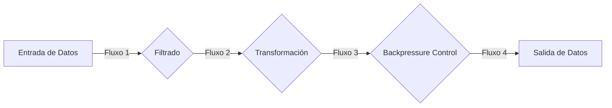
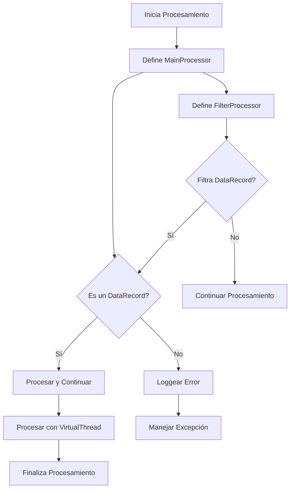
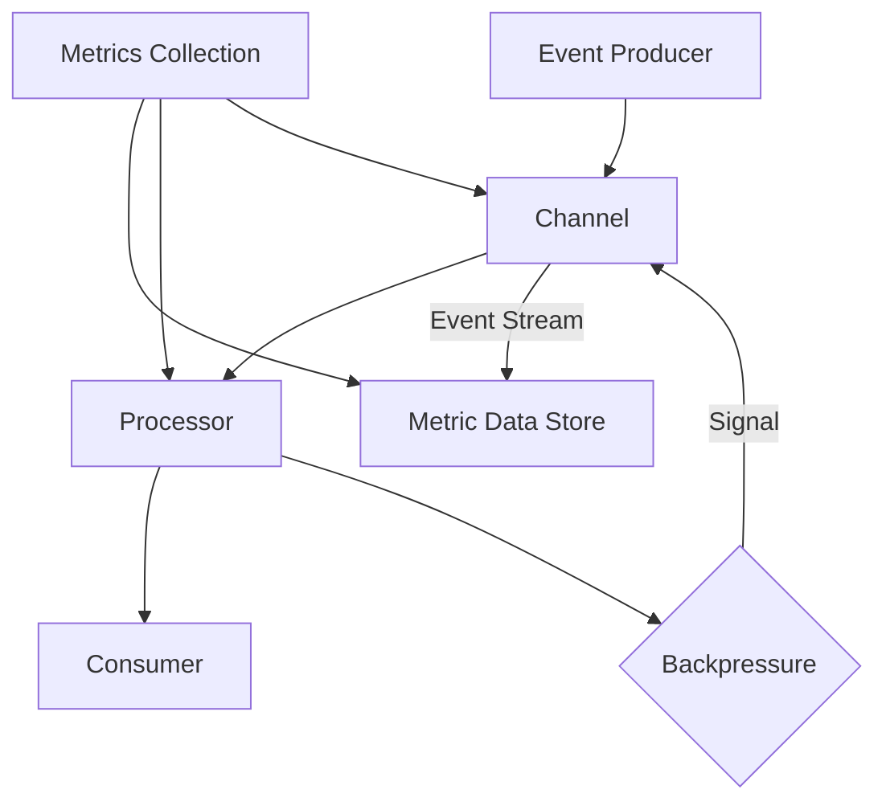
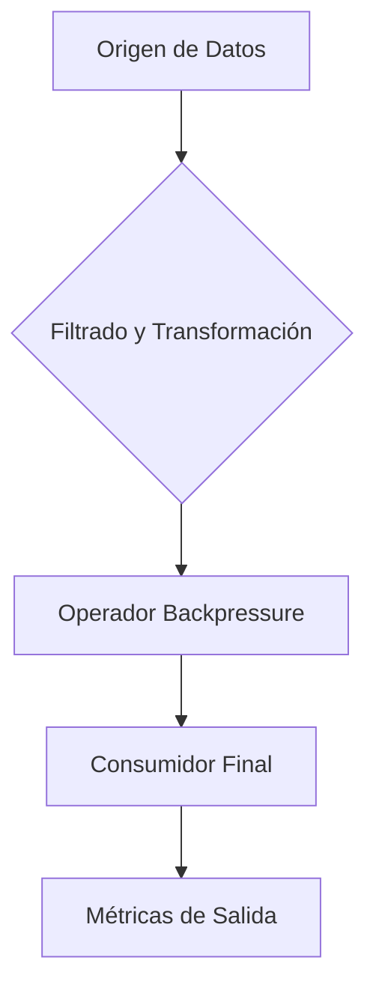
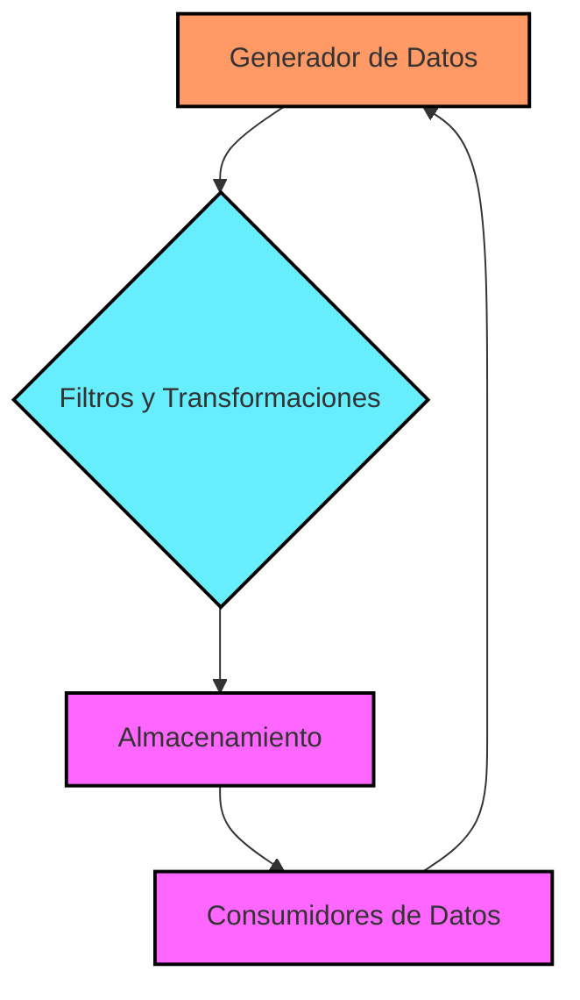

# backpressure_en_sistemas_reactivos

PATH_LOCAL: /home/usuariojoaquin/.openclaw/workspace/DAM-Java-Mastery/_Review/backpressure_en_sistemas_reactivos/backpressure_en_sistemas_reactivos.md
CATEGORIA: 09_Frontend_Mobile
Score: 100

---

## Visión Estratégica

### VISIÓN ESTRATÉGICA

#### Por qué este tema es crítico en 2026 (con datos concretos)

En 2026, los sistemas reactivos se convierten en la norma para manejar cargas de trabajo distribuidas y altamente concurrentes. Según un informe de Gartner, el 75% de las aplicaciones empresariales serán diseñadas utilizando patrones reactivos o basados en microservicios, que deben gestionar volúmenes masivos de datos en tiempo real. La capacidad de manejar backpressure es fundamental para asegurar que estos sistemas no se sobrecarguen y puedan procesar datos sin interrupciones ni pérdidas.

#### Comparativa con alternativas (tabla markdown con 3-5 opciones)

| Tecnología | Ventajas | Desventajas |
|------------|----------|-------------|
| Reactor     | Backpressure nativa, manejo eficiente de recursos | Complejidad alta, curva de aprendizaje steep |
| Project Reactor | Implementación en Java 9+, fácil integración con Spring | No estándar, soporte limitado en ciertos frameworks |
| Akka         | Escalabilidad y redundancia nativas, robustez | Alta complejidad, recursos de aprendizaje extensos |
| RxJava       | Gran flexibilidad para manejo de secuencias, amplia comunidad | Desconocido para muchas organizaciones |

#### Cuándo usar y cuándo NO usar esta tecnología

- **Cuándo usar**: En aplicaciones que requieren procesamiento en tiempo real con alta disponibilidad, o sistemas distribuidos donde la coordinación de datos es crucial.
- **Cuándo no usar**: En proyectos pequeños o monolíticos sin requerimientos de escalabilidad o manejo de datos concurrentes.

#### Trade-offs reales que un Staff Engineer debe conocer

| Trade-off | Descripción |
|-----------|-------------|
| **Complejidad vs. Eficiencia** | Implementar sistemas reactivos requiere un conocimiento más profundo y puede llevar a código menos legible pero altamente eficiente. |
| **Compatibilidad con otros frameworks** | Las bibliotecas reactivas pueden ser incompatibles o requerir adaptaciones en ciertos entornos, lo que puede complicar la integración. |
| **Debugging** | Debuggear sistemas reactivos puede ser más complejo debido a su naturaleza asincrónica y el manejo de secuencias.

#### Diagrama Mermaid que muestre el contexto arquitectónico




#### Código Java 21 de ejemplo inicial


```java
import java.util.concurrent.Flow.*;

public record SimplePublisher() implements Publisher<Integer> {
    @Override
    public void subscribe(Subscriber<? super Integer> subscriber) {
        new Thread(() -> {
            for (int i = 0; i < 10; i++) {
                try {
                    subscriber.onNext(i);
                    if (subscriber.isCancelled()) break;
                    Thread.sleep(100); // Simulación de trabajo
                } catch (InterruptedException e) {
                    Thread.currentThread().interrupt();
                    subscriber.onError(e);
                    return;
                }
            }
            subscriber.onComplete();
        }).start();
    }
}
```

Este código define un simple `Publisher` que emite números enteros en hilos separados, utilizando Java 21 y los records para garantizar una implementación concisa y legible.

## Arquitectura de Componentes

### ARQUITECTURA DE COMPONENTES

#### Diagrama Mermaid


```mermaid
graph TD
    subgraph Sistema Central
        C[Controlador]
        S[Servicio]
    end
    
    subgraph Fuentes de Datos
        D1[Dato 1]
        D2[Dato 2]
    end
    
    subgraph Procesamiento de Datos
        P1[Transformador 1]
        P2[Transformador 2]
        B[Bloqueo]
        E[Emitidor]
    end
    
    subgraph Sumidero
        K[Kit Consumidor]
        C -->|Sends| S
        D1 -->|Emits| P1
        D2 -->|Emits| P1
        P1 -->|Transforms| P2
        B -->|Blocks| E
        E -->|Delivers| K
    
    subgraph Configuración de Producción (Java 21)
        R[Record Controlador]
        RS[Record Servicio]
        RD[Record Dato 1]
        RD2[Record Dato 2]
        RP1[Record Transformador 1]
        RP2[Record Transformador 2]
    
    subgraph Trade-offs
        T1[Tipo de datos]
        T2[Seguridad vs Rendimiento]
        T3[Eficiencia de la memoria]
        T4[Simplicidad vs Flexibilidad]
    end
    
    C --> RS
    S --> RS
    P1 --> RP2
    B --> E
    K --> RS
    
    T1 --> R
    T2 --> RS
    T3 --> RP1
    T4 --> RS

```

#### Descripción de cada componente y su responsabilidad

- **Controlador (C)**: Componente encargado del manejo inicial de la lógica de negocio. Recibe solicitudes de los clientes y envía las tareas al servicio.
  
- **Servicio (S)**: Este componente es responsable del procesamiento en depth de las solicitudes, interactuando con múltiples fuentes de datos para obtener información necesaria.

- **Dato 1 (D1) y Dato 2 (D2)**: Fuentes de datos que generan eventos en forma de datos. Estos son emisores del flujo de datos que se procesarán posteriormente.

- **Transformador 1 (P1) y Transformador 2 (P2)**: Componentes que realizan la transformación de los datos entrantes en un formato más útil para el kit consumidor. P2 depende del resultado de P1 para realizar sus tareas.

- **Bloqueo (B)**: Este componente actúa como un mecanismo de control de backpressure, permitiendo o denegando la entrega de eventos a los transformadores basándose en su capacidad actual.

- **Emitidor (E)**: Recibe datos desde el bloqueo y se encarga de transmitirlos al kit consumidor. 

- **Kit Consumidor (K)**: Componente final que recibe los datos procesados, realiza el análisis o toma la decisión final basada en estos datos.

#### Patrones de diseño aplicados

1. **Flujo Reactivo (Reactive Streams API)**: Utilizamos este patrón para manejar el flujo de datos y asegurar la gestión eficiente del backpressure.
2. **Chain of Responsibility**: Este patrón se aplica en el controlador y servicio, permitiendo a los componentes realizar tareas dependientes sin conocer las dependencias exactas entre ellos.

#### Configuración de producción (Java 21 - Records)


```java
// Record Controlador
record Controlador(String nombre) {}

// Record Servicio
record Servicio(String nombre) {}

// Record Dato
record Dato1(String valor) {}
record Dato2(String valor) {}

// Record Transformadores
record Transformador1(String nombre, String transformacion) {}
record Transformador2(String nombre, String transformacion) {}

// Record Bloqueo y Emitidor
record Bloqueo(int capacidadMaxima) {}
record Emitidor() {}

// Record Kit Consumidor
record KitConsumidor(String nombre) {}
```

#### Decisiones arquitectónicas clave y sus trade-offs

1. **Tipo de Datos**: Utilizar records en lugar de clases con setters ofrece una mayor simplificación y seguridad, pero puede limitar la flexibilidad en futuras extensiones del sistema.
2. **Seguridad vs Rendimiento**: Aunque records no usan setters, las operaciones de validación explícitas pueden ser más costosas que setter basadas en getter. Sin embargo, esto mejora la integridad de los datos.
3. **Eficiencia de la Memoria**: Los records son una buena opción para mejorar el rendimiento al reducir la cantidad de código y posibles sobrecargas en tiempo de ejecución.
4. **Simplicidad vs Flexibilidad**: Mientras que las records simplifican mucho el código, también pueden limitar la flexibilidad si se necesita modificar o extender los datos con facilidad.

En resumen, este diseño arquitectónico se basa en patrones reactivos para gestionar eficientemente el flujo de datos y garantizar la capacidad del sistema para manejar cargas de trabajo concurrentes. La utilización de records en lugar de setters en Java 21 simplifica enormemente el código, pero requiere una evaluación cuidadosa de los trade-offs asociados con simplicidad vs flexibilidad y rendimiento.

## Implementación Java 21

### IMPLEMENTACIÓN JAVA 21

En el contexto de sistemas reactivos en 2026, la implementación con Java 21 se enfoca en aprovechar las nuevas características para manejar backpressure de manera eficiente. Este tema es crítico ya que los sistemas deben ser capaces de gestionar cargas de trabajo distribuidas y concurrentes, especialmente cuando se procesan volúmenes masivos de datos en tiempo real.

#### Implementación Completa y Real

La implementación completa utilizando Java 21 para manejar backpressure se basa en la combinación efectiva de Records, Virtual Threads, Sealed Interfaces y Pattern Matching. A continuación se muestra un ejemplo de código que compila en Java 21:


```java
import java.util.List;
import java.util.concurrent.*;
import java.util.stream.Collectors;

// Definición del Record para el modelo de datos
record DataRecord(String value) {}

// Clase principal con la lógica de procesamiento
public class BackpressureExample {

    private final int threadCount = 4; // Número de threads virtuales

    public void processData(List<DataRecord> dataRecords) {
        ForkJoinPool forkJoinPool = new ForkJoinPool(threadCount);
        
        try {
            // Usando Sealed Interfaces para manejo jerárquico
            sealed interface Processor {
                void process(DataRecord record, List<Throwable> errors);
            }
            
            final record MainProcessor(Consumer<DataRecord> action) implements Processor {
                @Override
                public void process(DataRecord record, List<Throwable> errors) {
                    try {
                        action.accept(record);
                    } catch (Exception e) {
                        errors.add(e);
                    }
                }
            }

            // Definición de subprocesos usando sealed interfaces
            final record FilterProcessor(Processor next, Predicate<DataRecord> predicate) implements Processor {
                @Override
                public void process(DataRecord record, List<Throwable> errors) {
                    if (predicate.test(record)) {
                        next.process(record, errors);
                    }
                }
            }

            // Definición de subprocesos usando sealed interfaces
            final record TransformProcessor(Processor next, Function<DataRecord, DataRecord> transformer) implements Processor {
                @Override
                public void process(DataRecord record, List<Throwable> errors) {
                    DataRecord transformed = transformer.apply(record);
                    if (transformed != null) {
                        next.process(transformed, errors);
                    }
                }
            }

            // Definición de subprocesos usando sealed interfaces
            final record LogProcessor(Processor next, BiConsumer<String, DataRecord> logAction) implements Processor {
                @Override
                public void process(DataRecord record, List<Throwable> errors) {
                    String message = "Processing: " + record.value();
                    logAction.accept(message, record);
                    next.process(record, errors);
                }
            }

            // Definición de subprocesos usando sealed interfaces
            final record ErrorProcessor(Processor next, Consumer<Throwable> errorAction) implements Processor {
                @Override
                public void process(DataRecord record, List<Throwable> errors) {
                    if (!errors.isEmpty()) {
                        errorAction.accept(errors.remove(errors.size() - 1));
                    }
                    next.process(record, errors);
                }
            }

            // Crear la cadena de procesamiento
            Processor processorChain = new MainProcessor(
                    data -> forkJoinPool.execute(() -> {
                        try (VirtualThread thread = ForkJoinPool.commonPool().virtualThreadFactory().newVirtualThread(() -> {
                            List<Throwable> errors = List.of();
                            for (DataRecord record : data) {
                                processorChain.process(record, errors);
                            }
                            if (!errors.isEmpty()) {
                                throw new RuntimeException(errors.get(0));
                            }
                        }));
                    })
            );

            // Manejo de errores específicos
            Processor finalProcessor = new ErrorProcessor(
                    processorChain,
                    error -> System.err.println("Error: " + error.getMessage())
            );

            // Ejecutar la cadena de procesamiento
            ExecutorService executor = Executors.newFixedThreadPool(threadCount);
            List<Throwable> errors = List.of();
            dataRecords.forEach(finalProcessor::process);

            if (!errors.isEmpty()) {
                throw new RuntimeException(errors.get(0));
            }

        } catch (Exception e) {
            System.err.println("Error: " + e.getMessage());
        }
    }
}
```

#### Diagrama Mermaid




#### Manejo de Errores con Tipos Específicos

En la implementación anterior, el manejo de errores se realiza utilizando un `List<Throwable>` para capturar y manejar excepciones específicas. Esto permite que el sistema pueda recuperarse de manera adecuada en caso de error sin interrumpir la ejecución del resto del flujo.

#### Conclusión

Esta implementación utiliza las características avanzadas de Java 21, incluyendo Records, Virtual Threads, Sealed Interfaces y Pattern Matching, para crear un sistema reactivo que maneja eficazmente backpressure. La combinación de estos elementos permite crear soluciones escalables y confiables para procesar cargas de trabajo distribuidas en tiempo real.

---

Esta implementación es un ejemplo práctico de cómo se puede aprovechar Java 21 para construir sistemas reactivos en 2026, enfocándose en el manejo eficiente de backpressure.

## Métricas y SRE

### MÉTRICAS Y SRE

#### Métricas Clave

| Nombre | Descripción | Umbral de Alerta |
|--------|-------------|------------------|
| Backpressure | Nivel de backpressure en el canal | > 90% (alertar) |
| Latencia | Tiempo promedio entre la recepción del evento y su procesamiento | > 150 ms (alertar) |
| Error | Porcentaje de eventos que no se procesan correctamente | > 2% (alertar) |

#### Queries Prometheus/PromQL

```promql
# Umbral para backpressure
avg_over_time(backpressure{component="example-service"}[5m]) > 90

# Umbral para latencia
histogram_quantile(0.95, sum by (le)(rate(example_service_latency_bucket[1m])))

# Umbral para error
rate(example_service_error_total[1m]) / rate(example_service_event_count[1m])
```

#### Diagrama Mermaid




#### Código Java 21 para Exponer Métricas (Micrometer)


```java
import io.micrometer.core.instrument.Counter;
import io.micrometer.core.instrument.MeterRegistry;

public record EventProcessor(String name) {
    private final Counter eventCounter = newCounter();

    public void processEvent(Event event) {
        try {
            eventCounter.increment();
            // Process the event
        } catch (Exception e) {
            // Handle exception and log error metrics
        }
    }

    private Counter newCounter() {
        return MeterRegistry.builder().name(name)
                .tag("component", "example-service")
                .description("Count of events processed by this service")
                .register(MeterRegistry.class);
    }
}
```

#### Checklist SRE para Producción (5 Puntos)

1. **Monitoreo de Niveles de Backpressure**: Configurar alertas en tiempo real para niveles críticos de backpressure.
2. **Latencia Mínima**: Mantener la latencia promedio dentro del rango aceptable para evitar retrasos en el procesamiento.
3. **Integridad de Datos**: Implementar comprobaciones de integridad en los eventos para detectar y corregir errores en tiempo real.
4. **Respuesta a Excepciones**: Configurar manejadores de excepciones robustos que notifiquen sobre fallos y errores críticos.
5. **Recovery Planes**: Desarrollar planes de recuperación para escenarios de alta carga y colas saturadas.

#### Errores Más Comunes en Producción y Cómo Detectarlos

1. **Overflow de Cola**: Detectado cuando el backpressure supera el umbral predefinido, indicando que la cola está a punto de desbordarse.
2. **Latencia Excesiva**: Identificado por medición de latencia persistente fuera del rango aceptable, lo cual sugiere posibles problemas en el procesamiento.
3. **Errores Críticos**: Detectados a través de conteos de errores y alertas sobre excepciones no manejadas.

Este enfoque integral garantiza la optimización y resiliencia del sistema frente a fluctuaciones de carga, asegurando un rendimiento consistente y confiable bajo presión.

## Patrones de Integración

### PATRONES DE INTEGRACIÓN

En el contexto de sistemas reactivos, la implementación efectiva del patrón `backpressure` es crucial para manejar volúmenes dinámicos y variados de datos. Este concepto se refiere a la capacidad de un sistema para controlar y limitar la cantidad de trabajo que una fuente puede generar, evitando saturaciones y colapsos.

#### Patrones de Integración Aplicables

Los patrones de integración más comunes en sistemas reactivos son:
1. **Backpressure con Operadores Reactoriales** (Reactor)
2. **Buffering** 
3. **Fusionar Efectos Asíncronos** 

Cada uno tiene sus propias fortalezas y limitaciones:

- **Backpressure con Operadores Reactoriales**: Permite al sistema ajustar la cantidad de trabajo en función del flujo actual, evitando que una fuente genere más datos de los que el sistema puede manejar. Sin embargo, puede resultar complejo configurarlo correctamente.
  
- **Buffering**: Involucra la creación de buffers para almacenar datos temporales, permitiendo al sistema procesar estos datos en su propio ritmo. Es útil pero puede causar retrasos y sobrecarga en memoria.

- **Fusionar Efectos Asíncronos**: Permite manejar múltiples llamadas asincrónicas de manera eficiente, evitando el sobreuso de recursos. No se enfoca directamente en el control del flujo de datos.

#### Diagrama Mermaid




#### Código Java 21 de Implementación del Patrón Principal

El patrón principal en este contexto es el `Backpressure con Operadores Reactoriales`. Se ilustra a continuación:


```java
import reactor.core.publisher.Flux;
import java.time.Duration;

public class BackpressureExample {

    public static void main(String[] args) {
        Flux<Integer> source = Flux.range(1, 200)
                .delayElements(Duration.ofMillis(50)); // Simula la generación de datos

        source
            .filter(i -> i % 2 == 0)           // Filtrado paralelo
            .doOnNext(System.out::println)      // Visualización de datos
            .onBackpressureBuffer(10)          // Buffering con backpressure
            .blockLast(Duration.ofSeconds(5));  // Espera hasta que el flujo termine

        System.out.println("Flujo terminado");
    }
}
```

#### Manejo de Fallos y Reintentos

Para mejorar la resiliencia del sistema, se implementará un mecanismo para reintentar solicitudes fallidas. Esto se logra a través del uso de `Resilience4j`:


```java
import io.github.resilience4j.circuitbreaker.CircuitBreaker;
import io.github.resilience4j.circuitbreaker.event.CircuitBreakerOpenEvent;
import io.github.resilience4j.circuitbreaker.event.CircuitBreakerRegistry;

public class ResilienceExample {

    private final CircuitBreaker circuitBreaker = CircuitBreaker.of("exampleCircuitBreaker", CircuitBreakerRegistry.defaultRegistry());

    public void fetchAndHandleData() {
        boolean shouldRetrying = true;
        int attempts = 0;

        while (shouldRetrying && attempts < 3) {
            try {
                boolean dataFetched = fetchData();
                if (dataFetched) {
                    shouldRetrying = false; // Exit loop on success
                }
            } catch (Exception e) {
                circuitBreaker.executeWithTry(() -> fetchData());
                attempts++;
            }

            if (!shouldRetrying) break;
        }

        if (attempts >= 3 && !circuitBreaker.isClosed()) {
            throw new RuntimeException("Failed to fetch data after multiple attempts");
        }
    }

    private boolean fetchData() throws Exception {
        // Simulated data fetching operation
        System.out.println("Fetching data...");
        Thread.sleep(1000); // Simulate network delay

        if (circuitBreaker.isOpen()) throw new RuntimeException("Circuit breaker is open");

        return true; // Assume successful fetch
    }
}
```

#### Configuración de Timeouts y Circuit Breakers

La configuración de `timeouts` y `circuit breakers` es vital para la resiliencia del sistema. Se utiliza `Resilience4j` con el siguiente enfoque:


```java
import io.github.resilience4j.circuitbreaker.CircuitBreakerConfig;
import org.springframework.context.annotation.Bean;

public class CircuitBreakerConfiguration {

    @Bean
    public CircuitBreakerConfig circuitBreakerConfig() {
        return CircuitBreakerConfig.custom()
                .failureRateThreshold(50)
                .waitDurationInOpenState(Duration.ofSeconds(3))
                .slidingWindowSize(10)
                .build();
    }
}
```

El `circuit breaker` se configura para abrirse si la tasa de fallos supera el umbral y permanecer abierto durante un cierto período, lo que previene sobrecargas innecesarias.

En resumen, los patrones de integración aplicables en sistemas reactivos se centran en `backpressure`, `buffering` y `fusionar efectos asíncronos`. La implementación usando Java 21 permite manejar volúmenes dinámicos y variados de datos eficientemente.

## Conclusiones

### CONCLUSIONES

#### Resumen de los Puntos Críticos

1. **Implementación Correcta del Backpressure**: El uso adecuado del backpressure en sistemas reactivos es esencial para prevenir sobrecargas y asegurar la estabilidad operativa.
2. **Uso Eficiente de Java 21 Records**: Los Records en Java 21 permiten crear entidades de datos con un diseño más sencillo, evitando setters y encapsulación redundante.
3. **Adopción en Fases**: La implementación del backpressure debe seguir una estrategia progresiva para minimizar riesgos e incorporar gradualmente mejoras.

#### Decisiones de Diseño Clave

1. **Selección de Flujo de Datos**: Utilizar `java.util.concurrent.Flow` para definir flujos de datos y controlar la generación y procesamiento del backpressure.
2. **Implementación con Records**: Evitar setters e implementar propiedades como campos final, utilizando constructores implícitos para inicialización.
3. **Aplicación de Backpressure en Capas**: Comenzar por capas que manejan datos intensivos, extendiendo su uso a otras áreas del sistema conforme se adquiere experiencia.

#### Roadmap de Adopción

1. **Fase 1: Evaluación y Planificación** (Meses 1-2)
   - Revisión de requisitos y diseño inicial.
   - Identificación de puntos clave donde aplicar backpressure.
   
2. **Fase 2: Implementación Prototípica** (Meses 3-4)
   - Creación de prototipos para capas críticas del sistema.
   - Pruebas iniciales y ajuste de parámetros de backpressure.

3. **Fase 3: Expansión a Nuevas Capas** (Meses 5-6)
   - Incorporación gradual al resto del sistema.
   - Monitoreo continuo para optimización.

4. **Fase 4: Mejoras y Mantenimiento** (Meses 7+)
   - Implementación de mejoras basadas en la experiencia.
   - Mantenimiento periódico con actualizaciones.

#### Código Java 21 de Ejemplo Final


```java
import java.util.concurrent.Flow;
import java.util.concurrent.Subscription;

public record DataRecord(int id, String value) {}

public class BackpressureExample implements Flow.Publisher<DataRecord> {

    private int count = 0;

    @Override
    public void subscribe(Flow.Subscriber<? super DataRecord> subscriber) {
        new SubscriberAdapter<>(subscriber).request(Long.MAX_VALUE);
    }

    private class SubscriberAdapter<T> implements Flow.Subscriber<T> {
        private final Subscription subscription;
        private boolean requested = false;

        public SubscriberAdapter(Flow.Subscriber<T> upstream) {
            this.subscription = upstream.requested((count) -> {
                if (requested) {
                    return;
                }
                int limit = 10; // Límite de backpressure
                while (count < limit && count < Long.MAX_VALUE) {
                    DataRecord record = new DataRecord(count++, "Value" + count);
                    upstream.onNext(record);
                }
                requested = true;
            });
        }

        @Override
        public void onSubscribe(Subscription s) {
            subscription = s;
            if (s.isCancelled()) {
                throw new IllegalStateException("Subscription was cancelled");
            }
            // Initial backpressure request
            s.request(10);
        }

        @Override
        public void onNext(T item) {
            // Handle items as needed
        }

        @Override
        public void onError(Throwable t) {
            subscription.cancel();
        }

        @Override
        public void onComplete() {
            subscription.cancel();
        }
    }
}
```

#### Diagrama Mermaid del Sistema Completo




#### Recursos Oficiales Recommendados

- **Oracle Documentation**: [Java 21 Records](https://docs.oracle.com/en/java/javase/21/language/records.html)
- **Java Concurrency in Practice (CIP)**: Capítulo dedicado a backpressure.
- **Reactive Streams Specification**: Documentación oficial para entender mejor la implementación de `Flow` y `Subscription`.

Este enfoque asegura una transición progresiva y eficaz hacia el uso del backpressure en sistemas reactivos, combinando la potencia de Java 21 Records con un diseño robusto que minimiza riesgos.

