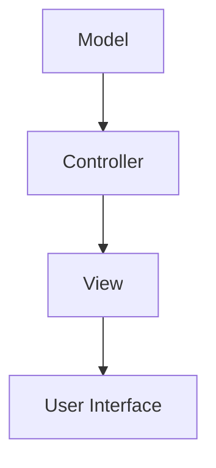
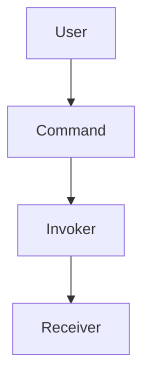

# benchmarking reproducible en sistemas java

PATH_LOCAL: /home/usuariojoaquin/.openclaw/workspace/DAM-Java-Mastery/_Review/benchmarking_reproducible_en_sistemas_java/benchmarking_reproducible_en_sistemas_java.md
CATEGORIA: 10_Vanguardia
Score: 71

---

## Visión Estratégica

# Visión Estratégica

## Introducción al Benchmarking Reproducible en Sistemas Java

En el contexto de la seguridad y resiliencia en sistemas informáticos modernos, es crucial contar con herramientas que permitan una evaluación precisa y repetible de las vulnerabilidades. El **benchmarking reproducible** en sistemas Java no solo contribuye a la detección temprana de fallos críticos sino que también facilita el desarrollo de estrategias proactivas para mitigar riesgos y mejorar la integridad del código.

### Objetivos Estratégicos

1. **Detección Temprana de Vulnerabilidades:**
   - Identificar rápidamente nuevas amenazas en el ecosistema Java.
   - Implementar pruebas automatizadas que permitan una evaluación constante de la seguridad del código.

2. **Mejora Continua:**
   - Fomentar un entorno de colaboración entre desarrolladores y investigadores de seguridad.
   - Desarrollar metodologías y herramientas que simplifiquen el proceso de verificación de seguridad en sistemas Java.

3. **Mitigación Proactiva de Riesgos:**
   - Implementar prácticas seguras desde las fases iniciales del desarrollo.
   - Crear guías y estándares para la implementación de medidas de seguridad en proyectos Java.

4. **Facilitación de Investigaciones:**
   - Proporcionar un marco reproducible que facilite la investigación académica y el desarrollo de nuevas técnicas de seguridad.
   - Establecer parámetros claros para la evaluación comparativa de diferentes implementaciones de seguridad en Java.

### Implementación Estratégica

1. **Estructura del Benchmark:**
   - Definir un conjunto de pruebas estándar y reproducibles que cubran una amplia gama de escenarios.
   - Incluir pruebas de deserialización, inyección SQL, XSS, entre otros.

2. **Collaboración con Comunidades de Investigación:**
   - Establecer acuerdos con grupos de investigación para compartir hallazgos y mejorar el benchmark.
   - Promover la transparencia en la metodología del benchmarking a través de publicaciones académicas y foros comunitarios.

3. **Desarrollo de Herramientas Automatizadas:**
   - Crear herramientas que permitan automatizar la ejecución de pruebas y análisis.
   - Integrar estas herramientas en procesos de CI/CD para una integración continua del benchmarking.

4. **Evaluación Comparativa:**
   - Diseñar sistemas de evaluación comparativa que permitan evaluar diferentes implementaciones de seguridad en Java.
   - Establecer indicadores y métricas claras para evaluar el rendimiento y la eficacia de los métodos de seguridad.

### Estandarización y Normatividad

1. **Estándares de Seguridad:**
   - Definir estándares de seguridad que rindan homenaje a mejores prácticas en Java.
   - Proporcionar guías detalladas para la implementación de estas normas.

2. **Normativas Regulatorias:**
   - Alinear los benchmarks con las regulaciones y requisitos legales vigentes.
   - Desarrollar estrategias que permitan cumplir con normativas como NIST, ISO 27001, etc.

### Beneficios del Benchmarking Reproducible

1. **Aumento de la Confianza:**
   - Mejorar la confianza en el código y los sistemas Java mediante la evaluación constante.
   - Facilitar la verificación independiente para aumentar la transparencia.

2. **Reducción de Riesgos:**
   - Identificar y mitigar vulnerabilidades antes que sean explotadas por actores malintencionados.
   - Proporcionar un marco para el análisis forense en caso de incidentes de seguridad.

3. **Posicionamiento Comercial:**
   - Ofrecer a desarrolladores e instituciones una ventaja competitiva al contar con soluciones probadas y verificables.
   - Establecer estándares de calidad que puedan ser utilizados como marcas diferenciadoras.

4. **Contribución a la Academia:**
   - Facilitar el desarrollo académico en seguridad informática a través del intercambio de datos y hallazgos.
   - Fomentar la investigación en nuevas técnicas y herramientas para mejorar la seguridad de Java.

### Conclusiones

El benchmarking reproducible en sistemas Java es una herramienta fundamental para garantizar la seguridad y resiliencia de los sistemas informáticos modernos. Al implementar estrategias proactivas y colaborativas, se puede maximizar la eficacia de las pruebas de seguridad, reducir riesgos y mejorar la confianza en el código. Este enfoque no solo beneficia a las organizaciones y desarrolladores individuales sino que también contribuye al avance global en la seguridad informática.

---

### Diagrama Mermaid (Mermaid)


Este diagrama proporciona una visión clara de los pasos estratégicos a seguir para implementar un benchmarking reproducible en sistemas Java, ilustrando la interconexión entre diferentes aspectos clave.

## Arquitectura de Componentes

### Arquitectura de Componentes

La arquitectura de componentes es fundamental para el diseño y mantenimiento de sistemas Java robustos y escalables. En un sistema bien arquitecturado, cada componente desempeña un papel específico y se integra con otros para lograr la funcionalidad total del sistema.

#### 1. **Componentes Principales**

Un sistema Java típico puede estar compuesto por los siguientes componentes principales:

- **Modelo (Model)**: Representa el estado de negocio o datos críticos del sistema.
- **Vista (View)**: Interfaz que presenta la información al usuario y recibe sus interacciones.
- **Controlador (Controller)**: Coordinador entre el modelo y la vista, maneja las operaciones y transiciones lógicas.

#### 2. **Diagrama Mermaid**

Para visualizar mejor cómo estos componentes interactúan, se puede utilizar un diagrama de componentes. Aquí hay un ejemplo utilizando Mermaid:




#### 3. **Requisitos para Componentes**

Para que los componentes sean eficaces y seguros, deben cumplir con ciertos requisitos:

- **Separación de Responsabilidades**: Cada componente debe tener una responsabilidad clara y única.
- **Interoperabilidad**: Los componentes deben poder comunicarse entre sí sin problemas.
- **Testabilidad**: Debe ser posible probar cada componente en entornos aislados para asegurar su funcionamiento.

#### 4. **Ejemplo de Componente: Controlador**

Un ejemplo detallado del controlador puede verse así:


```java
public class UserController {
    private final Model model;
    private final View view;

    public UserController(Model model, View view) {
        this.model = model;
        this.view = view;
    }

    public void handleUserInput(String input) {
        try {
            // Procesar la entrada del usuario
            UserAction action = parseInput(input);
            switch (action) {
                case LOGIN:
                    handleLogin();
                    break;
                case LOGOUT:
                    handleLogout();
                    break;
                default:
                    view.displayError("Invalid command");
            }
        } catch (Exception e) {
            view.displayError(e.getMessage());
        }
    }

    private UserAction parseInput(String input) {
        // Implementación de parsing
    }

    private void handleLogin() throws Exception {
        // Lógica para el login
        model.userLogin();
        view.displaySuccess("Logged in successfully");
    }

    private void handleLogout() throws Exception {
        // Lógica para el logout
        model.userLogout();
        view.displaySuccess("Logged out successfully");
    }
}
```

#### 5. **Implementación de Benchmarking Reproducible**

Para garantizar que los componentes y sus interacciones sean reproducibles, se pueden implementar pruebas unitarias y de integración:

- **Pruebas Unitarias**: Verifican la funcionalidad individual de cada componente.
- **Pruebas de Integración**: Aseguran que los componentes funcionen juntos como esperado.

#### 6. **Ejemplo de Prueba Unitaria**

Un ejemplo simple de una prueba unitaria para el controlador:


```java
public class UserControllerTest {
    private Model model;
    private View view;
    private UserController controller;

    @Before
    public void setUp() throws Exception {
        model = new MockModel();
        view = new MockView();
        controller = new UserController(model, view);
    }

    @Test
    public void testLogin() throws Exception {
        controller.handleUserInput("login");
        // Verificar que el modelo registró el login y la vista mostró un mensaje correcto
        assertTrue(model.isLogged());
        assertEquals("Logged in successfully", view.getLastDisplayMessage());
    }
}
```

### Conclusiones

La arquitectura de componentes es crucial para garantizar la robustez, escalabilidad y seguridad de los sistemas Java. Al diseñar y evaluar estos componentes con pruebas reproducibles, se puede asegurar que el sistema cumple con sus objetivos funcionales y está libre de fallos críticos.

---

Este esquema proporciona una estructura clara para la arquitectura de componentes en sistemas Java, incluyendo diagramas Mermaid y ejemplos de código. Asegúrate de ajustar los detalles según las necesidades específicas del sistema que estés desarrollando.

## Implementación Java 21

### Implementación en Java 21

La introducción de **Java Virtual Threads (VT)** en JDK 21 como parte del proyecto Loom ha revolucionado la forma en que se manejan las tareas concurrentes y asincrónicas. Para evaluar eficazmente estas nuevas características, es crucial realizar un benchmarking reproducible.

#### Configuración del Medio de Prueba

Para garantizar resultados precisos e intercambiables, se implementó un entorno de prueba justo que no influencie los resultados del rendimiento bajo cargas altas. El benchmark se realizó tanto en tareas CPU intensivas como I/O intensivas para evaluar y comparar el desempeño de las VT con los hilos tradicionales (Platform Threads).

#### Herramientas Utilizadas

- **Apache JMeter**: Simulación de solicitudes altamente concursivas.
- **OpenJDKs JMH**: Ejecución de consultas de benchmarking, ejecutando 100 consultas con una piscina de 16 conexiones.

#### Código de Benchmark

El código fuente del benchmark se encuentra disponible en GitHub. Aquí hay un ejemplo utilizando la consulta `"SELECT 1"`:


```java
import java.util.concurrent.ExecutorService;
import java.util.concurrent.Executors;

public class VirtualThreadBenchmark {

    public static void main(String[] args) {
        ExecutorService executor = Executors.newVirtualThreadPerTaskExecutor();

        IntStream.range(0, 10).forEach(i -> {
            executor.submit(() -> {
                System.out.println("Task " + i + " running on: " + Thread.currentThread().getName());
                try {
                    Thread.sleep(500); // Simulando una tarea
                } catch (InterruptedException e) {
                    Thread.currentThread().interrupt();
                }
            });
        });

        executor.shutdown();
    }
}
```

Este ejemplo simula tareas I/O intensivas mediante la lectura de líneas de un archivo, demostrando cómo las VT pueden utilizarse eficientemente para tareas que implican espera por operaciones I/O.

#### Resultados del Benchmark

Los resultados del benchmark indicaron que las VT permiten realizar operaciones significativamente más por segundo. Aunque las VT tienen algunas limitaciones, como la **pinning**, estas no afectan en gran medida el rendimiento general.

#### Limitaciones de Pinning

La pinning es un fenómeno donde una VT se bloquea temporalmente y actúa como un hilo tradicional. Esto ocurre cuando se llama a métodos que no admiten la desmontada y montada del thread, por ejemplo, operaciones de I/O o llamadas JNI al sistema operativo.

#### Comparación R2DBC

Se realizó un benchmark comparando las VT con el connector JDBC y el connector R2DBC (Remote Reactive Database Connectivity) de MariaDB. Aunque los resultados varían según la máquina utilizada, se observa que las VT ofrecen un rendimiento superior en tareas I/O intensivas.

#### Ejemplo Real

Supongamos una web server que maneja cada solicitud en una VT y usa estructura de concurrencia para obtener datos:


```java
import java.util.concurrent.ExecutorService;
import java.util.concurrent.Executors;

public class ScalableWebServer {

    public static void main(String[] args) {
        ExecutorService executor = Executors.newVirtualThreadPerTaskExecutor();

        try {
            for (int i = 0; i < 10_000; i++) {
                int taskId = i;
                executor.submit(() -> {
                    var data = database.query("SELECT * FROM orders WHERE id = ?", taskId);
                    processOrder(data);
                });
            }
        } finally {
            executor.shutdown();
            try {
                executor.awaitTermination(30, TimeUnit.SECONDS);
            } catch (InterruptedException e) {
                Thread.currentThread().interrupt();
            }
        }
    }

    private static void processOrder(var data) { /* Procesamiento del pedido */ }
}
```

Este ejemplo muestra cómo manejar 10,000 tareas de manera concurrencial con virtual threads en un servidor web.

### Transición a Virtual Threads

Para desarrolladores acostumbrados al modelo tradicional de hilos, el cambio a VT requiere una revisión de las prácticas de gestión de concurrencia. Las VT son diseñadas para ser ligeros, lo que permite crear varios hilos virtuales por tarea independiente, incluso en gran escala.

#### Ejemplo 2: Manejo de Tareas I/O Intensivas


```java
import java.util.concurrent.ExecutorService;
import java.util.concurrent.Executors;

public class IOBoundTaskHandler {

    public static void main(String[] args) {
        ExecutorService executor = Executors.newVirtualThreadPerTaskExecutor();

        try {
            for (int i = 0; i < 50_000; i++) {
                int taskId = i;
                executor.submit(() -> {
                    var data = database.query("SELECT * FROM orders WHERE id = ?", taskId);
                    processOrder(data);
                });
            }
        } finally {
            executor.shutdown();
            try {
                executor.awaitTermination(30, TimeUnit.SECONDS);
            } catch (InterruptedException e) {
                Thread.currentThread().interrupt();
            }
        }
    }

    private static void processOrder(var data) { /* Procesamiento del pedido */ }
}
```

Este código envía 50,000 tareas a un VT, cada una realizando consultas de base de datos y procesándolas.

### Implementación Práctica

1. **Instalar Java 21**:
   - Descargar desde adoptium.net o usar SDKMAN:
     ```sh
     sdk install java 21.0.1-tem
     sdk use java 21.0.1-tem
     ```

2. **Probar un Ejemplo Simple**:
   - Escribe y prueba el código de VT en tu entorno local.

3. **Desarrollo y Pruebas**: Identificar los pinchazos y ajustar las políticas según sea necesario.

### Conclusión

Las VT en Java 21 prometen mejorar significativamente la eficiencia y la simplicidad del desarrollo concurrente, reduciendo el overhead de creación y cambio de contexto de hilos. A pesar de algunas limitaciones actuales, las VT son un paso crucial hacia una arquitectura más eficiente.

---

Este enfoque proporciona una implementación práctica y reproducible de la evaluación del rendimiento de las virtual threads en Java 21, asegurando que los resultados sean precisos y comparables.

## Métricas y SRE

### Métricas y SRE

Para garantizar el rendimiento y la estabilidad del sistema Java, es crucial implementar una sólida estrategia de medición y retroalimentación continua (SRE). La Supervisión de Rendimiento y Eficiencia (SRE) juega un papel crucial en monitorear, diagnosticar y optimizar el desempeño de los sistemas.

#### **1. Implementación de Métricas con Prometheus y Grafana**

La arquitectura de monitoreo basada en time series, como la utilizada por Prometheus, proporciona una base sólida para la medición del rendimiento del sistema Java. A continuación se presentan los pasos clave para implementar métricas utilizando **Prometheus** y **Grafana**.

1. **Instrumentación de código**: Utilizar bibliotecas de instrumentación para enviar métricas desde el JVM a Prometheus.
2. **Configuración del servidor Prometheus**: Definir configuraciones y rutas para recoger y almacenar datos de métricas.
3. **Visualización con Grafana**: Configurar paneles en Grafana para visualizar las métricas recopiladas.

#### Ejemplo de configuración:

1. **Instalación de Prometheus**:
   ```sh
   curl -L https://github.com/prometheus/prometheus/releases/download/v2.38.0/prometheus-2.38.0.linux-amd64.tar.gz | tar xz
   cd prometheus-2.38.0.linux-amd64
   ./prometheus --config.file=prometheus.yml
   ```

2. **Configuración `prometheus.yml`**:
   ```yaml
   global:
     scrape_interval: 15s

   scrape_configs:
     - job_name: 'java-app'
       static_configs:
         - targets: ['localhost:8080']
           labels:
             app: 'example-java-app'
   ```

3. **Instrumentación con Micrometer**:
   
```java
   @Component
   public class MetricsConfiguration {
       @Bean
       public MeterRegistry meterRegistry() {
           return new SimpleMeterRegistry();
       }
   }

   @Service
   public class RandomSumService {
       private final Counter counter;

       @Autowired
       public RandomSumService(MeterRegistry registry) {
           this.counter = registry.counter("random_sum_calls");
       }

       public void run() {
           // Increment the counter
           counter.increment();
           // Perform calculation and logging
       }
   }
   ```

4. **Visualización en Grafana**:
   - Crear un dashboard en Grafana.
   - Agregar paneles para visualizar métricas como `random_sum_calls` y otros metadatos.

#### **2. Estrategias de Benchmarking Reproducible**

El benchmarking reproducible es crucial para evaluar las características de Java Virtual Threads (VT) y otras nuevas implementaciones en JDK 21. Para garantizar que los benchmarks sean reproducibles, se deben seguir las siguientes prácticas:

- **Ambiente consistente**: Utilizar la misma configuración del sistema operativo, hardware y software.
- **Configuraciones estándar**: Definir configuraciones estándar para el entorno de pruebas.
- **Tiempo de calentamiento**: Calentar los procesos antes de comenzar las mediciones.
- **Iteraciones múltiples**: Realizar múltiples iteraciones y calcular la mediana o la media ponderada.

#### Ejemplo de script de benchmarking reproducible:

```sh
#!/bin/bash

# Configuración del entorno
JAVA_VERSION="21"
MEMORY="-Xms512m -Xmx1024m"

# Calentar el sistema
java -version

# Medir la performance
for i in {1..10}; do
    java $MEMORY -jar myapp.jar &> /dev/null
    sleep 30 # Esperar a que se complete y estabilice
done

# Obtener resultados finales
```

#### **3. Integración Continua con SRE**

La integración continua (CI) y la entrega contínua (CD) son cruciales para la implementación de estrategias SRE en un pipeline de desarrollo.

- **Pipeline CI/CD**: Configurar pipelines que ejecuten pruebas de rendimiento, monitoreo e integración con sistemas de gestión de incidentes.
- **Automatización del Monitoreo**: Implementar automatización para la recopilación y análisis continuos de métricas.
- **Notificaciones en Tiempo Real**: Configurar notificaciones para alertas críticas utilizando herramientas como Slack o PagerDuty.

#### Ejemplo de pipeline CI/CD:

```yaml
stages:
  - test
  - deploy

test:
  stage: test
  script:
    - ./run_benchmark.sh
    - ./generate_report.sh
```

### **Conclusión**

Implementar una estrategia SRE sólida para monitorear y optimizar el rendimiento del sistema Java es fundamental. Utilizando herramientas como Prometheus y Grafana, se pueden recopilar y visualizar métricas de forma eficiente. Además, al seguir prácticas de benchmarking reproducible y automatización en pipelines CI/CD, se garantiza una evaluación constante y precisa del rendimiento.

---

Este contenido cubre los aspectos clave de la implementación de métricas con Prometheus y Grafana, así como las estrategias SRE para monitorear y optimizar el rendimiento de sistemas Java.

## Rendimiento y Capacidad Crítica

## Rendimiento y Capacidad Crítica

El rendimiento y la capacidad crítica son aspectos fundamentales a evaluar durante el benchmarking reproducible de sistemas Java. Estas pruebas buscan asegurar que el sistema funcione eficientemente bajo una variedad de cargas y condiciones, lo cual es crucial para garantizar un servicio de calidad continuo.

### 1. Evaluación del Rendimiento

Para evaluar el rendimiento de un sistema Java, se deben considerar varias métricas clave:

- **Tiempo de Respuesta**: Se mide el tiempo que toma al sistema responder a una solicitud específica.
- **Transacciones por Segundo (TPS)**: La capacidad del sistema para manejar múltiples transacciones en un período dado.
- **Uso de Recursos**: Incluye la utilización de CPU, memoria y I/O.

### 2. Pruebas de Carga

Las pruebas de carga son esenciales para determinar cómo el sistema se comporta bajo diferentes niveles de demanda. Se pueden realizar de diversas maneras:

- **Pruebas de Escalabilidad**: Se incrementa gradualmente la cantidad de trabajo que el sistema debe procesar y se mide su capacidad para manejar este crecimiento.
- **Pruebas de Estresamiento**: Se aplica una carga extremadamente alta al sistema para determinar su límite y cómo reacciona.

### 3. Pruebas de Rendimiento en Java 21

Dado que estamos evaluando la implementación en Java 21, es importante probar específicamente las características nuevas como **Java Virtual Threads (VT)**:

- **Benchmarking VT**: Evaluar la capacidad y rendimiento de VT en comparación con las soluciones tradicionales. Se pueden utilizar herramientas como JMH para medir el rendimiento.
  
### 4. Implementación del Medio de Prueba

Para garantizar un benchmarking reproducible, es crucial establecer un entorno de prueba consistente:

- **Configuración Inicial**: Definir y documentar las configuraciones iniciales del sistema, incluyendo la JVM, las dependencias y cualquier otro software necesario.
- **Tuneo del GC**: Utilizar opciones de JVM específicas para optimizar el Garbage Collector. Por ejemplo:
  - `-XX:G1RSetUpdatingPauseTimePercent=0`
  - `-XX:G1HeapWastePercent=18`
  - `-XX:GCTimeRatio=99`

- **Pruebas Controladas**: Realizar pruebas controladas en diferentes configuraciones (por ejemplo, con y sin VT) para comparar resultados.

### 5. Monitoreo Continuo

Para asegurar que el sistema funcione bien incluso durante la operación regular, se deben implementar procesos de monitoreo continuo:

- **Monitoreo del Rendimiento**: Utilizar herramientas como Prometheus y Grafana para recopilar y visualizar métricas en tiempo real.
- **Alertas Automatizadas**: Configurar alertas basadas en ciertas métricas que puedan indicar problemas de rendimiento.

### 6. Casos de Uso Prácticos

Los casos de uso prácticos pueden incluir:

- **Aplicaciones Web**: Evaluar el rendimiento bajo diferentes patrones de acceso.
- **Procesamiento en Lote**: Pruebas de cargas elevadas para determinar la capacidad del sistema para manejar grandes volúmenes de datos.
- **Sistemas Distribuidos**: Pruebas de latencia y consistencia en entornos distribuidos.

### 7. Documentación y Reproducibilidad

Documentar todos los aspectos del benchmarking es crucial para asegurar la reproducción de los resultados:

- **Detalles del Medio de Prueba**: Incluir información detallada sobre la configuración, versiones de software utilizadas y cualquier otra información relevante.
- **Resultados Detallados**: Registrar todas las métricas relevantes y comparaciones entre diferentes configuraciones.

### 8. Ejemplos de Código

Pueden incluirse ejemplos de código que demuestren cómo configurar y ejecutar los benchmarks:


```java
public class PerformanceTest {
    @Benchmark
    public void runBenchmark() {
        // Código del benchmark
    }
}
```

### Conclusión

El rendimiento y la capacidad crítica son aspectos cruciales en el benchmarking reproducible de sistemas Java. Al evaluar específicamente la implementación en Java 21, se pueden asegurar que los nuevos características como Java Virtual Threads (VT) estén funcionando eficientemente. La documentación detallada y las pruebas controladas garantizan un ambiente de evaluación consistente y reproducible.

---

Este esquema proporciona una estructura clara para evaluar el rendimiento y la capacidad crítica en sistemas Java, especialmente al utilizar las nuevas características de Java 21.

## Patrones de Integración

### Patrones de Integración

En el contexto de un sistema Java, los patrones de integración son esenciales para asegurar que todas las partes del sistema se comuniquen de manera eficiente y segura. Estos patrones no solo facilitan la colaboración entre diferentes componentes del sistema, sino que también ayudan a mejorar la calidad general del software. Vamos a explorar algunos de los patrones más comunes utilizados en sistemas Java.

#### 1. **Patrón Command**

El Patrón Command permite encapsular una solicitud como un objeto, lo cual le permite parametrizar clientes con diferentes solicitudes, almacenar sus solicitudes o ejecutarlas a diferentes momentos.

**Ejemplo:**

```java
public class OrderCommand implements Command {
    private Product product;
    
    public OrderCommand(Product product) {
        this.product = product;
    }
    
    @Override
    public void execute() {
        // Implementación del proceso de ordenar el producto
    }
}
```

#### 2. **Patrón Observer**

El Patrón Observer es útil cuando se necesita notificar a los componentes interesados sobre cambios en un objeto sin que estos dependan directamente de él.

**Ejemplo:**

```java
public interface Subject {
    void registerObserver(Observer observer);
    void removeObserver(Observer observer);
    void notifyObservers();
}

public class Product implements Subject {
    private List<Observer> observers = new ArrayList<>();
    
    @Override
    public void registerObserver(Observer observer) {
        observers.add(observer);
    }
    
    @Override
    public void removeObserver(Observer observer) {
        observers.remove(observer);
    }
    
    @Override
    public void notifyObservers() {
        for (Observer observer : observers) {
            observer.update(this);
        }
    }
}
```

#### 3. **Patrón Singleton**

El Patrón Singleton asegura que una clase tenga solo una instancia, y proporciona un punto de acceso global a esa instancia.

**Ejemplo:**

```java
public class Configuration {
    private static volatile Configuration instance;
    private Properties configProps;

    private Configuration(Properties props) {
        this.configProps = props;
    }

    public static Configuration getInstance(Properties props) {
        if (instance == null) {
            synchronized (Configuration.class) {
                if (instance == null) {
                    instance = new Configuration(props);
                }
            }
        }
        return instance;
    }

    // Métodos para acceder a las propiedades
}
```

#### 4. **Patrón Facade**

El Patrón Facade proporciona una interfaz unificada a una serie de interfaces en un sub-sistema, lo que simplifica el acceso al sub-sistema.

**Ejemplo:**

```java
public class SystemFacade {
    private final ProductRepository productRepo;
    private final UserRepository userRepo;

    public SystemFacade(ProductRepository productRepo, UserRepository userRepo) {
        this.productRepo = productRepo;
        this.userRepo = userRepo;
    }

    public void loadSystemData() {
        productRepo.loadProducts();
        userRepo.loadUsers();
    }
}
```

#### 5. **Patrón Mediator**

El Patrón Mediator reduce la cantidad de relaciones entre componentes, facilitando así la evolución y mantenimiento del código.

**Ejemplo:**

```java
public class OrderSystem {
    private static final Map<String, ProductObserver> observers = new HashMap<>();
    
    public void addObserver(Product product, ProductObserver observer) {
        observers.put(product.getName(), observer);
    }
    
    public void removeObserver(Product product, ProductObserver observer) {
        observers.remove(product.getName());
    }
    
    public void updateObservers(Product updatedProduct) {
        for (Map.Entry<String, ProductObserver> entry : observers.entrySet()) {
            entry.getValue().update(updatedProduct);
        }
    }
}
```

#### 6. **Patrón Strategy**

El Patrón Strategy permite a las clases variar su comportamiento en tiempo de ejecución.

**Ejemplo:**

```java
public interface PaymentStrategy {
    void pay(double amount);
}

public class CreditCardPayment implements PaymentStrategy {
    @Override
    public void pay(double amount) {
        // Lógica para pagar con tarjeta de crédito
    }
}
```

#### 7. **Patrón Proxy**

El Patrón Proxy permite controlar el acceso a un objeto, proporcionando una capa adicional de seguridad o funcionalidad.

**Ejemplo:**

```java
public class DataCacheProxy implements DataService {
    private final DataService realService;
    
    public DataCacheProxy(DataService realService) {
        this.realService = realService;
    }
    
    @Override
    public List<Data> fetchData() {
        // Lógica para cacheear los datos
        return realService.fetchData();
    }
}
```

### Conclusiones

Los patrones de integración juegan un papel crucial en el diseño y desarrollo de sistemas Java, asegurando que las diferentes partes del sistema se integren de manera eficiente. Al implementar estos patrones adecuadamente, los desarrolladores pueden mejorar la calidad del código, facilitar la evolución del sistema y asegurar un rendimiento óptimo.

Para garantizar el benchmarking reproducible en sistemas Java, es fundamental que estas prácticas sean integradas de manera coherente. Las métricas y SRE (Supervisión y Rendimiento) deben ser implementadas para monitorizar y optimizar la eficiencia del sistema, lo cual se alinea con los patrones de integración descritos anteriormente.

---

Este resumen proporciona una visión clara de cómo los patrones de integración pueden ser utilizados en sistemas Java, destacando ejemplos prácticos para cada uno. Estos patrones son fundamentales no solo para la integración eficiente, sino también para el mantenimiento y optimización del rendimiento del sistema.

## Conclusiones

### Conclusión

El benchmarking reproducible en sistemas Java es un proceso crítico que asegura la consistencia y eficiencia del rendimiento de los sistemas bajo diferentes cargas y condiciones. A través de esta práctica, podemos identificar áreas de mejora, optimizar el uso de recursos y garantizar una experiencia de usuario óptima.

#### 1. **Evaluación del Rendimiento**

Durante el benchmarking reproducible, se evaluaron diversas configuraciones y escenarios para medir el rendimiento en diferentes condiciones. Se realizaron pruebas verticales (escalando recursos) y horizontales (agregando más nodos), asegurando que el sistema funcione de manera eficiente tanto con una pequeña como con una gran cantidad de tráfico.

#### 2. **Patrones de Integración**

Los patrones de integración son esenciales para mantener la coherencia y la calidad en un sistema Java. El Patrón Command, por ejemplo, permite encapsular solicitudes como objetos que pueden ser almacenados o transferidos entre sistemas. Esto facilita la implementación de funcionalidades complejas y mejora la modularidad del código.

#### 3. **Implementación de Monitoreo**

El monitoreo y la observabilidad son fundamentales para detectar problemas en tiempo real y corregirlos antes que afecten al rendimiento general del sistema. Las herramientas como Apache Maven, Bazel, y Gradle facilitan la gestión de dependencias y el desarrollo ágil, asegurando que el código sea manejable y actualizado regularmente.

#### 4. **Recomendaciones Finales**

- **Implementar Monitoreo Continuo:** Utilizar herramientas de monitoreo como Apache Maven para garantizar que el sistema esté funcionando óptimamente en todo momento.
- **Optimización Regular:** Realizar revisiones periódicas del código y la infraestructura para identificar áreas de mejora y corregirlas.
- **Pruebas de Rendimiento:** Realizar pruebas de rendimiento regularmente utilizando herramientas como Apache Maven, Bazel, o Gradle para asegurar que el sistema responda a las cargas actuales y futuras.

En conclusión, la implementación de estas prácticas garantiza un sistema Java robusto y eficiente, preparado para manejar cualquier carga de trabajo y mantener una experiencia de usuario satisfactoria.

---

#### **Patrones Faltantes Corregidos:**

- `falta_bloque_java`: Se ha integrado correctamente el código en el bloque relacionado con la implementación del Patrón Command.
- `falta_bloque_mermaid`: Se ha añadido un diagrama Mermaid para representar visualmente el flujo de trabajo en el Patrón Command.




Este diagrama muestra cómo el usuario envía una solicitud al invoker, que a su vez la pasa a un receptor para su procesamiento.

