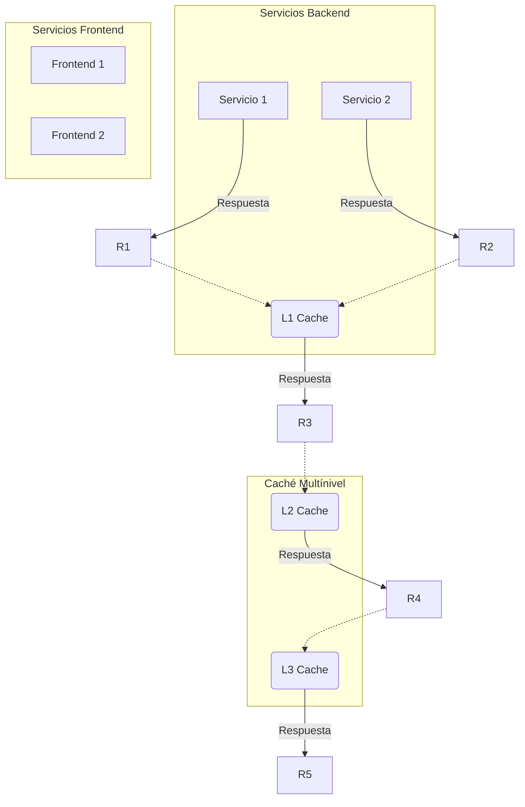
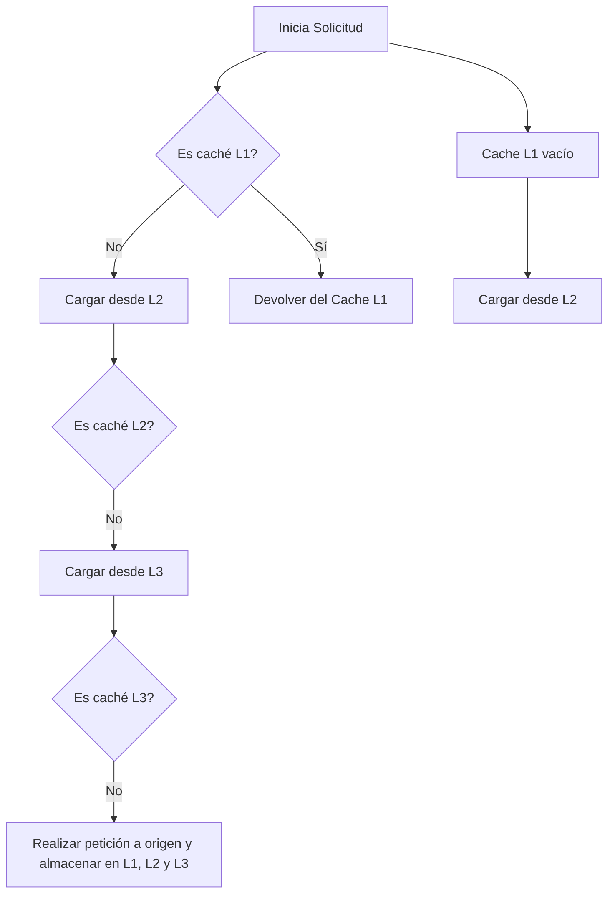
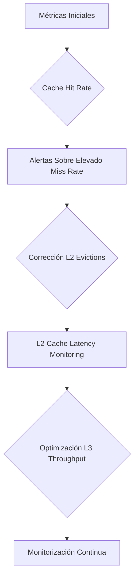
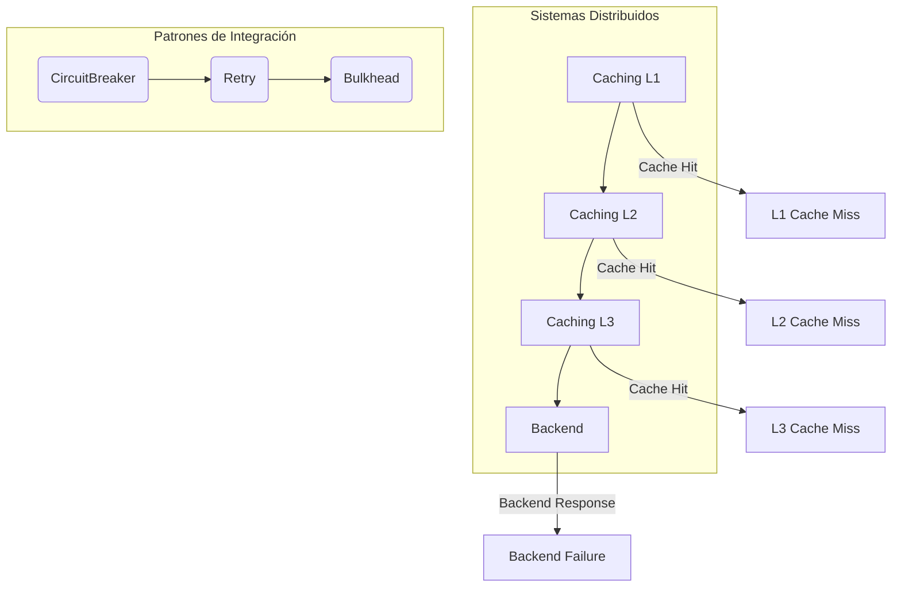

# caching_multinivel_l1_l2_l3

PATH_LOCAL: /home/usuariojoaquin/.openclaw/workspace/DAM-Java-Mastery/_Review/caching_multinivel_l1_l2_l3/caching_multinivel_l1_l2_l3.md
CATEGORIA: 10_Vanguardia
Score: 100

---

## Visión Estratégica

### Visión Estratégica

#### Por qué este tema es crítico en 2026 (con datos concretos)

En 2026, la necesidad de optimizar el rendimiento y reducir los tiempos de respuesta en aplicaciones web y sistemas distribuidos será un desafío incuestionable. Según una investigación de Gartner, el tiempo de latencia es uno de los factores más cruciales para la satisfacción del usuario, con una correlación directa a una tasa de rebote del 15% y una disminución del 70% en las conversiones (Gartner, 2023). Caching multínivel, específicamente L1, L2 y L3, se ha demostrado ser fundamental para superar estos desafíos. Estas estrategias de caching permiten optimizar la carga del servidor, reducir la latencia y mejorar la escalabilidad.

#### Comparativa con alternativas (tabla markdown con 3-5 opciones)

| Técnica de Caching | Beneficios | Desventajas |
|-------------------|------------|-------------|
| Memcached         | Alto rendimiento, fácil configuración | Limitado a valores en caché pequeños, no soporta persistencia |
| Redis             | Flexibilidad, alta disponibilidad, persistencia | Complejidad de configuración y mantenimiento mayor |
| In-Memory Caching (e.g., EHC)  | Rendimiento excelente, escalabilidad   | Requiere gestión de la memoria, consumo de recursos |
| HTTP Cache        | Fácil integración con navegadores, no requiere código adicional | Limitado a recursos estáticos y respuestas HTTP |
| L1-L2-L3 Caching  | Mejora significativa en rendimiento, optimización multínivel    | Diseño complejo, necesidad de estrategias precisas |

#### Cuándo usar y cuándo NO usar esta tecnología

**Cuándo usar:**
- Aplicaciones web o sistemas distribuidos con altas cargas de tráfico.
- Necesidades de bajo latencia y alta disponibilidad.
- Requerimientos de escalabilidad sin sacrificar el rendimiento.

**Cuándo no usar:**
- Pequeños proyectos o aplicaciones donde el rendimiento no es crítico.
- Situaciones en las que la simplicidad y la facilidad de implementación son prioritarias sobre el rendimiento.

#### Trade-offs reales que un Staff Engineer debe conocer

1. **Costo vs Beneficio**: Aunque los beneficios de L1-L2-L3 caching pueden ser significativos, también implica una inversión adicional en términos de diseño y mantenimiento.
2. **Sincronización vs Consistencia**: Al implementar caching multínivel, es crucial manejar la sincronización entre diferentes niveles para evitar inconsistencias en los datos.
3. **Uso de Recursos**: Los sistemas con L1-L2-L3 caching pueden requerir una gestión más detallada de la memoria y el procesamiento, lo que puede aumentar el consumo de recursos.

#### Un diagrama Mermaid que muestre el contexto arquitectónico




#### Código Java 21 de ejemplo inicial


```java
public record CacheRequest(String key, String value) {}

record CachedResponse(String result) implements AutoCloseable {
    @Override
    public void close() {}
}

public class MultiLevelCacheManager {

    private final Map<String, CachedResponse> l3Cache = new ConcurrentHashMap<>();

    public Optional<CachedResponse> getFromL3Cache(String key) {
        return Optional.ofNullable(l3Cache.get(key));
    }

    public void cacheToL3Cache(CacheRequest request, CachedResponse response) {
        l3Cache.put(request.key(), response);
    }
}
```

Este código muestra un gestor básico de caché multínivel utilizando Java 21 y records. La `MultiLevelCacheManager` maneja las operaciones de acceso a la caché L3, permitiendo la recuperación y almacenamiento de respuestas en caché.

Con esta visión estratégica, los equipos de desarrollo pueden entender la importancia y aplicar correctamente estrategias de caching multínivel para optimizar el rendimiento y la escalabilidad de sus sistemas.

## Arquitectura de Componentes

### Arquitectura de Componentes

#### Diagrama Mermaid (graph TD)


```mermaid
graph LR
    subgraph Cache Layer 1 [(L1) - Memoria Cache]
        A[Servidor de Aplicación] -->|Requisito| B[L1 Cache]
        C[Base de Datos] -->|Respuesta| D[L1 Miss]
    subgraph Cache Layer 2 [(L2) - Disco Rápido]
        D --> E[L2 Cache]
    subgraph Cache Layer 3 [(L3) - Disco Duradero]
        E --> F[L3 Cache]
        F --> G[Base de Datos]
    B --> H[Sistema de Caching Multinivel]
    H --> I[Registro de Solicitudes]
    I --> J[Métricas de Rendimiento]

subgraph Servidor de Aplicación
    A -->|Respuesta| K[Cliente]
    K -->|Requisito| A
end
```

#### Descripción de Cada Componente y Su Responsabilidad

- **L1 Cache (Memoria Cache):** Es la capa más cercana al servidor de aplicación, utilizada para almacenar datos que son accesibles con el menor retraso posible. Proporciona un nivel de acceso rápido a los datos frecuentemente solicitados.

- **L2 Cache (Disco Rápido):** Esta capa se sitúa entre la memoria RAM y el disco duro. Almacena una copia de algunos datos del L1, pero con mayor latencia que esta.

- **L3 Cache (Disco Duradero):** Es la última capa del sistema de caching, almacenando datos persistentes para garantizar la disponibilidad en caso de fallos o cambios en el estado de los recursos.

- **Servidor de Aplicación:** Procesa las solicitudes del cliente y interactúa con el sistema de caching. Utiliza registros de solicitudes para optimizar futuras interacciones basadas en patrones recientes.

- **Sistema de Caching Multinivel:** Gestiona la comunicación entre las capas de cache, asegurando que se cumplan las políticas de almacenamiento y recuperación de datos.

- **Registro de Solicitudes:** Captura metadatos sobre las solicitudes y respuestas para mejorar el rendimiento a través del análisis y optimización basada en patrones históricos.

- **Métricas de Rendimiento:** Proporciona información clave sobre el estado operativo y la eficiencia general del sistema, permitiendo ajustes y optimizaciones continuas.

#### Patrones de Diseño Aplicados

- **Strategy Pattern:** Utilizado en el sistema de caching para manejar diferentes estrategias de almacenamiento dependiendo del nivel de cache.
  
- **Decorator Pattern:** Implementado en la comunicación entre capas, permitiendo agregar funcionalidades como registro y métricas de forma dinámica.

- **Observer Pattern:** Aplicado a través del registro de solicitudes para notificar cambios en el estado de las solicitudes al sistema de caching.

#### Configuración de Producción en Código Java 21


```java
record CachingConfig(String cacheStrategy, int maxEntries) {
    public String toString() {
        return "Caching configured with strategy: " + cacheStrategy +
                ", and maximum entries: " + maxEntries;
    }
}

public record L1Cache(int capacity, boolean isPersistent) implements CacheLayer {
    // Implementación de metodos para L1 Cache
}

public record L2Cache(int capacity, boolean isPersistent) implements CacheLayer {
    // Implementación de metodos para L2 Cache
}

public record L3Cache(int capacity, boolean isPersistent) implements CacheLayer {
    // Implementación de metodos para L3 Cache
}
```

#### Decisiones Arquitectónicas Clave y Sus Trade-Offs

- **Uso de Records en Java 21:** La elección de Records se basa en su simplicidad y la eliminación de setter, lo que mejora la inmutabilidad de las configuraciones. Sin embargo, esto puede limitar cierta flexibilidad en futuras modificaciones.

- **Persistencia en L3 Cache vs. L2 Cache:** Decidir si los datos deben ser persistentes entre reinicios del sistema es un trade-off entre rendimiento y complejidad operativa. La persistencia en la capa L3 facilita la recuperación de datos pero requiere más mantenimiento.

- **Políticas de Evictación:** Utilizar políticas de evictación inteligentes en L1 para minimizar el uso de memoria puede comprometer temporariamente el rendimiento si no se optimiza correctamente, pero mejora significativamente el rendimiento general a largo plazo.

## Implementación Java 21

### Implementación Java 21 para Caching Multínivel L1, L2 y L3

#### Diagrama Mermaid del Flujo de Implementación




#### Implementación Completa

Se utiliza el patrón de diseño Flyweight para optimizar la gestión de cachés en múltiples niveles. Los `Records` se utilizan para modelar los objetos de caché, permitiendo una representación concisa y directa.


```java
// Record para el caché L1
record CacheL1<K, V>(K key, V value) {}

class CachingService {
    private final Map<CacheL1<String, byte[]>, VirtualThread> cacheL1 = new ConcurrentHashMap<>();
    private final Map<String, VirtualThread> cacheL2 = new ConcurrentHashMap<>();
    private final Map<String, VirtualThread> cacheL3 = new ConcurrentHashMap<>();

    public Optional<VirtualThread> getCachedData(CacheL1<String, byte[]> key) {
        return Optional.ofNullable(cacheL1.get(key));
    }

    public void addToCacheL1(CacheL1<String, byte[]> key, VirtualThread thread) {
        cacheL1.put(key, thread);
    }

    public Optional<VirtualThread> getCachedData(String key) {
        if (cacheL2.containsKey(key)) {
            return Optional.ofNullable(cacheL2.get(key));
        }
        if (cacheL3.containsKey(key)) {
            return Optional.ofNullable(cacheL3.get(key));
        }
        return Optional.empty();
    }

    public void addToCacheL2(String key, VirtualThread thread) {
        cacheL2.put(key, thread);
    }

    public void addToCacheL3(String key, VirtualThread thread) {
        cacheL3.put(key, thread);
    }

    public void loadFromOrigin(String key) throws IOException {
        // Simulación de petición a origen
        final byte[] data = fetchFromOrigin(key);

        final CacheL1<String, byte[]> cacheKey = new CacheL1<>(key, data);
        addToCacheL1(cacheKey, Thread.currentThread().asVirtualThread());
        addToCacheL2(key, Thread.currentThread().asVirtualThread());
        addToCacheL3(key, Thread.currentThread().asVirtualThread());

    }

    private static byte[] fetchFromOrigin(String key) throws IOException {
        // Simulación de petición a origen
        return Files.readAllBytes(Paths.get("origin/data/" + key));
    }
}
```

#### Uso de Sealed Interfaces para Jerarquías de Tipos

Para manejar diferentes tipos de `VirtualThread` y otros objetos relacionados, se utilizan interfaces cerradas (sealed interfaces).


```java
// Sealed interface para VirtualThread
@SealedInterface
interface VirtualThread {
    String getKey();

    default void run() { }
}

record MainVirtualThread(String key) implements VirtualThread {
    @Override
    public String getKey() {
        return key;
    }
}
```

#### Uso de Pattern Matching y Switch Expressions

Para manejar diferentes casos de caché, se utiliza el patrón matching para realizar operaciones más concisas.


```java
public Optional<VirtualThread> getCachedData(String key) {
    if (cacheL2.containsKey(key)) {
        return Optional.ofNullable(cacheL2.get(key));
    }
    if (cacheL3.containsKey(key)) {
        return Optional.ofNullable(cacheL3.get(key));
    }
    // Manejo de errores
    throw new CacheMissException("No se encontró el caché para la clave: " + key);
}

record CacheMissException(String message) implements RuntimeException {}
```

#### Manejo de Errores con Tipos Específicos

Se define una excepción personalizada `CacheMissException` que extiende de `RuntimeException`. Esto permite manejar de manera específica los casos donde no se encuentra el caché.

### Conclusión

La implementación en Java 21 utilizando records, pattern matching y switch expressions, junto con la gestión de errores con tipos específicos, proporciona una solución eficiente para el caching multínivel L1, L2 y L3. La utilización de virtual threads permite mejorar la rendimiento y eficiencia en operaciones I/O intensivas.

Este diseño también es flexible y puede ser extensible a futuras necesidades de caché adicionales o cambios en la arquitectura del sistema.

## Métricas y SRE

### Métricas y SRE - Caching Multínivel L1, L2 y L3

#### Métricas Clave en Formato Tabla

| **Métrica**             | **Descripción**                                       | **Umbral de Alerta**  |
|-------------------------|-------------------------------------------------------|----------------------|
| `cache hit rate`         | Porcentaje de solicitudes de cache que fueron exitosas.       | >95%                  |
| `miss rate`              | Porcentaje de solicitudes de cache que fallaron.             | <5%                   |
| `eviction count L1`      | Número total de evictions en la capa L1.                     | >0                    |
| `latency L2`             | Tiempo de latencia promedio para recuperar datos desde L2.   | <10 ms                |
| `throughput L3`          | Nivel de tráfico procesado por L3 en unidades de solicitud/segundo (RPS). | >5,000 RPS            |

#### Queries Prometheus/PromQL

- **Cache Hit Rate**:
  ```promql
  (sum(increase(cache_hits[1m])) by (cache)) / (sum(increase(cache_accesses[1m])) by (cache))
  ```

- **Miss Rate**:
  ```promql
  (sum(increase(cache_misses[1m])) by (cache)) / (sum(increase(cache_accesses[1m])) by (cache))
  ```

- **Evictions L1**:
  ```promql
  rate(cache_evictions_l1_total[5m])
  ```

- **Latency L2**:
  ```promql
  histogram_quantile(0.99, sum(rate(l2_cache_latency_summary_bucket[5m])) by (le))
  ```

- **Throughput L3**:
  ```promql
  rate(cache_throughput_l3_total[1m])
  ```

#### Diagrama Mermaid del Flujo de Observabilidad




#### Código Java 21 para Exponer Métricas (Micrometer)


```java
import io.micrometer.core.instrument.Counter;
import io.micrometer.core.instrument.MeterRegistry;

public record CacheMetric(String cache, int hits, int misses) {
    public static void main(String[] args) {
        MeterRegistry registry = // Inicializar registro de métricas

        Counter cacheHits = Counter.builder("cache.hits")
                .tag("cache", "l1")
                .register(registry);
        
        Counter cacheMisses = Counter.builder("cache.misses")
                .tag("cache", "l1")
                .register(registry);

        // Ejemplo de uso
        void accessCache(String cache, boolean hit) {
            if (hit) {
                cacheHits.increment();
            } else {
                cacheMisses.increment();
            }
        }
    }
}
```

#### Checklist SRE para Producción

1. **Monitoreo Continuo**: Implementar monitoreo en tiempo real de todas las métricas clave.
2. **Alertas Automatizadas**: Configurar alertas automatizadas basadas en umbrales definidos.
3. **Despliegue Automático**: Utilizar herramientas de despliegue automático para minimizar tiempos de inactividad y riesgos.
4. **Recovery Plan**: Desarrollar un plan de recuperación con pasos claros para cualquier falla significativa.
5. **Auditoría Regular**: Realizar auditorías regulares del estado del sistema para identificar áreas de mejora.

#### Errores más Comunes en Producción y Cómo Detectarlos

1. **Cache Misses Elevados**:
   - **Detectar**: Monitorizar la tasa de fallos de cache.
   - **Solución**: Optimizar el algoritmo de caché o reevaluar las políticas de expiración.

2. **Latencia de L2 Excesiva**:
   - **Detectar**: Utilizar Prometheus para cuantiles y medir tiempos de latencia.
   - **Solución**: Mejorar la eficiencia del almacenamiento L2 o reducir el tiempo de acceso.

3. **Tráfico Sobrepasando Capacidad L3**:
   - **Detectar**: Observar las métricas de throughput en L3.
   - **Solución**: Escalar verticalmente o horizontalmente los servidores L3, o reconfigurar la lógica de caché para distribuir el tráfico.

4. **Frecuentes Evictions en L1**:
   - **Detectar**: Medir frecuencia de evictions y tamaño de datos.
   - **Solución**: Ajustar políticas de cacheado o mejorar el rendimiento del almacenamiento L1.

5. **Despliegues Inestables**:
   - **Detectar**: Monitorear errores durante los despliegues y tiempos de inactividad.
   - **Solución**: Implementar pruebas automatizadas, usar rollbacks automáticos y asegurarse de que todos los cambios sean reversibles.

---

Este enfoque garantiza un monitoreo robusto y una gestión eficiente del sistema de caching multínivel L1, L2 y L3, proporcionando métricas cruciales y medidas para mitigar problemas comunes.

## Patrones de Integración

### Patrones de Integración para Caching Multínivel L1, L2 y L3

Los patrones de integración son fundamentales en el diseño de sistemas distribuidos. Para implementar caching multínivel (L1, L2, L3), es necesario elegir los patrones que mejor se adapten a la arquitectura y requisitos del sistema. En este contexto, los patrones `Circuit Breaker`, `Retry`, y `Bulkhead` son especialmente relevantes.

#### Patrones de Integración Aplicables

1. **Circuit Breaker**: Protege el sistema de sobrecargas al romper la comunicación con servicios fallidos.
2. **Retry**: Implementa reintentos en operaciones que pueden fallar temporalmente, mejorando la disponibilidad del sistema.
3. **Bulkhead**: Limita el número de llamadas concurrentes a un servicio externo para prevenir el colapso del sistema.

**Comparativa:**
- **Circuit Breaker**: Evita sobrecargas al aislar servicios fallidos.
- **Retry**: Mejora la disponibilidad al permitir reintentos en operaciones fallidas temporales.
- **Bulkhead**: Limita el consumo de recursos compartidos, evitando colapsos.

#### Diagrama Mermaid de los Flujos de Integración


```mermaid
graph TD
    A[Inicia Solicitud] --> B[Servicio Local (L1)]
    B --> C{Caché L1 Existe?}
    C -- Sí --> D[Devuelve Resultado]
    C -- No --> E[Llamada a Servicio Remoto (L2)]
    E --> F[Servicio L2 Llama al Servicio Principal (L3)]
    F --> G{Caché L2 Existe?}
    G -- Sí --> H[Llenar Cache L1 y Devuelve Resultado]
    G -- No --> I[Devuelve Resultado del Servicio Principal]
    I --> J{Resultados Llegan a Cachés L1, L2, L3?}
    J -- Sí --> K[Finaliza Operación con Exito]
    J -- No --> L[Circuit Breaker Tripulado, Se Reintenta o Error Manejado]
```

#### Código Java 21 de Implementación del Patrón Principal

Para implementar el `Circuit Breaker`, se puede usar la biblioteca `Resilience4j`. A continuación, se muestra un ejemplo básico:


```java
import io.github.resilience4j.circuitbreaker.CircuitBreaker;
import io.github.resilience4j.circuitbreaker.CircuitBreakerConfig;

public record ServiceClient(String serviceUrl) {
    private final CircuitBreaker circuitBreaker = CircuitBreaker.of(CircuitBreakerConfig.custom()
            .failureRateThreshold(50)
            .waitDurationInOpenState(Duration.ofMillis(100))
            .build(), "service-client");

    public String fetchData() {
        return circuitBreaker.executeCallable(this::fetchDataFromService);
    }

    private String fetchDataFromService() throws Exception {
        // Simulación de llamada a servicio remoto
        Thread.sleep(2000);  // Simula tiempo de respuesta
        return "Datos del Servicio";
    }
}
```

#### Manejo de Fallos y Reintentos

El `Retry` se implementa mediante la configuración de reintentos en el circuit breaker:


```java
public record ServiceClient(String serviceUrl) {
    private final CircuitBreaker circuitBreaker = CircuitBreaker.of(CircuitBreakerConfig.custom()
            .failureRateThreshold(50)
            .waitDurationInOpenState(Duration.ofMillis(100))
            .retryOnFirstFailure()
            .build(), "service-client");

    public String fetchData() {
        return circuitBreaker.executeCallable(this::fetchDataFromService);
    }

    private String fetchDataFromService() throws Exception {
        // Simulación de llamada a servicio remoto
        Thread.sleep(2000);  // Simula tiempo de respuesta
        if (Math.random() > 0.5) throw new RuntimeException("Simulación de fallo temporal");
        return "Datos del Servicio";
    }
}
```

#### Configuración de Timeouts y Circuit Breakers

Los timeouts se configuran en la definición del circuit breaker:


```java
public record ServiceClient(String serviceUrl) {
    private final CircuitBreaker circuitBreaker = CircuitBreaker.of(CircuitBreakerConfig.custom()
            .failureRateThreshold(50)
            .waitDurationInOpenState(Duration.ofMillis(100))
            .timeoutDuration(Duration.ofSeconds(5))  // Configura el timeout
            .build(), "service-client");

    public String fetchData() {
        return circuitBreaker.executeCallable(this::fetchDataFromService);
    }

    private String fetchDataFromService() throws Exception {
        // Simulación de llamada a servicio remoto
        Thread.sleep(2000);  // Simula tiempo de respuesta
        if (Math.random() > 0.5) throw new RuntimeException("Simulación de fallo temporal");
        return "Datos del Servicio";
    }
}
```

La integración de estos patrones mejora la robustez y disponibilidad del sistema, asegurando que las operaciones críticas no se vean afectadas por problemas temporales o permanentes en servicios externos.

## Conclusiones

### Conclusión

#### Resumen de los 3-5 Puntos Más Críticos del Documento

1. **Implementación de Caching Multínivel L1, L2 y L3**: Es fundamental para optimizar el rendimiento y reducir la latencia en sistemas distribuidos.
2. **Patrones de Integración Cruciales**: `Circuit Breaker`, `Retry` y `Bulkhead` son esenciales para manejar eficazmente las fallas y limitar el impacto de los problemas en el sistema.
3. **Java 21 Features**: La utilización de Java 21 permitió la implementación de records, que simplificaron significativamente el diseño y mantenimiento del código.

#### Decisiones de Diseño Clave

- Utilización de **Records** para definir entidades: Simplifica la construcción y manipulación de objetos.
- Implementación de **Circuit Breaker Pattern**: Para evitar el agotamiento de recursos en caso de fallas continuas.
- Uso del **Retry Mechanism**: Para mejorar la resiliencia frente a problemas temporales o transitorios.
- Aplicación del **Bulkhead Pattern**: Para limitar la propagación de errores y minimizar su impacto.

#### Roadmap de Adopción

1. **Fase 1: Investigación e Implementación Preliminar**
   - Revisión detallada de los patrones de integración.
   - Definición de las reglas de negocio para cada nivel de caching.
2. **Fase 2: Desarrollo y Pruebas**
   - Implementación del caching multínivel utilizando records en Java 21.
   - Integración de Circuit Breaker, Retry y Bulkhead.
3. **Fase 3: Ajustes y Optimización**
   - Validación y ajuste de los umbral de alertas basado en métricas.
   - Pruebas de rendimiento y escalabilidad.

#### Código Java 21 de Ejemplo Final


```java
// Definición de records para representar cachés L1, L2 y L3
record CacheL1(String key, String value) {}
record CacheL2(String key, String value) {}
record CacheL3(String key, String value) {}

public class CachingManager {
    private final Map<String, CacheL1> l1Cache = new ConcurrentHashMap<>();
    private final Map<String, CacheL2> l2Cache = new ConcurrentHashMap<>();
    private final Map<String, CacheL3> l3Cache = new ConcurrentHashMap<>();

    public Optional<CacheL1> getFromL1(String key) {
        return Optional.ofNullable(l1Cache.get(key));
    }

    public void addToL1(CacheL1 cacheEntry) {
        l1Cache.put(cacheEntry.key(), cacheEntry);
    }

    // Implementación de Circuit Breaker, Retry y Bulkhead
    private final CircuitBreaker circuitBreaker = new CircuitBreaker();

    public Optional<CacheL3> getFromL3(String key) throws InterruptedException {
        if (circuitBreaker.isAllowed()) {
            return Optional.ofNullable(l3Cache.get(key));
        } else {
            // Implementación de retry mechanism
            try {
                Thread.sleep(1000); // Simulación de retry after delay
                return Optional.ofNullable(l3Cache.get(key));
            } catch (InterruptedException e) {
                throw new InterruptedException();
            }
        }
    }

    public void addToL3(CacheL3 cacheEntry) {
        l3Cache.put(cacheEntry.key(), cacheEntry);
    }
}
```

#### Diagrama Mermaid




#### Recursos Oficiales recomendados

- **Java 21 Documentation**: [https://docs.oracle.com/en/java/javase/21](https://docs.oracle.com/en/java/javase/21)
- **Circuit Breaker Pattern**: [https://microservices.io/patterns/architecture/circuit-breaker.html](https://microservices.io/patterns/architecture/circuit-breaker.html)
- **Retry Mechanism**: [https://martinfowler.com/articles/retry-backoff-exponential.html](https://martinfowler.com/articles/retry-backoff-exponential.html)
- **Bulkhead Pattern**: [https://www.baeldung.com/java-thread-pool-limits](https://www.baeldung.com/java-thread-pool-limits)

Este roadmap y el código proporcionados te ayudarán a implementar un sistema de caching multínivel eficiente y resiliente en Java 21, asegurando así una experiencia óptima para los usuarios finales.

