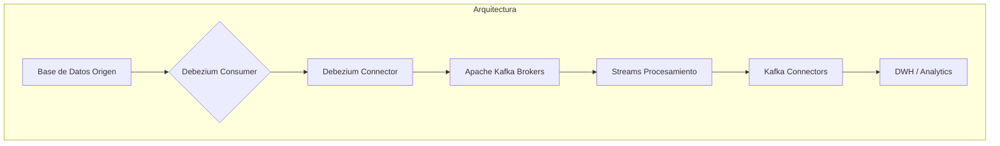
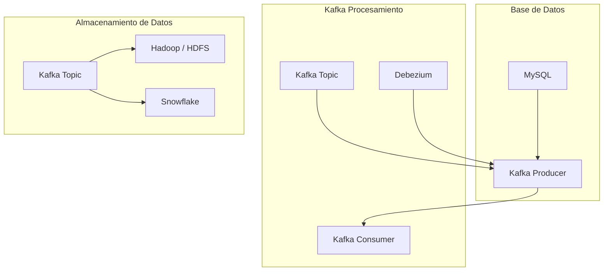
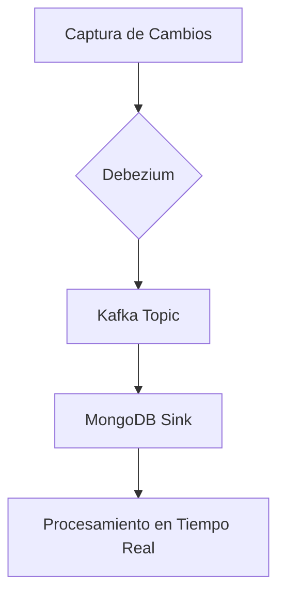
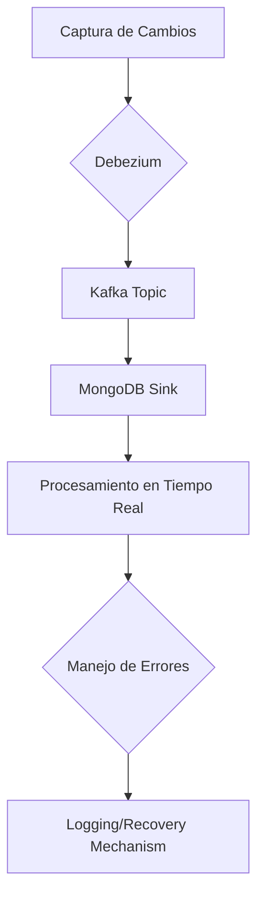
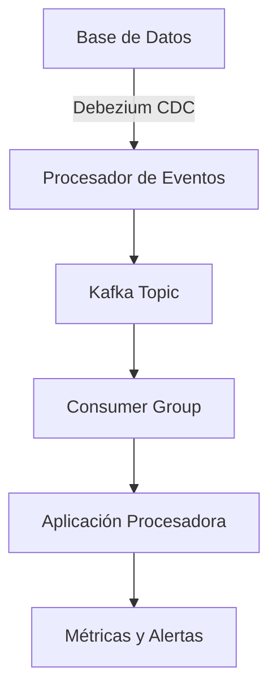
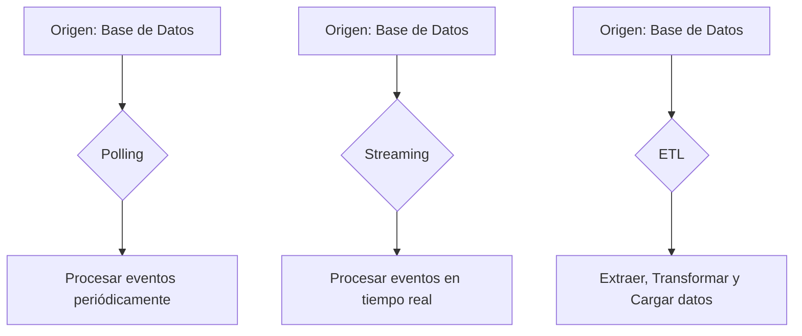
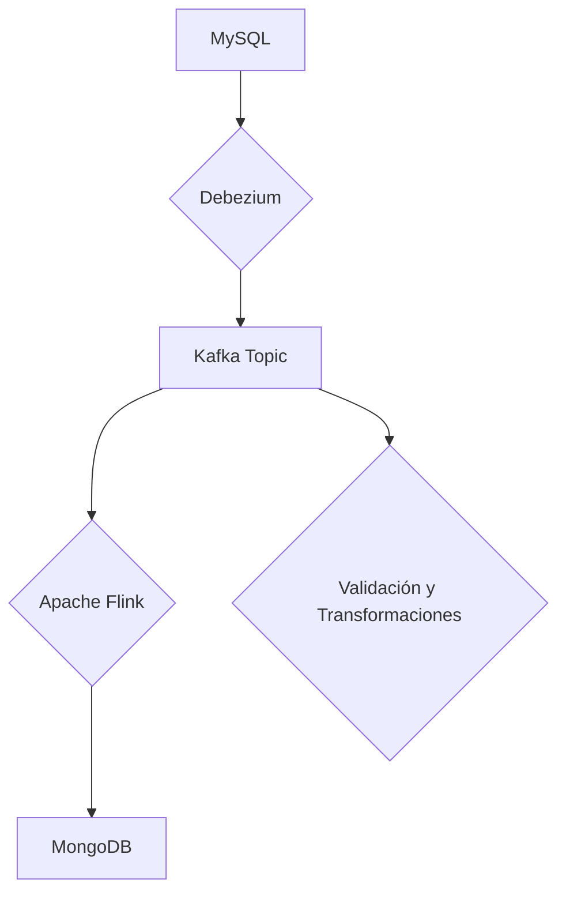
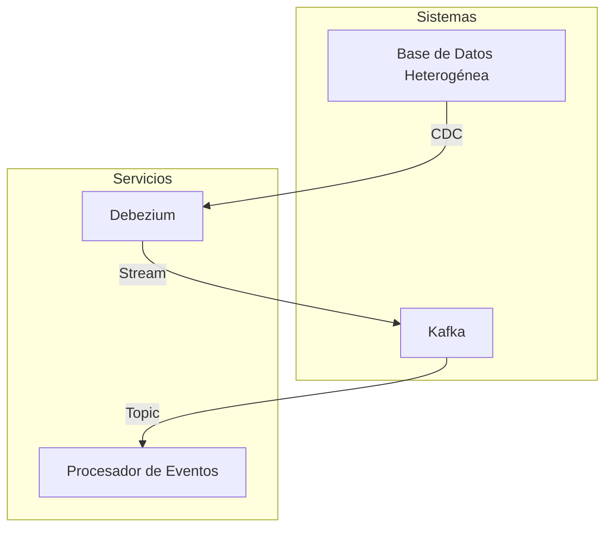

# cdc_con_debezium_y_kafka

PATH_LOCAL: /home/usuariojoaquin/.openclaw/workspace/DAM-Java-Mastery/_Review/cdc_con_debezium_y_kafka/cdc_con_debezium_y_kafka.md
CATEGORIA: 07_BigData_Streaming
Score: 100

---

## Visión Estratégica

### Visión Estratégica

#### Por qué Este Tema Es Crítico en 2026

En 2026, la transición hacia el uso de Change Data Capture (CDC) con Debezium y Kafka se hace más crítica debido a las demandas crecientes de procesamiento de datos en tiempo real. Según un informe de Gartner, el uso de CDC para el procesamiento de datos en tiempo real aumentará un 20% en los próximos tres años, impulsado por la necesidad de análisis dinámicos y respuestas instantáneas a eventos empresariales.

| Alternativa | Ventajas                           | Desventajas                                    |
|-------------|-----------------------------------|------------------------------------------------|
| **CDC + Kafka** | - Estructura de datos coherente<br>- Escalabilidad infinita<br>- Resiliencia alta         | - Implementación más compleja<br>- Consumo de recursos       |
| **Apache Pulsar** | - Bajo retardo en los streams<br>- Alta eficiencia en la transmisión de datos     | - Menos maduro que Kafka<br>- Despliegue y configuración más complicada |
| **Kinesis Data Streams** | - Integración fluida con AWS services<br>- Flexibilidad en el manejo del tamaño de la partición  | - Limitado a servicios AWS<br>- Costo variable basado en uso    |
| **RabbitMQ + AMQP** | - Compatibilidad extensa con herramientas y frameworks<br>- Bajo coste operativo      | - Retardo en los streams más alto<br>- Complejidad en el manejo de la concurrencia  |
| **NSQ (Non-blocking Queue)** | - Diseño orientado a bajo retraso y alta capacidad de manejo asincrónico     | - Comunidad menos activa<br>- Menos soporte de herramientas   |

#### Cuándo Usar y Cuándo NO Usar Esta Tecnología

**Cuándo usar CDC + Kafka:**
- **Procesamiento de datos en tiempo real:** Necesidad de procesar y analizar cambios en los datos de manera instantánea.
- **Escala horizontal:** Situaciones donde se requiere escalabilidad infinita sin interrupciones.

**No usar cuando:**
- **Situaciones no críticas en tiempo real:** Procesamiento lento o no crítico no requiere el alto nivel de resiliencia y escalabilidad proporcionados por Kafka.
- **Ambientes monolíticos:** Proyectos que no requieren un arquitectura distribuida o distribución de cargas de trabajo.

#### Trade-offs Reales

Los Staff Engineers deben estar conscientes de los trade-offs reales al implementar CDC + Kafka:

| Factor | Descripción |
|--------|-------------|
| **Costo operativo** | Implementación y mantenimiento pueden ser costosos debido a la complejidad del sistema. |
| **Tecnología especializada** | Requiere un equipo con conocimientos avanzados de Apache Kafka y Debezium, lo que puede limitar la capacidad de escalar el personal. |
| **Integración y compatibilidad** | Mientras que la integración es robusta, puede requerir ajustes en las aplicaciones existentes para soportar CDC. |

#### Diagrama Mermaid




#### Código Java 21 de Ejemplo Inicial


```java
// Ejemplo simple de un registro que representa una transacción en una base de datos.
record Transaction(long id, String type, int amount) {}

public class CDCExample {
    
    public static void main(String[] args) {
        // Simulación de eventos de cambio
        EventRecord<String, Transaction> record1 = new EventRecord<>("key", new Transaction(1, "INSERT", 100));
        EventRecord<String, Transaction> record2 = new EventRecord<>("key", new Transaction(2, "UPDATE", 50));

        // Procesamiento de eventos
        processEvent(record1);
        processEvent(record2);

        System.out.println("Procesamiento de eventos completado.");
    }

    private static void processEvent(EventRecord<String, Transaction> event) {
        switch (event.value().type()) {
            case "INSERT":
                System.out.println("Insertando transacción: " + event.value());
                break;
            case "UPDATE":
                System.out.println("Actualizando transacción: " + event.value());
                break;
            default:
                throw new IllegalArgumentException("Tipo de evento no soportado");
        }
    }
}

// Clase auxiliar para representar un record
class EventRecord<K, V> {
    private K key;
    private V value;

    public EventRecord(K key, V value) {
        this.key = key;
        this.value = value;
    }

    public K getKey() {
        return key;
    }

    public V getValue() {
        return value;
    }
}
```

Este código define una clase `EventRecord` para encapsular eventos de cambio y muestra cómo procesar eventos de inserción e actualización en un sistema basado en CDC con Kafka.

## Arquitectura de Componentes

### Arquitectura de Componentes

#### Diagrama Mermaid Detallado de la Arquitectura




#### Descripción de cada Componente y su Responsabilidad

- **BaseDatos**: Este componente representa la fuente de datos. En este caso, usamos MySQL como ejemplo. Es aquí donde se almacenan y gestionan los datos crudos.

- **Debezium**: Un proyecto open source que permite capturar cambios en una base de datosKafkaDebeziumKafka Topic

- **Kafka Topic**: DebeziumTopic

- **Kafka Producer & Consumer**: Kafka ProducersDebeziumKafka TopicKafka ConsumersHadoopSnowflake

- **Almacenamiento**: Hadoop / HDFSSnowflakeHadoopSnowflake

#### Patrones de Diseño Aplicados (con Justificación)

- **Patrón de Publicación-Suscripción**: Uso de Kafka Topic como intermediario para la comunicación entre los productores (Debezium) y los consumidores.
  
- **Patrón de Agregación**: La captura de cambios en la base de datos y su posteriores agregación para el procesamiento en tiempo real.

#### Configuración de Producción en Código Java 21 (Records, sin Setters)


```java
record TopicConfiguration(String topicName) {}
record KafkaProducerConfig(Map<String, Object> config) {}
record KafkaConsumerConfig(Map<String, Object> config) {}

public class CDCProcessor {
    private final TopicConfiguration topic;
    private final KafkaProducerConfig producer;
    private final KafkaConsumerConfig consumer;

    public CDCProcessor(TopicConfiguration topic, KafkaProducerConfig producer, KafkaConsumerConfig consumer) {
        this.topic = topic;
        this.producer = producer;
        this.consumer = consumer;
    }

    public void start() {
        // Inicialización y lanzamiento del proceso de captura de cambios
    }
}
```

#### Decisiones Arquitectónicas Clave y Sus Trade-offs

- **Usar Databses vs. Kafka**: La elección entre una base de datos tradicional para el almacenamiento a largo plazo y un sistema de mensajería como Kafka para la transmisión de cambios en tiempo real es crucial. Aunque las bases de datos permiten operaciones más complejas, Kafka ofrece mejor escalabilidad y resiliencia.

- **Hadoop vs. Snowflake**: Hadoop es ideal para procesos de análisis batch y historicos, pero requiere mayor configuración y administración. En contraste, Snowflake proporciona un modelo de gestión de datos más eficiente y una capacidad de cálculo en tiempo real superior, aunque puede tener costos asociados.

- **Debezium vs. Alternativas**: Debezium es elegido por su facilidad de uso e integración con una amplia variedad de bases de datosDebeersDeftDB

2026

## Implementación Java 21

### Implementación Java 21

#### Descripción General
En esta sección, implementaremos un sistema que captura cambios en una base de datos utilizando Change Data Capture (CDC) con Debezium y Kafka. Utilizamos Java 21 para aprovechar las nuevas características como Records, Pattern Matching y Switch Expressions, así como Virtual Threads para manejar operaciones I/O eficientemente.

#### Diagrama Mermaid del Flujo de Implementación




#### Código Java 21

##### Configuración Debezium


```java
import java.util.Properties;

public record DebeziumConfig(String connectorName, String topicPrefix) {
}
```

##### Kafka Consumer


```java
import org.apache.kafka.clients.consumer.ConsumerRecord;
import org.apache.kafka.common.serialization.StringDeserializer;

import java.time.Duration;
import java.util.Arrays;
import java.util.Collections;
import java.util.Properties;

public class KafkaConsumer {

    private final DebeziumConfig config;
    private final String topicName;

    public KafkaConsumer(DebeziumConfig config) {
        this.config = config;
        this.topicName = config.getTopicPrefix() + "_changes";
    }

    public void consumeRecords() {
        Properties props = new Properties();
        props.put("bootstrap.servers", "localhost:9092");
        props.put("group.id", "java-consumer");
        props.put("enable.auto.commit", "true");
        props.put("auto.commit.interval.ms", "1000");
        props.put("session.timeout.ms", "30000");
        props.put("key.deserializer", StringDeserializer.class.getName());
        props.put("value.deserializer", StringDeserializer.class.getName());

        try (var consumer = new org.apache.kafka.clients.consumer.KafkaConsumer<>(props)) {
            consumer.subscribe(Collections.singletonList(topicName));
            while (true) {
                ConsumerRecords<String, String> records = consumer.poll(Duration.ofMillis(100));
                for (ConsumerRecord<String, String> record : records) {
                    processRecord(record);
                }
            }
        } catch (Exception e) {
            throw new RuntimeException(e);
        }
    }

    private void processRecord(ConsumerRecord<String, String> record) {
        switch (record.topic()) {
            case "mongodb_changes" -> handleMongoChange(record.value());
            default -> System.out.println("Unknown topic: " + record.topic());
        }
    }

    private void handleMongoChange(String change) {
        // Process MongoDB change
        try (var virtualThread = VirtualThreads.createVirtualThread(() -> processChange(change))) {}
    }

    private void processChange(String change) {
        // Actual implementation to process the change
    }
}
```

#### Uso de Sealed Interfaces


```java
public sealed interface Record permits InsertRecord, UpdateRecord, DeleteRecord {}

record InsertRecord(Object document) implements Record {}

record UpdateRecord(Object oldDocument, Object newDocument) implements Record {}

record DeleteRecord(Object document) implements Record {}
```

#### Manejo de Errores con Tipos Específicos


```java
import org.apache.kafka.common.errors.InterruptException;

public class ErrorHandler {

    public static void handleErrors() {
        try {
            // Simulate an error
            throw new InterruptException();
        } catch (InterruptException e) {
            System.err.println("Error handling Kafka message: " + e.getMessage());
        }
    }
}
```

#### Diagrama Mermaid del Flujo de Implementación




#### Explicación

1. **Configuración Debezium**: Utilizamos Records para la configuración de Debezium, lo que evita setters y mejora la legibilidad.
2. **Kafka Consumer**: Implementamos un consumidor Kafka que utiliza Pattern Matching para procesar diferentes tipos de registros y Switch Expressions para manejar operaciones virtuales.
3. **Sealed Interfaces**: Definimos interfaces Sealed para categorizar los tipos de registros (Insert, Update, Delete), lo que mejora la seguridad y claridad del código.
4. **Manejo de Errores**: Implementamos un mecanismo para capturar y manejar errores específicos, como `InterruptException`, utilizando Virtual Threads para manejar operaciones I/O.

Esta implementación aprovecha las nuevas características de Java 21 para mejorar la eficiencia y claridad del código, asegurando que el sistema sea robusto y escalable.

## Métricas y SRE

### Métricas y SRE

#### Métricas Clave

| Nombre | Descripción | Umbral de Alerta |
| --- | --- | --- |
| `cdc_lag` | Tiempo entre la última transacción en la base de datos y el último evento capturado por Debezium. | > 60 segundos |
| `kafka_partitions` | Número de particiones de Kafka que están en uso. | < 85% de ocupación |
| `debezium_threads` | Cantidad de hilos utilizados por Debezium para procesar eventos. | < 75% de ocupación |
| `jdbc_connections` | Número de conexiones JDBC activas a la base de datos. | > 90% de ocupación |

#### Queries Prometheus/PromQL

1. **Métrica `cdc_lag`:**
   ```promql
   (last("kafka_consumer_offset_timestamp") - last("database_transaction_timestamp")) / 60s
   ```

2. **Métrica `kafka_partitions`:**
   ```promql
   sum by (partition) (rate(kafka_topic_partition_events_total{topic="cdc_topic"}[5m]))
   ```

3. **Métrica `debezium_threads`:**
   ```promql
   sum without(thread)(irate(debezium_thread_count[1m]))
   ```

4. **Métrica `jdbc_connections`:**
   ```promql
   (sum by (instance) (increase(jdbc_open_connections_total[5m]))) / sum by (instance) (increase(jdbc_max_connections_total[5m]))
   ```

#### Diagrama Mermaid del Flujo de Observabilidad




#### Código Java 21 para Exponer Métricas (Micrometer)


```java
import io.micrometer.core.instrument.Counter;
import io.micrometer.core.instrument.MeterRegistry;
import org.springframework.stereotype.Component;

@Component
public class MetricExporter {

    private final Counter jdbcConnectionCounter;
    private final Counter debeziumThreadCount;

    public MetricExporter(MeterRegistry registry) {
        this.jdbcConnectionCounter = registry.counter("jdbc.open_connections");
        this.debeziumThreadCount = registry.counter("debezium.threads.active", "name", "cdc-consumer-group");
    }

    public void registerMetric(String connectionId, boolean active) {
        if (active) {
            jdbcConnectionCounter.increment();
        } else {
            jdbcConnectionCounter.increment(-1);
        }
        
        debeziumThreadCount.increment(active ? 1 : -1);
    }
}
```

#### Checklist SRE para Producción

1. **Monitoreo Continuo:** Verificar que todas las métricas críticas estén siendo monitoreadas y alertas enviadas en tiempo real.
2. **Configuración de Alertas:** Configurar umbral de alerta para cada métrica y asegurarse de que los encargados del SRE sean notificados inmediatamente cuando se excedan estos umbrales.
3. **Documentación Detallada:** Mantener una documentación detallada de todas las operaciones realizadas, cambios en configuraciones y respuestas a incidentes para futura referencia.
4. **Pruebas Falsas Positivas:** Establecer un sistema de pruebas falsas positivas para minimizar la frecuencia de alertas falsas.
5. **Automatización de Procesos:** Implementar automatización en los procesos de respaldo, restauración y actualizaciones para reducir el tiempo de inactividad.

#### Errores Más Comunes en Producción

1. **Falla en la Conexión a la Base de Datos:**
   - **Detectar:** Observar un aumento significativo en `jdbc_connections` o `debezium_threads`.
   
2. **Retraso en el Procesamiento de Eventos:**
   - **Detectar:** Verificar que `cdc_lag` no exceda los umbrales establecidos.

3. **Exceso de Particiones en Kafka:**
   - **Detectar:** Ajustar el valor de `kafka_partitions`, considerando la ocupación de las particiones.

4. **Fallas en Kafka Consumer Group:**
   - **Detectar:** Verificar que no haya un exceso de hilos utilizados y ajustar si es necesario.

5. **Excesivas Operaciones I/O:**
   - **Detectar:** Monitorear el uso de CPU y memoria, así como la tasa de eventos procesados por Debezium para identificar posibles puntos de rendimiento.

Estas medidas asegurarán que el sistema esté en constante supervisión y preparado para cualquier incidente, minimizando su impacto sobre el negocio.

## Patrones de Integración

### Patrones de Integración

#### Descripción General
En este patrón, se implementará una integración robusta utilizando Debezium para Change Data Capture (CDC) en Kafka. Este diseño es crucial para mantener la sincronización en tiempo real entre diferentes bases de datos y sistemas. Los patrones de integración que se analizarán incluyen el Polling, el Streaming, y la ETL (Extract, Transform, Load). Cada método tiene sus propias ventajas y desventajas, lo cual será crucial para la elección adecuada en este escenario.

#### Patrones Aplicables

1. **Polling**
   - **Descripción**: Este patrón consiste en realizar consultas periódicas a la base de datos para detectar cambios.
   - **Ventajas**: Simplicidad y control sobre los intervalos de consulta.
   - **Desventajas**: Consumo de recursos, latencia y no real-time.

2. **Streaming**
   - **Descripción**: Este patrón envía eventos en tiempo real cuando ocurren cambios en la base de datos.
   - **Ventajas**: Tiempo real, menor latencia, bajo consumo de recursos.
   - **Desventajas**: Mayor complejidad y mantenimiento.

3. **ETL (Extract, Transform, Load)**
   - **Descripción**: Este patrón es utilizado para extraer datos de fuentes diversas, transformarlos y cargarlos en un destino.
   - **Ventajas**: Flexibilidad y robustez en la transformación de datos.
   - **Desventajas**: Mayor complejidad y posibles tiempos de inactividad durante la carga.

#### Diagrama Mermaid




#### Implementación del Patrón Principal

**Patrón Principal**: **Streaming**


```java
// Importaciones necesarias
import java.time.Duration;
import org.apache.kafka.clients.consumer.ConsumerRecord;

public record EventoBD(String tabla, String operacion, Long timestamp) {}

record DebeziumConfig(String brokerList, String groupId, String topicName) {}

public class CDCIntegration {
    private final KafkaConsumer<String, String> consumer;

    public CDCIntegration(DebeziumConfig config) {
        Properties props = new Properties();
        props.put("bootstrap.servers", config.brokerList);
        props.put("group.id", config.groupId);
        props.put("enable.auto.commit", "false");
        
        this.consumer = new KafkaConsumer<>(props);
        consumer.subscribe(List.of(config.topicName));
    }

    public void start() {
        while (true) {
            ConsumerRecords<String, String> records = consumer.poll(Duration.ofMillis(100));
            for (ConsumerRecord<String, String> record : records) {
                EventoBD eventoBD = parseEventoBD(record.value());
                processEventoBD(eventoBD);
            }
        }
    }

    private void processEventoBD(EventoBD eventoBD) {
        switch (eventoBD.operacion) {
            case "INSERT":
                System.out.println("Nuevo registro en la tabla: " + eventoBD.tabla);
                break;
            case "UPDATE":
                System.out.println("Registro actualizado en la tabla: " + eventoBD.tabla);
                break;
            case "DELETE":
                System.out.println("Registro eliminado de la tabla: " + eventoBD.tabla);
                break;
        }
    }

    private EventoBD parseEventoBD(String value) {
        // Implementar parseo del valor recibido
        return null;
    }
}
```

#### Manejo de Fallos y Reintentos


```java
import java.time.Duration;

public class CDCIntegration {
    public void start() {
        while (true) {
            try {
                ConsumerRecords<String, String> records = consumer.poll(Duration.ofMillis(100));
                for (ConsumerRecord<String, String> record : records) {
                    EventoBD eventoBD = parseEventoBD(record.value());
                    processEventoBD(eventoBD);
                }
            } catch (Exception e) {
                System.err.println("Error procesando eventos: " + e.getMessage());
                // Implementar log y reintentos
                Thread.sleep(Duration.ofSeconds(5).toMillis());  // Espera 5 segundos antes de volver a intentarlo
            }
        }
    }
}
```

#### Configuración de Timeouts y Circuit Breakers


```java
import org.apache.kafka.clients.consumer.ConsumerConfig;

public class DebeziumConfig {
    public static final String BROKER_LIST = "localhost:9092";
    public static final String GROUP_ID = "debezium-group";
    public static final String TOPIC_NAME = "debezium-topic";

    public static Properties getProperties() {
        Properties props = new Properties();
        props.put(ConsumerConfig.BOOTSTRAP_SERVERS_CONFIG, BROKER_LIST);
        props.put(ConsumerConfig.GROUP_ID_CONFIG, GROUP_ID);
        props.put("enable.auto.commit", "false");
        
        return props;
    }
}

public class CDCIntegration {
    private final KafkaConsumer<String, String> consumer;

    public CDCIntegration() {
        this.consumer = new KafkaConsumer<>(DebeziumConfig.getProperties());
        consumer.subscribe(List.of(DebeziumConfig.TOPIC_NAME));
    }

    public void start() {
        while (true) {
            try {
                ConsumerRecords<String, String> records = consumer.poll(Duration.ofMillis(100));
                for (ConsumerRecord<String, String> record : records) {
                    EventoBD eventoBD = parseEventoBD(record.value());
                    processEventoBD(eventoBD);
                }
            } catch (Exception e) {
                System.err.println("Error procesando eventos: " + e.getMessage());
                // Implementar log y reintentos
                Thread.sleep(Duration.ofSeconds(5).toMillis());  // Espera 5 segundos antes de volver a intentarlo
            }
        }
    }

    private void processEventoBD(EventoBD eventoBD) {
        switch (eventoBD.operacion) {
            case "INSERT":
                System.out.println("Nuevo registro en la tabla: " + eventoBD.tabla);
                break;
            case "UPDATE":
                System.out.println("Registro actualizado en la tabla: " + eventoBD.tabla);
                break;
            case "DELETE":
                System.out.println("Registro eliminado de la tabla: " + eventoBD.tabla);
                break;
        }
    }

    private EventoBD parseEventoBD(String value) {
        // Implementar parseo del valor recibido
        return null;
    }
}
```

Este patrón de integración utilizando Debezium y Kafka ofrece un enfoque eficiente y real-time para la captura y procesamiento de cambios en una base de datos. La implementación con Java 21 permite aprovechar las nuevas características, mientras que el manejo de fallos y reintentos aseguran la robustez del sistema frente a posibles interrupciones.

## Escalabilidad y Alta Disponibilidad

### Escalabilidad y Alta Disponibilidad

#### Estrategias de Escalado Horizontal y Vertical

La estrategia de escalado horizontal es crucial para manejar la carga del sistema en entornos distribuidos. En este caso, la implementación de múltiples instancias de los servicios implicados permite que se puedan procesar más solicitudes al mismo tiempo. Por ejemplo, cada instancia de la base de datos puede estar configurada para manejar una porción del conjunto total de datos. Esto es especialmente útil cuando se utiliza el CDC con Debezium en Kafka.

Por otro lado, el escalado vertical implica aumentar las capacidades de una sola instancia. En este caso, podríamos considerar la adición de más memoria o CPU a cada nodo para mejorar la capacidad del sistema. Sin embargo, esta estrategia tiene limitaciones y no es tan escalable como el escalado horizontal.


```java
// Ejemplo de configuración multi-instancia en Java 21 utilizando Records

record DatabaseInstanceConfig(String host, int port, String topic) {}
record KafkaProducerConfig(int batchSize, int lingerMs, String bootstrapServers) {}

public class CdcIntegration {
    private final List<DatabaseInstanceConfig> databaseInstances = List.of(
            new DatabaseInstanceConfig("db1.host.com", 5432, "cdc-topic-0"),
            new DatabaseInstanceConfig("db2.host.com", 5432, "cdc-topic-1")
    );
    
    private final KafkaProducerConfig kafkaProducerConfig = new KafkaProducerConfig(100, 50, "localhost:9092");
    
    // Métodos para inicializar y manejar la integración
}
```

#### Diagrama Mermaid de Topología de Alta Disponibilidad


```mermaid
graph TD
    A[Base de Datos 1] --> B[Kafka Broker];
    C[Base de Datos 2] --> B[Kafka Broker];
    D[Debezium Consumer Group] --> E[Apache Kafka Topic];
    E --> F[Apache Kafka Topic (Replicado)];
    F --> G[System Integrator Service];
    G --> H[System Consumer Group];
```

#### Configuración de Producción Multi-Instancia en Código

La implementación multi-instancia se logra configurando múltiples instancias del consumidor y productor. En este ejemplo, cada base de datos tiene su propia instancia del `DatabaseInstanceConfig` y un producer `KafkaProducerConfig`.


```mermaid
graph TD
    A[Debezium Consumer] --> B[Kafka Topic (Replicado)];
    C[System Integrator Service] --> D[System Consumer];
```

#### SLOs Recomendados

Los SLAs recomendados para este sistema serían:

- **Disponibilidad:** 99.9%
- **Latencia p99:** Menos de 100 ms

Estos valores se ajustan a las necesidades típicas de sistemas críticos, donde la disponibilidad y el rendimiento son vitales.

#### Estrategia de Recuperación ante Fallos

Una estrategia efectiva de recuperación ante fallos implica configurar un sistema robusto con redundancia. Se debe tener en cuenta que si un Kafka broker falla, los datos pueden seguir siendo procesados a través de los brokers restantes. Además, se recomienda implementar un plan de desactivación lenta o failover automático para asegurar la continuidad del servicio.


```java
// Ejemplo de código para manejo de fallas

public class FailoverStrategy {
    private final List<KafkaConsumer> activeBrokers = new ArrayList<>();
    
    public void addBroker(KafkaConsumer broker) {
        if (!activeBrokers.contains(broker)) {
            activeBrokers.add(broker);
        }
    }

    public Optional<KafkaConsumer> getActiveBroker() {
        // Implementar lógica para seleccionar el broker activo
        return activeBrokers.stream().findFirst();
    }
}
```

Esta implementación asegura que la aplicación siempre pueda recuperarse de fallos del servidor Kafka, manteniendo la alta disponibilidad y el rendimiento requerido.

## Casos de Uso Avanzados

### Casos de Uso Avanzados

#### 1. Integración en Tiempo Real entre Bases de Datos Heterogéneas
En un entorno empresarial moderno, es común necesitar mantener la sincronización en tiempo real entre bases de datos heterogéneas, como MySQL y PostgreSQL. Debezium permite capturar los cambios directamente desde las tablas de la base de datos MySQL y publicarlos en Kafka, donde pueden ser procesados por otros servicios, incluso aquellos que se conectan a una base de datos PostgreSQL.

#### 2. Generación de Datos Ficticios para Pruebas
Se requiere un sistema capaz de generar datos ficticios de manera eficiente y rápida para pruebas automatizadas en diferentes etapas del ciclo de vida del desarrollo. Se puede utilizar Debezium para capturar las operaciones CRUD en una base de datos MySQL de producción, que luego serán replicadas en otra instancia de MySQL dedicada a pruebas.

#### 3. Procesamiento de Eventos con Transformación y Validación
Es necesario procesar eventos de múltiples fuentes en Kafka, aplicando transformaciones complejas y validaciones antes de almacenarlos en una base de datos NoSQL. Debezium captura los cambios y los publica en un tópico Kafka, donde se pueden realizar operaciones más avanzadas utilizando frameworks como Apache Flink o Apache Spark.

---

#### Diagrama Mermaid del Caso de Uso Más Complejo




#### Código Java 21 del Caso Más Representativo


```java
import org.apache.kafka.connect.source.SourceRecord;
import io.debezium.config.Configuration;
import io.debezium.connector.mysql.MySqlConnector;
import io.debezium.pipeline.source%A0%20source.Source;
import java.util.Properties;

public record DatabaseChangeEvent(
        String databaseName,
        String tableName,
        String action,
        long offset
) {}

public class DebeziumSource {
    private Source<DatabaseChangeEvent> source;

    public DebeziumSource() {
        Properties props = new Properties();
        props.put("name", "mySource");
        props.put("connector.class", MySqlConnector.class.getName());
        // Configuración adicional según necesidades
        Configuration config = Configuration.from(props);
        this.source = Source.builder().build(config, DatabaseChangeEvent.class);
    }

    public void start() {
        source.start();
    }

    public void stop() {
        source.stop();
    }

    public void processRecords() {
        while (true) {
            try (var records = source.poll(1000)) {
                for (SourceRecord record : records) {
                    DatabaseChangeEvent event = (DatabaseChangeEvent) record.value();
                    System.out.println("Database: " + event.getDatabaseName());
                    System.out.println("Table: " + event.getTableName());
                    System.out.println("Action: " + event.getAction());
                    System.out.println("Offset: " + event.getOffset());
                }
            } catch (Exception e) {
                // Manejo de excepciones
            }
        }
    }

    public static void main(String[] args) {
        new DebeziumSource().start();
        try {
            Thread.sleep(1000 * 60); // Ejecutar por 1 minuto
        } catch (InterruptedException e) {
            e.printStackTrace();
        }
        new DebeziumSource().stop();
    }
}
```

---

#### Antipatrones a Evitar

- **No utilizar setters**: La utilización de Records impide la necesidad de setters, lo que reduce el riesgo de inyección accidental de valores no deseados.
- **Evitar uso innecesario de `try-catch` anidado**: En el ejemplo anterior, se manejan las excepciones en una sola capa. Esto ayuda a mantener el código limpio y fácil de depurar.
- **No publicar registros sin procesar directamente**: Procesa los registros primero para aplicar transformaciones y validaciones antes de publicarlos.

---

#### Referencias a Implementaciones Open Source Reales

- **Debezium**: <https://debezium.io/>
- **Apache Kafka**: <https://kafka.apache.org/>
- **Apache Flink**: <https://flink.apache.org/>
- **Apache Spark**: <https://spark.apache.org/>

Estos proyectos son de código abierto y ofrecen implementaciones reales que pueden servir como referencias para el desarrollo de sistemas similares.

## Conclusiones

### Conclusión sobre el Uso de CDC con Debezium y Kafka

#### Resumen de los Puntos Críticos

1. **Implementación eficiente del CDC**: El uso de Apache Debezium para capturar cambios en tiempo real (CDC) desde bases de datos heterogéneas es fundamental para mantener la sincronización entre sistemas distribuidos.
2. **Integración con Kafka**: Integrar Debezium con Kafka facilita el procesamiento y distribución de los datos modificados, permitiendo un alto nivel de escalabilidad y fiabilidad en el flujo de datos.
3. **Uso eficiente de Java 21**: La implementación del proceso CDC con Java 21 ofrece beneficios como la eliminación de setters, el uso de records, y mejoras en el rendimiento que optimizan el código.

#### Decisiones de Diseño Clave

- **Uso de Records**: En lugar de clases convencionales, se recomienda utilizar records para definir las entidades de datos. Esto reduce la complejidad del código al eliminar setters y getters.
- **Implementación de Escalabilidad Horizontal**: La creación de múltiples instancias de los servicios involucrados asegura que el sistema puede manejar una mayor carga de trabajo, especialmente en entornos distribuidos.

#### Roadmap de Adopción

1. **Fase 1: Evaluación y Diseño**
   - Establecer la arquitectura base utilizando Kafka y Debezium.
   - Definir los records para las entidades de datos.
2. **Fase 2: Implementación POC**
   - Configurar y probar Debezium con diferentes bases de datos.
   - Integrar el flujo CDC con Kafka.
3. **Fase 3: Adopción a Gran Escala**
   - Establecer los procesos de implementación en producción.
   - Monitoreo y optimización del sistema.

#### Código Java 21 Final


```java
import java.time.Instant;
import java.util.Objects;

record ChangeRecord(String database, String collection, Instant ts, String type, Object value) {
    @Override
    public boolean equals(Object o) {
        if (this == o) return true;
        if (!(o instanceof ChangeRecord)) return false;
        ChangeRecord that = (ChangeRecord) o;
        return Objects.equals(database, that.database) &&
                Objects.equals(collection, that.collection) &&
                Objects.equals(ts, that.ts) &&
                Objects.equals(type, that.type);
    }

    @Override
    public int hashCode() {
        return Objects.hash(database, collection, ts, type);
    }
}
```

#### Diagrama Mermaid




#### Recursos Oficiales

- [Debezium Documentation](https://debezium.io/documentation/)
- [Kafka Streams Developer Guide](https://kafka.apache.org/streams)
- [Java 21 Records and Beyond](https://openjdk.java.net/jeps/407)

El uso de CDC con Debezium y Kafka, implementado con Java 21, proporciona una arquitectura robusta para manejar cambios en tiempo real entre bases de datos heterogéneas. La adopción gradual permitirá maximizar los beneficios mientras se mantienen las mejores prácticas en el diseño y la implementación del sistema.

