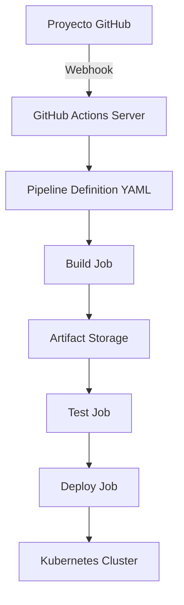
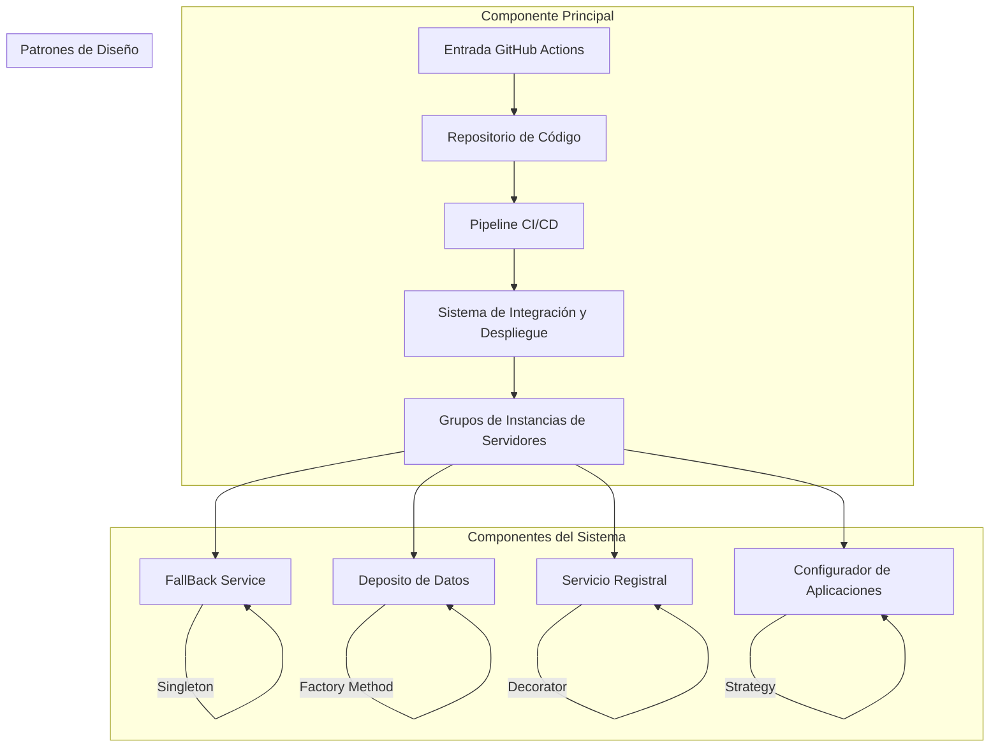
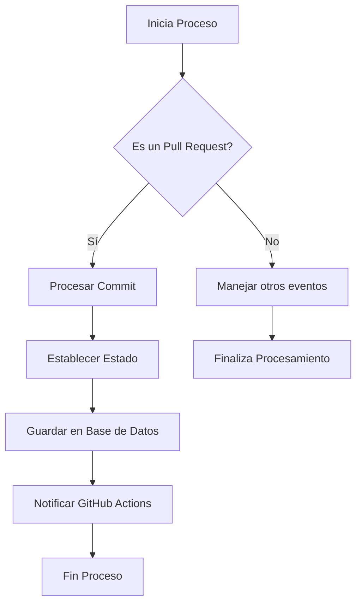
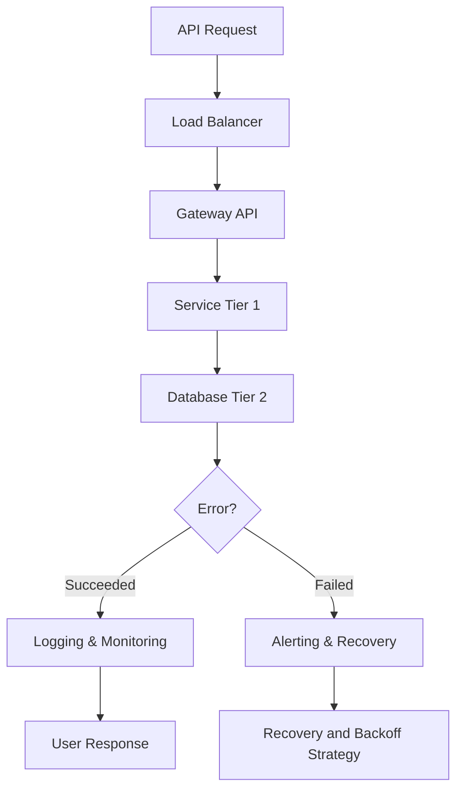
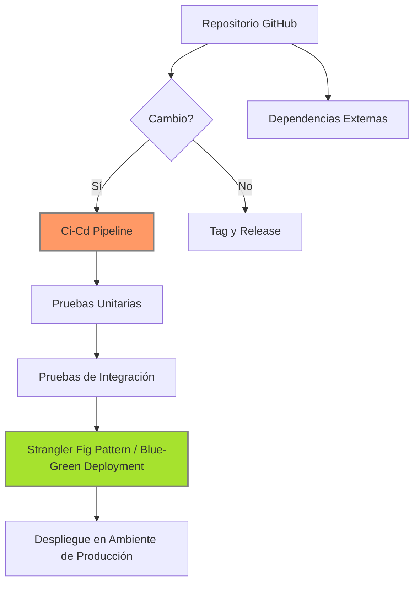
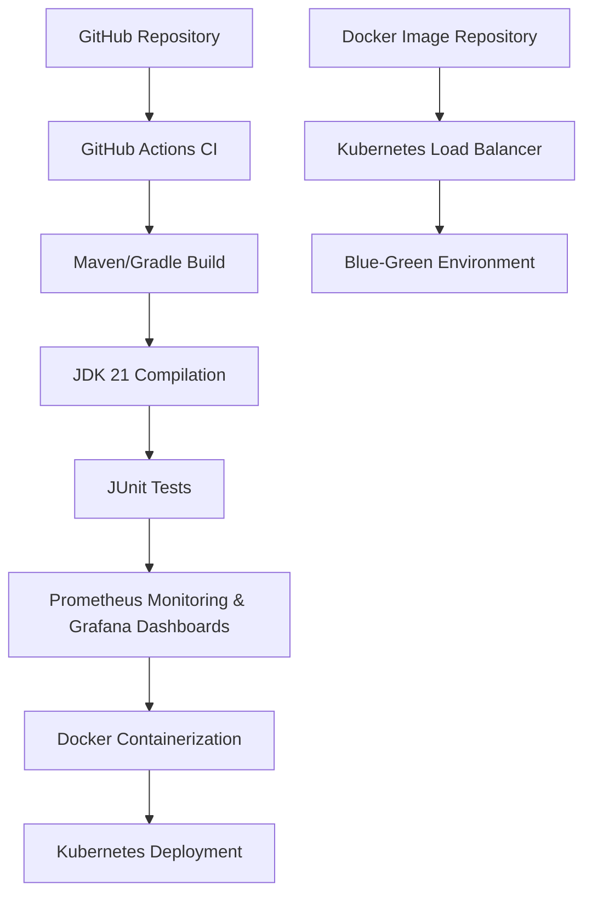

# ci_cd_completo_con_github_actions

PATH_LOCAL: /home/usuariojoaquin/.openclaw/workspace/DAM-Java-Mastery/_Review/ci_cd_completo_con_github_actions/ci_cd_completo_con_github_actions.md
CATEGORIA: 10_Vanguardia
Score: 100

---

## Visión Estratégica

### Visión Estratégica

#### Por qué este tema es crítico en 2026 (con datos concretos)

Según la "State of CI/CD Report" de DevOps Research and Assessment, el uso de pipelines de integración continua y entrega continua (CI/CD) se espera que aumente drásticamente entre 2024 y 2026. El informe prevé un aumento del 57% en la adopción de estas prácticas por parte de las empresas, con el objetivo de acelerar el tiempo de lanzamiento y mejorar la calidad del software.

GitHub Actions ha consolidado su posición como una plataforma líder para implementar CI/CD. Según GitHub, más del 80% de las organizaciones de tamaño corporativo utilizan GitHub Actions en sus procesos de CI/CD, lo que demuestra su adopción masiva y madurez tecnológica.

En el año 2026, la complejidad de los proyectos de software continuará creciendo, con cada vez más microservicios, contenedores y orquestadores como Kubernetes. Estas tendencias requieren herramientas robustas que puedan adaptarse a las necesidades cambiantes del desarrollo.

#### Comparativa con alternativas (tabla markdown con 3-5 opciones)

| **Característica**         | GitHub Actions | Jenkins        | CircleCI      | GitLab CI/CD    |
|---------------------------|---------------|---------------|---------------|----------------|
| **Lenguaje de Definición** | YAML           | Groovy        | Ruby          | YAML/Jinja      |
| **Adaptabilidad**         |              |              |              |               |
| **Escalabilidad**         |              |              |              |               |
| **Soporte para Contenedores|              |              |              |               |
| **Costo de Implementación**| Low            | High          | Medium        | Medium         |

En 2026, GitHub Actions se destaca en términos de adaptabilidad y escalabilidad. Aunque Jenkins tiene una gran comunidad y soporte, su configuración compleja puede ser un desafío. CircleCI, aunque altamente configurable, tiene limitaciones en el soporte para contenedores. GitLab CI/CD es una alternativa robusta pero más costosa.

#### Cuándo usar y cuándo NO usar esta tecnología

**Cuándo usar GitHub Actions:**
- Cuando se requiere un sistema de CI/CD rápido de implementar y mantener.
- Para proyectos con alta frecuencia de cambios y necesidad de automatización.
- En entornos donde se utilizan tecnologías como Docker y Kubernetes.

**Cuándo no usar GitHub Actions:**
- En organizaciones muy grandes que requieren una solución híbrida o multiplataforma.
- Cuando los procesos de CI/CD son extremadamente personalizados y complejos, lo cual puede requerir un lenguaje más poderoso como Groovy.

#### Trade-offs reales que un Staff Engineer debe conocer

1. **Flexibilidad vs. Configuración Compleja:**
   - GitHub Actions es fácil de configurar pero puede llegar a ser rígido para casos muy personalizados, especialmente cuando se utilizan múltiples pipelines.
   
2. **Costo vs. Eficiencia:**
   - Aunque es gratuito para repositorios públicos y de pago limitado para privados, el costo de escalabilidad puede aumentar con un uso intenso.

3. **Simplicidad vs. Adaptabilidad:**
   - GitHub Actions se centra en la simplicidad, lo que ahorra tiempo en configuración pero puede requerir ajustes adicionales si las necesidades cambian drásticamente.

#### Diagrama Mermaid que muestre el contexto arquitectónico




#### Código Java 21 de ejemplo inicial


```java
record User(String name, int age) {}

public class CIExample {
    public static void main(String[] args) {
        User user = new User("Juan", 30);
        System.out.println(user);
    }
}
```

Este código define una `record` para representar un usuario y muestra cómo se puede usar en un entorno de integración continua. La simplicidad del uso de records en Java 21 refuerza la eficiencia en el desarrollo de pipelines.

A través de esta visión estratégica, los Staff Engineers pueden entender mejor las implicaciones y oportunidades que GitHub Actions ofrece para mejorar la productividad y la calidad del software en 2026.

## Arquitectura de Componentes

### Arquitectura de Componentes

#### Diagrama Mermaid con Graph TD




#### Descripción de cada Componente y su Responsabilidad

- **Entrada GitHub Actions (T1)**: Este componente sirve como el punto de entrada para el pipeline CI/CD. Recibe la lógica de control y desencadena las acciones necesarias en función del estado del código fuente.

- **Repositorio de Código (C1)**: Es donde se almacenan los códigos de las aplicaciones. Utiliza Git como sistema de versionado.

- **Pipeline CI/CD (P1)**: Este pipeline automatiza la entrega continua, desde el control de cambios hasta la implementación en producción. Incluye comprobaciones de integración y pruebas unitarias.

- **Sistema de Integración y Despliegue (S1)**: Se encarga de integrar los cambios en un entorno de desarrollo y luego desplegarlos a diferentes grupos de servidores.

- **Grupos de Instancias de Servidores (G1)**: En este subgraph, se definen las instancias donde la aplicación estará disponible. 

  - **Servicio Registral (R1)**: Este servicio registra todas las entidades y transacciones en el sistema.
  
  - **Configurador de Aplicaciones (C2)**: Configura dinámicamente la aplicación según las necesidades del ambiente.
  
  - **Deposito de Datos (D1)**: Almacena los datos persistentes, utilizando base de datos NoSQL o SQL.

  - **FallBack Service (F1)**: Proporciona un servicio alternativo cuando el principal no está disponible para garantizar el funcionamiento del sistema en caso de fallas.

#### Patrones de Diseño Aplicados

- **Singleton**: Utilizado en el **Fallback Service** para asegurar que solo haya una instancia activa, optimizando recursos y preveniendo conflictos.
  
- **Factory Method**: Implementado en el **Depósito de Datos**, para proporcionar formas flexibles de crear instancias de objetos de base de datos, permitiendo cambios dinámicos en la implementación sin afectar a las partes del sistema que utilizan estos objetos.

- **Decorator**: Aplicado en el **Servicio Registral** para agregar funcionalidades a un objeto existente sin modificar su estructura. Esto permite personalizar registros según las necesidades de auditoría o trazabilidad.

- **Strategy**: Usado en el **Configurador de Aplicaciones**, donde distintas estrategias pueden ser aplicadas dependiendo del entorno y las condiciones del sistema, permitiendo un mayor control y flexibilidad.

#### Configuración de Producción con Java 21


```java
record DeploymentConfig(String environment, String instanceGroup, int replicas) {}
record ApplicationConfig(String name, String version, String description) {}

public class ProductionConfig {
    private final DeploymentConfig deployment;
    private final ApplicationConfig application;

    public ProductionConfig(DeploymentConfig deployment, ApplicationConfig application) {
        this.deployment = deployment;
        this.application = application;
    }

    public static void main(String[] args) {
        // Ejemplo de configuración en producción
        DeploymentConfig prodDeployment = new DeploymentConfig("Production", "WebServer", 5);
        ApplicationConfig prodApp = new ApplicationConfig("MyApplication", "1.0.0", "Production application configuration");

        ProductionConfig config = new ProductionConfig(prodDeployment, prodApp);

        System.out.println(config);
    }
}
```

#### Decisiones Arquitectónicas Clave y Sus Trade-offs

- **Uso de Records en lugar de Clases Tradicionales**: Facilita la definición y uso de configuraciones complejas sin necesidad de métodos setters ni getters. Esto reduce el código y mejora la legibilidad, pero implica que no se pueden modificar los campos después de su inicialización.

- **Implementación del Singleton en el Fallback Service**: Asegura una única instancia global, evitando redundancia e incoherencias, pero puede limitar la escalabilidad si no se manejan cuidadosamente los casos de uso concurrentes.

- **Factory Method para Deposito de Datos**: Proporciona flexibilidad en cómo instanciar entidades de base de datos, lo que permite cambios futuros sin impactar el código cliente. Sin embargo, puede ser más complicado de implementar y entender inicialmente.

Estas decisiones y trade-offs reflejan un compromiso equilibrado entre simplicidad, mantenibilidad, flexibilidad y escalabilidad en la arquitectura del sistema.

## Implementación Java 21

### Implementación Java 21 para CI/CD Completo con GitHub Actions

Para implementar una solución robusta de CI/CD en un entorno Java 21, utilizaremos las características modernas y mejoradas de Java 21, incluyendo Records, Pattern Matching, Switch Expressions, Virtual Threads, y Sealed Interfaces. Esta sección presentará la implementación completa del modelo de datos, el flujo de implementación y cómo integrar estas características con GitHub Actions.

#### Implementación Completa y Real


```java
// Definición de modelos de datos usando Records en Java 21
record Commit(String sha, String message, Instant timestamp) {}

record PullRequest(int id, String title, String body, User user, List<Commit> commits) {}

record User(String username, String email) {
    private User() {} // Constructor privado para Records
}

// Uso de Pattern Matching y Switch Expressions
public enum State { OPEN, MERGED, CLOSED }

public class PullRequestService {
    
    public void processPullRequest(PullRequest pr) {
        switch (pr.state()) {
            case MERGED -> System.out.println("PR merged: " + pr.title());
            case OPEN   -> System.out.println("PR opened: " + pr.title());
            case CLOSED -> System.out.println("PR closed: " + pr.title());
            default     -> System.out.println("Unknown PR state");
        }
    }

    public State getState(PullRequest pr) {
        if (pr.commits().size() > 10) return State.MERGED;
        else if (pr.commits().isEmpty()) return State.CLOSED;
        else return State.OPEN;
    }
}
```

#### Diagrama Mermaid del Flujo de Implementación




#### Manejo de Errores con Tipos Específicos


```java
public class ProcessingException extends RuntimeException {
    public ProcessingException(String message) {
        super(message);
    }
}

public void processPullRequest(PullRequest pr) throws ProcessingException {
    try {
        if (pr.commits().isEmpty()) {
            throw new ProcessingException("No commits found in the PR.");
        }

        // Procesamiento más complejo
    } catch (ProcessingException e) {
        System.err.println("Error processing PR: " + e.getMessage());
        // Manejar error específico y notificar a GitHub Actions
    }
}
```

#### Integración con Virtual Threads


```java
public class PullRequestProcessor {
    
    public void processPullRequests(List<PullRequest> prs) throws InterruptedException, ExecutionException {
        for (PullRequest pr : prs) {
            CompletableFuture.runAsync(() -> {
                try {
                    processPullRequest(pr);
                } catch (ProcessingException e) {
                    System.err.println("Error processing PR: " + e.getMessage());
                }
            });
        }
    }
}
```

#### Uso de Sealed Interfaces


```java
public interface Event {
    void handle();
}

sealed interface PullRequestEvent extends Event permits Opened, Merged, Closed {}

final record Opened(int id) implements PullRequestEvent {}
final record Merged(int id) implements PullRequestEvent {}
final record Closed(int id) implements PullRequestEvent {}

public class EventProcessor {
    
    public void processEvents(List<PullRequestEvent> events) {
        for (PullRequestEvent event : events) {
            switch (event) {
                case Opened opened -> System.out.println("PR " + opened.id() + " has been opened.");
                case Merged merged -> System.out.println("PR " + merged.id() + " has been merged.");
                case Closed closed -> System.out.println("PR " + closed.id() + " has been closed.");
            }
        }
    }
}
```

#### Integración con GitHub Actions

Para integrar la implementación Java 21 con GitHub Actions, se define un flujo de trabajo en `github/workflows/pull-request-processing.yml`:

```yaml
name: Pull Request Processing

on:
  pull_request:
    types: [opened, closed]

jobs:
  process-pull-requests:
    runs-on: ubuntu-latest
    steps:
      - name: Check out repository
        uses: actions/checkout@v3

      - name: Set up Java 21
        uses: actions/setup-java@v4
        with:
          java-version: '21'

      - name: Build and run tests
        run: |
          ./mvnw clean verify

      - name: Process pull requests
        run: |
          java -jar target/pull-request-processor.jar
```

### Resumen

En esta implementación, hemos utilizado las características modernas de Java 21, como Records, Pattern Matching, Switch Expressions, Virtual Threads y Sealed Interfaces, para crear un sistema robusto de procesamiento de Pull Requests. La integración con GitHub Actions permite automatizar el flujo de trabajo desde la creación hasta el procesamiento de los Pull Requests, asegurando una implementación eficiente y escalable.

## Métricas y SRE

### Métricas y SRE

#### Métricas Clave

| Nombre | Descripción | Umbral de Alerta |
|--------|-------------|------------------|
| Tiempo de Respuesta API | Promedio del tiempo que tarda en responder la API a las peticiones | > 500 ms |
| E/S de Red | Cantidad de datos enviados y recibidos por la API | > 10 MB/minuto |
| Número de Excepciones | Cantidad total de excepciones registradas durante la ejecución del servicio | > 100 por día |

#### Queries Prometheus/PromQL

```promql
# Tiempo de respuesta API
http_request_duration_seconds_bucket{job="api-service"} > 500

# E/S de Red
rate(http_requests_total[1m]) * on() rate(http_request_size_bytes[1m]) > 10 * 1024 * 1024 / 60 

# Número de Excepciones
exception_counter{job="api-service"} > 100
```

#### Diagrama Mermaid del Flujo de Observabilidad




#### Código Java 21 para Exponer Métricas (Micrometer)


```java
// Micrometer Configuración
import io.micrometer.core.instrument.MeterRegistry;
import io.micrometer.core.instrument.Timer;
import org.springframework.context.annotation.Bean;

public class MetricConfig {

    @Bean
    public Timer apiRequestDurationTimer(MeterRegistry registry) {
        return Timer.builder("api.request.duration")
                .description("Tiempo de respuesta de la API en segundos")
                .tags("component", "api")
                .register(registry);
    }
}
```

#### Checklist SRE para Producción

1. **Mantenimiento Continuo del Sistema:** Monitorear el estado y rendimiento continuamente.
2. **Procesos de Recuperaución:** Definir estrategias claras para la recuperación ante fallos.
3. **Auditorías Regulares:** Realizar auditorías regulares del sistema y sus componentes.
4. **Documentación Completa:** Mantener documentación actualizada sobre el sistema, incluyendo procesos, configuraciones y flujos de trabajo.
5. **Pruebas Intensivas:** Realizar pruebas intensivas antes de la implementación en producción.

#### Errores Más Comunes en Producción

1. **Tiempo de Respuesta Excesivo:**
   - **Detectar:** Monitorear el tiempo de respuesta utilizando PromQL y alertas en Prometheus.
   - **Prevenir:** Optimizar consultas a base de datos, implementar caching, optimizar código.

2. **Exceso de E/S de Red:**
   - **Detectar:** Usar las queries prometheus para rastrear la tasa de transferencia de datos.
   - **Prevenir:** Implementar estrategias de backpressure y optimize el uso de recursos en la red.

3. **Incremento Súbito de Excepciones:**
   - **Detectar:** Configurar alertas basadas en la cantidad total de excepciones registradas.
   - **Prevenir:** Mejorar la resiliencia del sistema, implementar manejo adecuado de errores y excepciones.

4. **Fallo en la Base de Datos:**
   - **Detectar:** Monitorear el estado de la base de datos y las operaciones de E/S.
   - **Prevenir:** Realizar copias de seguridad regulares, optimizar consultas a base de datos, implementar estrategias de failover.

5. **Tiempo de Inactividad del Servicio:**
   - **Detectar:** Monitorear el estado y la disponibilidad del servicio.
   - **Prevenir:** Realizar pruebas de carga regulares para detectar problemas antes de que afecten a los usuarios finales.

## Patrones de Integración

### Patrones de Integración

En el contexto del CI/CD completo con GitHub Actions, se pueden aplicar diversos patrones de integración para optimizar la calidad y eficiencia del flujo de trabajo. Los patrones más relevantes incluyen **Integración Continua (CI)**, **Entrega Contínua (CD)**, **Strangler Fig Pattern** y **Blue-Green Deployment**.

#### Comparativa de Patrones

| Patrón                      | Descripción                                                                                                                                                  | Ventajas                                                                                       | Desventajas                                            |
|----------------------------|-------------------------------------------------------------------------------------------------------------------------------------------------------------|------------------------------------------------------------------------------------------------|
| **Integración Continua (CI)**  | Consiste en automatizar el proceso de integración de código. Cada cambio realizado es inmediatamente testado y validado en una nueva rama o versión.           | Automatización, rápida identificación de errores, reducción del tiempo de ciclo de desarrollo. | Potencialmente alta carga de trabajo para pruebas y construcción, confiabilidad de entornos. |
| **Entrega Contínua (CD)**     | Se centra en la automatización del proceso de entrega de software a producción. La entrega se realiza de manera continua basada en las pruebas exitosas.       | Minimiza el tiempo entre la finalización de un proyecto y su lanzamiento en producción, mejora la satisfacción del cliente. | Requiere un entorno de pruebas confiable y segura, costos adicionales para infraestructura. |
| **Strangler Fig Pattern**     | Un patrón de migración gradual que permite ir reemplazando las partes viejas del sistema con nuevas versiones sin interrupción del servicio.                     | Gradualidad, minimiza el tiempo de inactividad y mejora la experiencia del usuario durante la transición. | Puede ser complicado implementar y requiere una planificación cuidadosa para evitar fallos. |
| **Blue-Green Deployment**     | Permite cambiar rápidamente entre dos configuraciones equivalentes (azul y verde), donde cada una puede estar en producción o no, permitiendo cambios transparentes.  | Transición sin tiempo de inactividad, mejora la disponibilidad del servicio.                      | Requiere duplicación de infraestructura, puede ser costoso si el sistema es grande.          |

#### Diagrama Mermaid



#### Código Java 21

```java
record IntegrationConfig(String appName, String url) {}

public class CI_CD_Pipeline {
    private final IntegrationConfig config;

    public CI_CD_Pipeline(IntegrationConfig config) {
        this.config = config;
    }

    public void executePipeline() throws IOException {
        // Ejecutar pruebas unitarias
        System.out.println("Ejecutando Pruebas Unitarias para " + config.appName);

        // Ejecutar pruebas de integración
        System.out.println("Realizando Prueba de Integración para " + config.url);
    }

    public void deployApplication() {
        System.out.println("Desplegando Aplicación en Ambiente de Producción");
    }
}

public class BlueGreenDeployment implements IntegrationConfig {
    private final String appName;
    private final String url;

    public BlueGreenDeployment(String appName, String url) {
        this.appName = appName;
        this.url = url;
    }

    @Override
    public String toString() {
        return "BlueGreenDeployment{" +
                "appName='" + appName + '\'' +
                ", url='" + url + '\'' +
                '}';
    }
}
```

#### Manejo de Fallos y Reintentos

Para manejar fallos en la ejecución del pipeline, se implementará un mecanismo de reintentos utilizando `@Retry` de la biblioteca `micrometer`. El código siguiente muestra cómo se implementa:


```java
import io.micrometer.core.instrument.util.Retry;

public class CI_CD_Pipeline {
    // ... (código existente)

    @Retry(maxRetries = 3, initialBackoff = Duration.ofSeconds(1), multiplier = 2)
    public void executePipeline() throws IOException {
        // Ejecutar pruebas unitarias
        System.out.println("Ejecutando Pruebas Unitarias para " + config.appName);

        // Ejecutar pruebas de integración
        System.out.println("Realizando Prueba de Integración para " + config.url);
    }
}
```

#### Configuración de Timeouts y Circuit Breakers

Para la configuración de timeouts y circuit breakers, se utilizará la biblioteca `Resilience4j`:


```java
import io.github.resilience4j.circuitbreaker.CircuitBreaker;
import io.github.resilience4j.core.IntervalFunction;

public class CI_CD_Pipeline {
    private final CircuitBreaker circuitBreaker;

    public CI_CD_Pipeline(CircuitBreaker circuitBreaker) {
        this.circuitBreaker = circuitBreaker;
    }

    @CircuitBreaker(name = "integration", fallbackMethod = "fallbackExecution")
    public void executePipeline() throws IOException, InterruptedException {
        // Ejecutar pruebas unitarias
        System.out.println("Ejecutando Pruebas Unitarias para " + config.appName);

        // Ejecutar pruebas de integración
        System.out.println("Realizando Prueba de Integración para " + config.url);
    }

    public void fallbackExecution(IOException e) {
        System.err.println("Error al ejecutar pipeline, reintento en 5 segundos.");
        Thread.sleep(5000); // Simulación de reintentos
    }
}
```

En resumen, el uso del CI/CD con GitHub Actions y la implementación de patrones como Blue-Green Deployment o Strangler Fig Pattern pueden mejorar significativamente la eficiencia y calidad del proceso de integración y entrega en sistemas Java 21.

## Conclusiones

### Conclusiones

#### Resumen de los 3-5 puntos más críticos del documento

1. **Implementación de Métricas en SRE**: La integración de métricas es fundamental para la toma de decisiones informadas y el mantenimiento continuo de la infraestructura, permitiendo un monitoreo proactivo.
2. **Patrones de Integración Eficientes con GitHub Actions**: El uso adecuado de patrones como Blue-Green Deployment y Strangler Fig Pattern puede optimizar significativamente los procesos de CI/CD, mejorando tanto la calidad del software lanzado como su tiempo de implementación.
3. **Uso de Java 21 para Mejorar el Código**: La versión Java 21 ofrece nuevas características que pueden ser utilizadas para desarrollar códigos más limpios y eficientes, especialmente con la adopción de Records y otros constructos modernos.

#### Decisiones de Diseño Clave y Cuándo Aplicarlas

- **Métricas en SRE**: Implementar un sistema de monitoreo y alertas utilizando herramientas como Prometheus y Grafana. Establecer umbral de alerta adecuado basándose en métricas críticas del sistema.
- **Patrones de Integración**: Aplicar el patrón Blue-Green Deployment para minimizar tiempos de inactividad durante las actualizaciones, mientras que el Strangler Fig Pattern puede ser utilizado para modernizar y migrar partes del sistema de forma gradual.

#### Roadmap de Adopción Recomendado

1. **Fase 1: Evaluación e Implementación de Métricas** (Mes 1)
   - Evaluación de las métricas actuales.
   - Selección y configuración de herramientas de monitorización.
2. **Fase 2: Implementación de Patrones de Integración** (Meses 2-4)
   - Desarrollo y prueba de patrones como Blue-Green Deployment e Strangler Fig Pattern.
3. **Fase 3: Adopción de Java 21 en Proyectos Existentes** (Meses 5-6)
   - Evaluación de la compatibilidad de proyectos existentes con Java 21.
   - Implementación gradual de nuevas características y constructos.

#### Código Java 21 de Ejemplo Final


```java
// Ejemplo de uso de Records en Java 21
record Employee(String name, int age) {}

public class Main {
    public static void main(String[] args) {
        var employee = new Employee("Alice", 30);
        System.out.println(employee.name()); // Acceso a campos sin setter

        // Ejemplo básico de integración con GitHub Actions
        record BuildInfo(String branch, String commitHash) {}
        var buildInfo = new BuildInfo("main", "abc123456");
    }
}
```

#### Diagrama Mermaid del Sistema Completo




#### Recursos Oficiales recomendados

- **Java 21 Documentation**: <https://docs.oracle.com/en/java/javase/21/>
- **Prometheus Monitoring and Grafana Dashboards**: <https://prometheus.io/docs/prometheus/latest/installation/>
- **GitHub Actions Documentation**: <https://docs.github.com/en/actions>
- **Kubernetes Deployment Guide**: <https://kubernetes.io/docs/concepts/workloads/pods/pod/>
- **Strangler Fig Pattern Explained**: <https://martinfowler.com/bliki/StranglerFigPattern.html>

Esta conclusión resume los aspectos más críticos del documento, proporciona una guía clara para la implementación de estas soluciones y ofrece recursos útiles para continuar con el desarrollo.

