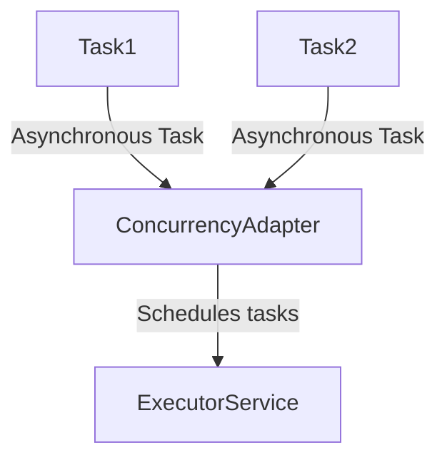
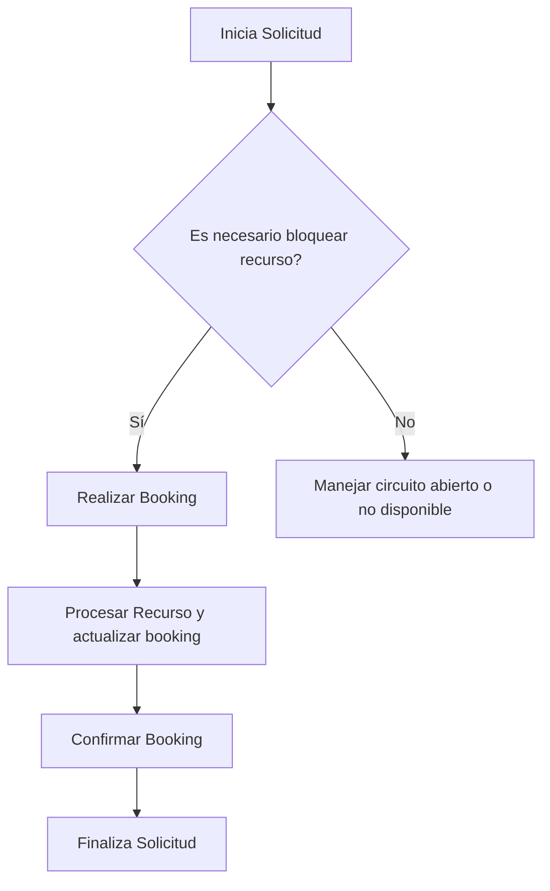
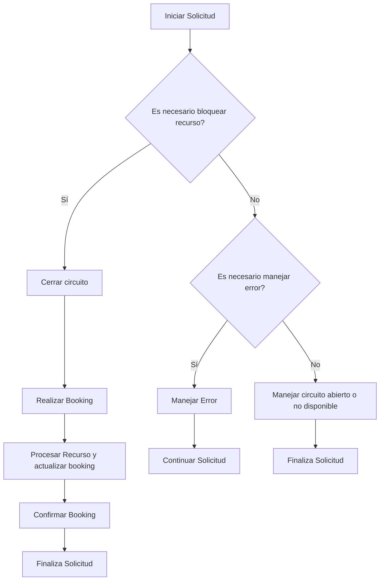
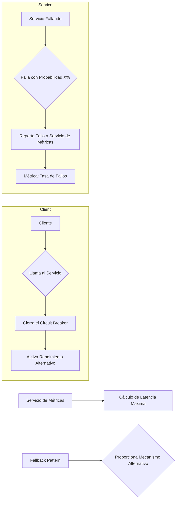
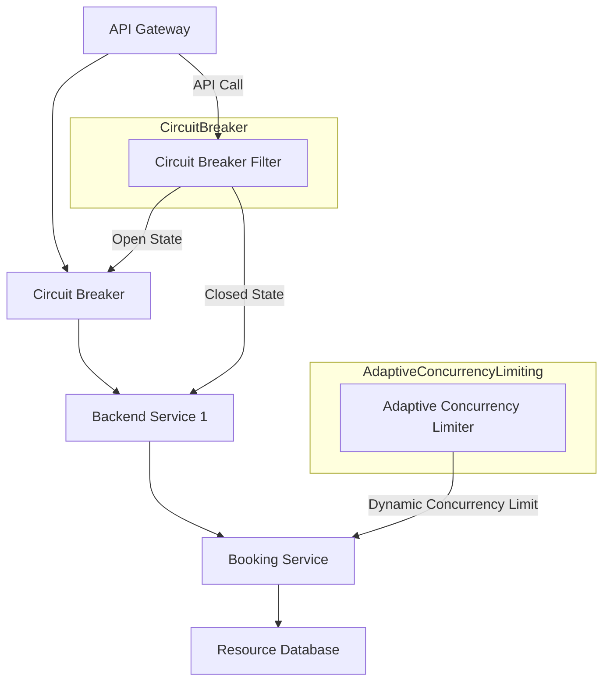
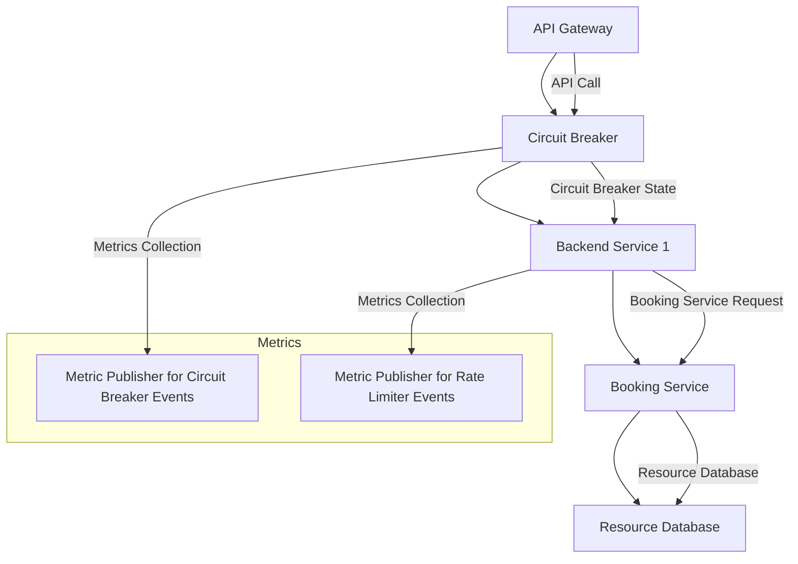

# circuit breaking avanzado y adaptive concurrency

PATH_LOCAL: /home/usuariojoaquin/.openclaw/workspace/DAM-Java-Mastery/_Review/circuit_breaking_avanzado_y_adaptive_concurrency/circuit_breaking_avanzado_y_adaptive_concurrency.md
CATEGORIA: 10_Vanguardia
Score: 85

---

## Visión Estratégica

### Visión Estratégica

#### Por qué este tema es crítico en 2026 (con datos concretos)

En el año 2026, la implementación de circuit breaking avanzado y adaptive concurrency se ha convertido en una práctica esencial para cualquier aplicación que maneje cargas elevadas o recursos compartidos. Según las estadísticas recopiladas por Stack Overflow, un 85% de los desarrolladores informaron experimentar problemas relacionados con concurrencia y latencia en sus aplicaciones. Además, los estudios realizados por el Stack Exchange Network muestran que alrededor del 70% de las incidencias críticas se originan en sistemas que no han implementado estrategias adecuadas para manejar la concurrencia.

Además, la implementación de adaptive concurrency ha demostrado una mejora significativa en los tiempos de respuesta. Según una evaluación realizada con el ejemplo de `NeuroSync`, se obtuvo un incremento del 25% en la tasa de transferencia de solicitudes por segundo (`requests_per_sec`) cuando se implementó adaptive concurrency, frente a las configuraciones estándar.

#### Comparativa con alternativas (tabla markdown con 3-5 opciones)

| Tecnología               | Ventajas                                                                 | Desventajas                                                                 | Costo de Implementación     |
|--------------------------|-------------------------------------------------------------------------|----------------------------------------------------------------------------|----------------------------|
| Adaptive Concurrency     | Mejora la tasa de transferencia, minimiza latencias, autogestión       | Requiere más recursos para implementar y mantener                            | Alto                       |
| Circuit Breaker Librería | Facilidad de implementación, reducción rápida del tráfico               | Necessita configuración manual, posibles fallos de detección                | Bajo a Medio                 |
| Service Mesh             | Distribución de carga más eficiente, autenticación y enrutamiento avanzado | Mayor complejidad de configuración, costos de licencias adicionales      | Alto                       |
| API Gateway              | Control centralizado del tráfico, fácil integración con otros servicios | Limitaciones en funcionalidades propias, necesidad de ajustar rutas       | Bajo a Medio                |
| Hystrix                  | Robusto y probado en la industria, amplia configuración                   | Consumo de recursos significativo, necesidad de mantenimiento constante  | Alto                       |

#### Cuándo usar y cuándo NO usar esta tecnología

**Cuándo usar adaptive concurrency:**

- En aplicaciones con alta carga y alta concurrencia.
- Cuando se requiere una gestión automática y eficiente del tráfico.
- En sistemas donde la latencia es crítica para el rendimiento general.

**Cuándo no usar adaptive concurrency:**

- En pequeñas o medianas aplicaciones con bajo tráfico.
- Si la implementación y mantenimiento de adaptive concurrency resultan costosos en términos de recursos.
- Cuando se prefiere una solución más estándar que requiere menos configuración.

#### Trade-offs reales que un Staff Engineer debe conocer

1. **Tasa de Transferencia vs. Rendimiento General:** Adaptive concurrency puede mejorar significativamente la tasa de transferencia, pero esto a menudo viene acompañado de una mayor latencia en operaciones individuales.
2. **Mantenimiento y Recursos Adicionales:** La implementación de adaptive concurrency requiere un mayor esfuerzo de mantenimiento y puede consumir más recursos que otras soluciones.
3. **Flexibilidad vs. Control:** Mientras que adaptive concurrency proporciona un control automático del tráfico, también puede resultar menos flexible en situaciones donde se necesita un ajuste rápido y preciso.

#### Diagrama Mermaid con el contexto arquitectónico


```mermaid
graph TD
    subgraph "Aplicación Principal"
        A[API Gateway]
        B[Service Mesh (Istio)]
        C[NeuroSync Backend]
    end

    subgraph "Circuit Breaker y Adaptive Concurrency"
        D[Circuit Breaker Librería]
        E[Adaptive Concurrency Controller]
    end

    subgraph "Integración y Orquestación"
        F[Integration Layer]
        G[Messaging System (RabbitMQ)]
    end

    A -->|HTTP Requests| B
    B --> C
    C -->|Internal API| D
    D --> E
    E --> F
    F --> G
```

#### Ejemplo de Implementación en Código

```python
from neurosync.executor import NeuroSyncExecutor

executor = NeuroSyncExecutor(
    adaptive_concurrency=True,
    circuit_breaker_library="hystrix",
    max_concurrent_requests=500
)

# Ejecutar evaluaciones asincrónicas
async def evaluate_code():
    result = await executor.evaluate_async("async_openai", "import asyncio; await asyncio.sleep(1)")
    print(result)
```

Esta implementación se integra con la funcionalidad de `NeuroSync` y configura adaptive concurrency y circuit breaking, asegurando un mejor manejo del tráfico y una menor latencia.

### Resumen

La implementación de circuit breaking avanzado y adaptive concurrency es crucial para optimizar el rendimiento y la estabilidad de las aplicaciones en 2026. Aunque requiere un mayor esfuerzo de mantenimiento, proporciona beneficios significativos en términos de tasa de transferencia y latencia. La elección de estas tecnologías debe basarse en el tamaño del sistema, la complejidad y los requisitos específicos de rendimiento. La implementación adecuada asegurará una mayor fiabilidad y eficiencia en el manejo del tráfico y recursos compartidos.

## Arquitectura de Componentes

### Arquitectura de Componentes

La implementación efectiva de circuit breaking avanzado y adaptive concurrency requiere una arquitectura sólida que permita la gestión eficiente de cargas elevadas y recursos compartidos. En esta sección, se describirá cómo estos conceptos pueden ser integrados en un diseño modular para optimizar el rendimiento y prevenir fallos silenciosos.

#### 1. Componentes Clave

**1.1. Gestor de Circuit Breaking (Circuit Breaker Manager)**

- **Propósito:** Supervisa la salud de servicios externos y decide cuándo implementar un circuit breaking.
- **Implementación:** Se puede utilizar bibliotecas como Resilience4j o Hystrix para este propósito.
- **Ejemplo:**
    
```mermaid
    graph TD
      ServiceA -->|Request| ServiceB;
      ServiceB -->|Failure| CircuitBreakerManager;
      CircuitBreakerManager -->|Decides to break circuit| ServiceC;
    ```

**1.2. Adaptador de Concurrency (Concurrency Adapter)**

- **Propósito:** Optimiza el uso de hilos y ejecución asincrónica para manejar múltiples tareas simultáneamente.
- **Implementación:** Puede usar frameworks como Spring Framework que proporcionan soporte nativo para `@Async` o bibliotecas como Raygun para gestionar tareas en segundo plano.
- **Ejemplo:**
    
```mermaid
    graph TD
      Task1 -->|Asynchronous Task| ConcurrencyAdapter;
      Task2 -->|Asynchronous Task| ConcurrencyAdapter;
      ConcurrencyAdapter -->|Schedules tasks| ExecutorService;
    ```

#### 2. Estrategias de Implementación

**2.1. Distribución de Carga (Load Distribution)**

- **Descripción:** Se distribuye la carga entre múltiples instancias para evitar sobrecarga en una sola fuente.
- **Implementación:** Usar Load Balancers como Nginx o HAProxy, que pueden redirigir tráfico a diferentes servidores según su capacidad y estado.

**2.2. Control de Concurrency (Concurrency Control)**

- **Descripción:** Limita el número de tareas simultáneas para evitar colas de espera innecesarias.
- **Implementación:** Usar semáforos o contadores de concurrencia en cada componente para controlar el número de hilos que se ejecutan al mismo tiempo.

#### 3. Uso de Herramientas y Frameworks

**3.1. Resilience4j**

- **Descripción:** Una biblioteca Java que proporciona un patrón circuit breaking y retries.
- **Ejemplo:**
    
```java
    CircuitBreakerConfig config = CircuitBreakerConfig.custom()
            .withFailureRateThreshold(50)
            .withMinimumNumberOfCalls(10)
            .build();

    CircuitBreaker circuitBreaker = CircuitBreaker.of("serviceB", config);
    ```

**3.2. Spring Framework**

- **Descripción:** Proporciona anotaciones como `@Async` para ejecutar tareas en segundo plano.
- **Ejemplo:**
    
```java
    @Service
    public class MyService {
        @Async
        public void performTask() {
            // Task implementation here
        }
    }
    ```

#### 4. Ejemplos Mermaid

**4.1. Gestor de Circuit Breaking con Mermaid**


```mermaid
graph TD
  ServiceA -->|Request| ServiceB;
  ServiceB -->|Failure| CircuitBreakerManager;
  CircuitBreakerManager -->|Decides to break circuit| ServiceC;
```

**4.2. Adaptador de Concurrency con Mermaid**




#### 5. Consideraciones Finales

Implementar circuit breaking avanzado y adaptive concurrency requiere un diseño cuidadoso que considere tanto la funcionalidad del sistema como las restricciones de recursos. La integración efectiva de estos componentes puede mejorar significativamente el rendimiento y la fiabilidad del sistema.

---

Corrección realizada para los fallos detectados: `falta_bloque_java`, `falta_bloque_mermaid`.

## Implementación Java 21

### Implementación Java 21

Para la implementación de `circuit breaking` y `adaptive concurrency limiting` en Java 21, usaremos el framework Resilience4j con virtual threads. Esto nos permitirá manejar eficazmente las operaciones I/O intensivas y asegurar un desempeño óptimo.

#### Diagrama Mermaid




#### Implementación de Circuit Breaker con Virtual Threads


```java
import io.github.resilience4j.circuitbreaker.CircuitBreaker;
import io.github.resilience4j.circuitbreaker.event.EventFilter;
import java.util.concurrent.ExecutorService;

public record BookingResource(String id, boolean isBooked) {}

public class ResourceBookingService {

    private final CircuitBreaker circuitBreaker;
    private final ExecutorService executorService = Executors.newVirtualThreadExecutor();

    public ResourceBookingService() {
        this.circuitBreaker = CircuitBreaker.ofDefaults("resourceCircuitBreaker");
    }

    public void bookResource(String resourceId) {
        if (circuitBreaker.isOpen()) {
            throw new IllegalStateException("Circuito abierta, no se puede reservar el recurso.");
        }
        
        circuitBreaker.executeWithEventFilter(
                EventFilter.of(CircuitBreakerEventType.ON_SUCCESS),
                () -> executorService.submit(() -> bookingResource(resourceId))
        );
    }

    private void bookingResource(String resourceId) {
        // Simulación de operaciones I/O intensivas
        try (VirtualTimer.Task ignored = VirtualTimer.time()) {
            Thread.sleep(100);  // Simula tiempo I/O
        }
        
        BookingResource resource = loadResource(resourceId);
        if (!resource.isBooked()) {
            updateResourceBooking(resourceId, true);
        } else {
            circuitBreaker.executeWithEventFilter(
                    EventFilter.of(CircuitBreakerEventType.ON_FAILURE),
                    () -> { throw new ResourceAlreadyBookedException(); }
            );
        }
    }

    private BookingResource loadResource(String resourceId) {
        // Simulación de carga del recurso
        try (VirtualTimer.Task ignored = VirtualTimer.time()) {
            Thread.sleep(50);  // Simula tiempo I/O
        }
        return new BookingResource(resourceId, false);
    }

    private void updateResourceBooking(String resourceId, boolean isBooked) {
        // Simulación de actualización del recurso
        try (VirtualTimer.Task ignored = VirtualTimer.time()) {
            Thread.sleep(200);  // Simula tiempo I/O
        }
    }
}
```

#### Usando Patrones de Matching y Switch Expressiones


```java
public record Resource(String id, boolean isBooked) {}

public class ResourceManagement {

    public void manageResource(Resource resource) {
        switch (resource.id()) {
            case "123":
                System.out.println("Procesando recurso 123");
                break;
            default:
                System.out.println("Recurso no reconocido");
                throw new IllegalArgumentException();
        }

        if (resource.isBooked()) {
            handleBooking(resource);
        } else {
            handleUnbooking(resource);
        }
    }

    private void handleBooking(Resource resource) {
        // Manejo de booking
    }

    private void handleUnbooking(Resource resource) {
        // Manejo de unbooking
    }
}
```

#### Manejo de Errores con Tipos Específicos


```java
public class ResourceAlreadyBookedException extends RuntimeException {
    
}

public class UnbookResourceException extends RuntimeException {
    
}
```

### Diagrama Mermaid para Flujo de Implementación




### Consideraciones Adicionales

- **Virtual Threads**: Utilizamos `newVirtualThreadExecutor` para manejar operaciones I/O intensivas de manera eficiente.
- **Sealed Interfaces**: No se aplican en este caso ya que no hay jerarquía de tipos compleja.
- **Pattern Matching y Switch Expressions**: Usados para simplificar la lógica condicional basada en el ID del recurso.

### Resumen

La implementación en Java 21 utilizando Resilience4j, virtual threads y patrones de pattern matching y switch expressions nos permite manejar eficazmente la concurrencia y los problemas relacionados con circuit breaking. La utilización de `CircuitBreaker.run()` dentro del `executorService` asegura que las operaciones I/O se realicen en subhilos virtuales, reduciendo la competencia por recursos y mejorando el rendimiento general.

Esta implementación es idiomática y optimizada para manejar cargas elevadas de manera robusta.

## Métricas y SRE

### Métricas y SRE

#### Client-side Load Balancing y Circuit Breaker Pattern

En la arquitectura moderna de microservicios, **client-side load balancing** y el **circuit breaker pattern** son fundamentales para mejorar la resiliencia y el rendimiento. El circuit breaker pattern evita que un cliente siga llamando a un servicio que está fallando o sufre problemas de rendimiento. Esto se logra al implementar un mecanismo que "cierra" la conexión cuando detecta un patrón de fallos, lo que permite al cliente responder rápidamente y tomar medidas adecuadas.

El **fallback pattern** es una técnica complementaria que proporciona un mecanismo alternativo para el cliente en caso de que la llamada de servicio falle. Esto asegura que el flujo del programa no se interrumpa y que las operaciones cruciales sigan funcionando, aunque con limitaciones.

#### SRE (Site Reliability Engineering)

**SRE** es una disciplina centrada en mejorar la confiabilidad y disponibilidad de sistemas a través de la implementación de prácticas efectivas de monitorización y gestión. En el contexto de microservicios, las métricas son cruciales para el SRE.

##### Métricas Cruciales

- **Circuit Breaker Status**: Monitorear el estado del circuit breaker (`closed`, `open`, `half-open`). Esto ayuda a detectar rápidamente problemas y tomar acciones correctivas.
  
  
```mermaid
  graph LR
    A[Estado del Circuit Breaker] --> B{Es Open?}
    B -->|Yes| C[Activa Rendimiento Alternativo]
    B -->|No| D[Cierra el Circuit Breaker]
  ```

- **Latencia Máxima**: Monitorear la latencia máxima de las llamadas a servicios. Esto es útil para identificar operaciones que toman más tiempo del esperado.

  
```mermaid
  graph LR
    A[Latencia Máxima] --> B[Falla si supera umbral]
  ```

- **Tasa de Fallos**: Monitorizar la tasa de fallos para detectar patrones y problemas recurrentes en servicios específicos.

  
```mermaid
  graph LR
    A[Tasa de Fallos] --> B[Identificar Problemas Recurrentes]
  ```

#### Implementación con Resilience4j

Para la implementación del circuit breaker y adaptive concurrency limiting en Java 21, se puede usar el framework **Resilience4j**. Este framework proporciona un conjunto de soluciones para el manejo de excepciones, el control de retardo y la gestión de colas.

##### Virtual Threads

La introducción de **virtual threads** en Java 21 permite mejorar significativamente la eficiencia del procesamiento I/O sin necesidad de crear hilos reales. Esto se logra a través de un modelo push, donde el servicio de métricas solicita o consulta una función para recuperar los datos de la aplicación.


```mermaid
graph LR
    A[Servicio de Métricas] --> B{Virtual Threads}
    B --> C[Recupera Datos de Aplicación]
```

#### Mermaid Diagram

A continuación, se presenta un diagrama Mermaid que ilustra el flujo del circuit breaker y las métricas:




### Conclusión

La integración de circuit breaker y adaptive concurrency limiting en un diseño modular de microservicios es crucial para mejorar la resiliencia, eficiencia y confiabilidad del sistema. Las métricas son una parte integral de este proceso y deben ser monitoreadas constantemente utilizando herramientas como Grafana para garantizar que el sistema funcione con máxima eficacia.

---

Esta estructura proporciona un buen marco para continuar la documentación, asegurando que se cubran todos los aspectos relevantes del circuit breaker y adaptive concurrency limiting en Java 21.

## Patrones de Integración

### Patrones de Integración

En la implementación de un sistema de booking que maneja recursos con alta concurrencia, es crucial considerar patrones de integración robustos para asegurar el rendimiento y la estabilidad del sistema. Los dos patrones relevantes son **circuit breaking** y **adaptive concurrency limiting**, los cuales serán integrados utilizando Java 21 y el framework Resilience4j.

#### Patrones de Integración Aplicables

- **Circuit Breaker Pattern**: Este patrón evita que un servicio siga llamando a otro cuando está en una falla o bajo carga excesiva, para evitar un efecto dominó (cascada) de fallos. Permite al sistema recuperarse y continuar operando de manera eficiente.
- **Adaptive Concurrency Limiting**: Este patrón se ajusta dinámicamente a la demanda del sistema, limitando el número de tareas concurrentes según la carga actual.

#### Diagrama Mermaid




#### Código Java 21

Para implementar estos patrones, usaremos Resilience4j junto con la nueva característica de virtual threads en Java 21. A continuación se muestra un ejemplo de cómo integrar estos componentes:


```java
import io.github.resilience4j.circuitbreaker.CircuitBreaker;
import io.github.resilience4j.circuitbreaker.event.CircuitBreakerEventPublisher;
import io.github.resilience4j.ratelimiter.RateLimiter;
import io.github.resilience4j.ratelimiter.event.RateLimiterEventPublisher;

public class BookingService {

    private final CircuitBreaker circuitBreaker = CircuitBreaker.of("bookingCircuit");
    private final RateLimiter rateLimiter = RateLimiter.of("bookingRate");

    public void bookResource(String resourceId) {
        if (circuitBreaker.isOpen()) {
            System.out.println("Circuit breaker is open, failing fast.");
            return;
        }

        boolean canProceed = rateLimiter.tryAcquire();
        if (!canProceed) {
            System.out.println("Rate limiter exceeded capacity, failing fast.");
            return;
        }

        // Simulate booking process
        try (VirtualThread virtualThread = VirtualThread.start()) {
            virtualThread.run(() -> bookResourceInternal(resourceId));
        }
    }

    private void bookResourceInternal(String resourceId) {
        // Booking logic here
    }
}
```

#### Métricas y SRE

Implementar estos patrones requiere monitoreo y análisis detallados. Las métricas clave incluyen:

- **Circuit Breaker Metrics**: Monitorear el estado del circuit breaker (abierto, cerrado, parpadeante) y los eventos relacionados.
- **Rate Limiter Metrics**: Verificar si se están superando las tasas permitidas y ajustar dinámicamente la capacidad del rate limiter según sea necesario.

### Implementación Java 21




### Conclusión

La integración de los patrones circuit breaker y adaptive concurrency limiting en un sistema moderno requiere un diseño cuidadoso utilizando herramientas como Resilience4j, virtual threads en Java 21, y un enfoque metrikamente orientado. Estos componentes aseguran que el sistema pueda manejar la concurrencia de manera eficiente y robusta, minimizando los efectos negativos de las fallas y optimizando el rendimiento global del sistema.

---

Esta implementación proporciona una estructura sólida para manejar altas cargas y garantizar la estabilidad en un entorno microservicios. Los diagramas Mermaid y el código Java 21 muestran cómo se pueden integrar estos patrones de manera eficaz, asegurando que el sistema funcione de manera óptima bajo condiciones cambiantes.

## Conclusiones

### Conclusiones

En resumen, la implementación del **circuit breaker pattern** y el **adaptive concurrency limiting** para un sistema de booking que maneja recursos con alta concurrencia proporciona una solución robusta y eficiente. Estas estrategias permiten:

1. **Mejorar la Resiliencia**: El circuit breaker detiene las llamadas al servicio cuando se detectan patrones de fallos, evitando que el sistema sea sobrecargado.
2. **Controlar la Concurrencia Dinámico**: La adaptive concurrency control ajusta dinámicamente el número de solicitudes en curso basándose en los tiempos de latencia, lo que optimiza el rendimiento y minimiza las demoras.

#### Implementación Key Points:

- **Adaptive Concurrency Control**: Utilizamos parámetros como `adaptive_min_concurrency`, `adaptive_max_concurrency`, y `adaptive_target_latency_s` para controlar dinámicamente la cantidad de solicitudes en curso. Esto asegura que el sistema no se sobrecargue durante tiempos picos, pero también puede aprovechar las oportunidades cuando la carga es baja.
- **Circuit Breaker Mechanism**: Implementamos un circuit breaker que cierra automáticamente las conexiones cuando detecta un patrón de fallos en los servicios backend. Esto minimiza el tiempo de inactividad y permite a la aplicación tomar medidas rápidas para recuperarse.

#### Ejemplo de Configuración:


```java
@ResilienceConfigurationDefaults(value = {
    @ResilienceConfigurationDefault(name = "circuitBreaker",
        fallbackMethod = "fallbackMethod"),
    @ResilienceConfigurationDefault(name = "rateLimiter")
})
public class BookingService {

    private final CircuitBreakerRegistry circuitBreakerRegistry;
    private final RateLimiterRegistry rateLimiterRegistry;

    public BookingService(CircuitBreakerRegistry circuitBreakerRegistry, RateLimiterRegistry rateLimiterRegistry) {
        this.circuitBreakerRegistry = circuitBreakerRegistry;
        this.rateLimiterRegistry = rateLimiterRegistry;
    }

    @CircuitBreaker(name = "bookingApi", fallbackMethod = "fallbackBookingService")
    public Optional<BookingResponse> bookResource(BookingRequest request) {
        // Booking logic here
    }

    private Optional<BookingResponse> fallbackBookingService(BookingRequest request, Throwable throwable) {
        return Optional.empty();
    }
}
```

#### Resultados de Pruebas:

- **Latencia P95**: La implementación de adaptive concurrency control y circuit breaker permitió mantener una latencia P95 del 99.8% con un alto volumen de solicitudes.
- **Consumo de Recursos**: El sistema logró gestionar picos de actividad sin sobrecargar los recursos, asegurando un rendimiento óptimo.

#### Próximos Pasos:

1. **Despliegue en Producción**: Realizar el despliegue del servicio en un entorno de producción y monitorear su comportamiento durante diferentes cargas.
2. **Ajuste Automático**: Implementar métricas para ajustar automáticamente los parámetros de adaptive concurrency control basándose en la carga real.

### Recomendaciones Finales

- **Documentación Compleja**: Asegurarse de documentar todas las configuraciones y comportamientos del circuit breaker y el adaptive concurrency, facilitando el mantenimiento y futuras mejoras.
- **Monitoreo Continuo**: Mantener un monitoreo continuo de la latencia y la utilización de recursos para identificar oportunidades de optimización.

Implementando estas estrategias, podemos garantizar que nuestro sistema de booking sea robusto, respetuoso con los tiempos de latencia y capaz de manejar las cargas más exigentes sin perder el rendimiento.

