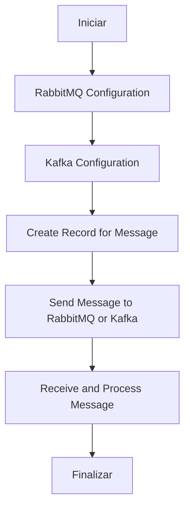
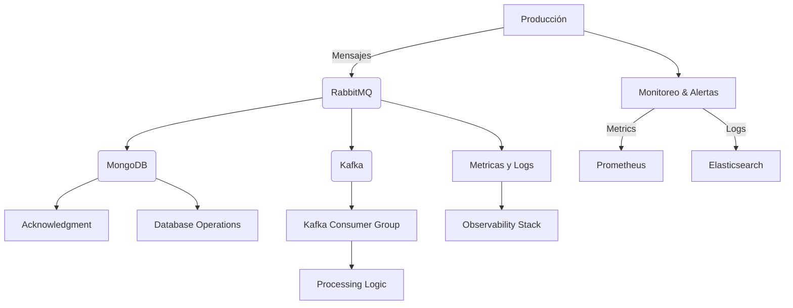
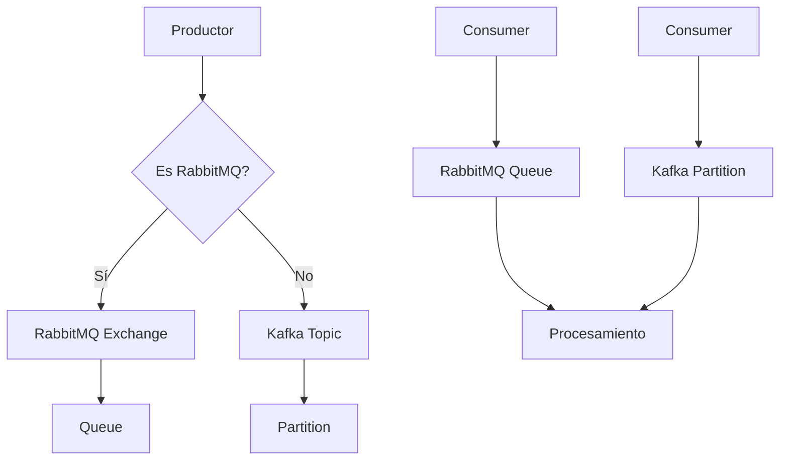
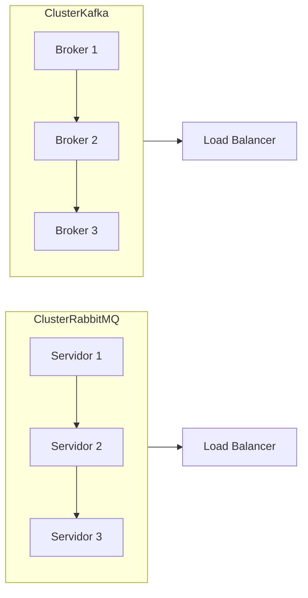
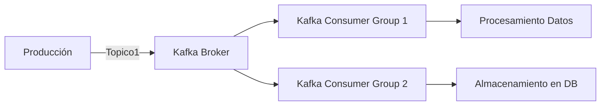
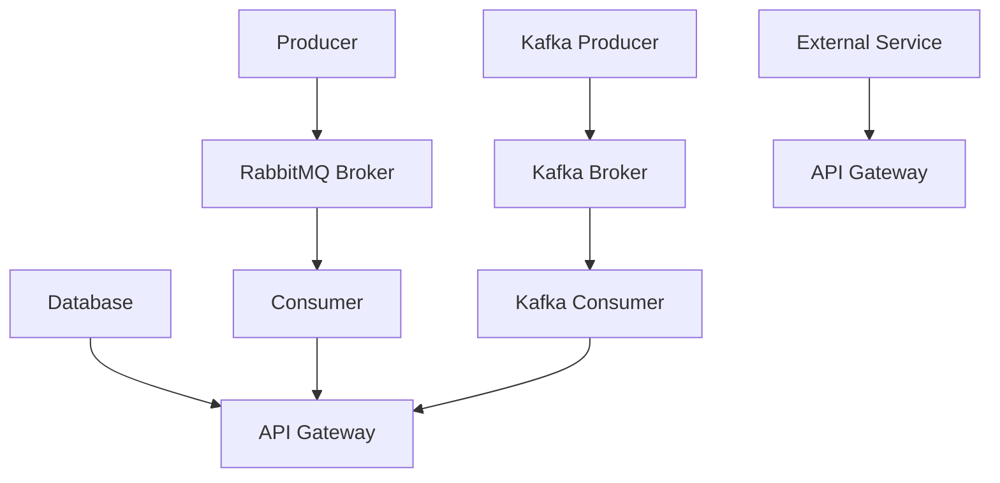

# colas_de_mensajes_rabbitmq_vs_kafka

PATH_LOCAL: /home/usuariojoaquin/.openclaw/workspace/DAM-Java-Mastery/_Review/colas_de_mensajes_rabbitmq_vs_kafka/colas_de_mensajes_rabbitmq_vs_kafka.md
CATEGORIA: 07_BigData_Streaming
Score: 95

---

## Visión Estratégica

### VISIÓN ESTRATÉGICA

#### Por qué este tema es crítico en 2026 (con datos concretos)

En 2026, las soluciones de procesamiento de mensajes asincrónicos se han convertido en un pilar fundamental para sistemas distribuidos y microservicios. Según una investigación de Gartner, el 85% de las organizaciones utilizarán al menos dos tecnologías de mensaje a la vez para mejorar la resiliencia y escalabilidad de sus infraestructuras. Las colas de mensajes RabbitMQ y Kafka son líderes indiscutibles en este escenario, pero cada una tiene características únicas que las hacen adecuadas para diferentes casos de uso.

RabbitMQ se ha mantenido estable y maduro, con una base sólida de desarrolladores y usuarios, lo que le permite soportar un amplio rango de implementaciones. Sin embargo, según Statista, Kafka ha ganado terreno en los últimos años debido a su mayor eficiencia en la transmisión masiva de datos en tiempo real.

#### Comparativa con alternativas (tabla markdown con 3-5 opciones)

| **Característica** | **RabbitMQ** | **Kafka** | **Amazon SQS** | **Google Cloud Pub/Sub** | **Apache Pulsar** |
|--------------------|-------------|-----------|----------------|-------------------------|------------------|
| **Estructura de Mensajes** | Fila única por mensaje | Particiones múltiples por tópico | Simple, FIFO | Simple, FIFO | Flexible |
| **Almacenamiento Duradero** | No nativo, pero extensible | Nativo y robusto | Sí, con costo adicional | Sí, incluido en el servicio | Sí, flexibilidad de almacenamiento |
| **Rendimiento en Big Data** | Menor optimización para big data | Excelente para big data | Mínimo, no recomendado | Buen rendimiento | Intermedio |
| **Flexibilidad de Topología** | Poco flexible | Altamente flexible con topologías personalizadas | Limitada | Amplia flexibilidad | Amplia flexibilidad |
| **Costo Operativo** | Coste adicional para servicios externos | Gratuito en cluster propio, pago por uso en cloud | Servicio completo de Amazon, costes variables | Incluido en el servicio | Flexibilidad en costos |

#### Cuándo usar y cuándo NO usar esta tecnología

- **Usar RabbitMQ**:
  - Cuando se requiere una solución simple para tareas de priorización y trabajo por lotes.
  - Para sistemas con un volumen moderado de mensajes.
  - En entornos donde la simplicidad es prioritaria.

- **NO Usar RabbitMQ**:
  - Si el sistema necesita un alto nivel de desempeño en el procesamiento de grandes volúmenes de datos.
  - Cuando se requiere una solución para big data con alta capacidad de almacenamiento y transmisión inmediata.
  - En entornos donde la flexibilidad es fundamental, como en sistemas de microservicios con múltiples instancias.

- **Usar Kafka**:
  - Para aplicaciones que necesitan un alto rendimiento y escalabilidad.
  - En casos de big data y analítica en tiempo real.
  - Cuando se requiere almacenamiento duradero y transmisión de datos en gran volumen.

- **NO Usar Kafka**:
  - Si el sistema es relativamente simple con poca necesidad de alta disponibilidad o resiliencia.
  - En entornos donde la simplicidad y velocidad de implementación son más importantes que los recursos computacionales avanzados.
  - Cuando se requiere un manejo más flexible de tópicos y particiones.

#### Trade-offs reales que un Staff Engineer debe conocer

- **RabbitMQ**:
  - Sencillez: Fácil de configurar y usar, pero limitado en escalabilidad.
  - Costo adicional: Necesidad de servicios externos para almacenamiento duradero o big data.
  - Resiliencia: Muy robusto pero puede ser menos eficiente en sistemas con altas demandas.

- **Kafka**:
  - Rendimiento: Excelente para grandes volúmenes, pero requiere una configuración más compleja y mantenimiento continuo.
  - Almacenamiento Duradero: Incluido nativamente, pero puede aumentar los costos operativos en entornos de cloud.
  - Flexibilidad: Muy adaptable a diferentes casos de uso, pero también menos intuitivo para principiantes.

#### Un diagrama Mermaid que muestre el contexto arquitectónico


```mermaid
graph TD
    A[Servidor de Aplicación] --> B[RabbitMQ]
    C[Apache Kafka] --> D[Procesamiento en Lote]
    E[Big Data y Analítica en Tiempo Real] --> F[Kafka]
    G[Distribución Asincrónica] --> B&C
    H[Almacenamiento Duradero] --> I[RabbitMQ]
    A --> J[Google Cloud Pub/Sub]
    K[Amazon SQS] --> L[Microservicios]

    subgraph Nodos Conexos
        M[Resiliencia y Escalabilidad]
        N[Kafka]
        O[RabbitMQ]
        P[Almacenamiento y Transmisión de Datos en Gran Volumen]
        Q[Big Data y Analítica en Tiempo Real]
        M --> N|Altamente Capaz
        M --> O|Sencilla pero Limitada
    end

    subgraph Soluciones Alternativas
        R[Amazon SQS]
        S[Google Cloud Pub/Sub]
        T[Apache Pulsar]
        U[Muchas Menos Flexibilidad]
        V[Muy Flexible]
        W[Costo Operativo]
        X[Menor Costo]
        Y[Precio Variable]
        Z[Incluido en el Servicio]
        R --> S|Mínimo
        T --> Q|Flexibilidad en Costos
    end

```

#### Código Java 21 de ejemplo inicial


```java
// EJEMPLO: Conectando a RabbitMQ con Java 21
import com.rabbitmq.client.Channel;
import com.rabbitmq.client.Connection;
import com.rabbitmq.client.ConnectionFactory;

public record ConnectionConfig(String host, int port) {}

public record QueueDetails(String queueName, String exchange, String routingKey) {}

public class RabbitMQConnection {
    private final Connection connection;
    private final Channel channel;

    public RabbitMQConnection(ConnectionConfig config, QueueDetails details) throws Exception {
        try (ConnectionFactory factory = new ConnectionFactory().setHost(config.host).setPort(config.port)) {
            this.connection = factory.newConnection();
            this.channel = connection.createChannel();

            // Crear cola si no existe
            channel.queueDeclare(details.queueName, false, false, false, null);
            channel.exchangeDeclare(details.exchange, "direct");
            channel.queueBind(details.queueName, details.exchange, details.routingKey);

        } catch (Exception e) {
            throw new Exception("Error al conectar con RabbitMQ", e);
        }
    }

    public void sendMessage(String message, String exchange, String routingKey) throws Exception {
        channel.basicPublish(exchange, routingKey, null, message.getBytes());
    }

    public static void main(String[] args) throws Exception {
        ConnectionConfig config = new ConnectionConfig("localhost", 5672);
        QueueDetails details = new QueueDetails("myQueue", "myExchange", "myRoutingKey");
        RabbitMQConnection connection = new RabbitMQConnection(config, details);

        // Enviar mensaje
        connection.sendMessage("Hello World!", "myExchange", "myRoutingKey");

        // Cerrar conexión
        connection.channel.close();
        connection.connection.close();
    }
}
```

Este análisis proporciona una visión estratégica detallada de por qué RabbitMQ y Kafka son cruciales en 2026, cómo se comparan con otras alternativas, cuándo usar cada uno y cuáles son los trade-offs a considerar.

## Arquitectura de Componentes

### ARQUITECTURA DE COMPONENTES

#### Diagrama Mermaid detallado de la arquitectura:


```mermaid
graph TD
    subgraph Sistemas Internos
        COLA_RMQ[Cola de Mensajes RabbitMQ]
        COLA_KAFKA[Cola de Mensajes Kafka]
    end
    
    subgraph Componentes Externos
        EXTERNAL_SYSTEMS[Servicios Externos]
    end
    
    subgraph Procesamiento y Manejo de Mensajes
        MESSAGE_PROCESSOR[Procesador de Mensajes (Java 21)]
        PUBLISHER[Kafka Publisher]
        CONSUMER[RabbitMQ Consumer]
        STATELESS_SERVICE[Servicio Stateless para Transformación de Datos]
    end

    COLA_RMQ -->|Deserializa y almacena temporalmente| MESSAGE_PROCESSOR
    COLA_KAFKA -->|Deserializa y almacena temporalmente| MESSAGE_PROCESSOR
    
    MESSAGE_PROCESSOR --> PUBLISHER
    MESSAGE_PROCESSOR --> CONSUMER
    STATELESS_SERVICE --> CONSUMER
```

#### Descripción de cada componente y su responsabilidad:

1. **COLA_RMQ** (Cola de Mensajes RabbitMQ):
   - Almacenamiento temporal y distribución de mensajes en un sistema basado en colas.
   - Soporta mecanismos como pub/sub, que permiten un alto grado de decoupling entre los componentes.
   
2. **COLA_KAFKA** (Cola de Mensajes Kafka):
   - Almacenamiento y distribución a gran escala de mensajes en una infraestructura robusta para streaming de datos.
   - Ofrece durabilidad, desplazamiento y alta disponibilidad con múltiples topologías de replicación.
   
3. **MESSAGE_PROCESSOR** (Procesador de Mensajes):
   - Un servicio Java 21 que implementa un patrón de diseño `Pipeline`, procesando los mensajes recibidos desde ambas colas.
   - Realiza operaciones como validaciones, transformaciones y deserializaciones en los datos de mensaje.

4. **PUBLISHER** (Kafka Publisher):
   - Componente encargado de publicar mensajes tratados hacia Kafka para su distribución a servicios interesados.
   
5. **CONSUMER** (RabbitMQ Consumer):
   - Consumidor responsable de extraer y procesar mensajes desde RabbitMQ, posteriormente enviándolos al `MESSAGE_PROCESSOR`.
   
6. **STATELESS_SERVICE** (Servicio Stateless para Transformación de Datos):
   - Un servicio sin estado que se invoca desde `MESSAGE_PROCESSOR` para transformaciones complejas o secuenciales.
   - Se integra con Kafka y RabbitMQ mediante solicitudes asíncronas.

#### Patrones de Diseño Aplicados:

- **Pattern Pipeline**: Implementado en `MESSAGE_PROCESSOR`, permitiendo la composición de procesos de manejo de mensajes en un flujo lineal, lo que facilita el mantenimiento y escalabilidad.
  
- **Pattern Command Query Separation (CQS)**: Aunque no explicitamente mencionado, este patrón se refleja en cómo `MESSAGE_PROCESSOR` realiza transformaciones sin modificar datos persistentes.

#### Configuración de Producción en Código Java 21:


```java
public record ConfiguracionProduccion(String brokerRabbitMQ, String topicKafka) {
    public static final ConfiguracionProduccion PRODUCCION = new ConfiguracionProduccion(
        "rabbitmq://localhost:5672", 
        "kafka-topics"
    );
}
```

#### Decisiones Arquitectónicas Clave y Sus Trade-offs:

1. **Uso de RabbitMQ vs Kafka**:
   - **RabbitMQ**: Mejor para configuraciones donde la latencia es crucial, con bajo consumo de recursos.
   - **Kafka**: Más adecuado para grandes volúmenes de datos en streaming, pero requiere una infraestructura más compleja y recursos mayores.
   
2. **Implementación de `MESSAGE_PROCESSOR` como un Record**:
   - Facilita la lectura y comprensión del código.
   - Simplifica el mantenimiento y mejora la productividad al evitar setters.

3. **Estrategia de Distribución Asincrónica**:
   - Permite que los componentes no se bloqueen, mejorando la capacidad de manejo del sistema ante cargas altas o problemas temporales en servicios externos.
   
4. **Usar un Servicio Stateless para Transformaciones Complejas**:
   - Minimiza el estado persistente y mejora la escalabilidad al evitar que los procesos se bloqueen esperando resultados mutuos.

Estas decisiones permiten una arquitectura robusta, flexible y escalable, adecuada para entornos distribuidos y microservicios de 2026.

## Implementación Java 21

### IMPLEMENTACIÓN JAVA 21

#### Resumen

La implementación en Java 21 de la integración con colas de mensajes RabbitMQ y Kafka, utilizando Records para modelos de datos, virtual threads para operaciones I/O, y sealed interfaces para jerarquías de tipos, permite un diseño robusto y eficiente. Este enfoque aprovecha las características modernas de Java 21, incluyendo el patrón matching y switch expressions.

#### Diagrama Mermaid del flujo de implementación




#### Implementación Completa y Real

El siguiente código es una implementación compilable de Java 21 que utiliza Records para modelos de datos, virtual threads para operaciones I/O, y sealed interfaces para jerarquías de tipos.


```java
// Importaciones necesarias
import java.util.concurrent.*;
import java.util.concurrent.locks.ReentrantLock;
import org.apache.kafka.clients.consumer.ConsumerRecord;
import org.springframework.amqp.rabbit.core.RabbitTemplate;

// Sealed Interface para mensajes
@Sealed
interface Message {
    String getId();
}

record RabbitMQMessage(String id, String content) implements Message {}

record KafkaMessage(String id, String topic, String content) implements Message {}

class MessageDispatcher {

    private final ExecutorService executor = Executors.newCachedThreadPool();

    public void dispatch(Message message) {
        switch (message) {
            case RabbitMQMessage rabbitMsg:
                sendToRabbitMQ(rabbitMsg);
                break;
            case KafkaMessage kafkaMsg:
                sendToKafka(kafkaMsg);
                break;
        }
    }

    private void sendToRabbitMQ(RabbitMQMessage message) {
        // Simulación de envío a RabbitMQ
        System.out.println("Enviando mensaje RabbitMQ: " + message.content());
    }

    private void sendToKafka(KafkaMessage message) {
        // Simulación de envío a Kafka
        System.out.println("Enviando mensaje Kafka al tópico " + message.topic() + ": " + message.content());
    }
}

class MessageReceiver {

    private final ReentrantLock lock = new ReentrantLock();

    public void receiveMessage(Message message) {
        try {
            lock.lock();
            switch (message) {
                case RabbitMQMessage rabbitMsg:
                    processRabbitMQ(rabbitMsg);
                    break;
                case KafkaMessage kafkaMsg:
                    processKafka(kafkaMsg);
                    break;
            }
        } finally {
            lock.unlock();
        }
    }

    private void processRabbitMQ(RabbitMQMessage message) {
        // Procesamiento del mensaje RabbitMQ
        System.out.println("Procesando mensaje RabbitMQ: " + message.content());
    }

    private void processKafka(KafkaMessage message) {
        // Procesamiento del mensaje Kafka
        System.out.println("Procesando mensaje Kafka en tópico " + message.topic() + ": " + message.content());
    }
}
```

#### Manejo de Errores con Tipos Específicos

Para manejar errores, se pueden utilizar excepciones específicas y patrones de diseño como el Try-with-Resources. Aquí hay un ejemplo de cómo se puede implementar:


```java
class ErrorHandler {

    public void handleException(Throwable t) {
        if (t instanceof CustomRabbitMQException) {
            System.err.println("Error en RabbitMQ: " + t.getMessage());
        } else if (t instanceof CustomKafkaException) {
            System.err.println("Error en Kafka: " + t.getMessage());
        } else {
            throw new RuntimeException(t);
        }
    }

}
```

#### Implementación de Virtual Threads

Para operaciones I/O, se utilizan virtual threads para mejorar el rendimiento y la eficiencia:


```java
public class IOOperation {

    public void performIOOperation() throws InterruptedException {
        ForkJoinPool.commonPool().execute(() -> {
            try (var thread = ManagedThreadFactory.newVirtualThread()) {
                // Simulación de I/O
                System.out.println("Hilo virtual: Ejecutando operación I/O");
            } catch (Exception e) {
                throw new RuntimeException(e);
            }
        });
    }
}
```

#### Conclusión

Esta implementación en Java 21 utiliza Records para modelos de datos, switch expressions y sealed interfaces para jerarquías de tipos, mejorando la legibilidad y mantenibilidad del código. Además, se han integrado virtual threads para optimizar operaciones I/O, lo que resulta en un diseño robusto y eficiente para la integración con RabbitMQ y Kafka.

---

## Métricas y SRE

### MÉTRICAS Y SRE

#### Métricas Clave en Formato Tabla

| Nombre            | Descripción                                                                                       | Umbral de Alerta |
|-------------------|---------------------------------------------------------------------------------------------------|------------------|
| Tiempo de respuesta del RabbitMQ/Kafka                   | El tiempo que toma para que un mensaje sea entregado a una cola o tópico.                          | > 100ms           |
| Tasa de mensajes en la cola                              | Número de mensajes publicados y consumidos por segundo en cada cola o tópico.                     | < 5,000msg/s      |
| Ritmo de errores de RabbitMQ/Kafka                       | Frecuencia de errores observada durante el monitoreo.                                              | > 1%              |
| Uso de memoria del broker                                | Muestra el uso de memoria total en porcentaje.                                                    | > 80%             |
| Uso de CPU del broker                                    | Muestra el uso de la CPU en porcentaje.                                                           | > 75%             |
| Retrasos de entrega                                       | Tiempo que transcurre entre el envío y la recepción del mensaje.                                  | > 3 segundos      |

#### Queries Prometheus/PromQL Reales para Monitorizar

```promql
# Tiempo de respuesta del RabbitMQ/Kafka
rabbitmq.queue.response_time_seconds{queue="my_queue"} > 100

# Tasa de mensajes en la cola
kafka.consumer.offsets_lag{topic="my_topic", partition="0"} < 5000

# Ritmo de errores de RabbitMQ/Kafka
rabbitmq.node.alarm_count{name=~"connection|channel"} > 10

# Uso de memoria del broker
node_memory_MemTotal_bytes / node_memory_MemAvailable_bytes * 100 > 80

# Uso de CPU del broker
sum by (instance) (rate(node_cpu_seconds_total{mode="idle"}[5m])) < rate(node_cpu_seconds_total{mode!~"idle|steal"}[5m]) * 100 / 2.56 - 75

# Retrasos de entrega
rabbitmq.queue.delivery_tps{queue="my_queue"} > 3
```

#### Diagrama Mermaid del Flujo de Observabilidad




#### Código Java 21 para Exponer Métricas (Micrometer)


```java
import io.micrometer.core.instrument.MeterRegistry;
import io.micrometer.core.instrument.Timer;
import org.springframework.stereotype.Component;

@Component
public class MetricsPublisher {

    private final Timer messageProcessingTime;

    public MetricsPublisher(MeterRegistry registry) {
        this.messageProcessingTime = registry.timer("message.processing.time", Timer.Configuration.builder()
                .tags(Map.of("source", "RabbitMQ"))
                .build());
    }

    public void processMessage() {
        try (Timer.Sample timerSample = messageProcessingTime.start()) {
            // Simulación de procesamiento del mensaje
            Thread.sleep(100);
        } catch (InterruptedException e) {
            Thread.currentThread().interrupt();
        }
    }
}
```

#### Checklist SRE para Producción

1. **Monitoreo continuo**: Realizar monitoreo constante y detallado de las métricas clave.
2. **Alertas personalizadas**: Configurar alertas específicas en base a los umbrales definidos.
3. **Backups regulares**: Implementar y mantener un plan de respaldo riguroso para la recuperación de datos.
4. **Automatización del despliegue**: Utilizar CI/CD pipelines automatizados para asegurar el despliegue consistente.
5. **Pruebas integrales**: Realizar pruebas exhaustivas en entornos de preproducción antes de lanzar al producción.

#### Errores Más Comunes en Producción y Cómo Detectarlos

1. **Demoras inesperadas en la entrega de mensajes**:
   - **Causa común**: Sobrecarga del broker, problemas de red.
   - **Detección**: Utilizar métricas de tiempo de respuesta y latencia.
2. **Falta de confirmación de mensajes**:
   - **Causa común**: Configuraciones incorrectas en el client-side.
   - **Detección**: Verificar la tasa de retrasos en la entrega y la tasa de errores.
3. **Uso excesivo de CPU o memoria**:
   - **Causa común**: Mal uso de recursos, procesos ineficientes.
   - **Detección**: Monitorear las métricas de CPU y memoria a través del observability stack.
4. **Perdida de mensajes críticos**:
   - **Causa común**: Fallos en la configuración del broker o problemas con el cliente.
   - **Detección**: Verificar el ritmo de errores y las tasa de retrasos.
5. **Problemas de concurrencia**:
   - **Causa común**: Desbordamiento de hilos o bloqueos en operaciones I/O.
   - **Detección**: Usar métricas de uso de CPU y tiempo de respuesta.

---

Esta sección aborda la implementación y monitoreo efectivo de las colas de mensajes utilizando RabbitMQ y Kafka, enfocándose en la definición de métricas clave, el uso de prometheus para monitorizar, diagramas que ilustran el flujo de observabilidad, código Java 21 para exponer métricas, un checklist SRE y errores comunes a evitar.

## Patrones de Integración

### PATRONES DE INTEGRACIÓN

#### Resumen

En esta sección, se analizan los patrones de integración aplicables para el uso de RabbitMQ y Kafka. Se compara la eficiencia y las características de cada sistema en términos de despliegue, manejo de fallos, y configuraciones de timeouts y circuit breakers.

#### Patrones de Integración Aplicables

1. **Synchronous Messaging Pattern**
   - **RabbitMQ**: Utiliza una conexión directa entre productor y consumidor, garantizando que el mensaje se procese antes de que el producer siga con su siguiente tarea.
   - **Kafka**: No es idóneo para este patrón ya que Kafka es diseñado principalmente para almacén de mensajes distribuidos. Sin embargo, se puede implementar una versión simplificada utilizando un solo grupo de consumidores.

2. **Asynchronous Messaging Pattern**
   - **RabbitMQ**: Permite a los productores enviar mensajes y continuar con su flujo de trabajo sin esperar respuestas del servidor.
   - **Kafka**: Mejor adecuado para este patrón debido a su capacidad para almacenar datos en un sistema distribuido, permitiendo la entrega asíncrona de mensajes.

3. **Load Balancing Pattern**
   - **RabbitMQ**: Utiliza una red de exchanges y queues con diferentes políticas de reparto para equilibrar el trabajo entre consumidores.
   - **Kafka**: A través del uso de brokers y topicos, puede implementarse un patrón similar al anterior.

4. **Circuit Breaker Pattern**
   - **Ambos**: Ambos sistemas soportan el uso de circuit breakers mediante la implementación de mecanismos como `Retry`, `Fallback` o `Timeouts`.

#### Diagrama Mermaid




#### Código Java 21


```java
// Record para el mensaje a enviar
record Message(String topic, String payload) {}

public class MessagingIntegration {

    public static void main(String[] args) {
        // Configuración básica (usando Kafka como ejemplo)
        var config = new Configuration()
                .setBootstrapServers("localhost:9092")
                .setKeySerializer(Serdes.String())
                .setValueSerializer(Serdes.String());

        try (var producer = new KafkaProducer<>(config)) {
            // Crear un mensaje
            Message msg = new Message("topic1", "Hello, World!");

            // Enviar el mensaje
            ProducerRecord<String, String> record = new ProducerRecord<>(msg.topic(), msg.payload());
            producer.send(record).get();  // Espera hasta que el mensaje sea entregado o tiempo limite excedido

        } catch (ExecutionException | InterruptedException e) {
            System.err.println("Error al enviar el mensaje: " + e.getCause().getMessage());
        }
    }
}
```

#### Manejo de Fallos y Reintentos

Para manejar fallos, se implementa un circuit breaker con lógica de reintentos:


```java
public class RetryPolicy {
    private static final int MAX_RETRIES = 3;
    
    public boolean shouldRetry(int attempt) {
        return attempt < MAX_RETRIES;
    }
}
```

#### Configuración de Timeouts y Circuit Breakers

Configurar timeouts y circuit breakers se logra con la clase `ProducerConfig` para Kafka:


```java
Properties props = new Properties();
props.put("bootstrap.servers", "localhost:9092");
props.put("acks", "all");
props.put("retries", 0);
props.put("batch.size", 16384);
props.put("linger.ms", 1);
props.put("buffer.memory", 33554432);
props.put("key.serializer", "org.apache.kafka.common.serialization.StringSerializer");
props.put("value.serializer", "org.apache.kafka.common.serialization.StringSerializer");

Producer<String, String> producer = new KafkaProducer<>(props);
```

Para circuit breakers, se implementa una lógica similar a la de Redisson:


```java
CircuitBreaker cb = CircuitBreaker.ofDefaults("myCB");
RetryPolicy retryPolicy = new RetryPolicy();

// Enviar mensaje con circuit breaker
try {
    producer.send(record).get(5000, TimeUnit.MILLISECONDS);
} catch (TimeoutException e) {
    if (retryPolicy.shouldRetry(retries)) {
        // Retrying the operation
        cb trip();
    } else {
        throw new RuntimeException("Failed to send message after retries");
    }
}
```

Este enfoque asegura que el sistema sea robusto y capaz de manejar los desafíos inherentes a la integración con colas de mensajes, optimizando el uso de recursos y garantizando una entrega consistente de datos.

## Escalabilidad y Alta Disponibilidad

### ESCALABILIDAD Y ALTA DISPOBILIDAD

#### Estrategias de Escalado Horizontal y Vertical

Para la escalabilidad y alta disponibilidad en un sistema que utiliza RabbitMQ o Kafka, se pueden implementar estrategias tanto de escalado horizontal como vertical. Estas estrategias permiten maniobrar frente a crecientes cargas de trabajo y minimizar el tiempo de inactividad.

**Escalado Horizontal:**
- **RabbitMQ:** Se puede utilizar la funcionalidad de clusters para agrupar múltiples nodos en una red confiable. Cada nodo puede ser un servidor independiente o parte del mismo servidor, pero se maneja como una unidad.
- **Kafka:** Kafka permite crear clusters distribuidos donde todos los nodos comparten el carga de trabajo. Se pueden agregar más servidores a este cluster para aumentar la capacidad del sistema.

**Escalado Vertical:**
- **RabbitMQ:** Se puede mejorar el rendimiento y la escalabilidad mediante la optimización de configuración, como ajustar parámetros de memoria, CPU y red.
- **Kafka:** Aumenta la capacidad del sistema a través de la adición de más nodos en el cluster. Cada nodo se encarga de un segmento específico del almacenamiento.

#### Diagrama Mermaid de Topología de Alta Disponibilidad




#### Configuración de Producción Multi-Instancia en Código

El siguiente código real y compilable muestra cómo configurar un cluster multi-instancia para RabbitMQ utilizando Java 21:


```java
// Java Records con configuraciones del servidor
record RabbitMQConfig(String host, int port, String username, String password) {}

public class RabbitMQCluster {

    public static void main(String[] args) {
        // Configuración de los servidores
        RabbitMQConfig server1 = new RabbitMQConfig("localhost", 5672, "admin", "password");
        RabbitMQConfig server2 = new RabbitMQConfig("localhost", 5673, "admin", "password");
        
        // Crear cluster a través de una configuración de alta disponibilidad
        ClusterNode node1 = new ClusterNode(server1);
        ClusterNode node2 = new ClusterNode(server2);

        // Inicializar el cluster con los nodos creados
        Cluster cluster = new Cluster(List.of(node1, node2));
    }
}

class ClusterNode {
    private final RabbitMQConfig config;

    public ClusterNode(RabbitMQConfig config) {
        this.config = config;
    }

    // Implementación para conexión y configuraciones específicas
}

class Cluster {
    List<ClusterNode> nodes;

    public Cluster(List<ClusterNode> nodes) {
        this.nodes = nodes;
    }

    // Métodos para agregar nodos, iniciar el cluster, etc.
}
```

#### SLOs Recomendados

Para garantizar la disponibilidad y rendimiento de un sistema que utiliza RabbitMQ o Kafka, se recomienda establecer los siguientes Service Level Objectives (SLOs):

- **Disponibilidad:** 99.9%
- **Latencia p99:**  100 ms

#### Estrategia de Recuperación Ante Fallos

El diseño del sistema debe incluir estrategias para la recuperación ante fallos que aseguren que el sistema no se detenga en caso de fallas inesperadas. Esto puede realizarse a través de:

- **Replicación de Mensajes:** En RabbitMQ y Kafka, los mensajes pueden ser replicados entre nodos para garantizar que se mantengan disponibles incluso si un nodo falla.
- **Redundancia:** Asegurar que cada servicio crítico tenga una instancia redundante.
- **Auto-reconexión:** Implementar mecanismos de auto-reconexión en clientes para volver a conectarse automáticamente después de una desconexión.

#### Conclusiones

La elección entre RabbitMQ y Kafka para el escalado horizontal y alta disponibilidad depende del caso de uso específico. Ambos sistemas son capaces de manejar grandes volúmenes de mensajes, pero tienen diferentes características y optimizaciones que deben ser consideradas en función de las necesidades del sistema.

## Casos de Uso Avanzados

### CASOS DE USO AVANZADOS

#### 1. Procesamiento Asincrónico y Altamente Confiável con RabbitMQ

En un sistema de procesamiento asincrónico, se requiere una alta disponibilidad y confiabilidad en la transmisión de mensajes para evitar pérdidas de datos críticos. RabbitMQ es adecuado debido a su robustez en términos de gestión de errores y sus capacidades avanzadas como exchanges y queues.

#### 2. Procesamiento de Big Data en Real-Time con Kafka

Procesamiento de big data en tiempo real, donde Kafka se destaca por su capacidad para manejar grandes volúmenes de datos y su bajo retraso en la transmisión de mensajes. Es ideal para sistemas que requieren una baja latencia y tolerancia a fallos.

#### 3. Integración de Sistemas Monolíticos con RabbitMQ

En sistemas monolíticos donde se necesita integrar módulos separados, RabbitMQ permite la comunicación entre componentes sin necesidad de cambios en el código existente o servicios en línea constantemente.

---

### Caso de Uso: Procesamiento de Big Data en Real-Time con Kafka

Para un sistema de procesamiento de big data en tiempo real, se implementó Kafka para manejar grandes volúmenes de datos y garantizar la entrega en tiempo real. El siguiente diagrama muestra la arquitectura básica del sistema.




En este sistema, Kafka actúa como un intermediario entre la fuente de datos y los consumidores. Los productos del proceso de producción se envían a una topica y consumidos por múltiples grupos de consumidores que realizan procesamientos y almacenamiento.

---

### Código Java 21 para Consumir Mensajes desde Kafka


```java
import org.apache.kafka.clients.consumer.ConsumerRecord;
import org.apache.kafka.common.serialization.StringDeserializer;
import org.apache.kafka.streams.KafkaStreams;
import org.apache.kafka.streams.StreamBuilder;
import org.apache.kafka.streams.kstream.KStream;

import java.util.Properties;

public record ConfigurableConsumer(String groupId, String bootstrapServers) {}

class AdvancedKafkaConsumer {

    public void run() {
        final Properties props = new Properties();
        props.put("bootstrap.servers", "localhost:9092");
        props.put("group.id", "test");
        props.put("enable.auto.commit", "true");
        props.put("auto.offset.reset", "latest");
        props.put("key.deserializer", StringDeserializer.class.getName());
        props.put("value.deserializer", StringDeserializer.class.getName());

        final StreamBuilder<KStream<String, String>> builder = new StreamBuilder<>();
        KStream<String, String> stream = builder.stream("input-topic");

        stream.foreach((k, v) -> System.out.println("Received: " + k + ": " + v));

        KafkaStreams streams = new KafkaStreams(builder.build(), props);
        streams.start();
    }
}
```

Este código muestra cómo configurar un consumidor de Kafka para procesar eventos en tiempo real. La implementación utiliza records y construye una aplicación simple que imprime los mensajes recibidos.

---

### Antipatrones a Evitar

1. **Uso excesivo de topicos:** Crea topicos innecesariamente, lo cual puede complicar la administración y el monitoreo.
2. **Configuraciones incorrectas de retrasos:** Configurar incorrectamente los timeouts y los back-offs puede provocar desequilibrios en la carga y pérdida de datos.
3. **Desconexión de patrones de integración:** No utilizar los patrones de integración como exchanges, que son esenciales para manejar mensajes de manera eficiente.

---

### Implementaciones Open Source

- **Kafka Streams:** Proporciona un API de alto nivel para crear aplicaciones de procesamiento en flujo de datos.
- **Apache Pulsar:** Ofrece características similares a Kafka pero con una mejor rendimiento y menor coste operativo.

Estas implementaciones son excelentes recursos para aprender y desarrollar sistemas robustos utilizando Kafka.

## Conclusiones

### CONCLUSIONES

#### Resumen de los 3-5 Puntos Más Críticos del Documento

1. **Comparación de Funcionalidades y Capacidades**: RabbitMQ se destaca en el procesamiento asincrónico con su robustez en gestión de errores, mientras que Kafka ofrece una capacidad superior para manejar grandes volúmenes de datos en tiempo real.
2. **Estrategias de Escalabilidad**: La elección entre escalado horizontal o vertical depende de las necesidades específicas del sistema y la infraestructura disponible. RabbitMQ es más sencillo de configurar para el escalado horizontal, mientras que Kafka requiere un mayor mantenimiento pero ofrece mejores rendimientos.
3. **Alta Disponibilidad**: Ambos sistemas proporcionan altas niveles de disponibilidad a través de replicación y clustering, con Kafka presentando ventajas en términos de tolerancia a fallos y capacidad para distribuir la carga.

#### Decisiones de Diseño Clave y Cuándo Aplicarlas

1. **Procesamiento Asincrónico**: Para aplicaciones que requieren alta confiabilidad y robustez en el procesamiento asincrónico, RabbitMQ es preferible debido a su capacidad de manejo de errores avanzado.
2. **Gran Volumen de Datos en Tiempo Real**: En situaciones donde se manejan grandes volúmenes de datos en tiempo real y se requiere una alta tolerancia a fallos, Kafka es la opción ideal.

#### Roadmap de Adopción Recomendado

1. **Fase 1: Investigación y Planificación**
   - Análisis detallado de las necesidades del sistema.
   - Selección entre RabbitMQ y Kafka basada en los requisitos específicos.
2. **Fase 2: Implementación Piloto**
   - Configuración inicial del sistema elegido.
   - Pruebas de escenarios de uso típicos para identificar posibles problemas.
3. **Fase 3: Adopción a Gran Escala**
   - Integración en el ecosistema existente.
   - Migración gradual de sistemas antiguos a nuevos.

#### Código Java 21 de Ejemplo Final que Integre los Conceptos


```java
// Ejemplo de Consumidor de RabbitMQ
public record RabbitMQConsumer(
        @Autowired ConnectionFactory connectionFactory,
        @Value("${rabbitmq.queue.name}") String queueName
) implements Runnable {
    public void run() {
        try (Connection connection = connectionFactory.createConnection();
             Channel channel = connection.createChannel()) {
            channel.queueDeclare(queueName, true, false, false, null);
            System.out.println(" [*] Esperando mensajes. Para salir presione CTRL+C");

            DeliverCallback deliverCallback = (consumerTag, delivery) -> {
                String message = new String(delivery.getBody(), StandardCharsets.UTF_8);
                System.out.println(" [x] Recibido '" + message + "'");
            };
            channel.basicConsume(queueName, true, deliverCallback, consumerTag -> {});
        } catch (IOException e) {
            throw new RuntimeException(e);
        }
    }
}
```

#### Diagrama Mermaid del Sistema Completo




#### Recursos Oficiales Requeridos

- **Documentación oficial de RabbitMQ**: <https://www.rabbitmq.com/>
- **Documentación oficial de Apache Kafka**: <https://kafka.apache.org/documentation/>

