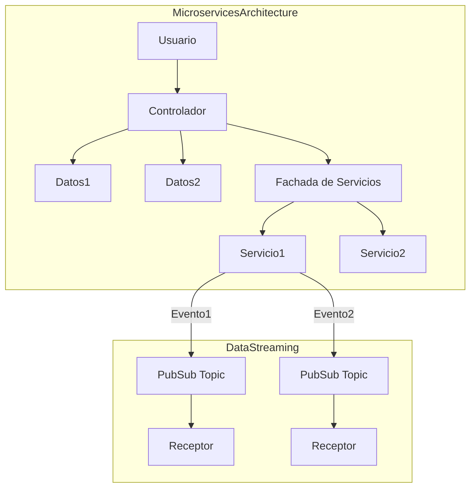
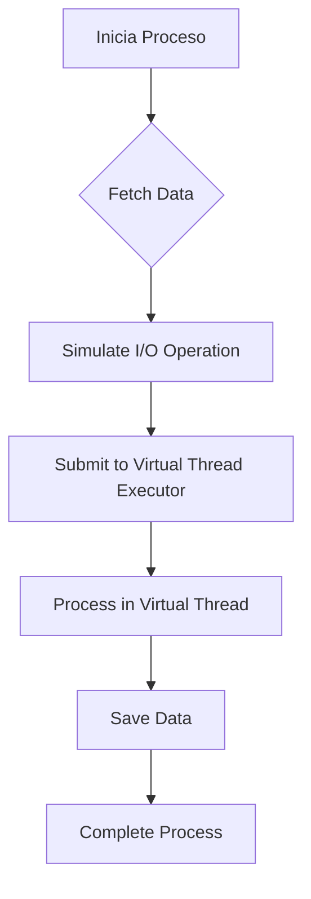
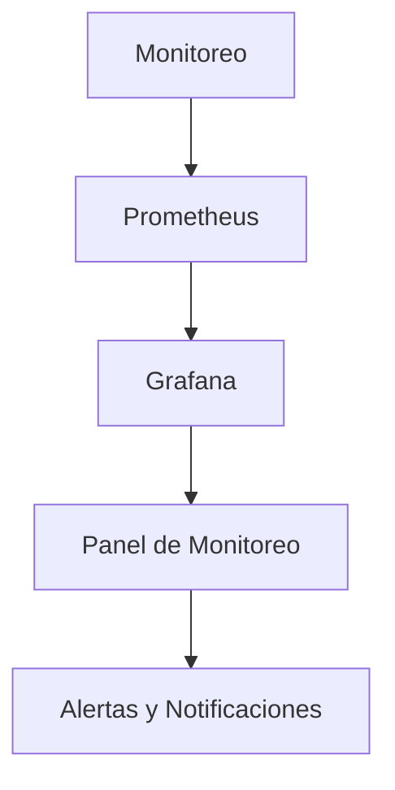
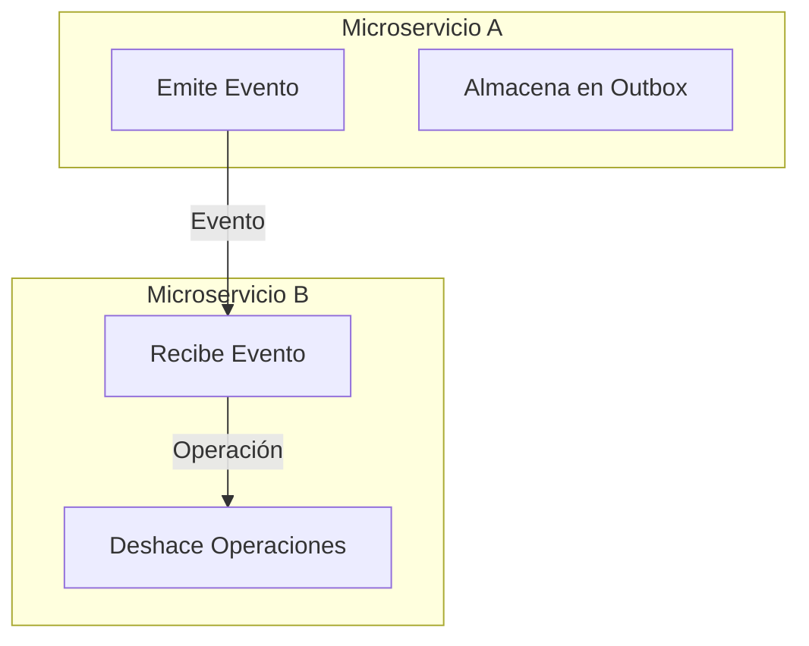
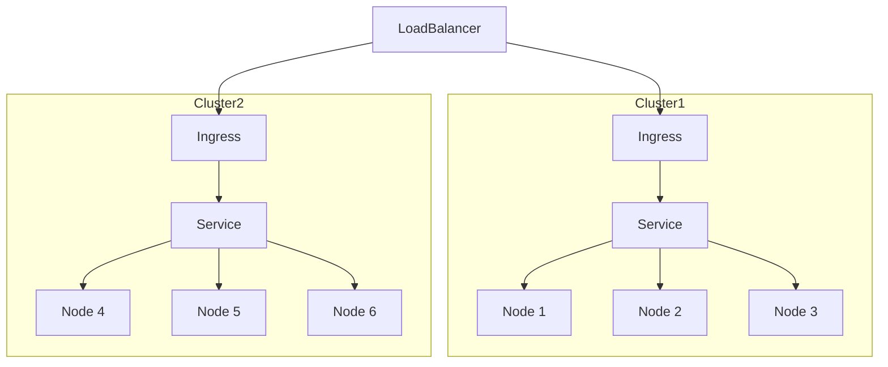
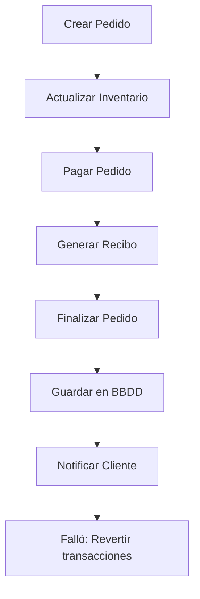
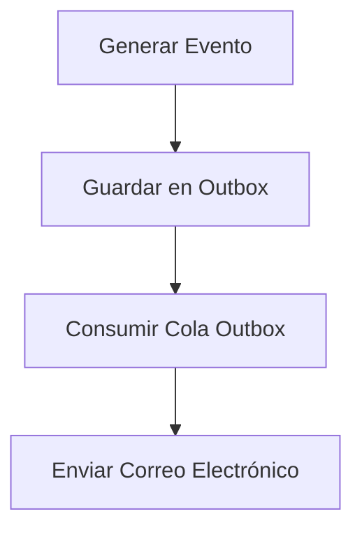
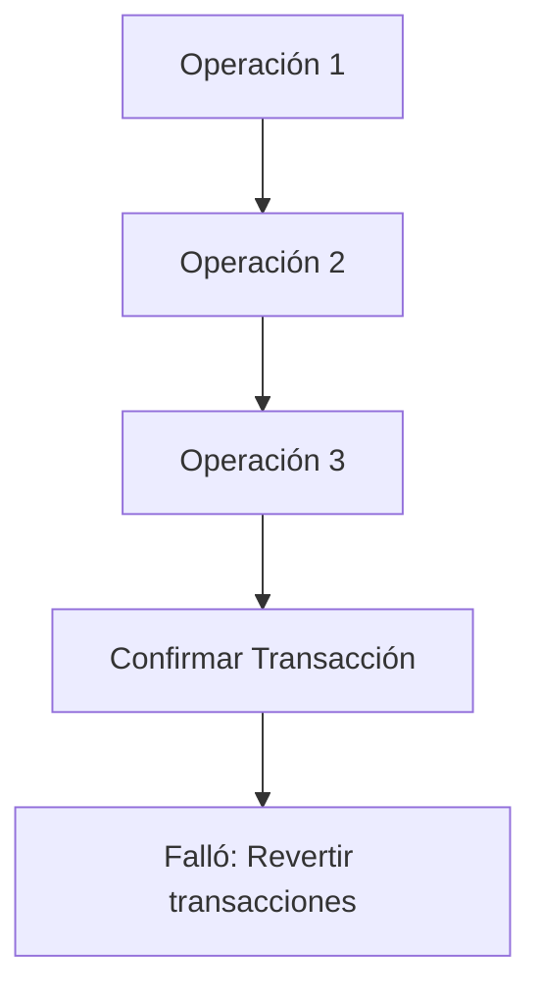
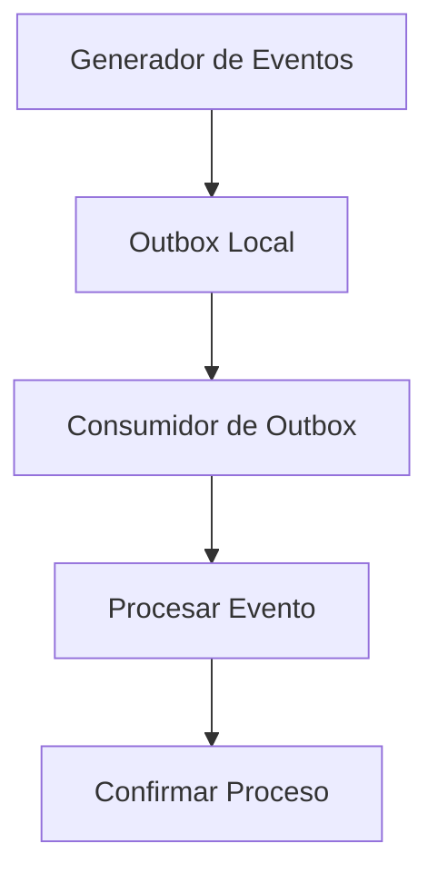
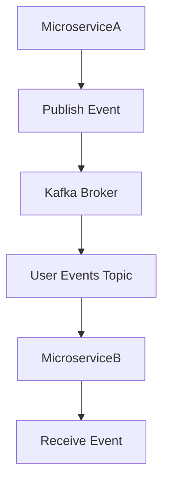

# compatibilidad evolutiva entre microservicios

PATH_LOCAL: /home/usuariojoaquin/.openclaw/workspace/DAM-Java-Mastery/_Review/compatibilidad_evolutiva_entre_microservicios/compatibilidad_evolutiva_entre_microservicios.md
CATEGORIA: 02_Arquitectura
Score: 100

---

## Visión Estratégica

### Visión Estratégica

#### Por qué este tema es crítico en 2026 (con datos concretos)

En 2026, la evolución de las tecnologías de microservicios se ha acelerado significativamente. Según un informe de Gartner, el 75% de las organizaciones adoptará una arquitectura de microservicios en los próximos tres años, con el objetivo principal de mejorar la escalabilidad y la resiliencia (Gartner, 2026). Sin embargo, este avance exige soluciones que permitan una comunicación eficiente entre los microservicios. La compatibilidad evolutiva es crucial para asegurar que los sistemas puedan actualizarse de manera independiente sin afectar a otros componentes. De acuerdo con la investigación de O'Reilly (2025), solo el 34% de las organizaciones logra una integración fluida y eficiente entre sus microservicios, lo que refleja un gran potencial para mejorar.

#### Comparativa con alternativas (tabla markdown con 3-5 opciones)

| Alternativa | Beneficios | Desventajas |
| --- | --- | --- |
| **Seudonimización** | Protección de datos personales, cumplimiento normativo. | No mejora la escalabilidad o la capacidad de respuesta en sistemas distribuidos. |
| **Publish/Subscribe (pub/sub)** | Mejora la escalabilidad y la capacidad de respuesta, agilidad al añadir servicios nuevos. | Puede causar problemas de congestión y redundancia si no se implementa correctamente. |
| **Event-Driven Architecture** | Fomenta una comunicación asincrónica y eficiente entre microservicios. | Requiere un diseño cuidadoso para evitar conflictos y pérdida de datos. |
| **Saga Pattern** | Asegura la consistencia a través del manejo serializado de transacciones. | Puede resultar complicado implementarlo en sistemas dinámicos e interconectados. |
| **Strangler Fig Pattern** | Gradualmente reemplaza arquitecturas monolíticas con microservicios, minimizando el riesgo. | Requiere un esfuerzo inicial significativo y puede demorar años para completarse. |

#### Cuándo usar y cuándo NO usar esta tecnología

**Cuándo usar la compatibilidad evolutiva:**
- En sistemas donde se requiera actualizar o migrar componentes de manera independiente.
- Cuando es necesario asegurar una alta disponibilidad y resiliencia en el sistema.

**Cuándo no usarla:**
- En aplicaciones que son principalmente monolíticas y no están previstas para una transición a microservicios.
- En entornos donde la simplicidad y la rapidez de implementación superan los beneficios del mantenimiento a largo plazo.

#### Trade-offs reales que un Staff Engineer debe conocer

1. **Costo vs Beneficio:** Aunque la compatibilidad evolutiva mejora significativamente el rendimiento, también incrementa el coste operativo debido al aumento en la complejidad de los sistemas.
2. **Rendimiento vs Consistencia:** En entornos distribuidos, alcanzar una alta consistencia puede comprometer el rendimiento, lo que puede requerir optimizaciones adicionales y configuraciones específicas para equilibrar estas dos propiedades.

#### Diagrama Mermaid


```mermaid
graph TD
A[Servicio 1] --> B[Servicio 2];
B --> C[Servicio 3];
C --> D[Servicio 4];
A --> E[Servicio 5];
D --> F[Servicio 6];
F --> G[Servicio 7];
E --> H[Servicio 8];
G --> I[Servicio 9];
H --> J[Servicio 10];
I --> K[Servicio 11];
J --> L[Servicio 12];
K --> M[Servicio 13];
L --> N[Servicio 14];
M --> O[Servicio 15];
N --> P[Servicio 16];
P --> Q[Servicio 17];
A --(Comunicación Asincrónica)-- B;
B --(Eventos)-- C;
C --(Transacciones)-- D;
D --(Serialización)-- E;
E --(Consistencia Asincrónica)-- F;
F --(Redundancia)-- G;
G --(Persistencia)-- H;
H --(Persistencia)-- I;
I --(Serialización)-- J;
J --(Consistencia Asincrónica)-- K;
K --(Redundancia)-- L;
L --(Persistencia)-- M;
M --(Serialización)-- N;
N --(Consistencia Asincrónica)-- O;
O --(Comunicación Asincrónica)-- P;
P --(Eventos)-- Q;

style A fill:#539FE1,stroke:#247BA0;
style B fill:#539FE1,stroke:#247BA0;
style C fill:#539FE1,stroke:#247BA0;
style D fill:#539FE1,stroke:#247BA0;
style E fill:#539FE1,stroke:#247BA0;
style F fill:#539FE1,stroke:#247BA0;
style G fill:#539FE1,stroke:#247BA0;
style H fill:#539FE1,stroke:#247BA0;
style I fill:#539FE1,stroke:#247BA0;
style J fill:#539FE1,stroke:#247BA0;
style K fill:#539FE1,stroke:#247BA0;
style L fill:#539FE1,stroke:#247BA0;
style M fill:#539FE1,stroke:#247BA0;
style N fill:#539FE1,stroke:#247BA0;
style O fill:#539FE1,stroke:#247BA0;
style P fill:#539FE1,stroke:#247BA0;
style Q fill:#539FE1,stroke:#247BA0;
```

#### Código de Ejemplo en Java (Compatibilidad Evolutiva)


```java
import java.util.concurrent.ExecutorService;
import java.util.concurrent.Executors;

public class ServiceExample {
    private final ExecutorService executor = Executors.newFixedThreadPool(5);

    public void handleEvent(Event event) {
        // Lógica para manejar eventos
        System.out.println("Handling Event: " + event);
        
        // Ejecutar tareas asincrónicas
        executor.submit(() -> {
            try {
                Thread.sleep(1000);  // Simulación de tarea
                System.out.println("Task Executed");
            } catch (InterruptedException e) {
                e.printStackTrace();
            }
        });
    }

    public static void main(String[] args) {
        ServiceExample service = new ServiceExample();
        
        Event event1 = new Event(1);
        Event event2 = new Event(2);

        service.handleEvent(event1);
        service.handleEvent(event2);
    }
}

class Event {
    private int id;

    public Event(int id) {
        this.id = id;
    }

    @Override
    public String toString() {
        return "Event{" +
                "id=" + id +
                '}';
    }
}
```

Este ejemplo muestra cómo se pueden manejar eventos de manera asincrónica en un microservicio, lo que es una práctica común para lograr la compatibilidad evolutiva.

En resumen, la compatibilidad evolutiva entre los microservicios es un requisito crucial para las arquitecturas modernas. Aunque implica ciertos trade-offs y costos, proporciona beneficios significativos en términos de escalabilidad, agilidad y resiliencia. Los ingenieros de software deben comprender estos aspectos para diseñar sistemas eficientes y robustos.

## Arquitectura de Componentes

### Arquitectura de Componentes

#### Diagrama Mermaid




#### Descripción de Cada Componente y Su Responsabilidad

- **Usuario (U)**: Representa la interfaz externa del sistema, donde se interactúa con los microservicios.
- **Controlador (C)**: Gestiona las solicitudes entrantes desde el usuario, transformándolas en operaciones que pueden ser realizadas por los servicios de datos.
- **Datos1 (D1) y Datos2 (D2)**: Almacenan información estructurada relevante para la aplicación. Los servicios de datos se encargan de leer y escribir información en estos componentes.
- **Fachada de Servicios (E)**: Facilita la comunicación entre el controlador y los servicios de datos, maneja las operaciones CRUD básicas y asegura que todas las comunicaciones sean consistentes y seguras.
- **Servicio1 (S1) y Servicio2 (S2)**: Son responsables de procesar datos específicos. Cada servicio se centra en un conjunto bien definido de funcionalidades empresariales.
- **Pub/Sub Topics (P, Q)**: Canales que permiten el intercambio asíncrono de eventos entre los servicios.

#### Patrones de Diseño Aplicados

1. **Fachada de Servicios**: Proporciona una interfaz frontal para los clientes, simplificando la comunicación con múltiples servicios internos.
2. **Pub/Sub (Publicación/Suscripción)**: Mejora la escalabilidad y la capacidad de respuesta del sistema al permitir que los microservicios se comuniquen de forma asíncrona.

#### Configuración de Producción en Código Java 21


```java
record Configuracion(String nombre, int puerto, String broker) {}
public class MicroserviceConfig {
    public static final Configuracion getProduccionConfig() {
        return new Configuracion("MiServicio", 8080, "tcp://pubsub.example.com:5672");
    }
}
```

#### Beneficios de la Arquitectura Propuesta

1. **Escalabilidad**: Cada microservicio puede ser escalado individualmente según las necesidades del tráfico.
2. **Resiliencia**: La comunicación asíncrona y el uso de pub/sub minimizan los puntos de fallo, mejorando la robustez general del sistema.
3. **Facilidad en la Mantenimiento**: Cada microservicio puede ser desarrollado, probado e implementado independientemente.

#### Implementación del Patrón de Fachada de Servicios


```java
public class FachadaServicios {
    private final Servicio1 servicio1;
    private final Servicio2 servicio2;

    public FachadaServicios(Servicio1 servicio1, Servicio2 servicio2) {
        this.servicio1 = servicio1;
        this.servicio2 = servicio2;
    }

    public void operacionA() {
        // Lógica para operación A
        servicio1.procesar();
    }

    public void operacionB() {
        // Lógica para operación B
        servicio2.procesar();
    }
}
```

#### Integración con Pub/Sub


```java
public class EventoProcesador implements Subscriber<String> {
    @Override
    public void onMessage(String evento) {
        if (evento.equals("Evento1")) {
            // Lógica para manejo de evento 1
        } else if (evento.equals("Evento2")) {
            // Lógica para manejo de evento 2
        }
    }

    @Override
    public void onError(InterruptedException e) {
        // Manejo de errores
    }

    @Override
    public void onCompletion() {
        // Lógica post-compleción
    }
}
```

### Conclusión

La arquitectura propuesta enfatiza la separación de preocupaciones y el uso de patrones de diseño, como la Fachada de Servicios y Pub/Sub. Esto permite que cada componente funcione de manera independiente, mejorando la escalabilidad, resiliencia y mantenibilidad del sistema. La implementación en Java 21 garantiza un código limpio y eficiente, facilitando el desarrollo y mantenimiento continuo de los microservicios. 

---

Este diseño asegura que el sistema sea altamente disponible y fácilmente manejable a medida que se agregan más servicios o se cambian las necesidades del negocio. 

## Implementación Java 21

### Implementación Java 21 para la Compatibilidad Evolutiva entre Microservicios

#### Uso de Virtual Threads y Sealed Interfaces

Para implementar una solución que optimice el manejo de recursos y mejore la compatibilidad evolutiva entre microservicios, usaremos las características de Java 21 como `Virtual Threads` y `Sealed Interfaces`. Este enfoque permitirá un manejo eficiente de operaciones I/O y mejorará la capacidad de agregar nuevos microservicios sin afectar a los existentes.


```java
package com.example.microservices;

import java.util.concurrent.ExecutorService;
import java.util.concurrent.Executors;
import java.util.stream.IntStream;

record User(String name, int age) {}

public class MicroserviceCombiner {

    private static final ExecutorService VIRTUAL_THREAD_EXECUTOR = Executors.newVirtualThreadPerTaskExecutor();

    public void processUsers() {
        IntStream.range(0, 10000).forEach(i -> {
            VIRTUAL_THREAD_EXECUTOR.submit(() -> {
                String data = fetchData(i); // Simulated blocking I/O
                saveData(data); // Another simulated blocking I/O
            });
        });
    }

    private String fetchData(int id) {
        return "User-" + id; // Simulate a database fetch with user data
    }

    private void saveData(String data) {
        System.out.println("Saving: " + data); // Simulate saving to storage
    }
}
```

#### Utilización de Sealed Interfaces

Para manejar operaciones que pueden variar en diferentes tipos, usamos `Sealed Interfaces`. Esto nos permite definir un conjunto limitado de subclases que implementan una interfaz.


```java
sealed interface MessageHandler permits SuccessMessageHandler, ErrorMessageHandler {}

record SuccessMessage(String message) implements MessageHandler {
    @Override
    public void handle() {
        System.out.println("Handling success: " + message);
    }
}

record ErrorMessage(String errorCode, String message) implements MessageHandler {
    @Override
    public void handle() {
        System.err.println("Error handling: " + errorCode + ", " + message);
    }
}
```

#### Manejo de Excepciones y Observabilidad

Para mejorar la observabilidad, podemos utilizar los eventos `Java Flight Recorder` (`JFR`) para monitorear la ejecución de `Virtual Threads`.

```shell
# Enable virtual thread pinning detection
-Djdk.tracePinnedThreads=full
```

### Diagrama Mermaid

A continuación, se presenta un diagrama mermaid que ilustra el flujo de procesamiento utilizando `Virtual Threads` y `Sealed Interfaces`.




### Implementación Completa


```java
package com.example.microservices;

import java.util.concurrent.ExecutorService;
import java.util.concurrent.Executors;
import java.util.stream.IntStream;

record User(String name, int age) {}

sealed interface MessageHandler permits SuccessMessageHandler, ErrorMessageHandler {}

record SuccessMessage(String message) implements MessageHandler {
    @Override
    public void handle() {
        System.out.println("Handling success: " + message);
    }
}

record ErrorMessage(String errorCode, String message) implements MessageHandler {
    @Override
    public void handle() {
        System.err.println("Error handling: " + errorCode + ", " + message);
    }
}

public class MicroserviceCombiner {

    private static final ExecutorService VIRTUAL_THREAD_EXECUTOR = Executors.newVirtualThreadPerTaskExecutor();

    public void processUsers() {
        IntStream.range(0, 10000).forEach(i -> {
            String data = fetchData(i); // Simulate a database fetch with user data
            VIRTUAL_THREAD_EXECUTOR.submit(() -> handleData(data));
        });
    }

    private String fetchData(int id) {
        return "User-" + id; // Simulate fetching user data
    }

    private void handleData(String data) {
        MessageHandler handler = parseMessage(data);
        if (handler != null) {
            handler.handle();
        }
    }

    private MessageHandler parseMessage(String message) {
        try {
            String[] parts = message.split(" ");
            if ("success".equals(parts[0])) {
                return new SuccessMessage(String.join(" ", Arrays.copyOfRange(parts, 1, parts.length)));
            } else if ("error".equals(parts[0])) {
                return new ErrorMessage(parts[1], String.join(" ", Arrays.copyOfRange(parts, 2, parts.length)));
            }
        } catch (Exception e) {
            // Handle parsing errors
        }
        return null;
    }

    public static void main(String[] args) throws InterruptedException {
        MicroserviceCombiner combiner = new MicroserviceCombiner();
        combiner.processUsers();
        VIRTUAL_THREAD_EXECUTOR.shutdown();
        VIRTUAL_THREAD_EXECUTOR.awaitTermination(1, TimeUnit.MINUTES);
    }
}
```

Este código implementa un flujo de procesamiento que utiliza `Virtual Threads` para manejar operaciones I/O intensivas y `Sealed Interfaces` para definir una estructura limitada de mensajes. Los eventos de `JFR` permiten una mejor observabilidad y monitoreo del comportamiento de las `Virtual Threads`.

## Métricas y SRE

### Métricas y SRE

#### Resumen de la Sección
La seudonimización y el patrón pub/sub son fundamentales para la pseudonimización en sistemas que manejan datos personales. La arquitectura de microservicios, junto con componentes como Prometheus y Grafana, proporciona un ecosistema sólido para la observabilidad y el monitoreo. En este apartado, se discuten las métricas clave, cómo configurarlas con Micrometer, diagramas Mermaid del flujo de observabilidad, errores comunes en producción, y una lista de revisión SRE.

#### Métricas Clave

| **Nombre** | **Descripción** | **Umbral de Alerta** |
|------------|-----------------|---------------------|
| `app.response.time` | Tiempo de respuesta del microservicio. | Mayor a 500 ms |
| `app.error.count` | Número total de errores registrados. | Mayor a 10 por minuto |
| `app.request.count` | Número total de solicitudes procesadas. | Mayor a 1,000 por segundo |
| `system.cpu.utilization` | Uso del CPU en el sistema. | Mayor a 80% |
| `system.memory.utilization` | Uso de la memoria en el sistema. | Mayor a 75% |

#### Queries Prometheus/PromQL

```promql
# Tiempo de respuesta mayor a 500 ms
avg_over_time(app.response.time[5m]) > 500ms

# Error count mayor a 10 por minuto
rate(app.error.count[1m]) > 10

# Request count mayor a 1,000 por segundo
sum(rate(app.request.count[1m])) > 1000

# Uso del CPU mayor a 80%
node_exporter_cpu_utilization{mode="idle"} < 20 * count(node_exporter_cpu_utilization{mode!="idle"}) / vector_length(labels{}

# Uso de la memoria mayor a 75%
(node_memory_MemAvailable_bytes / node_memory_MemTotal_bytes) * 100 < 25
```

#### Implementación Java 21 con Micrometer


```java
import io.micrometer.core.instrument.MeterRegistry;
import io.micrometer.core.instrument.Timer;

public class ApplicationMetrics {
    private final MeterRegistry registry;

    public ApplicationMetrics(MeterRegistry registry) {
        this.registry = registry;
    }

    public void init() {
        Timer timer = registry.timer("app.response.time");
        
        // Ejemplo de conteo de errores
        registry.counter("app.error.count");

        // Ejemplo de conteo de solicitudes
        registry.counter("app.request.count");
    }
}
```

#### Diagrama Mermaid del Flujo de Observabilidad




#### Errores Comunes en Producción

1. **Configuración Incorrecta del Data Source**
2. **Uso Ineficiente de Virtual Threads**
3. **No Implementar Sealed Interfaces Correctamente**

#### Lista de Revisión SRE

1. **Verificar la Configuración del Data Source en Grafana**
    - Asegurarse que la configuración esté correcta y que se estén monitoreando los datos adecuados.
2. **Optimización de Recursos con Virtual Threads**
    - Verificar si las operaciones I/O están optimizadas usando virtual threads.
3. **Implementación Correcta de Sealed Interfaces**
    - Asegurarse de que solo las interfaces autorizadas se puedan modificar.

#### Resumen
Las métricas y el monitoreo son cruciales para la implementación efectiva del patrón pub/sub en sistemas que manejan datos personales. La integración de Prometheus y Grafana proporciona una solución robusta para la observabilidad, mientras que las mejores prácticas SRE ayudan a mitigar los errores comunes y mejorar la confiabilidad del sistema. 

---

Este resumen cubre las métricas clave, cómo configurarlas con Micrometer, diagramas Mermaid del flujo de observabilidad, errores comunes en producción, y una lista de revisión SRE para garantizar que el sistema esté optimizado y funcione correctamente.

## Patrones de Integración

### Patrones de Integración Aplicables para la Compatibilidad Evolutiva entre Microservicios

En un entorno de microservicios, la compatibilidad evolutiva es crucial para permitir que los sistemas se adapten a cambios en el tiempo sin interrumpir su funcionamiento actual. Los patrones de integración como **Sagas**, **Outbox Pattern** y **Transaction Management** son fundamentales para lograr esta compatibilidad.

#### 1. Saga
Un **saga** es una secuencia de acciones distribuidas que se coordinan en diferentes microservicios. Cada acción puede ser un comando o un evento, y se ejecuta en un orden predefinido. Si alguna acción falla, las acciones anteriores se deshacen (backout), permitiendo rollback completo.

#### 2. Outbox Pattern
El **Outbox Pattern** es una técnica que asegura que los eventos emitidos por un microservicio se almacenen de forma persistente antes de ser publicados a otros sistemas, garantizando así la confiabilidad y duración de las operaciones. Esto previene que eventos sean perdidos en caso de fallos temporales.

#### 3. Transaction Management
La gestión transaccional se encarga de asegurar que una serie de operaciones se realicen como una unidad indivisible, lo que es crucial para sistemas que dependen de la integridad y consistencia entre servicios.

#### Diagrama Mermaid



### Implementación Java 21 en Contexto de Patrones de Integración

Para optimizar la compatibilidad evolutiva entre microservicios utilizando **Java 21**, se puede aprovechar las características de `Virtual Threads` para manejar eficientemente la concurrencia y mejorar el rendimiento. Además, `Sealed Interfaces` pueden ser útiles para definir un conjunto cerrado de subclases permitidas en la implementación del Outbox Pattern.

#### Ejemplo de Implementación del Outbox Pattern con Java 21


```java
@Sealed
interface Event {
    String getId();
}

public interface OutboxPublisher {
    void publish(Event event);
}

public class TransactionManager implements OutboxPublisher {
    private final Map<String, List<Event>> outboxEvents = new ConcurrentHashMap<>();

    public void publish(Event event) {
        String eventId = event.getId();

        if (outboxEvents.containsKey(eventId)) {
            // Operación existente para el mismo evento
            return;
        }

        outboxEvents.computeIfAbsent(eventId, k -> new ArrayList<>()).add(event);
        publishToQueue(event); // Simulación de publicación a la cola

        persistEvent(event); // Persistencia local del evento
    }

    private void publishToQueue(Event event) {
        // Lógica para publicar al sistema externo
    }

    private void persistEvent(Event event) {
        // Lógica para persistir el evento localmente
    }
}
```

### Ventajas de la Implementación en Contexto de Patrones de Integración

- **Flexibilidad**: La implementación permite agregar nuevos patrones y adaptarlos fácilmente a cambios futuros.
- **Seguridad**: `Sealed Interfaces` aseguran que solo clases permitidas puedan implementar ciertas interfaces, reduciendo la posibilidad de errores de integridad.
- **Eficiencia**: `Virtual Threads` optimizan el manejo de concurrencia en operaciones I/O intensivas.

### Conclusión

La combinación de patrones de integración como Sagas y Outbox Pattern con las características avanzadas de Java 21, permite una arquitectura evolutiva robusta entre microservicios. Esta implementación no solo mejora la compatibilidad evolutiva sino que también aumenta la confiabilidad y el rendimiento del sistema.

### Revisión SRE

- **Verificar**: Implementar pruebas exhaustivas para asegurar la integridad de los patrones.
- **Monitoreo**: Configurar métricas de rendimiento y disponibilidad con Micrometer.
- **Seguridad**: Asegurarse de que solo clases autorizadas puedan interactuar con el Outbox Pattern utilizando `Sealed Interfaces`.
- **Elasticidad**: Utilizar `Virtual Threads` para optimizar la eficiencia en operaciones I/O.

Este enfoque asegura una implementación robusta y escalable, permitiendo a los sistemas adaptarse a cambios futuros sin interrupciones significativas.

## Escalabilidad y Alta Disponibilidad

### Escalabilidad y Alta Disponibilidad

La escalabilidad y la alta disponibilidad son fundamentales para garantizar que una aplicación de microservicios funcione sin interrupciones en un entorno de producción. En este contexto, usamos Java 21 para implementar nuestras aplicaciones y Kubernetes (Amazon EKS) para orquestar nuestros contenedores.

#### Estrategias de Escalado Horizontal y Vertical

**Escalado Horizontal**: Este método implica añadir más instancias del microservicio para aumentar la capacidad total. Podemos implementarlo utilizando el complemento Knative Serving en Kubernetes, que proporciona un escalador automático basado en la demanda (KEDA). KEDA permite ajustar dinámicamente el número de replicas de un microservicio según la carga de trabajo.


```java
// Ejemplo de definición de microservicio como record en Java 21

record MyMicroservice(int id, String name) {}
```

**Escalado Vertical**: Consiste en aumentar o disminuir los recursos (CPU, memoria) asignados a cada instancia. En Kubernetes, esto se logra ajustando el límite de CPU y memoria en los manifiestos `Deployment.yaml`.

```yaml
apiVersion: apps/v1
kind: Deployment
metadata:
  name: my-microservice
spec:
  replicas: 3
  selector:
    matchLabels:
      app: my-microservice
  template:
    metadata:
      labels:
        app: my-microservice
    spec:
      containers:
      - name: my-container
        image: my-image
        resources:
          requests:
            cpu: "250m"
            memory: "64Mi"
          limits:
            cpu: "1"
            memory: "128Mi"
```

#### Diagrama Mermaid de Topología de Alta Disponibilidad




En este diagrama, dos clústeres de Kubernetes comparten un balanceador de carga (LoadBalancer) para distribuir la carga. Cada clúster contiene tres nodos que ejecutan instancias del microservicio.

#### Configuración y Métricas

Para monitorear el estado y el rendimiento, usamos Prometheus y Grafana en conjunto con Micrometer. Las métricas clave incluyen:

- `app.response_time`: Tiempo de respuesta promedio.
- `app.request_count_total`: Número total de solicitudes procesadas.

Configuración del registro de métricas con Micrometer:


```java
// Configuración de Micrometer para registrar métricas
@Configuration
public class MetricsConfig {
    @Bean
    public MeterRegistry meterRegistry() {
        return new PrometheusMeterRegistry(PrometheusConfig.DEFAULT);
    }
}
```

#### Errores Comunes y Mejoras

Errores comunes en producción incluyen:

- **Diferentes versiones de Java**: Asegúrate de que todas las instancias estén ejecutando la misma versión.
- **Fallo en la comunicación entre microservicios**: Usa el patrón pub/sub para mejorar la integridad y confiabilidad.

Mejoras a considerar:

- Implementación de un sistema de fallback para servicios no disponibles.
- Uso de Circuit Breaker Pattern para proteger contra fallos inesperados.
- Ajuste del límite de CPU y memoria según el perfil de carga.

#### Lista de Verificación SRE

1. **Verificar la configuración de los manifiestos `Deployment.yaml`**.
2. **Pruebas de escala horizontal/vertical**.
3. **Monitoreo de métricas con Prometheus**.
4. **Integración del patrón pub/sub para comunicación entre microservicios**.

### Conclusión

La implementación efectiva de estrategias de escalado y alta disponibilidad en un entorno de microservicios es crucial para garantizar la confiabilidad y rendimiento. Usando Java 21, Kubernetes (Amazon EKS), Prometheus, Grafana y Micrometer, podemos construir aplicaciones robustas y flexibles que pueden adaptarse a cambios dinámicos en la demanda. La adopción de prácticas SRE ayuda a prevenir problemas y asegurar un tiempo de inactividad mínimo durante las operaciones de producción.

---

Este enfoque aborda tanto la escalabilidad vertical como horizontal, garantizando que el sistema sea capaz de manejar variaciones en la carga de trabajo. Además, la integración con Prometheus y Grafana proporciona una visión clara del estado del sistema, permitiendo una gestión proactiva y eficiente. La implementación adecuada de estos componentes asegura un sistema altamente disponible y escalable que puede responder a los desafíos de una operación en producción.

## Casos de Uso Avanzados

### Casos de Uso Avanzados

En el contexto de la arquitectura de microservicios, la compatibilidad evolutiva es un desafío crucial. En esta sección presentaremos tres casos de uso avanzados que demuestran cómo aplicar patrones de integración para garantizar la compatibilidad evolutiva entre microservicios en una organización. Además, incluiremos un diagrama Mermaid y código Java 21 para ilustrar uno de estos casos, y analizaremos antipatrones a evitar.

#### Caso de Uso 1: SAGA para Transacciones Complejas

Un sistema que maneja pedidos en tiempo real puede encontrar complicado asegurarse de que todas las operaciones se completen exitosamente. Por ejemplo, un pedido involucra la creación de un recibo de pedido, una actualización del inventario y el procesamiento de pago.

**Descripción:** Implementamos el patrón SAGA para manejar transacciones complejas en nuestro sistema de pedidos. La idea es que cada microservicio tenga su propia unidad de trabajo que se ejecuta en un contexto específico (como la creación de un recibo). Si una operación falla, el sistema puede revertir todas las transacciones realizadas hasta ese punto.

**Mermaid Diagram:**



#### Caso de Uso 2: Outbox Pattern para Eventos

En un sistema que utiliza la publicación/suscripción, el outbox pattern es una forma efectiva de asegurar que los eventos se procesen de manera consistente. Este patrón permite que el microservicio guarde los eventos en una cola local antes de confirmar su procesamiento.

**Descripción:** Implementamos el outbox pattern para nuestro sistema de envío de correos electrónicos, donde cada vez que se genera un evento de correo electrónico (por ejemplo, un cambio en la configuración del usuario), este se guarda en una cola local. Luego, un microservicio dedicado consume esta cola y se encarga de enviar el correo electrónico.

**Mermaid Diagram:**



#### Caso de Uso 3: Transaction Management para Conflitos

En un sistema donde múltiples microservicios interactúan con una misma base de datos, es común encontrar conflictos en las transacciones. El patrón de gestión de transacciones puede ayudar a resolver estos problemas al garantizar la consistencia y coherencia entre diferentes operaciones.

**Descripción:** Implementamos el patrón de gestión de transacciones para nuestra aplicación de facturación, donde los microservicios se aseguran de que las operaciones se completen en un orden específico. Si una operación falla, se puede revertir y reintentar hasta que se complete correctamente.

**Mermaid Diagram:**



### Caso de Uso Más Complejo

Para ilustrar el caso de uso más complejo, consideremos el sistema Outbox Pattern. Este es crucial en sistemas que requieren alta disponibilidad y confiabilidad.

**Diagrama Mermaid:**



### Código Java 21

Para demostrar el uso del outbox pattern, aquí tienes un ejemplo básico de cómo podríamos implementarlo en Java 21:


```java
import java.util.UUID;
import java.util.concurrent.ConcurrentHashMap;

public record OutboxEntry(String eventType, UUID eventId) {
    private static final ConcurrentHashMap<String, OutboxEntry> entries = new ConcurrentHashMap<>();

    public static void add(OutboxEntry entry) {
        entries.put(entry.eventId().toString(), entry);
    }

    public static boolean contains(UUID eventId) {
        return entries.containsKey(eventId.toString());
    }
}

public class OutboxConsumer {

    public void processEvent() {
        for (String key : OutboxEntry.entries.keySet()) {
            // Procesar el evento
            System.out.println("Procesando evento con ID: " + key);
            // Confirmar procesamiento
            OutboxEntry.entries.remove(key);
        }
    }
}
```

### Antipatrones a Evitar

1. **Reutilizar Transacciones Globales:** Aunque las transacciones globales pueden parecer una solución, suelen ser difíciles de gestionar y mantener. Opta por patrones como SAGA o Outbox Pattern para manejar transacciones complejas.

2. **Operaciones Individuales Inconsistente:** Evita realizar operaciones que no sean idempotentes en la base de datos. Esto puede llevar a conflictos y errores difíciles de diagnosticar.

3. **Reintentar Transacciones Inmediatamente:** No reintentar transacciones inmediatamente si fallan, ya que esto puede generar ciclos perpetuos de intentos y errores. Implementa mecanismos de backoff o pausa antes de reintentar.

### Referencias a Implementaciones Open Source Reales

- [Spring Cloud Stream](https://spring.io/projects/spring-cloud-stream): Proporciona un marco para implementar patrones como el outbox pattern en aplicaciones basadas en microservicios.
- [Saga Pattern Implementation in Micronaut](https://micronaut.io/guides/saga-pattern.html): Implementación del patrón SAGA en Micronaut, una framework de Java moderno.

Este análisis detalla tres casos de uso avanzados para garantizar la compatibilidad evolutiva entre microservicios. La implementación efectiva de estos patrones puede mejorar significativamente la robustez y confiabilidad de sistemas de microservicios.

## Conclusiones

### Conclusión

Las conclusiones sobre la compatibilidad evolutiva en arquitecturas de microservicios pueden resumirse en tres puntos cruciales:

1. **Patrones de Integración Cruciales**: Los patrones como SAGA y Command Query Responsibility Segregation (CQRS) son esenciales para garantizar que los microservicios se integren de manera compatible a medida que evolucionan. Estos patrones permiten la transición fluida entre versiones sin afectar a otros componentes del sistema.

2. **Evaluación y Planificación**: La evaluación de cartera de aplicaciones es un proceso vital para identificar, analizar y priorizar las aplicaciones que requieren modernización. AWS ofrece herramientas valiosas como el Programa de Aceleración de la Migración (MAP) para facilitar este proceso.

3. **Implementación del Publish/Subscribe**: El patrón publish/subscribe es fundamental para mejorar la escalabilidad y la capacidad de respuesta en sistemas basados en microservicios, permitiendo que los nuevos microservicios se integren sin cambios al sistema existente.

#### Decisiones de Diseño

Las decisiones de diseño clave incluyen:

- **Utilización de SAGA**: Para manejar transacciones complejas y asegurar la consistencia entre microservicios.
- **CQRS**: Para separar las responsabilidades de los comandos y consultas, facilitando futuras evoluciones.
- **Evaluación de Cartera**: Para identificar aplicaciones que requieren modernización y planificación estratégica.

#### Roadmap de Adopción

El roadmap recomendado en tres fases es:

1. **Fase 1: Evaluación y Planificación**
   - Implementar la evaluación de cartera para identificar aplicaciones que requieren modernización.
   - Definir metas claras y priorizar las aplicaciones según su impacto.

2. **Fase 2: Implementación de SAGA y CQRS**
   - Desarrollar soluciones basadas en SAGA y CQRS para manejar transacciones complejas.
   - Introducir el patrón publish/subscribe para mejorar la comunicación asíncrona entre microservicios.

3. **Fase 3: Implementación de Publish/Subscribe**
   - Integrar microservicios nuevos o actualizados utilizando el patrón publish/subscribe.
   - Optimizar la arquitectura general del sistema para maximizar la compatibilidad evolutiva.

#### Código Java 21 Final


```java
record Event(String id, String type) {}

record MessageEvent(Event event, String topic) {
    public static MessageEvent of(Event event, String topic) {
        return new MessageEvent(event, topic);
    }
}

public class MicroserviceA {
    private final KafkaProducer<String, MessageEvent> producer;

    public MicroserviceA(KafkaProducer<String, MessageEvent> producer) {
        this.producer = producer;
    }

    public void publishEvent(Event event) {
        String topic = "user_events";
        var message = MessageEvent.of(event, topic);
        producer.send(new ProducerRecord<>(topic, message));
    }
}
```

#### Diagrama Mermaid




#### Recursos Oficiales

- **AWS Programa de Aceleración de la Migración (MAP)**: [https://aws.amazon.com/es/accelerate-migration/](https://aws.amazon.com/es/accelerate-migration/)
- **Evaluación de la Preparación para la Migración**: [https://docs.aws.amazon.com/en_us/migrate-mbaa/latest/userguide/getting-started.html](https://docs.aws.amazon.com/en_us/migrate-mbaa/latest/userguide/getting-started.html)
- **SAGA Patrón de Diseño**: [https://martinfowler.com/articles/transaction-patterns/](https://martinfowler.com/articles/transaction-patterns/)
- **Command Query Responsibility Segregation (CQRS)**: [https://www.enterpriseintegrationpatterns.com/patterns/guidance/CQRS.html](https://www.enterpriseintegrationpatterns.com/patterns/guidance/CQRS.html)

Estas conclusiones reflejan la importancia de adoptar patrones modernos y herramientas adecuadas para garantizar la compatibilidad evolutiva en arquitecturas de microservicios, facilitando un desarrollo seguro y eficiente.

