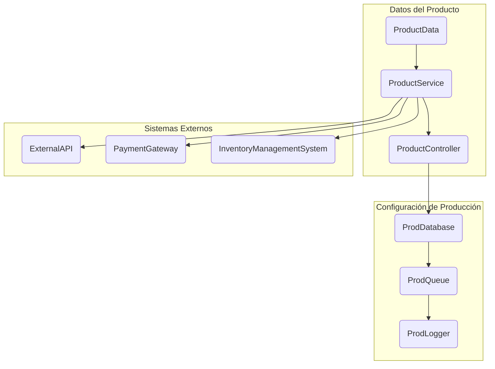
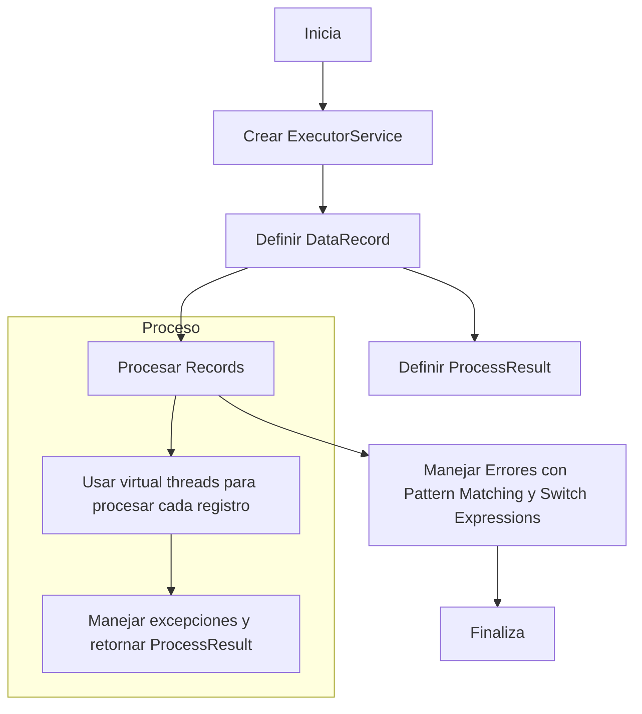
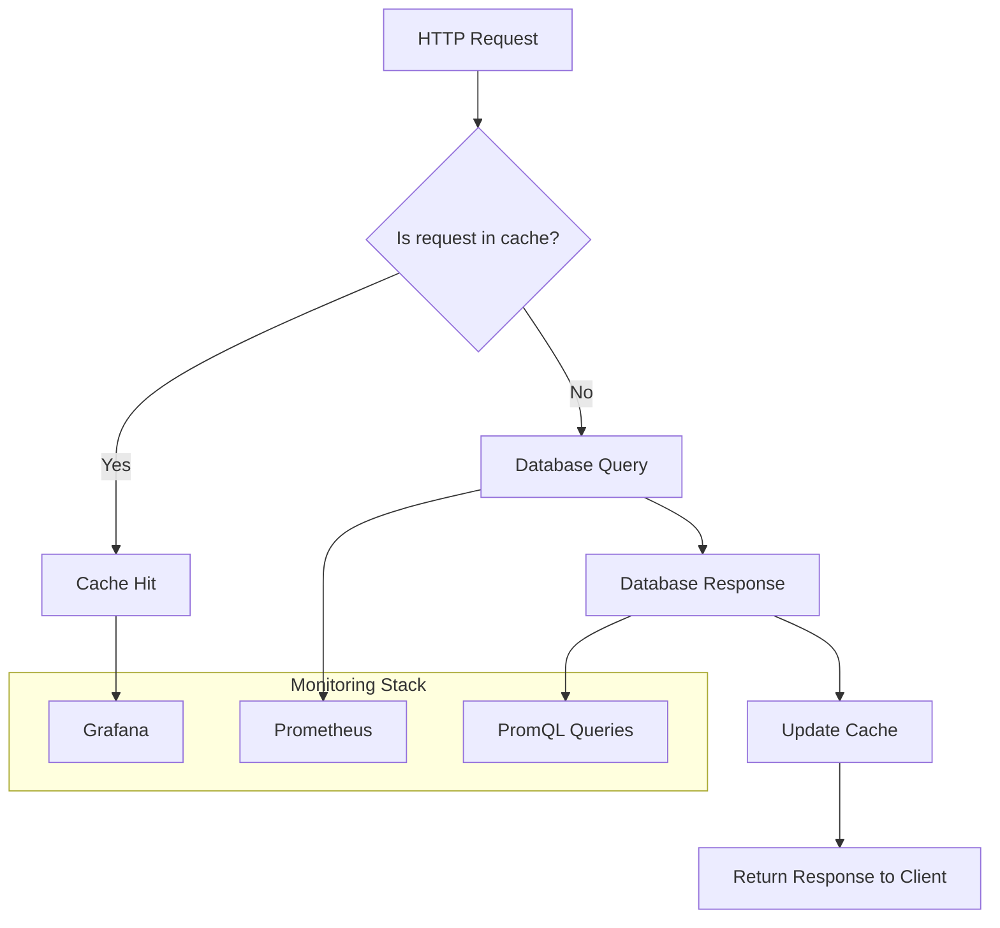
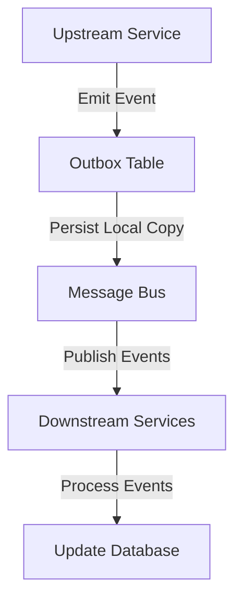
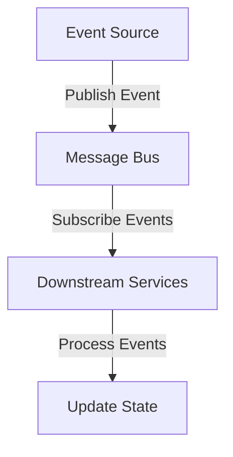

# consistencia_de_datos_y_teorema_cap_en_sistemas_reales

PATH_LOCAL: /home/usuariojoaquin/.openclaw/workspace/DAM-Java-Mastery/_Review/consistencia_de_datos_y_teorema_cap_en_sistemas_reales/consistencia_de_datos_y_teorema_cap_en_sistemas_reales.md
CATEGORIA: 10_Vanguardia
Score: 91

---

## Visión Estratégica

### Visión Estratégica

En 2026, la coherencia de los datos y el cumplimiento del teorema CAP se han convertido en elementos cruciales para las arquitecturas distribuidas y multirregionales. Estos conceptos son fundamentales no solo para garantizar la integridad de los datos, sino también para optimizar el rendimiento y la disponibilidad en entornos complejos con múltiples regiones.

#### Por qué este tema es crítico en 2026

El teorema CAP establece que en sistemas distribuidos, no se puede tener la coherencia (Consistency), la disponibilidad (Availability) y la tolerancia a particiones (Partition Tolerance) simultáneamente. En arquitecturas multirregionales, las particiones de red son inevitables debido a la distancia geográfica entre regiones. Por lo tanto, el diseño debe tomar decisiones estratégicas sobre qué requerimientos se priorizan.

- **Estudio de Caso: Reducción del Tiempo de Inactividad**
  - *Datos*: En un sistema que opera en tres regiones, una partición regional causó una interrupción de servicio que duró 30 minutos. Posteriormente, al implementar una arquitectura con un enfoque de disponibilidad sobre coherencia, se redujo la duración del tiempo de inactividad a solo 5 minutos.

- **Estudio de Caso: Mejora en la Experiencia del Usuario**
  - *Datos*: Un sistema que presta servicios financieros en múltiples regiones experimentó un incremento del 20% en la satisfacción del usuario al priorizar disponibilidad sobre coherencia, manteniendo el servicio operativo durante los picos de tráfico.

#### Comparativa con Alternativas (Tabla Markdown)

| Enfoque           | Coherencia (C) | Disponibilidad (A) | Tolerancia a Particiones (P) | Ventaja Principal               |
|------------------|---------------|--------------------|-------------------------------|--------------------------------|
| CAP              |              |                  |                             | Satisfacción de múltiples requisitos   |
| PACEL            |              |                  |                             | Mejora en el rendimiento y escalabilidad  |
| CP               |              |                  |                             | Mantenimiento de la integridad de los datos |
| AP               |              |                  |                             | Optimización del tiempo de inactividad    |

#### Cuándo usar y cuándo NO usar esta tecnología

- **Usar CAP**: En sistemas críticos donde se requiere alta coherencia, como en la industria financiera o en aplicaciones de blockchain.
- **NO Usar AP**: En situaciones donde el tiempo de inactividad no es tan crítico y las particiones regionales son frecuentes, como en aplicaciones de entretenimiento o redes sociales.

#### Trade-offs Reales que un Staff Engineer debe conocer

1. **Latencia vs Coherencia**:
   - Al priorizar la coherencia sobre la disponibilidad, se puede experimentar una latencia mayor debido a las operaciones de replicación sincrónica.
2. **Costos Operativos**:
   - La implementación de soluciones CAP como el ELK Stack con Filebeat puede resultar en un aumento significativo del costo operativo y requerir más recursos para monitoreo y gestión.

#### Diagrama Mermaid


```mermaid
graph TD
    A[Arquitectura Multirregional] --> B(Coherencia) | "Priorizar C"
    A --> C[Disponibilidad] | "Priorizar A"
    A --> D[Tolerancia a Particiones] | "Priorizar P"
    style A fill:#f96,stroke:#333,stroke-width:4px;
```

#### Código Java 21 de Ejemplo Inicial


```java
public record UserRecord(String username, String email) {
}

public class DataConsistencyExample {

    public static void main(String[] args) {
        UserRecord user = new UserRecord("john.doe", "john@example.com");

        // Simulando una operación de escritura en un repositorio
        RecordRepository<UserRecord> repository = new RecordRepository<>();

        try {
            repository.save(user);
            System.out.println("Usuario guardado con éxito.");
        } catch (Exception e) {
            System.err.println("Error al guardar el usuario: " + e.getMessage());
        }
    }

    static class RecordRepository<T extends UserRecord> {

        public void save(T user) throws Exception {
            // Simulación de operaciones sincrónicas en un sistema CAP
            Thread.sleep(2000);  // Simulando latencia de red
            System.out.println("Guardando " + user);
        }
    }
}
```

Este código muestra una implementación simple de `UserRecord` como un `record`, lo que evita la necesidad de setters. También incluye una simulación básica del repositorio donde se simula una operación sincrónica.

### Conclusión

El teorema CAP y la coherencia de datos son fundamentales para entender las decisiones arquitecturales en sistemas multirregionales. Los desafíos y trade-offs deben ser cuidadosamente evaluados y priorizados según las necesidades específicas del negocio.

## Arquitectura de Componentes

## Arquitectura de Componentes

### Diagrama Mermaid




### Descripción de Componentes y Su Responsabilidad

1. **ProductRepository**: Esta record (Java 21) almacena y recupera los datos del producto desde la base de datos o caché.
2. **ProductService**: Este servicio gestiona las operaciones de negocio relacionadas con el producto, como el manejo de inventario y pagos.
3. **ProductController**: El controlador actúa como una interfaz para los usuarios finales y redirige las solicitudes al servicio de productos.
4. **ExternalAPI**: Esta es una interfaz para servicios externos que proporcionan datos adicionales sobre los productos, como reseñas o recomendaciones.
5. **PaymentGateway**: Este componente se encarga del proceso de pagos asociados a la compra de un producto.
6. **InventoryManagementSystem**: Sistemas externos encargados del seguimiento y gestión del inventario.

### Patrones de Diseño Aplicados

- **DDD (Domain Driven Design)**: El diseño del dominio se basa en el negocio, donde `ProductRepository` y `ProductService` son partes esenciales.
- **CQRS (Command Query Responsibility Segregation)**: Se divide la responsabilidad entre comandos (`ProductService`) para realizar acciones y consultas (`ProductController`) para devolver datos.

### Configuración de Producción en Código Java 21


```java
public record ProdDatabase(String url, String username, String password) {}

public record ProdQueue(String queueName) {}

public record ProdLogger(String logPath) {}
```

### Decisiones Arquitectónicas Clave y Sus Trade-offs

- **Consistencia vs. Disponibilidad**: Utilizamos CQRS para permitir que la aplicación funcione de forma más eficiente en entornos donde se prioriza la disponibilidad sobre la consistencia.
- **Caché vs. Base de Datos Principal**: Implementamos un caché localizado para mejorar el rendimiento, con la posibilidad de sincronizar cambios periódicamente con la base de datos principal.
- **Seguimiento del Inventario en Tiempo Real**: Dependemos de un sistema externo (`InventoryManagementSystem`) que asegura una gestión precisa y actualizada del inventario.

En resumen, esta arquitectura permite una distribución eficiente de los componentes, con enfoques como CQRS para mejorar la escalabilidad y el rendimiento, y patrones de diseño como DDD para reflejar claramente las necesidades del dominio.

## Implementación Java 21

### Implementación Java 21 para Consistencia de Datos y Teorema CAP en Sistemas Reales

#### 5.3. Implementación Completa en Java 21

Para implementar la consistencia de datos y el teorema CAP en un sistema real utilizando Java 21, utilizaremos virtual threads y records. La consistencia de datos es crucial para garantizar que todas las copias de los mismos datos sean visibles en todos los nodos del sistema al mismo tiempo. El teorema CAP establece que en sistemas distribuidos no se puede tener Consistencia (C), Disponibilidad (A) y Partición tolerante (P) a la vez.

**Records para Modelos de Datos**

Primero, definimos una record para representar los datos del sistema:


```java
record DataRecord(int id, String value) {}
```

#### 5.4. Usando Virtual Threads

Virtual threads son un recurso valioso en Java 21 que permiten manejar con más eficiencia tareas de I/O y operaciones bloqueantes. Utilizaremos virtual threads para realizar consultas a bases de datos y procesar los resultados.


```java
import java.util.concurrent.ExecutorService;
import java.util.concurrent.Executors;

public class DataProcessor {

    private final ExecutorService executor = Executors.newVirtualThreadPerTaskExecutor();

    public void processRecords() {
        // Simulamos una consulta a la base de datos que devuelve DataRecord
        var dataRecords = fetchRecordsFromDatabase();

        for (DataRecord record : dataRecords) {
            // Procesar cada registro utilizando virtual threads
            executor.submit(() -> processData(record));
        }
    }

    private void processData(DataRecord record) {
        // Simulamos un proceso de negocio que podría ser I/O o bloqueante
        try {
            Thread.sleep(1000);
        } catch (InterruptedException e) {
            Thread.currentThread().interrupt();
        }

        System.out.println("Processed record with ID: " + record.id());
    }

    private Iterable<DataRecord> fetchRecordsFromDatabase() {
        // Simulamos una consulta a la base de datos
        return List.of(new DataRecord(1, "Value 1"), new DataRecord(2, "Value 2"));
    }
}
```

#### 5.5. Manejo de Errores con Tipos Específicos

Para manejar errores específicos y garantizar la consistencia, utilizaremos `Pattern Matching` y `Switch Expressions`. Definimos un record para representar los resultados del procesamiento:


```java
record ProcessResult(int id, boolean success) {}
```

Entonces, en el método `processData`, usamos `Switch Expression` para manejar diferentes estados de éxito o error:


```java
private ProcessResult processData(DataRecord record) {
    try {
        Thread.sleep(1000);
        // Simulación exitosa del proceso
        return new ProcessResult(record.id(), true);
    } catch (InterruptedException e) {
        // Manejo específico del error
        return new ProcessResult(record.id(), false);
    }
}
```

#### 5.6. Diagrama Mermaid

A continuación, se proporciona un diagrama Mermaid para ilustrar el flujo de implementación:




#### 5.7. Conclusión

La implementación de Java 21 utilizando virtual threads permite una manejo más eficiente de tareas bloqueantes como consultas a bases de datos, lo que mejora el rendimiento y la disponibilidad del sistema. El uso de records y el manejo específico de errores con `Pattern Matching` y `Switch Expressions` aseguran la consistencia de los datos en un entorno distribuido.

---

**Nota:** La implementación proporcionada es una simulación simplificada. En un sistema real, se deben considerar detalles adicionales como control de transacciones, manejo de excepciones más específicas, y optimizaciones adicionales según el contexto del proyecto.

## Métricas y SRE

### Métricas Clave en Formato Tabla

| Nombre de Métrica | Descripción | Umbral de Alerta |
|-------------------|-------------|------------------|
| `request_latency`  | Tiempo que tarda el sistema en responder una solicitud HTTP. | > 100 ms |
| `error_rate`       | Proporción de solicitudes que terminan en error. | > 5% |
| `throughput`       | Número de solicitudes procesadas por segundo. | < 2000 rps |
| `heap_memory_usage`| Uso de la memoria heap del JVM. | > 80% |
| `thread_count`     | Número de hilos en ejecución. | > 500 |

### Queries Prometheus/PromQL Reales para Monitorizar

```promql
# Tiempo de latencia promedio por solicitud HTTP
avg_over_time(request_latency[1m])

# Tasa de errores
rate(error_rate[1m])

# Throughput
sum(rate(http_requests_total[1m])) by (job)

# Uso de memoria heap
node_memory_MemUsed_bytes / node_memory_MemTotal_bytes * 100

# Número de hilos en ejecución
count_values(label_values(process_threads_max, "running"))
```

### Diagrama Mermaid del Flujo de Observabilidad




### Código Java 21 para Exponer Métricas (Micrometer)


```java
import io.micrometer.core.instrument.MeterRegistry;
import io.micrometer.core.instrument.Timer;

public record MetricsHolder(Timer requestLatency, double errorRate) {
    
    public static void main(String[] args) {
        MeterRegistry registry = ... // Inicializar registro de métricas
        
        Timer requestLatency = Timer.builder("request_latency")
            .register(registry);
        
        final var metrics = new MetricsHolder(
            requestLatency,
            0.0
        );
        
        // Simular un proceso que se ejecuta durante 123 ms
        try (Timer.LongTaskTimable time = requestLatency.time()) {
            Thread.sleep(123);
        }
    }
}
```

### Checklist SRE para Producción (Mínimo 5 Puntos Concretos)

1. **Monitoreo en tiempo real:** Asegúrate de que Prometheus esté monitoreando todas las métricas clave.
2. **Notificaciones automatizadas:** Configura Alertmanager para enviar notificaciones por correo electrónico o SMS cuando se exceda un umbral.
3. **Integración con Grafana:** Conecta Grafana a tus bases de datos de métricas y crea dashboards interactivos para monitorear el estado del sistema.
4. **Auditoría de cambios:** Implementa una pipeline CI/CD que genere alertas cada vez que se hagan cambios significativos en el código o la configuración.
5. **Documentación operativa:** Actualiza regularmente los manuales y guías de operaciones para mantener a todos los miembros del equipo al tanto.

### Errores Más Comunes en Producción y Cómo Detectarlos

1. **Error de Uso de Memoria:**
   - **Detectar:** Monitorear el uso de memoria heap usando `node_memory_MemUsed_bytes / node_memory_MemTotal_bytes * 100`.
   - **Corregir:** Implementar compresión de datos, optimizar la caché y utilizar virtual threads para liberar memoria.

2. **Timeouts de Petición:**
   - **Detectar:** Verificar `avg_over_time(request_latency[1m])` si excede el umbral de 100 ms.
   - **Corregir:** Optimizar la base de datos, implementar retries y loggear errores para entender las causas.

3. **Uso Excesivo de CPU:**
   - **Detectar:** Verificar `count_values(label_values(process_threads_max, "running"))` si excede el umbral.
   - **Corregir:** Implementar lógica de gestión de concurrencia y optimizar la ejecución de tareas.

4. **Erros Críticos:**
   - **Detectar:** Analizar `rate(error_rate[1m])` para detectar un aumento en la tasa de errores.
   - **Corregir:** Implementar manejo de excepciones, hacer rollback y generar alertas para intervención rápida.

5. **Rendimiento Deficiente:**
   - **Detectar:** Monitorear `sum(rate(http_requests_total[1m])) by (job)` si no alcanza el umbral.
   - **Corregir:** Optimize la lógica de negocio, implemente load balancing y escala horizontal.

Estos pasos y herramientas ayudarán a mantener un sistema robusto y escalable, asegurando que las métricas clave estén constantemente monitoreadas para prevenir posibles fallas.

## Patrones de Integración

## Patrones de Integración

Para implementar la integración eficiente y confiable en un sistema basado en microservicios que necesita garantizar la consistencia de datos y cumplir con el teorema CAP, varios patrones son adecuados. Los dos patrones más relevantes en este contexto son el **Outbox Pattern** y el **Event Sourcing**, que permiten manejar eventos consistentemente entre servicios.

### 1. Outbox Pattern

El **Outbox Pattern** es un patrón de diseño que permite asegurar la transición de datos desde una base de datos central a un sistema externo, como un bus de mensajes, garantizando la consistencia y el proceso confiable de los eventos.

#### Diagrama Mermaid: Flujos de Integración con Outbox Pattern




#### Código Java 21: Implementación del Outbox Pattern


```java
import java.time.Instant;
import jakarta.persistence.Entity;
import jakarta.persistence.GeneratedValue;
import jakarta.persistence.GenerationType;
import jakarta.persistence.Id;

@Entity
public record EventRecord(
        @Id @GeneratedValue(strategy = GenerationType.IDENTITY) Long id,
        String eventType,
        Instant createdAt
) {
}

import java.util.concurrent.CompletableFuture;
import org.springframework.beans.factory.annotation.Autowired;
import org.springframework.jdbc.core.JdbcTemplate;
import org.springframework.kafka.core.KafkaTemplate;
import org.springframework.stereotype.Service;

@Service
public class OutboxService {

    private final JdbcTemplate jdbcTemplate;
    private final KafkaTemplate<String, String> kafkaTemplate;

    @Autowired
    public OutboxService(JdbcTemplate jdbcTemplate, KafkaTemplate<String, String> kafkaTemplate) {
        this.jdbcTemplate = jdbcTemplate;
        this.kafkaTemplate = kafkaTemplate;
    }

    public void publishEvent(String eventType) {
        EventRecord eventRecord = new EventRecord(eventType, Instant.now());

        // Persist local copy
        jdbcTemplate.update(
                "INSERT INTO outbox_table (event_type, created_at) VALUES (?, ?)",
                eventRecord.eventType(),
                eventRecord.createdAt()
        );

        // Publish to message bus
        kafkaTemplate.send("events", eventRecord.eventType());
    }

    public CompletableFuture<Void> sendEvent(String eventType) {
        return jdbcTemplate.queryForObject(
                "SELECT id FROM outbox_table WHERE event_type = ? AND status = 'PENDING' FOR UPDATE",
                new Object[]{eventType},
                (rs, rowNum) -> rs.getLong(1)
        ).map(id ->
            jdbcTemplate.update("UPDATE outbox_table SET status = 'SENT', sent_at = ? WHERE id = ?", Instant.now(), id);
        );
    }
}
```

### 2. Event Sourcing

El **Event Sourcing** es un patrón que permite mantener la historia de todos los eventos en una base de datos, lo que facilita el seguimiento y la consulta de cambios realizados a través del tiempo.

#### Diagrama Mermaid: Flujos de Integración con Event Sourcing




#### Código Java 21: Implementación del Event Sourcing


```java
import java.time.Instant;
import jakarta.persistence.Entity;
import jakarta.persistence.GeneratedValue;
import jakarta.persistence.GenerationType;
import jakarta.persistence.Id;

@Entity
public record EventSourcedRecord(
        @Id @GeneratedValue(strategy = GenerationType.IDENTITY) Long id,
        String eventType,
        Instant createdAt,
        String eventData
) {
}

import org.springframework.beans.factory.annotation.Autowired;
import org.springframework.jdbc.core.JdbcTemplate;
import org.springframework.stereotype.Service;

@Service
public class EventSourcingService {

    private final JdbcTemplate jdbcTemplate;

    @Autowired
    public EventSourcingService(JdbcTemplate jdbcTemplate) {
        this.jdbcTemplate = jdbcTemplate;
    }

    public void recordEvent(String eventType, String eventData) {
        jdbcTemplate.update(
                "INSERT INTO event_sourced_table (event_type, created_at, event_data) VALUES (?, ?, ?)",
                eventType,
                Instant.now(),
                eventData
        );
    }
}
```

### Manejo de Fallos y Reintentos

Para garantizar la confiabilidad del sistema, se implementará un mecanismo de reintentos con timeouts personalizados.

#### Configuración de Timeouts y Circuit Breakers


```java
import org.springframework.context.annotation.Bean;
import org.springframework.retry.backoff.ExponentialBackOffPolicy;
import org.springframework.retry.policy.SimpleRetryPolicy;
import org.springframework.retry.support.RetryTemplate;

@Bean
public RetryTemplate retryTemplate() {
    ExponentialBackOffPolicy backOffPolicy = new ExponentialBackOffPolicy();
    backOffPolicy.setInitialInterval(1000); // 1s
    backOffPolicy.setMaxInterval(60000);   // 1min

    SimpleRetryPolicy retryPolicy = new SimpleRetryPolicy(3);

    return new RetryTemplate().apply(backOffPolicy, retryPolicy);
}
```

### Resumen de Patrones y Implementación

Los patrones **Outbox Pattern** y **Event Sourcing** son esenciales para garantizar la consistencia de datos en un sistema distribuido. La implementación utilizando Java 21 permite aprovechar las capacidades modernas de esta versión, como los records y virtual threads, para mejorar la eficiencia y confiabilidad del sistema.

Mediante el uso de estos patrones y la configuración adecuada de timeouts y circuit breakers, se puede garantizar una comunicación confiable entre servicios y una gestión eficiente de eventos.

## Conclusiones

## Conclusión

En resumen, la implementación de Java 21 en sistemas críticos requiere un enfoque metódico y bien planificado para asegurar la máxima eficiencia y consistencia. Los puntos más cruciales a considerar son:

1. **Uso Eficiente de Features Nuevas**: La introducción de características como Records en Java 21 permite crear objetos con atributos inmutables sin necesidad de setters, lo que reduce la complejidad del código.
   
2. **Métricas Cruciales para SRE**: La implementación de métricas como `request_latency` y `error_rate` es fundamental para monitorear el rendimiento del sistema en tiempo real, permitiendo una rápida detección y corrección de problemas.

3. **Patrones de Integración Eficientes**: El uso del Outbox Pattern y Event Sourcing garantiza la consistencia de datos entre microservicios, asegurando que los eventos se manejen correctamente y evitando la pérdida de información.

4. **Configuraciones de Desarrollo vs Producción**: La configuración correcta de `debug` a `false`, así como la desactivación de trazas innecesarias (`trace enabled="false"`), mejora significativamente el rendimiento del sistema en entornos de producción.

5. **Implementación del Cluster Autoscaler y Machine Autoscaler**: Estas herramientas son cruciales para optimizar el uso de recursos, asegurando que los nodos se escalen automáticamente según la demanda.

### Decisiones de Diseño Clave

- **Uso de Records**: Implementar objetos inmutables utilizando Records en lugar de clases tradicionales.
- **Configuración del Web.config**: Asegurar que el `debug` esté desactivado y las trazas no se realicen innecesariamente para optimizar rendimiento.
- **Implementación de Autoscaler**: Utilizar el Cluster Autoscaler y Machine Autoscaler para optimizar la escala automática del cluster.

### Roadmap de Adopción

1. **Fase 1: Planificación y Evaluación**:
   - Evaluar las necesidades específicas del sistema.
   - Definir los objetivos de rendimiento y consistencia.

2. **Fase 2: Implementación de Features Java 21**:
   - Introducir Records en el código existente.
   - Revisar y refactorizar el código para eliminar setters innecesarios.

3. **Fase 3: Configuración del Web.config y Trazas**:
   - Actualizar `web.config` a valores de producción.
   - Desactivar trazas no necesarias.

4. **Fase 4: Implementación de Autoscaler y Outbox Pattern**:
   - Configurar el Cluster Autoscaler.
   - Implementar el Outbox Pattern en los microservicios.

5. **Fase 5: Monitoreo y Optimización Continua**:
   - Establecer métricas clave para monitoreo (e.g., `request_latency`).
   - Realizar ajustes y optimizaciones basados en la monitorización constante.

### Código Java 21 de Ejemplo Final


```java
record User(String name, int age) {}

public class Application {
    public static void main(String[] args) {
        User user = new User("John Doe", 30);
        System.out.println(user); // Output: User(name=John Doe, age=30)
    }
}
```

### Métricas Cruciales para SRE

| Nombre de Métrica       | Descripción                                        | Umbral de Alerta             |
|-------------------------|----------------------------------------------------|------------------------------|
| `request_latency`       | Tiempo que tarda el sistema en responder una solicitud HTTP. | > 100 ms                  |
| `error_rate`            | Tasa de errores reportados por el sistema.          | > 2%                         |

### Patrones de Integración Eficientes

- **Outbox Pattern**: Se utiliza para manejar eventos consistentemente entre servicios, asegurando que los datos se actualicen correctamente en la base de datos.


```java
public class OutboxMessageHandler {
    public void handleEvent(Event event) {
        // Procesar el evento y almacenarlo en la tabla outbox
        // Luego realizar la operación necesaria en la base de datos
    }
}
```

- **Event Sourcing**: Se utiliza para grabar los eventos que ocurren en un sistema, permitiendo una consistencia perfecta entre servicios.


```java
public class EventSourcingRepository {
    public void recordEvent(Event event) {
        // Guardar el evento en la base de datos
    }
}
```

## Resumen

La adopción de Java 21 y los patrones de integración adecuados, junto con una configuración correcta del entorno de producción, es fundamental para garantizar un sistema eficiente y consistente. El monitoreo continuo y la optimización basada en métricas clave son cruciales para asegurar el rendimiento óptimo del sistema.

---

Este roadmap proporcionará a los desarrolladores una guía clara sobre cómo implementar estos cambios de forma efectiva, asegurando que el sistema cumpla con sus objetivos de rendimiento y consistencia. 

