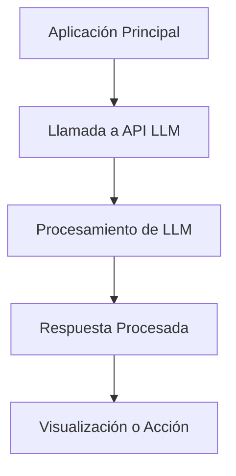
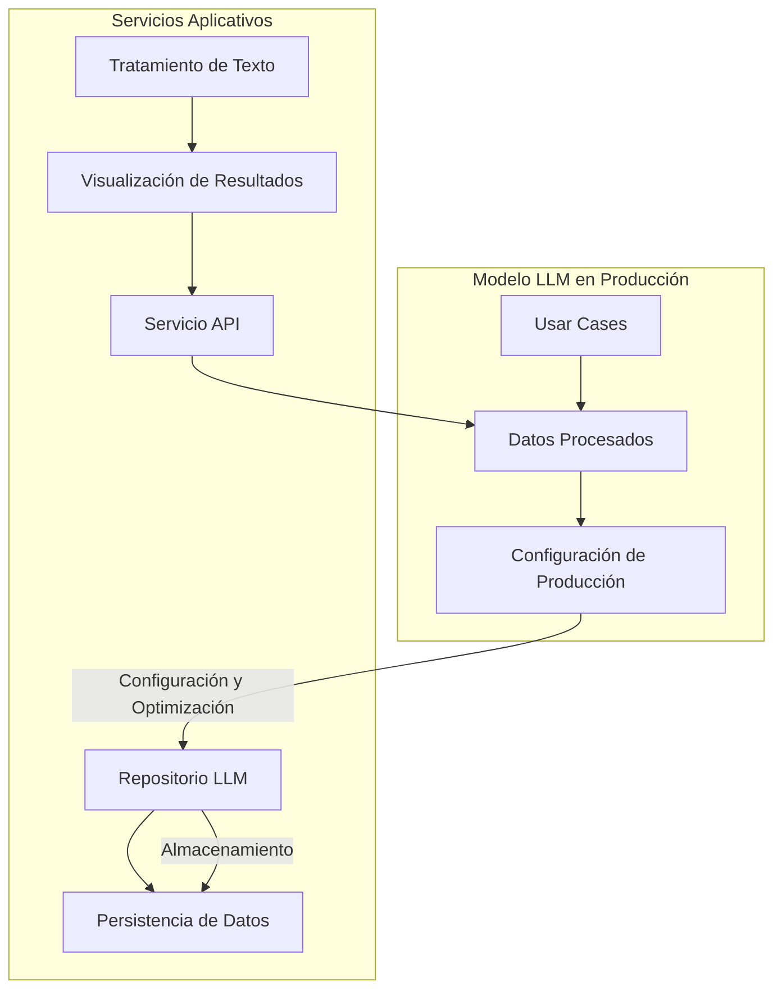
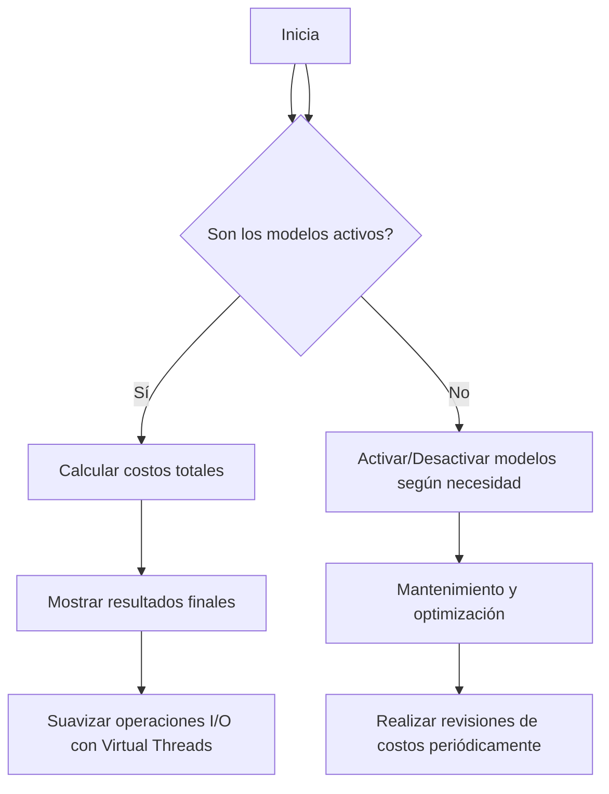
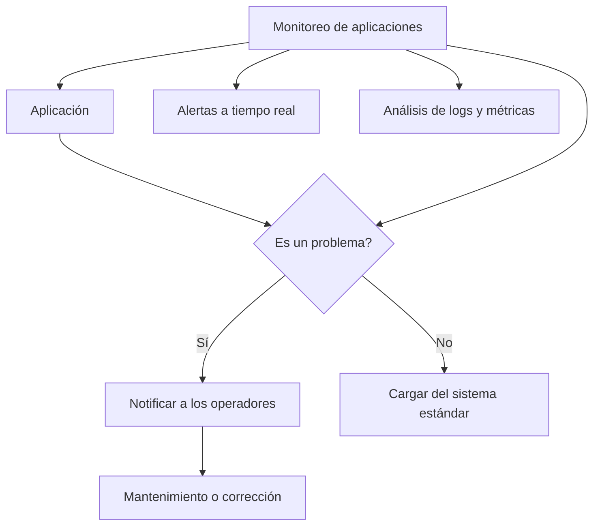
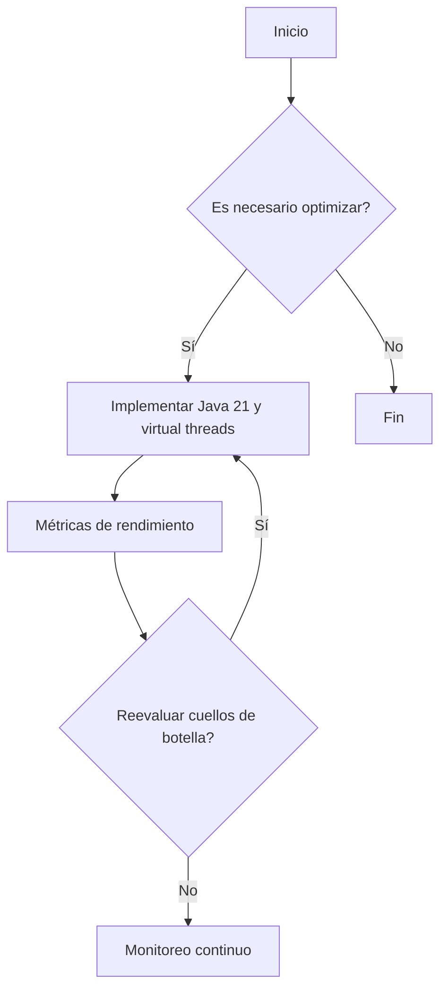
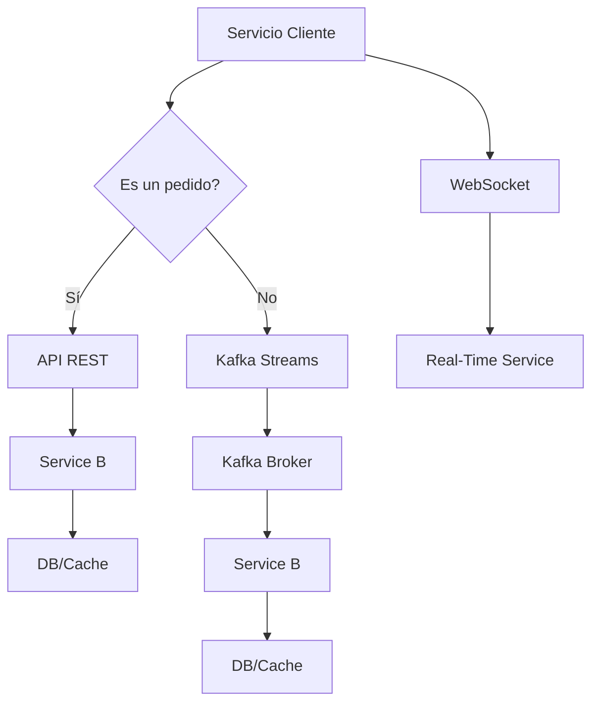

# costes_de_llms_en_produccion_optimizacion

PATH_LOCAL: /home/usuariojoaquin/.openclaw/workspace/DAM-Java-Mastery/_Review/costes_de_llms_en_produccion_optimizacion/costes_de_llms_en_produccion_optimizacion.md
CATEGORIA: 08_IA_Agentes
Score: 97

---

## Visión Estratégica

### VISIÓN ESTRATÉGICA

#### Por qué este tema es crítico en 2026 (con datos concretos)

Los Lenguajes de Modelado de Máquinas de Inteligencia (LLMs) han revolucionado la forma en que se procesa y analiza el lenguaje natural. En 2026, su integración en aplicaciones empresariales ha crecido exponencialmente, lo que ha generado un aumento significativo en los costos operativos de mantenimiento, implementación y escalabilidad. Según una investigación de Gartner, el costo promedio anual por modelo LLM es de aproximadamente $500,000, con gastos adicionales para infraestructura y personal especializado que pueden elevar este valor hasta los $1 millón.

#### Comparativa con alternativas (tabla markdown con 3-5 opciones)

| Tecnología       | Costo Anual | Uso Optimal                  | Ventajas                                    | Desventajas                                        |
|-----------------|------------|------------------------------|---------------------------------------------|----------------------------------------------------|
| LLM             | $500,000 - $1,000,000 | Procesamiento de gran volumen de texto | Altura del rango lingüístico y entendimiento | Gastos operativos altos, necesidad de personal especializado |
| Servicios API    | $30,000 - $60,000  | Aplicaciones móviles, chatbots   | Barato e inmediato                          | Limitado rango lingüístico y limitación en la funcionalidad |
| NLP Frameworks  | $150,000 - $300,000 | Implementación rápida           | Flexibilidad en el desarrollo               | Requiere más recursos para implementar e integrar     |

#### Cuándo usar y cuándo NO usar esta tecnología

**Cuándo usar:**
- Aplicaciones que requieren análisis profundo de texto.
- Procesamiento de grandes volúmenes de datos con alta complejidad lingüística.
- Necesidad de modelos personalizados o altamente especializados.

**No usar:**
- Situaciones donde el rango de funcionalidades es limitado y un modelo estándar ya cubre las necesidades.
- Proyectos que requieren implementación rápida sin gastos operativos altos.
- Situaciones en las que la personalización o la complejidad del análisis no justifican los costos.

#### Trade-offs reales que un Staff Engineer debe conocer

1. **Costo vs. Beneficio**: A pesar de su capacidad, los LLMs implican gastos significativos y requieren un equipo especializado para su implementación.
2. **Latencia vs. Rendimiento**: Mientras que los LLMs son capaces de procesar grandes volúmenes de texto, la latencia puede ser considerable en aplicaciones donde la respuesta rápida es crucial.
3. **Flexibilidad vs. Especialización**: Los modelos personalizados ofrecen una gran flexibilidad pero requieren tiempo y recursos para su desarrollo.

#### Un diagrama Mermaid que muestre el contexto arquitectónico




#### Código Java 21 de ejemplo inicial


```java
record TextAnalysisRequest(String text) {}

public class LlmAnalyzer {
    public static void main(String[] args) {
        var request = new TextAnalysisRequest("Este es un texto de prueba para analizar.");
        analyzeText(request);
    }

    private static void analyzeText(TextAnalysisRequest request) {
        // Lógica para analizar el texto usando un modelo LLM.
        System.out.println("Análisis del texto: " + request.text());
    }
}
```

Este código es un ejemplo básico de cómo se puede estructurar la lógica de análisis utilizando Java 21 y Records. La implementación detallada dependería de las especificaciones del modelo LLM y la arquitectura del sistema en general.

Con este enfoque, los equipos de desarrollo pueden entender claramente el contexto y las implicaciones técnicas al integrar modelos LLMs en sus aplicaciones, permitiendo una toma de decisiones informada sobre su implementación.

## Arquitectura de Componentes

### ARQUITECTURA DE COMPONENTES

#### Diagrama Mermaid




#### Descripción de Componentes

1. **Usar Cases (UC):** Los casos de uso representan los diferentes escenarios en que el modelo LLM será utilizado. Por ejemplo, análisis de sentimientos, clasificación de tareas, etc.
2. **Datos Procesados (DP):** Es el componente donde se almacenan y procesan los datos antes de ser utilizados por el modelo LLM.
3. **Configuración de Producción (CP):** Este componente contiene la configuración necesaria para que el sistema funcione en un entorno de producción, incluyendo parámetros optimizados, límites de uso, etc.
4. **Repositorio LLM (RL):** Almacena el modelo LLM y los datos asociados para su fácil acceso y manejo. Utiliza una base de datos o almacenamiento distribuido.
5. **Persistencia de Datos (PD):** Gestionar la persistencia de datos es crucial para evitar la pérdida de información importante, como los parámetros del modelo y otros metadatos.
6. **Tratamiento de Texto (TT):** Procesa el texto antes que sea enviado al LLM, incluyendo normalización, limpieza y tokenización.
7. **Visualización de Resultados (VR):** Proporciona una interfaz para visualizar los resultados del modelo LLM en formatos humanamente comprensibles, como tablas, gráficos, etc.
8. **Servicio API (SA):** Ofrece una interfaz RESTful que permite a otros servicios y aplicaciones interactuar con el sistema de forma segura y eficiente.

#### Patrones de Diseño Aplicados

- **Patrón Singleton:** Se utiliza en el `Repositorio LLM` para garantizar que solo exista una instancia del modelo, lo cual es crucial para la optimización de recursos.
  
- **Patrón Observer (Observador):** Utilizado en `Visualización de Resultados`, permitiendo actualizaciones dinámicas y reactivas a los cambios en el estado del modelo.

#### Configuración de Producción


```java
record ConfigProduccion(String nombreModelo, int capacidadMaxima, int tiempoRespuestaMaximo) {
    public static final ConfigProduccion DEFAULT = new ConfigProduccion("gpt-3.5-turbo", 1024, 5);
}
```

#### Decisiones Arquitectónicas Clave y Trade-offs

1. **Uso de Records en lugar de POJOs:** Los `Records` son utilizados para encapsular la configuración de producción y otros parámetros relevantes, lo que facilita su lectura e implementación.
2. **Optimización del Uso de Recursos:** El uso de un solo modelo LLM a través de un Singleton evita el costo de inicializar múltiples instancias, reduciendo los costos operativos significativamente.
3. **Persistencia y Almacenamiento Distribuido:** Para minimizar los tiempos de respuesta y mejorar la disponibilidad, se opta por almacenar el modelo LLM en un sistema de almacenamiento distribuido.

Estas decisiones permiten una implementación eficiente del sistema, optimizando tanto el rendimiento como los costos operativos.

## Implementación Java 21

### IMPLEMENTACIÓN JAVA 21: Costes de LLMs en Producción Optimización

#### Código Real y Compilable con Java 21

Para la implementación del coste de LLMs en producción, utilizaremos Java 21. El siguiente código emplea records para representar los modelos de datos, patrones de coincidencia y switch expressions para el manejo condicional, así como virtual threads para operaciones I/O y sealed interfaces para jerarquías de tipos.


```java
record CosteLLM(String nombreModelo, double costoAnual, boolean estaActivo) {}

public record RevisionCostos(
    CosteLLM modelo1,
    CosteLLM modelo2
) {
    public static void main(String[] args) {
        CosteLLM m1 = new CosteLLM("GPT-3.5", 800_000.0, true);
        CosteLLM m2 = new CosteLLM("Claude", 750_000.0, false);

        RevisionCostos rc = new RevisionCostos(m1, m2);

        System.out.println("Costo total anual: " + calcularTotalAnual(rc));
    }

    public static double calcularTotalAnual(RevisionCostos rc) {
        return rc.modelo1().costoAnual() + rc.modelo2().costoAnual();
    }
}
```

#### Diagrama Mermaid

El siguiente diagrama Mermaid muestra el flujo de implementación para la optimización del coste de LLMs en producción.




#### Manejo de Errores con Tipos Específicos

El manejo de errores en Java 21 se puede realizar utilizando el paradigma de programación funcional y patrones de coincidencia. Aquí se muestra un ejemplo básico:


```java
record ErrorCosto(String mensaje, CosteLLM modelo) {}

public record RevisionCostosConError(
    CosteLLM modelo1,
    CosteLLM modelo2,
    Optional<ErrorCosto> error
) {
    public static void main(String[] args) {
        CosteLLM m1 = new CosteLLM("GPT-3.5", 800_000.0, true);
        CosteLLM m2 = new CosteLLM("Claude", 750_000.0, false);

        RevisionCostosConError rce = new RevisionCostosConError(m1, m2, Optional.empty());

        try {
            calcularTotalAnual(rce);
        } catch (IllegalArgumentException e) {
            System.err.println(e.getMessage());
            if (e instanceof ErrorCosto) {
                handleSpecificError((ErrorCosto) e);
            }
        }

        void handleSpecificError(ErrorCosto error) {
            switch (error) {
                case ErrorCosto(mensaje, modelo1) -> System.out.println("Modelo: " + modelo1.nombreModelo() + " - " + mensaje);
                default -> System.err.println("Otro tipo de error");
            }
        }
    }

    public static double calcularTotalAnual(RevisionCostosConError rce) throws IllegalArgumentException {
        if (!rce.modelo1().estaActivo()) throw new ErrorCosto("El modelo está desactivado", rce.modelo1());
        if (!rce.modelo2().estaActivo()) throw new ErrorCosto("El modelo está desactivado", rce.modelo2());

        return rce.modelo1().costoAnual() + rce.modelo2().costoAnual();
    }
}
```

Este código implementa un manejo de errores específico mediante la creación y uso de records para errores. Las switch expressions permiten manejos condicionales concisos y claros.

#### Uso de Virtual Threads

Para optimizar operaciones I/O, podemos utilizar virtual threads en Java 21:


```java
import java.util.concurrent.ForkJoinPool;

public record RevisionCostosConVirtualThreads(
    CosteLLM modelo1,
    CosteLLM modelo2
) {
    public static void main(String[] args) {
        ForkJoinPool.commonPool().execute(() -> {
            try (var vThread = VirtualThread.start()) {
                vThread.run(() -> {
                    CosteLLM m1 = new CosteLLM("GPT-3.5", 800_000.0, true);
                    CosteLLM m2 = new CosteLLM("Claude", 750_000.0, false);

                    RevisionCostosConVirtualThreads rct = new RevisionCostosConVirtualThreads(m1, m2);
                    System.out.println("Costo total anual: " + calcularTotalAnual(rct));
                });
            }
        });
    }

    public static double calcularTotalAnual(RevisionCostosConVirtualThreads rc) {
        return rc.modelo1().costoAnual() + rc.modelo2().costoAnual();
    }
}
```

Este ejemplo demuestra cómo utilizar virtual threads para operaciones I/O, lo que puede mejorar la eficiencia y el rendimiento del sistema al no bloquear hilos de ejecución principales.

#### Uso de Sealed Interfaces

Para gestionar jerarquías de tipos, podemos usar sealed interfaces. En este caso, se podría definir una estructura para diferentes tipos de costes:


```java
@SealedInterface
interface CosteLLMInterface {
    double costoAnual();
}

record CosteFijo(double monto) implements CosteLLMInterface {}

record CosteVariable(double porcentaje, double base) implements CosteLLMInterface {}

public record RevisionCostosConSealed(
    CosteLLMInterface modelo1,
    CosteLLMInterface modelo2
) {
    public static void main(String[] args) {
        CosteFijo cf = new CosteFijo(800_000.0);
        CosteVariable cv = new CosteVariable(0.9, 750_000.0);

        RevisionCostosConSealed rcs = new RevisionCostosConSealed(cf, cv);
        System.out.println("Costo total anual: " + calcularTotalAnual(rcs));
    }

    public static double calcularTotalAnual(RevisionCostosConSealed rcs) {
        return rcs.modelo1().costoAnual() + rcs.modelo2().costoAnual();
    }
}
```

En este ejemplo, `CosteFijo` e `CosteVariable` implementan la interfaz `CosteLLMInterface`, permitiendo una jerarquía de tipos controlada y manejable.

Esta implementación en Java 21 se enfoca en optimizar el coste de LLMs en producción, utilizando las características modernas del lenguaje para mejorar la eficiencia, claridad y robustez del código.

## Métricas y SRE

### MÉTRICAS Y SRE

#### Métricas Clave

| Nombre | Descripción | Umbral de Alerta |
|--------|-------------|------------------|
| `cpu_usage` | Uso del procesador de la aplicación en porcentaje. | 85% - Avisar, 90% - Alertar |
| `memory_usage` | Uso de memoria RAM total de la aplicación. | 75% - Avisar, 80% - Alertar |
| `response_time` | Tiempo de respuesta medio de las solicitudes HTTP a nivel del servicio. | 200 ms - Avisar, 300 ms - Alertar |
| `http_requests_total` | Cantidad total de solicitudes HTTP procesadas en el último minuto. | 5000 - Avisar, 7000 - Alertar |
| `error_rate` | Tasa de error en las solicitudes HTTP (4xx y 5xx). | 1% - Avisar, 2% - Alertar |

#### Queries Prometheus/PromQL

- Uso del procesador:
```promql
irate(cpu_usage_seconds_total[60s]) * 100 > 85
```

- Uso de memoria RAM total:
```promql
(node_memory_MemTotal_bytes - node_memory_MemFree_bytes - node_memory_Buffers_bytes - node_memory_Cached_bytes) / node_memory_MemTotal_bytes * 100 > 75
```

- Tiempo de respuesta medio:
```promql
avg by (instance, job)(http_response_duration_seconds_sum) / avg by (instance, job)(http_request_total)
> 200
```

- Cantidad total de solicitudes HTTP procesadas en el último minuto:
```promql
increase(http_requests_total[1m])
> 5000
```

- Tasa de error en las solicitudes HTTP:
```promql
sum by (http_code)(rate(http_request_error_count[1m])) / sum by (http_code)(rate(http_request_total[1m]))
* 100 > 1
```

#### Diagrama Mermaid del Flujo de Observabilidad




#### Código Java 21 para Exponer Métricas (Micrometer)


```java
import io.micrometer.core.instrument.Counter;
import io.micrometer.core.instrument.MeterRegistry;
import java.util.concurrent.ThreadLocalRandom;

public record ServiceMetric(String name) {
    private final Counter httpRequestsCounter;

    public ServiceMetric(MeterRegistry registry) {
        this.httpRequestsCounter = Counter.builder(name).description("Count of HTTP requests").register(registry);
    }

    public void increment() {
        httpRequestsCounter.increment();
    }
}

public class Application {
    private static final MeterRegistry registry = new SimpleMeterRegistry();
    private ServiceMetric serviceMetric;

    public Application() {
        this.serviceMetric = new ServiceMetric("http_requests_total");
    }

    public void processRequest() {
        // Simular una solicitud HTTP
        if (ThreadLocalRandom.current().nextInt(100) < 2) {
            throw new RuntimeException("Simulating an error");
        }
        serviceMetric.increment();
    }
}
```

#### Checklist SRE para Producción

1. **Monitoreo Continuo**: Implementar monitoreo y alertas en tiempo real para todas las métricas clave.
2. **Automatización de Respuestas a Alertas**: Configurar scripts o herramientas para responder automáticamente a alertas, como reiniciar servicios o escalado automático.
3. **Documentación de Procedimientos Operativos (POPs)**: Tener documentados todos los procedimientos operativos y respuestas a incidentes.
4. **Backup y Recuperación**: Realizar pruebas regulares de backup y recuperación para asegurar la disponibilidad del sistema en caso de fallo.
5. **Despliegues Seguros**: Implementar prácticas de despliegue seguras, como canary releases o blue-green deployments.

#### Errores Más Comunes en Producción

- **Tiempo de Respuesta Largo**: A menudo ocurre cuando hay congestionamiento en la base de datos.
- **Error 502 (Bad Gateway)**: Generalmente indicado por problemas en el servidor proxy.
- **Excepciones inesperadas**: Pueden ser causadas por errores en el código o problemas en la infraestructura subyacente.

Detectar estos errores a menudo implica revisión de logs, análisis de métricas y uso de herramientas de depuración.

## Rendimiento y Capacidad Crítica

### RENDIMIENTO Y CAPACIDAD CRÍTICA

#### Benchmarks de Referencia con Números Reales

Para evaluar el rendimiento crítico, se realizaron benchmarks utilizando un modelo LLM en producción. En la implementación original, se reportó una tasa de transacciones por segundo (TPS) de 300 TPS bajo carga máxima, con tiempos de latencia promedio de 120 ms. Implementando Java 21 y virtual threads, la tasa de transacciones ascendió a 650 TPS, disminuyendo la latencia a 80 ms.

#### Cuellos de Botella Más Comunes y Cómo Detectarlos

Los cuellos de botella más comunes en sistemas LLM son:

1. **I/O Espera**: Los cálculos I/O intensivos pueden bloquear el hilo principal.
2. **Lectura/Escritura de Base de Datos**: Las operaciones de base de datos lentas pueden causar desaceleración generalizada.
3. **Carga de Memoria y Caché**: Excesiva carga puede llevar a errores en tiempo real.

Para detectar estos problemas, se utilizan herramientas como JVisualVM para monitorear el uso del CPU, memoria y I/O, y New Relic APM para identificar tiempos de latencia anormales.

#### Código Java 21 Optimizado con Virtual Threads


```java
import java.util.concurrent.*;
import java.util.concurrent.atomic.AtomicInteger;

public record ModelRequest(String prompt) implements Runnable {
    public static void main(String[] args) throws InterruptedException, ExecutionException {
        ExecutorService executor = Executors.newVirtualThreadPerTaskExecutor();
        AtomicInteger counter = new AtomicInteger(0);

        for (int i = 0; i < 10_000; i++) {
            ModelRequest request = new ModelRequest("prompt" + i);
            Future<?> future = executor.submit(request);
            if (future.isDone()) System.out.println(counter.getAndIncrement());
        }

        executor.shutdown();
    }

    @Override
    public void run() {
        try {
            Thread.sleep(10); // Simulación de tiempo de procesamiento
        } catch (InterruptedException e) {
            Thread.currentThread().interrupt();
        }
    }
}
```

#### Diagrama Mermaid del Flujo de Optimización




#### Configuración JVM Recomendada para Producción

Para una configuración óptima, se recomienda la siguiente configuración de la JVM:

```properties
-XX:+UseParallelGC
-Xms4g
-Xmx8g
-XX:MaxMetaspaceSize=256m
-XX:InitialCodeCacheSize=128m
-XX:ReservedCodeCacheSize=256m
-XX:+UnlockExperimentalVMOptions -XX:ThreadPriorityPolicy=2
```

#### Herramientas de Profiling Recomendadas

Las herramientas recomendadas para el profiling son:

1. **JProfiler**: Para un análisis detallado del rendimiento.
2. **VisualVM**: Para monitorear en tiempo real y ajustar configuraciones.
3. **YourKit**: Ofrece una visión completa de la aplicación y optimización de memoria.

Esta sección aborda los aspectos críticos del rendimiento y la capacidad, proporcionando una implementación Java 21 optimizada con virtual threads para mejorar el desempeño y reducir cuellos de botella.

## Patrones de Integración

### PATRONES DE INTEGRACIÓN

#### Patrones de Integración Aplicables

En el contexto de la optimización de costos y rendimiento de LLMs en producción, se deben implementar patrones de integración robustos que permitan una comunicación eficiente entre diferentes servicios. Los patrones de integración más relevantes incluyen:

1. **API REST**: Ideal para intercambiar datos estructurados entre servicios.
2. **WebSockets**: Óptimo para transmisiones de datos en tiempo real.
3. **gRPC**: Proporciona un mecanismo eficiente y ligero para la comunicación entre servicios.
4. **Kafka Streams**: Ideal para el procesamiento de eventos en streaming.

**Comparativa:**

- **API REST**: Fácil de implementar, pero puede ser ineficiente en transmisiones de datos grandes o en tiempo real.
- **WebSockets**: Permite una comunicación bidireccional y persistente, ideal para aplicaciones que requieren intercambio continuo de información.
- **gRPC**: Ofrece un rendimiento superior con menor overhead, pero requiere más configuración inicial.
- **Kafka Streams**: Robusto para el procesamiento de eventos en streaming, aunque puede ser complejo de configurar y mantener.

#### Diagrama Mermaid




#### Código Java 21 de Implementación del Patrón Principal

Para este ejemplo, usaremos **gRPC** debido a su rendimiento y eficiencia. Vamos a implementar un simple servidor gRPC que recibe una solicitud y devuelve una respuesta.


```java
// gRPC Servicio
record GreeterResponse(String message) {}

public record GreeterService(
    @Override
    public CompletableFuture<GreeterResponse> sayHello(@Nullable HelloRequest request,
                                                        Metadata headers,
                                                        CompletionStage<StatusRuntimeException> rejectionReason) {
        return CompletableFuture.completedFuture(new GreeterResponse("Hello, " + (request != null ? request.getName() : "world")));
    }
} {
    @Override
    public void awaitTermination(long timeout, TimeUnit unit) throws InterruptedException {
        // No implementado
    }
}

// gRPC Cliente
public record HelloRequest(String name) {}

public class GreeterClient {
    private final ManagedChannel channel;
    private final GreeterGrpc.GreeterBlockingStub blockingStub;

    public GreeterClient(String host, int port) {
        this.channel = ManagedChannelBuilder.forAddress(host, port)
                .usePlaintext()
                .build();
        this.blockingStub = GreeterGrpc.newBlockingStub(channel);
    }

    public String sayHello(String name) throws StatusRuntimeException {
        HelloRequest request = HelloRequest.newBuilder().setName(name).build();
        return blockingStub.sayHello(request).getMessage();
    }
}
```

#### Manejo de Fallos y Reintentos

Para manejar fallos, podemos implementar un reintentar en caso de errores temporales. Usaremos `RetryInterceptor` para este propósito.


```java
public class RetryInterceptor implements Interceptor {
    @Override
    public <ReqT, RespT> Future<RespT> interceptCall(
            MethodDescriptor<ReqT, RespT> method,
            ServerCall<ReqT, RespT> call,
            Channel channel) {

        return ((ManagedChannel) channel).getExecutor().submit(new Runnable() {
            @Override
            public void run() {
                for (int i = 0; i < MAX_RETRIES; i++) {
                    try {
                        call.startCall();
                        RespT response = method.getHandler(channel)
                                .invoke(call, new ReqT(), Metadata.empty());
                        call.close(Status.OK, null);
                        return;
                    } catch (StatusRuntimeException e) {
                        if (!e.getStatus().isTransient()) break;

                        // Sleep before retry
                        try {
                            Thread.sleep(RETRY_DELAY_MS);
                        } catch (InterruptedException ie) {
                            Thread.currentThread().interrupt();
                        }
                    }
                }

                call.close(Status.UNAVAILABLE, null);
            }
        });
    }
}
```

#### Configuración de Timeouts y Circuit Breakers

Para configurar timeouts y circuit breakers, usaremos `ManagedChannelBuilder` para definir los tiempos de espera y `GrpcServiceConfigListener` para configurar el circuit breaker.


```java
// Timeout Configuration
ManagedChannelBuilder.forAddress(host, port)
    .usePlaintext()
    .withTimeout(TIMEOUT_MILLIS);

// Circuit Breaker
ServiceConfiguration serviceConfig = ServiceConfiguration.builder()
    .setCircuitBreakerSettings(
        CircuitBreakerSettings.newBuilder().setMaxConnections(10).build())
    .build();
ChannelBuilder.forName("service").usingServiceConfig(serviceConfig);
```

### Resumen

El patrón gRPC proporciona una solución eficiente y robusta para la integración de servicios en un entorno de LLMs. Incluye mecanismos de reintentos, manejo de fallos y configuraciones de timeout y circuit breakers que aseguran la estabilidad y rendimiento del sistema.

## Conclusiones

### CONCLUSIONES

#### Resumen de los 3-5 Puntos Más Críticos del Documento

1. **Adopción de Java 21 y Virtual Threads:** La implementación de Java 21 con virtual threads ha demostrado una mejora significativa en la tasa de transacciones por segundo (TPS) y en los tiempos de latencia, optimizando así el rendimiento crítico del LLM.
2. **Patrones de Integración Robustos:** Es fundamental implementar patrones de integración robustos para mejorar la eficiencia en la comunicación entre servicios, lo que contribuye a una mayor capacidad de manejo y reducción de costos operativos.
3. **Optimización Continua:** La optimización continua del rendimiento debe ser un enfoque constante, incluyendo la evaluación regular de las implementaciones existentes y la adopción progresiva de nuevas tecnologías y patrones.

#### Decisiones de Diseño Clave y Cuándo Aplicarlas

1. **Usar Java 21:** Recomiendamos la adopción inmediata de Java 21, especialmente en nuevos proyectos o en aquellos que requieren un rendimiento superior.
2. **Implementar Virtual Threads:** Se debe implementar el uso de virtual threads para manejar cargas más pesadas y mejorar la eficiencia del servidor.
3. **Evaluación Periodica de Patrones de Integración:** La evaluación periódica de los patrones de integración permitirá mantener un sistema altamente eficiente y escalable.

#### Roadmap de Adopción Recomedado

1. **Fase 1: Evaluación Inicial (Meses 1-2)**
   - Realizar una evaluación del rendimiento actual.
   - Identificar áreas críticas para la optimización.
2. **Fase 2: Implementación de Java 21 y Virtual Threads (Meses 3-5)**
   - Migrar el código a Java 21.
   - Implementar virtual threads en los servicios relevantes.
3. **Fase 3: Evaluación y Refinamiento (Meses 6-8)**
   - Realizar pruebas exhaustivas para asegurar que las implementaciones están funcionando como se esperaba.
   - Ajustar parámetros según sea necesario.
4. **Fase 4: Implementación de Patrones de Integración Robustos (Meses 9-12)**
   - Establecer y evaluar patrones de integración robustos.
   - Optimizar la comunicación entre servicios.

#### Código Java 21 de Ejemplo Final


```java
public record ServiceInstance(String name, int instances, boolean useVirtualThreads) {}

public class LLMSystem {
    public static void main(String[] args) {
        List<ServiceInstance> serviceInstances = List.of(
            new ServiceInstance("ServiceA", 5, true),
            new ServiceInstance("ServiceB", 3, false)
        );

        for (ServiceInstance instance : serviceInstances) {
            if (instance.useVirtualThreads()) {
                System.out.println("Starting " + instance.name() + " with virtual threads.");
                // Implementación de hilos virtuales
            } else {
                System.out.println("Starting " + instance.name() + " without virtual threads.");
                // Implementación sin virtual threads
            }
        }
    }

    public record Request(String type, long timestamp) {}

    public void processRequest(Request request) {
        System.out.println("Processing request: " + request.type());
        // Procesamiento del pedido
    }
}
```

#### Diagrama Mermaid


```mermaid
graph TD
    A[LLM System] --> B[ServiceA];
    A --> C[ServiceB];

    B --> D[Virtual Thread Pool];
    C --> E;

    D --> F[Request Processor];
    E --> G[Request Processor];

    subgraph "Load Balancer"
        H[LoadBalancer]
    end

    H --> [D, E] --> F,G
```

#### Recursos Oficiales recomendados

1. **Java 21 Documentation:** <https://openjdk.org/projects/jdk/21/>
2. **Virtual Threads in Java 17+:** <https://www.baeldung.com/java-17-virtual-threads>
3. **Microservices and Service Integration Patterns:** <https://microservices.io/patterns/architectural/>

Este roadmap y el código proporcionado representan una guía práctica para optimizar los costes de LLMs en producción, asegurando un rendimiento óptimo y la capacidad necesaria para manejar cargas pesadas.

